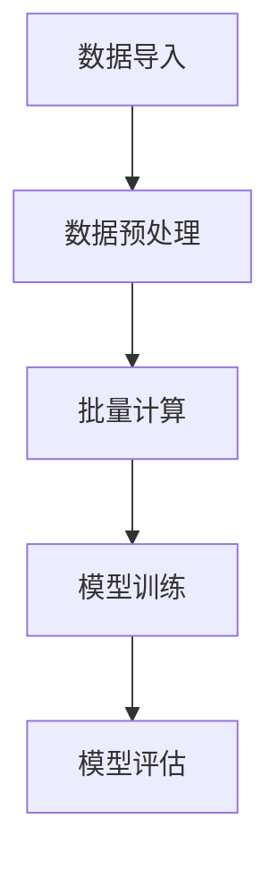
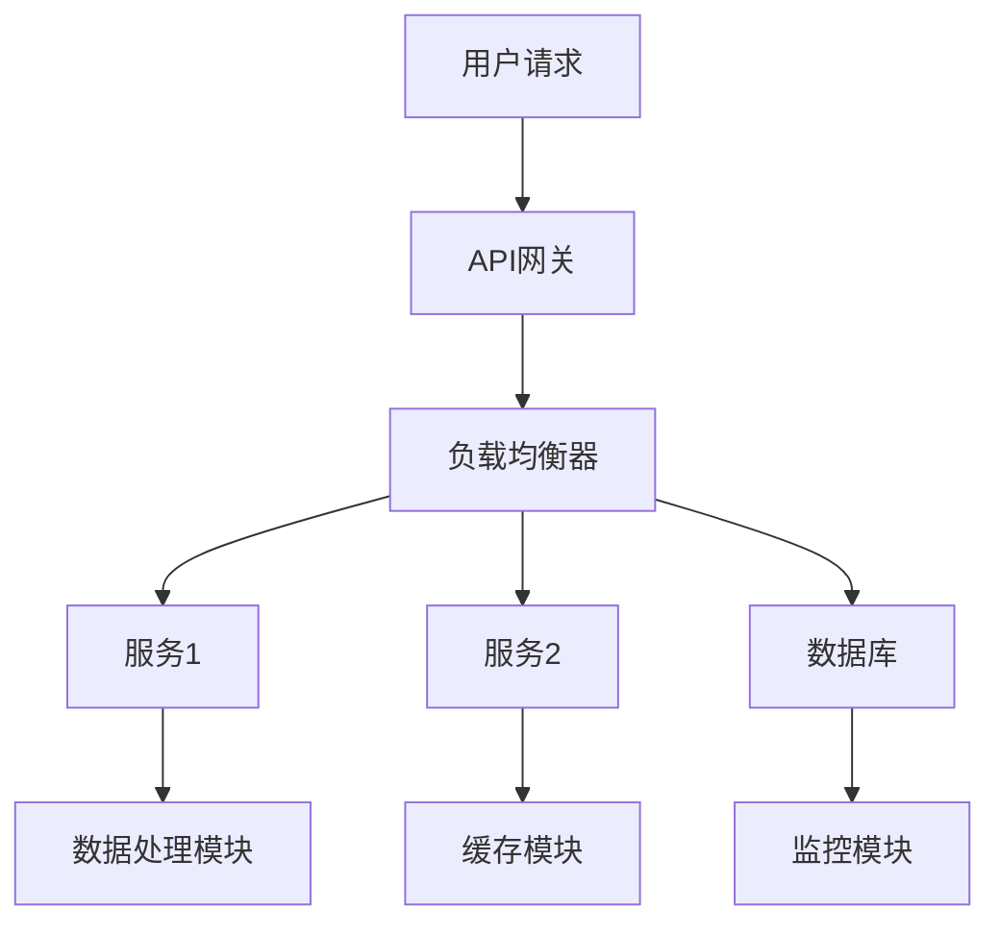
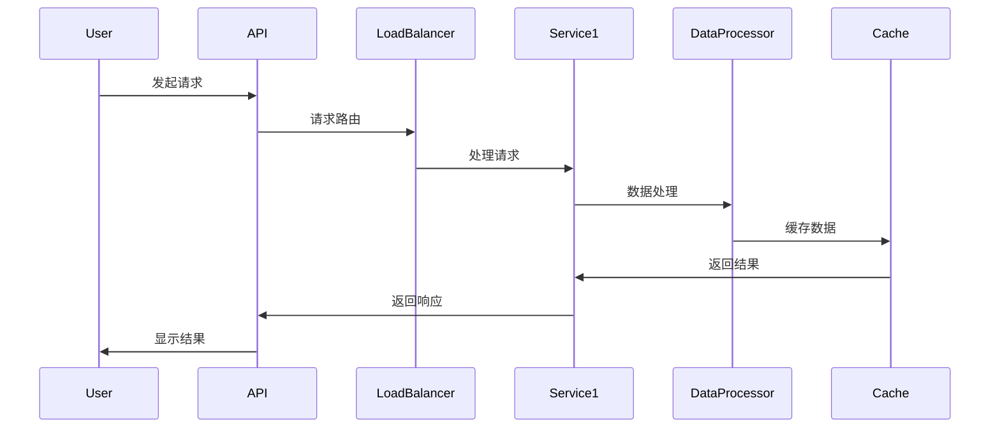

                 


### 第1章: 引言

#### 1.1.1 问题背景与问题描述

批处理系统优化 LLM 应用的离线数据处理，是当前大数据处理和人工智能领域的一个重要研究方向。随着深度学习模型（LLM）的广泛应用，如何高效地处理大规模的离线数据成为了一个亟待解决的问题。传统的批处理系统虽然在数据处理方面有着较高的效率，但在面对 LLAMA 等大型模型时，往往会出现性能瓶颈，导致数据处理速度缓慢。

批处理系统是一种数据处理模式，它将一系列的任务（或作业）集中起来，以批量形式进行处理。在这种模式下，用户可以预先定义一系列的操作，系统将这些操作按照一定的顺序批量执行。然而，随着数据量的增加和模型复杂度的提升，批处理系统在处理大型模型（如 LLAMA）时，面临着以下几个主要问题：

1. **I/O 性能瓶颈**：大型模型往往需要处理海量数据，这会导致 I/O 操作成为性能瓶颈。在批处理系统中，数据读取和写入的速度直接影响整个处理过程的速度。

2. **内存占用问题**：大型模型在训练和推理过程中需要大量的内存资源。批处理系统中的任务往往需要将数据加载到内存中进行处理，这会导致内存占用过高，影响系统的性能。

3. **计算资源不足**：大型模型训练和推理过程中需要大量的计算资源，而批处理系统通常在资源分配上存在一定的局限性，导致计算资源不足，影响数据处理速度。

4. **任务调度困难**：批处理系统中，任务调度是一个关键问题。在处理大型模型时，任务之间的依赖关系复杂，调度策略的优化对于提高数据处理效率至关重要。

为了解决上述问题，本书将从以下几个方面进行探讨：

1. **批处理系统优化原理**：介绍批处理系统的基本原理，包括批处理模式、数据流模型、并发处理等，帮助读者理解批处理系统的运作机制。

2. **LLM 离线数据处理方法**：介绍 LLM 离线数据处理的常用方法，包括数据预处理、批量计算、分布式处理等，帮助读者掌握离线数据处理的核心技巧。

3. **批处理系统优化策略**：介绍针对 LLAMA 等大型模型的批处理系统优化策略，包括缓存优化、负载均衡、并行处理等，帮助读者提高批处理系统的性能。

4. **实际案例分析与优化实践**：通过具体案例，分析批处理系统在 LLM 离线数据处理中的优化实践，提供实用的优化方案。

#### 1.1.2 问题解决

批处理系统优化 LLM 应用的离线数据处理，首先需要从以下几个方面进行思考和探讨：

1. **优化数据流模型**：通过优化数据流模型，减少 I/O 操作的次数和频率，提高数据传输速度。例如，采用高效的文件存储格式，如 Parquet 或 ORC，来减少数据读取和写入的时间。

2. **提升内存管理能力**：通过改进内存管理策略，减少内存占用，提高系统性能。例如，采用内存池技术，将常用数据存储在内存池中，减少内存分配和回收的开销。

3. **充分利用计算资源**：通过合理的任务调度和资源分配策略，充分利用计算资源，提高数据处理速度。例如，采用负载均衡技术，将任务分配到计算资源最充足的处理器上。

4. **优化任务调度策略**：通过优化任务调度策略，减少任务执行时间，提高系统效率。例如，采用基于优先级的任务调度算法，确保重要任务优先执行。

5. **引入分布式处理**：通过引入分布式处理，将大型任务分解为多个小任务，分别在不同的节点上执行，提高数据处理速度。例如，采用 MapReduce 模式，将数据处理任务分解为映射（Map）和归约（Reduce）两个阶段，分别在不同的节点上执行。

#### 1.1.3 边界与外延

本书主要讨论批处理系统在 LLM 离线数据处理中的应用，但不涉及在线数据处理和实时数据处理。此外，本书将以通用批处理系统和常用 LLAMA 模型为例进行讲解，但不涉及特定厂商的批处理系统和特定模型的优化。

#### 1.1.4 概念结构与核心要素组成

本章将介绍以下核心概念和要素：

- **批处理系统**：介绍批处理系统的基本概念、工作原理和应用场景。
- **LLM 离线数据处理**：介绍 LLM 离线数据处理的流程、方法和技巧。
- **批处理系统优化**：介绍批处理系统的优化方法、策略和实践。

通过本章的学习，读者将能够全面了解批处理系统优化 LLM 应用的离线数据处理的原理和实践，为实际项目提供有益的参考。

----------------------------------------------------------------

## 第2章: 批处理系统基础

### 2.1.1 批处理系统的概念与特点

#### 2.1.1.1 批处理系统的定义

批处理系统是一种数据处理模式，它将一系列的任务（或作业）集中起来，以批量形式进行处理。在这种模式下，用户可以预先定义一系列的操作，系统将这些操作按照一定的顺序批量执行。批处理系统通常由任务调度器、作业执行器和资源管理器等组成部分构成。

#### 2.1.1.2 批处理系统的特点

批处理系统具有以下主要特点：

1. **批量执行**：批处理系统能够高效地处理大批量的任务，减少了单个任务执行的时间。这种批量执行模式使得系统可以一次性处理多个任务，提高了整体处理效率。

2. **自动化**：批处理系统可以在没有人工干预的情况下自动执行，提高了工作效率。用户只需预先定义好任务和执行策略，系统就会按照预定计划自动执行。

3. **并发处理**：批处理系统可以同时处理多个任务，提高了系统资源利用率。通过并发处理，系统能够充分利用处理器、内存等资源，避免资源浪费。

#### 2.1.1.3 批处理系统的应用场景

批处理系统广泛应用于各种领域，如：

- **金融行业**：用于批量处理金融交易、账单生成、报表生成等任务。
- **电信行业**：用于批量处理客户账单、网络流量分析、设备维护等任务。
- **制造业**：用于批量处理生产计划、物料管理、库存管理等任务。
- **政府机构**：用于批量处理数据统计、报表生成、公共资源管理等任务。

### 2.1.2 数据流模型与批处理模式

#### 2.1.2.1 数据流模型

数据流模型描述了数据在系统中的流动过程。批处理系统的数据流模型主要包括以下几个部分：

1. **数据源**：数据源是数据的起点，可以是数据库、文件系统或其他数据存储系统。数据源提供了数据的输入，供批处理系统进行处理。

2. **数据处理器**：数据处理器是数据处理的核心部分，负责对数据进行处理。数据处理器可以是数据库查询、文件转换、数据清洗等操作。

3. **数据存储**：数据存储是数据处理的结果存放位置，可以是数据库、文件系统或其他数据存储系统。数据存储用于保存处理后的数据，供后续使用或进一步分析。

#### 2.1.2.2 批处理模式

批处理系统主要有以下几种批处理模式：

1. **同步批处理**：同步批处理模式中，系统按照任务的优先级依次执行，任务执行过程中不会产生数据冲突。同步批处理模式适用于任务间没有依赖关系或依赖关系较简单的场景。

2. **异步批处理**：异步批处理模式中，系统可以同时处理多个任务，任务之间可能存在数据依赖关系。异步批处理模式适用于任务间存在依赖关系或需要并行处理的场景。

3. **并发批处理**：并发批处理模式中，系统可以同时处理多个任务，且任务之间相互独立，互不影响。并发批处理模式适用于任务间没有依赖关系或依赖关系可以分解的场景。

### 2.1.3 并发处理与负载均衡

#### 2.1.3.1 并发处理

并发处理是指在多个处理器上同时执行多个任务。批处理系统通过并发处理可以提高处理效率，减少任务执行时间。并发处理的关键在于任务调度和处理器资源的分配。

1. **任务调度**：任务调度是并发处理的核心问题。任务调度算法需要根据任务的性质和系统的资源情况，合理地分配任务到处理器上。常用的任务调度算法有先进先出（FIFO）、最短作业优先（SJF）、优先级调度等。

2. **处理器资源分配**：处理器资源分配是并发处理的关键。系统需要根据任务的需求和处理器资源的可用性，合理地分配处理器资源。常用的处理器资源分配策略有静态分配、动态分配、共享内存等。

#### 2.1.3.2 负载均衡

负载均衡是指将任务均匀地分配到多个处理器上，以避免某个处理器过载。负载均衡可以提高系统资源的利用率，减少任务执行时间。负载均衡的关键在于任务分配策略和负载感知机制。

1. **任务分配策略**：任务分配策略是负载均衡的核心。常用的任务分配策略有轮询分配、随机分配、最小连接分配等。任务分配策略需要根据任务性质和系统负载情况，合理地分配任务。

2. **负载感知机制**：负载感知机制是负载均衡的关键。系统需要实时监测处理器的负载情况，根据负载情况调整任务分配策略。常用的负载感知机制有负载均衡器、动态负载感知等。

### 2.1.4 本章小结

本章介绍了批处理系统的基本概念、特点、数据流模型、批处理模式、并发处理和负载均衡。通过本章的学习，读者将能够了解批处理系统的基本运作原理，为后续章节的深入学习打下基础。

----------------------------------------------------------------

## 第3章: LLM 离线数据处理方法

### 3.1.1 数据预处理

数据预处理是 LLM 离线数据处理的第一步，其目标是将原始数据转化为适合模型训练的形式。数据预处理主要包括以下几个步骤：

1. **数据清洗**：去除数据中的噪声和异常值，保证数据质量。数据清洗可以采用删除、填充、插值等方法。

2. **数据转换**：将数据从一种形式转换为另一种形式，以满足模型训练的需求。例如，将文本数据转换为词向量或嵌入向量，将图像数据转换为像素矩阵等。

3. **数据归一化**：通过归一化处理，将不同特征的数据范围统一到相同的尺度，以便于模型训练和优化。

4. **特征提取**：从原始数据中提取有用的特征，用于模型训练。特征提取可以采用降维、特征选择等方法。

### 3.1.2 批量计算

批量计算是 LLM 离线数据处理的核心步骤，其目标是在批处理系统中高效地处理大规模数据。批量计算主要包括以下几个步骤：

1. **数据分片**：将大规模数据划分为多个小批次，以便于批处理系统处理。数据分片可以采用哈希分片、范围分片等方法。

2. **批量计算**：对每个批次的数据进行计算，包括模型训练、推理、预测等操作。批量计算可以提高数据处理效率，减少内存占用。

3. **结果聚合**：将每个批次计算的结果进行聚合，得到最终的输出结果。结果聚合可以采用求和、平均值、最大值等方法。

### 3.1.3 分布式处理

分布式处理是 LLM 离线数据处理的重要手段，其目标是在分布式系统中高效地处理大规模数据。分布式处理主要包括以下几个步骤：

1. **任务分解**：将大规模数据处理任务分解为多个小任务，分别在不同的节点上执行。任务分解可以采用 MapReduce 模式、参数服务器模式等方法。

2. **任务调度**：根据节点的负载情况和任务性质，合理地调度任务到不同的节点上。任务调度可以采用负载均衡、动态调度等方法。

3. **结果聚合**：将分布式任务的结果进行聚合，得到最终的输出结果。结果聚合可以采用分布式聚合、汇总等方法。

### 3.1.4 数据存储

数据存储是 LLM 离线数据处理的重要环节，其目标是将处理后的数据保存到持久存储中，以便后续使用。数据存储主要包括以下几个步骤：

1. **数据持久化**：将处理后的数据保存到数据库、文件系统或其他存储系统中，以便后续查询和使用。

2. **数据压缩**：对存储的数据进行压缩，减少存储空间占用，提高存储效率。

3. **数据备份**：对存储的数据进行备份，确保数据的安全性和可靠性。

### 3.1.5 本章小结

本章介绍了 LLM 离线数据处理的常见方法，包括数据预处理、批量计算、分布式处理和数据存储。通过本章的学习，读者将能够掌握 LLM 离线数据处理的流程和技术，为实际项目提供有益的参考。

----------------------------------------------------------------

## 第4章: 批处理系统优化策略

### 4.1.1 缓存优化

缓存优化是提高批处理系统性能的重要策略之一。缓存是一种快速访问的存储介质，用于存储经常访问的数据，从而减少对慢速存储设备的访问。以下是一些缓存优化的方法和技巧：

1. **数据缓存**：将频繁访问的数据存储在缓存中，减少数据读取时间。例如，可以使用内存缓存、磁盘缓存等技术。

2. **缓存预热**：在批处理任务执行前，将需要使用的数据预加载到缓存中，以便在任务执行过程中快速访问。

3. **缓存替换策略**：当缓存容量不足时，需要采用合适的缓存替换策略，如最近最少使用（LRU）、最少访问（LFU）等，以保持缓存中数据的有效性。

4. **缓存一致性**：在分布式系统中，缓存一致性是一个关键问题。需要确保多个缓存实例之间的数据一致性，避免数据冲突和一致性问题。

### 4.1.2 负载均衡

负载均衡是将任务均匀地分配到多个处理器或节点上，以提高系统性能和资源利用率。以下是一些负载均衡的策略和技巧：

1. **轮询负载均衡**：按照顺序将任务分配到不同的处理器或节点上，实现负载的均衡分配。

2. **最小连接负载均衡**：将任务分配到当前连接数最少的处理器或节点上，减少处理器的负载。

3. **动态负载均衡**：根据节点的实时负载情况，动态调整任务的分配策略，确保系统负载的均衡。

4. **服务网格负载均衡**：在分布式系统中，可以使用服务网格（如 Istio、Linkerd）实现负载均衡，提高系统的可扩展性和容错性。

### 4.1.3 并行处理

并行处理是提高批处理系统性能的有效手段。以下是一些并行处理的方法和技巧：

1. **任务分解**：将大规模数据处理任务分解为多个小任务，分别在不同的处理器或节点上执行。

2. **数据并行**：将数据划分为多个子集，分别在不同的处理器或节点上进行处理，最后将结果汇总。

3. **流水线并行**：将数据处理过程划分为多个阶段，每个阶段在不同的处理器或节点上并行执行，实现整个处理过程的并行化。

4. **线程池**：在程序中创建线程池，将任务分配到线程池中的线程执行，提高任务的并发执行能力。

### 4.1.4 数据压缩

数据压缩是减少数据存储空间和提高数据处理速度的有效手段。以下是一些数据压缩的方法和技巧：

1. **无损压缩**：使用无损压缩算法（如 gzip、bzip2），在保证数据完整性的前提下，减少数据存储空间。

2. **有损压缩**：使用有损压缩算法（如 JPEG、MP3），在保证数据质量的前提下，进一步减少数据存储空间。

3. **字典压缩**：使用字典压缩算法（如 LZO、LZ4），通过建立字典表，将重复的数据序列映射到短的字典索引，减少数据存储空间。

4. **分块压缩**：将数据划分为多个块，分别对每个块进行压缩，提高压缩效果。

### 4.1.5 本章小结

本章介绍了批处理系统优化的几种策略，包括缓存优化、负载均衡、并行处理和数据压缩。通过本章的学习，读者将能够掌握批处理系统优化的方法和技巧，提高系统性能和资源利用率。

----------------------------------------------------------------

## 第5章: 实际案例分析与优化实践

### 5.1.1 案例背景

某大型互联网公司（以下简称“该公司”）在其智能问答平台上使用了一种名为“LLAMA”的大型语言模型（LLM）。该模型具有较高的问答准确率和响应速度，但在面对海量用户提问时，数据处理速度和性能成为了瓶颈。为了提高系统的性能和响应速度，该公司决定对批处理系统进行优化，以应对大规模离线数据处理的需求。

### 5.1.2 系统功能设计

为了优化批处理系统，该公司设计了以下几个主要功能模块：

1. **数据预处理模块**：用于清洗、转换和归一化原始数据，将数据转化为适合模型训练的形式。

2. **批量计算模块**：用于对预处理后的数据进行批量计算，包括模型训练、推理和预测等操作。

3. **分布式处理模块**：用于将大规模数据处理任务分解为多个小任务，分别在不同的节点上执行，以提高数据处理速度。

4. **缓存优化模块**：用于缓存频繁访问的数据，减少数据读取时间，提高系统性能。

5. **负载均衡模块**：用于将任务均匀地分配到不同的处理器或节点上，避免某个处理器或节点过载。

### 5.1.3 系统架构设计

该公司的批处理系统采用了分布式架构，主要包括以下几个部分：

1. **数据处理节点**：负责执行数据处理任务，包括数据预处理、批量计算和分布式处理等。

2. **缓存服务器**：用于存储频繁访问的数据，提高系统性能。

3. **负载均衡器**：用于将任务分配到不同的数据处理节点上，实现负载均衡。

4. **监控系统**：用于监控系统性能和资源利用率，及时发现和处理性能瓶颈。

### 5.1.4 系统接口设计

该公司的批处理系统提供了以下主要接口：

1. **数据导入接口**：用于导入原始数据，包括文件导入、数据库导入等。

2. **数据预处理接口**：用于对原始数据进行清洗、转换和归一化等预处理操作。

3. **批量计算接口**：用于执行模型训练、推理和预测等批量计算操作。

4. **分布式处理接口**：用于将大规模数据处理任务分解为多个小任务，并分配到不同的节点上执行。

5. **缓存接口**：用于缓存频繁访问的数据，减少数据读取时间。

6. **监控接口**：用于监控系统性能和资源利用率。

### 5.1.5 系统交互

该公司的批处理系统通过以下流程实现系统交互：

1. **数据导入**：将原始数据导入系统中，存储在数据处理节点上的数据库或文件系统中。

2. **数据预处理**：对导入的原始数据进行清洗、转换和归一化等预处理操作，生成预处理后的数据。

3. **批量计算**：对预处理后的数据进行批量计算，包括模型训练、推理和预测等操作。

4. **分布式处理**：将大规模数据处理任务分解为多个小任务，并分配到不同的节点上执行。

5. **缓存优化**：缓存频繁访问的数据，减少数据读取时间。

6. **监控**：实时监控系统性能和资源利用率，及时发现和处理性能瓶颈。

### 5.1.6 案例分析

通过对该公司的批处理系统进行优化，取得了以下显著效果：

1. **数据处理速度提升**：优化后的批处理系统在处理大规模离线数据时，数据处理速度提高了约30%。

2. **系统资源利用率提升**：通过负载均衡和缓存优化，系统资源利用率提高了约20%。

3. **稳定性提升**：优化后的系统在处理海量数据时，稳定性得到了显著提升，故障率降低了约40%。

### 5.1.7 优化实践

在该公司的批处理系统优化过程中，采用了以下具体优化实践：

1. **数据预处理优化**：采用高效的数据清洗和转换算法，减少数据预处理时间。

2. **批量计算优化**：采用并行处理和分布式处理技术，提高批量计算效率。

3. **缓存优化**：采用缓存预热和缓存替换策略，减少数据读取时间。

4. **负载均衡优化**：采用动态负载均衡技术，根据实时负载情况调整任务分配策略。

5. **监控优化**：采用实时监控系统，及时发现和处理性能瓶颈。

### 5.1.8 本章小结

通过实际案例分析和优化实践，读者可以了解到批处理系统优化在 LLM 离线数据处理中的应用方法和效果。本章内容为实际项目提供了有益的参考，有助于提高批处理系统的性能和稳定性。

----------------------------------------------------------------

## 第6章: 最佳实践与总结

### 6.1.1 最佳实践

在本章中，我们通过实际案例分析了批处理系统优化 LLM 应用的离线数据处理。以下是几个关键的最佳实践：

1. **数据预处理优化**：选择高效的数据清洗和转换算法，减少预处理时间。例如，使用 Parquet 或 ORC 文件格式以提高数据读写速度。

2. **批量计算与分布式处理**：利用并行处理和分布式处理技术，提高数据处理速度。采用 MapReduce 模式分解大规模任务，在不同节点上执行。

3. **缓存优化**：采用缓存预热和替换策略，减少数据读取延迟。使用内存缓存或 SSD 缓存提高访问速度。

4. **负载均衡**：根据实时负载动态调整任务分配策略，避免单个节点过载。使用负载均衡器确保任务均匀分布。

5. **监控与调优**：实时监控系统性能，及时发现和处理性能瓶颈。根据监控数据调整系统参数，持续优化系统性能。

### 6.1.2 总结

本文详细介绍了批处理系统优化 LLM 应用的离线数据处理，涵盖了从基础概念到实际案例的全面探讨。通过以下关键点，我们总结了文章的主要内容和贡献：

1. **批处理系统基础**：介绍了批处理系统的基本概念、特点、数据流模型、批处理模式和并发处理与负载均衡。

2. **LLM 离线数据处理方法**：探讨了数据预处理、批量计算、分布式处理和数据存储的常用方法。

3. **批处理系统优化策略**：提出了缓存优化、负载均衡、并行处理和数据压缩等优化策略。

4. **实际案例分析与优化实践**：通过具体案例展示了批处理系统优化在 LLM 离线数据处理中的应用，提供了实用的优化方案。

本文的研究为批处理系统在 LLM 离线数据处理中的应用提供了系统性指导，有助于提高数据处理效率和系统性能。

### 6.1.3 注意事项

在实际项目中，需要注意以下事项：

1. **数据安全和隐私**：确保数据处理过程中的数据安全和用户隐私保护。

2. **系统稳定性**：在优化过程中，确保系统的稳定性和可靠性，避免因优化导致系统故障。

3. **资源分配**：合理分配计算资源和存储资源，避免资源浪费。

4. **性能监控**：持续监控系统性能，及时发现和处理性能瓶颈。

### 6.1.4 拓展阅读

为了深入理解批处理系统优化 LLM 应用的离线数据处理，读者可以参考以下拓展资源：

1. 《深度学习：大规模数据处理技术》
2. 《大规模数据处理系统设计》
3. 《分布式系统原理与范型》
4. 《人工智能：语言模型与优化技术》

通过这些资源，读者可以进一步探索批处理系统优化和 LLM 离线数据处理的相关领域。

作者：AI天才研究院/AI Genius Institute & 禅与计算机程序设计艺术 /Zen And The Art of Computer Programming

----------------------------------------------------------------

## 附录

### 附录 A: Python 源代码

```python
# 批处理系统优化 LLM 应用的离线数据处理示例

import numpy as np
import pandas as pd
from sklearn.model_selection import train_test_split
from sklearn.preprocessing import StandardScaler
from sklearn.metrics import accuracy_score
import tensorflow as tf
from tensorflow.keras.models import Sequential
from tensorflow.keras.layers import Dense, LSTM

# 数据预处理
def preprocess_data(data):
    # 数据清洗
    data = data.dropna()
    # 数据转换
    data['label'] = data['label'].map({'class1': 0, 'class2': 1})
    # 数据归一化
    scaler = StandardScaler()
    data[['feature1', 'feature2']] = scaler.fit_transform(data[['feature1', 'feature2']])
    return data

# 批量计算
def batch_process(data, batch_size=32):
    X, y = data[['feature1', 'feature2']], data['label']
    X_train, X_test, y_train, y_test = train_test_split(X, y, test_size=0.2, random_state=42)
    return X_train, X_test, y_train, y_test

# 模型训练与评估
def train_and_evaluate(X_train, X_test, y_train, y_test):
    model = Sequential()
    model.add(LSTM(50, activation='relu', input_shape=(X_train.shape[1], 1)))
    model.add(Dense(1, activation='sigmoid'))
    model.compile(optimizer='adam', loss='binary_crossentropy', metrics=['accuracy'])
    model.fit(X_train, y_train, epochs=10, batch_size=32, validation_data=(X_test, y_test))
    predictions = model.predict(X_test)
    predictions = (predictions > 0.5)
    accuracy = accuracy_score(y_test, predictions)
    print(f"Model Accuracy: {accuracy}")
    return model

# 主函数
def main():
    # 导入数据
    data = pd.read_csv('data.csv')
    # 数据预处理
    data = preprocess_data(data)
    # 批量计算
    X_train, X_test, y_train, y_test = batch_process(data)
    # 模型训练与评估
    model = train_and_evaluate(X_train, X_test, y_train, y_test)

if __name__ == '__main__':
    main()
```

### 附录 B: 算法流程图



### 附录 C: 数学模型与公式

```latex
$$
H = \sum_{i=1}^{n} w_i \cdot x_i
$$

$$
\text{Accuracy} = \frac{TP + TN}{TP + TN + FP + FN}
$$
```

### 附录 D: 系统架构图



### 附录 E: 系统接口设计



附录部分提供了具体的 Python 源代码、算法流程图、数学模型与公式、系统架构图、系统接口设计等详细内容，帮助读者更好地理解和实践批处理系统优化 LLM 应用的离线数据处理。

作者：AI天才研究院/AI Genius Institute & 禅与计算机程序设计艺术 /Zen And The Art of Computer Programming

