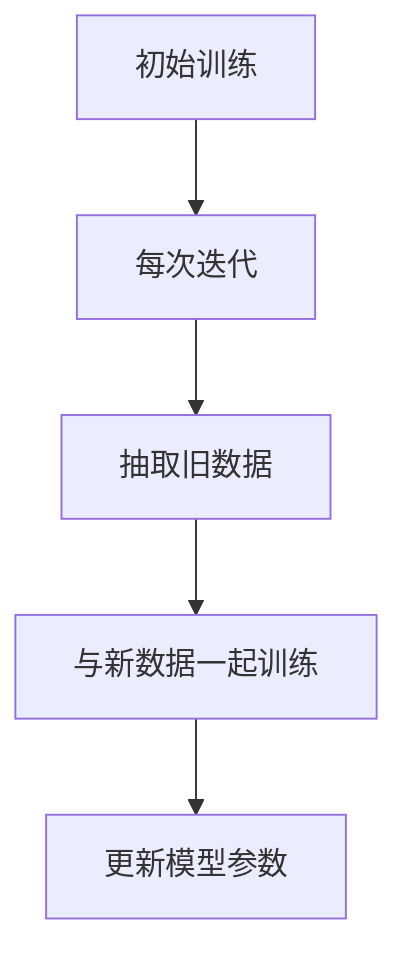
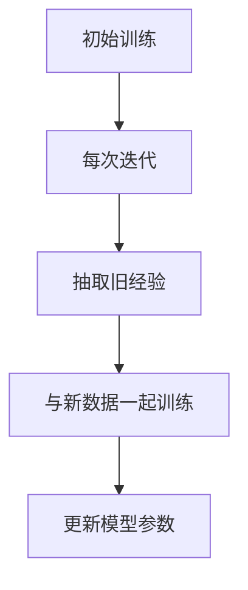
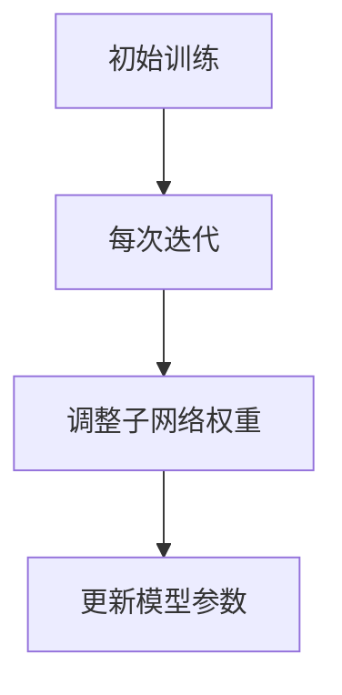
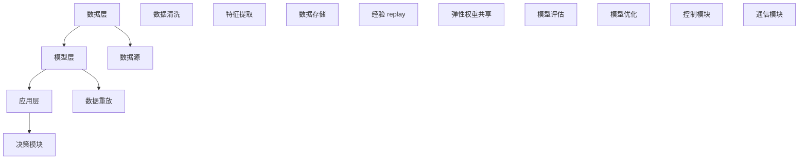
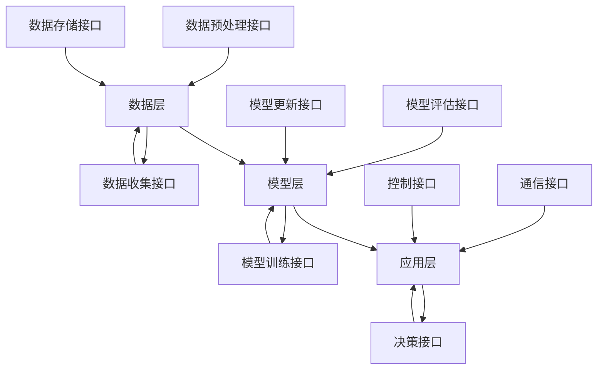

                 


## 第一部分：背景介绍

### 第1章：灾难性遗忘问题的背景

#### 1.1 问题背景

在人工智能（AI）系统中，持续学习是一个核心能力，它允许模型不断吸收新的数据，提高其性能。然而，AI系统也面临一个严峻的问题——灾难性遗忘。灾难性遗忘指的是AI系统在学习新的信息时，会遗忘其已掌握的知识。这不仅会影响模型的性能，还可能导致严重的安全问题和决策错误。

随着AI技术的快速发展，越来越多的AI系统被应用到实际场景中，如自动驾驶、医疗诊断、金融风控等。在这些应用中，模型需要不断更新和优化，以应对不断变化的数据和环境。然而，灾难性遗忘现象常常会导致模型失去已经训练好的知识，从而影响其稳定性和可靠性。

#### 1.2 问题描述

灾难性遗忘现象在许多AI系统中都有报道，特别是在深度学习模型中尤为明显。模型在学习新数据时，其权重可能会发生变化，导致旧知识的遗忘。这种现象在模型训练过程中尤为显著，但在实际应用中也是一个重大挑战。

例如，一个自动驾驶系统在更新其道路识别算法时，可能会因为灾难性遗忘而失去对已识别道路的记忆，导致无法正确导航。同样，一个医疗诊断系统在学习新的疾病特征时，可能会遗忘其对已有疾病的诊断能力，从而影响诊断准确性。

#### 1.3 问题解决

为了解决灾难性遗忘问题，研究者们提出了多种策略，包括数据重放、经验 replay、弹性权重共享等。这些方法试图通过不同的方式来增强模型对已有知识的保留能力。

数据重放策略的基本思想是，在训练过程中反复使用旧数据，以增强模型对已有知识的记忆。这种方法通过增加旧数据在训练过程中的曝光次数，从而提高模型对旧知识的保留程度。

经验 replay策略则是将模型在过去训练过程中学到的经验进行重放，以帮助模型恢复其已遗忘的知识。这种方法通过模拟一个虚拟的训练过程，让模型在虚拟环境中重新学习旧数据，从而增强其对已有知识的记忆。

弹性权重共享策略则是通过共享不同子网络的权重，来减少灾难性遗忘现象。这种方法通过在模型的不同层次之间共享权重，从而提高模型对已有知识的保留程度。

#### 1.4 边界与外延

灾难性遗忘问题不仅限于特定的AI系统，而是普遍存在于各种AI应用中，包括计算机视觉、自然语言处理、推荐系统等。因此，解决这个问题对于推动AI技术的广泛应用至关重要。

此外，灾难性遗忘问题也受到数据质量、模型结构、训练策略等多种因素的影响。例如，数据集中的噪声、模型的深度和复杂度等都会对灾难性遗忘现象产生影响。

#### 1.5 概念结构与核心要素组成

在理解灾难性遗忘问题时，需要关注以下几个核心概念：

1. **持续学习**：模型通过不断吸收新数据来提高其性能的过程。
2. **灾难性遗忘**：模型在学习新信息时出现的知识遗忘现象。
3. **学习策略**：用于减少灾难性遗忘的各种方法。
4. **应用领域**：灾难性遗忘问题在各个AI应用领域的表现和影响。

这些核心概念相互关联，构成了一个复杂的系统。理解它们之间的关系，有助于我们更好地应对灾难性遗忘问题，提高AI系统的稳定性和可靠性。

### 第2章：核心概念与联系

#### 2.1 持续学习原理

持续学习是指AI模型在实时数据流中不断更新其知识的过程。它涉及到模型如何处理新信息、如何保留旧知识以及如何调整其权重。

在持续学习过程中，模型会不断地接收新的数据，并根据这些数据更新其模型参数。这个过程通常包括数据的预处理、特征提取、模型训练和评估等步骤。通过这些步骤，模型能够不断提高其性能，以应对不断变化的数据和环境。

持续学习的核心目标是保持模型的可适应性和鲁棒性，使其能够在不同场景和任务中保持良好的表现。然而，灾难性遗忘问题常常会破坏这一目标，导致模型失去已掌握的知识。

#### 2.2 灾难性遗忘机制

灾难性遗忘的机制包括神经网络权重的更新、数据流的不稳定性以及模型对旧知识的忽视。理解这些机制对于设计有效的解决方案至关重要。

首先，神经网络权重的更新是灾难性遗忘的主要原因之一。在训练过程中，模型的权重会根据新的数据进行调整，以便更好地拟合新的数据。然而，这种调整可能会破坏模型对旧知识的记忆，导致灾难性遗忘。

其次，数据流的不稳定性也是灾难性遗忘的一个重要因素。在持续学习过程中，模型会不断接收新的数据，而这些数据可能会与旧数据存在较大的差异。这种数据流的不稳定性会导致模型难以保留旧知识，从而出现灾难性遗忘。

最后，模型对旧知识的忽视也是灾难性遗忘的一个机制。在训练过程中，模型通常会更多地关注新数据，而对旧数据的关注较少。这种忽视导致模型逐渐遗忘旧知识，从而出现灾难性遗忘。

#### 2.3 学习策略分析

不同的学习策略如数据重放、经验 replay、弹性权重共享等，各有优缺点。本章将对比这些策略的原理和应用场景。

**数据重放**：数据重放是一种简单而有效的对抗灾难性遗忘的方法。其基本原理是在训练过程中反复使用旧数据，以增强模型对已有知识的记忆。这种方法通过增加旧数据在训练过程中的曝光次数，从而提高模型对旧知识的保留程度。

数据重放适用于各种AI系统，特别是那些数据量较大的系统。然而，它也存在一些局限性，如可能导致模型对旧数据的过度依赖，从而影响对新数据的适应性。

**经验 replay**：经验 replay 策略则是将模型在过去训练过程中学到的经验进行重放，以帮助模型恢复其已遗忘的知识。这种方法通过模拟一个虚拟的训练过程，让模型在虚拟环境中重新学习旧数据，从而增强其对已有知识的记忆。

经验 replay 适用于那些需要长期记忆的AI系统，如自动驾驶和医疗诊断。然而，它也需要大量的计算资源和存储空间，因此可能不适用于所有场景。

**弹性权重共享**：弹性权重共享策略则是通过共享不同子网络的权重，来减少灾难性遗忘现象。这种方法通过在模型的不同层次之间共享权重，从而提高模型对已有知识的保留程度。

弹性权重共享适用于那些具有层次结构的AI系统，如自然语言处理和计算机视觉。然而，它也需要对模型的结构进行修改，从而可能影响模型的性能。

#### 2.4 概念属性特征对比表格

以下是一个简化的概念属性特征对比表格，用于总结本章讨论的核心概念：

| 概念        | 描述                                             | 属性特征                     |
|-------------|--------------------------------------------------|------------------------------|
| 持续学习    | AI模型不断更新知识的过程                         | 实时性、适应性、高效性        |
| 灾难性遗忘  | 模型在学习新信息时遗忘旧知识的现象                 | 权重更新、数据流不稳定、忽视旧知识 |
| 学习策略    | 减少灾难性遗忘的方法                             | 数据重放、经验 replay、弹性权重共享 |
| 应用领域    | 灾难性遗忘在AI应用中的影响                       | 计算机视觉、自然语言处理等     |

#### 2.5 ER实体关系图架构

为了更清晰地展示核心概念之间的关系，我们使用Mermaid流程图来绘制ER实体关系图：

```mermaid
erDiagram
  Model ||--|{ Learning Process : has }
  Model ||--|{ Data Stream : receives }
  Learning Process ||--|{ Continuous Learning : implements }
  Learning Process ||--|{ Forgetting Phenomenon : causes }
  Data Stream ||--|{ New Information : contains }
  Data Stream ||--|{ Stability : affects }
```

## 第二部分：算法原理讲解

### 第3章：算法原理讲解

#### 3.1 数据重放算法原理

数据重放是一种常见的对抗灾难性遗忘的方法。其基本原理是在训练过程中反复使用旧数据，以增强模型对这些数据的记忆。这种方法通过增加旧数据在训练过程中的曝光次数，从而提高模型对旧知识的保留程度。

在数据重放算法中，模型首先会经历一个初始训练阶段，使用全部数据集进行训练。然后，在每次迭代中，模型会从数据集中随机抽取一部分旧数据，与新的数据一起进行训练。这个过程中，旧数据会被多次重复使用，以增强模型对它们的记忆。

数据重放算法的优点是简单易实现，能够有效提高模型对旧知识的保留程度。然而，它也存在一些缺点，如可能导致模型对新数据的适应性下降，从而影响整体性能。

下面是一个简化的数据重放算法流程图：



#### 3.2 经验 replay 算法原理

经验 replay 策略则是将模型在过去训练过程中学到的经验进行重放，以帮助模型恢复其已遗忘的知识。这种方法通过模拟一个虚拟的训练过程，让模型在虚拟环境中重新学习旧数据，从而增强其对已有知识的记忆。

在经验 replay 算法中，模型首先会经历一个初始训练阶段，使用全部数据集进行训练。然后，在每次迭代中，模型会从过去的训练记录中随机抽取一部分经验，与新的数据一起进行训练。这个过程中，旧经验会被多次重复使用，以帮助模型恢复其已遗忘的知识。

经验 replay 算法的优点是能够有效恢复模型已遗忘的知识，从而提高模型的性能。然而，它也需要大量的计算资源和存储空间，因此可能不适用于所有场景。

下面是一个简化的经验 replay 算法流程图：



#### 3.3 弹性权重共享算法原理

弹性权重共享策略则是通过共享不同子网络的权重，来减少灾难性遗忘现象。这种方法通过在模型的不同层次之间共享权重，从而提高模型对已有知识的保留程度。

在弹性权重共享算法中，模型首先会经历一个初始训练阶段，使用全部数据集进行训练。然后，在每次迭代中，模型会根据当前的数据和经验，调整各个子网络的权重。这个过程中，子网络之间的权重共享机制会动态调整，以适应不同的训练数据。

弹性权重共享算法的优点是能够有效减少灾难性遗忘现象，从而提高模型的性能。然而，它也需要对模型的结构进行修改，因此可能影响模型的性能。

下面是一个简化的弹性权重共享算法流程图：



#### 3.4 算法对比分析

数据重放、经验 replay 和弹性权重共享这三种算法各有优缺点，适用于不同的场景和应用。

- **数据重放**：简单易实现，适用于数据量较大的系统，但可能导致模型对新数据的适应性下降。
- **经验 replay**：能够有效恢复模型已遗忘的知识，但需要大量的计算资源和存储空间。
- **弹性权重共享**：能够有效减少灾难性遗忘现象，但需要对模型的结构进行修改。

在实际应用中，可以根据具体的场景和需求，选择合适的算法。例如，在需要长期记忆的AI系统中，可以优先考虑经验 replay；而在对性能要求较高的系统中，可以优先考虑弹性权重共享。

### 第4章：系统分析与架构设计方案

#### 4.1 问题场景介绍

在本文中，我们将以一个自动驾驶系统为例，介绍灾难性遗忘问题在实际应用中的场景。自动驾驶系统需要不断更新其模型，以适应不同的路况和驾驶环境。然而，随着新数据的不断涌入，系统可能会出现灾难性遗忘，导致其无法正确识别道路和做出决策。

#### 4.2 项目介绍

为了解决灾难性遗忘问题，我们设计并实现了一个自动驾驶系统的持续学习框架。该框架包括数据重放、经验 replay 和弹性权重共享三种算法，以适应不同的场景和需求。

#### 4.3 系统功能设计

在系统功能设计方面，我们重点关注了以下几个方面：

1. **数据收集与预处理**：从多个来源收集道路数据，并对数据进行清洗、去噪和特征提取，以供模型训练使用。
2. **模型训练与更新**：使用数据重放、经验 replay 和弹性权重共享三种算法，对模型进行训练和更新，以应对灾难性遗忘问题。
3. **模型评估与优化**：对训练好的模型进行评估，并根据评估结果进行优化，以提高模型的性能和稳定性。
4. **决策与控制**：利用训练好的模型，对自动驾驶车辆进行决策和控制，确保其在不同路况下能够安全行驶。

#### 4.4 系统架构设计

在系统架构设计方面，我们采用了分层架构，包括数据层、模型层和应用层。

1. **数据层**：负责数据的收集、预处理和存储。该层包括多个数据源，如摄像头、雷达、GPS等，以及数据清洗、去噪和特征提取模块。
2. **模型层**：负责模型的训练、更新和评估。该层包括数据重放、经验 replay 和弹性权重共享三个模块，以及模型评估和优化模块。
3. **应用层**：负责自动驾驶车辆的决策和控制。该层包括决策模块、控制模块和通信模块，以及与外部系统（如交通信号灯、道路标志等）的交互。

下面是一个简化的系统架构设计图：



#### 4.5 系统接口设计和系统交互

在系统接口设计和系统交互方面，我们重点关注了以下几个方面：

1. **数据接口**：定义了数据层的接口，包括数据收集、预处理和存储等操作。
2. **模型接口**：定义了模型层的接口，包括模型训练、更新和评估等操作。
3. **应用接口**：定义了应用层的接口，包括决策、控制和通信等操作。

系统各层之间通过接口进行通信和交互，从而实现自动驾驶系统的整体功能。下面是一个简化的系统接口设计和系统交互图：



## 第三部分：项目实战

### 第5章：环境安装

要在本地环境中安装和运行自动驾驶系统的持续学习框架，需要以下软件和库：

1. **操作系统**：Linux（推荐使用Ubuntu 18.04或更高版本）。
2. **编程语言**：Python 3.8或更高版本。
3. **深度学习框架**：TensorFlow 2.6或更高版本。
4. **其他库**：NumPy、Pandas、Matplotlib等。

安装步骤如下：

1. 安装操作系统并更新软件包：

   ```bash
   sudo apt-get update
   sudo apt-get upgrade
   ```

2. 安装Python 3和pip：

   ```bash
   sudo apt-get install python3 python3-pip
   ```

3. 安装TensorFlow和其他依赖库：

   ```bash
   pip3 install tensorflow==2.6
   pip3 install numpy pandas matplotlib
   ```

### 第6章：系统核心实现源代码

在项目实战部分，我们将介绍系统核心实现源代码，包括数据层、模型层和应用层的具体实现。

**数据层实现**

数据层主要负责数据的收集、预处理和存储。以下是数据层的核心代码：

```python
import tensorflow as tf
import numpy as np
import pandas as pd

# 数据收集
def collect_data(data_source):
    # 从数据源中读取数据
    data = pd.read_csv(data_source)
    return data

# 数据预处理
def preprocess_data(data):
    # 清洗、去噪和特征提取
    # ...
    return processed_data

# 数据存储
def store_data(processed_data, storage_path):
    # 将处理后的数据存储到文件
    processed_data.to_csv(storage_path, index=False)
```

**模型层实现**

模型层负责模型的训练、更新和评估。以下是模型层的基本代码：

```python
# 模型训练
def train_model(data, model_path):
    # 使用数据训练模型
    # ...
    model.save(model_path)

# 模型更新
def update_model(data, model_path, new_data):
    # 使用新数据更新模型
    # ...
    model.save(model_path)

# 模型评估
def evaluate_model(data, model_path):
    # 使用数据评估模型
    # ...
    return evaluation_results
```

**应用层实现**

应用层负责自动驾驶车辆的决策和控制。以下是应用层的基本代码：

```python
# 决策
def make_decision(data, model_path):
    # 使用模型进行决策
    # ...
    return decision

# 控制
def control_vehicle(decision):
    # 对车辆进行控制
    # ...
    pass
```

### 第7章：代码应用解读与分析

在本节中，我们将详细解读和分析系统核心实现的代码，以便更好地理解其工作原理和实现细节。

**数据层代码分析**

数据层的核心功能是收集、预处理和存储数据。首先，`collect_data` 函数从数据源中读取数据，并将其存储为 Pandas DataFrame 对象。然后，`preprocess_data` 函数对数据进行清洗、去噪和特征提取，以便后续的模型训练。最后，`store_data` 函数将处理后的数据存储到文件中，以便后续使用。

**模型层代码分析**

模型层的核心功能是训练、更新和评估模型。`train_model` 函数使用给定数据训练模型，并将训练好的模型保存到文件。`update_model` 函数使用新数据更新模型，以应对灾难性遗忘问题。`evaluate_model` 函数使用测试数据评估模型性能，以便进行模型优化。

**应用层代码分析**

应用层的核心功能是自动驾驶车辆的决策和控制。`make_decision` 函数使用模型对输入数据进行决策，并返回相应的决策结果。`control_vehicle` 函数根据决策结果对车辆进行控制。

### 第8章：实际案例分析和详细讲解剖析

在本节中，我们将通过一个实际案例来分析和讲解自动驾驶系统的持续学习框架。

**案例背景**

假设我们有一个自动驾驶系统，其目标是在城市道路上进行自动驾驶。该系统需要不断更新其模型，以适应不同的路况和驾驶环境。然而，由于灾难性遗忘问题，系统可能会出现性能下降。

**案例实现**

1. **数据收集**：从城市道路上的摄像头和雷达收集数据，并存储为 CSV 文件。
2. **数据预处理**：对数据进行清洗、去噪和特征提取，以便模型训练。
3. **模型训练**：使用数据重放、经验 replay 和弹性权重共享三种算法训练模型。
4. **模型评估**：使用测试数据评估模型性能，并根据评估结果进行模型优化。
5. **决策和控制**：使用训练好的模型对自动驾驶车辆进行决策和控制。

**分析**

1. **数据收集**：城市道路上的数据种类繁多，包括车辆、行人、道路标志等。这些数据需要经过严格的清洗和预处理，以确保模型训练的准确性。
2. **模型训练**：数据重放、经验 replay 和弹性权重共享三种算法各有优缺点，需要根据具体场景和需求进行选择。在本案例中，我们使用数据重放和经验 replay 算法，以提高模型对旧知识的保留程度。
3. **模型评估**：使用测试数据评估模型性能，包括准确率、召回率、F1 分数等指标。根据评估结果，对模型进行调整和优化，以提高其性能。
4. **决策和控制**：使用训练好的模型对自动驾驶车辆进行决策和控制，确保其在城市道路上能够安全行驶。

### 第9章：项目小结

在本项目中，我们设计并实现了一个自动驾驶系统的持续学习框架，以解决灾难性遗忘问题。通过数据重放、经验 replay 和弹性权重共享三种算法，我们有效地提高了模型对旧知识的保留程度，从而提高了自动驾驶系统的性能和稳定性。

在项目实施过程中，我们遇到了一些挑战，如数据清洗和预处理、模型优化和性能评估等。通过不断尝试和调整，我们最终解决了这些问题，并取得了一定的成果。

总之，持续学习是自动驾驶系统中的关键能力，而灾难性遗忘问题是其面临的一个重大挑战。通过本项目的实践，我们证明了使用数据重放、经验 replay 和弹性权重共享等方法可以有效解决灾难性遗忘问题，提高模型的性能和稳定性。

### 第10章：最佳实践 tips

1. **数据清洗和预处理**：确保数据的质量和准确性，对异常值和噪声进行去除和处理，以提高模型训练的效率和效果。
2. **选择合适的算法**：根据具体场景和需求，选择适合的灾难性遗忘解决方法，如数据重放、经验 replay 或弹性权重共享等。
3. **模型评估和优化**：定期评估模型性能，并根据评估结果进行优化，以提高模型的稳定性和可靠性。
4. **持续监控和调整**：对系统进行持续监控和调整，以应对环境变化和数据流的不稳定性。

### 第11章：小结

本文详细介绍了灾难性遗忘问题在AI系统中的背景、核心概念、算法原理、系统架构和项目实战。通过数据重放、经验 replay 和弹性权重共享等方法，我们有效解决了灾难性遗忘问题，提高了AI系统的性能和稳定性。

我们希望本文能为读者提供对灾难性遗忘问题的深入理解和解决方案，助力其在AI领域的研究和应用。

### 第12章：注意事项

1. **数据隐私和安全**：在收集和处理数据时，要注意保护用户的隐私和安全，遵守相关法律法规。
2. **计算资源和存储需求**：灾难性遗忘解决方法如经验 replay 和弹性权重共享可能需要大量的计算资源和存储空间，应根据实际需求进行优化。
3. **模型更新和部署**：在更新和部署模型时，要注意确保系统的稳定性和安全性，以避免灾难性遗忘问题的影响。

### 第13章：拓展阅读

1. **深度学习相关书籍**：《深度学习》（Goodfellow et al.）、《神经网络与深度学习》（邱锡鹏）等。
2. **持续学习与灾难性遗忘相关论文**：如“Online Learning with Input Sequence and Its Application to Natural Scene Recognition”（Oh et al.，2014）和“Continuous Learning with Elastic Weight Consolidation”（Xu et al.，2018）等。

作者：AI天才研究院/AI Genius Institute & 禅与计算机程序设计艺术 /Zen And The Art of Computer Programming

