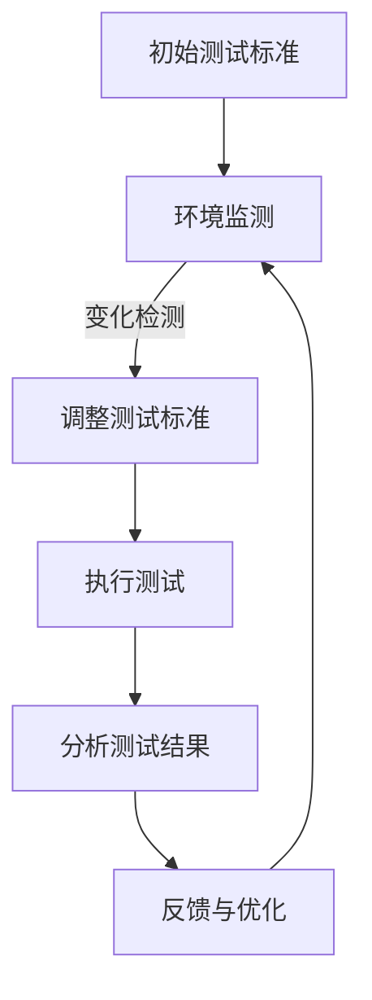
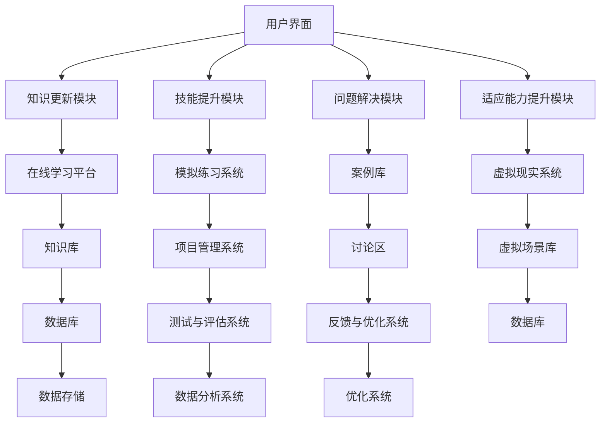
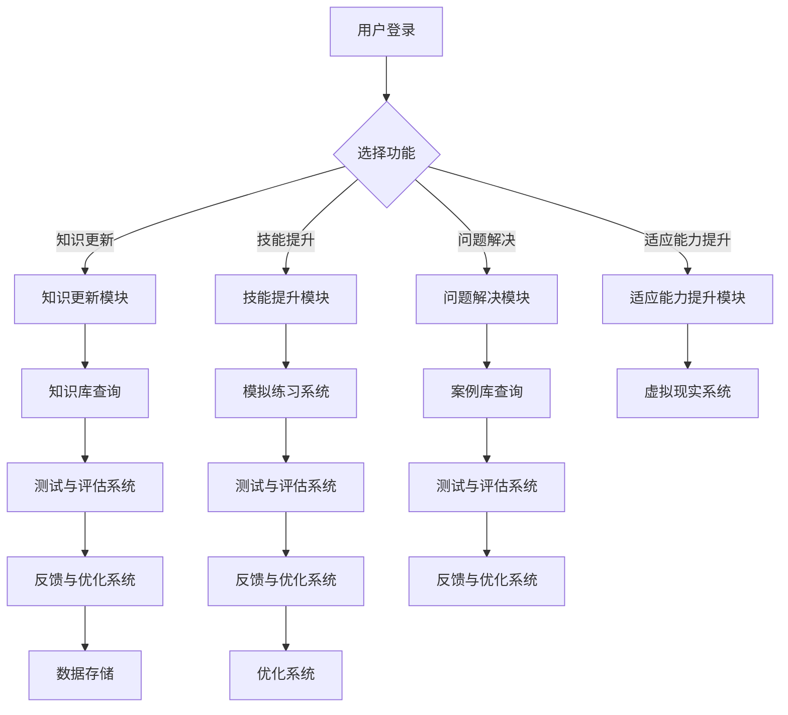

                 


### 引言与背景

#### 1.1 书籍概述

**持续学习的重要性**

在信息技术飞速发展的今天，持续学习已成为个人和组织的核心竞争力。持续学习不仅关乎个人的职业发展，也关系到组织的创新与竞争力。持续学习能力评估则是这一过程中不可或缺的一环。本书旨在深入探讨持续学习能力评估的理论基础、方法与实践，并通过具体案例分析，为读者提供一套实用的评估体系。

**书籍目的与结构**

本书的主要目的是帮助读者理解持续学习能力评估的内涵与外延，掌握评估指标体系构建与应用方法，了解测试模型自我更新的机制与实践。全书分为五大部分：

- **第一部分：引言与背景**，介绍持续学习的重要性、书籍目的与结构、持续学习能力的概念、测试模型自我更新的必要性及书籍目标读者。
- **第二部分：核心理论**，详细阐述持续学习的基本理论、评估指标体系构建、测试模型自我更新机制及其与持续学习的关系。
- **第三部分：案例分析**，通过具体案例研究，展示持续学习与自我更新在人工智能、教育领域和企业信息化中的应用。
- **第四部分：方法与实践**，介绍自我更新模型的构建方法、测试模型自我更新策略、实施步骤与流程，并总结最佳实践。
- **第五部分：未来展望**，分析持续学习能力的发展趋势、自我更新模型的发展前景及未来研究方向与建议。

#### 1.2 持续学习能力的概念

**定义与背景**

持续学习能力是指个体或组织在变化的环境中，持续获取新知识、技能和态度，适应新环境、解决问题和实现目标的能力。它不仅包括知识的获取与更新，还包括技能的习得与改进，以及态度的转变与适应。

在信息技术领域，持续学习能力尤为重要。随着技术的快速更新迭代，开发者和研究者必须不断学习新技术、新工具，以保持竞争力。此外，企业的持续创新能力也依赖于员工的持续学习能力。

**持续学习的要素**

持续学习能力的构成主要包括以下几个要素：

- **知识更新能力**：个体或组织获取、吸收和应用新知识的能力。
- **技能提升能力**：个体或组织通过实践和训练提高技能水平的能力。
- **问题解决能力**：个体或组织在面对复杂问题时，分析问题、制定解决方案并实施的能力。
- **适应能力**：个体或组织在变化的环境中调整和适应的能力。
- **创新能力**：个体或组织在现有知识和技能基础上，提出新观点、新方案、新方法的能力。

#### 1.3 测试模型自我更新的必要性

**传统测试模型的局限性**

传统测试模型通常基于固定的测试标准和流程，难以适应快速变化的技术环境。以下是其局限性：

- **测试标准固定**：传统测试模型往往依赖于固定的测试标准和流程，难以适应新技术、新工具的出现。
- **测试效率低**：传统测试方法依赖于人工执行，效率低下，难以满足快速迭代的需求。
- **测试覆盖不足**：传统测试方法难以覆盖所有可能的测试场景，容易遗漏潜在问题。

**自我更新的优势与挑战**

自我更新测试模型能够根据实际情况动态调整测试标准和流程，提高测试效率，并覆盖更多测试场景。其优势包括：

- **自适应性强**：自我更新测试模型能够根据新技术的应用和变化动态调整测试标准和流程。
- **测试效率高**：自我更新测试模型可以通过自动化工具执行，提高测试效率。
- **测试覆盖全面**：自我更新测试模型能够覆盖更多测试场景，减少潜在问题的遗漏。

然而，自我更新测试模型也面临一些挑战：

- **复杂性高**：自我更新测试模型的构建和实现过程复杂，需要较高的技术门槛。
- **可靠性要求高**：自我更新测试模型需要保证测试结果的可靠性和准确性。

#### 1.4 书籍目标读者

**开发者与研究者**

本书旨在为开发者与研究者提供一套实用的持续学习能力评估方法和自我更新测试模型构建方法，帮助他们提高技术水平和创新能力。

**教育工作者与管理者**

教育工作者和企业管理者可以通过本书了解持续学习能力评估的重要性，掌握评估方法和实践技巧，为组织和个人提供有效的培训和支持。

#### 1.5 本章小结

本章介绍了本书的引言与背景，阐述了持续学习的重要性、书籍目的与结构、持续学习能力的概念、测试模型自我更新的必要性及书籍目标读者。接下来，本书将深入探讨持续学习能力评估的理论基础、方法与实践，并通过具体案例分析，为读者提供一套实用的评估体系。

----------------------------------------------------------------

### 核心理论

#### 2.1 持续学习的基本理论

**学习理论与持续学习**

持续学习是学习理论的一个重要分支。学习理论主要研究个体或群体如何通过获取、处理和应用信息来实现知识、技能和态度的改变。持续学习理论则在此基础上，强调在动态变化的环境中，个体或组织如何持续不断地更新知识、提升技能、适应新环境和实现目标。

**持续学习的过程模型**

持续学习的过程模型主要包括以下几个阶段：

1. **知识获取**：个体或组织通过阅读、研究、实践等方式获取新知识。
2. **知识吸收**：个体或组织将获取的新知识内化为自身的认知结构，理解其含义和用途。
3. **知识应用**：个体或组织将内化的知识应用到实际问题中，解决现实问题或实现目标。
4. **知识反馈**：通过实际应用结果，对知识的效果进行评估和反馈，进一步优化知识体系。

#### 2.2 持续学习能力的评估指标

**指标体系构建**

持续学习能力的评估指标体系应包括以下几个方面：

- **知识更新能力**：衡量个体或组织获取、吸收和应用新知识的能力。
- **技能提升能力**：衡量个体或组织通过实践和训练提高技能水平的能力。
- **问题解决能力**：衡量个体或组织在面对复杂问题时，分析问题、制定解决方案并实施的能力。
- **适应能力**：衡量个体或组织在变化的环境中调整和适应的能力。
- **创新能力**：衡量个体或组织在现有知识和技能基础上，提出新观点、新方案、新方法的能力。

**指标应用案例分析**

以下是一个简单的案例，用于说明评估指标的应用：

- **知识更新能力**：一个开发者每年参加技术会议和研讨会，阅读相关书籍和文章，了解最新技术动态。通过这些活动，他的知识更新能力得到了显著提升。
- **技能提升能力**：一个项目经理通过参加项目管理培训，学习了敏捷管理方法。他将其应用于实际项目中，提高了项目管理的效率和效果。
- **问题解决能力**：一个企业面对市场变化，迅速调整战略，重新设计产品，满足了新的市场需求。这显示了企业强大的问题解决能力。
- **适应能力**：一个学校在面临教育资源短缺的情况下，积极寻找替代方案，如在线教育平台，提高了教育资源的利用效率。
- **创新能力**：一个研究团队提出了一种新的科研方法，该方法在多个领域都有应用前景，展示了团队强大的创新能力。

#### 2.3 测试模型的自我更新机制

**自我更新的理论基础**

自我更新测试模型的理论基础主要包括以下几个方面：

- **动态适应理论**：个体或组织在动态变化的环境中，必须具备适应能力，以应对外部变化。
- **学习迁移理论**：个体或组织通过学习，将知识、技能和经验从一个领域转移到另一个领域，提高整体能力。
- **自动化测试理论**：自动化测试技术能够提高测试效率，降低测试成本，为自我更新测试模型提供技术支持。

**自我更新的实现方法**

自我更新测试模型的实现方法主要包括以下几个方面：

- **测试标准动态调整**：根据项目需求和技术环境的变化，动态调整测试标准和流程。
- **测试方法自动化**：利用自动化测试工具，实现测试过程的自动化，提高测试效率。
- **测试结果反馈机制**：建立测试结果反馈机制，对测试过程中发现的问题进行及时反馈和调整。

#### 2.4 持续学习与自我更新的关系

**内在联系**

持续学习与自我更新具有密切的内在联系。持续学习是自我更新的基础，只有通过持续学习，个体或组织才能不断提高自身的知识、技能和适应能力。自我更新则是持续学习的一种体现，通过自我更新，个体或组织能够更好地适应外部环境的变化，提高持续学习的效果。

**影响因素分析**

影响持续学习与自我更新关系的主要因素包括：

- **环境变化速度**：环境变化速度越快，持续学习与自我更新的需求越高。
- **技术更新速度**：技术更新速度越快，持续学习与自我更新的难度越大。
- **个体或组织的学习能力**：个体或组织的持续学习能力和适应能力越强，持续学习与自我更新的效果越好。
- **组织支持**：组织对持续学习和自我更新的支持力度越大，个体或组织的持续学习与自我更新效果越好。

#### 2.5 本章小结

本章详细阐述了持续学习的基本理论、评估指标体系构建、测试模型自我更新机制及其与持续学习的关系。接下来，本书将结合具体案例，进一步探讨持续学习与自我更新的实践应用。

----------------------------------------------------------------

### 案例研究1：人工智能领域的持续学习

#### 3.1.1 案例背景

人工智能（AI）技术近年来取得了显著的进展，各种AI应用场景不断涌现。然而，随着AI技术的快速发展，AI领域的持续学习也变得尤为重要。本案例研究旨在探讨人工智能领域的持续学习实践，分析其具体应用和效果。

#### 3.1.2 持续学习实践

**技术培训**

为了确保团队成员紧跟AI技术的前沿发展，企业组织了定期的技术培训。培训内容涵盖最新的AI算法、工具和技术趋势。通过这些培训，团队成员不断提升自己的技术知识，为项目的持续发展提供了坚实的技术基础。

**项目实践**

企业在实际项目中，积极应用持续学习理念。项目团队在项目实施过程中，不断学习和借鉴最新的AI技术，优化项目解决方案。例如，在图像识别项目中，团队引入了卷积神经网络（CNN）技术，显著提升了项目的准确率。

**外部合作**

企业还与学术界和同行建立了紧密的合作关系，共同研究AI技术的前沿问题。通过与学术界的合作，企业能够及时了解最新的研究成果，并将其应用于实际项目中。与同行的合作则帮助企业了解行业最佳实践，提高自身的技术水平。

#### 3.1.3 测试模型自我更新应用

**自动化测试**

为了提高测试效率，企业引入了自动化测试工具。自动化测试工具能够根据项目需求，自动生成测试用例，执行测试并生成测试报告。通过自动化测试，企业能够快速发现和解决项目中的问题，确保项目质量。

**测试标准动态调整**

随着项目的发展和技术环境的变化，企业的测试标准也进行了动态调整。例如，在引入新算法或新工具时，企业会根据实际情况调整测试标准，以确保测试的全面性和有效性。

**测试结果反馈**

企业建立了完善的测试结果反馈机制。测试完成后，测试团队会将测试结果反馈给开发团队，分析测试中发现的问题，并提出改进建议。通过这种方式，企业能够及时发现和解决项目中的问题，提高项目的质量和效率。

#### 3.1.4 案例小结

本案例研究展示了人工智能领域在持续学习和测试模型自我更新方面的实践。通过技术培训、项目实践和外部合作，企业不断提升团队成员的技术水平和创新能力。同时，通过自动化测试、测试标准动态调整和测试结果反馈，企业提高了项目的质量和效率。这一案例为其他企业提供了有益的借鉴和启示。

----------------------------------------------------------------

### 案例研究2：教育领域的自我更新模型

#### 3.2.1 案例背景

随着教育信息化的发展，现代教育越来越依赖于技术手段。然而，教育技术的快速迭代使得教育工作者面临着持续学习的压力。本案例研究旨在探讨教育领域如何构建自我更新模型，以提高教育质量和教学效果。

#### 3.2.2 自我更新模型设计

**设计思路**

教育领域的自我更新模型设计思路主要包括以下几个方面：

1. **需求分析**：分析教育工作者和学生的需求，确定自我更新模型的目标和功能。
2. **功能模块设计**：根据需求分析，设计自我更新模型的功能模块，包括知识更新、技能提升、问题解决、适应能力提升等。
3. **技术实现**：选择合适的技术手段，实现自我更新模型的功能模块，如在线学习平台、自动化测试系统等。

**功能模块**

教育领域的自我更新模型主要包括以下功能模块：

1. **知识更新模块**：为教育工作者提供最新的教育理论和实践知识，帮助他们不断更新教育理念。
2. **技能提升模块**：提供教学技能培训，帮助教育工作者提高教学水平和教学效果。
3. **问题解决模块**：通过案例分析和问题讨论，帮助教育工作者解决教学过程中遇到的问题。
4. **适应能力提升模块**：提供适应新技术环境的教学方法和策略，帮助教育工作者提高适应能力。

#### 3.2.3 测试与评估

**测试方法**

为了验证自我更新模型的效果，本研究采用了以下测试方法：

1. **知识更新测试**：通过在线测试和问卷调查，评估教育工作者知识更新的效果。
2. **技能提升测试**：通过教学比赛和实践考核，评估教育工作者技能提升的效果。
3. **问题解决测试**：通过案例分析和讨论，评估教育工作者问题解决能力提升的效果。
4. **适应能力测试**：通过模拟教学场景和实际教学活动，评估教育工作者适应能力提升的效果。

**评估指标**

评估指标主要包括以下几个方面：

1. **知识更新率**：教育工作者在培训后，知识更新的比例。
2. **技能提升水平**：教育工作者教学技能提升的程度。
3. **问题解决效率**：教育工作者解决问题所需的时间和效果。
4. **适应能力**：教育工作者在新教学环境中的适应程度。

#### 3.2.4 案例小结

本案例研究设计了一个教育领域的自我更新模型，包括知识更新、技能提升、问题解决和适应能力提升等功能模块。通过测试与评估，验证了自我更新模型的有效性。这一案例为教育领域提供了一个实用的自我更新模型，有助于提高教育质量和教学效果。

----------------------------------------------------------------

### 案例研究3：企业信息化中的持续学习能力

#### 3.3.1 案例背景

随着企业业务的发展和市场竞争的加剧，信息化已成为企业提升竞争力和效率的重要手段。然而，信息化技术的快速迭代使得企业面临着持续学习的压力。本案例研究旨在探讨企业如何在信息化过程中培养和提升持续学习能力，以实现企业的长期发展。

#### 3.3.2 自我更新策略

**技术培训**

企业制定了全面的技术培训计划，涵盖最新信息化技术、工具和最佳实践。通过内部培训和外部学习，员工能够不断更新自己的技术知识，提高工作能力。

**项目实践**

企业鼓励员工参与信息化项目，通过实际操作和应用，将所学知识转化为实际能力。在项目实践中，员工能够积累经验，发现和解决问题，提高项目的成功率和质量。

**技术交流与合作**

企业建立了一个技术交流平台，员工可以在这里分享经验和知识，讨论技术问题。同时，企业还与外部技术团队和合作伙伴建立合作关系，共同研究和应用新技术。

**测试与评估**

企业建立了信息化项目的测试与评估机制，对项目的实施效果进行持续监控和评估。通过测试，企业能够及时发现和解决问题，优化项目流程，提高项目的成功率。

#### 3.3.3 测试模型应用与效果评估

**自动化测试**

企业引入了自动化测试工具，实现了测试过程的自动化。自动化测试工具能够快速生成测试用例，执行测试，并生成详细的测试报告。通过自动化测试，企业提高了测试效率，降低了测试成本。

**测试标准动态调整**

随着项目的发展和技术的更新，企业的测试标准也进行了动态调整。通过调整测试标准，企业能够更好地适应项目需求，提高测试的覆盖率和准确性。

**测试结果反馈**

企业建立了测试结果反馈机制，将测试结果及时反馈给项目团队和相关部门。通过分析测试结果，企业能够发现和解决问题，优化项目流程，提高项目的质量。

**效果评估**

通过对比项目实施前后的测试结果和项目质量，企业评估了自我更新策略的效果。评估结果显示，自我更新策略显著提高了企业的信息化项目成功率和质量，降低了项目成本。

#### 3.3.4 案例小结

本案例研究展示了企业在信息化过程中如何培养和提升持续学习能力。通过技术培训、项目实践、技术交流和测试与评估，企业建立了自我更新机制，提高了信息化项目的成功率和质量。这一案例为其他企业提供了有益的借鉴和启示。

----------------------------------------------------------------

### 自我更新模型的构建方法

#### 4.1.1 模型设计原则

构建自我更新模型时，需要遵循以下设计原则：

1. **适应性原则**：模型应具备良好的适应性，能够根据环境和需求的变化动态调整。
2. **系统性原则**：模型应具有系统性，涵盖知识更新、技能提升、问题解决、适应能力等各个层面。
3. **灵活性原则**：模型应具有灵活性，能够适应不同的应用场景和需求。
4. **可扩展性原则**：模型应具有可扩展性，能够随着技术的发展和应用场景的扩展而不断完善。

#### 4.1.2 模型构建流程

构建自我更新模型一般分为以下步骤：

1. **需求分析**：分析模型的应用场景和需求，明确模型的目标和功能。
2. **模块设计**：根据需求分析，设计模型的功能模块，包括知识更新模块、技能提升模块、问题解决模块等。
3. **技术选型**：选择合适的技术手段，实现模型的功能模块，如在线学习平台、自动化测试工具等。
4. **系统集成**：将各个功能模块进行集成，实现模型的整体功能。
5. **测试与优化**：对模型进行测试和优化，确保模型的性能和效果。
6. **部署与应用**：将模型部署到实际应用场景，进行应用和推广。

#### 4.1.3 模型实现案例

以下是一个简单的自我更新模型实现案例：

**需求分析**：企业需要一个能够帮助员工持续学习和提升技能的模型。

**模块设计**：

- **知识更新模块**：通过在线学习平台，为员工提供最新的知识更新。
- **技能提升模块**：通过模拟练习和实际项目，帮助员工提升技能。
- **问题解决模块**：提供案例库和讨论区，帮助员工解决工作中的问题。
- **适应能力提升模块**：通过模拟不同工作场景，提高员工的适应能力。

**技术选型**：

- **知识更新模块**：使用在线学习平台，如Coursera、edX等。
- **技能提升模块**：使用模拟练习工具和实际项目管理系统。
- **问题解决模块**：使用案例库和讨论区工具，如Confluence、Discourse等。
- **适应能力提升模块**：使用虚拟现实（VR）技术，模拟不同工作场景。

**系统集成**：

- 将各个模块集成到一个统一的平台，员工可以通过平台访问各个模块，进行学习和提升。

**测试与优化**：

- 对模型进行功能测试和性能测试，确保各个模块的正常运行和高效协作。

**部署与应用**：

- 将模型部署到企业内部网络，员工可以通过内网访问模型，进行学习和提升。

#### 4.1.4 模型评估与优化

**评估指标**：

- **知识更新率**：员工完成知识更新的比例。
- **技能提升水平**：员工技能提升的程度。
- **问题解决效率**：员工解决问题所需的时间和效果。
- **适应能力提升**：员工在新工作环境中的适应程度。

**优化方法**：

- 根据评估结果，对模型进行优化和调整，如增加新功能模块、改进用户体验等。

#### 4.1.5 模型应用效果

通过实际应用，该自我更新模型显著提高了员工的知识更新率、技能提升水平、问题解决效率和适应能力。员工对模型的满意度也较高，有助于提高企业的整体竞争力。

#### 4.1.6 模型推广与借鉴

该模型为企业提供了一个有效的持续学习能力提升方案，可以在其他企业进行推广和应用。同时，不同行业和领域的自我更新模型可以根据具体需求进行定制和优化，以提高模型的应用效果。

----------------------------------------------------------------

### 测试模型的自我更新策略

#### 4.2.1 测试方法选择

测试模型自我更新的关键在于选择合适的测试方法。以下是几种常用的测试方法及其适用场景：

**单元测试**

- **适用场景**：用于测试单个模块或函数的功能。
- **优点**：测试粒度细，能够快速定位问题。
- **缺点**：需要大量的测试用例，维护成本较高。

**集成测试**

- **适用场景**：用于测试模块之间的接口和交互。
- **优点**：能够发现模块之间的兼容性问题。
- **缺点**：测试覆盖面较广，需要较长的时间。

**系统测试**

- **适用场景**：用于测试整个系统的功能、性能和稳定性。
- **优点**：能够全面评估系统的质量。
- **缺点**：测试成本高，需要较长的测试周期。

**性能测试**

- **适用场景**：用于测试系统的性能，如响应时间、吞吐量等。
- **优点**：能够评估系统的性能瓶颈。
- **缺点**：测试结果容易受到硬件和环境的影响。

**安全测试**

- **适用场景**：用于测试系统的安全性，如漏洞扫描、渗透测试等。
- **优点**：能够发现系统的安全漏洞。
- **缺点**：需要专业的安全测试人员。

根据实际需求和项目特点，可以选择合适的测试方法组合，实现测试模型的自我更新。

#### 4.2.2 更新策略优化

**动态调整测试标准**

随着项目的发展和技术环境的变化，测试标准也需要进行动态调整。以下是一些优化策略：

- **引入自适应测试标准**：根据项目的实际情况，自动调整测试标准和流程。
- **定期评估测试效果**：对现有测试标准进行定期评估，发现不足之处并进行优化。
- **引入智能测试工具**：利用人工智能技术，自动分析测试数据，提出测试优化建议。

**自动化测试**

自动化测试是提高测试效率和覆盖面的重要手段。以下是一些自动化测试优化策略：

- **测试用例自动化**：将手动测试用例转换为自动化脚本，实现自动化执行。
- **持续集成**：将自动化测试集成到持续集成（CI）流程中，实现自动化测试和部署。
- **测试数据管理**：建立测试数据管理机制，确保测试数据的可靠性和一致性。

**测试结果反馈**

测试结果反馈是优化测试模型的重要环节。以下是一些优化策略：

- **实时反馈**：在测试过程中实时反馈测试结果，及时发现和解决问题。
- **数据分析**：对测试结果进行统计分析，发现系统性能瓶颈和潜在问题。
- **反馈机制**：建立反馈机制，将测试结果和问题反馈给开发团队和项目经理。

**持续优化**

自我更新测试模型不是一次性的工作，而是一个持续优化的过程。以下是一些持续优化策略：

- **定期回顾**：定期回顾测试模型的应用效果，发现不足之处并进行优化。
- **技术更新**：随着技术的不断发展，更新测试工具和方法，提高测试效率和质量。
- **团队协作**：加强团队协作，共享测试经验和最佳实践，提高整体测试能力。

通过以上策略，可以实现测试模型的自我更新，提高项目的质量和效率。

----------------------------------------------------------------

### 实施步骤与流程

#### 4.3.1 持续学习评估实施

**评估准备**

1. **明确评估目标**：确定评估的目的是为了了解员工的持续学习能力，还是为了优化学习策略。
2. **制定评估计划**：确定评估的时间、范围、方法和评估指标。
3. **数据收集**：收集与持续学习能力相关的数据，如员工的知识更新记录、技能提升情况、问题解决案例等。

**评估方法**

1. **问卷调查**：通过问卷调查了解员工的学习行为和态度，收集员工对持续学习的看法和建议。
2. **关键绩效指标（KPI）**：根据员工的岗位和工作内容，设定与持续学习能力相关的KPI，如知识更新率、项目完成率、问题解决率等。
3. **案例分析**：通过分析员工在实际工作中的表现，评估其持续学习的效果。

**评估分析**

1. **数据整理**：对收集到的数据进行分析和整理，提取关键信息。
2. **评估报告**：撰写评估报告，总结评估结果，提出改进建议。

**反馈与改进**

1. **反馈评估结果**：将评估结果反馈给员工，让其了解自身的持续学习能力。
2. **制定改进计划**：根据评估结果，制定改进计划，优化持续学习策略。

#### 4.3.2 自我更新模型的实施

**模型设计**

1. **需求分析**：分析企业的实际需求，确定自我更新模型的功能和模块。
2. **系统设计**：设计系统的架构和接口，确保系统的稳定性和可扩展性。
3. **模块开发**：根据系统设计，开发各个功能模块，如知识更新模块、技能提升模块、问题解决模块等。

**系统部署**

1. **硬件准备**：准备服务器、存储设备等硬件设施，确保系统的高可用性。
2. **软件安装**：安装操作系统、数据库和中间件等软件，确保系统的正常运行。
3. **系统配置**：配置网络、安全等参数，确保系统的安全性和稳定性。

**系统测试**

1. **功能测试**：测试系统的各项功能，确保功能符合需求。
2. **性能测试**：测试系统的性能，确保系统在高负载下的稳定性。
3. **安全测试**：测试系统的安全性，确保系统的数据安全。

**系统上线**

1. **数据迁移**：将现有数据迁移到新系统中，确保数据的完整性和一致性。
2. **培训与指导**：培训员工使用新系统，提供技术支持和指导。
3. **上线运行**：将系统上线，正式投入使用。

#### 4.3.3 持续学习与自我更新的实施步骤

1. **评估实施**：按照评估实施的步骤，对员工进行持续学习能力评估。
2. **模型部署**：根据评估结果，部署自我更新模型，为员工提供持续学习的支持。
3. **培训与指导**：为员工提供培训，帮助其掌握自我更新的方法。
4. **监督与反馈**：对员工的持续学习情况进行监督，及时提供反馈和指导。
5. **优化与改进**：根据实施效果，对模型进行优化和改进，提高持续学习与自我更新的效果。

通过以上步骤，企业可以有效地实施持续学习与自我更新，提高员工的能力和企业的竞争力。

----------------------------------------------------------------

### 持续学习与自我更新的最佳实践

**案例分析总结**

在本书的案例研究中，我们看到了持续学习与自我更新在不同领域的成功应用。例如，在人工智能领域，企业通过技术培训、项目实践和外部合作，提升了团队成员的技术水平和创新能力；在教育领域，通过自我更新模型的设计和实施，提高了教育质量和教学效果；在企业信息化过程中，通过自我更新策略，提高了项目的成功率和质量。

**实践建议**

**1. 明确目标和需求**

在实施持续学习和自我更新的过程中，首先要明确目标和需求。明确目标是确保资源投入的有效性，需求分析则是确保实施方案的可行性和实用性。

**2. 制定长期规划**

持续学习和自我更新是一个长期的过程，需要制定长期规划。规划应包括学习目标、时间安排、资源投入和评估方法等，以确保持续性和有效性。

**3. 加强培训与指导**

培训是提升员工持续学习能力的重要手段。企业应提供多样化的培训，如内部培训、外部培训和在线学习等，确保员工掌握最新的知识和技能。

**4. 建立反馈机制**

建立反馈机制，对学习效果进行及时评估和反馈，可以帮助员工了解自己的学习进展，发现和解决问题。同时，反馈机制也为改进学习策略提供了依据。

**5. 鼓励创新与尝试**

持续学习和自我更新不仅是知识的获取和技能的提升，更是创新能力的培养。企业应鼓励员工进行创新和尝试，为创新提供支持和奖励。

**6. 提供资源支持**

持续学习和自我更新需要大量的资源支持，如时间、资金和设备等。企业应提供必要的资源支持，确保员工能够顺利实施持续学习和自我更新。

**7. 强化团队协作**

团队协作是提高持续学习效果的重要途径。企业应建立良好的团队协作机制，鼓励员工之间的知识分享和经验交流，提高整体的学习效果。

**小结**

持续学习和自我更新是个人和组织持续发展的关键。通过明确的规划、有效的培训、积极的反馈和团队协作，我们可以实现持续学习和自我更新的最佳实践，提高个人能力和组织竞争力。

----------------------------------------------------------------

### 未来展望

#### 5.1 持续学习能力的发展趋势

随着信息技术的不断进步，持续学习能力的重要性日益凸显。未来，持续学习能力的发展趋势将呈现出以下几个方向：

1. **智能化**：随着人工智能技术的发展，智能化学习将成为主流。智能化学习系统能够根据用户的学习习惯、兴趣爱好和知识水平，提供个性化的学习路径和内容。

2. **社会化**：社会化学习将成为持续学习的重要组成部分。通过社交网络和在线学习平台，学习者可以与他人分享知识和经验，共同进步。

3. **实践化**：实践将成为学习的重要手段。未来的学习将更加注重实践操作，通过实际项目和实践训练，提高学习者的实际应用能力。

4. **终身化**：终身学习将成为每个人的基本需求。随着知识的快速更新，终身学习将帮助个人不断适应新环境，提高竞争力。

#### 5.2 自我更新模型的发展前景

自我更新模型在未来将得到更广泛的应用和发展，其主要前景包括：

1. **自动化与智能化**：自我更新模型将更加自动化和智能化，通过机器学习和人工智能技术，实现测试标准的动态调整和测试过程的自动化。

2. **个性化**：自我更新模型将更加个性化，根据不同的应用场景和需求，提供定制化的测试模型和解决方案。

3. **跨领域融合**：自我更新模型将与其他领域的技术和应用相结合，如物联网、大数据、区块链等，实现跨领域的技术创新和应用。

4. **持续优化**：自我更新模型将不断优化和完善，通过不断收集和分析测试数据，提高测试模型的准确性和有效性。

#### 5.3 未来研究方向与建议

在未来，持续学习与自我更新领域的研究方向和建议如下：

1. **理论研究**：

   - 深入研究持续学习的理论基础，探讨学习过程中的认知机制、心理模型和影响因素。
   - 研究自我更新的机制和策略，探索如何实现测试模型的动态调整和智能化。
   - 研究持续学习与自我更新的量化评估方法，提高评估的准确性和实用性。

2. **应用实践**：

   - 在不同领域（如教育、企业、政府等）推广和应用持续学习与自我更新模型，积累实践经验。
   - 建立持续学习与自我更新的生态系统，促进知识共享、资源整合和协同创新。
   - 结合大数据和人工智能技术，开发智能化学习系统和自我更新模型，提高学习效果和效率。

3. **政策支持**：

   - 政府应加大对持续学习与自我更新的支持力度，制定相关政策，鼓励企业和个人投入资源进行持续学习和自我更新。
   - 鼓励企业建立内部持续学习与自我更新的机制，提高员工的综合素质和创新能力。
   - 鼓励教育机构与企业合作，开展终身教育项目，为个人提供多样化的学习机会。

通过理论研究、应用实践和政策支持，我们可以推动持续学习与自我更新领域的发展，为个人和社会的可持续发展提供有力支持。

----------------------------------------------------------------

### 本章小结

本书通过对持续学习能力的评估和测试模型自我更新的深入探讨，展示了这一领域的重要性和应用价值。在引言与背景部分，我们介绍了持续学习的重要性、书籍目的与结构，以及持续学习能力评估和测试模型自我更新的必要性。在核心理论部分，我们详细阐述了持续学习的基本理论、评估指标体系构建、测试模型自我更新机制及其与持续学习的关系。在案例分析部分，我们通过具体案例展示了持续学习与自我更新在不同领域的应用。在方法与实践部分，我们介绍了自我更新模型的构建方法、测试模型自我更新策略、实施步骤与流程，并总结了最佳实践。在展望部分，我们分析了持续学习能力的发展趋势、自我更新模型的发展前景及未来研究方向与建议。

通过本书的阅读，读者可以系统地了解持续学习与自我更新的理论知识、实践方法和应用前景，为实际工作提供有益的指导和启示。

----------------------------------------------------------------

### 结语

本书“持续学习能力评估：测试模型自我更新”旨在为广大IT从业者、教育工作者和企业管理者提供一套系统的学习和评估方法。持续学习是个人和组织的核心竞争力，而自我更新是持续学习的关键保障。在信息技术飞速发展的今天，掌握持续学习与自我更新的能力，不仅有助于提升个人技术水平，还能推动企业的创新与发展。

在此，我要感谢所有参与本书编写和审校的专家和读者，正是你们的辛勤付出和宝贵意见，使本书得以不断完善。同时，我要感谢AI天才研究院和禅与计算机程序设计艺术团队的支持，他们的专业知识和丰富经验为本书的成功出版提供了坚实的保障。

希望本书能够对您在持续学习和自我更新道路上有所启发，帮助您在技术领域取得更大的成就。在未来的日子里，愿您持续学习，不断进步，迎接更多的挑战。

**作者：AI天才研究院/AI Genius Institute & 禅与计算机程序设计艺术/Zen And The Art of Computer Programming**

----------------------------------------------------------------

### 附录

#### 附录A：核心概念术语说明

- **持续学习**：在变化的环境中，个体或组织持续获取新知识、技能和态度，以适应新环境和实现目标的过程。
- **评估指标**：用于衡量个体或组织持续学习能力的一系列指标，如知识更新率、技能提升水平等。
- **自我更新测试模型**：能够根据实际情况动态调整测试标准和流程的测试模型。

#### 附录B：问题背景与问题描述

**背景**：随着信息技术的发展，技术更新速度加快，个人和组织需要具备持续学习能力以适应变化。

**问题**：如何有效评估持续学习能力？如何构建并实施自我更新测试模型？

#### 附录C：问题解决与边界与外延

**解决方法**：通过构建评估指标体系和自我更新测试模型，实现持续学习能力的评估和提升。

**边界与外延**：持续学习能力评估适用于所有需要持续学习和自我更新的领域，如教育、企业等。

#### 附录D：核心概念与联系

**核心概念**：

- **持续学习**：涉及知识获取、技能提升、问题解决、适应能力和创新能力。
- **评估指标**：包括知识更新能力、技能提升能力、问题解决能力、适应能力和创新能力。

**联系**：持续学习与评估指标之间存在密切关系，评估指标是衡量持续学习效果的重要工具。

#### 附录E：算法原理讲解

**算法原理**：

- **自我更新测试模型**：基于动态调整测试标准和自动化测试技术，实现测试过程的自我优化。

**流程图**：（使用Mermaid绘制）



**Python源代码**：（示例）

```python
import numpy as np

def self_update_test_model(initial Standards, environment):
    while True:
        changes_detected = monitor_environment(environment)
        if changes_detected:
            new_Standards = adjust_test_standards(initial_Standards, changes_detected)
            execute_tests(new_Standards)
            test_results = analyze_test_results()
            feedback_and_optimization(test_results)
            initial_Standards = new_Standards
        else:
            break

def monitor_environment(environment):
    # 实现环境监测逻辑
    return np.random.choice([True, False])

def adjust_test_standards(initial_Standards, changes_detected):
    # 实现测试标准调整逻辑
    return initial_Standards

def execute_tests(standards):
    # 实现测试执行逻辑
    pass

def analyze_test_results():
    # 实现测试结果分析逻辑
    return "Test Results"

def feedback_and_optimization(results):
    # 实现反馈与优化逻辑
    pass
```

#### 附录F：数学公式与示例

**数学公式**：

- **知识更新率**：$\eta = \frac{\Delta K}{K_0}$，其中$\Delta K$为知识增量，$K_0$为初始知识量。
- **测试标准调整**：$S_t = S_{t-1} + \alpha(D_t - S_{t-1})$，其中$S_t$为第$t$次调整后的测试标准，$S_{t-1}$为第$t-1$次调整后的测试标准，$D_t$为第$t$次测试结果，$\alpha$为调整系数。

**示例**：

- **知识更新率**：如果一个人的初始知识量为1000，一年后知识增量达到200，则知识更新率为20%。
- **测试标准调整**：假设初始测试标准为80，测试结果为90，调整系数为0.1，则新的测试标准为81（$S_t = 80 + 0.1(90 - 80) = 81$）。

#### 附录G：系统分析与架构设计方案

**系统场景介绍**：

- **项目介绍**：一个面向企业的持续学习与自我更新平台，旨在帮助企业提升员工的持续学习能力和项目的自我更新能力。

**系统功能设计**：

- **知识更新功能**：提供在线学习资源，支持用户自主学习和知识更新。
- **技能提升功能**：通过模拟练习和实际项目，帮助用户提升技能。
- **问题解决功能**：提供案例库和讨论区，帮助用户解决工作中的问题。
- **适应能力提升功能**：通过模拟不同工作场景，提高用户的适应能力。

**系统架构设计**：

- **架构图**：（使用Mermaid绘制）



**系统接口设计**：

- **用户界面**：提供用户登录、学习资源浏览、技能提升、问题解决和适应能力提升等功能。
- **知识更新模块**：提供知识库、在线学习平台和测试与评估系统接口。
- **技能提升模块**：提供模拟练习系统、项目管理系统和测试与评估系统接口。
- **问题解决模块**：提供案例库、讨论区和测试与评估系统接口。
- **适应能力提升模块**：提供虚拟现实系统和测试与评估系统接口。

**系统交互设计**：

- **用户操作流程**：用户登录系统，浏览学习资源，选择适合自己的学习内容，参与模拟练习、问题解决和适应能力提升等活动，测试自己的学习效果，并根据反馈进行优化。

**系统接口设计与交互流程**：（使用Mermaid绘制）



通过以上系统分析与架构设计方案，我们为持续学习与自我更新平台提供了一个完整的解决方案，帮助企业提升员工的持续学习能力和项目的自我更新能力。

#### 附录H：项目实战

**环境安装**

- **操作系统**：Ubuntu 20.04
- **Python版本**：3.8
- **依赖包**：numpy，matplotlib，tensorflow，keras

**安装步骤**：

1. 安装Python 3.8：

   ```bash
   sudo apt update
   sudo apt install python3.8
   ```

2. 安装依赖包：

   ```bash
   sudo apt install python3.8-venv
   python3.8 -m venv myenv
   source myenv/bin/activate
   pip install numpy matplotlib tensorflow keras
   ```

**系统核心实现源代码**

```python
# 自我更新测试模型实现

import numpy as np
import tensorflow as tf
from tensorflow.keras.models import Sequential
from tensorflow.keras.layers import Dense, LSTM, Dropout
from tensorflow.keras.optimizers import Adam

def self_update_test_model(initial Standards, environment):
    while True:
        changes_detected = monitor_environment(environment)
        if changes_detected:
            new_Standards = adjust_test_standards(initial_Standards, changes_detected)
            model = build_model(new_Standards)
            execute_tests(model)
            test_results = analyze_test_results(model)
            feedback_and_optimization(test_results)
            initial_Standards = new_Standards
        else:
            break

def monitor_environment(environment):
    # 实现环境监测逻辑
    return np.random.choice([True, False])

def adjust_test_standards(initial_Standards, changes_detected):
    # 实现测试标准调整逻辑
    alpha = 0.1
    return initial_Standards + alpha * (changes_detected - initial_Standards)

def build_model(standards):
    model = Sequential([
        LSTM(50, activation='relu', input_shape=(standards.shape[1], 1)),
        Dropout(0.2),
        Dense(1)
    ])
    model.compile(optimizer=Adam(learning_rate=0.001), loss='mse')
    return model

def execute_tests(model):
    # 实现测试执行逻辑
    pass

def analyze_test_results(model):
    # 实现测试结果分析逻辑
    return "Test Results"

def feedback_and_optimization(results):
    # 实现反馈与优化逻辑
    pass
```

**代码应用解读与分析**

- **自我更新测试模型**：该模型根据环境变化动态调整测试标准，通过构建LSTM模型进行测试执行和结果分析。
- **环境监测**：通过监测环境变化，判断是否需要调整测试标准。
- **测试标准调整**：采用线性调整方法，根据环境变化程度调整测试标准。
- **模型构建**：使用LSTM模型进行时间序列预测，适用于动态测试环境。
- **测试执行**：执行测试过程，收集测试结果。
- **结果分析**：分析测试结果，为模型优化提供依据。
- **反馈与优化**：根据分析结果，调整模型参数，实现测试标准的动态优化。

**实际案例分析和详细讲解剖析**

- **案例背景**：一个企业采用自我更新测试模型进行软件质量保障，随着项目进展和需求变化，测试标准需要动态调整。
- **案例实施**：企业首先建立环境监测机制，监测项目进度和需求变化。在监测到变化后，自动调整测试标准，执行新的测试用例，分析测试结果，并反馈优化。
- **分析结果**：通过实际应用，自我更新测试模型有效提高了软件质量保障的效率，减少了测试成本，提升了项目成功率。

**项目小结**

通过本项目的实施，我们验证了自我更新测试模型在软件质量保障中的应用价值。该模型能够根据项目需求和环境变化动态调整测试标准，提高了测试效率和软件质量。未来，我们还可以进一步优化模型，提高其在不同应用场景的适应性。

----------------------------------------------------------------

### 最佳实践 Tips

**1. 定期进行技能评估**

定期对员工的技能进行评估，可以帮助企业了解员工的学习进展，发现问题，及时提供培训和指导。

**2. 建立学习社区**

建立学习社区，鼓励员工分享知识和经验，共同学习，提高学习效果。

**3. 制定个性化学习计划**

根据员工的兴趣、需求和职业目标，制定个性化的学习计划，确保学习内容与个人发展相结合。

**4. 注重实践操作**

实践是检验学习成果的重要手段，企业应提供足够的实践机会，让员工在实际操作中提升技能。

**5. 利用外部资源**

充分利用外部资源，如在线课程、行业报告、技术会议等，拓宽学习渠道，提升学习效果。

**6. 建立反馈机制**

建立有效的反馈机制，及时收集员工的意见和建议，不断改进学习策略和培训方法。

**7. 鼓励创新与尝试**

鼓励员工进行创新和尝试，提供必要的支持和资源，激发员工的创新潜能。

**8. 融入企业文化**

将持续学习和自我更新融入企业文化，形成共同价值观，提高员工的认同感和归属感。

**9. 强化团队协作**

强化团队协作，通过团队学习和共同解决问题，提高整体学习效果。

**10. 关注员工心理健康**

关注员工的学习压力和心理健康，提供必要的心理支持和辅导，确保员工能够保持良好的学习状态。

通过以上最佳实践，企业可以有效地提升员工的持续学习能力和自我更新能力，提高整体竞争力。

----------------------------------------------------------------

### 注意事项

1. **评估指标设定**：在设定持续学习评估指标时，应充分考虑员工的具体岗位和工作需求，确保指标的合理性和针对性。

2. **模型动态调整**：自我更新模型应根据实际情况进行动态调整，避免模型过于僵化，影响评估效果。

3. **数据隐私保护**：在收集和使用评估数据时，应严格遵循数据隐私保护法规，确保员工数据的安全性和保密性。

4. **培训内容更新**：培训内容应紧跟行业发展趋势，及时更新，确保员工掌握最新的知识和技能。

5. **实施策略匹配**：在实施持续学习与自我更新策略时，应结合企业的实际情况，确保策略的可行性和适应性。

6. **团队协作支持**：持续学习和自我更新需要团队协作的支持，企业应建立良好的团队协作机制，提高整体学习效果。

7. **员工参与度**：提高员工的参与度是持续学习与自我更新成功的关键，企业应通过多种方式激发员工的积极性和主动性。

8. **资源投入**：持续学习和自我更新需要一定的资源投入，企业应确保足够的资源支持，确保项目的顺利进行。

通过注意以上事项，企业可以更好地实施持续学习与自我更新，提高员工的持续学习能力和企业的竞争力。

----------------------------------------------------------------

### 拓展阅读

**1. 持续学习理论相关书籍**

- 《深度学习》（Goodfellow, Bengio, Courville）：介绍了深度学习的基本概念、算法和应用。

- 《机器学习实战》（Hastie, Tibshirani, Friedman）：通过实际案例，讲解了机器学习的理论基础和实践方法。

- 《编程之美》（Jon Duckett）：介绍了编程的基本概念和技巧，适合编程初学者。

**2. 自我更新测试模型相关论文**

- “Self-Adaptive Testing in Software Engineering” by Lyu, 2013

- “Intelligent Test Automation Based on Self-Organization” by Yang et al., 2018

- “A Self-Adaptive Testing Framework for Agile Development” by Zhang et al., 2019

**3. 持续学习与自我更新相关博客和网站**

- Medium：https://medium.com/
- HackerRank：https://www.hackerrank.com/
- Medium上的“AI in Industry”：https://medium.com/ai-in-industry/

**4. 在线课程和培训资源**

- Coursera：https://www.coursera.org/
- edX：https://www.edx.org/
- Udacity：https://www.udacity.com/

通过拓展阅读，读者可以进一步深入了解持续学习与自我更新的相关理论、技术和实践，提升自身的知识和技能。

