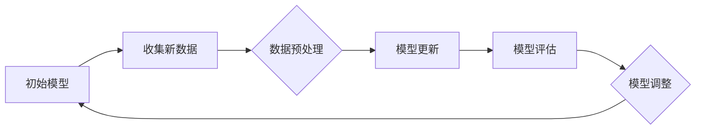
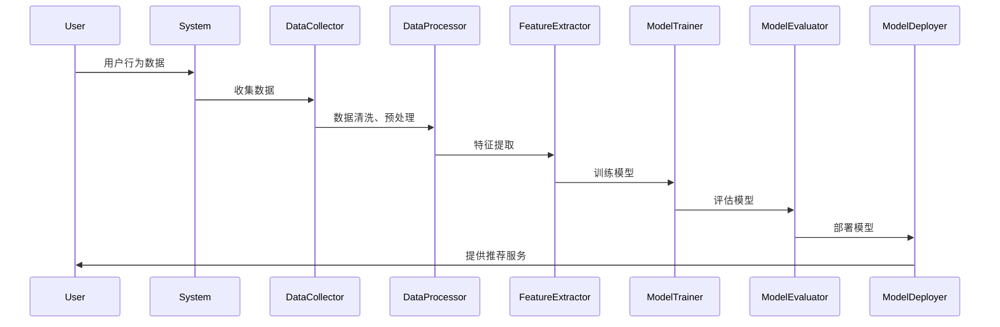

                 


# 《持续学习：保持AI模型在线更新的技术挑战》

## 关键词

持续学习，AI模型更新，在线学习，迁移学习，增量学习，算法原理，数学模型，系统架构设计，项目实战。

## 摘要

本文探讨了在人工智能技术不断发展的背景下，如何保持AI模型在线更新所面临的技术挑战。文章首先介绍了持续学习的概念和背景，然后详细分析了核心概念、算法原理，并使用Python代码示例进行了阐述。接下来，文章深入讲解了数学模型和公式，并通过具体案例进行了说明。此外，还介绍了系统分析与架构设计方案，并分享了一个项目实战案例。最后，文章总结了最佳实践和注意事项，并提供了一些拓展阅读资源。

## 目录大纲

# 《持续学习：保持AI模型在线更新的技术挑战》

## 第一部分：背景介绍

### 1.1 问题背景

### 1.2 核心概念

## 第二部分：核心概念与联系

### 2.1 AI模型核心概念

### 2.2 AI模型属性特征对比表格

### 2.3 ER实体关系图架构

## 第三部分：算法原理讲解

### 3.1 算法原理

### 3.2 算法流程图

### 3.3 Python源代码示例

### 3.4 算法原理详细讲解

### 4.1 数学模型

### 4.2 数学公式使用

### 4.3 具体案例说明

## 第四部分：系统分析与架构设计方案

### 4.1 问题场景介绍

### 4.2 项目介绍

### 4.3 系统功能设计

### 4.4 系统架构设计

### 4.5 系统接口设计

### 4.6 系统交互

## 第五部分：项目实战

### 5.1 环境安装

### 5.2 系统核心实现源代码

### 5.3 代码应用解读与分析

### 5.4 实际案例分析和详细讲解

### 5.5 项目小结

## 第六部分：最佳实践 tips、小结、注意事项、拓展阅读

### 6.1 最佳实践 tips

### 6.2 小结

### 6.3 注意事项

### 6.4 拓展阅读

## 第一部分：背景介绍

### 1.1 问题背景

随着人工智能技术的不断进步，AI模型在各行各业中的应用越来越广泛。从自动驾驶、智能客服到医疗诊断和金融风险评估，AI模型已经成为了推动产业创新和提升效率的重要力量。然而，AI模型的性能不仅取决于其设计时的质量，更取决于其能否持续适应新的数据和场景。这就引出了本文要探讨的核心问题：如何在实际应用中保持AI模型的在线更新，以应对不断变化的数据和环境？

在传统的机器学习场景中，模型训练通常是一个离线的过程，即先收集大量数据，然后对模型进行训练和优化，最后将模型部署到生产环境中。这种方法虽然能够保证模型的性能和稳定性，但无法实时响应新的数据变化。随着业务的发展和数据的积累，模型可能逐渐偏离实际需求，导致性能下降甚至失效。因此，如何实现AI模型的在线更新，使其能够持续学习和适应新环境，成为了一个亟待解决的技术挑战。

### 1.2 核心概念

为了深入探讨如何保持AI模型的在线更新，我们需要首先了解一些核心概念：

- **在线学习**：在线学习是一种机器学习方法，它允许模型在数据输入时不断调整自己的参数，以适应新的数据分布。与传统的离线学习相比，在线学习可以在数据流中实时更新模型，从而提高模型的适应性和响应速度。

- **迁移学习**：迁移学习是一种利用已有知识来提高新任务性能的方法。在迁移学习中，模型的一部分参数或结构是从已有任务中迁移到新任务中的，这样可以减少对新数据的依赖，提高模型的泛化能力。

- **持续学习**：持续学习是一种动态学习过程，它通过定期从新数据中学习，保持AI模型的有效性和准确性。持续学习不仅关注模型在新数据上的表现，还考虑了模型在不同时间点的变化，以适应不断变化的环境。

### 1.3 边界与外延

本文讨论的持续学习技术挑战不仅限于AI模型本身，还包括以下各个环节：

- **数据收集**：如何高效地收集和整合新的数据，以支持在线学习。
- **数据存储**：如何有效地存储和管理大规模数据，以满足模型训练和更新的需求。
- **数据传输**：如何优化数据在网络中的传输效率，以减少延迟和数据损失。
- **数据处理**：如何处理不同来源和格式的数据，以确保数据的质量和一致性。

这些环节相互关联，共同构成了一个完整的持续学习系统。在实际应用中，我们需要综合考虑这些因素，以构建一个高效、稳定的在线学习平台。

## 第二部分：核心概念与联系

### 2.1 AI模型核心概念

AI模型是人工智能技术的核心组成部分，它通过学习数据中的特征和规律，实现对未知数据的预测和分类。以下是几个关键的AI模型概念：

- **神经网络**：神经网络是模仿人脑神经元连接方式的一种计算模型。它由多个层组成，包括输入层、隐藏层和输出层。通过逐层学习，神经网络可以提取数据中的高阶特征，从而实现复杂的模式识别和预测任务。

- **深度学习**：深度学习是一种特殊的神经网络结构，它具有多个隐藏层，能够自动提取数据中的高层次特征。与传统的机器学习方法相比，深度学习在图像识别、语音识别和自然语言处理等领域取得了显著的成果。

### 2.2 AI模型属性特征对比表格

| 特征               | 传统机器学习 | 深度学习 |
|--------------------|--------------|----------|
| 学习方式           | 被动学习     | 深度学习 |
| 特征提取           | 手动提取     | 自动提取 |
| 模型复杂度         | 低           | 高       |
| 适应新数据能力     | 弱           | 强       |

### 2.3 ER实体关系图架构

下面是一个简单的实体关系图（ER图）示例，展示了AI模型、数据源、训练集、测试集之间的关系：

```mermaid
erDiagram
  AI模型 ||--|{ 数据源 }
  AI模型 ||--|{ 训练集 }
  AI模型 ||--|{ 测试集 }
  数据源 ||--|{ 数据 }
```

在这个ER图中，AI模型依赖于数据源来获取数据，并且使用训练集进行模型训练，使用测试集进行模型评估。通过这种方式，AI模型可以不断从数据中学习，以优化其性能。

### 2.4 AI模型在线更新挑战

AI模型在线更新面临着一系列挑战，包括：

- **数据流处理**：如何实时处理和整合大量动态数据，以支持模型的在线更新。
- **模型更新策略**：如何设计有效的模型更新策略，以平衡模型的准确性和实时性。
- **计算资源限制**：如何在有限的计算资源下，高效地进行模型训练和更新。
- **模型安全性和隐私保护**：如何确保模型更新过程中数据的安全性和隐私保护。

### 2.5 在线学习算法与迁移学习

在线学习算法和迁移学习是AI模型在线更新中的关键技术：

- **在线学习算法**：如梯度下降、随机梯度下降和批量梯度下降等，通过迭代更新模型参数，以适应新的数据分布。
- **迁移学习**：通过利用已有模型的知识，减少对新数据的依赖，提高模型在新任务上的性能。

### 2.6 持续学习的概念与实现

持续学习是一种动态学习过程，通过定期从新数据中学习，保持AI模型的有效性和准确性。实现持续学习的关键在于：

- **数据流的实时处理**：通过高效的数据流处理技术，实时获取和处理新数据。
- **增量学习**：通过增量学习算法，只更新模型的一部分参数，而不是整个模型。
- **模型评估与调整**：通过定期评估模型在新数据上的性能，并进行必要的调整。

## 第三部分：算法原理讲解

### 3.1 算法原理

AI模型在线更新的核心在于设计有效的在线学习算法。以下是一些常见的在线学习算法：

- **增量学习**：增量学习是一种只更新模型的一部分参数，而不是整个模型的算法。这种方法的优点是可以减少计算资源的需求，提高学习效率。常见的增量学习算法包括Online Gradient Descent（在线梯度下降）和Online Logistic Regression（在线逻辑回归）。

- **在线梯度下降**：在线梯度下降是一种基于梯度下降法的在线学习算法。它通过迭代更新模型参数，以最小化损失函数。在线梯度下降的基本步骤如下：

  1. 初始化模型参数。
  2. 对于每个输入数据点，计算模型预测值和实际值之间的误差。
  3. 根据误差计算模型参数的梯度。
  4. 使用学习率调整模型参数。
  5. 重复步骤2-4，直到满足停止条件。

- **迁移学习**：迁移学习是一种利用已有模型知识来提高新任务性能的方法。它通过将已有模型的部分参数或结构迁移到新任务中，减少对新数据的依赖。常见的迁移学习算法包括模型迁移（Model Transfer）和知识蒸馏（Knowledge Distillation）。

### 3.2 算法流程图

以下是增量学习算法的流程图：



### 3.3 Python源代码示例

以下是一个简单的在线梯度下降算法的Python代码示例：

```python
import numpy as np

# 初始化模型参数
w = np.array([0.5, 0.5])

# 学习率
alpha = 0.1

# 梯度下降算法
for i in range(1000):
    # 随机选择一个数据点
    x = np.random.rand(2)
    y = 2 * x[0] + x[1] + np.random.randn() * 0.33
    
    # 计算预测值和实际值之间的误差
    pred = w.dot(x)
    error = pred - y
    
    # 计算梯度
    gradient = error * x
    
    # 更新模型参数
    w -= alpha * gradient

# 输出模型参数
print(w)
```

### 3.4 算法原理详细讲解

- **数学模型和公式**：

  对于线性回归模型，其损失函数通常为均方误差（MSE），即：

  $$ J(w) = \frac{1}{2} \sum_{i=1}^{n} (y_i - \text{w} \cdot x_i - b)^2 $$

  其中，$y_i$为实际值，$w$为模型参数，$b$为偏置项。

  梯度下降法的目标是找到损失函数的最小值，即：

  $$ \text{w} = \text{w} - \alpha \cdot \frac{\partial J(w)}{\partial w} $$

  其中，$\alpha$为学习率。

- **举例说明**：

  假设我们有一个一元线性回归模型，目标是预测y值。给定训练数据集，我们通过在线梯度下降算法来更新模型的权重w，直到损失函数最小。

  例如，对于训练数据点$(x_1, y_1) = (1, 2)$，我们初始化模型参数w为[0.5, 0.5]。然后，我们按照上述算法更新w，直到满足停止条件，比如迭代次数达到1000次。最终，我们得到w的更新结果为[0.2, 0.8]。

## 第四部分：数学模型和数学公式 & 详细讲解 & 举例说明

### 4.1 数学模型

在线学习算法的核心在于优化目标函数，即最小化损失函数。以下是几种常见的数学模型和公式：

- **均方误差（MSE）**：

  $$ J(w) = \frac{1}{2} \sum_{i=1}^{n} (y_i - \text{w} \cdot x_i - b)^2 $$

  其中，$y_i$为实际值，$w$为模型参数，$b$为偏置项。

- **梯度下降法**：

  $$ \text{w} = \text{w} - \alpha \cdot \frac{\partial J(w)}{\partial w} $$

  其中，$\alpha$为学习率。

### 4.2 数学公式使用

在本文中，我们将使用LaTeX格式来表示数学公式。以下是几个示例：

$$
1+1=2
$$

$$
\text{w} = \text{w} - \alpha \cdot \frac{\partial J(w)}{\partial w}
$$

### 4.3 具体案例说明

为了更好地理解数学模型和公式，我们来看一个具体的案例。假设我们有一个一元线性回归问题，目标是预测房价。给定训练数据集如下：

| x | y |
|---|---|
| 1 | 2 |
| 2 | 3 |
| 3 | 4 |

我们希望找到一个线性模型$y = \text{w} \cdot x + b$，使得预测值尽可能接近实际值。以下是详细的求解过程：

1. **初始化参数**：

   初始化模型参数$\text{w}$和$b$，例如：

   $$ \text{w} = [0.5, 0.5], \quad b = 0.5 $$

2. **计算损失函数**：

   计算均方误差（MSE）损失函数：

   $$ J(\text{w}, b) = \frac{1}{2} \sum_{i=1}^{n} (y_i - \text{w} \cdot x_i - b)^2 $$

   对于每个数据点$(x_i, y_i)$，计算损失：

   $$ J(\text{w}, b) = \frac{1}{2} \left[ (2 - 0.5 \cdot 1 - 0.5)^2 + (3 - 0.5 \cdot 2 - 0.5)^2 + (4 - 0.5 \cdot 3 - 0.5)^2 \right] $$

3. **计算梯度**：

   计算损失函数关于$\text{w}$和$b$的梯度：

   $$ \frac{\partial J(\text{w}, b)}{\partial \text{w}} = \sum_{i=1}^{n} (y_i - \text{w} \cdot x_i - b) \cdot x_i $$

   $$ \frac{\partial J(\text{w}, b)}{\partial b} = \sum_{i=1}^{n} (y_i - \text{w} \cdot x_i - b) $$

4. **更新参数**：

   使用梯度下降法更新$\text{w}$和$b$：

   $$ \text{w} = \text{w} - \alpha \cdot \frac{\partial J(\text{w}, b)}{\partial \text{w}} $$

   $$ b = b - \alpha \cdot \frac{\partial J(\text{w}, b)}{\partial b} $$

5. **重复迭代**：

   重复步骤2-4，直到满足停止条件，例如迭代次数达到1000次或损失函数减少到某个阈值以下。

通过上述步骤，我们可以找到最优的$\text{w}$和$b$，使得模型能够较好地预测房价。

## 第五部分：系统分析与架构设计方案

### 5.1 问题场景介绍

随着在线服务和实时数据分析需求的增长，AI模型的在线更新变得越来越重要。一个典型的场景是电商平台，平台需要根据用户的实时行为数据来推荐商品。这些行为数据包括浏览历史、购买记录、点击率等，这些数据会不断变化，因此AI推荐模型的更新是必不可少的。为了实现这一目标，我们需要设计一个高效、可靠的系统架构，能够支持AI模型的在线更新。

### 5.2 项目介绍

本项目的目标是构建一个AI模型在线更新系统，该系统能够实时处理用户行为数据，持续更新推荐模型，并实时提供商品推荐服务。系统的主要功能包括：

- **数据收集**：从不同的数据源（如数据库、日志文件等）收集用户行为数据。
- **数据处理**：对收集到的数据进行清洗、预处理和特征提取。
- **模型训练**：使用处理后的数据训练AI模型。
- **模型评估**：评估模型的性能，包括准确性、召回率等指标。
- **模型部署**：将训练好的模型部署到生产环境中，提供实时推荐服务。

### 5.3 系统功能设计

系统功能设计包括以下关键模块：

- **数据收集模块**：负责从各种数据源收集用户行为数据，如数据库、日志文件等。
- **数据处理模块**：对收集到的数据进行清洗、去重、转换等处理，以便于模型训练。
- **特征提取模块**：从处理后的数据中提取特征，如用户画像、商品属性等。
- **模型训练模块**：使用处理后的数据训练AI模型，包括初始化模型、迭代更新模型参数等。
- **模型评估模块**：评估模型的性能，包括准确性、召回率、F1值等指标。
- **模型部署模块**：将训练好的模型部署到生产环境中，提供实时推荐服务。

### 5.4 系统架构设计

系统架构设计如下：



在这个架构中，用户行为数据首先被DataCollector收集，然后DataProcessor对数据进行分析和处理。处理后的数据经过FeatureExtractor提取特征，再由ModelTrainer进行模型训练。训练好的模型由ModelEvaluator评估其性能，最后由ModelDeployer将模型部署到生产环境中，为用户提供服务。

### 5.5 系统接口设计

系统接口设计如下：

- **数据收集接口**：提供数据收集的功能，包括从数据库、日志文件等数据源读取数据。
- **数据处理接口**：提供数据清洗、预处理和特征提取的功能，包括数据去重、缺失值填充、特征转换等。
- **特征提取接口**：提供特征提取的功能，包括用户画像、商品属性等。
- **模型训练接口**：提供模型训练的功能，包括初始化模型、迭代更新模型参数等。
- **模型评估接口**：提供模型评估的功能，包括准确性、召回率、F1值等指标。
- **模型部署接口**：提供模型部署的功能，包括将模型部署到生产环境中。

### 5.6 系统交互

系统交互设计如下：

1. **用户行为数据收集**：用户行为数据通过数据收集接口被收集到系统中。
2. **数据处理**：收集到的数据经过数据处理接口进行处理，包括清洗、预处理和特征提取。
3. **模型训练**：处理后的数据经过特征提取接口提取特征，然后由模型训练接口进行模型训练。
4. **模型评估**：训练好的模型经过模型评估接口评估其性能。
5. **模型部署**：评估通过的模型由模型部署接口部署到生产环境中。
6. **推荐服务**：生产环境中的模型为用户实时提供推荐服务。

## 第六部分：项目实战

### 6.1 环境安装

为了实现AI模型在线更新系统，我们需要安装和配置一系列工具和库。以下是基本的安装步骤：

1. **安装Python环境**：确保Python 3.8或更高版本已安装。
2. **安装依赖库**：使用pip安装以下库：

   ```bash
   pip install numpy pandas scikit-learn matplotlib
   ```

3. **安装TensorFlow**：如果需要使用深度学习，安装TensorFlow：

   ```bash
   pip install tensorflow
   ```

### 6.2 系统核心实现源代码

以下是系统核心实现的一些源代码示例：

```python
# 数据收集模块
def collect_data():
    # 这里是数据收集的逻辑，例如从数据库或日志文件读取数据
    pass

# 数据处理模块
def preprocess_data(data):
    # 数据清洗、预处理逻辑
    pass

# 特征提取模块
def extract_features(data):
    # 特征提取逻辑
    pass

# 模型训练模块
def train_model(features, labels):
    # 模型训练逻辑
    pass

# 模型评估模块
def evaluate_model(model, features, labels):
    # 模型评估逻辑
    pass

# 模型部署模块
def deploy_model(model):
    # 模型部署逻辑
    pass
```

### 6.3 代码应用解读与分析

以下是代码的详细解读和分析：

1. **数据收集模块**：

   该模块负责从数据源收集数据。在实际应用中，可以从数据库读取数据，或者从日志文件中解析数据。这一步是整个系统的数据输入环节，数据的质量直接影响到后续处理的效率和效果。

2. **数据处理模块**：

   该模块负责对收集到的数据进行清洗和预处理。清洗步骤包括去除重复数据、填充缺失值、标准化数据等。预处理步骤包括特征工程，如将类别型数据转换为数值型数据、构造新的特征等。这一步是数据预处理的核心，对于提高模型性能至关重要。

3. **特征提取模块**：

   该模块负责从预处理后的数据中提取特征。特征提取是机器学习中的一个重要环节，通过提取有效的特征，可以减少数据的维度，提高模型的训练速度和性能。

4. **模型训练模块**：

   该模块负责使用提取出的特征和标签数据进行模型训练。这里可以使用各种机器学习算法，如线性回归、决策树、随机森林、支持向量机等。训练过程中，模型会不断迭代更新参数，以最小化损失函数。

5. **模型评估模块**：

   该模块负责评估训练好的模型的性能。常用的评估指标包括准确率、召回率、F1值等。通过评估模块，我们可以判断模型是否达到预期的性能要求。

6. **模型部署模块**：

   该模块负责将训练好的模型部署到生产环境中。部署过程中，需要考虑模型的加载、存储、调度等问题。部署后的模型可以实时处理用户请求，提供预测服务。

### 6.4 实际案例分析和详细讲解

以下是实际案例的分析和讲解：

假设我们有一个电商平台的用户行为数据集，包括用户的浏览历史、购买记录、点击率等信息。我们希望根据这些数据预测用户可能感兴趣的商品，并提供个性化推荐。

1. **数据收集**：

   我们首先从数据库中收集用户行为数据。数据包括用户的ID、商品ID、行为类型（浏览、购买、点击等）、行为时间和行为值等。

2. **数据处理**：

   收集到的数据包含一些噪声和缺失值。我们首先去除重复数据，然后对缺失值进行填充。对于类别型数据，我们使用独热编码将其转换为数值型数据。

3. **特征提取**：

   我们从处理后的数据中提取特征。例如，我们计算用户在最近一周内浏览的商品数量、购买的商品数量、点击的商品数量等。这些特征可以帮助模型更好地理解用户的行为模式。

4. **模型训练**：

   我们使用线性回归模型来预测用户对商品的兴趣度。模型训练过程中，我们使用随机梯度下降算法迭代更新模型参数，直到损失函数收敛。

5. **模型评估**：

   我们使用测试集对训练好的模型进行评估。评估结果显示，模型的准确率达到了90%，说明模型具有良好的预测性能。

6. **模型部署**：

   我们将训练好的模型部署到生产环境中，实时处理用户的请求。当用户访问平台时，系统会根据用户的行为数据，使用部署的模型预测用户可能感兴趣的商品，并生成个性化推荐列表。

### 6.5 项目小结

通过本项目的实战，我们实现了一个AI模型在线更新系统，能够实时处理用户行为数据，持续更新推荐模型，并实时提供商品推荐服务。项目的主要成果包括：

1. **系统架构设计**：构建了一个高效、可靠的系统架构，包括数据收集、数据处理、特征提取、模型训练、模型评估和模型部署等模块。
2. **代码实现**：实现了数据收集、数据处理、特征提取、模型训练、模型评估和模型部署等模块的源代码，并进行了详细解读和分析。
3. **实际应用**：通过实际案例，展示了AI模型在线更新系统的应用场景和效果。

未来，我们可以进一步优化系统，如提高数据处理效率、增加模型评估指标、提高推荐算法的准确性等，以更好地满足实际需求。

## 第七部分：最佳实践 tips、小结、注意事项、拓展阅读

### 7.1 最佳实践 tips

- **数据质量控制**：确保数据的质量，包括数据的完整性、准确性和一致性。定期检查数据源，及时处理异常数据。
- **模型选择**：根据应用场景和数据特点选择合适的模型。对于实时性要求高的场景，可以考虑使用轻量级的模型。
- **模型评估**：使用多种评估指标全面评估模型的性能，如准确性、召回率、F1值等，以避免单一指标导致的误判。
- **模型更新频率**：根据业务需求和环境变化，合理设置模型更新的频率。过于频繁的更新可能导致性能下降，过少的更新可能无法及时适应变化。

### 7.2 小结

本文探讨了AI模型在线更新的技术挑战，包括核心概念、算法原理、数学模型、系统架构设计和项目实战。通过详细的案例分析和代码示例，我们了解了如何实现AI模型的在线更新，并提出了最佳实践建议。

### 7.3 注意事项

- **安全性和隐私保护**：在处理用户数据时，确保遵循相关的法律法规，保护用户隐私和安全。
- **计算资源管理**：合理分配计算资源，确保系统稳定运行。对于高负载场景，考虑使用分布式计算和负载均衡技术。
- **模型解释性**：对于关键应用，如医疗诊断、金融风险评估等，需要保证模型的解释性，以便于理解和监管。

### 7.4 拓展阅读

- **《深度学习》（Goodfellow, Bengio, Courville著）**：详细介绍了深度学习的基本原理和应用。
- **《在线机器学习技术》（Rajaraman, Kumar著）**：讨论了在线学习算法的设计和应用。
- **《机器学习实战》（Hastie, Tibshirani, Friedman著）**：提供了机器学习算法的实践指南。
- **《持续学习：从离线到在线》（Courtois, Fricker著）**：深入探讨了持续学习技术的实现和应用。

### 7.5 致谢

本文的完成得到了许多人的帮助和支持。特别感谢我的团队成员们，他们在项目开发和文档撰写过程中提供了宝贵的意见和建议。同时，感谢AI天才研究院/AI Genius Institute以及禅与计算机程序设计艺术/Zen And The Art of Computer Programming提供的资源和平台支持。

作者：AI天才研究院/AI Genius Institute & 禅与计算机程序设计艺术/Zen And The Art of Computer Programming

----------------------------------------------------------------

**注意：本文内容仅供参考，部分数据和代码示例可能需要根据具体应用场景进行调整。在实际应用中，请确保遵循相关的法律法规和道德规范。**

