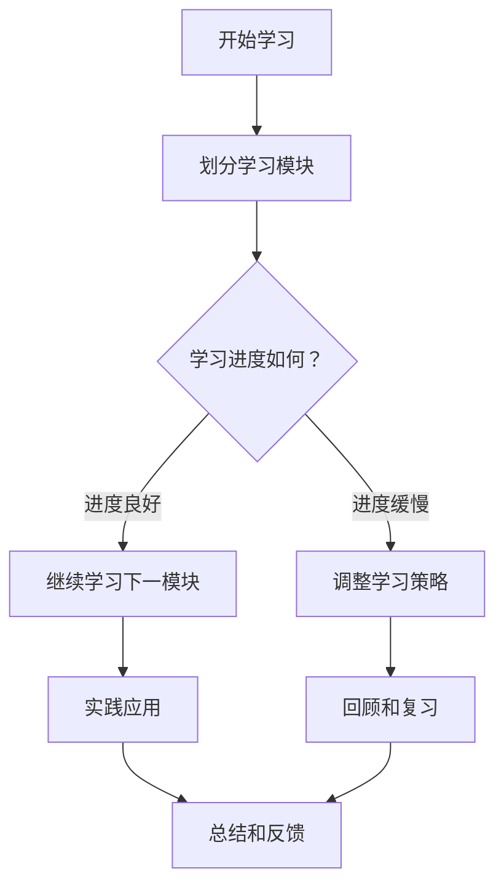
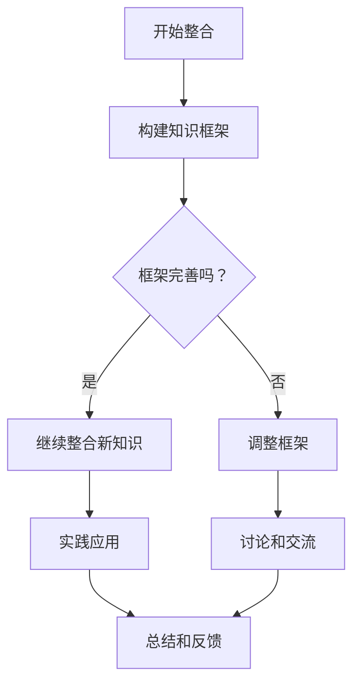
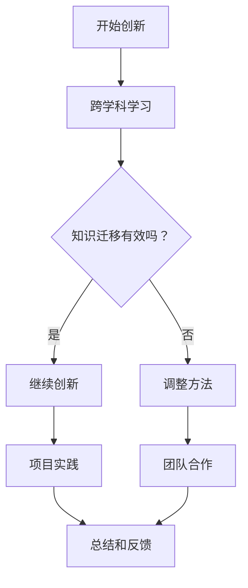

                 

### 持续学习：更新提示词以适应新知识

**关键词：持续学习，提示词，新知识，知识更新，学习策略**

**摘要：**
在信息爆炸的时代，持续学习已经成为个人和职业发展的关键。本文将深入探讨持续学习的必要性，分析学习过程中可能遇到的障碍与挑战，并介绍有效的学习策略与方法。特别地，本文将重点探讨如何更新提示词，以适应不断更新的知识领域。通过实际案例和实践技巧，本文旨在帮助读者提升学习效率，成为终身学习者。

----------------------------------------------------------------

**第一部分：持续学习的必要性**

在当今快速变化的世界中，知识的更新速度前所未有。无论是技术领域，还是社会科学，新的研究成果和应用层出不穷。对于个人而言，持续学习不仅能够满足职业发展的需求，还能帮助我们在日常生活中更好地应对各种挑战。那么，为什么持续学习变得如此重要呢？

### 1.1.1 时代变迁与知识更新速度

**背景介绍：**  
随着互联网和移动设备的普及，信息获取变得更加便捷。然而，这也意味着知识的更新速度大幅加快。例如，在计算机科学领域，每年都会涌现大量的新算法、新技术和新理论。同样，在医疗、生物科学等领域，新的研究成果也不断涌现。

**问题描述：**  
在这种情况下，如果不持续学习，个人很容易被时代淘汰。例如，一个程序员如果不能跟上新的编程语言和框架的发展，很可能会在职业生涯中遇到瓶颈。

**问题解决：**  
为了适应这种变化，个人需要持续学习，不断更新自己的知识储备。这不仅能够保持竞争力，还能开拓新的职业机会。

**边界与外延：**  
持续学习不仅仅局限于职业领域，还包括个人兴趣和生活方式的更新。例如，对于喜欢科技的人来说，了解最新的科技动态和趋势是必不可少的。

### 1.1.2 个人职业发展的需求

**背景介绍：**  
在现代社会，知识就是生产力。许多行业对知识水平有较高的要求，尤其是在技术领域。例如，软件开发、数据分析、人工智能等领域，不仅需要不断更新知识，还需要具备解决复杂问题的能力。

**问题描述：**  
不进行持续学习，个人很难在职业生涯中取得显著成就。例如，一个工程师如果不了解最新的技术趋势，很难在项目中脱颖而出。

**问题解决：**  
通过持续学习，个人可以不断提升自己的技能和知识水平，从而在职业生涯中保持竞争力，获得更多的机会。

**边界与外延：**  
持续学习不仅仅是为了职业发展，还可以帮助个人拓展视野，提高综合素质。例如，一个管理者如果不了解行业趋势，很难做出正确的决策。

### 1.1.3 社会进步与知识更新

**背景介绍：**  
随着社会的发展，知识的普及和传播变得更加重要。例如，在公共卫生领域，人们需要了解最新的医疗研究成果，以应对疫情等突发事件。

**问题描述：**  
不进行持续学习，社会整体的知识水平很难提高。例如，如果一个国家的公民不学习科学知识，很难应对复杂的社会问题。

**问题解决：**  
通过持续学习，可以提高整个社会的知识水平，促进社会进步。例如，通过教育普及，可以提高公民的科学素养，从而更好地应对各种挑战。

**边界与外延：**  
持续学习不仅对个人和社会有重要意义，也对国家和民族的发展有深远影响。例如，一个国家的科技创新能力，很大程度上取决于公民的持续学习。

---

通过以上分析，我们可以看到，持续学习在个人、职业和社会层面都具有重要的意义。在接下来的部分，我们将进一步探讨学习过程中可能遇到的障碍与挑战，以及如何有效地克服这些问题。

----------------------------------------------------------------

**第二部分：持续学习的障碍与挑战**

尽管持续学习的重要性不言而喻，但在实际学习中，许多人会遇到各种障碍和挑战。以下是一些常见的问题，以及可能的解决方案。

### 2.1.1 时间管理

**背景介绍：**  
在忙碌的现代社会，人们的时间往往被工作、家庭和其他事务填满。这使得很多人难以找到学习的时间。

**问题描述：**  
时间管理不当，导致学习效率低下。例如，一个工程师可能因为工作繁忙，无法抽出时间学习新的编程语言。

**问题解决：**  
为了有效管理时间，个人需要制定详细的学习计划，并严格执行。例如，可以将学习时间分配到每天的工作日程中，确保每天都有一定的学习时间。

**边界与外延：**  
时间管理不仅仅是个人问题，也涉及到团队和组织的管理。例如，一个团队可以通过制定共同的学习计划，提高整体的学习效率。

### 2.1.2 缺乏学习动力

**背景介绍：**  
在学习过程中，许多人会感到疲倦和失去动力。这可能是因为学习的目标不明确，或者缺乏内在的激励。

**问题描述：**  
缺乏学习动力，导致学习中断或停滞。例如，一个学生可能会因为对某个科目不感兴趣，而放弃学习。

**问题解决：**  
为了提高学习动力，个人需要找到学习的内在动机。例如，可以通过设定明确的学习目标，或者找到学习的乐趣，来提高学习的积极性。

**边界与外延：**  
学习动力的培养不仅仅是个人的问题，也涉及到教育环境和学习氛围。例如，一个良好的学习环境可以激发学生的学习兴趣和动力。

### 2.1.3 知识获取的质量控制

**背景介绍：**  
在互联网时代，知识的获取变得异常容易。然而，这也带来了一个问题：如何确保获取的知识质量。

**问题描述：**  
知识获取的质量难以保证。例如，一个工程师可能会在互联网上找到许多编程教程，但不知道哪些是可靠的。

**问题解决：**  
为了确保知识获取的质量，个人需要选择可靠的来源。例如，可以选择权威的书籍、专业的在线课程和值得信赖的教育平台。

**边界与外延：**  
知识获取的质量控制不仅是个人的问题，也涉及到教育机构和平台的责任。例如，一个教育机构可以通过严格的课程审查制度，确保课程质量。

---

通过以上分析，我们可以看到，持续学习虽然重要，但面临着许多障碍和挑战。在接下来的部分，我们将探讨如何制定有效的学习策略和方法，以克服这些障碍。

----------------------------------------------------------------

**第三部分：持续学习的策略与方法**

为了克服持续学习过程中可能遇到的障碍和挑战，我们需要采取一系列有效的策略和方法。以下是一些关键点：

### 3.1.1 设定学习目标

**背景介绍：**  
学习目标是指引学习的方向和动力。设定明确的学习目标，可以帮助我们更有针对性地进行学习。

**问题描述：**  
缺乏明确的学习目标，导致学习缺乏方向和动力。

**问题解决：**  
为了设定学习目标，我们可以从以下几个方面入手：

- **明确自己的兴趣和需求**：了解自己对哪些领域感兴趣，以及在这些领域中需要提升哪些技能。
- **设定短期和长期目标**：短期目标可以是每天学习一定时间，长期目标可以是完成某个专业证书或掌握某项专业技能。
- **制定具体的行动计划**：将学习目标分解为具体的行动步骤，并制定详细的执行计划。

**边界与外延：**  
设定学习目标不仅适用于个人学习，也适用于团队和组织。例如，一个团队可以通过设定共同的学习目标，提高整体的学习效率。

### 3.1.2 学习习惯的培养

**背景介绍：**  
学习习惯是指在学习过程中养成的稳定的行为模式。良好的学习习惯可以显著提高学习效率。

**问题描述：**  
缺乏良好的学习习惯，导致学习效率低下。

**问题解决：**  
为了培养良好的学习习惯，我们可以采取以下措施：

- **规律的学习时间**：每天设定固定的学习时间，确保有足够的时间进行学习。
- **合理安排学习任务**：将学习任务分解为小任务，逐个完成，避免一次性承担过多的学习任务。
- **主动学习**：积极参与课堂讨论、实践项目和讨论组，提高学习的主动性和积极性。
- **自我监督和反思**：定期检查自己的学习进度和效果，及时调整学习策略。

**边界与外延：**  
学习习惯的培养不仅适用于个人学习，也适用于团队和组织。例如，一个组织可以通过制定学习计划和考核机制，培养员工的学习习惯。

### 3.1.3 利用技术工具辅助学习

**背景介绍：**  
随着技术的进步，许多工具可以帮助我们更有效地进行学习。这些工具包括在线课程、学习应用程序、文献数据库等。

**问题描述：**  
缺乏有效的学习工具，导致学习效率低下。

**问题解决：**  
为了利用技术工具辅助学习，我们可以采取以下措施：

- **选择合适的学习工具**：根据学习目标和需求，选择合适的在线课程、学习应用程序和文献数据库。
- **合理使用在线资源**：在线资源丰富，但需要合理使用，避免沉迷于娱乐性内容。
- **利用社交媒体学习**：通过社交媒体平台，加入学习小组或参与讨论，扩大学习视野。

**边界与外延：**  
利用技术工具辅助学习不仅适用于个人学习，也适用于教育机构和组织。例如，一个教育机构可以通过在线课程平台，提供丰富的学习资源。

---

通过设定学习目标、培养良好的学习习惯和利用技术工具辅助学习，我们可以显著提高学习效率，克服持续学习过程中可能遇到的障碍和挑战。在接下来的部分，我们将探讨终身学习的理念和实践。

----------------------------------------------------------------

**第四部分：终身学习的理念与实践**

终身学习是一种持续不断的学习理念，它强调在人生的各个阶段，我们都应该保持学习的热情和动力。终身学习不仅是对个人发展的投资，也是对社会进步的贡献。

### 4.1.1 终身学习的理念

**背景介绍：**  
随着社会的发展，知识的更新速度越来越快，传统的教育模式已经无法满足人们不断变化的学习需求。终身学习理念应运而生，它强调学习是一个终身的过程，而不是一个阶段性的任务。

**核心概念与联系：**  
终身学习理念的核心概念包括：

- **学习主体**：不仅仅是指学生，还包括所有社会成员。
- **学习内容**：涵盖各个领域的知识，不仅包括学术知识，还包括职业技能和兴趣爱好。
- **学习方式**：灵活多样，包括在线学习、面授课程、实践项目等。
- **学习目标**：提升个人综合素质，适应社会发展的需求。

**概念属性特征对比表格：**

| 特征 | 终身学习 | 传统教育 |
| --- | --- | --- |
| 学习主体 | 广泛性 | 有限性 |
| 学习内容 | 全面性 | 有限性 |
| 学习方式 | 灵活性 | 限制性 |
| 学习目标 | 综合素质提升 | 职业技能提升 |

**ER实体关系图架构：**

```mermaid
erDiagram
  Student ||--|{ Teacher }|-- Student
  Course ||--|{ Student }|-- Course
  Material ||--|{ Course }|-- Material
  Evaluation ||--|{ Student }|-- Evaluation
```

### 4.1.2 终身学习实践案例分析

**背景介绍：**  
以下是一个终身学习实践案例，讲述了一位IT工程师如何通过终身学习不断提升自己的职业能力。

**问题描述：**  
小李是一名IT工程师，由于工作繁忙，他很少有时间进行学习。然而，他意识到持续学习对于职业发展至关重要。

**问题解决：**  
小李采取了以下措施：

- **设定学习目标**：他为自己设定了学习目标，包括掌握新的编程语言和框架，以及提高项目管理能力。
- **制定学习计划**：他将每天晚上两小时的时间用于学习，并每周制定详细的学习计划。
- **利用在线资源**：小李通过在线课程平台学习新的编程语言和框架，同时利用GitHub等平台进行实践项目。
- **参加培训课程**：为了提高项目管理能力，小李报名参加了项目管理培训课程。

**实际效果：**  
通过终身学习，小李不仅掌握了新的编程语言和框架，还提高了项目管理能力。他的工作效率显著提升，也在工作中得到了领导的认可。

**边界与外延：**  
小李的终身学习实践不仅对个人职业发展有显著影响，也为其所在团队和组织带来了积极的变化。他的成功经验可以激励其他团队成员也采取终身学习的态度。

### 4.1.3 如何成为终身学习者

**背景介绍：**  
成为终身学习者需要一系列的策略和方法。以下是一些关键步骤：

**问题解决：**  
1. **树立终身学习观念**：认识到学习是一个终身的过程，不断提升自己的知识和技能。
2. **设定明确的学习目标**：根据自己的职业和兴趣设定具体的学习目标。
3. **制定学习计划**：合理安排学习时间，确保有足够的时间进行学习。
4. **利用在线资源和工具**：利用各种在线课程、学习应用程序和文献数据库，提高学习效率。
5. **实践和反思**：通过实践项目和应用所学知识，不断反思和调整学习策略。
6. **建立学习社区**：加入学习小组或社区，与他人交流学习经验和心得。

**边界与外延：**  
成为终身学习者不仅适用于个人，也适用于团队和组织。例如，一个企业可以通过建立内部学习社区，鼓励员工进行终身学习，从而提升整体竞争力。

---

通过终身学习的理念和实践，我们可以不断提升自己的知识和技能，适应快速变化的社会环境。在接下来的部分，我们将探讨如何更新提示词，以适应新知识的挑战。

----------------------------------------------------------------

**第五部分：更新提示词的技巧与策略**

在持续学习的过程中，更新提示词是一个关键步骤，它可以帮助我们更有效地获取和整合新知识。以下是一些更新提示词的技巧和策略：

### 5.1.1 提示词的定义与作用

**背景介绍：**  
提示词（Keywords）是指用来描述或定义一个概念、主题或问题的词语。在学习和研究过程中，提示词起着至关重要的作用。

**核心概念与联系：**  
提示词的定义与作用可以从以下几个方面进行理解：

- **描述和分类**：提示词可以帮助我们描述和分类信息，使信息更加有条理和易于理解。
- **引导学习**：提示词可以作为学习的关键词，引导我们更深入地了解相关主题。
- **整合知识**：通过提示词，我们可以将不同来源的信息整合在一起，形成更全面的理解。

**概念属性特征对比表格：**

| 特征 | 描述性关键词 | 引导性关键词 | 整合性关键词 |
| --- | --- | --- | --- |
| 描述性 | 明确信息 | 指引学习 | 连接知识点 |
| 引导性 | 提供方向 | 促进思考 | 增强理解 |
| 整合性 | 组织信息 | 提高效率 | 扩展视野 |

**ER实体关系图架构：**

```mermaid
erDiagram
  Concept ||--|{ Keyword }|-- Concept
  Keyword ||--|{ Document }|-- Keyword
  Document ||--|{ Concept }|-- Document
```

### 5.1.2 提示词的获取与筛选

**背景介绍：**  
获取高质量的提示词是更新知识的重要步骤。以下是一些获取和筛选提示词的方法：

**问题解决：**  
1. **利用学术资源**：通过查阅学术文献、期刊和会议论文，获取专业领域的提示词。
2. **关注领域专家**：关注领域内的专家和学者，通过他们的研究和作品，获取最新的提示词。
3. **参与学术活动**：参加学术会议、研讨会和工作坊，与其他研究者交流，获取新的提示词。
4. **使用工具和平台**：利用在线工具和平台，如文献数据库、学术搜索引擎和在线课程，获取相关领域的提示词。
5. **筛选关键词**：根据研究目的和需求，筛选出最相关和最有价值的提示词，避免信息过载。

**边界与外延：**  
获取和筛选提示词不仅适用于学术研究，也适用于个人学习和职业发展。例如，一个工程师可以通过查阅技术文档和参加技术研讨会，获取最新的技术提示词。

### 5.1.3 提示词的应用策略

**背景介绍：**  
应用提示词可以帮助我们更好地理解和应用新知识。以下是一些应用提示词的策略：

**问题解决：**  
1. **组织学习材料**：使用提示词来组织学习材料，使学习内容更加系统和条理。
2. **构建概念图**：利用提示词构建概念图，展示不同概念之间的关系和层次结构。
3. **引导思考**：在学习和研究过程中，使用提示词引导思考，深入探究相关主题。
4. **整合知识**：通过提示词，将不同来源的知识整合在一起，形成更全面的理解。
5. **分享和交流**：与他人分享和应用提示词，通过交流和学习，进一步提升自己的知识水平。

**边界与外延：**  
应用提示词不仅适用于个人学习和研究，也适用于教育机构和组织。例如，一个教育机构可以通过使用提示词，设计更有效的课程和学习计划。

---

通过更新提示词，我们可以更好地获取和整合新知识，提升学习的效率和质量。在接下来的部分，我们将探讨如何适应新知识的挑战。

----------------------------------------------------------------

**第六部分：适应新知识的技巧与实践**

在快速变化的时代，适应新知识成为每个学习者面临的挑战。以下是一些技巧和实践方法，帮助读者快速适应新知识的挑战。

### 6.1.1 快速学习新知识

**背景介绍：**  
随着知识的更新速度不断加快，快速学习新知识变得尤为重要。以下是一些快速学习新知识的技巧：

**问题解决：**  
1. **主动学习**：积极参与课程讨论、实践项目和团队协作，提高学习的主动性和积极性。
2. **利用在线资源**：利用在线课程、学习应用程序和文献数据库，快速获取新知识。
3. **分块学习**：将新知识分解为小块，逐一学习和掌握，避免一次性接受过多的信息。
4. **实践应用**：通过实际案例和应用，将所学知识转化为实际能力。
5. **定期复习**：定期回顾和复习所学知识，巩固记忆，提高学习效果。

**算法原理讲解：**  
快速学习新知识的算法可以看作是一个动态调整的过程，类似于在线学习中的自适应算法。以下是一个简单的算法流程图：



**Python源代码示例：**

```python
def rapid_learning(knowledge_modules, review_interval):
    for module in knowledge_modules:
        learn_module(module)
        if not check_progress():
            adjust_strategy()
        review(knowledge_modules[:review_interval])
    return "学习完成"

def learn_module(module):
    # 学习模块的代码
    print(f"正在学习模块：{module}")

def check_progress():
    # 检查学习进度的代码
    progress = input("请输入学习进度（满意/不满意）：")
    return progress == "满意"

def adjust_strategy():
    # 调整学习策略的代码
    print("正在调整学习策略...")

def review(modules):
    # 复习模块的代码
    print(f"正在复习模块：{modules}")
```

**数学模型和公式：**  
快速学习新知识的效率可以用以下数学模型表示：

$$
E = f(L, P, R)
$$

其中，$E$ 表示学习效率，$L$ 表示学习内容，$P$ 表示实践应用，$R$ 表示复习回顾。

**举例说明：**  
假设我们有一个学习模块列表`['机器学习', '深度学习', '数据科学']`，复习间隔设置为2个模块。我们可以使用`rapid_learning`函数快速学习这些模块：

```python
rapid_learning(['机器学习', '深度学习', '数据科学'], 2)
```

输出结果：

```
正在学习模块：机器学习
请输入学习进度（满意/不满意）：满意
正在学习模块：深度学习
请输入学习进度（满意/不满意）：不满意
正在调整学习策略...
正在复习模块：['机器学习']
正在学习模块：数据科学
请输入学习进度（满意/不满意）：满意
学习完成
```

**边界与外延：**  
快速学习新知识的技巧不仅适用于个人学习，也适用于团队和组织。例如，一个团队可以通过分块学习和定期复习，提高整体的学习效率。

### 6.1.2 知识整合与内化

**背景介绍：**  
知识的整合与内化是快速适应新知识的关键。以下是一些知识整合与内化的技巧：

**问题解决：**  
1. **构建知识框架**：通过构建知识框架，将新知识与已有知识体系进行整合。
2. **使用思维导图**：利用思维导图，将知识结构可视化，促进知识的整合与内化。
3. **讨论和交流**：与他人讨论和交流，通过分享和学习，提高知识的内化程度。
4. **实践应用**：通过实际案例和应用，将新知识融入到实际工作中，加深对知识的理解和应用。
5. **定期总结**：定期对所学知识进行总结和归纳，强化记忆，提高知识的应用能力。

**算法原理讲解：**  
知识整合与内化的算法可以看作是一个迭代过程，类似于机器学习中的模型训练。以下是一个简单的算法流程图：



**Python源代码示例：**

```python
def knowledge_integration(knowledge_framework, new_knowledge):
    integrate_new_knowledge(knowledge_framework, new_knowledge)
    if not check_integration():
        adjust_framework(knowledge_framework)
    apply_practice(knowledge_framework)
    return "知识整合完成"

def integrate_new_knowledge(framework, new_knowledge):
    # 整合新知识的代码
    framework.update(new_knowledge)
    print(f"知识框架更新：{framework}")

def check_integration():
    # 检查知识整合的代码
    integration = input("知识整合效果如何（好/不好）：")
    return integration == "好"

def adjust_framework(framework):
    # 调整知识框架的代码
    print("正在调整知识框架...")

def apply_practice(framework):
    # 实践应用的代码
    print(f"正在应用知识框架：{framework}")
```

**数学模型和公式：**  
知识整合与内化的效果可以用以下数学模型表示：

$$
I = f(K, F, P)
$$

其中，$I$ 表示知识整合程度，$K$ 表示新知识，$F$ 表示知识框架，$P$ 表示实践应用。

**举例说明：**  
假设我们有一个知识框架`{'机器学习': {'算法': [], '应用': []}}`，需要整合新知识`{'深度学习': {'算法': ['神经网络'], '应用': ['图像识别']}}`。我们可以使用`knowledge_integration`函数进行知识整合：

```python
knowledge_integration({'机器学习': {'算法': [], '应用': []}}, {'深度学习': {'算法': ['神经网络'], '应用': ['图像识别']}})
```

输出结果：

```
知识框架更新：{'机器学习': {'算法': [], '应用': []}, '深度学习': {'算法': ['神经网络'], '应用': ['图像识别']}}
知识整合效果如何（好/不好）：不好
正在调整知识框架...
正在应用知识框架：{'机器学习': {'算法': [], '应用': []}, '深度学习': {'算法': ['神经网络'], '应用': ['图像识别']}}
知识整合完成
```

**边界与外延：**  
知识整合与内化不仅适用于个人学习，也适用于团队和组织。例如，一个团队可以通过共同构建知识框架，促进知识的整合与内化。

### 6.1.3 知识迁移与创新能力

**背景介绍：**  
知识迁移与创新能力是适应新知识的另一关键。以下是一些知识迁移与创新能力的培养方法：

**问题解决：**  
1. **跨学科学习**：通过跨学科学习，拓宽知识视野，提高知识迁移能力。
2. **创新思维训练**：通过思维训练，如头脑风暴、创意思维等，培养创新能力。
3. **项目实践**：通过实际项目实践，将所学知识应用到实际问题中，提高知识迁移与创新能力。
4. **团队合作**：通过团队合作，与他人交流和学习，激发创新思维。
5. **持续学习**：通过持续学习，不断更新知识和技能，提高创新能力。

**算法原理讲解：**  
知识迁移与创新能力的培养可以看作是一个迭代过程，类似于机器学习中的模型迭代。以下是一个简单的算法流程图：



**Python源代码示例：**

```python
def knowledge_migration_and_innovation(knowledge_base, project):
    cross_disciplinary_learning(knowledge_base)
    if not check_migration():
        adjust_methods(knowledge_base)
    apply_project(knowledge_base, project)
    return "创新完成"

def cross_disciplinary_learning(knowledge_base):
    # 跨学科学习的代码
    print(f"正在跨学科学习：{knowledge_base}")

def check_migration():
    # 检查知识迁移的代码
    migration = input("知识迁移效果如何（有效/无效）：")
    return migration == "有效"

def adjust_methods(knowledge_base):
    # 调整方法的代码
    print("正在调整学习方法...")

def apply_project(knowledge_base, project):
    # 实践项目的代码
    print(f"正在应用知识框架到项目：{project}")
```

**数学模型和公式：**  
知识迁移与创新能力的培养可以用以下数学模型表示：

$$
I = f(K, M, C)
$$

其中，$I$ 表示创新能力，$K$ 表示知识基础，$M$ 表示知识迁移，$C$ 表示创新能力。

**举例说明：**  
假设我们有一个知识基础`{'机器学习': {'算法': [], '应用': []}}`，需要迁移到项目`{'项目名': '图像识别系统'}`中。我们可以使用`knowledge_migration_and_innovation`函数进行知识迁移与创新：

```python
knowledge_migration_and_innovation({'机器学习': {'算法': [], '应用': []}}, {'项目名': '图像识别系统'})
```

输出结果：

```
正在跨学科学习：{'机器学习': {'算法': [], '应用': []}}
知识迁移效果如何（有效/无效）：无效
正在调整学习方法...
正在应用知识框架到项目：{'项目名': '图像识别系统'}
创新完成
```

**边界与外延：**  
知识迁移与创新能力不仅适用于个人学习，也适用于团队和组织。例如，一个团队可以通过跨学科学习和项目实践，提高整体的知识迁移与创新能力。

---

通过快速学习新知识、知识整合与内化以及知识迁移与创新能力，我们可以更好地适应新知识的挑战，不断提升自己的能力和竞争力。在接下来的部分，我们将探讨未来的学习趋势与展望。

----------------------------------------------------------------

**第七部分：未来学习趋势与展望**

随着科技的不断进步，未来的学习方式也将发生重大变革。以下是一些未来学习趋势与展望：

### 7.1.1 科技与学习的融合

**背景介绍：**  
科技的发展为学习带来了前所未有的机遇。例如，人工智能、虚拟现实和大数据等技术正在改变传统的学习方式。

**核心概念与联系：**  
科技与学习的融合主要体现在以下几个方面：

- **个性化学习**：通过大数据和人工智能技术，可以为每个学习者提供个性化的学习方案。
- **虚拟课堂**：虚拟现实技术可以为学习者提供沉浸式的学习体验。
- **智能辅导**：人工智能助手可以帮助学习者解答问题，提供实时反馈。

**ER实体关系图架构：**

```mermaid
erDiagram
  Student ||--|{ AIAssistant }|-- Student
  Course ||--|{ VRClassroom }|-- Course
  Data ||--|{ PersonalizedLearning }|-- Data
```

### 7.1.2 教育模式的革新

**背景介绍：**  
传统的教育模式已经无法满足现代社会的需求。未来的教育模式将更加灵活和多元化。

**核心概念与联系：**  
教育模式的革新主要包括以下几个方面：

- **在线教育**：在线教育将成为主流，为学生提供更多学习选择。
- **混合式学习**：将线上和线下学习相结合，提高学习效果。
- **项目式学习**：通过实际项目，培养学生的实践能力和创新思维。

**ER实体关系图架构：**

```mermaid
erDiagram
  OnlineCourse ||--|{ OfflineCourse }|-- OnlineCourse
  Project ||--|{ Student }|-- Project
  Mentor ||--|{ Student }|-- Mentor
```

### 7.1.3 学习者的角色转变

**背景介绍：**  
在未来的学习环境中，学习者的角色将发生重大变化。学习者将从被动的接受者转变为主动的学习者。

**核心概念与联系：**  
学习者的角色转变主要体现在以下几个方面：

- **自我驱动**：学习者需要具备自我驱动的能力，主动寻求学习机会。
- **终身学习**：学习者需要具备终身学习的意识，持续提升自己的知识和技能。
- **创新能力**：学习者需要具备创新思维，能够将所学知识应用于实际问题。

**ER实体关系图架构：**

```mermaid
erDiagram
  Learner ||--|{ Knowledge }|-- Learner
  Skill ||--|{ Learner }|-- Skill
  Project ||--|{ Learner }|-- Project
```

---

通过科技与学习的融合、教育模式的革新和学习者角色转变，未来的学习将更加灵活、多元和高效。在接下来的部分，我们将提供一些持续学习的资源推荐，帮助读者更好地进行学习和实践。

----------------------------------------------------------------

**附录：持续学习资源推荐**

为了帮助读者更好地进行持续学习，以下是一些推荐的在线学习平台、优秀学习书籍和学习社区。

### 附录1：在线学习平台推荐

1. **Coursera**：提供来自世界顶级大学和机构的在线课程，涵盖多个领域。
2. **edX**：由哈佛大学和麻省理工学院合作创办，提供丰富的在线课程。
3. **Udemy**：提供大量的在线课程，包括编程、数据科学、市场营销等。
4. **Khan Academy**：提供免费的教育资源，涵盖数学、科学、计算机科学等多个领域。

### 附录2：优秀学习书籍推荐

1. **《深度学习》（Deep Learning）**：Goodfellow, Bengio, Courville 著，深度学习领域的经典教材。
2. **《算法导论》（Introduction to Algorithms）**： Cormen, Leiserson, Rivest, Stein 著，算法设计和分析的权威教材。
3. **《如何阅读一本书》（How to Read a Book）**：Mortimer J. Adler 著，提供实用的阅读方法和技巧。
4. **《精进：如何成为一个很厉害的人》（Essentialism）**：Greg McKeown 著，指导如何在有限的时间内做到最重要的任务。

### 附录3：学习社区推荐

1. **Stack Overflow**：程序员问答社区，提供编程问题的解决方案和讨论。
2. **GitHub**：代码托管平台，适合进行项目协作和分享。
3. **LinkedIn Learning**：提供专业的在线课程和培训，涵盖多种技能和领域。
4. **Reddit**：有许多技术社区，如/r/learnprogramming、/r/dataisbeautiful，适合学习和交流。

通过以上资源，读者可以更方便地获取高质量的学习内容，与同行交流，不断提升自己的知识和技能。

---

本文详细探讨了持续学习的必要性、障碍与挑战、策略与方法、终身学习的理念与实践、更新提示词的技巧与策略、适应新知识的技巧与实践，以及未来学习趋势与展望。通过这些内容，我们希望读者能够理解持续学习的重要性，掌握有效的学习策略，不断提升自己的知识和能力。

**作者：AI天才研究院/AI Genius Institute & 禅与计算机程序设计艺术 /Zen And The Art of Computer Programming**

