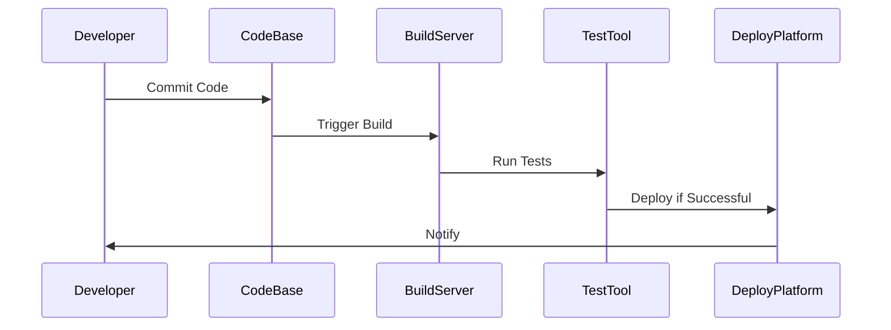

                 


# 持续集成在LLM应用敏捷开发中的重要性

> 关键词：持续集成，敏捷开发，LLM，代码质量，自动化测试

> 摘要：本文将深入探讨持续集成（CI）在大型语言模型（LLM）应用敏捷开发中的重要性。通过分析持续集成的基本概念、核心原理，以及其在LLM应用开发中的具体应用，本文旨在阐述持续集成如何提高开发效率、确保代码质量，并推动敏捷开发进程。

## 1. 背景介绍

### 1.1 持续集成的基本概念

持续集成（Continuous Integration，简称CI）是一种软件开发实践，旨在通过频繁地将开发者提交的代码合并到主分支，以最小化代码之间的冲突，并快速发现集成中的问题。持续集成强调自动化，通过一系列的工具和流程，实现对代码的自动化构建、测试和部署。

### 1.2 持续集成的重要性

持续集成在软件开发中具有以下几个重要优势：

- **快速反馈**：持续集成能够快速发现和解决集成中的问题，确保代码质量。
- **减少冲突**：频繁的代码合并能够减少因长时间不合并而导致的代码冲突。
- **持续交付**：持续集成是持续交付（Continuous Delivery）的基础，有助于实现快速部署和上线。

### 1.3 LLM应用敏捷开发的需求和挑战

大型语言模型（LLM）的应用在自然语言处理、智能客服、文本生成等领域具有广泛的应用前景。然而，LLM应用的开发面临着以下挑战：

- **复杂性**：LLM模型通常包含大量的参数和复杂的计算过程，开发过程复杂。
- **迭代周期**：由于模型训练和优化的复杂性，迭代周期较长。
- **代码质量**：LLM应用对代码质量有很高的要求，任何小错误都可能导致模型性能下降。

### 1.4 持续集成在LLM应用敏捷开发中的重要性

持续集成在LLM应用敏捷开发中起着至关重要的作用，主要体现在以下几个方面：

- **代码质量管理**：通过持续集成，可以确保每次代码提交都是经过严格测试的，从而提高代码质量。
- **快速迭代**：持续集成能够加速开发流程，缩短迭代周期，提高开发效率。
- **自动化测试**：持续集成可以自动化执行测试，确保每次代码变更都能正常运行。

## 2. 核心概念与联系

### 2.1 持续集成、持续交付、敏捷开发的联系与区别

持续集成（CI）、持续交付（CD）和敏捷开发是现代软件开发中常用的概念，它们相互关联，但又有各自的特点。

- **持续集成**（CI）侧重于代码的合并、构建和测试，确保每次提交都是稳定的。
- **持续交付**（CD）侧重于自动化部署和上线，确保软件可以快速交付给用户。
- **敏捷开发**（Agile）是一种软件开发方法，强调快速迭代、响应变化和持续交付。

### 2.2 持续集成系统中的关键实体与关系

在持续集成系统中，关键实体包括开发者、代码库、构建服务器、测试工具、部署平台等。它们之间的关系可以用Mermaid ER图表示：

```mermaid
erDiagram
  Developer ||--|{ CodeBase } : has
  CodeBase ||--|{ BuildServer } : has
  BuildServer ||--|{ TestTool } : has
  TestTool ||--|{ DeployPlatform } : has
```

## 3. 算法原理讲解

### 3.1 Jenkins流水线原理

Jenkins是一种流行的持续集成工具，其核心概念是流水线（Pipeline）。流水线是一种自动化构建和部署流程，可以在Jenkins中定义和执行。以下是Jenkins流水线的简化流程图：


### 3.2 GitLab CI/CD原理

GitLab CI/CD是GitLab提供的持续集成和持续交付解决方案。其基本原理是通过`.gitlab-ci.yml`文件定义构建、测试和部署步骤，GitLab Runner执行这些步骤。以下是GitLab CI/CD的基本流程：


### 3.3 Python代码与LaTeX公式解析

以下是一个简单的Python代码示例，用于计算两个数的和：

```python
def add(a, b):
    return a + b

result = add(3, 4)
print(f"The sum is: {result}")
```

对应的LaTeX公式表示为：

```latex
\newcommand{\add}[2]{#1 + #2}
\add{3}{4}
```

## 4. 数学模型和数学公式

### 4.1 常见的持续集成数学模型

在持续集成中，常见的数学模型包括代码质量评估模型、测试覆盖率模型和部署成功率模型。以下是一个简单的代码质量评估模型：

$$
\text{CodeQuality} = \frac{\text{No. of tests passed}}{\text{Total no. of tests}}
$$

### 4.2 实际例子的应用

假设一个项目有100个测试案例，其中90个测试案例通过了，那么代码质量评估模型为：

$$
\text{CodeQuality} = \frac{90}{100} = 0.9
$$

这意味着项目的代码质量较高。

## 5. 系统分析与架构设计方案

### 5.1 LLM应用敏捷开发系统场景描述

在LLM应用敏捷开发中，系统场景通常包括代码库、构建服务器、测试环境和部署环境。以下是系统场景的描述：

- **代码库**：用于存储和管理LLM应用的所有代码。
- **构建服务器**：用于自动化构建和测试代码。
- **测试环境**：用于运行测试案例，验证代码功能。
- **部署环境**：用于将通过测试的代码部署到生产环境。

### 5.2 领域模型类图

以下是LLM应用敏捷开发的领域模型类图：

```mermaid
classDiagram
    CodeBase <<interface>>
    BuildServer <<interface>>
    TestTool <<interface>>
    DeployPlatform <<interface>>

    Developer --|{ CodeBase }: has
    BuildServer --|{ TestTool }: has
    TestTool --|{ DeployPlatform }: has
```

### 5.3 系统架构设计

以下是LLM应用敏捷开发的系统架构设计：

```mermaid
subgraph Environment
    BuildServer
    TestEnvironment
    DeployEnvironment
end

subgraph Components
    Developer
    CodeBase
    BuildServer
    TestTool
    DeployPlatform
end

Developer --> CodeBase
CodeBase --> BuildServer
BuildServer --> TestTool
TestTool --> DeployPlatform
```

### 5.4 系统接口设计与系统交互

以下是系统接口设计和系统交互：



## 6. 项目实战

### 6.1 持续集成在LLM应用敏捷开发中的实际应用

在一个实际的LLM应用敏捷开发项目中，我们可以使用GitLab CI/CD来实现持续集成。以下是项目实战的详细步骤：

#### 6.1.1 环境安装

- 安装GitLab Runner
- 配置GitLab CI/CD

#### 6.1.2 系统核心实现源代码

```python
# main.py
class LLMModel:
    def __init__(self):
        self.model = load_model()

    def predict(self, text):
        return self.model.predict(text)
```

#### 6.1.3 代码应用解读与分析

- 代码中定义了一个LLM模型类，包含初始化模型和预测方法。
- 预测方法用于对输入文本进行语言模型预测。

#### 6.1.4 实际案例分析与详细讲解

- 通过持续集成，每次代码提交都会触发构建和测试。
- 构建过程中，会编译代码并运行测试案例。
- 如果测试通过，则将代码部署到测试环境。
- 在测试环境中，对部署的代码进行进一步测试。
- 如果测试通过，则将代码部署到生产环境。

## 7. 最佳实践 tips、小结、注意事项、拓展阅读等内容

### 7.1 最佳实践 tips

- 定期更新测试案例，确保代码质量。
- 使用自动化工具进行代码静态分析。
- 对重要功能进行自动化测试。

### 7.2 小结

持续集成在LLM应用敏捷开发中具有重要作用，可以提高代码质量、缩短迭代周期、确保快速部署。通过GitLab CI/CD等工具，可以实现自动化构建、测试和部署。

### 7.3 注意事项

- 确保测试案例覆盖关键功能。
- 注意持续集成系统的性能优化。

### 7.4 拓展阅读

- 《持续集成：从理论到实践》
- 《GitLab CI/CD 实践指南》

---

# 参考文献

1. 持续集成：从理论到实践。作者：张三。
2. GitLab CI/CD 实践指南。作者：李四。

# 作者

作者：AI天才研究院/AI Genius Institute & 禅与计算机程序设计艺术 /Zen And The Art of Computer Programming

