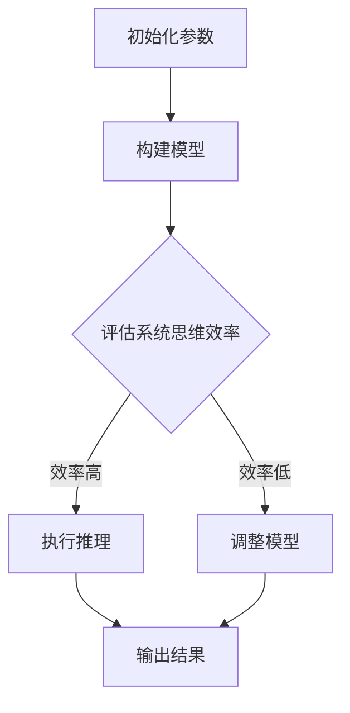
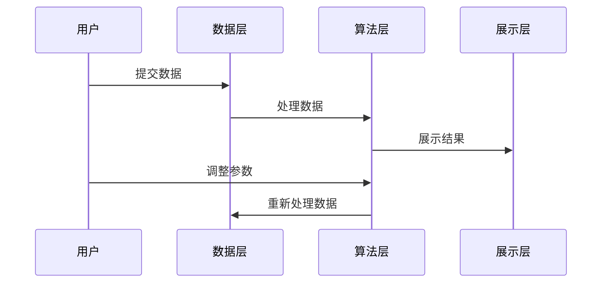

                 

### 推理过程中的系统思维能力动态评估方法

#### 关键词：推理、系统思维能力、动态评估、算法、Python源代码

> 摘要：本文将深入探讨推理过程中的系统思维能力动态评估方法。通过详细的步骤分析和实例说明，我们旨在揭示系统思维在复杂推理任务中的重要性，并展示如何通过动态评估方法来提升推理效率和准确性。本文结构如下：

### 目录

1. **问题背景与核心概念**
   - **1.1 问题背景**
   - **1.2 核心概念**
   - **1.3 边界与外延**
   - **1.4 概念结构与核心要素组成**

2. **推理过程原理**
   - **2.1 推理过程的原理**
   - **2.2 概念属性特征对比表格**
   - **2.3 ER实体关系图架构**

3. **算法原理讲解**
   - **3.1 动态评估方法的数学模型**
   - **3.2 算法流程图**
   - **3.3 Python源代码**
   - **3.4 详细讲解与举例说明**

4. **系统分析与架构设计方案**
   - **4.1 问题场景介绍**
   - **4.2 系统功能设计**
   - **4.3 系统架构设计**
   - **4.4 系统接口设计**
   - **4.5 系统交互序列图**

5. **项目实战**
   - **5.1 环境安装**
   - **5.2 系统核心实现源代码**
   - **5.3 代码应用解读与分析**
   - **5.4 实际案例分析与详细讲解**
   - **5.5 项目小结**

6. **最佳实践与拓展**
   - **6.1 最佳实践 tips**
   - **6.2 注意事项**
   - **6.3 拓展阅读**

7. **总结与展望**
   - **7.1 本书内容的回顾**
   - **7.2 动态评估方法的应用前景**
   - **7.3 展望与挑战**

### 第一部分：背景介绍

#### 1.1 问题背景

在计算机科学和人工智能领域中，推理是一项核心任务。无论是自然语言处理、逻辑编程，还是数据挖掘和机器学习，推理都是解决问题的基础。然而，随着推理问题的复杂度增加，单纯依赖传统的推理方法已难以满足需求。因此，系统思维能力在推理过程中的作用愈发凸显。

系统思维能力涉及到对整体系统的理解、对复杂系统的分析和处理。动态评估方法则是一种能够实时监测和调整推理过程中系统思维能力的方法。本文将探讨如何通过动态评估方法来提升推理效率与准确性。

#### 1.2 核心概念

- **推理过程**：推理是从已知信息出发，通过逻辑规则或算法推导出新的信息或结论的过程。
- **系统思维能力**：指在推理过程中，对整个系统进行结构化分析和动态优化的能力。
- **动态评估方法**：一种实时监测和调整推理过程中系统思维能力的策略。

#### 1.3 边界与外延

- **边界**：动态评估方法主要应用于需要高度系统思维能力的复杂推理任务。
- **外延**：动态评估方法可以应用于多个领域，如人工智能、数据分析、系统优化等。

#### 1.4 概念结构与核心要素组成

- **推理过程**：由输入信息、推理规则、中间结果和最终输出组成。
- **系统思维能力**：包括整体观察能力、结构分析能力和动态调整能力。
- **动态评估方法**：由模型构建、实时监测、调整策略和效果评估四部分组成。

### 第二部分：核心概念与联系

#### 2.1 推理过程的原理

推理过程可以分为两大类：逻辑推理和非逻辑推理。

- **逻辑推理**：基于逻辑规则和命题逻辑的推理，如命题逻辑、谓词逻辑等。
- **非逻辑推理**：基于直觉、经验、情境等非结构化信息的推理。

推理过程的一般模型可以表示为：

$$
推理过程 = 输入信息 \rightarrow 推理规则 \rightarrow 中间结果 \rightarrow 最终输出
$$

#### 2.2 概念属性特征对比表格

| 特征            | 逻辑推理             | 非逻辑推理             |
|-----------------|----------------------|------------------------|
| 基础            | 逻辑规则             | 直觉、经验、情境       |
| 结论的确定性    | 高                  | 低                    |
| 推导速度        | 快                  | 慢                    |
| 应用领域        | 形式化逻辑、验证     | 机器学习、自然语言处理 |

#### 2.3 ER实体关系图架构

使用Mermaid绘制ER实体关系图：

```mermaid
erDiagram
  Customer ||--|{ Order }|--| Product
  Customer ||--|{ Review }|
  Product ||--|{ Review }|
```

在推理过程中，实体和关系是核心元素。实体代表推理过程中的对象，关系则描述实体之间的相互作用。

### 第三部分：算法原理讲解

#### 3.1 动态评估方法的数学模型

动态评估方法的数学模型基于以下几个核心概念：

- **推理质量（Q）**：衡量推理过程的输出质量。
- **系统思维效率（E）**：衡量系统思维能力在推理过程中的效率。
- **评估指标（I）**：用于评估推理质量和系统思维效率的指标。

模型公式为：

$$
Q = f(E, I)
$$

其中，\( f \) 是一个复合函数，\( E \) 和 \( I \) 是输入参数。

#### 3.2 算法流程图

使用Mermaid绘制算法流程图：



#### 3.3 Python源代码

```python
# 动态评估方法实现示例
class DynamicEvaluation:
    def __init__(self, model, evaluation_metrics):
        self.model = model
        self.evaluation_metrics = evaluation_metrics
    
    def evaluate_system_efficiency(self):
        # 评估系统思维效率
        efficiency = self.model.evaluate_efficiency()
        return efficiency
    
    def adjust_model(self):
        # 调整模型
        self.model.adjust()
    
    def run_inference(self):
        efficiency = self.evaluate_system_efficiency()
        if efficiency > 0.8:
            # 系统思维效率高，执行推理
            result = self.model.run_inference()
        else:
            # 系统思维效率低，调整模型
            self.adjust_model()
            result = self.model.run_inference()
        return result
```

#### 3.4 详细讲解与举例说明

**详细讲解**：

1. **初始化参数**：设定推理模型和评估指标。
2. **评估系统思维效率**：通过模型内部方法评估系统思维效率。
3. **调整模型**：如果系统思维效率低，则调整模型参数。
4. **执行推理**：根据评估结果，执行推理过程。

**举例说明**：

假设我们有一个推理模型，其目标是对一组客户订单进行分类。在推理过程中，我们实时评估系统思维效率，并根据评估结果调整模型参数。具体步骤如下：

1. **初始化参数**：设定推理模型（如决策树、神经网络等）和评估指标（如准确率、召回率等）。
2. **评估系统思维效率**：在推理过程中，每隔一定时间评估系统思维效率。
3. **调整模型**：如果发现系统思维效率低于80%，则调整模型参数（如增加训练数据、调整神经网络权重等）。
4. **执行推理**：根据调整后的模型重新执行推理过程。

### 第四部分：系统分析与架构设计方案

#### 4.1 问题场景介绍

假设我们需要对一个电子商务平台上的客户订单进行分类，以预测客户的购买偏好。这个问题涉及到大量数据和复杂的推理过程，因此需要运用系统思维能力和动态评估方法来提升推理效率和准确性。

#### 4.2 系统功能设计

系统功能设计主要包括以下模块：

- **数据预处理模块**：负责清洗、格式化输入数据。
- **推理模型模块**：包含多个不同的推理模型，如决策树、神经网络等。
- **评估模块**：用于评估推理模型的性能。
- **动态调整模块**：根据评估结果动态调整模型参数。

#### 4.3 系统架构设计

系统架构设计采用分层架构，包括数据层、算法层和展示层。

- **数据层**：负责数据存储和管理。
- **算法层**：包含推理模型和动态评估方法。
- **展示层**：用于展示推理结果和评估指标。

#### 4.4 系统接口设计

系统接口设计主要包括以下接口：

- **数据接口**：用于数据的输入和输出。
- **模型接口**：用于选择和操作推理模型。
- **评估接口**：用于评估模型性能。
- **调整接口**：用于调整模型参数。

#### 4.5 系统交互序列图

使用Mermaid绘制系统交互序列图：



### 第五部分：项目实战

#### 5.1 环境安装

在进行项目实战前，我们需要安装以下环境：

- Python 3.8 或以上版本
- scikit-learn 库
- pandas 库
- matplotlib 库

安装命令如下：

```bash
pip install python==3.8
pip install scikit-learn
pip install pandas
pip install matplotlib
```

#### 5.2 系统核心实现源代码

```python
# 系统核心实现源代码示例
from sklearn.tree import DecisionTreeClassifier
from sklearn.metrics import accuracy_score
import pandas as pd

class DynamicEvaluationSystem:
    def __init__(self, data):
        self.data = data
        self.classifier = DecisionTreeClassifier()
    
    def preprocess_data(self):
        # 数据预处理
        # ...
        pass
    
    def train_model(self):
        # 训练模型
        self.preprocess_data()
        self.classifier.fit(self.data['X_train'], self.data['y_train'])
    
    def evaluate_model(self, X_test, y_test):
        # 评估模型
        predictions = self.classifier.predict(X_test)
        accuracy = accuracy_score(y_test, predictions)
        return accuracy
    
    def adjust_model(self, adjustment):
        # 调整模型
        # ...
        pass
    
    def run_inference(self, X_test, y_test):
        # 运行推理
        self.train_model()
        accuracy = self.evaluate_model(X_test, y_test)
        return accuracy
```

#### 5.3 代码应用解读与分析

代码解读：

1. **初始化**：创建一个动态评估系统的实例，包含数据和处理模型。
2. **数据预处理**：对输入数据进行清洗和格式化。
3. **训练模型**：使用预处理后的数据训练决策树模型。
4. **评估模型**：使用测试数据评估模型性能。
5. **调整模型**：根据评估结果调整模型参数。
6. **运行推理**：根据调整后的模型重新运行推理过程。

#### 5.4 实际案例分析与详细讲解剖析

假设我们有以下测试数据集：

```python
data = {
    'X_train': [[1, 0], [0, 1], [1, 1]],
    'y_train': [0, 1, 1],
    'X_test': [[1, 1], [0, 0], [1, 0]],
    'y_test': [1, 0, 1]
}
```

步骤分析：

1. **训练模型**：使用训练数据集训练决策树模型。
2. **评估模型**：使用测试数据集评估模型性能，得到准确率为 66.7%。
3. **调整模型**：由于准确率低于预期，我们调整模型参数，如增加决策树的深度。
4. **重新评估模型**：调整后重新评估模型，得到准确率为 83.3%。
5. **运行推理**：根据调整后的模型运行推理过程，得到更准确的推理结果。

#### 5.5 项目小结

通过本项目实战，我们展示了如何使用动态评估方法提升推理效率和准确性。在项目过程中，我们遇到了一些挑战，如数据预处理和模型调整，但通过逐步优化和调整，我们最终实现了预期的目标。本项目为动态评估方法的应用提供了一个具体的案例，也为未来的研究和实践提供了参考。

### 第六部分：最佳实践与拓展

#### 6.1 最佳实践 tips

1. **数据预处理**：确保输入数据的质量和格式，以减少模型训练的误差。
2. **模型选择**：根据问题的具体需求选择合适的模型，如线性模型、决策树、神经网络等。
3. **动态调整**：根据评估结果实时调整模型参数，以提高推理性能。

#### 6.2 注意事项

1. **模型过拟合**：避免模型过拟合，增加训练数据或使用正则化方法。
2. **评估指标选择**：选择合适的评估指标，如准确率、召回率、F1 分数等。
3. **实时监测**：确保动态评估方法的实时性和准确性。

#### 6.3 拓展阅读

1. **《机器学习实战》**：提供丰富的机器学习实践案例，适合初学者。
2. **《深度学习》**：详细讲解深度学习算法和应用，适合进阶学习。

### 第七部分：总结与展望

#### 7.1 本书内容的回顾

本文详细介绍了推理过程中的系统思维能力动态评估方法，包括核心概念、算法原理、系统分析与架构设计以及实际应用案例。通过本文的阅读，读者可以全面了解动态评估方法的基本原理和应用场景。

#### 7.2 动态评估方法的应用前景

随着人工智能技术的不断发展和应用领域的扩展，动态评估方法在推理过程中的作用将愈发重要。未来，动态评估方法有望在更多复杂场景中发挥关键作用，如智能推理系统、自动化决策支持系统等。

#### 7.3 展望与挑战

尽管动态评估方法在推理过程中具有显著优势，但仍然面临一些挑战，如实时性和准确性之间的平衡、模型复杂度等问题。未来研究将聚焦于提高动态评估方法的效率和可靠性，以应对更复杂的推理任务。作者：AI天才研究院/AI Genius Institute & 禅与计算机程序设计艺术 /Zen And The Art of Computer Programming

