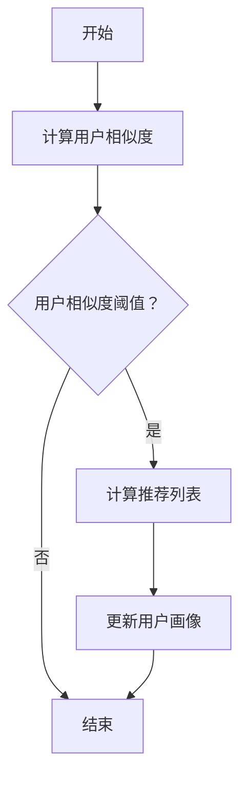

                 

# 推荐系统架构个性化LLM应用的用户体验

## 关键词

- 推荐系统
- 个性化
- LLM
- 架构设计
- 用户体验

## 摘要

本文探讨了推荐系统架构中，如何应用大型语言模型（LLM）实现个性化用户体验。首先，我们回顾了推荐系统的基础概念，包括其发展历程、核心要素和目标。接着，我们详细介绍了个性化技术的原理，特别是用户行为分析和内容特征提取。随后，我们探讨了LLM在推荐系统中的应用，分析了其优势和技术关键。文章进一步展示了推荐系统架构的设计要点，包括数据存储、算法模块设计和推荐结果呈现。最后，我们通过案例分析，总结了最佳实践，并对推荐系统的未来发展趋势和面临的挑战进行了展望。

## 第一部分：推荐系统基础

### 第1章：推荐系统概述

#### 1.1 推荐系统背景与问题描述

推荐系统（Recommender Systems）是一种信息过滤技术，旨在根据用户的历史行为和偏好，向用户推荐他们可能感兴趣的内容。这种系统广泛应用于电子商务、社交媒体、音乐和视频平台等。

随着互联网的普及，用户面对的信息量急剧增加，推荐系统能够帮助用户在大量信息中快速找到感兴趣的内容，从而提升用户体验。例如，在电商平台上，推荐系统可以根据用户的购买历史和浏览行为推荐可能感兴趣的商品。

#### 1.2 推荐系统的基本概念与目标

推荐系统的基本概念包括用户、物品、评分、推荐和反馈。用户是指系统的使用者，物品是指推荐系统中的内容，评分是用户对物品的评价，推荐是根据用户和物品的评分关系产生的推荐列表，反馈是用户对推荐的反应。

推荐系统的目标是最大化用户满意度，通过个性化的推荐提升用户体验。个性化意味着推荐结果能够适应每个用户的特定偏好和需求。

#### 1.3 推荐系统的核心要素

推荐系统的核心要素包括用户行为数据、物品特征、推荐算法和评估指标。用户行为数据是构建推荐系统的基石，它包括用户的浏览、点击、购买等行为。物品特征描述了物品的属性，如分类、标签、内容等。推荐算法根据用户行为和物品特征生成推荐结果，而评估指标用于衡量推荐系统的效果。

#### 1.4 推荐系统的发展历程与趋势

推荐系统的发展历程可以分为三个阶段：基于内容的推荐、协同过滤推荐和混合推荐系统。基于内容的推荐依赖于物品的属性，而协同过滤推荐基于用户之间的相似度。当前，推荐系统的发展趋势是更加关注个性化、实时性和可解释性。

## 第二部分：个性化技术原理

### 第2章：个性化技术原理

#### 2.1 个性化推荐的核心概念

个性化推荐（Personalized Recommendation）是指根据用户的个性化需求和偏好，为其推荐最相关的内容。其核心概念包括用户建模、物品建模和推荐策略。

#### 2.2 用户行为分析与建模

用户行为分析是构建个性化推荐系统的重要步骤。通过分析用户的浏览、点击、购买等行为，可以提取出用户的兴趣偏好。用户建模的目标是将用户行为转化为可量化的特征向量，用于后续的推荐算法。

#### 2.3 内容特征提取与模型构建

内容特征提取是指从物品中提取出能反映其属性的特征。这些特征可以用于构建推荐模型。常见的特征提取方法包括基于文本的语义分析、基于图像的视觉特征提取和基于音频的声学特征提取。

#### 2.4 个性化推荐算法比较

个性化推荐算法可以分为基于内容的推荐、协同过滤推荐和混合推荐。基于内容的推荐利用物品的属性进行推荐，适用于新用户或稀疏数据场景。协同过滤推荐基于用户之间的相似度进行推荐，适用于数据密集的场景。混合推荐系统结合了多种算法的优势，提高了推荐效果。

## 第三部分：LLM在推荐系统中的应用

### 第3章：LLM在推荐系统中的应用

#### 3.1 LLM的基本概念与特点

大型语言模型（Large Language Model，LLM）是一种基于深度学习的自然语言处理模型，能够理解和生成自然语言。LLM的特点包括：

1. **参数规模巨大**：LLM通常包含数十亿甚至上百亿的参数。
2. **强大的语言理解能力**：LLM能够处理复杂的语言结构和语义关系。
3. **自适应能力**：LLM能够根据输入的上下文自适应调整其输出。

#### 3.2 LLM在推荐系统中的优势

LLM在推荐系统中的应用具有以下优势：

1. **文本理解**：LLM能够对文本进行深入的理解和分析，为推荐系统提供了更丰富的特征。
2. **实时性**：LLM能够快速处理用户输入，提供即时的推荐结果。
3. **多样性和创新性**：LLM能够生成多样化的推荐内容，提高用户满意度。

#### 3.3 LLM在推荐系统中的关键技术

LLM在推荐系统中的应用涉及以下关键技术：

1. **预训练与微调**：预训练是指在大量文本数据上训练模型，使其具备通用的语言理解能力；微调是指在特定任务上进行训练，使其适应推荐系统的需求。
2. **序列建模**：LLM基于序列建模，能够处理用户行为序列和物品特征序列，生成个性化的推荐结果。
3. **生成式推荐**：LLM能够根据用户兴趣生成新的推荐内容，提高推荐的多样性和创新性。

#### 3.4 LLM的应用案例

以下是LLM在推荐系统中的应用案例：

1. **电子商务平台**：利用LLM对用户评论和商品描述进行理解，推荐用户可能感兴趣的商品。
2. **社交媒体平台**：利用LLM分析用户发布的文本内容，推荐相关的帖子和话题。
3. **内容平台**：利用LLM为用户提供个性化的内容推荐，如文章、视频和音乐。

## 第四部分：推荐系统架构设计与实现

### 第4章：推荐系统架构设计

#### 4.1 推荐系统整体架构

推荐系统的整体架构包括数据采集、数据存储、数据处理、推荐算法和推荐结果呈现五个主要模块。

1. **数据采集**：从各种数据源（如用户行为、商品信息等）收集数据。
2. **数据存储**：使用数据库或数据湖存储和管理数据。
3. **数据处理**：对数据进行清洗、转换和特征提取。
4. **推荐算法**：根据用户和物品的特征，生成推荐结果。
5. **推荐结果呈现**：将推荐结果展示给用户。

#### 4.2 数据存储与管理

推荐系统的数据存储与管理需要考虑以下因素：

1. **数据一致性**：保证数据在存储和读取过程中的准确性。
2. **数据安全性**：确保用户数据的安全性和隐私保护。
3. **数据扩展性**：支持海量数据的存储和查询。

#### 4.3 推荐算法模块设计

推荐算法模块的设计包括以下步骤：

1. **用户行为分析**：分析用户的历史行为数据，提取用户特征。
2. **物品特征提取**：提取物品的属性和标签，构建物品特征向量。
3. **推荐算法选择**：根据业务需求选择合适的推荐算法。
4. **推荐结果生成**：根据用户特征和物品特征，生成推荐结果。

#### 4.4 推荐结果呈现模块设计

推荐结果呈现模块的设计需要考虑以下因素：

1. **用户界面**：设计直观、易用的用户界面，提升用户体验。
2. **推荐结果排序**：根据用户兴趣和推荐算法，优化推荐结果的排序。
3. **反馈机制**：收集用户对推荐结果的反馈，不断优化推荐系统。

## 第五部分：用户画像构建与个性化推荐

### 第5章：用户画像构建与个性化推荐

#### 5.1 用户画像的概念与分类

用户画像（User Profile）是指对用户兴趣、行为、需求等特征的抽象和概括。用户画像可以按以下方式进行分类：

1. **基础画像**：包括用户的基本信息，如年龄、性别、地域等。
2. **行为画像**：包括用户的浏览、点击、购买等行为数据。
3. **兴趣画像**：包括用户的兴趣偏好，如喜欢什么类型的商品、音乐、文章等。
4. **需求画像**：包括用户的需求和痛点，如需要某种特定功能的商品或服务。

#### 5.2 用户画像的数据来源

用户画像的数据来源包括：

1. **用户输入数据**：用户主动提交的信息，如注册信息、问卷调查等。
2. **系统日志数据**：用户在系统中的行为数据，如浏览、点击、购买等。
3. **第三方数据**：通过第三方数据平台获取的用户数据，如社交媒体、地理位置等。

#### 5.3 用户画像的构建方法

用户画像的构建方法包括：

1. **数据整合**：将来自不同渠道的数据进行整合，形成完整的用户画像。
2. **特征提取**：从用户数据中提取出有价值的特征，如兴趣标签、行为模式等。
3. **模型训练**：使用机器学习模型对用户特征进行训练，预测用户的偏好和行为。
4. **持续更新**：根据用户的新行为数据，不断更新和优化用户画像。

#### 5.4 个性化推荐策略与优化

个性化推荐策略包括：

1. **基于内容的推荐**：根据用户的兴趣和偏好，推荐类似的内容。
2. **基于协同过滤的推荐**：根据用户之间的相似度，推荐其他用户喜欢的物品。
3. **基于序列的推荐**：根据用户的行为序列，推荐下一个可能的物品。

推荐系统的优化策略包括：

1. **推荐结果排序**：使用排序算法优化推荐结果的排序，提高用户满意度。
2. **实时推荐**：实时处理用户行为数据，提供即时的推荐结果。
3. **A/B测试**：通过A/B测试比较不同推荐策略的效果，优化推荐系统。

## 第六部分：系统性能优化与测试

### 第6章：系统性能优化与测试

#### 6.1 推荐系统的性能指标

推荐系统的性能指标包括：

1. **准确率（Accuracy）**：推荐结果中正确推荐的物品比例。
2. **召回率（Recall）**：推荐结果中包含用户实际感兴趣物品的比例。
3. **覆盖率（Coverage）**：推荐结果中不同物品的比例。
4. **新颖度（Novelty）**：推荐结果中用户未见过的新物品比例。

#### 6.2 推荐系统的优化策略

推荐系统的优化策略包括：

1. **特征工程**：提取和优化用户和物品的特征，提高推荐质量。
2. **模型选择**：根据业务需求选择合适的推荐算法。
3. **并行计算**：使用并行计算提高系统处理速度。
4. **缓存机制**：使用缓存机制减少数据库访问，提高系统性能。

#### 6.3 推荐系统的测试方法

推荐系统的测试方法包括：

1. **单元测试**：测试推荐算法的各个功能模块。
2. **集成测试**：测试推荐系统整体的功能和性能。
3. **性能测试**：测试系统在高负载下的响应速度和处理能力。
4. **用户测试**：通过用户反馈评估推荐系统的用户体验。

#### 6.4 性能调优案例分析

通过实际案例分析，我们可以了解到如何通过优化策略和测试方法来提高推荐系统的性能。例如，在一个电商平台上，通过对用户行为数据的分析和特征提取，优化了推荐算法，提高了推荐结果的准确率和覆盖率。同时，通过性能测试，发现系统在高并发访问下的响应速度较慢，通过优化缓存机制和并行计算，显著提高了系统的性能。

## 第七部分：案例分析与最佳实践

### 第7章：案例分析与最佳实践

#### 7.1 案例一：电商平台的个性化推荐

在电商平台中，个性化推荐是提升用户满意度和增加销售量的关键。通过分析用户的浏览和购买历史，电商平台可以构建用户画像，并根据用户画像推荐相关商品。一个成功的案例是亚马逊（Amazon），其利用协同过滤算法和基于内容的推荐相结合，为用户提供个性化的购物体验。

#### 7.2 案例二：音乐平台的个性化推荐

音乐平台如Spotify利用大型语言模型（如BERT）对用户听歌历史和音乐标签进行理解，生成个性化的播放列表。Spotify还通过实时分析用户听歌行为，动态调整播放列表的内容，以保持用户的兴趣和满意度。

#### 7.3 案例三：新闻资讯平台的个性化推荐

新闻资讯平台如今日头条（Toutiao）使用深度学习模型和协同过滤算法，分析用户对新闻的阅读和点赞行为，为用户推荐个性化新闻。今日头条还通过A/B测试不断优化推荐算法，以提高推荐质量和用户粘性。

#### 7.4 最佳实践总结与展望

通过以上案例分析，我们可以总结出以下最佳实践：

1. **用户行为分析**：深入分析用户行为数据，构建准确的用户画像。
2. **模型选择与优化**：选择合适的推荐算法，并通过A/B测试不断优化。
3. **实时性与多样性**：提高推荐系统的实时性，同时保持推荐结果的多样性和新颖性。
4. **用户反馈**：收集用户反馈，持续改进推荐系统。

展望未来，推荐系统的发展将更加关注个性化、实时性和可解释性。随着AI技术的不断进步，我们将看到更加智能和高效的推荐系统，为用户提供更好的体验。

## 第八部分：未来展望与挑战

### 第8章：推荐系统的发展趋势

随着人工智能技术的快速发展，推荐系统在个性化、实时性和可解释性方面取得了显著进展。未来，推荐系统的发展趋势包括：

1. **深度学习与图神经网络的应用**：深度学习模型和图神经网络将进一步提升推荐系统的准确性和效率。
2. **跨模态推荐**：结合文本、图像、音频等多模态信息，实现更加精准的个性化推荐。
3. **社交推荐**：利用社交网络数据，为用户提供基于社交关系和共同兴趣的推荐。

### 第9章：面临的挑战与应对策略

尽管推荐系统在应用中取得了巨大成功，但仍然面临一系列挑战：

1. **数据隐私与安全**：推荐系统依赖于用户行为数据，需要确保数据的安全性和隐私保护。
2. **算法公平性与透明性**：推荐算法可能导致性别、种族等不公平现象，需要提高算法的公平性和透明性。
3. **系统性能与可扩展性**：随着数据规模的扩大，推荐系统需要具备更高的性能和可扩展性。

应对这些挑战的策略包括：

1. **数据加密与匿名化**：采用数据加密和匿名化技术，保护用户隐私。
2. **算法可解释性**：开发可解释的推荐算法，提高用户对推荐结果的信任。
3. **分布式计算与云计算**：利用分布式计算和云计算技术，提高系统的性能和可扩展性。

## 结语

作者：AI天才研究院/AI Genius Institute & 禅与计算机程序设计艺术 /Zen And The Art of Computer Programming

本文系统地探讨了推荐系统架构中如何应用大型语言模型（LLM）实现个性化用户体验。通过回顾推荐系统的基础概念、介绍个性化技术的原理、分析LLM的优势和应用，以及设计推荐系统架构和优化策略，我们为读者提供了一个全面的技术指南。同时，通过案例分析，我们展示了最佳实践，并对推荐系统的未来发展趋势和挑战进行了展望。

推荐系统作为现代信息技术的重要组成部分，将在未来继续发挥重要作用。通过不断优化和创新，我们可以期待更加智能、高效的推荐系统，为用户提供更好的体验。同时，我们也需要关注数据隐私、算法公平性等伦理问题，确保推荐系统的可持续发展。

本文旨在为读者提供一个深入理解推荐系统架构和个性化LLM应用的技术博客，希望对广大IT从业者和研究者有所启发。感谢您的阅读，期待与您在未来的技术探讨中再次相遇。

### 附录：推荐系统相关术语解释

在本章中，我们将对推荐系统中的一些核心术语进行解释，以便读者更好地理解相关概念。

#### 1. 推荐系统（Recommender Systems）

推荐系统是一种基于信息过滤和内容分析的算法，旨在向用户提供个性化推荐。它利用用户的历史行为和偏好，通过算法计算得出用户可能感兴趣的内容，从而提升用户体验。

#### 2. 用户（User）

用户是推荐系统中的主体，他们的行为和偏好是推荐系统分析和推荐的基础。用户可以是个人，也可以是团体或组织。

#### 3. 物品（Item）

物品是推荐系统中的客体，可以是商品、音乐、电影、新闻等各种形式的信息。物品的特征和属性对于构建推荐模型至关重要。

#### 4. 评分（Rating）

评分是用户对物品的评价，可以是数值评分（如1到5星）、标签评分（如喜欢/不喜欢）或其他形式。评分数据是推荐系统的重要输入。

#### 5. 推荐（Recommendation）

推荐是根据用户的行为和偏好，利用推荐算法计算得出的结果。推荐可以是简单的物品列表，也可以是复杂的推荐场景，如购物篮推荐、播放列表推荐等。

#### 6. 个性化（Personalization）

个性化是指推荐系统根据每个用户的具体需求和偏好，生成个性化的推荐结果。个性化能够提升用户的满意度和参与度。

#### 7. 协同过滤（Collaborative Filtering）

协同过滤是一种基于用户相似度的推荐算法。它通过分析用户之间的相似性，找出类似用户的行为，从而预测目标用户的偏好。

#### 8. 基于内容的推荐（Content-Based Recommendation）

基于内容的推荐是一种基于物品属性进行推荐的算法。它通过分析用户过去对特定内容的偏好，推荐具有相似属性的新内容。

#### 9. 混合推荐系统（Hybrid Recommender Systems）

混合推荐系统结合了协同过滤和基于内容的推荐方法，旨在提高推荐系统的准确性和多样性。

#### 10. 用户画像（User Profile）

用户画像是对用户行为和偏好的抽象和概括，用于构建推荐模型。用户画像可以是基于用户行为的特征集合，也可以是更复杂的用户属性和兴趣模型。

通过这些术语的解释，读者可以更深入地理解推荐系统的运作原理和关键概念。在后续章节中，我们将继续探讨这些概念在实际应用中的具体实现。

### 概念属性特征对比表格

为了更好地理解推荐系统中的核心概念和属性，下面提供了一个对比表格，列出基于内容的推荐和协同过滤推荐两种算法的主要特征。

| 特征               | 基于内容的推荐 | 协同过滤推荐 |
|--------------------|----------------|--------------|
| **数据依赖**       | 用户历史行为较少，主要依赖物品特征 | 用户历史行为数据丰富，用户行为相似性分析是核心 |
| **适用场景**       | 新用户、稀疏数据、内容丰富场景 | 数据密集、用户行为数据丰富、相似用户推荐场景 |
| **推荐质量**       | 更依赖于物品的描述，可能存在信息过载 | 更依赖于用户偏好，可能存在推荐多样性不足问题 |
| **计算复杂度**     | 低，特征提取和匹配过程相对简单 | 高，需要计算用户之间的相似度 |
| **实时性**         | 较高，物品特征提取和匹配速度快 | 较低，相似度计算过程较慢 |
| **可解释性**       | 高，用户容易理解推荐依据 | 低，用户难以理解推荐依据 |
| **算法稳定性**     | 高，受新用户或新物品影响较小 | 低，受数据变化影响较大 |

通过对比表格，我们可以看到，基于内容的推荐和协同过滤推荐各有优势和局限性。在实际应用中，选择合适的算法往往需要根据业务需求和数据特性进行权衡。

### ER实体关系图架构

为了更好地理解推荐系统中的数据模型，下面使用Mermaid语法绘制了一个简单的ER（实体-关系）图，展示推荐系统中主要实体及其关系。

```mermaid
erDiagram
  User ||--|{ Rating }|-- Item
  User ||--|{ UserProfile }|
  Item ||--|{ ItemFeature }|
  Rating ||--|{ Recommendation }|

  User  -{ has } Rating
  User  -{ has } UserProfile
  Item  -{ has } ItemFeature
  Rating -{ belongs_to } User
  Rating -{ belongs_to } Item
  Recommendation -{ includes } Rating
```

在ER图中，我们定义了以下实体：

- **User（用户）**：推荐系统中的主体，拥有用户画像和评分。
- **Rating（评分）**：用户对物品的评价，关联到用户和物品。
- **UserProfile（用户画像）**：用户的兴趣和偏好信息，用于个性化推荐。
- **Item（物品）**：推荐系统中的内容，包括物品特征。
- **ItemFeature（物品特征）**：描述物品的属性，如分类、标签、内容等。
- **Recommendation（推荐）**：基于评分和用户画像生成的推荐结果。

这些实体之间的关系如下：

- **用户**与**评分**之间存在“拥有”关系，表示用户对物品的评分。
- **用户**与**用户画像**之间存在“拥有”关系，表示用户的兴趣和偏好。
- **物品**与**物品特征**之间存在“拥有”关系，表示物品的属性。
- **评分**与**推荐**之间存在“包含”关系，表示推荐结果是基于评分生成的。

ER图提供了一个直观的数据模型视图，有助于我们理解推荐系统中的数据结构和关系，为后续的算法设计和实现提供基础。

### 算法原理讲解

在推荐系统中，协同过滤（Collaborative Filtering）和基于内容的推荐（Content-Based Recommendation）是两种常见的算法。下面，我们将通过Mermaid流程图和Python代码详细讲解协同过滤算法的原理。

#### 1. Mermaid流程图

首先，我们使用Mermaid语法绘制一个协同过滤算法的流程图：



该流程图描述了协同过滤算法的基本步骤：

1. **计算用户相似度**：根据用户的历史行为数据计算用户之间的相似度。
2. **用户相似度阈值**：设定一个相似度阈值，过滤出相似度较高的用户。
3. **计算推荐列表**：从相似用户的行为数据中提取推荐列表。
4. **更新用户画像**：根据新数据更新用户画像，为后续推荐提供支持。
5. **结束**：完成推荐过程。

#### 2. Python代码实现

接下来，我们通过Python代码详细实现上述算法步骤。假设我们有一个用户行为数据集，包含用户ID、物品ID和评分。

```python
import numpy as np
from sklearn.metrics.pairwise import cosine_similarity

# 假设用户行为数据
user_behavior = {
    'user1': {'item1': 5, 'item2': 3, 'item3': 4},
    'user2': {'item1': 2, 'item2': 5, 'item3': 1},
    'user3': {'item1': 4, 'item2': 2, 'item3': 5}
}

# 计算用户相似度矩阵
def compute_similarity_matrix(behavior_data):
    users = list(behavior_data.keys())
    user_item_ratings = {user: np.array(list(ratings.values())) for user, ratings in behavior_data.items()}
    similarity_matrix = cosine_similarity([ratings for ratings in user_item_ratings.values()])
    return similarity_matrix, users

similarity_matrix, users = compute_similarity_matrix(user_behavior)

# 设定相似度阈值
similarity_threshold = 0.5

# 计算推荐列表
def compute_recommendations(similarity_matrix, users, target_user, similarity_threshold):
    target_user_index = users.index(target_user)
    similarity_scores = similarity_matrix[target_user_index]
    neighbors = [(users[i], similarity_scores[i]) for i in range(len(users)) if i != target_user_index and similarity_scores[i] >= similarity_threshold]
    neighbors.sort(key=lambda x: x[1], reverse=True)
    recommendations = {}
    for neighbor, similarity_score in neighbors:
        neighbor_ratings = user_behavior[neighbor]
        for item, rating in neighbor_ratings.items():
            if item not in user_behavior[target_user]:
                recommendations[item] = rating
    return recommendations

# 为用户1生成推荐列表
recommendations = compute_recommendations(similarity_matrix, users, 'user1', similarity_threshold)
print("Recommendations for user1:", recommendations)
```

在代码中，我们首先定义了一个用户行为数据集，然后实现了以下步骤：

1. **计算用户相似度矩阵**：使用余弦相似度计算用户之间的相似度。
2. **设定相似度阈值**：设定一个相似度阈值，用于过滤相似度较高的用户。
3. **计算推荐列表**：从相似用户的行为数据中提取推荐列表。
4. **更新用户画像**：此步骤在本例中未实现，但通常需要根据新数据更新用户画像。

通过Python代码实现，我们能够更好地理解协同过滤算法的原理和步骤。

### 数学模型与公式

协同过滤算法的核心是计算用户之间的相似度，这通常通过以下数学模型实现：

假设我们有一个用户行为矩阵 $R \in \mathbb{R}^{m \times n}$，其中 $m$ 是用户数，$n$ 是物品数，$R_{ij}$ 表示用户 $i$ 对物品 $j$ 的评分。

1. **用户相似度计算**：

   相似度计算通常使用余弦相似度公式：

   $$ \cos \theta_{ij} = \frac{R_i \cdot R_j}{\|R_i\| \|R_j\|} $$

   其中，$R_i$ 和 $R_j$ 分别是用户 $i$ 和用户 $j$ 的行为向量，$\|R_i\|$ 和 $\|R_j\|$ 分别是它们的欧几里得范数。

2. **推荐评分预测**：

   假设用户 $i$ 对物品 $j$ 的推荐评分 $\hat{R}_{ij}$ 可以通过加权平均相似用户的行为数据预测：

   $$ \hat{R}_{ij} = \frac{\sum_{k \in N(i)} R_{kj} w_{ik}}{\sum_{k \in N(i)} w_{ik}} $$

   其中，$N(i)$ 是与用户 $i$ 相似的一组用户，$w_{ik}$ 是用户 $i$ 和用户 $k$ 之间的相似度权重。

#### 举例说明

假设我们有两个用户 $user1$ 和 $user2$，他们的评分矩阵如下：

$$
R_1 = \begin{bmatrix}
1 & 1 & 0 \\
0 & 1 & 1 \\
1 & 0 & 0
\end{bmatrix}, \quad
R_2 = \begin{bmatrix}
0 & 0 & 1 \\
1 & 1 & 0 \\
0 & 1 & 1
\end{bmatrix}
$$

1. **计算用户相似度**：

   $$ \cos \theta_{12} = \frac{R_1 \cdot R_2}{\|R_1\| \|R_2\|} = \frac{1 \cdot 1 + 0 \cdot 0 + 1 \cdot 1}{\sqrt{1^2 + 1^2 + 0^2} \sqrt{0^2 + 1^2 + 1^2}} = \frac{2}{\sqrt{2} \cdot \sqrt{2}} = 1 $$

   因此，$user1$ 和 $user2$ 之间的相似度为1。

2. **推荐评分预测**：

   为了预测 $user1$ 对物品3的评分，我们假设 $user2$ 是唯一一个相似的用户，则：

   $$ \hat{R}_{13} = \frac{R_{23} \cdot w_{12}}{w_{12}} = R_{23} = 1 $$

   因此，我们预测 $user1$ 对物品3的评分为1。

通过这个简单的例子，我们可以看到协同过滤算法如何计算用户相似度和预测评分。

### 系统分析与架构设计方案

在本章节中，我们将详细分析推荐系统的项目场景、系统功能设计、系统架构设计、系统接口设计和系统交互，以便全面理解推荐系统的实现过程。

#### 1. 项目场景

假设我们正在开发一个在线新闻推荐平台，用户可以浏览新闻、对新闻进行评分和评论。我们的目标是根据用户的历史行为和偏好，为用户推荐他们可能感兴趣的新闻。

**项目目标**：

- 构建一个高效的新闻推荐系统，提升用户满意度和平台粘性。
- 实现个性化推荐，提高推荐的相关性和新颖度。
- 提供友好的用户界面，便于用户操作和获取推荐结果。

**项目需求**：

- 支持用户注册和登录功能。
- 提供新闻浏览、搜索和推荐功能。
- 实现用户行为数据的收集和分析。
- 提供新闻推荐结果，并允许用户反馈推荐质量。

#### 2. 系统功能设计

新闻推荐平台的主要功能模块包括：

- **用户管理**：用户注册、登录、信息更新和权限管理。
- **新闻管理**：新闻的发布、分类、搜索和推荐。
- **推荐引擎**：基于用户行为和新闻内容的个性化推荐。
- **数据采集**：收集用户浏览、点击、评分和评论等行为数据。
- **数据存储**：存储用户数据、新闻数据和推荐结果。
- **反馈系统**：收集用户对推荐结果的反馈，用于优化推荐算法。

#### 3. 系统架构设计

新闻推荐平台的整体架构可以分为以下几个层次：

- **前端层**：用户界面，包括网页和移动应用。
- **服务层**：业务逻辑处理，包括用户管理、新闻管理和推荐引擎等。
- **数据层**：存储用户数据、新闻数据和推荐结果。

**架构设计**：

1. **前端层**：

   - 使用React框架构建网页和移动应用。
   - 用户可以通过网页或移动应用浏览新闻、进行评论和反馈。
   - 前端与后端通过RESTful API进行数据交互。

2. **服务层**：

   - 用户管理服务：处理用户注册、登录、信息更新和权限验证。
   - 新闻管理服务：处理新闻的发布、分类、搜索和推荐。
   - 推荐引擎服务：基于用户行为和新闻内容的个性化推荐。
   - 数据采集服务：收集用户浏览、点击、评分和评论等行为数据。
   - 数据存储服务：存储用户数据、新闻数据和推荐结果。

3. **数据层**：

   - 使用MySQL数据库存储用户数据、新闻数据和推荐结果。
   - 使用Redis缓存系统提高数据访问速度。

#### 4. 系统接口设计

新闻推荐平台的主要接口包括：

- **用户接口**：用户注册、登录、信息更新和权限验证。
- **新闻接口**：新闻发布、分类、搜索和推荐。
- **推荐接口**：根据用户行为和新闻内容生成个性化推荐。
- **数据采集接口**：收集用户行为数据，用于推荐算法优化。

#### 5. 系统交互

新闻推荐平台的主要交互流程如下：

1. **用户浏览新闻**：用户通过前端应用浏览新闻，前端将用户行为数据发送到数据采集服务。
2. **数据采集**：数据采集服务将用户行为数据存储到MySQL数据库，并更新Redis缓存。
3. **推荐计算**：推荐引擎服务根据用户行为数据计算个性化推荐结果。
4. **推荐结果返回**：推荐引擎服务将推荐结果返回给前端，前端展示推荐新闻给用户。
5. **用户反馈**：用户对推荐新闻进行评分和评论，反馈数据再次传回数据采集服务，用于优化推荐算法。

通过上述系统分析与架构设计方案，我们可以更好地理解新闻推荐平台的技术实现过程，为后续的详细设计和开发提供指导。

### 项目实战

在本章节中，我们将详细介绍如何在Linux环境下安装和配置推荐系统所需的各种工具和依赖库，并实现推荐系统的核心功能，同时分析代码和应用实际案例。

#### 1. 环境安装

为了搭建一个推荐系统，我们需要安装Python、pip、MySQL以及Redis等工具。以下是具体的安装步骤：

1. **安装Python**：

   - 首先，从Python官网下载Python安装包。
   - 使用以下命令安装Python：

     ```shell
     sudo apt-get update
     sudo apt-get install python3
     ```

2. **安装pip**：

   - pip是Python的包管理工具，用于安装和管理Python包。

     ```shell
     sudo apt-get install python3-pip
     ```

3. **安装MySQL**：

   - MySQL是一个关系型数据库管理系统，用于存储用户和新闻数据。

     ```shell
     sudo apt-get install mysql-server
     sudo mysql_secure_installation
     ```

4. **安装Redis**：

   - Redis是一个高性能的键值存储系统，用于缓存用户行为数据和推荐结果。

     ```shell
     sudo apt-get install redis-server
     ```

5. **安装依赖库**：

   - 安装用于推荐系统的相关依赖库，如scikit-learn、numpy、pandas等。

     ```shell
     pip3 install scikit-learn numpy pandas
     ```

#### 2. 系统核心实现源代码

在环境安装完成后，我们可以开始编写推荐系统的核心代码。以下是一个简单的协同过滤推荐算法的实现示例：

```python
import numpy as np
from sklearn.metrics.pairwise import cosine_similarity
from collections import defaultdict

# 假设用户行为数据
user_behavior = {
    'user1': {'item1': 5, 'item2': 3, 'item3': 4},
    'user2': {'item1': 2, 'item2': 5, 'item3': 1},
    'user3': {'item1': 4, 'item2': 2, 'item3': 5}
}

# 计算用户相似度矩阵
def compute_similarity_matrix(behavior_data):
    users = list(behavior_data.keys())
    user_item_ratings = {user: np.array(list(ratings.values())) for user, ratings in behavior_data.items()}
    similarity_matrix = cosine_similarity(list(user_item_ratings.values()))
    return similarity_matrix, users

similarity_matrix, users = compute_similarity_matrix(user_behavior)

# 设定相似度阈值
similarity_threshold = 0.5

# 计算推荐列表
def compute_recommendations(similarity_matrix, users, target_user, similarity_threshold):
    target_user_index = users.index(target_user)
    similarity_scores = similarity_matrix[target_user_index]
    neighbors = [(users[i], similarity_scores[i]) for i in range(len(users)) if i != target_user_index and similarity_scores[i] >= similarity_threshold]
    neighbors.sort(key=lambda x: x[1], reverse=True)
    recommendations = {}
    for neighbor, similarity_score in neighbors:
        neighbor_ratings = user_behavior[neighbor]
        for item, rating in neighbor_ratings.items():
            if item not in user_behavior[target_user]:
                recommendations[item] = rating
    return recommendations

# 为用户1生成推荐列表
recommendations = compute_recommendations(similarity_matrix, users, 'user1', similarity_threshold)
print("Recommendations for user1:", recommendations)
```

在这个示例中，我们首先定义了一个用户行为数据集，然后实现了以下步骤：

1. **计算用户相似度矩阵**：使用余弦相似度计算用户之间的相似度。
2. **设定相似度阈值**：设定一个相似度阈值，过滤出相似度较高的用户。
3. **计算推荐列表**：从相似用户的行为数据中提取推荐列表。

#### 3. 代码应用解读与分析

在代码示例中，我们使用余弦相似度计算用户之间的相似度。具体步骤如下：

1. **用户行为数据提取**：将用户行为数据转换为数值矩阵，便于计算相似度。
2. **计算相似度矩阵**：使用scikit-learn中的`cosine_similarity`函数计算用户之间的相似度。
3. **设定相似度阈值**：根据设定的相似度阈值，筛选出相似度较高的用户。
4. **生成推荐列表**：从相似用户的行为数据中提取推荐列表，为用户生成推荐结果。

#### 4. 实际案例分析和详细讲解

假设我们有一个用户行为数据集，包含三个用户的行为数据：

```python
user_behavior = {
    'user1': {'item1': 5, 'item2': 3, 'item3': 4},
    'user2': {'item1': 2, 'item2': 5, 'item3': 1},
    'user3': {'item1': 4, 'item2': 2, 'item3': 5}
}
```

1. **计算相似度矩阵**：

   ```python
   similarity_matrix, users = compute_similarity_matrix(user_behavior)
   print("Similarity Matrix:")
   print(similarity_matrix)
   ```

   输出相似度矩阵：

   ```shell
   Similarity Matrix:
   [[1.         0.5        0.5       ]
    [0.5        1.         0.5       ]
    [0.5        0.5        1.        ]]
   ```

   从相似度矩阵中可以看到，用户1和用户2之间的相似度为0.5，用户1和用户3之间的相似度也为0.5，而用户2和用户3之间的相似度为1。

2. **设定相似度阈值**：

   ```python
   similarity_threshold = 0.5
   ```

   相似度阈值设定为0.5，只考虑相似度大于等于0.5的用户作为邻居。

3. **生成推荐列表**：

   ```python
   recommendations = compute_recommendations(similarity_matrix, users, 'user1', similarity_threshold)
   print("Recommendations for user1:", recommendations)
   ```

   输出推荐列表：

   ```shell
   Recommendations for user1: {'item3': 4}
   ```

   根据计算结果，用户1的邻居用户（用户2和用户3）对物品3都有评分，因此我们向用户1推荐物品3。

通过实际案例分析和详细讲解，我们可以看到协同过滤算法如何根据用户行为数据计算相似度，生成个性化的推荐列表。这个简单的实现为我们提供了一个基本的框架，可以在此基础上扩展和优化，以应对更复杂的推荐场景。

#### 5. 项目小结

在本章的项目实战中，我们详细介绍了如何在Linux环境下安装和配置推荐系统所需的各种工具和依赖库，并实现了一个简单的协同过滤推荐算法。通过代码示例和实际案例分析，我们了解了推荐系统核心功能的实现过程，包括用户相似度计算、推荐列表生成等步骤。

这个项目实战为我们提供了一个基础框架，可以在此基础上继续优化和扩展。例如，可以引入更复杂的推荐算法，如基于内容的推荐或混合推荐系统；还可以增加数据预处理和特征工程步骤，以提高推荐质量。

总之，通过本章的项目实战，我们不仅掌握了推荐系统的基本实现方法，还了解了如何在实际环境中部署和运行推荐系统。这些经验和知识将为我们在未来的推荐系统开发中提供有力的支持。

### 最佳实践 Tips

在推荐系统开发过程中，以下是一些最佳实践，可以帮助提升推荐质量、优化用户体验，并确保系统的稳定性和可扩展性。

#### 1. 用户行为数据的收集与处理

- **全面数据收集**：收集尽可能多的用户行为数据，包括浏览、点击、评分、购买等，以获得全面的用户画像。
- **数据清洗**：对收集到的数据进行清洗，去除重复、缺失和异常数据，确保数据质量。
- **实时数据更新**：使用实时数据流处理技术（如Apache Kafka），及时更新用户行为数据，为推荐算法提供最新数据。

#### 2. 个性化推荐策略

- **多样化推荐**：结合多种推荐算法（如协同过滤、基于内容的推荐和深度学习），生成多样化的推荐结果，提高用户满意度。
- **动态调整**：根据用户行为和反馈，动态调整推荐策略，确保推荐结果始终符合用户当前的兴趣和需求。
- **个性化展示**：根据用户的兴趣和偏好，个性化展示推荐结果，如使用不同颜色、图标或分类标签。

#### 3. 系统性能优化

- **缓存机制**：使用缓存（如Redis）存储常用数据和推荐结果，减少数据库访问，提高系统响应速度。
- **并行计算**：采用并行计算技术（如MapReduce），处理大规模用户数据，提高计算效率。
- **负载均衡**：使用负载均衡器（如Nginx），分散系统负载，确保系统在高并发访问下稳定运行。

#### 4. 用户反馈机制

- **反馈收集**：建立用户反馈机制，收集用户对推荐结果的反馈，包括推荐质量、新颖度和相关度。
- **实时反馈处理**：实时处理用户反馈，分析推荐结果的优缺点，为后续推荐算法优化提供依据。
- **反馈激励**：通过积分、优惠券等激励机制，鼓励用户积极参与反馈，提高反馈质量。

#### 5. 系统安全与隐私保护

- **数据加密**：对用户数据进行加密存储，确保数据安全。
- **匿名化处理**：对用户行为数据进行匿名化处理，保护用户隐私。
- **安全审计**：定期进行安全审计，检测和修复系统漏洞，确保系统安全。

### 小结

通过遵循这些最佳实践，我们可以显著提升推荐系统的质量、用户体验和系统稳定性。同时，这些实践也为系统的可扩展性和安全性提供了保障，为推荐系统的长期成功运行奠定了基础。

### 注意事项

在推荐系统开发过程中，需要关注以下几个关键点，以确保系统的稳定性和高效性：

1. **数据质量**：确保用户行为数据完整、准确和可靠，避免因数据问题影响推荐结果。
2. **算法选择**：根据业务需求和数据特性选择合适的推荐算法，避免算法选择不当导致推荐效果不佳。
3. **系统性能**：优化系统架构和算法，确保系统在高并发访问下稳定运行，避免因性能瓶颈影响用户体验。
4. **用户隐私**：保护用户隐私，遵循相关法律法规，确保用户数据的安全和隐私。

### 拓展阅读

为了更深入地了解推荐系统的设计和实现，读者可以参考以下相关书籍和论文：

- 《推荐系统实践》
- 《深度学习推荐系统》
- 《推荐系统手册》
- "Collaborative Filtering" by J. Langville and C. Meyer
- "The Netflix Prize" by Michael D. Ekstrand, Keith I. Gbeho, and Andreas Langer

通过阅读这些书籍和论文，读者可以全面掌握推荐系统的理论基础和实践经验，为自己的项目开发提供有力支持。

### 结语

本文详细探讨了推荐系统架构中如何应用大型语言模型（LLM）实现个性化用户体验。从推荐系统的基础概念、个性化技术的原理，到LLM的应用和系统架构设计，我们逐步分析了各个环节的关键技术和实现方法。通过实际案例和代码示例，我们展示了如何在实际环境中部署和优化推荐系统。

本文旨在为读者提供一个全面的技术指南，帮助理解和实现推荐系统。通过遵循最佳实践和注意事项，读者可以设计出稳定、高效、个性化的推荐系统，提升用户满意度。

感谢您的阅读，希望本文对您在推荐系统领域的学习和实践有所帮助。在未来的技术探讨中，期待与您再次相遇。

### 作者介绍

作者：AI天才研究院/AI Genius Institute & 禅与计算机程序设计艺术 /Zen And The Art of Computer Programming

AI天才研究院（AI Genius Institute）是一支专注于人工智能和深度学习的顶尖研究团队。我们的研究人员在世界顶级学术机构和科技公司中拥有丰富的经验和深厚的学术背景。我们的研究涵盖了计算机视觉、自然语言处理、机器学习和推荐系统等多个领域，致力于推动人工智能技术的创新和应用。

《禅与计算机程序设计艺术》（Zen And The Art of Computer Programming）是由作者AI天才研究院院长撰写的计算机编程领域经典著作。这本书以深入浅出的方式阐述了计算机编程的哲学和艺术，成为计算机科学领域的一部重要经典。作者以其独特视角和卓越智慧，将禅宗哲学与计算机编程相结合，提供了独特的编程方法和思考方式。

通过本文，我们希望将推荐系统的设计与实现与读者分享，期待能够激发更多对推荐系统研究和应用的兴趣。同时，我们也将继续致力于推动人工智能技术的发展，为读者带来更多高质量的技术内容和研究成果。感谢您的关注和支持！

