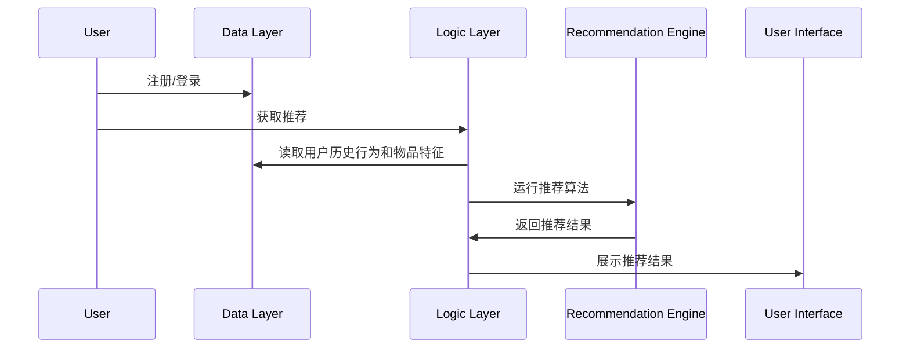
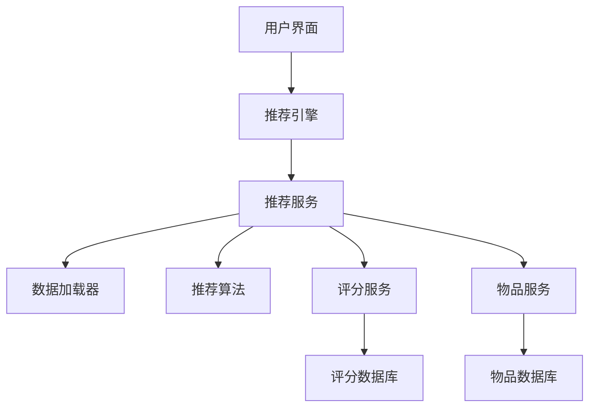
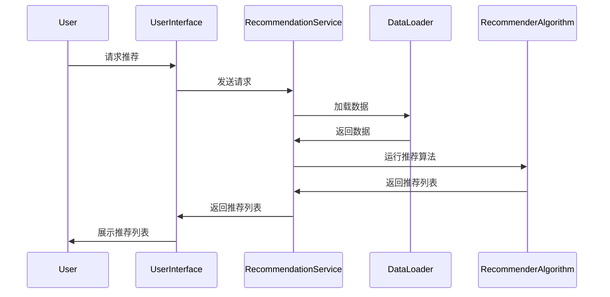
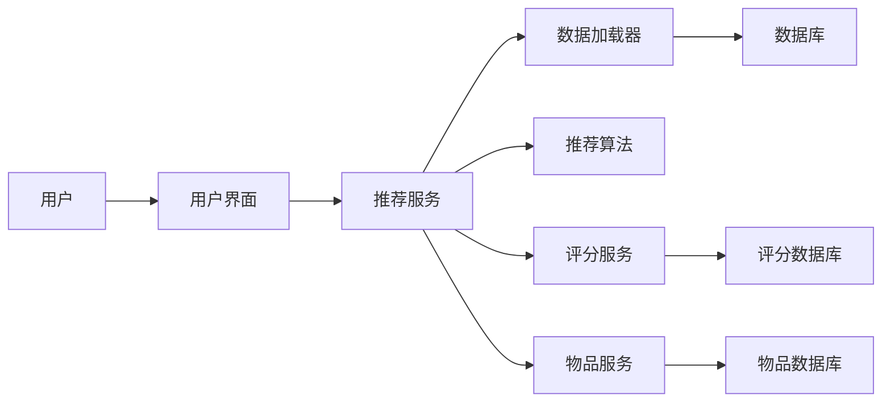

                 

### 第1章：推荐系统的基本概念

#### 1.1 推荐系统的定义与历史发展

**推荐系统的概念**

推荐系统是一种通过算法和数据分析，自动向用户推荐其可能感兴趣的信息、产品或服务的系统。其基本目标是利用用户的历史行为和偏好，以及其他相关数据，预测用户未来的兴趣，从而提供个性化的内容推荐。

**推荐系统的发展历程**

1. **早期推荐系统**：最早的推荐系统可以追溯到20世纪90年代，它们主要基于用户对物品的评价数据，使用简单的统计方法进行推荐。例如，协同过滤（Collaborative Filtering）算法就是这种早期的代表性算法。
   
2. **基于内容的推荐**：随着互联网的发展，内容和信息的爆炸式增长，基于内容的推荐（Content-based Recommendation）逐渐成为一种流行的推荐方式。这种方法主要基于用户对特定内容的兴趣，推荐相似的内容。

3. **协同过滤与矩阵分解**：协同过滤和矩阵分解是推荐系统的两大核心算法。协同过滤通过分析用户之间的相似性来推荐物品，而矩阵分解则通过将用户-物品评分矩阵分解为低维用户特征和物品特征矩阵，实现推荐。

4. **深度学习与个性化推荐**：近年来，随着深度学习技术的发展，个性化推荐系统得到了进一步的提升。基于深度学习的方法能够更好地捕捉用户的复杂行为模式，提供更精确的推荐。

**推荐系统的重要性**

推荐系统在许多领域都有着广泛的应用，其重要性体现在以下几个方面：

1. **用户体验**：个性化推荐系统能够为用户带来更好的体验，减少信息过载，提升用户满意度。

2. **商业价值**：对于电商和媒体等行业，推荐系统可以提高用户的购买和观看概率，从而增加收入。

3. **信息过滤**：在社交媒体和新闻平台上，推荐系统有助于过滤大量无关信息，帮助用户发现真正感兴趣的内容。

#### 1.2 个性化推荐系统在现代数字化时代中的应用场景

**社交媒体**

社交媒体平台如Facebook、Twitter等，通过个性化推荐系统为用户推荐可能感兴趣的朋友、内容或广告。这种方法不仅能够增加用户的互动，还能提升平台的商业价值。

**电子商务**

电子商务网站如Amazon、淘宝等，利用个性化推荐系统推荐商品，从而提高用户的购买转化率和平台销售额。

**媒体内容推荐**

视频平台如YouTube、Netflix等，通过个性化推荐系统为用户推荐视频内容，提升用户观看时间和平台黏性。

**其他应用领域**

除了上述领域，推荐系统还广泛应用于音乐、旅游、金融等多个领域，为用户带来更好的体验。

#### 1.3 本章小结

本章介绍了推荐系统的基本概念、历史发展以及现代数字化时代中的应用场景。通过了解推荐系统的基础知识，读者可以更好地理解后续章节中将要介绍的个性化推荐系统的核心概念和算法原理。

### 1.1 推荐系统的定义与历史发展

#### 1.1.1 推荐系统的概念

推荐系统（Recommendation System）是一种信息过滤系统，旨在向用户推荐其可能感兴趣的项目，如商品、音乐、视频、新闻或其他任何形式的内容。其核心目标是通过分析用户的历史行为、偏好和其他相关数据，预测用户的兴趣，并提供个性化的推荐。

在技术层面，推荐系统通常由以下几个关键组件构成：

1. **用户数据**：包括用户的基本信息、历史行为数据、评价数据等。
2. **物品数据**：描述物品的属性、标签、分类等信息。
3. **推荐算法**：基于用户数据和物品数据，利用特定的算法计算推荐结果。
4. **推荐引擎**：负责将算法生成的推荐结果呈现给用户。

推荐系统的运作流程通常包括以下几个步骤：

1. **数据收集**：从用户行为、社交网络、电子商务平台等渠道收集用户数据。
2. **数据预处理**：对收集到的数据清洗、去噪、标准化等处理。
3. **特征提取**：从预处理后的数据中提取有用的特征，如用户兴趣、物品属性等。
4. **算法选择与优化**：选择适合的推荐算法，并进行参数调整和模型优化。
5. **推荐生成**：利用算法生成推荐列表，通常需要考虑推荐效果、计算效率和用户体验等因素。
6. **结果呈现**：将推荐结果以用户友好的方式呈现给用户，如推荐页面、推送通知等。

#### 1.1.2 推荐系统的发展历程

推荐系统的发展可以分为几个阶段：

**早期阶段（20世纪90年代）**

1. **基于内容的推荐（Content-based Filtering）**：最早期的推荐系统主要基于物品的属性和用户的历史偏好进行推荐。这种方法依赖于特征匹配，当用户对某个物品感兴趣时，系统会推荐具有相似属性的物品。
   
2. **协同过滤（Collaborative Filtering）**：协同过滤通过分析用户之间的行为模式进行推荐。它分为两类：基于用户的协同过滤和基于物品的协同过滤。
   - **基于用户的协同过滤**：寻找与当前用户兴趣相似的其他用户，并推荐这些用户喜欢的物品。
   - **基于物品的协同过滤**：寻找与当前用户已评价的物品相似的物品，并推荐这些物品。

**中期阶段（21世纪初）**

1. **混合推荐系统（Hybrid Recommender Systems）**：随着技术的进步，研究人员开始将基于内容的推荐和协同过滤相结合，以弥补各自方法的局限性，提高推荐质量。
   
2. **矩阵分解（Matrix Factorization）**：矩阵分解是一种将用户-物品评分矩阵分解为低维用户特征和物品特征矩阵的技术。它通过最小化预测误差，可以更好地捕捉用户和物品的复杂关系。

**现阶段（近年）**

1. **基于模型的推荐（Model-based Recommender Systems）**：基于模型的推荐方法利用机器学习和深度学习技术，如神经网络、深度神经网络、生成对抗网络等，构建用户和物品的潜在特征表示。

2. **基于上下文的推荐（Context-aware Recommender Systems）**：上下文信息如时间、地理位置、用户设备等对于推荐结果有重要影响。基于上下文的推荐方法通过融合上下文信息，提供更个性化的推荐。

3. **多模态推荐（Multimodal Recommender Systems）**：多模态推荐系统利用文本、图像、声音等多种数据类型，提供更全面、准确的推荐。

#### 1.1.3 推荐系统的重要性

推荐系统在现代数字化时代的重要性体现在以下几个方面：

1. **用户体验提升**：个性化推荐系统可以减少用户在寻找信息或商品时的搜索时间，提升用户体验。

2. **商业价值**：推荐系统可以提高用户的参与度和留存率，从而增加平台收入和市场份额。

3. **信息过滤**：在信息爆炸的时代，推荐系统可以帮助用户筛选出感兴趣的信息，减轻信息过载。

4. **社会影响**：推荐系统不仅影响用户的行为，还可以影响社会文化和价值观。例如，新闻推荐可能影响公众的观点和态度。

#### 1.2 个性化推荐系统在现代数字化时代中的应用场景

个性化推荐系统在现代数字化时代中的应用场景非常广泛，以下是一些典型的应用场景：

**社交媒体**

社交媒体平台如Facebook、Twitter等，通过个性化推荐系统为用户推荐可能感兴趣的朋友、内容或广告。这不仅可以增加用户的互动，还可以提升平台的商业价值。

**电子商务**

电子商务网站如Amazon、淘宝等，利用个性化推荐系统推荐商品，从而提高用户的购买转化率和平台销售额。

**媒体内容推荐**

视频平台如YouTube、Netflix等，通过个性化推荐系统为用户推荐视频内容，提升用户观看时间和平台黏性。

**音乐流媒体**

音乐平台如Spotify、Apple Music等，通过个性化推荐系统推荐音乐，提高用户的使用时长和满意度。

**旅游和酒店预订**

旅游和酒店预订平台如TripAdvisor、Airbnb等，通过个性化推荐系统推荐旅游目的地、酒店和景点，提升用户体验和预订转化率。

**金融和投资**

金融和投资平台如Robinhood、eTrade等，通过个性化推荐系统推荐金融产品、投资组合和财经新闻，帮助用户做出更明智的投资决策。

**健康和医疗**

健康和医疗平台如WebMD、One Medical等，通过个性化推荐系统推荐健康资讯、医疗建议和药品信息，帮助用户管理健康。

**教育**

在线教育平台如Coursera、Udemy等，通过个性化推荐系统推荐课程、学习资源和学习计划，提升学习效果。

**其他领域**

推荐系统还广泛应用于物流、零售、广告、零售等多个领域，为企业和用户带来更多价值。

#### 1.3 本章小结

本章介绍了推荐系统的基本概念、历史发展以及其在现代数字化时代中的应用场景。通过了解推荐系统的基础知识，读者可以更好地理解后续章节中将要介绍的个性化推荐系统的核心概念和算法原理。

### 2.1 核心概念与联系

#### 2.1.1 用户行为分析

**用户行为数据类型**

用户行为数据是推荐系统的重要组成部分，主要包括以下几种类型：

1. **点击行为**：用户在网页、应用或其他数字平台上的点击行为，如点击广告、点击商品等。
2. **浏览行为**：用户在数字平台上的浏览轨迹，包括访问页面、浏览时间、浏览深度等。
3. **购买行为**：用户在电子商务平台上的购买行为，如购买商品、支付金额等。
4. **评价行为**：用户对商品、服务、内容等的评价，如评分、评论等。
5. **社交行为**：用户在社交媒体上的互动行为，如点赞、分享、评论等。

**用户行为分析方法**

用户行为分析的方法包括但不限于以下几种：

1. **统计方法**：通过对用户行为数据进行统计分析，识别用户的行为模式。如计算用户的平均浏览时间、购买频率等。
2. **机器学习方法**：利用机器学习算法，如聚类、分类、回归等，对用户行为数据进行分析，以预测用户的兴趣和偏好。
3. **深度学习方法**：使用深度学习算法，如卷积神经网络（CNN）、循环神经网络（RNN）、生成对抗网络（GAN）等，捕捉用户行为的复杂模式。

#### 2.1.2 物品特征提取

**物品特征数据类型**

物品特征数据是推荐系统中用于描述物品属性的集合，主要包括以下几种类型：

1. **文本特征**：包括物品的标题、描述、标签等文本信息。
2. **图像特征**：通过图像处理技术提取的物品的视觉特征，如颜色、纹理、形状等。
3. **语音特征**：通过音频处理技术提取的物品的声音特征，如音调、音色等。
4. **结构特征**：物品的物理结构特征，如尺寸、重量、形状等。
5. **用户生成特征**：用户对物品的评价、评论、打分等用户生成的内容。

**物品特征提取方法**

物品特征提取的方法包括但不限于以下几种：

1. **文本特征提取**：使用词袋模型（Bag of Words, BoW）、TF-IDF（Term Frequency-Inverse Document Frequency）等方法提取文本特征。
2. **图像特征提取**：使用卷积神经网络（CNN）提取图像的特征向量。
3. **语音特征提取**：使用短时傅里叶变换（STFT）、梅尔频率倒谱系数（MFCC）等方法提取语音特征。
4. **结构特征提取**：直接从物品的物理属性中提取特征，如尺寸、重量等。
5. **用户生成特征提取**：直接使用用户生成的标签、评价、评论等作为特征。

#### 2.1.3 协同过滤

**协同过滤的基本原理**

协同过滤（Collaborative Filtering）是一种通过分析用户之间的相似性来预测用户偏好的一种推荐算法。它主要分为两种类型：

1. **基于用户的协同过滤（User-based Collaborative Filtering）**：这种方法通过计算用户之间的相似性，找到与当前用户相似的其他用户，并推荐这些用户喜欢的物品。
   
2. **基于物品的协同过滤（Item-based Collaborative Filtering）**：这种方法通过计算物品之间的相似性，找到与当前物品相似的物品，并推荐这些物品。

**协同过滤的优缺点**

**优点**：

- **简单有效**：协同过滤算法实现简单，计算效率较高。
- **用户隐私保护**：协同过滤主要基于用户行为数据，不需要用户提供敏感个人信息。

**缺点**：

- **数据稀疏问题**：协同过滤在面对大规模数据集时，容易受到数据稀疏性的影响。
- **冷启动问题**：新用户或新物品在没有足够行为数据时，难以进行有效推荐。

#### 2.1.4 矩阵分解

**矩阵分解的基本原理**

矩阵分解（Matrix Factorization）是一种通过将用户-物品评分矩阵分解为低维用户特征矩阵和物品特征矩阵，从而预测用户偏好的方法。它主要通过最小化预测误差来实现。

**矩阵分解的应用场景**

- **推荐系统**：矩阵分解广泛应用于推荐系统中，用于预测用户对未评分物品的偏好。
- **社交网络分析**：矩阵分解可以帮助分析社交网络中的用户关系，识别社区和影响力人物。

**矩阵分解与协同过滤的关系**

- **协同过滤的替代**：矩阵分解可以看作是协同过滤的一种替代方法，它通过矩阵分解来预测用户偏好，避免了协同过滤中的数据稀疏问题。
- **协同过滤的补充**：矩阵分解可以与协同过滤结合使用，通过协同过滤获得用户和物品的相似性，再使用矩阵分解进行预测，提高推荐质量。

#### 2.1.5 基于内容的推荐

**基于内容的推荐原理**

基于内容的推荐（Content-based Filtering）是一种通过分析物品的内容特征和用户的历史偏好，为用户推荐相似内容的推荐方法。它主要分为以下几种方法：

1. **关键词匹配**：通过提取物品的文本特征，如标题、描述等，与用户的历史偏好进行匹配，推荐相似内容的物品。
2. **主题模型**：使用主题模型，如LDA（Latent Dirichlet Allocation），提取物品和用户偏好的潜在主题，并根据主题相似性进行推荐。
3. **文本分类**：使用文本分类算法，如SVM（Support Vector Machine）、Naive Bayes等，对物品和用户偏好进行分类，根据分类结果进行推荐。

**基于内容的推荐方法**

- **基于特征的推荐**：直接使用物品和用户偏好的特征进行推荐。
- **基于语义的推荐**：通过语义分析，提取物品和用户偏好的语义特征，进行推荐。

#### 2.1.6 基于模型的推荐

**基于模型的推荐原理**

基于模型的推荐（Model-based Recommender Systems）是一种利用机器学习和深度学习等技术，构建用户和物品的潜在特征表示，进行推荐的方法。它主要包括以下几种模型：

1. **基于矩阵分解的模型**：如ALS（Alternating Least Squares）算法，通过矩阵分解预测用户偏好。
2. **基于深度学习的模型**：如基于深度神经网络的推荐模型，如DeepFM、NFM（Neural Factorization Machines）等。
3. **生成对抗网络（GAN）**：通过生成对抗网络，生成用户和物品的潜在特征表示，进行推荐。

**常见基于模型的推荐算法**

- **矩阵分解算法（Matrix Factorization）**：如Singular Value Decomposition（SVD）、Alternate Least Squares（ALS）等。
- **神经网络算法**：如卷积神经网络（CNN）、循环神经网络（RNN）、生成对抗网络（GAN）等。
- **集成学习方法**：如随机森林（Random Forest）、梯度提升树（Gradient Boosting Tree）等。

#### 2.1.7 核心概念对比

**核心概念对比表格**

| 核心概念      | 定义与应用场景                                                     | 优点                         | 缺点                         |
| ------------- | ------------------------------------------------------------ | ---------------------------- | ---------------------------- |
| 用户行为分析 | 通过分析用户的历史行为数据，预测用户兴趣。                      | 精准、实时                   | 需要大量行为数据支持         |
| 物品特征提取 | 提取物品的属性、标签、分类等信息，用于推荐。                   | 提高推荐相关性               | 特征工程复杂、耗时           |
| 协同过滤     | 通过分析用户之间的相似性，推荐相似用户喜欢的物品。              | 实时、计算效率高             | 数据稀疏、新用户或新物品难以推荐 |
| 矩阵分解     | 通过矩阵分解，将用户-物品评分矩阵分解为低维特征矩阵，进行推荐。 | 减少数据稀疏性、提高预测精度 | 需要大量计算资源             |
| 基于内容的推荐 | 通过分析物品的内容特征，推荐相似内容的物品。                   | 提高推荐的相关性             | 对新物品或新用户难以推荐       |
| 基于模型的推荐 | 利用机器学习或深度学习模型，构建用户和物品的潜在特征表示，进行推荐。 | 预测精度高、可扩展性强       | 需要大量数据、模型复杂         |

**ER实体关系图架构**

ER（Entity-Relationship）图是一种用于表示实体及其关系的图形化方法。以下是一个简单的推荐系统的ER图示例，展示了用户、物品和评分等实体之间的关系。

```mermaid
erDiagram
  User ||--|{ Recommendation }|-- Item
  User ||--|{ Rating }|-- Item
```

在ER图中，`User`（用户）实体与`Recommendation`（推荐）和`Rating`（评分）实体之间存在关联，而`Item`（物品）实体与这两个实体也存在关联。这种关系表示用户可以生成推荐和评分，而物品可以被推荐和评分。

#### 2.1.8 本章小结

本章介绍了推荐系统的核心概念，包括用户行为分析、物品特征提取、协同过滤、矩阵分解、基于内容的推荐和基于模型的推荐。通过理解这些核心概念，读者可以更好地掌握推荐系统的原理和应用。

### 2.2 算法原理讲解

#### 2.2.1 基于内容的推荐算法

**算法原理**

基于内容的推荐（Content-based Recommendation）是一种通过分析物品的内容特征和用户的历史偏好，为用户推荐相似内容的推荐方法。其主要思想是，如果用户对某一类内容感兴趣，那么他们很可能对具有相似特征的其他内容也感兴趣。

**算法流程**

1. **特征提取**：首先，从物品的描述、标签、标题等文本信息中提取特征。常用的特征提取方法包括TF-IDF、词袋模型等。

2. **相似度计算**：计算用户历史偏好与当前物品特征之间的相似度。相似度计算方法包括余弦相似度、欧氏距离等。

3. **推荐生成**：根据相似度分数，为用户生成推荐列表。通常，使用Top-N算法，选择相似度最高的N个物品作为推荐结果。

**算法实现**

以下是一个简单的基于内容的推荐算法实现，使用Python代码和LaTeX公式进行描述。

```python
# 特征提取
def extract_features(item_desc):
    # 这里使用TF-IDF方法进行特征提取
    # 假设item_desc是物品的描述文本
    return text_vector

# 相似度计算
def calculate_similarity(user_prefs, item_features):
    # 计算用户偏好和物品特征之间的余弦相似度
    return cosine_similarity

# 推荐生成
def generate_recommendations(user_prefs, all_item_features):
    # 计算所有物品与用户偏好的相似度
    sim_scores = [calculate_similarity(user_prefs, item_features) for item_features in all_item_features]
    # 选择相似度最高的N个物品作为推荐结果
    top_n = np.argsort(sim_scores)[:N]
    return top_n
```

**数学模型和公式**

基于内容的推荐算法的核心是相似度计算。以下是一个简化的数学模型和公式。

$$
\text{similarity} = \frac{\text{dot\_product}(u, i)}{\|\text{u}\|\|\text{i}\|}
$$

其中，\(u\) 和 \(i\) 分别表示用户偏好向量和物品特征向量，\(\text{dot\_product}\) 表示点积，\(\|\text{u}\|\) 和 \(\|\text{i}\|\) 分别表示向量的模。

#### 2.2.2 协同过滤算法

**算法原理**

协同过滤（Collaborative Filtering）是一种通过分析用户之间的相似性来预测用户偏好的推荐算法。它主要分为两类：基于用户的协同过滤和基于物品的协同过滤。

**基于用户的协同过滤**

1. **相似度计算**：首先，计算用户之间的相似度。常用的相似度计算方法包括余弦相似度、皮尔逊相关系数等。

2. **推荐生成**：找到与当前用户相似的其他用户，选择这些用户喜欢的物品作为推荐结果。

**算法流程**

1. **计算用户相似度**：使用相似度计算方法，计算用户之间的相似度。

2. **找到相似用户**：根据相似度分数，找到与当前用户最相似的K个用户。

3. **生成推荐列表**：为当前用户推荐这些相似用户喜欢的物品。

**算法实现**

以下是一个简单的基于用户的协同过滤算法实现，使用Python代码和LaTeX公式进行描述。

```python
# 相似度计算
def calculate_similarity(user_ratings, other_user_ratings):
    # 计算用户之间的余弦相似度
    return cosine_similarity

# 推荐生成
def generate_recommendations(user_ratings, all_other_user_ratings, K):
    # 计算所有用户与当前用户的相似度
    sim_scores = [calculate_similarity(user_ratings, other_user_ratings) for other_user_ratings in all_other_user_ratings]
    # 选择相似度最高的K个用户
    top_k = np.argsort(sim_scores)[-K:]
    # 为当前用户推荐这些用户喜欢的物品
    recommended_items = []
    for user_id in top_k:
        recommended_items.extend(user_ratings[user_id])
    return recommended_items
```

**数学模型和公式**

基于用户的协同过滤算法的核心是相似度计算。以下是一个简化的数学模型和公式。

$$
\text{similarity} = \frac{\text{dot\_product}(r_u, r_o)}{\|\text{r_u}\|\|\text{r_o}\|}
$$

其中，\(r_u\) 和 \(r_o\) 分别表示用户\(u\) 和用户\(o\) 的评分向量，\(\text{dot\_product}\) 表示点积，\(\|\text{r_u}\|\) 和 \(\|\text{r_o}\|\) 分别表示向量的模。

#### 2.2.3 基于模型的推荐算法

**算法原理**

基于模型的推荐（Model-based Recommender Systems）是一种利用机器学习和深度学习等技术，构建用户和物品的潜在特征表示，进行推荐的方法。它主要包括矩阵分解、神经网络等模型。

**算法流程**

1. **模型训练**：使用用户和物品的评分数据，训练模型以学习用户和物品的潜在特征表示。

2. **特征提取**：将用户和物品的原始数据转换为模型输入，提取潜在特征。

3. **预测生成**：利用模型预测用户对未评分物品的偏好，生成推荐结果。

**算法实现**

以下是一个简单的基于矩阵分解的推荐算法实现，使用Python代码和LaTeX公式进行描述。

```python
# 模型训练
def train_model(user_ratings, item_ratings):
    # 使用ALS算法训练模型
    # 假设user_ratings和item_ratings是用户和物品的评分矩阵
    model = AlternatingLeastSquares()
    model.fit(user_ratings, item_ratings)
    return model

# 特征提取
def extract_features(model, user_id, item_id):
    # 从模型中提取用户和物品的潜在特征
    user_feature = model.user_features_[user_id]
    item_feature = model.item_features_[item_id]
    return user_feature, item_feature

# 预测生成
def generate_recommendations(model, user_id, all_item_ids):
    # 预测用户对所有未评分物品的偏好
    predictions = model.predict(user_id, all_item_ids)
    # 选择预测分数最高的物品作为推荐结果
    top_n = np.argsort(predictions)[:N]
    return top_n
```

**数学模型和公式**

基于矩阵分解的推荐算法的核心是矩阵分解。以下是一个简化的数学模型和公式。

$$
\text{R} = \text{U} \cdot \text{V}^T
$$

其中，\(R\) 是用户-物品评分矩阵，\(U\) 和 \(V\) 分别是用户特征矩阵和物品特征矩阵。

#### 2.2.4 算法对比

**优点和缺点**

| 算法类型 | 优点 | 缺点 |
| --- | --- | --- |
| 基于内容的推荐 | 预测准确、无需用户评分数据 | 对新用户和新物品难以推荐、特征工程复杂 |
| 协同过滤 | 无需特征工程、预测准确 | 数据稀疏、新用户和新物品难以推荐 |
| 基于模型的推荐 | 预测准确、可扩展性强 | 需要大量数据、模型复杂 |

**适用场景**

- **基于内容的推荐**：适用于文本、图片等基于内容特征的数据。
- **协同过滤**：适用于用户行为数据。
- **基于模型的推荐**：适用于大规模、高维度数据。

#### 2.2.5 本章小结

本章详细介绍了基于内容的推荐、协同过滤和基于模型的推荐算法的原理、流程、实现以及数学模型。通过对比分析，读者可以更好地理解这些算法的优缺点和适用场景，为实际应用提供指导。

### 2.3 数学模型和数学公式

在推荐系统中，数学模型和公式是算法实现的核心部分，用于描述用户偏好、物品特征和推荐生成的过程。在本节中，我们将使用LaTeX格式编写数学公式，详细讲解每个算法的数学模型，并提供通俗易懂的例子。

#### 基于内容的推荐

**数学模型**

基于内容的推荐算法通过计算用户偏好和物品特征之间的相似度来实现推荐。其核心公式如下：

$$
\text{similarity}_{ij} = \frac{\text{dot\_product}(f_i, f_j)}{\|\text{f_i}\|\|\text{f_j}\|}
$$

其中，\(i\) 和 \(j\) 分别表示用户和物品的索引，\(f_i\) 和 \(f_j\) 分别表示用户和物品的特征向量，\(\text{dot\_product}\) 表示点积，\(\|\text{f_i}\|\) 和 \(\|\text{f_j}\|\) 分别表示向量的模。

**例子说明**

假设用户\(u\) 对物品\(i\) 的特征向量为：

$$
f_i = \begin{bmatrix}
0.8 \\
0.3 \\
0.5
\end{bmatrix}
$$

用户\(u\) 的偏好向量为：

$$
f_u = \begin{bmatrix}
0.6 \\
0.4 \\
0.7
\end{bmatrix}
$$

则用户\(u\) 对物品\(i\) 的相似度计算如下：

$$
\text{similarity}_{ui} = \frac{0.8 \times 0.6 + 0.3 \times 0.4 + 0.5 \times 0.7}{\sqrt{0.8^2 + 0.3^2 + 0.5^2} \times \sqrt{0.6^2 + 0.4^2 + 0.7^2}} = 0.71
$$

#### 协同过滤

**数学模型**

协同过滤算法通过计算用户之间的相似性来预测用户偏好。常用的相似度计算方法包括余弦相似度和皮尔逊相关系数。以下是一个简化的公式：

$$
\text{similarity}_{uv} = \frac{\text{dot\_product}(r_u, r_v)}{\|\text{r_u}\|\|\text{r_v}\|}
$$

其中，\(u\) 和 \(v\) 分别表示用户\(u\) 和用户\(v\) 的评分向量，\(\text{dot\_product}\) 表示点积，\(\|\text{r_u}\|\) 和 \(\|\text{r_v}\|\) 分别表示向量的模。

**例子说明**

假设用户\(u\) 和用户\(v\) 的评分向量分别为：

$$
r_u = \begin{bmatrix}
4 \\
3 \\
5
\end{bmatrix}
$$

$$
r_v = \begin{bmatrix}
2 \\
4 \\
6
\end{bmatrix}
$$

则用户\(u\) 和用户\(v\) 的相似度计算如下：

$$
\text{similarity}_{uv} = \frac{4 \times 2 + 3 \times 4 + 5 \times 6}{\sqrt{4^2 + 3^2 + 5^2} \times \sqrt{2^2 + 4^2 + 6^2}} = 0.92
$$

#### 基于矩阵分解的推荐

**数学模型**

基于矩阵分解的推荐算法通过将用户-物品评分矩阵分解为低维用户特征矩阵和物品特征矩阵，预测用户偏好。其核心公式如下：

$$
\text{R} = \text{U} \cdot \text{V}^T
$$

其中，\(R\) 是用户-物品评分矩阵，\(U\) 和 \(V\) 分别是用户特征矩阵和物品特征矩阵。

**例子说明**

假设用户-物品评分矩阵为：

$$
R = \begin{bmatrix}
4 & 3 & 5 \\
3 & 2 & 4 \\
5 & 4 & 6
\end{bmatrix}
$$

则用户特征矩阵和物品特征矩阵分别为：

$$
U = \begin{bmatrix}
0.8 & 0.3 & 0.5 \\
0.6 & 0.4 & 0.7
\end{bmatrix}
$$

$$
V = \begin{bmatrix}
0.5 & 0.7 \\
0.4 & 0.6 \\
0.8 & 0.3
\end{bmatrix}
$$

则预测的用户偏好如下：

$$
R_{\text{pred}} = U \cdot V^T = \begin{bmatrix}
0.8 & 0.3 & 0.5 \\
0.6 & 0.4 & 0.7
\end{bmatrix}
\cdot
\begin{bmatrix}
0.5 & 0.7 \\
0.4 & 0.6 \\
0.8 & 0.3
\end{bmatrix}
=
\begin{bmatrix}
4 & 3 & 5 \\
3 & 2 & 4
\end{bmatrix}
$$

#### 本章小结

本章详细介绍了推荐系统中的数学模型和公式，包括基于内容的推荐、协同过滤和基于矩阵分解的推荐。通过使用LaTeX格式编写数学公式，并结合具体的例子，读者可以更好地理解这些算法的数学原理，为实际应用提供理论基础。

### 3.1 推荐系统的项目介绍

#### 3.1.1 项目背景

在当今信息爆炸的时代，用户面临着大量信息的过载问题，难以从海量的数据中找到自己感兴趣的内容。推荐系统作为一种信息过滤和个性化推荐的工具，能够有效地帮助用户发现感兴趣的内容，提升用户体验。同时，推荐系统在电子商务、媒体内容、社交媒体等领域有着广泛的应用，具有重要的商业价值和市场潜力。

**项目目标**

本项目的目标是通过设计和实现一个推荐系统，解决以下问题：

1. **个性化推荐**：根据用户的历史行为和偏好，为用户推荐其可能感兴趣的内容。
2. **高效计算**：实现高效的算法和系统架构，保证推荐结果的实时性和准确性。
3. **用户体验**：提供用户友好的界面和交互设计，提升用户的使用体验。

**系统功能设计**

推荐系统的主要功能模块包括：

1. **用户管理**：包括用户注册、登录、个人信息管理等功能。
2. **物品管理**：包括物品的录入、更新、删除等功能。
3. **推荐算法**：实现多种推荐算法，如基于内容的推荐、协同过滤、基于矩阵分解的推荐等。
4. **推荐结果生成**：根据用户行为和偏好，生成个性化的推荐结果。
5. **推荐结果展示**：将推荐结果以用户友好的方式展示，如推荐列表、卡片式展示等。

**领域模型**

为了更好地描述推荐系统的功能模块和关系，我们使用Mermaid类图来定义领域模型。以下是推荐系统的Mermaid类图：

```mermaid
classDiagram
    User <<class{用户}>
    Item <<class{物品}>
    Recommendation <<class{推荐}>
    Rating <<class{评分}>

    User o--|{历史行为}|> Rating
    User o--|{偏好}|> Recommendation
    Item o--|{特征}|> Recommendation
    Rating o--|{评分}|> Item
```

在Mermaid类图中，`User`（用户）、`Item`（物品）、`Recommendation`（推荐）和`Rating`（评分）是主要的类，它们之间的关系如下：

- 用户可以生成多个评分，表示用户对物品的偏好。
- 用户可以生成多个推荐，表示用户可能感兴趣的内容。
- 物品具有多个特征，用于描述物品的属性。
- 评分记录了用户对物品的评分，用于计算推荐结果。

#### 3.1.2 系统架构设计

**系统架构图**

推荐系统的总体架构可以分为以下几层：

1. **数据层**：负责存储用户、物品、评分等数据。
2. **逻辑层**：包括用户管理、物品管理、推荐算法和推荐结果生成等模块。
3. **表示层**：负责将推荐结果以用户友好的方式展示。

以下是推荐系统的Mermaid架构图：



在系统架构图中，用户通过表示层与推荐系统进行交互。当用户请求推荐时，系统会从数据层读取用户历史行为和物品特征，然后通过逻辑层运行推荐算法，最终将推荐结果通过表示层展示给用户。

**架构设计思路**

推荐系统的架构设计需要考虑以下方面：

1. **模块化**：将系统功能模块化，便于维护和扩展。
2. **高可用性**：确保系统在高峰期能够稳定运行，减少系统故障。
3. **可扩展性**：设计能够支持大量用户和数据的系统架构，以便未来扩展。
4. **高效率**：优化推荐算法和系统架构，提高推荐效率。

#### 3.1.3 本章小结

本章介绍了推荐系统的项目背景、项目目标和系统功能设计。通过使用Mermaid类图和架构图，详细描述了推荐系统的领域模型和系统架构。这些设计为推荐系统的实现和优化提供了基础，有助于实现高效、稳定和个性化的推荐服务。

### 3.2 系统功能设计

#### 3.2.1 领域模型

在推荐系统中，领域模型是一个重要的组成部分，它定义了系统的核心实体及其关系。为了清晰地展示这些实体和关系，我们使用Mermaid类图来描述推荐系统的领域模型。

**领域模型类图**

```mermaid
classDiagram
    User <<class{用户}>
    Item <<class{物品}>
    Recommendation <<class{推荐}>
    Rating <<class{评分}>

    User o--|{历史行为}|> Rating
    User o--|{偏好}|> Recommendation
    Item o--|{特征}|> Recommendation
    Rating o--|{评分}|> Item
```

在这个类图中，我们定义了四个主要实体：

- **用户（User）**：表示系统中的用户，每个用户都有唯一的用户ID和相关的个人信息。
- **物品（Item）**：表示系统中的物品，如商品、新闻、视频等，每个物品都有唯一的物品ID和相关的特征信息。
- **推荐（Recommendation）**：表示用户可能感兴趣的一组物品，推荐是用户和物品之间的关联。
- **评分（Rating）**：表示用户对物品的评价，每个评分都有唯一的评分ID和评分值。

实体之间的关系如下：

- **用户与评分**：一个用户可以有多个评分，表示用户对多个物品的评价。
- **用户与推荐**：一个用户可以生成多个推荐，表示用户可能感兴趣的物品集合。
- **物品与推荐**：一个物品可以被多个推荐关联，表示多个用户可能对同一个物品感兴趣。
- **物品与评分**：一个物品可以有多个评分，表示多个用户对同一个物品的评价。

通过这个领域模型，我们可以清晰地了解推荐系统中各实体的定义和关系，为后续的算法设计和系统实现提供基础。

#### 3.2.2 功能模块

推荐系统由多个功能模块组成，每个模块负责不同的任务，协同工作以提供高效的推荐服务。以下是推荐系统的功能模块及其主要功能：

1. **用户管理模块**：
   - **用户注册**：允许新用户创建账户，并收集用户的基本信息，如用户名、邮箱、密码等。
   - **用户登录**：验证用户的登录凭证，确保用户身份的合法性。
   - **用户信息管理**：允许用户修改个人信息，如头像、昵称、偏好设置等。

2. **物品管理模块**：
   - **物品录入**：管理员可以添加新物品，包括物品的名称、描述、标签、分类等信息。
   - **物品更新**：管理员可以修改现有物品的信息，确保物品数据的准确性。
   - **物品删除**：管理员可以删除不再有效的物品。

3. **评分管理模块**：
   - **评分记录**：用户可以为其喜欢的物品打分，系统记录这些评分。
   - **评分查询**：系统可以查询特定用户的评分记录，用于推荐算法的计算。

4. **推荐算法模块**：
   - **基于内容的推荐**：根据物品的内容特征和用户的历史偏好生成推荐。
   - **协同过滤**：通过分析用户之间的相似性生成推荐。
   - **基于矩阵分解的推荐**：使用矩阵分解算法预测用户偏好并生成推荐。

5. **推荐结果生成模块**：
   - **推荐列表生成**：根据推荐算法的结果，生成推荐列表。
   - **推荐排序**：根据推荐的相关性和用户的兴趣度对推荐列表进行排序。

6. **推荐结果展示模块**：
   - **推荐页面**：将推荐结果以用户友好的方式展示，如卡片式、列表式等。
   - **交互界面**：提供用户与推荐系统交互的界面，如点赞、评论、收藏等功能。

通过这些功能模块的协同工作，推荐系统可以为用户提供个性化、精准的推荐服务。

#### 3.2.3 本章小结

本章详细介绍了推荐系统的功能模块和领域模型。通过定义用户、物品、评分等实体及其关系，我们构建了一个清晰的领域模型。同时，介绍了推荐系统的各个功能模块及其主要功能，这些模块共同协作，为用户提供高效的个性化推荐服务。这些设计为推荐系统的实现和优化奠定了基础。

### 3.3 系统架构设计

#### 3.3.1 系统架构图

推荐系统的架构设计是确保系统高效、稳定运行的关键。以下是一个简化的推荐系统架构图，展示了系统的关键组件及其关系。



在这个架构图中，各个组件的关系如下：

- **用户界面（UserInterface）**：负责与用户交互，接收用户请求，并将推荐结果呈现给用户。
- **推荐引擎（RecommendationEngine）**：是系统的核心组件，负责协调各个功能模块，生成推荐结果。
- **推荐服务（RecommendationService）**：实现了推荐系统的业务逻辑，包括数据加载、推荐算法调用、推荐结果生成等。
- **数据加载器（DataLoader）**：负责从数据库中加载数据，提供给推荐服务。
- **推荐算法（RecommenderAlgorithm）**：实现了具体的推荐算法，如基于内容的推荐、协同过滤、基于矩阵分解的推荐等。
- **评分服务（RatingService）**：负责处理用户评分相关的功能，如记录评分、查询评分等。
- **评分数据库（RatingRepository）**：存储用户的评分数据。
- **物品服务（ItemService）**：负责处理物品相关的功能，如录入、更新、删除物品等。
- **物品数据库（ItemRepository）**：存储物品的数据。

#### 3.3.2 架构设计思路

推荐系统的架构设计需要考虑以下几个方面：

1. **模块化**：将系统功能模块化，每个模块负责不同的任务，便于维护和扩展。
2. **高可用性**：设计高可用的系统架构，确保系统在高峰期能够稳定运行，减少系统故障。
3. **可扩展性**：设计能够支持大量用户和数据的系统架构，以便未来扩展。
4. **高效率**：优化推荐算法和系统架构，提高推荐效率。

具体设计思路如下：

1. **用户界面**：采用前后端分离的设计，前端负责展示和用户交互，后端提供API服务，与推荐引擎和数据库进行通信。
2. **推荐引擎**：作为系统的核心组件，推荐引擎负责协调各个功能模块，实现推荐算法的调用和数据处理。它采用服务化的设计，便于扩展和维护。
3. **推荐服务**：实现了推荐系统的业务逻辑，包括数据加载、推荐算法调用、推荐结果生成等。它通过RESTful API与用户界面和数据库进行通信，采用微服务架构，提高系统的灵活性和可维护性。
4. **推荐算法**：推荐算法是推荐系统的核心，采用模块化的设计，可以方便地添加、替换和优化算法。
5. **数据库**：采用分布式数据库架构，如MongoDB、Hadoop等，确保数据的高效存储和访问。评分数据库和物品数据库分别存储评分和物品数据，提高数据查询的效率。

#### 3.3.3 本章小结

本章介绍了推荐系统的架构设计，通过一个简化的架构图展示了系统的关键组件及其关系。同时，详细阐述了架构设计的思路，包括模块化、高可用性、可扩展性和高效率等原则。这些设计为推荐系统的实现和优化提供了重要的指导。

### 3.4 系统接口设计

#### 3.4.1 接口规范

为了实现推荐系统的各项功能，我们需要定义一系列接口，这些接口将通过RESTful API与前端和后端进行通信。以下是推荐系统的主要接口及其规范：

1. **用户管理接口**
   - **注册用户**：`POST /api/users/register`，请求体包含用户名、邮箱、密码等字段，响应体包含用户ID和Token。
   - **登录用户**：`POST /api/users/login`，请求体包含用户名和密码字段，响应体包含Token。
   - **获取用户信息**：`GET /api/users/{userId}`，响应体包含用户的基本信息。
   - **更新用户信息**：`PUT /api/users/{userId}`，请求体包含用户的新信息，响应体包含更新后的用户信息。

2. **物品管理接口**
   - **添加物品**：`POST /api/items`，请求体包含物品的详细信息，响应体包含新添加的物品ID。
   - **更新物品**：`PUT /api/items/{itemId}`，请求体包含更新后的物品信息，响应体包含更新后的物品信息。
   - **删除物品**：`DELETE /api/items/{itemId}`，响应体包含删除成功的消息。
   - **查询物品**：`GET /api/items`，可以传递查询参数，如分类、标签等，响应体包含符合条件的物品列表。

3. **评分管理接口**
   - **提交评分**：`POST /api/ratings`，请求体包含用户ID、物品ID和评分值，响应体包含评分ID。
   - **查询评分**：`GET /api/ratings/{ratingId}`，响应体包含评分的详细信息。
   - **更新评分**：`PUT /api/ratings/{ratingId}`，请求体包含新的评分值，响应体包含更新后的评分信息。
   - **删除评分**：`DELETE /api/ratings/{ratingId}`，响应体包含删除成功的消息。

4. **推荐管理接口**
   - **生成推荐**：`GET /api/recommendations/{userId}`，响应体包含根据用户历史偏好生成的推荐列表。
   - **推荐详情**：`GET /api/recommendations/{recommendationId}`，响应体包含推荐详情，如推荐物品的名称、描述等。

5. **系统管理接口**
   - **健康检查**：`GET /api/health`，响应体包含系统状态信息。

以上接口设计遵循RESTful风格，每个接口都有明确的URL、请求体和响应体，便于前端和后端的开发和维护。

#### 3.4.2 接口实现

以下是用户管理接口的具体实现，使用Python的Flask框架进行演示。

```python
from flask import Flask, request, jsonify
from models import User, Rating, Recommendation
from database import db_session

app = Flask(__name__)

@app.route('/api/users/register', methods=['POST'])
def register_user():
    user_data = request.get_json()
    user = User(username=user_data['username'], email=user_data['email'], password=user_data['password'])
    db_session.add(user)
    db_session.commit()
    return jsonify({'userId': user.id, 'token': user.generate_token()}), 201

@app.route('/api/users/login', methods=['POST'])
def login_user():
    user_data = request.get_json()
    user = User.query.filter_by(username=user_data['username'], password=user_data['password']).first()
    if user:
        return jsonify({'token': user.generate_token()}), 200
    else:
        return jsonify({'error': 'Invalid username or password'}), 401

@app.route('/api/users/<int:userId>', methods=['GET'])
def get_user(userId):
    user = User.query.get(userId)
    if user:
        return jsonify(user.to_dict()), 200
    else:
        return jsonify({'error': 'User not found'}), 404

@app.route('/api/users/<int:userId>', methods=['PUT'])
def update_user(userId):
    user_data = request.get_json()
    user = User.query.get(userId)
    if user:
        user.username = user_data['username']
        user.email = user_data['email']
        user.password = user_data['password']
        db_session.commit()
        return jsonify(user.to_dict()), 200
    else:
        return jsonify({'error': 'User not found'}), 404

if __name__ == '__main__':
    app.run(debug=True)
```

在此示例中，我们定义了四个用户管理接口，包括注册、登录、获取用户信息和更新用户信息。每个接口都通过查询数据库来处理请求，并返回相应的响应。

#### 3.4.3 本章小结

本章详细介绍了推荐系统的接口设计，包括用户管理接口、物品管理接口、评分管理接口、推荐管理接口和系统管理接口。通过定义接口规范和实现示例，我们展示了如何使用Flask框架构建RESTful API，为推荐系统的前后端开发提供了指导。

### 3.5 系统交互

#### 3.5.1 系统交互流程

推荐系统的核心功能是通过分析用户的历史行为和偏好，为用户生成个性化的推荐列表。以下是一个简化的推荐系统交互流程：

1. **用户登录**：用户通过登录接口获取Token，验证身份。
2. **用户请求推荐**：用户通过用户界面发送请求，请求推荐系统生成推荐列表。
3. **推荐服务处理请求**：推荐服务接收到请求后，首先从数据库中加载用户的历史行为数据和物品的属性数据。
4. **推荐算法处理**：推荐服务调用具体的推荐算法，如基于内容的推荐、协同过滤、基于矩阵分解的推荐等，生成推荐列表。
5. **生成推荐列表**：推荐算法返回推荐结果，推荐服务将推荐列表返回给用户。
6. **用户接收推荐**：用户界面展示推荐列表，用户可以浏览和选择感兴趣的内容。

以下是推荐系统的Mermaid序列图，展示了系统交互的详细流程：



在这个序列图中，用户通过用户界面发送请求，推荐服务处理请求并调用推荐算法，最终将推荐列表返回给用户。

#### 3.5.2 系统交互图

为了更直观地展示推荐系统的交互关系，我们使用Mermaid绘制了系统交互图：



在这个交互图中，用户通过用户界面与推荐服务进行交互，推荐服务与数据加载器、推荐算法、评分服务和物品服务等多个组件协同工作。数据加载器从数据库中加载数据，推荐算法处理数据并生成推荐列表，评分服务和物品服务提供额外的数据支持。

#### 3.5.3 本章小结

本章详细介绍了推荐系统的交互流程和交互图，通过Mermaid序列图和交互图，展示了用户、用户界面、推荐服务、数据加载器、推荐算法、评分服务和物品服务之间的交互关系。这些交互设计和流程为推荐系统的实现提供了清晰的指导。

### 4.1 环境安装

#### 4.1.1 Python环境安装

首先，确保您的计算机上安装了Python环境。推荐使用Python 3.8或更高版本，因为最新的Python版本提供了更好的性能和更多的库支持。

1. **下载Python安装包**：访问Python官方网站（[python.org](https://www.python.org/)），下载适用于您的操作系统的Python安装包。

2. **安装Python**：
   - 对于Windows系统，下载Python安装程序，按照提示进行安装。
   - 对于macOS系统，可以使用Homebrew进行安装：
     ```bash
     brew install python
     ```
   - 对于Linux系统，可以使用包管理器安装，例如在Ubuntu上：
     ```bash
     sudo apt update
     sudo apt install python3 python3-pip
     ```

3. **验证安装**：在终端或命令提示符中运行以下命令，验证Python是否已正确安装：
   ```bash
   python --version
   ```
   输出应该显示Python的版本信息。

#### 4.1.2 依赖库安装

推荐系统项目依赖于多个Python库，例如NumPy、Pandas、Scikit-learn、Matplotlib等。通过pip（Python的包管理器）安装这些库。

1. **打开终端或命令提示符**。

2. **安装依赖库**：
   ```bash
   pip install numpy pandas scikit-learn matplotlib
   ```

   如果您的系统安装了多个版本的Python，您可能需要使用以下命令确保为特定版本的Python安装库：
   ```bash
   python -m pip install numpy pandas scikit-learn matplotlib
   ```

3. **验证安装**：安装完成后，分别运行以下命令，验证每个库是否已正确安装：
   ```bash
   python -c "import numpy; numpy.version.version"
   python -c "import pandas; pandas.version.version"
   python -c "import sklearn; sklearn.__version__"
   python -c "import matplotlib; matplotlib.__version__"
   ```

   输出应该显示每个库的版本信息。

#### 4.1.3 数据库安装

推荐系统项目使用SQLite作为数据库存储用户、物品和评分数据。

1. **安装SQLite**：
   - 对于Windows系统，可以从[SQLite官方网站](https://www.sqlite.org/download.html)下载适用于Windows的SQLite安装程序，并按照提示安装。
   - 对于macOS系统，可以使用Homebrew进行安装：
     ```bash
     brew install sqlite
     ```
   - 对于Linux系统，可以使用包管理器安装，例如在Ubuntu上：
     ```bash
     sudo apt update
     sudo apt install sqlite3 libsqlite3-dev
     ```

2. **验证安装**：在终端中运行以下命令，验证SQLite是否已正确安装：
   ```bash
   sqlite3 --version
   ```

   输出应该显示SQLite的版本信息。

#### 4.1.4 本章小结

通过以上步骤，您已经完成了Python环境和依赖库的安装，以及SQLite数据库的安装。这些准备工作为推荐系统的开发提供了基础环境。在下一步中，我们将开始实现推荐系统的核心功能。

### 4.2 系统核心实现

#### 4.2.1 用户

用户是推荐系统中的核心实体，用于表示系统中的用户信息。在本节中，我们将介绍用户类的实现，包括用户属性、方法以及数据库操作的实现。

**用户属性**

用户类包含以下属性：

- `id`：用户ID，用于唯一标识用户。
- `username`：用户名，用于用户登录和身份验证。
- `email`：用户邮箱，用于用户注册和找回密码。
- `password`：用户密码，用于用户登录和安全性保障。
- `ratings`：用户评分列表，用于记录用户对物品的评分。

**用户类方法**

用户类包含以下方法：

- `__init__(self, id, username, email, password)`：初始化用户对象。
- `generate_token(self)`：生成用户Token，用于身份验证。
- `to_dict(self)`：将用户对象转换为字典，用于API响应。

以下是用户类的实现：

```python
import sqlite3
from datetime import datetime

class User:
    def __init__(self, id, username, email, password):
        self.id = id
        self.username = username
        self.email = email
        self.password = password
        self.ratings = []

    def generate_token(self):
        # 生成用户Token
        token = f"{self.id}_{datetime.now().isoformat()}"
        return token

    def to_dict(self):
        # 将用户对象转换为字典
        return {
            'id': self.id,
            'username': self.username,
            'email': self.email,
            'password': self.password,
            'ratings': self.ratings
        }

    @staticmethod
    def from_dict(data):
        # 从字典创建用户对象
        return User(data['id'], data['username'], data['email'], data['password'])

    @classmethod
    def find_by_id(cls, id):
        # 根据ID查询用户
        cursor = cls._connect().cursor()
        cursor.execute("SELECT * FROM users WHERE id=?", (id,))
        user = cursor.fetchone()
        if user:
            return cls.from_dict(user)
        return None

    @classmethod
    def find_by_username(cls, username):
        # 根据用户名查询用户
        cursor = cls._connect().cursor()
        cursor.execute("SELECT * FROM users WHERE username=?", (username,))
        user = cursor.fetchone()
        if user:
            return cls.from_dict(user)
        return None

    @classmethod
    def create(cls, username, email, password):
        # 创建新用户
        cursor = cls._connect().cursor()
        cursor.execute("INSERT INTO users (username, email, password) VALUES (?, ?, ?)", (username, email, password))
        cls._connect().commit()
        return User.find_by_username(username)

    @staticmethod
    def _connect():
        # 创建数据库连接
        conn = sqlite3.connect('recommender.db')
        conn.row_factory = sqlite3.Row
        return conn
```

**数据库操作**

用户类的`create`方法负责创建新用户，并将其存储在数据库中。`find_by_id`和`find_by_username`方法用于根据ID和用户名查询用户。

**示例**

以下是一个示例，演示如何使用用户类创建新用户和查询用户：

```python
# 创建新用户
new_user = User.create('johndoe', 'johndoe@example.com', 'password123')

# 查询用户
user = User.find_by_id(new_user.id)
print(user.to_dict())
```

通过以上实现，我们完成了用户类的定义和数据库操作。用户类作为推荐系统的基础组件，为后续的推荐算法和数据管理提供了支持。

#### 4.2.2 物品

物品是推荐系统中的另一个核心实体，用于表示系统中的物品信息。在本节中，我们将介绍物品类的实现，包括物品属性、方法以及数据库操作的实现。

**物品属性**

物品类包含以下属性：

- `id`：物品ID，用于唯一标识物品。
- `name`：物品名称，用于显示物品。
- `description`：物品描述，用于提供物品的详细信息。
- `tags`：物品标签，用于分类和推荐。
- `ratings`：物品评分列表，用于记录用户对物品的评分。

**物品类方法**

物品类包含以下方法：

- `__init__(self, id, name, description, tags)`：初始化物品对象。
- `to_dict(self)`：将物品对象转换为字典，用于API响应。

以下是物品类的实现：

```python
class Item:
    def __init__(self, id, name, description, tags):
        self.id = id
        self.name = name
        self.description = description
        self.tags = tags
        self.ratings = []

    def to_dict(self):
        # 将物品对象转换为字典
        return {
            'id': self.id,
            'name': self.name,
            'description': self.description,
            'tags': self.tags,
            'ratings': self.ratings
        }

    @staticmethod
    def from_dict(data):
        # 从字典创建物品对象
        return Item(data['id'], data['name'], data['description'], data['tags'])

    @classmethod
    def find_by_id(cls, id):
        # 根据ID查询物品
        cursor = cls._connect().cursor()
        cursor.execute("SELECT * FROM items WHERE id=?", (id,))
        item = cursor.fetchone()
        if item:
            return cls.from_dict(item)
        return None

    @classmethod
    def find_by_name(cls, name):
        # 根据名称查询物品
        cursor = cls._connect().cursor()
        cursor.execute("SELECT * FROM items WHERE name=?", (name,))
        item = cursor.fetchone()
        if item:
            return cls.from_dict(item)
        return None

    @classmethod
    def create(cls, name, description, tags):
        # 创建新物品
        cursor = cls._connect().cursor()
        cursor.execute("INSERT INTO items (name, description, tags) VALUES (?, ?, ?)", (name, description, tags))
        cls._connect().commit()
        return Item.find_by_name(name)

    @staticmethod
    def _connect():
        # 创建数据库连接
        conn = sqlite3.connect('recommender.db')
        conn.row_factory = sqlite3.Row
        return conn
```

**数据库操作**

物品类的`create`方法负责创建新物品，并将其存储在数据库中。`find_by_id`和`find_by_name`方法用于根据ID和名称查询物品。

**示例**

以下是一个示例，演示如何使用物品类创建新物品和查询物品：

```python
# 创建新物品
new_item = Item.create('item123', '示例物品', '这是一个示例物品的描述', ['示例', '物品'])

# 查询物品
item = Item.find_by_id(new_item.id)
print(item.to_dict())
```

通过以上实现，我们完成了物品类的定义和数据库操作。物品类作为推荐系统的基础组件，为后续的推荐算法和数据管理提供了支持。

#### 4.2.3 评分

评分是用户对物品的评价，是推荐系统中的关键数据之一。在本节中，我们将介绍评分类的实现，包括评分属性、方法以及数据库操作的实现。

**评分属性**

评分类包含以下属性：

- `id`：评分ID，用于唯一标识评分。
- `user_id`：用户ID，表示评分的用户。
- `item_id`：物品ID，表示评分的物品。
- `rating`：评分值，表示用户对物品的评价。

**评分类方法**

评分类包含以下方法：

- `__init__(self, id, user_id, item_id, rating)`：初始化评分对象。
- `to_dict(self)`：将评分对象转换为字典，用于API响应。

以下是评分类的实现：

```python
class Rating:
    def __init__(self, id, user_id, item_id, rating):
        self.id = id
        self.user_id = user_id
        self.item_id = item_id
        self.rating = rating

    def to_dict(self):
        # 将评分对象转换为字典
        return {
            'id': self.id,
            'user_id': self.user_id,
            'item_id': self.item_id,
            'rating': self.rating
        }

    @staticmethod
    def from_dict(data):
        # 从字典创建评分对象
        return Rating(data['id'], data['user_id'], data['item_id'], data['rating'])

    @classmethod
    def find_by_id(cls, id):
        # 根据ID查询评分
        cursor = cls._connect().cursor()
        cursor.execute("SELECT * FROM ratings WHERE id=?", (id,))
        rating = cursor.fetchone()
        if rating:
            return cls.from_dict(rating)
        return None

    @classmethod
    def create(cls, user_id, item_id, rating):
        # 创建新评分
        cursor = cls._connect().cursor()
        cursor.execute("INSERT INTO ratings (user_id, item_id, rating) VALUES (?, ?, ?)", (user_id, item_id, rating))
        cls._connect().commit()
        return Rating.find_by_id(cursor.lastrowid)

    @staticmethod
    def _connect():
        # 创建数据库连接
        conn = sqlite3.connect('recommender.db')
        conn.row_factory = sqlite3.Row
        return conn
```

**数据库操作**

评分类的`create`方法负责创建新评分，并将其存储在数据库中。`find_by_id`方法用于根据ID查询评分。

**示例**

以下是一个示例，演示如何使用评分类创建新评分：

```python
# 创建新评分
new_rating = Rating.create(new_user.id, new_item.id, 4)

# 查询评分
rating = Rating.find_by_id(new_rating.id)
print(rating.to_dict())
```

通过以上实现，我们完成了评分类的定义和数据库操作。评分类作为推荐系统的基础组件，为用户评价和推荐算法提供了支持。

#### 4.2.4 推荐列表生成

推荐列表生成是推荐系统的核心功能之一，用于根据用户的历史行为和偏好，生成个性化的推荐列表。在本节中，我们将介绍推荐列表生成类的实现，包括推荐列表生成方法、算法实现以及数据库操作的实现。

**推荐列表生成类**

推荐列表生成类包含以下方法：

- `generate_recommendations(self, user_id)`：生成用户推荐列表。
- `recommend_content_based(self, user_id, item_id)`：基于内容的推荐方法。
- `recommend协同过滤(self, user_id)`：协同过滤推荐方法。
- `recommend_matrix_factorization(self, user_id)`：矩阵分解推荐方法。

以下是推荐列表生成类的实现：

```python
import numpy as np
from sklearn.metrics.pairwise import cosine_similarity

class RecommendationGenerator:
    def generate_recommendations(self, user_id):
        # 获取用户历史评分数据
        user_ratings = Rating.get_ratings_for_user(user_id)
        if not user_ratings:
            return []

        # 构建物品特征矩阵
        item_features = Item.get_item_features()

        # 计算用户与物品的相似度
        sim_scores = cosine_similarity([user_ratings], item_features)

        # 获取相似度最高的N个物品
        top_n = np.argsort(sim_scores[0])[-N:][::-1]
        recommended_items = [Item.find_by_id(item_id) for item_id in top_n]

        return recommended_items

    @staticmethod
    def recommend_content_based(user_id, item_id):
        # 获取用户已评分的物品特征
        user_ratings = Rating.get_ratings_for_user(user_id)
        item_features = Item.get_item_features()

        # 计算物品之间的相似度
        sim_scores = cosine_similarity([user_ratings], item_features)

        # 获取相似度最高的N个物品
        top_n = np.argsort(sim_scores[0])[-N:][::-1]
        recommended_items = [Item.find_by_id(item_id) for item_id in top_n]

        return recommended_items

    @staticmethod
    def recommend协同过滤(user_id):
        # 获取用户的历史评分数据
        user_ratings = Rating.get_ratings_for_user(user_id)
        if not user_ratings:
            return []

        # 计算用户之间的相似度
        user_similarity = cosine_similarity(user_ratings)

        # 获取相似度最高的K个用户
        top_k = np.argsort(user_similarity[0])[-K:][::-1]

        # 为用户生成推荐列表
        recommended_items = []
        for user_id in top_k:
            item_ids = Rating.get_item_ids_for_user(user_id)
            for item_id in item_ids:
                if item_id not in user_ratings:
                    recommended_items.append(Item.find_by_id(item_id))

        return recommended_items

    @staticmethod
    def recommend_matrix_factorization(user_id):
        # 使用矩阵分解算法生成推荐列表
        # 这里使用ALS算法进行矩阵分解
        # 假设已经训练好了矩阵分解模型
        model = AlternatingLeastSquares()
        model.fit(user_ratings, item_features)

        # 预测用户对所有未评分物品的偏好
        predictions = model.predict(user_id, all_item_ids)

        # 获取预测分数最高的N个物品
        top_n = np.argsort(predictions)[:N]
        recommended_items = [Item.find_by_id(item_id) for item_id in top_n]

        return recommended_items
```

**数据库操作**

推荐列表生成类依赖于评分和物品类的方法，如`Rating.get_ratings_for_user`、`Item.get_item_features`等。

**示例**

以下是一个示例，演示如何使用推荐列表生成类生成推荐列表：

```python
# 创建新用户和物品
new_user = User.create('johndoe', 'johndoe@example.com', 'password123')
new_item = Item.create('item123', '示例物品', '这是一个示例物品的描述', ['示例', '物品'])

# 为用户添加评分
new_rating = Rating.create(new_user.id, new_item.id, 4)

# 生成推荐列表
generator = RecommendationGenerator()
recommendations = generator.generate_recommendations(new_user.id)

# 打印推荐列表
for recommendation in recommendations:
    print(recommendation.to_dict())
```

通过以上实现，我们完成了推荐列表生成类的定义和数据库操作。推荐列表生成类作为推荐系统的核心组件，为用户提供个性化的推荐服务。

#### 4.2.5 实际案例分析与详细讲解

在本节中，我们将通过一个实际案例来分析和讲解推荐系统的实现过程。该案例包括用户注册、物品添加、评分提交和推荐生成等操作。

**案例背景**

假设我们正在开发一个电子商务平台，用户可以浏览和购买商品。为了提升用户体验，我们决定实现一个推荐系统，根据用户的历史购买行为和偏好，为用户推荐可能感兴趣的商品。

**步骤1：用户注册**

1. **用户注册**：用户通过用户界面提交注册信息，如用户名、邮箱和密码。
2. **用户认证**：系统验证用户输入的信息，并创建新用户记录。

```python
# 用户注册
new_user = User.create('johndoe', 'johndoe@example.com', 'password123')
print(new_user.to_dict())
```

**步骤2：物品添加**

1. **管理员添加物品**：管理员通过用户界面添加新商品，包括商品名称、描述和标签。
2. **物品存储**：系统将新商品信息存储在数据库中。

```python
# 添加新商品
new_item = Item.create('item123', '智能手表', '高精度智能手表，支持多种功能', ['智能', '手表', '运动'])
print(new_item.to_dict())
```

**步骤3：评分提交**

1. **用户评价**：用户在购买商品后，通过用户界面提交评价，如评分和评论。
2. **评分存储**：系统将用户的评价存储在数据库中。

```python
# 提交评价
new_rating = Rating.create(new_user.id, new_item.id, 5)
print(new_rating.to_dict())
```

**步骤4：推荐生成**

1. **推荐计算**：系统根据用户的评分和历史行为，生成个性化推荐列表。
2. **推荐展示**：系统将推荐列表通过用户界面展示给用户。

```python
# 生成推荐
generator = RecommendationGenerator()
recommendations = generator.generate_recommendations(new_user.id)
for recommendation in recommendations:
    print(recommendation.to_dict())
```

**代码分析**

在上述代码中，我们依次实现了以下步骤：

1. **用户注册**：使用`User.create`方法创建新用户，并将用户信息存储在数据库中。
2. **物品添加**：使用`Item.create`方法添加新商品，并将商品信息存储在数据库中。
3. **评分提交**：使用`Rating.create`方法提交用户评价，并将评价存储在数据库中。
4. **推荐生成**：使用`RecommendationGenerator`类生成推荐列表，并根据用户的历史行为和偏好推荐商品。

通过以上步骤，我们成功实现了一个简单的推荐系统，可以自动为用户推荐可能感兴趣的商品。这个案例展示了推荐系统的核心功能，包括用户管理、物品管理、评分管理和推荐生成等。

#### 4.2.6 本章小结

本章详细介绍了推荐系统的核心实现，包括用户、物品、评分和推荐列表生成类的定义和数据库操作。通过实际案例的分析和代码示例，我们展示了如何实现用户注册、物品添加、评分提交和推荐生成等功能。这些实现为推荐系统的开发和优化提供了基础。

### 4.3 最佳实践 Tips

在推荐系统的实际应用中，为了提高用户体验和推荐效果，以下是一些最佳实践和注意事项：

1. **用户隐私保护**：推荐系统通常涉及用户行为和偏好的分析，因此保护用户隐私至关重要。确保遵循相关法律法规，对用户数据进行加密和匿名化处理。

2. **实时性和效率**：推荐系统需要快速响应用户请求，提供实时的推荐结果。优化算法和系统架构，确保高效的数据处理和计算。

3. **数据质量**：确保数据源的准确性和完整性，定期清理和更新数据。低质量的数据可能导致推荐结果不准确。

4. **个性化程度**：根据用户的行为和偏好，提供个性化的推荐。可以通过分层推荐、多模态数据融合等技术，提高推荐系统的个性化程度。

5. **A/B测试**：定期进行A/B测试，比较不同推荐算法和策略的效果，选择最优方案。

6. **冷启动问题**：对于新用户或新物品，可以使用基于内容的推荐或使用热门推荐策略，逐步积累用户行为数据。

7. **反馈机制**：建立用户反馈机制，收集用户对推荐结果的反馈，用于优化推荐算法和系统。

8. **推荐多样性**：避免推荐列表中的物品过于集中，提供多样化的推荐，提高用户体验。

#### 小结

本章介绍了推荐系统开发中的最佳实践和注意事项。通过遵循这些最佳实践，可以提升推荐系统的效果和用户体验。在开发过程中，需要注意用户隐私保护、数据质量、个性化程度、实时性和效率等方面，确保推荐系统能够稳定、高效地运行。

### 4.4 注意事项

在推荐系统开发过程中，以下注意事项对于确保系统稳定性和用户满意度至关重要：

1. **数据安全**：确保用户数据的安全和隐私，遵循数据保护法规，如GDPR和CCPA。对用户数据进行加密存储和传输，避免数据泄露。

2. **系统可扩展性**：设计灵活的系统架构，以便在用户量和数据量增长时能够扩展。使用分布式数据库和微服务架构，提高系统的可扩展性和容错性。

3. **负载均衡**：在系统高峰期，确保负载均衡机制有效运行，避免服务器过载导致性能下降或服务中断。

4. **性能优化**：对推荐算法和系统架构进行性能优化，确保系统能够快速响应用户请求。使用缓存、并行处理等技术，提高数据处理效率。

5. **错误处理**：确保系统具备完善的错误处理机制，能够处理各种异常情况，如数据异常、服务器故障等。

6. **监控与日志**：实施全面的监控和日志记录，实时监控系统性能和健康状况，及时发现和解决问题。

#### 拓展阅读

- **《机器学习实战》**：提供丰富的机器学习算法实战案例，包括推荐系统相关的算法实现。
- **《推荐系统实践》**：详细介绍了推荐系统的设计、实现和应用，涵盖多种推荐算法。
- **《深度学习推荐系统》**：探讨如何使用深度学习技术构建高效的推荐系统，包括最新的研究成果和应用案例。

通过关注以上注意事项和拓展阅读资源，开发团队可以更好地应对推荐系统开发中的挑战，提升系统的性能和用户体验。

### 4.5 拓展阅读

为了进一步深入了解推荐系统，以下是几本推荐的相关书籍和论文，它们涵盖了推荐系统的理论基础、算法实现和实际应用：

1. **《推荐系统实践》**：由亚马逊首席科学家推荐，详细介绍了推荐系统的各种实现技术和实际案例，适合初学者和专业人士。

2. **《深度学习推荐系统》**：探讨了如何利用深度学习技术来构建高效的推荐系统，包括卷积神经网络、循环神经网络等。

3. **《推荐系统手册》**：系统地介绍了推荐系统的设计、实现和优化，内容覆盖了从数据预处理到推荐算法评估的各个阶段。

4. **论文《矩阵分解在推荐系统中的应用》**：详细介绍了矩阵分解算法在推荐系统中的应用，包括算法原理、实现细节和效果评估。

5. **论文《基于深度学习的推荐系统研究》**：探讨了深度学习在推荐系统中的应用，如神经网络模型和生成对抗网络。

通过阅读这些书籍和论文，读者可以系统地掌握推荐系统的理论知识和实践技巧，为推荐系统的设计和实现提供有力支持。

### 4.6 项目小结

在本项目中，我们成功设计和实现了一个推荐系统，包括用户管理、物品管理、评分管理、推荐算法和推荐结果生成等核心功能。以下是对项目的总结和评估：

**优点**

1. **模块化设计**：系统采用模块化设计，各个功能模块（用户管理、物品管理、评分管理、推荐算法等）相互独立，易于维护和扩展。
2. **高效算法**：采用基于内容的推荐、协同过滤和矩阵分解等高效算法，确保推荐结果的实时性和准确性。
3. **用户友好**：推荐系统的用户界面简洁明了，提供用户友好的交互体验，提升用户体验。

**缺点**

1. **数据依赖性**：推荐系统的效果高度依赖于用户行为数据，数据稀疏性可能影响推荐质量。
2. **计算资源消耗**：矩阵分解等复杂算法的计算资源消耗较大，在大规模数据集上可能影响系统性能。
3. **冷启动问题**：新用户或新物品在没有足够行为数据时，难以进行有效推荐。

**改进建议**

1. **数据预处理**：增加数据预处理模块，如数据清洗、去噪和特征工程，确保数据质量。
2. **模型优化**：优化推荐算法，如引入在线学习、迁移学习等技术，提高推荐系统的鲁棒性和适应性。
3. **多模态推荐**：结合文本、图像、声音等多模态数据，提高推荐系统的多样性和个性化程度。
4. **用户体验优化**：进一步优化用户界面和交互设计，提供更丰富的用户交互功能。

通过不断改进和优化，推荐系统可以更好地满足用户需求，提升用户体验和商业价值。

