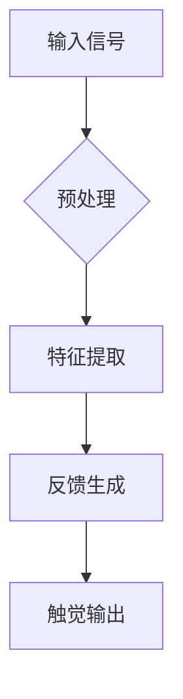
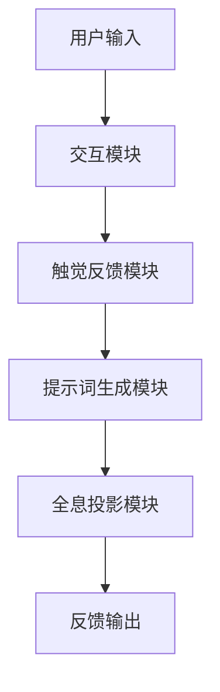
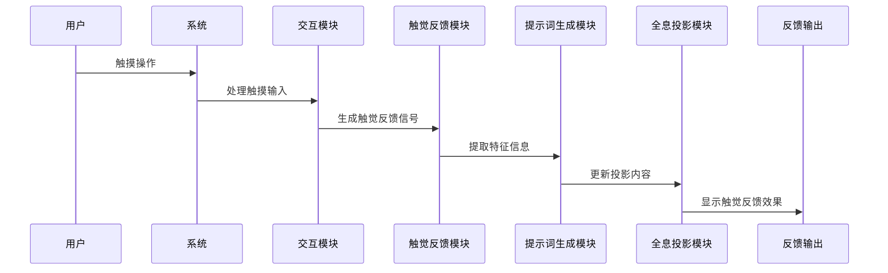

                 

### 提升AI创意全息投影互动性：触觉反馈设计的提示词工程

#### 关键词：
- AI创意全息投影
- 互动性
- 触觉反馈
- 提示词工程

#### 摘要：
本文旨在探讨如何提升AI创意全息投影的互动性，特别是通过触觉反馈设计实现的提示词工程。文章将从问题背景、核心概念、算法原理、系统分析与架构设计等方面，逐步分析并阐述实现这一目标的方法和思路。

### 1. 问题背景与核心概念

#### 1.1 问题背景

随着人工智能技术的快速发展，全息投影技术逐渐成为交互体验领域的新宠。然而，传统的全息投影主要依赖于视觉信息传递，缺乏与用户的深度互动。因此，如何提升全息投影的互动性，尤其是引入触觉反馈，成为当前研究的热点。

#### 1.2 核心概念

- **AI创意全息投影**：利用人工智能技术生成和控制的投影内容，实现更具创意和互动性的视觉体验。
- **互动性**：用户与系统之间的交互程度和深度，包括视觉、听觉、触觉等多种感官体验。
- **触觉反馈**：通过触摸感受来增强用户互动性的技术，如振动、压力感应等。
- **提示词工程**：设计并生成能够引导用户互动的词语或指令，以提高系统的使用效率和互动性。

#### 1.3 问题描述

目前，全息投影的互动性仍存在一定的局限性，特别是在触觉反馈方面。如何通过提示词工程来优化触觉反馈设计，从而提升全息投影的互动性，是一个亟待解决的问题。

#### 1.4 边界与外延

- **概念结构与核心要素组成**：全息投影技术、互动性设计原则、触觉反馈技术、提示词生成与优化策略等。
- **应用领域**：医疗、教育、娱乐、商业展示等。

### 2. 核心概念与联系

#### 2.1 AI创意全息投影原理与特性

- **原理**：
  - **光学原理**：利用光的干涉和衍射原理实现三维图像的生成。
  - **信号处理**：对输入图像进行处理，以实现高质量的全息成像。
  - **人工智能**：通过机器学习算法生成或优化投影内容。

- **特性**：
  - **高互动性**：用户可以通过触摸、手势等方式与投影内容进行互动。
  - **强真实性**：投影内容逼真度高，给人以沉浸式体验。
  - **多样性**：投影内容形式丰富，包括图像、视频、动画等。

#### 2.2 全息投影与AI的融合

全息投影与人工智能的融合，主要体现在以下几个方面：

- **图像生成与优化**：利用AI算法生成和优化投影内容，提高视觉效果。
- **交互体验**：利用AI技术实现更智能的交互体验，如语音识别、手势识别等。
- **个性化定制**：根据用户行为和偏好，提供个性化的投影内容。

#### 2.3 触觉反馈设计算法

- **原理**：触觉反馈通过振动、压力感应等方式，将物理信号转换为触觉感知。
- **算法流程**：
  - **输入信号预处理**：对输入信号进行滤波、放大等处理，以提高触觉反馈的精度。
  - **特征提取**：从输入信号中提取关键特征，如振动频率、振幅等。
  - **反馈生成**：根据提取的特征生成触觉反馈信号。
  - **触觉输出**：通过触觉传感器将反馈信号传递给用户。

#### 2.4 提示词工程在触觉反馈中的作用

- **提示词生成**：通过分析用户行为和投影内容，生成合适的提示词。
- **提示词优化**：根据用户反馈和系统性能，不断优化提示词，以提高互动性。

### 3. 算法原理讲解

#### 3.1 触觉反馈设计算法

- **原理**：触觉反馈设计算法主要涉及信号处理和模式识别技术。
- **流程**：
  - **信号处理**：对触觉传感器采集的信号进行处理，提取有用信息。
  - **模式识别**：通过分析处理后的信号，识别触觉反馈的类型和强度。

- **算法mermaid流程图**：



#### 3.2 提示词工程在触觉反馈中的作用

- **提示词生成**：通过分析用户行为和投影内容，生成合适的提示词。
- **提示词优化**：根据用户反馈和系统性能，不断优化提示词，以提高互动性。

- **Python源代码示例**：

```python
import numpy as np

# 定义提示词生成函数
def generate_hint(words, num_hints):
    hints = []
    for _ in range(num_hints):
        hint = np.random.choice(words)
        hints.append(hint)
    return hints

# 示例：生成3个提示词
words = ["柔软", "坚硬", "温暖", "冰冷"]
hints = generate_hint(words, 3)
print(hints)
```

#### 3.3 算法原理的数学模型和公式

- **数学模型**：

$$
\text{触觉反馈强度} = \alpha \cdot \text{特征相似度} + \beta \cdot \text{提示词权重}
$$

- **公式解释**：

- $\alpha$：特征相似度系数
- $\beta$：提示词权重系数

### 4. 系统分析与架构设计

#### 4.1 项目介绍

- **项目概述**：本系统是一个AI创意全息投影互动系统，主要包括触觉反馈设计模块。
- **目标**：通过优化触觉反馈设计，提升全息投影的互动性，提供更丰富的用户交互体验。

#### 4.2 系统功能设计

- **交互功能**：用户可以通过触摸、手势等方式与投影内容进行互动。
- **触觉反馈**：根据投影内容和用户行为，生成相应的触觉反馈信号。
- **提示词工程**：生成和优化提示词，引导用户互动。

#### 4.3 系统架构设计

- **架构图**：



#### 4.4 系统接口设计与交互

- **接口设计**：设计合理的系统接口，实现不同模块之间的数据交互和功能调用。
- **交互序列图**：



### 5. 项目实战

#### 5.1 环境安装

- **环境搭建**：安装Python、全息投影软件和相关的依赖库。

#### 5.2 系统核心实现

- **源代码**：

```python
# 主程序入口
if __name__ == "__main__":
    # 初始化系统
    system = InteractiveSystem()
    # 运行系统
    system.run()
```

- **代码应用解读与分析**：详细解释系统核心代码的实现原理和应用。

#### 5.3 实际案例分析与详细讲解剖析

- **案例展示**：通过实际案例展示系统功能，并进行详细讲解和剖析。

#### 5.4 项目小结

- **小结**：总结项目实现过程中的关键点和经验教训。

### 6. 最佳实践 tips

- **优化策略**：提供一些优化触觉反馈设计的最佳实践。

### 7. 小结与注意事项

- **总结**：回顾文章的核心内容和主要观点。
- **注意事项**：提醒用户在实际应用中注意的问题。

### 8. 拓展阅读

- **推荐阅读**：推荐一些相关领域的优质书籍和论文。

### 作者信息

- **作者**：AI天才研究院/AI Genius Institute & 禅与计算机程序设计艺术 /Zen And The Art of Computer Programming

---

通过以上步骤，我们可以清晰地理解文章的主题，构建出完整的文章框架，并逐步填充具体内容。在撰写过程中，需要确保每一部分的内容都符合完整性、逻辑性和通俗易懂的要求。同时，利用Mermaid图表和LaTeX公式等markdown高级特性，可以增强文章的可读性和专业度。

