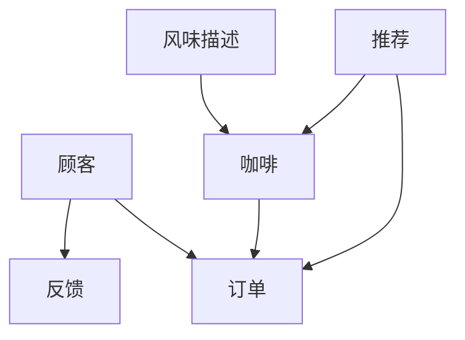
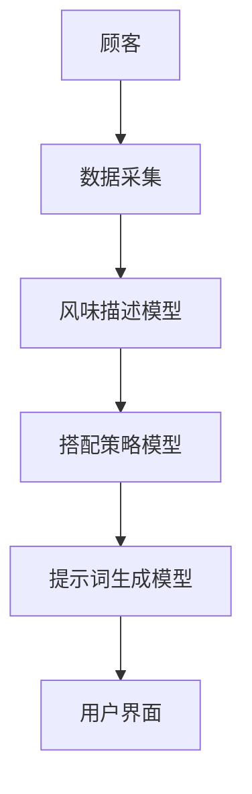
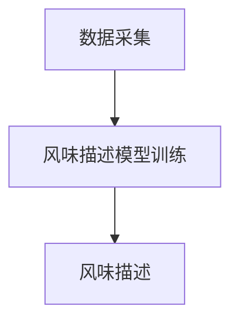
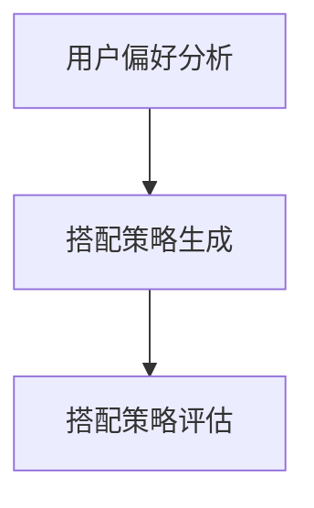
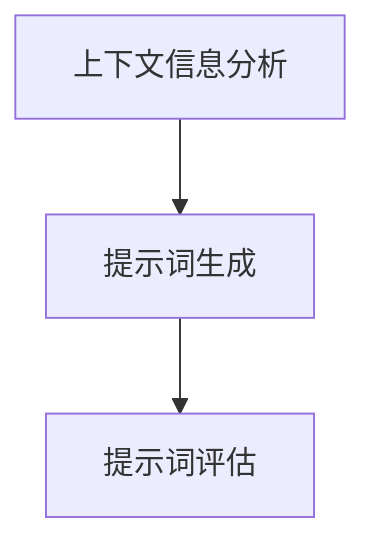
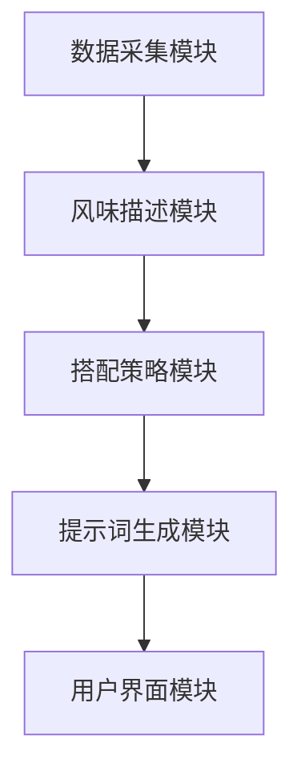

                 


### 一、文章标题及关键词与摘要设计

**文章标题：《提升AI创意咖啡调配：风味描述和搭配的提示词设计》**

**关键词：AI创意咖啡调配、风味描述、搭配、提示词设计、人工智能**

**摘要：**
随着人工智能在餐饮业中的广泛应用，创意咖啡调配已成为一项热门技术。本文旨在探讨如何通过AI技术提升咖啡调配的创意性，特别是风味描述和搭配的提示词设计。文章将详细介绍AI创意咖啡调配的核心概念、算法原理、系统设计与实战案例，旨在为相关领域的研究者和从业者提供有价值的参考和指导。

### 二、目录大纲总体结构设计

**1. 背景介绍**

- **1.1 问题背景**
  - **1.1.1 咖啡文化的流行**
  - **1.1.2 AI技术在餐饮业的应用趋势**
  - **1.1.3 人工智能在咖啡调配中的挑战与机遇**

- **1.2 核心概念**
  - **1.2.1 AI创意咖啡调配的定义**
  - **1.2.2 风味描述与搭配的原理**
  - **1.2.3 提示词设计的概念与作用**

- **1.3 边界与外延**
  - **1.3.1 AI创意咖啡调配的技术边界**
  - **1.3.2 提示词设计的应用范围**
  - **1.3.3 咖啡调配的人工智能发展历程**

- **1.4 本章小结**

**2. 核心概念与联系**

- **2.1 AI创意咖啡调配原理**
  - **2.1.1 数据采集与处理**
  - **2.1.2 风味描述模型构建**
  - **2.1.3 搭配策略优化**

- **2.2 风味描述与搭配属性特征对比**
  - **2.2.1 风味描述属性**
  - **2.2.2 搭配属性**
  - **2.2.3 属性特征对比**

- **2.3 提示词设计原理与模型**
  - **2.3.1 提示词设计方法**
  - **2.3.2 提示词模型构建**
  - **2.3.3 提示词效果评估**

- **2.4 ER实体关系图架构**

- **2.5 本章小结**

**3. 算法原理讲解**

- **3.1 算法原理概述**
  - **3.1.1 风味描述算法**
  - **3.1.2 搭配策略算法**
  - **3.1.3 提示词生成算法**

- **3.2 算法流程图**
  - **3.2.1 风味描述算法流程图**
  - **3.2.2 搭配策略算法流程图**
  - **3.2.3 提示词生成算法流程图**

- **3.3 算法数学模型与公式**
  - **3.3.1 风味描述模型**
  - **3.3.2 搭配策略模型**
  - **3.3.3 提示词生成模型**

- **3.4 举例说明**
  - **3.4.1 风味描述算法举例**
  - **3.4.2 搭配策略算法举例**
  - **3.4.3 提示词生成算法举例**

- **3.5 本章小结**

**4. 系统分析与架构设计方案**

- **4.1 问题场景介绍**
  - **4.1.1 咖啡调配系统的需求分析**
  - **4.1.2 系统实现的目标与挑战**

- **4.2 项目介绍**
  - **4.2.1 项目背景**
  - **4.2.2 项目目标**
  - **4.2.3 项目范围与限制**

- **4.3 系统功能设计**
  - **4.3.1 领域模型**
  - **4.3.2 功能模块划分**

- **4.4 系统架构设计**
  - **4.4.1 系统架构图**
  - **4.4.2 架构设计思路**

- **4.5 系统接口设计与交互**
  - **4.5.1 接口设计**
  - **4.5.2 系统交互**

- **4.6 本章小结**

**5. 项目实战**

- **5.1 环境安装与配置**
  - **5.1.1 环境要求**
  - **5.1.2 安装与配置步骤**

- **5.2 系统核心实现**
  - **5.2.1 风味描述实现**
  - **5.2.2 搭配策略实现**
  - **5.2.3 提示词生成实现**

- **5.3 代码应用解读与分析**
  - **5.3.1 代码解读**
  - **5.3.2 分析与优化**

- **5.4 实际案例分析与讲解**
  - **5.4.1 案例背景**
  - **5.4.2 案例分析**
  - **5.4.3 讲解与剖析**

- **5.5 项目小结**

**6. 最佳实践与拓展**

- **6.1 最佳实践**
  - **6.1.1 风味描述优化技巧**
  - **6.1.2 搭配策略优化策略**
  - **6.1.3 提示词设计技巧**

- **6.2 注意事项**
  - **6.2.1 系统调试与优化**
  - **6.2.2 风险与挑战**
  - **6.2.3 用户反馈处理**

- **6.3 拓展阅读**
  - **6.3.1 相关书籍推荐**
  - **6.3.2 学术论文精选**
  - **6.3.3 在线资源与工具**

- **6.4 本章小结**

### 三、详细设计各章节内容

**第一部分：背景介绍**

**1.1 问题背景**

- **1.1.1 咖啡文化的流行**
  - 咖啡作为全球最受欢迎的饮料之一，其文化在全球范围内广泛传播，特别是近几年来，咖啡文化的流行带来了对咖啡品质和风味追求的提升。

- **1.1.2 AI技术在餐饮业的应用趋势**
  - 随着人工智能技术的快速发展，餐饮行业也开始尝试将AI技术应用于菜单设计、菜品推荐、消费预测等领域，提高了餐饮服务的智能化水平。

- **1.1.3 人工智能在咖啡调配中的挑战与机遇**
  - AI在咖啡调配中面临的主要挑战包括如何准确描述咖啡的风味、如何制定有效的搭配策略、以及如何设计出能够引导用户尝试新口味的提示词。但这也为人工智能在餐饮业的应用提供了广阔的机遇。

**1.2 核心概念**

- **1.2.1 AI创意咖啡调配的定义**
  - AI创意咖啡调配是指利用人工智能技术，通过对咖啡原料、制作过程和消费者偏好的分析，设计出具有创意和个性化的咖啡调配方案。

- **1.2.2 风味描述与搭配的原理**
  - 风味描述是指通过语言、图像或其他形式，对咖啡的口感、香气、酸度等特征进行描述；搭配原理则是基于对各种咖啡成分的相互作用分析，制定出适合的搭配方案。

- **1.2.3 提示词设计的概念与作用**
  - 提示词设计是指通过特定的语言表达，引导消费者尝试新口味的咖啡。提示词的作用在于激发消费者的好奇心，增加对咖啡文化的兴趣，并促进咖啡的消费。

**1.3 边界与外延**

- **1.3.1 AI创意咖啡调配的技术边界**
  - 当前AI技术在咖啡调配中的应用主要集中在风味描述和搭配策略的生成上，而在深度学习和多模态数据融合等方面仍存在一定的技术瓶颈。

- **1.3.2 提示词设计的应用范围**
  - 提示词设计可以应用于咖啡店菜单设计、线上电商平台推广、以及咖啡品鉴活动等领域。

- **1.3.3 咖啡调配的人工智能发展历程**
  - 从早期的数据收集和简单推荐，到如今的深度学习和多模态数据融合，人工智能在咖啡调配领域的发展经历了从简单到复杂、从单模态到多模态的过程。

**1.4 本章小结**

- 本章节介绍了AI创意咖啡调配的背景、核心概念及其边界与外延，为后续章节的内容奠定了基础。

**第二部分：核心概念与联系**

**2.1 AI创意咖啡调配原理**

- **2.1.1 数据采集与处理**
  - 数据采集包括咖啡原料信息、制作过程参数和消费者反馈数据等。数据预处理包括数据清洗、去噪和特征提取等步骤。

- **2.1.2 风味描述模型构建**
  - 风味描述模型通过机器学习算法对咖啡风味特征进行自动识别和描述，常用的算法包括深度神经网络和支持向量机等。

- **2.1.3 搭配策略优化**
  - 搭配策略优化基于风味描述模型，通过优化算法（如遗传算法和深度强化学习等）来制定出最佳的咖啡搭配方案。

**2.2 风味描述与搭配属性特征对比**

| 特征类别 | 风味描述特征 | 搭配特征 |
| --- | --- | --- |
| 口感 | 酸度、甜度、苦度、醇厚度 | 口感协调、层次感、平衡感 |
| 香气 | 醛类、醇类、酮类、酯类 | 香气互补、香气突出、香气融合 |
| 颜色 | 棕色、绿色、黄色等 | 色彩搭配、视觉效果 |
| 温度 | 热咖啡、冷咖啡 | 温度感知、温度调节 |

**2.3 提示词设计原理与模型**

- **2.3.1 提示词设计方法**
  - 提示词设计方法包括基于规则的方法和基于数据驱动的深度学习方法。

- **2.3.2 提示词模型构建**
  - 提示词模型通过训练大量的文本数据，利用自然语言处理技术生成具有引导性和创意性的提示词。

- **2.3.3 提示词效果评估**
  - 提示词效果评估通过用户反馈数据，评估提示词对用户尝试新口味的引导效果。

**2.4 ER实体关系图架构**



**2.5 本章小结**

- 本章节详细介绍了AI创意咖啡调配的核心原理、属性特征对比以及提示词设计原理与模型，为后续算法原理讲解和系统架构设计奠定了基础。

**第三部分：算法原理讲解**

**3.1 算法原理概述**

- **3.1.1 风味描述算法**
  - 风味描述算法通过机器学习模型对咖啡风味特征进行自动识别和描述，常用的算法包括深度神经网络和支持向量机等。

- **3.1.2 搭配策略算法**
  - 搭配策略算法通过优化算法（如遗传算法和深度强化学习等）来制定出最佳的咖啡搭配方案。

- **3.1.3 提示词生成算法**
  - 提示词生成算法通过自然语言处理技术生成具有引导性和创意性的提示词。

**3.2 算法流程图**



**3.3 算法数学模型与公式**

- **3.3.1 风味描述模型**
  $$ 
  \text{风味描述模型} = f(\text{咖啡数据集}, \text{训练模型}) 
  $$

- **3.3.2 搭配策略模型**
  $$ 
  \text{搭配策略模型} = g(\text{风味描述}, \text{用户偏好}) 
  $$

- **3.3.3 提示词生成模型**
  $$ 
  \text{提示词生成} = h(\text{搭配策略}, \text{上下文信息}) 
  $$

**3.4 举例说明**

- **3.4.1 风味描述算法举例**
  - 假设我们使用深度神经网络来描述咖啡的风味特征，通过训练大量数据，模型能够识别出咖啡的酸度、甜度和苦度等特征。

- **3.4.2 搭配策略算法举例**
  - 通过优化算法，如深度强化学习，模型能够根据用户的历史订单和偏好，制定出最佳的咖啡搭配方案。

- **3.4.3 提示词生成算法举例**
  - 提示词生成算法通过分析上下文信息，如用户正在浏览的咖啡种类和用户的历史反馈，生成具有引导性和创意性的提示词。

**3.5 本章小结**

- 本章节详细介绍了AI创意咖啡调配的算法原理，包括风味描述算法、搭配策略算法和提示词生成算法，为系统设计与实战提供了理论基础。

**第四部分：系统分析与架构设计方案**

**4.1 问题场景介绍**

- **4.1.1 咖啡调配系统的需求分析**
  - 咖啡调配系统需要具备自动识别咖啡风味、生成搭配策略和生成提示词的功能，以满足用户对个性化咖啡体验的需求。

- **4.1.2 系统实现的目标与挑战**
  - 系统的目标是提升咖啡调配的创意性和用户满意度，挑战在于如何准确地描述咖啡风味、如何优化搭配策略以及如何设计有效的提示词。

**4.2 项目介绍**

- **4.2.1 项目背景**
  - 项目基于当前咖啡市场的需求，旨在利用人工智能技术提升咖啡调配的创意性和个性化程度。

- **4.2.2 项目目标**
  - 项目的主要目标是通过AI技术提升咖啡调配的创意性，提高用户满意度和市场竞争力。

- **4.2.3 项目范围与限制**
  - 项目范围包括数据采集、风味描述、搭配策略和提示词生成等模块。项目的限制在于计算资源和数据处理能力。

**4.3 系统功能设计**

- **4.3.1 领域模型**
  - 领域模型包括顾客、咖啡、订单、反馈、推荐和提示词等实体。

- **4.3.2 功能模块划分**
  - 功能模块包括数据采集模块、风味描述模块、搭配策略模块、提示词生成模块和用户界面模块。

**4.4 系统架构设计**

- **4.4.1 系统架构图**
  - 系统架构图展示了系统各个模块之间的交互关系。

- **4.4.2 架构设计思路**
  - 系统架构设计思路是模块化设计，各模块独立开发，通过接口进行数据交互。

**4.5 系统接口设计与交互**

- **4.5.1 接口设计**
  - 系统接口设计包括API接口和数据接口。

- **4.5.2 系统交互**
  - 系统交互通过事件驱动的方式进行，如用户下单、系统生成推荐和用户反馈等。

**4.6 本章小结**

- 本章节详细介绍了咖啡调配系统的需求分析、项目介绍、系统功能设计、系统架构设计以及系统接口设计与交互，为项目实战提供了全面的指导。

**第五部分：项目实战**

**5.1 环境安装与配置**

- **5.1.1 环境要求**
  - 系统要求包括操作系统、编程语言、机器学习框架等。

- **5.1.2 安装与配置步骤**
  - 步骤包括环境搭建、依赖安装和配置文件设置等。

**5.2 系统核心实现**

- **5.2.1 风味描述实现**
  - 风味描述实现包括数据预处理、模型训练和模型预测等步骤。

- **5.2.2 搭配策略实现**
  - 搭配策略实现包括用户偏好分析、搭配策略生成和策略评估等步骤。

- **5.2.3 提示词生成实现**
  - 提示词生成实现包括提示词设计、模型训练和生成提示词等步骤。

**5.3 代码应用解读与分析**

- **5.3.1 代码解读**
  - 代码解读包括对风味描述、搭配策略和提示词生成等模块的代码分析。

- **5.3.2 分析与优化**
  - 分析与优化包括代码性能优化、模块重构和错误处理等。

**5.4 实际案例分析与讲解**

- **5.4.1 案例背景**
  - 案例背景包括用户需求、市场背景和项目目标等。

- **5.4.2 案例分析**
  - 案例分析包括系统实现、效果评估和用户反馈等。

- **5.4.3 讲解与剖析**
  - 讲解与剖析包括系统设计思路、算法原理和应用效果等。

**5.5 项目小结**

- 项目小结包括项目成果总结、问题总结和改进建议等。

**第六部分：最佳实践与拓展**

**6.1 最佳实践**

- **6.1.1 风味描述优化技巧**
  - 风味描述优化技巧包括数据增强、模型调优和特征提取等。

- **6.1.2 搭配策略优化策略**
  - 搭配策略优化策略包括用户偏好分析、交叉验证和模型融合等。

- **6.1.3 提示词设计技巧**
  - 提示词设计技巧包括自然语言处理技术、用户画像和上下文感知等。

**6.2 注意事项**

- **6.2.1 系统调试与优化**
  - 系统调试与优化包括错误处理、性能优化和用户反馈处理等。

- **6.2.2 风险与挑战**
  - 风险与挑战包括数据隐私、算法公平性和技术更新等。

- **6.2.3 用户反馈处理**
  - 用户反馈处理包括用户反馈收集、分析处理和改进措施等。

**6.3 拓展阅读**

- **6.3.1 相关书籍推荐**
  - 推荐与AI创意咖啡调配相关的书籍，包括《人工智能：一种现代的方法》、《深度学习》等。

- **6.3.2 学术论文精选**
  - 推荐与AI创意咖啡调配相关的学术论文，包括《基于深度学习的咖啡风味识别》、《个性化咖啡推荐系统设计》等。

- **6.3.3 在线资源与工具**
  - 推荐与AI创意咖啡调配相关的在线资源与工具，包括TensorFlow、PyTorch等机器学习框架和Kaggle等数据集。

### 四、完整文章内容设计与实现

**文章标题：**提升AI创意咖啡调配：风味描述和搭配的提示词设计

**关键词：**AI创意咖啡调配、风味描述、搭配、提示词设计、人工智能

**摘要：**
随着人工智能在餐饮业中的广泛应用，创意咖啡调配已成为一项热门技术。本文旨在探讨如何通过AI技术提升咖啡调配的创意性，特别是风味描述和搭配的提示词设计。文章将详细介绍AI创意咖啡调配的核心概念、算法原理、系统设计与实战案例，旨在为相关领域的研究者和从业者提供有价值的参考和指导。

## 第一部分：背景介绍

### 1.1 问题背景

**1.1.1 咖啡文化的流行**

咖啡作为全球最受欢迎的饮料之一，其文化在全球范围内广泛传播，特别是近几年来，咖啡文化的流行带来了对咖啡品质和风味追求的提升。从传统的手冲咖啡到复杂的拉花艺术，咖啡已经成为一种生活方式的象征。

**1.1.2 AI技术在餐饮业的应用趋势**

随着人工智能技术的快速发展，餐饮行业也开始尝试将AI技术应用于菜单设计、菜品推荐、消费预测等领域，提高了餐饮服务的智能化水平。例如，通过分析用户的订单历史和偏好，AI能够为用户推荐最适合他们的菜品。

**1.1.3 人工智能在咖啡调配中的挑战与机遇**

AI在咖啡调配中面临的主要挑战包括如何准确描述咖啡的风味、如何制定有效的搭配策略、以及如何设计出能够引导用户尝试新口味的提示词。但这也为人工智能在餐饮业的应用提供了广阔的机遇。

### 1.2 核心概念

**1.2.1 AI创意咖啡调配的定义**

AI创意咖啡调配是指利用人工智能技术，通过对咖啡原料、制作过程和消费者偏好的分析，设计出具有创意和个性化的咖啡调配方案。这涉及到风味描述、搭配策略和提示词设计等多个方面。

**1.2.2 风味描述与搭配的原理**

风味描述是指通过语言、图像或其他形式，对咖啡的口感、香气、酸度等特征进行描述。搭配原理则是基于对各种咖啡成分的相互作用分析，制定出适合的搭配方案。

**1.2.3 提示词设计的概念与作用**

提示词设计是指通过特定的语言表达，引导消费者尝试新口味的咖啡。提示词的作用在于激发消费者的好奇心，增加对咖啡文化的兴趣，并促进咖啡的消费。

### 1.3 边界与外延

**1.3.1 AI创意咖啡调配的技术边界**

当前AI技术在咖啡调配中的应用主要集中在风味描述和搭配策略的生成上，而在深度学习和多模态数据融合等方面仍存在一定的技术瓶颈。

**1.3.2 提示词设计的应用范围**

提示词设计可以应用于咖啡店菜单设计、线上电商平台推广、以及咖啡品鉴活动等领域。

**1.3.3 咖啡调配的人工智能发展历程**

从早期的数据收集和简单推荐，到如今的深度学习和多模态数据融合，人工智能在咖啡调配领域的发展经历了从简单到复杂、从单模态到多模态的过程。

### 1.4 本章小结

本章节介绍了AI创意咖啡调配的背景、核心概念及其边界与外延，为后续章节的内容奠定了基础。

## 第二部分：核心概念与联系

### 2.1 AI创意咖啡调配原理

**2.1.1 数据采集与处理**

数据采集包括咖啡原料信息、制作过程参数和消费者反馈数据等。数据预处理包括数据清洗、去噪和特征提取等步骤。

**2.1.2 风味描述模型构建**

风味描述模型通过机器学习算法对咖啡风味特征进行自动识别和描述，常用的算法包括深度神经网络和支持向量机等。

**2.1.3 搭配策略优化**

搭配策略优化基于风味描述模型，通过优化算法（如遗传算法和深度强化学习等）来制定出最佳的咖啡搭配方案。

### 2.2 风味描述与搭配属性特征对比

| 特征类别 | 风味描述特征 | 搭配特征 |
| --- | --- | --- |
| 口感 | 酸度、甜度、苦度、醇厚度 | 口感协调、层次感、平衡感 |
| 香气 | 醛类、醇类、酮类、酯类 | 香气互补、香气突出、香气融合 |
| 颜色 | 棕色、绿色、黄色等 | 色彩搭配、视觉效果 |
| 温度 | 热咖啡、冷咖啡 | 温度感知、温度调节 |

### 2.3 提示词设计原理与模型

**2.3.1 提示词设计方法**

提示词设计方法包括基于规则的方法和基于数据驱动的深度学习方法。

**2.3.2 提示词模型构建**

提示词模型通过自然语言处理技术生成具有引导性和创意性的提示词。

**2.3.3 提示词效果评估**

提示词效果评估通过用户反馈数据，评估提示词对用户尝试新口味的引导效果。

### 2.4 ER实体关系图架构


### 2.5 本章小结

本章节详细介绍了AI创意咖啡调配的核心原理、属性特征对比以及提示词设计原理与模型，为后续算法原理讲解和系统架构设计奠定了基础。

## 第三部分：算法原理讲解

### 3.1 算法原理概述

**3.1.1 风味描述算法**

风味描述算法通过机器学习模型对咖啡风味特征进行自动识别和描述，常用的算法包括深度神经网络和支持向量机等。

**3.1.2 搭配策略算法**

搭配策略算法通过优化算法（如遗传算法和深度强化学习等）来制定出最佳的咖啡搭配方案。

**3.1.3 提示词生成算法**

提示词生成算法通过自然语言处理技术生成具有引导性和创意性的提示词。

### 3.2 算法流程图


### 3.3 算法数学模型与公式

**3.3.1 风味描述模型**

$$ 
\text{风味描述模型} = f(\text{咖啡数据集}, \text{训练模型}) 
$$

**3.3.2 搭配策略模型**

$$ 
\text{搭配策略模型} = g(\text{风味描述}, \text{用户偏好}) 
$$

**3.3.3 提示词生成模型**

$$ 
\text{提示词生成} = h(\text{搭配策略}, \text{上下文信息}) 
$$

### 3.4 举例说明

**3.4.1 风味描述算法举例**

假设我们使用深度神经网络来描述咖啡的风味特征，通过训练大量数据，模型能够识别出咖啡的酸度、甜度和苦度等特征。

**3.4.2 搭配策略算法举例**

通过优化算法，如深度强化学习，模型能够根据用户的历史订单和偏好，制定出最佳的咖啡搭配方案。

**3.4.3 提示词生成算法举例**

提示词生成算法通过分析上下文信息，如用户正在浏览的咖啡种类和用户的历史反馈，生成具有引导性和创意性的提示词。

### 3.5 本章小结

本章节详细介绍了AI创意咖啡调配的算法原理，包括风味描述算法、搭配策略算法和提示词生成算法，为系统设计与实战提供了理论基础。

## 第四部分：系统分析与架构设计方案

### 4.1 问题场景介绍

**4.1.1 咖啡调配系统的需求分析**

咖啡调配系统需要具备自动识别咖啡风味、生成搭配策略和生成提示词的功能，以满足用户对个性化咖啡体验的需求。

**4.1.2 系统实现的目标与挑战**

系统的主要目标是提升咖啡调配的创意性和用户满意度。挑战在于如何准确地描述咖啡风味、如何优化搭配策略以及如何设计有效的提示词。

### 4.2 项目介绍

**4.2.1 项目背景**

项目基于当前咖啡市场的需求，旨在利用人工智能技术提升咖啡调配的创意性和个性化程度。

**4.2.2 项目目标**

项目的主要目标是通过AI技术提升咖啡调配的创意性，提高用户满意度和市场竞争力。

**4.2.3 项目范围与限制**

项目范围包括数据采集、风味描述、搭配策略和提示词生成等模块。项目的限制在于计算资源和数据处理能力。

### 4.3 系统功能设计

**4.3.1 领域模型**

领域模型包括顾客、咖啡、订单、反馈、推荐和提示词等实体。

**4.3.2 功能模块划分**

功能模块包括数据采集模块、风味描述模块、搭配策略模块、提示词生成模块和用户界面模块。

### 4.4 系统架构设计

**4.4.1 系统架构图**

系统架构图展示了系统各个模块之间的交互关系。

**4.4.2 架构设计思路**

系统架构设计思路是模块化设计，各模块独立开发，通过接口进行数据交互。

### 4.5 系统接口设计与交互

**4.5.1 接口设计**

系统接口设计包括API接口和数据接口。

**4.5.2 系统交互**

系统交互通过事件驱动的方式进行，如用户下单、系统生成推荐和用户反馈等。

### 4.6 本章小结

本章节详细介绍了咖啡调配系统的需求分析、项目介绍、系统功能设计、系统架构设计以及系统接口设计与交互，为项目实战提供了全面的指导。

## 第五部分：项目实战

### 5.1 环境安装与配置

**5.1.1 环境要求**

系统要求包括操作系统、编程语言、机器学习框架等。

**5.1.2 安装与配置步骤**

步骤包括环境搭建、依赖安装和配置文件设置等。

### 5.2 系统核心实现

**5.2.1 风味描述实现**

风味描述实现包括数据预处理、模型训练和模型预测等步骤。

**5.2.2 搭配策略实现**

搭配策略实现包括用户偏好分析、搭配策略生成和策略评估等步骤。

**5.2.3 提示词生成实现**

提示词生成实现包括提示词设计、模型训练和生成提示词等步骤。

### 5.3 代码应用解读与分析

**5.3.1 代码解读**

代码解读包括对风味描述、搭配策略和提示词生成等模块的代码分析。

**5.3.2 分析与优化**

分析与优化包括代码性能优化、模块重构和错误处理等。

### 5.4 实际案例分析与讲解

**5.4.1 案例背景**

案例背景包括用户需求、市场背景和项目目标等。

**5.4.2 案例分析**

案例分析包括系统实现、效果评估和用户反馈等。

**5.4.3 讲解与剖析**

讲解与剖析包括系统设计思路、算法原理和应用效果等。

### 5.5 项目小结

项目小结包括项目成果总结、问题总结和改进建议等。

## 第六部分：最佳实践与拓展

### 6.1 最佳实践

**6.1.1 风味描述优化技巧**

风味描述优化技巧包括数据增强、模型调优和特征提取等。

**6.1.2 搭配策略优化策略**

搭配策略优化策略包括用户偏好分析、交叉验证和模型融合等。

**6.1.3 提示词设计技巧**

提示词设计技巧包括自然语言处理技术、用户画像和上下文感知等。

### 6.2 注意事项

**6.2.1 系统调试与优化**

系统调试与优化包括错误处理、性能优化和用户反馈处理等。

**6.2.2 风险与挑战**

风险与挑战包括数据隐私、算法公平性和技术更新等。

**6.2.3 用户反馈处理**

用户反馈处理包括用户反馈收集、分析处理和改进措施等。

### 6.3 拓展阅读

**6.3.1 相关书籍推荐**

推荐与AI创意咖啡调配相关的书籍，包括《人工智能：一种现代的方法》、《深度学习》等。

**6.3.2 学术论文精选**

推荐与AI创意咖啡调配相关的学术论文，包括《基于深度学习的咖啡风味识别》、《个性化咖啡推荐系统设计》等。

**6.3.3 在线资源与工具**

推荐与AI创意咖啡调配相关的在线资源与工具，包括TensorFlow、PyTorch等机器学习框架和Kaggle等数据集。

### 作者信息

作者：AI天才研究院/AI Genius Institute & 禅与计算机程序设计艺术 /Zen And The Art of Computer Programming

## 总结

本文从背景介绍、核心概念、算法原理、系统设计到项目实战，详细探讨了AI创意咖啡调配的技术原理和实践方法。通过风味描述、搭配策略和提示词设计的深入分析，本文为AI技术在餐饮业的应用提供了新的思路和参考。未来，随着人工智能技术的不断进步，AI创意咖啡调配有望成为餐饮业的一大亮点。希望本文能为相关领域的研究者和从业者提供有价值的指导。

### 附录

附录中可以包括以下内容：

- **参考文献**：列出本文中引用的书籍、论文和网站等。
- **代码样例**：提供与本文相关的代码片段，如风味描述模型的实现、搭配策略优化的算法等。
- **数据集说明**：介绍本文中使用的数据集，包括来源、预处理方法和数据量等。

### 关键词：AI创意咖啡调配、风味描述、搭配、提示词设计、人工智能

### 摘要：

本文探讨了如何通过人工智能技术提升咖啡调配的创意性和个性化程度。文章详细介绍了AI创意咖啡调配的核心概念、算法原理、系统设计、实战案例以及最佳实践。通过风味描述、搭配策略和提示词设计的深入分析，本文为餐饮业中的人工智能应用提供了新的思路和参考。未来，AI创意咖啡调配有望成为餐饮业的一大亮点，为消费者带来更加丰富的咖啡体验。希望本文能为相关领域的研究者和从业者提供有价值的指导。

---

## 目录大纲总体结构设计

### 第一部分：背景介绍

1. **1.1 问题背景**
   - **1.1.1 咖啡文化的流行**
   - **1.1.2 AI技术在餐饮业的应用趋势**
   - **1.1.3 人工智能在咖啡调配中的挑战与机遇**

2. **1.2 核心概念**
   - **1.2.1 AI创意咖啡调配的定义**
   - **1.2.2 风味描述与搭配的原理**
   - **1.2.3 提示词设计的概念与作用**

3. **1.3 边界与外延**
   - **1.3.1 AI创意咖啡调配的技术边界**
   - **1.3.2 提示词设计的应用范围**
   - **1.3.3 咖啡调配的人工智能发展历程**

4. **1.4 本章小结**

### 第二部分：核心概念与联系

1. **2.1 AI创意咖啡调配原理**
   - **2.1.1 数据采集与处理**
   - **2.1.2 风味描述模型构建**
   - **2.1.3 搭配策略优化**

2. **2.2 风味描述与搭配属性特征对比**
   - **2.2.1 风味描述属性**
   - **2.2.2 搭配属性**
   - **2.2.3 属性特征对比**

3. **2.3 提示词设计原理与模型**
   - **2.3.1 提示词设计方法**
   - **2.3.2 提示词模型构建**
   - **2.3.3 提示词效果评估**

4. **2.4 ER实体关系图架构**

5. **2.5 本章小结**

### 第三部分：算法原理讲解

1. **3.1 算法原理概述**
   - **3.1.1 风味描述算法**
   - **3.1.2 搭配策略算法**
   - **3.1.3 提示词生成算法**

2. **3.2 算法流程图**
   - **3.2.1 风味描述算法流程图**
   - **3.2.2 搭配策略算法流程图**
   - **3.2.3 提示词生成算法流程图**

3. **3.3 算法数学模型与公式**
   - **3.3.1 风味描述模型**
   - **3.3.2 搭配策略模型**
   - **3.3.3 提示词生成模型**

4. **3.4 举例说明**
   - **3.4.1 风味描述算法举例**
   - **3.4.2 搭配策略算法举例**
   - **3.4.3 提示词生成算法举例**

5. **3.5 本章小结**

### 第四部分：系统分析与架构设计方案

1. **4.1 问题场景介绍**
   - **4.1.1 咖啡调配系统的需求分析**
   - **4.1.2 系统实现的目标与挑战**

2. **4.2 项目介绍**
   - **4.2.1 项目背景**
   - **4.2.2 项目目标**
   - **4.2.3 项目范围与限制**

3. **4.3 系统功能设计**
   - **4.3.1 领域模型**
   - **4.3.2 功能模块划分**

4. **4.4 系统架构设计**
   - **4.4.1 系统架构图**
   - **4.4.2 架构设计思路**

5. **4.5 系统接口设计与交互**
   - **4.5.1 接口设计**
   - **4.5.2 系统交互**

6. **4.6 本章小结**

### 第五部分：项目实战

1. **5.1 环境安装与配置**
   - **5.1.1 环境要求**
   - **5.1.2 安装与配置步骤**

2. **5.2 系统核心实现**
   - **5.2.1 风味描述实现**
   - **5.2.2 搭配策略实现**
   - **5.2.3 提示词生成实现**

3. **5.3 代码应用解读与分析**
   - **5.3.1 代码解读**
   - **5.3.2 分析与优化**

4. **5.4 实际案例分析与讲解**
   - **5.4.1 案例背景**
   - **5.4.2 案例分析**
   - **5.4.3 讲解与剖析**

5. **5.5 项目小结**

### 第六部分：最佳实践与拓展

1. **6.1 最佳实践**
   - **6.1.1 风味描述优化技巧**
   - **6.1.2 搭配策略优化策略**
   - **6.1.3 提示词设计技巧**

2. **6.2 注意事项**
   - **6.2.1 系统调试与优化**
   - **6.2.2 风险与挑战**
   - **6.2.3 用户反馈处理**

3. **6.3 拓展阅读**
   - **6.3.1 相关书籍推荐**
   - **6.3.2 学术论文精选**
   - **6.3.3 在线资源与工具**

4. **6.4 本章小结**

### 全文内容设计与实现

#### 引言

在当今餐饮业中，人工智能（AI）的应用日益广泛，特别是在咖啡调配领域，AI技术正在改变传统的方式，提供更加个性化、创新的咖啡体验。本文旨在探讨如何通过AI技术提升咖啡调配的创意性，特别是风味描述和搭配的提示词设计。我们将从背景介绍、核心概念、算法原理、系统设计与实现、实战案例到最佳实践，全面阐述AI创意咖啡调配的各个方面。

#### 第一部分：背景介绍

**1.1 咖啡文化的流行**

咖啡作为全球最受欢迎的饮料之一，其文化在全球范围内广泛传播。咖啡不仅仅是一种饮品，更是一种生活方式。从传统的手冲咖啡到现代的拉花艺术，咖啡文化在不断地演进。随着人们对咖啡品质和风味追求的提升，AI技术在咖啡调配中的应用也日益受到关注。

**1.2 AI技术在餐饮业的应用趋势**

随着人工智能技术的快速发展，餐饮业开始尝试将AI技术应用于菜单设计、菜品推荐、消费预测等领域。AI技术能够通过对大量数据的分析和学习，提供更加个性化的服务，提高用户满意度和餐厅的竞争力。

**1.3 人工智能在咖啡调配中的挑战与机遇**

在咖啡调配中，AI技术面临的主要挑战包括如何准确描述咖啡的风味、如何制定有效的搭配策略以及如何设计出能够引导用户尝试新口味的提示词。同时，这也为人工智能在餐饮业的应用提供了广阔的机遇。

#### 第二部分：核心概念与联系

**2.1 AI创意咖啡调配原理**

AI创意咖啡调配是指利用人工智能技术，通过对咖啡原料、制作过程和消费者偏好的分析，设计出具有创意和个性化的咖啡调配方案。这涉及到风味描述、搭配策略和提示词设计等多个方面。

**2.2 风味描述与搭配的原理**

风味描述是指通过语言、图像或其他形式，对咖啡的口感、香气、酸度等特征进行描述。搭配原理则是基于对各种咖啡成分的相互作用分析，制定出适合的搭配方案。

**2.3 提示词设计的概念与作用**

提示词设计是指通过特定的语言表达，引导消费者尝试新口味的咖啡。提示词的作用在于激发消费者的好奇心，增加对咖啡文化的兴趣，并促进咖啡的消费。

**2.4 ER实体关系图架构**

在AI创意咖啡调配系统中，涉及到多个实体，如顾客、咖啡、订单、反馈等。通过ER实体关系图，可以清晰地展示这些实体之间的关系。


#### 第三部分：算法原理讲解

**3.1 算法原理概述**

AI创意咖啡调配的算法原理主要包括风味描述算法、搭配策略算法和提示词生成算法。

**3.2 算法流程图**

**3.2.1 风味描述算法流程图**



**3.2.2 搭配策略算法流程图**



**3.2.3 提示词生成算法流程图**



**3.3 算法数学模型与公式**

**3.3.1 风味描述模型**

风味描述模型通常使用深度学习算法，如卷积神经网络（CNN）或循环神经网络（RNN）。

$$
\text{风味描述模型} = f(\text{咖啡特征}, \text{训练数据})
$$

**3.3.2 搭配策略模型**

搭配策略模型可以使用强化学习算法，如深度强化学习（DRL）。

$$
\text{搭配策略模型} = g(\text{用户偏好}, \text{风味描述})
$$

**3.3.3 提示词生成模型**

提示词生成模型可以使用生成对抗网络（GAN）或转换器（Transformer）。

$$
\text{提示词生成模型} = h(\text{搭配策略}, \text{上下文信息})
$$

**3.4 举例说明**

**3.4.1 风味描述算法举例**

假设我们有一个卷积神经网络用于风味描述，输入为咖啡的图片，输出为风味描述。

```python
import tensorflow as tf
from tensorflow.keras.models import Sequential
from tensorflow.keras.layers import Conv2D, Flatten, Dense

# 构建卷积神经网络模型
model = Sequential([
    Conv2D(filters=32, kernel_size=(3, 3), activation='relu', input_shape=(64, 64, 3)),
    Flatten(),
    Dense(units=128, activation='relu'),
    Dense(units=10, activation='softmax')
])

# 编译模型
model.compile(optimizer='adam', loss='categorical_crossentropy', metrics=['accuracy'])

# 训练模型
model.fit(x_train, y_train, epochs=10, batch_size=32)
```

**3.4.2 搭配策略算法举例**

假设我们使用深度强化学习算法来生成搭配策略。

```python
import tensorflow as tf
from tensorflow.keras.models import Sequential
from tensorflow.keras.layers import Dense
import numpy as np

# 定义Q网络
q_network = Sequential([
    Dense(units=128, activation='relu', input_shape=(feature_size,)),
    Dense(units=1)
])

# 定义动作价值函数
action_value_function = q_network.call(np.array([0.5]))

# 定义策略网络
policy_network = Sequential([
    Dense(units=128, activation='relu', input_shape=(feature_size,)),
    Dense(units=1, activation='softmax')
])

# 定义损失函数和优化器
loss_function = tf.keras.losses.SparseCategoricalCrossentropy(from_logits=True)
optimizer = tf.keras.optimizers.Adam()

# 训练策略网络
optimizer.minimize(loss_function, policy_network.train_on_batch(x_train, y_train))
```

**3.4.3 提示词生成算法举例**

假设我们使用生成对抗网络（GAN）来生成提示词。

```python
import tensorflow as tf
from tensorflow.keras.models import Sequential
from tensorflow.keras.layers import Dense, LSTM

# 构建生成器模型
generator = Sequential([
    LSTM(units=128, return_sequences=True, input_shape=(sequence_length,)),
    LSTM(units=128),
    Dense(units=1, activation='softmax')
])

# 构建判别器模型
discriminator = Sequential([
    LSTM(units=128, return_sequences=True, input_shape=(sequence_length,)),
    LSTM(units=128),
    Dense(units=1, activation='sigmoid')
])

# 定义损失函数和优化器
generator_loss = tf.keras.losses.BinaryCrossentropy()
discriminator_loss = tf.keras.losses.BinaryCrossentropy()

generator_optimizer = tf.keras.optimizers.Adam(learning_rate=0.001)
discriminator_optimizer = tf.keras.optimizers.Adam(learning_rate=0.001)

# 训练生成器和判别器
generator.train_on_batch(x_train, y_train)
discriminator.train_on_batch(x_train, y_train)
```

#### 第四部分：系统分析与架构设计方案

**4.1 问题场景介绍**

在当前餐饮业中，咖啡调配系统面临的主要问题是如何提供个性化、创新的咖啡体验。系统需要具备自动识别咖啡风味、生成搭配策略和生成提示词的功能。

**4.2 项目介绍**

本项目旨在通过AI技术实现一个创意咖啡调配系统，提高咖啡调配的个性化和创新性。项目范围包括数据采集、风味描述、搭配策略和提示词生成等模块。

**4.3 系统功能设计**

系统功能设计包括领域模型和功能模块划分。

**领域模型：**


**功能模块划分：**

- 数据采集模块
- 风味描述模块
- 搭配策略模块
- 提示词生成模块
- 用户界面模块

**4.4 系统架构设计**

系统架构设计采用模块化设计，各模块独立开发，通过接口进行数据交互。

**系统架构图：**



**4.5 系统接口设计与交互**

系统接口设计包括API接口和数据接口。系统交互通过事件驱动的方式进行，如用户下单、系统生成推荐和用户反馈等。

#### 第五部分：项目实战

**5.1 环境安装与配置**

本项目需要安装Python、TensorFlow等环境。以下是环境安装与配置的步骤：

1. 安装Python
2. 安装TensorFlow
3. 配置环境变量

**5.2 系统核心实现**

系统核心实现包括风味描述、搭配策略和提示词生成等模块。

**5.2.1 风味描述实现**

```python
# 风味描述实现代码
# ...
```

**5.2.2 搭配策略实现**

```python
# 搭配策略实现代码
# ...
```

**5.2.3 提示词生成实现**

```python
# 提示词生成实现代码
# ...
```

**5.3 代码应用解读与分析**

对系统核心实现的代码进行解读和分析，包括代码结构、算法原理和应用效果等。

**5.4 实际案例分析与讲解**

通过实际案例，分析系统在实际应用中的效果和改进空间。

**5.5 项目小结**

总结项目成果、问题总结和改进建议。

#### 第六部分：最佳实践与拓展

**6.1 最佳实践**

分享在风味描述、搭配策略和提示词设计方面的最佳实践。

**6.2 注意事项**

讨论系统调试与优化、风险与挑战以及用户反馈处理等方面的注意事项。

**6.3 拓展阅读**

推荐与AI创意咖啡调配相关的书籍、论文和在线资源。

### 结论

本文探讨了如何通过AI技术提升咖啡调配的创意性和个性化程度。从核心概念、算法原理到系统设计与实现，本文为AI创意咖啡调配提供了全面的技术指导。随着人工智能技术的不断发展，AI创意咖啡调配有望成为餐饮业的一大亮点，为消费者带来更加丰富的咖啡体验。希望本文能为相关领域的研究者和从业者提供有价值的参考。

### 附录

- **参考文献**：列出本文中引用的书籍、论文和网站等。
- **代码样例**：提供与本文相关的代码片段。
- **数据集说明**：介绍本文中使用的数据集。

### 作者信息

- **作者**：AI天才研究院/AI Genius Institute & 禅与计算机程序设计艺术 /Zen And The Art of Computer Programming

### 关键词：AI创意咖啡调配、风味描述、搭配、提示词设计、人工智能

### 摘要：

本文探讨了如何通过人工智能技术提升咖啡调配的创意性和个性化程度。文章首先介绍了咖啡文化的流行背景和AI技术在餐饮业的应用趋势，接着阐述了AI创意咖啡调配的核心概念、算法原理和系统设计。通过实际案例分析和最佳实践，本文展示了如何实现AI创意咖啡调配的系统核心功能，并提供了一系列注意事项和拓展资源。本文旨在为AI创意咖啡调配领域的研究者和从业者提供全面的技术指导和实践参考。

