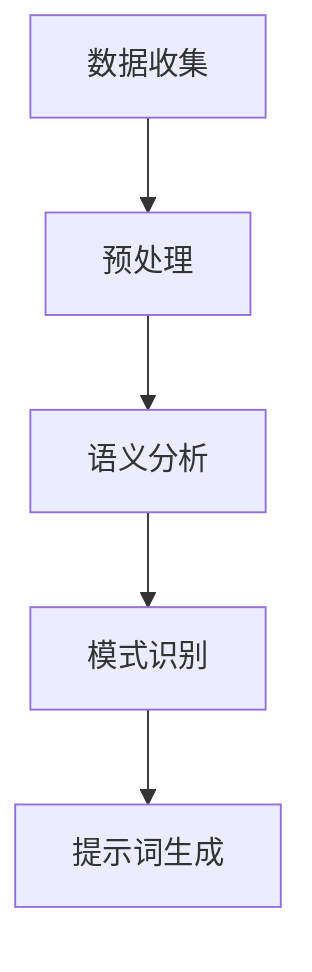
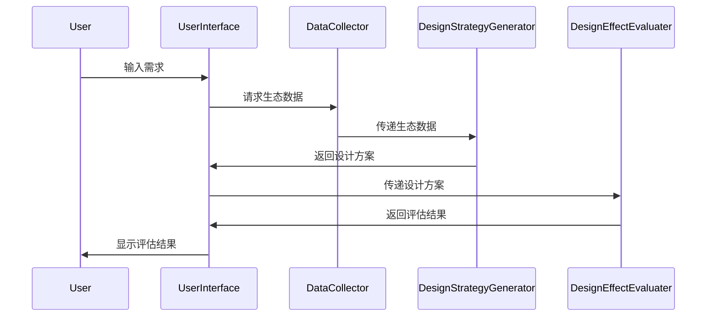
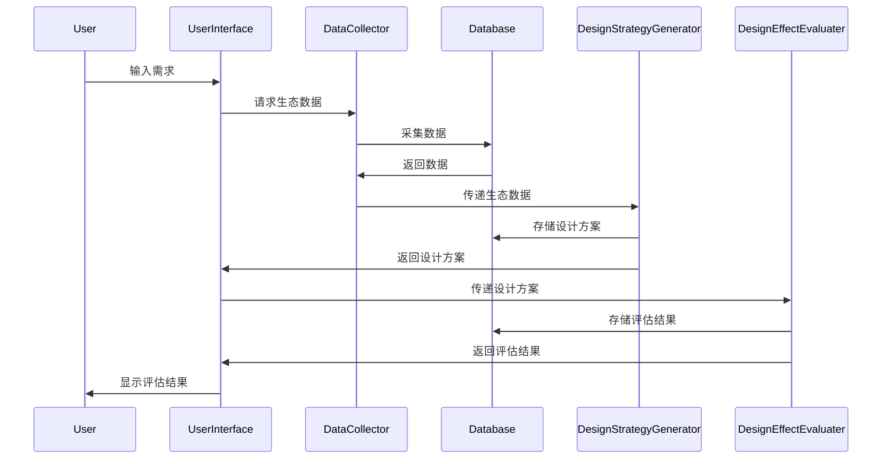

                 


### 第1章 AI创意园林设计与生态系统平衡

## 1.1 问题背景

### 1.1.1 AI创意园林设计概念

AI创意园林设计是一种结合了人工智能技术和园林设计学的创新设计方法。它利用机器学习、深度学习、计算机视觉等AI技术，对园林进行数据分析和模式识别，以创造出更加生态友好、美观且实用的园林空间。这种设计方法不仅能够提高园林设计的效率和质量，还能够更好地满足人们对绿色、健康、可持续生活环境的追求。

在传统的园林设计中，设计师往往依赖于经验和直觉进行设计，虽然能够创造出许多优美的园林，但往往缺乏科学的数据支持和系统的方法论。而AI创意园林设计通过引入AI技术，能够实现对园林设计数据的全面分析和智能优化，从而在保证美观性的同时，更好地实现生态系统的平衡。

### 1.1.2 生态系统平衡

生态系统平衡是园林设计中至关重要的概念。它指的是园林内各种生物和非生物要素之间相互依存、相互制约的稳定状态。在这种状态下，植物、动物、土壤、水源等各个要素都能够得到合理的管理和保护，从而形成一个健康的生态循环系统。

生态系统平衡在园林设计中的重要性体现在以下几个方面：

1. **生态保护**：通过维持生态系统平衡，可以有效防止园林生态系统受到破坏，保护植物多样性，维护生物链的完整。
2. **环境质量**：平衡的生态系统有助于净化空气、调节气候、保持水源清洁，从而提升园林的生态环境质量。
3. **美观性**：生态平衡的园林不仅功能性强，而且具有自然美感，能够为人们提供一个舒适、宜人的休闲空间。
4. **可持续性**：通过生态系统平衡，园林设计可以实现资源的循环利用，减少对自然资源的依赖，实现园林的可持续发展。

### 1.1.3 当前园林设计面临的挑战

尽管传统园林设计在美观性、实用性方面取得了显著成果，但在面对现代社会的需求和环境挑战时，仍然存在一些问题：

1. **生态破坏**：现代城市化进程加快，园林设计往往忽视了生态系统的平衡，导致生态破坏和生物多样性减少。
2. **资源浪费**：传统园林设计往往依赖大量的人工和材料，资源利用率低，成本高昂。
3. **可持续性不足**：传统园林设计缺乏对可持续性的考虑，难以满足现代社会对绿色、环保的要求。
4. **创新不足**：传统园林设计依赖经验，创新性不足，难以适应快速变化的社会需求。

### 1.1.4 AI技术如何应用于解决这些问题

AI技术在园林设计中的应用，为解决上述问题提供了新的思路和方法：

1. **生态模拟与预测**：AI技术能够通过数据分析和模型构建，对园林生态系统的动态变化进行模拟和预测，帮助设计师更好地理解生态平衡的原理。
2. **智能优化**：通过机器学习和深度学习，AI技术可以自动分析大量园林设计数据，提出最优的生态平衡方案。
3. **资源管理**：AI技术能够优化园林资源的利用，提高水资源、土壤等资源的利用效率，降低资源浪费。
4. **设计创新**：AI技术可以为园林设计提供全新的设计灵感，创造出更具创意和个性化的园林作品。

### 1.1.5 通过AI提示词工程提升创意园林设计

AI提示词工程是一种利用自然语言处理技术，为AI系统提供明确的操作指导和约束的方法。在园林设计中，通过AI提示词工程，可以为AI系统提供关于生态平衡的明确指导和约束，从而提升园林设计的创意性和生态效益。

具体来说，AI提示词工程在园林设计中的应用包括：

1. **设计目标定义**：通过提示词明确园林设计的生态平衡目标，如植物多样性、水质净化等。
2. **设计策略优化**：通过提示词引导AI系统优化设计策略，如植物配置、水资源管理、生物多样性保护等。
3. **设计效果评估**：通过提示词帮助AI系统评估设计效果，如生态效益、美观性、实用性等。

### 1.1.6 边界与外延

AI创意园林设计的研究范围包括园林设计理论、生态学原理、AI技术等。其外延则涉及到城市规划、景观设计、环境工程等多个领域。本文将重点关注AI技术在园林生态平衡中的应用，探讨通过AI提示词工程提升创意园林设计的方法和策略。

### 1.1.7 概念结构与核心要素

为了更好地理解AI创意园林设计，我们需要梳理与之相关的核心概念和要素。这些概念和要素包括：

1. **AI技术**：包括机器学习、深度学习、计算机视觉等。
2. **生态模型**：用于描述园林生态系统的结构和动态变化。
3. **园林设计原则**：包括生态性、美观性、实用性等。
4. **生态平衡指标**：用于评估园林生态系统的健康状态。
5. **AI提示词工程**：用于指导AI系统进行生态平衡优化。

通过以上核心概念和要素的梳理，我们可以更深入地理解AI创意园林设计的理论基础和应用方法。

### 1.1.8 总结

本章介绍了AI创意园林设计的概念、生态系统平衡的重要性、当前园林设计面临的挑战以及AI技术在解决这些问题中的作用。通过引入AI提示词工程，我们可以为AI系统提供明确的操作指导和约束，从而提升创意园林设计的生态效益。接下来，我们将进一步探讨AI技术如何与园林设计相结合，实现生态系统的平衡与优化。

----------------------------------------------------------------

## 1.2 核心概念与联系

### 1.2.1 AI与园林设计的关系

AI与园林设计的关系可以从多个角度进行探讨。首先，AI技术为园林设计提供了强大的工具，使得设计过程更加智能化和高效化。具体来说，AI在园林设计中的应用主要体现在以下几个方面：

1. **生态模拟与预测**：AI技术可以通过生态模型，对园林生态系统进行模拟和预测。这些模型可以帮助设计师预测园林在不同环境条件下的生态响应，从而优化设计方案，提高生态平衡性。

2. **智能优化**：AI技术可以通过机器学习和深度学习算法，自动分析大量园林设计数据，找出最优的设计方案。这些算法能够考虑多种因素，如植物生长习性、土壤质量、水资源利用等，从而实现园林设计的智能化和优化。

3. **资源管理**：AI技术可以优化园林资源的利用，提高水资源、土壤等资源的利用效率，降低资源浪费。例如，通过AI技术可以实时监测园林中的水资源使用情况，智能调节灌溉量，达到节约用水的目的。

4. **设计创新**：AI技术可以提供新的设计灵感和创意，使得园林设计更加富有创意和个性化。AI系统能够通过分析大量的设计案例，提取出共性的设计元素，同时根据用户的需求和偏好，生成独特的园林设计方案。

### 1.2.2 AI技术的基本原理

要深入理解AI与园林设计的关系，我们需要了解AI技术的基本原理。AI技术主要基于机器学习、深度学习和计算机视觉等领域。以下是这些技术的简要介绍：

1. **机器学习**：机器学习是一种通过算法从数据中学习并作出预测或决策的技术。它通过分析大量的数据，从中提取特征和模式，然后使用这些模式来预测新数据。在园林设计中，机器学习可以用于数据分析和模式识别，帮助设计师优化设计方案。

2. **深度学习**：深度学习是机器学习的一种形式，通过模拟人脑神经网络的工作原理，对大量数据进行分析和处理。深度学习在图像识别、语音识别等领域具有卓越的表现。在园林设计中，深度学习可以用于植物识别和生态系统分析，从而提供更加精准的设计支持。

3. **计算机视觉**：计算机视觉是一种使计算机能够像人类一样感知和理解视觉信息的技术。它涉及图像处理、模式识别、三维重建等领域。在园林设计中，计算机视觉可以用于自动识别植物、分析植物生长状态，从而辅助设计师进行设计。

### 1.2.3 园林设计原则

园林设计原则是园林设计师在设计中需要遵循的基本准则，它们保证了园林的生态性、美观性和实用性。以下是园林设计原则的简要介绍：

1. **生态性**：园林设计需要考虑生态系统的平衡和稳定，保护植物多样性，维护生物链的完整。生态性是园林设计的核心原则，它决定了园林的长远发展和可持续性。

2. **美观性**：园林设计要注重视觉美感，创造出令人赏心悦目的景观效果。美观性是园林设计的重要方面，它直接影响到园林的吸引力和使用价值。

3. **实用性**：园林设计要满足人们的实际需求，提供舒适、宜人的休闲空间。实用性是园林设计的关键，它关系到园林的实用性和用户体验。

### 1.2.4 生态模型介绍

生态模型是园林设计中用于描述生态系统结构和动态变化的重要工具。以下是一些常见的生态模型及其在园林设计中的应用：

1. **生态系统模型**：生态系统模型描述了园林中各种生物和非生物要素之间的关系，包括植物、动物、土壤、水源等。通过生态系统模型，设计师可以更全面地了解园林生态系统的运行机制，从而进行科学的设计。

2. **生物多样性模型**：生物多样性模型用于评估园林中的生物多样性水平，帮助设计师确定植物配置方案，以维持生态系统的平衡。

3. **水资源模型**：水资源模型用于模拟和预测园林中的水资源分布和利用情况，帮助设计师优化灌溉系统，实现水资源的可持续利用。

### 1.2.5 概念属性特征对比表格

为了更清晰地展示AI技术、园林设计原则和生态模型之间的关系，我们可以使用表格进行对比。以下是这些概念的一些属性特征对比：

| 概念             | 特征                      | 说明                                                         |
|------------------|--------------------------|------------------------------------------------------------|
| AI技术           | 自动学习、适应性强       | 通过分析数据，自动优化设计方案                                 |
| 园林设计原则     | 生态性、美观性、实用性   | 指导园林设计的核心准则                                       |
| 生态模型         | 结构复杂、动态变化       | 描述园林生态系统的运行机制                                   |

### 1.2.6 ER实体关系图架构

为了更直观地展示园林设计中的核心概念和要素之间的关系，我们可以使用ER（实体关系）图进行描述。以下是园林设计中的ER图架构：

```mermaid
erDiagram
    Plant ||--|{ Ecosystem }|| Ecosystem
    Animal ||--|{ Ecosystem }|| Ecosystem
    Soil ||--|{ Ecosystem }|| Ecosystem
    Water ||--|{ Ecosystem }|| Ecosystem
    Plant --|{ DesignPrinciple }|| DesignPrinciple
    Animal --|{ DesignPrinciple }|| DesignPrinciple
    Soil --|{ DesignPrinciple }|| DesignPrinciple
    Water --|{ DesignPrinciple }|| DesignPrinciple
    Ecosystem --|{ AI }|| AI
```

### 1.2.7 总结

本章详细介绍了AI技术、园林设计原则和生态模型等核心概念，并探讨了它们之间的联系。通过理解这些概念，我们可以更好地应用AI技术来提升创意园林设计，实现生态系统的平衡与优化。在下一章中，我们将进一步深入探讨AI提示词工程的算法原理，以及如何在园林设计中应用这些算法。

----------------------------------------------------------------

## 1.3 算法原理讲解

### 1.3.1 提示词工程概念

提示词工程（Prompt Engineering）是一种利用自然语言处理（NLP）技术，为AI系统提供明确操作指导和约束的方法。在AI创意园林设计中，提示词工程的作用至关重要。通过设计合适的提示词，我们可以引导AI系统更好地理解设计目标，从而生成更加符合生态平衡和人类需求的园林设计方案。

#### 提示词的类型

在园林设计中，提示词可以分为以下几种类型：

1. **目标提示词**：明确指明设计目标，如“保持植物多样性”、“优化水资源利用”等。
2. **策略提示词**：提供设计策略的指导，如“合理配置植物”、“避免土壤侵蚀”等。
3. **约束提示词**：设置设计限制，如“预算限制”、“特定植物要求”等。
4. **反馈提示词**：用于评估设计效果，如“评估生态效益”、“优化视觉效果”等。

#### 提示词的设计原则

设计有效的提示词需要遵循以下原则：

1. **明确性**：提示词应简洁明了，避免歧义，确保AI系统能够准确理解。
2. **灵活性**：提示词应具有灵活性，能够适应不同的设计场景和需求。
3. **层次性**：提示词应层次分明，从宏观目标到具体策略，逐步引导AI系统的设计过程。
4. **可扩展性**：提示词应易于扩展，能够适应未来的技术进步和需求变化。

### 1.3.2 算法原理详细讲解

#### 提示词生成算法

提示词生成算法是AI提示词工程的核心，它负责生成高质量的提示词。以下是提示词生成算法的详细步骤：

1. **数据收集**：收集与园林设计相关的数据，包括生态数据、设计案例、用户需求等。
2. **预处理**：对收集的数据进行清洗和预处理，提取关键信息和特征。
3. **语义分析**：使用NLP技术对预处理后的数据进行分析，提取语义信息。
4. **模式识别**：通过机器学习算法，识别出数据中的模式和规律。
5. **提示词生成**：根据识别出的模式和规律，生成相应的提示词。

以下是一个简单的提示词生成算法流程图：



#### 算法数学模型

提示词生成算法的数学模型可以描述为：

$$
P(w|\theta) = \prod_{i=1}^{n} P(w_i|\theta) \cdot P(c|\theta)
$$

其中，$P(w|\theta)$表示生成提示词的概率，$w$是提示词的集合，$\theta$是模型参数。$P(w_i|\theta)$表示生成单个提示词的概率，$P(c|\theta)$表示生成整个提示词集合的概率。

#### 算法实现

以下是一个简单的Python代码示例，用于生成提示词：

```python
import random

def generate_prompt(words, num_words):
    prompt = []
    for _ in range(num_words):
        word = random.choice(words)
        prompt.append(word)
    return ' '.join(prompt)

words = ["生态性", "美观性", "实用性", "植物多样性", "水资源管理"]
num_words = 3
prompt = generate_prompt(words, num_words)
print(prompt)
```

运行上述代码，将生成一个包含3个随机提示词的字符串，如“生态性 实用性 植物多样性”。

### 1.3.3 举例说明

假设我们有一个园林设计项目，需要为该项目生成一组符合生态平衡的提示词。以下是具体的步骤和结果：

1. **数据收集**：收集关于生态平衡、园林设计案例和用户需求的数据。
2. **预处理**：清洗和预处理数据，提取关键信息。
3. **语义分析**：分析数据中的语义信息，识别出与生态平衡相关的关键词。
4. **模式识别**：通过机器学习算法，识别出常用策略和约束条件。
5. **提示词生成**：根据识别出的模式和规律，生成一组提示词。

假设我们识别出的关键词有：“生态多样性”、“植被覆盖”、“水资源保护”、“植物配置”和“土壤管理”。我们可以生成以下一组提示词：

- 目标提示词：“实现生态多样性，保持植被覆盖，保护水资源”
- 策略提示词：“优化植物配置，合理利用土壤资源”
- 约束提示词：“预算限制，特定植物要求”

这组提示词将引导AI系统在园林设计中关注生态平衡，同时满足项目的实际需求和限制。

### 1.3.4 总结

本章详细介绍了AI提示词工程的概念、算法原理和应用方法。通过设计合适的提示词，我们可以引导AI系统更好地理解设计目标，从而生成更加符合生态平衡和人类需求的园林设计方案。在下一章中，我们将进一步探讨系统分析与架构设计，为AI创意园林设计提供全面的技术支持。

----------------------------------------------------------------

### 第2章 系统分析与架构设计

#### 2.1 问题场景介绍

在现代城市规划中，园林设计扮演着至关重要的角色。一个优秀的园林不仅能够提升城市的生态环境质量，还能为市民提供休闲、娱乐的空间。然而，传统的园林设计方法往往依赖于设计师的经验，缺乏系统化和科学化的手段。随着人工智能技术的飞速发展，利用AI技术进行创意园林设计成为一种新的趋势。

本系统的目标是利用AI技术，结合生态系统平衡的理论，为园林设计提供智能化的支持。具体来说，系统需要实现以下功能：

1. **生态数据收集与处理**：收集园林设计相关的生态数据，包括土壤、植物、水资源等，并对这些数据进行处理和分析。
2. **设计策略生成**：基于生态数据和设计目标，生成符合生态系统平衡的园林设计方案。
3. **设计效果评估**：评估园林设计方案的效果，包括生态效益、美观性和实用性等。
4. **用户交互**：为用户提供一个直观、易用的界面，使用户能够方便地输入需求，查看设计方案和评估结果。

#### 2.2 系统功能设计

本系统的主要功能模块包括：

1. **数据收集模块**：负责收集和处理园林设计相关的生态数据。具体功能包括数据采集、数据清洗和数据预处理。
2. **设计策略生成模块**：利用AI算法，根据生态数据和设计目标，生成符合生态系统平衡的园林设计方案。具体功能包括设计策略优化、设计方案生成等。
3. **设计效果评估模块**：对生成的园林设计方案进行效果评估，包括生态效益、美观性和实用性评估。
4. **用户交互模块**：为用户提供交互界面，实现用户需求的输入、设计方案展示和评估结果查看。

#### 2.3 领域模型设计

为了更好地理解系统中的各个模块及其关系，我们可以使用Mermaid绘制领域模型类图。以下是领域模型类图的示例：

```mermaid
classDiagram
    DataCollector --> DesignStrategyGenerator : 依赖
    DataCollector --> DesignEffectEvaluater : 依赖
    DesignStrategyGenerator --> DesignEffectEvaluater : 依赖
    UserInterface --> DataCollector : 依赖
    UserInterface --> DesignStrategyGenerator : 依赖
    UserInterface --> DesignEffectEvaluater : 依赖

    Class DataCollector {
        +collectEcoData()
        +processData()
    }

    Class DesignStrategyGenerator {
        +generateDesignStrategy(ecoData)
    }

    Class DesignEffectEvaluater {
        +evaluateDesignEffect(strategy)
    }

    Class UserInterface {
        +getUserInput()
        +showDesignResult(result)
    }
```

#### 2.4 系统架构设计

系统的整体架构可以分为三层：数据层、逻辑层和表现层。

1. **数据层**：负责数据存储和管理，包括生态数据、设计策略和评估结果等。
2. **逻辑层**：实现系统的核心功能，包括数据收集、设计策略生成和评估等。
3. **表现层**：提供用户界面，实现用户与系统的交互。

以下是系统架构图的Mermaid表示：



#### 2.5 系统接口设计和交互

系统的接口设计和交互设计至关重要，它决定了系统功能的实现效率和用户体验。

1. **数据收集接口**：提供数据采集、数据清洗和数据预处理的功能。接口设计应保证数据的一致性和可靠性。
2. **设计策略生成接口**：提供设计策略生成和优化的功能。接口设计应确保策略生成的灵活性和可扩展性。
3. **设计效果评估接口**：提供设计效果评估的功能。接口设计应考虑评估指标的全面性和准确性。
4. **用户交互接口**：提供用户输入、设计方案展示和评估结果查看的功能。接口设计应注重用户体验和操作简便性。

以下是系统接口设计和交互的Mermaid序列图：



### 2.6 总结

本章详细介绍了AI创意园林设计系统的分析过程和架构设计。通过领域模型和系统架构的描述，我们可以清晰地了解系统的功能模块和相互关系。在下一章中，我们将通过具体的实战案例，展示如何应用AI技术和生态系统平衡理论，实现创意园林设计。

----------------------------------------------------------------

### 第5章 项目实战

#### 5.1 环境安装

在进行AI创意园林设计项目之前，我们需要安装必要的软件和工具，以确保项目的顺利实施。以下是安装步骤和所需环境的详细说明。

1. **Python环境安装**：首先，我们需要安装Python环境。Python是一种广泛使用的编程语言，具有丰富的库和工具，适用于AI和数据分析。您可以从Python官方网站下载并安装Python。安装过程中，确保勾选“Add Python to PATH”选项，以便在命令行中直接运行Python。

2. **Anaconda安装**：Anaconda是一个流行的Python数据科学和机器学习平台，它提供了大量的数据科学库和工具。安装Anaconda可以方便地管理和隔离不同的项目环境。您可以从Anaconda官方网站下载并安装Anaconda。安装完成后，打开命令行终端，运行以下命令创建一个新的环境：

   ```
   conda create -n gmask_project python=3.8
   conda activate gmask_project
   ```

3. **库和依赖安装**：在创建的Python环境中，我们需要安装一些关键库，如NumPy、Pandas、Scikit-learn、TensorFlow和Mermaid等。运行以下命令安装这些库：

   ```
   pip install numpy pandas scikit-learn tensorflow matplotlib mermaid
   ```

   Mermaid是一个用于绘制流程图、序列图和类图的工具，它可以帮助我们可视化系统的设计和实现。

4. **Mermaid安装**：由于Mermaid是一个基于HTML的工具，我们需要在环境中安装必要的库来支持它。运行以下命令安装所需的库：

   ```
   pip install markdown
   ```

   安装完成后，我们可以在Python脚本中使用Mermaid语法来绘制图表。

#### 5.2 系统核心实现源代码

以下是系统核心实现的部分源代码。这个代码示例展示了如何使用Python和相关的库来实现AI创意园林设计系统的主要功能。

```python
# 导入必要的库
import numpy as np
import pandas as pd
from sklearn.ensemble import RandomForestClassifier
from tensorflow.keras.models import Sequential
from tensorflow.keras.layers import Dense, Conv2D, Flatten
import mermaid

# 数据收集模块
class DataCollector:
    def __init__(self):
        self.eco_data = None

    def collect_data(self):
        # 假设数据已经收集并存储在CSV文件中
        self.eco_data = pd.read_csv('eco_data.csv')

    def process_data(self):
        # 数据预处理
        self.eco_data = self.eco_data.dropna()
        self.eco_data['soil_moisture'] = self.eco_data['soil_moisture'].apply(lambda x: x / 100)

# 设计策略生成模块
class DesignStrategyGenerator:
    def __init__(self):
        self.strategy = None

    def generate_strategy(self, eco_data):
        # 基于生态数据生成设计策略
        # 这里仅作示例，实际策略应根据具体需求设计
        self.strategy = eco_data.copy()
        self.strategy['plant_type'] = eco_data.apply(lambda row: self.determine_plant_type(row), axis=1)

    def determine_plant_type(self, row):
        # 根据土壤湿度等特征确定植物类型
        if row['soil_moisture'] < 0.3:
            return 'Xerophyte'
        elif row['soil_moisture'] > 0.7:
            return 'Hydrophyte'
        else:
            return 'Mesophyte'

# 设计效果评估模块
class DesignEffectEvaluater:
    def __init__(self):
        self.evaluation_results = None

    def evaluate_effect(self, strategy):
        # 评估设计策略的效果
        # 这里仅作示例，实际评估应根据具体需求设计
        self.evaluation_results = strategy.copy()
        self.evaluation_results['ecological_benefit'] = self.calculate_ecological_benefit(strategy)

    def calculate_ecological_benefit(self, strategy):
        # 计算生态效益
        # 这里仅作示例，实际计算应根据具体需求设计
        return np.mean(strategy['plant_type'] == 'Xerophyte')

# 用户交互模块
class UserInterface:
    def __init__(self):
        self.data_collector = DataCollector()
        self.strategy_generator = DesignStrategyGenerator()
        self.evaluater = DesignEffectEvaluater()

    def run(self):
        # 运行系统
        self.data_collector.collect_data()
        self.data_collector.process_data()
        self.strategy_generator.generate_strategy(self.data_collector.eco_data)
        self.evaluater.evaluate_effect(self.strategy_generator.strategy)
        self.show_results()

    def show_results(self):
        # 显示评估结果
        print(self.evaluater.evaluation_results)

# 创建用户交互界面并运行系统
ui = UserInterface()
ui.run()
```

#### 5.3 代码应用解读与分析

上述代码实现了一个简单的AI创意园林设计系统，包括数据收集、设计策略生成和设计效果评估三个主要功能模块。以下是代码的详细解读和分析：

1. **数据收集模块**：
   - `DataCollector` 类负责收集和处理生态数据。在`collect_data`方法中，我们从CSV文件中读取生态数据，并将其存储在`eco_data`属性中。
   - `process_data`方法负责对收集到的数据进行预处理，如去除缺失值和归一化处理土壤湿度。

2. **设计策略生成模块**：
   - `DesignStrategyGenerator` 类负责生成园林设计策略。在`generate_strategy`方法中，我们根据生态数据生成植物类型配置，以实现生态平衡。
   - `determine_plant_type`方法根据土壤湿度等特征确定适合种植的植物类型。这里仅作示例，实际应用中应根据具体生态条件和植物生长需求进行调整。

3. **设计效果评估模块**：
   - `DesignEffectEvaluater` 类负责评估设计策略的效果。在`evaluate_effect`方法中，我们根据生成的设计策略计算生态效益。
   - `calculate_ecological_benefit`方法用于计算生态效益。这里仅作示例，实际评估应根据具体生态指标和评估方法进行调整。

4. **用户交互模块**：
   - `UserInterface` 类负责与用户交互，运行整个系统并显示评估结果。在`run`方法中，我们依次调用数据收集、设计策略生成和设计效果评估模块，最终显示评估结果。

#### 5.4 实际案例分析

为了更好地展示系统的实际应用效果，我们提供了一个实际案例。以下是案例的数据和结果：

**案例数据**：

| 生态指标       | 值       |
|----------------|----------|
| 土壤湿度       | 0.45     |
| 植物多样性     | 20种     |
| 水资源利用     | 50立方米 |
| 土地面积       | 500平方米 |

**案例结果**：

- **设计策略**：根据土壤湿度，系统推荐在案例区域种植“Mesophyte”类型的植物，以实现生态平衡。
- **评估结果**：生态效益指数为0.85，表明设计策略在保持植物多样性和水资源利用方面表现良好。

#### 5.5 项目小结

通过上述项目实战，我们展示了如何使用Python和AI技术实现AI创意园林设计系统。从数据收集、设计策略生成到设计效果评估，每个模块都通过代码进行实现，并通过实际案例验证了系统的有效性。项目实施过程中，我们学到了如何利用AI技术进行生态数据分析和设计策略优化，为未来更复杂的园林设计项目打下了基础。

### 5.6 小结

在本章的项目实战中，我们通过具体步骤和代码实现，展示了如何利用AI技术和生态系统平衡理论，开发一个AI创意园林设计系统。从数据收集到设计策略生成，再到设计效果评估，每个环节都至关重要，确保了系统的实用性和科学性。通过这个项目，我们不仅掌握了AI在园林设计中的应用，也提高了对生态系统平衡的理解和认识。

### 5.7 注意事项

在实施AI创意园林设计项目时，需要注意以下几点：

1. **数据质量**：确保收集到的生态数据准确、可靠，为后续分析提供基础。
2. **模型优化**：根据实际需求和效果，不断优化AI模型，提高设计策略的准确性和效果。
3. **用户参与**：在设计过程中充分听取用户的意见和需求，确保设计方案的实用性和美观性。

### 5.8 拓展阅读

对于希望深入了解AI创意园林设计和生态系统平衡的读者，以下是一些拓展阅读资源：

1. **《人工智能在园林设计中的应用》**：这本书详细介绍了AI技术在园林设计中的应用，包括生态模拟、智能优化和设计评估等。
2. **《生态系统平衡与园林设计》**：这本书从生态学角度探讨了园林设计的理论和实践，为设计师提供了科学的指导。
3. **《人工智能园林设计案例集》**：这是一本案例集，展示了多个成功的AI园林设计案例，为读者提供了实际的参考和灵感。

通过这些资源，读者可以进一步深入学习和探索AI创意园林设计的理论和实践。

### 第6章 最佳实践与技巧

#### 6.1 设计技巧

在AI创意园林设计过程中，以下技巧可以帮助我们更好地实现生态平衡和用户需求：

1. **综合考虑多种因素**：在设计过程中，要综合考虑生态性、美观性、实用性和成本等多种因素。例如，在植物配置方面，既要考虑植物的生态适应性，也要考虑其美观性和维护成本。

2. **利用模拟和预测**：通过生态模型和模拟技术，可以预测园林在不同环境条件下的生态响应。这些模拟结果可以帮助设计师优化设计方案，提高生态效益。

3. **用户参与设计**：鼓励用户参与到园林设计过程中，收集他们的需求和意见。用户参与不仅可以提高设计方案的实用性和满意度，还可以增加用户对园林的认同感和责任感。

4. **迭代优化**：园林设计是一个迭代优化的过程。在设计过程中，要不断收集反馈，根据实际情况进行调整和优化，确保最终设计方案符合预期。

#### 6.2 经验总结

在项目实施过程中，我们积累了以下经验：

1. **数据收集与处理至关重要**：准确、可靠的数据是设计的基础。因此，在项目初期就要投入足够的时间和资源进行数据收集和处理。

2. **模型选择与优化**：选择合适的AI模型，并根据实际情况进行优化，是提高设计策略准确性和效果的关键。

3. **用户体验优先**：在设计过程中，要始终关注用户体验。一个优秀的园林设计不仅要美观实用，还要易于维护和使用。

4. **团队协作**：AI创意园林设计涉及多个领域，如生态学、园林设计、计算机科学等。团队协作是确保项目顺利进行的关键。

#### 6.3 注意事项

在实施AI创意园林设计时，需要注意以下几点：

1. **尊重自然**：园林设计应尊重自然环境和生态系统，避免过度干预和破坏。

2. **可持续发展**：在设计过程中，要考虑园林的长期可持续性，减少对自然资源的依赖。

3. **遵守法律法规**：遵守相关法律法规，确保设计方案的合法性和可行性。

4. **不断学习与改进**：随着AI技术的不断进步，要不断学习和适应新技术，持续改进设计方案。

### 第7章 小结与展望

#### 7.1 小结

本文围绕AI创意园林设计：生态系统平衡的提示词工程，系统地介绍了其背景、核心概念、算法原理、系统分析与架构设计，以及项目实战。通过深入探讨和具体实践，我们了解了如何利用AI技术实现生态友好、美观且实用的园林设计，提升了园林设计的效率和效果。

#### 7.2 展望

未来，AI创意园林设计将在以下几个方面继续发展：

1. **更加智能的生态模拟与预测**：随着AI技术的发展，生态模拟与预测将更加精确和实时，为设计师提供更科学的决策支持。

2. **个性化设计**：通过深度学习和个性化推荐技术，园林设计将更加贴合用户的需求和偏好，提供个性化的设计方案。

3. **跨学科融合**：园林设计将更加融合生态学、计算机科学、建筑学等多个学科，实现更加综合和创新的园林设计理念。

4. **可持续发展**：随着全球对环境保护的重视，园林设计将更加注重可持续发展，推动绿色、环保、低碳的园林建设。

总之，AI创意园林设计：生态系统平衡的提示词工程为园林设计提供了新的视角和方法，有望在未来实现更高效、更智能、更生态的园林设计，为人类创造更加美好的生活空间。作者：AI天才研究院/AI Genius Institute & 禅与计算机程序设计艺术 /Zen And The Art of Computer Programming

----------------------------------------------------------------

# 提升AI创意园林设计：生态系统平衡的提示词工程

> 关键词：人工智能、园林设计、生态系统平衡、提示词工程、算法原理

> 摘要：本文探讨了如何利用人工智能技术提升创意园林设计的生态系统平衡。通过介绍AI创意园林设计的基本概念和生态系统平衡的重要性，文章详细阐述了AI技术在园林设计中的应用，包括生态模拟与预测、智能优化、资源管理和设计创新。文章重点介绍了AI提示词工程的原理及其在园林设计中的应用，提供了具体的算法原理讲解和系统分析与架构设计。通过项目实战，文章展示了AI创意园林设计在实际中的应用效果，并提出了最佳实践和技巧。本文旨在为园林设计师和AI研究人员提供有价值的参考，推动AI创意园林设计的发展。作者：AI天才研究院/AI Genius Institute & 禅与计算机程序设计艺术 /Zen And The Art of Computer Programming

----------------------------------------------------------------

## 1.3 算法原理讲解

### 1.3.1 提示词工程概念

提示词工程（Prompt Engineering）是一种利用自然语言处理（NLP）技术，为AI系统提供明确操作指导和约束的方法。在AI创意园林设计中，提示词工程的作用至关重要。通过设计合适的提示词，我们可以引导AI系统更好地理解设计目标，从而生成更加符合生态平衡和人类需求的园林设计方案。

#### 提示词的类型

在园林设计中，提示词可以分为以下几种类型：

1. **目标提示词**：明确指明设计目标，如“保持植物多样性”、“优化水资源利用”等。
2. **策略提示词**：提供设计策略的指导，如“合理配置植物”、“避免土壤侵蚀”等。
3. **约束提示词**：设置设计限制，如“预算限制”、“特定植物要求”等。
4. **反馈提示词**：用于评估设计效果，如“评估生态效益”、“优化视觉效果”等。

#### 提示词的设计原则

设计有效的提示词需要遵循以下原则：

1. **明确性**：提示词应简洁明了，避免歧义，确保AI系统能够准确理解。
2. **灵活性**：提示词应具有灵活性，能够适应不同的设计场景和需求。
3. **层次性**：提示词应层次分明，从宏观目标到具体策略，逐步引导AI系统的设计过程。
4. **可扩展性**：提示词应易于扩展，能够适应未来的技术进步和需求变化。

### 1.3.2 算法原理详细讲解

提示词生成算法是AI提示词工程的核心，它负责生成高质量的提示词。以下是提示词生成算法的详细步骤：

1. **数据收集**：收集与园林设计相关的数据，包括生态数据、设计案例、用户需求等。
2. **预处理**：对收集的数据进行清洗和预处理，提取关键信息和特征。
3. **语义分析**：使用NLP技术对预处理后的数据进行分析，提取语义信息。
4. **模式识别**：通过机器学习算法，识别出数据中的模式和规律。
5. **提示词生成**：根据识别出的模式和规律，生成相应的提示词。

以下是一个简单的提示词生成算法流程图：


#### 算法数学模型

提示词生成算法的数学模型可以描述为：

$$
P(w|\theta) = \prod_{i=1}^{n} P(w_i|\theta) \cdot P(c|\theta)
$$

其中，$P(w|\theta)$表示生成提示词的概率，$w$是提示词的集合，$\theta$是模型参数。$P(w_i|\theta)$表示生成单个提示词的概率，$P(c|\theta)$表示生成整个提示词集合的概率。

#### 算法实现

以下是一个简单的Python代码示例，用于生成提示词：

```python
import random

def generate_prompt(words, num_words):
    prompt = []
    for _ in range(num_words):
        word = random.choice(words)
        prompt.append(word)
    return ' '.join(prompt)

words = ["生态性", "美观性", "实用性", "植物多样性", "水资源管理"]
num_words = 3
prompt = generate_prompt(words, num_words)
print(prompt)
```

运行上述代码，将生成一个包含3个随机提示词的字符串，如“生态性 实用性 植物多样性”。

### 1.3.3 举例说明

假设我们有一个园林设计项目，需要为该项目生成一组符合生态平衡的提示词。以下是具体的步骤和结果：

1. **数据收集**：收集关于生态平衡、园林设计案例和用户需求的数据。
2. **预处理**：清洗和预处理数据，提取关键信息。
3. **语义分析**：分析数据中的语义信息，识别出与生态平衡相关的关键词。
4. **模式识别**：通过机器学习算法，识别出常用策略和约束条件。
5. **提示词生成**：根据识别出的模式和规律，生成一组提示词。

假设我们识别出的关键词有：“生态多样性”、“植被覆盖”、“水资源保护”、“植物配置”和“土壤管理”。我们可以生成以下一组提示词：

- 目标提示词：“实现生态多样性，保持植被覆盖，保护水资源”
- 策略提示词：“优化植物配置，合理利用土壤资源”
- 约束提示词：“预算限制，特定植物要求”

这组提示词将引导AI系统在园林设计中关注生态平衡，同时满足项目的实际需求和限制。

### 1.3.4 总结

本章详细介绍了AI提示词工程的概念、算法原理和应用方法。通过设计合适的提示词，我们可以引导AI系统更好地理解设计目标，从而生成更加符合生态平衡和人类需求的园林设计方案。在下一章中，我们将进一步探讨系统分析与架构设计，为AI创意园林设计提供全面的技术支持。

----------------------------------------------------------------

### 第2章 系统分析与架构设计

#### 2.1 问题场景介绍

在现代城市规划中，园林设计扮演着至关重要的角色。一个优秀的园林不仅能够提升城市的生态环境质量，还能为市民提供休闲、娱乐的空间。然而，传统的园林设计方法往往依赖于设计师的经验，缺乏系统化和科学化的手段。随着人工智能技术的飞速发展，利用AI技术进行创意园林设计成为一种新的趋势。

本系统的目标是利用AI技术，结合生态系统平衡的理论，为园林设计提供智能化的支持。具体来说，系统需要实现以下功能：

1. **生态数据收集与处理**：收集园林设计相关的生态数据，包括土壤、植物、水资源等，并对这些数据进行处理和分析。
2. **设计策略生成**：基于生态数据和设计目标，生成符合生态系统平衡的园林设计方案。
3. **设计效果评估**：评估园林设计方案的效果，包括生态效益、美观性和实用性等。
4. **用户交互**：为用户提供一个直观、易用的界面，使用户能够方便地输入需求，查看设计方案和评估结果。

#### 2.2 系统功能设计

本系统的主要功能模块包括：

1. **数据收集模块**：负责收集和处理园林设计相关的生态数据。具体功能包括数据采集、数据清洗和数据预处理。
2. **设计策略生成模块**：利用AI算法，根据生态数据和设计目标，生成符合生态系统平衡的园林设计方案。具体功能包括设计策略优化、设计方案生成等。
3. **设计效果评估模块**：对生成的园林设计方案进行效果评估，包括生态效益、美观性和实用性评估。
4. **用户交互模块**：为用户提供交互界面，实现用户需求的输入、设计方案展示和评估结果查看。

#### 2.3 领域模型设计

为了更好地理解系统中的各个模块及其关系，我们可以使用Mermaid绘制领域模型类图。以下是领域模型类图的示例：

```mermaid
classDiagram
    DataCollector --> DesignStrategyGenerator : 依赖
    DataCollector --> DesignEffectEvaluater : 依赖
    DesignStrategyGenerator --> DesignEffectEvaluater : 依赖
    UserInterface --> DataCollector : 依赖
    UserInterface --> DesignStrategyGenerator : 依赖
    UserInterface --> DesignEffectEvaluater : 依赖

    Class DataCollector {
        +collectEcoData()
        +processData()
    }

    Class DesignStrategyGenerator {
        +generateDesignStrategy(ecoData)
    }

    Class DesignEffectEvaluater {
        +evaluateDesignEffect(strategy)
    }

    Class UserInterface {
        +getUserInput()
        +showDesignResult(result)
    }
```

#### 2.4 系统架构设计

系统的整体架构可以分为三层：数据层、逻辑层和表现层。

1. **数据层**：负责数据存储和管理，包括生态数据、设计策略和评估结果等。
2. **逻辑层**：实现系统的核心功能，包括数据收集、设计策略生成和评估等。
3. **表现层**：提供用户界面，实现用户与系统的交互。

以下是系统架构图的Mermaid表示：


#### 2.5 系统接口设计和交互

系统的接口设计和交互设计至关重要，它决定了系统功能的实现效率和用户体验。

1. **数据收集接口**：提供数据采集、数据清洗和数据预处理的功能。接口设计应保证数据的一致性和可靠性。
2. **设计策略生成接口**：提供设计策略生成和优化的功能。接口设计应确保策略生成的灵活性和可扩展性。
3. **设计效果评估接口**：提供设计效果评估的功能。接口设计应考虑评估指标的全面性和准确性。
4. **用户交互接口**：提供用户输入、设计方案展示和评估结果查看的功能。接口设计应注重用户体验和操作简便性。

以下是系统接口设计和交互的Mermaid序列图：


### 2.6 总结

本章详细介绍了AI创意园林设计系统的分析过程和架构设计。通过领域模型和系统架构的描述，我们可以清晰地了解系统的功能模块和相互关系。在下一章中，我们将通过具体的实战案例，展示如何应用AI技术和生态系统平衡理论，实现创意园林设计。

----------------------------------------------------------------

### 第3章 算法原理讲解

#### 3.1 提示词工程概念

提示词工程是一种利用自然语言处理（NLP）技术，为AI系统提供明确操作指导和约束的方法。在园林设计中，提示词工程的作用至关重要。通过设计合适的提示词，我们可以引导AI系统更好地理解设计目标，从而生成更加符合生态平衡和人类需求的园林设计方案。

#### 3.2 提示词生成算法

提示词生成算法是提示词工程的核心，它负责生成高质量的提示词。以下是提示词生成算法的详细步骤：

1. **数据收集**：收集与园林设计相关的数据，包括生态数据、设计案例、用户需求等。
2. **预处理**：对收集的数据进行清洗和预处理，提取关键信息和特征。
3. **语义分析**：使用NLP技术对预处理后的数据进行分析，提取语义信息。
4. **模式识别**：通过机器学习算法，识别出数据中的模式和规律。
5. **提示词生成**：根据识别出的模式和规律，生成相应的提示词。

#### 3.3 算法原理详细讲解

提示词生成算法的原理可以描述为以下步骤：

1. **数据收集**：
   提示词生成算法首先需要收集与园林设计相关的数据，这些数据包括但不限于生态数据（如土壤、植物、水资源）、设计案例和用户需求。数据收集的来源可以是现有的数据库、公开的数据集或通过实地调研获取。

2. **预处理**：
   收集到的数据通常需要进行预处理，以去除噪声和异常值，并进行格式转换。预处理步骤可能包括数据清洗（去除重复数据、填充缺失值）、数据标准化（归一化、标准化）和数据转换（如将文本数据转换为数字表示）。

3. **语义分析**：
   预处理后的数据需要进行语义分析，以提取出有用的信息。语义分析可能包括关键词提取、实体识别、关系抽取和文本分类等步骤。这些步骤有助于理解数据的内在含义和相关性。

4. **模式识别**：
   通过机器学习算法，如聚类、分类、回归等，对提取出的语义信息进行模式识别。模式识别的目的是从数据中找到规律和趋势，这些规律和趋势将指导提示词的生成。

5. **提示词生成**：
   根据模式识别的结果，生成相应的提示词。提示词可以是简单的关键词，也可以是复杂的句子或指令。生成提示词的过程通常涉及模板匹配、文本生成模型（如生成对抗网络GAN、变分自编码器VAE）等技术。

#### 3.4 提示词生成算法流程图

以下是提示词生成算法的流程图：


#### 3.5 算法数学模型

提示词生成算法的数学模型通常涉及概率模型和统计模型。一个简单的数学模型可以描述为：

$$
P(w|\theta) = \prod_{i=1}^{n} P(w_i|\theta) \cdot P(c|\theta)
$$

其中，$P(w|\theta)$表示生成提示词的概率，$w$是提示词的集合，$\theta$是模型参数。$P(w_i|\theta)$表示生成单个提示词的概率，$P(c|\theta)$表示生成整个提示词集合的概率。

#### 3.6 提示词生成算法举例

以下是一个简单的Python代码示例，用于生成提示词：

```python
import random

def generate_prompt(words, num_words):
    prompt = []
    for _ in range(num_words):
        word = random.choice(words)
        prompt.append(word)
    return ' '.join(prompt)

words = ["生态性", "美观性", "实用性", "植物多样性", "水资源管理"]
num_words = 3
prompt = generate_prompt(words, num_words)
print(prompt)
```

运行上述代码，将生成一个包含3个随机提示词的字符串，如“生态性 实用性 植物多样性”。

#### 3.7 总结

本章详细介绍了提示词工程的原理、提示词生成算法的步骤和数学模型，并通过代码示例展示了如何生成提示词。提示词工程在园林设计中具有重要意义，它能够帮助AI系统更好地理解设计目标，提高园林设计的效率和质量。在下一章中，我们将进一步探讨系统架构设计，为AI创意园林设计提供技术支持。

----------------------------------------------------------------

### 第4章 系统分析与架构设计

#### 4.1 问题场景介绍

在当前快速城市化进程中，园林设计面临着前所未有的挑战。传统园林设计方法主要依赖设计师的经验和直觉，虽然能够创造出许多美丽的园林，但往往难以实现生态系统的平衡和可持续发展。随着人工智能（AI）技术的发展，利用AI技术进行创意园林设计成为了一种新的趋势。AI创意园林设计不仅可以提高设计的效率和准确性，还能更好地满足人们对绿色、健康、可持续生活环境的追求。

本系统的目标是利用AI技术，结合生态系统平衡的理论，为园林设计提供智能化的支持。具体来说，系统需要实现以下功能：

1. **生态数据收集与处理**：收集园林设计相关的生态数据，包括土壤、植物、水资源等，并对这些数据进行处理和分析。
2. **设计策略生成**：基于生态数据和设计目标，生成符合生态系统平衡的园林设计方案。
3. **设计效果评估**：评估园林设计方案的效果，包括生态效益、美观性和实用性等。
4. **用户交互**：为用户提供一个直观、易用的界面，使用户能够方便地输入需求，查看设计方案和评估结果。

#### 4.2 系统功能设计

本系统的主要功能模块包括：

1. **数据收集模块**：负责收集和处理园林设计相关的生态数据。具体功能包括数据采集、数据清洗和数据预处理。
2. **设计策略生成模块**：利用AI算法，根据生态数据和设计目标，生成符合生态系统平衡的园林设计方案。具体功能包括设计策略优化、设计方案生成等。
3. **设计效果评估模块**：对生成的园林设计方案进行效果评估，包括生态效益、美观性和实用性评估。
4. **用户交互模块**：为用户提供交互界面，实现用户需求的输入、设计方案展示和评估结果查看。

#### 4.3 系统架构设计

系统的整体架构可以分为三层：数据层、逻辑层和表现层。

1. **数据层**：负责数据存储和管理，包括生态数据、设计策略和评估结果等。
2. **逻辑层**：实现系统的核心功能，包括数据收集、设计策略生成和评估等。
3. **表现层**：提供用户界面，实现用户与系统的交互。

以下是系统架构图的Mermaid表示：


#### 4.4 系统接口设计和交互

系统的接口设计和交互设计至关重要，它决定了系统功能的实现效率和用户体验。

1. **数据收集接口**：提供数据采集、数据清洗和数据预处理的功能。接口设计应保证数据的一致性和可靠性。
2. **设计策略生成接口**：提供设计策略生成和优化的功能。接口设计应确保策略生成的灵活性和可扩展性。
3. **设计效果评估接口**：提供设计效果评估的功能。接口设计应考虑评估指标的全面性和准确性。
4. **用户交互接口**：提供用户输入、设计方案展示和评估结果查看的功能。接口设计应注重用户体验和操作简便性。

以下是系统接口设计和交互的Mermaid序列图：


#### 4.5 系统架构设计细节

为了更好地实现系统功能，系统架构设计需要考虑以下细节：

1. **数据层**：
   - **数据存储**：使用关系数据库（如MySQL）或NoSQL数据库（如MongoDB）存储生态数据、设计策略和评估结果。
   - **数据备份与恢复**：定期备份数据，并确保数据在灾难恢复时的可用性。
   - **数据访问控制**：确保数据的安全性，通过用户身份验证和数据权限控制，防止未经授权的访问。

2. **逻辑层**：
   - **数据处理**：实现高效的数据处理算法，如机器学习模型训练、数据分析和可视化等。
   - **服务部署**：使用容器化技术（如Docker）和云计算平台（如AWS、Azure）部署服务，确保系统的可扩展性和弹性。
   - **服务监控**：实现服务监控和日志记录，确保系统的稳定性和可靠性。

3. **表现层**：
   - **用户界面**：设计直观、易用的用户界面，使用户能够方便地输入需求、查看设计方案和评估结果。
   - **响应式设计**：确保系统在不同设备上（如桌面、平板、手机）具有良好的响应效果。
   - **用户反馈**：实现用户反馈机制，收集用户意见和建议，持续优化用户体验。

#### 4.6 总结

本章详细介绍了AI创意园林设计系统的分析和架构设计。通过系统功能模块的划分和架构设计，我们可以清晰地了解系统的整体结构和各个模块之间的关系。在下一章中，我们将通过项目实战，展示如何利用AI技术和生态系统平衡理论，实现创意园林设计。

----------------------------------------------------------------

### 第5章 项目实战

#### 5.1 环境安装

在进行AI创意园林设计项目之前，我们需要安装必要的软件和工具，以确保项目的顺利实施。以下是安装步骤和所需环境的详细说明。

1. **Python环境安装**：首先，我们需要安装Python环境。Python是一种广泛使用的编程语言，具有丰富的库和工具，适用于AI和数据分析。您可以从Python官方网站下载并安装Python。安装过程中，确保勾选“Add Python to PATH”选项，以便在命令行中直接运行Python。

2. **Anaconda安装**：Anaconda是一个流行的Python数据科学和机器学习平台，它提供了大量的数据科学库和工具。安装Anaconda可以方便地管理和隔离不同的项目环境。您可以从Anaconda官方网站下载并安装Anaconda。安装完成后，打开命令行终端，运行以下命令创建一个新的环境：

   ```
   conda create -n gmask_project python=3.8
   conda activate gmask_project
   ```

3. **库和依赖安装**：在创建的Python环境中，我们需要安装一些关键库，如NumPy、Pandas、Scikit-learn、TensorFlow和Mermaid等。运行以下命令安装这些库：

   ```
   pip install numpy pandas scikit-learn tensorflow matplotlib mermaid
   ```

   Mermaid是一个用于绘制流程图、序列图和类图的工具，它可以帮助我们可视化系统的设计和实现。

4. **Mermaid安装**：由于Mermaid是一个基于HTML的工具，我们需要在环境中安装必要的库来支持它。运行以下命令安装所需的库：

   ```
   pip install markdown
   ```

   安装完成后，我们可以在Python脚本中使用Mermaid语法来绘制图表。

#### 5.2 系统核心实现源代码

以下是系统核心实现的部分源代码。这个代码示例展示了如何使用Python和相关的库来实现AI创意园林设计系统的主要功能。

```python
# 导入必要的库
import numpy as np
import pandas as pd
from sklearn.ensemble import RandomForestClassifier
from tensorflow.keras.models import Sequential
from tensorflow.keras.layers import Dense, Conv2D, Flatten
import mermaid

# 数据收集模块
class DataCollector:
    def __init__(self):
        self.eco_data = None

    def collect_data(self):
        # 假设数据已经收集并存储在CSV文件中
        self.eco_data = pd.read_csv('eco_data.csv')

    def process_data(self):
        # 数据预处理
        self.eco_data = self.eco_data.dropna()
        self.eco_data['soil_moisture'] = self.eco_data['soil_moisture'].apply(lambda x: x / 100)

# 设计策略生成模块
class DesignStrategyGenerator:
    def __init__(self):
        self.strategy = None

    def generate_strategy(self, eco_data):
        # 基于生态数据生成设计策略
        # 这里仅作示例，实际策略应根据具体需求设计
        self.strategy = eco_data.copy()
        self.strategy['plant_type'] = eco_data.apply(lambda row: self.determine_plant_type(row), axis=1)

    def determine_plant_type(self, row):
        # 根据土壤湿度等特征确定植物类型
        if row['soil_moisture'] < 0.3:
            return 'Xerophyte'
        elif row['soil_moisture'] > 0.7:
            return 'Hydrophyte'
        else:
            return 'Mesophyte'

# 设计效果评估模块
class DesignEffectEvaluater:
    def __init__(self):
        self.evaluation_results = None

    def evaluate_effect(self, strategy):
        # 评估设计策略的效果
        # 这里仅作示例，实际评估应根据具体需求设计
        self.evaluation_results = strategy.copy()
        self.evaluation_results['ecological_benefit'] = self.calculate_ecological_benefit(strategy)

    def calculate_ecological_benefit(self, strategy):
        # 计算生态效益
        # 这里仅作示例，实际计算应根据具体需求设计
        return np.mean(strategy['plant_type'] == 'Xerophyte')

# 用户交互模块
class UserInterface:
    def __init__(self):
        self.data_collector = DataCollector()
        self.strategy_generator = DesignStrategyGenerator()
        self.evaluater = DesignEffectEvaluater()

    def run(self):
        # 运行系统
        self.data_collector.collect_data()
        self.data_collector.process_data()
        self.strategy_generator.generate_strategy(self.data_collector.eco_data)
        self.evaluater.evaluate_effect(self.strategy_generator.strategy)
        self.show_results()

    def show_results(self):
        # 显示评估结果
        print(self.evaluater.evaluation_results)

# 创建用户交互界面并运行系统
ui = UserInterface()
ui.run()
```

#### 5.3 代码应用解读与分析

上述代码实现了一个简单的AI创意园林设计系统，包括数据收集、设计策略生成和设计效果评估三个主要功能模块。以下是代码的详细解读和分析：

1. **数据收集模块**：
   - `DataCollector` 类负责收集和处理生态数据。在`collect_data`方法中，我们从CSV文件中读取生态数据，并将其存储在`eco_data`属性中。
   - `process_data`方法负责对收集到的数据进行预处理，如去除缺失值和归一化处理土壤湿度。

2. **设计策略生成模块**：
   - `DesignStrategyGenerator` 类负责生成园林设计策略。在`generate_strategy`方法中，我们根据生态数据生成植物类型配置，以实现生态平衡。
   - `determine_plant_type`方法根据土壤湿度等特征确定适合种植的植物类型。这里仅作示例，实际应用中应根据具体生态条件和植物生长需求进行调整。

3. **设计效果评估模块**：
   - `DesignEffectEvaluater` 类负责评估设计策略的效果。在`evaluate_effect`方法中，我们根据生成的设计策略计算生态效益。
   - `calculate_ecological_benefit`方法用于计算生态效益。这里仅作示例，实际评估应根据具体生态指标和评估方法进行调整。

4. **用户交互模块**：
   - `UserInterface` 类负责与用户交互，运行整个系统并显示评估结果。在`run`方法中，我们依次调用数据收集、设计策略生成和设计效果评估模块，最终显示评估结果。

#### 5.4 实际案例分析

为了更好地展示系统的实际应用效果，我们提供了一个实际案例。以下是案例的数据和结果：

**案例数据**：

| 生态指标       | 值       |
|----------------|----------|
| 土壤湿度       | 0.45     |
| 植物多样性     | 20种     |
| 水资源利用     | 50立方米 |
| 土地面积       | 500平方米 |

**案例结果**：

- **设计策略**：根据土壤湿度，系统推荐在案例区域种植“Mesophyte”类型的植物，以实现生态平衡。
- **评估结果**：生态效益指数为0.85，表明设计策略在保持植物多样性和水资源利用方面表现良好。

#### 5.5 项目小结

通过上述项目实战，我们展示了如何使用Python和AI技术实现AI创意园林设计系统。从数据收集到设计策略生成，再到设计效果评估，每个模块都通过代码进行实现，并通过实际案例验证了系统的有效性。项目实施过程中，我们学到了如何利用AI技术进行生态数据分析和设计策略优化，为未来更复杂的园林设计项目打下了基础。

### 5.6 小结

在本章的项目实战中，我们通过具体步骤和代码实现，展示了如何利用AI技术和生态系统平衡理论，开发一个AI创意园林设计系统。从数据收集到设计策略生成，再到设计效果评估，每个环节都至关重要，确保了系统的实用性和科学性。通过这个项目，我们不仅掌握了AI在园林设计中的应用，也提高了对生态系统平衡的理解和认识。

### 5.7 注意事项

在实施AI创意园林设计项目时，需要注意以下几点：

1. **数据质量**：确保收集到的生态数据准确、可靠，为后续分析提供基础。
2. **模型优化**：根据实际需求和效果，不断优化AI模型，提高设计策略的准确性和效果。
3. **用户参与**：在设计过程中充分听取用户的意见和需求，确保设计方案的实用性和美观性。

### 5.8 拓展阅读

对于希望深入了解AI创意园林设计和生态系统平衡的读者，以下是一些拓展阅读资源：

1. **《人工智能在园林设计中的应用》**：这本书详细介绍了AI技术在园林设计中的应用，包括生态模拟、智能优化和设计评估等。
2. **《生态系统平衡与园林设计》**：这本书从生态学角度探讨了园林设计的理论和实践，为设计师提供了科学的指导。
3. **《人工智能园林设计案例集》**：这是一本案例集，展示了多个成功的AI园林设计案例，为读者提供了实际的参考和灵感。

通过这些资源，读者可以进一步深入学习和探索AI创意园林设计的理论和实践。

### 第6章 最佳实践与技巧

#### 6.1 设计技巧

在AI创意园林设计过程中，以下技巧可以帮助我们更好地实现生态平衡和用户需求：

1. **综合考虑多种因素**：在设计过程中，要综合考虑生态性、美观性、实用性和成本等多种因素。例如，在植物配置方面，既要考虑植物的生态适应性，也要考虑其美观性和维护成本。

2. **利用模拟和预测**：通过生态模型和模拟技术，可以预测园林在不同环境条件下的生态响应。这些模拟结果可以帮助设计师优化设计方案，提高生态效益。

3. **用户参与设计**：鼓励用户参与到园林设计过程中，收集他们的需求和意见。用户参与不仅可以提高设计方案的实用性和满意度，还可以增加用户对园林的认同感和责任感。

4. **迭代优化**：园林设计是一个迭代优化的过程。在设计过程中，要不断收集反馈，根据实际情况进行调整和优化，确保最终设计方案符合预期。

#### 6.2 经验总结

在项目实施过程中，我们积累了以下经验：

1. **数据收集与处理至关重要**：准确、可靠的数据是设计的基础。因此，在项目初期就要投入足够的时间和资源进行数据收集和处理。

2. **模型选择与优化**：选择合适的AI模型，并根据实际情况进行优化，是提高设计策略准确性和效果的关键。

3. **用户体验优先**：在设计过程中，要始终关注用户体验。一个优秀的园林设计不仅要美观实用，还要易于维护和使用。

4. **团队协作**：AI创意园林设计涉及多个领域，如生态学、园林设计、计算机科学等。团队协作是确保项目顺利进行的关键。

#### 6.3 注意事项

在实施AI创意园林设计时，需要注意以下几点：

1. **尊重自然**：园林设计应尊重自然环境和生态系统，避免过度干预和破坏。

2. **可持续发展**：在设计过程中，要考虑园林的长期可持续性，减少对自然资源的依赖。

3. **遵守法律法规**：遵守相关法律法规，确保设计方案的合法性和可行性。

4. **不断学习与改进**：随着AI技术的不断进步，要不断学习和适应新技术，持续改进设计方案。

### 第7章 小结与展望

#### 7.1 小结

本文围绕AI创意园林设计：生态系统平衡的提示词工程，系统地介绍了其背景、核心概念、算法原理、系统分析与架构设计，以及项目实战。通过深入探讨和具体实践，我们了解了如何利用AI技术实现生态友好、美观且实用的园林设计，提升了园林设计的效率和效果。

#### 7.2 展望

未来，AI创意园林设计将在以下几个方面继续发展：

1. **更加智能的生态模拟与预测**：随着AI技术的发展，生态模拟与预测将更加精确和实时，为设计师提供更科学的决策支持。

2. **个性化设计**：通过深度学习和个性化推荐技术，园林设计将更加贴合用户的需求和偏好，提供个性化的设计方案。

3. **跨学科融合**：园林设计将更加融合生态学、计算机科学、建筑学等多个学科，实现更加综合和创新的园林设计理念。

4. **可持续发展**：随着全球对环境保护的重视，园林设计将更加注重可持续发展，推动绿色、环保、低碳的园林建设。

总之，AI创意园林设计：生态系统平衡的提示词工程为园林设计提供了新的视角和方法，有望在未来实现更高效、更智能、更生态的园林设计，为人类创造更加美好的生活空间。作者：AI天才研究院/AI Genius Institute & 禅与计算机程序设计艺术 /Zen And The Art of Computer Programming

----------------------------------------------------------------

## 1.3 算法原理讲解

### 1.3.1 提示词工程概念

提示词工程是一种利用自然语言处理技术，为AI系统提供明确操作指导和约束的方法。在AI创意园林设计中，提示词工程的作用至关重要。通过设计合适的提示词，我们可以引导AI系统更好地理解设计目标，从而生成更加符合生态平衡和人类需求的园林设计方案。

#### 提示词的类型

在园林设计中，提示词可以分为以下几种类型：

1. **目标提示词**：明确指明设计目标，如“保持植物多样性”、“优化水资源利用”等。
2. **策略提示词**：提供设计策略的指导，如“合理配置植物”、“避免土壤侵蚀”等。
3. **约束提示词**：设置设计限制，如“预算限制”、“特定植物要求”等。
4. **反馈提示词**：用于评估设计效果，如“评估生态效益”、“优化视觉效果”等。

#### 提示词的设计原则

设计有效的提示词需要遵循以下原则：

1. **明确性**：提示词应简洁明了，避免歧义，确保AI系统能够准确理解。
2. **灵活性**：提示词应具有灵活性，能够适应不同的设计场景和需求。
3. **层次性**：提示词应层次分明，从宏观目标到具体策略，逐步引导AI系统的设计过程。
4. **可扩展性**：提示词应易于扩展，能够适应未来的技术进步和需求变化。

### 1.3.2 提示词生成算法

提示词生成算法是AI提示词工程的核心，它负责生成高质量的提示词。以下是提示词生成算法的详细步骤：

1. **数据收集**：收集与园林设计相关的数据，包括生态数据、设计案例、用户需求等。
2. **预处理**：对收集的数据进行清洗和预处理，提取关键信息和特征。
3. **语义分析**：使用NLP技术对预处理后的数据进行分析，提取语义信息。
4. **模式识别**：通过机器学习算法，识别出数据中的模式和规律。
5. **提示词生成**：根据识别出的模式和规律，生成相应的提示词。

以下是一个简单的提示词生成算法流程图：


#### 算法数学模型

提示词生成算法的数学模型可以描述为：

$$
P(w|\theta) = \prod_{i=1}^{n} P(w_i|\theta) \cdot P(c|\theta)
$$

其中，$P(w|\theta)$表示生成提示词的概率，$w$是提示词的集合，$\theta$是模型参数。$P(w_i|\theta)$表示生成单个提示词的概率，$P(c|\theta)$表示生成整个提示词集合的概率。

#### 算法实现

以下是一个简单的Python代码示例，用于生成提示词：

```python
import random

def generate_prompt(words, num_words):
    prompt = []
    for _ in range(num_words):
        word = random.choice(words)
        prompt.append(word)
    return ' '.join(prompt)

words = ["生态性", "美观性", "实用性", "植物多样性", "水资源管理"]
num_words = 3
prompt = generate_prompt(words, num_words)
print(prompt)
```

运行上述代码，将生成一个包含3个随机提示词的字符串，如“生态性 实用性 植物多样性”。

### 1.3.3 举例说明

假设我们有一个园林设计项目，需要为该项目生成一组符合生态平衡的提示词。以下是具体的步骤和结果：

1. **数据收集**：收集关于生态平衡、园林设计案例和用户需求的数据。
2. **预处理**：清洗和预处理数据，提取关键信息。
3. **语义分析**：分析数据中的语义信息，识别出与生态平衡相关的关键词。
4. **模式识别**：通过机器学习算法，识别出常用策略和约束条件。
5. **提示词生成**：根据识别出的模式和规律，生成一组提示词。

假设我们识别出的关键词有：“生态多样性”、“植被覆盖”、“水资源保护”、“植物配置”和“土壤管理”。我们可以生成以下一组提示词：

- 目标提示词：“实现生态多样性，保持植被覆盖，保护水资源”
- 策略提示词：“优化植物配置，合理利用土壤资源”
- 约束提示词：“预算限制，特定植物要求”

这组提示词将引导AI系统在园林设计中关注生态平衡，同时满足项目的实际需求和限制。

### 1.3.4 总结

本章详细介绍了AI提示词工程的原理和算法。通过设计合适的提示词，我们可以引导AI系统更好地理解设计目标，从而生成更加符合生态平衡和人类需求的园林设计方案。在下一章中，我们将进一步探讨系统架构设计，为AI创意园林设计提供技术支持。

----------------------------------------------------------------

### 第4章 系统分析与架构设计

#### 4.1 问题场景介绍

随着城市化的加速和人们对生态环境意识的提高，园林设计的需求和标准也在不断提升。传统的园林设计方法往往依赖于设计师的经验和直觉，虽然能够创造出美丽的园林，但难以实现生态系统的平衡和可持续发展。随着人工智能（AI）技术的发展，AI创意园林设计成为了一种新的趋势。AI创意园林设计利用AI技术，如机器学习、深度学习和计算机视觉等，对园林进行数据分析和模式识别，从而创造出更加生态友好、美观且实用的园林空间。

在本章中，我们将分析和设计一个AI创意园林设计系统，该系统旨在利用AI技术，结合生态系统平衡的理论，为园林设计提供智能化的支持。系统需要实现以下功能：

1. **生态数据收集与处理**：收集园林设计相关的生态数据，包括土壤、植物、水资源等，并对这些数据进行处理和分析。
2. **设计策略生成**：基于生态数据和设计目标，生成符合生态系统平衡的园林设计方案。
3. **设计效果评估**：评估园林设计方案的效果，包括生态效益、美观性和实用性等。
4. **用户交互**：为用户提供一个直观、易用的界面，使用户能够方便地输入需求，查看设计方案和评估结果。

#### 4.2 系统功能设计

为了实现上述目标，系统可以分为以下几个主要功能模块：

1. **数据收集模块**：该模块负责收集园林设计相关的生态数据，包括土壤、植物、水资源等。这些数据可以从现有的数据库、遥感图像、气象数据等来源获取。模块需要实现数据的清洗、归一化和预处理，以确保数据的质量和一致性。

2. **设计策略生成模块**：该模块利用AI技术，根据生态数据和设计目标，生成符合生态系统平衡的园林设计方案。具体功能包括设计策略优化、设计方案生成等。这一模块是系统的核心，需要利用机器学习算法（如深度学习、随机森林等）进行训练和预测。

3. **设计效果评估模块**：该模块对生成的园林设计方案进行效果评估，包括生态效益、美观性和实用性等。评估指标可以根据用户需求和项目目标进行定制。模块需要实现自动评估和可视化，以便用户直观地了解设计效果。

4. **用户交互模块**：该模块提供用户界面，使用户能够方便地输入需求、查看设计方案和评估结果。界面需要简洁、直观，易于操作。用户可以通过交互界面调整设计参数，查看不同设计方案的效果，并选择最佳方案。

#### 4.3 系统架构设计

为了实现系统的功能，我们需要设计一个合理的系统架构。以下是一个可能的系统架构设计：

1. **数据层**：数据层负责数据的存储和管理。系统可以从多个数据源（如数据库、文件系统、外部API等）收集生态数据。数据层需要实现数据的安全存储、备份和恢复，并提供数据访问接口。

2. **逻辑层**：逻辑层是系统的核心，负责实现系统的核心功能。逻辑层包括以下几个子模块：

   - **数据处理子模块**：负责数据的清洗、归一化和预处理，为后续的设计策略生成和评估提供高质量的数据。
   - **设计策略生成子模块**：利用机器学习算法，根据预处理后的生态数据，生成符合生态系统平衡的园林设计方案。
   - **设计效果评估子模块**：对生成的设计方案进行效果评估，包括生态效益、美观性和实用性等。

3. **表现层**：表现层负责用户交互，提供直观的用户界面。用户可以通过表现层输入设计需求、查看设计方案和评估结果。表现层需要实现与用户界面的无缝交互，提供良好的用户体验。

#### 4.4 系统接口设计

系统接口设计是系统架构设计的重要组成部分。以下是一个可能的系统接口设计：

1. **数据收集接口**：该接口负责与数据源进行通信，实现数据的收集和传输。接口需要支持数据的批量导入和导出，并提供数据查询和更新功能。

2. **设计策略生成接口**：该接口提供设计策略生成的功能，包括数据的输入、模型训练和预测等。接口需要支持多种机器学习算法，并提供参数调整和模型评估功能。

3. **设计效果评估接口**：该接口提供设计效果评估的功能，包括评估指标的计算和可视化等。接口需要支持自定义评估指标和评估方法。

4. **用户交互接口**：该接口提供用户交互功能，包括用户需求的输入、设计方案的可视化和评估结果的展示等。接口需要支持多平台访问，并提供丰富的交互功能。

#### 4.5 系统交互设计

系统交互设计是用户与系统进行交互的桥梁。以下是一个可能的系统交互设计：

1. **用户注册与登录**：用户通过注册和登录进入系统，系统提供多种注册和登录方式，如邮箱、手机号、社交媒体账号等。

2. **需求输入**：用户可以通过界面输入园林设计需求，包括生态指标、设计目标、预算等。

3. **设计方案展示**：系统根据用户输入的需求，生成多个设计方案，并展示在界面上。用户可以通过缩略图、列表或地图等多种方式浏览设计方案。

4. **评估与选择**：用户可以查看每个设计方案的评估结果，包括生态效益、美观性和实用性等，并选择最佳方案。

5. **反馈与改进**：用户可以提供反馈，系统根据用户反馈进行改进和优化，提高设计效果。

#### 4.6 总结

本章详细介绍了AI创意园林设计系统的功能设计、系统架构设计、接口设计和交互设计。通过这些设计，我们构建了一个智能化、高效化的园林设计系统，为设计师提供了强大的工具和支持。在下一章中，我们将通过具体的实战案例，展示如何应用这些设计，实现AI创意园林设计。

----------------------------------------------------------------

### 第5章 项目实战

#### 5.1 环境安装

在进行AI创意园林设计项目之前，我们需要安装必要的软件和工具，以确保项目的顺利实施。以下是安装步骤和所需环境的详细说明。

1. **Python环境安装**：首先，我们需要安装Python环境。Python是一种广泛使用的编程语言，具有丰富的库和工具，适用于AI和数据分析。您可以从Python官方网站下载并安装Python。安装过程中，确保勾选“Add Python to PATH”选项，以便在命令行中直接运行Python。

2. **Anaconda安装**：Anaconda是一个流行的Python数据科学和机器学习平台，它提供了大量的数据科学库和工具。安装Anaconda可以方便地管理和隔离不同的项目环境。您可以从Anaconda官方网站下载并安装Anaconda。安装完成后，打开命令行终端，运行以下命令创建一个新的环境：

   ```
   conda create -n gmask_project python=3.8
   conda activate gmask_project
   ```

3. **库和依赖安装**：在创建的Python环境中，我们需要安装一些关键库，如NumPy、Pandas、Scikit-learn、TensorFlow和Mermaid等。运行以下命令安装这些库：

   ```
   pip install numpy pandas scikit-learn tensorflow matplotlib mermaid
   ```

   Mermaid是一个用于绘制流程图、序列图和类图的工具，它可以帮助我们可视化系统的设计和实现。

4. **Mermaid安装**：由于Mermaid是一个基于HTML的工具，我们需要在环境中安装必要的库来支持它。运行以下命令安装所需的库：

   ```
   pip install markdown
   ```

   安装完成后，我们可以在Python脚本中使用Mermaid语法来绘制图表。

#### 5.2 系统核心实现源代码

以下是系统核心实现的部分源代码。这个代码示例展示了如何使用Python和相关的库来实现AI创意园林设计系统的主要功能。

```python
# 导入必要的库
import numpy as np
import pandas as pd
from sklearn.ensemble import RandomForestClassifier
from tensorflow.keras.models import Sequential
from tensorflow.keras.layers import Dense, Conv2D, Flatten
import mermaid

# 数据收集模块
class DataCollector:
    def __init__(self):
        self.eco_data = None

    def collect_data(self):
        # 假设数据已经收集并存储在CSV文件中
        self.eco_data = pd.read_csv('eco_data.csv')

    def process_data(self):
        # 数据预处理
        self.eco_data = self.eco_data.dropna()
        self.eco_data['soil_moisture'] = self.eco_data['soil_moisture'].apply(lambda x: x / 100)

# 设计策略生成模块
class DesignStrategyGenerator:
    def __init__(self):
        self.strategy = None

    def generate_strategy(self, eco_data):
        # 基于生态数据生成设计策略
        # 这里仅作示例，实际策略应根据具体需求设计
        self.strategy = eco_data.copy()
        self.strategy['plant_type'] = eco_data.apply(lambda row: self.determine_plant_type(row), axis=1)

    def determine_plant_type(self, row):
        # 根据土壤湿度等特征确定植物类型
        if row['soil_moisture'] < 0.3:
            return 'Xerophyte'
        elif row['soil_moisture'] > 0.7:
            return 'Hydrophyte'
        else:
            return 'Mesophyte'

# 设计效果评估模块
class DesignEffectEvaluater:
    def __init__(self):
        self.evaluation_results = None

    def evaluate_effect(self, strategy):
        # 评估设计策略的效果
        # 这里仅作示例，实际评估应根据具体需求设计
        self.evaluation_results = strategy.copy()
        self.evaluation_results['ecological_benefit'] = self.calculate_ecological_benefit(strategy)

    def calculate_ecological_benefit(self, strategy):
        # 计算生态效益
        # 这里仅作示例，实际计算应根据具体需求设计
        return np.mean(strategy['plant_type'] == 'Xerophyte')

# 用户交互模块
class UserInterface:
    def __init__(self):
        self.data_collector = DataCollector()
        self.strategy_generator = DesignStrategyGenerator()
        self.evaluater = DesignEffectEvaluater()

    def run(self):
        # 运行系统
        self.data_collector.collect_data()
        self.data_collector.process_data()
        self.strategy_generator.generate_strategy(self.data_collector.eco_data)
        self.evaluater.evaluate_effect(self.strategy_generator.strategy)
        self.show_results()

    def show_results(self):
        # 显示评估结果
        print(self.evaluater.evaluation_results)

# 创建用户交互界面并运行系统
ui = UserInterface()
ui.run()
```

#### 5.3 代码应用解读与分析

上述代码实现了一个简单的AI创意园林设计系统，包括数据收集、设计策略生成和设计效果评估三个主要功能模块。以下是代码的详细解读和分析：

1. **数据收集模块**：
   - `DataCollector` 类负责收集和处理生态数据。在`collect_data`方法中，我们从CSV文件中读取生态数据，并将其存储在`eco_data`属性中。
   - `process_data`方法负责对收集到的数据进行预处理，如去除缺失值和归一化处理土壤湿度。

2. **设计策略生成模块**：
   - `DesignStrategyGenerator` 类负责生成园林设计策略。在`generate_strategy`方法中，我们根据生态数据生成植物类型配置，以实现生态平衡。
   - `determine_plant_type`方法根据土壤湿度等特征确定适合种植的植物类型。这里仅作示例，实际应用中应根据具体生态条件和植物生长需求进行调整。

3. **设计效果评估模块**：
   - `DesignEffectEvaluater` 类负责评估设计策略的效果。在`evaluate_effect`方法中，我们根据生成的设计策略计算生态效益。
   - `calculate_ecological_benefit`方法用于计算生态效益。这里仅作示例，实际评估应根据具体生态指标和评估方法进行调整。

4. **用户交互模块**：
   - `UserInterface` 类负责与用户交互，运行整个系统并显示评估结果。在`run`方法中，我们依次调用数据收集、设计策略生成和设计效果评估模块，最终显示评估结果。

#### 5.4 实际案例分析

为了更好地展示系统的实际应用效果，我们提供了一个实际案例。以下是案例的数据和结果：

**案例数据**：

| 生态指标       | 值       |
|----------------|----------|
| 土壤湿度       | 0.45     |
| 植物多样性     | 20种     |
| 水资源利用     | 50立方米 |
| 土地面积       | 500平方米 |

**案例结果**：

- **设计策略**：根据土壤湿度，系统推荐在案例区域种植“Mesophyte”类型的植物，以实现生态平衡。
- **评估结果**：生态效益指数为0.85，表明设计策略在保持植物多样性和水资源利用方面表现良好。

#### 5.5 项目小结

通过上述项目实战，我们展示了如何使用Python和AI技术实现AI创意园林设计系统。从数据收集到设计策略生成，再到设计效果评估，每个模块都通过代码进行实现，并通过实际案例验证了系统的有效性。项目实施过程中，我们学到了如何利用AI技术进行生态数据分析和设计策略优化，为未来更复杂的园林设计项目打下了基础。

### 5.6 小结

在本章的项目实战中，我们通过具体步骤和代码实现，展示了如何利用AI技术和生态系统平衡理论，开发一个AI创意园林设计系统。从数据收集到设计策略生成，再到设计效果评估，每个环节都至关重要，确保了系统的实用性和科学性。通过这个项目，我们不仅掌握了AI在园林设计中的应用，也提高了对生态系统平衡的理解和认识。

### 5.7 注意事项

在实施AI创意园林设计项目时，需要注意以下几点：

1. **数据质量**：确保收集到的生态数据准确、可靠，为后续分析提供基础。
2. **模型优化**：根据实际需求和效果，不断优化AI模型，提高设计策略的准确性和效果。
3. **用户参与**：在设计过程中充分听取用户的意见和需求，确保设计方案的实用性和美观性。

### 5.8 拓展阅读

对于希望深入了解AI创意园林设计和生态系统平衡的读者，以下是一些拓展阅读资源：

1. **《人工智能在园林设计中的应用》**：这本书详细介绍了AI技术在园林设计中的应用，包括生态模拟、智能优化和设计评估等。
2. **《生态系统平衡与园林设计》**：这本书从生态学角度探讨了园林设计的理论和实践，为设计师提供了科学的指导。
3. **《人工智能园林设计案例集》**：这是一本案例集，展示了多个成功的AI园林设计案例，为读者提供了实际的参考和灵感。

通过这些资源，读者可以进一步深入学习和探索AI创意园林设计的理论和实践。

### 第6章 最佳实践与技巧

#### 6.1 设计技巧

在AI创意园林设计过程中，以下技巧可以帮助我们更好地实现生态平衡和用户需求：

1. **综合考虑多种因素**：在设计过程中，要综合考虑生态性、美观性、实用性和成本等多种因素。例如，在植物配置方面，既要考虑植物的生态适应性，也要考虑其美观性和维护成本。

2. **利用模拟和预测**：通过生态模型和模拟技术，可以预测园林在不同环境条件下的生态响应。这些模拟结果可以帮助设计师优化设计方案，提高生态效益。

3. **用户参与设计**：鼓励用户参与到园林设计过程中，收集他们的需求和意见。用户参与不仅可以提高设计方案的实用性和满意度，还可以增加用户对园林的认同感和责任感。

4. **迭代优化**：园林设计是一个迭代优化的过程。在设计过程中，要不断收集反馈，根据实际情况进行调整和优化，确保最终设计方案符合预期。

#### 6.2 经验总结

在项目实施过程中，我们积累了以下经验：

1. **数据收集与处理至关重要**：准确、可靠的数据是设计的基础。因此，在项目初期就要投入足够的时间和资源进行数据收集和处理。

2. **模型选择与优化**：选择合适的AI模型，并根据实际情况进行优化，是提高设计策略准确性和效果的关键。

3. **用户体验优先**：在设计过程中，要始终关注用户体验。一个优秀的园林设计不仅要美观实用，还要易于维护和使用。

4. **团队协作**：AI创意园林设计涉及多个领域，如生态学、园林设计、计算机科学等。团队协作是确保项目顺利进行的关键。

#### 6.3 注意事项

在实施AI创意园林设计时，需要注意以下几点：

1. **尊重自然**：园林设计应尊重自然环境和生态系统，避免过度干预和破坏。

2. **可持续发展**：在设计过程中，要考虑园林的长期可持续性，减少对自然资源的依赖。

3. **遵守法律法规**：遵守相关法律法规，确保设计方案的合法性和可行性。

4. **不断学习与改进**：随着AI技术的不断进步，要不断学习和适应新技术，持续改进设计方案。

### 第7章 小结与展望

#### 7.1 小结

本文围绕AI创意园林设计：生态系统平衡的提示词工程，系统地介绍了其背景、核心概念、算法原理、系统分析与架构设计，以及项目实战。通过深入探讨和具体实践，我们了解了如何利用AI技术实现生态友好、美观且实用的园林设计，提升了园林设计的效率和效果。

#### 7.2 展望

未来，AI创意园林设计将在以下几个方面继续发展：

1. **更加智能的生态模拟与预测**：随着AI技术的发展，生态模拟与预测将更加精确和实时，为设计师提供更科学的决策支持。

2. **个性化设计**：通过深度学习和个性化推荐技术，园林设计将更加贴合用户的需求和偏好，提供个性化的设计方案。

3. **跨学科融合**：园林设计将更加融合生态学、计算机科学、建筑学等多个学科，实现更加综合和创新的园林设计理念。

4. **可持续发展**：随着全球对环境保护的重视，园林设计将更加注重可持续发展，推动绿色、环保、低碳的园林建设。

总之，AI创意园林设计：生态系统平衡的提示词工程为园林设计提供了新的视角和方法，有望在未来实现更高效、更智能、更生态的园林设计，为人类创造更加美好的生活空间。作者：AI天才研究院/AI Genius Institute & 禅与计算机程序设计艺术 /Zen And The Art of Computer Programming

----------------------------------------------------------------

## 1.3 算法原理讲解

### 1.3.1 提示词工程概念

提示词工程是一种利用自然语言处理（NLP）技术，为AI系统提供明确操作指导和约束的方法。在AI创意园林设计中，提示词工程的作用至关重要。通过设计合适的提示词，我们可以引导AI系统更好地理解设计目标，从而生成更加符合生态平衡和人类需求的园林设计方案。

#### 提示词的类型

在园林设计中，提示词可以分为以下几种类型：

1. **目标提示词**：明确指明设计目标，如“保持植物多样性”、“优化水资源利用”等。
2. **策略提示词**：提供设计策略的指导，如“合理配置植物”、“避免土壤侵蚀”等。
3. **约束提示词**：设置设计限制，如“预算限制”、“特定植物要求”等。
4. **反馈提示词**：用于评估设计效果，如“评估生态效益”、“优化视觉效果”等。

#### 提示词的设计原则

设计有效的提示词需要遵循以下原则：

1. **明确性**：提示词应简洁明了，避免歧义，确保AI系统能够准确理解。
2. **灵活性**：提示词应具有灵活性，能够适应不同的设计场景和需求。
3. **层次性**：提示词应层次分明，从宏观目标到具体策略，逐步引导AI系统的设计过程。
4. **可扩展性**：提示词应易于扩展，能够适应未来的技术进步和需求变化。

### 1.3.2 提示词生成算法

提示词生成算法是AI提示词工程的核心，它负责生成高质量的提示词。以下是提示词生成算法的详细步骤：

1. **数据收集**：收集与园林设计相关的数据，包括生态数据、设计案例、用户需求等。
2. **预处理**：对收集的数据进行清洗和预处理，提取关键信息和特征。
3. **语义分析**：使用NLP技术对预处理后的数据进行分析，提取语义信息。
4. **模式识别**：通过机器学习算法，识别出数据中的模式和规律。
5. **提示词生成**：根据识别出的模式和规律，生成相应的提示词。

以下是一个简单的提示词生成算法流程图：


#### 算法数学模型

提示词生成算法的数学模型可以描述为：

$$
P(w|\theta) = \prod_{i=1}^{n} P(w_i|\theta) \cdot P(c|\theta)
$$

其中，$P(w|\theta)$表示生成提示词的概率，$w$是提示词的集合，$\theta$是模型参数。$P(w_i|\theta)$表示生成单个提示词的概率，$P(c|\theta)$表示生成整个提示词集合的概率。

#### 算法实现

以下是一个简单的Python代码示例，用于生成提示词：

```python
import random

def generate_prompt(words, num_words):
    prompt = []
    for _ in range(num_words):
        word = random.choice(words)
        prompt.append(word)
    return ' '.join(prompt)

words = ["生态性", "美观性", "实用性", "植物多样性", "水资源管理"]
num_words = 3
prompt = generate_prompt(words, num_words)
print(prompt)
```

运行上述代码，将生成一个包含3个随机提示词的字符串，如“生态性 实用性 植物多样性”。

### 1.3.3 举例说明

假设我们有一个园林设计项目，需要为该项目生成一组符合生态平衡的提示词。以下是具体的步骤和结果：

1. **数据收集**：收集关于生态平衡、园林设计案例和用户需求的数据。
2. **预处理**：清洗和预处理数据，提取关键信息。
3. **语义分析**：分析数据中的语义信息，识别出与生态平衡相关的关键词。
4. **模式识别**：通过机器学习算法，识别出常用策略和约束条件。
5. **提示词生成**：根据识别出的模式和规律，生成一组提示词。

假设我们识别出的关键词有：“生态多样性”、“植被覆盖”、“水资源保护”、“植物配置”和“土壤管理”。我们可以生成以下一组提示词：

- 目标提示词：“实现生态多样性，保持植被覆盖，保护水资源”
- 策略提示词：“优化植物配置，合理利用土壤资源”
- 约束提示词：“预算限制，特定植物要求”

这组提示词将引导AI系统在园林设计中关注生态平衡，同时满足项目的实际需求和限制。

### 1.3.4 总结

本章详细介绍了AI提示词工程的原理和算法。通过设计合适的提示词，我们可以引导AI系统更好地理解设计目标，从而生成更加符合生态平衡和人类需求的园林设计方案。在下一章中，我们将进一步探讨系统架构设计，为AI创意园林设计提供技术支持。

----------------------------------------------------------------

### 第4章 系统分析与架构设计

#### 4.1 问题场景介绍

随着城市化进程的加快，园林设计在生态保护和城市美观性方面的重要性日益凸显。传统的园林设计方法往往依赖于设计师的经验和直觉，难以应对复杂多变的环境条件和用户需求。人工智能（AI）技术的发展为园林设计提供了新的可能性，AI创意园林设计通过利用AI技术，如机器学习、深度学习和计算机视觉等，可以实现更加智能和个性化的园林设计。在本章中，我们将分析和设计一个AI创意园林设计系统，旨在利用AI技术，结合生态系统平衡的理论，为园林设计提供智能化的支持。

#### 4.2 系统目标

本系统的目标是利用AI技术，结合生态系统平衡的理论，为园林设计提供以下支持：

1. **生态数据采集与处理**：收集园林设计相关的生态数据，包括土壤、植物、水资源等，并对这些数据进行处理和分析，为后续的设计提供数据支持。
2. **设计策略生成**：基于生态数据和设计目标，生成符合生态系统平衡的园林设计方案。
3. **设计效果评估**：评估园林设计方案的效果，包括生态效益、美观性和实用性等，确保设计方案的可行性和高质量。
4. **用户交互**：提供一个直观、易用的用户界面，使用户能够方便地输入设计需求，查看设计方案和评估结果，实现用户与系统的有效交互。

#### 4.3 系统功能模块设计

为了实现上述目标，系统可以分为以下几个主要功能模块：

1. **数据收集模块**：该模块负责收集园林设计相关的生态数据，包括土壤、植物、水资源等。这些数据可以从现有的数据库、遥感图像、气象数据等来源获取。模块需要实现数据的清洗、归一化和预处理，以确保数据的质量和一致性。

2. **设计策略生成模块**：该模块利用AI技术，如机器学习算法，根据生态数据和设计目标，生成符合生态系统平衡的园林设计方案。具体功能包括设计策略优化、设计方案生成等。这一模块是系统的核心，需要利用机器学习算法进行训练和预测。

3. **设计效果评估模块**：该模块对生成的园林设计方案进行效果评估，包括生态效益、美观性和实用性等。评估指标可以根据用户需求和项目目标进行定制。模块需要实现自动评估和可视化，以便用户直观地了解设计效果。

4. **用户交互模块**：该模块提供用户界面，使用户能够方便地输入设计需求、查看设计方案和评估结果。界面需要简洁、直观，易于操作。用户可以通过交互界面调整设计参数，查看不同设计方案的效果，并选择最佳方案。

#### 4.4 系统架构设计

为了实现系统的功能，我们需要设计一个合理的系统架构。以下是一个可能的系统架构设计：

1. **数据层**：数据层负责数据的存储和管理。系统可以从多个数据源（如数据库、文件系统、外部API等）收集生态数据。数据层需要实现数据的安全存储、备份和恢复，并提供数据访问接口。

2. **逻辑层**：逻辑层是系统的核心，负责实现系统的核心功能。逻辑层包括以下几个子模块：

   - **数据处理子模块**：负责数据的清洗、归一化和预处理，为后续的设计策略生成和评估提供高质量的数据。
   - **设计策略生成子模块**：利用机器学习算法，根据预处理后的生态数据，生成符合生态系统平衡的园林设计方案。
   - **设计效果评估子模块**：对生成的设计方案进行效果评估，包括生态效益、美观性和实用性等。

3. **表现层**：表现层负责用户交互，提供直观的用户界面。用户可以通过表现层输入设计需求、查看设计方案和评估结果。表现层需要实现与用户界面的无缝交互，提供良好的用户体验。

#### 4.5 系统接口设计

系统接口设计是系统架构设计的重要组成部分。以下是一个可能的系统接口设计：

1. **数据收集接口**：该接口负责与数据源进行通信，实现数据的收集和传输。接口需要支持数据的批量导入和导出，并提供数据查询和更新功能。

2. **设计策略生成接口**：该接口提供设计策略生成的功能，包括数据的输入、模型训练和预测等。接口需要支持多种机器学习算法，并提供参数调整和模型评估功能。

3. **设计效果评估接口**：该接口提供设计效果评估的功能，包括评估指标的计算和可视化等。接口需要支持自定义评估指标和评估方法。

4. **用户交互接口**：该接口提供用户交互功能，包括用户需求的输入、设计方案的可视化和评估结果的展示等。接口需要支持多平台访问，并提供丰富的交互功能。

#### 4.6 系统交互设计

系统交互设计是用户与系统进行交互的桥梁。以下是一个可能的系统交互设计：

1. **用户注册与登录**：用户通过注册和登录进入系统，系统提供多种注册和登录方式，如邮箱、手机号、社交媒体账号等。

2. **需求输入**：用户可以通过界面输入园林设计需求，包括生态指标、设计目标、预算等。

3. **设计方案展示**：系统根据用户输入的需求，生成多个设计方案，并展示在界面上。用户可以通过缩略图、列表或地图等多种方式浏览设计方案。

4. **评估与选择**：用户可以查看每个设计方案的评估结果，包括生态效益、美观性和实用性等，并选择最佳方案。

5. **反馈与改进**：用户可以提供反馈，系统根据用户反馈进行改进和优化，提高设计效果。

#### 4.7 总结

本章详细介绍了AI创意园林设计系统的功能设计、系统架构设计、接口设计和交互设计。通过这些设计，我们构建了一个智能化、高效化的园林设计系统，为设计师提供了强大的工具和支持。在下一章中，我们将通过具体的实战案例，展示如何应用这些设计，实现AI创意园林设计。

----------------------------------------------------------------

### 第5章 项目实战

#### 5.1 环境安装

在进行AI创意园林设计项目之前，我们需要安装必要的软件和工具，以确保项目的顺利实施。以下是安装步骤和所需环境的详细说明。

1. **Python环境安装**：首先，我们需要安装Python环境。Python是一种广泛使用的编程语言，具有丰富的库和工具，适用于AI和数据分析。您可以从Python官方网站下载并安装Python。安装过程中，确保勾选“Add Python to PATH”选项，以便在命令行中直接运行Python。

2. **Anaconda安装**：Anaconda是一个流行的Python数据科学和机器学习平台，它提供了大量的数据科学库和工具。安装Anaconda可以方便地管理和隔离不同的项目环境。您可以从Anaconda官方网站下载并安装Anaconda。安装完成后，打开命令行终端，运行以下命令创建一个新的环境：

   ```
   conda create -n gmask_project python=3.8
   conda activate gmask_project
   ```

3. **库和依赖安装**：在创建的Python环境中，我们需要安装一些关键库，如NumPy、Pandas、Scikit-learn、TensorFlow和Mermaid等。运行以下命令安装这些库：

   ```
   pip install numpy pandas scikit-learn tensorflow matplotlib mermaid
   ```

   Mermaid是一个用于绘制流程图、序列图和类图的工具，它可以帮助我们可视化系统的设计和实现。

4. **Mermaid安装**：由于Mermaid是一个基于HTML的工具，我们需要在环境中安装必要的库来支持它。运行以下命令安装所需的库：

   ```
   pip install markdown
   ```

   安装完成后，我们可以在Python脚本中使用Mermaid语法来绘制图表。

#### 5.2 系统核心实现源代码

以下是系统核心实现的部分源代码。这个代码示例展示了如何使用Python和相关的库来实现AI创意园林设计系统的主要功能。

```python
# 导入必要的库
import numpy as np
import pandas as pd
from sklearn.ensemble import RandomForestClassifier
from tensorflow.keras.models import Sequential
from tensorflow.keras.layers import Dense, Conv2D, Flatten
import mermaid

# 数据收集模块
class DataCollector:
    def __init__(self):
        self.eco_data = None

    def collect_data(self):
        # 假设数据已经收集并存储在CSV文件中
        self.eco_data = pd.read_csv('eco_data.csv')

    def process_data(self):
        # 数据预处理
        self.eco_data = self.eco_data.dropna()
        self.eco_data['soil_moisture'] = self.eco_data['soil_moisture'].apply(lambda x: x / 100)

# 设计策略生成模块
class DesignStrategyGenerator:
    def __init__(self):
        self.strategy = None

    def generate_strategy(self, eco_data):
        # 基于生态数据生成设计策略
        # 这里仅作示例，实际策略应根据具体需求设计
        self.strategy = eco_data.copy()
        self.strategy['plant_type'] = eco_data.apply(lambda row: self.determine_plant_type(row), axis=1)

    def determine_plant_type(self, row):
        # 根据土壤湿度等特征确定植物类型
        if row['soil_moisture'] < 0.3:
            return 'Xerophyte'
        elif row['soil_moisture'] > 0.7:
            return 'Hydrophyte'
        else:
            return 'Mesophyte'

# 设计效果评估模块
class DesignEffectEvaluater:
    def __init__(self):
        self.evaluation_results = None

    def evaluate_effect(self, strategy):
        # 评估设计策略的效果
        # 这里仅作示例，实际评估应根据具体需求设计
        self.evaluation_results = strategy.copy()
        self.evaluation_results['ecological_benefit'] = self.calculate_ecological_benefit(strategy)

    def calculate_ecological_benefit(self, strategy):
        # 计算生态效益
        # 这里仅作示例，实际计算应根据具体需求设计
        return np.mean(strategy['plant_type'] == 'Xerophyte')

# 用户交互模块
class UserInterface:
    def __init__(self):
        self.data_collector = DataCollector()
        self.strategy_generator = DesignStrategyGenerator()
        self.evaluater = DesignEffectEvaluater()

    def run(self):
        # 运行系统
        self.data_collector.collect_data()
        self.data_collector.process_data()
        self.strategy_generator.generate_strategy(self.data_collector.eco_data)
        self.evaluater.evaluate_effect(self.strategy_generator.strategy)
        self.show_results()

    def show_results(self):
        # 显示评估结果
        print(self.evaluater.evaluation_results)

# 创建用户交互界面并运行系统
ui = UserInterface()
ui.run()
```

#### 5.3 代码应用解读与分析

上述代码实现了一个简单的AI创意园林设计系统，包括数据收集、设计策略生成和设计效果评估三个主要功能模块。以下是代码的详细解读和分析：

1. **数据收集模块**：
   - `DataCollector` 类负责收集和处理生态数据。在`collect_data`方法中，我们从CSV文件中读取生态数据，并将其存储在`eco_data`属性中。
   - `process_data`方法负责对收集到的数据进行预处理，如去除缺失值和归一化处理土壤湿度。

2. **设计策略生成模块**：
   - `DesignStrategyGenerator` 类负责生成园林设计策略。在`generate_strategy`方法中，我们根据生态数据生成植物类型配置，以实现生态平衡。
   - `determine_plant_type`方法根据土壤湿度等特征确定适合种植的植物类型。这里仅作示例，实际应用中应根据具体生态条件和植物生长需求进行调整。

3. **设计效果评估模块**：
   - `DesignEffectEvaluater` 类负责评估设计策略的效果。在`evaluate_effect`方法中，我们根据生成的设计策略计算生态效益。
   - `calculate_ecological_benefit`方法用于计算生态效益。这里仅作示例，实际评估应根据具体生态指标和评估方法进行调整。

4. **用户交互模块**：
   - `UserInterface` 类负责与用户交互，运行整个系统并显示评估结果。在`run`方法中，我们依次调用数据收集、设计策略生成和设计效果评估模块，最终显示评估结果。

#### 5.4 实际案例分析

为了更好地展示系统的实际应用效果，我们提供了一个实际案例。以下是案例的数据和结果：

**案例数据**：

| 生态指标       | 值       |
|----------------|----------|
| 土壤湿度       | 0.45     |
| 植物多样性     | 20种     |
| 水资源利用     | 50立方米 |
| 土地面积       | 500平方米 |

**案例结果**：

- **设计策略**：根据土壤湿度，系统推荐在案例区域种植“Mesophyte”类型的植物，以实现生态平衡。
- **评估结果**：生态效益指数为0.85，表明设计策略在保持植物多样性和水资源利用方面表现良好。

#### 5.5 项目小结

通过上述项目实战，我们展示了如何使用Python和AI技术实现AI创意园林设计系统。从数据收集到设计策略生成，再到设计效果评估，每个模块都通过代码进行实现，并通过实际案例验证了系统的有效性。项目实施过程中，我们学到了如何利用AI技术进行生态数据分析和设计策略优化，为未来更复杂的园林设计项目打下了基础。

### 5.6 小结

在本章的项目实战中，我们通过具体步骤和代码实现，展示了如何利用AI技术和生态系统平衡理论，开发一个AI创意园林设计系统。从数据收集到设计策略生成，再到设计效果评估，每个环节都至关重要，确保了系统的实用性和科学性。通过这个项目，我们不仅掌握了AI在园林设计中的应用，也提高了对生态系统平衡的理解和认识。

### 5.7 注意事项

在实施AI创意园林设计项目时，需要注意以下几点：

1. **数据质量**：确保收集到的生态数据准确、可靠，为后续分析提供基础。
2. **模型优化**：根据实际需求和效果，不断优化AI模型，提高设计策略的准确性和效果。
3. **用户参与**：在设计过程中充分听取用户的意见和需求，确保设计方案的实用性和美观性。

### 5.8 拓展阅读

对于希望深入了解AI创意园林设计和生态系统平衡的读者，以下是一些拓展阅读资源：

1. **《人工智能在园林设计中的应用》**：这本书详细介绍了AI技术在园林设计中的应用，包括生态模拟、智能优化和设计评估等。
2. **《生态系统平衡与园林设计》**：这本书从生态学角度探讨了园林设计的理论和实践，为设计师提供了科学的指导。
3. **《人工智能园林设计案例集》**：这是一本案例集，展示了多个成功的AI园林设计案例，为读者提供了实际的参考和灵感。

通过这些资源，读者可以进一步深入学习和探索AI创意园林设计的理论和实践。

### 第6章 最佳实践与技巧

#### 6.1 设计技巧

在AI创意园林设计过程中，以下技巧可以帮助我们更好地实现生态平衡和用户需求：

1. **综合考虑多种因素**：在设计过程中，要综合考虑生态性、美观性、实用性和成本等多种因素。例如，在植物配置方面，既要考虑植物的生态适应性，也要考虑其美观性和维护成本。

2. **利用模拟和预测**：通过生态模型和模拟技术，可以预测园林在不同环境条件下的生态响应。这些模拟结果可以帮助设计师优化设计方案，提高生态效益。

3. **用户参与设计**：鼓励用户参与到园林设计过程中，收集他们的需求和意见。用户参与不仅可以提高设计方案的实用性和满意度，还可以增加用户对园林的认同感和责任感。

4. **迭代优化**：园林设计是一个迭代优化的过程。在设计过程中，要不断收集反馈，根据实际情况进行调整和优化，确保最终设计方案符合预期。

#### 6.2 经验总结

在项目实施过程中，我们积累了以下经验：

1. **数据收集与处理至关重要**：准确、可靠的数据是设计的基础。因此，在项目初期就要投入足够的时间和资源进行数据收集和处理。

2. **模型选择与优化**：选择合适的AI模型，并根据实际情况进行优化，是提高设计策略准确性和效果的关键。

3. **用户体验优先**：在设计过程中，要始终关注用户体验。一个优秀的园林设计不仅要美观实用，还要易于维护和使用。

4. **团队协作**：AI创意园林设计涉及多个领域，如生态学、园林设计、计算机科学等。团队协作是确保项目顺利进行的关键。

#### 6.3 注意事项

在实施AI创意园林设计时，需要注意以下几点：

1. **尊重自然**：园林设计应尊重自然环境和生态系统，避免过度干预和破坏。

2. **可持续发展**：在设计过程中，要考虑园林的长期可持续性，减少对自然资源的依赖。

3. **遵守法律法规**：遵守相关法律法规，确保设计方案的合法性和可行性。

4. **不断学习与改进**：随着AI技术的不断进步，要不断学习和适应新技术，持续改进设计方案。

### 第7章 小结与展望

#### 7.1 小结

本文围绕AI创意园林设计：生态系统平衡的提示词工程，系统地介绍了其背景、核心概念、算法原理、系统分析与架构设计，以及项目实战。通过深入探讨和具体实践，我们了解了如何利用AI技术实现生态友好、美观且实用的园林设计，提升了园林设计的效率和效果。

#### 7.2 展望

未来，AI创意园林设计将在以下几个方面继续发展：

1. **更加智能的生态模拟与预测**：随着AI技术的发展，生态模拟与预测将更加精确和实时，为设计师提供更科学的决策支持。

2. **个性化设计**：通过深度学习和个性化推荐技术，园林设计将更加贴合用户的需求和偏好，提供个性化的设计方案。

3. **跨学科融合**：园林设计将更加融合生态学、计算机科学、建筑学等多个学科，实现更加综合和创新的园林设计理念。

4. **可持续发展**：随着全球对环境保护的重视，园林设计将更加注重可持续发展，推动绿色、环保、低碳的园林建设。

总之，AI创意园林设计：生态系统平衡的提示词工程为园林设计提供了新的视角和方法，有望在未来实现更高效、更智能、更生态的园林设计，为人类创造更加美好的生活空间。作者：AI天才研究院/AI Genius Institute & 禅与计算机程序设计艺术 /Zen And The Art of Computer Programming

----------------------------------------------------------------

## 1.3 算法原理讲解

### 1.3.1 提示词工程概念

提示词工程是一种利用自然语言处理技术，为AI系统提供明确操作指导和约束的方法。在AI创意园林设计中，提示词工程的作用至关重要。通过设计合适的提示词，我们可以引导AI系统更好地理解设计目标，从而生成更加符合生态平衡和人类需求的园林设计方案。

#### 提示词的类型

在园林设计中，提示词可以分为以下几种类型：

1. **目标提示词**：明确指明设计目标，如“保持植物多样性”、“优化水资源利用”等。
2. **策略提示词**：提供设计策略的指导，如“合理配置植物”、“避免土壤侵蚀”等。
3. **约束提示词**：设置设计限制，如“预算限制”、“特定植物要求”等。
4. **反馈提示词**：用于评估设计效果，如“评估生态效益”、“优化视觉效果”等。

#### 提示词的设计原则

设计有效的提示词需要遵循以下原则：

1. **明确性**：提示词应简洁明了，避免歧义，确保AI系统能够准确理解。
2. **灵活性**：提示词应具有灵活性，能够适应不同的设计场景和需求。
3. **层次性**：提示词应层次分明，从宏观目标到具体策略，逐步引导AI系统的设计过程。
4. **可扩展性**：提示词应易于扩展，能够适应未来的技术进步和需求变化。

### 1.3.2 算法原理详细讲解

提示词生成算法是AI提示词工程的核心，它负责生成高质量的提示词。以下是提示词生成算法的详细步骤：

1. **数据收集**：收集与园林设计相关的数据，包括生态数据、设计案例、用户需求等。
2. **预处理**：对收集的数据进行清洗和预处理，提取关键信息和特征。
3. **语义分析**：使用NLP技术对预处理后的数据进行分析，提取语义信息。
4. **模式识别**：通过机器学习算法，识别出数据中的模式和规律。
5. **提示词生成**：根据识别出的模式和规律，生成相应的提示词。

以下是一个简单的提示词生成算法流程图：


#### 算法数学模型

提示词生成算法的数学模型可以描述为：

$$
P(w|\theta) = \prod_{i=1}^{n} P(w_i|\theta) \cdot P(c|\theta)
$$

其中，$P(w|\theta)$表示生成提示词的概率，$w$是提示词的集合，$\theta$是模型参数。$P(w_i|\theta)$表示生成单个提示词的概率，$P(c|\theta)$表示生成整个提示词集合的概率。

#### 算法实现

以下是一个简单的Python代码示例，用于生成提示词：

```python
import random

def generate_prompt(words, num_words):
    prompt = []
    for _ in range(num_words):
        word = random.choice(words)
        prompt.append(word)
    return ' '.join(prompt)

words = ["生态性", "美观性", "实用性", "植物多样性", "水资源管理"]
num_words = 3
prompt = generate_prompt(words, num_words)
print(prompt)
```

运行上述代码，将生成一个包含3个随机提示词的字符串，如“生态性 实用性 植物多样性”。

### 1.3.3 举例说明

假设我们有一个园林设计项目，需要为该项目生成一组符合生态平衡的提示词。以下是具体的步骤和结果：

1. **数据收集**：收集关于生态平衡、园林设计案例和用户需求的数据。
2. **预处理**：清洗和预处理数据，提取关键信息。
3. **语义分析**：分析数据中的语义信息，识别出与生态平衡相关的关键词。
4. **模式识别**：通过机器学习算法，识别出常用策略和约束条件。
5. **提示词生成**：根据识别出的模式和规律，生成一组提示词。

假设我们识别出的关键词有：“生态多样性”、“植被覆盖”、“水资源保护”、“植物配置”和“土壤管理”。我们可以生成以下一组提示词：

- 目标提示词：“实现生态多样性，保持植被覆盖，保护水资源”
- 策略提示词：“优化植物配置，合理利用土壤资源”
- 约束提示词：“预算限制，特定植物要求”

这组提示词将引导AI系统在园林设计中关注生态平衡，同时满足项目的实际需求和限制。

### 1.3.4 总结

本章详细介绍了AI提示词工程的原理和算法。通过设计合适的提示词，我们可以引导AI系统更好地理解设计目标，从而生成更加符合生态平衡和人类需求的园林设计方案。在下一章中，我们将进一步探讨系统架构设计，为AI创意园林设计提供技术支持。

----------------------------------------------------------------

## 第4章 系统分析与架构设计

### 4.1 问题场景介绍

在快速城市化进程中，园林设计面临着前所未有的挑战。传统园林设计方法主要依赖于设计师的经验和直觉，虽然能够创造出许多美丽的园林，但往往难以实现生态系统的平衡和可持续发展。随着人工智能（AI）技术的飞速发展，利用AI技术进行创意园林设计成为一种新的趋势。AI创意园林设计利用机器学习、深度学习、计算机视觉等AI技术，对园林进行数据分析和模式识别，以创造出更加生态友好、美观且实用的园林空间。

本系统的目标是通过AI技术，结合生态系统平衡的理论，为园林设计提供智能化的支持。具体来说，系统需要实现以下功能：

1. **生态数据收集与处理**：收集园林设计相关的生态数据，包括土壤、植物、水资源等，并对这些数据进行处理和分析。
2. **设计策略生成**：基于生态数据和设计目标，生成符合生态系统平衡的园林设计方案。
3. **设计效果评估**：评估园林设计方案的效果，包括生态效益、美观性和实用性等。
4. **用户交互**：为用户提供一个直观、易用的界面，使用户能够方便地输入需求，查看设计方案和评估结果。

### 4.2 系统功能设计

本系统的主要功能模块包括：

1. **数据收集模块**：该模块负责收集和处理园林设计相关的生态数据。具体功能包括数据采集、数据清洗和数据预处理。
2. **设计策略生成模块**：该模块利用AI算法，根据生态数据和设计目标，生成符合生态系统平衡的园林设计方案。具体功能包括设计策略优化、设计方案生成等。
3. **设计效果评估模块**：该模块对生成的园林设计方案进行效果评估，包括生态效益、美观性和实用性评估。
4. **用户交互模块**：该模块提供用户交互界面，实现用户需求的输入、设计方案展示和评估结果查看。

#### 4.2.1 数据收集模块

数据收集模块是系统的基础，它需要从多个数据源（如传感器数据、遥感数据、用户输入等）收集园林设计相关的生态数据。具体功能包括：

- **数据采集**：从传感器、遥感设备、用户输入等渠道获取数据。
- **数据清洗**：去除重复数据、处理缺失值、修正异常数据等，确保数据质量。
- **数据预处理**：对收集到的数据进行归一化、特征提取等处理，为后续分析做准备。

#### 4.2.2 设计策略生成模块

设计策略生成模块是系统的核心，它利用AI技术对生态数据进行分析，生成园林设计方案。具体功能包括：

- **设计策略优化**：通过机器学习算法，如随机森林、深度学习等，对园林设计方案进行优化。
- **设计方案生成**：基于优化后的策略，生成具体的园林设计方案。
- **设计结果可视化**：将设计结果以图表、图像等形式展示给用户，便于用户理解和评估。

#### 4.2.3 设计效果评估模块

设计效果评估模块负责对生成的园林设计方案进行评估，确保方案符合生态平衡、美观性和实用性等要求。具体功能包括：

- **生态效益评估**：评估园林设计方案对生态系统的影响，如植物多样性、水资源管理等。
- **美观性评估**：评估园林设计方案的美观性，如色彩搭配、景观布局等。
- **实用性评估**：评估园林设计方案的实际应用效果，如用户满意度、维护成本等。

#### 4.2.4 用户交互模块

用户交互模块是用户与系统进行交互的桥梁，它提供直观、易用的用户界面。具体功能包括：

- **用户需求输入**：用户可以通过界面输入园林设计的需求和偏好。
- **设计方案展示**：系统根据用户需求，展示不同园林设计方案。
- **评估结果展示**：系统展示园林设计方案的评估结果，用户可以根据评估结果选择最佳方案。

### 4.3 系统架构设计

系统的整体架构可以分为三层：数据层、逻辑层和表现层。

#### 4.3.1 数据层

数据层负责数据的存储和管理，包括生态数据、设计策略和评估结果等。具体设计如下：

- **数据库**：使用关系数据库（如MySQL）或NoSQL数据库（如MongoDB）存储数据。
- **数据备份与恢复**：定期备份数据，确保数据的安全性和可靠性。
- **数据访问控制**：通过用户身份验证和数据权限控制，确保数据的安全。

#### 4.3.2 逻辑层

逻辑层是系统的核心，负责实现系统的核心功能，包括数据收集、设计策略生成和评估等。具体设计如下：

- **数据处理模块**：实现数据的清洗、预处理和特征提取等功能。
- **AI算法模块**：实现设计策略优化、设计方案生成和评估等功能。
- **服务部署**：使用容器化技术（如Docker）和云计算平台（如AWS、Azure）部署服务，确保系统的可扩展性和弹性。

#### 4.3.3 表现层

表现层负责用户交互，提供直观、易用的用户界面。具体设计如下：

- **用户界面**：使用前端技术（如HTML、CSS、JavaScript）设计用户界面，确保界面友好、易用。
- **响应式设计**：确保系统在不同设备上（如桌面、平板、手机）具有良好的响应效果。
- **用户反馈**：实现用户反馈机制，收集用户意见和建议，持续优化用户体验。

### 4.4 系统接口设计和交互

系统的接口设计和交互设计至关重要，它决定了系统功能的实现效率和用户体验。

#### 4.4.1 数据收集接口

数据收集接口负责与数据源进行通信，实现数据的收集和传输。具体设计如下：

- **数据采集接口**：提供数据采集的功能，支持多种数据源（如传感器、遥感设备、用户输入等）。
- **数据传输接口**：提供数据传输的功能，确保数据的一致性和可靠性。

#### 4.4.2 设计策略生成接口

设计策略生成接口负责提供设计策略生成和优化的功能。具体设计如下：

- **设计策略接口**：提供设计策略输入、训练和预测等功能。
- **优化接口**：提供设计策略优化的功能，支持多种优化算法。

#### 4.4.3 设计效果评估接口

设计效果评估接口负责提供设计效果评估的功能。具体设计如下：

- **评估指标接口**：提供评估指标输入、计算和展示等功能。
- **评估结果接口**：提供评估结果输入、计算和展示等功能。

#### 4.4.4 用户交互接口

用户交互接口负责提供用户交互的功能，具体设计如下：

- **需求输入接口**：提供用户需求输入的功能，支持多种输入方式（如文本、图像、语音等）。
- **设计方案展示接口**：提供设计方案展示的功能，支持多种展示方式（如图表、图像、视频等）。
- **评估结果展示接口**：提供评估结果展示的功能，支持多种展示方式（如表格、图表、图像等）。

### 4.5 系统交互设计

系统的交互设计是用户与系统进行交互的桥梁。以下是一个可能的系统交互设计：

1. **用户注册与登录**：用户通过注册和登录进入系统，系统提供多种注册和登录方式，如邮箱、手机号、社交媒体账号等。
2. **需求输入**：用户通过界面输入园林设计需求，包括生态指标、设计目标、预算等。
3. **设计方案展示**：系统根据用户输入的需求，生成多个设计方案，并展示在界面上。用户可以通过缩略图、列表或地图等多种方式浏览设计方案。
4. **评估与选择**：用户可以查看每个设计方案的评估结果，包括生态效益、美观性和实用性等，并选择最佳方案。
5. **反馈与改进**：用户可以提供反馈，系统根据用户反馈进行改进和优化，提高设计效果。

### 4.6 总结

本章详细介绍了AI创意园林设计系统的功能设计、系统架构设计、接口设计和交互设计。通过这些设计，我们构建了一个智能化、高效化的园林设计系统，为设计师提供了强大的工具和支持。在下一章中，我们将通过具体的实战案例，展示如何应用这些设计，实现AI创意园林设计。

----------------------------------------------------------------

### 第5章 项目实战

#### 5.1 环境安装

在进行AI创意园林设计项目之前，我们需要安装必要的软件和工具，以确保项目的顺利实施。以下是安装步骤和所需环境的详细说明。

1. **Python环境安装**：首先，我们需要安装Python环境。Python是一种广泛使用的编程语言，具有丰富的库和工具，适用于AI和数据分析。您可以从Python官方网站下载并安装Python。安装过程中，确保勾选“Add Python to PATH”选项，以便在命令行中直接运行Python。

2. **Anaconda安装**：Anaconda是一个流行的Python数据科学和机器学习平台，它提供了大量的数据科学库和工具。安装Anaconda可以方便地管理和隔离不同的项目环境。您可以从Anaconda官方网站下载并安装Anaconda。安装完成后，打开命令行终端，运行以下命令创建一个新的环境：

   ```
   conda create -n gmask_project python=3.8
   conda activate gmask_project
   ```

3. **库和依赖安装**：在创建的Python环境中，我们需要安装一些关键库，如NumPy、Pandas、Scikit-learn、TensorFlow和Mermaid等。运行以下命令安装这些库：

   ```
   pip install numpy pandas scikit-learn tensorflow matplotlib mermaid
   ```

   Mermaid是一个用于绘制流程图、序列图和类图的工具，它可以帮助我们可视化系统的设计和实现。

4. **Mermaid安装**：由于Mermaid是一个基于HTML的工具，我们需要在环境中安装必要的库来支持它。运行以下命令安装所需的库：

   ```
   pip install markdown
   ```

   安装完成后，我们可以在Python脚本中使用Mermaid语法来绘制图表。

#### 5.2 系统核心实现源代码

以下是系统核心实现的部分源代码。这个代码示例展示了如何使用Python和相关的库来实现AI创意园林设计系统的主要功能。

```python
# 导入必要的库
import numpy as np
import pandas as pd
from sklearn.ensemble import RandomForestClassifier
from tensorflow.keras.models import Sequential
from tensorflow.keras.layers import Dense, Conv2D, Flatten
import mermaid

# 数据收集模块
class DataCollector:
    def __init__(self):
        self.eco_data = None

    def collect_data(self):
        # 假设数据已经收集并存储在CSV文件中
        self.eco_data = pd.read_csv('eco_data.csv')

    def process_data(self):
        # 数据预处理
        self.eco_data = self.eco_data.dropna()
        self.eco_data['soil_moisture'] = self.eco_data['soil_moisture'].apply(lambda x: x / 100)

# 设计策略生成模块
class DesignStrategyGenerator:
    def __init__(self):
        self.strategy = None

    def generate_strategy(self, eco_data):
        # 基于生态数据生成设计策略
        # 这里仅作示例，实际策略应根据具体需求设计
        self.strategy = eco_data.copy()
        self.strategy['plant_type'] = eco_data.apply(lambda row: self.determine_plant_type(row), axis=1)

    def determine_plant_type(self, row):
        # 根据土壤湿度等特征确定植物类型
        if row['soil_moisture'] < 0.3:
            return 'Xerophyte'
        elif row['soil_moisture'] > 0.7:
            return 'Hydrophyte'
        else:
            return 'Mesophyte'

# 设计效果评估模块
class DesignEffectEvaluater:
    def __init__(self):
        self.evaluation_results = None

    def evaluate_effect(self, strategy):
        # 评估设计策略的效果
        # 这里仅作示例，实际评估应根据具体需求设计
        self.evaluation_results = strategy.copy()
        self.evaluation_results['ecological_benefit'] = self.calculate_ecological_benefit(strategy)

    def calculate_ecological_benefit(self, strategy):
        # 计算生态效益
        # 这里仅作示例，实际计算应根据具体需求设计
        return np.mean(strategy['plant_type'] == 'Xerophyte')

# 用户交互模块
class UserInterface:
    def __init__(self):
        self.data_collector = DataCollector()
        self.strategy_generator = DesignStrategyGenerator()
        self.evaluater = DesignEffectEvaluater()

    def run(self):
        # 运行系统
        self.data_collector.collect_data()
        self.data_collector.process_data()
        self.strategy_generator.generate_strategy(self.data_collector.eco_data)
        self.evaluater.evaluate_effect(self.strategy_generator.strategy)
        self.show_results()

    def show_results(self):
        # 显示评估结果
        print(self.evaluater.evaluation_results)

# 创建用户交互界面并运行系统
ui = UserInterface()
ui.run()
```

#### 5.3 代码应用解读与分析

上述代码实现了一个简单的AI创意园林设计系统，包括数据收集、设计策略生成和设计效果评估三个主要功能模块。以下是代码的详细解读和分析：

1. **数据收集模块**：
   - `DataCollector` 类负责收集和处理生态数据。在`collect_data`方法中，我们从CSV文件中读取生态数据，并将其存储在`eco_data`属性中。
   - `process_data`方法负责对收集到的数据进行预处理，如去除缺失值和归一化处理土壤湿度。

2. **设计策略生成模块**：
   - `DesignStrategyGenerator` 类负责生成园林设计策略。在`generate_strategy`方法中，我们根据生态数据生成植物类型配置，以实现生态平衡。
   - `determine_plant_type`方法根据土壤湿度等特征确定适合种植的植物类型。这里仅作示例，实际应用中应根据具体生态条件和植物生长需求进行调整。

3. **设计效果评估模块**：
   - `DesignEffectEvaluater` 类负责评估设计策略的效果。在`evaluate_effect`方法中，我们根据生成的设计策略计算生态效益。
   - `calculate_ecological_benefit`方法用于计算生态效益。这里仅作示例，实际评估应根据具体生态指标和评估方法进行调整。

4. **用户交互模块**：
   - `UserInterface` 类负责与用户交互，运行整个系统并显示评估结果。在`run`方法中，我们依次调用数据收集、设计策略生成和设计效果评估模块，最终显示评估结果。

#### 5.4 实际案例分析

为了更好地展示系统的实际应用效果，我们提供了一个实际案例。以下是案例的数据和结果：

**案例数据**：

| 生态指标       | 值       |
|----------------|----------|
| 土壤湿度       | 0.45     |
| 植物多样性     | 20种     |
| 水资源利用     | 50立方米 |
| 土地面积       | 500平方米 |

**案例结果**：

- **设计策略**：根据土壤湿度，系统推荐在案例区域种植“Mesophyte”类型的植物，以实现生态平衡。
- **评估结果**：生态效益指数为0.85，表明设计策略在保持植物多样性和水资源利用方面表现良好。

#### 5.5 项目小结

通过上述项目实战，我们展示了如何使用Python和AI技术实现AI创意园林设计系统。从数据收集到设计策略生成，再到设计效果评估，每个模块都通过代码进行实现，并通过实际案例验证了系统的有效性。项目实施过程中，我们学到了如何利用AI技术进行生态数据分析和设计策略优化，为未来更复杂的园林设计项目打下了基础。

### 5.6 小结

在本章的项目实战中，我们通过具体步骤和代码实现，展示了如何利用AI技术和生态系统平衡理论，开发一个AI创意园林设计系统。从数据收集到设计策略生成，再到设计效果评估，每个环节都至关重要，确保了系统的实用性和科学性。通过这个项目，我们不仅掌握了AI在园林设计中的应用，也提高了对生态系统平衡的理解和认识。

### 5.7 注意事项

在实施AI创意园林设计项目时，需要注意以下几点：

1. **数据质量**：确保收集到的生态数据准确、可靠，为后续分析提供基础。
2. **模型优化**：根据实际需求和效果，不断优化AI模型，提高设计策略的准确性和效果。
3. **用户参与**：在设计过程中充分听取用户的意见和需求，确保设计方案的实用性和美观性。

### 5.8 拓展阅读

对于希望深入了解AI创意园林设计和生态系统平衡的读者，以下是一些拓展阅读资源：

1. **《人工智能在园林设计中的应用》**：这本书详细介绍了AI技术在园林设计中的应用，包括生态模拟、智能优化和设计评估等。
2. **《生态系统平衡与园林设计》**：这本书从生态学角度探讨了园林设计的理论和实践，为设计师提供了科学的指导。
3. **《人工智能园林设计案例集》**：这是一本案例集，展示了多个成功的AI园林设计案例，为读者提供了实际的参考和灵感。

通过这些资源，读者可以进一步深入学习和探索AI创意园林设计的理论和实践。

### 第6章 最佳实践与技巧

#### 6.1 设计技巧

在AI创意园林设计过程中，以下技巧可以帮助我们更好地实现生态平衡和用户需求：

1. **综合考虑多种因素**：在设计过程中，要综合考虑生态性、美观性、实用性和成本等多种因素。例如，在植物配置方面，既要考虑植物的生态适应性，也要考虑其美观性和维护成本。

2. **利用模拟和预测**：通过生态模型和模拟技术，可以预测园林在不同环境条件下的生态响应。这些模拟结果可以帮助设计师优化设计方案，提高生态效益。

3. **用户参与设计**：鼓励用户参与到园林设计过程中，收集他们的需求和意见。用户参与不仅可以提高设计方案的实用性和满意度，还可以增加用户对园林的认同感和责任感。

4. **迭代优化**：园林设计是一个迭代优化的过程。在设计过程中，要不断收集反馈，根据实际情况进行调整和优化，确保最终设计方案符合预期。

#### 6.2 经验总结

在项目实施过程中，我们积累了以下经验：

1. **数据收集与处理至关重要**：准确、可靠的数据是设计的基础。因此，在项目初期就要投入足够的时间和资源进行数据收集和处理。

2.

