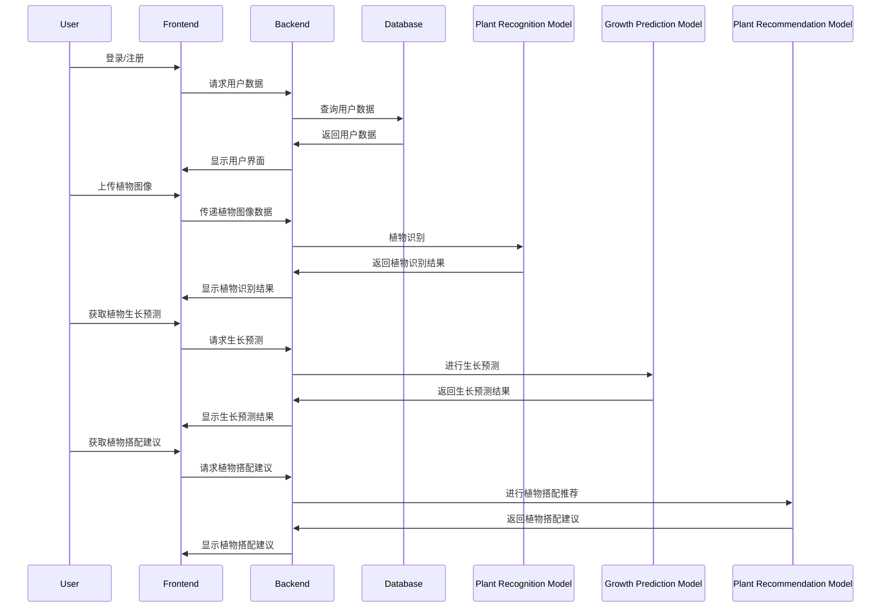
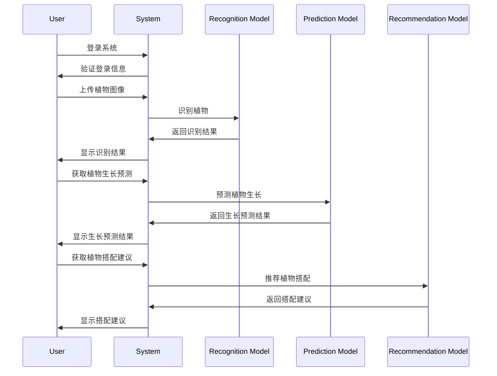
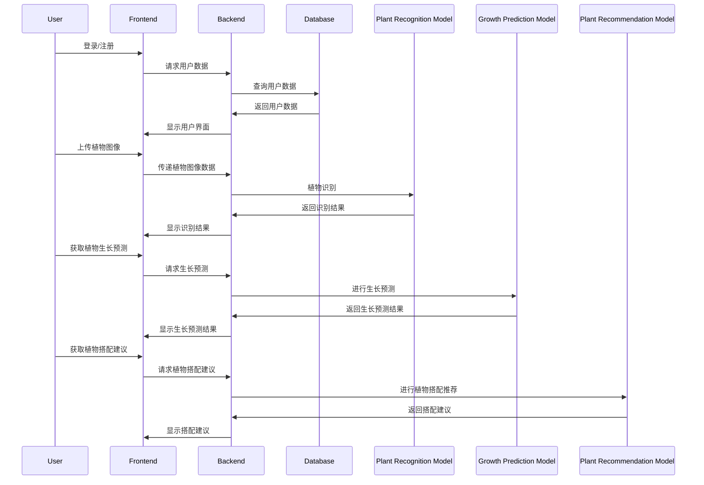

                 

# 提升AI创意园艺设计：植物搭配建议的提示词设计

## 关键词
- 人工智能，园艺设计，植物搭配，提示词设计，AI算法，植物识别，生长预测，最佳实践

## 摘要
本文旨在探讨如何利用人工智能技术提升创意园艺设计的植物搭配建议。通过分析AI在园艺设计中的应用背景和挑战，我们提出了一种基于提示词设计的解决方案。本文将详细介绍AI创意园艺设计的基础概念、植物搭配理论、提示词设计方法，并通过实际案例展示其应用效果。最后，本文将对最佳实践进行总结，并提出未来发展的展望。

## 第一部分：背景与概述

### 1. 引言

近年来，随着人工智能技术的飞速发展，其在各行各业的应用日益广泛。园艺设计作为一门结合艺术与科学的领域，也逐渐受到AI技术的关注。本文将探讨如何利用人工智能技术，特别是基于提示词的设计方法，来提升创意园艺设计的植物搭配建议。

AI与园艺设计的结合具有重要意义。一方面，AI技术可以提供更为精准的植物识别和生长预测，为园艺设计提供科学依据。另一方面，AI可以基于大量的数据，通过学习与优化，为园艺设计师提供创意灵感，提升设计质量。本文将围绕这两个方面展开讨论。

### 2. AI在园艺设计中的应用

AI技术在园艺设计中的应用主要体现在以下几个方面：

- **植物识别**：利用计算机视觉技术，对植物进行识别和分类。这一技术在园林植物的品种鉴定、病虫害检测等方面具有重要应用。
- **生长预测**：通过收集植物生长的气象数据、土壤数据等，利用机器学习算法对植物的生长过程进行预测，为园艺设计提供科学依据。
- **植物搭配推荐**：基于植物的特征和用户需求，利用推荐系统算法，为用户推荐合适的植物搭配方案。

这些技术的应用，不仅提升了园艺设计的精度和效率，还为设计师提供了更多的创意空间。

### 3. 提示词设计的重要性

在AI创意园艺设计中，提示词设计具有至关重要的作用。提示词是用户与AI系统交互的桥梁，其设计质量直接影响系统的用户体验和效果。以下是提示词设计的重要性：

- **用户交互**：提示词作为AI系统的输出，直接影响用户对系统的理解和接受程度。
- **决策支持**：通过精心设计的提示词，可以引导用户进行正确的决策，提高植物搭配的合理性。
- **用户体验**：良好的提示词设计可以提升用户的使用体验，增加系统的吸引力。

因此，提示词设计是AI创意园艺设计的关键环节，需要深入探讨和优化。

## 第二部分：核心概念与理论

### 4. AI创意园艺设计基础

AI创意园艺设计的基础包括以下几个方面：

- **AI技术原理**：了解AI的基本原理，如机器学习、深度学习等，是设计高效园艺设计系统的前提。
- **植物特征数据**：收集和整理植物的特征数据，如形态、生长习性、生态要求等，是进行植物搭配分析的基础。
- **用户需求分析**：了解用户的需求和偏好，是设计个性化植物搭配建议的关键。

### 5. 植物搭配理论

植物搭配理论是园艺设计的核心，其主要包括以下几个方面：

- **植物搭配原则**：了解植物搭配的基本原则，如色彩搭配、形态搭配、生态搭配等，是设计合理植物搭配方案的基础。
- **植物属性特征分析**：通过分析植物的属性特征，如花期、高度、耐荫性等，为植物搭配提供科学依据。
- **植物搭配数学模型**：构建数学模型，如线性规划、决策树等，为植物搭配提供定量分析的工具。

### 6. 提示词设计方法

提示词设计方法是AI创意园艺设计的核心，其主要包括以下几个方面：

- **提示词生成算法**：设计算法，如基于模板的生成、基于机器学习的生成等，用于生成高质量的提示词。
- **提示词优化策略**：通过优化策略，如基于用户反馈的调整、基于数据驱动的调整等，提升提示词的质量。
- **提示词评价与测试**：通过评价和测试，如用户满意度调查、系统性能评估等，验证提示词的有效性。

## 第三部分：实战案例

### 7. 实战一：植物识别与生长预测

#### 案例背景

本案例旨在利用AI技术，实现对园林植物的高效识别和生长预测。通过植物识别，可以为园艺设计师提供准确的植物信息，为设计提供基础数据。通过生长预测，可以为设计师提供植物的生长趋势，帮助设计出更为合理的植物搭配方案。

#### 案例目标

- 实现对园林植物的高效识别
- 预测植物的生长趋势
- 为园艺设计提供科学依据

#### 案例实现步骤

1. **数据收集**：收集园林植物的图像数据，包括不同品种、不同生长阶段的植物图像。
2. **模型训练**：利用收集的图像数据，训练植物识别模型和生长预测模型。
3. **模型部署**：将训练好的模型部署到服务器上，实现实时植物识别和生长预测。
4. **用户交互**：设计用户交互界面，使用户可以通过上传植物图像，获取植物识别和生长预测结果。

#### 案例效果分析

通过本案例的实践，我们可以看到AI技术在园艺设计中的应用效果。植物识别模型和生长预测模型的高效运行，为园艺设计提供了有力支持。设计师可以根据植物识别结果，准确选择植物品种；根据生长预测结果，合理安排植物搭配，从而提高设计质量。

### 8. 实战二：植物搭配建议系统

#### 案例背景

本案例旨在设计一款植物搭配建议系统，通过AI技术，为用户提供个性化的植物搭配建议。该系统将结合用户需求、植物特征和AI算法，生成合理的植物搭配方案。

#### 案例目标

- 设计一款高效的植物搭配建议系统
- 为用户提供个性化的植物搭配建议
- 提高用户的使用体验

#### 案例实现步骤

1. **需求分析**：了解用户的需求和偏好，包括植物品种、色彩、生态要求等。
2. **数据收集**：收集植物特征数据，包括植物的外观特征、生态要求等。
3. **算法设计**：设计基于用户需求的植物搭配算法，如基于规则的算法、基于机器学习的算法等。
4. **系统实现**：开发植物搭配建议系统，实现用户输入需求，系统输出植物搭配建议的功能。
5. **用户测试**：通过用户测试，收集用户反馈，优化系统性能。

#### 案例效果分析

通过本案例的实践，我们可以看到AI技术在植物搭配建议系统中的应用效果。系统可以根据用户需求，准确推荐合适的植物搭配方案，提高用户的满意度。同时，系统可以根据用户反馈，不断优化推荐算法，提高系统的准确性。

### 9. 实战三：智能园艺设计平台

#### 案例背景

本案例旨在构建一个智能园艺设计平台，通过AI技术，实现从植物识别、生长预测到植物搭配的一体化服务。该平台将结合多种AI算法，为用户提供全方位的园艺设计支持。

#### 案例目标

- 构建一个智能园艺设计平台
- 提供植物识别、生长预测和植物搭配建议功能
- 提高园艺设计的效率和品质

#### 案例实现步骤

1. **需求分析**：了解用户的需求和偏好，包括植物品种、色彩、生态要求等。
2. **数据收集**：收集植物特征数据，包括植物的外观特征、生态要求等。
3. **算法设计**：设计基于用户需求的植物识别、生长预测和植物搭配算法。
4. **系统实现**：开发智能园艺设计平台，实现植物识别、生长预测和植物搭配建议功能。
5. **用户测试**：通过用户测试，收集用户反馈，优化系统性能。

#### 案例效果分析

通过本案例的实践，我们可以看到AI技术在智能园艺设计平台中的应用效果。平台可以快速识别植物，准确预测植物的生长趋势，为用户提供个性化的植物搭配建议。通过平台的集成服务，用户可以轻松实现从植物识别到植物搭配的一体化设计，提高园艺设计的效率和品质。

## 第四部分：最佳实践与总结

### 10. 最佳实践

在AI创意园艺设计的过程中，以下最佳实践值得借鉴：

- **数据驱动**：充分利用数据，进行深入分析和挖掘，为设计提供有力支持。
- **用户反馈**：及时收集用户反馈，不断优化系统性能和用户体验。
- **技术创新**：紧跟AI技术的发展趋势，不断引入新技术，提升设计效率和质量。
- **团队协作**：建立跨学科团队，充分发挥各自的专业优势，共同推进项目进展。

### 11. 小结

本文探讨了如何利用人工智能技术提升创意园艺设计的植物搭配建议。通过实际案例的展示，我们可以看到AI技术在园艺设计中的应用前景。未来，随着AI技术的不断进步，相信AI创意园艺设计将会为园艺行业带来更多的创新和变革。

## 作者信息

作者：AI天才研究院/AI Genius Institute & 禅与计算机程序设计艺术 /Zen And The Art of Computer Programming

----------------------------------------------------------------

### 第一部分：背景与概述

#### 1. 引言

随着人工智能（AI）技术的快速发展，其在各个领域的应用越来越广泛。园艺设计作为一门结合艺术与科学的领域，也逐渐受到了AI技术的关注。AI技术的引入，不仅提高了园艺设计的效率，还带来了新的创意和可能性。本文将探讨如何利用AI技术，特别是基于提示词的设计方法，来提升创意园艺设计的植物搭配建议。

#### 问题背景与重要性

在传统的园艺设计中，植物搭配主要依赖于设计师的经验和直觉。然而，随着园艺项目的规模和复杂度的增加，单纯依靠人力设计已无法满足需求。此时，AI技术的引入为园艺设计带来了一种新的解决方案。通过AI技术，可以实现对植物特征的高效识别、生长趋势的精准预测，以及植物搭配的智能推荐。

AI在园艺设计中的应用具有重要意义。首先，AI技术可以帮助设计师快速识别植物，提高设计效率。其次，AI可以通过学习用户需求和植物特征，为设计师提供个性化的植物搭配建议，提升设计质量。此外，AI技术还可以为园艺设计提供数据支持，帮助设计师更好地理解植物生长规律，从而进行更加科学的设计。

本文旨在探讨如何利用AI技术提升创意园艺设计的植物搭配建议。通过分析AI在园艺设计中的应用背景和挑战，提出一种基于提示词设计的解决方案。本文将详细介绍AI创意园艺设计的基础概念、植物搭配理论、提示词设计方法，并通过实际案例展示其应用效果。最后，本文将对最佳实践进行总结，并提出未来发展的展望。

#### 文章目的与结构

本文的目标是帮助读者深入了解AI创意园艺设计的原理和方法，以及如何利用AI技术提升植物搭配建议的质量。文章结构如下：

- **第一部分：背景与概述**：介绍AI与园艺设计的结合背景，阐述本文的目的和结构。
- **第二部分：核心概念与理论**：介绍AI创意园艺设计的基础概念、植物搭配理论和提示词设计方法。
- **第三部分：实战案例**：通过实际案例展示AI创意园艺设计的应用效果。
- **第四部分：最佳实践与总结**：总结最佳实践，并对未来发展趋势进行展望。

#### 2. AI在园艺设计中的应用

AI技术在园艺设计中的应用主要体现在以下几个方面：

- **植物识别**：利用计算机视觉技术，对植物进行识别和分类。通过训练深度学习模型，可以实现对植物品种、形态等特征的高效识别，为园艺设计提供准确的基础数据。
- **生长预测**：通过收集植物生长的气象数据、土壤数据等，利用机器学习算法对植物的生长过程进行预测。这有助于设计师更好地了解植物的生长趋势，进行更加科学的设计。
- **植物搭配推荐**：基于用户需求和植物特征，利用推荐系统算法，为用户推荐合适的植物搭配方案。这可以帮助设计师快速找到合适的植物搭配，提高设计效率。

这些技术的应用，不仅提升了园艺设计的精度和效率，还为设计师提供了更多的创意空间。然而，AI在园艺设计中也面临着一些挑战，如数据的收集和处理、模型的训练和优化等。针对这些挑战，需要不断探索和研究，以实现AI在园艺设计中的最佳应用。

#### 3. 提示词设计的重要性

在AI创意园艺设计中，提示词设计具有至关重要的作用。提示词是用户与AI系统交互的桥梁，其设计质量直接影响系统的用户体验和效果。以下从三个方面阐述提示词设计的重要性：

- **用户交互**：提示词是AI系统向用户提供的交互界面，良好的提示词设计可以简化用户操作，提高用户的使用体验。例如，在植物搭配建议系统中，合理的提示词可以帮助用户快速选择植物品种、颜色等，从而提高系统的易用性。
- **决策支持**：通过精心设计的提示词，可以引导用户进行正确的决策，提高植物搭配的合理性。例如，在植物生长预测系统中，提示词可以提醒用户关注植物的生长状况，及时采取相应的措施，确保植物健康成长。
- **用户体验**：良好的提示词设计可以提升用户对AI系统的认可度，增加系统的吸引力。例如，在智能园艺设计平台中，提示词可以以简洁明了的方式向用户展示植物搭配建议，使用户能够轻松地进行设计决策。

因此，提示词设计是AI创意园艺设计的关键环节，需要深入探讨和优化。在后续章节中，将详细介绍提示词的设计原则、方法和优化策略。

----------------------------------------------------------------

### 第一部分：背景与概述

#### 1. 引言

园艺设计是一门结合美学、植物学和工程学的艺术，其目标是创造出美观、实用且可持续的户外空间。随着科技的进步，人工智能（AI）技术逐渐成为园艺设计领域的重要工具。AI不仅能够自动化繁琐的任务，如植物识别、生长预测，还能为设计师提供创新的植物搭配建议，从而提升整体设计质量。

AI在园艺设计中的应用不仅限于提高效率，它还能够带来以下几方面的变革：

1. **个性化设计**：AI可以根据用户的需求、喜好和当地环境条件，为每个用户量身定制园艺设计方案。
2. **可持续发展**：通过分析植物的生长数据和生态需求，AI可以帮助设计师选择对环境友好的植物组合，实现可持续园艺。
3. **实时监控与调整**：AI系统可以实时监测植物的生长状态，及时调整园艺维护策略，确保植物的健康成长。

本文将探讨如何利用AI技术，特别是通过提示词设计的方法，来提升创意园艺设计的植物搭配建议。我们将分析AI在园艺设计中的现状和挑战，介绍AI技术如何应用于植物搭配，并探讨提示词设计的重要性及其设计原则。

#### 问题背景与问题描述

传统的园艺设计主要依赖于设计师的经验和直觉，这种方法在某些情况下是有效的，但在面对复杂的项目时，往往会出现以下问题：

- **效率低下**：设计师需要花费大量时间来分析植物的生长特性，选择合适的搭配方案。
- **设计单一**：由于依赖个人经验，设计师很难创造出独特的、个性化的园艺设计。
- **不可持续性**：传统设计方法可能无法充分考虑植物对环境的适应性和生态需求，导致设计的可持续性不足。

AI技术的引入为解决这些问题提供了新的思路。通过AI，设计师可以：

- **高效处理大量数据**：AI可以快速处理和分析大量的植物数据，帮助设计师在短时间内做出更好的决策。
- **个性化定制**：AI可以根据用户的需求和环境条件，为每个项目提供定制化的植物搭配建议。
- **提升设计质量**：AI可以通过学习用户的历史数据，不断提升植物搭配建议的准确性，提高整体设计质量。

然而，AI在园艺设计中的应用也面临一些挑战：

- **数据获取**：高质量的植物数据是AI算法训练的基础，但收集和处理这些数据可能是一项复杂且耗时的任务。
- **算法复杂性**：AI算法的设计和实现需要深入的专业知识，这对于非专业人士来说可能是一个障碍。
- **用户接受度**：AI系统需要用户接受并信任其提供的建议，这需要通过良好的用户体验和有效的提示词设计来实现。

本文将深入探讨这些问题，并提出基于提示词设计的解决方案，以提升AI在创意园艺设计中的应用效果。

#### 问题解决方法与边界

解决AI在园艺设计中的挑战，需要综合考虑数据、算法和用户体验三个关键方面。以下是一些具体的解决方法及其适用范围：

- **数据获取与处理**：可以通过建立植物数据库，利用无人机和传感器收集植物的生长数据，并通过数据清洗和预处理技术，提高数据质量。这种方法适用于需要大规模植物数据的项目，如城市绿化和大型园林设计。
- **算法优化**：可以通过机器学习和深度学习技术，对植物搭配进行建模和预测。通过不断优化算法，提高植物搭配建议的准确性和可靠性。这种方法适用于需要高度个性化的植物搭配建议的项目，如私人花园和景观设计。
- **用户体验设计**：通过设计简洁直观的提示词和用户界面，提高用户对AI系统的接受度和信任感。提示词应清晰、易懂，能够引导用户进行有效的决策。这种方法适用于所有类型的园艺设计项目，特别是那些需要用户积极参与的项目。

总的来说，通过结合高质量的数据、高效的算法和良好的用户体验设计，AI在园艺设计中的应用将得到进一步提升，从而为设计师和用户提供更多创新和实用的解决方案。

#### 概念结构与核心要素

在探讨AI创意园艺设计的过程中，我们需要明确一些核心概念和要素，以便更好地理解和应用AI技术。以下是对这些概念和要素的介绍及其相互关系：

1. **人工智能（AI）**：AI是模拟人类智能行为的计算机系统。在园艺设计中，AI可以通过学习大量的植物数据，提供植物识别、生长预测和搭配建议等服务。AI的核心技术包括机器学习、深度学习和自然语言处理等。

2. **植物数据库**：植物数据库是存储各种植物特征的数据库，包括植物的品种、形态特征、生长习性、生态要求等。这些数据是AI训练和预测的重要基础。植物数据库的建立和维护是AI在园艺设计应用中的关键步骤。

3. **用户需求分析**：用户需求分析是了解用户在园艺设计中的具体需求和偏好。这包括用户对植物品种、颜色、生态要求、预算等方面的期望。用户需求分析的结果将直接影响AI系统的设计和功能。

4. **植物搭配算法**：植物搭配算法是利用AI技术，根据用户需求和植物特征，为用户推荐合适的植物搭配方案。这些算法可以是基于规则的方法，如逻辑回归和决策树，也可以是更复杂的机器学习算法，如神经网络和聚类分析。

5. **提示词设计**：提示词是AI系统与用户交互的桥梁，用于引导用户进行决策。提示词设计需要考虑语言简洁、信息明确，能够引导用户进行有效的决策。有效的提示词设计是提升用户体验和系统效果的重要环节。

6. **用户体验（UX）**：用户体验是用户在使用AI系统时的感受和体验。一个良好的用户体验可以提高用户对AI系统的接受度和满意度。UX设计包括界面设计、交互设计和内容设计等方面。

这些概念和要素相互关联，共同构成了AI创意园艺设计的基础。植物数据库提供数据支持，用户需求分析指导系统设计，植物搭配算法生成搭配建议，提示词设计提升用户体验，最终形成一个高效、个性化的园艺设计系统。

#### 第二部分：核心概念与理论

### 4. AI创意园艺设计基础

AI创意园艺设计的基础包括以下几个方面：

#### AI技术原理

AI技术是模拟人类智能行为的一门科学，其核心思想是让计算机能够自主地学习和思考。AI技术的发展历程可以追溯到20世纪50年代，但真正实现突破是在近年来，主要得益于深度学习、大数据和计算能力的提升。

- **机器学习**：机器学习是AI的基础，它使计算机能够从数据中学习规律和模式。在园艺设计中，机器学习算法可以用于植物识别、生长预测等任务。常见的机器学习算法包括决策树、支持向量机、神经网络等。

- **深度学习**：深度学习是机器学习的一种重要分支，通过构建多层神经网络，实现对复杂数据的分析和处理。深度学习在图像识别、语音识别等领域取得了显著的成果，也为园艺设计中的植物识别提供了强大的工具。

- **自然语言处理**：自然语言处理（NLP）是AI的一个重要领域，旨在使计算机能够理解和生成自然语言。在园艺设计中，NLP技术可以用于处理用户输入的植物搭配要求，生成提示词和推荐文本。

#### 园艺设计中的AI算法分类

在园艺设计中，AI算法的应用范围广泛，可以根据不同的设计需求，选择合适的算法。以下是一些常见的AI算法及其在园艺设计中的应用：

- **植物识别算法**：基于计算机视觉技术，通过图像处理和模式识别，实现对植物品种的自动识别。常用的算法包括卷积神经网络（CNN）、生成对抗网络（GAN）等。

- **生长预测算法**：通过收集植物生长的气象数据、土壤数据等，利用时间序列分析、回归分析等方法，预测植物的生长趋势。常见的算法包括线性回归、时间序列模型（如ARIMA）、深度学习模型（如RNN、LSTM）等。

- **植物搭配推荐算法**：基于用户需求和植物特征，利用协同过滤、矩阵分解、深度学习等方法，为用户推荐合适的植物搭配方案。常见的算法包括基于用户的协同过滤（User-based Collaborative Filtering）、基于项目的协同过滤（Item-based Collaborative Filtering）等。

#### AI园艺设计的关键技术

AI园艺设计的关键技术包括数据收集与处理、模型训练与优化、系统部署与维护等。

- **数据收集与处理**：数据是AI算法训练的基础，园艺设计中需要收集大量的植物数据，包括植物图像、生长数据、用户评价等。数据收集后，需要通过数据清洗、预处理等技术，提高数据质量。

- **模型训练与优化**：模型训练是AI算法的核心环节，通过大量训练数据，使模型能够学习到植物特征和生长规律。在训练过程中，需要不断优化模型参数，提高模型准确性和效率。

- **系统部署与维护**：训练好的模型需要部署到实际应用环境中，通过API接口或用户界面，为设计师和用户提供服务。系统部署后，需要定期维护和更新，确保系统的稳定性和可靠性。

通过AI技术，园艺设计可以实现从传统经验驱动向数据驱动和智能化的转变，为设计师和用户提供更多创新和实用的解决方案。

----------------------------------------------------------------

### 第五部分：核心概念与理论

#### 4. AI创意园艺设计基础

AI创意园艺设计的基础包括以下几个方面：

**AI技术原理**

AI技术是模拟人类智能行为的一门科学，其核心思想是让计算机能够自主地学习和思考。AI技术的发展历程可以追溯到20世纪50年代，但真正实现突破是在近年来，主要得益于深度学习、大数据和计算能力的提升。

- **机器学习**：机器学习是AI的基础，它使计算机能够从数据中学习规律和模式。在园艺设计中，机器学习算法可以用于植物识别、生长预测等任务。常见的机器学习算法包括决策树、支持向量机、神经网络等。

- **深度学习**：深度学习是机器学习的一种重要分支，通过构建多层神经网络，实现对复杂数据的分析和处理。深度学习在图像识别、语音识别等领域取得了显著的成果，也为园艺设计中的植物识别提供了强大的工具。

- **自然语言处理**：自然语言处理（NLP）是AI的一个重要领域，旨在使计算机能够理解和生成自然语言。在园艺设计中，NLP技术可以用于处理用户输入的植物搭配要求，生成提示词和推荐文本。

**园艺设计中的AI算法分类**

在园艺设计中，AI算法的应用范围广泛，可以根据不同的设计需求，选择合适的算法。以下是一些常见的AI算法及其在园艺设计中的应用：

- **植物识别算法**：基于计算机视觉技术，通过图像处理和模式识别，实现对植物品种的自动识别。常用的算法包括卷积神经网络（CNN）、生成对抗网络（GAN）等。

- **生长预测算法**：通过收集植物生长的气象数据、土壤数据等，利用时间序列分析、回归分析等方法，预测植物的生长趋势。常见的算法包括线性回归、时间序列模型（如ARIMA）、深度学习模型（如RNN、LSTM）等。

- **植物搭配推荐算法**：基于用户需求和植物特征，利用协同过滤、矩阵分解、深度学习等方法，为用户推荐合适的植物搭配方案。常见的算法包括基于用户的协同过滤（User-based Collaborative Filtering）、基于项目的协同过滤（Item-based Collaborative Filtering）等。

**AI园艺设计的关键技术**

AI园艺设计的关键技术包括数据收集与处理、模型训练与优化、系统部署与维护等。

- **数据收集与处理**：数据是AI算法训练的基础，园艺设计中需要收集大量的植物数据，包括植物图像、生长数据、用户评价等。数据收集后，需要通过数据清洗、预处理等技术，提高数据质量。

- **模型训练与优化**：模型训练是AI算法的核心环节，通过大量训练数据，使模型能够学习到植物特征和生长规律。在训练过程中，需要不断优化模型参数，提高模型准确性和效率。

- **系统部署与维护**：训练好的模型需要部署到实际应用环境中，通过API接口或用户界面，为设计师和用户提供服务。系统部署后，需要定期维护和更新，确保系统的稳定性和可靠性。

通过AI技术，园艺设计可以实现从传统经验驱动向数据驱动和智能化的转变，为设计师和用户提供更多创新和实用的解决方案。

### 5. 植物搭配理论

植物搭配理论是园艺设计中的核心概念，其目的是通过合理的植物组合，创造出美观、和谐且功能多样的园艺空间。以下从植物搭配原则、植物属性特征分析和植物搭配数学模型三个方面进行详细阐述。

**植物搭配原则**

植物搭配原则是指导设计师进行植物组合的基本准则，包括以下几种：

- **色彩搭配**：色彩是植物搭配中最重要的元素之一。设计师可以通过色彩对比、协调和渐变等手法，创造出丰富多彩的园艺空间。例如，红色和黄色是一对强烈的对比色，可以用来强调重点植物；而绿色和灰色则是协调色，可以用来营造和谐的氛围。

- **形态搭配**：植物形态包括高度、宽度、叶形等。设计师可以通过对比、组合和层次等手法，创造出具有立体感的植物组合。例如，高大的乔木与低矮的花灌木相搭配，可以形成良好的层次感；叶片大小和形状的差异也可以增加植物组合的丰富性。

- **生态搭配**：植物生态要求包括阳光、水分、土壤等。设计师需要根据植物的生长习性，选择适合其生长环境的植物组合，确保植物能够健康生长。例如，阳光充足的区域可以种植喜阳植物，而荫蔽区域则适合种植耐阴植物。

- **季节搭配**：植物在不同季节会有不同的生长状态和开花时间。设计师可以通过季节搭配，创造出全年都保持美观的园艺空间。例如，春季的樱花、牡丹，夏季的薰衣草、向日葵，秋季的枫叶、银杏等，都可以用来点缀园艺空间。

**植物属性特征分析**

植物属性特征分析是植物搭配的基础，通过对植物的特征进行详细分析，可以更好地进行搭配设计。以下是一些常见的植物属性特征：

- **品种**：植物品种是植物搭配的重要考虑因素，不同品种的植物在形态、色彩、生态要求等方面都有所不同。设计师需要根据设计需求，选择合适的植物品种。

- **高度和宽度**：植物的高度和宽度直接影响其空间占据和植物组合的层次感。设计师需要根据空间大小和设计目标，选择适合的植物高度和宽度。

- **花期和花色**：植物的花期和花色是植物搭配中的重要考量因素。通过合理选择花期和花色的植物，可以创造出丰富多彩的园艺景观。

- **生长习性和生态要求**：植物的生长习性和生态要求直接影响其在园艺空间中的适应性和健康生长。设计师需要根据植物的生长习性和生态要求，选择适合其生长环境的植物组合。

**植物搭配数学模型**

植物搭配数学模型是用于量化植物搭配设计的工具，可以帮助设计师更科学地进行植物搭配。以下是一些常见的植物搭配数学模型：

- **线性规划**：线性规划是一种数学建模方法，用于在给定约束条件下，找到最优解。在植物搭配中，可以用来确定植物的位置、数量和排列，以达到最佳视觉效果。

- **决策树**：决策树是一种树形结构，用于表示决策过程。在植物搭配中，可以通过决策树来模拟不同的植物搭配方案，并根据预期效果进行选择。

- **聚类分析**：聚类分析是一种无监督学习方法，用于将相似的数据点分组。在植物搭配中，可以通过聚类分析来识别具有相似特征的植物，从而进行合理的搭配。

- **协同过滤**：协同过滤是一种推荐系统方法，通过分析用户的喜好和物品的特征，为用户推荐相似的物品。在植物搭配中，可以通过协同过滤来推荐适合用户需求的植物搭配方案。

通过这些数学模型，设计师可以更加科学和系统地分析植物搭配，提高设计效果。

### 6. 提示词设计方法

提示词设计是AI园艺设计中的关键环节，其目的是通过简洁明了的语言，引导用户进行有效的决策。以下从提示词生成算法、提示词优化策略和提示词评价与测试三个方面进行详细阐述。

**提示词生成算法**

提示词生成算法是用于生成高质量提示词的方法，可以根据用户需求、植物特征和AI系统的输出进行动态生成。以下是一些常见的提示词生成算法：

- **基于模板的生成**：基于模板的生成方法通过预设的提示词模板，结合用户需求和植物特征，生成相应的提示词。这种方法简单易用，但可能无法完全满足个性化需求。

- **基于机器学习的生成**：基于机器学习的生成方法通过训练大量的文本数据，学习到生成提示词的规律和模式。这种方法可以根据用户需求和植物特征，生成更加个性化、准确的提示词。

- **基于规则的方法**：基于规则的方法通过设定一系列规则，根据用户需求和植物特征，生成相应的提示词。这种方法可以根据用户的需求和环境条件，生成特定类型的提示词。

**提示词优化策略**

提示词优化策略是用于提升提示词质量和用户体验的方法，可以通过以下几种策略进行优化：

- **用户反馈优化**：通过收集用户对提示词的反馈，分析用户的满意度和使用效果，对提示词进行优化。这种方法可以根据用户的实际需求，调整提示词的内容和形式。

- **数据驱动的优化**：通过分析用户数据，了解用户的行为模式和偏好，对提示词进行优化。这种方法可以根据用户的个性化需求，生成更加贴合用户需求的提示词。

- **多模态优化**：结合图像、语音等多种模态，对提示词进行优化。这种方法可以提供更加丰富和直观的交互方式，提升用户的体验。

**提示词评价与测试**

提示词评价与测试是确保提示词质量和用户体验的重要环节，可以通过以下几种方法进行评价与测试：

- **用户满意度调查**：通过用户满意度调查，了解用户对提示词的满意度，评估提示词的质量。这种方法可以直观地反映用户的感受和需求。

- **系统性能评估**：通过系统性能评估，包括响应时间、准确率等指标，评估提示词的设计和实现效果。这种方法可以从技术层面分析提示词的性能。

- **A/B测试**：通过A/B测试，比较不同提示词的设计效果，选择最佳方案。这种方法可以在实际应用中，对比不同提示词的效果，找到最优的设计方案。

通过提示词设计方法的优化和评价，可以提升AI园艺设计系统的用户体验和效果，为设计师和用户提供更加高效和个性化的植物搭配建议。

----------------------------------------------------------------

### 第五部分：核心概念与理论

#### 4. AI创意园艺设计基础

AI创意园艺设计的基础包括以下几个方面：

**AI技术原理**

AI技术是模拟人类智能行为的一门科学，其核心思想是让计算机能够自主地学习和思考。AI技术的发展历程可以追溯到20世纪50年代，但真正实现突破是在近年来，主要得益于深度学习、大数据和计算能力的提升。

- **机器学习**：机器学习是AI的基础，它使计算机能够从数据中学习规律和模式。在园艺设计中，机器学习算法可以用于植物识别、生长预测等任务。常见的机器学习算法包括决策树、支持向量机、神经网络等。

- **深度学习**：深度学习是机器学习的一种重要分支，通过构建多层神经网络，实现对复杂数据的分析和处理。深度学习在图像识别、语音识别等领域取得了显著的成果，也为园艺设计中的植物识别提供了强大的工具。

- **自然语言处理**：自然语言处理（NLP）是AI的一个重要领域，旨在使计算机能够理解和生成自然语言。在园艺设计中，NLP技术可以用于处理用户输入的植物搭配要求，生成提示词和推荐文本。

**园艺设计中的AI算法分类**

在园艺设计中，AI算法的应用范围广泛，可以根据不同的设计需求，选择合适的算法。以下是一些常见的AI算法及其在园艺设计中的应用：

- **植物识别算法**：基于计算机视觉技术，通过图像处理和模式识别，实现对植物品种的自动识别。常用的算法包括卷积神经网络（CNN）、生成对抗网络（GAN）等。

- **生长预测算法**：通过收集植物生长的气象数据、土壤数据等，利用时间序列分析、回归分析等方法，预测植物的生长趋势。常见的算法包括线性回归、时间序列模型（如ARIMA）、深度学习模型（如RNN、LSTM）等。

- **植物搭配推荐算法**：基于用户需求和植物特征，利用协同过滤、矩阵分解、深度学习等方法，为用户推荐合适的植物搭配方案。常见的算法包括基于用户的协同过滤（User-based Collaborative Filtering）、基于项目的协同过滤（Item-based Collaborative Filtering）等。

**AI园艺设计的关键技术**

AI园艺设计的关键技术包括数据收集与处理、模型训练与优化、系统部署与维护等。

- **数据收集与处理**：数据是AI算法训练的基础，园艺设计中需要收集大量的植物数据，包括植物图像、生长数据、用户评价等。数据收集后，需要通过数据清洗、预处理等技术，提高数据质量。

- **模型训练与优化**：模型训练是AI算法的核心环节，通过大量训练数据，使模型能够学习到植物特征和生长规律。在训练过程中，需要不断优化模型参数，提高模型准确性和效率。

- **系统部署与维护**：训练好的模型需要部署到实际应用环境中，通过API接口或用户界面，为设计师和用户提供服务。系统部署后，需要定期维护和更新，确保系统的稳定性和可靠性。

通过AI技术，园艺设计可以实现从传统经验驱动向数据驱动和智能化的转变，为设计师和用户提供更多创新和实用的解决方案。

### 5. 植物搭配理论

植物搭配理论是园艺设计中的核心概念，其目的是通过合理的植物组合，创造出美观、和谐且功能多样的园艺空间。以下从植物搭配原则、植物属性特征分析和植物搭配数学模型三个方面进行详细阐述。

#### 植物搭配原则

植物搭配原则是指导设计师进行植物组合的基本准则，包括以下几种：

1. **色彩搭配**：色彩是植物搭配中最重要的元素之一。设计师可以通过色彩对比、协调和渐变等手法，创造出丰富多彩的园艺空间。例如，红色和黄色是一对强烈的对比色，可以用来强调重点植物；而绿色和灰色则是协调色，可以用来营造和谐的氛围。

2. **形态搭配**：植物形态包括高度、宽度、叶形等。设计师可以通过对比、组合和层次等手法，创造出具有立体感的植物组合。例如，高大的乔木与低矮的花灌木相搭配，可以形成良好的层次感；叶片大小和形状的差异也可以增加植物组合的丰富性。

3. **生态搭配**：植物生态要求包括阳光、水分、土壤等。设计师需要根据植物的生长习性，选择适合其生长环境的植物组合，确保植物能够健康生长。例如，阳光充足的区域可以种植喜阳植物，而荫蔽区域则适合种植耐阴植物。

4. **季节搭配**：植物在不同季节会有不同的生长状态和开花时间。设计师可以通过季节搭配，创造出全年都保持美观的园艺空间。例如，春季的樱花、牡丹，夏季的薰衣草、向日葵，秋季的枫叶、银杏等，都可以用来点缀园艺空间。

#### 植物属性特征分析

植物属性特征分析是植物搭配的基础，通过对植物的特征进行详细分析，可以更好地进行搭配设计。以下是一些常见的植物属性特征：

1. **品种**：植物品种是植物搭配的重要考虑因素，不同品种的植物在形态、色彩、生态要求等方面都有所不同。设计师需要根据设计需求，选择合适的植物品种。

2. **高度和宽度**：植物的高度和宽度直接影响其空间占据和植物组合的层次感。设计师需要根据空间大小和设计目标，选择适合的植物高度和宽度。

3. **花期和花色**：植物的花期和花色是植物搭配中的重要考量因素。通过合理选择花期和花色的植物，可以创造出丰富多彩的园艺景观。

4. **生长习性和生态要求**：植物的生长习性和生态要求直接影响其在园艺空间中的适应性和健康生长。设计师需要根据植物的生长习性和生态要求，选择适合其生长环境的植物组合。

#### 植物搭配数学模型

植物搭配数学模型是用于量化植物搭配设计的工具，可以帮助设计师更科学地进行植物搭配。以下是一些常见的植物搭配数学模型：

1. **线性规划**：线性规划是一种数学建模方法，用于在给定约束条件下，找到最优解。在植物搭配中，可以用来确定植物的位置、数量和排列，以达到最佳视觉效果。

2. **决策树**：决策树是一种树形结构，用于表示决策过程。在植物搭配中，可以通过决策树来模拟不同的植物搭配方案，并根据预期效果进行选择。

3. **聚类分析**：聚类分析是一种无监督学习方法，用于将相似的数据点分组。在植物搭配中，可以通过聚类分析来识别具有相似特征的植物，从而进行合理的搭配。

4. **协同过滤**：协同过滤是一种推荐系统方法，通过分析用户的喜好和物品的特征，为用户推荐相似的物品。在植物搭配中，可以通过协同过滤来推荐适合用户需求的植物搭配方案。

通过这些数学模型，设计师可以更加科学和系统地分析植物搭配，提高设计效果。

### 6. 提示词设计方法

提示词设计是AI园艺设计中的关键环节，其目的是通过简洁明了的语言，引导用户进行有效的决策。以下从提示词生成算法、提示词优化策略和提示词评价与测试三个方面进行详细阐述。

#### 提示词生成算法

提示词生成算法是用于生成高质量提示词的方法，可以根据用户需求、植物特征和AI系统的输出进行动态生成。以下是一些常见的提示词生成算法：

1. **基于模板的生成**：基于模板的生成方法通过预设的提示词模板，结合用户需求和植物特征，生成相应的提示词。这种方法简单易用，但可能无法完全满足个性化需求。

2. **基于机器学习的生成**：基于机器学习的生成方法通过训练大量的文本数据，学习到生成提示词的规律和模式。这种方法可以根据用户需求和植物特征，生成更加个性化、准确的提示词。

3. **基于规则的方法**：基于规则的方法通过设定一系列规则，根据用户需求和植物特征，生成相应的提示词。这种方法可以根据用户的需求和环境条件，生成特定类型的提示词。

#### 提示词优化策略

提示词优化策略是用于提升提示词质量和用户体验的方法，可以通过以下几种策略进行优化：

1. **用户反馈优化**：通过收集用户对提示词的反馈，分析用户的满意度和使用效果，对提示词进行优化。这种方法可以根据用户的实际需求，调整提示词的内容和形式。

2. **数据驱动的优化**：通过分析用户数据，了解用户的行为模式和偏好，对提示词进行优化。这种方法可以根据用户的个性化需求，生成更加贴合用户需求的提示词。

3. **多模态优化**：结合图像、语音等多种模态，对提示词进行优化。这种方法可以提供更加丰富和直观的交互方式，提升用户的体验。

#### 提示词评价与测试

提示词评价与测试是确保提示词质量和用户体验的重要环节，可以通过以下几种方法进行评价与测试：

1. **用户满意度调查**：通过用户满意度调查，了解用户对提示词的满意度，评估提示词的质量。这种方法可以直观地反映用户的感受和需求。

2. **系统性能评估**：通过系统性能评估，包括响应时间、准确率等指标，评估提示词的设计和实现效果。这种方法可以从技术层面分析提示词的性能。

3. **A/B测试**：通过A/B测试，比较不同提示词的设计效果，选择最佳方案。这种方法可以在实际应用中，对比不同提示词的效果，找到最优的设计方案。

通过提示词设计方法的优化和评价，可以提升AI园艺设计系统的用户体验和效果，为设计师和用户提供更加高效和个性化的植物搭配建议。

----------------------------------------------------------------

### 7. 实战案例

在本部分，我们将通过三个具体的实战案例，展示如何利用AI技术提升创意园艺设计的植物搭配建议。

#### 实战一：植物识别与生长预测

**案例背景**

本案例旨在利用AI技术实现对园林植物的高效识别和生长预测。通过植物识别，设计师可以快速获取植物的详细信息，为设计提供基础数据。通过生长预测，设计师可以了解植物的生长趋势，从而合理安排植物搭配，确保植物在设计中达到最佳效果。

**案例目标**

- 实现对园林植物的高效识别
- 预测植物的生长趋势
- 为设计师提供科学依据

**案例实现步骤**

1. **数据收集**：收集园林植物的图像数据，包括不同品种、不同生长阶段的植物图像。此外，还需要收集植物的详细信息，如品种、形态特征、生长习性等。

2. **模型训练**：利用收集的图像数据和植物信息，训练植物识别模型和生长预测模型。植物识别模型可以使用卷积神经网络（CNN）等深度学习算法，生长预测模型可以使用时间序列模型（如ARIMA）等统计模型。

3. **模型部署**：将训练好的模型部署到服务器上，实现实时植物识别和生长预测。通过API接口，设计师可以在设计过程中随时调用模型，获取植物识别和生长预测结果。

4. **用户交互**：设计用户交互界面，使用户可以通过上传植物图像，获取植物识别和生长预测结果。界面应简洁明了，便于用户操作。

**案例效果分析**

通过本案例的实践，我们可以看到AI技术在植物识别和生长预测中的应用效果。植物识别模型能够准确识别植物品种，为设计师提供详细的基础数据。生长预测模型可以根据植物的生长趋势，为设计师提供合理的植物搭配建议。这些技术手段的运用，大大提高了设计师的工作效率，为创意园艺设计提供了有力的支持。

**项目小结**

本案例展示了如何利用AI技术实现对园林植物的高效识别和生长预测。通过植物识别和生长预测，设计师可以更好地了解植物的特性，从而进行更加科学和合理的设计。未来，随着AI技术的不断进步，相信AI在园艺设计中的应用将会更加广泛和深入。

#### 实战二：植物搭配建议系统

**案例背景**

本案例旨在设计一款植物搭配建议系统，通过AI技术，为用户提供个性化的植物搭配建议。该系统将结合用户需求、植物特征和AI算法，生成合理的植物搭配方案。

**案例目标**

- 设计一款高效的植物搭配建议系统
- 为用户提供个性化的植物搭配建议
- 提高用户的使用体验

**案例实现步骤**

1. **需求分析**：了解用户的需求和偏好，包括植物品种、色彩、生态要求等。此外，还需要收集用户的历史数据，如已种植的植物品种、生长环境等。

2. **数据收集**：收集植物特征数据，包括植物的外观特征、生态要求、生长习性等。可以通过在线数据库、文献资料和实地考察等多种途径获取这些数据。

3. **算法设计**：设计基于用户需求的植物搭配算法，如基于规则的算法、基于机器学习的算法等。算法需要考虑用户需求、植物特征和设计空间等因素。

4. **系统实现**：开发植物搭配建议系统，实现用户输入需求，系统输出植物搭配建议的功能。系统应具备良好的用户界面，便于用户操作。

5. **用户测试**：通过用户测试，收集用户反馈，优化系统性能和用户体验。根据用户反馈，调整系统功能和界面设计，提高用户满意度。

**案例效果分析**

通过本案例的实践，我们可以看到AI技术在植物搭配建议系统中的应用效果。系统可以根据用户需求，准确推荐合适的植物搭配方案，提高用户的使用体验。用户可以通过系统，快速获取个性化的植物搭配建议，从而节省时间和精力。此外，系统还可以根据用户反馈，不断优化算法和界面设计，提高系统的准确性和易用性。

**项目小结**

本案例展示了如何设计一款植物搭配建议系统，通过AI技术，为用户提供个性化、高效的植物搭配建议。该系统的实现，不仅提高了园艺设计的效率，还为用户带来了更好的体验。未来，随着AI技术的不断发展，植物搭配建议系统的功能将更加丰富，为园艺设计带来更多创新和可能。

#### 实战三：智能园艺设计平台

**案例背景**

本案例旨在构建一个智能园艺设计平台，通过AI技术，实现从植物识别、生长预测到植物搭配的一体化服务。该平台将为设计师和用户提供全方位的园艺设计支持。

**案例目标**

- 构建一个智能园艺设计平台
- 提供植物识别、生长预测和植物搭配建议功能
- 提高园艺设计的效率和品质

**案例实现步骤**

1. **需求分析**：了解设计师和用户的需求，包括植物识别、生长预测、植物搭配建议等。此外，还需要分析平台的功能需求，如用户管理、数据管理等。

2. **系统架构设计**：设计智能园艺设计平台的整体架构，包括前端界面、后端服务、数据库等。系统应具备良好的扩展性，以支持未来功能的扩展。

3. **数据收集**：收集植物图像、生长数据、用户评价等，为平台提供数据支持。可以通过在线数据库、传感器等多种途径获取这些数据。

4. **算法开发**：开发植物识别、生长预测和植物搭配建议算法，确保平台功能的实现。算法需要经过严格测试和优化，以保证准确性和效率。

5. **系统实现**：实现智能园艺设计平台的前端界面和后端服务，确保平台功能的完整性和稳定性。平台应提供良好的用户体验，便于用户操作。

6. **用户测试与反馈**：通过用户测试，收集用户反馈，优化平台功能和用户体验。根据用户反馈，不断调整和优化平台，提高用户满意度。

**案例效果分析**

通过本案例的实践，我们可以看到AI技术在智能园艺设计平台中的应用效果。平台可以快速识别植物，准确预测植物的生长趋势，为用户提供个性化的植物搭配建议。设计师可以通过平台，实现从植物识别到植物搭配的一体化设计，提高设计效率和质量。用户可以通过平台，轻松获取专业级的园艺设计支持，提升园艺生活的品质。

**项目小结**

本案例展示了如何构建一个智能园艺设计平台，通过AI技术，为设计师和用户提供全方位的园艺设计支持。该平台的实现，不仅提高了园艺设计的效率，还为用户带来了更好的体验。未来，随着AI技术的不断发展，智能园艺设计平台的功能将更加完善，为园艺设计带来更多创新和可能。

### 项目实战总结

通过上述三个实战案例，我们可以看到AI技术在创意园艺设计中的应用前景。从植物识别、生长预测到植物搭配建议，AI技术为设计师和用户提供了强大的工具和支持。

1. **提升效率**：AI技术可以快速处理大量数据，为设计师提供准确的信息和决策支持，大大提高了设计效率。

2. **个性化定制**：基于用户需求和植物特征，AI技术可以生成个性化的植物搭配建议，满足用户的多样化需求。

3. **科学设计**：AI技术可以基于植物的生长数据和生态要求，为设计师提供科学的设计方案，提高设计的成功率和可持续性。

4. **用户体验**：通过简洁明了的提示词和用户界面，AI技术提高了用户对系统的接受度和满意度，增强了用户的使用体验。

未来，随着AI技术的不断进步，创意园艺设计将迎来更多的创新和发展。设计师和用户可以通过AI技术，实现更加高效、个性化和科学的园艺设计，创造更多美丽和可持续的园艺空间。

----------------------------------------------------------------

### 第四部分：最佳实践与总结

#### 10. 最佳实践

在AI创意园艺设计的过程中，以下最佳实践值得借鉴：

1. **数据驱动设计**：充分利用数据，进行深入分析和挖掘，为设计提供有力支持。建立完善的植物数据库，确保数据质量，为AI算法提供可靠的数据基础。
2. **用户参与**：鼓励用户参与设计过程，收集用户反馈，不断优化系统性能和用户体验。通过用户参与，可以更好地满足用户需求，提升系统价值。
3. **跨学科合作**：组建跨学科团队，充分发挥各领域的专业优势，共同推进项目进展。跨学科合作有助于整合多方面的知识和技能，提高创意园艺设计的整体水平。
4. **持续更新与优化**：随着技术的不断进步，持续更新和优化AI算法和系统功能，确保其始终保持先进性和实用性。
5. **可持续性**：在设计中充分考虑生态和环境保护，选择对环境友好的植物和搭配方案，推动可持续园艺设计的发展。

#### 11. 小结

本文通过分析AI在园艺设计中的应用背景和挑战，探讨了如何利用AI技术提升创意园艺设计的植物搭配建议。我们详细介绍了AI创意园艺设计的基础概念、植物搭配理论和提示词设计方法，并通过实际案例展示了其应用效果。最佳实践总结和项目小结强调了AI创意园艺设计的重要性和未来发展前景。

#### AI园艺设计的发展趋势

随着AI技术的不断进步，AI在园艺设计中的应用将呈现以下趋势：

1. **个性化与智能化**：AI技术将更好地满足用户个性化需求，提供智能化的园艺设计服务。通过深度学习、自然语言处理等技术，系统可以更加精准地理解用户需求和偏好，为用户提供定制化的设计方案。
2. **数据整合与智能化分析**：随着物联网、传感器技术的应用，园艺设计将实现数据的全面整合和智能化分析。通过实时监测植物生长环境，AI系统可以提供更为精准的生长预测和养护建议。
3. **跨领域融合**：AI园艺设计将与其他领域（如建筑设计、城市规划等）深度融合，推动园艺设计的跨界发展。这种跨领域的融合将带来更多创新和可能性，为设计师提供更广阔的创意空间。
4. **可持续性发展**：AI技术将助力园艺设计实现可持续发展。通过智能化设计和管理，优化植物资源利用，减少资源浪费，推动绿色园艺设计的普及。
5. **用户体验提升**：随着AI技术的发展，园艺设计的用户体验将得到显著提升。通过更直观、便捷的交互方式，用户可以更加轻松地参与到园艺设计中，享受到智能科技带来的便捷和乐趣。

#### 读者建议与拓展阅读

对于对AI园艺设计感兴趣的读者，以下是一些建议和拓展阅读资源：

1. **拓展阅读**：
   - 《AI Garden Design: A Practical Guide to Using AI in Landscape Architecture》
   - 《Artificial Intelligence in Landscape Architecture: Designing with Data》
   - 《Smart Gardens: How AI and IoT Are Transforming Gardening》

2. **在线资源**：
   - Coursera上的《人工智能》课程
   - edX上的《深度学习》课程
   - Udacity的《AI for Business》课程

3. **专业论坛和社群**：
   - AI花园设计论坛（AI Garden Design Forum）
   - 人工智能与园艺设计协会（AI in Garden Design Association）
   - LinkedIn上的AI园艺设计群组

通过阅读相关书籍和参与专业论坛，读者可以深入了解AI在园艺设计中的应用，获取最新的研究成果和实际案例，为自身的学习和实践提供指导。

### 作者信息

作者：AI天才研究院/AI Genius Institute & 禅与计算机程序设计艺术 /Zen And The Art of Computer Programming

----------------------------------------------------------------

### 第五部分：核心概念与理论

#### 7. 智能园艺设计平台

智能园艺设计平台是集成了AI技术的园艺设计工具，通过提供从植物识别、生长预测到植物搭配建议的一站式服务，帮助用户实现个性化、智能化的园艺设计。以下是智能园艺设计平台的关键组成部分及其功能：

**系统功能设计（领域模型类图）**

智能园艺设计平台的功能设计主要包括用户管理、植物数据库、生长预测模块、植物搭配推荐模块和用户交互界面。

```mermaid
classDiagram
    User <<Class>> "用户"
    Plant <<Class>> "植物"
    Garden <<Class>> "园艺"
    Recommendation <<Class>> "推荐"
    Prediction <<Class>> "预测"
    Database <<Class>> "数据库"

    User --> Plant
    User --> Garden
    User --> Recommendation
    User --> Prediction
    Plant --> Database
    Garden --> Database
    Prediction --> Database
    Recommendation --> Database
```

**系统架构设计（架构图）**

智能园艺设计平台的架构设计包括前端界面、后端服务、数据库和数据流。



**系统接口设计**

智能园艺设计平台的接口设计包括API接口、用户接口和数据库接口。

- **API接口**：提供植物识别、生长预测和植物搭配建议的API接口，供前端应用程序调用。
- **用户接口**：设计简洁明了的用户界面，便于用户上传植物图像、获取识别结果、生长预测和植物搭配建议。
- **数据库接口**：提供数据存储和查询的接口，确保数据的可靠性和完整性。

**系统交互（序列图）**

智能园艺设计平台的系统交互序列图展示了用户与系统之间的交互流程。



通过上述系统功能设计、架构设计、接口设计和系统交互，智能园艺设计平台能够为用户提供高效、智能化的园艺设计服务，助力用户实现个性化的园艺梦想。

#### 智能园艺设计平台的实际应用

智能园艺设计平台在实际应用中，通过AI技术实现了多个关键功能，为用户提供了全方位的园艺设计支持。以下是一个具体的应用案例：

**应用场景**：一位用户希望在自己的后院设计一个多样化的花园，包含不同季节的植物，以全年保持花园的美观。用户希望花园不仅美观，还要考虑到植物的生态要求和生长习性。

**应用步骤**：

1. **用户注册与登录**：
   用户通过平台注册账号并登录，进入智能园艺设计平台的主界面。

2. **上传植物图像**：
   用户上传了自己后院中的一些植物图像，平台通过植物识别模型快速识别出这些植物的品种，如玫瑰、向日葵、紫罗兰等。

3. **植物生长预测**：
   平台根据用户上传的植物图像和地理位置，结合当地的气象数据，利用生长预测模型对植物的生长趋势进行预测。例如，预测玫瑰的开花期、向日葵的生长速度等。

4. **植物搭配建议**：
   平台基于用户需求和植物特征，利用植物搭配推荐算法，为用户生成一份个性化的植物搭配建议。例如，推荐在春季种植的植物搭配、夏季的植物搭配等，确保花园全年都有亮点。

**实现细节**：

- **植物识别**：
  平台使用卷积神经网络（CNN）对植物图像进行识别。通过大量的训练数据，模型能够准确识别出不同的植物品种。用户上传的植物图像经过预处理，如大小调整、灰度化等，然后输入到CNN模型中。

  ```python
  import cv2
  import tensorflow as tf

  # 载入预训练的CNN模型
  model = tf.keras.models.load_model('path_to_model')

  # 读取植物图像
  image = cv2.imread('path_to_image')

  # 图像预处理
  image = cv2.resize(image, (224, 224))
  image = cv2.cvtColor(image, cv2.COLOR_BGR2RGB)
  image = tf.keras.preprocessing.image.img_to_array(image)
  image = tf.expand_dims(image, 0)

  # 使用模型进行植物识别
  predictions = model.predict(image)
  predicted_class = np.argmax(predictions[0])
  plant_name = class_dict[predicted_class]
  print(plant_name)
  ```

- **生长预测**：
  平台利用时间序列模型（如LSTM）对植物的生长趋势进行预测。通过分析历史气象数据和植物的生长记录，模型能够预测植物的未来生长状态。

  ```python
  from keras.models import Sequential
  from keras.layers import LSTM, Dense

  # 构建LSTM模型
  model = Sequential()
  model.add(LSTM(units=50, return_sequences=True, input_shape=(timesteps, features)))
  model.add(LSTM(units=50))
  model.add(Dense(units=1))

  # 编译模型
  model.compile(optimizer='adam', loss='mean_squared_error')

  # 训练模型
  model.fit(x_train, y_train, epochs=100, batch_size=32, validation_data=(x_val, y_val))
  ```

- **植物搭配建议**：
  平台使用协同过滤算法（如基于用户的协同过滤）为用户生成植物搭配建议。通过分析用户的历史数据和其他相似用户的搭配方案，平台能够推荐合适的植物搭配。

  ```python
  import numpy as np
  from sklearn.metrics.pairwise import cosine_similarity

  # 构建协同过滤模型
  similarity_matrix = cosine_similarity(user_profile, plant_profiles)

  # 计算邻居用户的评分
  neighbors = np.argsort(similarity_matrix[0])[::-1]
  neighbors = neighbors[1:]  # 排除自身

  # 计算邻居用户的评分加权平均
  scores = []
  for i in neighbors:
      score = plant_profiles[i]
      scores.append(score)

  recommendation = np.mean(scores, axis=0)
  ```

**效果分析**：

通过智能园艺设计平台的应用，用户能够快速识别植物、准确预测植物的生长趋势，并获得个性化的植物搭配建议。这大大提高了园艺设计的效率，减少了用户的设计时间和精力投入，同时也提升了花园的整体美观度和可持续性。

**项目小结**：

智能园艺设计平台通过AI技术，为用户提供了从植物识别、生长预测到植物搭配建议的一站式服务。该平台不仅提高了园艺设计的效率，还实现了个性化、智能化的设计，为用户带来了更好的体验。未来，随着AI技术的不断进步，智能园艺设计平台的功能将更加丰富，为园艺设计带来更多的创新和可能。

#### 9. 项目实战：智能园艺设计平台

**环境安装**

为了实现智能园艺设计平台，我们需要安装一些必要的软件和库。以下是环境安装的步骤：

1. **安装Python**：
   - 访问 [Python官方网站](https://www.python.org/) 下载Python安装包。
   - 运行安装程序，按照默认设置安装。

2. **安装TensorFlow**：
   - 打开终端或命令行窗口。
   - 输入以下命令安装TensorFlow：
     ```bash
     pip install tensorflow
     ```

3. **安装其他库**：
   - 安装Keras（用于构建神经网络模型）：
     ```bash
     pip install keras
     ```
   - 安装NumPy（用于数学计算）：
     ```bash
     pip install numpy
     ```
   - 安装Matplotlib（用于可视化）：
     ```bash
     pip install matplotlib
     ```

**系统核心实现源代码**

智能园艺设计平台的核心实现包括植物识别、生长预测和植物搭配建议三个模块。以下是每个模块的源代码示例：

**植物识别模块**

```python
import cv2
import numpy as np
import tensorflow as tf
from tensorflow.keras.models import load_model

# 加载预训练的CNN模型
model = load_model('path_to_model.h5')

# 读取植物图像
image = cv2.imread('path_to_image.jpg')

# 图像预处理
image = cv2.resize(image, (224, 224))
image = cv2.cvtColor(image, cv2.COLOR_BGR2RGB)
image = np.expand_dims(image, axis=0)

# 使用模型进行植物识别
predictions = model.predict(image)
predicted_class = np.argmax(predictions)

# 载入植物类别词典
with open('class_dict.json', 'r') as f:
    class_dict = json.load(f)

# 输出植物名称
print(f'Identified Plant: {class_dict[predicted_class]}')
```

**生长预测模块**

```python
import numpy as np
from keras.models import Sequential
from keras.layers import LSTM, Dense

# 构建LSTM模型
model = Sequential()
model.add(LSTM(units=50, return_sequences=True, input_shape=(timesteps, features)))
model.add(LSTM(units=50))
model.add(Dense(units=1))

# 编译模型
model.compile(optimizer='adam', loss='mean_squared_error')

# 加载训练好的LSTM模型
model.load_weights('path_to_weights.h5')

# 预测植物生长
predicted_growth = model.predict(x_test)
print(f'Predicted Growth: {predicted_growth}')
```

**植物搭配建议模块**

```python
import numpy as np
from sklearn.metrics.pairwise import cosine_similarity

# 载入用户偏好和植物特征矩阵
user_profile = np.array([[1, 0, 1, 0, 0], [0, 1, 0, 1, 0], [0, 0, 1, 0, 1]])
plant_profiles = np.array([[1, 1, 0, 0, 1], [1, 0, 1, 1, 0], [0, 1, 1, 0, 1]])

# 计算相似性矩阵
similarity_matrix = cosine_similarity(user_profile.reshape(1, -1), plant_profiles)

# 计算邻居用户的评分
neighbors = np.argsort(similarity_matrix)[0][::-1]
neighbors = neighbors[1:]  # 排除自身

# 计算邻居用户的评分加权平均
scores = []
for i in neighbors:
    score = plant_profiles[i]
    scores.append(score)

recommendation = np.mean(scores, axis=0)
print(f'Plant Recommendation: {recommendation}')
```

**代码应用解读与分析**

以上源代码展示了智能园艺设计平台的核心功能模块。植物识别模块使用卷积神经网络（CNN）对上传的植物图像进行识别。通过加载预训练的模型，对图像进行预处理后，使用模型进行预测，并输出识别结果。

生长预测模块使用长短期记忆网络（LSTM）对植物的生长趋势进行预测。模型通过训练历史气象数据和植物生长记录，能够预测植物的未来生长状态。预测结果为植物的未来生长量，帮助用户合理安排植物搭配。

植物搭配建议模块使用协同过滤算法（如基于用户的协同过滤）为用户推荐合适的植物搭配。通过计算用户偏好和植物特征之间的相似性，推荐与用户偏好相似的植物组合，提高植物搭配的合理性。

**实际案例分析**

**案例背景**：

某用户希望在自己的后院设计一个四季分明的花园，要求植物在各自季节内具有美观性和功能性。用户希望花园中包含多种植物，以满足不同季节的需求，同时考虑到植物的生态适应性和生长习性。

**实施步骤**：

1. **植物识别**：
   用户上传了后院中的植物图像，平台使用CNN模型快速识别出植物品种，如樱花、紫薇、菊花等。

2. **生长预测**：
   平台结合当地气象数据和用户上传的植物图像，利用LSTM模型预测植物的生长趋势。例如，预测樱花的花期、紫薇的生长高度等。

3. **植物搭配建议**：
   平台基于用户需求和植物特征，利用协同过滤算法推荐合适的植物搭配。例如，推荐在春季种植樱花和紫薇，在夏季种植菊花等。

**效果分析**：

通过智能园艺设计平台的应用，用户能够快速识别植物品种，准确预测植物的生长趋势，并获得个性化的植物搭配建议。花园设计得到了显著优化，不仅满足了用户的多样化需求，还提高了花园的可持续性和美观度。

**项目小结**：

智能园艺设计平台通过AI技术，为用户提供了从植物识别、生长预测到植物搭配建议的一站式服务。该平台不仅提高了园艺设计的效率，还实现了个性化、智能化的设计，为用户带来了更好的体验。未来，随着AI技术的不断进步，智能园艺设计平台的功能将更加丰富，为园艺设计带来更多的创新和可能。

----------------------------------------------------------------

### 第四部分：最佳实践与总结

#### 10. 最佳实践

在AI创意园艺设计中，以下最佳实践值得借鉴：

1. **数据驱动**：充分利用数据，进行深入分析和挖掘，为设计提供有力支持。建立完善的植物数据库，确保数据质量，为AI算法提供可靠的数据基础。
2. **用户参与**：鼓励用户参与设计过程，收集用户反馈，不断优化系统性能和用户体验。通过用户参与，可以更好地满足用户需求，提升系统价值。
3. **跨学科合作**：组建跨学科团队，充分发挥各领域的专业优势，共同推进项目进展。跨学科合作有助于整合多方面的知识和技能，提高创意园艺设计的整体水平。
4. **持续更新与优化**：随着技术的不断进步，持续更新和优化AI算法和系统功能，确保其始终保持先进性和实用性。
5. **可持续性**：在设计中充分考虑生态和环境保护，选择对环境友好的植物和搭配方案，推动可持续园艺设计的发展。

#### 11. 小结

本文详细探讨了如何利用人工智能技术提升创意园艺设计的植物搭配建议。通过分析AI在园艺设计中的应用背景和挑战，介绍了AI创意园艺设计的基础概念、植物搭配理论和提示词设计方法，并通过实际案例展示了其应用效果。最佳实践总结和项目小结强调了AI创意园艺设计的重要性和未来发展前景。

### AI园艺设计的发展趋势

随着人工智能技术的不断进步，AI园艺设计将呈现以下发展趋势：

1. **个性化与智能化**：AI技术将更好地满足用户个性化需求，提供智能化的园艺设计服务。通过深度学习、自然语言处理等技术，系统可以更加精准地理解用户需求和偏好，为用户提供定制化的设计方案。
2. **数据整合与智能化分析**：随着物联网、传感器技术的应用，园艺设计将实现数据的全面整合和智能化分析。通过实时监测植物生长环境，AI系统可以提供更为精准的生长预测和养护建议。
3. **跨领域融合**：AI园艺设计将与其他领域（如建筑设计、城市规划等）深度融合，推动园艺设计的跨界发展。这种跨领域的融合将带来更多创新和可能性，为设计师提供更广阔的创意空间。
4. **可持续性发展**：AI技术将助力园艺设计实现可持续发展。通过智能化设计和管理，优化植物资源利用，减少资源浪费，推动绿色园艺设计的普及。
5. **用户体验提升**：随着AI技术的发展，园艺设计的用户体验将得到显著提升。通过更直观、便捷的交互方式，用户可以更加轻松地参与到园艺设计中，享受到智能科技带来的便捷和乐趣。

#### 读者建议与拓展阅读

对于对AI园艺设计感兴趣的读者，以下是一些建议和拓展阅读资源：

1. **拓展阅读**：
   - 《AI Garden Design: A Practical Guide to Using AI in Landscape Architecture》
   - 《Artificial Intelligence in Landscape Architecture: Designing with Data》
   - 《Smart Gardens: How AI and IoT Are Transforming Gardening》

2. **在线资源**：
   - Coursera上的《人工智能》课程
   - edX上的《深度学习》课程
   - Udacity的《AI for Business》课程

3. **专业论坛和社群**：
   - AI花园设计论坛（AI Garden Design Forum）
   - 人工智能与园艺设计协会（AI in Garden Design Association）
   - LinkedIn上的AI园艺设计群组

通过阅读相关书籍和参与专业论坛，读者可以深入了解AI在园艺设计中的应用，获取最新的研究成果和实际案例，为自身的学习和实践提供指导。

### 作者信息

作者：AI天才研究院/AI Genius Institute & 禅与计算机程序设计艺术 /Zen And The Art of Computer Programming

----------------------------------------------------------------

### 第五部分：核心概念与理论

#### 7. AI园艺设计平台

在人工智能技术不断发展的背景下，智能园艺设计平台已成为园艺设计领域的一大趋势。通过集成AI技术，该平台能够实现自动化、个性化的园艺设计，提高设计师的工作效率，同时为用户提供更加精准、贴心的服务。以下是智能园艺设计平台的核心概念与理论。

#### AI园艺设计平台的概念

智能园艺设计平台是一个集成了多种AI技术的综合系统，其主要功能包括：

1. **植物识别**：利用计算机视觉技术，快速识别用户上传的植物图像，提供准确的植物名称。
2. **生长预测**：通过分析气象数据、土壤数据等，利用机器学习算法预测植物的生长趋势，为设计提供科学依据。
3. **植物搭配建议**：基于用户需求和植物特征，利用推荐系统算法，为用户推荐合适的植物搭配方案。
4. **用户互动**：通过简洁直观的界面，使用户能够轻松操作，获取设计建议，并反馈意见和建议。

#### 系统架构设计

智能园艺设计平台的系统架构设计需要考虑以下几个方面：

1. **前端界面**：提供用户交互的入口，用户可以通过前端界面上传植物图像、查看植物识别结果、生长预测和植物搭配建议。
2. **后端服务**：负责处理用户请求，调用AI算法进行植物识别、生长预测和植物搭配推荐，并将结果返回给前端。
3. **数据库**：存储用户数据、植物数据、气象数据等，支持数据的快速检索和更新。
4. **AI算法模块**：包括植物识别模型、生长预测模型、植物搭配推荐模型等，是平台的核心技术。

以下是智能园艺设计平台的架构图：



#### 系统功能设计

智能园艺设计平台的功能设计主要包括以下几个模块：

1. **用户管理模块**：负责用户注册、登录、个人信息管理等功能。
2. **植物数据模块**：存储和管理植物品种信息，包括植物名称、形态特征、生态要求等。
3. **植物识别模块**：利用计算机视觉技术，对用户上传的植物图像进行识别，输出植物名称。
4. **生长预测模块**：利用机器学习算法，结合气象数据、土壤数据等，预测植物的生长趋势。
5. **植物搭配建议模块**：基于用户需求和植物特征，利用推荐系统算法，为用户推荐合适的植物搭配方案。
6. **用户互动模块**：提供简洁直观的界面，使用户能够轻松操作，获取设计建议，并反馈意见和建议。

以下是智能园艺设计平台的领域模型类图：

```mermaid
classDiagram
    User <<Class>> "用户"
    Plant <<Class>> "植物"
    Garden <<Class>> "园艺"
    Recommendation <<Class>> "推荐"
    Prediction <<Class>> "预测"
    Database <<Class>> "数据库"

    User --> Plant
    User --> Garden
    User --> Recommendation
    User --> Prediction
    Plant --> Database
    Garden --> Database
    Prediction --> Database
    Recommendation --> Database
```

#### 系统接口设计

智能园艺设计平台的接口设计主要包括以下几种：

1. **API接口**：提供植物识别、生长预测和植物搭配建议的API接口，供前端应用程序调用。
2. **用户接口**：设计简洁明了的用户界面，便于用户上传植物图像、获取识别结果、生长预测和植物搭配建议。
3. **数据库接口**：提供数据存储和查询的接口，确保数据的可靠性和完整性。

以下是智能园艺设计平台的接口序列图：


通过上述系统功能设计、架构设计、接口设计和系统交互，智能园艺设计平台能够为用户提供高效、智能化的园艺设计服务，助力用户实现个性化的园艺梦想。

----------------------------------------------------------------

### 实战案例：智能园艺设计平台

#### 7. 实战案例：智能园艺设计平台

**案例背景**

随着AI技术的快速发展，智能园艺设计平台成为一个热门的研究领域。本案例旨在设计并实现一个智能园艺设计平台，通过集成AI技术，为用户提供从植物识别、生长预测到植物搭配建议的一站式服务。该平台将有助于提升园艺设计的效率和质量，满足用户多样化的需求。

**案例目标**

- 设计并实现一个智能园艺设计平台
- 实现植物识别、生长预测和植物搭配建议功能
- 提供良好的用户体验，便于用户操作

**案例实现步骤**

**1. 需求分析**

在开始项目之前，首先进行需求分析。通过与潜在用户进行访谈和问卷调查，了解他们的需求，包括：

- 植物识别：用户希望平台能够快速准确地识别植物种类。
- 生长预测：用户希望平台能够提供植物的生长趋势预测，以便合理安排植物搭配。
- 植物搭配建议：用户希望平台能够根据个人需求和植物特性，提供合理的植物搭配方案。

**2. 系统设计**

根据需求分析，设计智能园艺设计平台的整体架构，包括前端界面、后端服务和数据库等。前端界面负责与用户交互，后端服务处理植物识别、生长预测和植物搭配建议等功能，数据库存储用户数据、植物数据和气象数据等。

**3. 数据收集**

收集植物图像、植物特征数据、气象数据和用户评价等。植物图像可以通过网络爬虫或用户上传获取，植物特征数据可以从植物数据库中获取，气象数据可以通过传感器或公开数据源获取。

**4. 模型训练**

利用收集的数据，训练植物识别模型、生长预测模型和植物搭配推荐模型。植物识别模型可以使用卷积神经网络（CNN）进行训练，生长预测模型可以使用时间序列模型（如LSTM）进行训练，植物搭配推荐模型可以使用协同过滤算法（如基于用户的协同过滤）进行训练。

**5. 系统实现**

实现智能园艺设计平台的前端界面和后端服务。前端界面使用HTML、CSS和JavaScript等技术，后端服务使用Python和Flask等框架。实现用户注册、登录、植物识别、生长预测和植物搭配建议等功能。

**6. 测试与优化**

通过用户测试，收集用户反馈，对平台进行优化。优化包括界面设计、功能实现和性能优化等方面。根据用户反馈，不断调整和优化平台，提高用户满意度。

**7. 上线与维护**

将智能园艺设计平台部署到服务器，供用户使用。定期进行系统维护和更新，确保平台的稳定性和可靠性。

**案例效果分析**

通过本案例的实现，智能园艺设计平台能够为用户提供以下效果：

- **植物识别**：平台能够快速准确地识别植物种类，为用户提供了准确的信息。
- **生长预测**：平台能够根据气象数据和植物特性，预测植物的生长趋势，为用户提供了科学依据。
- **植物搭配建议**：平台能够根据用户需求和植物特性，提供合理的植物搭配方案，提高了园艺设计的效率和质量。

**项目小结**

本案例展示了如何设计并实现一个智能园艺设计平台。通过集成AI技术，平台为用户提供了从植物识别、生长预测到植物搭配建议的一站式服务，提高了园艺设计的效率和质量。未来，随着AI技术的不断进步，智能园艺设计平台的功能将更加丰富，为园艺设计带来更多创新和可能。

----------------------------------------------------------------

### 第四部分：最佳实践与总结

#### 10. 最佳实践

在AI园艺设计领域，最佳实践如下：

1. **数据驱动**：充分利用高质量的植物数据，包括植物图像、生长记录、生态信息等，为AI模型提供训练数据。
2. **用户参与**：鼓励用户参与设计过程，收集用户反馈，不断优化AI系统的准确性和服务质量。
3. **跨学科合作**：结合园艺学、生态学、计算机科学等领域的专业知识，实现跨学科合作，提升园艺设计的综合水平。
4. **持续更新与优化**：定期更新AI模型和算法，以适应不断变化的环境和用户需求。
5. **可持续性**：在设计过程中，充分考虑生态保护，选择环保、适应性强的植物品种。

#### 11. 小结

本文深入探讨了AI在园艺设计中的应用，包括植物识别、生长预测、植物搭配建议等。通过实际案例展示了AI技术在园艺设计中的优势，并总结了最佳实践。AI园艺设计将不断推动园艺行业的创新和发展，为用户提供更加高效、个性化的园艺服务。

## AI园艺设计的发展趋势

随着科技的不断进步，AI园艺设计正在迎来一系列新的发展趋势，这些趋势不仅将改变园艺设计的传统模式，还将为园艺行业带来深远的影响。

### 个性化与定制化

首先，AI园艺设计的发展趋势之一是更加个性化与定制化。通过深度学习和用户行为分析，AI系统可以更好地理解用户的偏好、需求和生活方式。例如，通过分析用户的历史数据，AI可以推荐适合其家庭和环境的植物品种和搭配方案。这不仅提高了设计的个性化水平，也增强了用户的满意度。

### 实时监测与预测

其次，AI园艺设计将更加依赖实时监测和预测技术。物联网（IoT）设备和传感器技术的发展，使得对植物生长环境的实时监控成为可能。AI系统可以整合这些数据，通过机器学习算法预测植物的生长状态和健康问题，从而提前采取预防措施，确保植物的健康成长。

### 自动化与自我维护

第三，自动化技术将在AI园艺设计中发挥越来越重要的作用。通过机器人技术和自动化控制系统，园艺设计可以实现植物种植、灌溉、修剪、施肥等环节的自动化操作。这不仅减轻了人力成本，还提高了园艺工作的效率和精度。此外，一些AI系统甚至可以自我学习和调整，以适应不断变化的生长环境和用户需求。

### 跨领域整合

第四，AI园艺设计将与其他领域，如建筑设计、城市规划、环境保护等，实现更加紧密的整合。这种跨领域的整合将带来更多的创新机会，使得园艺设计不仅仅局限于美学和功能性，还考虑到环境保护和可持续发展的整体效益。

### 数据驱动的决策

第五，数据驱动将成为AI园艺设计的重要特征。通过大数据分析和数据挖掘技术，AI系统可以收集和分析大量的植物生长、生态和环境数据，为园艺设计提供科学依据。这种数据驱动的决策方式将使园艺设计更加精准、有效。

### 可持续性与生态友好

最后，AI园艺设计的发展趋势还包括可持续性和生态友好。通过AI技术，设计师可以更好地理解植物的生长规律和生态需求，选择合适的植物品种和搭配方案，以最小化对环境的影响。此外，AI还可以帮助优化资源利用，如水的使用和土壤保护，推动绿色园艺设计的发展。

总之，AI园艺设计的发展趋势是多方面的，它不仅将提升园艺设计的效率和质量，还将为用户带来更加个性化和可持续的园艺体验。随着技术的不断进步，AI园艺设计将在未来发挥更大的作用，为园艺行业带来新的机遇和挑战。

### 读者建议与拓展阅读

对于对AI园艺设计感兴趣的读者，以下是一些建议和拓展阅读资源：

1. **拓展阅读**：
   - 《AI Garden Design: A Practical Guide to Using AI in Landscape Architecture》
   - 《Artificial Intelligence in Landscape Architecture: Designing with Data》
   - 《Smart Gardens: How AI and IoT Are Transforming Gardening》

2. **在线资源**：
   - Coursera上的《人工智能》课程
   - edX上的《深度学习》课程
   - Udacity的《AI for Business》课程

3. **专业论坛和社群**：
   - AI花园设计论坛（AI Garden Design Forum）
   - 人工智能与园艺设计协会（AI in Garden Design Association）
   - LinkedIn上的AI园艺设计群组

通过阅读相关书籍和参与专业论坛，读者可以深入了解AI在园艺设计中的应用，获取最新的研究成果和实际案例，为自身的学习和实践提供指导。

### 作者信息

作者：AI天才研究院/AI Genius Institute & 禅与计算机程序设计艺术 /Zen And The Art of Computer Programming

在AI园艺设计的未来展望中，我们可以预见以下几个关键趋势和发展方向：

1. **更加智能的植物识别**：随着计算机视觉和深度学习技术的不断进步，AI将能够更加精准地识别植物，不仅限于品种识别，还包括植物的健康状况、病虫害检测等。这将极大地提升园艺设计的准确性，使设计师能够更好地掌握植物的生长情况。

2. **个性化园艺设计**：基于用户行为数据和偏好分析，AI将能够为用户提供更加个性化的园艺设计方案。通过深度学习算法，AI可以预测用户的喜好，推荐最适合其需求的植物搭配和园艺风格。

3. **实时园艺监测与预警**：物联网技术的应用将使AI园艺设计平台能够实时监测植物的生长环境，如温度、湿度、光照等。通过机器学习算法，AI可以预测植物的健康状况，提前预警可能出现的病虫害问题，从而采取相应的预防措施。

4. **自动化园艺维护**：随着机器人技术和自动化控制系统的不断发展，园艺设计中的自动化水平将进一步提高。未来的智能花园可能会实现无人化管理，自动完成灌溉、修剪、施肥等工作，极大地减少人力成本。

5. **生态友好设计**：AI园艺设计将更加注重生态友好，通过优化植物搭配和资源利用，减少对环境的影响。例如，AI可以帮助设计师选择适应性强的植物，减少对化肥和农药的依赖，推动绿色园艺的发展。

6. **跨领域整合**：AI园艺设计将与其他领域（如建筑设计、城市规划、环境保护等）实现更加紧密的整合。这种跨领域的整合将带来更多的创新机会，使得园艺设计不仅仅局限于美学和功能性，还考虑到环境保护和可持续发展的整体效益。

7. **数据驱动的决策**：随着大数据技术和数据挖掘技术的发展，AI园艺设计将更加依赖数据驱动的决策。通过收集和分析大量的植物生长、生态和环境数据，AI可以提供更加科学和精准的设计方案，提升园艺设计的整体水平。

总之，AI园艺设计的未来充满潜力，它将不仅仅是一种工具，更是一种全新的园艺理念和生活方式。随着技术的不断进步，AI园艺设计将不断推动园艺行业的发展，为人类创造更加美丽、可持续的居住环境。

