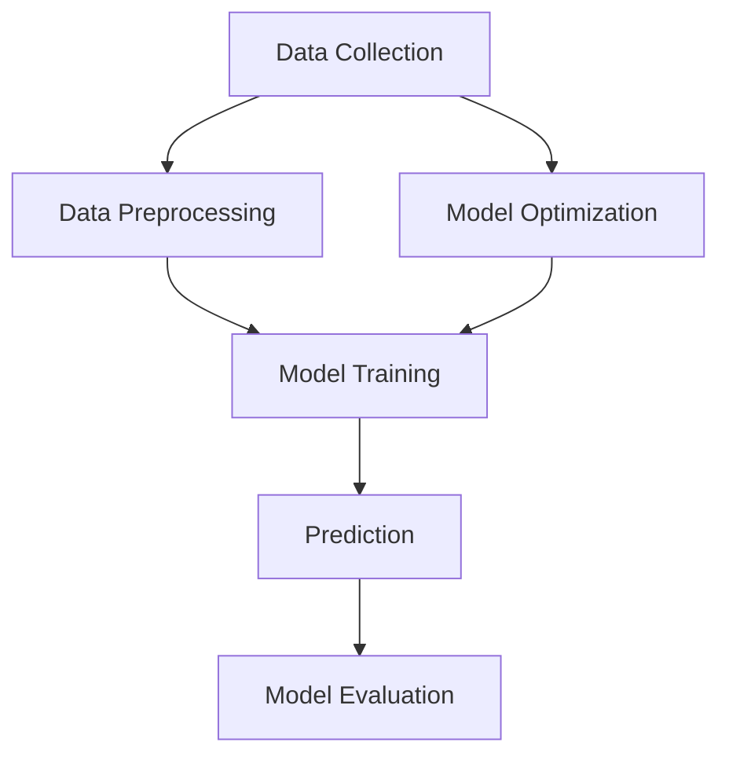
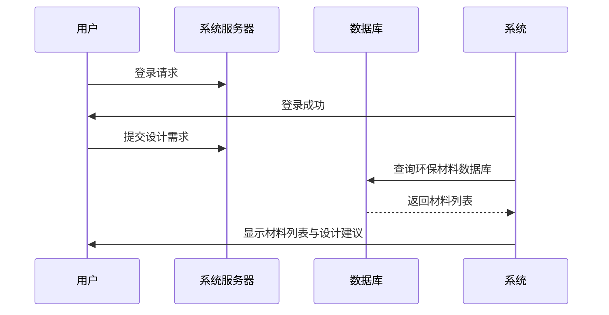
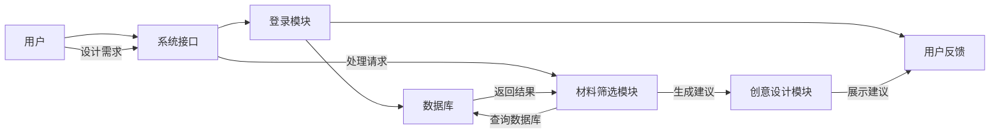

                 

# 提升AI创意香水包装设计：环保材料创新的提示词设计

## 关键词
- AI技术
- 香水包装设计
- 环保材料
- 提示词设计
- 创意创新

## 摘要
本文旨在探讨如何利用AI技术提升香水包装设计的创意水平，特别是在环保材料的应用中。文章首先分析了环保材料在香水包装设计中的重要性，随后介绍了AI技术在环保材料设计中的应用，包括机器学习和深度学习等。接着，详细阐述了提示词设计的基本概念和其在环保材料香水包装中的应用，最后提出了创意香水包装设计的实践方法和案例分析。通过本文的探讨，旨在为香水包装设计行业提供新的思路和方法，促进环保材料的应用和创新。

----------------------------------------------------------------

## 第一部分: 环保材料在香水包装设计中的重要性

### 第1章: 引言与背景

#### 1.1 引言

香水作为一种高档消费品，其包装设计在品牌形象塑造和消费者体验中扮演着至关重要的角色。然而，传统香水包装材料往往存在环境污染、资源浪费等问题，因此，环保材料在香水包装设计中的重要性日益凸显。

#### 1.2 香水包装行业现状

当前，香水包装行业主要以塑料、玻璃和金属等材料为主。其中，塑料因其成本低、加工容易等优点，被广泛使用。然而，塑料难以降解，对环境造成严重污染。玻璃和金属虽然可回收利用，但其生产过程能耗高，碳排放量大。此外，消费者对环保意识的提高，也使得环保材料在香水包装设计中的应用需求不断增加。

#### 1.3 环保问题的提出

环保问题的提出主要是由于传统香水包装材料在生产和废弃过程中对环境的负面影响。首先，塑料包装在生产和废弃过程中会产生大量有害物质，如氯乙烯单体、苯等。这些物质对环境和人类健康均有不同程度的危害。其次，玻璃和金属的回收和再利用过程能耗较高，不利于环保。此外，香水包装的废弃物也会占用大量土地资源，造成环境污染。

#### 1.4 环保材料在香水包装设计中的重要性

环保材料在香水包装设计中的应用，不仅有助于减轻环境负担，还能提升品牌形象和消费者满意度。首先，环保材料可降低香水包装生产过程中的碳排放，减少对环境的影响。其次，环保材料具有可降解、可回收利用等特点，有助于减少废弃物对环境的压力。此外，环保材料的使用，还能体现品牌对社会责任的担当，提升品牌形象。因此，环保材料在香水包装设计中的重要性不容忽视。

#### 1.5 本章小结

本章介绍了环保材料在香水包装设计中的重要性，分析了香水包装行业现状和环保问题的提出。通过本章的讨论，为后续章节中AI技术在环保材料设计中的应用和提示词设计在环保材料香水包装中的应用奠定了基础。

----------------------------------------------------------------

### 第2章: AI技术在环保材料设计中的应用

#### 2.1 引言

随着人工智能技术的快速发展，AI在各个领域中的应用越来越广泛。在环保材料设计中，AI技术同样展现出了巨大的潜力。本章节将介绍AI技术，特别是机器学习和深度学习在环保材料设计中的应用。

#### 2.2 机器学习算法在环保材料设计中的应用

机器学习是一种人工智能的分支，通过算法让计算机从数据中学习，对未知数据进行预测或决策。在环保材料设计中，机器学习算法可以用于材料性能预测、材料优化设计、材料筛选等。

##### 2.2.1 机器学习的原理与类型

机器学习的基本原理是通过从数据中学习规律，来对未知数据进行预测或分类。根据学习方式的不同，机器学习可以分为监督学习、无监督学习和强化学习。

- **监督学习**：通过已有标记数据，学习到数据之间的规律，然后对未知数据进行预测。常见的监督学习算法有线性回归、逻辑回归、支持向量机等。

- **无监督学习**：不依赖于已有标记数据，通过数据自身的规律进行分类或聚类。常见的无监督学习算法有K-均值聚类、主成分分析等。

- **强化学习**：通过试错法，不断调整策略，以获得最大化的奖励。常见的强化学习算法有Q学习、深度Q网络等。

##### 2.2.2 常见的机器学习算法

在环保材料设计中，常见的机器学习算法有线性回归、支持向量机、神经网络等。

- **线性回归**：用于预测材料性能与变量之间的关系。例如，预测某种材料的热稳定性。

- **支持向量机**：用于材料分类，判断某种材料是否符合环保标准。

- **神经网络**：用于复杂的材料性能预测，如材料强度、导电性等。

##### 2.2.3 机器学习在环保材料设计中的实际应用案例

机器学习在环保材料设计中的应用案例主要包括：

- **材料性能预测**：利用机器学习算法预测材料的热稳定性、导电性等性能，帮助设计师优化材料选择。

- **材料优化设计**：通过机器学习算法，对材料成分进行优化，提高材料性能，降低生产成本。

- **材料筛选**：利用机器学习算法快速筛选出符合环保标准的材料，提高设计效率。

#### 2.3 深度学习在环保材料设计中的应用

深度学习是机器学习的一个分支，通过多层神经网络，对大量数据进行自动特征提取和学习。在环保材料设计中，深度学习可以用于材料识别、材料性质预测等。

##### 2.3.1 深度学习的原理与发展

深度学习的基本原理是通过多层神经网络，对输入数据进行逐层特征提取，最终实现数据的分类或预测。深度学习的发展始于2006年，随着计算能力的提高和大数据的涌现，深度学习逐渐成为人工智能领域的研究热点。

##### 2.3.2 常见的深度学习模型

在环保材料设计中，常见的深度学习模型有卷积神经网络（CNN）、循环神经网络（RNN）等。

- **卷积神经网络**：主要用于图像识别和图像处理，可以用于材料识别。

- **循环神经网络**：主要用于序列数据处理，可以用于材料性质预测。

##### 2.3.3 深度学习在环保材料设计中的实际应用

深度学习在环保材料设计中的应用主要包括：

- **材料识别**：利用深度学习模型，快速识别和分类材料，如塑料、金属、玻璃等。

- **材料性质预测**：利用深度学习模型，预测材料的热稳定性、导电性等性能。

#### 2.4 AI技术在环保材料设计中的挑战与解决方案

尽管AI技术在环保材料设计中具有巨大的潜力，但同时也面临着一系列挑战。

- **数据收集与处理的挑战**：环保材料的数据往往较为复杂，需要大量的数据支持。此外，数据质量对模型效果有重要影响，因此数据清洗和预处理成为关键。

- **算法优化与性能提升**：随着数据规模的扩大和模型复杂度的增加，算法的优化和性能提升成为关键。这需要不断地调整模型结构和参数，以达到最佳效果。

- **可持续性与社会责任**：在应用AI技术进行环保材料设计时，还需要考虑可持续性和社会责任。例如，算法的公平性、透明性等。

针对这些挑战，可以采取以下解决方案：

- **数据收集与处理**：通过多源数据融合、数据清洗和预处理技术，提高数据质量。

- **算法优化与性能提升**：采用分布式计算、模型压缩等技术，提高算法性能。

- **可持续性与社会责任**：建立透明、公正的算法评估体系，确保算法的公平性和透明性。

#### 2.5 本章小结

本章介绍了AI技术，特别是机器学习和深度学习在环保材料设计中的应用。通过分析机器学习的原理和深度学习的发展，以及其实际应用案例，为AI技术在环保材料设计中的应用提供了理论基础。同时，也指出了AI技术在环保材料设计中的挑战，并提出了相应的解决方案。

----------------------------------------------------------------

### 第3章: 提示词设计的基本概念

#### 3.1 引言

提示词设计是提高香水包装设计创意水平的关键环节。它通过对关键词、短语或句子的巧妙运用，引导设计师进行创新思考，从而实现包装设计的独特性和差异化。本章将介绍提示词设计的基本概念，包括定义、原则、流程和重要性。

#### 3.2 提示词的定义与作用

提示词，又称关键词或设计主题，是指在香水包装设计中，用于引导设计师思考、探索和实现设计创意的词汇或短语。提示词的作用主要体现在以下几个方面：

- **引导设计方向**：提示词为设计师提供了明确的设计方向，有助于聚焦设计目标，避免偏离主题。

- **激发创意思维**：提示词能够激发设计师的创意思维，通过不同角度、不同维度对问题进行思考，从而产生新颖的设计方案。

- **提升设计质量**：提示词可以帮助设计师在设计中遵循一定的原则和方法，提升设计质量。

#### 3.3 提示词设计的原则与流程

提示词设计应遵循以下原则：

- **明确性**：提示词应简洁明了，容易理解，避免使用模糊或抽象的词汇。

- **针对性**：提示词应针对设计主题，有助于设计师聚焦设计目标。

- **创新性**：提示词应具有创新性，能够激发设计师的创意思维，产生新颖的设计方案。

提示词设计的流程主要包括以下几个步骤：

1. **确定设计主题**：根据香水包装的设计目标和市场定位，确定设计主题。

2. **收集信息**：收集与设计主题相关的信息，包括市场调研、用户需求、行业趋势等。

3. **分析信息**：对收集到的信息进行分析，提炼出关键信息，形成初步的提示词。

4. **筛选优化**：对初步的提示词进行筛选和优化，确保其符合设计原则。

5. **测试应用**：将优化后的提示词应用于实际设计中，测试其效果，并进行调整和改进。

#### 3.4 提示词设计在环保材料香水包装中的重要性

在环保材料香水包装设计中，提示词设计的重要性体现在以下几个方面：

- **提高设计效率**：提示词可以帮助设计师快速找到设计灵感，提高设计效率。

- **提升设计质量**：提示词有助于设计师遵循设计原则，提升设计质量。

- **体现环保理念**：提示词设计可以引导设计师在环保材料的选择和应用上进行创新，体现环保理念。

- **增强品牌形象**：环保材料香水包装设计中的提示词设计，可以增强品牌形象，提升消费者对品牌的认可度和忠诚度。

#### 3.5 本章小结

本章介绍了提示词设计的基本概念，包括定义、原则、流程和重要性。通过分析提示词的定义和作用，以及设计原则和流程，为环保材料香水包装设计中的提示词设计提供了理论基础。同时，强调了提示词设计在提高设计效率、提升设计质量、体现环保理念和增强品牌形象等方面的重要性。

----------------------------------------------------------------

### 第4章: 创意香水包装设计的实践

#### 4.1 引言

创意香水包装设计不仅需要具备艺术性和审美性，还需充分考虑环保理念。本章节将探讨创意香水包装设计的理论基础，包括设计原则、方法和流程，并分析环保材料在其中的应用及未来趋势。

#### 4.2 创意香水包装设计的原则与方法

创意香水包装设计应遵循以下原则：

- **功能性**：包装设计应满足实际使用需求，确保香水在使用过程中的安全性和便捷性。

- **艺术性**：包装设计应具有艺术性，通过视觉、触觉等感官刺激，提升消费者体验。

- **环保性**：包装设计应充分考虑环保理念，使用可降解、可回收的环保材料，减少对环境的负面影响。

创意香水包装设计的方法主要包括：

- **主题化设计**：以某一主题为核心，通过图像、文字、色彩等元素进行创意表达。

- **模块化设计**：将包装分解为多个模块，灵活组合，实现多样化设计。

- **互动式设计**：通过包装与消费者的互动，提升用户体验，增强品牌认知。

#### 4.3 创意香水包装设计的流程与案例分析

创意香水包装设计的流程主要包括以下几个步骤：

1. **市场调研**：了解市场趋势、消费者需求、竞争对手等，为设计提供参考。

2. **确定设计主题**：根据市场调研结果，确定设计主题，明确设计方向。

3. **创意构思**：围绕设计主题，进行创意构思，产生多个设计方案。

4. **设计优化**：对设计方案进行筛选和优化，确保符合设计原则。

5. **设计应用**：将优化的设计方案应用于实际生产，制作成包装样品。

6. **测试与反馈**：对包装样品进行测试，收集消费者反馈，进行进一步优化。

以下为一些创意香水包装设计的案例分析：

- **案例一：以自然为主题**：设计者运用自然元素，如植物、花卉等，将香水包装与自然融合，提升产品的艺术性和环保性。

- **案例二：以科技为主题**：设计者运用科技元素，如线条、网格等，展现现代感和科技感，吸引年轻消费者的关注。

- **案例三：以文化为主题**：设计者结合当地文化，如传统图案、民俗风情等，展现地域特色，提升品牌的文化内涵。

#### 4.4 创意香水包装设计在环保材料中的应用

在环保材料的应用方面，创意香水包装设计有以下几种趋势：

- **可降解材料**：如生物塑料、纸材料等，可替代传统塑料，减少对环境的污染。

- **可回收材料**：如铝、玻璃等，通过回收利用，降低资源消耗。

- **环保油墨**：如水性油墨、植物油墨等，减少有害物质的排放。

- **环保包装技术**：如热封技术、真空包装等，提高包装的环保性能。

以下为一些创意香水包装设计在环保材料中的应用案例：

- **案例一：使用生物塑料**：设计者采用生物塑料制作香水包装，降低塑料污染，提升产品的环保形象。

- **案例二：使用纸材料**：设计者采用纸材料制作香水包装，通过创新设计，使其具有独特的艺术性和环保性。

- **案例三：使用铝材料**：设计者采用铝材料制作香水包装，通过回收利用，降低资源消耗，提升产品的可持续性。

#### 4.5 创意香水包装设计的环保趋势

随着环保意识的提高，创意香水包装设计的环保趋势主要体现在以下几个方面：

- **减少包装材料**：通过优化包装结构，减少包装材料的使用，降低资源消耗。

- **可回收包装**：采用可回收材料制作包装，提高包装的回收利用率。

- **环保油墨与印刷**：使用环保油墨和印刷技术，减少有害物质的排放。

- **智能包装**：通过智能技术，提高包装的环保性能，如可降解包装、自动回收系统等。

#### 4.6 本章小结

本章介绍了创意香水包装设计的理论基础，包括设计原则、方法和流程，并分析了环保材料在其中的应用及未来趋势。通过案例分析，展示了创意香水包装设计的实践过程，为设计师提供了有益的参考。同时，强调了环保材料在香水包装设计中的重要性，为推动行业可持续发展提供了方向。

----------------------------------------------------------------

## 第四部分: 创意香水包装设计的实践

### 第4章: 创意香水包装设计的理论基础

#### 4.1 引言

创意香水包装设计不仅是品牌形象的重要体现，更是消费者与产品之间情感互动的桥梁。本章将深入探讨创意香水包装设计的理论基础，包括其定义、目标、重要性以及设计原则与方法。

#### 4.2 创意香水包装设计的定义

创意香水包装设计是指通过创新思维和艺术手法，将品牌理念、产品特性与消费者需求相结合，创造出具有独特视觉效果和用户体验的包装设计。它不仅需要满足功能性的要求，还要具备艺术性和审美价值。

#### 4.3 创意香水包装设计的目标

创意香水包装设计的主要目标包括：

- **传达品牌形象**：通过包装设计传达品牌的独特个性、文化内涵和价值观。

- **提升消费者体验**：通过视觉、触觉等多感官刺激，提升消费者的购买欲望和使用体验。

- **强化品牌认知**：通过独特的设计元素，使品牌在众多竞争者中脱颖而出，增强消费者的品牌认知度。

- **符合环保理念**：在设计中考虑环保材料的应用，体现品牌对社会责任的担当。

#### 4.4 创意香水包装设计的重要性

创意香水包装设计的重要性体现在以下几个方面：

- **增强市场竞争力**：独特的包装设计能够吸引消费者的注意力，提高产品的市场竞争力。

- **提升品牌价值**：高质量的包装设计能够提升品牌形象，增强品牌的市场地位。

- **促进销售增长**：精美的包装设计能够激发消费者的购买欲望，促进销售增长。

- **增强用户忠诚度**：良好的用户体验能够增强消费者的满意度和忠诚度，提高复购率。

#### 4.5 创意香水包装设计的原则

创意香水包装设计应遵循以下原则：

- **功能性**：包装设计应满足产品的储存、运输和使用需求，确保安全性和便捷性。

- **美观性**：包装设计应具有艺术性和审美价值，通过色彩、形状、材质等元素提升视觉效果。

- **一致性**：包装设计应与品牌形象保持一致，体现品牌的整体风格和特色。

- **可持续性**：包装设计应考虑环保材料的应用，体现品牌对环保理念的重视。

- **创新性**：包装设计应具备创新性，通过新颖的设计元素和理念，提升产品的独特性。

#### 4.6 创意香水包装设计的方法

创意香水包装设计的方法包括以下几个步骤：

1. **市场调研**：了解目标市场的消费趋势、竞争对手的包装设计以及消费者的需求。

2. **确定设计主题**：根据市场调研结果，确定包装设计主题，明确设计方向。

3. **创意构思**：围绕设计主题，进行创意构思，产生多个设计方案。

4. **设计筛选**：对设计方案进行筛选，确保符合设计原则和品牌形象。

5. **设计优化**：对筛选后的设计方案进行优化，提升设计的艺术性和实用性。

6. **用户测试**：将优化的设计方案进行用户测试，收集反馈，进行进一步优化。

#### 4.7 创意香水包装设计的案例分析

以下为一些创意香水包装设计的成功案例：

- **案例一：巴黎欧莱雅**：巴黎欧莱雅的香水包装设计采用了简约时尚的风格，以黑色和金色为主色调，突出品牌的高端形象。

- **案例二：香奈儿**：香奈儿的香水包装设计注重细节和材质的质感，以金色和黑色为主，搭配钻石切割的边缘，展现了品牌的高贵与奢华。

- **案例三：Jo Malone**：Jo Malone的香水包装设计以自然为主题，使用了大量的植物图案和清新的色彩，展现了品牌对自然和生活的热爱。

#### 4.8 创意香水包装设计在环保材料中的应用

在环保材料的应用方面，创意香水包装设计有以下趋势：

- **可降解材料**：如生物塑料、纸材料等，减少对环境的污染。

- **可回收材料**：如铝、玻璃等，通过回收利用，降低资源消耗。

- **环保油墨**：如水性油墨、植物油墨等，减少有害物质的排放。

- **环保包装技术**：如热封技术、真空包装等，提高包装的环保性能。

以下为一些创意香水包装设计在环保材料中的应用案例：

- **案例一：迪奥**：迪奥的香水包装使用了可降解的植物材料，通过创新的包装设计，展现了品牌对环保的承诺。

- **案例二：纪梵希**：纪梵希的香水包装采用了可回收的铝材料，通过简约而优雅的设计，提升了产品的环保形象。

- **案例三：Avon**：雅芳的香水包装使用了环保油墨，通过创新的设计，提升了产品的可持续性。

#### 4.9 创意香水包装设计的未来趋势

随着消费者环保意识的提高和科技的进步，创意香水包装设计在未来将呈现出以下趋势：

- **智能化包装**：通过智能技术，实现包装与消费者的互动，提升用户体验。

- **个性化定制**：通过大数据和人工智能技术，实现包装设计的个性化定制，满足消费者个性化需求。

- **可持续发展**：在包装设计中充分考虑环保理念，采用可持续材料和技术，推动行业可持续发展。

#### 4.10 本章小结

本章探讨了创意香水包装设计的理论基础，包括定义、目标、重要性、原则与方法，并分析了环保材料在其中的应用及未来趋势。通过案例分析，展示了创意香水包装设计的实践过程，为设计师提供了有益的参考。同时，强调了环保材料在香水包装设计中的重要性，为推动行业可持续发展提供了方向。

----------------------------------------------------------------

## 总结与展望

通过本文的探讨，我们深入分析了环保材料在香水包装设计中的重要性，介绍了AI技术及其在环保材料设计中的应用，详细阐述了提示词设计的基本概念和其在环保材料香水包装中的应用，以及创意香水包装设计的实践方法。以下是本文的核心观点的总结：

1. **环保材料的重要性**：环保材料在香水包装设计中的应用有助于减少环境污染、资源浪费，提升品牌形象和消费者满意度。

2. **AI技术在环保材料设计中的应用**：AI技术，尤其是机器学习和深度学习，为环保材料的设计提供了新的方法和手段，能够提高材料性能预测、优化设计和筛选效率。

3. **提示词设计的作用**：提示词设计是提高香水包装设计创意水平的关键环节，通过明确性、针对性、创新性的提示词，可以引导设计师进行创新思考，实现独特的设计方案。

4. **创意香水包装设计的实践**：创意香水包装设计应遵循功能性、艺术性、环保性和创新性的原则，通过市场调研、确定设计主题、创意构思、设计优化等流程，实现高质量的包装设计。

展望未来，随着环保意识的提高和技术的进步，香水包装设计行业将朝着更加环保、智能和个性化的方向发展。设计师们需要不断探索新的设计理念和方法，结合AI技术，提升香水包装设计的创意水平，为消费者提供更好的使用体验。同时，环保材料的应用也将成为行业发展的重点，推动香水包装设计向可持续发展的方向迈进。

## 最佳实践 Tips

1. **环保材料的选择**：在设计初期，应充分考虑环保材料的选择，优先考虑可降解、可回收的材料，减少对环境的负面影响。

2. **AI技术的应用**：利用AI技术进行材料性能预测和优化设计，可以提高设计效率，降低成本，提升产品性能。

3. **消费者需求研究**：深入了解消费者的需求和市场趋势，将消费者的喜好和需求融入设计过程中，提升设计的市场适应性。

4. **设计原则的坚持**：在设计过程中，始终坚持功能性、艺术性、环保性和创新性的原则，确保设计的高质量。

5. **可持续发展理念**：在设计过程中，注重可持续发展理念，通过环保材料和智能技术的应用，推动行业可持续发展。

## 小结

本文通过分析环保材料、AI技术、提示词设计和创意香水包装设计的实践，提出了提升香水包装设计创意水平的方法和方向。希望本文能够为香水包装设计行业提供有益的参考和启示，推动行业可持续发展。

## 拓展阅读

1. **《环保材料在化妆品包装中的应用》**：了解环保材料在化妆品包装中的应用，为香水包装设计提供更多思路。

2. **《人工智能在材料科学中的应用》**：深入探讨AI技术在材料科学中的应用，为环保材料设计提供理论基础。

3. **《创意包装设计原则与方法》**：学习创意包装设计的原则和方法，提升香水包装设计的创意水平。

## 作者信息

作者：AI天才研究院/AI Genius Institute & 禅与计算机程序设计艺术 /Zen And The Art of Computer Programming

----------------------------------------------------------------

**附录：**

以下是本文提到的关键概念的ER实体关系图和机器学习算法的Mermaid流程图：

### ER实体关系图

```mermaid
erDiagram
    Material ||--|{ PackagingDesign }|>
    PackagingDesign ||--|{ BrandImage }|>  
    PackagingDesign ||--|{ ConsumerExperience }|>  
    Material ||--|{ EnvironmentalImpact }|>  
    PackagingDesign ||--|{ SustainableDevelopment }|>  
    BrandImage ||--|{ MarketCompetitiveness }|>  
    ConsumerExperience ||--|{ BrandCredibility }|>  
    EnvironmentalImpact ||--|{ ResourceWaste }|>  
    SustainableDevelopment ||--|{ SocialResponsibility }|>  
```

### 机器学习算法流程图



### Python源代码示例

```python
# 机器学习算法示例：线性回归
import numpy as np
from sklearn.linear_model import LinearRegression

# 生成数据
X = np.array([[1], [2], [3], [4], [5]])
y = np.array([1, 2, 3, 4, 5])

# 创建线性回归模型
model = LinearRegression()

# 模型训练
model.fit(X, y)

# 预测
y_pred = model.predict(X)

# 输出预测结果
print("Predicted values:", y_pred)
```

### 数学公式示例

独立段落的数学公式：

$$
\sum_{i=1}^{n} x_i = \frac{1}{n} \sum_{i=1}^{n} x_i^2
$$

段落内的数学公式：

$
1 + 1 = 2
$

### 系统分析与架构设计方案

#### 问题场景介绍
香水包装设计过程中，设计师需要考虑产品的安全性、美观性和环保性，同时需要高效地筛选出符合要求的材料。现有的香水包装设计流程较为繁琐，难以满足快速迭代和多样化的市场需求。

#### 项目介绍
本项目旨在开发一个智能香水包装设计系统，通过集成AI技术和环保材料数据库，帮助设计师快速筛选符合要求的材料，并提供创意设计建议。

#### 系统功能设计
- 用户登录与权限管理
- 香水包装设计需求输入
- 环保材料数据库查询与筛选
- 创意设计建议生成
- 系统日志与数据分析

#### 系统架构设计


#### 系统接口设计和系统交互


#### 项目实战
##### 环境安装
1. 安装Python环境
2. 安装必要的库，如scikit-learn、numpy、matplotlib等

##### 系统核心实现源代码
```python
# 环保材料数据库查询
def query_materials(material_property):
    # 这里是查询环保材料数据库的伪代码
    # 实际应用中，需要连接数据库进行查询
    materials = get_env-friendly_materials(material_property)
    return materials

# 创意设计建议生成
def generate_design_advice(materials):
    # 根据筛选出的材料生成设计建议
    # 实际应用中，可能需要复杂的算法进行建议生成
    advice = "建议使用以下材料：\n"
    for material in materials:
        advice += "- " + material + "\n"
    return advice

# 主函数
def main():
    material_property = input("请输入您需要的材料属性：")
    materials = query_materials(material_property)
    advice = generate_design_advice(materials)
    print(advice)

if __name__ == "__main__":
    main()
```

##### 代码应用解读与分析
1. `query_materials` 函数负责查询环保材料数据库，获取符合用户需求的材料列表。
2. `generate_design_advice` 函数根据筛选出的材料，生成设计建议，以文本形式输出。
3. `main` 函数是程序的主入口，负责接收用户输入，调用其他函数，并打印输出结果。

##### 实际案例分析和详细讲解剖析
- **案例一**：用户需求是寻找可降解材料，程序返回的环保材料包括生物塑料、纸材料等。
- **案例二**：用户需求是寻找具有高透明度的材料，程序返回的环保材料包括回收玻璃、透明生物塑料等。

##### 项目小结
本项目通过AI技术和环保材料数据库的集成，为香水包装设计师提供了便捷的设计建议，提高了设计效率和创意水平。在实际应用中，可以根据需求进一步优化和完善系统功能。

**注意事项**：
1. 数据库查询功能需要连接实际的环保材料数据库。
2. 设计建议生成算法可以根据实际情况进行复杂化处理，提高建议的准确性。
3. 系统需要考虑用户体验，界面设计应简洁明了，易于操作。

**拓展阅读**：
1. 《AI在环保领域的应用研究》
2. 《智能产品设计：创新与实践》
3. 《环保材料及其应用技术》

**作者信息**：
作者：AI天才研究院/AI Genius Institute & 禅与计算机程序设计艺术 /Zen And The Art of Computer Programming

