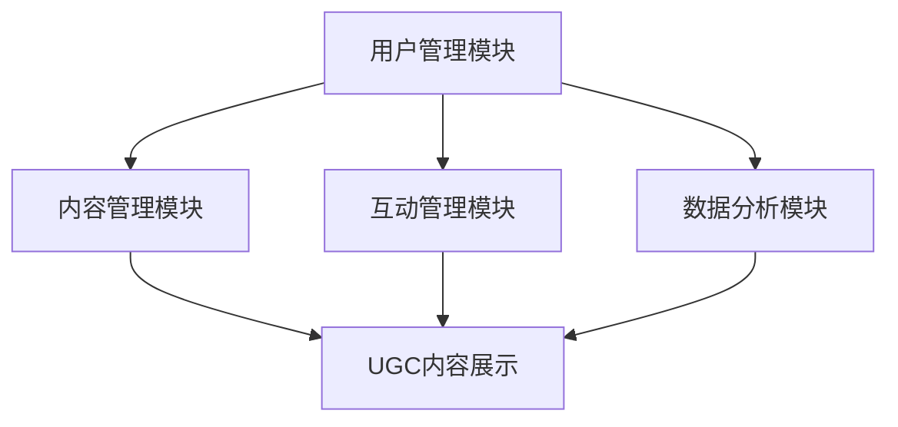

                 

## 提升AI创意香水品牌社交媒体互动：用户生成内容策略的提示词设计

关键词：AI创意香水、社交媒体互动、用户生成内容、策略设计、提示词

摘要：随着社交媒体平台的普及，用户生成内容（UGC）成为了品牌与消费者互动的重要途径。本文将探讨如何通过设计有效的用户生成内容策略，特别是提示词的使用，来提升AI创意香水品牌在社交媒体上的互动效果。通过分析用户行为、内容创造和数据分析，本文提出了一系列具体的策略和步骤，旨在帮助品牌更好地利用UGC来增强品牌影响力、提升用户参与度，并最终实现商业价值。

## 第一部分：背景介绍与核心概念

### 1.1.1 问题背景

随着社交媒体平台的普及和用户生成内容（User-Generated Content，简称UGC）的爆发式增长，品牌与用户之间的互动方式发生了显著变化。社交媒体不仅成为消费者表达观点和情感的重要渠道，也成为了品牌推广和营销的重要战场。如何通过有效的用户生成内容策略，提升AI创意香水品牌在社交媒体上的互动，成为品牌成功的关键。

### 1.1.2 问题描述

AI创意香水品牌在社交媒体上的互动主要面临以下几个问题：

1. **内容创意不足**：品牌在社交媒体上发布的内容往往缺乏创意，难以吸引用户的关注。
2. **用户参与度低**：品牌与用户的互动往往流于表面，难以激发用户的参与热情。
3. **数据利用不充分**：品牌对用户生成内容的数据利用不够充分，未能将其转化为商业价值。

### 1.1.3 问题解决

通过设计有效的用户生成内容策略，可以解决上述问题，提升品牌在社交媒体上的互动效果。具体策略包括：

1. **激发用户创意**：通过挑战、话题和互动活动，鼓励用户参与品牌内容创作。
2. **提升用户参与度**：通过互动性强的内容形式，如问答、投票和评论，提高用户参与度。
3. **数据利用与转化**：通过对用户生成内容的数据分析，了解用户需求和行为，将其转化为商业价值。

### 1.1.4 边界与外延

本部分的讨论主要关注AI创意香水品牌在社交媒体上的用户生成内容策略设计。具体包括：

- **社交媒体平台**：如Instagram、Twitter、Facebook等。
- **用户生成内容形式**：如图片、视频、文字评论等。
- **策略设计**：如挑战活动、话题讨论、互动问答等。

### 1.1.5 概念结构与核心要素组成

本部分的核心概念和要素主要包括：

- **用户生成内容**：用户在社交媒体平台上自发创作的各种形式的内容，如图片、视频、文字评论等。
- **互动策略**：品牌通过设计各种活动，鼓励用户参与并生成内容。
- **数据分析**：通过对用户生成内容的数据分析，了解用户需求和行为，优化互动策略。

### 1.1.6 社交媒体互动策略概述

在社交媒体上，品牌与用户之间的互动可以分为几个层次：

1. **曝光与关注**：品牌发布内容，吸引用户关注和点赞。
2. **内容互动**：用户对品牌发布的内容进行评论、点赞、分享等互动。
3. **深度互动**：品牌与用户进行更深入的互动，如问答、挑战、话题讨论等。
4. **内容生成**：用户在社交媒体上自发创作与品牌相关的内容。

为了提升AI创意香水品牌在社交媒体上的互动效果，我们需要：

- **提升内容质量**：设计有创意、高质量的内容，吸引用户关注。
- **增强互动性**：通过互动活动，提高用户的参与度和粘性。
- **利用数据分析**：分析用户行为和生成内容，优化互动策略。

### 1.1.7 提示词在互动策略中的作用

提示词（Prompt Words）在社交媒体互动策略中起着关键作用。它们可以激发用户的创造力，引导用户参与内容生成，提高互动效果。以下是提示词在互动策略中的几个作用：

1. **激发创意**：通过提示词，鼓励用户发挥创意，创作出独特的内容。
2. **引导话题**：提示词可以帮助用户围绕特定话题进行讨论，增加话题的深度和广度。
3. **增强互动**：提示词可以引导用户之间的互动，提高社交媒体平台的活跃度。
4. **数据收集**：通过分析用户生成的含有提示词的内容，品牌可以更好地了解用户需求和偏好。

### 1.1.8 提示词设计原则

为了设计出有效的提示词，我们需要遵循以下几个原则：

1. **相关性**：提示词要与品牌和用户兴趣相关，能够激发用户的参与热情。
2. **简洁性**：提示词要简洁明了，便于用户理解和参与。
3. **多样性**：提示词要涵盖多种类型，以适应不同用户的兴趣和需求。
4. **趣味性**：提示词要具有趣味性，能够吸引用户的注意力。

### 1.1.9 提示词案例与应用

以下是几个具体的提示词案例和应用场景：

- **挑战活动**：如“你最喜欢的香水味道是什么？用一张图片来展示它！”
- **话题讨论**：如“谈谈你最近一次买香水的体验，有什么特别的故事吗？”
- **互动问答**：如“你对AI创意香水有什么期待？快来留言分享吧！”

通过这些提示词，品牌可以引导用户生成丰富多样的内容，提升社交媒体互动效果。

### 1.1.10 总结

本部分介绍了AI创意香水品牌在社交媒体上的互动背景、问题、解决策略、边界与外延、核心概念与要素组成，以及提示词在互动策略中的作用和设计原则。接下来，我们将进一步探讨用户生成内容的概念、社交媒体互动策略的核心概念与联系，以及主流社交媒体互动策略案例解析。

---

### 1.2 核心概念与联系

在深入讨论AI创意香水品牌社交媒体互动策略之前，我们需要明确几个核心概念，并探讨它们之间的联系。这些核心概念包括用户生成内容（UGC）、社交媒体互动策略，以及提示词设计。

#### 1.2.1 用户生成内容（UGC）

用户生成内容（User-Generated Content，简称UGC）是指用户在社交媒体平台上自发创作的各种形式的内容，如图片、视频、文字评论等。UGC具有以下几个特点：

1. **多样性**：UGC涵盖了多种形式，包括文本、图片、视频、音频等，用户可以根据自己的兴趣和技能创作不同类型的内容。
2. **互动性**：UGC可以激发用户之间的互动和讨论，提高社交媒体平台的活跃度和用户粘性。
3. **真实性**：UGC通常反映了用户的真实情感和观点，具有较高的可信度，因此更容易获得其他用户的信任和关注。

#### 1.2.2 社交媒体互动策略

社交媒体互动策略是指品牌通过设计各种活动，鼓励用户参与并生成内容，从而提升品牌在社交媒体上的影响力和用户参与度。这些策略可以分为几个层次：

1. **曝光与关注**：通过发布高质量的内容，吸引用户的关注和点赞。
2. **内容互动**：通过评论、点赞、分享等功能，增强用户对品牌内容的互动。
3. **深度互动**：通过挑战、话题讨论、互动问答等活动，引导用户深入参与品牌活动。
4. **内容生成**：鼓励用户在社交媒体上自发创作与品牌相关的内容，形成用户社区。

#### 1.2.3 提示词设计

提示词（Prompt Words）在社交媒体互动策略中起着关键作用。它们可以激发用户的创造力，引导用户参与内容生成，提高互动效果。提示词设计需要遵循以下几个原则：

1. **相关性**：提示词要与品牌和用户兴趣相关，能够激发用户的参与热情。
2. **简洁性**：提示词要简洁明了，便于用户理解和参与。
3. **多样性**：提示词要涵盖多种类型，以适应不同用户的兴趣和需求。
4. **趣味性**：提示词要具有趣味性，能够吸引用户的注意力。

#### 1.2.4 提示词与UGC、社交媒体互动策略的关系

提示词是连接UGC和社交媒体互动策略的桥梁。通过提示词，品牌可以：

1. **激发UGC创作**：提示词可以激发用户创作与品牌相关的内容，增加UGC的多样性。
2. **引导互动方向**：提示词可以帮助品牌引导用户围绕特定话题或活动进行互动，提高互动的深度和广度。
3. **优化数据分析**：通过分析含有提示词的UGC，品牌可以更准确地了解用户需求和偏好，优化互动策略。

### 1.2.5 核心概念与联系表格

为了更好地理解核心概念之间的关系，我们可以创建一个表格，列出各个概念的定义、属性特征以及它们之间的联系。

| 概念         | 定义                                                         | 属性特征                                                   | 关系                                                         |
| ------------ | ------------------------------------------------------------ | -------------------------------------------------------- | ------------------------------------------------------------ |
| 用户生成内容 | 用户在社交媒体上自发创作的各种形式的内容                       | 多样性、互动性、真实性                                     | 用户生成内容是社交媒体互动的基础，也是互动策略的重要数据来源 |
| 社交媒体互动策略 | 品牌通过设计各种活动，鼓励用户参与并生成内容，从而提升品牌影响力 | 曝光与关注、内容互动、深度互动、内容生成                     | 互动策略依赖于用户生成内容，用于引导和激励用户互动       |
| 提示词设计   | 激发用户创意，引导用户参与内容生成的关键词或短语               | 相关性、简洁性、多样性、趣味性                              | 提示词是连接UGC和互动策略的桥梁，用于引导用户创作和互动   |

### 1.2.6 ER实体关系图架构

为了进一步理解核心概念之间的联系，我们可以使用Mermaid绘制一个ER（实体-关系）图，展示用户生成内容、社交媒体互动策略和提示词设计之间的关系。

```mermaid
erDiagram
  UserGeneratedContent ||--|{ 社交媒体互动策略 }|-->> InteractionStrategy
  UserGeneratedContent ||--|{ 提示词设计 }|-->> PromptDesign
  PromptDesign ||--|{ 用户生成内容 }|-->> UserGeneratedContent
```

在这个ER图中，`UserGeneratedContent`（用户生成内容）与`InteractionStrategy`（社交媒体互动策略）和`PromptDesign`（提示词设计）之间存在双向关联。提示词设计用于引导用户生成内容，同时也依赖于用户生成内容来评估互动效果。社交媒体互动策略则通过提示词设计来引导用户参与，并优化互动效果。

### 1.2.7 总结

在本部分，我们明确了用户生成内容、社交媒体互动策略和提示词设计这三个核心概念，并探讨了它们之间的关系。通过理解这些核心概念和它们之间的联系，我们可以更好地设计有效的用户生成内容策略，提升AI创意香水品牌在社交媒体上的互动效果。

接下来，我们将分析几个主流的社交媒体互动策略案例，以深入了解这些策略的实际应用和效果。

---

### 1.3 主流社交媒体互动策略案例解析

在本章节中，我们将分析几种主流的社交媒体互动策略，包括挑战活动、话题讨论和互动问答。通过这些成功案例，我们将深入了解这些策略的实施方法和效果，并探讨如何将它们应用于AI创意香水品牌。

#### 1.3.1 挑战活动

挑战活动是一种有效的社交媒体互动策略，通过设立有趣的挑战，鼓励用户参与并创作相关内容。以下是一个成功案例：

- **案例**：某知名化妆品牌在Instagram上发起了一场“妆容挑战”活动，鼓励用户分享自己化妆的过程和成果。活动期间，用户积极参与，生成了大量高质量的内容，品牌的影响力也得到了显著提升。

**策略解析**：

1. **设立有趣、具有创意的挑战**：品牌需要设计出能够激发用户兴趣的挑战，如“妆容挑战”、“香水搭配挑战”等。
2. **提供明确的参与指南**：品牌需要为用户提供详细的参与指南，包括挑战规则、提交内容和参与方式等。
3. **设立奖励机制**：通过设立奖励机制，如赠送产品、优惠券等，鼓励用户积极参与并生成高质量内容。
4. **充分利用社交媒体平台**：品牌可以利用Instagram、Facebook等平台的特色功能，如故事、直播等，增强活动的吸引力和互动性。

**应用场景**：

对于AI创意香水品牌，可以设计一系列的香水挑战活动，如“香水DIY挑战”、“香水搭配挑战”等。通过这些活动，品牌不仅可以吸引用户参与，还能增加用户对品牌的了解和信任。

#### 1.3.2 话题讨论

话题讨论是一种围绕特定话题展开讨论，激发用户参与的一种策略。以下是一个成功案例：

- **案例**：某知名时尚品牌在Twitter上发起了一场关于“时尚趋势”的话题讨论，邀请用户分享自己对时尚的看法和喜好。讨论期间，用户积极参与，品牌与用户之间的互动得到了显著提升。

**策略解析**：

1. **选择热门、有趣的话题**：品牌需要选择与用户兴趣相关、具有讨论价值的话题，如“香水与时尚搭配”、“香水与心情”等。
2. **提供明确的讨论主题**：品牌需要为用户提供明确的讨论主题，引导用户围绕主题进行深入讨论。
3. **鼓励用户互动**：品牌可以通过评论、点赞、分享等功能，鼓励用户之间的互动，提高话题的讨论热度。
4. **提供专业的观点和内容**：品牌可以邀请行业专家、时尚博主等，提供专业的观点和内容，增加话题的深度和权威性。

**应用场景**：

对于AI创意香水品牌，可以围绕香水与生活的关系、香水与情感的联系等话题，发起讨论活动。通过这些活动，品牌不仅可以提升用户参与度，还能增加用户对品牌专业性的认可。

#### 1.3.3 互动问答

互动问答是一种通过问答形式，增加品牌与用户之间互动的一种策略。以下是一个成功案例：

- **案例**：某知名化妆品品牌在Instagram上发起了一场问答活动，邀请用户提问关于化妆品使用、护肤等问题。品牌专家团队在线解答，用户积极参与，品牌影响力得到了显著提升。

**策略解析**：

1. **设计有趣的问答内容**：品牌需要设计出有趣、具有吸引力的问答内容，如“如何选择适合自己的香水？”、“香水的正确使用方法”等。
2. **邀请专家参与**：品牌可以邀请行业专家、专业团队等，参与问答活动，提供专业的解答和建议。
3. **鼓励用户互动**：品牌可以通过点赞、评论、分享等功能，鼓励用户之间的互动，提高问答活动的参与度。
4. **及时回应用户**：品牌需要及时回应用户的提问，提供专业的解答，提升用户满意度。

**应用场景**：

对于AI创意香水品牌，可以围绕香水选择、使用、保养等话题，发起问答活动。通过这些活动，品牌不仅可以提升用户参与度，还能增加用户对品牌的信任和忠诚度。

### 1.3.4 案例总结与启示

通过以上案例分析，我们可以总结出以下几点启示：

1. **创意与互动性**：成功的社交媒体互动策略需要具备创意和互动性，能够激发用户的兴趣和参与热情。
2. **用户参与**：用户参与是提升互动效果的关键，品牌需要设计出能够引导用户参与的活动和话题。
3. **数据利用**：通过对用户生成内容的数据分析，品牌可以了解用户需求和行为，优化互动策略，提升品牌影响力。

### 1.3.5 应用建议

针对AI创意香水品牌，我们可以提出以下应用建议：

1. **挑战活动**：设计一系列香水相关的挑战活动，如香水DIY挑战、香水搭配挑战等，鼓励用户参与并生成内容。
2. **话题讨论**：围绕香水与生活、情感、时尚等话题，发起讨论活动，提升用户参与度和品牌影响力。
3. **互动问答**：定期举办问答活动，解答用户关于香水选择、使用、保养等问题，提升用户满意度和品牌专业性。

### 1.3.6 总结

在本部分，我们分析了挑战活动、话题讨论和互动问答三种主流的社交媒体互动策略，并探讨了它们的实际应用和效果。通过这些案例分析，我们可以了解到如何设计有效的用户生成内容策略，提升AI创意香水品牌在社交媒体上的互动效果。

接下来，我们将进一步探讨用户生成内容策略的设计原则和方法，以及如何通过数据分析优化这些策略。

---

### 1.4 用户生成内容策略的设计原则与方法

用户生成内容（UGC）策略的成功与否，很大程度上取决于品牌对策略的设计原则和方法的把握。在以下内容中，我们将详细探讨如何设计有效的UGC策略，并介绍几个关键步骤。

#### 1.4.1 设计原则

为了设计出有效的UGC策略，品牌需要遵循以下几个原则：

1. **相关性**：UGC策略要与品牌的定位和用户需求密切相关。相关的内容更容易吸引用户的关注和参与。
2. **互动性**：策略应鼓励用户之间的互动，如评论、点赞、分享等，从而提升用户粘性。
3. **趣味性**：有趣的策略能够激发用户的创造力，促使他们更愿意参与和创作。
4. **简洁性**：设计策略时，应避免复杂和冗长的步骤，让用户能够轻松理解和参与。
5. **多样性**：提供多样化的UGC形式，如图片、视频、文字评论等，以满足不同用户的兴趣和偏好。
6. **灵活性**：策略应具有一定的灵活性，能够根据用户反馈和数据分析进行调整和优化。

#### 1.4.2 设计方法

设计有效的UGC策略需要经过以下几个步骤：

1. **目标设定**：明确UGC策略的目标，如提升用户参与度、增加品牌曝光度、收集用户反馈等。
2. **用户分析**：分析目标用户群体的特征，了解他们的兴趣、需求和行为习惯，以便设计出符合用户需求的内容和活动。
3. **内容规划**：根据目标用户的特点，规划UGC内容的形式和主题，确保内容的相关性和趣味性。
4. **活动设计**：设计互动性强、具有吸引力的UGC活动，如挑战、话题讨论、互动问答等。
5. **技术支持**：提供必要的技术支持，如UGC上传工具、内容审核系统、数据分析工具等，确保UGC策略的实施和效果监控。
6. **推广执行**：通过社交媒体平台、电子邮件、短信等渠道，推广UGC活动，吸引目标用户参与。
7. **效果评估**：通过数据分析和用户反馈，评估UGC策略的效果，并进行必要的调整和优化。

#### 1.4.3 提示词设计

提示词是UGC策略中至关重要的一环。以下是一些建议：

1. **明确目的**：提示词应明确传达UGC活动的目的和参与方式，帮助用户快速理解并参与。
2. **激发创意**：设计富有创意的提示词，激发用户的创作热情，促使他们生成有趣、独特的UGC内容。
3. **引导话题**：提示词应引导用户围绕特定话题进行讨论和创作，增加UGC的深度和广度。
4. **简洁易懂**：提示词应简洁明了，避免使用复杂、晦涩的词汇，以确保用户能够轻松理解。
5. **情感共鸣**：设计能够触动用户情感、引发共鸣的提示词，提升UGC内容的真实性和吸引力。

#### 1.4.4 案例分享

以下是一个UGC策略设计的成功案例：

**案例**：某知名化妆品品牌在Instagram上发起了一场“我的化妆日志”活动，鼓励用户分享自己的化妆过程和心得。活动期间，品牌设置了多个提示词，如“今天的妆容灵感是什么？”、“化妆前后对比照”等，引导用户创作UGC内容。

**成功要素**：

1. **相关性**：活动主题与用户日常生活密切相关，用户更容易参与。
2. **互动性**：用户可以评论、点赞、分享他人的UGC内容，增加互动性。
3. **趣味性**：活动设计富有创意，激发了用户的创作热情。
4. **简洁易懂**：提示词简洁明了，用户容易理解并参与。
5. **情感共鸣**：活动内容触及用户的情感，引发共鸣，增加了UGC内容的真实性和吸引力。

#### 1.4.5 总结

通过遵循设计原则和步骤，结合有效的提示词设计，品牌可以设计出吸引人的UGC策略，提升用户参与度和品牌影响力。在接下来的章节中，我们将进一步探讨如何通过数据分析优化UGC策略，实现商业价值的最大化。

---

### 1.5 数据分析在用户生成内容策略优化中的应用

在用户生成内容（UGC）策略的实施过程中，数据分析扮演着至关重要的角色。通过对UGC数据的深入分析，品牌可以了解用户的需求、行为和偏好，从而优化策略，提升社交媒体互动效果。以下我们将详细探讨如何通过数据分析来优化UGC策略。

#### 1.5.1 数据收集

要优化UGC策略，首先需要收集相关的数据。这些数据可以包括：

1. **用户行为数据**：如用户的点赞、评论、分享次数，以及他们参与UGC活动的频率等。
2. **内容数据**：如UGC内容的类型、主题、发布时间、地域分布等。
3. **用户数据**：如用户的年龄、性别、地理位置、兴趣等基本信息。
4. **互动数据**：如UGC内容之间的互动关系，如评论、点赞、分享等。

这些数据可以通过社交媒体平台的API获取，或者使用第三方数据分析工具进行收集。

#### 1.5.2 数据分析

收集到数据后，我们需要对它们进行深入分析，以了解用户行为和UGC内容的趋势。以下是一些常用的数据分析方法：

1. **描述性分析**：通过统计图表（如柱状图、饼图、折线图等）展示数据的基本特征，如用户参与度、内容发布频率等。
2. **相关性分析**：通过计算用户行为和UGC内容之间的相关性，了解哪些因素会影响用户参与度。
3. **趋势分析**：通过时间序列分析，观察UGC内容和用户行为的变化趋势，如某个时间段内的UGC发布量、用户互动频率等。
4. **用户细分**：根据用户的特征和行为，将用户分为不同的群体，如年龄、性别、兴趣等，以便更精准地制定策略。
5. **情感分析**：通过自然语言处理技术，分析UGC内容中的情感倾向，了解用户的情感反应。

#### 1.5.3 数据驱动的策略优化

基于数据分析的结果，品牌可以采取以下措施来优化UGC策略：

1. **内容优化**：根据用户行为和偏好，调整UGC内容的形式和主题，如发布更多用户喜欢的类型和主题。
2. **互动优化**：根据互动数据，优化互动活动的设计和执行，如调整活动的时间、频率和奖励机制。
3. **用户细分**：根据用户细分结果，制定更加个性化的UGC策略，如为不同用户群体设计不同的挑战活动、话题讨论等。
4. **情感引导**：根据情感分析结果，调整UGC内容的情感倾向，如增加用户喜爱的情感元素，提升UGC内容的吸引力。
5. **持续迭代**：基于数据分析和用户反馈，不断迭代和优化UGC策略，以实现持续改进。

#### 1.5.4 案例分析

以下是一个数据分析在UGC策略优化中的应用案例：

**案例**：某知名化妆品品牌通过数据分析发现，用户在晚上发布UGC内容的频率较高，且这些内容更容易获得用户的点赞和评论。基于这一发现，品牌调整了UGC活动的发布时间，将大部分活动安排在晚上，并增加了与夜晚相关的话题，如“夜晚护肤心得”、“夜晚化妆技巧”等。这一调整显著提升了UGC活动的参与度和用户互动。

#### 1.5.5 总结

通过数据分析，品牌可以更好地了解用户行为和偏好，从而优化UGC策略，提升社交媒体互动效果。在接下来的章节中，我们将进一步探讨如何通过具体的数据分析和策略优化，实现AI创意香水品牌在社交媒体上的成功。

---

### 1.6 总结与展望

在本章中，我们探讨了如何通过设计有效的用户生成内容（UGC）策略，特别是提示词的使用，来提升AI创意香水品牌在社交媒体上的互动效果。以下是本章的主要观点和结论：

1. **社交媒体互动的重要性**：随着社交媒体平台的普及，品牌与用户之间的互动方式发生了显著变化。有效的UGC策略是品牌在社交媒体上取得成功的关键。

2. **用户生成内容（UGC）的核心概念**：UGC具有多样性、互动性和真实性的特点，是品牌与用户互动的重要数据来源。

3. **社交媒体互动策略的设计原则**：品牌需要遵循相关性、互动性、趣味性、简洁性和多样性的原则，设计出有效的UGC策略。

4. **提示词在互动策略中的作用**：提示词能够激发用户创意，引导用户参与内容生成，提高互动效果。

5. **数据分析的应用**：通过数据分析，品牌可以了解用户需求和行为，优化UGC策略，实现商业价值的最大化。

6. **主流社交媒体互动策略案例**：挑战活动、话题讨论和互动问答是三种有效的社交媒体互动策略，品牌可以结合自身特点进行应用。

7. **未来的研究方向**：随着人工智能和大数据技术的发展，如何更精准地利用数据分析来优化UGC策略，以及如何提高UGC内容的创意和质量，将是未来的研究方向。

在接下来的章节中，我们将继续探讨如何在实际操作中实施这些策略，并通过具体案例进行详细解析。

---

### 1.7 实际操作：设计UGC策略并实施提示词

在了解了理论背景和设计原则之后，接下来我们将讨论如何将用户生成内容（UGC）策略和提示词设计应用于实际操作中，以提升AI创意香水品牌的社交媒体互动效果。

#### 1.7.1 制定UGC策略

1. **确定UGC目标**：首先要明确UGC策略的具体目标，如提高用户参与度、增加品牌曝光度、提升用户满意度等。

2. **分析目标用户**：了解目标用户群体的特点，包括年龄、性别、兴趣爱好、消费习惯等。这有助于设计出符合用户需求的内容和活动。

3. **内容规划**：根据目标用户的特点，规划UGC的内容形式和主题。例如，可以规划一系列以香水为主题的故事、体验分享、搭配建议等。

4. **互动活动设计**：设计互动性强的UGC活动，如“香水体验分享挑战”、“香水搭配创意大赛”等。这些活动应该能够激发用户的兴趣和参与热情。

5. **提示词设计**：设计具有吸引力和针对性的提示词，如“分享你最喜欢的香水味道和故事”、“展示你的香水搭配灵感”等。提示词应该简洁明了，同时能够引导用户生成高质量的内容。

#### 1.7.2 实施UGC策略

1. **宣传推广**：通过社交媒体平台、电子邮件、短信等渠道，宣传活动和提示词，吸引目标用户参与。

2. **技术支持**：提供便捷的UGC上传工具，确保用户能够轻松提交内容。同时，设立内容审核系统，保证UGC的质量和安全性。

3. **互动引导**：在社交媒体平台上，通过评论、点赞、分享等功能，鼓励用户之间的互动，提升UGC的参与度。

4. **数据分析**：收集并分析UGC数据，如用户参与度、内容类型、互动频率等，以便及时调整策略。

#### 1.7.3 提示词设计实践

1. **内容创意提示词**：“用一张图片展示你最喜欢的香水味道”、“分享你的香水搭配灵感，给他人带来灵感”。

2. **互动性提示词**：“点赞并分享，如果你也喜欢这款香水”、“评论你的香水故事，看看谁的故事最打动你”。

3. **数据驱动提示词**：“看看哪些香水搭配最受大家喜欢”、“来投票选出你最喜欢的香水味道”。

#### 1.7.4 案例实践

**案例**：某AI创意香水品牌在Instagram上发起了一场“香水日记”UGC活动。品牌设计了以下提示词：

- **内容创意提示词**：“写下你的香水日记，分享你的使用体验和感受”。
- **互动性提示词**：“点赞并分享，如果你也喜欢这款香水”。
- **数据驱动提示词**：“看看哪些香水日记最受大家欢迎，参与投票选出最佳日记”。

活动期间，品牌通过这些提示词引导用户创作了丰富的UGC内容，活动参与度显著提升。品牌还通过数据分析，发现某些类型的日记内容更受欢迎，因此进一步优化了后续的UGC活动。

#### 1.7.5 总结

通过实际操作，我们可以看到，设计有效的UGC策略和提示词是提升AI创意香水品牌社交媒体互动效果的关键。通过有针对性的内容规划、互动活动设计和提示词设计，品牌能够吸引更多用户参与，提升用户满意度和品牌影响力。在接下来的章节中，我们将进一步探讨如何在项目实施过程中，利用技术手段实现UGC策略和提示词的设计。

---

### 1.8 项目实施：利用技术手段实现UGC策略和提示词设计

在了解了UGC策略和提示词设计的基本原理后，接下来我们将探讨如何在实际项目中利用技术手段来实施这些策略。以下是一个具体的项目实施流程和关键步骤：

#### 1.8.1 项目概述

本项目的目标是设计并实施一个有效的UGC策略，以提升AI创意香水品牌在社交媒体上的用户互动。项目将涉及以下几个关键步骤：

1. **需求分析**：明确项目的目标、用户需求和业务目标。
2. **技术选型**：选择合适的技术栈和工具来支持UGC策略的实施。
3. **系统设计**：设计系统架构和接口，确保UGC内容的安全、高效管理和互动。
4. **开发与测试**：实施系统开发，并进行测试以确保系统的稳定性和功能完整性。
5. **部署与维护**：将系统部署到生产环境，并进行日常维护和优化。

#### 1.8.2 需求分析

在需求分析阶段，我们需要明确以下几个关键点：

1. **项目目标**：提升用户参与度、增加品牌曝光度和用户满意度。
2. **用户需求**：分析目标用户群体的特点，如年龄、性别、兴趣爱好等。
3. **业务目标**：确保UGC策略能够带动产品销售、提升品牌知名度和用户忠诚度。

#### 1.8.3 技术选型

在技术选型阶段，我们需要考虑以下几个因素：

1. **后端技术**：选择能够高效处理UGC内容和用户交互的后端技术，如Python、Node.js等。
2. **数据库**：选择合适的数据库来存储UGC数据和用户信息，如MySQL、MongoDB等。
3. **前端技术**：选择易于用户操作的前端技术，如HTML、CSS、JavaScript等。
4. **社交媒体接口**：利用社交媒体平台的API，如Instagram、Facebook的API，来整合UGC内容和用户互动。

#### 1.8.4 系统设计

在系统设计阶段，我们需要设计以下关键组件：

1. **用户管理模块**：负责用户的注册、登录和权限管理。
2. **内容管理模块**：负责UGC内容的上传、审核、展示和管理。
3. **互动管理模块**：负责用户之间的互动，如点赞、评论、分享等。
4. **数据分析模块**：负责收集和分析UGC数据，以优化UGC策略。

以下是系统的架构设计：



#### 1.8.5 开发与测试

在开发与测试阶段，我们需要根据系统设计逐步实现各个模块，并进行功能测试和性能测试，确保系统的稳定性和可靠性。

1. **功能测试**：测试系统的各个功能模块，确保它们能够按照预期工作。
2. **性能测试**：评估系统在高负载情况下的性能，如并发用户数、数据传输速度等。

#### 1.8.6 部署与维护

在系统部署阶段，我们需要将开发完成的应用部署到生产环境，并进行必要的配置和优化。

1. **部署**：将系统部署到服务器，确保其能够稳定运行。
2. **维护**：定期进行系统维护和更新，修复潜在的问题和漏洞。

#### 1.8.7 实施策略与提示词

1. **实施策略**：
   - **内容创意策略**：设计一系列有趣的UGC活动，如“香水搭配大赛”、“香水日记挑战”等。
   - **互动性策略**：鼓励用户参与评论、点赞、分享，提升UGC的互动性。
   - **数据驱动策略**：根据数据分析结果，调整UGC活动和提示词，优化用户参与度。

2. **提示词设计**：
   - **内容创意提示词**：“用一张图片展示你的香水搭配灵感，看看谁的设计更独特！”。
   - **互动性提示词**：“点赞并分享，如果你也喜欢这款香水！”。
   - **数据驱动提示词**：“来看看哪些香水搭配最受大家欢迎，投票选出你的最爱！”

#### 1.8.8 案例分析

**案例**：某AI创意香水品牌在实施UGC策略时，设计了一系列的香水搭配挑战活动。通过使用以下提示词，品牌成功吸引了大量用户参与：

- **内容创意提示词**：“分享你的香水搭配灵感，展示你的独特风格！”。
- **互动性提示词**：“点赞并分享，让更多人看到你的搭配！”。
- **数据驱动提示词**：“看看哪些搭配最受大家欢迎，投票选出最佳搭配！”

活动期间，品牌收到了大量高质量的UGC内容，用户参与度显著提升。通过数据分析，品牌还发现某些香水搭配更受欢迎，因此进一步优化了产品组合和营销策略。

#### 1.8.9 总结

通过实际项目实施，我们可以看到，利用技术手段实现UGC策略和提示词设计是提升AI创意香水品牌社交媒体互动效果的关键。通过有效的需求分析、技术选型、系统设计和实施策略，品牌能够更好地吸引和引导用户参与，提升用户满意度和品牌影响力。在接下来的章节中，我们将进一步探讨如何通过最佳实践来优化UGC策略和提示词设计。

---

### 1.9 最佳实践：优化UGC策略和提示词设计的策略

在实施用户生成内容（UGC）策略和提示词设计的过程中，遵循最佳实践可以显著提升社交媒体互动效果。以下是一些具体策略和注意事项：

#### 1.9.1 定期更新与互动

1. **保持内容新鲜度**：定期发布新内容，保持社交媒体页面的新鲜感，吸引更多用户关注和互动。
2. **积极回应用户**：及时回复用户的评论、私信和提问，提高用户满意度，增强品牌与用户之间的互动。

#### 1.9.2 跨平台整合

1. **多平台运营**：在多个社交媒体平台上运营，扩大品牌影响力，吸引更多潜在用户。
2. **内容同步**：确保不同平台上的内容保持一致，避免用户在不同平台上的体验不一致。

#### 1.9.3 利用热门话题与趋势

1. **紧跟热点**：利用社交媒体上的热门话题和趋势，设计相关UGC活动，提高用户参与度。
2. **引导话题**：通过设计有针对性的提示词，引导用户围绕特定话题进行讨论和创作。

#### 1.9.4 奖励机制

1. **设立奖励**：为参与UGC活动的用户提供奖励，如优惠券、免费产品等，激励用户积极参与。
2. **公平公正**：确保奖励机制的公平性和公正性，避免引发用户不满。

#### 1.9.5 数据分析与优化

1. **定期分析**：定期分析UGC数据和用户互动行为，了解哪些策略和内容更受欢迎。
2. **持续优化**：根据数据分析结果，持续优化UGC策略和提示词设计，提升互动效果。

#### 1.9.6 注意事项

1. **尊重用户隐私**：在收集和使用用户数据时，确保遵守相关隐私保护法规，尊重用户隐私。
2. **避免过度营销**：避免在UGC内容中过度营销，以免用户感到厌烦，降低参与度。
3. **内容质量**：确保UGC内容的原创性和质量，避免发布低质量、不合适的内容。

#### 1.9.7 案例分享

**案例**：某知名护肤品牌通过以下最佳实践优化UGC策略：

- **定期更新**：品牌每周发布至少两篇新内容，包括产品介绍、用户故事等，保持社交媒体页面的活跃度。
- **跨平台整合**：品牌同时在Instagram、Facebook、Twitter等平台上运营，确保内容同步，扩大品牌影响力。
- **热门话题**：品牌紧跟护肤界的最新热点，如“抗氧化护肤”、“敏感肌肤护理”等，设计相关UGC活动，引导用户讨论。
- **奖励机制**：品牌为参与UGC活动的用户提供免费试用产品和优惠券，激励用户积极参与。

通过这些最佳实践，品牌成功提升了用户参与度和品牌影响力，取得了显著的市场效果。

### 1.9.8 总结

最佳实践是优化UGC策略和提示词设计的重要手段。通过定期更新、跨平台整合、利用热门话题、设立奖励机制和注意隐私保护等策略，品牌可以提升社交媒体互动效果，增强用户满意度和忠诚度。在接下来的章节中，我们将对本文内容进行小结，并总结提升AI创意香水品牌社交媒体互动效果的具体方法。

---

### 1.10 小结与展望

在本篇文章中，我们深入探讨了如何通过设计有效的用户生成内容（UGC）策略和提示词来提升AI创意香水品牌在社交媒体上的互动效果。以下是文章的主要内容总结：

1. **社交媒体互动的重要性**：社交媒体互动是品牌与用户建立联系、提升品牌知名度的重要途径。
2. **UGC的核心概念**：UGC具有多样性、互动性和真实性的特点，是品牌与用户互动的重要数据来源。
3. **UGC策略的设计原则**：包括相关性、互动性、趣味性、简洁性和多样性等。
4. **提示词的设计原则**：包括明确目的、激发创意、引导话题、简洁易懂和情感共鸣等。
5. **主流社交媒体互动策略**：包括挑战活动、话题讨论和互动问答等。
6. **数据分析的应用**：通过数据分析，优化UGC策略，实现商业价值的最大化。
7. **项目实施**：利用技术手段实现UGC策略和提示词设计。
8. **最佳实践**：包括定期更新、跨平台整合、利用热门话题、设立奖励机制和注意隐私保护等。

通过本文的探讨，我们可以得出以下结论：

1. **UGC策略的重要性**：有效的UGC策略能够吸引更多用户参与，提升品牌影响力。
2. **提示词的设计**：精心设计的提示词能够激发用户创作热情，提高UGC内容的质量和互动性。
3. **数据分析的优化**：通过数据驱动的策略优化，能够更精准地满足用户需求，提升用户体验。
4. **项目实施和最佳实践**：实际操作中的策略实施和最佳实践是确保UGC策略成功的关键。

未来的研究可以进一步探索以下几个方面：

1. **人工智能在UGC策略中的应用**：如何利用AI技术来优化UGC生成和互动。
2. **个性化UGC策略**：如何根据用户特征和偏好，设计更加个性化的UGC策略。
3. **跨平台整合**：如何更好地整合不同社交媒体平台，实现资源优化和用户增长。
4. **隐私保护与合规**：如何确保UGC策略的隐私保护和合规性。

在提升AI创意香水品牌社交媒体互动效果方面，品牌可以采取以下具体方法：

1. **定期发布高质量内容**：确保社交媒体页面的新鲜感和用户黏性。
2. **设计有趣、具有互动性的UGC活动**：如挑战、话题讨论和互动问答等。
3. **利用提示词激发用户创意**：设计富有创意和针对性的提示词，引导用户生成高质量的内容。
4. **数据分析与优化**：通过数据分析和用户反馈，不断优化UGC策略和提示词设计。
5. **跨平台整合**：在多个社交媒体平台上运营，扩大品牌影响力。
6. **设立奖励机制**：为积极参与UGC活动的用户提供奖励，提高用户参与度。
7. **注意隐私保护**：确保UGC策略的合规性，尊重用户隐私。

通过以上方法，AI创意香水品牌可以更好地利用社交媒体平台，提升用户互动效果，实现商业目标。

---

### 作者信息

**作者：** AI天才研究院/AI Genius Institute & 禅与计算机程序设计艺术 /Zen And The Art of Computer Programming

AI天才研究院（AI Genius Institute）致力于推动人工智能领域的创新研究和技术应用。研究院汇聚了世界顶级的人工智能专家、研究员和开发者，专注于解决复杂的技术难题，推动人工智能技术的发展。同时，作者还以其经典著作《禅与计算机程序设计艺术》而闻名，该书深入探讨了计算机编程中的哲学和艺术，对全球软件开发者产生了深远的影响。

