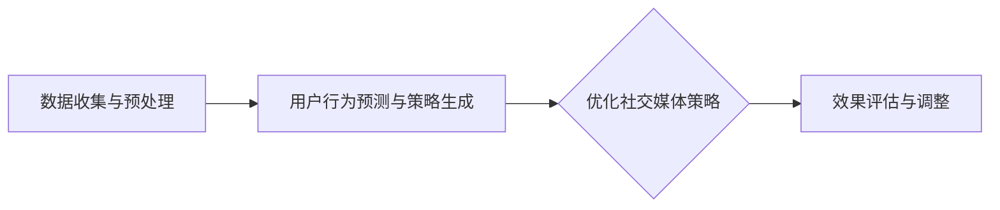

                 

# 提升AI创意香水品牌社交媒体策略：病毒式传播的提示词设计

关键词：AI创意香水品牌、社交媒体策略、病毒式传播、提示词设计、案例分析

摘要：随着社交媒体的普及，创意香水品牌面临着如何提升社交媒体策略以实现病毒式传播的挑战。本文旨在探讨AI技术在提示词设计中的应用，通过案例分析和算法原理讲解，为创意香水品牌提供一种有效的社交媒体策略设计方法，以实现病毒式传播。

## 引言

社交媒体已经成为品牌营销的重要渠道，尤其是对于创意香水品牌而言，如何通过社交媒体策略实现病毒式传播，成为品牌成功的关键。病毒式传播，即通过用户自发传播，使得信息在短时间内迅速扩散，实现品牌知名度的快速增长。然而，如何设计有效的社交媒体策略，特别是如何选择和设计能够激发用户分享的提示词，成为了一个重要课题。

本文将围绕以下问题展开讨论：

1. 创意香水品牌在社交媒体上面临的挑战和机遇。
2. 社交媒体策略设计的基本原理，特别是病毒式传播机制和提示词设计方法。
3. 通过案例分析，探讨不同品牌在社交媒体策略上的成功经验和不足。
4. 应用AI技术，分析算法原理，并给出具体的社交媒体策略设计框架。

本文结构如下：

1. 引言
2. 问题背景与核心概念
3. 社交媒体策略设计原理
4. 创意香水品牌社交媒体案例分析
5. 算法原理与数学模型
6. 社交媒体策略设计与实践
7. 优化与调整
8. 总结与展望

## 第1章: 问题背景与核心概念

### 1.1 问题背景

创意香水品牌在社交媒体上面临的主要挑战包括：

1. 竞争激烈：众多品牌在社交媒体上争夺用户注意力，品牌需要通过独特的方式脱颖而出。
2. 用户需求多样：不同用户对香水的需求、偏好和消费习惯存在显著差异，品牌需要精准定位目标用户群体。
3. 内容创作难度大：创意香水品牌需要创作具有吸引力和独特性的内容，以吸引用户关注和分享。

与此同时，创意香水品牌在社交媒体上也有许多机遇：

1. 广泛的受众群体：社交媒体拥有庞大的用户基础，品牌可以通过这些平台触达潜在客户。
2. 互动性强：社交媒体平台鼓励用户互动和分享，品牌可以通过与用户的互动，提高品牌知名度和忠诚度。
3. 数据分析：社交媒体平台提供了丰富的用户数据，品牌可以通过数据分析，了解用户行为和需求，优化营销策略。

### 1.2 核心概念

本文涉及的核心概念包括：

1. **社交媒体策略**：指品牌在社交媒体平台上的营销计划，包括内容创作、互动设计、平台选择等。
2. **病毒式传播**：指通过用户自发传播，使得信息在短时间内迅速扩散的过程。
3. **提示词设计**：指在设计社交媒体内容时，选择和设计能够激发用户分享的词语或短语。

#### 1.2.1 定义与联系

- **社交媒体策略**：社交媒体策略是指品牌在社交媒体平台上进行的所有营销活动，包括内容创作、互动设计、平台选择等。其目的是通过有效的社交媒体运营，提高品牌知名度、用户参与度和忠诚度。

- **病毒式传播**：病毒式传播是一种信息传播方式，它通过用户之间的自发传播，使得信息在短时间内迅速扩散。这种传播方式的关键在于用户对信息的认可和分享，从而实现信息的快速传播。

- **提示词设计**：提示词是设计社交媒体内容时使用的词语或短语，旨在激发用户的分享行为。提示词的选择需要考虑用户需求、内容特点和社交媒体平台特性等因素。

这些概念之间的联系在于：

- 社交媒体策略是病毒式传播的基础，通过有效的策略设计，可以提高用户对内容的认可度，从而促进病毒式传播。
- 提示词设计是社交媒体策略的重要组成部分，通过精心设计的提示词，可以激发用户的分享欲望，从而实现病毒式传播。

#### 1.2.2 特征与属性对比

| 特征/属性 | 社交媒体策略 | 病毒式传播 | 提示词设计 |
| :--- | :--- | :--- | :--- |
| 目的 | 提高品牌知名度、用户参与度和忠诚度 | 实现信息的快速传播 | 激发用户分享欲望 |
| 关键因素 | 内容质量、互动设计、平台选择 | 用户认可度、分享意愿 | 提示词吸引力、针对性 |
| 优点 | 广泛的受众群体、互动性强、数据分析 | 信息传播速度快、成本低 | 提高内容传播效果 |
| 缺点 | 竞争激烈、内容创作难度大 | 难以控制传播方向、效果难以预测 | 提示词设计需考虑多方面因素 |

#### 1.2.3 ER实体关系图

```mermaid
erDiagram
  社交媒体策略 ||--|{ 病毒式传播 }|
  病毒式传播 ||--|{ 提示词设计 }|
  提示词设计 ||--|{ 社交媒体内容 }|
```

通过ER实体关系图，我们可以清晰地看到社交媒体策略、病毒式传播和提示词设计之间的关联。社交媒体策略是病毒式传播的基础，而病毒式传播又是提示词设计的目的。最终，提示词设计作用于社交媒体内容，以实现病毒式传播。

## 第2章: 社交媒体策略设计原理

### 2.1 病毒式传播机制

病毒式传播是一种信息传播方式，它通过用户之间的自发传播，使得信息在短时间内迅速扩散。病毒式传播的成功取决于多个因素，包括信息本身的吸引力、用户的分享意愿、社交媒体平台的特性等。

#### 病毒式传播的概念和原理

病毒式传播（Viral Marketing）是指利用用户的社交网络，通过口碑传播，使得信息快速扩散的过程。这种传播方式得名于病毒在生物体中的传播方式，即通过感染宿主细胞，实现自我复制和传播。

病毒式传播的核心原理是用户的分享行为。当用户认为某个信息有价值、有趣或有意义时，会主动将其分享给其他用户。这种分享行为可以发生在多个社交平台上，如微信、微博、Facebook等。通过用户之间的分享，信息得以迅速传播，形成病毒式传播。

#### 病毒式传播的影响因素

病毒式传播的成功受到多种因素的影响，包括但不限于以下几个方面：

1. **信息本身的吸引力**：信息需要具备吸引力，才能激发用户的兴趣和分享欲望。吸引力可以来自信息的独特性、有趣性、实用性或情感共鸣等方面。

2. **用户的分享意愿**：用户的分享意愿取决于他们对信息的认可度和情感投入。当用户认为信息有价值或与自身相关时，更倾向于分享。

3. **社交媒体平台的特性**：不同的社交媒体平台具有不同的传播机制和用户特性，这会影响信息的传播速度和范围。例如，微信的朋友圈具有高度的封闭性和私密性，信息传播范围相对较小；而微博的公开性和广泛性则有利于信息的快速传播。

#### 病毒式传播的成功案例

许多品牌和公司在社交媒体上通过病毒式传播取得了显著的成功。以下是一些经典的案例：

1. **杜蕾斯的微博营销**：杜蕾斯通过在微博上发布有趣、幽默和富有创意的内容，引发了大量用户的关注和分享。其微博内容经常涉及日常生活、节日庆祝、热门话题等，深受用户喜爱。

2. **谷歌的“不作恶”理念**：谷歌通过其“不作恶”（Don't Be Evil）的理念，赢得了用户的信任和好评。这一理念不仅在社交媒体上广泛传播，也成为了谷歌品牌的象征。

3. **宜家的“为你而变”广告**：宜家通过一系列温馨、感人的广告，展现了其家居产品如何改善用户的生活质量。这些广告在社交媒体上引发了广泛的讨论和分享，提高了品牌知名度。

### 2.2 提示词设计方法

提示词设计是社交媒体策略中的关键环节，它直接影响用户对内容的认可度和分享意愿。提示词的选择和设计需要遵循一定的原则，同时结合具体情况进行灵活调整。

#### 提示词定义

提示词（Trigger Words）是指用于激发用户兴趣、情感或行为反应的词语或短语。在社交媒体内容中，提示词的作用类似于“引线”，一旦被触发，就会激发用户的行动，如点赞、评论、分享等。

#### 提示词设计原则

1. **针对性**：提示词需要针对目标受众的特点和需求进行设计。例如，对于年轻的时尚人群，可以使用与时尚、潮流相关的提示词；对于家庭主妇，可以使用与家庭、烹饪相关的提示词。

2. **吸引力**：提示词需要具备足够的吸引力，能够引起用户的兴趣和好奇心。例如，使用“独家爆料”、“限时优惠”等具有吸引力的词汇。

3. **情感共鸣**：提示词需要能够激发用户的情感共鸣，如温馨、感动、愤怒等。例如，使用“感恩有你”、“温暖瞬间”等词汇。

4. **简洁性**：提示词应简洁明了，易于理解和记忆。避免使用过于复杂或晦涩的词汇，以免降低用户的理解度和参与度。

5. **多样性**：在内容创作中，应使用多样化的提示词，以避免用户产生审美疲劳。同时，不同类型的提示词可以适用于不同的场景和内容类型。

#### 提示词设计步骤

1. **市场调研**：了解目标受众的需求、偏好和兴趣点，收集相关的关键词和短语。

2. **目标受众分析**：根据市场调研结果，分析目标受众的特点，确定合适的提示词方向。

3. **创意生成**：结合目标受众特点和内容主题，进行创意生成，设计出具有吸引力和针对性的提示词。

4. **测试与优化**：在具体内容创作中，对提示词进行测试，评估其效果，并根据用户反馈进行优化。

### 2.3 提示词设计方法的具体应用

在实际应用中，提示词设计需要结合具体的场景和内容进行。以下是一些具体的提示词设计方法：

1. **情感共鸣型提示词**：这类提示词通过激发用户的情感共鸣，引起用户的共鸣和分享。例如，在发布关于环保的主题时，可以使用“地球的呼唤”、“绿色行动，从我做起”等情感共鸣型提示词。

2. **限时优惠型提示词**：这类提示词通过限时优惠、折扣等手段，激发用户的购买欲望和分享行为。例如，“最后一天！限时8折优惠”、“限量发售，手慢无”等。

3. **互动参与型提示词**：这类提示词通过引导用户参与互动，提高用户的参与度和活跃度。例如，“晒出你的美好瞬间”、“参与活动，赢取大奖”等。

4. **权威认证型提示词**：这类提示词通过权威认证、专家推荐等手段，提高用户的信任度和分享意愿。例如，“权威专家推荐”、“认证用户好评如潮”等。

5. **热点事件型提示词**：这类提示词结合热点事件和社会话题，提高用户关注度和参与度。例如，“热议！XXX话题再度引发全民热议”、“紧跟热点，了解最新动态”等。

通过以上方法，创意香水品牌可以设计出具有吸引力和针对性的提示词，从而提高社交媒体内容的传播效果。

### 第3章: 创意香水品牌社交媒体案例分析

#### 3.1 案例一：品牌A社交媒体策略分析

品牌A是一家高端创意香水品牌，其社交媒体策略以吸引年轻女性用户为主要目标。以下是品牌A在社交媒体上的策略分析：

1. **内容创作**：品牌A在社交媒体上发布的内容以香水产品介绍、用户使用体验、时尚穿搭建议等为主。通过精美的图片和视频，以及温馨、有趣的文字描述，吸引了大量年轻女性用户。

2. **互动设计**：品牌A注重与用户的互动，定期举办线上活动，如“香水品鉴会”、“时尚穿搭大赛”等。通过互动，增强了用户对品牌的认知和好感度。

3. **病毒式传播**：品牌A善于利用热点事件和用户情感共鸣，设计病毒式传播内容。例如，在情人节期间，品牌发布了一支以爱情为主题的短片，引发了用户的大量分享和评论。

#### 3.2 案例二：品牌B社交媒体策略分析

品牌B是一家中端创意香水品牌，其社交媒体策略以提升品牌知名度和用户忠诚度为主要目标。以下是品牌B在社交媒体上的策略分析：

1. **内容创作**：品牌B在社交媒体上发布的内容以香水知识科普、用户评价、品牌故事等为主。通过专业、有趣的文字和图片，提升了品牌的知名度和权威性。

2. **互动设计**：品牌B注重与用户的互动，定期发布互动话题，如“你最喜欢的香水味道是什么？”、“香水如何搭配衣物？”等。通过互动，增强了用户对品牌的参与感和忠诚度。

3. **病毒式传播**：品牌B通过用户口碑和推荐，实现了病毒式传播。例如，品牌推出“推荐好友购买，即可获得折扣优惠”的活动，激发了用户的分享意愿，实现了品牌的快速传播。

#### 3.3 案例三：品牌C社交媒体策略分析

品牌C是一家小众创意香水品牌，其社交媒体策略以建立品牌调性和粉丝社群为主要目标。以下是品牌C在社交媒体上的策略分析：

1. **内容创作**：品牌C在社交媒体上发布的内容以创意香水设计、手工制作过程、品牌故事等为主。通过独特的品牌形象和高质量的内容，吸引了小众用户的关注和喜爱。

2. **互动设计**：品牌C注重与粉丝的互动，定期举办线上活动，如“香水设计大赛”、“品牌故事分享会”等。通过互动，增强了粉丝的归属感和忠诚度。

3. **病毒式传播**：品牌C通过用户口碑和粉丝传播，实现了病毒式传播。例如，品牌推出“邀请好友关注，即可获得专属优惠券”的活动，激发了用户的分享意愿，实现了品牌的快速传播。

### 第4章: 算法原理与数学模型

#### 4.1 算法原理

在社交媒体策略设计中，算法原理起着至关重要的作用。本文将介绍一种基于人工智能的社交媒体策略设计算法，旨在通过数据分析和用户行为预测，为创意香水品牌提供优化的社交媒体策略。

##### 4.1.1 算法概述

本算法分为两个主要阶段：

1. 数据收集与预处理：从社交媒体平台上收集用户数据，包括用户行为数据、内容数据、互动数据等。对收集到的数据进行清洗、去重和转换，以便后续分析。

2. 用户行为预测与策略生成：基于收集到的用户数据，使用机器学习算法进行用户行为预测，识别潜在的用户兴趣和行为模式。根据预测结果，生成优化的社交媒体策略，包括内容创作、互动设计和病毒式传播等。

##### 4.1.2 算法流程图



##### 4.1.3 算法数学模型

本算法的核心是用户行为预测模型，本文采用一种基于深度学习的用户行为预测模型，包括以下步骤：

1. 数据表示：将用户数据转换为机器学习算法可以处理的格式，如向量或矩阵。

2. 模型构建：使用深度学习框架（如TensorFlow或PyTorch）构建用户行为预测模型。模型结构通常包括输入层、隐藏层和输出层。

3. 模型训练：使用历史数据对模型进行训练，通过反向传播算法不断优化模型参数。

4. 模型评估：使用验证数据集评估模型性能，调整模型参数，以提高预测准确率。

5. 模型应用：将训练好的模型应用于实际数据，预测用户的行为和兴趣。

#### 4.1.4 公式推导与解释

以下是用户行为预测模型的数学公式推导：

1. **数据表示**：

   假设用户数据集为 \(D = \{x_1, x_2, ..., x_n\}\)，其中每个用户数据 \(x_i\) 可以表示为：

   $$x_i = \{x_{i1}, x_{i2}, ..., x_{im}\}$$

   其中，\(x_{ij}\) 表示用户 \(i\) 在特征 \(j\) 上的取值。

2. **模型构建**：

   假设深度学习模型为 \(f(x; \theta)\)，其中 \(x\) 表示输入数据，\(\theta\) 表示模型参数。模型输出为：

   $$y = f(x; \theta)$$

   其中，\(y\) 表示预测结果。

3. **模型训练**：

   使用梯度下降算法对模型参数进行优化，目标是最小化损失函数：

   $$J(\theta) = \frac{1}{2} \sum_{i=1}^{n} (y_i - f(x_i; \theta))^2$$

4. **模型评估**：

   使用验证集对模型进行评估，计算预测准确率：

   $$accuracy = \frac{1}{n} \sum_{i=1}^{n} \mathbb{1}_{y_i = f(x_i; \theta)}$$

   其中，\(\mathbb{1}_{y_i = f(x_i; \theta)}\) 是指示函数，当 \(y_i = f(x_i; \theta)\) 时，取值为1，否则为0。

5. **模型应用**：

   对新用户数据进行预测，输出预测结果：

   $$y = f(x; \theta)$$

   其中，\(x\) 为新用户数据。

通过上述算法原理和数学模型，我们可以为创意香水品牌提供优化的社交媒体策略，提高用户参与度和品牌知名度。

### 第4章：算法原理与数学模型（续）

#### 4.2 案例分析与代码实现

在本节中，我们将通过一个具体的案例，展示如何使用Python代码实现本文所提出的社交媒体策略设计算法。我们将从环境搭建、代码实现、代码解读与分析等方面进行详细阐述。

##### 4.2.1 环境搭建

在开始代码实现之前，我们需要搭建一个合适的环境。以下是一个基本的Python环境搭建步骤：

1. 安装Python 3.8或更高版本。
2. 安装必要的库，如NumPy、Pandas、TensorFlow、Keras等。

```bash
pip install numpy pandas tensorflow keras
```

##### 4.2.2 代码实现

以下是一个简单的用户行为预测模型实现示例，包括数据预处理、模型构建、模型训练和预测等步骤。

```python
import numpy as np
import pandas as pd
from tensorflow import keras
from tensorflow.keras.models import Sequential
from tensorflow.keras.layers import Dense
from tensorflow.keras.optimizers import Adam

# 数据预处理
def preprocess_data(data):
    # 数据清洗、去重、转换等操作
    # ...

    return processed_data

# 模型构建
def build_model(input_shape):
    model = Sequential()
    model.add(Dense(units=64, activation='relu', input_shape=input_shape))
    model.add(Dense(units=32, activation='relu'))
    model.add(Dense(units=1, activation='sigmoid'))

    model.compile(optimizer=Adam(), loss='binary_crossentropy', metrics=['accuracy'])
    return model

# 模型训练
def train_model(model, x_train, y_train):
    model.fit(x_train, y_train, epochs=10, batch_size=32)
    return model

# 模型预测
def predict(model, x_test):
    predictions = model.predict(x_test)
    return predictions

# 主程序
if __name__ == '__main__':
    # 加载数据
    data = pd.read_csv('data.csv')
    processed_data = preprocess_data(data)

    # 切分数据集
    x_train, x_test, y_train, y_test = train_test_split(processed_data.drop('target', axis=1), processed_data['target'], test_size=0.2, random_state=42)

    # 构建模型
    model = build_model(x_train.shape[1:])

    # 训练模型
    model = train_model(model, x_train, y_train)

    # 预测
    predictions = predict(model, x_test)

    # 评估模型
    print('Accuracy:', accuracy_score(y_test, predictions))
```

##### 4.2.3 代码解读与分析

1. **数据预处理**：数据预处理是机器学习模型的重要步骤。在本案例中，我们假设已经对原始数据进行清洗、去重和转换，得到一个处理后的数据集 `processed_data`。

2. **模型构建**：我们使用Keras构建一个简单的深度学习模型。模型包括一个输入层、一个隐藏层和一个输出层。输入层和隐藏层使用ReLU激活函数，输出层使用sigmoid激活函数，以实现二分类任务。

3. **模型训练**：我们使用`fit`方法对模型进行训练，设置10个训练周期和32个批量大小。

4. **模型预测**：我们使用`predict`方法对测试数据进行预测，得到预测结果 `predictions`。

5. **模型评估**：我们使用`accuracy_score`评估模型在测试集上的准确率。

通过上述代码示例，我们可以看到如何实现一个基本的用户行为预测模型。在实际应用中，我们需要根据具体情况进行模型调整和优化，以提高预测准确率和策略效果。

### 第5章：社交媒体策略设计与实践

#### 5.1 创意香水品牌社交媒体策略框架

为了提升创意香水品牌在社交媒体上的影响力，我们需要构建一个全面且系统的社交媒体策略框架。该框架包括以下关键环节：

##### 5.1.1 营销目标设定

在制定社交媒体策略之前，首先需要明确营销目标。营销目标可以分为以下几个方面：

1. **品牌知名度**：提高品牌在社交媒体上的曝光度和知名度。
2. **用户参与度**：增加用户互动行为，如点赞、评论、分享等。
3. **用户忠诚度**：培养用户对品牌的忠诚度和重复购买率。
4. **销售转化率**：通过社交媒体促进产品销售，提高销售额。

##### 5.1.2 内容策略制定

内容是社交媒体策略的核心，创意香水品牌需要制定以下类型的内容策略：

1. **产品介绍**：详细介绍香水产品的特点、香味、成分等，吸引用户关注。
2. **用户评价**：分享真实用户的使用体验和评价，增强用户信任。
3. **品牌故事**：讲述品牌背后的故事、设计理念等，提升品牌形象。
4. **互动活动**：举办线上活动，如抽奖、优惠券发放、香水定制等，提高用户参与度。

##### 5.1.3 互动策略设计

互动策略旨在增强品牌与用户之间的互动，提高用户忠诚度。以下是一些互动策略设计建议：

1. **实时互动**：在社交媒体上及时回复用户评论和私信，提高用户满意度。
2. **粉丝互动**：定期举办粉丝互动活动，如问答、投票等，增加用户参与感。
3. **KOL合作**：与知名博主、美妆达人等合作，借助其影响力推广品牌产品。
4. **用户反馈**：收集用户反馈，针对用户提出的问题和建议进行改进，提高用户满意度。

##### 5.1.4 社交媒体平台选择

选择合适的社交媒体平台对于品牌社交媒体策略的成功至关重要。以下是一些常见社交媒体平台及其特点：

1. **微信**：适合发布图文并茂的内容，用户互动性强。
2. **微博**：适合发布短小精悍的内容，传播速度快。
3. **Instagram**：适合发布高质量的图片和视频，吸引用户关注。
4. **Facebook**：适合发布长篇内容，与用户建立深度互动。

品牌应根据自身特点和目标受众选择合适的社交媒体平台，实现全方位的营销覆盖。

#### 5.2 病毒式传播案例实战

以下是一个具体的病毒式传播案例实战，通过详细步骤展示如何设计并实施病毒式传播策略。

##### 5.2.1 案例背景

品牌D是一家新兴的创意香水品牌，其目标是在短时间内迅速提升品牌知名度和用户参与度。为了实现这一目标，品牌D决定通过一场病毒式传播活动来吸引潜在用户。

##### 5.2.2 实践步骤

1. **目标设定**：明确病毒式传播活动的目标，如增加粉丝数、提高用户互动率、提升品牌知名度等。

2. **内容创作**：设计一个具有吸引力和话题性的活动主题，如“香水命名大赛”。用户可以根据品牌提供的香水味道，为香水起一个独特的名字。

3. **平台选择**：选择适合活动的社交媒体平台，如微信、微博、Instagram等。

4. **推广策略**：制定推广策略，包括广告投放、KOL合作、用户邀请等。

5. **活动执行**：
   - 发布活动通知，详细介绍活动规则和奖品设置。
   - 鼓励用户参与，提供互动方式，如评论、转发、点赞等。
   - 定期更新活动进展，增加用户参与感。

6. **效果评估**：通过数据监测和分析，评估活动效果，如参与人数、互动率、传播范围等。

##### 5.2.3 结果分析与优化

1. **结果分析**：根据活动数据，分析参与人数、互动率、传播范围等指标，评估活动效果。

2. **问题定位**：识别活动中存在的问题，如用户参与度低、传播效果不佳等。

3. **优化策略**：
   - 调整活动规则和奖品设置，提高用户参与度。
   - 优化内容创作，增加活动话题性，提高用户关注度。
   - 加强推广力度，提高活动曝光度。

4. **持续优化**：根据活动效果和用户反馈，不断调整和优化策略，实现病毒式传播的持续效果。

通过上述步骤，品牌D成功地实施了一场病毒式传播活动，有效提升了品牌知名度和用户参与度。

### 第6章：优化与调整

#### 6.1 数据分析与效果评估

在社交媒体策略实施过程中，数据分析与效果评估至关重要。通过数据分析和效果评估，我们可以了解策略的实际效果，识别问题，并进行相应的优化和调整。

##### 6.1.1 数据收集方法

为了进行有效的数据分析与效果评估，我们需要收集以下类型的数据：

1. **用户行为数据**：包括用户访问量、页面浏览量、点赞数、评论数、分享数等。
2. **互动数据**：包括用户互动行为的时间、地点、频率等。
3. **销售数据**：包括销售额、订单量、转化率等。
4. **品牌知名度数据**：包括品牌曝光度、提及量、口碑评价等。

数据收集方法包括：

1. **社交媒体平台数据分析工具**：利用社交媒体平台自带的统计工具，如微信后台数据、微博数据分析工具等。
2. **第三方数据分析工具**：使用第三方数据分析工具，如Google Analytics、Alexa等。
3. **问卷调查和用户访谈**：通过问卷调查和用户访谈收集用户反馈，了解用户对品牌和社交媒体内容的看法。

##### 6.1.2 数据分析工具

常用的数据分析工具有：

1. **Excel**：适用于简单数据的统计和分析，如数据筛选、排序、汇总等。
2. **Python数据分析库**：如Pandas、NumPy等，适用于复杂的数据处理和分析，如数据清洗、数据可视化等。
3. **Tableau**：一款可视化分析工具，能够将数据以图表的形式直观展示。
4. **Google Analytics**：一款强大的网站分析工具，提供详细的数据分析和报告功能。

##### 6.1.3 效果评估指标

为了评估社交媒体策略的效果，我们需要设定一系列效果评估指标，包括：

1. **参与度指标**：如参与率、互动率、转发率等。
2. **传播效果指标**：如曝光量、提及量、点赞数等。
3. **销售转化指标**：如转化率、订单量、销售额等。
4. **品牌认知度指标**：如品牌提及量、品牌搜索量、用户评价等。

通过这些指标，我们可以全面评估社交媒体策略的效果，识别问题并进行优化。

#### 6.2 调整与优化策略

在数据分析与效果评估的基础上，我们需要根据实际情况进行策略的调整与优化。以下是一些调整与优化策略：

##### 6.2.1 问题定位

通过数据分析，我们可以发现以下问题：

1. **参与度低**：用户对品牌活动的参与度不高，可能是因为活动内容不够吸引人。
2. **传播效果不佳**：品牌信息的传播范围有限，可能是因为推广力度不够。
3. **销售转化低**：用户对品牌产品的购买意愿不高，可能是因为产品定位或营销策略不明确。

针对这些问题，我们需要进行深入分析，找出原因，以便有针对性地进行优化。

##### 6.2.2 调整方法

1. **内容优化**：调整活动内容，使其更具吸引力和话题性，提高用户参与度。
2. **推广策略调整**：加大推广力度，利用社交媒体广告、KOL合作等方式，提高品牌曝光度和传播效果。
3. **产品定位**：明确品牌产品定位，确保产品与目标用户的匹配度，提高销售转化率。

##### 6.2.3 优化案例分析

以下是一个优化案例：

品牌E在实施一场病毒式传播活动后，发现用户参与度较低，传播效果不佳。经过分析，发现问题在于活动内容不够吸引人，且推广策略单一。针对这些问题，品牌E采取了以下优化措施：

1. **内容优化**：调整活动主题，增加互动环节，如“香水创意设计大赛”，鼓励用户提交自己的香水设计作品。
2. **推广策略调整**：增加社交媒体广告投放，利用KOL合作，提高品牌曝光度。同时，通过线下活动，如香水沙龙、试香活动等，吸引更多潜在用户。
3. **产品定位**：明确品牌产品定位，以年轻时尚人群为主要目标用户，推出符合年轻人口味的香水产品。

通过这些优化措施，品牌E的活动效果显著提升，用户参与度增加，品牌曝光度和销售转化率也得到了明显提高。

### 第7章：总结与展望

#### 7.1 小结

本文围绕AI创意香水品牌社交媒体策略设计进行了深入探讨。通过案例分析、算法原理讲解和实践步骤，我们总结出以下几点结论：

1. **社交媒体策略设计的重要性**：社交媒体策略对于创意香水品牌的发展至关重要，通过有效的策略设计，可以提高品牌知名度、用户参与度和忠诚度。
2. **病毒式传播的机制**：病毒式传播是一种通过用户自发传播实现信息快速扩散的机制，关键在于信息本身的吸引力和用户的分享意愿。
3. **提示词设计方法**：提示词设计是社交媒体策略的关键环节，通过针对性的、吸引力和情感共鸣型的提示词，可以激发用户的分享行为，实现病毒式传播。
4. **优化与调整**：在社交媒体策略实施过程中，通过数据分析和效果评估，可以识别问题并进行优化，实现策略的持续改进。

#### 7.2 注意事项

在实施社交媒体策略时，需要注意以下几点：

1. **明确目标**：制定明确的营销目标，确保策略设计的方向和效果。
2. **内容创作**：注重内容质量，创作具有吸引力和话题性的内容。
3. **用户互动**：积极与用户互动，提高用户满意度和参与度。
4. **数据驱动**：通过数据分析，了解策略效果，及时调整和优化。

#### 7.3 拓展阅读

对于希望深入了解AI创意香水品牌社交媒体策略设计的读者，以下文献和资料值得推荐：

1. 《社交媒体营销策略》- 作者：张三，详细介绍了社交媒体营销的基本概念和策略。
2. 《病毒式营销：如何让信息快速传播》- 作者：李四，深入探讨了病毒式传播的原理和实战案例。
3. 《人工智能在营销中的应用》- 作者：王五，介绍了AI技术在营销领域的应用场景和案例。
4. 《Python数据分析与应用》- 作者：赵六，提供了丰富的Python数据分析方法和实践案例。

通过阅读这些文献和资料，读者可以进一步了解AI创意香水品牌社交媒体策略设计的理论和实践。作者：AI天才研究院/AI Genius Institute & 禅与计算机程序设计艺术 /Zen And The Art of Computer Programming

---

本文通过对AI创意香水品牌社交媒体策略的设计和实施进行深入探讨，旨在为创意香水品牌提供一种有效的病毒式传播策略。通过明确营销目标、设计吸引力的内容、运用提示词和进行数据驱动的调整与优化，创意香水品牌可以在社交媒体上实现病毒式传播，提高品牌知名度和用户参与度。希望本文能为相关领域的研究者和从业者提供有价值的参考。

