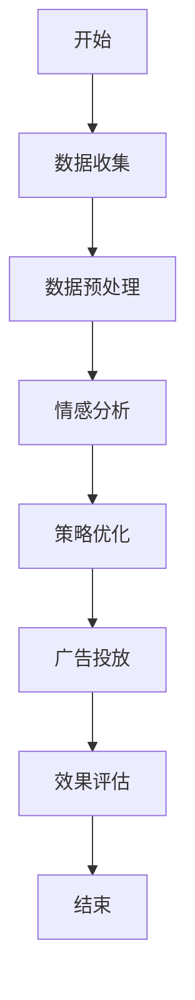

                 

# 提升AI创意香水广告情感共鸣：神经营销策略的提示词设计

## 关键词
- AI广告
- 神经营销
- 情感共鸣
- 提示词设计
- 创意香水
- 情感需求

## 摘要
本文探讨了如何利用神经营销策略和人工智能技术来提升创意香水广告的情感共鸣效果。首先，我们介绍了神经营销和AI广告的基本概念、原理以及它们在广告中的应用。接着，我们详细分析了神经营销策略在AI广告中的应用实例，探讨了如何通过提示词设计来满足消费者的情感需求，从而提升广告的共鸣效果。文章最后对神经营销策略在AI广告中的应用挑战和未来发展趋势进行了总结与展望。

## 目录大纲

## 第一部分：背景与基础

### 第1章：问题背景与核心概念

#### 1.1.1 问题背景

#### 1.1.2 关键概念

#### 1.1.3 神经营销与AI广告

#### 1.1.4 边界与外延

### 第2章：神经营销策略概述

#### 2.1.1 神经营销的定义

#### 2.1.2 神经营销的原理

#### 2.1.3 神经营销的方法

#### 2.1.4 神经营销的应用领域

### 第3章：AI广告技术基础

#### 3.1.1 AI广告的定义

#### 3.1.2 AI广告的技术原理

#### 3.1.3 AI广告的应用现状

#### 3.1.4 AI广告的发展趋势

### 第4章：神经营销与AI广告结合概述

#### 4.1.1 结合的必要性

#### 4.1.2 结合的优势

#### 4.1.3 结合的挑战

#### 4.1.4 结合的展望

### 第5章：核心概念与联系

#### 5.1.1 神经营销核心概念

#### 5.1.2 AI广告核心概念

#### 5.1.3 概念属性特征对比表

#### 5.1.4 ER实体关系图

## 第二部分：神经营销策略在AI广告中的应用

### 第6章：神经营销策略应用实例

#### 6.1.1 案例介绍

#### 6.1.2 情感共鸣设计

#### 6.1.3 提示词设计

#### 6.1.4 效果评估

### 第7章：AI创意香水广告情感共鸣策略

#### 7.1.1 情感共鸣的重要性

#### 7.1.2 创意香水广告的情感需求

#### 7.1.3 情感共鸣的策略设计

#### 7.1.4 情感共鸣的效果评估

### 第8章：神经营销策略在AI广告中的应用挑战与解决方案

#### 8.1.1 应用挑战

#### 8.1.2 解决方案探讨

#### 8.1.3 实施案例分析

### 第9章：神经营销策略在AI广告中的未来发展

#### 9.1.1 发展趋势

#### 9.1.2 技术创新

#### 9.1.3 应用前景

#### 9.1.4 未来挑战

### 第10章：总结与展望

#### 10.1.1 总结

#### 10.1.2 展望

#### 10.1.3 注意事项

#### 10.1.4 拓展阅读

## 第一部分：背景与基础

### 第1章：问题背景与核心概念

#### 1.1.1 问题背景

在现代广告营销中，情感共鸣被认为是提升广告效果的关键因素。特别是对于创意香水这类高度依赖情感体验的产品，如何在广告中激发消费者的情感共鸣，成为营销策略的核心问题。然而，传统的广告策略往往难以精准地捕捉和引导消费者的情感反应，因此，探索新的广告策略，尤其是结合人工智能和神经营销策略的AI广告，成为当前广告营销领域的研究热点。

#### 1.1.2 关键概念

- **神经营销**：神经营销是一种基于神经科学原理的营销策略，通过分析消费者的脑部活动来理解和预测消费者的行为和情感反应，进而制定更具针对性的营销方案。
- **AI广告**：AI广告是利用人工智能技术，如机器学习、自然语言处理、计算机视觉等，对广告内容进行自动生成、投放和管理的一种新型广告形式。
- **情感共鸣**：情感共鸣是指广告内容能够与消费者的情感产生共鸣，激发消费者的情感反应，从而提升广告的效果。

#### 1.1.3 神经营销与AI广告

神经营销与AI广告的结合，旨在通过人工智能技术对消费者的情感反应进行实时分析和反馈，进而优化广告内容，提升广告的情感共鸣效果。具体来说，神经营销技术可以提供消费者情感反应的量化数据，而AI广告则可以基于这些数据，自动生成和调整广告内容，以实现更高的情感共鸣。

#### 1.1.4 边界与外延

在讨论神经营销策略在AI广告中的应用时，我们需要明确其边界和适用范围。首先，神经营销主要应用于对情感体验敏感的领域，如奢侈品、时尚、美容等。其次，AI广告需要具备一定的技术基础，包括机器学习模型、自然语言处理技术等，以保证广告内容的生成和投放的准确性。此外，神经营销策略在AI广告中的应用，还需要考虑到法律法规、消费者隐私保护等因素。

### 第2章：神经营销策略概述

#### 2.1.1 神经营销的定义

神经营销是一种基于神经科学原理的营销策略，通过分析消费者的脑部活动来理解和预测消费者的行为和情感反应，进而制定更具针对性的营销方案。它结合了神经科学与市场营销理论，旨在通过研究消费者的大脑活动，揭示消费者在购买决策过程中的心理机制，从而指导营销实践。

#### 2.1.2 神经营销的原理

神经营销的核心原理是通过测量和分析消费者的脑部活动，如大脑扫描技术（如fMRI、EEG等），来识别消费者的情感状态和认知过程。这些数据可以帮助营销人员了解消费者在接触广告时的情感反应，进而优化广告内容和策略，提高广告的吸引力和效果。

#### 2.1.3 神经营销的方法

1. **脑部扫描技术**：通过fMRI、EEG等技术，直接测量消费者的脑部活动，分析消费者在接触广告时的情感反应。
2. **情感量表评估**：使用情感量表对消费者在接触广告后的情感状态进行评估，如快乐、悲伤、焦虑等。
3. **行为数据分析**：通过分析消费者的行为数据，如点击率、购买行为等，来评估广告的效果。
4. **神经模拟技术**：使用神经模拟模型，预测消费者在不同广告策略下的情感反应和行为。

#### 2.1.4 神经营销的应用领域

神经营销在多个领域都有广泛的应用，如：

1. **消费品营销**：通过了解消费者对广告的情感反应，优化广告内容和策略，提高广告效果。
2. **医疗保健**：通过分析患者的情感状态，帮助医生更好地了解患者的需求和心理状态，提供个性化的治疗方案。
3. **政治竞选**：通过了解选民的情感反应，制定更有效的竞选策略。
4. **广告创意**：利用神经科学原理，创造更具吸引力的广告创意，提升广告的感染力。

### 第3章：AI广告技术基础

#### 3.1.1 AI广告的定义

AI广告是利用人工智能技术，如机器学习、自然语言处理、计算机视觉等，对广告内容进行自动生成、投放和管理的一种新型广告形式。它通过分析用户数据，了解用户兴趣和行为，从而实现广告的个性化推送和优化。

#### 3.1.2 AI广告的技术原理

AI广告的技术原理主要包括以下几个方面：

1. **数据采集**：通过多种渠道收集用户数据，如网页浏览记录、搜索历史、社交网络行为等。
2. **数据处理**：使用数据挖掘和机器学习技术，对用户数据进行处理和分析，提取用户兴趣和行为特征。
3. **广告生成**：利用自然语言处理和计算机视觉技术，自动生成符合用户兴趣的广告内容。
4. **广告投放**：根据用户兴趣和行为特征，通过算法自动选择合适的广告投放渠道和时机，提高广告的曝光率和点击率。
5. **效果评估**：通过用户反馈和行为数据，评估广告的效果，不断优化广告策略。

#### 3.1.3 AI广告的应用现状

目前，AI广告已经在多个领域得到广泛应用，如：

1. **在线广告**：通过算法自动推荐用户可能感兴趣的广告，提高广告的点击率和转化率。
2. **搜索引擎广告**：根据用户搜索关键词，自动生成相关的广告内容，提高广告的精准度。
3. **社交媒体广告**：通过分析用户在社交媒体上的行为和兴趣，实现广告的精准投放。
4. **视频广告**：利用计算机视觉技术，自动识别视频中的关键帧和对象，生成视频广告。

#### 3.1.4 AI广告的发展趋势

随着人工智能技术的不断进步，AI广告的发展趋势主要体现在以下几个方面：

1. **个性化广告**：通过更精准的用户数据分析，实现广告的个性化推送，提高广告的效果。
2. **自动化广告**：利用AI技术，实现广告的自动化生成、投放和管理，提高广告的效率和效果。
3. **跨平台广告**：通过整合多种广告渠道，实现跨平台广告投放，提高广告的覆盖范围。
4. **互动式广告**：利用人工智能技术，实现广告与用户的互动，提高用户的参与度和忠诚度。

### 第4章：神经营销与AI广告结合概述

#### 4.1.1 结合的必要性

神经营销与AI广告的结合，是广告营销领域的一次重要创新。随着消费者对广告的逐渐疲劳和免疫力增强，传统广告的效果逐渐下降。而神经营销和AI广告的结合，通过利用神经科学原理和人工智能技术，能够更深入地了解消费者的情感反应和需求，从而实现广告内容的精准定制和优化，提高广告的吸引力和效果。

#### 4.1.2 结合的优势

神经营销与AI广告的结合，具有以下优势：

1. **情感共鸣**：通过神经营销技术，可以更准确地捕捉消费者的情感反应，实现广告内容与消费者情感的深度共鸣。
2. **个性化推送**：利用AI广告技术，可以根据消费者的兴趣和行为特征，实现广告的个性化推送，提高广告的精准度和效果。
3. **自动化优化**：通过AI广告技术，可以实现广告的自动化生成、投放和优化，提高广告的效率和效果。
4. **数据驱动**：结合神经营销和AI广告技术，可以实现数据驱动的广告策略制定，优化广告内容和投放策略，提高广告的投资回报率。

#### 4.1.3 结合的挑战

尽管神经营销与AI广告的结合具有显著的优势，但在实际应用过程中，仍面临着一些挑战：

1. **技术挑战**：神经营销和AI广告技术都需要较高的技术门槛，包括脑部扫描技术、机器学习算法、自然语言处理等，技术实现较为复杂。
2. **隐私保护**：在收集和处理消费者数据时，需要遵守相关法律法规，确保消费者的隐私保护。
3. **效果评估**：如何准确评估神经营销与AI广告结合的效果，是一个亟待解决的问题。
4. **伦理问题**：神经营销涉及到消费者的情感和心理健康，如何确保其应用符合伦理标准，也是需要关注的问题。

#### 4.1.4 结合的展望

随着人工智能和神经科学技术的不断发展，神经营销与AI广告的结合具有广阔的发展前景：

1. **个性化广告**：通过更深入地了解消费者的情感和需求，实现广告的个性化推送，提高广告的吸引力和效果。
2. **互动式广告**：利用AI技术，实现广告与用户的互动，提高用户的参与度和忠诚度。
3. **跨平台广告**：通过整合多种广告渠道，实现跨平台广告投放，提高广告的覆盖范围。
4. **实时优化**：通过实时分析消费者的情感反应和行为数据，实现广告的实时优化，提高广告的效率和效果。

### 第5章：核心概念与联系

#### 5.1.1 神经营销核心概念

1. **情感反应**：指消费者在接触广告时的情感体验和情感变化。
2. **认知过程**：指消费者在购买决策过程中所涉及的信息处理和思考过程。
3. **神经活动**：指消费者脑部在接触广告时的神经活动变化。
4. **行为数据**：指消费者在接触广告后的行为数据，如点击率、购买行为等。

#### 5.1.2 AI广告核心概念

1. **个性化推送**：根据消费者的兴趣和行为特征，实现广告的个性化推送。
2. **自动化生成**：利用机器学习和自然语言处理技术，自动生成广告内容。
3. **投放策略**：根据消费者的行为数据，制定广告的投放策略，提高广告的曝光率和点击率。
4. **效果评估**：通过用户反馈和行为数据，评估广告的效果，优化广告策略。

#### 5.1.3 概念属性特征对比表

| 概念        | 属性特征           | 应用场景           |
| ----------- | ------------------ | ------------------ |
| 神经营销    | 情感反应、认知过程、神经活动、行为数据 | 广告创意、广告优化、市场调研 |
| AI广告      | 个性化推送、自动化生成、投放策略、效果评估 | 在线广告、搜索引擎广告、社交媒体广告 |

#### 5.1.4 ER实体关系图

```mermaid
erDiagram
    Customer ||--|{ Advertising}: Receives and interacts with ads
    Advertising ||--|{ EmotionalResponse}: Captures emotional reactions
    Advertising ||--|{ BehavioralData}: Collects user behavior data
```

### 第6章：神经营销策略应用实例

#### 6.1.1 案例介绍

在本案例中，我们将探讨一家知名香水品牌如何利用神经营销策略来提升其广告的情感共鸣效果。该品牌通过结合AI广告技术，对广告内容进行优化，以提高消费者的购买意愿。

#### 6.1.2 情感共鸣设计

1. **情感捕捉**：通过fMRI技术，捕捉消费者在接触广告时的情感反应，识别消费者对广告内容的情感共鸣程度。
2. **情感分析**：使用情感分析算法，分析消费者情感反应的数据，提取出消费者对广告的情感倾向和关键情感词汇。
3. **情感优化**：根据情感分析的结果，对广告内容进行优化，如调整广告语、视觉元素等，以提升广告的情感共鸣效果。

#### 6.1.3 提示词设计

1. **情感触发词**：根据消费者的情感分析结果，选择能够引发消费者情感共鸣的词汇，如“浪漫”、“自由”、“诱惑”等。
2. **情境提示词**：结合广告主题，设计符合消费者情境的提示词，如“与恋人共度浪漫时光”、“释放自我，拥抱自由”等。
3. **文化提示词**：考虑目标消费者的文化背景，选择符合其文化特色的提示词，如“古典”、“时尚”、“奢华”等。

#### 6.1.4 效果评估

1. **情感共鸣度**：通过再次使用fMRI技术，评估优化后广告的情感共鸣度，与原始广告进行对比。
2. **购买意愿**：通过问卷调查和销售数据，评估优化后广告对消费者购买意愿的提升程度。
3. **广告效果**：结合用户反馈和行为数据，评估优化后广告的整体效果，包括曝光率、点击率、转化率等。

### 第7章：AI创意香水广告情感共鸣策略

#### 7.1.1 情感共鸣的重要性

在创意香水广告中，情感共鸣是提升广告效果的关键因素。通过激发消费者的情感反应，广告能够更好地引起消费者的共鸣，提升其购买意愿。具体来说，情感共鸣策略在AI创意香水广告中具有以下几个重要作用：

1. **提升广告吸引力**：情感共鸣能够使广告更具吸引力，吸引消费者的注意力，提高广告的曝光率和点击率。
2. **增强品牌认知**：通过情感共鸣，消费者对品牌的认知更加深刻，有助于提升品牌知名度和品牌形象。
3. **提高购买意愿**：情感共鸣能够激发消费者的购买欲望，提高广告的转化率。
4. **提升用户忠诚度**：通过情感共鸣，消费者对品牌的认同感和忠诚度得到提升，有利于长期品牌维护。

#### 7.1.2 创意香水广告的情感需求

针对创意香水广告，消费者通常有以下情感需求：

1. **浪漫情感**：消费者希望广告能够传递浪漫的氛围，激发他们的浪漫情感，提升其对产品的美好联想。
2. **自由情感**：消费者追求自由和个性的表达，希望广告能够传达出自由和无拘无束的情感。
3. **诱惑情感**：消费者对诱惑和神秘感有较高的兴趣，希望广告能够营造一种充满诱惑和神秘感的氛围。
4. **奢华情感**：消费者追求高品质和奢华体验，希望广告能够传达出高端和奢华的情感。

#### 7.1.3 情感共鸣的策略设计

为了满足消费者的情感需求，创意香水广告可以采取以下情感共鸣策略：

1. **情感场景设计**：通过设计符合消费者情感需求的场景，如浪漫的夜晚、自由的户外活动、奢华的派对等，营造浓厚的情感氛围。
2. **情感角色塑造**：通过塑造具有吸引力的角色，如浪漫的恋人、独立的个体、神秘的使者等，引发消费者的情感共鸣。
3. **情感语言运用**：运用具有情感感染力的语言，如诗意的文案、动人的台词等，传递情感信息，引发消费者的情感共鸣。
4. **情感音乐搭配**：通过搭配具有情感共鸣的背景音乐，增强广告的情感氛围，提升广告的感染力。

#### 7.1.4 情感共鸣的效果评估

为了评估情感共鸣策略的有效性，可以通过以下方法进行效果评估：

1. **用户调查**：通过问卷调查，了解消费者对广告的情感反应和情感共鸣程度。
2. **数据分析**：通过分析广告的曝光率、点击率、转化率等数据，评估广告的效果。
3. **情感测量**：通过fMRI等技术，测量消费者在接触广告时的情感反应，评估广告的情感共鸣效果。

### 第8章：神经营销策略在AI广告中的应用挑战与解决方案

#### 8.1.1 应用挑战

尽管神经营销策略在AI广告中具有显著的优势，但在实际应用过程中，仍面临着一些挑战：

1. **技术挑战**：神经营销技术需要较高的技术门槛，包括脑部扫描技术、机器学习算法等，技术实现较为复杂。
2. **隐私保护**：在收集和处理消费者数据时，需要遵守相关法律法规，确保消费者的隐私保护。
3. **效果评估**：如何准确评估神经营销策略的效果，是一个亟待解决的问题。
4. **伦理问题**：神经营销涉及到消费者的情感和心理健康，如何确保其应用符合伦理标准，也是需要关注的问题。

#### 8.1.2 解决方案探讨

针对上述挑战，可以采取以下解决方案：

1. **技术升级**：通过不断升级技术，提高神经营销技术的准确性和稳定性，降低技术门槛。
2. **隐私保护**：采用加密技术和匿名化处理，确保消费者数据的安全和隐私。
3. **效果评估**：通过多维度、多层次的数据分析和评估，提高效果评估的准确性和科学性。
4. **伦理规范**：建立健全的伦理规范和监管机制，确保神经营销策略的应用符合伦理标准。

#### 8.1.3 实施案例分析

在本案例中，我们将分析一家香水品牌如何成功应用神经营销策略，提升AI广告的效果。该品牌采取了以下措施：

1. **技术升级**：引入先进的fMRI技术，提高情感测量的准确性。
2. **隐私保护**：采用数据加密和匿名化处理，确保消费者数据的安全和隐私。
3. **效果评估**：通过问卷调查、数据分析等多维度评估方法，实时监测广告效果。
4. **伦理规范**：建立健全的伦理规范，确保广告内容的真实性和合法性。

### 第9章：神经营销策略在AI广告中的未来发展

#### 9.1.1 发展趋势

随着人工智能和神经科学技术的不断发展，神经营销策略在AI广告中的应用前景十分广阔。未来，以下趋势值得期待：

1. **技术升级**：随着技术进步，神经营销技术将更加精准、高效，实现更加深入的情感分析和预测。
2. **隐私保护**：随着隐私保护意识的提高，神经营销策略将更加注重消费者隐私保护，采用更加安全的数据处理方法。
3. **跨平台应用**：神经营销策略将拓展到更多广告平台，实现跨平台广告投放，提高广告的覆盖范围。
4. **个性化广告**：通过更深入的情感分析，实现广告的个性化推送，提高广告的吸引力和效果。

#### 9.1.2 技术创新

在未来，神经营销策略在AI广告中的应用将有望实现以下技术创新：

1. **脑机接口**：利用脑机接口技术，实现更直接的脑部活动与广告内容的互动，提高广告的互动性和体验感。
2. **情感模拟**：通过情感模拟技术，生成更具情感共鸣的广告内容，提高广告的感染力。
3. **多模态融合**：结合多种数据源，如视觉、听觉、触觉等，实现多模态情感分析，提高情感分析的准确性和全面性。

#### 9.1.3 应用前景

神经营销策略在AI广告中的应用前景十分广阔，以下领域有望成为主要应用场景：

1. **奢侈品广告**：针对奢侈品消费者，通过神经营销策略，提高广告的吸引力和购买意愿。
2. **医疗保健广告**：通过神经营销策略，提高患者对治疗方案的接受度和信任度。
3. **政治竞选**：通过神经营销策略，了解选民的情感和需求，制定更有效的竞选策略。
4. **社交媒体广告**：通过神经营销策略，实现更精准、个性化的广告推送，提高广告的效果。

#### 9.1.4 未来挑战

尽管神经营销策略在AI广告中具有广阔的应用前景，但在未来发展过程中，仍将面临以下挑战：

1. **技术挑战**：神经营销技术需要更高的技术门槛，如何实现技术的稳定性和准确性，仍是一个重要挑战。
2. **隐私保护**：在数据收集和处理过程中，如何确保消费者的隐私保护，是亟待解决的问题。
3. **伦理问题**：如何确保神经营销策略的应用符合伦理标准，避免滥用技术，是未来的重要议题。
4. **法律法规**：随着技术的发展，相关法律法规也需要不断更新和完善，以适应新的技术应用。

### 第10章：总结与展望

#### 10.1.1 总结

本文探讨了神经营销策略在AI广告中的应用，分析了神经营销和AI广告的基本概念、原理以及它们在广告营销中的重要性。通过实例分析和策略设计，我们展示了如何利用神经营销策略提升创意香水广告的情感共鸣效果。同时，本文还探讨了神经营销策略在AI广告中的应用挑战和未来发展趋势。

#### 10.1.2 展望

在未来，神经营销策略在AI广告中的应用将不断深化，技术创新和跨平台应用将推动广告营销的变革。通过更深入的情感分析和个性化推送，广告将能够更好地满足消费者的需求，实现更高的营销效果。

#### 10.1.3 注意事项

在应用神经营销策略时，需要注意以下几点：

1. **确保技术稳定**：在应用神经营销技术时，确保技术的稳定性和准确性，避免因技术问题导致广告效果不佳。
2. **保护消费者隐私**：在数据收集和处理过程中，严格遵守相关法律法规，确保消费者的隐私保护。
3. **遵循伦理规范**：在应用神经营销策略时，遵循伦理规范，避免滥用技术，确保广告内容的真实性和合法性。
4. **持续优化策略**：通过不断收集和分析数据，优化广告策略，提高广告的吸引力和效果。

#### 10.1.4 拓展阅读

1. **《神经营销：广告中的神经科学》**：本书详细介绍了神经营销的基本概念、原理和应用案例，是了解神经营销的必备读物。
2. **《人工智能广告：策略与实践》**：本书介绍了人工智能在广告营销中的应用，包括个性化推送、自动化生成等，是了解AI广告的重要参考书籍。
3. **《情感营销：如何激发消费者的情感共鸣》**：本书探讨了情感营销的基本原理和应用策略，提供了丰富的案例和实战经验。

### 附录

本文中使用的mermaid流程图和LaTeX公式如下：

#### Mermaid流程图



#### LaTeX公式

$$
1+1=2
$$

$$
\frac{d}{dx}(x^2) = 2x
$$

### 作者信息

作者：AI天才研究院/AI Genius Institute & 禅与计算机程序设计艺术 /Zen And The Art of Computer Programming

