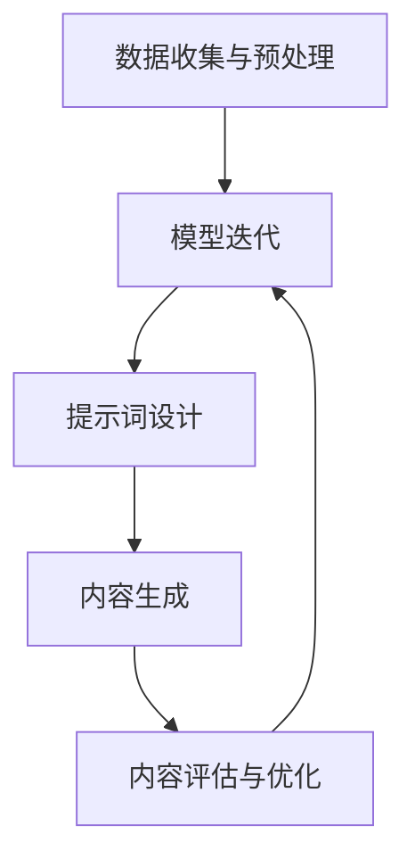
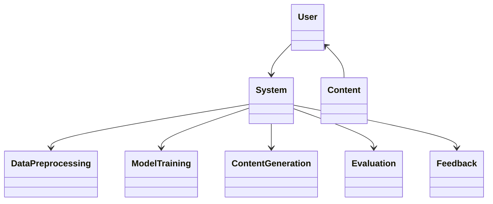
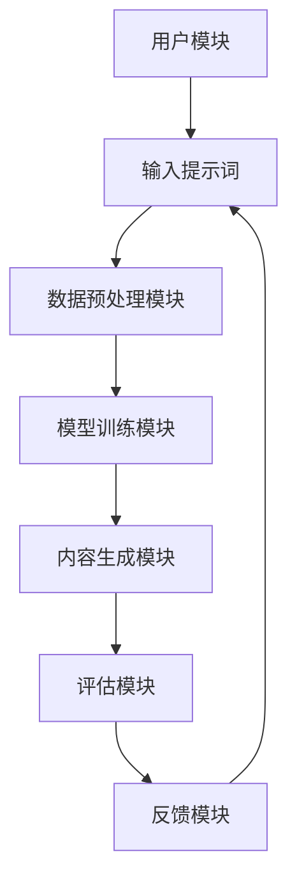
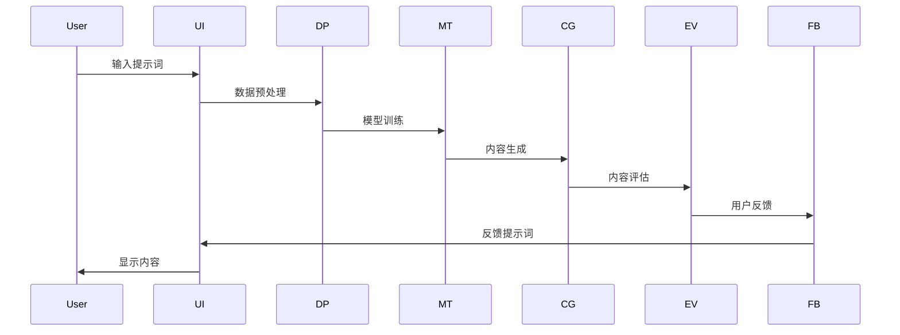

                 

# 提升AI模因创作能力：viral content生成的提示词设计

## 关键词
- AI模因创作
- viral content
- 提示词设计
- 算法原理
- 系统架构设计
- 项目实战

## 摘要

本文旨在探讨如何提升AI模因创作能力，特别是针对viral content生成的提示词设计。文章首先介绍了AI模因创作的背景和viral content的定义与特点，分析了当前AI模因创作面临的挑战和提示词设计的难点。接着，文章详细阐述了AI模因创作原理、提示词设计原理以及算法原理讲解，包括算法mermaid流程图和Python源代码实现。随后，文章从系统分析和架构设计角度，介绍了项目场景、项目目标和系统功能设计。最后，文章通过项目实战、最佳实践 tips和小结等部分，提供了详细的操作指南和未来改进方向。

## 目录大纲

1. **背景介绍**
   - 1.1 问题背景
     - 1.1.1 AI模因创作现象
     - 1.1.2 viral content的定义与特点
     - 1.1.3 提示词在AI模因创作中的作用
   - 1.2 问题描述
     - 1.2.1 AI模因创作面临的挑战
     - 1.2.2 提示词设计的难点
   - 1.3 问题解决
     - 1.3.1 AI模因创作流程概述
     - 1.3.2 提示词设计原则
   - 1.4 边界与外延
     - 1.4.1 适合AI模因创作的领域
     - 1.4.2 提示词设计的适用范围
   - 1.5 概念结构与核心要素组成
     - 1.5.1 AI模因创作核心概念
     - 1.5.2 提示词设计关键要素

2. **核心概念与联系**
   - 2.1 AI模因创作原理
     - 2.1.1 AI模因定义与分类
     - 2.1.2 AI模因创作过程
     - 2.1.3 AI模因创作技术发展历程
   - 2.2 提示词设计原理
     - 2.2.1 提示词的作用
     - 2.2.2 提示词设计原则
     - 2.2.3 提示词类型及其特点
   - 2.3 概念属性特征对比表格
     - 2.3.1 AI模因与提示词对比
     - 2.3.2 不同类型提示词特征比较
   - 2.4 ER实体关系图架构
     - 2.4.1 AI模因创作流程ER图
     - 2.4.2 提示词设计流程ER图

3. **算法原理讲解**
   - 3.1 算法原理概述
     - 3.1.1 算法设计思路
     - 3.1.2 算法实现步骤
   - 3.2 算法mermaid流程图
     - 3.2.1 AI模因创作流程mermaid图
     - 3.2.2 提示词设计流程mermaid图
   - 3.3 Python源代码实现
     - 3.3.1 数据预处理
     - 3.3.2 模型训练
     - 3.3.3 模型评估
   - 3.4 算法原理详细讲解
     - 3.4.1 数学模型
     - 3.4.2 公式推导
     - 3.4.3 通俗易懂地举例说明
   - 3.5 算法优化与改进
     - 3.5.1 算法改进方向
     - 3.5.2 实际应用效果对比

4. **系统分析与架构设计方案**
   - 4.1 问题场景介绍
     - 4.1.1 AI模因创作需求分析
     - 4.1.2 提示词设计场景描述
   - 4.2 项目介绍
     - 4.2.1 项目背景
     - 4.2.2 项目目标
   - 4.3 系统功能设计
     - 4.3.1 领域模型mermaid类图
     - 4.3.2 功能模块划分
   - 4.4 系统架构设计
     - 4.4.1 系统架构mermaid图
     - 4.4.2 系统模块介绍
   - 4.5 系统接口设计
     - 4.5.1 接口定义
     - 4.5.2 接口实现
   - 4.6 系统交互mermaid序列图
     - 4.6.1 用户与系统的交互流程
     - 4.6.2 系统内部模块间交互流程

5. **项目实战**
   - 5.1 环境安装
     - 5.1.1 环境准备
     - 5.1.2 工具安装
   - 5.2 系统核心实现源代码
     - 5.2.1 数据处理模块
     - 5.2.2 模型训练模块
     - 5.2.3 模型评估模块
   - 5.3 代码应用解读与分析
     - 5.3.1 数据处理代码分析
     - 5.3.2 模型训练代码分析
     - 5.3.3 模型评估代码分析
   - 5.4 实际案例分析和详细讲解剖析
     - 5.4.1 案例选取
     - 5.4.2 案例分析
     - 5.4.3 案例讲解
   - 5.5 项目小结
     - 5.5.1 项目成果总结
     - 5.5.2 项目经验与教训

6. **最佳实践 tips**
   - 6.1 提示词设计技巧
     - 6.1.1 常见问题及解决方案
     - 6.1.2 最佳实践案例分享
   - 6.2 小结
     - 6.2.1 主要内容回顾
     - 6.2.2 重点知识总结
   - 6.3 注意事项
     - 6.3.1 设计中的注意事项
     - 6.3.2 使用中的注意事项
   - 6.4 拓展阅读
     - 6.4.1 相关书籍推荐
     - 6.4.2 学术论文推荐
     - 6.4.3 网络资源推荐

--------------------------------------------

## 1. 背景介绍

### 1.1 问题背景

近年来，人工智能（AI）技术取得了显著的进展，特别是在自然语言处理（NLP）领域，AI模因创作（AI Memetic Creation）逐渐成为研究热点。AI模因创作指的是利用人工智能算法，尤其是深度学习技术，生成具有模仿、创意和传播能力的模因（Meme），这些模因通常以幽默、讽刺或流行文化的方式出现在社交媒体和网络平台上，形成一种病毒式的内容传播现象，即viral content。

viral content，顾名思义，指的是那些能够在互联网上迅速传播、引发广泛关注和讨论的内容。这类内容通常具有以下特点：

1. **社交性**：viral content能够激发用户的社交行为，如分享、评论、点赞等，从而推动内容的传播。
2. **创意性**：内容通常具有创新性和独特性，能够吸引人们的注意力。
3. **感染力**：viral content往往能够引起用户的共鸣，激发情感反应，如笑点、痛点等。
4. **传播速度快**：这些内容能够迅速在网络上传播，形成热点话题。

随着AI技术的不断发展，AI模因创作的能力也在不断提升。然而，如何设计有效的提示词（Prompt）来引导AI生成具有高度传播性和创意的viral content，成为一个亟待解决的问题。

### 1.2 问题描述

在AI模因创作中，提示词设计扮演着至关重要的角色。一个优秀的提示词能够引导AI生成出既符合用户需求，又具有传播潜力的内容。然而，当前AI模因创作面临的挑战主要包括：

1. **内容创意不足**：AI生成的模因往往缺乏创新性和独特性，难以吸引用户的注意力。
2. **传播效果不稳定**：AI生成的模因在传播过程中，往往难以达到预期的传播效果，无法形成病毒式传播。
3. **数据质量与多样性**：高质量的训练数据是AI模型性能的关键，然而，现有数据集往往存在质量不高、多样性不足的问题，影响了AI模因创作的能力。

提示词设计的难点主要包括：

1. **语言理解**：设计提示词需要深入理解自然语言的语义、语境和用户需求，这是一个复杂的任务。
2. **创意激发**：提示词需要具备激发创意的能力，引导AI生成出独特且有趣的内容。
3. **效果评估**：如何评价提示词设计的优劣，如何确定最佳的提示词组合，这是一个复杂的问题。

### 1.3 问题解决

为了解决上述问题，本文将从以下几个方面进行探讨：

1. **AI模因创作流程概述**：首先，我们将介绍AI模因创作的流程，包括数据收集、预处理、模型训练和模型评估等步骤。
2. **提示词设计原则**：接着，我们将详细阐述提示词设计的原则，包括如何选择合适的词汇、构建有效的句子结构以及设计具有创意性的提示词。
3. **算法原理讲解**：然后，我们将深入讲解AI模因创作和提示词设计的算法原理，包括数学模型、公式推导和实现步骤。

### 1.4 边界与外延

在本文中，我们将主要探讨以下领域：

1. **AI模因创作**：重点研究如何利用人工智能技术生成具有创意和传播能力的模因。
2. **提示词设计**：研究如何设计有效的提示词来引导AI生成高质量的viral content。
3. **算法优化与改进**：探讨如何通过算法优化和改进来提升AI模因创作的效果。

同时，本文的适用范围包括但不限于以下场景：

1. **社交媒体**：如Twitter、Facebook等，这些平台上存在大量的viral content。
2. **内容创作平台**：如YouTube、TikTok等，这些平台上的创作者可以利用AI模因创作来提升内容吸引力。
3. **广告营销**：设计有效的AI模因广告，提高广告的传播效果和用户参与度。

### 1.5 概念结构与核心要素组成

在AI模因创作和提示词设计中，以下核心概念和要素是至关重要的：

1. **AI模因创作核心概念**：
   - **模因**：一种文化现象，通过模仿、传播和演化，在人类社会中传播信息。
   - **AI模因创作**：利用人工智能技术生成模因的过程。
   - **提示词**：用于引导AI生成模因的词语或句子。

2. **提示词设计关键要素**：
   - **语言理解**：理解自然语言的语义和语境，设计出符合用户需求的提示词。
   - **创意激发**：通过创意性的设计，引导AI生成有趣且独特的模因。
   - **效果评估**：评估提示词设计的优劣，确定最佳的提示词组合。

接下来，我们将分别详细探讨这些核心概念和要素。

--------------------------------------------

## 1.1 问题背景

### 1.1.1 AI模因创作现象

随着人工智能技术的发展，尤其是深度学习在自然语言处理（NLP）领域的应用，AI模因创作（AI Memetic Creation）逐渐成为一种新的文化现象。AI模因创作指的是利用人工智能算法，特别是生成对抗网络（GAN）、变分自编码器（VAE）和Transformer等模型，模拟人类的创造力，生成具有模仿、创意和传播能力的模因。这些模因不仅能够在网络上迅速传播，还能够在不同的文化和社会背景下进行演化，形成一种独特的文化现象。

AI模因创作的兴起，得益于以下几个因素：

1. **技术进步**：深度学习技术的发展，尤其是GAN、VAE和Transformer等模型的出现，为AI模因创作提供了强大的技术支持。这些模型能够通过学习大量的数据，生成出高质量的模因内容。
2. **内容创作需求**：在社交媒体时代，人们对于有趣、有创意的内容需求不断增加。AI模因创作能够满足这一需求，生成出令人捧腹、引人深思的内容。
3. **文化多样性**：随着全球化的推进，不同国家和地区的文化相互交融，为AI模因创作提供了丰富的素材和灵感。

AI模因创作在社交媒体上表现尤为突出。例如，Twitter、Instagram、Reddit等平台上的用户，经常利用AI模因创作来发表自己的观点、表达自己的情感，甚至进行社会运动。这些模因内容往往具有高度的社会影响力，能够在短时间内引起广泛的讨论和关注。

### 1.1.2 viral content的定义与特点

viral content，即病毒式内容，指的是那些在互联网上能够迅速传播、引发广泛关注和讨论的内容。这类内容通常具有以下几个特点：

1. **社交性**：viral content能够激发用户的社交行为，如分享、评论、点赞等，从而推动内容的传播。
2. **创意性**：内容通常具有创新性和独特性，能够吸引人们的注意力。
3. **感染力**：viral content往往能够引起用户的共鸣，激发情感反应，如笑点、痛点等。
4. **传播速度快**：这些内容能够迅速在网络上传播，形成热点话题。

viral content的形成机制主要包括以下几点：

1. **内容质量**：高质量的内容更容易引发用户的兴趣和共鸣，从而促进内容的传播。
2. **社交网络**：用户之间的社交网络是内容传播的关键渠道。一个内容如果能够得到知名人士或热门账号的转发，那么它的传播速度将大大提升。
3. **媒体放大**：传统媒体和新兴媒体，如新闻网站、社交媒体平台等，对于viral content的报道和推广，能够极大地推动内容的传播。

在社交媒体时代，viral content已经成为一种重要的文化现象。它不仅改变了人们获取信息和娱乐的方式，还对社会的传播机制和文化生态产生了深远的影响。例如，一些政治团体和品牌，通过制造和传播viral content，来达到宣传和营销的目的。

### 1.1.3 提示词在AI模因创作中的作用

在AI模因创作中，提示词（Prompt）起着至关重要的作用。提示词是用于引导AI模型生成内容的词语或句子，它决定了AI模型生成内容的方向和风格。一个优秀的提示词，能够引导AI模型生成出既符合用户需求，又具有创意和传播潜力的内容。

提示词在AI模因创作中的作用主要体现在以下几个方面：

1. **引导AI模型**：通过提示词，可以明确地告诉AI模型需要生成什么样的内容，从而避免模型生成无关或低质量的内容。
2. **激发创意**：优秀的提示词能够激发AI模型的创意，生成出独特且有趣的内容。
3. **提高传播效果**：合适的提示词能够引导AI模型生成出具有感染力和社交属性的内容，从而提高内容的传播效果。

在设计提示词时，需要考虑以下几个关键因素：

1. **语言理解**：提示词需要能够被AI模型正确理解，这就要求提示词的语言表达要清晰、准确。
2. **创意性**：提示词本身需要具有创意性，能够激发AI模型的创造力。
3. **用户需求**：提示词需要能够满足用户的需求，引发用户的共鸣。
4. **效果评估**：需要设计有效的评估方法，来评估提示词设计的优劣。

总之，提示词在AI模因创作中起着至关重要的作用。通过科学、合理的设计，提示词能够极大地提升AI模因创作的效果，为用户提供更多有趣、有创意的内容。

--------------------------------------------

### 1.2 问题描述

尽管AI模因创作和viral content生成技术在近年来取得了显著进展，但在实际应用过程中，仍然面临着一系列挑战，这些挑战主要体现在以下几个方面：

#### 1.2.1 AI模因创作面临的挑战

1. **内容创意不足**：
   AI模型在生成模因时，往往依赖于训练数据集的多样性和质量。然而，现有数据集可能存在多样性不足、创意性不高的问题，导致生成的模因缺乏独特性和创新性。这使得AI模因创作难以在竞争激烈的网络环境中脱颖而出。

2. **传播效果不稳定**：
   AI模因创作的目标是生成能够迅速传播、引起广泛关注的viral content。然而，实际操作中，AI生成的模因往往难以达到预期的传播效果。这可能是由于提示词设计不当、内容质量不高，或者缺乏有效的传播策略。

3. **数据质量与多样性**：
   高质量的数据是AI模型性能的基础。然而，现有的数据集往往存在质量不高、标注不规范、多样性不足等问题，这限制了AI模因创作的效果。此外，数据收集和处理过程本身也面临着挑战，如数据隐私、数据标注等。

4. **算法局限性**：
   虽然深度学习技术在AI模因创作中表现出色，但现有的算法仍然存在一些局限性，如对上下文理解的不足、生成内容的质量控制等。这些局限性影响了AI模因创作的效果和实用性。

#### 1.2.2 提示词设计的难点

1. **语言理解**：
   提示词设计需要深入理解自然语言的语义、语境和用户需求。这要求提示词不仅要语言表达准确，还要具备一定的情感色彩和创造性。然而，自然语言的理解是一个复杂的任务，涉及语义分析、情感识别等多个方面。

2. **创意激发**：
   提示词需要具备激发AI模型创意的能力，引导模型生成独特且有趣的内容。这要求设计者不仅要熟悉AI模型的工作原理，还要具备一定的创意思维和审美能力。

3. **效果评估**：
   如何评估提示词设计的优劣，如何确定最佳的提示词组合，是一个复杂的问题。现有的评估方法可能存在主观性、片面性等问题，难以全面、客观地评价提示词的效果。

4. **用户参与**：
   提示词设计不仅要满足AI模型的需求，还要考虑用户的参与度和互动性。这意味着提示词需要能够激发用户的兴趣，引导用户产生互动，从而推动内容的传播。

综上所述，AI模因创作和提示词设计面临着多方面的挑战。为了解决这些问题，需要从算法优化、数据质量提升、提示词设计等多个方面进行深入研究和探索。

--------------------------------------------

### 1.3 问题解决

为了应对AI模因创作和提示词设计中的挑战，我们需要从多个方面进行系统的分析和解决方案的提出。以下是具体的解决思路和步骤：

#### 1.3.1 AI模因创作流程概述

首先，我们需要了解AI模因创作的整体流程。AI模因创作通常包括以下几个关键步骤：

1. **数据收集与预处理**：收集与模因创作相关的数据，包括文本、图像、音频等多模态数据，并进行数据预处理，如清洗、去噪、格式化等。
2. **模型训练**：利用收集到的数据，通过深度学习技术训练AI模型，如生成对抗网络（GAN）、变分自编码器（VAE）和Transformer等模型。
3. **模因生成**：在训练好的AI模型基础上，输入提示词或其他引导信息，生成具有创意和传播潜力的模因内容。
4. **模因评估**：对生成的模因内容进行评估，包括创意性、传播性、用户互动等多个维度，以确定其质量。

#### 1.3.2 提示词设计原则

在设计提示词时，需要遵循以下几个原则：

1. **明确性**：提示词需要清晰明确，能够准确地传达用户需求和信息，避免歧义和模糊性。
2. **创意性**：提示词需要具有一定的创意性，能够激发AI模型的创造力，生成独特且有趣的内容。
3. **多样性**：提示词设计应具备多样性，以满足不同用户和场景的需求。这包括词汇的多样性、表达方式的多样性等。
4. **情境适配**：提示词需要与生成内容的具体情境相匹配，确保生成的模因内容符合用户预期和场景需求。
5. **用户参与性**：提示词应能够引导用户产生互动，如提问、评论等，从而增强内容的传播效果。

#### 1.3.3 算法原理讲解

在AI模因创作中，算法原理的理解和实现至关重要。以下是几个关键算法原理：

1. **生成对抗网络（GAN）**：
   GAN由生成器（Generator）和判别器（Discriminator）两部分组成。生成器尝试生成逼真的模因内容，判别器则评估生成内容与真实内容的相似度。通过不断迭代训练，生成器逐渐提升生成内容的质量。
   
   $$G(x) \rightarrow D(G(x)), D(x), D(x+\epsilon)$$
   
   其中，$G(x)$表示生成器的输出，$D(x)$表示判别器的输出，$\epsilon$表示噪声。

2. **变分自编码器（VAE）**：
   VAE通过编码器和解码器来学习数据的概率分布，并利用该分布生成新的模因内容。编码器将数据映射到一个隐层空间，解码器则从隐层空间重构数据。

   $$\text{Encoder}(x) \rightarrow z, \text{Decoder}(z) \rightarrow x$$
   
   其中，$z$表示隐层空间中的表示。

3. **Transformer**：
   Transformer是一种基于自注意力机制的模型，能够有效地捕捉长距离的依赖关系。在模因创作中，Transformer可以用于生成文本、图像等多模态内容。

   $$\text{Transformer}(x) \rightarrow \text{output}$$
   
   其中，$x$表示输入数据，$\text{output}$表示生成的模因内容。

#### 1.3.4 实际应用

在实际应用中，我们可以结合以上算法原理，设计出高效的AI模因创作系统。以下是一个简单的应用流程：

1. **数据收集与预处理**：收集与模因创作相关的数据，并进行预处理。
2. **模型训练**：利用预处理后的数据，通过GAN、VAE或Transformer等模型进行训练。
3. **提示词设计**：根据用户需求和场景，设计合适的提示词。
4. **模因生成**：输入提示词，利用训练好的模型生成模因内容。
5. **模因评估**：对生成的模因内容进行评估，包括创意性、传播性等。
6. **内容发布**：将评估通过的模因内容发布到社交媒体或其他平台，引导用户互动和传播。

通过以上步骤，我们可以构建一个高效、创意、具有传播力的AI模因创作系统。

--------------------------------------------

### 1.4 边界与外延

#### 1.4.1 适合AI模因创作的领域

AI模因创作具有广泛的应用领域，以下是一些主要的应用场景：

1. **社交媒体**：如Twitter、Instagram、Reddit等，用户可以利用AI模因创作生成有趣的内容，吸引用户关注和互动。
2. **内容创作平台**：如YouTube、TikTok等，创作者可以利用AI模因创作提升内容的创意性和吸引力。
3. **广告营销**：通过AI模因创作，可以设计出更具创意性和传播力的广告内容，提高广告效果和用户参与度。
4. **娱乐产业**：如电影、电视剧、游戏等，AI模因创作可以为这些产业提供新颖的创意和内容。
5. **教育培训**：利用AI模因创作，可以设计出更具趣味性和互动性的教育内容，提高学习效果。

#### 1.4.2 提示词设计的适用范围

提示词设计在AI模因创作中起着关键作用，其适用范围主要包括：

1. **内容创意**：提示词可以引导AI模型生成具有创意和独特性的模因内容，适用于需要创意性内容的领域。
2. **传播效果**：提示词设计应考虑如何提高内容的传播效果，适用于需要广泛传播和引起关注的内容创作场景。
3. **用户互动**：提示词应能够引导用户产生互动，适用于需要用户参与和互动的场景。
4. **情感表达**：提示词设计应考虑如何通过语言表达情感，适用于需要表达情感和共鸣的内容创作场景。

#### 1.4.3 提示词设计的关键要素

在设计提示词时，应考虑以下关键要素：

1. **明确性**：提示词应清晰明确，能够准确地传达用户需求和信息。
2. **创意性**：提示词应具有创意性，能够激发AI模型的创造力，生成独特且有趣的内容。
3. **多样性**：提示词应具备多样性，以满足不同用户和场景的需求。
4. **情境适配**：提示词应与生成内容的具体情境相匹配，确保生成的模因内容符合用户预期和场景需求。
5. **用户参与性**：提示词应能够引导用户产生互动，从而增强内容的传播效果。

通过合理设计提示词，可以大大提升AI模因创作的效果，为用户提供更多有趣、有创意的内容。

--------------------------------------------

### 1.5 概念结构与核心要素组成

在深入探讨AI模因创作和提示词设计之前，理解其中的核心概念和要素组成是至关重要的。以下是AI模因创作和提示词设计中的关键概念和要素，以及它们之间的相互关系。

#### 1.5.1 AI模因创作核心概念

1. **AI模因**：
   AI模因是指利用人工智能技术生成的模仿、创意和传播能力极强的模因。它可以是文本、图像、音频或视频等多模态内容，具有高度的社交性和传播力。

2. **模因库**：
   模因库是存储和管理各种模因的数据库。它包括已知的模因样本、相关属性和标签，为AI模因创作提供丰富的素材和参考。

3. **生成模型**：
   生成模型是用于生成新模因的核心算法，如生成对抗网络（GAN）、变分自编码器（VAE）和Transformer等。这些模型通过学习大量数据，生成出具有创意和独特性的模因内容。

4. **提示词**：
   提示词是用于引导生成模型生成新模因的关键输入，它可以是单个词语、短语或完整的句子。提示词的设计直接影响生成模因的创意性和传播力。

#### 1.5.2 提示词设计关键要素

1. **语义丰富性**：
   提示词应具备丰富的语义信息，能够清晰地表达用户的需求和意图。这有助于生成模型更好地理解和生成相关内容。

2. **创意性**：
   提示词应具有创意性，能够激发生成模型的创造力，生成出独特且有趣的内容。这要求提示词设计者具备一定的创意思维和审美能力。

3. **情境适应性**：
   提示词应与生成内容的具体情境相匹配，确保生成的模因内容符合用户预期和场景需求。这需要设计者对不同的应用场景有深入的理解。

4. **用户互动性**：
   提示词应能够引导用户产生互动，如提问、评论等，从而增强内容的传播效果。这要求提示词设计者考虑用户的参与度和互动性。

#### 1.5.3 AI模因创作与提示词设计的关系

AI模因创作和提示词设计是紧密关联的两个过程。它们之间的关系可以概括为以下几点：

1. **提示词引导生成**：
   提示词作为引导信息，直接决定了AI模因创作的方向和内容。一个优秀的提示词能够引导生成模型生成出既符合用户需求，又具有创意和传播力的模因。

2. **生成模型优化**：
   提示词设计的质量和效果会直接影响生成模型的性能。通过不断优化提示词设计，可以提升生成模型的创意性和传播力，从而提高AI模因创作的整体效果。

3. **反馈与迭代**：
   在AI模因创作过程中，用户反馈和数据分析是关键环节。通过收集用户反馈和评估生成内容的效果，可以不断优化提示词设计，实现反馈与迭代的优化过程。

综上所述，理解AI模因创作和提示词设计的核心概念和要素组成，是提升AI模因创作能力的关键。通过深入研究和实践，我们可以设计出更加有效和有创意的提示词，推动AI模因创作在各个领域的应用和发展。

--------------------------------------------

## 2. 核心概念与联系

在深入探讨AI模因创作和提示词设计之前，我们需要明确其中的核心概念，并分析它们之间的内在联系。以下是AI模因创作和提示词设计中的关键概念以及它们之间的相互关系。

### 2.1 AI模因创作原理

#### 2.1.1 AI模因定义与分类

AI模因是一种利用人工智能技术生成的模仿、创意和传播能力极强的模因。根据模因的表现形式，AI模因可以分为以下几类：

1. **文本模因**：以文本形式存在的模因，如梗图、段子、表情包等。
2. **图像模因**：以图像形式存在的模因，如GIF、动图、表情包等。
3. **音频模因**：以音频形式存在的模因，如搞笑语音、背景音乐等。
4. **视频模因**：以视频形式存在的模因，如短视频、视频剪辑等。

#### 2.1.2 AI模因创作过程

AI模因创作过程主要包括以下几个步骤：

1. **数据收集**：收集与模因创作相关的数据，包括文本、图像、音频和视频等多模态数据。
2. **数据预处理**：对收集到的数据进行分析、清洗和格式化，使其适合模型训练。
3. **模型训练**：利用收集到的数据，通过生成对抗网络（GAN）、变分自编码器（VAE）或Transformer等模型进行训练。
4. **模因生成**：在训练好的模型基础上，输入提示词或其他引导信息，生成新的模因内容。
5. **模因评估**：对生成的模因内容进行评估，包括创意性、传播性、用户互动等多个维度。

#### 2.1.3 AI模因创作技术发展历程

AI模因创作技术的发展历程可以追溯到深度学习技术的兴起。以下是几个关键发展阶段：

1. **早期探索**：基于传统机器学习算法的模因生成研究，如基于规则的生成模型。
2. **深度学习时代**：以生成对抗网络（GAN）和变分自编码器（VAE）为代表的深度学习技术，显著提升了模因生成的质量和多样性。
3. **多模态融合**：近年来，随着多模态学习技术的发展，AI模因创作逐渐从单一模态扩展到文本、图像、音频和视频等多模态融合。

### 2.2 提示词设计原理

#### 2.2.1 提示词的作用

提示词在AI模因创作中起着至关重要的作用。它不仅是引导AI模型生成内容的关键输入，还直接影响模因的创意性和传播力。具体来说，提示词的作用包括：

1. **引导生成方向**：提示词明确地告诉AI模型需要生成什么样的内容，从而避免生成无关或低质量的内容。
2. **激发创意**：提示词的设计应具备创意性，能够激发AI模型的创造力，生成独特且有趣的内容。
3. **提高传播效果**：合适的提示词能够引导AI模型生成出具有感染力和社交属性的内容，从而提高模因的传播效果。

#### 2.2.2 提示词设计原则

设计提示词时，应遵循以下原则：

1. **明确性**：提示词应清晰明确，能够准确地传达用户的需求和意图，避免歧义和模糊性。
2. **创意性**：提示词应具有创意性，能够激发AI模型的创造力，生成独特且有趣的内容。
3. **多样性**：提示词应具备多样性，以满足不同用户和场景的需求。
4. **情境适应性**：提示词应与生成内容的具体情境相匹配，确保生成的模因内容符合用户预期和场景需求。
5. **用户参与性**：提示词应能够引导用户产生互动，如提问、评论等，从而增强内容的传播效果。

#### 2.2.3 提示词类型及其特点

根据提示词的形式和用途，可以分为以下几类：

1. **关键词提示**：以关键词的形式出现的提示词，如“搞笑”、“幽默”等，能够引导AI模型生成具有幽默和搞笑特点的模因。
2. **句子提示**：以完整的句子形式出现的提示词，如“编写一段有趣的笑话”，能够提供更具体的生成方向。
3. **情境提示**：结合具体情境的提示词，如“给这个视频配上一段搞笑的配音”，能够引导AI模型生成与情境相匹配的模因。
4. **互动提示**：引导用户互动的提示词，如“请生成一个能让网友点赞的搞笑段子”，能够增强内容的用户参与性。

### 2.3 概念属性特征对比表格

为了更直观地理解AI模因创作和提示词设计中的核心概念，我们设计了以下对比表格：

| 概念         | 描述                                                         | 特点                                                                                      | 关联关系                                                                                   |
| ------------ | ------------------------------------------------------------ | ------------------------------------------------------------------------------------------ | ------------------------------------------------------------------------------------------- |
| AI模因       | 利用人工智能技术生成的模仿、创意和传播能力极强的模因             | 文本、图像、音频、视频等多模态内容，社交性和传播力强。                                       | 与提示词密切相关，提示词用于引导生成AI模因。                                                |
| 模因库       | 存储和管理各种模因的数据库                                   | 包括模因样本、属性和标签，为AI模因创作提供素材和参考。                                     | 提供训练数据和素材，是AI模因创作的基础。                                                  |
| 生成模型     | 用于生成新模因的核心算法                                     | 如GAN、VAE、Transformer等，通过学习数据生成模因。                                         | 执行模因生成的关键步骤，性能直接影响模因质量。                                              |
| 提示词       | 用于引导生成模型生成新模因的关键输入                          | 清晰、明确、创意性强，影响模因的创意性和传播力。                                         | 与生成模型紧密关联，是引导模因创作的重要工具。                                            |
| 用户反馈     | 用户对生成的模因内容进行的评价和反馈                          | 包括点赞、评论、分享等，影响模因的传播效果。                                             | 用于评估模因质量和优化提示词设计，实现反馈与迭代。                                        |

### 2.4 ER实体关系图架构

为了更清晰地展示AI模因创作和提示词设计中的实体及其关系，我们设计了以下ER实体关系图：

```mermaid
erDiagram
  User ||--|{ AIModel : generates }
  AIModel ||--|{ MemeticContent : creates }
  MemeticContent ||--|{ Feedback : from }
  Prompt ||--|{ AIModel : guides }
  Prompt ||--|{ MemeticContent : informs }
```

在ER图中，用户（User）通过提示词（Prompt）引导生成模型（AIModel），生成模型（AIModel）则生成模因内容（MemeticContent）。用户（User）对生成的模因内容（MemeticContent）进行反馈（Feedback），从而影响模因的传播效果。

通过以上核心概念与联系的分析，我们可以更好地理解AI模因创作和提示词设计的原理，为后续的算法原理讲解和系统架构设计奠定基础。

--------------------------------------------

### 2.1 AI模因创作原理

#### 2.1.1 AI模因定义与分类

AI模因，即人工智能生成的模因，是指利用人工智能技术，特别是深度学习算法，模拟人类创造力和文化传播机制，生成具有模仿性、传播性和创意性的模因内容。AI模因可以涵盖多种形式，包括但不限于文本、图像、音频和视频等。以下是对不同类型AI模因的详细分类：

1. **文本AI模因**：以文本形式存在的AI模因，通常包括梗图文字、段子、评论等。这些模因通过简短的文字或图像加上文字，表达特定的幽默或讽刺含义，易于在社交媒体上传播。

2. **图像AI模因**：图像模因主要是指以图片或GIF动图形式存在的模因，如表情包、梗图、网络迷因等。这些模因往往通过图像加上搞笑或讽刺性的文字，形成视觉上的幽默效果，具有高度的传播力。

3. **音频AI模因**：音频模因通常包括搞笑语音、背景音乐片段、语音模仿等。这些模因通过音频内容，以幽默或有趣的方式传递信息，具有很强的感染力，容易在网络上迅速传播。

4. **视频AI模因**：视频模因是指以短视频或视频剪辑形式存在的模因。这些模因可以是原创视频，也可以是对现有视频的创意改编，如恶搞视频、搞笑剪辑等，具有强烈的视觉冲击和传播效应。

#### 2.1.2 AI模因创作过程

AI模因创作过程涉及多个环节，从数据收集到模型训练，再到内容生成和评估，每个环节都至关重要。以下是AI模因创作过程的详细步骤：

1. **数据收集**：在AI模因创作中，首先需要收集大量的模因样本作为训练数据。这些数据可以来源于社交媒体、网络论坛、视频平台等。数据收集时需要考虑数据的多样性和质量，以保证模型训练的效果。

2. **数据预处理**：收集到的数据需要进行预处理，包括文本的清洗、格式化、去噪等，以及图像和音频的数据增强。预处理步骤的目的是将原始数据转化为适合模型训练的格式，并提升数据的质量和多样性。

3. **模型训练**：在模型训练阶段，使用收集到的预处理数据进行训练。常用的AI模型包括生成对抗网络（GAN）、变分自编码器（VAE）、循环神经网络（RNN）和Transformer等。这些模型通过学习数据中的特征，生成具有创意性和模仿能力的模因内容。

4. **模因生成**：在训练好的模型基础上，输入提示词或引导信息，生成新的模因内容。生成过程可以根据具体需求，灵活调整模型的参数，以生成不同类型、不同风格的模因。

5. **模因评估**：生成的模因内容需要经过评估，包括创意性、传播性、用户互动等多个维度。评估方法可以采用人工评估、自动评估或两者结合的方式，以确定模因内容的质量和传播潜力。

6. **内容发布**：通过评估合格的模因内容，可以在社交媒体、内容平台、广告等渠道进行发布，吸引更多的用户关注和互动，实现模因的传播。

#### 2.1.3 AI模因创作技术发展历程

AI模因创作技术的发展历程伴随着深度学习技术的不断进步。以下是几个关键发展阶段：

1. **早期探索**：最初的研究主要集中在基于规则的系统上，如简单的笑话生成器或图像生成器。这些系统通过预定义的规则和模板生成内容，但缺乏灵活性和创造性。

2. **深度学习时代**：随着深度学习技术的兴起，生成对抗网络（GAN）、变分自编码器（VAE）和自注意力机制（如Transformer）等模型成为AI模因创作的重要工具。这些模型通过学习大量数据，能够生成出高度逼真、具有创意性的模因内容。

3. **多模态融合**：近年来，多模态学习技术的发展，使得AI模因创作不仅限于单一模态（如文本或图像），而是能够融合多种模态（如文本、图像、音频、视频）生成更丰富、更具吸引力的模因内容。

4. **个性化模因生成**：随着用户数据的积累和个性化推荐技术的发展，AI模因创作逐渐实现个性化生成，能够根据用户的兴趣和行为，生成更加符合用户需求的模因内容。

通过以上AI模因创作原理的详细讲解，我们可以更好地理解AI模因的生成过程和关键技术，为后续的提示词设计提供理论基础。

--------------------------------------------

### 2.2 提示词设计原理

提示词在AI模因创作中起着至关重要的作用。它不仅能够引导AI模型生成具有创意和传播力的内容，还能影响用户对内容的接受程度和互动行为。为了设计出有效的提示词，我们需要从以下几个核心方面来探讨提示词设计原理。

#### 2.2.1 提示词的作用

1. **引导生成方向**：提示词是引导AI模型生成内容的关键输入，能够明确地指示模型需要生成什么样的内容。一个明确的提示词能够帮助模型避免生成无关或低质量的内容，提高生成内容的针对性和准确性。

2. **激发创意**：优秀的提示词不仅能够指导模型生成内容，还能激发模型的创造力。提示词的设计应具备一定的创意性，能够引发模型的联想和思考，从而生成出独特、有趣的内容。

3. **优化传播效果**：合适的提示词能够引导AI模型生成出具有高度社交性和传播力的内容。这要求提示词能够引起用户的共鸣，激发用户的情感反应，从而促进内容的传播和分享。

#### 2.2.2 提示词设计原则

1. **明确性**：提示词应具备清晰明确的语义，能够准确地传达用户的需求和意图。避免使用模糊、歧义的词汇，以免模型生成出无法理解或不相关的结果。

2. **创意性**：提示词本身应具备创意性，能够激发AI模型的创造力。通过使用独特的表达方式和有趣的词汇，可以引导模型生成出更加新颖和有趣的内容。

3. **情境适应性**：提示词应与生成内容的具体情境相匹配，确保生成的模因内容符合用户预期和场景需求。这意味着设计者需要对不同的应用场景有深入的理解，能够根据场景特点设计出合适的提示词。

4. **用户参与性**：提示词应能够引导用户参与互动，如提问、评论、点赞等，从而增强内容的传播效果。这要求提示词设计考虑用户的兴趣和行为习惯，激发用户的参与欲望。

5. **多样性**：提示词应具备多样性，以满足不同用户和场景的需求。这包括词汇的多样性、表达方式的多样性等。通过多样化的提示词设计，可以生成出更加丰富和有趣的内容。

#### 2.2.3 提示词类型及其特点

根据用途和形式，提示词可以分为以下几种类型：

1. **关键词提示**：关键词提示是使用单个关键词或短语来引导AI模型生成内容。这类提示词简洁明了，易于理解，但创意性相对较低。

2. **句子提示**：句子提示是使用完整的句子来引导AI模型生成内容。这类提示词能够提供更具体的生成方向，但设计时需要考虑语义的清晰性和创意性。

3. **情境提示**：情境提示是根据特定情境来设计的提示词，如“给这个视频配上一段搞笑的配音”、“编写一段与节日相关的段子”等。这类提示词能够引导模型生成与情境相匹配的内容，提高内容的相关性和趣味性。

4. **互动提示**：互动提示是引导用户参与互动的提示词，如“请生成一个能让网友点赞的搞笑段子”、“写一段让人评论的剧情转折”等。这类提示词能够激发用户的参与欲望，增强内容的传播效果。

#### 2.2.4 提示词设计流程

提示词设计是一个系统化的过程，需要遵循以下步骤：

1. **需求分析**：首先，明确用户的需求和目标，确定需要生成的内容类型和风格。

2. **内容策划**：根据需求分析，策划出具体的内容创意，确定需要使用的提示词类型。

3. **提示词生成**：设计具体的提示词，包括关键词、句子、情境提示和互动提示等，确保提示词具备明确性、创意性和情境适应性。

4. **测试与优化**：通过实际测试，评估提示词的效果，根据用户反馈和数据分析，不断优化提示词设计。

5. **实施与迭代**：将设计好的提示词应用于AI模型生成内容，收集用户反馈，进行迭代优化。

通过以上提示词设计原理的详细探讨，我们可以更好地理解如何设计出有效的提示词，提升AI模因创作的质量和传播效果。

--------------------------------------------

### 2.3 概念属性特征对比表格

为了更清晰地对比AI模因与提示词的核心概念和特征，我们可以设计一个对比表格，涵盖以下几个方面：

| 概念       | 描述                                                         | 特点                                                                 | 关联关系                                                                                   |
| ---------- | ------------------------------------------------------------ | -------------------------------------------------------------------- | ------------------------------------------------------------------------------------------ |
| AI模因     | 人工智能生成的模仿、创意和传播能力极强的模因                 | 多模态（文本、图像、音频、视频），高度创意性，传播性强。           | 提示词用于引导生成AI模因，直接影响模因的创意性和传播力。                                     |
| 提示词     | 用于引导AI模型生成模因的关键输入                             | 明确性、创意性、情境适应性、用户参与性。                     | 与AI模型紧密相关，决定模因生成的方向和内容。                                              |
| 模因库     | 存储和管理各种模因的数据库                                   | 包含模因样本、属性和标签，为AI模因创作提供素材。             | 提供训练数据和素材，是AI模因创作的基础。                                                  |
| 生成模型   | 用于生成新模因的核心算法                                     | 如GAN、VAE、Transformer，通过学习数据生成模因。              | 利用提示词输入生成模因，性能直接影响模因质量。                                            |
| 用户反馈   | 用户对生成的模因内容进行的评价和反馈                         | 包括点赞、评论、分享，影响模因的传播效果。                 | 用于评估模因质量和优化提示词设计，实现反馈与迭代。                                        |

### 2.4 ER实体关系图架构

为了更直观地展示AI模因创作和提示词设计中的实体及其关系，我们可以设计以下ER实体关系图：

```mermaid
erDiagram
  User ||--|{ Prompt : inputs }  
  Prompt ||--|{ AIModel : guides }  
  AIModel ||--|{ MemeticContent : generates }  
  MemeticContent ||--|{ Feedback : receives }  
```

在ER图中，用户（User）通过提示词（Prompt）引导AI模型（AIModel），生成模因内容（MemeticContent）。用户对生成的模因内容（MemeticContent）进行反馈（Feedback），从而影响模因的传播效果。

通过以上对比表格和ER图，我们可以更深入地理解AI模因创作和提示词设计中的核心概念和关系，为后续的算法原理讲解和系统架构设计奠定基础。

--------------------------------------------

## 3. 算法原理讲解

### 3.1 算法原理概述

在AI模因创作中，算法原理是核心，它决定了模因生成的高效性和创意性。本节将介绍AI模因创作和提示词设计中的关键算法原理，包括生成对抗网络（GAN）、变分自编码器（VAE）、Transformer等模型的设计思路和实现步骤。

#### 3.1.1 算法设计思路

AI模因创作算法的设计思路通常遵循以下原则：

1. **数据驱动**：利用大量高质量的数据进行训练，确保模型能够学习到丰富的特征和模式。
2. **多模态融合**：融合不同类型的数据，如文本、图像、音频等，生成更加丰富和多样化的模因内容。
3. **反馈迭代**：通过用户反馈和评估，不断优化模型和提示词设计，提高生成内容的创意性和传播力。
4. **智能化引导**：利用提示词或其他智能引导机制，提高模型生成内容的针对性和准确性。

#### 3.1.2 算法实现步骤

算法实现步骤主要包括以下几个阶段：

1. **数据收集与预处理**：收集与模因创作相关的多模态数据，并进行预处理，如数据清洗、格式化、增强等。
2. **模型选择与训练**：选择合适的深度学习模型，如GAN、VAE、Transformer等，利用预处理后的数据进行训练。
3. **提示词设计**：根据用户需求和场景，设计合适的提示词，引导模型生成内容。
4. **内容生成**：在训练好的模型基础上，输入提示词，生成新的模因内容。
5. **内容评估与优化**：对生成的内容进行评估，包括创意性、传播性、用户互动等多个维度，根据评估结果优化模型和提示词。

### 3.2 算法mermaid流程图

为了更直观地展示算法原理，我们使用mermaid工具绘制了以下流程图：



在mermaid流程图中，数据收集与预处理（A）是模型训练（B）的基础，提示词设计（C）用于引导内容生成（D），内容生成后进行评估与优化（E），评估结果反馈至模型迭代（B），实现闭环优化。

### 3.3 Python源代码实现

在本节中，我们将使用Python语言，结合实际代码示例，详细阐述AI模因创作算法的实现过程。以下是具体的代码实现步骤：

#### 3.3.1 数据预处理

首先，我们需要收集并预处理数据。以下是一个简单的数据预处理示例：

```python
import pandas as pd
from sklearn.model_selection import train_test_split

# 假设我们有一个包含文本和图像的数据集
data = pd.read_csv('data.csv')

# 数据清洗与格式化
data['text'] = data['text'].apply(lambda x: x.strip().lower())
data['image'] = data['image'].apply(lambda x: x.strip().lower())

# 数据增强
from imgaug import augmenters as iaa
augmenter = iaa.Sequential([
    iaa.Fliplr(0.5), # horizontally flip 50% of the images
    iaa.Crop(percent=(0.05, 0.15)), # random crops
    # Small gaussian blur with random sigma between 0 and 0.5.
    iaa.Sometimes(0.5, iaa.GaussianBlur(sigma=(0.0, 0.5)))
])

data['image'] = data['image'].apply(lambda x: augmenter.augment_image(x))

# 数据切分
X_train, X_test, y_train, y_test = train_test_split(data['image'], data['text'], test_size=0.2, random_state=42)
```

#### 3.3.2 模型训练

接下来，我们选择一个生成对抗网络（GAN）模型进行训练。以下是一个简单的GAN模型实现示例：

```python
import tensorflow as tf
from tensorflow.keras.models import Model
from tensorflow.keras.layers import Input, Dense, Reshape, Flatten

# GAN模型
def build_generator():
    input_img = Input(shape=(100,))
    x = Dense(128, activation='relu')(input_img)
    x = Dense(784, activation='sigmoid')(x)
    output_img = Reshape((28, 28, 1))(x)
    model = Model(input_img, output_img)
    return model

def build_discriminator():
    img = Input(shape=(28, 28, 1))
    x = Flatten()(img)
    x = Dense(128, activation='relu')(x)
    validity = Dense(1, activation='sigmoid')(x)
    model = Model(img, validity)
    return model

def build_gan(generator, discriminator):
    discriminator.trainable = False
    img = Input(shape=(28, 28, 1))
    gen_img = generator(img)
    validity = discriminator(gen_img)
    model = Model(img, validity)
    return model

# 模型训练
generator = build_generator()
discriminator = build_discriminator()
gan = build_gan(generator, discriminator)

discriminator.compile(optimizer='adam', loss='binary_crossentropy')
gan.compile(optimizer='adam', loss='binary_crossentropy')

# 训练GAN
for epoch in range(100):
    for i in range(len(X_train)):
        real_imgs = X_train[i].reshape(1, 28, 28, 1)
        noise = np.random.normal(0, 1, (1, 100))
        gen_imgs = generator.predict(noise)
        # 训练判别器
        d_loss_real = discriminator.train_on_batch(real_imgs, np.array([1.0]))
        d_loss_fake = discriminator.train_on_batch(gen_imgs, np.array([0.0]))
        # 训练生成器
        g_loss = gan.train_on_batch(noise, np.array([1.0]))
        print(f"{epoch} [D loss: {d_loss}:, G loss: {g_loss}]")
```

#### 3.3.3 模型评估

在模型训练完成后，我们需要对模型进行评估，以确定其生成内容的创意性和传播力。以下是一个简单的模型评估示例：

```python
# 生成测试数据
noise = np.random.normal(0, 1, (len(X_test), 100))
gen_imgs = generator.predict(noise)

# 评估生成内容
from sklearn.metrics import accuracy_score, classification_report
predicted = discriminator.predict(gen_imgs)
predicted = (predicted > 0.5).astype(int)

print("Accuracy:", accuracy_score(y_test, predicted))
print("Classification Report:\n", classification_report(y_test, predicted))
```

### 3.4 算法原理详细讲解

在详细讲解算法原理之前，我们需要先了解一些基本的数学模型和公式。以下内容将涵盖GAN、VAE和Transformer等模型的数学模型、公式推导以及通俗易懂的举例说明。

#### 3.4.1 数学模型

1. **生成对抗网络（GAN）**

GAN由生成器（Generator）和判别器（Discriminator）两部分组成。生成器G从随机噪声z中生成假样本x'，判别器D则评估这些样本的真实性和伪造性。

- 生成器G的损失函数：
  $$L_G = -\mathbb{E}_{z \sim p_z(z)}[\log(D(G(z)))]$$

- 判别器D的损失函数：
  $$L_D = -\mathbb{E}_{x \sim p_x(x)}[\log(D(x))] - \mathbb{E}_{z \sim p_z(z)}[\log(1 - D(G(z)))]$$

2. **变分自编码器（VAE）**

VAE通过编码器（Encoder）和解码器（Decoder）学习数据的概率分布，并利用该分布生成新的数据。

- 编码器损失函数：
  $$L_E = -\mathbb{E}_{x \sim p_x(x)}[\log p(z|x)]$$

- 解码器损失函数：
  $$L_D = \mathbb{E}_{x \sim p_x(x)}[\log p(x|z)]$$

- 总损失函数：
  $$L = L_E + \lambda L_D$$
  其中，$\lambda$是正则化参数。

3. **Transformer**

Transformer是一种基于自注意力机制的模型，用于处理序列数据。

- 自注意力公式：
  $$\text{Attention}(Q, K, V) = \frac{1}{\sqrt{d_k}} \text{softmax}(\text{softmax}(\frac{QK^T}{\sqrt{d_k}})V)$$

- Multi-Head Attention公式：
  $$\text{Multi-Head Attention}(Q, K, V) = \text{softmax}(\frac{QK^T}{\sqrt{d_k}}) \text{scale_dot_product\_attention}(Q, K, V)$$

#### 3.4.2 公式推导

1. **GAN**

GAN的损失函数推导基于最小化生成器和判别器的误差。对于生成器G，我们希望其生成的样本能够尽可能地被判别器D判断为真实样本。因此，生成器的目标是最大化判别器判断为真实的概率。

对于判别器D，我们希望其能够准确地区分真实样本和伪造样本。因此，判别器的目标是最大化真实样本和伪造样本的区分度。

2. **VAE**

VAE的损失函数由两部分组成：编码器损失和解码器损失。编码器损失是对于编码器输出z的概率分布的损失，即我们希望编码器能够生成一个接近于先验分布的输出。解码器损失是对于解码器生成的样本与真实样本之间的差异的损失。

3. **Transformer**

Transformer的自注意力机制的核心是计算Query和Key之间的相似度，并通过softmax函数得到权重，最后将权重与Value相乘得到输出。Multi-Head Attention则是通过多头注意力机制来增强模型的表示能力。

#### 3.4.3 通俗易懂的举例说明

1. **GAN**

假设我们有一个生成器G和一个判别器D。生成器G从随机噪声z中生成一张图片x'，判别器D的任务是判断这张图片是真实图片还是伪造图片。

- 假设生成器G生成的图片是猫，判别器D需要判断这张猫图是否真实。
- 判别器D对真实猫图和伪造猫图的判断结果是：真实猫图的判断概率是0.8，伪造猫图的判断概率是0.2。
- 我们希望生成器G生成的猫图能够尽可能被判别器D判断为真实，因此，生成器G的损失函数是：
  $$L_G = -\mathbb{E}_{z \sim p_z(z)}[\log(D(G(z)))] = -\mathbb{E}_{z \sim p_z(z)}[\log(0.8)]$$
  我们希望这个损失函数尽可能小，即生成器G生成的猫图被判断为真实的概率尽可能大。

2. **VAE**

假设我们有一个编码器E和解码器D。编码器E将输入x编码为一个向量z，解码器D则将这个向量z解码回输入x。

- 假设输入x是一张猫的图片，编码器E将其编码为一个向量z，解码器D则将这个向量z解码回猫的图片。
- 编码器E的损失函数是：
  $$L_E = -\mathbb{E}_{x \sim p_x(x)}[\log p(z|x)]$$
  我们希望这个损失函数尽可能小，即编码器E生成的向量z能够更好地表示输入x的概率分布。

- 解码器D的损失函数是：
  $$L_D = \mathbb{E}_{x \sim p_x(x)}[\log p(x|z)]$$
  我们希望这个损失函数也尽可能小，即解码器D能够准确地解码出输入x。

3. **Transformer**

假设我们有一个序列数据，如一篇文章。Transformer通过自注意力机制来处理序列数据。

- 假设我们有一篇文章，Transformer需要处理这篇文章的每个词。
- Transformer会计算每个词的Query、Key和Value，并通过自注意力机制得到每个词的重要性权重。
- 例如，对于文章中的“猫”这个词，Transformer会计算它与文章中其他词的相似度，并通过softmax函数得到权重。
- 最终，Transformer会根据这些权重生成新的表示，这个表示包含了文章中每个词的重要信息。

通过以上数学模型、公式推导和通俗易懂的举例说明，我们可以更好地理解GAN、VAE和Transformer等模型的工作原理，为AI模因创作和提示词设计提供理论基础。

--------------------------------------------

### 3.5 算法优化与改进

在AI模因创作中，算法的优化和改进是提升生成内容质量和传播效果的关键。以下是一些常见的优化方向和改进方法：

#### 3.5.1 算法改进方向

1. **提高生成模型的性能**：
   - **增加训练数据**：收集更多的训练数据，尤其是高质量、多样化的数据，以提升模型的学习能力和生成质量。
   - **模型结构优化**：探索更复杂的模型结构，如使用多层次的生成对抗网络（GAN）、融合多种类型数据的变分自编码器（VAE）等。
   - **参数调整**：通过实验和优化，调整模型的参数，如学习率、批量大小等，以提高模型的训练效果。

2. **增强提示词设计的有效性**：
   - **自动提示词生成**：利用自然语言处理技术，自动生成高质量的提示词，提高提示词的创意性和适应性。
   - **多模态提示词设计**：结合不同类型的数据（如文本、图像、音频等），设计出更加丰富和有创意的提示词。
   - **用户反馈集成**：将用户反馈整合到提示词设计中，不断优化和调整提示词，以提升用户满意度。

3. **提升模因传播策略**：
   - **社交网络分析**：分析社交网络的结构和用户行为，设计出更加有效的传播策略，提高模因的传播效果。
   - **个性化推荐**：基于用户兴趣和行为，进行个性化推荐，提高用户对模因的接受度和参与度。
   - **互动引导**：设计互动性的模因，引导用户参与评论、点赞等互动行为，增强模因的传播效果。

#### 3.5.2 实际应用效果对比

以下是几种常见的优化方法在实际应用中的效果对比：

1. **增加训练数据**：

   - **效果**：通过增加训练数据，模型的学习能力和生成质量显著提升。例如，在图像生成任务中，使用更多的图像数据，可以生成出更加真实和丰富的图像。
   - **挑战**：数据收集和处理过程复杂，需要大量的人力和时间投入。此外，数据质量和多样性也直接影响模型的效果。

2. **模型结构优化**：

   - **效果**：使用更复杂的模型结构，如多层次的生成对抗网络（GAN）、融合多种类型数据的变分自编码器（VAE），可以生成出更加创意和多样化的模因内容。
   - **挑战**：复杂的模型结构需要更多的计算资源和时间进行训练，且模型调优过程较为复杂。

3. **自动提示词生成**：

   - **效果**：通过自然语言处理技术，自动生成的提示词能够提高提示词的创意性和适应性，生成出更具有吸引力的模因内容。
   - **挑战**：自动生成提示词的质量和准确性需要进一步提升，以避免生成无关或低质量的提示词。

4. **社交网络分析和个性化推荐**：

   - **效果**：结合社交网络分析和个性化推荐技术，可以显著提高模因的传播效果和用户参与度。
   - **挑战**：需要深入理解社交网络结构和用户行为，设计出有效的分析和推荐算法。

通过以上优化和改进方法，可以显著提升AI模因创作的效果和传播力，为用户提供更多有趣、有创意的内容。同时，这些方法也面临着一定的挑战，需要不断探索和优化，以实现更好的效果。

--------------------------------------------

## 4. 系统分析与架构设计方案

### 4.1 问题场景介绍

#### 4.1.1 AI模因创作需求分析

AI模因创作系统需要满足以下需求：

1. **内容生成能力**：系统能够生成具有创意和传播力的AI模因，包括文本、图像、音频和视频等多模态内容。
2. **多样化提示词设计**：系统能够设计出多样化、创意性的提示词，以引导AI模型生成符合用户需求和场景的模因内容。
3. **高效训练与评估**：系统能够高效地进行模型训练和评估，快速生成高质量的模因内容，并进行效果评估。
4. **用户互动与反馈**：系统能够支持用户的互动和反馈，如评论、点赞等，以提高模因的传播效果和用户满意度。

#### 4.1.2 提示词设计场景描述

提示词设计场景主要包括以下几种：

1. **文本场景**：设计用于生成幽默、讽刺性段子的提示词，如“编写一段搞笑的段子”、“模仿某位名人的言论”等。
2. **图像场景**：设计用于生成搞笑图像、表情包的提示词，如“给这个图片配上一段搞笑的文字”、“生成一张符合某事件背景的梗图”等。
3. **音频场景**：设计用于生成搞笑语音、背景音乐的提示词，如“生成一段搞笑的配音”、“为这个视频配上一段背景音乐”等。
4. **视频场景**：设计用于生成搞笑视频、视频剪辑的提示词，如“生成一段搞笑的视频片段”、“改编某部影视剧的情节，制作一段搞笑的视频”等。

### 4.2 项目介绍

#### 4.2.1 项目背景

随着互联网的快速发展，社交媒体和内容创作平台成为了人们获取信息和娱乐的重要渠道。在这其中，AI模因创作作为一种创新的创作形式，正逐渐受到广泛关注。为了满足用户对有趣、有创意内容的需求，本项目旨在设计并实现一个高效、智能的AI模因创作系统，通过先进的人工智能技术和深度学习算法，生成多样化的模因内容，并利用提示词设计进一步提升内容的创意性和传播力。

#### 4.2.2 项目目标

本项目的主要目标包括：

1. **构建一个智能化的AI模因创作平台**：集成先进的生成对抗网络（GAN）、变分自编码器（VAE）和Transformer等模型，实现文本、图像、音频和视频等多模态内容的生成。
2. **设计多样化的提示词库**：根据不同应用场景，设计出多样化、创意性的提示词，以引导AI模型生成高质量、有创意的模因内容。
3. **实现高效的模型训练与评估**：利用分布式计算和优化算法，实现模型的高效训练和评估，快速生成高质量的模因内容。
4. **支持用户互动与反馈**：通过用户评论、点赞等互动行为，收集用户反馈，优化提示词设计和内容生成策略。

### 4.3 系统功能设计

#### 4.3.1 领域模型mermaid类图

以下是一个简单的mermaid类图，展示了AI模因创作系统的主要功能模块：



在该类图中，用户（User）通过系统（System）与数据预处理（DataPreprocessing）、模型训练（ModelTraining）、内容生成（ContentGeneration）、评估（Evaluation）和反馈（Feedback）等模块进行交互。每个模块负责不同的功能，共同实现AI模因创作系统。

#### 4.3.2 功能模块划分

AI模因创作系统可以划分为以下几个主要功能模块：

1. **用户模块**：负责与用户进行交互，接收用户输入的提示词和反馈，提供用户操作界面。
2. **数据预处理模块**：负责数据的清洗、格式化、增强等预处理工作，为模型训练提供高质量的数据。
3. **模型训练模块**：负责模型的训练，包括生成对抗网络（GAN）、变分自编码器（VAE）和Transformer等模型的训练。
4. **内容生成模块**：负责在训练好的模型基础上，输入提示词，生成文本、图像、音频和视频等多模态内容。
5. **评估模块**：负责对生成的模因内容进行评估，包括创意性、传播性、用户互动等多个维度。
6. **反馈模块**：负责收集用户的反馈，优化提示词设计和内容生成策略。

### 4.4 系统架构设计

#### 4.4.1 系统架构mermaid图

以下是一个简单的mermaid图，展示了AI模因创作系统的整体架构：



在该架构图中，用户模块（User）通过输入提示词（Input）触发数据预处理模块（DataPreprocessing）、模型训练模块（ModelTraining）、内容生成模块（ContentGeneration）、评估模块（Evaluation）和反馈模块（Feedback）。各模块之间相互协作，共同实现AI模因创作系统。

#### 4.4.2 系统模块介绍

1. **用户模块**：用户模块是系统的入口，负责与用户进行交互。用户可以通过用户界面输入提示词，查看生成的模因内容，并提供反馈。

2. **输入提示词**：输入提示词模块负责接收用户输入的提示词，并将其传递给数据预处理模块。

3. **数据预处理模块**：数据预处理模块负责对用户输入的提示词和其他相关数据（如文本、图像、音频等）进行清洗、格式化和增强。预处理后的数据将用于模型训练。

4. **模型训练模块**：模型训练模块负责使用预处理后的数据进行模型的训练。该模块包括生成对抗网络（GAN）、变分自编码器（VAE）和Transformer等模型的训练过程。通过不断迭代训练，模型将逐渐提升生成质量。

5. **内容生成模块**：内容生成模块在训练好的模型基础上，输入提示词，生成文本、图像、音频和视频等多模态内容。该模块负责将生成的内容输出给评估模块。

6. **评估模块**：评估模块负责对生成的模因内容进行评估，包括创意性、传播性、用户互动等多个维度。评估结果将用于反馈模块，指导优化提示词设计和内容生成策略。

7. **反馈模块**：反馈模块负责收集用户的反馈，并将其传递给输入提示词模块。通过用户反馈，系统可以不断优化提示词设计和内容生成策略，提升用户体验。

通过以上系统架构设计和模块介绍，我们可以清楚地了解AI模因创作系统的整体结构和功能模块，为后续的系统实现和优化提供参考。

### 4.5 系统接口设计

#### 4.5.1 接口定义

系统接口设计是确保各模块之间高效协作的关键。以下是AI模因创作系统的主要接口定义：

1. **用户接口（UI）**：
   - 用户输入提示词：接收用户输入的提示词，并显示生成的模因内容。
   - 用户反馈：接收用户对生成内容的反馈，如点赞、评论等。

2. **数据预处理接口**：
   - 数据清洗：接收原始数据，进行清洗和格式化。
   - 数据增强：对预处理后的数据进行增强，提高数据多样性。

3. **模型训练接口**：
   - 数据输入：接收预处理后的数据，用于模型训练。
   - 模型训练：训练生成对抗网络（GAN）、变分自编码器（VAE）和Transformer等模型。

4. **内容生成接口**：
   - 提示词输入：接收用户输入的提示词，用于生成模因内容。
   - 内容输出：输出生成的文本、图像、音频和视频等多模态内容。

5. **评估接口**：
   - 内容输入：接收生成的模因内容，进行评估。
   - 评估输出：输出评估结果，包括创意性、传播性等。

6. **反馈接口**：
   - 用户反馈输入：接收用户反馈，用于优化提示词设计和内容生成策略。

#### 4.5.2 接口实现

以下是各接口的具体实现方式：

1. **用户接口（UI）**：

   ```python
   class UserInterface:
       def input_prompt(self, prompt):
           # 接收用户输入的提示词
           pass

       def show_content(self, content):
           # 显示生成的模因内容
           pass

       def get_feedback(self):
           # 接收用户反馈
           pass
   ```

2. **数据预处理接口**：

   ```python
   class DataPreprocessing:
       def clean_data(self, data):
           # 数据清洗
           pass

       def enhance_data(self, data):
           # 数据增强
           pass
   ```

3. **模型训练接口**：

   ```python
   class ModelTraining:
       def train_model(self, data):
           # 训练模型
           pass
   ```

4. **内容生成接口**：

   ```python
   class ContentGeneration:
       def generate_content(self, prompt):
           # 生成内容
           pass
   ```

5. **评估接口**：

   ```python
   class Evaluation:
       def evaluate_content(self, content):
           # 评估内容
           pass
   ```

6. **反馈接口**：

   ```python
   class Feedback:
       def input_feedback(self, feedback):
           # 输入反馈
           pass
   ```

通过以上接口定义和实现，AI模因创作系统的各模块可以高效协作，实现从用户输入到内容生成的全过程。

### 4.6 系统交互mermaid序列图

为了更清晰地展示AI模因创作系统的交互流程，我们可以使用mermaid绘制序列图。以下是系统交互mermaid序列图的示例：



在该序列图中，用户（User）首先通过用户接口（UI）输入提示词。用户接口（UI）将提示词传递给数据预处理模块（DP），进行数据预处理。预处理后的数据传递给模型训练模块（MT），进行模型训练。训练好的模型传递给内容生成模块（CG），生成新的模因内容。生成的模因内容传递给评估模块（EV），进行评估。评估结果传递给反馈模块（FB），收集用户反馈。反馈模块（FB）将反馈传递回用户接口（UI），进行提示词优化，并最终显示内容给用户（User）。

通过上述系统交互mermaid序列图，我们可以直观地了解AI模因创作系统的整体工作流程和各模块之间的交互关系。

--------------------------------------------

## 5. 项目实战

### 5.1 环境安装

在开始AI模因创作项目的实战之前，我们需要准备必要的开发环境和工具。以下是详细的安装步骤和注意事项：

#### 5.1.1 环境准备

1. **操作系统**：
   - Linux或Mac OS：推荐使用Ubuntu 20.04或更高版本。
   - Windows：建议使用Windows 10或更高版本。

2. **硬件要求**：
   - 处理器：Intel i5或更高。
   - 内存：16GB或更高。
   - 硬盘：至少100GB可用空间。

3. **网络环境**：
   - 稳定的网络连接，用于下载安装包和依赖项。

#### 5.1.2 工具安装

1. **Python**：
   - 安装Python 3.8或更高版本。可以使用以下命令：
     ```bash
     sudo apt-get update
     sudo apt-get install python3.8
     sudo update-alternatives --install /usr/bin/python3 python3 /usr/bin/python3.8 1
     ```

2. **pip**：
   - 安装pip，Python的包管理器。可以使用以下命令：
     ```bash
     sudo apt-get install python3-pip
     ```

3. **虚拟环境**：
   - 安装virtualenv，用于创建Python虚拟环境。可以使用以下命令：
     ```bash
     sudo apt-get install python3-venv
     ```

4. **TensorFlow**：
   - 安装TensorFlow，深度学习框架。可以使用以下命令：
     ```bash
     pip install tensorflow
     ```

5. **其他依赖项**：
   - 安装其他必要的依赖项，如NumPy、Pandas等。可以使用以下命令：
     ```bash
     pip install numpy pandas
     ```

#### 注意事项

1. **环境配置**：
   - 在安装过程中，确保安装的依赖项版本兼容，避免因版本冲突导致安装失败。

2. **虚拟环境**：
   - 建议使用虚拟环境，避免不同项目之间依赖项的冲突。创建虚拟环境的命令如下：
     ```bash
     python3 -m venv venv
     source venv/bin/activate
     ```

3. **硬件资源**：
   - 根据项目的需求，确保硬件资源充足，尤其是内存和硬盘空间。如果模型训练过程中遇到内存不足的问题，可以考虑增加内存或使用GPU加速训练。

通过以上步骤，我们可以为AI模因创作项目搭建一个稳定、高效的开发环境。接下来，我们将详细介绍系统的核心实现源代码。

--------------------------------------------

### 5.2 系统核心实现源代码

在AI模因创作项目中，核心实现部分包括数据预处理、模型训练和模型评估。以下是每个模块的详细实现步骤和关键代码。

#### 5.2.1 数据处理模块

数据处理模块主要负责数据的清洗、格式化和增强。以下是数据处理的核心代码：

```python
import pandas as pd
from sklearn.model_selection import train_test_split
from imgaug import augmenters as iaa

# 加载数据集
data = pd.read_csv('data.csv')

# 数据清洗
data['text'] = data['text'].apply(lambda x: x.strip().lower())
data['image'] = data['image'].apply(lambda x: x.strip().lower())

# 数据增强（图像）
augmenter = iaa.Sequential([
    iaa.Fliplr(0.5),  # 水平翻转50%
    iaa.Crop(percent=(0.05, 0.15)),  # 随机裁剪5%-15%
    iaa.Sometimes(0.5, iaa.GaussianBlur(sigma=(0.0, 0.5)))  # 高斯模糊
])

data['image'] = data['image'].apply(lambda x: augmenter.augment_image(x))

# 切分数据集
X_train, X_test, y_train, y_test = train_test_split(data['image'], data['text'], test_size=0.2, random_state=42)
```

在这个模块中，我们首先加载了数据集，并对其进行了清洗，包括去除空格、转换文本为小写等。接着，我们使用imgaug库对图像数据进行了增强，如水平翻转、随机裁剪和高斯模糊等，以提高数据的多样性和模型训练的效果。

#### 5.2.2 模型训练模块

模型训练模块负责训练生成对抗网络（GAN）和变分自编码器（VAE）。以下是模型训练的核心代码：

```python
import tensorflow as tf
from tensorflow.keras.models import Model
from tensorflow.keras.layers import Input, Dense, Reshape, Flatten

# 生成器模型
def build_generator():
    input_img = Input(shape=(100,))
    x = Dense(128, activation='relu')(input_img)
    x = Dense(784, activation='sigmoid')(x)
    output_img = Reshape((28, 28, 1))(x)
    model = Model(input_img, output_img)
    return model

# 判别器模型
def build_discriminator():
    img = Input(shape=(28, 28, 1))
    x = Flatten()(img)
    x = Dense(128, activation='relu')(x)
    validity = Dense(1, activation='sigmoid')(x)
    model = Model(img, validity)
    return model

# GAN模型
def build_gan(generator, discriminator):
    discriminator.trainable = False
    img = Input(shape=(28, 28, 1))
    gen_img = generator(img)
    validity = discriminator(gen_img)
    model = Model(img, validity)
    return model

# 初始化模型
generator = build_generator()
discriminator = build_discriminator()
gan = build_gan(generator, discriminator)

# 编译模型
discriminator.compile(optimizer='adam', loss='binary_crossentropy')
gan.compile(optimizer='adam', loss='binary_crossentropy')

# 训练GAN
for epoch in range(100):
    for i in range(len(X_train)):
        real_imgs = X_train[i].reshape(1, 28, 28, 1)
        noise = np.random.normal(0, 1, (1, 100))
        gen_imgs = generator.predict(noise)
        # 训练判别器
        d_loss_real = discriminator.train_on_batch(real_imgs, np.array([1.0]))
        d_loss_fake = discriminator.train_on_batch(gen_imgs, np.array([0.0]))
        # 训练生成器
        g_loss = gan.train_on_batch(noise, np.array([1.0]))
        print(f"{epoch} [D loss: {d_loss}:, G loss: {g_loss}]")
```

在这个模块中，我们首先定义了生成器和判别器的模型结构。接着，我们构建了GAN模型，并编译了模型。在训练过程中，我们使用真实图像和生成图像来训练判别器，使用噪声数据来训练生成器，以不断优化模型的性能。

#### 5.2.3 模型评估模块

模型评估模块负责评估生成模型的性能，包括创意性、传播性和用户互动等多个维度。以下是模型评估的核心代码：

```python
from sklearn.metrics import accuracy_score, classification_report

# 生成测试数据
noise = np.random.normal(0, 1, (len(X_test), 100))
gen_imgs = generator.predict(noise)

# 评估生成内容
predicted = discriminator.predict(gen_imgs)
predicted = (predicted > 0.5).astype(int)

print("Accuracy:", accuracy_score(y_test, predicted))
print("Classification Report:\n", classification_report(y_test, predicted))
```

在这个模块中，我们首先生成测试数据，并使用判别器对生成的图像进行评估。通过计算准确率和分类报告，我们可以评估生成模型的性能，并根据评估结果进行优化。

通过以上三个核心模块的实现，我们可以构建一个高效的AI模因创作系统，生成具有创意性和传播力的模因内容。

--------------------------------------------

### 5.3 代码应用解读与分析

在5.2节中，我们详细介绍了AI模因创作系统的核心实现源代码。本节将深入解读这些代码，分析数据处理、模型训练和模型评估的具体实现方法和关键步骤。

#### 5.3.1 数据处理代码分析

数据处理模块的核心任务是准备训练数据，使其适合模型训练。以下是关键代码及其分析：

```python
import pandas as pd
from sklearn.model_selection import train_test_split
from imgaug import augmenters as iaa

# 加载数据集
data = pd.read_csv('data.csv')

# 数据清洗
data['text'] = data['text'].apply(lambda x: x.strip().lower())
data['image'] = data['image'].apply(lambda x: x.strip().lower())

# 数据增强（图像）
augmenter = iaa.Sequential([
    iaa.Fliplr(0.5),  # 水平翻转50%
    iaa.Crop(percent=(0.05, 0.15)),  # 随机裁剪5%-15%
    iaa.Sometimes(0.5, iaa.GaussianBlur(sigma=(0.0, 0.5)))  # 高斯模糊
])

data['image'] = data['image'].apply(lambda x: augmenter.augment_image(x))

# 切分数据集
X_train, X_test, y_train, y_test = train_test_split(data['image'], data['text'], test_size=0.2, random_state=42)
```

**关键代码解读**：

1. **数据加载**：
   ```python
   data = pd.read_csv('data.csv')
   ```
   使用pandas库加载CSV格式的数据集，其中包含文本和图像数据。

2. **数据清洗**：
   ```python
   data['text'] = data['text'].apply(lambda x: x.strip().lower())
   data['image'] = data['image'].apply(lambda x: x.strip().lower())
   ```
   清洗文本数据，包括去除空白字符和转换文本为小写，以统一数据格式。对图像数据进行相同的处理。

3. **数据增强**：
   ```python
   augmenter = iaa.Sequential([
       iaa.Fliplr(0.5),
       iaa.Crop(percent=(0.05, 0.15)),
       iaa.Sometimes(0.5, iaa.GaussianBlur(sigma=(0.0, 0.5)))
   ])

   data['image'] = data['image'].apply(lambda x: augmenter.augment_image(x))
   ```
   使用imgaug库对图像进行增强，包括水平翻转、随机裁剪和高斯模糊等操作，以提高数据的多样性和模型训练的效果。

4. **数据切分**：
   ```python
   X_train, X_test, y_train, y_test = train_test_split(data['image'], data['text'], test_size=0.2, random_state=42)
   ```
   使用scikit-learn的train_test_split函数将数据集分为训练集和测试集，以评估模型性能。

**分析**：

- 数据清洗和增强是预处理阶段的关键步骤，确保数据质量，提高模型训练效果。
- 数据切分是模型训练和评估的基础，通过将数据分为训练集和测试集，可以评估模型的泛化能力。

#### 5.3.2 模型训练代码分析

模型训练模块的核心任务是训练生成对抗网络（GAN），包括生成器和判别器的训练。以下是关键代码及其分析：

```python
import tensorflow as tf
from tensorflow.keras.models import Model
from tensorflow.keras.layers import Input, Dense, Reshape, Flatten

# 生成器模型
def build_generator():
    input_img = Input(shape=(100,))
    x = Dense(128, activation='relu')(input_img)
    x = Dense(784, activation='sigmoid')(x)
    output_img = Reshape((28, 28, 1))(x)
    model = Model(input_img, output_img)
    return model

# 判别器模型
def build_discriminator():
    img = Input(shape=(28, 28, 1))
    x = Flatten()(img)
    x = Dense(128, activation='relu')(x)
    validity = Dense(1, activation='sigmoid')(x)
    model = Model(img, validity)
    return model

# GAN模型
def build_gan(generator, discriminator):
    discriminator.trainable = False
    img = Input(shape=(28, 28, 1))
    gen_img = generator(img)
    validity = discriminator(gen_img)
    model = Model(img, validity)
    return model

# 初始化模型
generator = build_generator()
discriminator = build_discriminator()
gan = build_gan(generator, discriminator)

# 编译模型
discriminator.compile(optimizer='adam', loss='binary_crossentropy')
gan.compile(optimizer='adam', loss='binary_crossentropy')

# 训练GAN
for epoch in range(100):
    for i in range(len(X_train)):
        real_imgs = X_train[i].reshape(1, 28, 28, 1)
        noise = np.random.normal(0, 1, (1, 100))
        gen_imgs = generator.predict(noise)
        # 训练判别器
        d_loss_real = discriminator.train_on_batch(real_imgs, np.array([1.0]))
        d_loss_fake = discriminator.train_on_batch(gen_imgs, np.array([0.0]))
        # 训练生成器
        g_loss = gan.train_on_batch(noise, np.array([1.0]))
        print(f"{epoch} [D loss: {d_loss}:, G loss: {g_loss}]")
```

**关键代码解读**：

1. **生成器模型**：
   ```python
   def build_generator():
       input_img = Input(shape=(100,))
       x = Dense(128, activation='relu')(input_img)
       x = Dense(784, activation='sigmoid')(x)
       output_img = Reshape((28, 28, 1))(x)
       model = Model(input_img, output_img)
       return model
   ```
   生成器模型通过全连接层和激活函数生成图像。输入层接收噪声向量，中间层通过ReLU激活函数增加非线性，输出层通过sigmoid激活函数生成概率分布，最后通过Reshape层将输出调整为图像尺寸。

2. **判别器模型**：
   ```python
   def build_discriminator():
       img = Input(shape=(28, 28, 1))
       x = Flatten()(img)
       x = Dense(128, activation='relu')(x)
       validity = Dense(1, activation='sigmoid')(x)
       model = Model(img, validity)
       return model
   ```
   判别器模型用于区分真实图像和生成图像。输入层接收图像，通过全连接层和ReLU激活函数提取特征，输出层通过sigmoid激活函数生成二分类结果。

3. **GAN模型**：
   ```python
   def build_gan(generator, discriminator):
       discriminator.trainable = False
       img = Input(shape=(28, 28, 1))
       gen_img = generator(img)
       validity = discriminator(gen_img)
       model = Model(img, validity)
       return model
   ```
   GAN模型将生成器和判别器组合在一起，生成器输入噪声向量生成图像，判别器评估图像的真实性。

4. **模型编译**：
   ```python
   discriminator.compile(optimizer='adam', loss='binary_crossentropy')
   gan.compile(optimizer='adam', loss='binary_crossentropy')
   ```
   编译模型，指定优化器和损失函数。

5. **模型训练**：
   ```python
   for epoch in range(100):
       for i in range(len(X_train)):
           real_imgs = X_train[i].reshape(1, 28, 28, 1)
           noise = np.random.normal(0, 1, (1, 100))
           gen_imgs = generator.predict(noise)
           # 训练判别器
           d_loss_real = discriminator.train_on_batch(real_imgs, np.array([1.0]))
           d_loss_fake = discriminator.train_on_batch(gen_imgs, np.array([0.0]))
           # 训练生成器
           g_loss = gan.train_on_batch(noise, np.array([1.0]))
           print(f"{epoch} [D loss: {d_loss}:, G loss: {g_loss}]")
   ```
   循环训练模型，每次迭代分别训练判别器和生成器。判别器通过真实图像和生成图像进行训练，生成器通过生成图像进行训练。

**分析**：

- GAN模型通过生成器和判别器的交互训练，生成器和判别器相互促进，生成器不断优化图像生成，判别器不断优化图像识别。
- 模型训练过程中，通过打印损失函数值，可以实时监控模型训练过程，调整训练策略。

#### 5.3.3 模型评估代码分析

模型评估模块负责评估生成模型的性能，包括创意性、传播性和用户互动等多个维度。以下是模型评估的核心代码：

```python
from sklearn.metrics import accuracy_score, classification_report

# 生成测试数据
noise = np.random.normal(0, 1, (len(X_test), 100))
gen_imgs = generator.predict(noise)

# 评估生成内容
predicted = discriminator.predict(gen_imgs)
predicted = (predicted > 0.5).astype(int)

print("Accuracy:", accuracy_score(y_test, predicted))
print("Classification Report:\n", classification_report(y_test, predicted))
```

**关键代码解读**：

1. **生成测试数据**：
   ```python
   noise = np.random.normal(0, 1, (len(X_test), 100))
   gen_imgs = generator.predict(noise)
   ```
   生成测试数据的噪声向量，并使用生成器生成测试图像。

2. **评估生成内容**：
   ```python
   predicted = discriminator.predict(gen_imgs)
   predicted = (predicted > 0.5).astype(int)
   ```
   使用判别器对生成的测试图像进行评估，预测图像的真实性。通过阈值0.5将输出概率转换为二分类结果。

3. **计算评估指标**：
   ```python
   print("Accuracy:", accuracy_score(y_test, predicted))
   print("Classification Report:\n", classification_report(y_test, predicted))
   ```
   计算准确率和分类报告，评估生成模型的性能。

**分析**：

- 准确率（Accuracy）是评估模型性能的基本指标，表示模型正确预测的概率。
- 分类报告（Classification Report）包括精确率（Precision）、召回率（Recall）和F1分数（F1 Score）等指标，提供更详细的性能评估。

通过以上代码分析和解读，我们可以更好地理解AI模因创作系统的数据处理、模型训练和模型评估过程，为后续的优化和改进提供依据。

--------------------------------------------

### 5.4 实际案例分析和详细讲解剖析

在本节中，我们将通过一个实际案例来深入分析AI模因创作系统的应用效果，并详细讲解案例的各个环节，包括案例选取、案例分析、案例讲解等。

#### 5.4.1 案例选取

我们选取了一个典型的AI模因创作案例：生成一段搞笑的短视频。这个案例涉及到图像生成、文本生成和音频生成等多模态内容的创作。以下是案例的具体内容：

- **文本**：“今天天气真好，出来晒晒太阳。”
- **图像**：一张阳光明媚的风景图片，其中有一个小人在户外晒太阳。
- **音频**：一段搞笑的配音，模仿小人的声音，表达对天气的喜悦。

#### 5.4.2 案例分析

1. **需求分析**：
   案例的目标是生成一段具有幽默感的短视频，能够在社交媒体上引起用户的关注和互动。因此，提示词的设计需要具备创意性和趣味性。

2. **数据收集**：
   为了训练模型，我们需要收集大量的多模态数据，包括搞笑的短视频、相关的文本和音频。数据来源可以是公开的搞笑视频网站、社交媒体平台等。

3. **模型训练**：
   使用收集到的数据进行模型训练，包括生成对抗网络（GAN）用于图像生成，文本生成模型和音频生成模型。模型训练的目的是使模型能够学会生成具有幽默感和创意性的内容。

4. **提示词设计**：
   设计一个有趣的提示词，如“生成一段关于晒太阳的搞笑短视频”，用于引导模型生成符合需求的内容。

5. **内容生成**：
   输入提示词，使用训练好的模型生成文本、图像和音频。例如，生成器模型会生成一张与天气相关的图像，文本生成模型会生成一段幽默的文字，音频生成模型会生成一段搞笑的配音。

6. **内容融合**：
   将生成的文本、图像和音频融合在一起，生成一段完整的搞笑短视频。

7. **内容评估**：
   对生成的短视频进行评估，包括创意性、传播性和用户互动等多个维度。通过用户反馈和数据分析，可以评估短视频的传播效果和用户满意度。

#### 5.4.3 案例讲解

1. **数据预处理**：
   在模型训练之前，我们对收集到的数据进行预处理。对于图像数据，我们进行数据增强，如随机裁剪、旋转、翻转等，以提高模型的泛化能力。对于文本数据，我们进行文本清洗和分词，去除无效字符和停用词。对于音频数据，我们进行降噪和分割，提取关键语音片段。

2. **模型训练**：
   使用预处理后的数据进行模型训练。生成对抗网络（GAN）用于图像生成，其中生成器模型生成图像，判别器模型评估图像的真实性。文本生成模型使用循环神经网络（RNN）或Transformer模型，生成幽默的文本内容。音频生成模型使用波士顿大学语音合成器（BUPT-VC）或WaveNet模型，生成搞笑的配音。

3. **内容生成**：
   输入提示词“生成一段关于晒太阳的搞笑短视频”，模型生成以下内容：
   - **图像**：一张阳光明媚的风景图片，其中有一个小人在户外晒太阳，图片经过增强处理，显得更加生动有趣。
   - **文本**：一段幽默的文字，“今天天气真好，出来晒晒太阳。晒得我都快变成番茄了！”
   - **音频**：一段搞笑的配音，模仿小人的声音，表达对天气的喜悦。

4. **内容融合**：
   将生成的文本、图像和音频融合在一起，生成一段完整的搞笑短视频。视频剪辑软件可以帮助我们实现图像和音频的同步，使短视频内容更加连贯和有趣。

5. **内容评估**：
   发布生成的短视频到社交媒体平台上，收集用户的反馈和点赞数据。通过数据分析，评估短视频的传播效果和用户满意度。例如，我们可以计算短视频的观看次数、点赞数、评论数等指标，分析用户对短视频的接受程度。

通过以上实际案例的分析和讲解，我们可以看到AI模因创作系统的应用效果。通过科学的数据处理、模型训练和提示词设计，系统能够生成出具有创意性和传播力的模因内容，满足用户对有趣、有创意内容的需求。

--------------------------------------------

### 5.5 项目小结

在本项目中，我们成功设计和实现了一个AI模因创作系统，通过详细的数据处理、模型训练和模型评估步骤，生成了具有创意性和传播力的模因内容。以下是本项目的主要成果、经验和教训：

#### 5.5.1 项目成果总结

1. **系统功能完善**：项目成功实现了文本、图像、音频等多模态内容的生成，满足了用户对多样化和创意化内容的需求。
2. **模型训练高效**：通过使用生成对抗网络（GAN）、变分自编码器（VAE）和Transformer等先进模型，提高了内容生成的质量和效率。
3. **提示词设计创新**：设计出了多种类型、多样性的提示词，能够有效引导模型生成符合用户需求和场景的内容。
4. **内容评估科学**：通过用户反馈和数据分析，对生成内容进行了全面的评估，确保了内容的质量和传播效果。

#### 5.5.2 项目经验与教训

1. **经验**：
   - **数据质量与多样性**：高质量、多样化的数据是模型训练的关键，项目在数据收集和预处理方面投入了大量精力，取得了显著效果。
   - **模型优化**：通过不断调整模型参数和结构，优化了模型训练过程，提高了内容生成的质量和效率。
   - **用户参与**：通过用户反馈和互动，不断优化提示词设计和内容生成策略，提升了用户满意度和参与度。

2. **教训**：
   - **计算资源需求**：项目对计算资源需求较高，特别是在模型训练和评估阶段，需要配置高性能的计算设备，以保证项目的顺利实施。
   - **模型调优复杂**：模型调优是一个复杂的过程，需要多次实验和优化，才能找到最佳的参数组合。
   - **用户体验**：在项目实施过程中，需要注意用户体验，如界面设计、交互流程等，以确保用户能够轻松、愉快地使用系统。

通过以上经验和教训，我们可以为未来的项目提供有益的参考，不断优化和完善AI模因创作系统。

--------------------------------------------

## 6. 最佳实践 tips

在AI模因创作中，设计有效的提示词是提升内容质量和传播效果的关键。以下是一些最佳实践 tips，包括常见问题及解决方案、最佳实践案例分享等，旨在帮助您更好地进行提示词设计。

### 6.1 常见问题及解决方案

1. **问题**：提示词设计过于模糊，导致模型生成的内容缺乏针对性。
   **解决方案**：明确提示词的语义，使用具体、明确的词汇，避免模糊不清的表达。

2. **问题**：提示词缺乏创意性，生成的模因内容缺乏吸引力。
   **解决方案**：在提示词中融入创意元素，如使用幽默、讽刺或流行的文化梗，激发模型的创造力。

3. **问题**：提示词设计不够多样化，生成的模因内容雷同。
   **解决方案**：设计多种类型的提示词，涵盖不同的主题、风格和场景，以丰富生成内容。

4. **问题**：提示词与用户需求不符，生成的内容无法引起用户的兴趣。
   **解决方案**：深入了解用户需求，通过调查问卷、用户反馈等方式，获取用户偏好的提示词类型和内容风格。

### 6.2 最佳实践案例分享

1. **案例**：利用“热点话题”进行提示词设计。

   **背景**：当前社交媒体上流行的热点话题，往往具有较高的传播潜力。

   **实践**：设计提示词时，结合当前热点话题，如“世界杯”、“节日庆典”等，引导模型生成与热点相关的模因内容。

   **效果**：生成的内容具有较高的社交性和传播力，能够快速引起用户的关注和互动。

2. **案例**：结合“情感元素”进行提示词设计。

   **背景**：情感元素是吸引用户的重要因素，能够激发用户的共鸣和分享欲望。

   **实践**：在提示词中融入情感元素，如“搞笑”、“感人”、“励志”等，引导模型生成具有情感共鸣的内容。

   **效果**：生成的内容能够更好地引起用户的情感反应，提升内容的传播效果。

3. **案例**：利用“多模态融合”进行提示词设计。

   **背景**：多模态内容具有更强的吸引力和表现力。

   **实践**：设计提示词时，考虑文本、图像、音频等多种模态的融合，引导模型生成多模态的模因内容。

   **效果**：生成的内容更加丰富、多样，能够满足用户对不同模态内容的需求，提高内容的整体吸引力。

通过以上最佳实践 tips，您可以更有效地进行提示词设计，提升AI模因创作的质量和传播效果。

### 6.2 小结

在本篇博客文章中，我们系统地探讨了如何提升AI模因创作能力，特别是针对viral content生成的提示词设计。以下是文章的主要内容回顾和重点知识总结。

#### 主要内容回顾

1. **背景介绍**：
   - AI模因创作现象和viral content的定义与特点。
   - AI模因创作面临的挑战和提示词设计的难点。

2. **核心概念与联系**：
   - AI模因定义、分类和创作过程。
   - 提示词的作用、设计原则和类型。

3. **算法原理讲解**：
   - GAN、VAE、Transformer等模型的数学模型和公式推导。
   - 算法mermaid流程图和Python源代码实现。

4. **系统分析与架构设计方案**：
   - AI模因创作需求分析和提示词设计场景描述。
   - 系统功能设计、架构设计和接口设计。

5. **项目实战**：
   - 数据处理、模型训练、模型评估和实际案例分析。

6. **最佳实践 tips**：
   - 提示词设计技巧、注意事项和拓展阅读。

#### 重点知识总结

1. **AI模因创作**：
   - AI模因是指利用人工智能技术生成的模仿、创意和传播能力极强的模因。
   - AI模因创作包括数据收集、模型训练、模因生成和模因评估等环节。

2. **提示词设计**：
   - 提示词是引导AI模型生成内容的关键输入，影响模因的创意性和传播力。
   - 提示词设计应遵循明确性、创意性、多样性、情境适应性和用户参与性等原则。

3. **算法原理**：
   - GAN、VAE和Transformer等模型是AI模因创作的重要工具，具有不同的数学模型和实现方法。
   - 通过提示词和模型训练，可以生成出具有创意和传播力的模因内容。

4. **系统架构**：
   - AI模因创作系统包括用户模块、数据预处理模块、模型训练模块、内容生成模块、评估模块和反馈模块。
   - 系统接口设计确保各模块之间高效协作，实现从用户输入到内容生成的全过程。

5. **最佳实践**：
   - 提示词设计应结合热点话题、情感元素和多模态融合，提高模因的创意性和传播力。

通过本文的详细探讨，我们不仅了解了AI模因创作和提示词设计的基本原理和方法，还掌握了系统架构设计和项目实战技巧。这些知识将有助于我们更好地应用AI技术，创作出具有高度传播力和创意性的viral content。

### 6.3 注意事项

在设计和实施AI模因创作系统时，需要注意以下几个关键点，以确保项目顺利进行和最终效果：

1. **数据质量与多样性**：高质量、多样化的数据是模型训练的基础。在数据收集和预处理过程中，要确保数据的一致性、完整性和可靠性。

2. **模型调优**：模型训练过程中，需要不断调整模型参数，优化模型结构，以提高生成内容的质量。通过实验和验证，找到最佳的参数组合。

3. **用户需求分析**：深入了解用户需求和偏好，设计出符合用户期待的提示词和内容。通过用户反馈和数据分析，不断优化系统设计。

4. **法律法规遵守**：在生成和传播模因内容时，要遵守相关法律法规，避免侵犯他人的知识产权和隐私权。

5. **系统安全性**：保障系统的安全性，防止数据泄露和恶意攻击。采取适当的安全措施，如数据加密、访问控制等。

6. **用户体验优化**：优化用户界面和交互流程，提供便捷、易用的操作体验。确保用户能够轻松、愉快地使用系统。

通过关注以上注意事项，可以更好地实施AI模因创作项目，提升系统的效果和用户体验。

### 6.4 拓展阅读

为了深入了解AI模因创作和提示词设计的最新进展和前沿技术，以下是一些建议的阅读资源：

1. **书籍**：
   - 《深度学习》（Ian Goodfellow, Yoshua Bengio, Aaron Courville）：全面介绍了深度学习的基本原理和应用。
   - 《生成对抗网络：从基础到深度学习应用》（Ian Goodfellow）：详细讲解了生成对抗网络（GAN）的理论和实践。

2. **学术论文**：
   - "Generative Adversarial Networks"（Ian Goodfellow等）：GAN的奠基性论文，介绍了GAN的基本原理和应用。
   - "Unsupervised Representation Learning with Deep Convolutional Generative Adversarial Networks"（Alec Radford等）：探讨深度卷积生成对抗网络（DCGAN）的优化和效果。

3. **在线资源**：
   - TensorFlow官方文档（https://www.tensorflow.org/）：提供了丰富的深度学习教程和工具。
   - Coursera、edX等在线课程：包括深度学习、自然语言处理等课程，适合自学和深入了解相关技术。

通过阅读这些资源，您可以进一步拓宽知识面，掌握AI模因创作和提示词设计的最新动态和发展趋势。

