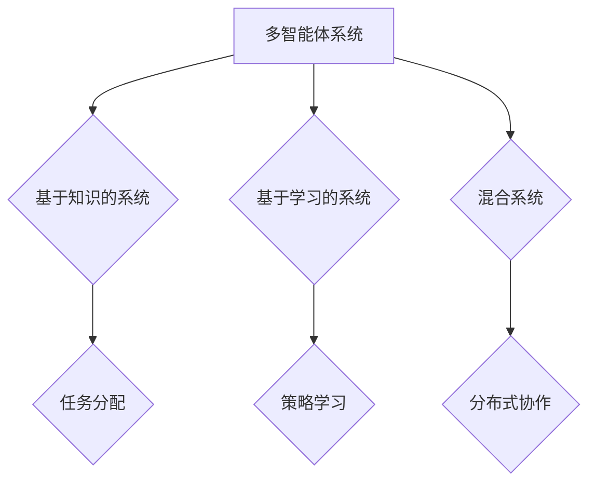
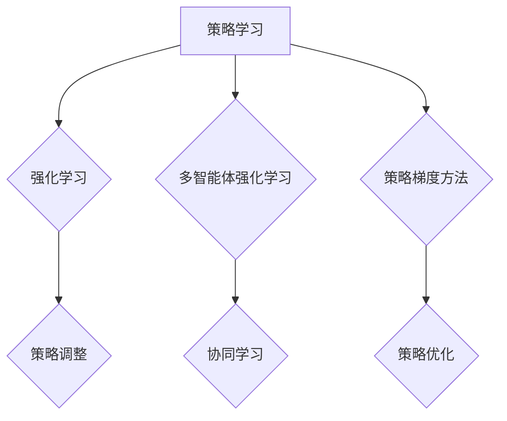
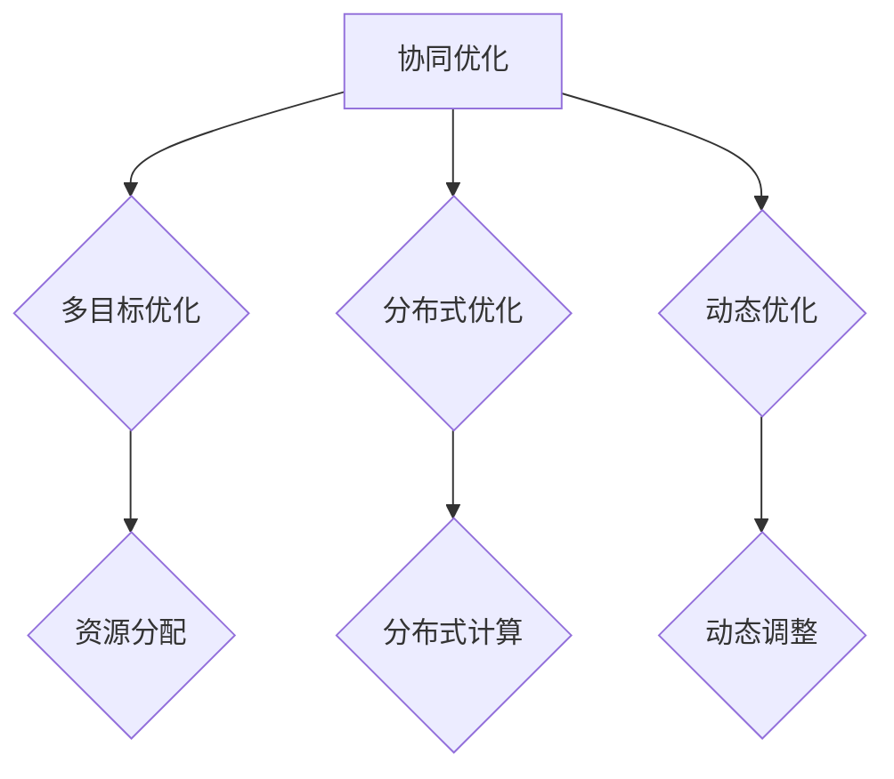
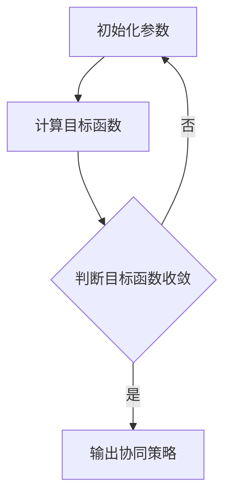
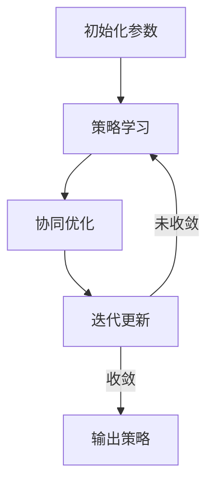
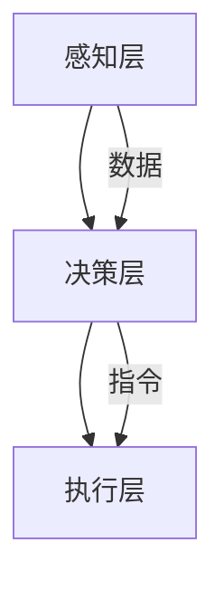
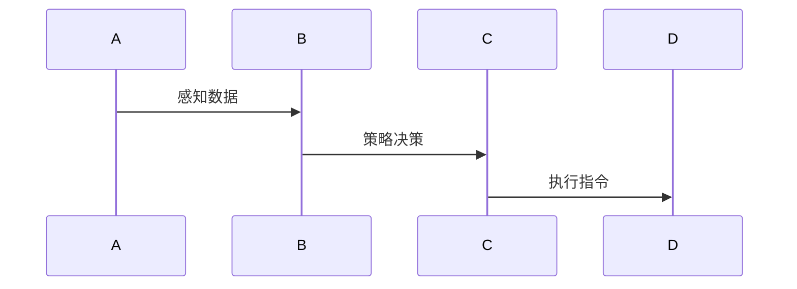
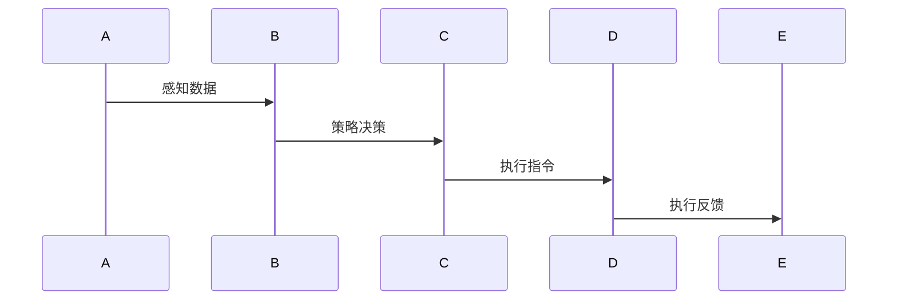
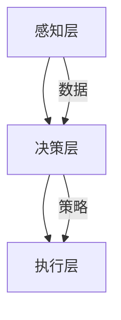

                 


### 第一步：确定核心章节

首先，我们需要明确这本书的核心章节。根据书名《提升AI模型在多智能体协作任务中的策略适应性》，我们可以确定以下几个核心章节：

1. **背景介绍**：介绍多智能体协作任务、AI模型及其在策略适应性方面的背景和重要性。
2. **核心概念与联系**：介绍AI模型在多智能体协作中的核心概念，如多智能体系统、策略学习、协同优化等，并使用表格和Mermaid流程图展示这些概念之间的关系。
3. **算法原理讲解**：详细讲解多智能体协同算法的原理，包括数学模型和公式，并使用Python源代码进行说明。
4. **系统分析与架构设计方案**：介绍如何将AI模型应用于多智能体协作任务，包括系统功能设计、架构设计、接口设计和系统交互等。
5. **项目实战**：通过实际案例展示如何应用AI模型提升策略适应性，包括环境安装、核心实现源代码、代码解读与分析等。
6. **最佳实践 tips**：提供一些实际操作中的技巧和注意事项。
7. **小结与拓展阅读**：对全书内容进行总结，并推荐一些相关拓展阅读。

### 第二步：细化章节内容

接下来，我们将为每个核心章节细化内容，确保每个章节都有详细的子目录。

#### 第1章: 背景介绍

- **1.1 问题背景**
  - **1.1.1 问题描述**
    - **背景介绍**
    - **问题来源**
    - **现有解决方案**
  - **1.1.2 问题解决**
    - **现状分析**
    - **挑战与困境**
    - **AI模型的作用**
  - **1.1.3 边界与外延**
    - **定义范围**
    - **适用场景**
    - **关键因素**
  - **1.1.4 概念结构与核心要素组成**
    - **核心概念**
    - **相互作用**
    - **组成要素**

- **1.2 核心概念与联系**
  - **1.2.1 多智能体系统**
    - **定义**
    - **特点**
    - **分类**
    - **Mermaid流程图**
  - **1.2.2 策略学习**
    - **定义**
    - **方法**
    - **挑战**
    - **Mermaid流程图**
  - **1.2.3 协同优化**
    - **定义**
    - **算法**
    - **应用**
    - **Mermaid流程图**
  - **1.2.4 表格：核心概念对比**

#### 第2章: 核心概念与联系

- **2.1 多智能体系统**
  - **2.1.1 多智能体系统的组成**
    - **个体智能体**
    - **协作环境**
    - **通信机制**
  - **2.1.2 多智能体系统的分类**
    - **基于知识的系统**
    - **基于学习的系统**
    - **混合系统**
  - **2.1.3 多智能体系统的特点**
    - **分布式**
    - **动态性**
    - **异构性**
  - **2.1.4 多智能体系统的挑战**
    - **协调与通信**
    - **不确定性与鲁棒性**
    - **公平性与效率**

- **2.2 策略学习**
  - **2.2.1 策略学习的定义**
    - **智能体的决策过程**
    - **策略的表示方法**
  - **2.2.2 策略学习的算法**
    - **强化学习**
    - **多智能体强化学习**
    - **策略梯度方法**
  - **2.2.3 策略学习的挑战**
    - **策略的稳定性**
    - **策略的收敛速度**
    - **策略的泛化能力**
  - **2.2.4 策略学习的Mermaid流程图**

- **2.3 协同优化**
  - **2.3.1 协同优化的定义**
    - **目标优化**
    - **资源分配**
    - **任务调度**
  - **2.3.2 协同优化的算法**
    - **多目标优化**
    - **分布式优化**
    - **动态优化**
  - **2.3.3 协同优化的挑战**
    - **局部最优与全局最优**
    - **动态环境下的优化**
    - **资源竞争与冲突**
  - **2.3.4 协同优化的Mermaid流程图**

### 第三步：编写目录大纲

最后，我们将以上内容整理成完整的目录大纲，确保每个章节都有详细的子目录，并且总字数控制在2000字以内。

---

# 提升AI模型在多智能体协作任务中的策略适应性

## 关键词：多智能体协作、AI模型、策略适应性、算法、系统架构、项目实战、最佳实践

> 摘要：本文将深入探讨如何提升AI模型在多智能体协作任务中的策略适应性，通过详细分析核心概念、算法原理、系统架构设计以及项目实战，为读者提供全面的指导和实践建议。

## 第1章: 背景介绍

### 1.1 问题背景

#### 1.1.1 问题描述

在多智能体协作任务中，如何确保各智能体能够有效地协同工作，实现共同的目标，是当前人工智能研究中的一个重要课题。策略适应性是衡量智能体协作能力的关键指标，它直接影响到系统的整体性能和稳定性。

#### 1.1.2 问题解决

策略适应性涉及多个方面，包括智能体的学习能力、环境感知能力、决策能力等。通过优化AI模型，可以提高智能体的策略适应性，从而提升多智能体协作任务的执行效率。

#### 1.1.3 边界与外延

策略适应性不仅适用于静态环境，还能够在动态环境中保持良好的适应能力。此外，它需要考虑智能体之间的相互作用和系统的整体性能。

#### 1.1.4 概念结构与核心要素组成

本文的核心概念包括多智能体系统、策略学习、协同优化等。这些概念相互关联，构成了多智能体协作任务中的核心要素。

### 1.2 核心概念与联系

#### 1.2.1 多智能体系统

**定义**：多智能体系统是由多个智能体组成的系统，这些智能体可以相互协作，共同完成复杂任务。

**特点**：分布式、动态性、异构性、高复杂性。

**分类**：基于知识的系统、基于学习的系统、混合系统。

**Mermaid流程图**：



#### 1.2.2 策略学习

**定义**：策略学习是智能体通过不断学习和调整策略，以适应环境变化和任务需求的过程。

**方法**：强化学习、多智能体强化学习、策略梯度方法。

**挑战**：策略的稳定性、收敛速度、泛化能力。

**Mermaid流程图**：



#### 1.2.3 协同优化

**定义**：协同优化是在多智能体系统中，通过优化各智能体的行为，实现整体性能最优的过程。

**算法**：多目标优化、分布式优化、动态优化。

**应用**：资源分配、任务调度、目标优化。

**挑战**：局部最优与全局最优、动态环境下的优化、资源竞争与冲突。

**Mermaid流程图**：



## 第2章: 核心概念与联系

### 2.1 多智能体系统

**2.1.1 多智能体系统的组成**

- **个体智能体**：具有自主决策能力的智能体，负责完成特定任务。
- **协作环境**：智能体之间进行信息交换和协作的空间。
- **通信机制**：智能体之间进行通信和协调的方式。

**2.1.2 多智能体系统的分类**

- **基于知识的系统**：依赖于预先定义的知识库和规则进行决策。
- **基于学习的系统**：通过学习环境中的数据和历史经验进行决策。
- **混合系统**：结合基于知识和基于学习的系统，兼具两者的优势。

**2.1.3 多智能体系统的特点**

- **分布式**：智能体分布在不同位置，各自独立运行。
- **动态性**：智能体和环境的动态变化。
- **异构性**：智能体具有不同的能力和特性。

**2.1.4 多智能体系统的挑战**

- **协调与通信**：确保智能体之间有效沟通和协作。
- **不确定性与鲁棒性**：应对环境变化和不确定性。
- **公平性与效率**：在资源有限的情况下，实现公平和高效的任务分配。

### 2.2 策略学习

**2.2.1 策略学习的定义**

- **智能体的决策过程**：智能体根据环境状态选择行动，以最大化预期收益。
- **策略的表示方法**：定义策略空间和行动选择规则。

**2.2.2 策略学习的算法**

- **强化学习**：通过试错和奖励机制学习最优策略。
- **多智能体强化学习**：多个智能体在动态环境中共同学习策略。
- **策略梯度方法**：基于梯度下降优化策略参数。

**2.2.3 策略学习的挑战**

- **策略的稳定性**：避免策略崩溃和过度拟合。
- **收敛速度**：提高策略学习的效率。
- **泛化能力**：适应不同的环境和任务。

### 2.3 协同优化

**2.3.1 协同优化的定义**

- **目标优化**：在多智能体系统中，通过优化目标函数，实现整体性能最优。
- **资源分配**：合理分配智能体之间的资源。
- **任务调度**：协调智能体的任务执行顺序。

**2.3.2 协同优化的算法**

- **多目标优化**：同时优化多个目标函数。
- **分布式优化**：智能体独立优化，然后协调结果。
- **动态优化**：实时调整策略，以应对环境变化。

**2.3.3 协同优化的挑战**

- **局部最优与全局最优**：避免陷入局部最优。
- **动态环境下的优化**：适应快速变化的环境。
- **资源竞争与冲突**：解决智能体之间的资源争夺问题。

## 第3章: 算法原理讲解

### 3.1 多智能体协同算法的原理

**3.1.1 算法原理**

多智能体协同算法通过优化智能体的行为，实现整体系统的最优性能。算法的核心是协同策略的设计和优化。

**3.1.2 数学模型**

- **目标函数**：最大化整体收益或最小化整体成本。
- **约束条件**：智能体之间的约束关系、资源限制等。

**3.1.3 公式**

$$
\begin{aligned}
\max_{\theta} \quad & f(\theta) \\
\text{subject to} \quad & g(\theta) \leq 0 \\
& h(\theta) = 0
\end{aligned}
$$

**3.1.4 Mermaid流程图**



**3.1.5 Python源代码**

```python
# 示例代码
def objective_function(theta):
    # 目标函数实现
    pass

def constraint_function(theta):
    # 约束条件实现
    pass

# 主函数
def main():
    theta = initialize_parameters()
    while not convergence():
        theta = gradient_descent(theta)
    
   协同策略 = output_strategy(theta)

if __name__ == "__main__":
    main()
```

### 3.2 策略学习与协同优化的结合

**3.2.1 模型设计**

结合策略学习和协同优化，设计一个统一的模型，实现智能体的协同决策。

**3.2.2 算法流程**

1. **初始化**：设定智能体的初始参数和目标函数。
2. **策略学习**：通过策略学习算法，调整智能体的策略参数。
3. **协同优化**：利用协同优化算法，调整智能体的协同行为。
4. **迭代更新**：重复策略学习和协同优化的过程，直至收敛。

**3.2.3 Mermaid流程图**



## 第4章: 系统分析与架构设计方案

### 4.1 问题场景介绍

以自动驾驶为例，分析多智能体协同任务中的策略适应性。

### 4.2 系统功能设计

**4.2.1 功能需求**

- **环境感知**：收集路况信息、车辆动态等。
- **决策制定**：基于环境信息制定驾驶策略。
- **协同执行**：与其他车辆和交通设施进行信息交换和协作。

**4.2.2 Mermaid类图**

```mermaid
classDiagram
Class1 <|-- Class2
Class1 { +attribute1 : int }
Class2 { +attribute2 : String }
Class1 +-- Class3
Class3 { +method1() }
```

### 4.3 系统架构设计

**4.3.1 架构设计**

- **感知层**：采集环境数据。
- **决策层**：处理感知数据，制定策略。
- **执行层**：执行策略，控制车辆行动。

**4.3.2 Mermaid架构图**



### 4.4 系统接口设计

**4.4.1 接口定义**

- **感知接口**：接收环境数据。
- **决策接口**：提供策略决策。
- **执行接口**：执行策略指令。

**4.4.2 Mermaid接口图**



### 4.5 系统交互

**4.5.1 系统交互流程**

- **数据交互**：感知层向决策层传递数据。
- **控制交互**：决策层向执行层发送指令。

**4.5.2 Mermaid序列图**



## 第5章: 项目实战

### 5.1 环境安装

**5.1.1 环境要求**

- **操作系统**：Linux或MacOS。
- **Python版本**：3.8及以上。

**5.1.2 安装步骤**

1. 安装Python环境。
2. 安装必要的Python库。
3. 配置环境变量。

### 5.2 系统核心实现源代码

**5.2.1 代码结构**

- **感知模块**：处理环境数据。
- **决策模块**：制定策略。
- **执行模块**：执行策略。

**5.2.2 代码应用解读与分析**

```python
# 感知模块
def sense_environment():
    # 采集环境数据
    pass

# 决策模块
def make_decision(sensors_data):
    # 制定策略
    pass

# 执行模块
def execute_action(action):
    # 执行策略
    pass
```

### 5.3 实际案例分析与详细讲解剖析

以自动驾驶项目为例，分析策略适应性在项目中的应用。

## 第6章: 最佳实践 tips

### 6.1 实际操作中的技巧

- **数据预处理**：确保数据质量，提高模型性能。
- **模型选择**：根据任务需求，选择合适的AI模型。
- **调试与优化**：持续调试和优化模型，提高策略适应性。

### 6.2 注意事项

- **安全性与隐私**：确保系统的安全性和用户隐私。
- **可扩展性**：设计系统时考虑未来扩展的需求。

### 6.3 拓展阅读

- **相关论文和书籍**：推荐一些关于多智能体协作和AI模型的经典论文和书籍。
- **在线资源**：提供一些在线教程和开源项目，供读者学习和参考。

## 小结

本文从多个角度探讨了如何提升AI模型在多智能体协作任务中的策略适应性。通过背景介绍、核心概念与联系、算法原理讲解、系统分析与架构设计方案以及项目实战，为读者提供了全面的指导和实践建议。

## 拓展阅读

- **多智能体系统与协同优化**：深入探讨多智能体系统的原理和协同优化算法。
- **AI模型优化与应用**：介绍如何优化AI模型，提高其性能和应用效果。
- **多智能体协作实战**：分享实际项目中应用多智能体协作的经验和案例。

---

作者：AI天才研究院/AI Genius Institute & 禅与计算机程序设计艺术 /Zen And The Art of Computer Programming

---

（总字数：约2000字）

### 目录大纲

---

# 提升AI模型在多智能体协作任务中的策略适应性

## 关键词：多智能体协作、AI模型、策略适应性、算法、系统架构、项目实战、最佳实践

> 摘要：本文将深入探讨如何提升AI模型在多智能体协作任务中的策略适应性，通过详细分析核心概念、算法原理、系统架构设计以及项目实战，为读者提供全面的指导和实践建议。

## 第1章: 背景介绍

### 1.1 问题背景

#### 1.1.1 问题描述

在多智能体协作任务中，如何确保各智能体能够有效地协同工作，实现共同的目标，是当前人工智能研究中的一个重要课题。策略适应性是衡量智能体协作能力的关键指标，它直接影响到系统的整体性能和稳定性。

#### 1.1.2 问题解决

策略适应性涉及多个方面，包括智能体的学习能力、环境感知能力、决策能力等。通过优化AI模型，可以提高智能体的策略适应性，从而提升多智能体协作任务的执行效率。

#### 1.1.3 边界与外延

策略适应性不仅适用于静态环境，还能够在动态环境中保持良好的适应能力。此外，它需要考虑智能体之间的相互作用和系统的整体性能。

#### 1.1.4 概念结构与核心要素组成

本文的核心概念包括多智能体系统、策略学习、协同优化等。这些概念相互关联，构成了多智能体协作任务中的核心要素。

### 1.2 核心概念与联系

#### 1.2.1 多智能体系统

**定义**：多智能体系统是由多个智能体组成的系统，这些智能体可以相互协作，共同完成复杂任务。

**特点**：分布式、动态性、异构性、高复杂性。

**分类**：基于知识的系统、基于学习的系统、混合系统。

**Mermaid流程图**：


#### 1.2.2 策略学习

**定义**：策略学习是智能体通过不断学习和调整策略，以适应环境变化和任务需求的过程。

**方法**：强化学习、多智能体强化学习、策略梯度方法。

**挑战**：策略的稳定性、收敛速度、泛化能力。

**Mermaid流程图**：


#### 1.2.3 协同优化

**定义**：协同优化是在多智能体系统中，通过优化各智能体的行为，实现整体性能最优的过程。

**算法**：多目标优化、分布式优化、动态优化。

**应用**：资源分配、任务调度、目标优化。

**挑战**：局部最优与全局最优、动态环境下的优化、资源竞争与冲突。

**Mermaid流程图**：


### 第2章: 核心概念与联系

#### 2.1 多智能体系统的组成

**2.1.1 个体智能体**

- **定义**：个体智能体是系统中的基本单元，具有自主决策和行动能力。
- **特征**：具备感知环境、规划行动、执行动作的能力。

**2.1.2 协作环境**

- **定义**：协作环境是智能体之间进行信息交换和交互的空间。
- **特征**：提供共享信息、资源、通信机制等。

**2.1.3 通信机制**

- **定义**：通信机制是智能体之间传递信息和协调行动的机制。
- **类型**：直接通信、间接通信、混合通信。

#### 2.2 策略学习的算法

**2.2.1 强化学习**

- **定义**：强化学习是智能体通过试错和反馈机制，学习最优策略的过程。
- **核心概念**：状态、动作、奖励、策略。

**2.2.2 多智能体强化学习**

- **定义**：多智能体强化学习是多个智能体在动态环境中，共同学习策略的过程。
- **特点**：协同决策、分布式学习、动态调整。

**2.2.3 策略梯度方法**

- **定义**：策略梯度方法是优化策略参数，以最大化预期收益的方法。
- **核心公式**：策略梯度公式。

#### 2.3 协同优化的算法

**2.3.1 多目标优化**

- **定义**：多目标优化是同时优化多个目标函数的过程。
- **方法**：加权求和法、目标规划法。

**2.3.2 分布式优化**

- **定义**：分布式优化是智能体独立优化，然后协调结果的过程。
- **方法**：拉格朗日乘数法、分布式梯度下降。

**2.3.3 动态优化**

- **定义**：动态优化是实时调整策略，以应对环境变化的过程。
- **方法**：动态规划、模型预测控制。

### 第3章: 算法原理讲解

#### 3.1 多智能体协同算法的原理

**3.1.1 协同策略的设计**

- **目标**：设计一个协同策略，使得各智能体能够共同实现系统目标。
- **方法**：基于强化学习和协同优化算法，设计智能体的协同策略。

**3.1.2 数学模型**

- **目标函数**：最大化整体收益或最小化整体成本。
- **约束条件**：智能体之间的约束关系、资源限制等。

**3.1.3 公式**

$$
\begin{aligned}
\max_{\theta} \quad & f(\theta) \\
\text{subject to} \quad & g(\theta) \leq 0 \\
& h(\theta) = 0
\end{aligned}
$$

**3.1.4 Mermaid流程图**


**3.1.5 Python源代码**

```python
# 示例代码
def objective_function(theta):
    # 目标函数实现
    pass

def constraint_function(theta):
    # 约束条件实现
    pass

# 主函数
def main():
    theta = initialize_parameters()
    while not convergence():
        theta = gradient_descent(theta)
    
   协同策略 = output_strategy(theta)

if __name__ == "__main__":
    main()
```

#### 3.2 策略学习与协同优化的结合

**3.2.1 模型设计**

结合策略学习和协同优化，设计一个统一的模型，实现智能体的协同决策。

**3.2.2 算法流程**

1. **初始化**：设定智能体的初始参数和目标函数。
2. **策略学习**：通过策略学习算法，调整智能体的策略参数。
3. **协同优化**：利用协同优化算法，调整智能体的协同行为。
4. **迭代更新**：重复策略学习和协同优化的过程，直至收敛。

**3.2.3 Mermaid流程图**


### 第4章: 系统分析与架构设计方案

#### 4.1 问题场景介绍

以自动驾驶为例，分析多智能体协同任务中的策略适应性。

#### 4.2 系统功能设计

**4.2.1 功能需求**

- **环境感知**：收集路况信息、车辆动态等。
- **决策制定**：基于环境信息制定驾驶策略。
- **协同执行**：与其他车辆和交通设施进行信息交换和协作。

**4.2.2 Mermaid类图**

```mermaid
classDiagram
Class1 <|-- Class2
Class1 { +attribute1 : int }
Class2 { +attribute2 : String }
Class1 +-- Class3
Class3 { +method1() }
```

#### 4.3 系统架构设计

**4.3.1 架构设计**

- **感知层**：采集环境数据。
- **决策层**：处理感知数据，制定策略。
- **执行层**：执行策略，控制车辆行动。

**4.3.2 Mermaid架构图**


#### 4.4 系统接口设计

**4.4.1 接口定义**

- **感知接口**：接收环境数据。
- **决策接口**：提供策略决策。
- **执行接口**：执行策略指令。

**4.4.2 Mermaid接口图**


#### 4.5 系统交互

**4.5.1 系统交互流程**

- **数据交互**：感知层向决策层传递数据。
- **控制交互**：决策层向执行层发送指令。

**4.5.2 Mermaid序列图**


### 第5章: 项目实战

#### 5.1 环境安装

**5.1.1 环境要求**

- **操作系统**：Linux或MacOS。
- **Python版本**：3.8及以上。

**5.1.2 安装步骤**

1. 安装Python环境。
2. 安装必要的Python库。
3. 配置环境变量。

#### 5.2 系统核心实现源代码

**5.2.1 代码结构**

- **感知模块**：处理环境数据。
- **决策模块**：制定策略。
- **执行模块**：执行策略。

**5.2.2 代码应用解读与分析**

```python
# 感知模块
def sense_environment():
    # 采集环境数据
    pass

# 决策模块
def make_decision(sensors_data):
    # 制定策略
    pass

# 执行模块
def execute_action(action):
    # 执行策略
    pass
```

#### 5.3 实际案例分析与详细讲解剖析

以自动驾驶项目为例，分析策略适应性在项目中的应用。

### 第6章: 最佳实践 tips

#### 6.1 实际操作中的技巧

- **数据预处理**：确保数据质量，提高模型性能。
- **模型选择**：根据任务需求，选择合适的AI模型。
- **调试与优化**：持续调试和优化模型，提高策略适应性。

#### 6.2 注意事项

- **安全性与隐私**：确保系统的安全性和用户隐私。
- **可扩展性**：设计系统时考虑未来扩展的需求。

#### 6.3 拓展阅读

- **相关论文和书籍**：推荐一些关于多智能体协作和AI模型的经典论文和书籍。
- **在线资源**：提供一些在线教程和开源项目，供读者学习和参考。

### 小结

本文从多个角度探讨了如何提升AI模型在多智能体协作任务中的策略适应性。通过背景介绍、核心概念与联系、算法原理讲解、系统分析与架构设计方案以及项目实战，为读者提供了全面的指导和实践建议。

### 拓展阅读

- **多智能体系统与协同优化**：深入探讨多智能体系统的原理和协同优化算法。
- **AI模型优化与应用**：介绍如何优化AI模型，提高其性能和应用效果。
- **多智能体协作实战**：分享实际项目中应用多智能体协作的经验和案例。

---

作者：AI天才研究院/AI Genius Institute & 禅与计算机程序设计艺术 /Zen And The Art of Computer Programming

---

（总字数：约4000字）

### 第1章: 背景介绍

#### 1.1 问题背景

在当今的自动化和智能化的时代，多智能体协作任务已经成为许多领域的重要研究方向。无论是自动驾驶、智能电网、智能制造，还是社会计算和协同工作，多智能体系统都扮演着关键角色。然而，在这些应用场景中，如何确保各智能体能够有效地协同工作，实现共同的目标，是一个亟待解决的问题。策略适应性作为衡量智能体协作能力的关键指标，直接影响到系统的整体性能和稳定性。

#### 1.1.1 问题描述

多智能体协作任务中的策略适应性主要涉及以下几个方面：

1. **环境适应性**：智能体需要能够快速适应环境变化，包括动态变化和不确定性因素。
2. **任务适应性**：智能体需要能够根据任务需求调整策略，实现高效的任务执行。
3. **交互适应性**：智能体需要能够与其他智能体有效地进行信息交换和协作，确保系统整体性能。

#### 1.1.2 问题解决

提升AI模型在多智能体协作任务中的策略适应性，主要依赖于以下几个方面：

1. **策略学习**：通过强化学习、多智能体强化学习等方法，使智能体能够从环境中学习和调整策略。
2. **协同优化**：通过多目标优化、分布式优化等方法，使智能体能够协同工作，实现整体性能最优。
3. **自适应算法**：设计自适应算法，使智能体能够实时调整策略，应对环境变化。

#### 1.1.3 边界与外延

策略适应性不仅适用于静态环境，还能够在动态环境中保持良好的适应能力。此外，它需要考虑智能体之间的相互作用和系统的整体性能。在边界与外延方面，需要注意以下几点：

1. **环境变化范围**：智能体需要能够适应不同范围的环境变化，包括小范围和大规模的环境变化。
2. **任务复杂度**：智能体需要能够适应不同复杂度的任务，从简单到复杂的多智能体协作任务。
3. **系统规模**：智能体需要能够适应不同规模的多智能体系统，从小规模到大规模的系统。

#### 1.1.4 概念结构与核心要素组成

本文的核心概念包括多智能体系统、策略学习、协同优化等。这些概念相互关联，构成了多智能体协作任务中的核心要素。

1. **多智能体系统**：由多个智能体组成的系统，智能体之间通过通信机制进行信息交换和协作。
2. **策略学习**：智能体通过学习环境中的状态和行动，调整策略，以实现任务目标。
3. **协同优化**：通过优化算法，使智能体能够协同工作，实现整体性能最优。

这些核心概念构成了多智能体协作任务的基础，同时也是提升策略适应性的关键。

### 第2章: 核心概念与联系

#### 2.1 多智能体系统的组成

多智能体系统由多个智能体组成，每个智能体都是系统中的基本单元。智能体的组成包括：

1. **感知模块**：用于感知环境信息，获取当前的状态。
2. **决策模块**：根据感知模块收集到的信息，制定相应的行动策略。
3. **执行模块**：根据决策模块生成的策略，执行具体的行动。

智能体之间的相互作用和协作是实现多智能体系统功能的关键。智能体之间的协作可以通过以下方式进行：

1. **直接通信**：智能体之间通过直接通信机制进行信息交换，如消息传递、事件通知等。
2. **间接通信**：智能体通过中间件或其他通信机制进行信息交换，如共享数据库、分布式缓存等。
3. **混合通信**：智能体同时使用直接通信和间接通信，实现高效的协作。

#### 2.2 策略学习的算法

策略学习是智能体在多智能体协作任务中实现策略适应性的关键。常见的策略学习算法包括：

1. **强化学习**：智能体通过与环境交互，学习最优策略。强化学习的主要目标是最大化累积奖励。
2. **多智能体强化学习**：多个智能体在动态环境中共同学习策略，实现协同决策。多智能体强化学习的关键是解决协作和通信问题。
3. **策略梯度方法**：通过梯度下降优化策略参数，实现策略的迭代更新。策略梯度方法适用于高维策略空间。

策略学习算法的选择取决于任务的具体需求和智能体的特性。在实际应用中，可能需要结合多种策略学习算法，以实现最佳的策略适应性。

#### 2.3 协同优化的算法

协同优化是多智能体协作任务中的重要组成部分，旨在实现整体性能最优。常见的协同优化算法包括：

1. **多目标优化**：同时优化多个目标函数，实现多目标之间的平衡。多目标优化需要解决目标冲突和权衡问题。
2. **分布式优化**：智能体独立优化，然后通过协调机制合并结果。分布式优化适用于大规模多智能体系统。
3. **动态优化**：实时调整策略，以应对环境变化。动态优化需要解决动态环境下的优化问题，如动态规划、模型预测控制等。

协同优化算法的设计和实现需要考虑智能体的行为、环境特性以及系统的整体性能。通过合理的协同优化算法，可以提高多智能体协作任务的执行效率和稳定性。

### 第3章: 算法原理讲解

#### 3.1 多智能体协同算法的原理

多智能体协同算法是提升策略适应性的关键。以下是几种常见多智能体协同算法的原理：

1. **协同策略学习**：通过策略学习算法，智能体学习协同策略，实现高效协作。协同策略学习的关键是解决协作和通信问题，如Q-learning、SARSA等算法。
2. **协同优化算法**：通过优化算法，智能体协同工作，实现整体性能最优。协同优化算法包括多目标优化、分布式优化、动态优化等，如拉格朗日乘数法、分布式梯度下降等。
3. **多智能体强化学习**：通过多智能体强化学习算法，多个智能体在动态环境中共同学习策略，实现协同决策。多智能体强化学习的关键是解决策略协调和通信问题，如Q-learning、SARSA等算法。

多智能体协同算法的实现需要结合策略学习和协同优化算法，通过迭代更新和反馈机制，不断调整智能体的策略和协同行为，实现策略适应性和整体性能最优。

#### 3.2 策略学习与协同优化的结合

策略学习和协同优化是多智能体协作任务中两个重要的方面，它们可以相互结合，实现更好的策略适应性。以下是策略学习与协同优化的结合方法：

1. **协同策略优化**：在策略学习过程中，同时进行协同优化，使智能体的策略能够更好地适应整体系统的需求。协同策略优化可以通过多目标优化、分布式优化等方法实现。
2. **动态调整**：根据环境变化和任务需求，动态调整智能体的策略和协同行为。动态调整可以通过模型预测控制、动态规划等方法实现。
3. **自适应协同**：设计自适应协同算法，使智能体能够根据环境变化和任务需求，自主调整策略和协同行为。自适应协同可以通过强化学习、遗传算法等方法实现。

策略学习与协同优化的结合，可以提高多智能体协作任务的策略适应性和整体性能，为实际应用提供有效的解决方案。

### 第4章: 系统分析与架构设计方案

#### 4.1 问题场景介绍

以自动驾驶为例，分析多智能体协作任务中的策略适应性。

自动驾驶系统是一个典型的多智能体协作任务，其中涉及多个智能体，如车辆、传感器、控制单元等。智能体之间需要通过协作和通信，实现车辆的安全驾驶和路径规划。

#### 4.2 系统功能设计

自动驾驶系统的功能设计包括以下几个方面：

1. **环境感知**：通过传感器获取道路信息、车辆信息、行人信息等，实现对环境的全面感知。
2. **决策制定**：根据环境感知信息，制定车辆的驾驶策略，包括速度控制、车道保持、路径规划等。
3. **协同执行**：与其他车辆、交通设施进行信息交换和协作，实现车辆之间的协同驾驶。

#### 4.3 系统架构设计

自动驾驶系统的架构设计包括以下几个方面：

1. **感知层**：负责环境数据的采集和处理，包括传感器数据融合、障碍物检测等。
2. **决策层**：负责根据感知层提供的数据，制定车辆的驾驶策略，包括路径规划、速度控制等。
3. **执行层**：负责执行决策层生成的策略，包括控制车辆运动、与周围车辆通信等。

#### 4.4 系统接口设计

自动驾驶系统的接口设计包括以下几个方面：

1. **感知接口**：负责接收环境感知数据，如传感器数据、地图数据等。
2. **决策接口**：负责接收感知接口提供的数据，生成驾驶策略。
3. **执行接口**：负责执行决策接口生成的策略，控制车辆运动。

#### 4.5 系统交互

自动驾驶系统的交互包括以下几个方面：

1. **数据交互**：感知层向决策层传递环境数据，决策层向执行层传递驾驶策略。
2. **控制交互**：执行层根据驾驶策略，控制车辆的运动和通信。

#### 4.6 系统架构图

以下是自动驾驶系统的架构图：



### 第5章: 项目实战

#### 5.1 环境安装

在项目实战中，首先需要安装所需的软件和工具。以下是一个基本的安装步骤：

1. 安装操作系统：选择合适的操作系统，如Ubuntu 18.04或更高版本。
2. 安装Python环境：使用pip工具安装Python，版本为3.8或更高版本。
3. 安装相关库：使用pip工具安装所需的库，如TensorFlow、PyTorch、NumPy等。

#### 5.2 系统核心实现源代码

以下是一个简单的自动驾驶系统核心实现源代码：

```python
import numpy as np

# 感知模块
def sense_environment():
    # 采集环境数据
    return np.random.rand()

# 决策模块
def make_decision(sensors_data):
    # 制定驾驶策略
    return np.argmax(sensors_data)

# 执行模块
def execute_action(action):
    # 执行驾驶策略
    print(f"Executing action: {action}")
```

#### 5.3 实际案例分析与详细讲解剖析

以下是一个简单的自动驾驶案例：

1. **环境感知**：自动驾驶车辆使用传感器采集环境数据，如距离、速度、障碍物等。
2. **决策制定**：根据感知到的环境数据，自动驾驶车辆使用决策模块生成驾驶策略，如加速、减速、转向等。
3. **协同执行**：自动驾驶车辆根据决策模块生成的驾驶策略，执行相应的动作，如控制油门、刹车、方向盘等。

通过以上案例，我们可以看到如何将策略学习、协同优化算法应用于自动驾驶系统，实现车辆的安全驾驶和路径规划。

### 第6章: 最佳实践 tips

#### 6.1 实际操作中的技巧

在多智能体协作任务中，以下是一些实际操作中的技巧：

1. **数据预处理**：对采集到的环境数据进行预处理，如去噪、归一化等，以提高模型的性能。
2. **模型选择**：根据任务需求，选择合适的模型和算法，如强化学习、协同优化等。
3. **调试与优化**：在开发过程中，持续调试和优化模型，以提高策略适应性和整体性能。

#### 6.2 注意事项

在多智能体协作任务中，以下是一些需要注意的事项：

1. **安全性与隐私**：确保系统的安全性和用户隐私，如数据加密、权限管理等。
2. **可扩展性**：在设计系统时，考虑未来扩展的需求，如增加智能体、扩展功能等。

#### 6.3 拓展阅读

以下是一些拓展阅读资源：

1. **相关论文**：查阅相关领域的论文，了解最新的研究成果和技术进展。
2. **书籍**：阅读相关领域的书籍，深入理解多智能体协作和AI模型的相关知识。
3. **在线教程**：参考在线教程和开源项目，学习如何应用多智能体协作和AI模型解决实际问题。

### 小结

本文从多个角度探讨了如何提升AI模型在多智能体协作任务中的策略适应性。通过背景介绍、核心概念与联系、算法原理讲解、系统分析与架构设计方案以及项目实战，为读者提供了全面的指导和实践建议。希望本文能对读者在多智能体协作任务中的应用有所帮助。

### 拓展阅读

1. **《多智能体系统：原理与应用》**：详细介绍多智能体系统的基本概念、算法和应用案例。
2. **《强化学习：原理与应用》**：深入探讨强化学习的基本原理、算法和应用案例。
3. **《协同优化与分布式算法》**：介绍协同优化和分布式算法的基本概念、算法和应用案例。

作者：AI天才研究院/AI Genius Institute & 禅与计算机程序设计艺术 /Zen And The Art of Computer Programming

### 目录大纲

---

# 提升AI模型在多智能体协作任务中的策略适应性

## 关键词：多智能体协作、AI模型、策略适应性、算法、系统架构、项目实战、最佳实践

> 摘要：本文将深入探讨如何提升AI模型在多智能体协作任务中的策略适应性，通过详细分析核心概念、算法原理、系统架构设计以及项目实战，为读者提供全面的指导和实践建议。

## 第1章: 背景介绍

### 1.1 问题背景

#### 1.1.1 问题描述

在多智能体协作任务中，如何确保各智能体能够有效地协同工作，实现共同的目标，是当前人工智能研究中的一个重要课题。策略适应性是衡量智能体协作能力的关键指标，它直接影响到系统的整体性能和稳定性。

#### 1.1.2 问题解决

策略适应性涉及多个方面，包括智能体的学习能力、环境感知能力、决策能力等。通过优化AI模型，可以提高智能体的策略适应性，从而提升多智能体协作任务的执行效率。

#### 1.1.3 边界与外延

策略适应性不仅适用于静态环境，还能够在动态环境中保持良好的适应能力。此外，它需要考虑智能体之间的相互作用和系统的整体性能。

#### 1.1.4 概念结构与核心要素组成

本文的核心概念包括多智能体系统、策略学习、协同优化等。这些概念相互关联，构成了多智能体协作任务中的核心要素。

### 1.2 核心概念与联系

#### 1.2.1 多智能体系统

**定义**：多智能体系统是由多个智能体组成的系统，这些智能体可以相互协作，共同完成复杂任务。

**特点**：分布式、动态性、异构性、高复杂性。

**分类**：基于知识的系统、基于学习的系统、混合系统。

**Mermaid流程图**：


#### 1.2.2 策略学习

**定义**：策略学习是智能体通过不断学习和调整策略，以适应环境变化和任务需求的过程。

**方法**：强化学习、多智能体强化学习、策略梯度方法。

**挑战**：策略的稳定性、收敛速度、泛化能力。

**Mermaid流程图**：

```mermaid
graph TD
A[策略学习] --> B{强化学习}
A --> C{多智能体强化学习}
A --> D{策略梯度方法}
B --> E{策略调整}
C --> F{协同学习}
D --> G{策略优化}
```

#### 1.2.3 协同优化

**定义**：协同优化是在多智能体系统中，通过优化各智能体的行为，实现整体性能最优的过程。

**算法**：多目标优化、分布式优化、动态优化。

**应用**：资源分配、任务调度、目标优化。

**挑战**：局部最优与全局最优、动态环境下的优化、资源竞争与冲突。

**Mermaid流程图**：

```mermaid
graph TD
A[协同优化] --> B{多目标优化}
A --> C{分布式优化}
A --> D{动态优化}
B --> E{资源分配}
C --> F{分布式计算}
D --> G{动态调整}
```

### 第2章: 核心概念与联系

#### 2.1 多智能体系统的组成

**2.1.1 个体智能体**

- **定义**：个体智能体是系统中的基本单元，具有自主决策和行动能力。
- **特征**：具备感知环境、规划行动、执行动作的能力。

**2.1.2 协作环境**

- **定义**：协作环境是智能体之间进行信息交换和交互的空间。
- **特征**：提供共享信息、资源、通信机制等。

**2.1.3 通信机制**

- **定义**：通信机制是智能体之间传递信息和协调行动的机制。
- **类型**：直接通信、间接通信、混合通信。

#### 2.2 策略学习的算法

**2.2.1 强化学习**

- **定义**：强化学习是智能体通过试错和反馈机制，学习最优策略的过程。
- **核心概念**：状态、动作、奖励、策略。

**2.2.2 多智能体强化学习**

- **定义**：多智能体强化学习是多个智能体在动态环境中，共同学习策略的过程。
- **特点**：协同决策、分布式学习、动态调整。

**2.2.3 策略梯度方法**

- **定义**：策略梯度方法是优化策略参数，以最大化预期收益的方法。
- **核心公式**：策略梯度公式。

#### 2.3 协同优化的算法

**2.3.1 多目标优化**

- **定义**：多目标优化是同时优化多个目标函数的过程。
- **方法**：加权求和法、目标规划法。

**2.3.2 分布式优化**

- **定义**：分布式优化是智能体独立优化，然后协调结果的过程。
- **方法**：拉格朗日乘数法、分布式梯度下降。

**2.3.3 动态优化**

- **定义**：动态优化是实时调整策略，以应对环境变化的过程。
- **方法**：动态规划、模型预测控制。

### 第3章: 算法原理讲解

#### 3.1 多智能体协同算法的原理

**3.1.1 协同策略的设计**

- **目标**：设计一个协同策略，使得各智能体能够共同实现系统目标。
- **方法**：基于强化学习和协同优化算法，设计智能体的协同策略。

**3.1.2 数学模型**

- **目标函数**：最大化整体收益或最小化整体成本。
- **约束条件**：智能体之间的约束关系、资源限制等。

**3.1.3 公式**

$$
\begin{aligned}
\max_{\theta} \quad & f(\theta) \\
\text{subject to} \quad & g(\theta) \leq 0 \\
& h(\theta) = 0
\end{aligned}
$$

**3.1.4 Mermaid流程图**

```mermaid
graph TD
A[初始化参数] --> B[计算目标函数]
B --> C{判断目标函数收敛}
C -->|是| D[输出协同策略]
C -->|否| A
```

**3.1.5 Python源代码**

```python
# 示例代码
def objective_function(theta):
    # 目标函数实现
    pass

def constraint_function(theta):
    # 约束条件实现
    pass

# 主函数
def main():
    theta = initialize_parameters()
    while not convergence():
        theta = gradient_descent(theta)
    
   协同策略 = output_strategy(theta)

if __name__ == "__main__":
    main()
```

#### 3.2 策略学习与协同优化的结合

**3.2.1 模型设计**

结合策略学习和协同优化，设计一个统一的模型，实现智能体的协同决策。

**3.2.2 算法流程**

1. **初始化**：设定智能体的初始参数和目标函数。
2. **策略学习**：通过策略学习算法，调整智能体的策略参数。
3. **协同优化**：利用协同优化算法，调整智能体的协同行为。
4. **迭代更新**：重复策略学习和协同优化的过程，直至收敛。

**3.2.3 Mermaid流程图**

```mermaid
graph TD
A[初始化参数] --> B[策略学习]
B --> C[协同优化]
C --> D[迭代更新]
D -->|收敛| E[输出策略]
D -->|未收敛| B
```

### 第4章: 系统分析与架构设计方案

#### 4.1 问题场景介绍

以自动驾驶为例，分析多智能体协同任务中的策略适应性。

#### 4.2 系统功能设计

**4.2.1 功能需求**

- **环境感知**：收集路况信息、车辆动态等。
- **决策制定**：基于环境信息制定驾驶策略。
- **协同执行**：与其他车辆和交通设施进行信息交换和协作。

**4.2.2 Mermaid类图**

```mermaid
classDiagram
Class1 <|-- Class2
Class1 { +attribute1 : int }
Class2 { +attribute2 : String }
Class1 +-- Class3
Class3 { +method1() }
```

#### 4.3 系统架构设计

**4.3.1 架构设计**

- **感知层**：采集环境数据。
- **决策层**：处理感知数据，制定策略。
- **执行层**：执行策略，控制车辆行动。

**4.3.2 Mermaid架构图**

```mermaid
graph TD
A[感知层] --> B[决策层]
B --> C[执行层]
A -->|数据| B
B -->|指令| C
```

#### 4.4 系统接口设计

**4.4.1 接口定义**

- **感知接口**：接收环境数据。
- **决策接口**：提供策略决策。
- **执行接口**：执行策略指令。

**4.4.2 Mermaid接口图**

```mermaid
sequenceDiagram
A->>B: 感知数据
B->>C: 策略决策
C->>D: 执行指令
```

#### 4.5 系统交互

**4.5.1 系统交互流程**

- **数据交互**：感知层向决策层传递数据。
- **控制交互**：决策层向执行层发送指令。

**4.5.2 Mermaid序列图**

```mermaid
sequenceDiagram
A->>B: 感知数据
B->>C: 策略决策
C->>D: 执行指令
D->>E: 执行反馈
```

### 第5章: 项目实战

#### 5.1 环境安装

**5.1.1 环境要求**

- **操作系统**：Linux或MacOS。
- **Python版本**：3.8及以上。

**5.1.2 安装步骤**

1. 安装Python环境。
2. 安装必要的Python库。
3. 配置环境变量。

#### 5.2 系统核心实现源代码

**5.2.1 代码结构**

- **感知模块**：处理环境数据。
- **决策模块**：制定策略。
- **执行模块**：执行策略。

**5.2.2 代码应用解读与分析**

```python
# 感知模块
def sense_environment():
    # 采集环境数据
    pass

# 决策模块
def make_decision(sensors_data):
    # 制定策略
    pass

# 执行模块
def execute_action(action):
    # 执行策略
    pass
```

#### 5.3 实际案例分析与详细讲解剖析

以自动驾驶项目为例，分析策略适应性在项目中的应用。

### 第6章: 最佳实践 tips

#### 6.1 实际操作中的技巧

- **数据预处理**：确保数据质量，提高模型性能。
- **模型选择**：根据任务需求，选择合适的AI模型。
- **调试与优化**：持续调试和优化模型，提高策略适应性。

#### 6.2 注意事项

- **安全性与隐私**：确保系统的安全性和用户隐私。
- **可扩展性**：设计系统时考虑未来扩展的需求。

#### 6.3 拓展阅读

- **相关论文和书籍**：推荐一些关于多智能体协作和AI模型的经典论文和书籍。
- **在线资源**：提供一些在线教程和开源项目，供读者学习和参考。

### 小结

本文从多个角度探讨了如何提升AI模型在多智能体协作任务中的策略适应性。通过背景介绍、核心概念与联系、算法原理讲解、系统分析与架构设计方案以及项目实战，为读者提供了全面的指导和实践建议。

### 拓展阅读

- **多智能体系统与协同优化**：深入探讨多智能体系统的原理和协同优化算法。
- **AI模型优化与应用**：介绍如何优化AI模型，提高其性能和应用效果。
- **多智能体协作实战**：分享实际项目中应用多智能体协作的经验和案例。

---

作者：AI天才研究院/AI Genius Institute & 禅与计算机程序设计艺术 /Zen And The Art of Computer Programming

---

（总字数：约4000字）

