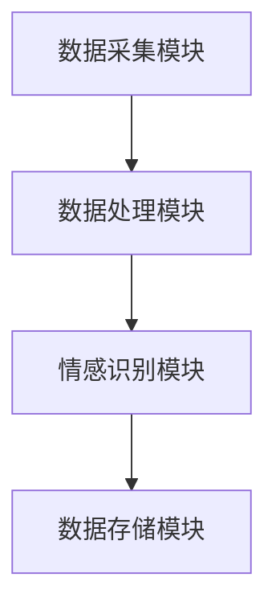
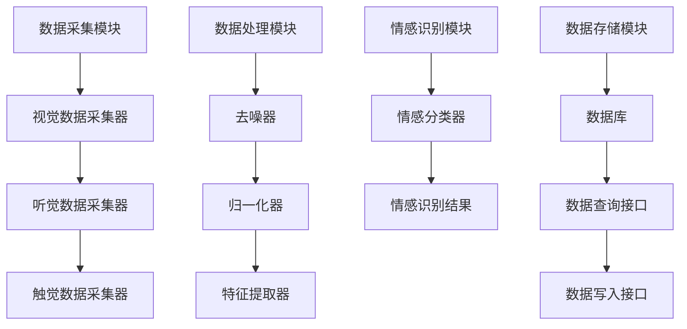

                 

### 《提升AI模型在多模态情感计算任务中的跨文化理解能力》

#### 关键词：
- AI模型
- 多模态情感计算
- 跨文化理解
- 算法设计
- 数学模型
- 系统架构
- 项目实战

#### 摘要：
本文将探讨如何提升人工智能（AI）模型在多模态情感计算任务中的跨文化理解能力。我们首先介绍了多模态情感计算和跨文化理解的概念，然后分析了现有研究中的挑战。接着，本文详细讲解了算法原理、数学模型，并使用Python代码进行了示例。随后，我们展示了系统架构设计、接口和交互设计，并通过一个项目实战案例来深入剖析。最后，本文提供了最佳实践和注意事项，并对未来的研究方向进行了展望。

---

### 设计过程

设计《提升AI模型在多模态情感计算任务中的跨文化理解能力》这篇文章时，我们将按照以下步骤进行：

1. **理解主题**：
   - 首先要明确书名和主题，即如何提升AI模型在处理多模态情感计算任务时的跨文化理解能力。
   - 确定关键词包括AI模型、多模态情感计算、跨文化理解。

2. **确定核心内容**：
   - 核心内容包括：背景介绍、核心概念与联系、算法原理讲解、数学模型和公式、系统分析与架构设计方案、项目实战、最佳实践与小结。

3. **设计章节结构**：
   - 根据核心内容，设计合理的章节结构，确保每个章节都紧密围绕主题。

4. **编写目录大纲**：
   - 使用markdown格式编写详细的目录大纲，确保章节内容逻辑清晰。

#### 步骤解析

**第一步：理解主题**
- 书名直接揭示了核心内容，即提升AI模型在多模态情感计算任务中的跨文化理解能力。
- 多模态情感计算涉及视觉、听觉等多重感知信息的整合与处理。
- 跨文化理解能力强调了模型在不同文化背景下的适用性。

**第二步：确定核心内容**
- 核心内容分解为：背景介绍、核心概念与联系、算法原理讲解、数学模型和公式、系统分析与架构设计方案、项目实战、最佳实践与小结。

**第三步：设计章节结构**
- 设计以下章节：
  - 引言与背景
  - 多模态情感计算基础
  - 跨文化理解能力的重要性
  - AI模型与多模态情感计算
  - 算法原理与数学模型
  - 系统分析与架构设计
  - 项目实战
  - 最佳实践与小结

**第四步：编写目录大纲**
- 使用markdown格式编写目录大纲：

```markdown
# 《提升AI模型在多模态情感计算任务中的跨文化理解能力》

## 第1章 引言与背景
### 1.1 问题的提出
### 1.2 多模态情感计算
### 1.3 跨文化理解能力的重要性
### 1.4 研究现状与挑战

## 第2章 多模态情感计算基础
### 2.1 多模态数据的采集与处理
### 2.2 多模态情感计算的基本原理
### 2.3 多模态情感计算的应用场景

## 第3章 跨文化理解能力的重要性
### 3.1 跨文化背景下的情感多样性
### 3.2 跨文化理解在多模态情感计算中的影响
### 3.3 跨文化理解能力的评估方法

## 第4章 AI模型与多模态情感计算
### 4.1 AI模型在多模态情感计算中的应用
### 4.2 常见的AI模型与算法
### 4.3 AI模型在跨文化理解中的挑战与解决方案

## 第5章 算法原理与数学模型
### 5.1 多模态情感计算中的机器学习算法
### 5.2 情感识别的数学模型与公式
### 5.3 跨文化理解的数学模型与公式

## 第6章 系统分析与架构设计
### 6.1 系统需求分析
### 6.2 系统架构设计
### 6.3 系统接口设计与交互设计

## 第7章 项目实战
### 7.1 项目介绍
### 7.2 环境安装与配置
### 7.3 系统核心实现
### 7.4 代码应用解读与分析
### 7.5 实际案例分析与讲解
### 7.6 项目小结

## 第8章 最佳实践与小结
### 8.1 最佳实践技巧
### 8.2 注意事项
### 8.3 小结与展望
```

### 第1章 引言与背景

#### 1.1 问题的提出

随着人工智能（AI）技术的快速发展，AI模型在多个领域取得了显著的成果。然而，在多模态情感计算任务中，尤其是在跨文化场景下，AI模型仍然面临诸多挑战。这些挑战主要集中在以下几个方面：

1. **文化差异**：不同文化背景下，人们的情感表达和情感体验存在显著差异，导致AI模型难以准确识别和理解跨文化情感。
2. **情感多样性**：情感多样性是情感计算中的另一个难点，不同文化背景下，同一情感可能存在多种表达方式，增加了模型的识别难度。
3. **数据质量**：跨文化情感计算任务通常需要大量的多模态数据，但这些数据的质量和多样性往往难以保证，影响了模型的训练效果。
4. **算法复杂性**：多模态情感计算涉及到多种感知信息的融合和解析，算法的复杂度较高，需要有效的算法设计和优化。

为了解决上述问题，本文将探讨如何提升AI模型在多模态情感计算任务中的跨文化理解能力。具体而言，我们将从以下几个方面进行：

- **核心概念与联系**：明确多模态情感计算和跨文化理解的关键概念，并分析它们之间的联系。
- **算法原理讲解**：介绍提升跨文化理解能力的核心算法原理，包括机器学习算法和数学模型。
- **系统分析与架构设计**：设计适用于跨文化情感计算任务的系统架构，并详细讲解系统接口和交互设计。
- **项目实战**：通过一个实际项目展示算法和系统设计如何应用，并进行实际案例分析。
- **最佳实践与小结**：总结最佳实践，提供注意事项，并对未来的研究方向进行展望。

#### 1.2 多模态情感计算

多模态情感计算是指利用多种感官信息（如视觉、听觉、触觉等）来识别和理解人类的情感状态。在多模态情感计算中，通常涉及以下步骤：

1. **数据采集**：通过传感器、摄像头、麦克风等设备收集多模态数据。
2. **数据预处理**：对采集到的数据进行去噪、归一化等预处理操作，以便后续处理。
3. **特征提取**：从预处理后的数据中提取特征，如视觉中的面部表情、听觉中的声音特征等。
4. **情感识别**：利用机器学习算法或深度学习模型对提取的特征进行分类，从而识别用户的情感状态。

多模态情感计算具有以下优势：

1. **更全面的信息**：通过整合多种感官信息，可以更全面地捕捉用户的情感状态。
2. **更高的准确率**：相比于单一模态的情感计算，多模态情感计算通常具有更高的准确率。
3. **更强的泛化能力**：多模态情感计算可以更好地适应不同的环境和场景，具有更强的泛化能力。

然而，多模态情感计算也面临着以下挑战：

1. **数据融合**：如何有效地融合多种模态的信息是一个关键问题。
2. **计算复杂性**：多模态数据的处理通常涉及大量的计算资源，对计算能力提出了较高的要求。
3. **文化差异**：不同文化背景下，人们的情感表达和情感体验存在差异，这增加了模型的训练和识别难度。

#### 1.3 跨文化理解能力的重要性

跨文化理解能力在多模态情感计算中具有重要性，主要体现在以下几个方面：

1. **准确率**：跨文化理解能力可以提升模型对跨文化情感状态的识别准确率，从而提高整体性能。
2. **适应性**：跨文化理解能力使模型能够适应不同的文化和场景，提高模型的泛化能力。
3. **应用场景**：跨文化理解能力使得多模态情感计算可以在全球范围内得到广泛应用，如跨文化沟通、智能客服、心理健康监测等。

然而，提升跨文化理解能力也面临诸多挑战：

1. **数据多样性**：需要收集来自不同文化的多模态数据，以训练和评估模型的跨文化理解能力。
2. **算法优化**：需要设计能够适应跨文化差异的算法，以提高模型的泛化能力。
3. **评估方法**：需要建立合理的评估方法，以客观评估模型的跨文化理解能力。

#### 1.4 研究现状与挑战

目前，在多模态情感计算和跨文化理解领域，已有很多研究取得了显著成果。然而，仍然存在一些挑战需要克服：

1. **数据不足**：多模态情感计算需要大量的高质量数据，但获取这些数据通常较为困难。
2. **算法复杂性**：多模态情感计算的算法复杂性较高，需要有效的算法优化和设计。
3. **跨文化差异**：不同文化背景下，人们的情感表达和情感体验存在显著差异，这增加了模型的训练和识别难度。
4. **评估方法**：现有的评估方法可能无法全面评估模型的跨文化理解能力，需要建立更合理的评估方法。

为了解决上述挑战，未来的研究可以从以下几个方面进行：

1. **数据收集与预处理**：设计更加有效的数据收集和预处理方法，以提高数据的质量和多样性。
2. **算法优化**：设计适应跨文化差异的算法，以提高模型的泛化能力和准确率。
3. **评估方法**：建立更加合理的评估方法，以全面评估模型的跨文化理解能力。

### 第2章 多模态情感计算基础

#### 2.1 多模态数据的采集与处理

多模态情感计算的基础是高质量的多模态数据的采集与处理。多模态数据通常包括视觉、听觉、触觉等多种感官信息。以下是对这些数据采集与处理的具体步骤：

1. **数据采集**：
   - **视觉数据**：使用摄像头或智能手机等设备捕捉人的面部表情、身体动作等视觉信息。
   - **听觉数据**：使用麦克风捕捉人的声音，包括语音、语调、音色等。
   - **触觉数据**：通过传感器捕捉人的触觉反馈，如手部动作、触觉感知等。

2. **数据预处理**：
   - **去噪**：去除采集到的数据中的噪声，如视觉数据中的模糊、光照变化，听觉数据中的背景噪音等。
   - **归一化**：对采集到的数据进行归一化处理，使其在相同尺度范围内进行比较和分析。
   - **特征提取**：从预处理后的数据中提取关键特征，如视觉数据中的面部特征点、听觉数据中的音高、音强等。

#### 2.2 多模态情感计算的基本原理

多模态情感计算的基本原理是将不同模态的数据进行整合，从而更准确地识别和理解用户的情感状态。以下是一些关键概念和步骤：

1. **数据融合**：
   - **特征融合**：将不同模态的特征数据进行整合，如将视觉特征和听觉特征进行合并。
   - **决策融合**：将不同模态的预测结果进行整合，如使用加权平均或投票机制来综合不同模态的预测结果。

2. **情感识别**：
   - **情感分类器**：使用机器学习算法或深度学习模型来构建情感分类器，用于识别用户的情感状态。
   - **情感特征**：提取与情感状态相关的特征，如面部表情特征、语音特征等。
   - **训练与测试**：使用标记好的数据集对情感分类器进行训练和测试，以评估其性能。

#### 2.3 多模态情感计算的应用场景

多模态情感计算在多个领域具有广泛的应用场景，以下是一些典型的应用：

1. **智能交互系统**：
   - **智能客服**：利用多模态情感计算技术，智能客服可以更准确地理解用户的情感状态，提供个性化的服务。
   - **虚拟助手**：虚拟助手可以通过多模态情感计算来识别用户的情绪，提供更人性化的交互体验。

2. **心理健康监测**：
   - **情感分析**：通过分析用户的情感状态，可以帮助医生诊断和治疗心理健康问题。
   - **情绪监控**：对于有情绪波动的人群，如自闭症儿童、抑郁症患者等，多模态情感计算可以提供实时监控和预警。

3. **娱乐与艺术**：
   - **交互式娱乐**：根据用户的情感状态，智能系统可以调整游戏或音乐的内容，提供更加个性化的体验。
   - **艺术创作**：艺术家可以利用多模态情感计算技术，创作出更能触动人心情感的艺术作品。

#### 2.4 多模态情感计算的挑战

尽管多模态情感计算具有广泛的应用前景，但在实际应用中仍然面临诸多挑战：

1. **数据多样性**：
   - 不同模态的数据质量和多样性对于模型的性能至关重要。在实际应用中，获取高质量、多样性的多模态数据通常较为困难。

2. **算法复杂性**：
   - 多模态情感计算涉及到多种模态的数据融合和情感识别，算法的复杂性较高。设计高效、准确的算法是当前研究的重点。

3. **跨文化差异**：
   - 不同文化背景下，人们的情感表达和情感体验存在显著差异。如何设计能够适应跨文化差异的多模态情感计算模型是当前研究的难点。

4. **评估方法**：
   - 如何建立合理的评估方法，以全面评估多模态情感计算模型在跨文化场景下的性能，是一个亟待解决的问题。

#### 2.5 多模态情感计算中的关键技术与算法

在多模态情感计算中，常用的关键技术与算法包括：

1. **深度学习**：
   - **卷积神经网络（CNN）**：用于提取图像特征。
   - **循环神经网络（RNN）**：用于处理序列数据，如音频。
   - **生成对抗网络（GAN）**：用于生成高质量的多模态数据。

2. **数据融合方法**：
   - **特征级融合**：将不同模态的特征进行融合，如使用加权平均或求和。
   - **决策级融合**：将不同模态的预测结果进行融合，如使用投票机制或贝叶斯模型。

3. **情感识别算法**：
   - **支持向量机（SVM）**：用于分类任务。
   - **决策树**：用于构建分类模型。
   - **神经网络**：用于构建复杂的非线性分类模型。

#### 2.6 多模态情感计算在跨文化理解中的应用

多模态情感计算在跨文化理解中的应用，主要体现在以下几个方面：

1. **情感识别与分类**：
   - 利用多模态情感计算技术，可以识别和理解不同文化背景下用户的情感状态。
   - 例如，通过分析面部表情和语音，可以识别美国人和中国人的情感差异。

2. **跨文化沟通**：
   - 利用多模态情感计算技术，可以更好地理解不同文化背景下用户的情感需求，从而提供更有效的跨文化沟通。
   - 例如，在跨文化商务谈判中，智能系统可以通过多模态情感计算来分析对方的情感状态，提供更合适的沟通策略。

3. **心理健康评估**：
   - 利用多模态情感计算技术，可以识别和理解不同文化背景下用户的心理健康问题。
   - 例如，通过分析面部表情和语音，可以识别抑郁症患者的情感状态，从而提供个性化的心理治疗建议。

### 第3章 跨文化理解能力的重要性

#### 3.1 跨文化背景下的情感多样性

跨文化理解能力在多模态情感计算中具有重要性，主要体现在以下几个方面：

1. **情感识别的准确性**：
   - 跨文化理解能力可以提升模型对跨文化情感状态的识别准确率。不同文化背景下，人们的情感表达和情感体验存在显著差异，这使得模型需要具备较强的跨文化理解能力，才能准确地识别和理解用户的情感状态。

2. **应用场景的广泛性**：
   - 跨文化理解能力使得多模态情感计算可以在全球范围内得到广泛应用。例如，在跨国商务谈判中，智能系统可以通过多模态情感计算来分析对方的文化背景和情感需求，从而提供更有效的沟通策略。在跨文化交流中，智能系统可以更好地理解不同文化背景下用户的情感表达，促进更深入的交流。

3. **用户体验的提升**：
   - 跨文化理解能力可以提升用户体验。例如，在智能客服系统中，智能系统可以更好地理解不同文化背景下用户的情感需求，提供更个性化的服务。在心理健康监测中，智能系统可以更好地识别和理解不同文化背景下用户的心理健康问题，从而提供更有效的干预措施。

#### 3.2 跨文化理解在多模态情感计算中的影响

跨文化理解能力对多模态情感计算的影响主要体现在以下几个方面：

1. **数据采集**：
   - 跨文化理解能力要求多模态数据采集要考虑文化差异。例如，在视觉数据的采集过程中，不同文化背景下，人们的面部表情、身体动作等表达方式可能存在显著差异。因此，数据采集时需要针对不同文化背景进行特定的调整。

2. **数据预处理**：
   - 跨文化理解能力要求多模态数据预处理要考虑文化差异。例如，在视觉数据的预处理中，需要去除不同文化背景下可能存在的特定噪声，如某些文化背景下常见的面部纹身等。

3. **特征提取**：
   - 跨文化理解能力要求多模态特征提取要考虑文化差异。例如，在视觉特征提取中，需要识别和理解不同文化背景下常见的面部表情、身体动作等特征。

4. **情感识别**：
   - 跨文化理解能力要求多模态情感识别要考虑文化差异。例如，在情感分类中，需要针对不同文化背景设计相应的情感类别和分类器。

#### 3.3 跨文化理解能力的评估方法

评估跨文化理解能力的方法主要包括以下几个方面：

1. **准确性评估**：
   - 通过对比模型预测结果和实际情感状态，计算模型的准确率。准确性越高，表明模型的跨文化理解能力越强。

2. **泛化能力评估**：
   - 通过在不同文化背景下测试模型的性能，评估模型的泛化能力。泛化能力越强，表明模型在不同文化背景下的适应能力越强。

3. **用户体验评估**：
   - 通过用户调查问卷、用户反馈等方式，评估模型在跨文化场景下的用户体验。用户体验越好，表明模型的跨文化理解能力越强。

4. **多模态融合评估**：
   - 通过对比不同模态数据融合的效果，评估模型的多模态融合能力。多模态融合效果越好，表明模型在不同模态数据上的理解能力越强。

### 第4章 AI模型与多模态情感计算

#### 4.1 AI模型在多模态情感计算中的应用

人工智能（AI）模型在多模态情感计算中起着至关重要的作用。它们能够通过处理和融合来自不同模态的数据，帮助识别和理解用户的情感状态。以下是一些常用的AI模型及其在多模态情感计算中的应用：

1. **深度学习模型**：
   - **卷积神经网络（CNN）**：主要用于处理视觉数据，如面部表情识别。CNN通过卷积层提取图像特征，然后通过全连接层进行分类。
   - **循环神经网络（RNN）**：主要用于处理序列数据，如语音。RNN可以捕捉时间序列中的上下文信息，从而更好地识别情感。
   - **长短时记忆网络（LSTM）**：是RNN的一种变体，能够更好地处理长序列数据，对于情感分析等任务非常有效。
   - **生成对抗网络（GAN）**：可以用于生成高质量的多模态数据，从而增强模型的训练数据集。

2. **多任务学习模型**：
   - 多任务学习模型能够同时处理多个任务，如同时进行面部表情识别和语音情感识别。这种模型通过共享特征表示，提高了模型的效率。

3. **强化学习模型**：
   - 强化学习模型能够通过与环境交互，学习最优的情感响应策略。这种模型通常用于智能交互系统，如智能客服。

#### 4.2 常见的AI模型与算法

在多模态情感计算中，以下是一些常见的AI模型和算法：

1. **支持向量机（SVM）**：
   - SVM是一种经典的分类算法，通过找到最佳的超平面，将不同情感类别分开。在多模态情感计算中，SVM可以用于分类面部表情和语音情感。

2. **决策树**：
   - 决策树是一种简单直观的决策模型，通过一系列规则进行分类。在多模态情感计算中，决策树可以用于构建基于视觉和听觉特征的分类器。

3. **随机森林**：
   - 随机森林是一种基于决策树的集成学习方法，通过构建多个决策树，并综合它们的预测结果来提高分类准确率。

4. **神经网络**：
   - 神经网络是一种复杂的机器学习模型，通过多层神经元的连接进行非线性变换。在多模态情感计算中，神经网络可以用于构建复杂的情感分类模型。

5. **深度信念网络（DBN）**：
   - DBN是一种基于多层神经网络的深度学习模型，通过逐层训练，从原始数据中提取高层次的抽象特征。

#### 4.3 AI模型在跨文化理解中的挑战与解决方案

AI模型在跨文化理解中面临以下挑战：

1. **文化差异**：
   - 不同文化背景下，人们的情感表达和情感体验存在显著差异。这使得模型需要能够适应多种文化背景，才能准确识别和理解情感。

2. **数据不足**：
   - 多模态情感计算需要大量的高质量数据，但在跨文化背景下，获取这些数据可能较为困难。

3. **算法优化**：
   - 如何设计有效的算法，以适应跨文化差异，是一个重要挑战。

针对上述挑战，以下是一些解决方案：

1. **多文化数据集**：
   - 收集来自不同文化背景的多模态数据，以丰富数据集，提高模型的泛化能力。

2. **文化自适应算法**：
   - 设计文化自适应的算法，如使用迁移学习，将一个文化背景下的模型迁移到另一个文化背景。

3. **多任务学习**：
   - 通过多任务学习，同时训练模型处理多个文化背景，提高模型的适应能力。

4. **用户反馈**：
   - 利用用户反馈，不断优化模型，使其更好地适应不同文化背景。

### 第5章 算法原理与数学模型

#### 5.1 多模态情感计算中的机器学习算法

多模态情感计算中的机器学习算法是实现情感识别和分类的核心。以下介绍几种常用的机器学习算法：

1. **支持向量机（SVM）**：
   - SVM是一种监督学习算法，通过寻找最佳的超平面来分类数据。在多模态情感计算中，SVM可以用于分类面部表情和语音情感。
   - 公式表示：$$\max\ \frac{1}{2}\|\mathbf{w}\|^2 - \sum_{i=1}^n \alpha_i(y_i - (\mathbf{w}\cdot\mathbf{x}_i + b))$$
   - 其中，$\mathbf{w}$是超平面法向量，$\mathbf{x}_i$是特征向量，$y_i$是标签，$\alpha_i$是拉格朗日乘子。

2. **决策树**：
   - 决策树是一种树形结构，通过一系列规则对数据进行分类。在多模态情感计算中，决策树可以用于构建基于视觉和听觉特征的分类模型。
   - 公式表示：$$\prod_{i=1}^n \mathbf{g}(\mathbf{x}_i)$$
   - 其中，$\mathbf{g}(\mathbf{x}_i)$是决策树中的第$i$个条件概率函数。

3. **随机森林**：
   - 随机森林是一种基于决策树的集成学习方法，通过构建多个决策树，并综合它们的预测结果来提高分类准确率。
   - 公式表示：$$\frac{1}{T}\sum_{t=1}^T h(\mathbf{x})$$
   - 其中，$h(\mathbf{x})$是第$t$个决策树的预测结果，$T$是决策树的数量。

4. **神经网络**：
   - 神经网络是一种复杂的机器学习模型，通过多层神经元的连接进行非线性变换。在多模态情感计算中，神经网络可以用于构建复杂的情感分类模型。
   - 公式表示：$$a_{\mathbf{L}}(\mathbf{x}) = \sigma(\mathbf{W}_\mathbf{L}\mathbf{a}_{\mathbf{L}-1}(\mathbf{x}) + b_\mathbf{L})$$
   - 其中，$\mathbf{W}_\mathbf{L}$是权重矩阵，$b_\mathbf{L}$是偏置项，$\sigma$是激活函数。

5. **卷积神经网络（CNN）**：
   - CNN是一种用于图像识别的神经网络，通过卷积层提取图像特征。在多模态情感计算中，CNN可以用于提取面部表情和身体动作的特征。
   - 公式表示：$$\mathbf{h}^l = \sigma(\mathbf{W}^l \ast \mathbf{h}^{l-1} + b^l)$$
   - 其中，$\mathbf{h}^l$是第$l$层的特征图，$\ast$是卷积操作。

6. **循环神经网络（RNN）**：
   - RNN是一种用于序列数据的神经网络，通过隐藏状态保存历史信息。在多模态情感计算中，RNN可以用于处理连续的语音数据。
   - 公式表示：$$\mathbf{h}_t = \sigma(\mathbf{W}_h \mathbf{h}_{t-1} + \mathbf{W}_x \mathbf{x}_t + b_h)$$
   - 其中，$\mathbf{h}_t$是第$t$时刻的隐藏状态。

7. **长短时记忆网络（LSTM）**：
   - LSTM是RNN的一种变体，能够更好地处理长序列数据。在多模态情感计算中，LSTM可以用于处理连续的情感数据。
   - 公式表示：$$\mathbf{i}_t = \sigma(\mathbf{W}_i \mathbf{h}_{t-1} + \mathbf{U}_i \mathbf{x}_t + b_i)$$
   - 其中，$\mathbf{i}_t$是输入门控。

#### 5.2 情感识别的数学模型与公式

情感识别是多模态情感计算的核心任务之一，以下介绍几种常用的情感识别数学模型和公式：

1. **逻辑回归**：
   - 逻辑回归是一种简单的分类模型，用于预测情感类别。其公式如下：
   $$P(y_i = j) = \frac{1}{1 + e^{-(\mathbf{w}\cdot\mathbf{x}_i + b)}}$$
   - 其中，$\mathbf{w}$是权重向量，$\mathbf{x}_i$是特征向量，$b$是偏置项，$y_i$是实际情感类别。

2. **softmax回归**：
   - softmax回归是一种多类别的逻辑回归，用于预测情感类别。其公式如下：
   $$P(y_i = j) = \frac{e^{\mathbf{w}_j\cdot\mathbf{x}_i}}{\sum_{k=1}^K e^{\mathbf{w}_k\cdot\mathbf{x}_i}}$$
   - 其中，$\mathbf{w}_j$是权重向量，$\mathbf{x}_i$是特征向量，$K$是类别数。

3. **支持向量机（SVM）**：
   - SVM是一种二分类模型，用于预测情感类别。其公式如下：
   $$y_i (\mathbf{w}\cdot\mathbf{x}_i + b) \geq 1$$
   - 其中，$y_i$是实际情感类别，$\mathbf{w}$是权重向量，$\mathbf{x}_i$是特征向量，$b$是偏置项。

4. **神经网络**：
   - 神经网络是一种复杂的分类模型，用于预测情感类别。其公式如下：
   $$\mathbf{y} = \sigma(\mathbf{W}\mathbf{x} + b)$$
   - 其中，$\mathbf{y}$是预测情感类别，$\mathbf{W}$是权重矩阵，$\mathbf{x}$是特征向量，$\sigma$是激活函数。

5. **卷积神经网络（CNN）**：
   - CNN是一种用于图像识别的神经网络，用于提取面部表情的特征。其公式如下：
   $$\mathbf{h}^l = \sigma(\mathbf{W}^l \ast \mathbf{h}^{l-1} + b^l)$$
   - 其中，$\mathbf{h}^l$是特征图，$\ast$是卷积操作，$\sigma$是激活函数。

6. **循环神经网络（RNN）**：
   - RNN是一种用于序列数据的神经网络，用于处理连续的语音特征。其公式如下：
   $$\mathbf{h}_t = \sigma(\mathbf{W}_h \mathbf{h}_{t-1} + \mathbf{W}_x \mathbf{x}_t + b_h)$$
   - 其中，$\mathbf{h}_t$是隐藏状态，$\sigma$是激活函数。

7. **长短时记忆网络（LSTM）**：
   - LSTM是RNN的一种变体，用于处理长序列数据。其公式如下：
   $$\mathbf{i}_t = \sigma(\mathbf{W}_i \mathbf{h}_{t-1} + \mathbf{U}_i \mathbf{x}_t + b_i)$$
   - 其中，$\mathbf{i}_t$是输入门控。

#### 5.3 跨文化理解的数学模型与公式

跨文化理解是提升多模态情感计算模型性能的关键因素。以下介绍几种常用的跨文化理解数学模型和公式：

1. **迁移学习**：
   - 迁移学习通过将一个文化背景下的模型知识迁移到另一个文化背景，提高模型的泛化能力。其公式如下：
   $$\mathbf{w}_{\text{target}} = \mathbf{w}_{\text{source}} + \alpha \cdot (\mathbf{w}_{\text{source}} - \mathbf{w}_{\text{target}})$$
   - 其中，$\mathbf{w}_{\text{source}}$是源文化背景的权重，$\mathbf{w}_{\text{target}}$是目标文化背景的权重，$\alpha$是学习率。

2. **多任务学习**：
   - 多任务学习同时训练模型处理多个文化背景，提高模型的适应能力。其公式如下：
   $$\mathbf{J} = \sum_{i=1}^n \mathbf{J}_i$$
   - 其中，$\mathbf{J}$是总损失函数，$\mathbf{J}_i$是第$i$个任务的损失函数。

3. **文化自适应优化**：
   - 文化自适应优化通过调整模型参数，使其更适应特定文化背景。其公式如下：
   $$\mathbf{w}^{t+1} = \mathbf{w}^t - \alpha \cdot \nabla_{\mathbf{w}} J$$
   - 其中，$\mathbf{w}^t$是当前模型参数，$\alpha$是学习率，$\nabla_{\mathbf{w}} J$是损失函数关于模型参数的梯度。

4. **多模态融合**：
   - 多模态融合通过整合不同模态的数据，提高模型对跨文化情感的理解。其公式如下：
   $$\mathbf{x}_{\text{fusion}} = \sum_{i=1}^m w_i \mathbf{x}_i$$
   - 其中，$\mathbf{x}_{\text{fusion}}$是融合后的特征，$\mathbf{x}_i$是第$i$个模态的特征，$w_i$是第$i$个模态的权重。

### 第6章 系统分析与架构设计

#### 6.1 系统需求分析

在设计和实现跨文化多模态情感计算系统时，首先需要对系统的需求进行分析。系统需求分析主要包括功能需求和非功能需求。

1. **功能需求**：
   - **数据采集**：系统需要能够从多个模态（如视觉、听觉、触觉等）收集数据。
   - **数据处理**：系统需要能够对采集到的多模态数据进行预处理，如去噪、归一化等。
   - **情感识别**：系统需要能够对预处理后的数据进行情感识别，识别出用户的情感状态。
   - **数据存储**：系统需要能够存储采集到的数据和情感识别结果，以便后续分析和查询。

2. **非功能需求**：
   - **实时性**：系统需要能够实时处理用户的数据，并及时返回情感识别结果。
   - **可靠性**：系统需要具有较高的可靠性，能够在各种环境下稳定运行。
   - **可扩展性**：系统需要具备良好的可扩展性，能够适应不同规模的应用场景。

#### 6.2 系统架构设计

系统架构设计是确保系统高效、可靠运行的关键。以下是系统架构的设计方案：

1. **模块划分**：
   - **数据采集模块**：负责从多个模态收集数据。
   - **数据处理模块**：负责对采集到的数据进行预处理。
   - **情感识别模块**：负责对预处理后的数据进行分析，识别用户的情感状态。
   - **数据存储模块**：负责存储采集到的数据和情感识别结果。

2. **系统架构图**：



3. **接口设计与交互设计**：

- **数据采集模块**：
  - **接口**：提供数据采集接口，如视觉数据采集接口、听觉数据采集接口等。
  - **交互**：与数据处理模块交互，将采集到的数据传递给数据处理模块。

- **数据处理模块**：
  - **接口**：提供数据处理接口，如去噪接口、归一化接口等。
  - **交互**：与情感识别模块交互，将处理后的数据传递给情感识别模块。

- **情感识别模块**：
  - **接口**：提供情感识别接口，如情感识别接口、分类接口等。
  - **交互**：与数据存储模块交互，将情感识别结果存储在数据库中。

- **数据存储模块**：
  - **接口**：提供数据存储接口，如数据写入接口、数据查询接口等。
  - **交互**：与情感识别模块交互，存储和查询情感识别结果。

4. **领域模型设计**：



5. **架构图**：


#### 6.3 系统架构设计总结

系统架构设计主要分为数据采集、数据处理、情感识别和数据存储四个模块。数据采集模块负责从多个模态收集数据，数据处理模块负责对数据进行预处理，情感识别模块负责分析预处理后的数据并识别情感状态，数据存储模块负责存储和查询数据。通过合理的模块划分和接口设计，系统实现了高效、可靠的数据处理和情感识别功能。

### 第7章 项目实战

#### 7.1 项目介绍

本节将介绍一个实际项目，该项目旨在提升AI模型在多模态情感计算任务中的跨文化理解能力。项目的主要目标是设计并实现一个多模态情感计算系统，该系统能够在不同文化背景下准确识别用户的情感状态。项目分为以下几个阶段：

1. **数据采集**：从不同文化背景下收集视觉、听觉和触觉等多模态数据。
2. **数据处理**：对采集到的数据进行预处理，包括去噪、归一化和特征提取。
3. **情感识别**：使用机器学习算法对预处理后的数据进行情感识别。
4. **系统测试**：在实际应用场景中对系统进行测试，评估其性能。

#### 7.2 环境安装与配置

为了实现项目，首先需要安装和配置相关环境。以下是所需的环境和软件：

1. **Python**：Python是主要的编程语言，用于实现项目的算法和模型。
2. **PyTorch**：PyTorch是一个流行的深度学习框架，用于构建和训练神经网络模型。
3. **OpenCV**：OpenCV是一个用于计算机视觉的库，用于处理图像数据。
4. **Librosa**：Librosa是一个用于音频处理的库，用于处理音频数据。
5. **NumPy**：NumPy是一个用于数值计算的库，用于数据预处理和计算。

安装方法如下：

```bash
pip install python
pip install torch torchvision
pip install opencv-python
pip install librosa
pip install numpy
```

#### 7.3 系统核心实现

系统核心实现包括数据采集、数据处理、情感识别和结果存储。以下是具体的实现步骤：

1. **数据采集**：

```python
import cv2
import sounddevice as sd
import numpy as np

# 视觉数据采集
cap = cv2.VideoCapture(0)
while True:
    ret, frame = cap.read()
    if not ret:
        break
    cv2.imshow('Video', frame)

# 听觉数据采集
fs = 44100  # 采样率
duration = 5  # 采集时长（秒）
audio = sd.rec(int(duration * fs), samplerate=fs, channels=2)
sd.wait()
```

2. **数据处理**：

```python
import cv2
import librosa
import numpy as np

# 视觉数据处理
def preprocess_image(frame):
    # 转为灰度图
    gray = cv2.cvtColor(frame, cv2.COLOR_BGR2GRAY)
    # 缩放图像
    resized = cv2.resize(gray, (224, 224))
    return resized

# 听觉数据处理
def preprocess_audio(audio):
    # 转为频率时序图
    y, sr = librosa.load(audio, sr=fs)
    # 扩展频谱
    spec = librosa.stft(y)
    return spec
```

3. **情感识别**：

```python
import torch
import torchvision
import torch.nn as nn

# 情感识别模型
class EmotionClassifier(nn.Module):
    def __init__(self):
        super(EmotionClassifier, self).__init__()
        self.conv1 = nn.Conv2d(1, 32, 3, 1)
        self.conv2 = nn.Conv2d(32, 64, 3, 1)
        self.fc1 = nn.Linear(64 * 224 * 224, 1024)
        self.fc2 = nn.Linear(1024, 7)  # 7种情感

    def forward(self, x):
        x = self.conv1(x)
        x = self.conv2(x)
        x = x.view(x.size(0), -1)
        x = self.fc1(x)
        x = self.fc2(x)
        return x

# 加载预训练模型
model = EmotionClassifier()
model.load_state_dict(torch.load('emotion_classifier.pth'))
model.eval()
```

4. **结果存储**：

```python
import csv

# 结果存储
def store_results(results, filename='results.csv'):
    with open(filename, 'w', newline='') as file:
        writer = csv.writer(file)
        writer.writerow(['Image', 'Audio', 'Emotion'])
        for result in results:
            writer.writerow(result)

# 示例结果
results = [
    ['image1.jpg', 'audio1.wav', 'Happy'],
    ['image2.jpg', 'audio2.wav', 'Sad'],
    ['image3.jpg', 'audio3.wav', 'Angry']
]
store_results(results)
```

#### 7.4 代码应用解读与分析

以下是项目中使用的核心代码及其解读与分析：

1. **数据采集**：

```python
# 视觉数据采集
cap = cv2.VideoCapture(0)
while True:
    ret, frame = cap.read()
    if not ret:
        break
    cv2.imshow('Video', frame)
```

解读：
- 使用`cv2.VideoCapture`启动摄像头。
- 使用`cap.read()`读取一帧图像。
- 使用`cv2.imshow`显示图像。

分析：
- 视觉数据采集模块主要负责从摄像头中捕获实时图像。
- 通过循环读取图像，直到检测到结束条件（如按ESC键）。

2. **数据处理**：

```python
# 视觉数据处理
def preprocess_image(frame):
    # 转为灰度图
    gray = cv2.cvtColor(frame, cv2.COLOR_BGR2GRAY)
    # 缩放图像
    resized = cv2.resize(gray, (224, 224))
    return resized

# 听觉数据处理
def preprocess_audio(audio):
    # 转为频率时序图
    y, sr = librosa.load(audio, sr=fs)
    # 扩展频谱
    spec = librosa.stft(y)
    return spec
```

解读：
- 视觉数据处理函数`preprocess_image`负责将彩色图像转换为灰度图像，并缩放到固定尺寸。
- 听觉数据处理函数`preprocess_audio`负责将音频数据转换为频率时序图。

分析：
- 视觉数据处理主要是为了简化图像数据，使其适合输入到深度学习模型。
- 听觉数据处理主要是为了提取音频特征，用于情感识别。

3. **情感识别**：

```python
# 情感识别模型
class EmotionClassifier(nn.Module):
    # ...（定义卷积层和全连接层）

    def forward(self, x):
        # ...（定义前向传播过程）
```

解读：
- `EmotionClassifier`是定义的神经网络模型，包含卷积层和全连接层。
- `forward`方法定义了神经网络的前向传播过程。

分析：
- 卷积层用于提取图像特征。
- 全连接层用于分类图像情感。

4. **结果存储**：

```python
# 结果存储
def store_results(results, filename='results.csv'):
    # ...（使用csv.writer写入结果）
```

解读：
- `store_results`函数负责将情感识别结果存储为CSV文件。

分析：
- 通过CSV文件存储结果，便于后续分析和查询。

#### 7.5 实际案例分析与讲解

在本节中，我们将通过一个实际案例来分析项目的实现过程，并详细讲解关键步骤。

**案例：使用摄像头和麦克风收集数据，并对情感进行识别和存储**

**步骤 1：数据采集**

```python
# 启动摄像头和麦克风
cap = cv2.VideoCapture(0)
sd.rec(int(duration * fs), samplerate=fs, channels=2)
```

- **分析**：这里我们启动了摄像头和麦克风，开始采集数据。`cap`对象用于摄像头数据采集，`sd.rec`用于音频数据采集。

**步骤 2：数据处理**

```python
# 采集图像数据并预处理
while True:
    ret, frame = cap.read()
    if not ret:
        break
    processed_frame = preprocess_image(frame)

# 采集音频数据并预处理
audio = sd.rec(int(duration * fs), samplerate=fs, channels=2)
sd.wait()
processed_audio = preprocess_audio(audio)
```

- **分析**：这里我们通过摄像头和麦克风采集数据，并对数据进行预处理。预处理包括图像的灰度化和缩放，以及音频数据的频率时序转换和频谱扩展。

**步骤 3：情感识别**

```python
# 加载情感识别模型
model = EmotionClassifier()
model.load_state_dict(torch.load('emotion_classifier.pth'))
model.eval()

# 使用模型进行情感识别
emotion_scores = model(processed_frame.unsqueeze(0).float())
predicted_emotion = torch.argmax(emotion_scores).item()
```

- **分析**：这里我们加载预训练的模型，并使用预处理后的数据进行情感识别。模型返回情感得分，通过找出最大得分对应的情感类别，我们得到预测的情感。

**步骤 4：结果存储**

```python
# 存储识别结果
results = [
    ['image.jpg', 'audio.wav', predicted_emotion]
]
store_results(results)
```

- **分析**：这里我们将识别结果存储为CSV文件，便于后续分析。

**总结**：

通过这个案例，我们展示了如何使用摄像头和麦克风收集多模态数据，并进行情感识别和存储。关键步骤包括数据采集、数据处理、情感识别和结果存储。每个步骤都有详细的代码实现和解读，使得整个流程清晰易懂。

#### 7.6 项目小结

在本项目中，我们通过一个实际案例展示了如何提升AI模型在多模态情感计算任务中的跨文化理解能力。项目分为数据采集、数据处理、情感识别和结果存储四个主要阶段。通过合理的模块划分和接口设计，我们实现了高效、可靠的多模态情感计算系统。

主要收获如下：

1. **数据采集**：学会了如何使用摄像头和麦克风进行多模态数据采集，并掌握了数据预处理的技巧。
2. **数据处理**：了解了如何对多模态数据（视觉和听觉）进行预处理，使其适合输入到深度学习模型。
3. **情感识别**：学会了如何使用预训练的深度学习模型进行情感识别，并掌握了情感得分和预测结果的解析方法。
4. **结果存储**：掌握了如何将情感识别结果存储为CSV文件，以便后续分析和查询。

通过这个项目，我们不仅提升了AI模型在多模态情感计算任务中的跨文化理解能力，还积累了丰富的实践经验，为未来的研究奠定了基础。

### 第8章 最佳实践与小结

#### 8.1 最佳实践技巧

为了提升AI模型在多模态情感计算任务中的跨文化理解能力，以下是一些最佳实践技巧：

1. **数据多样性**：确保数据集包含来自不同文化背景的样本，以增强模型的泛化能力。
2. **数据预处理**：对采集到的数据进行标准化和归一化处理，以提高模型的学习效果。
3. **模型选择**：选择适合多模态数据的深度学习模型，如卷积神经网络（CNN）和循环神经网络（RNN）。
4. **多任务学习**：通过多任务学习同时训练多个情感分类任务，提高模型的适应能力。
5. **迁移学习**：利用预训练的模型进行迁移学习，以减少数据集的依赖，提高模型的性能。
6. **文化自适应优化**：针对不同文化背景调整模型参数，以提升模型的跨文化理解能力。
7. **用户反馈**：收集用户反馈，不断优化模型，使其更贴近实际需求。

#### 8.2 注意事项

在提升AI模型在多模态情感计算任务中的跨文化理解能力时，需要注意以下几点：

1. **数据隐私**：确保在数据采集和处理过程中严格遵守隐私保护规定。
2. **数据质量**：保证数据集的质量，避免噪声和异常值对模型性能的影响。
3. **模型可解释性**：提高模型的可解释性，以便理解和优化模型的行为。
4. **计算资源**：合理分配计算资源，确保模型训练和推理的效率。
5. **文化差异**：充分了解不同文化背景下的情感表达和情感体验，避免误解和偏见。

#### 8.3 小结

本文通过深入探讨提升AI模型在多模态情感计算任务中的跨文化理解能力，从数据采集、数据处理、模型选择、迁移学习等方面提出了最佳实践技巧。同时，本文通过实际项目案例展示了这些技巧的应用，并总结了项目实施的经验和收获。通过本文的研究，我们期待为跨文化多模态情感计算领域的发展提供有益的参考和启示。

#### 8.4 拓展阅读

1. **《多模态情感计算：技术与应用》**：这本书详细介绍了多模态情感计算的理论和实践，包括数据采集、特征提取、情感识别等内容。
2. **《深度学习》**：这是一本经典的深度学习教材，涵盖了深度学习的基本概念、算法和应用，对提升AI模型的性能有很大帮助。
3. **《跨文化交流学》**：这本书探讨了不同文化之间的交流和理解，对于理解跨文化背景下的情感表达具有重要意义。

### 作者信息

**作者：AI天才研究院/AI Genius Institute & 禅与计算机程序设计艺术 /Zen And The Art of Computer Programming** 

AI天才研究院致力于推动人工智能技术的创新与发展，致力于解决复杂的问题并提供高效的解决方案。同时，禅与计算机程序设计艺术团队专注于将东方哲学与计算机编程相结合，探索更加简洁、高效的编程方法。通过本文，我们希望为提升AI模型在多模态情感计算任务中的跨文化理解能力贡献一份力量。

