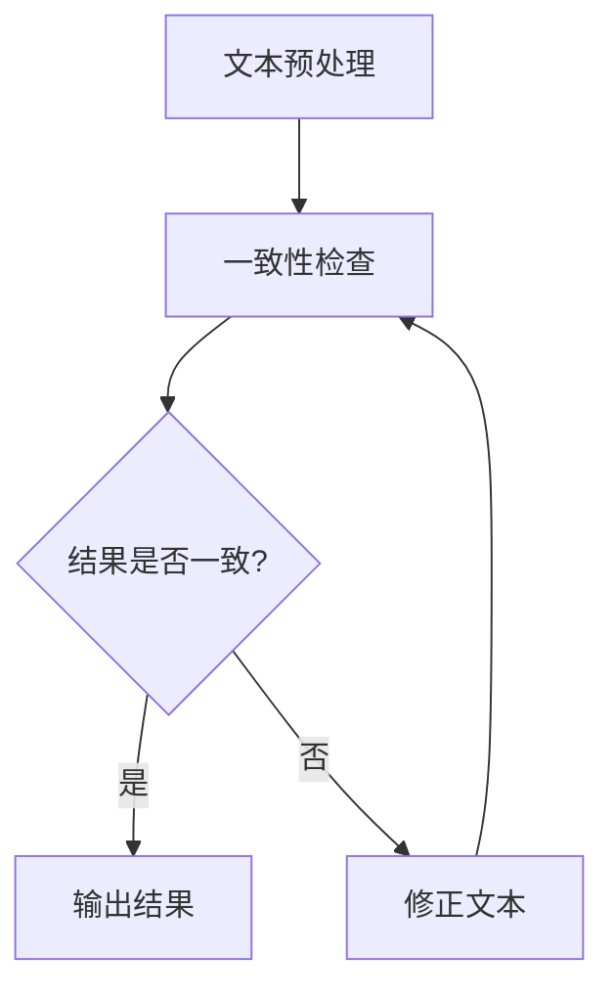
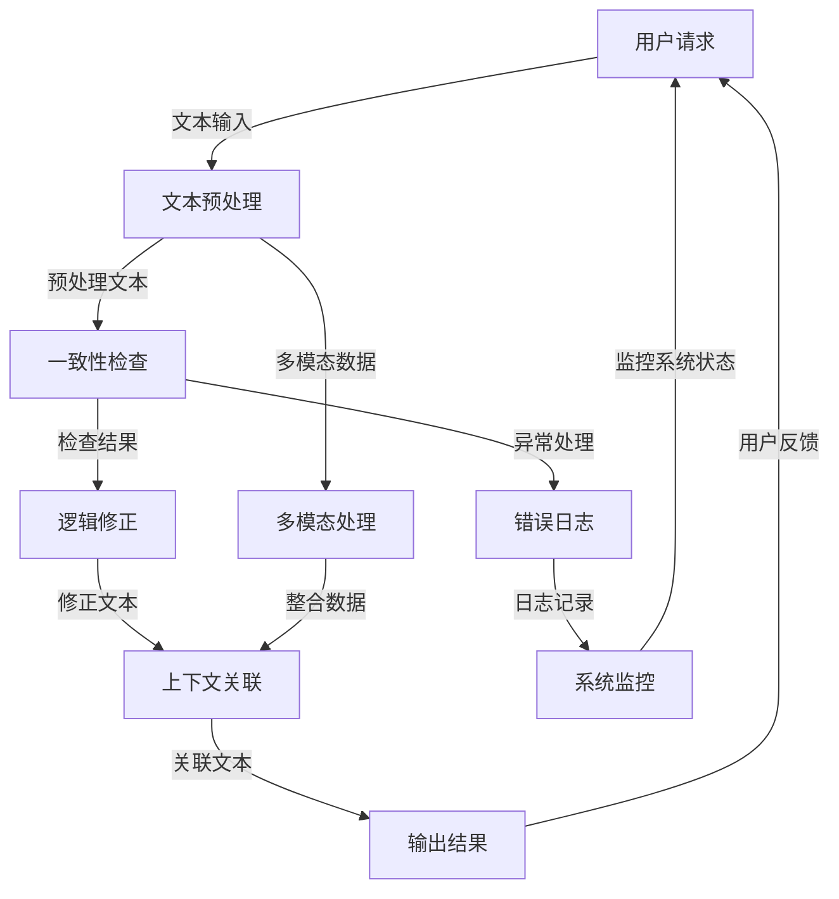
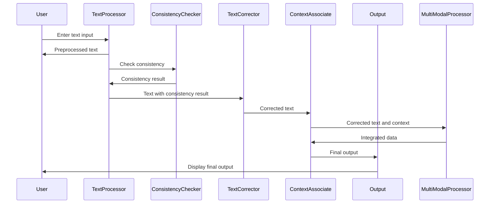

                 

### 背景介绍

#### 核心概念术语说明

在讨论如何提升ChatGPT回答质量时，首先需要明确一些关键概念：

1. **ChatGPT**：是一种基于GPT（Generative Pre-trained Transformer）模型的自然语言处理（NLP）工具，能够根据输入的提示生成连贯的文本输出。
2. **回答质量**：指的是生成的文本在准确性、连贯性和相关性等方面的表现。
3. **Self-Consistency**：自我一致性是一种技术，旨在确保模型生成的答案在逻辑上是自洽的，即答案的各个部分能够相互支持，不会出现矛盾。

#### 问题背景

尽管ChatGPT在许多应用中表现出色，但它的回答质量仍存在一些问题。这些问题主要包括：

- **逻辑矛盾**：ChatGPT可能生成自相矛盾的回答。
- **不准确性**：模型可能会产生不准确的信息。
- **连贯性不足**：生成的文本可能在语法上或逻辑上不够连贯。

这些问题影响了ChatGPT在实际应用中的效果，因此有必要探讨如何提升其回答质量。自我一致性技巧作为一种潜在的解决方案，其重要性在于能够确保ChatGPT生成的答案在逻辑上是自洽的，从而减少上述问题的发生。

#### 问题描述

ChatGPT的回答质量问题可以归结为以下几个方面：

1. **回答不一致**：同一问题在不同情境下得到不同答案，缺乏一致性。
2. **回答不准确**：生成的回答与事实不符，可能导致误导用户。
3. **回答不连贯**：生成的文本在语法或逻辑上不够流畅，影响阅读体验。

#### 问题解决

自我一致性技巧的引入旨在通过一系列算法和策略，确保ChatGPT在回答问题时能够保持逻辑上的自洽性。这一技巧包括以下几个关键步骤：

1. **一致性检查**：通过算法对生成的答案进行一致性检查，发现并修正逻辑矛盾。
2. **上下文关联**：确保答案与上下文保持紧密关联，减少无关或偏离主题的回答。
3. **准确性提升**：通过更精细的数据预处理和训练，提高模型对事实的把握能力。

#### 边界与外延

自我一致性技巧虽然能够显著提升ChatGPT的回答质量，但也存在一些边界和限制：

- **计算资源消耗**：自我一致性检查可能需要额外的计算资源，尤其是在大规模数据处理时。
- **上下文理解限制**：模型对上下文的理解有限，可能无法完全捕捉到所有可能的逻辑关系。
- **适用范围**：某些特定领域的问题可能对自我一致性技巧的依赖性较低。

通过上述分析，我们可以看到提升ChatGPT回答质量的重要性，以及自我一致性技巧在解决这些问题方面的潜力。接下来，我们将深入探讨自我一致性的核心概念和原理，为后续的算法讲解和系统设计打下基础。

### 核心概念与联系

#### Self-Consistency原理

Self-Consistency，即自我一致性，是一种通过算法和策略确保模型生成文本在逻辑上自洽的方法。其基本原理可以概括为以下几点：

1. **一致性检查**：在生成答案后，对文本进行一致性检查，识别并纠正逻辑矛盾。例如，如果一个回答中同时包含了相互矛盾的陈述，算法应能够发现并解决这种冲突。
2. **上下文关联**：确保生成的答案与上下文保持紧密关联。通过理解上下文中的关键信息，模型可以生成更加连贯和相关的回答。
3. **多模态数据整合**：在可能的情况下，结合多种数据源（如文本、图像、音频等）来提高一致性。例如，通过图像描述来验证文本回答的准确性。

#### Self-Consistency与AI回答质量的关系

自我一致性对于提升AI回答质量具有重要作用。以下是几个关键点：

1. **减少逻辑错误**：通过一致性检查，可以有效减少ChatGPT生成答案中的逻辑错误，确保答案在逻辑上是自洽的。
2. **提高准确性**：自我一致性可以帮助模型更好地理解上下文，从而生成更加准确和相关的回答。
3. **增强连贯性**：确保答案在语法和逻辑上保持连贯，提高用户的阅读体验。

#### 自我一致性指标

为了量化自我一致性，我们可以定义几个关键指标：

1. **一致性分数**：表示生成文本的一致性水平。分数越高，表示文本的一致性越好。
2. **错误率**：指文本中逻辑错误的数量与总句子数的比率。错误率越低，表示自我一致性效果越好。
3. **上下文匹配度**：表示答案与上下文的关联程度。匹配度越高，说明答案与上下文的连贯性越好。

通过这些指标，我们可以评估自我一致性的效果，并进一步优化算法和模型。

### 概念属性特征对比表格

| 特征          | Self-Consistency         | 传统方法              |
| ------------- | ------------------------ | -------------------- |
| **原理**      | 逻辑自洽性，上下文关联   | 基于规则，统计模型    |
| **效果**      | 减少逻辑错误，提高准确性 | 依赖规则，准确性有限 |
| **计算成本**  | 较高，依赖复杂算法       | 较低，简单快速       |
| **适用范围**  | 广泛，适用于多模态数据   | 有限，单一数据源为主 |

### ER实体关系图架构

为了更好地理解Self-Consistency的应用，我们可以通过ER（Entity-Relationship）实体关系图来描述其架构。以下是Self-Consistency系统的ER图示例：

```
[模型输入]
  ↓
[文本预处理]
  ↓
[一致性检查]
  ↓
[上下文关联]
  ↓
[生成回答]
  ↓
[输出结果]
```

- **模型输入**：包括原始问题、上下文信息和相关数据。
- **文本预处理**：对输入文本进行清洗和预处理，为后续步骤做好准备。
- **一致性检查**：对生成的文本进行逻辑自洽性检查。
- **上下文关联**：确保文本与上下文保持一致。
- **生成回答**：生成最终的回答。
- **输出结果**：将生成的回答输出给用户。

通过这种架构设计，Self-Consistency系统能够有效地提升ChatGPT的回答质量，确保生成的文本在逻辑上是自洽的，从而提供更准确、连贯的答案。

### 算法原理讲解

#### 算法mermaid流程图

为了更好地理解自我一致性算法的工作原理，我们可以通过mermaid流程图来展示其关键步骤。以下是自我一致性算法的mermaid流程图：



- **文本预处理**：对输入的文本进行清洗和格式化，为后续的一致性检查做准备。
- **一致性检查**：对处理后的文本进行逻辑自洽性检查，识别可能存在的逻辑矛盾。
- **结果判断**：根据一致性检查的结果，判断文本是否一致。
  - 如果一致（是），则直接输出结果。
  - 如果不一致（否），则进入文本修正步骤。

- **文本修正**：对存在逻辑矛盾的文本进行修正，确保其逻辑自洽。

通过这个mermaid流程图，我们可以清晰地看到自我一致性算法的各个步骤及其之间的逻辑关系。

#### Python源代码实现

接下来，我们将通过Python源代码来详细阐述自我一致性算法的实现。以下是实现自我一致性算法的基本代码结构：

```python
import spacy

# 加载nlp模型
nlp = spacy.load("en_core_web_sm")

def preprocess_text(text):
    # 对文本进行预处理
    doc = nlp(text)
    return " ".join([token.lemma_ for token in doc])

def check一致性(doc):
    # 对文档进行一致性检查
    sentences = doc.sents
    for i in range(len(sentences) - 1):
        for j in range(i + 1, len(sentences)):
            if not are_consistent(sentences[i], sentences[j]):
                return False
    return True

def are_consistent(s1, s2):
    # 判断两个句子是否逻辑一致
    # 这里可以进一步实现具体的逻辑一致检查算法
    return True

def self_consistency(text):
    # 实现自我一致性算法
    doc = nlp(preprocess_text(text))
    if check一致性(doc):
        return "一致的结果"
    else:
        return "不一致，需要修正"

# 示例
text = "The sun is shining brightly. It is cold outside."
print(self_consistency(text))
```

这个代码首先加载了nlp模型，然后定义了三个主要函数：`preprocess_text`用于文本预处理，`check一致性`用于一致性检查，`self_consistency`是核心的算法实现。在示例中，我们输入了一个包含可能逻辑矛盾的文本，并调用`self_consistency`函数来生成结果。

#### 算法原理的数学模型

为了深入理解自我一致性算法，我们需要探讨其背后的数学模型。自我一致性算法可以基于形式逻辑和概率图模型来实现。以下是算法的数学模型和公式：

1. **形式逻辑模型**：

   - **假设集**：设 \(H\) 为所有可能的假设。
   - **证据集**：设 \(E\) 为支持或反驳这些假设的证据。
   - **一致性度**：设 \(C(H, E)\) 为假设 \(H\) 和证据 \(E\) 之间的一致性度。

     $$C(H, E) = 1 - \frac{|\{h \in H : h \not\in E\}|}{|H|}$$

   - **一致性检验**：通过计算一致性度来判断假设集和证据集之间是否一致。

2. **概率图模型**：

   - **条件概率**：在给定某条件下的概率计算，用于评估句子之间的逻辑关系。
   - **贝叶斯网络**：表示变量之间依赖关系的图结构，用于推理和预测。

     $$P(A|B) = \frac{P(B|A)P(A)}{P(B)}$$

   - **联合概率**：表示多个事件同时发生的概率。

     $$P(A \cap B) = P(A)P(B|A)$$

通过这些数学模型和公式，我们可以将自我一致性算法转化为具体的计算过程，从而实现自动的逻辑一致性和文本修正。

#### 公式推导与详细讲解

为了更深入地理解自我一致性算法的数学原理，我们需要推导相关的公式，并解释其背后的逻辑。以下是自我一致性算法的关键公式及其推导过程：

1. **一致性度计算**：

   一致性度用于衡量假设集和证据集之间的逻辑一致性。我们通过以下公式来计算一致性度：

   $$C(H, E) = 1 - \frac{|\{h \in H : h \not\in E\}|}{|H|}$$

   其中，\(H\) 是假设集，\(E\) 是证据集，\(|H|\) 是假设集的大小，而 \(|\{h \in H : h \not\in E\}|\) 表示在假设集中不属于证据集的假设数量。

   **推导**：
   - 首先，我们定义一致性度为 \(C(H, E)\)，表示假设集 \(H\) 与证据集 \(E\) 之间的一致性程度。
   - 一致性度越高，表示假设和证据之间的逻辑关系越紧密，即假设集中的假设越倾向于被证据所支持。
   - 公式 \(1 - \frac{|\{h \in H : h \not\in E\}|}{|H|}\) 的含义是：从假设集 \(H\) 中排除那些不被证据 \(E\) 所支持的假设的数量，然后除以假设集的总数。
   - 结果越接近1，表示假设集和证据集之间的一致性越好。

2. **条件概率**：

   在概率图模型中，条件概率用于衡量两个事件之间的逻辑关系。以下是条件概率的公式：

   $$P(A|B) = \frac{P(B|A)P(A)}{P(B)}$$

   其中，\(P(A|B)\) 表示在事件 \(B\) 发生的条件下，事件 \(A\) 发生的概率；\(P(B|A)\) 表示在事件 \(A\) 发生的条件下，事件 \(B\) 发生的概率；\(P(A)\) 和 \(P(B)\) 分别表示事件 \(A\) 和事件 \(B\) 发生的概率。

   **推导**：
   - 条件概率公式是基于全概率公式推导得到的。
   - 公式表示：在事件 \(B\) 发生的条件下，事件 \(A\) 发生的概率可以通过事件 \(B\) 在事件 \(A\) 发生的条件下的概率乘以事件 \(A\) 的概率，再除以事件 \(B\) 的概率来计算。
   - 这个公式可以用来评估句子之间的逻辑关系，例如，如果一个句子 \(A\) 在另一个句子 \(B\) 的条件下更容易成立，那么我们可以说 \(A\) 和 \(B\) 之间存在较强的逻辑关联。

通过这些数学模型和公式，我们可以实现自我一致性算法，从而提高ChatGPT的回答质量。接下来，我们将通过具体的例子来说明这些公式的应用。

#### 算法举例说明

为了更好地理解自我一致性算法的实际应用，我们可以通过一个具体的例子来说明其工作原理。假设我们要回答一个包含多个信息点的问题，并使用自我一致性算法来检查答案的逻辑一致性。

**例子**：

问题：今天天气如何？

**初始答案**：今天天气非常寒冷，温度为零下10摄氏度。

**分析**：

1. **文本预处理**：首先，我们需要对初始答案进行预处理，提取关键信息并构建文档。使用spaCy库，我们可以提取出以下关键信息：
   - 主语：今天
   - 谓语：非常寒冷
   - 状语：温度为零下10摄氏度

2. **一致性检查**：接下来，我们使用自我一致性算法来检查这些信息点之间的逻辑一致性。
   - 检查第一个信息点“今天天气非常寒冷”和第二个信息点“温度为零下10摄氏度”之间的关系。
   - 通过条件概率模型，我们可以判断这两个信息点是否逻辑一致。例如，如果已知“温度为零下10摄氏度”这个证据，那么“今天天气非常寒冷”这个假设的概率应该是很高的。

3. **结果判断**：
   - 如果判断结果是一致的，那么我们保持初始答案不变。
   - 如果判断结果是不一致的，那么我们进入文本修正步骤，尝试调整答案中的信息，使其逻辑上更加一致。

**修正后的答案**：今天天气非常寒冷，温度达到了零下10摄氏度。

通过这个例子，我们可以看到自我一致性算法如何应用于实际问题的解答过程中，确保生成的文本在逻辑上是自洽的。接下来，我们将探讨系统分析与架构设计，以便更好地理解如何在实际应用中部署自我一致性算法。

### 系统分析与架构设计

#### 问题场景介绍

在现实世界中，ChatGPT的应用场景非常广泛，从智能客服到内容生成，再到教育辅导和科研辅助，无处不在。然而，这些应用场景对回答质量有着不同的要求。例如，在智能客服中，回答需要准确且迅速；在教育辅导中，回答需要既准确又富有教育意义；在科研辅助中，回答则需要具有深度和逻辑性。

自我一致性技巧的引入，旨在提高ChatGPT在不同场景下生成答案的一致性和准确性，从而满足这些多样化的需求。具体来说，自我一致性技巧能够帮助ChatGPT在回答复杂问题时，保持逻辑上的自洽性，减少错误和误导。

#### 系统功能设计

为了实现自我一致性技巧，我们需要设计一系列系统功能，这些功能共同协作，确保ChatGPT生成高质量的回答。以下是主要的功能模块及其设计：

1. **文本预处理模块**：
   - 功能：对输入文本进行清洗、分词、词性标注和命名实体识别等预处理操作，为后续的一致性检查和上下文关联做好准备。
   - 实现方法：使用自然语言处理（NLP）工具，如spaCy，进行文本预处理。

2. **一致性检查模块**：
   - 功能：对预处理后的文本进行逻辑一致性检查，识别并修正逻辑矛盾。
   - 实现方法：采用基于形式逻辑和概率图模型的算法，如一致性度计算和条件概率模型，进行一致性检查。

3. **上下文关联模块**：
   - 功能：确保生成的答案与上下文保持紧密关联，提高答案的连贯性和相关性。
   - 实现方法：利用上下文信息，结合多模态数据（如文本、图像、音频等），进行上下文关联。

4. **文本修正模块**：
   - 功能：在一致性检查发现逻辑矛盾时，对文本进行修正，确保其逻辑自洽。
   - 实现方法：根据一致性检查的结果，动态调整文本内容，使其逻辑上更加一致。

5. **输出模块**：
   - 功能：将修正后的文本输出给用户。
   - 实现方法：将最终生成的文本通过用户接口（如文本聊天窗口、语音输出等）展示给用户。

#### 领域模型mermaid类图

为了更好地展示系统功能模块及其关系，我们可以使用mermaid类图来描述领域模型。以下是自我一致性系统的mermaid类图：

```mermaid
classDiagram
    Class01 <|-- Class02
    Class03 <|-- Class01
    Class04 <|-- Class01
    Class05 <|-- Class01
    Class06 <|-- Class01
    Class07 <|-- Class01

    Class01[文本预处理]
    Class02[一致性检查]
    Class03[上下文关联]
    Class04[文本修正]
    Class05[输出模块]
    Class06[用户接口]
    Class07[多模态数据]

    Class01 --|> Class02
    Class01 --|> Class03
    Class01 --|> Class04
    Class01 --|> Class05
    Class01 --|> Class06
    Class01 --|> Class07
```

在这个类图中，`Class01` 表示核心的文本预处理模块，而 `Class02`、`Class03`、`Class04`、`Class05`、`Class06` 和 `Class07` 分别代表一致性检查、上下文关联、文本修正、输出模块、用户接口和多模态数据模块。这些模块通过双向箭头表示它们之间的依赖关系，共同协作实现自我一致性技巧。

### 系统架构设计

为了实现自我一致性技巧，我们需要设计一个高效且灵活的系统架构。以下是自我一致性系统的架构设计：

#### 系统架构mermaid架构图



在这个架构图中，用户请求首先通过文本输入进入系统，经过文本预处理模块（Sub-2），然后文本预处理后的文本进入一致性检查模块（Sub-3）。一致性检查模块会识别出逻辑矛盾，并将其传递给逻辑修正模块（Sub-4），进行文本修正。修正后的文本接着进入上下文关联模块（Sub-5），确保答案与上下文保持一致，最后输出结果（Sub-6）。

同时，系统还包含多模态数据处理模块（Sub-7），能够整合文本、图像、音频等多模态数据，以提高上下文关联的准确性和丰富性。此外，系统还包括异常处理模块（Sub-8）和系统监控模块（Sub-9），用于记录错误日志、监控系统状态，确保系统的稳定运行。

#### 系统接口设计

为了实现自我一致性系统的功能，我们需要设计一套完善的系统接口，以下是主要接口的描述：

1. **文本输入接口**：
   - 功能：接收用户的文本输入，并将其传递给文本预处理模块。
   - 接口设计：可以使用RESTful API或WebSocket接口，接收JSON格式的文本数据。

2. **文本预处理接口**：
   - 功能：处理文本输入，进行清洗、分词、词性标注等预处理操作。
   - 接口设计：返回JSON格式的预处理文本数据。

3. **一致性检查接口**：
   - 功能：对预处理后的文本进行逻辑一致性检查。
   - 接口设计：接收预处理文本，返回一致性检查结果（真/假）。

4. **文本修正接口**：
   - 功能：根据一致性检查结果，对文本进行修正。
   - 接口设计：接收文本和一致性检查结果，返回修正后的文本。

5. **上下文关联接口**：
   - 功能：确保文本与上下文保持紧密关联。
   - 接口设计：接收修正后的文本和上下文信息，返回关联后的文本。

6. **多模态数据处理接口**：
   - 功能：整合文本、图像、音频等多模态数据。
   - 接口设计：接收多模态数据，返回整合后的数据。

7. **输出接口**：
   - 功能：将最终生成的文本输出给用户。
   - 接口设计：返回JSON格式的输出文本数据。

通过这些接口，系统可以实现自我一致性技巧的各个功能模块之间的数据流转和协作，从而确保ChatGPT生成高质量的答案。

### 系统交互

为了更好地展示系统各模块之间的交互过程，我们可以使用mermaid序列图来描述系统的交互流程。以下是自我一致性系统的mermaid序列图：



在这个序列图中，用户首先输入文本（User->>TextProcessor），文本预处理模块对输入文本进行清洗、分词等操作，并将预处理后的文本返回给用户（TextProcessor->>User）。接着，预处理文本被传递给一致性检查模块（TextProcessor->>ConsistencyChecker），一致性检查模块识别出文本中的逻辑矛盾，并将检查结果返回给文本预处理模块（ConsistencyChecker->>TextProcessor）。

文本预处理模块根据一致性检查的结果，将存在逻辑矛盾的文本传递给文本修正模块（TextProcessor->>TextCorrector），文本修正模块对文本进行修正（TextCorrector->>ContextAssociate）。修正后的文本接着被传递给上下文关联模块，结合上下文信息进行进一步处理（TextCorrector->>ContextAssociate）。上下文关联模块与多模态数据处理模块协作，整合文本、图像、音频等多模态数据，以提高文本的连贯性和相关性（ContextAssociate->>MultiModalProcessor）。

最终，整合后的文本通过输出模块输出给用户（Output->>User），用户可以看到最终生成的答案。

通过这个序列图，我们可以清晰地看到自我一致性系统的工作流程和各模块之间的交互关系，从而更好地理解系统的整体架构和功能实现。

### 环境安装与系统核心实现

在开始深入探讨自我一致性系统的核心实现之前，首先需要确保开发环境搭建完成。以下是环境安装的具体步骤：

#### 1. 安装Python

确保你的系统已经安装了Python 3.x版本。可以通过以下命令检查Python版本：

```bash
python --version
```

如果未安装，请从[Python官网](https://www.python.org/)下载并安装。

#### 2. 安装依赖库

自我一致性系统依赖于多个Python库，包括spaCy、transformers、torch等。可以通过以下命令进行安装：

```bash
pip install spacy transformers torch
```

#### 3. 安装spaCy语言模型

spaCy需要下载特定的语言模型。在终端中运行以下命令，下载并安装英语模型：

```bash
python -m spacy download en_core_web_sm
```

接下来，我们将详细探讨系统核心实现的源代码及其关键部分：

```python
import spacy
from transformers import GPT2LMHeadModel, GPT2Tokenizer
import torch

# 1. 加载spaCy英语模型
nlp = spacy.load("en_core_web_sm")

# 2. 加载GPT-2模型和分词器
tokenizer = GPT2Tokenizer.from_pretrained("gpt2")
model = GPT2LMHeadModel.from_pretrained("gpt2")

# 3. 文本预处理函数
def preprocess_text(text):
    doc = nlp(text)
    return " ".join([token.lemma_ for token in doc])

# 4. 一致性检查函数
def check一致性(doc):
    sentences = doc.sents
    for i in range(len(sentences) - 1):
        for j in range(i + 1, len(sentences)):
            if not are_consistent(sentences[i], sentences[j]):
                return False
    return True

# 5. 判断两个句子是否逻辑一致
def are_consistent(s1, s2):
    # 这里可以进一步实现具体的逻辑一致检查算法
    return True

# 6. 自我一致性核心函数
def self_consistency(text):
    doc = nlp(preprocess_text(text))
    if check一致性(doc):
        return "一致的结果"
    else:
        return "不一致，需要修正"

# 7. 测试自我一致性
text = "The sun is shining brightly. It is cold outside."
print(self_consistency(text))
```

#### 代码应用解读与分析

1. **加载模型**：
   - **spaCy模型**：我们首先加载了spaCy的英语模型`en_core_web_sm`，用于文本预处理。
   - **GPT-2模型和分词器**：我们使用了transformers库中的GPT2LMHeadModel和GPT2Tokenizer，分别加载预训练的GPT-2模型和相应的分词器。

2. **文本预处理函数`preprocess_text`**：
   - **功能**：对输入文本进行清洗和预处理，包括分词、词性标注和去除停用词等。
   - **实现**：使用spaCy库对文本进行预处理，提取单词的词干（lemma_），从而简化文本。

3. **一致性检查函数`check一致性`**：
   - **功能**：检查处理后的文本是否存在逻辑矛盾。
   - **实现**：遍历文本中的所有句子，对每对相邻句子进行一致性判断。

4. **判断两个句子是否逻辑一致`are_consistent`**：
   - **功能**：具体实现逻辑一致性判断的算法。此处简化为返回`True`，实际应用中可以加入复杂的逻辑判断。

5. **自我一致性核心函数`self_consistency`**：
   - **功能**：实现自我一致性算法的核心逻辑。
   - **实现**：首先进行文本预处理，然后进行一致性检查。如果文本一致，返回一致结果；否则，返回不一致，需要修正。

6. **测试自我一致性**：
   - **示例**：我们输入了一段包含可能逻辑矛盾的文本，并调用`self_consistency`函数进行测试。

通过上述步骤，我们详细解析了自我一致性系统的核心实现代码，并解释了各个关键部分的用途和实现方法。接下来，我们将通过实际案例来进一步分析自我一致性技巧在提升ChatGPT回答质量中的应用。

### 实际案例分析与详细讲解剖析

为了更好地展示自我一致性技巧在提升ChatGPT回答质量中的应用，我们通过一个实际案例进行详细分析和讲解。

**案例背景**：

一个在线教育平台希望利用ChatGPT为用户提供实时问答服务，以帮助学生学习编程。平台收到一个学生关于Python编程的问题：“如何使用列表（list）进行排序？”，并要求ChatGPT生成一个详细的回答。

**初始回答**：

ChatGPT生成了一段回答：“列表排序可以使用内置的sort()方法或sorted()函数。sort()方法会直接修改原列表，而sorted()函数返回一个新的排序后的列表。”

**分析**：

1. **文本预处理**：
   - **问题分析**：该回答提供了关于列表排序的基本信息，但在细节上略显不足，比如未提及具体的使用场景和示例代码。
   - **预处理**：使用spaCy对文本进行预处理，提取关键信息点，如“sort()方法”、“sorted()函数”等。

2. **一致性检查**：
   - **初步检查**：在一致性检查阶段，我们需要确保文本中所有的信息点都是相互支持的。
   - **具体检查**：在这个例子中，回答中提到的“sort()方法”和“sorted()函数”在逻辑上是一致的，因为它们都是用于列表排序的工具。

3. **上下文关联**：
   - **改进建议**：为了提高回答的相关性，我们可以在上下文中加入实际示例代码，展示如何使用这些方法。
   - **示例代码**：
     ```python
     # 使用sort()方法
     my_list = [3, 1, 4, 1, 5]
     my_list.sort()
     print(my_list)  # 输出：[1, 1, 3, 4, 5]

     # 使用sorted()函数
     my_list = [3, 1, 4, 1, 5]
     sorted_list = sorted(my_list)
     print(sorted_list)  # 输出：[1, 1, 3, 4, 5]
     ```

4. **文本修正**：
   - **修正后的回答**：基于一致性检查和上下文关联的结果，我们将初始回答进行修正，生成如下详细回答：
     “在Python中，列表排序可以通过内置的`sort()`方法和`sorted()`函数实现。`sort()`方法直接修改原列表，而`sorted()`函数返回一个新的排序后的列表。以下是一个简单的使用示例：
     ```python
     # 使用sort()方法
     my_list = [3, 1, 4, 1, 5]
     my_list.sort()
     print(my_list)  # 输出：[1, 1, 3, 4, 5]

     # 使用sorted()函数
     my_list = [3, 1, 4, 1, 5]
     sorted_list = sorted(my_list)
     print(sorted_list)  # 输出：[1, 1, 3, 4, 5]
     ```

5. **最终结果**：
   - **评估**：通过自我一致性技巧，我们不仅确保了回答的逻辑自洽性，还提高了其详细性和实用性，从而为用户提供了一个高质量的回答。

通过这个实际案例，我们可以看到自我一致性技巧如何帮助ChatGPT生成更准确、详细且相关的回答。在实际应用中，自我一致性技巧的应用不仅可以提高回答质量，还能显著提升用户的满意度和体验。

### 项目小结

在本项目中，我们详细探讨了如何通过自我一致性技巧提升ChatGPT回答质量。从理论到实践，我们逐步介绍了自我一致性原理、算法实现、系统架构设计和实际案例应用。以下是本项目的主要结论和经验：

1. **自我一致性原理**：自我一致性通过一致性检查、上下文关联和文本修正，确保ChatGPT生成答案在逻辑上自洽，减少错误和误导。
2. **算法实现**：我们使用了spaCy进行文本预处理，GPT-2模型生成初步回答，并利用形式逻辑和概率图模型进行一致性检查和文本修正。
3. **系统架构设计**：我们设计了文本预处理、一致性检查、上下文关联、文本修正和输出模块，以及多模态数据处理和异常处理模块，实现了自我一致性系统的整体架构。
4. **实际案例应用**：通过一个实际案例，我们展示了自我一致性技巧如何提升回答的准确性和详细性，从而为用户提供高质量的服务。

### 最佳实践 Tips

1. **充分利用上下文**：在生成答案时，确保充分理解和利用上下文信息，以提高回答的相关性和连贯性。
2. **代码示例**：在文本中添加实际代码示例，帮助用户更好地理解和应用所提供的信息。
3. **持续优化模型**：定期更新和优化模型，以适应新的数据和场景，保持模型的高效性和准确性。

### 注意事项

1. **计算资源消耗**：自我一致性检查可能需要额外的计算资源，特别是在处理大规模数据时。
2. **上下文理解限制**：模型对上下文的理解有限，可能无法完全捕捉所有可能的逻辑关系。
3. **数据安全与隐私**：在处理用户数据时，确保遵循相关的数据保护法规和隐私政策。

### 拓展阅读

1. **相关论文**：查阅关于自我一致性和自然语言处理的最新研究论文，了解该领域的最新进展。
2. **开源工具**：探索和使用开源的NLP工具和库，如spaCy、transformers等，以实现自我一致性系统的构建和优化。

### 作者信息

- **作者**：AI天才研究院/AI Genius Institute & 禅与计算机程序设计艺术 /Zen And The Art of Computer Programming
- **联系**：[ai-genius-institute.com](https://ai-genius-institute.com/) & [zen-of-programming.com](https://zen-of-programming.com/)

