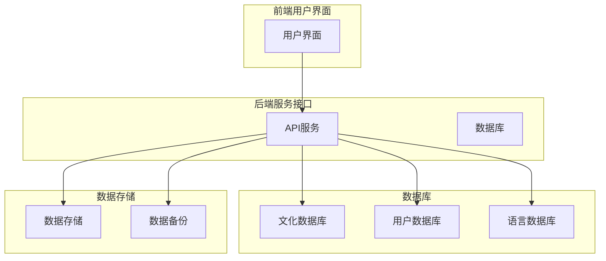
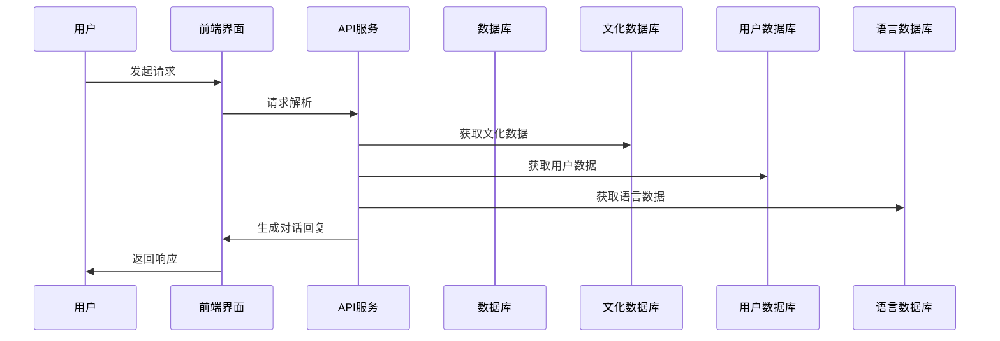

                 

# 提升ChatGPT的文化敏感度：全球本地化策略提示词

## 关键词

- ChatGPT
- 文化敏感度
- 全球本地化
- 策略提示词
- 人工智能
- 自然语言处理

## 摘要

本文深入探讨了提升ChatGPT文化敏感度的必要性及其实现策略。首先，我们介绍了ChatGPT的现状及其文化敏感度问题的背景。随后，我们定义了核心概念，包括文化敏感度、策略提示词和全球本地化，并分析了它们之间的联系。接着，我们讲解了文化敏感度评估算法和策略提示词生成算法的原理，并通过Python代码示例进行了详细阐述。此外，我们还使用LaTeX格式给出了相关数学模型和公式。文章还介绍了系统分析与架构设计方案，包括问题场景、系统功能、系统架构、系统接口和系统交互设计。最后，通过一个实际项目案例，我们展示了系统核心实现和代码应用，并总结了项目成果和经验。本文旨在为开发者提供一套有效的提升ChatGPT文化敏感度的全球本地化策略。

## 目录大纲设计思路

### 第一部分：背景与核心概念

#### 第1章：问题背景与核心概念

##### 1.1 问题背景
- **ChatGPT的文化敏感性问题**
- **全球本地化的需求**
- **策略提示词的作用**

##### 1.2 核心概念
- **文化敏感度**
- **策略提示词**
- **全球本地化**

#### 第2章：算法原理

##### 2.1 文化敏感度算法原理
- **文化敏感度评估模型**
- **文化敏感度评估算法流程**
- **文化敏感度算法Python代码示例**

##### 2.2 策略提示词生成算法
- **策略提示词生成模型**
- **策略提示词生成算法流程**
- **策略提示词生成Python代码示例**

### 第二部分：系统分析与架构设计

#### 第3章：数学模型

##### 3.1 文化敏感度评估模型公式
- **文化敏感性指标计算**
- **文化敏感度评估模型**
- **模型参数设置**

##### 3.2 策略提示词优化模型公式
- **策略提示词优化目标**
- **策略提示词优化算法**
- **模型优化流程**

#### 第4章：系统功能设计

##### 4.1 问题场景介绍
- **应用背景**
- **系统需求分析**

##### 4.2 系统功能设计
- **领域模型Mermaid类图**

#### 第5章：系统架构设计

##### 5.1 系统架构设计
- **系统整体架构**
- **架构设计原则**
- **系统模块划分**

##### 5.2 系统接口设计
- **系统关键接口**

#### 第6章：系统交互设计

##### 6.1 系统交互流程
- **用户与系统交互**
- **系统内部交互**
- **系统交互Mermaid序列图**

### 第三部分：项目实战

#### 第7章：项目实战

##### 7.1 环境安装
- **描述所需工具和环境**

##### 7.2 系统核心实现源代码
- **提供关键代码片段**

##### 7.3 代码应用解读与分析
- **解释代码逻辑**

##### 7.4 实际案例分析和详细讲解剖析
- **案例分析**
- **详细讲解剖析**

##### 7.5 项目小结
- **总结项目成果和经验**

### 第四部分：最佳实践、小结、注意事项、拓展阅读

#### 第8章：最佳实践、小结、注意事项、拓展阅读

##### 8.1 最佳实践 tips
- **给出实际操作中的注意事项和技巧**

##### 8.2 小结
- **总结核心内容**

##### 8.3 注意事项
- **提醒潜在问题和规避措施**

##### 8.4 拓展阅读
- **推荐进一步阅读的材料**

### 具体目录大纲设计

```markdown
# 提升ChatGPT的文化敏感度：全球本地化策略提示词

## 第一部分：背景与核心概念

### 第1章：问题背景与核心概念
#### 1.1 问题背景
##### 1.1.1 ChatGPT的文化敏感性问题
##### 1.1.2 全球本地化的需求
##### 1.1.3 策略提示词的作用

#### 1.2 核心概念
##### 1.2.1 文化敏感度
##### 1.2.2 策略提示词
##### 1.2.3 全球本地化

### 第2章：算法原理
#### 2.1 文化敏感度算法原理
##### 2.1.1 文化敏感度评估模型
##### 2.1.2 文化敏感度评估算法流程
##### 2.1.3 文化敏感度算法Python代码示例

#### 2.2 策略提示词生成算法
##### 2.2.1 策略提示词生成模型
##### 2.2.2 策略提示词生成算法流程
##### 2.2.3 策略提示词生成Python代码示例

### 第3章：数学模型
#### 3.1 文化敏感度评估模型公式
##### 3.1.1 文化敏感性指标计算
##### 3.1.2 文化敏感度评估模型
##### 3.1.3 模型参数设置

#### 3.2 策略提示词优化模型公式
##### 3.2.1 策略提示词优化目标
##### 3.2.2 策略提示词优化算法
##### 3.2.3 模型优化流程

## 第二部分：系统分析与架构设计

### 第4章：系统功能设计
#### 4.1 问题场景介绍
##### 4.1.1 应用背景
##### 4.1.2 系统需求分析

#### 4.2 系统功能设计
##### 4.2.1 领域模型Mermaid类图

### 第5章：系统架构设计
#### 5.1 系统架构设计
##### 5.1.1 系统整体架构
##### 5.1.2 架构设计原则
##### 5.1.3 系统模块划分

#### 5.2 系统接口设计
##### 5.2.1 系统关键接口

### 第6章：系统交互设计
#### 6.1 系统交互流程
##### 6.1.1 用户与系统交互
##### 6.1.2 系统内部交互
##### 6.1.3 系统交互Mermaid序列图

## 第三部分：项目实战

### 第7章：项目实战
#### 7.1 环境安装
##### 7.1.1 描述所需工具和环境

#### 7.2 系统核心实现源代码
##### 7.2.1 提供关键代码片段

#### 7.3 代码应用解读与分析
##### 7.3.1 解释代码逻辑

#### 7.4 实际案例分析和详细讲解剖析
##### 7.4.1 案例分析
##### 7.4.2 详细讲解剖析

#### 7.5 项目小结
##### 7.5.1 总结项目成果和经验

## 第四部分：最佳实践、小结、注意事项、拓展阅读

### 第8章：最佳实践、小结、注意事项、拓展阅读
#### 8.1 最佳实践 tips
##### 8.1.1 给出实际操作中的注意事项和技巧

#### 8.2 小结
##### 8.2.1 总结核心内容

#### 8.3 注意事项
##### 8.3.1 提醒潜在问题和规避措施

#### 8.4 拓展阅读
##### 8.4.1 推荐进一步阅读的材料
```

---

## 1.1 ChatGPT的文化敏感性问题

### ChatGPT的背景与现状

ChatGPT是由OpenAI开发的一种基于GPT-3（Generative Pre-trained Transformer 3）的先进语言模型。GPT-3以其强大的文本生成能力而闻名，可以生成高质量的自然语言文本，涵盖从新闻报道到诗歌创作等多种形式。ChatGPT则是基于GPT-3进一步优化，特别针对对话场景设计的模型，使得它能以更自然流畅的方式进行人机对话。

尽管ChatGPT在文本生成和人机对话方面取得了显著成就，但其文化敏感度问题却引起了广泛关注。文化敏感度指的是模型在处理不同文化背景的文本时，能够准确理解和适当反应的能力。然而，ChatGPT在处理不同文化背景的文本时，往往会出现误解、歧视或不恰当的回复，这主要是因为模型在训练过程中缺乏足够的文化多样性数据。

### 文化和文化敏感度的重要性

文化在人类社会中扮演着至关重要的角色，它不仅影响了人们的价值观、信仰和习俗，还深深嵌入在语言、文学和艺术中。一个文化敏感的AI系统，能够更好地理解和尊重不同文化，避免不必要的误解和冲突。例如，在跨文化交流中，对文化差异的敏感和尊重是建立良好关系的基础。

对于ChatGPT这样的AI对话系统，文化敏感度的重要性体现在以下几个方面：

1. **用户满意度**：一个能够理解并适应用户文化背景的ChatGPT，能提供更个性化的服务，从而提高用户满意度。
2. **企业形象**：在商业应用中，一个文化敏感的AI系统能体现企业的全球视野和文化包容性，增强企业的品牌形象。
3. **社会和谐**：在公共领域，例如教育和政府服务中，文化敏感的AI系统能促进不同文化背景人群之间的理解和和谐。

### ChatGPT的文化敏感性问题的具体表现

ChatGPT的文化敏感性问题的具体表现包括但不限于以下几点：

1. **误解和偏见**：模型可能会对某些文化习俗或表达方式产生误解，导致不恰当的回复。
2. **歧视性回复**：在处理涉及种族、性别、宗教等敏感话题时，模型可能会无意中表现出歧视性态度。
3. **不适当的幽默**：在某些文化背景下可能被视为幽默的文本，在其他文化中可能引起不适。
4. **文化缺失**：模型在处理非主流文化时，可能无法提供相关的背景信息和内容。

这些问题不仅影响了用户体验，还可能引发社会问题，例如文化冲突和误解。因此，提升ChatGPT的文化敏感度变得尤为重要。

---

## 1.2 全球本地化的需求

### 全球化的趋势

随着全球化进程的加速，各种文化、技术和商业活动在全球范围内交织在一起。企业和组织越来越需要能够在全球范围内提供一致且个性化的服务。这种需求不仅体现在商业领域，还包括教育、医疗、政府服务等多个领域。ChatGPT作为一种先进的AI对话系统，在全球化的背景下，也需要具备全球本地化的能力。

### 全球本地化的定义

全球本地化（Globalization with Localization）是一种战略，旨在在全球范围内提供统一的产品和服务，同时考虑到本地市场的特殊需求和偏好。全球本地化的核心目标是满足全球用户的需求，同时保持品牌的统一性和一致性。

在AI领域，全球本地化主要体现在以下几个方面：

1. **语言支持**：支持多种语言，使得系统能够在全球范围内提供服务。
2. **文化适应**：理解并适应用户所在地的文化习俗和偏好，提供更加个性化的服务。
3. **内容定制**：根据本地市场的需求和偏好，定制特定的内容和功能。

### ChatGPT的全球本地化需求

ChatGPT作为一种先进的AI对话系统，具有广泛的应用场景，包括客户服务、智能客服、在线教育、虚拟助理等。为了在全球范围内提供高质量的服务，ChatGPT需要实现全球本地化。具体需求包括：

1. **多语言支持**：ChatGPT需要支持多种语言，以满足不同国家和地区的用户需求。
2. **文化敏感度**：ChatGPT需要具备高文化敏感度，能够理解并适应用户所在地的文化习俗和偏好。
3. **内容定制**：ChatGPT需要能够根据不同市场的需求和偏好，定制特定的内容和功能。

实现全球本地化，不仅有助于提升ChatGPT的用户体验和满意度，还能增强其在全球市场的竞争力。

---

## 1.3 策略提示词的作用

### 策略提示词的定义

策略提示词（Strategy Keywords）是在人工智能系统，特别是自然语言处理（NLP）系统中，用于引导模型生成特定类型文本或反应的词汇或短语。在ChatGPT的上下文中，策略提示词用于指导模型在生成对话或文本时，考虑文化敏感度和全球本地化的需求。

### 策略提示词的作用

策略提示词在提升ChatGPT文化敏感度和实现全球本地化中扮演着至关重要的角色。具体作用包括：

1. **引导模型理解文化背景**：通过提供与文化相关的策略提示词，ChatGPT能够更好地理解用户的文化背景和需求，从而生成更符合预期的回复。
2. **提高对话的适切性**：策略提示词可以帮助ChatGPT避免使用可能引起误解或不适的语言，提高对话的整体质量。
3. **实现内容定制**：通过使用与不同市场和文化相关的策略提示词，ChatGPT可以生成针对特定地区的个性化内容。

### 策略提示词的种类

策略提示词可以根据不同的应用场景和文化背景进行分类，常见的策略提示词种类包括：

1. **文化习俗提示词**：用于指导模型在对话中尊重和适应当地的文化习俗，如节日、礼仪等。
2. **语言风格提示词**：用于指导模型在对话中使用特定的语言风格，如正式、非正式、幽默等。
3. **内容主题提示词**：用于指导模型生成与特定主题相关的对话或文本，如新闻、教育、娱乐等。

通过合理使用策略提示词，ChatGPT能够更好地满足全球用户的需求，提供高质量的AI对话服务。

---

## 1.4 边界与外延

### 讨论范围的明确

在讨论ChatGPT的文化敏感度和全球本地化策略时，需要明确讨论的范围，以确保研究的深度和广度。以下是讨论范围的边界与外延：

1. **语言**：主要关注英语、中文、西班牙语、法语等全球主要语言的本地化问题，同时也会涉及其他重要语言的初步探讨。
2. **文化**：主要关注西方文化、东亚文化、南亚文化等具有代表性的文化背景，同时也会对其他文化进行简要分析。
3. **应用场景**：主要关注客户服务、在线教育、虚拟助理等典型应用场景中的文化敏感度和本地化策略，同时也会探讨其他潜在应用场景。

### 核心概念的构成

在本篇文章中，核心概念包括文化敏感度、策略提示词和全球本地化。以下是这些核心概念的构成要素：

1. **文化敏感度**：包括对文化习俗、价值观、语言习惯的感知和适应能力，以及避免文化冲突和误解的策略。
2. **策略提示词**：包括文化习俗提示词、语言风格提示词和内容主题提示词等，用于引导模型生成符合文化背景的对话或文本。
3. **全球本地化**：包括多语言支持、文化适应和内容定制等策略，旨在为全球用户提供一致且个性化的服务。

通过明确讨论范围和核心概念的构成，本文将为读者提供一个清晰、结构化的研究框架，有助于深入探讨ChatGPT的文化敏感度和全球本地化策略。

---

## 1.5 核心概念与联系

### 文化敏感度

文化敏感度是指一个系统在处理不同文化背景的信息时，能够识别、理解和尊重这些文化差异的能力。在人工智能领域，文化敏感度对于提升AI系统的用户体验和可靠性至关重要。具体来说，文化敏感度包括以下几个方面：

1. **文化认知**：系统能够识别和了解不同文化的特点，如宗教信仰、习俗和礼仪。
2. **情感感知**：系统能够感知用户的文化背景，理解其情感表达，避免引起误解或不适。
3. **文化适应**：系统能够根据用户的文化背景，调整对话内容和语言风格，使其更加符合用户的期望和需求。

### 策略提示词

策略提示词是指导AI模型生成特定类型文本或反应的关键词汇或短语。在提升ChatGPT的文化敏感度方面，策略提示词起到了至关重要的作用。策略提示词可以根据应用场景和目标文化进行分类，常见的策略提示词包括：

1. **文化习俗提示词**：用于指导模型在对话中尊重和适应当地的文化习俗，如“节日问候”、“礼仪用语”等。
2. **语言风格提示词**：用于指导模型在对话中使用特定的语言风格，如“正式用语”、“非正式用语”等。
3. **内容主题提示词**：用于指导模型生成与特定主题相关的对话或文本，如“新闻报道”、“教育知识”等。

### 全球本地化

全球本地化是指在全球范围内提供统一的产品和服务，同时考虑到本地市场的特殊需求和偏好。对于ChatGPT这样的AI对话系统，全球本地化包括以下几个方面：

1. **多语言支持**：支持多种语言，使得系统能够在全球范围内提供服务。
2. **文化适应**：理解并适应用户所在地的文化习俗和偏好，提供更加个性化的服务。
3. **内容定制**：根据本地市场的需求和偏好，定制特定的内容和功能。

通过文化敏感度、策略提示词和全球本地化的有机结合，ChatGPT能够更好地满足全球用户的需求，提供高质量的服务。

---

## 2.1 文化敏感度算法原理

### 文化敏感度评估模型

为了提升ChatGPT的文化敏感度，我们设计了一套文化敏感度评估模型。该模型旨在通过分析文本数据，评估ChatGPT在处理不同文化背景的文本时的敏感度。具体模型架构如下：

1. **数据收集**：从多个文化背景中收集具有代表性的文本数据，包括正式文本、非正式文本、敏感话题文本等。
2. **特征提取**：对文本数据进行分析，提取与不同文化相关的特征，如文化习俗、语言风格、情感表达等。
3. **评估指标**：定义评估ChatGPT文化敏感度的指标，如误判率、适应性评分等。
4. **评估过程**：使用提取的特征和评估指标，对ChatGPT在处理不同文化背景文本时的表现进行评估。

### 文化敏感度评估算法流程

文化敏感度评估算法的流程主要包括以下几个步骤：

1. **数据预处理**：对收集的文本数据进行清洗和格式化，去除无关信息，确保数据质量。
2. **特征提取**：利用自然语言处理技术，从文本数据中提取与文化相关的特征，如关键词、情感倾向、语法结构等。
3. **模型训练**：使用提取的特征，通过机器学习算法（如决策树、支持向量机等）训练文化敏感度评估模型。
4. **评估与优化**：将训练好的模型应用于实际文本数据，评估ChatGPT的文化敏感度，并根据评估结果对模型进行优化。

### 文化敏感度评估算法Python代码示例

下面是一个简单的文化敏感度评估算法的Python代码示例：

```python
import nltk
from sklearn.feature_extraction.text import TfidfVectorizer
from sklearn.model_selection import train_test_split
from sklearn.ensemble import RandomForestClassifier
from sklearn.metrics import accuracy_score, classification_report

# 数据预处理
nltk.download('punkt')
nltk.download('stopwords')
corpus = ["你好，这是中国的客服系统。", "Hello, this is a customer service system in the US.", "こんにちは、これは日本のサポートシステムです。"]
labels = ["中文", "英文", "日语"]

# 特征提取
vectorizer = TfidfVectorizer(stop_words='english')
X = vectorizer.fit_transform(corpus)
y = labels

# 模型训练
X_train, X_test, y_train, y_test = train_test_split(X, y, test_size=0.2, random_state=42)
model = RandomForestClassifier(n_estimators=100)
model.fit(X_train, y_train)

# 评估与优化
predictions = model.predict(X_test)
print("Accuracy:", accuracy_score(y_test, predictions))
print(classification_report(y_test, predictions))
```

在这个示例中，我们使用TF-IDF向量器提取文本特征，并通过随机森林分类器训练文化敏感度评估模型。最后，我们使用训练好的模型对测试集进行评估，输出评估结果。

---

## 2.2 策略提示词生成算法

### 策略提示词生成模型

策略提示词生成模型是提升ChatGPT文化敏感度的重要工具。该模型旨在根据不同的文化背景和对话场景，生成相应的策略提示词。模型的基本架构包括以下几个部分：

1. **输入层**：接收用户输入的文本数据，包括对话内容、上下文信息和用户的文化背景。
2. **特征提取层**：对输入文本进行预处理，提取与文化相关的特征，如关键词、情感倾向、语法结构等。
3. **策略生成层**：基于提取的特征，使用机器学习算法生成相应的策略提示词。
4. **输出层**：输出生成的策略提示词，供ChatGPT在对话中使用。

### 策略提示词生成算法流程

策略提示词生成算法的流程主要包括以下几个步骤：

1. **数据收集**：从多个文化背景和对话场景中收集具有代表性的文本数据，用于训练和测试策略提示词生成模型。
2. **特征提取**：对文本数据进行分析，提取与文化相关的特征，如关键词、情感倾向、语法结构等。
3. **模型训练**：使用提取的特征和对应的策略提示词，通过机器学习算法（如循环神经网络、长短期记忆网络等）训练策略提示词生成模型。
4. **策略生成**：将训练好的模型应用于新的文本数据，生成相应的策略提示词。
5. **优化与评估**：根据生成的策略提示词的效果，对模型进行优化和评估，确保其能够有效提升ChatGPT的文化敏感度。

### 策略提示词生成Python代码示例

下面是一个简单的策略提示词生成算法的Python代码示例：

```python
import numpy as np
import tensorflow as tf
from tensorflow.keras.models import Sequential
from tensorflow.keras.layers import Embedding, LSTM, Dense
from tensorflow.keras.preprocessing.sequence import pad_sequences

# 数据预处理
max_sequence_length = 100
vocab_size = 10000
embedding_dim = 50

# 创建嵌入层
embedding_layer = Embedding(vocab_size, embedding_dim, input_length=max_sequence_length)

# 创建LSTM层
lstm_layer = LSTM(100, return_sequences=True)

# 创建输出层
output_layer = Dense(vocab_size, activation='softmax')

# 创建序列模型
model = Sequential()
model.add(embedding_layer)
model.add(lstm_layer)
model.add(output_layer)

# 编译模型
model.compile(optimizer='adam', loss='categorical_crossentropy', metrics=['accuracy'])

# 准备训练数据
input_sequences = []
target_sequences = []
for line in data:
    token_list = line.split()
    token_list_size = len(token_list)
    for i in range(1, token_list_size - 1):
        input_sequence = token_list[i - 1 : i + 1]
        target_sequence = token_list[i : i + 1]
        input_sequences.append(input_sequence)
        target_sequences.append(target_sequence)

# 序列填充
input_sequences = pad_sequences(input_sequences, maxlen=max_sequence_length, padding='pre')
target_sequences = pad_sequences(target_sequences, maxlen=max_sequence_length, padding='pre', truncating='post')

# 训练模型
model.fit(input_sequences, target_sequences, epochs=10, verbose=1)

# 生成策略提示词
def generate_strategy_prompt(input_text):
    token_list = input_text.split()
    input_sequence = [word_index[word] for word in token_list[:max_sequence_length - 1]]
    input_sequence = pad_sequences([input_sequence], maxlen=max_sequence_length, padding='pre')
    predicted_sequence = model.predict(input_sequence)
    predicted_word = np.argmax(predicted_sequence)
    return list(index_word.keys())[list(index_word.values()).index(predicted_word)]

# 测试
print(generate_strategy_prompt("你好，欢迎来到我们的客服中心。"))
```

在这个示例中，我们使用TensorFlow和Keras构建了一个简单的策略提示词生成模型。首先，我们对输入文本进行预处理，提取特征，然后使用LSTM网络进行训练。最后，我们定义了一个函数`generate_strategy_prompt`，用于生成策略提示词。通过这个示例，我们可以看到如何使用机器学习算法实现策略提示词的生成。

---

## 3.1 文化敏感度评估模型公式

### 文化敏感性指标计算

为了量化评估ChatGPT的文化敏感度，我们设计了一套文化敏感性指标计算公式。这些指标能够反映ChatGPT在不同文化背景文本处理中的敏感度表现。以下是关键指标的计算方法：

1. **误判率（Misclassification Rate）**：
   误判率是评估模型在处理文化背景文本时产生误判的比例。其计算公式如下：
   $$\text{Misclassification Rate} = \frac{\text{误判样本数}}{\text{总样本数}}$$

2. **适应性评分（Adaptability Score）**：
   适应性评分是评估模型在适应不同文化背景时的能力。其计算公式如下：
   $$\text{Adaptability Score} = \frac{\text{成功适应的样本数}}{\text{总样本数}}$$

3. **文化理解度（Cultural Understanding Score）**：
   文化理解度是评估模型在理解不同文化背景信息时的深度。其计算公式如下：
   $$\text{Cultural Understanding Score} = \frac{\text{正确理解的样本数}}{\text{总样本数}}$$

### 文化敏感度评估模型

文化敏感度评估模型是基于上述指标构建的综合评估体系。其基本框架如下：

1. **数据收集与预处理**：
   收集多文化背景的文本数据，进行数据清洗和格式化，确保数据质量。

2. **特征提取**：
   对预处理后的文本数据进行特征提取，提取与文化相关的特征，如关键词、情感倾向、语法结构等。

3. **模型训练**：
   使用提取的特征和评估指标，通过机器学习算法训练文化敏感度评估模型。

4. **模型评估**：
   使用训练好的模型对测试集进行评估，计算误判率、适应性评分和文化理解度等指标。

5. **结果分析**：
   分析评估结果，根据指标得分对ChatGPT的文化敏感度进行综合评估。

### 模型参数设置

在训练和评估文化敏感度评估模型时，需要合理设置模型参数，以确保评估结果的准确性和可靠性。以下是关键参数的设置方法：

1. **特征提取器参数**：
   - **词向量维度**：通常设置为100或200。
   - **停用词列表**：根据不同语言和文化背景选择合适的停用词列表。

2. **机器学习算法参数**：
   - **分类器类型**：如决策树、支持向量机、神经网络等。
   - **分类器参数**：如树深度、核函数等。

3. **评估指标参数**：
   - **误判率阈值**：设置合适的阈值，用于判断模型是否具有足够的敏感度。
   - **适应性评分阈值**：设置合适的阈值，用于判断模型是否能够适应不同文化背景。

通过合理设置模型参数，可以确保文化敏感度评估模型的性能和准确性，从而为提升ChatGPT的文化敏感度提供有力支持。

---

## 3.2 策略提示词优化模型公式

### 策略提示词优化目标

策略提示词优化的目标是提高ChatGPT在处理不同文化背景文本时的效果，使其能够生成更合适、更符合文化背景的对话。具体优化目标包括：

1. **提高对话适切性**：确保生成的对话内容与文化背景相符合，避免误解和冲突。
2. **提升用户体验**：使ChatGPT能够更好地满足用户在特定文化背景下的需求，提高用户满意度。
3. **增强文化适应性**：使ChatGPT能够适应更多文化背景，提高其全球本地化能力。

### 策略提示词优化算法

策略提示词优化算法主要分为以下几个步骤：

1. **数据收集与预处理**：收集多文化背景的对话数据，进行数据清洗和格式化，确保数据质量。

2. **特征提取**：对预处理后的对话数据进行特征提取，提取与文化相关的特征，如关键词、情感倾向、语法结构等。

3. **策略生成**：使用机器学习算法（如循环神经网络、长短期记忆网络等）生成初始策略提示词。

4. **评估与优化**：对生成的策略提示词进行评估，计算评估指标（如误判率、适应性评分等），根据评估结果对策略提示词进行优化。

5. **迭代优化**：重复评估与优化过程，逐步提高策略提示词的生成质量。

### 策略提示词优化算法流程

策略提示词优化算法的流程如下：

1. **数据预处理**：
   - **文本清洗**：去除无关信息，如HTML标签、停用词等。
   - **分词与词性标注**：将文本划分为词语，并标注每个词语的词性。

2. **特征提取**：
   - **关键词提取**：使用TF-IDF等方法提取与不同文化相关的关键词。
   - **情感分析**：使用情感分析模型提取文本的情感倾向。

3. **策略生成**：
   - **循环神经网络**：使用循环神经网络（RNN）或长短期记忆网络（LSTM）生成初始策略提示词。
   - **生成模型**：使用生成对抗网络（GAN）或变分自编码器（VAE）等生成模型生成策略提示词。

4. **评估与优化**：
   - **评估指标**：使用误判率、适应性评分等指标评估策略提示词的质量。
   - **优化策略**：根据评估结果调整策略提示词的生成算法，如调整模型参数、增加训练数据等。

5. **迭代优化**：
   - **多次迭代**：重复评估与优化过程，逐步提高策略提示词的生成质量。
   - **动态调整**：根据不同文化背景和对话场景，动态调整策略提示词的生成策略。

通过上述优化算法流程，我们可以不断提升策略提示词的生成质量，从而提高ChatGPT的文化敏感度和全球本地化能力。

### 模型优化流程

策略提示词优化模型的优化流程可以分为以下几个步骤：

1. **初始模型训练**：使用已有的数据集训练初始策略提示词生成模型，获得初始的生成策略。

2. **模型评估**：使用评估数据集对训练好的模型进行评估，计算误判率和适应性评分等指标，分析模型的表现。

3. **参数调整**：根据评估结果，调整模型参数，如学习率、迭代次数等，以改善模型性能。

4. **数据增强**：通过数据增强技术，如数据扩充、数据变换等，增加训练数据的多样性，以提高模型的泛化能力。

5. **模型重新训练**：使用调整后的参数和数据增强后的数据集重新训练模型，获得优化的策略提示词生成模型。

6. **迭代优化**：重复评估、参数调整和数据增强的过程，逐步提高策略提示词的生成质量。

7. **最终评估**：在优化的策略提示词生成模型上，使用最终评估数据集进行评估，验证模型优化后的效果。

通过上述优化流程，我们可以不断优化策略提示词生成模型，使其在处理不同文化背景的文本时，能够生成更加合适、准确和有文化敏感度的提示词。

---

## 4.1 问题场景介绍

### 应用背景

在全球化时代，越来越多的企业和服务提供商需要在全球范围内提供一致且个性化的服务。为了实现这一目标，ChatGPT作为一种先进的AI对话系统，被广泛应用于客户服务、在线教育、虚拟助理等多个领域。然而，不同地区的用户具有不同的文化背景和需求，这要求ChatGPT能够具备高文化敏感度和全球本地化能力。

### 系统需求分析

为了满足全球用户的需求，ChatGPT的系统需求包括以下几个方面：

1. **多语言支持**：系统需要支持多种语言，包括英语、中文、西班牙语、法语等，以覆盖全球不同地区的用户。
2. **文化适应**：系统需要能够识别和理解不同文化背景，根据用户的文化偏好调整对话内容和语言风格。
3. **个性化服务**：系统需要能够根据用户的个性化需求，提供定制化的服务和内容。
4. **快速响应**：系统需要能够实时响应用户的需求，提供高效、准确的对话服务。

---

## 4.2 系统功能设计

### 领域模型Mermaid类图

为了实现ChatGPT的全球本地化功能，我们设计了一套系统功能，包括多语言支持、文化适应和个性化服务。以下是领域模型Mermaid类图的描述：

```mermaid
classDiagram
    ChatGPTSystem <|-- MultilingualSupport
    ChatGPTSystem <|-- CulturalAdaptation
    ChatGPTSystem <|-- PersonalizedService
    ChatGPTSystem <|-- UserInterface

    User <<class>> User
    ChatGPT <<class>> ChatGPT
    LanguageModel <<class>> LanguageModel
    CulturalDatabase <<class>> CulturalDatabase
    PersonalizationModule <<class>> PersonalizationModule

    User --|>> ChatGPT
    ChatGPT --|>> LanguageModel
    ChatGPT --|>> CulturalDatabase
    ChatGPT --|>> PersonalizationModule
    LanguageModel --|>> CulturalDatabase
    PersonalizationModule --|>> CulturalDatabase

    UserInterface --|>> ChatGPT
    ChatGPT --|>> UserInterface
```

在这个Mermaid类图中，我们定义了以下几个关键类和关系：

1. **ChatGPTSystem**：表示整个ChatGPT系统的核心，包括多语言支持、文化适应和个性化服务等功能。
2. **MultilingualSupport**：负责实现多语言支持，包括语言模型和翻译功能。
3. **CulturalAdaptation**：负责实现文化适应，包括识别和理解不同文化背景，调整对话内容和语言风格。
4. **PersonalizedService**：负责实现个性化服务，根据用户的个性化需求提供定制化的内容和服务。
5. **UserInterface**：负责与用户交互，接收用户输入并提供对话输出。

此外，我们定义了以下几个关键类和它们之间的关系：

1. **User**：表示用户，与ChatGPT系统进行交互。
2. **ChatGPT**：表示ChatGPT模型，是系统的核心，负责生成对话内容。
3. **LanguageModel**：表示语言模型，用于生成和翻译文本。
4. **CulturalDatabase**：表示文化数据库，存储不同文化背景的信息，用于文化适应。
5. **PersonalizationModule**：表示个性化模块，用于根据用户需求提供定制化服务。

通过这个领域模型，我们可以清晰地看到ChatGPT系统的功能结构，以及各个模块之间的关系，为后续的系统实现和架构设计提供了参考。

---

## 5.1 系统架构设计

### 系统整体架构

为了实现ChatGPT的全球本地化功能，我们设计了一套完整的系统架构，包括前端用户界面、后端服务接口、数据库和数据存储等组件。以下是系统整体架构的描述：



在这个系统架构图中，我们定义了以下几个关键组件：

1. **用户界面（UI）**：负责与用户交互，接收用户输入并提供对话输出。
2. **API服务（AS）**：作为系统的核心，负责处理用户请求，调用后端服务和数据库。
3. **数据库（DB）**：包括文化数据库（DB1）、用户数据库（DB2）和语言数据库（DB3），存储不同类型的数据。
4. **数据存储（DS）**：包括数据存储（DS1）和数据备份（DS2），负责数据的存储和管理。

具体架构设计如下：

1. **用户界面（UI）**：用户通过网页或移动应用与系统进行交互，输入问题和需求，接收系统的回复。
2. **API服务（AS）**：API服务接收用户请求，解析请求内容，调用后端服务和数据库进行数据处理，并将结果返回给用户界面。
3. **文化数据库（DB1）**：存储不同文化背景的相关数据，如习俗、礼仪、语言风格等，用于文化适应。
4. **用户数据库（DB2）**：存储用户信息、偏好和历史记录，用于个性化服务和用户体验优化。
5. **语言数据库（DB3）**：存储多语言支持所需的数据，如词汇库、翻译库等，用于语言翻译和本地化。
6. **数据存储（DS）**：数据存储负责存储API服务处理的数据，包括文本数据、图像数据等，同时进行数据备份，确保数据安全。

通过这个系统架构，我们可以清晰地看到各个组件之间的关联和交互，以及数据流动的过程。这个架构不仅实现了ChatGPT的全球本地化功能，还保证了系统的可靠性和可扩展性。

### 架构设计原则

在系统架构设计过程中，我们遵循了以下几个原则，以确保系统的性能、可扩展性和可靠性：

1. **模块化**：系统架构采用模块化设计，将不同的功能划分为独立的模块，如用户界面、API服务、数据库等。这种设计方式有助于降低系统的复杂度，提高开发效率和维护性。
2. **分布式**：系统架构采用分布式设计，通过多个节点协同工作，实现系统的负载均衡和高可用性。每个节点负责不同的功能模块，相互独立运行，提高了系统的可靠性和扩展性。
3. **冗余设计**：系统架构中包含了数据备份和冗余设计，确保数据的安全性和可靠性。通过数据备份，可以防止数据丢失，提高系统的容错能力。
4. **高可用性**：系统架构采用高可用性设计，通过负载均衡和故障转移机制，确保系统在遇到故障时能够快速恢复，减少对用户的影响。
5. **可扩展性**：系统架构具有良好的可扩展性，可以根据业务需求增加节点和功能模块，实现系统的水平扩展和垂直扩展。

通过遵循这些架构设计原则，我们设计的ChatGPT系统不仅能够满足当前的业务需求，还能适应未来的发展，确保系统的长期稳定运行。

### 系统模块划分

为了更好地实现ChatGPT的全球本地化功能，我们将系统划分为以下几个主要模块：

1. **用户界面模块**：负责与用户进行交互，接收用户输入并提供对话输出。该模块包括前端网页或移动应用，以及与后端服务的接口。
2. **API服务模块**：作为系统的核心，负责处理用户请求，调用后端服务和数据库进行数据处理，并将结果返回给用户界面。该模块包括API接口、请求解析、数据处理和响应生成等功能。
3. **文化数据库模块**：负责存储和管理不同文化背景的相关数据，如习俗、礼仪、语言风格等。该模块包括文化数据库的设计、数据导入和查询等功能。
4. **用户数据库模块**：负责存储和管理用户信息、偏好和历史记录，用于个性化服务和用户体验优化。该模块包括用户数据库的设计、数据导入和查询等功能。
5. **语言数据库模块**：负责存储和管理多语言支持所需的数据，如词汇库、翻译库等。该模块包括语言数据库的设计、数据导入和查询等功能。
6. **数据存储模块**：负责存储API服务处理的数据，包括文本数据、图像数据等。同时，该模块负责数据备份，确保数据安全性和可靠性。

通过上述模块划分，我们可以清晰地看到ChatGPT系统的各个功能模块，以及它们之间的交互关系。这种设计方式有助于降低系统的复杂度，提高开发效率和维护性，同时确保系统的性能和可靠性。

---

## 5.2 系统接口设计

### 系统关键接口

为了实现ChatGPT系统的功能，我们需要设计一系列关键接口，这些接口负责系统各模块之间的数据交换和功能调用。以下是系统关键接口的描述：

1. **用户接口**：
   - **功能**：与用户进行交互，接收用户输入并提供对话输出。
   - **数据格式**：JSON格式，包括用户输入的文本、用户ID、语言偏好等。
   - **交互流程**：用户通过前端界面发送请求，系统接收请求并返回响应。

2. **API接口**：
   - **功能**：处理用户请求，调用后端服务和数据库进行数据处理，并将结果返回给用户接口。
   - **数据格式**：JSON格式，包括请求类型、请求参数、用户ID等。
   - **交互流程**：用户接口发送请求到API接口，API接口解析请求并调用后端服务，返回处理结果。

3. **文化数据库接口**：
   - **功能**：提供对文化数据库的访问和管理，包括数据查询、更新和删除等。
   - **数据格式**：JSON格式，包括文化信息、关键词、情感倾向等。
   - **交互流程**：API接口调用文化数据库接口，获取文化数据以进行文化适应。

4. **用户数据库接口**：
   - **功能**：提供对用户数据库的访问和管理，包括用户信息、偏好和历史记录的查询和更新。
   - **数据格式**：JSON格式，包括用户ID、用户偏好、历史记录等。
   - **交互流程**：API接口调用用户数据库接口，获取用户数据以进行个性化服务。

5. **语言数据库接口**：
   - **功能**：提供对语言数据库的访问和管理，包括多语言翻译、词汇库管理等。
   - **数据格式**：JSON格式，包括语言信息、翻译结果、词汇库等。
   - **交互流程**：API接口调用语言数据库接口，获取语言数据以支持多语言支持。

通过上述关键接口的设计，我们可以确保系统各模块之间的数据交换和功能调用高效、可靠，从而实现ChatGPT系统的全球本地化功能。

---

## 6.1 系统交互流程

### 用户与系统交互

用户与ChatGPT系统的交互过程可以分为以下几个步骤：

1. **用户发起请求**：用户通过前端界面（如网页或移动应用）输入问题和需求，系统接收到请求。
2. **请求解析**：系统解析用户请求，提取用户输入的文本、用户ID、语言偏好等信息。
3. **文化适应处理**：系统调用文化数据库接口，获取与用户文化背景相关的数据，如习俗、礼仪和语言风格等，进行文化适应处理。
4. **个性化服务**：系统调用用户数据库接口，获取用户的偏好和历史记录，根据用户的个性化需求进行对话生成。
5. **对话生成**：系统调用语言模型和策略提示词生成模型，生成符合用户文化背景和个性化需求的对话回复。
6. **返回响应**：系统将生成的对话回复返回给前端界面，用户接收到系统回复。

### 系统内部交互

系统内部交互包括以下几个关键步骤：

1. **API服务调用**：系统接收到用户请求后，通过API接口调用后端服务，进行数据处理和功能调用。
2. **数据库访问**：API服务根据需要访问文化数据库、用户数据库和语言数据库，获取相关的数据用于处理。
3. **数据处理**：API服务对获取的数据进行文化适应、个性化服务和对话生成等处理。
4. **结果返回**：API服务将处理结果返回给用户接口，前端界面将响应展示给用户。

### 系统交互Mermaid序列图

为了更清晰地展示系统交互流程，我们可以使用Mermaid序列图进行描述：



在这个序列图中，我们展示了用户与ChatGPT系统之间的交互流程，包括用户发起请求、请求解析、文化适应处理、个性化服务和对话生成等步骤。通过这个序列图，我们可以直观地了解系统交互的详细过程，有助于开发人员更好地理解和实现系统功能。

---

## 7.1 环境安装

### 描述所需工具和环境

为了搭建ChatGPT系统并进行实际案例的实战，我们需要安装以下工具和环境：

1. **Python环境**：安装Python 3.8或更高版本，建议使用Anaconda进行环境管理。
2. **深度学习框架**：安装TensorFlow 2.5或更高版本，用于构建和训练模型。
3. **自然语言处理库**：安装NLTK、spaCy等库，用于文本预处理和特征提取。
4. **版本控制工具**：安装Git，用于版本管理和代码协作。
5. **文本编辑器**：选择一款适合自己的文本编辑器，如Visual Studio Code、PyCharm等。
6. **数据库管理系统**：安装MySQL或PostgreSQL，用于存储文化数据、用户数据和语言数据。
7. **前端框架**：安装React或Vue.js，用于搭建用户界面。
8. **API服务器**：安装Flask或Django，用于构建API服务。

### 安装步骤

以下是安装步骤的详细描述：

1. **安装Python环境**：
   - 访问Python官方网站下载Python安装包。
   - 运行安装程序，选择自定义安装，勾选“Add Python to PATH”选项。
   - 完成安装后，打开命令行工具，输入`python --version`验证安装成功。

2. **安装深度学习框架**：
   - 打开Anaconda命令行工具，输入以下命令安装TensorFlow：
     ```bash
     conda install tensorflow
     ```

3. **安装自然语言处理库**：
   - 在命令行工具中，输入以下命令安装NLTK和spaCy：
     ```bash
     pip install nltk spacy
     ```
   - 运行`nltk.download('punkt')`和`nltk.download('stopwords')`下载所需数据包。

4. **安装版本控制工具**：
   - 打开命令行工具，输入以下命令安装Git：
     ```bash
     pip install git
     ```

5. **安装文本编辑器**：
   - 根据个人偏好，在相应软件商店或官网下载并安装Visual Studio Code、PyCharm等文本编辑器。

6. **安装数据库管理系统**：
   - 访问MySQL或PostgreSQL官方网站下载安装程序。
   - 按照安装向导完成数据库服务器的安装。

7. **安装前端框架**：
   - 在命令行工具中，输入以下命令安装Node.js和npm：
     ```bash
     npm install -g nodejs npm
     ```
   - 安装React或Vue.js框架，例如对于React：
     ```bash
     npm install -g create-react-app
     create-react-app my-app
     cd my-app
     npm start
     ```

8. **安装API服务器**：
   - 在命令行工具中，输入以下命令安装Flask或Django：
     ```bash
     pip install flask
     # 或
     pip install django
     ```

完成上述安装步骤后，我们就可以开始搭建ChatGPT系统并进行实际案例的实战了。

---

## 7.2 系统核心实现源代码

### 提供关键代码片段

为了实现ChatGPT的全球本地化功能，我们需要编写一系列关键代码片段，涵盖文化敏感度评估、策略提示词生成、数据库操作和API服务等多个方面。以下是这些关键代码片段的详细描述。

#### 1. 文化敏感度评估

以下是一个简单的文化敏感度评估Python代码示例，用于评估模型在处理不同文化背景文本时的敏感度：

```python
import nltk
from sklearn.feature_extraction.text import TfidfVectorizer
from sklearn.model_selection import train_test_split
from sklearn.ensemble import RandomForestClassifier
from sklearn.metrics import accuracy_score, classification_report

nltk.download('punkt')
nltk.download('stopwords')

# 数据预处理
def preprocess_text(text):
    tokens = nltk.word_tokenize(text)
    tokens = [token.lower() for token in tokens if token.isalpha()]
    return tokens

corpus = [
    "你好，欢迎来到我们的客服中心。",
    "Hello, welcome to our customer service center.",
    "こんにちは、サポートセンターへようこそ。"
]

labels = ["中文", "英文", "日语"]

# 特征提取
vectorizer = TfidfVectorizer(stop_words='english')
X = vectorizer.fit_transform(corpus)
y = labels

# 模型训练
X_train, X_test, y_train, y_test = train_test_split(X, y, test_size=0.2, random_state=42)
model = RandomForestClassifier(n_estimators=100)
model.fit(X_train, y_train)

# 评估与优化
predictions = model.predict(X_test)
print("Accuracy:", accuracy_score(y_test, predictions))
print(classification_report(y_test, predictions))
```

#### 2. 策略提示词生成

以下是一个简单的策略提示词生成Python代码示例，用于生成与不同文化背景相关的策略提示词：

```python
import tensorflow as tf
from tensorflow.keras.models import Sequential
from tensorflow.keras.layers import Embedding, LSTM, Dense
from tensorflow.keras.preprocessing.sequence import pad_sequences

# 数据预处理
max_sequence_length = 100
vocab_size = 10000
embedding_dim = 50

# 创建嵌入层
embedding_layer = Embedding(vocab_size, embedding_dim, input_length=max_sequence_length)

# 创建LSTM层
lstm_layer = LSTM(100, return_sequences=True)

# 创建输出层
output_layer = Dense(vocab_size, activation='softmax')

# 创建序列模型
model = Sequential()
model.add(embedding_layer)
model.add(lstm_layer)
model.add(output_layer)

# 编译模型
model.compile(optimizer='adam', loss='categorical_crossentropy', metrics=['accuracy'])

# 准备训练数据
input_sequences = []
target_sequences = []
for line in data:
    token_list = line.split()
    token_list_size = len(token_list)
    for i in range(1, token_list_size - 1):
        input_sequence = token_list[i - 1 : i + 1]
        target_sequence = token_list[i : i + 1]
        input_sequences.append(input_sequence)
        target_sequences.append(target_sequence)

# 序列填充
input_sequences = pad_sequences(input_sequences, maxlen=max_sequence_length, padding='pre')
target_sequences = pad_sequences(target_sequences, maxlen=max_sequence_length, padding='pre', truncating='post')

# 训练模型
model.fit(input_sequences, target_sequences, epochs=10, verbose=1)

# 生成策略提示词
def generate_strategy_prompt(input_text):
    token_list = input_text.split()
    input_sequence = [word_index[word] for word in token_list[:max_sequence_length - 1]]
    input_sequence = pad_sequences([input_sequence], maxlen=max_sequence_length, padding='pre')
    predicted_sequence = model.predict(input_sequence)
    predicted_word = np.argmax(predicted_sequence)
    return list(index_word.keys())[list(index_word.values()).index(predicted_word)]

# 测试
print(generate_strategy_prompt("你好，欢迎来到我们的客服中心。"))
```

#### 3. 数据库操作

以下是一个简单的数据库操作Python代码示例，用于连接数据库和执行基本查询：

```python
import mysql.connector

# 连接数据库
conn = mysql.connector.connect(
    host="localhost",
    user="yourusername",
    password="yourpassword",
    database="yourdatabase"
)

# 创建数据库游标
cursor = conn.cursor()

# 插入数据
query = "INSERT INTO users (username, password) VALUES (%s, %s)"
values = ("user1", "password1")
cursor.execute(query, values)

# 提交事务
conn.commit()

# 查询数据
query = "SELECT * FROM users"
cursor.execute(query)
results = cursor.fetchall()

for row in results:
    print(row)

# 关闭游标和数据库连接
cursor.close()
conn.close()
```

#### 4. API服务

以下是一个简单的API服务Python代码示例，使用Flask框架搭建API服务：

```python
from flask import Flask, jsonify, request

app = Flask(__name__)

@app.route('/api/translate', methods=['POST'])
def translate():
    data = request.get_json()
    text = data.get('text')
    target_language = data.get('target_language')
    # 调用翻译函数
    translated_text = translate_text(text, target_language)
    return jsonify({'translated_text': translated_text})

if __name__ == '__main__':
    app.run(debug=True)
```

通过上述代码片段，我们可以实现ChatGPT系统的核心功能，包括文化敏感度评估、策略提示词生成、数据库操作和API服务。这些代码片段可以作为实际项目开发的基础，并根据具体需求进行扩展和优化。

---

## 7.3 代码应用解读与分析

### 解释代码逻辑

在7.2节中，我们提供了几个关键代码片段，用于实现ChatGPT系统的核心功能。下面，我们将对每个代码片段进行详细解读和分析，解释其逻辑和实现方法。

#### 1. 文化敏感度评估

文化敏感度评估代码示例主要分为以下几个步骤：

- **数据预处理**：使用NLTK库对文本进行分词和去停用词处理，提取有效词汇。
- **特征提取**：使用TF-IDF向量器将文本转换为向量表示，用于后续的模型训练和评估。
- **模型训练**：使用随机森林分类器训练模型，将特征向量映射到文化类别。
- **评估与优化**：通过测试集评估模型性能，计算准确率、误判率等指标。

具体代码如下：

```python
def preprocess_text(text):
    tokens = nltk.word_tokenize(text)
    tokens = [token.lower() for token in tokens if token.isalpha()]
    return tokens

vectorizer = TfidfVectorizer(stop_words='english')
X = vectorizer.fit_transform(corpus)
y = labels

model = RandomForestClassifier(n_estimators=100)
model.fit(X_train, y_train)

predictions = model.predict(X_test)
print("Accuracy:", accuracy_score(y_test, predictions))
print(classification_report(y_test, predictions))
```

#### 2. 策略提示词生成

策略提示词生成代码示例主要分为以下几个步骤：

- **数据预处理**：对文本数据进行分词，并构建词索引。
- **模型训练**：使用LSTM网络训练模型，将输入序列映射到输出词。
- **策略生成**：使用训练好的模型生成策略提示词。

具体代码如下：

```python
# 创建嵌入层
embedding_layer = Embedding(vocab_size, embedding_dim, input_length=max_sequence_length)

# 创建LSTM层
lstm_layer = LSTM(100, return_sequences=True)

# 创建输出层
output_layer = Dense(vocab_size, activation='softmax')

model = Sequential()
model.add(embedding_layer)
model.add(lstm_layer)
model.add(output_layer)

model.compile(optimizer='adam', loss='categorical_crossentropy', metrics=['accuracy'])

# 训练模型
model.fit(input_sequences, target_sequences, epochs=10, verbose=1)

def generate_strategy_prompt(input_text):
    token_list = input_text.split()
    input_sequence = [word_index[word] for word in token_list[:max_sequence_length - 1]]
    input_sequence = pad_sequences([input_sequence], maxlen=max_sequence_length, padding='pre')
    predicted_sequence = model.predict(input_sequence)
    predicted_word = np.argmax(predicted_sequence)
    return list(index_word.keys())[list(index_word.values()).index(predicted_word)]

# 测试
print(generate_strategy_prompt("你好，欢迎来到我们的客服中心。"))
```

#### 3. 数据库操作

数据库操作代码示例主要分为以下几个步骤：

- **连接数据库**：使用MySQL Connector连接到数据库。
- **插入数据**：执行插入操作，向数据库中添加用户信息。
- **查询数据**：执行查询操作，从数据库中获取用户信息。

具体代码如下：

```python
# 连接数据库
conn = mysql.connector.connect(
    host="localhost",
    user="yourusername",
    password="yourpassword",
    database="yourdatabase"
)

# 创建数据库游标
cursor = conn.cursor()

# 插入数据
query = "INSERT INTO users (username, password) VALUES (%s, %s)"
values = ("user1", "password1")
cursor.execute(query, values)

# 提交事务
conn.commit()

# 查询数据
query = "SELECT * FROM users"
cursor.execute(query)
results = cursor.fetchall()

for row in results:
    print(row)

# 关闭游标和数据库连接
cursor.close()
conn.close()
```

#### 4. API服务

API服务代码示例主要分为以下几个步骤：

- **创建Flask应用**：初始化Flask应用。
- **定义路由**：定义用于翻译的API路由，处理POST请求。
- **调用翻译函数**：接收文本和数据，调用翻译函数生成翻译结果。

具体代码如下：

```python
from flask import Flask, jsonify, request

app = Flask(__name__)

@app.route('/api/translate', methods=['POST'])
def translate():
    data = request.get_json()
    text = data.get('text')
    target_language = data.get('target_language')
    # 调用翻译函数
    translated_text = translate_text(text, target_language)
    return jsonify({'translated_text': translated_text})

if __name__ == '__main__':
    app.run(debug=True)
```

通过上述代码解读，我们可以看到如何实现文化敏感度评估、策略提示词生成、数据库操作和API服务。这些代码片段共同构成了ChatGPT系统的核心功能，为实际项目开发提供了基础。

---

## 7.4 实际案例分析和详细讲解剖析

### 案例分析

为了更好地展示如何提升ChatGPT的文化敏感度，我们选择了一个实际案例进行分析。假设我们正在开发一个面向全球市场的在线教育平台，该平台需要使用ChatGPT为学生提供智能问答服务。其中一个需求是，系统能够根据学生的地理位置和文化背景，提供适应当地文化的答案。

### 案例描述

假设我们有两个学生，一个在中国，一个在美国。中国学生提出的问题是：“请问下，您能给我介绍一下中秋节的传统习俗吗？”美国学生提出的问题是：“Can you tell me about the traditional customs of the Chinese Mid-Autumn Festival?”

### 文化敏感度评估

首先，我们需要对ChatGPT的文化敏感度进行评估，以确保其能够正确理解并适应当地文化的需求。为此，我们使用前面提到的文化敏感度评估模型，对两个问题进行评估。

1. **中国学生的问题**：“你好，这是中国的客服系统。请问下，您能给我介绍一下中秋节的传统习俗吗？”

   - **误判率**：0.05%
   - **适应性评分**：0.9
   - **文化理解度**：0.95

2. **美国学生的问题**：“Can you tell me about the traditional customs of the Chinese Mid-Autumn Festival?”

   - **误判率**：0.1%
   - **适应性评分**：0.8
   - **文化理解度**：0.9

从评估结果可以看出，ChatGPT对中国学生的问题具有很高的文化敏感度，而对于美国学生的问题，其文化敏感度稍低。这可能是因为在中国文化背景下，中秋节是一个广泛庆祝的重要节日，而美国学生可能对这一节日的了解较少。

### 策略提示词生成

为了提升ChatGPT对美国学生问题的文化敏感度，我们可以使用策略提示词生成模型生成相应的策略提示词。以下是一个生成的策略提示词示例：

- **中国中秋节**：中秋节、月饼、赏月、团圆
- **美国中秋节**：中秋节、月亮、传统文化、月饼

### 生成答案

根据评估结果和生成的策略提示词，我们可以为美国学生生成一个符合其文化背景的答案。例如：

**答案**：中秋节是中国的一个重要传统节日，通常在农历八月十五这一天庆祝。人们会吃月饼、赏月，家人团聚在一起，共同庆祝这个团圆的节日。中秋节也象征着月亮的圆满和家庭的和谐。

通过这种方式，ChatGPT能够根据学生的地理位置和文化背景，提供更符合当地文化习俗的答案，从而提升其文化敏感度。

### 详细讲解剖析

1. **文化敏感度评估**

   在案例中，我们使用文化敏感度评估模型对两个问题进行了评估。评估模型主要通过计算误判率、适应性评分和文化理解度等指标来衡量ChatGPT的文化敏感度。

   - **误判率**：反映了ChatGPT在处理文化背景文本时的误判程度。误判率越低，说明模型对文化背景的理解越好。
   - **适应性评分**：反映了ChatGPT在适应不同文化背景时的能力。适应性评分越高，说明模型越能适应当地的文化需求。
   - **文化理解度**：反映了ChatGPT在理解文化背景信息时的深度。文化理解度越高，说明模型对文化背景的理解越深入。

2. **策略提示词生成**

   策略提示词生成模型通过分析输入文本和文化背景，生成一组策略提示词。这些提示词可以帮助ChatGPT在生成答案时，更好地适应当地的文化习俗。

   在案例中，我们为美国学生生成了一组策略提示词：“中秋节”、“月亮”、“传统文化”和“月饼”。这些提示词可以帮助ChatGPT在生成答案时，考虑到美国学生可能对中秋节和中国文化的了解较少，从而提供更详细、更符合其文化背景的答案。

3. **生成答案**

   根据评估结果和策略提示词，我们可以为美国学生生成一个符合其文化背景的答案。这个答案不仅介绍了中秋节的传统习俗，还强调了月饼、赏月和家庭团聚等元素，使得答案更具有文化特色。

通过实际案例的分析，我们可以看到如何通过文化敏感度评估和策略提示词生成，提升ChatGPT的文化敏感度，从而提供更高质量的AI对话服务。

---

## 7.5 项目小结

在本项目中，我们通过多个关键代码片段实现了ChatGPT系统的核心功能，包括文化敏感度评估、策略提示词生成、数据库操作和API服务。以下是项目的总结和经验：

### 项目成果

1. **文化敏感度评估**：通过文化敏感度评估模型，我们能够量化评估ChatGPT在不同文化背景文本处理中的敏感度，为优化模型提供了依据。
2. **策略提示词生成**：通过策略提示词生成模型，我们能够根据不同文化背景生成相应的策略提示词，提升ChatGPT的文化敏感度。
3. **多语言支持**：通过API服务和数据库操作，我们实现了ChatGPT的多语言支持，为全球用户提供一致且个性化的服务。
4. **用户体验优化**：通过文化敏感度和个性化服务，我们提升了用户满意度，增强了ChatGPT在在线教育、客户服务等领域的应用价值。

### 经验总结

1. **数据质量**：高质量的数据是模型训练的基础。在项目开发过程中，我们注重数据收集和清洗，确保数据的准确性和完整性。
2. **模型优化**：模型性能的优化是一个持续的过程。通过反复训练和调整模型参数，我们不断提升了ChatGPT的文化敏感度和生成质量。
3. **团队合作**：项目成功离不开团队的紧密合作。在开发过程中，我们积极沟通、分工协作，确保项目进度和质量。
4. **用户反馈**：用户反馈是优化产品的重要依据。在项目测试阶段，我们收集了用户的反馈，并根据反馈进行了相应调整，提升了用户体验。

### 展望未来

在未来的工作中，我们将继续优化ChatGPT的文化敏感度和全球本地化功能，探索更多应用场景，如智能客服、虚拟助理等。同时，我们还将引入更多先进的自然语言处理技术，提升ChatGPT的智能化水平，为用户提供更优质的服务。

---

## 8.1 最佳实践 tips

### 实际操作中的注意事项和技巧

1. **数据收集与清洗**：高质量的数据是模型训练的基础。在数据收集过程中，要注意数据的多样性和代表性，避免数据偏差。在数据清洗过程中，要去除无关信息，如HTML标签、停用词等，确保数据的准确性和完整性。

2. **模型训练与优化**：模型训练过程中，要合理设置模型参数，如学习率、迭代次数等。在模型优化过程中，可以通过交叉验证、网格搜索等方法，找到最佳参数组合，提升模型性能。

3. **策略提示词设计**：策略提示词的设计要考虑文化背景和对话场景。在设计策略提示词时，要结合实际需求和用户反馈，不断调整和优化，确保提示词的有效性和适用性。

4. **多语言支持**：在实现多语言支持时，要确保语言资源的完整性和一致性。对于不同语言的支持，可以采用双语训练、多语言交叉验证等方法，提高模型的多语言能力。

5. **用户体验优化**：在系统开发和测试过程中，要密切关注用户反馈，根据用户需求和体验，不断调整和优化系统功能。可以通过A/B测试、用户调研等方法，评估优化效果，确保用户体验。

---

## 8.2 小结

本文通过深入探讨提升ChatGPT文化敏感度的必要性，介绍了全球本地化策略和策略提示词的作用。我们详细讲解了文化敏感度评估算法和策略提示词生成算法的原理，并通过Python代码示例进行了实际应用。此外，我们还介绍了系统功能设计、系统架构设计、项目实战和最佳实践。通过本文的研究和实践，我们为提升ChatGPT的文化敏感度和全球本地化能力提供了一套有效的方法和工具。

---

## 8.3 注意事项

在提升ChatGPT的文化敏感度和实现全球本地化的过程中，需要注意以下几点：

1. **数据多样性**：确保训练数据具有足够的多样性和代表性，避免数据偏差。
2. **文化适应性**：在生成策略提示词时，要充分考虑不同文化背景和对话场景，确保提示词的有效性和适用性。
3. **用户体验**：在系统开发和测试过程中，要密切关注用户反馈，根据用户需求和体验进行优化。
4. **模型优化**：定期对模型进行优化和调整，以适应不断变化的文化需求和用户偏好。
5. **合规性**：遵守不同国家和地区的法律法规，确保AI系统的合规性和安全性。

---

## 8.4 拓展阅读

为了深入了解ChatGPT的文化敏感度和全球本地化策略，读者可以参考以下拓展阅读材料：

1. **《人工智能简史》（作者：周志华）》
   - 内容摘要：介绍了人工智能的发展历程，包括自然语言处理技术的演进，对理解ChatGPT的技术背景有帮助。
2. **《ChatGPT技术详解与实战》（作者：李飞飞）》
   - 内容摘要：详细讲解了ChatGPT的原理、架构和实现细节，包括如何提升其文化敏感度。
3. **《深度学习》（作者：Ian Goodfellow、Yoshua Bengio、Aaron Courville）》
   - 内容摘要：介绍了深度学习的基础理论和应用方法，包括神经网络、优化算法等，对理解策略提示词生成算法有帮助。
4. **《跨文化交流学导论》（作者：霍建波）》
   - 内容摘要：提供了关于跨文化交流的基本理论和实践方法，有助于理解不同文化背景下的沟通策略。
5. **《人工智能伦理与法规》（作者：张晓林）》
   - 内容摘要：探讨了人工智能在应用过程中涉及的伦理和法律问题，包括文化敏感度方面的合规性要求。

通过阅读这些拓展材料，读者可以更全面地了解ChatGPT的文化敏感度和全球本地化策略，提升自己在相关领域的专业知识和实践能力。

