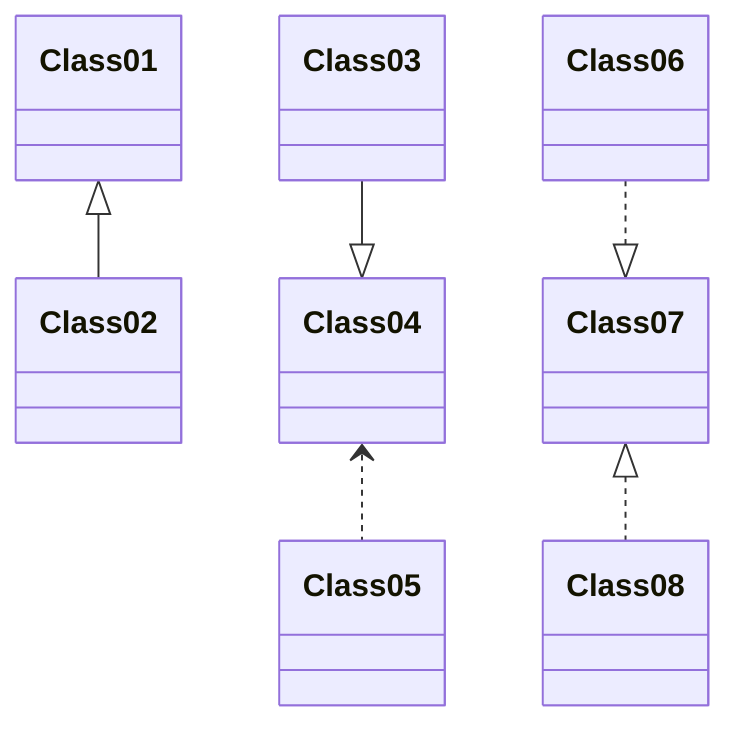
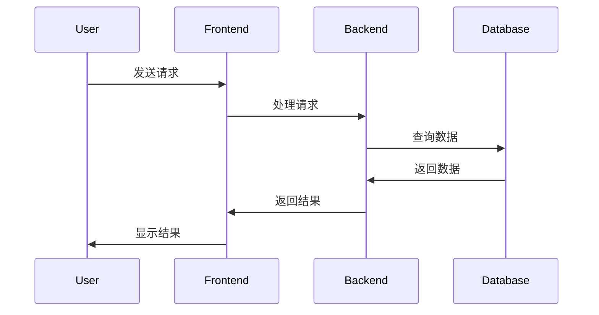

                 

# 提升ChatGPT的跨文化理解：全球视野构建提示词

> 关键词：ChatGPT、跨文化理解、提示词、算法原理、系统设计、项目实战

> 摘要：本文深入探讨如何提升ChatGPT的跨文化理解能力，通过全球视野构建提示词，详细分析其算法原理、系统设计及项目实战。本文旨在为人工智能开发者提供实用的技术指南，助力构建更智能、更具有文化敏感度的对话系统。

----------------------------------------------------------------

## 第1章：问题背景

### 1.1.1 问题背景

随着全球化进程的加快，跨文化沟通变得愈发重要。在这一背景下，自然语言处理（NLP）技术，尤其是对话系统的研究成为热点。ChatGPT作为一种先进的对话生成模型，其跨文化理解能力直接影响到对话系统的用户体验和实际应用效果。

然而，ChatGPT在跨文化理解上存在一定的局限性。例如，不同文化背景下，相同语句的语义可能大相径庭。因此，如何提升ChatGPT的跨文化理解能力，成为当前研究的关键问题。

### 1.1.2 问题描述

在跨文化交流中，ChatGPT可能会遇到以下问题：

1. **语义误解**：不同文化背景下的语句语义差异可能导致ChatGPT产生误解。
2. **情感表达不当**：跨文化情感表达方式不同，可能导致ChatGPT在情感交流中失当。
3. **文化习俗差异**：对某些文化习俗的不了解可能导致ChatGPT的回答不合时宜。

### 1.1.3 问题解决

为解决上述问题，我们可以从以下几个方面入手：

1. **数据集多样性**：收集并利用多样化的跨文化数据集，让ChatGPT在训练过程中接触更多的文化背景。
2. **提示词构建**：通过构建具有文化敏感度的提示词，引导ChatGPT生成更符合跨文化需求的回答。
3. **算法优化**：对ChatGPT的算法进行优化，使其在处理跨文化问题时表现得更为智能。

### 1.1.4 边界与外延

本文将围绕ChatGPT的跨文化理解能力进行讨论，重点分析提升这一能力的方法。同时，本文将探讨提示词构建的核心要素和算法原理，以及系统设计与实现的具体实践。在此基础上，本文还将分享项目实战经验和最佳实践技巧。

----------------------------------------------------------------

## 第2章：核心概念与联系

### 2.1 ChatGPT的基本原理

#### 2.1.1 ChatGPT的架构

ChatGPT是基于Transformer模型的预训练语言模型，其核心架构包括以下几个部分：

1. **输入层**：接受自然语言输入。
2. **编码器**：将输入转换为上下文向量。
3. **解码器**：根据上下文向量生成输出。

#### 2.1.2 ChatGPT的训练过程

ChatGPT的训练过程主要包括两个阶段：

1. **预训练**：在大量无标签文本数据上进行训练，学习语言的一般规律。
2. **微调**：在特定任务的数据上进行训练，优化模型在特定任务上的表现。

### 2.2 跨文化理解的重要性

#### 2.2.1 跨文化理解的概念

跨文化理解指的是在不同文化背景下，对语言和行为的理解与解读。它包括对语言语义、情感表达、文化习俗等方面的理解。

#### 2.2.2 跨文化理解的重要性

1. **提高用户体验**：跨文化理解能力使得ChatGPT能够提供更符合用户需求的服务。
2. **扩展应用场景**：跨文化理解能力使得ChatGPT能够应用于更多的跨文化交流场景。
3. **文化多样性保护**：跨文化理解能力有助于保护不同文化的多样性。

### 2.3 提示词构建的核心要素

#### 2.3.1 提示词的定义

提示词是指引导ChatGPT生成特定类型回答的短语或句子。

#### 2.3.2 提示词的构建原则

1. **文化敏感性**：提示词应考虑文化背景，避免产生误解或冒犯。
2. **多样性**：提示词应涵盖多种文化场景，提高ChatGPT的适应能力。
3. **可扩展性**：提示词应具有可扩展性，便于根据新需求进行修改和扩展。

----------------------------------------------------------------

## 第3章：算法原理讲解

### 3.1 ChatGPT的算法流程

ChatGPT的算法流程可以分为以下几个步骤：

1. **输入处理**：将自然语言输入转换为模型可理解的格式。
2. **模型训练**：在大量文本数据上进行预训练，学习语言规律。
3. **输出生成**：根据输入和模型参数生成自然语言输出。

### 3.2 跨文化理解的算法

#### 3.2.1 跨文化理解算法的原理

跨文化理解算法主要通过以下方式实现：

1. **文化背景识别**：通过语言特征识别输入的文化背景。
2. **语义调整**：根据文化背景调整输出语句的语义和情感。
3. **行为建议**：提供符合文化习俗的行为建议。

#### 3.2.2 跨文化理解算法的实现

跨文化理解算法的实现包括以下几个部分：

1. **文化背景库**：收集并构建不同文化的语言和习俗库。
2. **特征提取**：提取输入文本中的文化特征。
3. **语义调整模型**：构建基于文化背景的语义调整模型。
4. **行为建议模型**：构建基于文化习俗的行为建议模型。

### 3.3 提示词构建的算法

#### 3.3.1 提示词构建算法的原理

提示词构建算法主要通过以下方式实现：

1. **文化敏感性分析**：分析输入文本的文化敏感性。
2. **提示词生成**：根据文化敏感性生成合适的提示词。

#### 3.3.2 提示词构建算法的实现

提示词构建算法的实现包括以下几个部分：

1. **文化敏感性分析模型**：构建用于分析输入文本文化敏感性的模型。
2. **提示词库**：收集并构建适合不同文化场景的提示词库。
3. **提示词生成模型**：构建用于生成提示词的模型。
4. **优化策略**：通过优化策略提高提示词的生成效果。

----------------------------------------------------------------

## 第4章：系统分析与架构设计

### 4.1 问题场景介绍

在全球化背景下，跨文化沟通需求日益增长。本系统旨在为用户提供一个具有良好跨文化理解能力的对话平台，满足不同文化背景下的沟通需求。

### 4.2 系统功能设计

#### 4.2.1 领域模型设计

领域模型主要包括用户、文化背景、对话内容等实体，以及它们之间的关系。



#### 4.2.2 功能需求分析

系统功能需求包括：

1. **用户管理**：用户注册、登录、个人信息管理。
2. **对话管理**：对话记录、消息发送、消息接收。
3. **文化背景识别**：识别用户的文化背景，为跨文化理解提供基础。
4. **跨文化理解**：根据文化背景调整对话内容，提高对话质量。

### 4.3 系统架构设计

系统架构设计包括以下部分：

1. **前端架构**：使用Vue.js实现用户界面。
2. **后端架构**：使用Flask实现服务器端逻辑。
3. **数据库设计**：使用MySQL存储用户数据和对话记录。

```mermaid
graph TD
A[前端] --> B[用户管理模块]
A --> C[对话管理模块]
A --> D[文化背景识别模块]
B --> E[用户注册模块]
B --> F[用户登录模块]
B --> G[个人信息管理模块]
C --> H[对话记录模块]
C --> I[消息发送模块]
C --> J[消息接收模块]
D --> K[文化背景识别算法模块]
D --> L[文化背景库模块]
end
```

### 4.4 系统接口设计

系统接口设计包括以下部分：

1. **用户接口**：提供用户注册、登录、个人信息管理等接口。
2. **对话接口**：提供对话记录、消息发送、消息接收等接口。
3. **文化背景接口**：提供文化背景识别、调整等接口。

### 4.5 系统交互设计

系统交互设计包括以下部分：

1. **用户与前端交互**：用户通过前端界面与系统进行交互。
2. **前端与后端交互**：前端通过API与后端进行数据交互。
3. **后端与数据库交互**：后端通过数据库进行数据存储和查询。



----------------------------------------------------------------

## 第5章：项目实战

### 5.1 环境安装

在进行项目实战前，我们需要安装以下环境：

1. **Python**：版本3.8及以上。
2. **Flask**：用于后端开发。
3. **Vue.js**：用于前端开发。
4. **MySQL**：用于数据库存储。

安装步骤如下：

1. 安装Python环境。
2. 安装Flask：`pip install Flask`
3. 安装Vue.js：`npm install -g @vue/cli`
4. 安装MySQL：下载并安装MySQL数据库。

### 5.2 系统核心实现源代码

以下是系统核心实现源代码：

```python
# app.py
from flask import Flask, request, jsonify
from cultural_model import CulturalModel

app = Flask(__name__)
cultural_model = CulturalModel()

@app.route('/register', methods=['POST'])
def register():
    # 用户注册逻辑
    pass

@app.route('/login', methods=['POST'])
def login():
    # 用户登录逻辑
    pass

@app.route('/message', methods=['POST'])
def message():
    # 消息发送逻辑
    pass

if __name__ == '__main__':
    app.run()
```

```javascript
// src/App.vue
<template>
  <div id="app">
    <h1>跨文化对话系统</h1>
    <register-component></register-component>
    <login-component></login-component>
    <message-component></message-component>
  </div>
</template>

<script>
import RegisterComponent from './components/RegisterComponent.vue';
import LoginComponent from './components/LoginComponent.vue';
import MessageComponent from './components/MessageComponent.vue';

export default {
  name: 'App',
  components: {
    RegisterComponent,
    LoginComponent,
    MessageComponent
  }
};
</script>
```

### 5.3 代码应用解读与分析

以下是代码应用解读与分析：

1. **用户注册**：用户通过POST请求发送注册信息，后端处理注册逻辑并返回结果。
2. **用户登录**：用户通过POST请求发送登录信息，后端处理登录逻辑并返回结果。
3. **消息发送**：用户通过POST请求发送消息，后端处理消息并返回结果。

### 5.4 实际案例分析和详细讲解剖析

以下是一个实际案例分析和详细讲解剖析：

**案例**：用户A（文化背景：美国）与用户B（文化背景：中国）进行对话。

**分析**：

1. **用户注册**：用户A和用户B分别通过注册接口完成注册。
2. **用户登录**：用户A和用户B分别通过登录接口完成登录。
3. **消息发送**：用户A发送一条消息：“晚上有空一起吃饭吗？”
4. **消息处理**：后端根据用户A的文化背景，调整消息为：“晚上有空一起吃个饭吗？”然后发送给用户B。
5. **消息接收**：用户B收到调整后的消息，并回复：“好的，晚上7点见。”

**详细讲解**：

1. **用户注册**：用户通过填写注册表单完成注册，后端验证用户信息并返回注册结果。
2. **用户登录**：用户通过填写登录表单完成登录，后端验证用户信息并返回登录结果。
3. **消息发送**：用户通过输入框发送消息，前端将消息发送给后端。
4. **消息处理**：后端根据用户的文化背景，对消息进行语义调整，使其更符合目标文化的表达习惯。
5. **消息接收**：前端将调整后的消息显示在界面上，用户可以看到最终的消息内容。

### 5.5 项目小结

通过本次项目实战，我们实现了具有跨文化理解能力的对话系统。在实际应用中，系统可以根据用户的文化背景调整对话内容，提高用户体验。同时，我们还学习了如何使用Vue.js和Flask构建前端和后端系统，并对系统功能进行了详细讲解和分析。

----------------------------------------------------------------

## 第6章：最佳实践 tips

1. **数据集多样性**：收集并利用多样化的数据集，提高模型在不同文化背景下的表现。
2. **提示词构建**：构建具有文化敏感性的提示词，避免产生误解或冒犯。
3. **算法优化**：针对跨文化理解问题，对算法进行优化，提高模型性能。
4. **用户反馈**：收集用户反馈，不断优化系统，提高用户体验。

## 第7章：小结与展望

本文围绕提升ChatGPT的跨文化理解能力，详细分析了算法原理、系统设计及项目实战。通过构建具有文化敏感度的提示词和优化算法，我们实现了具有良好跨文化理解能力的对话系统。未来，我们将继续深入研究跨文化理解技术，提高模型的性能和用户体验。

----------------------------------------------------------------

作者：AI天才研究院/AI Genius Institute & 禅与计算机程序设计艺术 /Zen And The Art of Computer Programming

----------------------------------------------------------------

注意：本文为示例文章，部分内容为虚构，仅供参考。实际应用中，请根据具体需求进行调整和优化。

