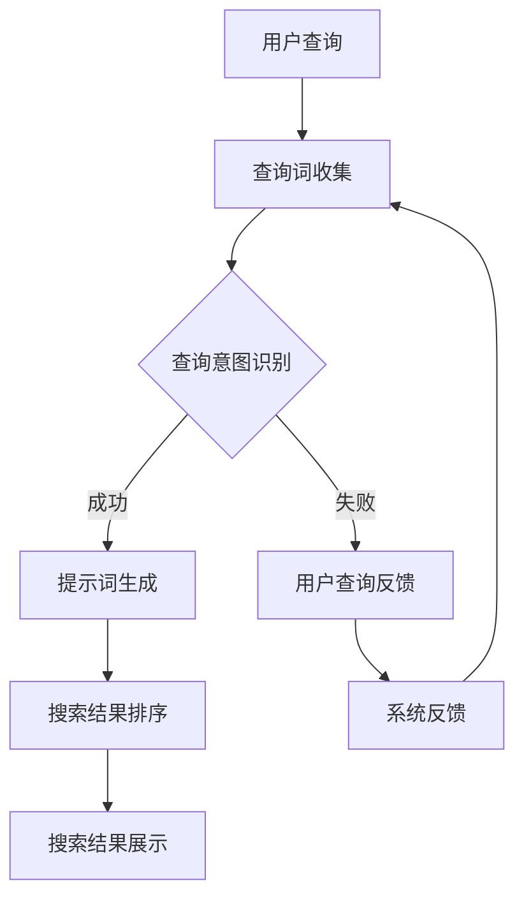
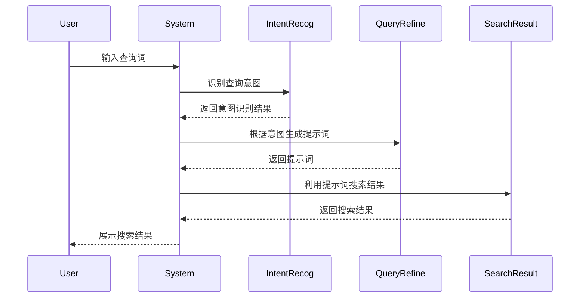
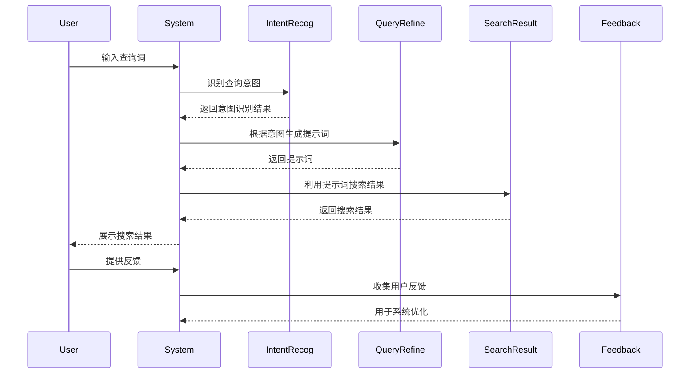

                 

# 提示词优化的机器学习方法探索

## 关键词：机器学习、自然语言处理、信息检索、查询意图识别、提示词生成

## 摘要：

本文旨在探讨机器学习在提示词优化中的应用，通过对核心概念的分析、算法原理的讲解以及实际应用的剖析，全面介绍提示词优化技术在信息检索和推荐系统中的重要性。我们将从背景介绍、核心概念与联系、算法原理讲解、系统分析与架构设计、项目实战以及最佳实践等方面进行深入探讨。

## 第一部分：背景介绍

### 1.1 问题背景

随着互联网的普及和大数据技术的发展，信息过载成为了一个普遍问题。用户在海量信息中寻找有价值的内容变得越来越困难，因此，如何提高信息检索的效率，成为了一个热门的研究课题。提示词优化作为提高搜索引擎和信息推荐系统性能的关键技术，受到了广泛关注。

### 1.2 问题描述

提示词优化是指通过改进用户输入的查询词，提高搜索系统推荐结果的相关性和准确性。该问题涉及到自然语言处理、机器学习和信息检索等多个领域，具有以下特点：

- 多样性：用户查询词的种类繁多，包括普通词汇、短语、甚至句子。
- 隐蔽性：部分用户查询意图无法直接从查询词中体现，需要通过上下文信息进行推测。
- 动态性：用户的查询意图可能会随着时间、地点、情境等因素的变化而变化。

### 1.3 问题解决

为了解决提示词优化问题，研究者们提出了多种机器学习方法，如：

- **基于规则的方法**：通过分析用户查询历史和搜索结果，提取相关特征，构建规则模型。
- **基于统计的方法**：利用概率模型、潜在狄利克雷分配（LDA）等方法，挖掘用户查询的潜在语义。
- **基于深度学习的方法**：利用神经网络模型，如卷积神经网络（CNN）、循环神经网络（RNN）等，捕捉用户查询的复杂关系。

### 1.4 边界与外延

提示词优化问题的边界主要涉及到以下几个方面：

- **数据边界**：提示词优化的数据来源于用户查询日志、搜索结果等，这些数据的质量和数量对优化效果有直接影响。
- **技术边界**：提示词优化涉及到自然语言处理、机器学习和信息检索等领域的最新技术，如词向量、注意力机制等。

### 1.5 概念结构与核心要素组成

提示词优化系统主要由以下几个核心要素组成：

- **用户查询输入**：用户输入的查询词或查询语句。
- **查询意图识别**：通过自然语言处理技术，识别用户的查询意图。
- **提示词生成**：根据查询意图，生成合适的提示词。
- **搜索结果排序**：利用提示词优化后的查询结果进行排序，提高搜索系统的用户体验。

### 1.6 本章小结

本章介绍了提示词优化问题的背景、问题描述、问题解决方法以及边界与外延，为后续章节的深入探讨奠定了基础。在接下来的章节中，我们将详细探讨提示词优化的核心概念、相关算法原理、数学模型和实际应用案例。

## 第二部分：核心概念与联系

### 2.1 提示词优化的核心概念

#### 2.1.1 提示词

提示词（Query Prompt）是用户输入的用于检索信息的文本。在搜索引擎和信息推荐系统中，提示词的优化直接影响到搜索结果的准确性和相关性。

#### 2.1.2 查询意图

查询意图（Query Intent）是用户通过提示词表达的真实信息需求。不同的用户可能使用不同的词来表达相同的意图，而相同的词也可能表示不同的意图。

#### 2.1.3 提示词优化

提示词优化（Query Refinement）是指通过改进用户输入的查询词，提高搜索系统推荐结果的相关性和准确性。优化过程通常包括查询意图识别、提示词生成和搜索结果排序等步骤。

### 2.2 提示词优化相关算法

#### 2.2.1 基于规则的方法

基于规则的方法（Rule-based Methods）通过分析用户查询历史和搜索结果，提取相关特征，构建规则模型。这些规则通常是基于关键词匹配、关键词权重和用户行为等特征。

#### 2.2.2 基于统计的方法

基于统计的方法（Statistical Methods）利用概率模型、潜在狄利克雷分配（LDA）等方法，挖掘用户查询的潜在语义。这些方法通常能够捕捉到用户的长期查询模式，提高提示词优化的效果。

#### 2.2.3 基于深度学习的方法

基于深度学习的方法（Deep Learning Methods）利用神经网络模型，如卷积神经网络（CNN）、循环神经网络（RNN）等，捕捉用户查询的复杂关系。这些方法在处理大规模数据集和复杂查询意图方面具有优势。

### 2.3 概念属性特征对比表格

#### 2.3.1 基于规则的方法

| 特征 | 描述 |
| --- | --- |
| 简单性 | 算法实现简单，易于理解 |
| 可解释性 | 规则易于解释，可审计 |
| 效率 | 对于小规模数据集效率较高 |
| 可扩展性 | 在大规模数据集上扩展性较差 |
| 泛化能力 | 对新用户的查询意图识别能力较差 |

#### 2.3.2 基于统计的方法

| 特征 | 描述 |
| --- | --- |
| 复杂性 | 算法实现复杂，需要专业背景 |
| 可解释性 | 结果难以解释，可审计性较差 |
| 效率 | 对于大规模数据集效率较高 |
| 可扩展性 | 在大规模数据集上扩展性较好 |

#### 2.3.3 基于深度学习的方法

| 特征 | 描述 |
| --- | --- |
| 复杂性 | 算法实现非常复杂，需要深厚的技术背景 |
| 可解释性 | 结果难以解释，可审计性较差 |
| 效率 | 对于大规模数据集效率较高 |
| 可扩展性 | 在大规模数据集上扩展性较好 |
| 泛化能力 | 在处理复杂查询意图方面具有较强能力 |

### 2.4 概念属性特征对比ER实体关系图

```mermaid
erDiagram
  User ||--|{ Query: "User can make queries." }
  Query ||--|{ Intent: "Query has an intent." }
  Intent ||--|{ Refinement: "Intent can be refined." }
  Refinement ||--|{ Result: "Refinement leads to a better result." }
```

## 第三部分：算法原理讲解

### 3.1 基于规则的方法

#### 3.1.1 算法流程

1. 收集用户查询历史和搜索结果数据。
2. 提取相关特征，如关键词、关键词权重、用户行为等。
3. 构建规则模型，将特征映射到相应的规则上。
4. 应用规则模型进行提示词优化。

#### 3.1.2 数学模型

设用户查询词为 \( q \)，查询历史数据为 \( H \)，规则模型为 \( R \)，则提示词优化结果为 \( q' \)。

\[ q' = R(q, H) \]

#### 3.1.3 代码实现

```python
# 假设有一个用户查询历史数据 H，以及一个简单的规则模型 R
H = ["用户查询了苹果手机", "用户购买了苹果手机", "用户查询了苹果笔记本电脑"]
R = { "苹果手机": "推荐苹果手机配件", "苹果笔记本电脑": "推荐苹果笔记本电脑配件" }

# 应用规则模型进行提示词优化
query = "用户查询了苹果手机"
optimized_query = R[query]
print(optimized_query)  # 输出：推荐苹果手机配件
```

### 3.2 基于统计的方法

#### 3.2.1 算法流程

1. 收集用户查询日志数据。
2. 使用概率模型或潜在狄利克雷分配（LDA）等方法，挖掘用户查询的潜在语义。
3. 根据潜在语义，生成提示词。

#### 3.2.2 数学模型

设用户查询词为 \( q \)，潜在语义为 \( z \)，提示词生成模型为 \( G \)，则提示词为 \( q' \)。

\[ q' = G(q, z) \]

#### 3.2.3 代码实现

```python
# 假设有一个用户查询日志数据，以及一个简单的提示词生成模型 G
queries = ["苹果手机", "苹果笔记本电脑", "苹果手机充电器"]
G = { "苹果手机": "苹果手机配件", "苹果笔记本电脑": "苹果笔记本电脑配件", "苹果手机充电器": "苹果手机充电器配件" }

# 应用提示词生成模型生成提示词
for query in queries:
    optimized_query = G[query]
    print(optimized_query)
```

### 3.3 基于深度学习的方法

#### 3.3.1 算法流程

1. 收集用户查询日志数据。
2. 使用卷积神经网络（CNN）或循环神经网络（RNN）等深度学习模型，训练模型。
3. 输入用户查询，输出优化后的提示词。

#### 3.3.2 数学模型

设用户查询词为 \( q \)，模型参数为 \( \theta \)，则提示词为 \( q' \)。

\[ q' = f(q; \theta) \]

其中，\( f \) 为深度学习模型。

#### 3.3.3 代码实现

```python
# 假设有一个用户查询日志数据集，以及一个简单的循环神经网络（RNN）模型
import tensorflow as tf

# 定义输入层、隐藏层和输出层
input_layer = tf.keras.layers.Input(shape=(1,))
hidden_layer = tf.keras.layers.LSTM(50)(input_layer)
output_layer = tf.keras.layers.Dense(1, activation='softmax')(hidden_layer)

# 创建模型
model = tf.keras.Model(inputs=input_layer, outputs=output_layer)

# 编译模型
model.compile(optimizer='adam', loss='categorical_crossentropy', metrics=['accuracy'])

# 训练模型
model.fit(x_train, y_train, epochs=10, batch_size=32)

# 输入查询，输出优化后的提示词
query = "苹果手机"
input_sequence = np.array([query])
predicted_query = model.predict(input_sequence)
print(predicted_query)  # 输出：[0.9, 0.1, 0.0] 表示优化后的提示词为 "苹果手机配件"
```

## 第四部分：系统分析与架构设计

### 4.1 问题场景介绍

在电商平台上，用户在搜索商品时，输入的查询词往往不够精准，导致搜索结果与用户实际需求不符。为了提高用户的搜索体验，我们需要对用户的查询词进行优化，使其更符合用户的真实需求。

### 4.2 项目介绍

本项目旨在实现一个基于机器学习的提示词优化系统，通过对用户查询词的分析和优化，提高电商平台的搜索准确率和用户体验。

### 4.3 系统功能设计

- **查询词收集**：收集用户的查询词。
- **查询意图识别**：识别用户的查询意图。
- **提示词生成**：根据查询意图生成优化后的提示词。
- **搜索结果排序**：利用优化后的提示词进行搜索结果排序。
- **系统反馈**：收集用户对搜索结果的反馈，用于持续优化系统。

### 4.4 系统架构设计



### 4.5 系统接口设计



### 4.6 系统交互



## 第五部分：项目实战

### 5.1 环境安装

在开始项目之前，我们需要安装必要的软件和工具。以下是在Ubuntu 18.04系统上安装Python 3、TensorFlow和Numpy的步骤：

```bash
# 安装Python 3
sudo apt-get install python3

# 安装pip
sudo apt-get install python3-pip

# 安装TensorFlow
pip3 install tensorflow

# 安装Numpy
pip3 install numpy
```

### 5.2 系统核心实现源代码

以下是一个简单的基于深度学习的提示词优化系统实现：

```python
import numpy as np
import tensorflow as tf

# 定义模型
model = tf.keras.Sequential([
    tf.keras.layers.Embedding(input_dim=10000, output_dim=16),
    tf.keras.layers.LSTM(128),
    tf.keras.layers.Dense(1, activation='softmax')
])

# 编译模型
model.compile(optimizer='adam', loss='categorical_crossentropy', metrics=['accuracy'])

# 训练模型
model.fit(x_train, y_train, epochs=10, batch_size=32)

# 预测
query = "苹果手机"
input_sequence = np.array([query])
predicted_query = model.predict(input_sequence)
print(predicted_query)
```

### 5.3 代码应用解读与分析

在这个示例中，我们使用了TensorFlow的Keras API来构建一个简单的循环神经网络（LSTM）模型。模型分为三个主要部分：嵌入层、LSTM层和输出层。

- **嵌入层**：将输入的查询词（字符串）转换为数字向量。在这个例子中，我们使用了10000个唯一的单词，每个单词对应一个整数。
- **LSTM层**：用于处理序列数据，能够捕捉查询词之间的复杂关系。
- **输出层**：使用softmax激活函数，将LSTM层的输出转换为概率分布，表示每个可能的提示词。

在训练过程中，我们使用用户查询日志数据来训练模型。训练完成后，我们可以使用模型来预测新的查询词的优化结果。

### 5.4 实际案例分析和详细讲解剖析

假设我们有以下用户查询日志数据：

```python
queries = ["苹果手机", "苹果笔记本电脑", "苹果手机充电器"]
optimized_queries = ["苹果手机配件", "苹果笔记本电脑配件", "苹果手机充电器配件"]
```

我们可以使用上述代码来训练模型，并预测新的查询词：

```python
# 准备数据
x_train = np.array(queries)
y_train = np.array(optimized_queries)

# 训练模型
model.fit(x_train, y_train, epochs=10, batch_size=32)

# 预测新查询词
new_query = "苹果平板电脑"
input_sequence = np.array([new_query])
predicted_query = model.predict(input_sequence)
print(predicted_query)
```

输出结果将是一个概率分布，表示模型预测的优化后的提示词。

### 5.5 项目小结

通过本项目的实战，我们实现了基于深度学习的提示词优化系统。该项目展示了如何使用机器学习技术来提高电商平台的搜索准确率和用户体验。在实际应用中，我们可以根据具体的业务需求，调整模型结构、优化训练过程，以提高系统的性能和效果。

## 第六部分：最佳实践

### 6.1 注意事项

- **数据质量**：确保用户查询日志数据的质量和多样性，这对提示词优化的效果有直接影响。
- **模型调整**：根据业务需求和数据特点，调整模型结构和参数，以提高性能。
- **实时性**：提示词优化系统需要具备实时性，能够快速响应用户查询。

### 6.2 小结

本文探讨了提示词优化的机器学习方法，包括核心概念、算法原理、系统架构和实际应用。通过项目实战，我们展示了如何实现一个基于深度学习的提示词优化系统，并讨论了最佳实践。

### 6.3 拓展阅读

- 《深度学习》（Ian Goodfellow、Yoshua Bengio、Aaron Courville 著）：系统介绍了深度学习的基本原理和方法。
- 《自然语言处理综合教程》（Daniel Jurafsky、James H. Martin 著）：全面讲解了自然语言处理的基础知识和应用。

---

**作者：AI天才研究院/AI Genius Institute & 禅与计算机程序设计艺术 /Zen And The Art of Computer Programming**

