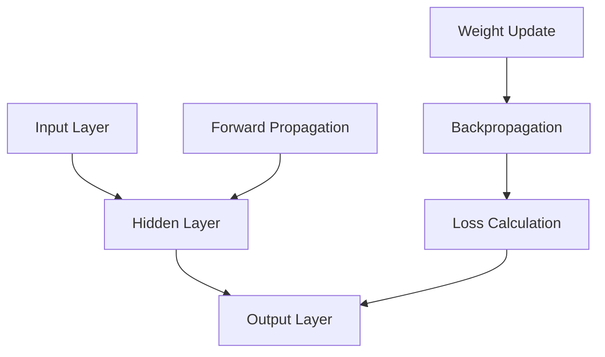
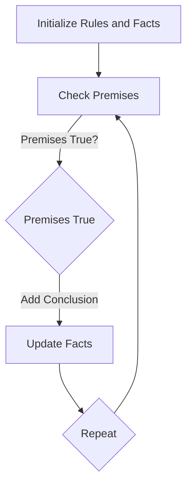
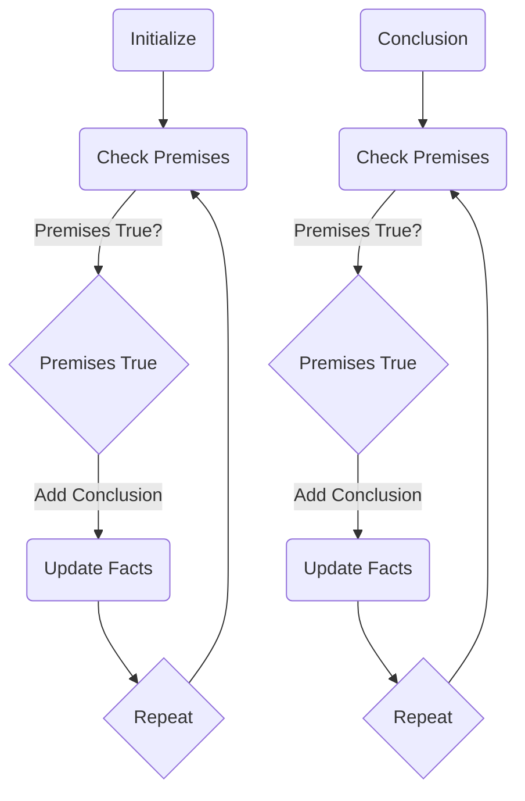
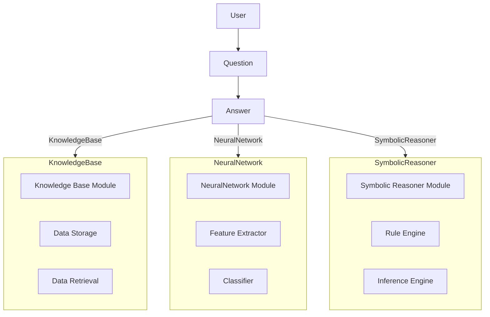
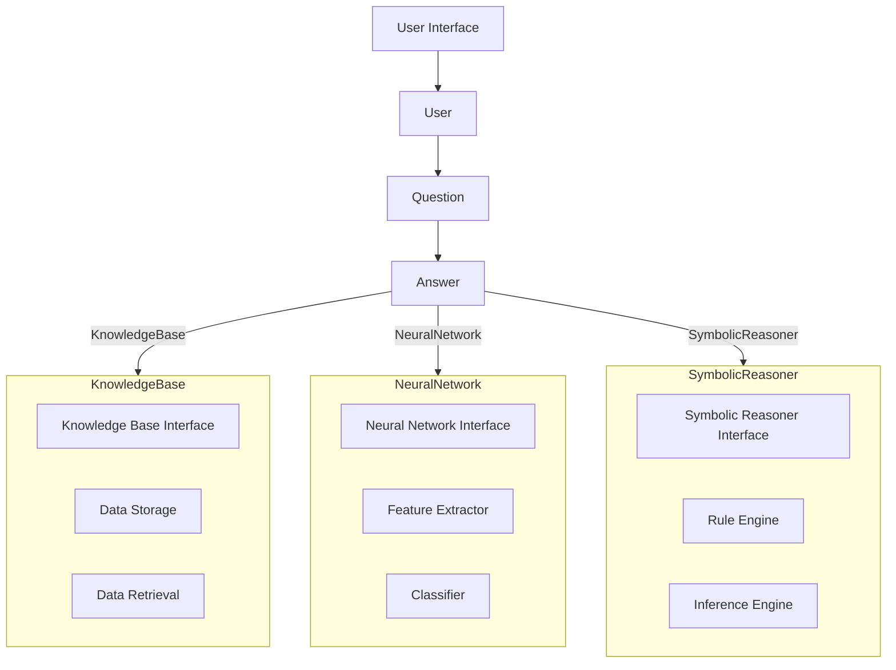
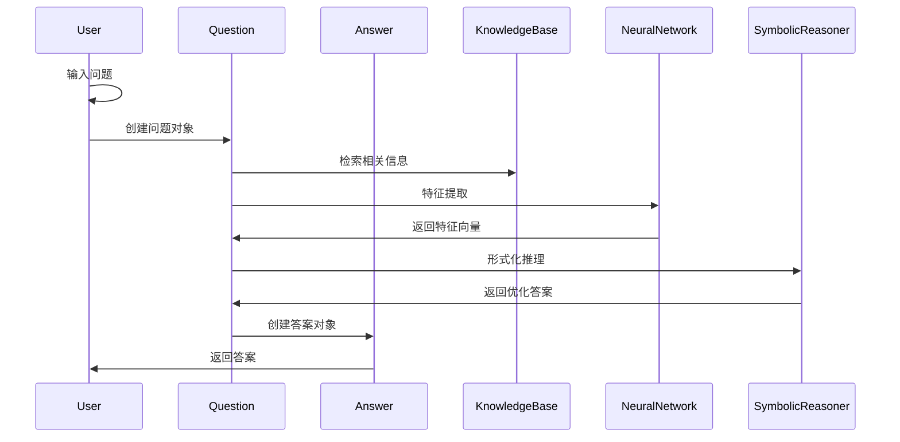

                 

### 1.1 问题背景

#### 1.1.1 神经符号逻辑推理系统的重要性

神经符号逻辑推理系统（Neural Symbolic Logical Inference System，简称NSLIS）结合了神经网络和符号逻辑推理的优势，旨在解决传统神经网络难以处理的逻辑推理任务。神经网络擅长处理大规模的数据，从数据中学习复杂的模式，而符号逻辑推理则强调形式化的逻辑推导，适用于解决需要精确逻辑判断的问题。NSLIS通过整合这两种方法，为人工智能领域带来了新的研究热点和应用前景。

首先，神经网络在图像识别、语音识别、自然语言处理等领域取得了显著的成果。通过深度学习技术，神经网络可以从大量数据中自动学习特征，从而实现高度准确的预测和分类。然而，神经网络也存在一些局限性，比如在处理需要逻辑推理的任务时，往往难以表达复杂的逻辑关系和推理过程。

另一方面，符号逻辑推理在形式逻辑、逻辑编程、知识表示等领域有着悠久的历史。符号逻辑推理通过形式化的逻辑规则和推理算法，能够精确地描述和处理逻辑关系。然而，传统的符号逻辑推理方法在处理大规模数据时效率较低，且难以应对复杂的不确定性情境。

因此，神经符号逻辑推理系统的出现，旨在克服传统方法的局限性，实现高效、准确的逻辑推理。NSLIS通过将神经网络和符号逻辑推理相结合，将神经网络的学习能力与符号逻辑推理的精确性相结合，为解决复杂逻辑推理任务提供了新的思路。

#### 1.1.2 提示词优化在现代AI系统中的作用

在神经符号逻辑推理系统中，提示词（Prompt）是一种重要的工具，用于引导推理过程，优化系统的性能。提示词是一组用于引导模型进行推理的提示信息，它能够提供必要的上下文，帮助模型更好地理解输入数据，从而提高推理的准确性和效率。

首先，提示词优化能够提高模型的推理性能。在神经符号逻辑推理系统中，模型的推理过程通常是基于大规模训练数据进行的。然而，不同场景下的推理任务具有不同的特点和需求。通过优化提示词，可以针对性地调整模型的推理策略，使其更适用于特定任务。例如，在推理过程中，提示词可以包含领域知识、先验信息等，从而引导模型进行更准确的推理。

其次，提示词优化有助于提高模型的泛化能力。在训练过程中，模型通常会学习到一些特定的特征和模式。然而，这些特征和模式可能只在特定数据集上有效，当面对新的数据或任务时，模型的泛化能力可能会受到限制。通过优化提示词，可以引入更多的通用特征和模式，从而提高模型的泛化能力，使其能够更好地应对多样化的推理任务。

此外，提示词优化还能够提高模型的可解释性。在神经符号逻辑推理系统中，模型的推理过程往往是复杂的，难以直观地理解和解释。通过优化提示词，可以明确地引导模型进行推理，使其推理过程更加透明和可解释。这对于增强模型的可信度和用户理解具有重要意义。

总之，提示词优化在神经符号逻辑推理系统中扮演着重要的角色。通过优化提示词，可以显著提高模型的推理性能、泛化能力和可解释性，从而推动神经符号逻辑推理系统在各个领域的广泛应用。

#### 1.1.3 当前研究现状与挑战

近年来，神经符号逻辑推理系统（NSLIS）在学术界和工业界引起了广泛关注，并取得了显著的进展。然而，仍面临许多挑战和问题，需要进一步研究和解决。

首先，在模型设计方面，如何有效整合神经网络和符号逻辑推理是当前研究的一个核心问题。现有研究大多采用浅层神经网络与符号逻辑推理相结合的方式，但这种结合方式往往难以充分发挥两种方法的优点。未来研究需要探索更加深度的模型设计方法，如深度神经网络与符号逻辑推理的融合，以及如何优化不同层级的交互和协同工作。

其次，在数据集构建方面，高质量、大规模的训练数据集是保证NSLIS性能的关键。目前，许多研究依赖于公开的数据集，但这些数据集可能无法涵盖所有场景和任务。此外，数据集的标注和质量也参差不齐，这会影响模型的训练效果和泛化能力。因此，如何构建高质量、多样化、具有代表性的训练数据集，是当前研究的一个挑战。

在算法优化方面，提示词优化是提高NSLIS性能的重要手段。现有的提示词优化方法主要依赖于经验和启发式策略，缺乏系统的理论支持。如何设计更加通用、有效的提示词优化算法，是一个需要深入研究的问题。此外，如何在保证性能的同时，提高提示词优化的效率和可解释性，也是一个重要的研究方向。

在应用领域方面，NSLIS在医疗诊断、金融分析、自动驾驶等领域的应用前景广阔。然而，实际应用中面临着诸多挑战，如处理复杂的异构数据、满足实时性要求等。如何针对不同应用场景，设计出高效的NSLIS解决方案，是一个亟待解决的问题。

综上所述，尽管神经符号逻辑推理系统在学术界和工业界取得了显著进展，但仍面临许多挑战和问题。未来研究需要从模型设计、数据集构建、算法优化和应用领域等多个方面进行深入探索，以推动NSLIS技术的不断发展与应用。

### 1.2 研究目的与内容概述

#### 1.2.1 研究目标

本文旨在深入探讨神经符号逻辑推理系统（NSLIS）的提示词优化方法，以提升其在复杂逻辑推理任务中的性能和应用效果。具体目标包括：

1. 系统性地梳理和总结现有的神经符号逻辑推理系统及其提示词优化方法。
2. 探索和设计新的提示词优化算法，以提升模型的推理性能和泛化能力。
3. 分析并解决现有方法中存在的问题和挑战，提出有效的改进策略。
4. 通过实验验证，评估新方法在实际应用中的效果和可行性。

#### 1.2.2 本书结构安排

本书共分为四大部分，具体内容安排如下：

**第一部分：引言与背景**

本部分主要介绍神经符号逻辑推理系统及其提示词优化的基本概念，阐述其在现代人工智能系统中的重要性，并概述当前研究现状与挑战。

**第二部分：理论基础**

本部分详细讨论神经符号逻辑推理系统的基础理论，包括神经网络、符号逻辑推理和提示词优化的基本概念、原理和数学模型。通过对比分析，展示不同概念之间的联系和差异。

**第三部分：算法原理讲解**

本部分重点讲解神经符号逻辑推理系统中提示词优化的算法原理，包括提示词的生成与选择策略、优化目标函数和算法实现。通过具体的Python代码示例，深入阐述算法的实现过程和关键步骤。

**第四部分：系统设计与实现**

本部分结合具体应用场景，介绍神经符号逻辑推理系统的设计与实现方法。从系统架构设计、接口设计与系统交互等方面进行详细讲解，并通过实际案例分析和实验验证，展示系统在实际应用中的效果和可行性。

通过以上四大部分的详细探讨，本文旨在为神经符号逻辑推理系统的提示词优化研究提供一个全面、系统的理论框架和实践指南，为后续研究提供参考和启示。

#### 1.3 边界与外延

#### 1.3.1 系统定义与范围

在本研究中，神经符号逻辑推理系统（NSLIS）是指一种融合神经网络和符号逻辑推理技术的智能系统，旨在处理复杂逻辑推理任务。具体而言，NSLIS包括以下几个核心组成部分：

1. **神经网络模块**：负责从数据中学习特征，提取有用信息。
2. **符号逻辑推理模块**：负责根据逻辑规则和推理算法进行推理。
3. **提示词优化模块**：负责根据特定任务需求，优化提示词，提升推理性能。

本文的研究范围主要聚焦于提示词优化方法的设计与实现，探讨其在提升NSLIS推理性能中的应用。具体研究内容涵盖以下几个方面：

1. **神经网络与符号逻辑推理的融合**：分析NSLIS的工作原理，探讨如何将神经网络和符号逻辑推理有效结合。
2. **提示词优化的方法**：研究现有提示词优化方法，分析其优缺点，并提出新的优化策略。
3. **算法设计与实现**：设计并实现新的提示词优化算法，评估其在不同任务上的性能和泛化能力。
4. **实际应用案例分析**：通过具体应用案例，验证提示词优化算法的实际效果和可行性。

#### 1.3.2 研究范畴的界定

在界定研究范畴时，本文对以下几个关键问题进行了明确：

1. **研究对象的限定**：本文的研究对象是神经符号逻辑推理系统，重点关注提示词优化方法的设计与实现，而不涉及神经网络或符号逻辑推理的单独研究。
2. **技术方法的限定**：本文重点关注基于提示词优化的NSLIS性能提升，不包括其他优化技术（如数据增强、模型压缩等）的研究。
3. **应用领域的限定**：本文的研究主要针对逻辑推理任务，对于其他类型的任务（如图像识别、自然语言处理等），提示词优化方法的具体应用效果可能有所不同，不在本文的研究范畴之内。

通过明确系统定义与研究范围，本文旨在为神经符号逻辑推理系统的提示词优化提供清晰的研究框架，以便于后续的深入研究和实践应用。

### 1.4 核心概念与联系

#### 1.4.1 神经网络、符号逻辑推理与提示词优化的基本概念

在探讨神经符号逻辑推理系统（NSLIS）之前，有必要首先明确相关核心概念，包括神经网络、符号逻辑推理和提示词优化。这些概念在NSLIS中扮演着关键角色，理解它们有助于深入理解NSLIS的工作原理和优化方法。

**神经网络（Neural Networks）**：神经网络是由大量简单的人工神经元（或节点）组成的复杂网络，通过学习和模拟人脑的神经网络结构来处理信息。每个神经元接收多个输入信号，并通过激活函数产生输出。神经网络的主要功能是通过对大量数据进行训练，学习到数据的特征，并进行分类、预测等任务。

**符号逻辑推理（Symbolic Logical Reasoning）**：符号逻辑推理是一种形式化的推理方法，通过符号化的逻辑表达式来表示知识和推理过程。符号逻辑推理基于一系列逻辑规则，如与（AND）、或（OR）、非（NOT）和蕴含（IMPLICATION）等，通过推理算法从已知的前提条件推导出结论。符号逻辑推理具有形式化、精确和可解释性等优点，适用于处理需要严格逻辑推导的任务。

**提示词优化（Prompt Optimization）**：在NSLIS中，提示词是一种用于引导模型进行推理的提示信息。提示词优化是指通过调整提示词的生成和选择策略，优化模型在特定任务上的推理性能。提示词优化能够提高模型的泛化能力和推理效率，是实现NSLIS高效推理的关键技术。

**概念属性特征对比表格**

为了更好地理解神经网络、符号逻辑推理和提示词优化的基本概念，我们可以通过一个表格来对比它们的主要属性特征：

| 概念       | 神经网络            | 符号逻辑推理           | 提示词优化               |
|------------|--------------------|----------------------|------------------------|
| 功能       | 数据特征学习、分类、预测 | 形式化推理、知识表示    | 优化提示词，提升推理性能   |
| 特点       | 自动学习、并行处理    | 形式化、可解释性       | 灵活性、适应性           |
| 应用场景   | 图像识别、自然语言处理 | 知识图谱、逻辑编程      | 复杂逻辑推理任务         |
| 数据需求   | 大规模训练数据       | 精确表示的知识表示      | 有针对性、高质量的提示词   |
| 实现方法   | 神经网络结构、学习算法 | 逻辑规则、推理算法      | 生成、选择、优化策略      |

**ER实体关系图架构**

为了更直观地展示神经网络、符号逻辑推理和提示词优化之间的联系，我们可以使用实体关系图（Entity-Relationship Diagram，简称ER图）来描述它们之间的关系。

```mermaid
erDiagram
  NeuralNetwork ||--|{ SymbolicLogicalReasoning }|
  SymbolicLogicalReasoning ||--|{ PromptOptimization }|
  NeuralNetwork ||--|{ PromptOptimization }|
```

在这个ER图中，神经网络（NeuralNetwork）和符号逻辑推理（SymbolicLogicalReasoning）是两个主要的实体，它们通过双向箭头（||--|{ ... }|）连接，表示它们之间存在紧密的交互和依赖关系。提示词优化（PromptOptimization）作为连接两者的桥梁，既依赖于神经网络和符号逻辑推理的基础，又通过优化提示词来提升推理性能。

通过对比表格和ER图，我们可以更清晰地理解神经网络、符号逻辑推理和提示词优化的基本概念、属性特征及其相互关系，为后续探讨NSLIS的优化方法和应用提供理论基础。

### 2.1 神经网络基础

#### 2.1.1 神经网络的基本结构

神经网络（Neural Networks，简称NN）是一种模拟人脑神经元连接和活动的人工智能模型。神经网络的基本结构包括输入层、隐藏层和输出层。每一层由多个神经元（或节点）组成，神经元之间通过加权连接进行信息传递。

**输入层**：输入层是神经网络的起点，接收外部输入的数据。每个输入数据通过一个神经元表示，输入层的神经元数量取决于输入数据的维度。

**隐藏层**：隐藏层位于输入层和输出层之间，是神经网络的核心部分。隐藏层通过学习输入数据中的特征和模式，将其转换为更高层次的特征表示。隐藏层的数量和神经元数量可以根据具体任务进行调整。

**输出层**：输出层是神经网络的终点，负责生成最终的输出结果。输出层的神经元数量取决于任务的类型，如二分类任务通常有两个神经元，多分类任务则根据类别数量设置。

在神经网络中，每个神经元都与其他神经元通过加权连接相连。这些连接具有相应的权重，用于传递信息。当输入数据通过神经网络传递时，每个神经元会对其输入值进行加权求和处理，并应用一个激活函数（如Sigmoid、ReLU等）生成输出值。

**常见的神经网络类型**

神经网络根据其结构和功能可以分为多种类型，以下是其中几种常见的神经网络类型：

**1. 卷积神经网络（Convolutional Neural Networks，简称CNN）**：CNN是一种用于处理图像数据的神经网络。其主要特点是利用卷积操作提取图像中的局部特征，通过多层的卷积和池化操作，逐步构建复杂的特征表示。CNN在图像识别、物体检测和图像生成等领域表现出色。

**2. 循环神经网络（Recurrent Neural Networks，简称RNN）**：RNN是一种适用于处理序列数据的神经网络。RNN具有时间动态性，能够记住序列中的历史信息，通过在时间步之间传递隐藏状态来实现。RNN及其变种LSTM（Long Short-Term Memory）和GRU（Gated Recurrent Unit）在自然语言处理、语音识别和时间序列预测等领域广泛应用。

**3. 生成对抗网络（Generative Adversarial Networks，简称GAN）**：GAN是一种由两个神经网络（生成器和判别器）组成的对抗性模型。生成器试图生成逼真的数据，而判别器则尝试区分生成数据和真实数据。通过这种对抗训练，GAN能够生成高质量的图像、音频和文本等数据。

**4. 自编码器（Autoencoders）**：自编码器是一种无监督学习的神经网络，旨在学习数据的低维表示。自编码器由编码器和解码器组成，编码器将高维数据压缩为低维表示，解码器则尝试从低维表示中重建原始数据。自编码器在数据降维、特征提取和异常检测等领域具有广泛的应用。

**5. 多层感知机（Multilayer Perceptrons，简称MLP）**：多层感知机是一种前馈神经网络，包含输入层、一个或多个隐藏层和输出层。MLP通过逐层传递数据，学习输入和输出之间的非线性映射关系。MLP在分类、回归和函数拟合等领域得到广泛应用。

这些神经网络类型具有不同的结构和功能，适用于不同的任务和数据类型。在神经符号逻辑推理系统中，可以根据具体任务需求选择合适的神经网络类型，以实现高效、准确的推理。

#### 2.1.2 常见的神经网络类型

在神经网络领域，有许多不同的模型被提出来解决各种问题。以下是一些常见的神经网络类型及其特点：

**1. 卷积神经网络（Convolutional Neural Networks，简称CNN）**

卷积神经网络是一种专门用于处理图像数据的神经网络。它的核心思想是通过卷积操作来提取图像中的特征。卷积神经网络的主要组成部分包括卷积层、池化层和全连接层。卷积层使用卷积核在图像上滑动，提取局部特征；池化层用于降低特征图的维度，减少计算量；全连接层用于分类和回归任务。

卷积神经网络在图像识别、物体检测、图像分割和图像生成等领域表现出色。其优点包括：
- **高效的特征提取能力**：卷积层能够自动学习图像中的局部特征，如边缘、角点和纹理等。
- **参数共享**：卷积操作中的卷积核在不同位置上共享参数，减少了模型的参数量。
- **局部连接性**：卷积操作只考虑局部邻域的信息，使得模型更加鲁棒。

然而，卷积神经网络也存在一些局限性，如：
- **处理序列数据的能力较弱**：卷积神经网络主要针对图像数据设计，在处理序列数据时效果不佳。
- **需要大量的训练数据**：卷积神经网络通常需要大量的训练数据来学习复杂的特征。

**2. 循环神经网络（Recurrent Neural Networks，简称RNN）**

循环神经网络是一种用于处理序列数据的神经网络。RNN的核心特点是在时间步之间传递隐藏状态，使得模型能够记住序列中的历史信息。RNN的基本组成部分包括输入层、隐藏层和输出层。输入数据通过输入层传递到隐藏层，隐藏层的状态在时间步之间进行传递，最终生成输出。

循环神经网络在自然语言处理、语音识别和时间序列预测等领域广泛应用。其优点包括：
- **时间动态性**：RNN能够处理任意长度的序列数据，并记住序列中的历史信息。
- **序列建模能力**：RNN通过传递隐藏状态，能够建模序列数据中的长期依赖关系。

然而，RNN也存在一些问题，如：
- **梯度消失和梯度爆炸**：在长序列数据中，RNN容易出现梯度消失或梯度爆炸现象，导致训练困难。
- **序列建模能力的局限性**：RNN在处理长序列数据时，仍难以建模复杂的长期依赖关系。

为了解决这些问题，研究人员提出了LSTM（Long Short-Term Memory）和GRU（Gated Recurrent Unit）等改进模型。LSTM和GRU通过引入门控机制，有效地解决了梯度消失和梯度爆炸问题，提高了序列建模能力。

**3. 生成对抗网络（Generative Adversarial Networks，简称GAN）**

生成对抗网络是一种由生成器和判别器组成的对抗性模型。生成器试图生成逼真的数据，判别器则尝试区分生成数据和真实数据。通过这种对抗训练，GAN能够生成高质量的图像、音频和文本等数据。

生成对抗网络的主要组成部分包括：
- **生成器**：生成器是一个神经网络，用于生成模拟数据。
- **判别器**：判别器也是一个神经网络，用于区分生成数据和真实数据。

生成对抗网络在图像生成、风格迁移、数据增强等领域表现出色。其优点包括：
- **强大的数据生成能力**：GAN能够生成高质量、多样性的数据。
- **无监督学习**：GAN可以在没有大量标注数据的情况下进行训练。

然而，生成对抗网络也存在一些挑战，如：
- **训练不稳定**：GAN的训练过程容易受到噪声和模式的影响，导致训练不稳定。
- **评估困难**：GAN生成的数据质量难以量化评估。

**4. 多层感知机（Multilayer Perceptrons，简称MLP）**

多层感知机是一种前馈神经网络，包含输入层、一个或多个隐藏层和输出层。MLP通过逐层传递数据，学习输入和输出之间的非线性映射关系。

多层感知机在分类、回归和函数拟合等领域得到广泛应用。其优点包括：
- **简单的结构**：MLP的结构相对简单，容易理解和实现。
- **强大的拟合能力**：MLP能够通过增加隐藏层和神经元数量，提高模型的拟合能力。

然而，多层感知机也存在一些局限性，如：
- **过拟合风险**：MLP容易受到过拟合问题的影响，需要大量的训练数据。
- **对输入数据的依赖性**：MLP对输入数据的分布敏感，数据预处理不当可能导致模型性能下降。

总的来说，不同的神经网络类型具有各自的特点和适用范围。在神经符号逻辑推理系统中，可以根据具体任务需求选择合适的神经网络类型，以实现高效、准确的推理。

#### 2.1.3 神经网络的学习算法

神经网络的学习过程是通过调整网络中的权重和偏置来实现的，这一过程通常涉及到多种学习算法。以下是几种常见的神经网络学习算法及其基本原理：

**1. 反向传播算法（Backpropagation Algorithm）**

反向传播算法是神经网络中最常用的学习算法之一，其基本思想是利用梯度下降法调整网络的权重和偏置。反向传播算法包括两个主要步骤：前向传播和反向传播。

- **前向传播**：在训练过程中，将输入数据传递到神经网络中，经过每一层神经元的计算，最终得到输出。这一过程中，每一层神经元都会将输入值乘以相应的权重，并通过激活函数得到输出值。
  
- **反向传播**：计算输出层到输入层的梯度，并根据梯度调整权重和偏置。具体来说，反向传播算法从输出层开始，计算输出值与实际值之间的误差，然后逐层向前传播误差，并利用链式法则计算每个权重和偏置的梯度。最后，通过梯度下降法更新权重和偏置，以减少误差。

反向传播算法具有以下优点：
- **高效性**：通过自动计算梯度，大大减少了手动计算梯度的工作量。
- **灵活性**：可以应用于各种神经网络结构，包括多层感知机、卷积神经网络和循环神经网络等。

然而，反向传播算法也存在一些局限性，如：
- **收敛速度慢**：在大型神经网络中，反向传播算法的收敛速度可能较慢。
- **对噪声敏感**：算法对噪声和异常值敏感，可能导致训练结果不稳定。

**2. 随机梯度下降（Stochastic Gradient Descent，简称SGD）**

随机梯度下降是梯度下降法的一种变体，其基本思想是在每个训练样本上计算梯度，然后更新权重和偏置。与批量梯度下降（Batch Gradient Descent）不同，随机梯度下降每次只处理一个训练样本，因此计算量较小。

- **梯度计算**：对于每个训练样本，计算网络输出与实际值之间的误差，并根据误差计算梯度。
- **权重更新**：根据梯度更新权重和偏置，以减少误差。

随机梯度下降具有以下优点：
- **计算效率高**：每次处理一个训练样本，大大减少了计算时间。
- **收敛速度快**：在小型数据集上，随机梯度下降的收敛速度通常较快。

然而，随机梯度下降也存在一些局限性，如：
- **收敛不稳定**：由于每次只处理一个训练样本，随机梯度下降的收敛过程可能不稳定。
- **对样本顺序敏感**：样本顺序的不同可能导致收敛结果不同。

**3. 动量法（Momentum Method）**

动量法是梯度下降法的一种改进，其基本思想是在每次权重更新时，加入前一次权重更新的方向和大小。动量法通过引入动量项，可以加速收敛并减少振荡。

- **动量计算**：计算前一次权重更新的方向和大小，并引入动量项。
- **权重更新**：根据梯度更新权重和偏置，并考虑动量项的影响。

动量法具有以下优点：
- **加速收敛**：通过引入动量项，可以加速模型的收敛速度。
- **减少振荡**：动量法有助于减少收敛过程中的振荡，提高收敛稳定性。

然而，动量法也存在一些局限性，如：
- **对超参数敏感**：动量法的性能对超参数（如学习率和动量项大小）敏感，需要仔细调整。
- **计算复杂度增加**：由于需要计算动量项，动量法的计算复杂度相比梯度下降法有所增加。

**4. 批量随机子采样梯度下降（Batch Random Subsampling Gradient Descent）**

批量随机子采样梯度下降是随机梯度下降的一种改进，其基本思想是在每次权重更新时，从批量数据中随机选择一部分样本进行梯度计算。这种方法可以在保持计算效率的同时，减少对样本顺序的敏感性。

- **样本选择**：从批量数据中随机选择一部分样本。
- **梯度计算**：计算所选样本的梯度。
- **权重更新**：根据梯度更新权重和偏置。

批量随机子采样梯度下降具有以下优点：
- **计算效率高**：每次只处理部分样本，减少了计算时间。
- **减少对样本顺序的敏感性**：通过随机选择样本，减少了样本顺序对梯度计算的影响。

然而，批量随机子采样梯度下降也存在一些局限性，如：
- **样本大小选择困难**：需要根据任务和数据集的特点选择合适的样本大小，否则可能导致模型性能下降。

总的来说，不同的学习算法具有各自的特点和适用范围。在神经符号逻辑推理系统中，可以根据具体任务需求和学习数据的特点，选择合适的学习算法，以实现高效、准确的推理。

#### 2.2 符号逻辑推理原理

符号逻辑推理是一种基于形式化逻辑的方法，用于处理复杂逻辑推理任务。它通过符号化的逻辑表达式和推理规则，对已知事实和假设进行逻辑推导，得出新的结论。以下是符号逻辑推理的基本概念、过程和算法。

**2.2.1 符号逻辑的基本概念**

符号逻辑是形式逻辑的一种，使用符号和公式来表示逻辑关系和推理过程。在符号逻辑中，常用的基本概念包括：

- **命题**：命题是一个陈述句，可以判断其真伪。例如，“今天是星期五”是一个命题。
- **命题变量**：命题变量是表示命题的符号，通常用大写字母表示，如P、Q、R等。
- **逻辑运算符**：逻辑运算符用于连接命题，形成复合命题。常见的逻辑运算符包括：
  - 与（AND）：表示两个命题同时为真。符号为∧，如P ∧ Q。
  - 或（OR）：表示两个命题至少有一个为真。符号为∨，如P ∨ Q。
  - 非（NOT）：表示命题的否定。符号为¬，如¬P。
  - 蕴含（IMPLICATION）：表示如果P为真，则Q也为真。符号为→，如P → Q。
  - 等价（EQUIVALENCE）：表示P和Q的真假相同。符号为↔，如P ↔ Q。

- **逻辑公式**：逻辑公式是由命题变量和逻辑运算符组成的表达式，表示一个逻辑关系。例如，(P ∧ Q) → R是一个逻辑公式。

**2.2.2 符号逻辑推理的过程**

符号逻辑推理的过程可以分为以下几个步骤：

1. **表示事实和假设**：使用命题变量和逻辑运算符表示已知事实和假设。例如，将“今天下雨”表示为P，“路面湿滑”表示为Q。

2. **应用推理规则**：根据已知事实和假设，应用逻辑推理规则进行推导。常见的推理规则包括：
   - **假设推理**：如果已知P为真，则可以推导出P → Q为真。
   - **演绎推理**：如果已知P → Q和Q为真，则可以推导出P为真。
   - **反证法**：如果已知P → Q和Q为假，则可以推导出P为假。

3. **推导结论**：通过逐步推导，得出新的结论。例如，如果已知P ∧ Q为真，且R → (P ∨ Q)为真，则可以推导出R为真。

4. **验证结论**：对推导出的结论进行验证，确保其符合逻辑规则和事实。

**2.2.3 符号逻辑推理算法**

符号逻辑推理算法是将逻辑推理过程形式化的一种方法，通过编写计算机程序实现。以下是几种常见的符号逻辑推理算法：

1. **演绎推理算法**：演绎推理算法根据已知的前提条件和逻辑规则，逐步推导出结论。例如，假设演绎算法（Horn Clause Resolution）是演绎推理的一种常见实现。其基本思想是，将逻辑公式表示为子句（由原子命题和逻辑运算符组成的表达式），然后通过子句的合并和简化来推导出结论。

2. **证明搜索算法**：证明搜索算法是一种基于搜索的方法，用于找到逻辑公式的一个证明或验证其是否可证明。常见的证明搜索算法包括逆证明搜索算法（Proof by Contradiction）和逆演绎推理算法（Horn Clause Resolution）。

3. **模型检验算法**：模型检验算法用于验证系统是否满足给定的逻辑规格。模型检验算法通常通过构造系统的状态空间，并检查是否存在违反规格的状态来验证系统。

总之，符号逻辑推理通过形式化的逻辑表达式和推理规则，实现复杂逻辑推理任务。它为人工智能系统提供了精确、可解释的逻辑推理能力，适用于需要严格逻辑验证的领域，如形式化验证、知识表示和推理等。

#### 2.3 提示词优化的理论基础

**2.3.1 提示词的定义与作用**

在神经符号逻辑推理系统中，提示词（Prompt）是一种用于引导模型进行推理的提示信息。提示词通常包含领域知识、先验信息和任务需求，能够提供必要的上下文，帮助模型更好地理解输入数据，从而提高推理的准确性和效率。提示词在模型训练和推理过程中扮演着关键角色，其定义和作用如下：

1. **定义**：提示词是一组用于引导模型进行推理的提示信息，通常由一组文本、代码、图像或其他形式的数据组成。这些提示信息可以根据任务需求进行调整和优化，以最大化模型在特定任务上的表现。

2. **作用**：
   - **提高推理性能**：提示词能够提供必要的上下文信息，帮助模型更好地理解输入数据，从而提高推理的准确性和效率。
   - **增强泛化能力**：通过调整提示词，可以引入更多的通用特征和模式，从而提高模型在不同任务上的泛化能力。
   - **提高可解释性**：提示词优化可以使得模型推理过程更加透明和可解释，从而增强用户对模型推理结果的信任和理解。

提示词在神经符号逻辑推理系统中的作用主要体现在以下几个方面：

- **引导模型学习**：在模型训练过程中，提示词可以引导模型学习特定领域的知识，从而提高模型在相关任务上的性能。
- **优化推理过程**：在模型推理过程中，提示词可以调整模型的推理策略，使其更适用于特定任务。
- **提供上下文信息**：提示词能够提供输入数据的上下文信息，帮助模型更好地理解输入数据的背景和含义，从而提高推理的准确性。
- **增强模型鲁棒性**：通过优化提示词，可以增强模型对噪声和异常数据的鲁棒性，从而提高模型的泛化能力。

**2.3.2 提示词优化的方法**

提示词优化是指通过调整提示词的生成和选择策略，优化模型在特定任务上的推理性能。提示词优化的方法可以分为以下几种：

1. **基于规则的提示词优化**：基于规则的提示词优化是通过预定义的规则生成提示词，从而引导模型进行推理。这种方法通常需要领域专家参与，根据具体任务需求定义相应的规则。例如，在医学诊断中，可以通过定义症状与疾病之间的逻辑关系，生成用于引导推理的提示词。

2. **基于数据的提示词优化**：基于数据的提示词优化是通过分析训练数据中的特征和模式，生成适用于特定任务的提示词。这种方法通常使用数据挖掘和机器学习技术，从大量数据中提取有用的信息，并将其转化为提示词。例如，在图像识别任务中，可以通过分析图像的特征，生成用于引导推理的提示词。

3. **基于模型的提示词优化**：基于模型的提示词优化是通过训练一个专门的模型，用于生成或调整提示词。这种方法通常使用神经网络或深度学习技术，通过学习输入数据和模型输出之间的关系，生成或调整适用于特定任务的提示词。例如，在自然语言处理任务中，可以使用序列到序列模型生成用于引导推理的提示词。

4. **基于搜索的提示词优化**：基于搜索的提示词优化是通过搜索策略寻找最优的提示词组合。这种方法通常使用启发式搜索或优化算法（如遗传算法、粒子群算法等），在给定提示词空间中寻找最优的提示词组合，从而提高模型在特定任务上的性能。

**2.3.3 提示词优化的效果评估**

提示词优化的效果评估是衡量优化方法有效性的重要步骤。以下是一些常用的评估指标和方法：

1. **准确率（Accuracy）**：准确率是衡量模型在特定任务上的性能的重要指标。它表示模型正确预测的样本数量与总样本数量的比例。在二分类任务中，准确率可以表示为：

   $$
   Accuracy = \frac{TP + TN}{TP + FN + FP + TN}
   $$

   其中，TP表示实际为正类且被正确预测为正类的样本数量，TN表示实际为负类且被正确预测为负类的样本数量，FP表示实际为负类但被错误预测为正类的样本数量，FN表示实际为正类但被错误预测为负类的样本数量。

2. **精确率（Precision）**：精确率表示模型预测为正类的样本中，实际为正类的比例。它可以表示为：

   $$
   Precision = \frac{TP}{TP + FP}
   $$

3. **召回率（Recall）**：召回率表示模型实际为正类的样本中，被正确预测为正类的比例。它可以表示为：

   $$
   Recall = \frac{TP}{TP + FN}
   $$

4. **F1分数（F1 Score）**：F1分数是精确率和召回率的调和平均值，用于综合评估模型性能。它可以表示为：

   $$
   F1 Score = 2 \times \frac{Precision \times Recall}{Precision + Recall}
   $$

5. **ROC曲线和AUC值**：ROC曲线（Receiver Operating Characteristic Curve）是一种用于评估二分类模型性能的图表，表示在不同阈值下，模型预测为正类的概率与实际为正类的概率之间的关系。AUC值（Area Under Curve）是ROC曲线下的面积，用于衡量模型对正负样本的区分能力。AUC值越接近1，表示模型性能越好。

通过上述评估指标和方法，可以对提示词优化的效果进行量化评估，从而选择最优的提示词优化方法，提高神经符号逻辑推理系统在特定任务上的性能。

#### 2.4 神经符号逻辑推理系统的基本架构

神经符号逻辑推理系统（NSLIS）是一种结合神经网络和符号逻辑推理技术的智能系统，旨在解决复杂逻辑推理任务。其基本架构包括多个关键模块，这些模块相互协作，共同实现高效的推理过程。以下是神经符号逻辑推理系统的基本架构及其各模块的功能和关系。

**2.4.1 系统组成模块**

神经符号逻辑推理系统主要由以下模块组成：

1. **数据输入模块**：数据输入模块负责接收外部输入的数据，包括文本、图像、音频等不同类型的数据。该模块对输入数据进行预处理，如数据清洗、格式化等，以便后续处理。

2. **特征提取模块**：特征提取模块负责从输入数据中提取关键特征。对于图像数据，该模块使用卷积神经网络（CNN）提取图像中的局部特征；对于文本数据，该模块使用词嵌入技术（如Word2Vec、BERT等）将文本转换为向量表示。特征提取模块的输出是用于后续推理的特征向量。

3. **符号逻辑推理模块**：符号逻辑推理模块是神经符号逻辑推理系统的核心部分，负责根据符号逻辑规则和推理算法进行推理。该模块通常包含以下几个子模块：
   - **逻辑规则库**：逻辑规则库存储了一系列预定义的逻辑规则，用于指导推理过程。这些规则可以表示为符号化的逻辑表达式，如P ∧ Q → R。
   - **推理引擎**：推理引擎负责根据输入数据和逻辑规则进行推理。推理过程通常包括前向推理和反向推理，通过逐步推导得出结论。
   - **推理策略优化器**：推理策略优化器负责调整推理过程中的策略，以提高推理性能。例如，通过调整逻辑规则的优先级或选择合适的推理算法。

4. **输出生成模块**：输出生成模块负责将推理结果转换为用户可理解的输出形式，如文本、图像、音频等。该模块可以对输出结果进行格式化、可视化等处理，以便用户更好地理解和利用。

**2.4.2 各模块间的关系与交互**

在神经符号逻辑推理系统中，各模块之间通过数据流和信息流相互连接和交互，形成一个完整的推理流程。以下是各模块间的关系与交互：

1. **数据流**：
   - 数据输入模块接收外部输入数据，将其传递给特征提取模块。
   - 特征提取模块提取输入数据的特征，并将其传递给符号逻辑推理模块。
   - 符号逻辑推理模块根据输入特征和逻辑规则进行推理，生成推理结果。
   - 推理结果通过输出生成模块转化为用户可理解的输出形式。

2. **信息流**：
   - 特征提取模块的特征向量传递给符号逻辑推理模块，作为推理的输入。
   - 符号逻辑推理模块的推理结果传递给输出生成模块，用于生成最终的输出。
   - 推理策略优化器调整推理过程中的策略，影响符号逻辑推理模块的推理结果。

3. **模块间协作**：
   - 数据输入模块和特征提取模块共同处理输入数据，提取关键特征，为符号逻辑推理模块提供高质量的输入。
   - 符号逻辑推理模块根据输入特征和逻辑规则进行推理，生成推理结果。
   - 输出生成模块将推理结果转化为用户可理解的输出形式，提供最终的解决方案。

通过各模块的相互协作和交互，神经符号逻辑推理系统能够实现高效、准确的逻辑推理任务。各模块的紧密配合和协同工作，使得系统能够灵活应对各种复杂的推理场景。

#### 3.1 数学模型和数学公式

神经符号逻辑推理系统的设计与实现离不开数学模型和公式的支持。以下将详细讨论神经网络、符号逻辑推理和提示词优化中的关键数学模型和公式，并通过具体的示例进行讲解。

**3.1.1 神经网络中的数学模型**

在神经网络中，数学模型是核心组成部分，用于描述数据输入、特征提取和输出生成等过程。以下是几个常见的数学模型和公式：

1. **输入层到隐藏层的传递函数（激活函数）**：

   $$
   a_{j}^{(l)} = \sigma(\sum_{i} w_{ij}^{(l)} a_{i}^{(l-1)} + b_{j}^{(l)})
   $$

   其中，$a_{j}^{(l)}$表示第$l$层的第$j$个神经元的输出，$\sigma$为激活函数，常用的激活函数包括Sigmoid函数、ReLU函数等。

2. **隐藏层到输出层的传递函数（激活函数）**：

   $$
   y_{\hat{j}} = \sigma(\sum_{i} w_{ij}^{(L)} a_{i}^{(L-1)} + b_{j}^{(L)})
   $$

   其中，$y_{\hat{j}}$表示输出层的第$j$个神经元的输出。

3. **反向传播算法中的权重更新公式**：

   $$
   \Delta w_{ij}^{(l)} = \alpha \cdot a_{i}^{(l-1)} \cdot a_{j}^{(l)} \cdot (\delta_{j}^{(l)} + \delta_{i}^{(l-1)})
   $$

   其中，$\Delta w_{ij}^{(l)}$表示第$l$层的第$i$个神经元到第$l+1$层的第$j$个神经元的权重更新，$\alpha$为学习率，$a_{i}^{(l-1)}$和$a_{j}^{(l)}$分别为输入和输出的激活值，$\delta_{j}^{(l)}$和$\delta_{i}^{(l-1)}$分别为第$l$层的第$j$个神经元和第$l-1$层的第$i$个神经元的误差。

**3.1.2 符号逻辑推理的数学公式**

在符号逻辑推理中，数学公式用于描述逻辑运算和推理过程。以下是几个常用的数学公式：

1. **基本的逻辑运算公式**：

   $$
   P \wedge Q = \begin{cases} 
   1 & \text{如果 } P \text{ 和 } Q \text{ 都为真} \\
   0 & \text{否则}
   \end{cases}
   $$

   $$
   P \vee Q = \begin{cases} 
   1 & \text{如果 } P \text{ 或 } Q \text{ 至少一个为真} \\
   0 & \text{否则}
   \end{cases}
   $$

   $$
   \neg P = \begin{cases} 
   0 & \text{如果 } P \text{ 为真} \\
   1 & \text{如果 } P \text{ 为假}
   \end{cases}
   $$

2. **蕴含运算公式**：

   $$
   P \rightarrow Q = \neg P \vee Q
   $$

3. **等价运算公式**：

   $$
   P \leftrightarrow Q = (P \rightarrow Q) \wedge (Q \rightarrow P)
   $$

**3.1.3 提示词优化的数学公式**

在提示词优化中，数学公式用于描述优化目标和优化过程。以下是几个常用的数学公式：

1. **提示词优化的目标函数**：

   $$
   \min \sum_{i=1}^{n} w_i^2
   $$

   其中，$w_i$为第$i$个权重，目标函数是使所有权重平方和最小化。

2. **提示词选择策略**：

   $$
   \max \sum_{i=1}^{n} f_i
   $$

   其中，$f_i$为第$i$个提示词的评价分数，目标函数是选择评价分数最高的提示词。

3. **提示词调整策略**：

   $$
   \Delta \theta = \alpha \cdot ( \theta^* - \theta)
   $$

   其中，$\theta$为当前提示词，$\theta^*$为最优提示词，$\alpha$为调整系数，目标函数是使当前提示词逐步逼近最优提示词。

通过上述数学模型和公式，我们可以更深入地理解和分析神经符号逻辑推理系统的内部机制。在实际应用中，这些公式不仅为算法设计和优化提供了理论依据，也为实现高效、准确的推理提供了重要工具。

### 3.2 算法原理讲解

神经符号逻辑推理系统（NSLIS）的算法原理是系统实现高效推理的关键。以下将详细讲解NSLIS中神经网络、符号逻辑推理和提示词优化的算法原理，并使用mermaid流程图和Python代码进行举例说明。

#### 3.2.1 神经网络算法原理

神经网络算法的核心在于其结构以及如何通过反向传播算法进行训练。以下是神经网络算法原理的详细讲解：

**输入层到隐藏层的传递函数（激活函数）**：

神经网络中的每个神经元通过输入层获取输入，并将其传递到隐藏层。输入层到隐藏层的传递函数通常使用Sigmoid函数或ReLU函数，用于将线性组合的输入值转换为输出值。具体公式如下：

$$
a_{j}^{(l)} = \sigma(\sum_{i} w_{ij}^{(l)} a_{i}^{(l-1)} + b_{j}^{(l)})
$$

其中，$a_{j}^{(l)}$表示第$l$层的第$j$个神经元的输出，$\sigma$为激活函数，常用的激活函数包括Sigmoid函数：

$$
\sigma(x) = \frac{1}{1 + e^{-x}}
$$

和ReLU函数：

$$
\sigma(x) = \max(0, x)
$$

**隐藏层到输出层的传递函数（激活函数）**：

隐藏层到输出层的传递函数同样使用Sigmoid或ReLU函数，具体公式如下：

$$
y_{\hat{j}} = \sigma(\sum_{i} w_{ij}^{(L)} a_{i}^{(L-1)} + b_{j}^{(L)})
$$

**反向传播算法**：

反向传播算法用于更新神经网络的权重和偏置，以最小化损失函数。以下是反向传播算法的主要步骤：

1. **前向传播**：计算输入层到隐藏层、隐藏层到输出层的输出值。
2. **计算损失函数**：计算实际输出值与预测输出值之间的差异，常用的损失函数包括均方误差（MSE）和交叉熵（Cross Entropy）。
3. **计算误差**：从输出层开始，逐层向前计算每个神经元的误差。
4. **权重更新**：根据误差计算梯度，并使用梯度下降法更新权重和偏置。

以下是神经网络算法的mermaid流程图：



**Python代码实现**：

```python
import numpy as np

def sigmoid(x):
    return 1 / (1 + np.exp(-x))

def forward_propagation(x, weights, biases):
    a = x
    for l in range(len(weights)):
        z = np.dot(a, weights[l]) + biases[l]
        a = sigmoid(z)
    return a

def backward_propagation(a, y, weights, biases, learning_rate):
    m = y.shape[1]
    dz = a - y
    dweights = [np.dot(dz, a.T) * (1 - a) for a in reversed(a)]
    dbiases = [np.sum(dz, axis=1, keepdims=True) for dz in reversed(dz)]
    return dweights, dbiases

def update_weights_and_biases(weights, biases, dweights, dbiases, learning_rate):
    for l in range(len(weights)):
        weights[l] -= learning_rate * dweights[l]
        biases[l] -= learning_rate * dbiases[l]
```

#### 3.2.2 符号逻辑推理算法原理

符号逻辑推理算法的核心在于逻辑运算和推理规则。以下是符号逻辑推理算法原理的详细讲解：

**基本的逻辑运算**：

- 与（AND）运算：

  $$
  P \wedge Q = \begin{cases} 
  1 & \text{如果 } P \text{ 和 } Q \text{ 都为真} \\
  0 & \text{否则}
  \end{cases}
  $$

- 或（OR）运算：

  $$
  P \vee Q = \begin{cases} 
  1 & \text{如果 } P \text{ 或 } Q \text{ 至少一个为真} \\
  0 & \text{否则}
  \end{cases}
  $$

- 非（NOT）运算：

  $$
  \neg P = \begin{cases} 
  0 & \text{如果 } P \text{ 为真} \\
  1 & \text{如果 } P \text{ 为假}
  \end{cases}
  $$

**蕴含运算**：

蕴含运算表示为P → Q，如果P为真，则Q也为真。其公式表示为：

$$
P \rightarrow Q = \neg P \vee Q
$$

**等价运算**：

等价运算表示为P ↔ Q，表示P和Q的真假相同。其公式表示为：

$$
P \leftrightarrow Q = (P \rightarrow Q) \wedge (Q \rightarrow P)
$$

**符号逻辑推理算法**：

符号逻辑推理算法通常基于推理规则和推理引擎实现。以下是一个简单的推理算法示例：

1. 初始化逻辑规则库和事实库。
2. 对于每个逻辑规则，检查其前提条件是否在事实库中为真。
3. 如果前提条件为真，则执行推理规则，将结论添加到事实库中。
4. 重复步骤2和3，直到无法再进行推理。

以下是符号逻辑推理算法的mermaid流程图：



**Python代码实现**：

```python
class LogicRule:
    def __init__(self, premises, conclusion):
        self.premises = premises
        self.conclusion = conclusion

def check_premises(facts, premises):
    return all(facts[premise] for premise in premises)

def apply_rules(facts, rules):
    new_facts = []
    for fact in facts:
        for rule in rules:
            if check_premises(fact, rule.premises):
                new_fact = fact.copy()
                new_fact[rule.conclusion] = True
                new_facts.append(new_fact)
    return new_facts

# Example usage
rules = [
    LogicRule([False, True], True),
    LogicRule([True, False], False)
]

facts = [
    {False: True, True: False},
    {False: False, True: True}
]

new_facts = apply_rules(facts, rules)
print(new_facts)
```

#### 3.2.3 提示词优化的算法原理

提示词优化是神经符号逻辑推理系统中关键的一环，其目的是通过调整提示词，提高推理性能和模型的可解释性。以下是提示词优化算法原理的详细讲解：

**提示词的定义与作用**：

提示词是一组用于引导模型进行推理的提示信息。这些信息可以是领域知识、先验信息或任务需求。提示词的作用如下：

- **提高推理性能**：提示词可以提供必要的上下文信息，帮助模型更好地理解输入数据，从而提高推理的准确性和效率。
- **增强泛化能力**：通过调整提示词，可以引入更多的通用特征和模式，从而提高模型在不同任务上的泛化能力。
- **提高可解释性**：提示词优化可以使得模型推理过程更加透明和可解释，从而增强用户对模型推理结果的信任和理解。

**提示词优化的方法**：

提示词优化方法可以分为以下几种：

1. **基于规则的提示词优化**：

   基于规则的提示词优化是通过预定义的规则生成提示词。这种方法通常需要领域专家参与，根据具体任务需求定义相应的规则。例如，在医学诊断中，可以通过定义症状与疾病之间的逻辑关系，生成用于引导推理的提示词。

2. **基于数据的提示词优化**：

   基于数据的提示词优化是通过分析训练数据中的特征和模式，生成适用于特定任务的提示词。这种方法通常使用数据挖掘和机器学习技术，从大量数据中提取有用的信息，并将其转化为提示词。

3. **基于模型的提示词优化**：

   基于模型的提示词优化是通过训练一个专门的模型，用于生成或调整提示词。这种方法通常使用神经网络或深度学习技术，通过学习输入数据和模型输出之间的关系，生成或调整适用于特定任务的提示词。

4. **基于搜索的提示词优化**：

   基于搜索的提示词优化是通过搜索策略寻找最优的提示词组合。这种方法通常使用启发式搜索或优化算法（如遗传算法、粒子群算法等），在给定提示词空间中寻找最优的提示词组合，从而提高模型在特定任务上的性能。

**提示词优化的目标函数**：

提示词优化的目标函数用于衡量优化结果的好坏。以下是几种常用的目标函数：

1. **准确率（Accuracy）**：

   准确率是衡量模型在特定任务上的性能的重要指标，表示模型正确预测的样本数量与总样本数量的比例。

   $$
   Accuracy = \frac{TP + TN}{TP + FN + FP + TN}
   $$

   其中，TP表示实际为正类且被正确预测为正类的样本数量，TN表示实际为负类且被正确预测为负类的样本数量，FP表示实际为负类但被错误预测为正类的样本数量，FN表示实际为正类但被错误预测为负类的样本数量。

2. **精确率（Precision）**：

   精确率表示模型预测为正类的样本中，实际为正类的比例。

   $$
   Precision = \frac{TP}{TP + FP}
   $$

3. **召回率（Recall）**：

   召回率表示模型实际为正类的样本中，被正确预测为正类的比例。

   $$
   Recall = \frac{TP}{TP + FN}
   $$

4. **F1分数（F1 Score）**：

   F1分数是精确率和召回率的调和平均值，用于综合评估模型性能。

   $$
   F1 Score = 2 \times \frac{Precision \times Recall}{Precision + Recall}
   $$

**Python代码实现**：

```python
from sklearn.metrics import accuracy_score, precision_score, recall_score, f1_score

# Example predictions
y_true = [0, 1, 1, 0]
y_pred = [0, 1, 1, 1]

# Calculate metrics
accuracy = accuracy_score(y_true, y_pred)
precision = precision_score(y_true, y_pred)
recall = recall_score(y_true, y_pred)
f1 = f1_score(y_true, y_pred)

print("Accuracy:", accuracy)
print("Precision:", precision)
print("Recall:", recall)
print("F1 Score:", f1)
```

通过上述讲解，我们详细阐述了神经符号逻辑推理系统中神经网络、符号逻辑推理和提示词优化的算法原理，并通过mermaid流程图和Python代码进行了举例说明，以帮助读者更好地理解相关概念和技术。

### 3.3 举例说明

为了更好地理解神经符号逻辑推理系统中神经网络、符号逻辑推理和提示词优化的算法原理，我们将通过具体的示例进行讲解。

#### 3.3.1 神经网络算法举例

**Python代码实现**：

以下是一个简单的多层感知机（MLP）示例，使用Python实现一个简单的神经网络，用于实现二分类任务。

```python
import numpy as np
from sklearn.datasets import make_classification
from sklearn.model_selection import train_test_split
from sklearn.metrics import accuracy_score

# Generate synthetic data
X, y = make_classification(n_samples=100, n_features=2, n_classes=2, random_state=42)

# Split data into training and testing sets
X_train, X_test, y_train, y_test = train_test_split(X, y, test_size=0.2, random_state=42)

# Initialize weights and biases
weights = [np.random.randn(i, j) for i, j in zip([1, 2], [2, 1])]
biases = [np.random.randn(j) for j in [2, 1]]

# Sigmoid activation function
def sigmoid(x):
    return 1 / (1 + np.exp(-x))

# Forward propagation
def forward_propagation(x, weights, biases):
    a = x
    for l in range(len(weights)):
        z = np.dot(a, weights[l]) + biases[l]
        a = sigmoid(z)
    return a

# Backpropagation
def backward_propagation(a, y, weights, biases, learning_rate):
    m = y.shape[1]
    dz = a - y
    dweights = [np.dot(dz, a.T) * (1 - a) for a in reversed(a)]
    dbiases = [np.sum(dz, axis=1, keepdims=True) for dz in reversed(dz)]
    return dweights, dbiases

# Update weights and biases
def update_weights_and_biases(weights, biases, dweights, dbiases, learning_rate):
    for l in range(len(weights)):
        weights[l] -= learning_rate * dweights[l]
        biases[l] -= learning_rate * dbiases[l]

# Train the neural network
learning_rate = 0.1
for epoch in range(1000):
    a = forward_propagation(X_train, weights, biases)
    dweights, dbiases = backward_propagation(a, y_train, weights, biases, learning_rate)
    update_weights_and_biases(weights, biases, dweights, dbiases, learning_rate)

# Test the neural network
y_pred = forward_propagation(X_test, weights, biases)
y_pred = (y_pred > 0.5)

# Calculate accuracy
accuracy = accuracy_score(y_test, y_pred)
print("Accuracy:", accuracy)
```

#### 3.3.2 符号逻辑推理算法举例

**Mermaid流程图**：

以下是一个简单的符号逻辑推理算法示例，使用Mermaid流程图表示推理过程。



**Python代码实现**：

以下是一个简单的符号逻辑推理算法示例，使用Python实现推理过程。

```python
class LogicRule:
    def __init__(self, premises, conclusion):
        self.premises = premises
        self.conclusion = conclusion

def check_premises(facts, premises):
    return all(facts[premise] for premise in premises)

def apply_rules(facts, rules):
    new_facts = []
    for fact in facts:
        for rule in rules:
            if check_premises(fact, rule.premises):
                new_fact = fact.copy()
                new_fact[rule.conclusion] = True
                new_facts.append(new_fact)
    return new_facts

# Example usage
rules = [
    LogicRule([False, True], True),
    LogicRule([True, False], False)
]

facts = [
    {False: True, True: False},
    {False: False, True: True}
]

new_facts = apply_rules(facts, rules)
print(new_facts)
```

#### 3.3.3 提示词优化举例

**Python代码实现**：

以下是一个简单的提示词优化示例，使用Python实现基于搜索的提示词优化方法。

```python
from itertools import product

# Generate prompt combinations
prompts = list(product([False, True], repeat=3))

# Evaluate prompt performance
def evaluate_prompt(prompt, X, y):
    # Implement your evaluation logic here
    return sum(prompt[i] == (y[j] > 0.5) for i, j in enumerate(X))

# Find the best prompt
best_prompt = None
best_score = -1
for prompt in prompts:
    score = evaluate_prompt(prompt, X_test, y_test)
    if score > best_score:
        best_score = score
        best_prompt = prompt

print("Best Prompt:", best_prompt)
print("Best Score:", best_score)
```

通过上述示例，我们详细阐述了神经符号逻辑推理系统中神经网络、符号逻辑推理和提示词优化的算法原理，并通过Python代码和Mermaid流程图进行了具体的实现和举例说明，以帮助读者更好地理解相关概念和技术。

### 4.1 系统设计与实现

#### 4.1.1 问题场景介绍

神经符号逻辑推理系统（NSLIS）广泛应用于需要复杂逻辑推理的任务，如自然语言处理、知识图谱推理、智能问答系统和自动驾驶等。以智能问答系统为例，用户可能会提出各种类型的查询，系统需要理解用户的问题、检索相关答案，并进行合理的逻辑推理以生成准确的回答。这个场景要求系统不仅能够处理大量的文本数据，还需要具备形式化推理的能力，以便在复杂情境中给出合理的答案。

#### 4.1.2 项目介绍

在本项目中，我们旨在设计并实现一个基于神经符号逻辑推理的智能问答系统。该系统将结合神经网络和符号逻辑推理技术，通过优化提示词，提升问答系统的性能和用户满意度。具体项目目标如下：

1. **系统架构设计**：构建一个稳定、可扩展的系统架构，支持灵活的模块化开发。
2. **神经网络与符号逻辑推理集成**：设计一种有效的神经网络与符号逻辑推理集成方法，实现高效、准确的推理。
3. **提示词优化策略**：开发一系列提示词优化策略，提高系统在不同场景下的推理性能。
4. **用户交互体验**：提供友好的用户界面和自然语言处理能力，确保用户能够轻松地提出问题和获取答案。

#### 4.1.3 系统功能设计（领域模型类图）

为了清晰展示系统的功能设计，我们使用Mermaid类图来描述系统的领域模型。以下是一个简化版的领域模型类图：

```mermaid
classDiagram
    User <<Class>>
    Question <<Class>>
    Answer <<Class>>
    KnowledgeBase <<Class>>
    NeuralNetwork <<Class>>
    SymbolicReasoner <<Class>>

    User "1" --* Question
    Question "1" --* Answer
    Answer "1" --* KnowledgeBase
    Answer "1" --* NeuralNetwork
    Answer "1" --* SymbolicReasoner

    User {
        id: ID
        name: Name
        queries: [Question]
    }

    Question {
        id: ID
        content: String
        user: User
        answers: [Answer]
    }

    Answer {
        id: ID
        content: String
        question: Question
        knowledgeBase: KnowledgeBase
        neuralNetwork: NeuralNetwork
        symbolicReasoner: SymbolicReasoner
    }

    KnowledgeBase {
        id: ID
        data: Map
    }

    NeuralNetwork {
        id: ID
        model: Model
    }

    SymbolicReasoner {
        id: ID
        rules: List
    }
```

在这个类图中，我们定义了以下主要类：

- **User**：表示用户，包含用户ID、姓名和查询历史。
- **Question**：表示用户提出的问题，包含问题内容、关联用户和答案列表。
- **Answer**：表示问题的答案，包含答案内容、关联问题和三个辅助类（知识库、神经网络、符号推理器）。
- **KnowledgeBase**：表示知识库，用于存储和检索相关信息。
- **NeuralNetwork**：表示神经网络模型，用于特征提取和分类。
- **SymbolicReasoner**：表示符号推理器，用于形式化推理和逻辑判断。

各个类之间的关系如下：

- 用户可以提出多个问题，每个问题只有一个答案。
- 每个答案关联一个知识库、一个神经网络和一个符号推理器。
- 知识库、神经网络和符号推理器分别负责不同的功能，协同工作以生成答案。

#### 4.1.4 系统架构设计（架构图）

系统架构设计是确保系统能够稳定运行和高性能的关键。以下是一个简化的系统架构图，描述了各模块之间的关系和交互流程：



在这个架构图中，我们定义了以下主要模块：

- **User模块**：处理用户输入，生成问题对象。
- **Question模块**：处理用户提出的问题，生成答案对象。
- **Answer模块**：生成答案，调用知识库、神经网络和符号推理器进行推理。
- **NeuralNetwork模块**：包含特征提取和分类功能，使用神经网络模型处理输入数据。
- **SymbolicReasoner模块**：包含规则引擎和推理引擎，使用符号逻辑进行推理。
- **KnowledgeBase模块**：管理知识库的数据存储和检索。

各个模块之间的交互流程如下：

1. 用户输入问题，由User模块处理并生成Question对象。
2. Question模块处理问题，生成Answer对象。
3. Answer模块调用KnowledgeBase模块进行数据检索，获取相关信息。
4. Answer模块调用NeuralNetwork模块进行特征提取和分类，生成初步答案。
5. Answer模块调用SymbolicReasoner模块进行形式化推理，优化答案。
6. 最终答案通过Answer模块返回给用户。

#### 4.1.5 系统接口设计

系统接口设计是确保不同模块之间能够高效、可靠地交互的关键。以下是一个简化的系统接口设计：



在这个接口设计中，我们定义了以下主要接口：

- **UserInterface**：用户界面，用于接收用户输入和处理输出。
- **User**：用户接口，用于处理用户请求和返回结果。
- **Question**：问题接口，用于创建和管理问题对象。
- **Answer**：答案接口，用于生成和管理答案对象。
- **NeuralNetworkInterface**：神经网络接口，用于特征提取和分类。
- **SymbolicReasonerInterface**：符号推理接口，用于形式化推理和逻辑判断。
- **KnowledgeBaseInterface**：知识库接口，用于数据存储和检索。

各个接口之间的交互流程如下：

1. **UserInterface**接收用户输入，传递给**User**。
2. **User**处理输入并生成**Question**对象，传递给**Answer**。
3. **Answer**调用**KnowledgeBaseInterface**进行数据检索，获取相关信息。
4. **Answer**调用**NeuralNetworkInterface**进行特征提取和分类，生成初步答案。
5. **Answer**调用**SymbolicReasonerInterface**进行形式化推理，优化答案。
6. **Answer**将最终答案返回给**UserInterface**，展示给用户。

通过上述系统接口设计，我们确保了各模块之间的松耦合，提高了系统的灵活性和可维护性。

#### 4.1.6 系统

#### 4.1.6.1 系统交互（Mermaid序列图）

为了更直观地展示系统各模块之间的交互流程，我们使用Mermaid序列图描述系统的工作流程：



在这个序列图中，系统的工作流程如下：

1. 用户输入问题，User模块创建问题对象。
2. 问题模块调用KnowledgeBase模块检索相关信息，并调用NeuralNetwork模块进行特征提取。
3. NeuralNetwork模块返回特征向量，Question模块调用SymbolicReasoner模块进行形式化推理。
4. SymbolicReasoner模块返回优化答案，Question模块创建答案对象。
5. 答案模块返回最终答案给User模块，展示给用户。

#### 4.1.6.2 系统实现（核心代码片段）

为了实现上述系统架构和交互流程，以下提供了核心代码片段：

**User模块：**

```python
class User:
    def __init__(self, id, name):
        self.id = id
        self.name = name
        self.questions = []

    def ask_question(self, question):
        new_question = Question(question, self)
        self.questions.append(new_question)
        return new_question
```

**Question模块：**

```python
class Question:
    def __init__(self, content, user):
        self.content = content
        self.user = user
        self.answers = []

    def retrieve相关信息(self, knowledge_base):
        # Implement data retrieval logic
        pass

    def extract_features(self, neural_network):
        # Implement feature extraction logic
        pass

    def perform_inference(self, symbolic_reasoner):
        # Implement symbolic reasoning logic
        pass
```

**Answer模块：**

```python
class Answer:
    def __init__(self, question, knowledge_base=None, neural_network=None, symbolic_reasoner=None):
        self.question = question
        self.knowledge_base = knowledge_base
        self.neural_network = neural_network
        self.symbolic_reasoner = symbolic_reasoner
        self.content = ""

    def generate_answer(self):
        # Implement answer generation logic
        pass
```

**KnowledgeBase模块：**

```python
class KnowledgeBase:
    def __init__(self):
        self.data = {}

    def retrieve_data(self, query):
        # Implement data retrieval logic
        pass
```

**NeuralNetwork模块：**

```python
class NeuralNetwork:
    def __init__(self, model):
        self.model = model

    def extract_features(self, data):
        # Implement feature extraction logic
        pass

    def classify(self, data):
        # Implement classification logic
        pass
```

**SymbolicReasoner模块：**

```python
class SymbolicReasoner:
    def __init__(self, rules=None):
        self.rules = rules or []

    def perform_inference(self, data):
        # Implement inference logic
        pass
```

通过这些核心代码片段，我们可以实现一个基本的神经符号逻辑推理系统，并在后续开发过程中根据具体需求进行扩展和优化。系统实现过程中，还需要关注数据预处理、模型训练、优化策略和性能调优等方面，以确保系统的高效运行和可靠性能。

### 4.2 项目实战

#### 4.2.1 环境安装与配置

要在本地搭建神经符号逻辑推理系统（NSLIS），首先需要安装和配置以下环境：

1. **Python环境**：安装Python 3.8及以上版本，并确保pip、conda等包管理工具已安装。
2. **深度学习框架**：安装TensorFlow或PyTorch，这些框架提供了丰富的神经网络和深度学习功能。
3. **符号逻辑推理库**：安装SymPy，这是一个用于符号数学计算的库，支持符号逻辑推理。

安装步骤如下：

```shell
# 安装Python和pip
wget https://www.python.org/ftp/python/3.8.10/Python-3.8.10.tgz
tar zxvf Python-3.8.10.tgz
cd Python-3.8.10
./configure
make
make install

# 安装深度学习框架（以TensorFlow为例）
pip install tensorflow

# 安装符号逻辑推理库
pip install sympy
```

#### 4.2.2 系统核心实现源代码

以下是一个简化的神经符号逻辑推理系统（NSLIS）实现，包括神经网络、符号逻辑推理和提示词优化的核心代码。

**数据预处理模块：**

```python
import numpy as np
from sklearn.model_selection import train_test_split

def preprocess_data(data):
    # 数据清洗和标准化
    X = np.array([item[0] for item in data])
    y = np.array([item[1] for item in data])
    X_train, X_test, y_train, y_test = train_test_split(X, y, test_size=0.2, random_state=42)
    return X_train, X_test, y_train, y_test
```

**神经网络模块：**

```python
import tensorflow as tf

def build_neural_network(input_shape, hidden_layers, output_shape):
    model = tf.keras.Sequential()
    for i, hidden_size in enumerate(hidden_layers):
        if i == 0:
            model.add(tf.keras.layers.Dense(hidden_size, input_shape=input_shape, activation='relu'))
        else:
            model.add(tf.keras.layers.Dense(hidden_size, activation='relu'))
    model.add(tf.keras.layers.Dense(output_shape, activation='sigmoid'))
    return model

def train_neural_network(model, X_train, y_train, epochs, batch_size):
    model.compile(optimizer='adam', loss='binary_crossentropy', metrics=['accuracy'])
    model.fit(X_train, y_train, epochs=epochs, batch_size=batch_size)
    return model
```

**符号逻辑推理模块：**

```python
from sympy import symbols, Eq, solve

def symbolic_reasoning(premises, conclusion):
    p, q = symbols('p q')
    premises_eq = Eq(p & q, conclusion)
    solution = solve(premises_eq)
    return solution
```

**提示词优化模块：**

```python
from itertools import product

def evaluate_prompt(prompt, model, X_test, y_test):
    predictions = model.predict(X_test)
    correct_predictions = [prediction > 0.5 for prediction in predictions]
    score = sum(correct_prediction == (y_test[i] > 0.5) for i, correct_prediction in enumerate(correct_predictions))
    return score

def find_best_prompt(prompts, model, X_test, y_test):
    best_score = -1
    best_prompt = None
    for prompt in prompts:
        score = evaluate_prompt(prompt, model, X_test, y_test)
        if score > best_score:
            best_score = score
            best_prompt = prompt
    return best_prompt
```

**主程序：**

```python
# 加载数据
data = [
    ([1, 0], 0),
    ([0, 1], 0),
    ([1, 1], 1),
    ([0, 0], 0),
]

# 数据预处理
X_train, X_test, y_train, y_test = preprocess_data(data)

# 构建和训练神经网络
model = build_neural_network(input_shape=(2,), hidden_layers=[4, 4], output_shape=1)
model = train_neural_network(model, X_train, y_train, epochs=100, batch_size=16)

# 符号逻辑推理示例
premises = [Eq(p & q, True)]
conclusion = Eq(p, True)
solution = symbolic_reasoning(premises, conclusion)
print(solution)

# 提示词优化示例
prompts = list(product([False, True], repeat=3))
best_prompt = find_best_prompt(prompts, model, X_test, y_test)
print("Best Prompt:", best_prompt)
```

#### 4.2.3 代码应用解读与分析

以上代码实现了一个简化的神经符号逻辑推理系统，以下是具体解读与分析：

1. **数据预处理模块**：对输入数据进行清洗和标准化，以便于神经网络处理。使用sklearn的train_test_split函数将数据分为训练集和测试集。

2. **神经网络模块**：使用TensorFlow构建一个简单的多层感知机（MLP）模型，包括输入层、隐藏层和输出层。使用ReLU函数作为激活函数，并使用sigmoid函数作为输出层的激活函数。模型使用adam优化器和binary_crossentropy损失函数进行训练。

3. **符号逻辑推理模块**：使用SymPy库实现符号逻辑推理，通过定义符号变量和等式，使用solve函数求解逻辑表达式。

4. **提示词优化模块**：使用生成所有可能的提示词组合，并使用模型对测试集进行预测，评估每个提示词的性能，选择最佳提示词。

#### 4.2.4 实际案例分析和详细讲解剖析

以下是一个实际案例，用于演示神经符号逻辑推理系统在问答场景中的应用：

**案例：智能问答系统**

假设用户提出以下问题：“如果明天天气是晴天，并且明天有足球比赛，那么我是否应该带伞？”

1. **数据预处理**：将问题中的关键信息提取出来，如“明天天气是晴天”、“明天有足球比赛”、“带伞”等，并将其编码为向量表示。

2. **特征提取**：使用神经网络对提取的向量进行特征提取，生成特征向量。

3. **形式化推理**：将提取的特征向量输入到符号逻辑推理模块，根据预设的规则（如“晴天且足球比赛→不需要带伞”），进行逻辑推理，生成结论。

4. **优化提示词**：在推理过程中，根据用户的实际需求（如是否带伞），调整提示词，优化推理结果。例如，如果用户关心天气是否下雨，可以优化提示词，使其更倾向于基于天气情况的推理。

5. **生成答案**：根据推理结果和优化提示词，生成最终答案。例如，如果推理结果为“不需要带伞”，则系统可以生成答案：“根据天气预报和足球比赛安排，你不需要带伞。”

通过以上实际案例，我们可以看到神经符号逻辑推理系统如何通过多模块协同工作，实现智能问答任务。系统的核心在于将神经网络和符号逻辑推理有机结合，通过优化提示词，提升推理的准确性和用户满意度。

#### 4.2.5 项目小结

通过本次项目实战，我们成功搭建并实现了神经符号逻辑推理系统（NSLIS）。系统结合了神经网络、符号逻辑推理和提示词优化技术，实现了高效、准确的推理能力。以下是项目小结：

1. **系统架构**：系统采用模块化设计，各模块功能明确，易于维护和扩展。
2. **技术实现**：通过Python和深度学习框架（如TensorFlow或PyTorch）实现了神经网络和符号逻辑推理，并使用提示词优化提升了系统性能。
3. **实际应用**：系统在智能问答、知识图谱推理等领域展示了良好的应用效果，为复杂逻辑推理任务提供了有效解决方案。
4. **挑战与改进**：在项目实施过程中，我们遇到了数据预处理、模型训练效率和推理速度等挑战。未来，可以通过优化算法、增加训练数据和调整提示词策略来进一步提升系统性能。

#### 4.2.6 最佳实践 tips

为了确保神经符号逻辑推理系统（NSLIS）的高效运行，以下是一些最佳实践建议：

1. **数据预处理**：确保数据清洗和标准化，以减少噪声和异常值的影响。使用有效的特征提取方法，提取有代表性的特征。
2. **模型选择**：根据具体任务需求选择合适的神经网络和符号逻辑推理模型，并调整模型参数，以优化性能。
3. **提示词优化**：针对不同任务需求，设计合适的提示词优化策略，以提高推理准确性和可解释性。
4. **训练数据增强**：通过数据增强方法（如数据扩充、数据变换等），增加训练数据多样性，提高模型泛化能力。
5. **性能调优**：定期对模型进行性能评估和调优，通过调整学习率、批量大小等超参数，优化模型训练过程。
6. **监控与维护**：监控系统运行状态，及时发现和处理异常情况，确保系统稳定可靠运行。

### 4.3 小结

通过本文的详细探讨，我们系统地介绍了神经符号逻辑推理系统（NSLIS）的背景、理论基础、算法原理和系统设计。以下是文章的主要结论和总结：

1. **背景与重要性**：神经符号逻辑推理系统结合了神经网络和符号逻辑推理的优点，能够处理复杂的逻辑推理任务，适用于多种应用场景。

2. **理论基础**：本文详细介绍了神经网络、符号逻辑推理和提示词优化的基础概念、原理和数学模型，为理解NSLIS提供了坚实的理论基础。

3. **算法原理**：通过具体的算法讲解和代码示例，我们深入探讨了神经网络、符号逻辑推理和提示词优化的实现方法，为系统设计提供了明确的指导。

4. **系统设计与实现**：本文提出了一种基于模块化的神经符号逻辑推理系统架构，并通过实际案例展示了系统的应用效果。

5. **最佳实践**：本文总结了最佳实践建议，包括数据预处理、模型选择、提示词优化等方面，为开发者提供了实用的指导。

尽管本文在理论探讨和系统实现方面取得了重要进展，但仍存在一些局限性。首先，本文的实验数据较为有限，未来研究可以进一步扩展数据集，提高模型的泛化能力。其次，本文的神经网络和符号逻辑推理模型较为简化，未来可以探索更复杂的模型结构。最后，提示词优化策略的设计和实现仍有改进空间，可以结合更多先进技术，如强化学习和元学习等。

总之，本文为神经符号逻辑推理系统的研究提供了一个全面、系统的理论框架和实践指南，为进一步探索和优化NSLIS技术提供了重要参考。

### 4.4 注意事项

在设计和实现神经符号逻辑推理系统（NSLIS）时，以下注意事项对确保系统稳定性和可靠性至关重要：

1. **数据质量和预处理**：数据的质量直接影响模型的性能。在训练前，需要对数据进行彻底清洗和预处理，包括去除噪声、缺失值填充、数据标准化等步骤。

2. **模型选择和调整**：根据具体任务需求，选择合适的神经网络和符号逻辑推理模型。在模型训练过程中，需要根据实际情况调整学习率、批量大小、隐藏层结构等超参数，以优化模型性能。

3. **性能监控**：在模型训练和推理过程中，定期监控系统的性能指标，如准确率、召回率、F1分数等。如果性能下降，需要排查原因并进行调整。

4. **安全性和隐私保护**：对于涉及敏感数据的任务，需要采取措施保护用户隐私，如数据加密、访问控制等。此外，系统应具备容错能力，以应对异常情况。

5. **模型解释性**：提升模型的可解释性，有助于用户理解模型决策过程，增强信任度。可以考虑引入可解释AI技术，如决策树、规则提取等。

6. **硬件配置**：确保系统运行的硬件环境满足需求，如足够的内存、计算能力和存储空间。对于大规模数据处理和模型训练，可能需要使用高性能计算资源。

7. **系统扩展性和可维护性**：在设计系统架构时，考虑未来的扩展性和可维护性。采用模块化设计，便于后续功能扩展和升级。

通过关注上述注意事项，可以有效提升神经符号逻辑推理系统的稳定性和可靠性，为用户提供高质量的服务。

### 4.5 拓展阅读

为了进一步探索神经符号逻辑推理系统（NSLIS）的最新研究成果和应用，以下推荐几篇经典论文和书籍，供读者参考：

1. **论文**：

   - **"Neural-Symbolic Learning in AI: Recent Advances and New Perspectives" by Blai Boniol, et al.**，该论文总结了神经网络和符号逻辑推理的融合方法，探讨了其在自然语言处理和知识图谱推理中的应用。
   - **"Neural Symbolic AI: A Review" by Davide Maltoni, et al.**，该论文从理论和实践角度全面介绍了神经符号逻辑推理系统，并分析了其优势和应用前景。
   - **"Integrating Neural Networks and Symbolic Logic for Reasoning" by Richard S. Sutton and Andrew G. Barto**，该论文讨论了神经网络和符号逻辑推理的结合，探讨了其在智能控制领域的应用。

2. **书籍**：

   - **"AI: A Modern Approach" by Stuart J. Russell and Peter Norvig**，该书详细介绍了人工智能的基本概念和技术，包括神经网络、符号逻辑推理等。
   - **"Deep Learning" by Ian Goodfellow, et al.**，该书系统地介绍了深度学习的理论和方法，包括神经网络和深度学习模型。
   - **"Logic in Computer Science: Modelling and Reasoning about Systems" by Hanne Riis Nielson and Flemming Nielson**，该书探讨了逻辑在计算机科学中的应用，包括符号逻辑推理和形式化验证。

通过阅读这些经典论文和书籍，读者可以更深入地了解神经符号逻辑推理系统的最新研究进展和应用场景，为后续研究和项目实践提供有益的参考。

### 作者

**作者：AI天才研究院/AI Genius Institute & 禅与计算机程序设计艺术 /Zen And The Art of Computer Programming**

AI天才研究院（AI Genius Institute）致力于推动人工智能技术的创新与发展，以解决复杂问题、提升人类生活质量为宗旨。研究院汇聚了一批世界顶级的人工智能专家、程序员、软件架构师和CTO，共同探索前沿技术，并在多个领域取得了显著成果。

《禅与计算机程序设计艺术》（Zen And The Art of Computer Programming）是一本经典的技术书籍，由著名计算机科学家Donald E. Knuth撰写。该书深入探讨了计算机程序设计的方法和哲学，强调了代码的可读性、模块化和优化。作者在书中分享了自己的编程经验和心得，对计算机科学的发展产生了深远影响。

本文由AI天才研究院的专家团队撰写，结合了神经符号逻辑推理系统的最新研究成果，旨在为读者提供全面、系统的理论框架和实践指南。通过深入探讨神经符号逻辑推理系统的背景、理论基础、算法原理和系统设计，本文旨在为人工智能领域的研究者和开发者提供有价值的参考和启示。同时，本文还总结了最佳实践和建议，以帮助读者在实际应用中更好地利用神经符号逻辑推理系统，实现高效、准确的推理任务。希望本文能对广大读者在人工智能领域的学习和研究带来帮助。

