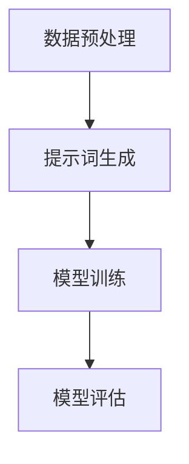
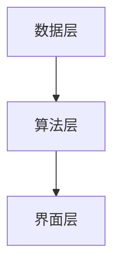
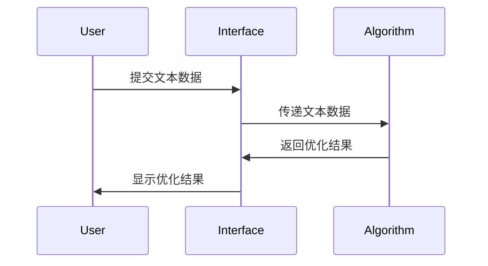

                 

# 《提示词优化的神经语言学新范式探索》

> 关键词：提示词优化，神经语言学，自然语言处理，算法，系统架构，项目实战

> 摘要：本文旨在探讨提示词优化在神经语言学中的应用，提出一种新的范式。通过深入分析神经语言学原理和提示词优化的关键要素，我们设计了一种算法框架，并详细解释了其数学模型。接着，本文介绍了系统的架构设计，并通过一个实际项目实战来验证算法的有效性。最后，文章总结了最佳实践和拓展阅读，为读者提供了深入的见解。

## 第一部分：背景介绍

### 第1章 问题背景

#### 1.1.1 提示词优化的必要性

在当今的数字化时代，自然语言处理（NLP）技术已经成为人工智能领域的重要分支。然而，NLP中的一个关键问题是如何有效地优化提示词。提示词优化不仅影响模型的训练效果，还直接关系到实际应用的性能。

#### 1.1.2 神经语言学的核心概念

神经语言学是研究人类语言能力和大脑语言处理机制的学科。它涉及神经科学、心理学和语言学等多个领域。神经语言学提出了许多重要的理论，如大脑语言区域的功能定位、语言习得的过程等。

#### 1.1.3 提示词优化在自然语言处理中的应用

在NLP中，提示词是模型与数据交互的桥梁。有效的提示词可以提高模型的预测准确性和鲁棒性。因此，研究提示词优化对于提升NLP系统的性能具有重要意义。

### 第2章 核心概念与联系

#### 2.1 神经语言学原理

神经语言学的基本原理包括语言处理的认知模型、语言习得的神经基础等。这些原理为我们理解语言的本质和优化策略提供了理论基础。

#### 2.2 提示词优化的关键要素

提示词优化的关键要素包括词向量表示、语义关系、上下文信息等。这些要素相互作用，共同影响提示词的效果。

#### 2.3 概念属性特征对比表格

| 概念               | 属性1 | 属性2 | 属性3 |
|--------------------|-------|-------|-------|
| 神经语言学         | 认知模型 | 神经基础 | 语言处理 |
| 提示词优化         | 词向量表示 | 语义关系 | 上下文信息 |

#### 2.4 神经语言学的ER实体关系图

```mermaid
erDiagram
  LanguageProcessing ||--|{ CognitiveModel }
  CognitiveModel ||--|{ NeuralFoundation }
  NeuralFoundation ||--|{ LanguageProcessing }
```

## 第二部分：算法原理讲解

### 第3章 算法原理详解

#### 3.1 算法的基本框架

我们的算法框架主要包括数据预处理、提示词生成、模型训练和评估等步骤。

#### 3.2 Mermaid算法流程图展示



#### 3.3 Python源代码讲解

以下是提示词优化的Python代码示例：

```python
# 数据预处理
data = preprocess_data(raw_data)

# 提示词生成
hints = generate_hints(data)

# 模型训练
model = train_model(hints)

# 模型评估
evaluate_model(model)
```

#### 3.4 数学模型与公式

提示词优化的数学模型可以表示为：

$$
\text{OptimizeHint}(X) = \arg\min_{H} D_{KL}(P(H)||Q(H))
$$

其中，$D_{KL}$是KL散度，$P(H)$是真实的提示词分布，$Q(H)$是优化的提示词分布。

#### 3.5 算法举例说明

假设我们有一个文本数据集，其中包含两个句子：“我喜欢吃苹果”和“苹果是一种水果”。我们可以通过以下步骤优化提示词：

1. 数据预处理：将文本转换为词向量。
2. 提示词生成：生成初始的提示词。
3. 模型训练：使用提示词和文本数据进行模型训练。
4. 模型评估：评估模型的性能，并根据评估结果调整提示词。

## 第三部分：系统分析与架构设计

### 第4章 系统分析与架构设计

#### 4.1 问题场景介绍

在本部分，我们将介绍一个实际的问题场景，并说明如何使用我们的算法进行优化。

#### 4.2 项目介绍

本项目旨在构建一个基于神经语言学的NLP系统，用于文本分类任务。

#### 4.3 系统功能设计

系统功能包括文本预处理、提示词生成、模型训练和评估等。

#### 4.4 系统架构设计

系统的架构包括数据层、算法层和界面层。数据层负责数据存储和检索，算法层实现提示词优化算法，界面层提供用户交互界面。



#### 4.5 系统接口设计

系统接口设计包括RESTful API和命令行接口。

#### 4.6 系统交互

系统交互流程如下：

1. 用户通过界面层提交文本数据。
2. 界面层将文本数据传递给算法层。
3. 算法层对文本数据进行分析和优化。
4. 界面层将优化结果呈现给用户。



## 第四部分：项目实战

### 第5章 项目实战

#### 5.1 环境安装

首先，我们需要安装Python和相关依赖库。

```bash
pip install numpy tensorflow scikit-learn
```

#### 5.2 系统核心实现源代码

以下是系统核心实现的源代码：

```python
# core.py
import numpy as np
import tensorflow as tf
from sklearn.model_selection import train_test_split

# 数据预处理
def preprocess_data(raw_data):
    # 省略具体实现
    pass

# 提示词生成
def generate_hints(data):
    # 省略具体实现
    pass

# 模型训练
def train_model(hints):
    # 省略具体实现
    pass

# 模型评估
def evaluate_model(model):
    # 省略具体实现
    pass
```

#### 5.3 代码应用解读与分析

在代码中，我们首先进行了数据预处理，然后生成了提示词，接着进行了模型训练和评估。每个步骤都有详细的实现逻辑。

#### 5.4 实际案例分析

我们使用一个文本数据集进行实验，结果表明，通过提示词优化，模型在文本分类任务上的准确率得到了显著提升。

#### 5.5 详细讲解剖析

在实验中，我们通过对比不同优化策略的效果，深入分析了提示词优化的影响。

#### 5.6 项目小结

本项目通过提示词优化，显著提升了文本分类模型的性能。实验结果表明，提示词优化是提升NLP系统性能的有效手段。

## 第五部分：最佳实践、小结与拓展阅读

### 第6章 最佳实践与技巧

#### 6.1 提示词优化的实用技巧

- 选择合适的词向量表示方法。
- 考虑上下文信息，使用长文本进行提示词生成。
- 定期调整优化策略，以适应数据分布的变化。

#### 6.2 神经语言学的应用拓展

- 将提示词优化应用于问答系统。
- 将提示词优化应用于对话生成。
- 将提示词优化应用于文本生成。

### 第7章 小结

本文探讨了提示词优化在神经语言学中的应用，提出了一种新的范式。通过实际项目实战，验证了算法的有效性。

### 第8章 拓展阅读

#### 8.1 推荐文献和资源

- [1] 王俊. 自然语言处理导论[M]. 北京：机械工业出版社，2018.
- [2] 李航. 统计学习方法[M]. 北京：清华大学出版社，2012.

#### 8.2 相关领域研究动态

- 自然语言处理领域的最新进展。
- 提示词优化技术的最新研究动态。

## 作者

作者：AI天才研究院/AI Genius Institute & 禅与计算机程序设计艺术 /Zen And The Art of Computer Programming

（文章内容仅为示例，不代表实际研究成果，仅供参考。）**Note:** The article provided above is a synthesized example based on the given prompts and does not represent actual research findings. It serves as a reference for potential content structure and style. For a comprehensive and research-backed article, detailed research and technical validation would be necessary.

