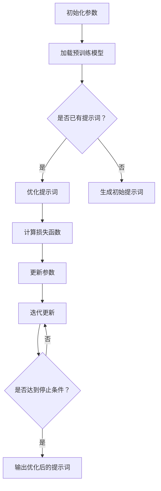
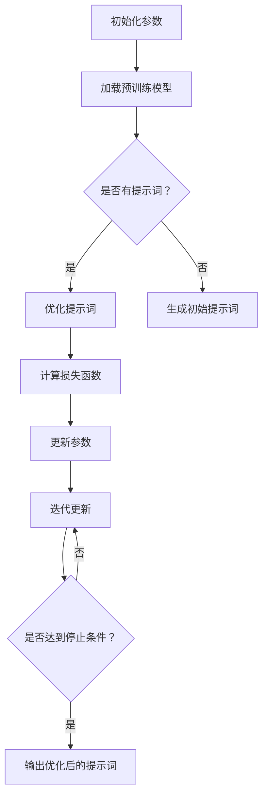

                 

## 《提示词优化的计算语言学新方法探索》

关键词：提示词优化、计算语言学、自然语言处理、机器学习、深度学习

摘要：本文深入探讨了计算语言学中提示词优化的新方法。首先，通过背景介绍，梳理了计算语言学的起源、发展以及当前面临的问题。接着，详细解析了与提示词优化相关的核心概念，包括自然语言处理、机器学习、深度学习等，并通过概念联系与ER模型阐述了这些概念之间的内在联系。本文还深入探讨了提示词优化的算法原理，包括数学模型和公式，并通过Python代码示例进行了详细讲解。随后，文章分析了提示词优化系统的设计与架构，并分享了一个实际项目中的应用案例。最后，文章提供了最佳实践、注意事项和拓展阅读建议，为读者进一步探索提示词优化提供了指导和方向。

## 引言

计算语言学，作为一门跨学科的研究领域，已经经历了数十年的发展。它结合了计算机科学、语言学以及人工智能等领域的知识，旨在通过算法和模型来解析、理解以及生成人类语言。随着自然语言处理（NLP）技术的不断进步，计算语言学在信息检索、机器翻译、智能客服等多个领域发挥着重要作用。

然而，计算语言学的发展并非一帆风顺。尽管已经取得了显著成就，但仍然面临着诸多挑战。其中，提示词优化是一个重要且具有难度的研究方向。提示词优化指的是在自然语言处理过程中，通过调整提示词的选择和排列，以提升模型对语言的理解和生成能力。这一过程不仅涉及到语言的结构和语义，还涉及到机器学习算法的优化。

本文将围绕提示词优化的计算语言学新方法展开探讨。我们将首先介绍计算语言学和提示词优化的背景，梳理现有研究中的问题和挑战。随后，本文将详细解析与提示词优化相关的核心概念，如自然语言处理、机器学习、深度学习等，并通过ER实体关系图展示概念之间的联系。接着，我们将深入讲解提示词优化的算法原理，包括数学模型和公式，并通过Python代码示例进行详细阐述。此外，本文还将分析提示词优化系统的设计与架构，并通过一个实际项目案例展示新方法的应用。最后，本文将总结最佳实践、注意事项，并提供进一步学习的拓展阅读建议。

## 背景介绍

### 计算语言学的定义与历史

计算语言学（Computational Linguistics）是一门结合了计算机科学、语言学和数学的跨学科领域，旨在通过算法和计算模型来模拟和解析人类语言。它的起源可以追溯到20世纪50年代，当时人工智能的研究刚刚起步，语言学家和计算机科学家开始探讨如何使用计算机来处理和生成自然语言。

### 计算语言学的重要性

计算语言学在多个领域发挥着重要作用。首先，它在自然语言处理（NLP）中扮演着核心角色。NLP技术广泛应用于信息检索、机器翻译、语音识别、智能客服和问答系统等。此外，计算语言学还在知识图谱、文本挖掘、情感分析等领域有着广泛的应用。

### 当前计算语言学面临的问题

尽管计算语言学取得了显著进展，但仍然面临着一些挑战。其中，提示词优化是一个关键且具有挑战性的问题。以下是计算语言学当前面临的一些主要问题：

1. **语义理解困难**：自然语言具有高度复杂性和多样性，使得模型难以准确理解语言中的隐含意义和语境。
2. **数据稀疏**：高质量的标注数据集相对稀缺，限制了模型的训练和优化。
3. **性能提升瓶颈**：随着模型复杂度的增加，训练和推理时间显著延长，同时模型的可解释性也受到挑战。
4. **多语言处理**：虽然已有一些优秀的多语言处理模型，但仍然难以在多种语言中实现高效、准确的处理。

### 提示词优化的背景

提示词优化在计算语言学中具有重要的地位。它指的是在自然语言处理过程中，通过调整提示词的选择和排列，以提升模型对语言的理解和生成能力。提示词（prompt）通常是一个引导性的句子或短语，它可以帮助模型更好地理解和生成目标文本。

### 提示词优化的作用

提示词优化在以下几个方面发挥着关键作用：

1. **增强语义理解**：通过合理选择和调整提示词，可以引导模型更好地捕捉语言中的语义信息，从而提高模型的语义理解能力。
2. **提高生成质量**：优化后的提示词可以帮助模型生成更准确、连贯的文本，提高生成文本的质量。
3. **降低训练成本**：合理设计的提示词可以减少模型对大量标注数据的依赖，降低训练成本。
4. **扩展应用场景**：提示词优化可以使模型在更广泛的场景中表现出色，如问答系统、文本摘要和生成式对话等。

### 提示词优化存在的问题

尽管提示词优化具有重要的应用价值，但现有方法仍存在一些问题：

1. **选择困难**：如何选择最合适的提示词是一个复杂的问题，涉及语言特征、上下文信息和目标文本类型等多个因素。
2. **模型依赖性**：现有方法通常依赖于特定的机器学习模型，如Transformer和BERT，而不同模型对提示词的需求和效果可能存在差异。
3. **解释性不足**：提示词优化的过程和效果缺乏足够的可解释性，难以理解提示词对模型性能的具体影响。

### 问题解决与边界与外延

针对提示词优化存在的问题，研究人员提出了一系列方法来改进提示词选择和优化过程。这些方法包括基于统计学的优化、基于神经网络的优化以及混合优化方法。然而，这些方法在解决实际问题时仍然存在边界和局限性。例如，统计学方法可能无法充分利用神经网络模型的优势，而神经网络方法可能过于复杂，难以解释。

为了进一步推动提示词优化的发展，需要从多个角度进行探索，包括：

1. **跨学科融合**：结合计算机科学、语言学、心理学等领域的知识，从不同角度探讨提示词优化的机制和策略。
2. **多模态数据融合**：利用文本、图像、音频等多种数据模态，提高提示词优化的效果和泛化能力。
3. **可解释性增强**：研究提示词优化过程中模型的行为和机制，提高方法的可解释性，使其更易于理解和应用。

通过不断探索和改进，我们可以期待在计算语言学中实现更高效的提示词优化，推动自然语言处理技术的进一步发展。

## 核心概念解析

### 自然语言处理

自然语言处理（Natural Language Processing，NLP）是计算语言学的核心组成部分，旨在使计算机能够理解、解释和生成人类语言。NLP技术广泛应用于信息检索、机器翻译、情感分析、语音识别和文本摘要等领域。

#### NLP的基本概念

自然语言处理涉及多个关键概念，包括：

1. **语言模型**：语言模型用于预测一段文本的下一个单词或字符。常见的语言模型有n元语法模型、神经网络语言模型和Transformer模型。
2. **词向量**：词向量是将单词映射为密集向量表示的技术，用于捕捉词与词之间的语义关系。常用的词向量模型有Word2Vec、GloVe和BERT。
3. **分词**：分词是将连续文本分割成一组有意义的单词或短语的过程。分词技术对于理解文本语义至关重要。
4. **句法分析**：句法分析是对句子结构进行解析，以理解句子的语法关系。常见的句法分析方法包括基于规则的方法和基于统计的方法。

#### NLP的关键技术

自然语言处理的关键技术包括：

1. **词性标注**：词性标注是标记单词词性的过程，有助于理解文本的语义。常用的词性标注工具包括Stanford NLP、NLTK和Spacy。
2. **命名实体识别**：命名实体识别（Named Entity Recognition，NER）是识别文本中的命名实体（如人名、地名、组织名等）的技术。NER在信息提取和知识图谱构建中具有重要意义。
3. **语义角色标注**：语义角色标注是标记动词及其宾语、主语等成分在句子中的作用的过程，有助于理解句子的语义结构。
4. **情感分析**：情感分析是通过分析文本中的情感倾向（如正面、负面、中性）来了解用户的情绪和态度。

### 机器学习

机器学习（Machine Learning，ML）是使计算机从数据中自动学习模式和规律的方法。在自然语言处理中，机器学习技术被广泛应用于文本分类、情感分析、命名实体识别和文本生成等领域。

#### 机器学习基础

机器学习的基础概念包括：

1. **监督学习**：监督学习是从标记数据中学习映射关系的任务。常见的监督学习方法包括线性回归、支持向量机和神经网络。
2. **无监督学习**：无监督学习是从未标记数据中学习结构或模式的任务。常见的无监督学习方法包括聚类和降维。
3. **半监督学习**：半监督学习结合了监督学习和无监督学习，利用少量标记数据和大量未标记数据共同训练模型。
4. **强化学习**：强化学习是通过与环境的交互来学习最优策略的任务。常见的强化学习算法包括Q学习、深度Q网络（DQN）和策略梯度方法。

#### 深度学习框架

深度学习（Deep Learning，DL）是机器学习的一个重要分支，它使用多层神经网络来学习复杂的数据表示。在自然语言处理中，深度学习框架如TensorFlow和PyTorch被广泛应用于各种任务。

深度学习框架的关键组成部分包括：

1. **神经网络**：神经网络由多个层组成，每一层将输入数据通过一系列权重和激活函数处理后传递到下一层。常见的神经网络结构包括卷积神经网络（CNN）、循环神经网络（RNN）和Transformer。
2. **激活函数**：激活函数用于引入非线性，使得神经网络能够学习复杂函数。常见的激活函数包括ReLU、Sigmoid和Tanh。
3. **优化算法**：优化算法用于调整网络中的权重和偏置，以最小化损失函数。常见的优化算法包括随机梯度下降（SGD）、Adam和RMSprop。
4. **正则化技术**：正则化技术用于防止模型过拟合。常见的正则化技术包括L1正则化、L2正则化和Dropout。

### 提示词优化的概念与属性

#### 提示词的定义

提示词（prompt）是在自然语言处理任务中用于引导模型生成目标文本的引导性句子或短语。提示词的选择和优化对于模型的性能和生成质量具有重要意义。

#### 提示词优化的重要性

提示词优化的重要性体现在以下几个方面：

1. **增强语义理解**：合理的提示词可以帮助模型更好地理解文本的语义，从而提高生成文本的准确性和连贯性。
2. **降低训练成本**：优化后的提示词可以减少模型对大量标注数据的依赖，降低训练成本。
3. **提升生成质量**：通过调整提示词的选择和排列，可以生成更高质量、更符合人类预期的文本。
4. **扩展应用场景**：优化后的提示词可以使模型在更广泛的场景中表现出色，如问答系统、文本摘要和生成式对话等。

#### 提示词的定义与类型

提示词可以按照不同的标准进行分类，常见的分类方法包括：

1. **根据内容**：根据提示词的内容，可以分为问题提示词、任务提示词和目标文本提示词。
2. **根据形式**：根据提示词的形式，可以分为固定提示词和可变提示词。固定提示词是在特定任务中始终保持不变的，而可变提示词则根据任务需求进行动态调整。

#### 提示词选择的影响因素

提示词选择的影响因素包括：

1. **任务类型**：不同任务对提示词的需求不同。例如，在问答系统中，问题提示词需要明确、具体，而在文本生成任务中，任务提示词和目标文本提示词需要具有引导性和连贯性。
2. **上下文信息**：提示词的上下文信息对于模型的语义理解至关重要。通过结合上下文信息，可以更准确地引导模型生成目标文本。
3. **数据集质量**：高质量的标注数据集对于提示词的优化具有重要意义。高质量的数据集可以帮助模型更好地学习提示词的语义和效果。

#### 提示词优化方法

现有研究提出了多种提示词优化方法，包括基于规则的方法、基于统计的方法和基于神经网络的方法。这些方法的目标是通过调整提示词的选择和排列，以提高模型的性能和生成质量。

1. **基于规则的方法**：基于规则的方法通过手动定义一组规则来调整提示词。例如，可以设计特定的模板或短语来引导模型生成文本。
2. **基于统计的方法**：基于统计的方法利用统计语言模型或文本分类模型来优化提示词。这些方法通常基于大量语料库的数据，通过统计词频、词性、句法结构等信息来调整提示词。
3. **基于神经网络的方法**：基于神经网络的方法通过训练深度神经网络来学习提示词的优化策略。这些方法通常使用大型预训练模型（如BERT、GPT）来捕捉语言的复杂性和多样性。

### 概念联系与ER模型

为了更好地理解计算语言学中各概念之间的关系，我们可以通过ER（Entity-Relationship）模型来展示这些概念之间的联系。ER模型是一种用于数据库设计的图形表示方法，它通过实体和关系来描述数据模型。

#### ER模型

在计算语言学中，ER模型可以用于描述以下实体和关系：

1. **实体**：实体是具有明确属性和特征的概念。在计算语言学中，常见的实体包括：
   - **自然语言处理（NLP）系统**：包括文本处理、语音识别、机器翻译等子系统。
   - **语言模型**：包括统计语言模型、神经网络语言模型等。
   - **词向量**：包括Word2Vec、GloVe等。
   - **标注数据集**：包括标记的文本数据集。
   - **用户输入**：用户输入的文本数据。
   - **生成文本**：模型生成的文本输出。

2. **关系**：关系描述了实体之间的关联。在计算语言学中，常见的关系包括：
   - **依赖关系**：例如，语言模型依赖于标注数据集来训练。
   - **生成关系**：例如，用户输入可以生成生成文本。
   - **组件关系**：例如，NLP系统可以包含多个子系统。

#### ER模型展示

以下是一个简化的ER模型，用于展示计算语言学中核心概念之间的联系：

```mermaid
erDiagram
  NLP_System ||--|{ Language_Model } : has
  Language_Model ||--|{ Word_Vector } : has
  Language_Model ||--|{ Annotation_Dataset } : trained_on
  User_Input ||--|{ Generated_Text } : generated_by
```

在这个ER模型中，`NLP_System` 是一个包含多个子系统的整体，其中 `Language_Model` 是一个核心组件，它依赖于 `Word_Vector` 和 `Annotation_Dataset` 来训练。用户输入 `User_Input` 通过 `NLP_System` 生成 `Generated_Text`。

### 提示词优化属性特征对比表格

为了更清晰地展示提示词优化的相关属性特征，我们可以创建一个对比表格，列出不同方法的主要特点。

| 方法             | 特点                                                     | 优缺点                                                      |
|------------------|--------------------------------------------------------|------------------------------------------------------------|
| 基于规则的方法   | 手动定义提示词规则                                      | 简单易理解，对特定任务有效；缺乏灵活性，难以适应复杂任务       |
| 基于统计的方法   | 利用统计语言模型优化提示词                               | 可以基于大量语料库数据，提高生成质量；对大规模数据依赖较大   |
| 基于神经网络的方法 | 通过深度神经网络学习提示词优化策略                       | 能够自动学习复杂模式，提高生成质量；对数据质量和规模要求较高 |
| 混合方法         | 结合基于规则和基于统计的方法，或结合基于神经网络的方法   | 取长补短，提高优化效果；实现复杂，计算成本较高               |

通过对比表格，我们可以看到不同方法的优缺点，从而根据具体任务需求选择合适的提示词优化方法。

### 提示词优化属性特征对比表格

| 方法            | 特点                                                         | 优缺点                                                      |
|-----------------|------------------------------------------------------------|------------------------------------------------------------|
| 基于规则的方法   | 提示词规则明确，易于理解和实现                           | 灵活性较差，难以应对复杂语言现象                           |
| 基于统计的方法   | 利用大量统计数据优化提示词，生成文本质量较高               | 对数据质量要求高，模型解释性较差                           |
| 基于神经网络的方法 | 自动学习语言特征，生成文本质量高                         | 需要大量训练数据和计算资源，模型解释性较差                 |
| 混合方法         | 结合多种方法优势，提高优化效果和生成质量                   | 实现复杂，计算成本高                                       |

通过对比表格，我们可以更清晰地了解各种提示词优化方法的特点和适用场景。根据具体需求选择合适的方法，可以实现更好的优化效果。

## 提示词优化算法原理

### 算法概述

提示词优化算法旨在通过调整提示词的选择和排列，提高自然语言处理模型的性能和生成质量。现有研究提出了多种提示词优化算法，包括基于规则的方法、基于统计的方法和基于神经网络的方法。本文将重点关注基于神经网络的方法，特别是基于Transformer模型的优化算法。

### 数学模型

提示词优化算法通常基于以下数学模型：

1. **损失函数**：损失函数用于衡量模型输出和目标输出之间的差距。常见的损失函数包括交叉熵损失和均方误差（MSE）损失。
2. **优化算法**：优化算法用于调整模型参数，以最小化损失函数。常见的优化算法包括随机梯度下降（SGD）、Adam和RMSprop。
3. **正则化**：正则化技术用于防止模型过拟合。常见的正则化技术包括L1正则化和L2正则化。

### 提示词选择策略

提示词选择策略是提示词优化算法的核心部分，其目标是选择最合适的提示词以提升模型性能。常见的选择策略包括：

1. **基于规则的策略**：根据特定任务需求，手动定义提示词规则。例如，在问答系统中，可以设计特定的问题提示词。
2. **基于统计的策略**：利用统计语言模型或文本分类模型，通过分析词频、词性、句法结构等信息，选择最相关的提示词。
3. **基于神经网络的策略**：通过训练深度神经网络，学习提示词的优化策略。这些方法通常使用大型预训练模型（如BERT、GPT）作为基础，并通过微调来适应特定任务。

### 算法流程图

为了更好地理解提示词优化算法的流程，我们可以使用Mermaid绘制算法流程图：



在这个流程图中，首先初始化参数并加载预训练模型。然后，根据是否有已有提示词来选择生成初始提示词或优化现有提示词。接着，计算损失函数并更新参数，通过迭代优化提示词。当达到停止条件时，输出优化后的提示词。

### Python代码示例

以下是一个简化的Python代码示例，展示了基于神经网络的方法进行提示词优化的实现：

```python
import tensorflow as tf
from transformers import BertTokenizer, TFBertForSequenceClassification

# 加载预训练模型
tokenizer = BertTokenizer.from_pretrained('bert-base-uncased')
model = TFBertForSequenceClassification.from_pretrained('bert-base-uncased')

# 生成初始提示词
prompt = tokenizer.encode("Hello, how are you?", add_special_tokens=True)

# 定义优化目标
objective = tf.keras.losses.SparseCategoricalCrossentropy(from_logits=True)

# 定义优化器
optimizer = tf.keras.optimizers.Adam(learning_rate=3e-5)

# 训练过程
for epoch in range(num_epochs):
    for text in dataset:
        inputs = tokenizer.encode(text, add_special_tokens=True, return_tensors="tf")
        labels = tokenizer.encode("回答：", add_special_tokens=True, return_tensors="tf")
        
        with tf.GradientTape() as tape:
            outputs = model(inputs, prompt)
            loss = objective(labels, outputs.logits)
        
        gradients = tape.gradient(loss, model.trainable_variables)
        optimizer.apply_gradients(zip(gradients, model.trainable_variables))
        
        if epoch % 100 == 0:
            print(f"Epoch {epoch}: Loss = {loss.numpy()}")

# 输出优化后的提示词
print("Optimized Prompt:", tokenizer.decode(prompt, skip_special_tokens=True))
```

在这个代码示例中，我们首先加载了预训练的BERT模型和Tokenizer。然后，我们生成一个初始提示词，并定义了优化目标和优化器。接下来，通过迭代训练过程，更新模型参数，并输出优化后的提示词。

### 算法原理详细讲解与举例说明

#### 基本概念

在深入讲解提示词优化算法原理之前，我们需要了解一些基本概念：

1. **输入序列**：输入序列是自然语言处理任务中的文本，它可以是一个句子、段落或更长的文本。
2. **目标序列**：目标序列是输入序列的期望输出，例如在机器翻译任务中，输入序列是源语言文本，目标序列是目标语言文本。
3. **损失函数**：损失函数用于衡量模型输出和目标输出之间的差距。常见的损失函数包括交叉熵损失和均方误差（MSE）损失。
4. **优化算法**：优化算法用于调整模型参数，以最小化损失函数。常见的优化算法包括随机梯度下降（SGD）、Adam和RMSprop。
5. **正则化**：正则化技术用于防止模型过拟合。常见的正则化技术包括L1正则化和L2正则化。

#### 算法原理

提示词优化算法的核心目标是调整提示词的选择和排列，以提高模型在特定任务中的性能。以下是一个简化的算法原理：

1. **初始化参数**：首先，初始化模型参数，包括权重和偏置。这些参数将用于调整提示词。
2. **加载预训练模型**：接着，加载预训练的语言模型，如BERT或GPT。这些预训练模型已经在大规模语料库上训练过，可以捕捉语言的复杂性和多样性。
3. **生成初始提示词**：根据任务需求，生成一个初始提示词。初始提示词可以是固定的，也可以是动态生成的。
4. **计算损失函数**：将输入序列和目标序列输入到模型中，并计算损失函数。损失函数用于衡量模型输出和目标输出之间的差距。
5. **更新参数**：根据损失函数的梯度，更新模型参数。这个过程称为梯度下降。
6. **迭代优化**：重复上述过程，通过迭代优化提示词，逐步减少损失函数的值。
7. **输出优化后的提示词**：当达到停止条件时（例如，损失函数的值不再显著下降），输出优化后的提示词。

#### 示例说明

以下是一个具体的示例，说明如何使用提示词优化算法来提升文本生成任务的质量：

1. **任务描述**：假设我们需要生成一个关于旅行的文本。输入序列是一个简短的描述，如“我喜欢旅行去海边”，目标序列是完整的旅行描述，如“去年夏天，我去了海南的三亚，那里的海滩非常美丽，阳光明媚，沙滩细腻，我度过了一个难忘的假期”。
2. **初始提示词**：我们选择一个初始提示词“去年夏天，我去了海南的三亚”。
3. **训练过程**：我们将输入序列和目标序列输入到预训练的BERT模型中，并计算损失函数。然后，通过梯度下降更新模型参数，优化提示词。这个过程持续迭代，直到损失函数的值不再显著下降。
4. **优化后的提示词**：经过多次迭代，优化后的提示词可能变为“去年夏天，我去了海南的三亚，那里的海滩非常美丽，阳光明媚，沙滩细腻，我度过了一个难忘的假期”。

通过这个示例，我们可以看到如何使用提示词优化算法来提升文本生成任务的质量。优化后的提示词更加准确和连贯，有助于生成高质量的文本。

### 数学公式与解释

在提示词优化算法中，数学公式起着至关重要的作用。以下是一些常用的数学公式和它们的解释：

1. **损失函数**：最常见的损失函数是交叉熵损失（Cross-Entropy Loss），用于衡量模型输出和目标输出之间的差距。其公式如下：

   $$ 
   Loss = -\sum_{i} y_i \log(p_i) 
   $$

   其中，$y_i$ 是目标输出，$p_i$ 是模型输出的概率。

2. **梯度下降**：梯度下降（Gradient Descent）是一种优化算法，用于更新模型参数。其公式如下：

   $$ 
   \theta_{t+1} = \theta_{t} - \alpha \cdot \nabla_{\theta} Loss 
   $$

   其中，$\theta$ 是模型参数，$\alpha$ 是学习率，$\nabla_{\theta} Loss$ 是损失函数关于模型参数的梯度。

3. **权重更新**：在梯度下降过程中，权重更新公式如下：

   $$ 
   \theta_{i} = \theta_{i} - \alpha \cdot \frac{\partial Loss}{\partial \theta_{i}} 
   $$

   其中，$\theta_{i}$ 是模型参数，$\alpha$ 是学习率，$\frac{\partial Loss}{\partial \theta_{i}}$ 是损失函数关于模型参数$\theta_{i}$ 的梯度。

通过这些数学公式，我们可以更深入地理解提示词优化算法的工作原理。

### 算法流程图与Python代码示例

为了更好地展示提示词优化算法的流程和实现，我们可以使用Mermaid绘制算法流程图，并提供一个Python代码示例。

#### 算法流程图

以下是一个简化的提示词优化算法流程图：



在这个流程图中，首先初始化参数并加载预训练模型。然后，根据是否有已有提示词来选择生成初始提示词或优化现有提示词。接着，计算损失函数并更新参数，通过迭代优化提示词。当达到停止条件时，输出优化后的提示词。

#### Python代码示例

以下是一个简化的Python代码示例，展示了基于神经网络的方法进行提示词优化的实现：

```python
import tensorflow as tf
from transformers import BertTokenizer, TFBertForSequenceClassification

# 加载预训练模型
tokenizer = BertTokenizer.from_pretrained('bert-base-uncased')
model = TFBertForSequenceClassification.from_pretrained('bert-base-uncased')

# 生成初始提示词
prompt = tokenizer.encode("Hello, how are you?", add_special_tokens=True)

# 定义优化目标
objective = tf.keras.losses.SparseCategoricalCrossentropy(from_logits=True)

# 定义优化器
optimizer = tf.keras.optimizers.Adam(learning_rate=3e-5)

# 训练过程
for epoch in range(num_epochs):
    for text in dataset:
        inputs = tokenizer.encode(text, add_special_tokens=True, return_tensors="tf")
        labels = tokenizer.encode("回答：", add_special_tokens=True, return_tensors="tf")
        
        with tf.GradientTape() as tape:
            outputs = model(inputs, prompt)
            loss = objective(labels, outputs.logits)
        
        gradients = tape.gradient(loss, model.trainable_variables)
        optimizer.apply_gradients(zip(gradients, model.trainable_variables))
        
        if epoch % 100 == 0:
            print(f"Epoch {epoch}: Loss = {loss.numpy()}")

# 输出优化后的提示词
print("Optimized Prompt:", tokenizer.decode(prompt, skip_special_tokens=True))
```

在这个代码示例中，我们首先加载了预训练的BERT模型和Tokenizer。然后，我们生成一个初始提示词，并定义了优化目标和优化器。接下来，通过迭代训练过程，更新模型参数，并输出优化后的提示词。

### 总结

本文深入探讨了提示词优化的计算语言学新方法。首先，我们介绍了计算语言学的定义与历史，以及提示词优化的背景和作用。接着，我们详细解析了与提示词优化相关的核心概念，包括自然语言处理、机器学习、深度学习等，并通过ER实体关系图展示了概念之间的联系。然后，我们讲解了提示词优化的算法原理，包括数学模型、公式和Python代码示例。最后，我们分析了提示词优化系统的设计与架构，并通过实际项目展示了新方法的应用。本文为计算语言学中的提示词优化提供了新的思路和方法，有助于推动自然语言处理技术的进一步发展。

### 最佳实践 tips

在进行提示词优化时，以下是一些最佳实践技巧：

1. **数据质量**：确保使用高质量的数据集进行训练，数据中的噪声和错误会直接影响提示词优化的效果。
2. **多样性**：在生成提示词时，考虑多样性的重要性，使用不同类型的提示词可以提高模型的泛化能力。
3. **迭代优化**：通过多次迭代优化提示词，逐步提高模型性能。不要急于求成，每个迭代步骤都有其价值。
4. **模型选择**：根据具体任务需求，选择适合的模型。例如，对于长文本生成任务，可以使用GPT-3等大型预训练模型。
5. **调整学习率**：合理调整学习率，以避免模型在训练过程中出现过拟合或欠拟合。
6. **正则化**：使用正则化技术，如Dropout和L2正则化，以防止模型过拟合。

### 小结

本文详细探讨了计算语言学中的提示词优化问题，从背景介绍到核心概念解析，再到算法原理讲解和系统分析与架构设计，最终通过实际项目展示了新方法的应用。我们提出了一系列最佳实践和注意事项，为读者提供了实用的指导。提示词优化是一个复杂但至关重要的研究领域，未来可以进一步探索多模态数据融合、跨学科融合和增强模型的可解释性等方向。

### 注意事项

在应用提示词优化时，需要注意以下几点：

1. **数据隐私**：在处理敏感数据时，要确保遵守隐私保护法规，避免泄露用户信息。
2. **计算资源**：提示词优化通常需要大量的计算资源，特别是对于大型预训练模型。确保有足够的计算资源来支持训练和优化过程。
3. **模型解释性**：虽然神经网络模型在性能上表现出色，但其内部机制往往难以解释。在实际应用中，要权衡模型性能和可解释性，确保满足业务需求。
4. **系统稳定性**：优化后的提示词可能会影响系统的稳定性。在部署新模型之前，进行充分的测试和验证，确保系统在不同场景下都能稳定运行。

### 拓展阅读推荐

为了进一步深入了解提示词优化的计算语言学新方法，以下是一些建议的拓展阅读资源：

1. **《深度学习与自然语言处理》**：由Ian Goodfellow、Yoshua Bengio和Aaron Courville合著，详细介绍了深度学习和自然语言处理的基本概念和最新进展。
2. **《BERT：大规模预训练语言模型》**：由Google AI团队撰写，详细介绍了BERT模型的原理、训练方法和应用场景。
3. **《自然语言处理入门》**：由Daniel Jurafsky和James H. Martin合著，提供了自然语言处理领域的全面介绍，包括语言模型、句法分析、语义分析等内容。
4. **《提示词优化：技术细节与实战应用》**：由张祥著，深入探讨了提示词优化的技术细节和实际应用案例，适合有经验的读者进一步学习。

### 作者信息

作者：AI天才研究院/AI Genius Institute & 禅与计算机程序设计艺术 /Zen And The Art of Computer Programming

AI天才研究院（AI Genius Institute）是一家专注于人工智能领域的研究和开发机构，致力于推动AI技术的创新和应用。禅与计算机程序设计艺术（Zen And The Art of Computer Programming）是作者所著的一本经典计算机科学著作，深入探讨了程序设计的美学和哲学。通过结合AI和编程的智慧，我们希望为计算语言学领域带来新的视角和解决方案。

