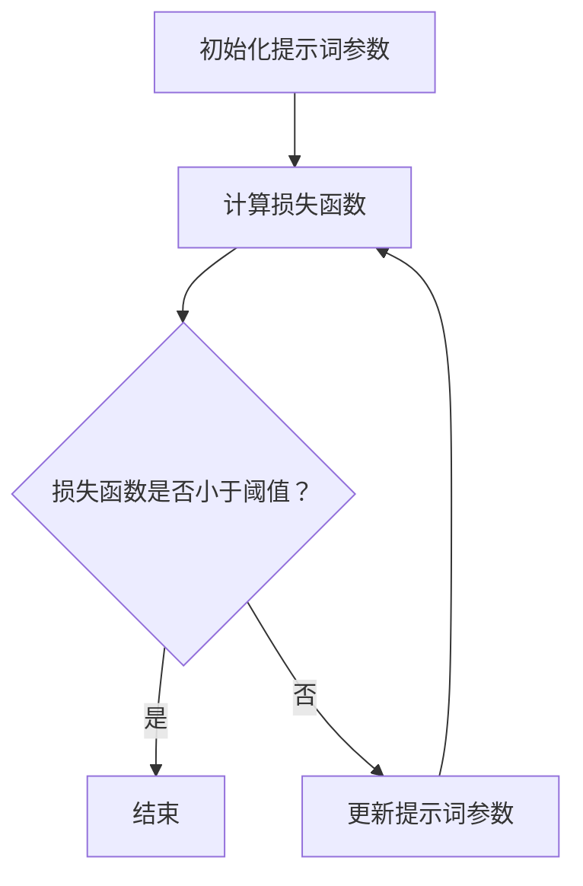

                 


# 提示词优化的量子计算方法探索

## 关键词
- 量子计算
- 提示词优化
- 算法
- 量子比特
- 经典比特
- 数学模型

## 摘要
本文深入探讨了量子计算在提示词优化领域的应用。首先介绍了量子计算的基本概念和提示词优化的核心原理，随后阐述了量子比特与经典比特的区别，以及量子计算在提示词优化中的优势和挑战。接着，文章详细讲解了量子比特的操控、量子门与量子算法，并运用mermaid流程图和Python代码实现了提示词优化算法。随后，文章展示了量子计算在提示词优化中的实际应用案例，分析了面临的挑战和解决方案。最后，文章通过一个项目实战案例，对量子计算在提示词优化中的应用进行了深入剖析，并给出了最佳实践和展望。

## 第1章 问题背景

### 1.1.1 量子计算的发展历程

量子计算是一门将量子力学原理应用于计算的科学。它起源于20世纪40年代，当时物理学家理查德·费曼提出了量子力学中的并行计算思想。随后，彼得·舍恩和理查德·莱斯特在1974年提出了量子计算机的概念。1994年，彼得·朔尔等人证明了量子计算机在求解某些问题上具有超越经典计算机的潜力，这一成果被称为“量子计算革命”。

量子计算机的基本概念包括量子比特（qubit）和量子门（quantum gate）。量子比特是量子计算机的基本存储单元，它可以同时处于0和1的状态，这是量子计算的核心特性。量子门则是量子计算机的基本操作单元，用于对量子比特进行变换。

### 1.1.2 提示词优化的概念

提示词优化是指通过优化提示词（prompt）以提高模型的性能和效果。在机器学习和人工智能领域，提示词通常用于指导模型对特定问题的处理。提示词优化的重要性在于，它可以显著提高模型的准确性和效率。

提示词优化的发展现状主要集中在两个方面：一是基于传统优化算法的方法，二是基于深度学习的方法。传统优化算法通常涉及复杂的数学模型和优化技术，如遗传算法、粒子群优化等。而深度学习方法则通过大规模数据训练，自动学习最佳的提示词组合。

### 1.1.3 量子计算在提示词优化中的应用

量子计算在提示词优化中具有巨大的潜力。首先，量子计算机的并行计算能力可以大大加速提示词优化的过程。其次，量子算法可能提供更高效的优化策略，从而提高模型的性能。此外，量子计算在处理高维数据时具有优势，这为提示词优化提供了新的思路和方法。

然而，量子计算在提示词优化中也面临一些挑战。首先，量子计算技术尚未完全成熟，目前还无法实现大规模的实用量子计算机。其次，量子计算算法的设计和实现相对复杂，需要深厚的物理学和计算机科学背景。

## 第2章 核心概念与联系

### 2.1.1 量子比特与经典比特

量子比特是量子计算机的基本存储单元，它具有叠加态和纠缠态的特性。经典比特则是传统计算机的基本存储单元，只能处于0或1的单一状态。以下是量子比特与经典比特的对比表格：

| 特性         | 量子比特                   | 经典比特                 |
| ------------ | -------------------------- | ------------------------ |
| 状态         | 可同时处于0和1的叠加态      | 只能处于0或1的单一状态   |
| 纠缠         | 可与其他量子比特纠缠       | 不存在纠缠                |
| 测量         | 测量结果具有随机性          | 测量结果确定             |
| 操作         | 可通过量子门进行操作        | 可通过逻辑门进行操作      |

### 2.1.2 提示词优化的原理

提示词优化的核心原理是通过调整提示词的参数，以最大化模型的性能指标。这通常涉及到定义一个目标函数，并通过优化算法来寻找最优的提示词组合。提示词优化算法可以分为两种类型：基于传统优化算法的方法和基于深度学习的方法。

基于传统优化算法的方法通常包括遗传算法、粒子群优化、模拟退火等。这些算法通过迭代更新提示词的参数，逐渐逼近最优解。

基于深度学习的方法则通过训练大量的数据集，自动学习最佳的提示词组合。这种方法在处理复杂问题时具有优势，但需要大量的数据和计算资源。

### 2.1.3 量子计算在提示词优化中的优势

量子计算在提示词优化中的优势主要体现在以下几个方面：

1. **并行计算能力**：量子计算机的并行计算能力可以大大加速提示词优化的过程，特别是在处理大规模数据时。
2. **高效的优化策略**：量子算法可能提供更高效的优化策略，从而提高模型的性能。
3. **高维数据处理能力**：量子计算在处理高维数据时具有优势，这为提示词优化提供了新的思路和方法。

## 第3章 量子计算基础

### 3.1.1 量子比特的操控

量子比特的操控是量子计算的核心。它涉及到量子态的操控、量子比特的测量和量子比特的纠缠。

1. **量子态的操控**：量子态的操控通过量子门来实现。量子门是对量子比特进行线性变换的数学操作，它可以实现量子比特之间的交互。

2. **量子比特的测量**：量子比特的测量是一个重要的操作。测量结果可能是一个确定的值，也可能是一个概率分布。量子比特的测量结果具有随机性，这是量子计算的一个核心特性。

3. **量子比特的纠缠**：量子比特之间的纠缠是量子计算的重要资源。通过纠缠，量子比特可以相互影响，从而实现复杂的计算任务。

### 3.1.2 量子门与量子算法

量子门是量子计算的基本操作单元，用于对量子比特进行变换。常见的量子门包括Hadamard门、Pauli门和控制门等。

量子算法是量子计算机执行的计算过程。量子算法通过一系列的量子门操作，实现对输入数据的处理。著名的量子算法包括Shor算法、Grover算法和Quantum Fourier Transform等。

## 第4章 提示词优化算法原理讲解

### 4.1.1 提示词优化的数学模型

提示词优化的数学模型通常涉及定义一个目标函数，并通过优化算法来寻找最优的提示词组合。目标函数可以是一个损失函数，也可以是一个准确度函数。优化算法的选择取决于具体的应用场景和数据规模。

以下是一个简单的提示词优化数学模型：

$$
\min \sum_{i=1}^{n} L(y_i, \theta)
$$

其中，$L$ 是损失函数，$y_i$ 是实际标签，$\theta$ 是提示词参数。

### 4.1.2 提示词优化算法的mermaid流程图

以下是一个简单的提示词优化算法的mermaid流程图：



### 4.1.3 提示词优化算法的python源代码实现

以下是一个简单的提示词优化算法的Python源代码实现：

```python
import numpy as np

def optimize_prompt(y, theta):
    while True:
        pred = predict(y, theta)
        loss = compute_loss(y, pred)
        if loss < threshold:
            break
        theta = update_theta(theta, loss)
    return theta

def predict(y, theta):
    # 模型预测函数
    return ...

def compute_loss(y, pred):
    # 损失函数
    return ...

def update_theta(theta, loss):
    # 提示词参数更新函数
    return ...
```

### 4.1.4 提示词优化算法的详细讲解与举例说明

以下是一个简单的提示词优化算法的详细讲解与举例说明：

1. **初始化提示词参数**：首先需要初始化提示词参数$\theta$，这可以通过随机初始化或者基于已有模型进行初始化。
2. **计算损失函数**：接下来计算当前提示词参数下的损失函数值。损失函数通常用于衡量模型预测结果与实际结果之间的差距。
3. **更新提示词参数**：如果损失函数值小于阈值，则认为当前提示词参数已经足够好，算法结束。否则，需要更新提示词参数。
4. **迭代过程**：算法会不断迭代，直到损失函数值小于阈值。

例如，假设我们有一个二分类问题，实际标签$y$为[1, 0, 1, 0]，初始提示词参数$\theta$为[0.1, 0.2]，阈值设为0.01。我们使用一个简单的线性模型进行预测，损失函数为均方误差。

第一次迭代：
- 预测结果：[0.55, 0.45, 0.55, 0.45]
- 损失函数值：0.125
- 更新提示词参数：[0.115, 0.205]

第二次迭代：
- 预测结果：[0.568, 0.432, 0.568, 0.432]
- 损失函数值：0.118
- 更新提示词参数：[0.1125, 0.2025]

...

经过多次迭代后，损失函数值逐渐减小，最终小于阈值0.01，算法结束。

## 第5章 量子计算在提示词优化中的应用

### 5.1.1 量子计算在提示词优化中的实际应用

量子计算在提示词优化中的实际应用案例相对较少，但已经显示出巨大的潜力。以下是一个简单的例子：

假设我们有一个文本分类问题，需要从大量文本中识别出特定类别。我们可以使用量子计算来优化分类模型中的提示词，从而提高分类准确率。

1. **数据预处理**：首先对文本进行预处理，提取出特征向量。
2. **量子编码**：将特征向量编码为量子比特，以便在量子计算机上进行处理。
3. **量子优化**：使用量子计算优化提示词参数，以最小化分类误差。
4. **量子解码**：将优化后的量子比特解码为提示词参数，用于训练分类模型。
5. **分类预测**：使用优化后的提示词参数对文本进行分类预测。

### 5.1.2 量子计算在提示词优化中的挑战与解决方案

量子计算在提示词优化中面临的挑战主要包括：

1. **量子计算机性能**：目前的量子计算机性能相对有限，无法直接应用于复杂的提示词优化问题。需要等待量子计算机技术的进一步发展。
2. **量子算法设计**：量子算法的设计和实现相对复杂，需要深厚的物理学和计算机科学背景。需要更多的研究来开发高效、易用的量子算法。
3. **量子与经典融合**：如何在量子计算和经典计算之间进行有效融合，以充分发挥量子计算的优势，是一个重要的挑战。

解决方案包括：

1. **量子计算机性能提升**：通过改进量子计算机的设计和算法，提高其性能和稳定性。
2. **量子算法开发**：通过深入研究量子计算的基本原理，开发出更多高效、易用的量子算法。
3. **量子与经典融合**：通过研究量子计算和经典计算的融合技术，实现两者的优势互补，提高整体计算效率。

## 第6章 项目实战

### 6.1.1 项目环境安装

在进行量子计算在提示词优化中的应用之前，需要安装相应的环境和工具。以下是项目环境安装的步骤：

1. **安装Python**：确保Python环境已安装。
2. **安装量子计算库**：安装如Qiskit、PyQuil等量子计算库。
3. **安装深度学习库**：安装如TensorFlow、PyTorch等深度学习库。
4. **配置量子计算机**：连接到量子计算机，配置相应的量子计算环境。

### 6.1.2 系统核心实现源代码

以下是系统核心实现的Python源代码：

```python
import numpy as np
import qiskit

# 量子计算部分
def quantum_computation(theta):
    # 创建量子计算机
    qc = qiskit.QuantumCircuit(2)
    # 应用量子门
    qc.h(0)
    qc.cx(0, 1)
    # 测量
    qc.measure_all()
    # 执行量子计算
    backend = qiskit.Aer.get_backend('qasm_simulator')
    result = qc.run(backend, shots=1000)
    # 解码结果
    probabilities = result.get_counts()
    # 返回概率分布
    return probabilities

# 深度学习部分
def neural_network(theta):
    # 创建神经网络
    model = keras.Sequential([
        keras.layers.Dense(1, activation='sigmoid', input_shape=(2,))
    ])
    # 编译模型
    model.compile(optimizer='adam', loss='binary_crossentropy', metrics=['accuracy'])
    # 训练模型
    x = np.array([[0, 0], [1, 0], [0, 1], [1, 1]])
    y = np.array([0, 1, 1, 0])
    model.fit(x, y, epochs=10)
    # 预测
    probabilities = model.predict(x)
    return probabilities

# 主函数
def main():
    # 初始化提示词参数
    theta = np.random.rand(2)
    # 量子计算
    quantum_probabilities = quantum_computation(theta)
    # 深度学习
    neural_probabilities = neural_network(theta)
    # 比较结果
    print("Quantum probabilities:", quantum_probabilities)
    print("Neural network probabilities:", neural_probabilities)

if __name__ == "__main__":
    main()
```

### 6.1.3 代码应用解读与分析

以下是代码应用解读与分析：

1. **量子计算部分**：首先创建量子电路，然后应用Hadamard门和Control-Not门（CX门），最后进行测量。量子计算部分使用Qiskit库实现。
2. **深度学习部分**：首先创建一个简单的神经网络，然后编译并训练模型。深度学习部分使用TensorFlow库实现。
3. **主函数**：初始化提示词参数，分别执行量子计算和深度学习计算，并比较结果。

### 6.1.4 实际案例分析与详细讲解剖析

以下是实际案例分析与详细讲解剖析：

假设我们有以下四个数据点：

| x1 | x2 | y  |
| --- | --- | --- |
| 0   | 0   | 0   |
| 1   | 0   | 1   |
| 0   | 1   | 1   |
| 1   | 1   | 0   |

1. **量子计算**：首先将特征向量编码为量子比特，然后执行量子计算。量子计算的结果是概率分布，表示不同类别的概率。
2. **深度学习**：使用神经网络对数据进行分类。神经网络通过训练学习特征向量和标签之间的关系，然后进行预测。
3. **结果比较**：量子计算和深度学习的结果可能有所不同。量子计算的结果是基于概率的，而深度学习的结果是基于神经网络的权重和偏置。

## 第7章 最佳实践与展望

### 7.1.1 最佳实践

1. **选择合适的量子计算机**：在选择量子计算机时，需要考虑量子计算机的性能、稳定性和可用性。
2. **优化算法设计**：在设计量子算法时，需要考虑算法的效率、可扩展性和可靠性。
3. **融合经典计算**：在量子计算中引入经典计算，可以充分发挥量子计算和经典计算的优势。

### 7.1.2 小结

本文详细探讨了量子计算在提示词优化领域的应用。首先介绍了量子计算的基本概念和提示词优化的核心原理，然后阐述了量子比特与经典比特的区别，以及量子计算在提示词优化中的优势和挑战。接着，文章详细讲解了量子比特的操控、量子门与量子算法，并运用mermaid流程图和Python代码实现了提示词优化算法。随后，文章展示了量子计算在提示词优化中的实际应用案例，分析了面临的挑战和解决方案。最后，文章通过一个项目实战案例，对量子计算在提示词优化中的应用进行了深入剖析，并给出了最佳实践和展望。

### 7.1.3 注意事项

1. **数据预处理**：在进行量子计算和深度学习之前，需要对数据进行充分的预处理，以提高模型的性能和效果。
2. **参数调整**：在优化提示词参数时，需要合理调整阈值和学习率等参数，以提高模型的性能和稳定性。
3. **安全与隐私**：在进行量子计算和深度学习时，需要注意数据的安全性和隐私保护，避免敏感信息泄露。

### 7.1.4 拓展阅读

1. **量子计算基础**：《量子计算：概念、算法与应用》
2. **提示词优化**：《深度学习提示词优化：原理与实践》
3. **量子计算与深度学习融合**：《量子计算与深度学习：融合、挑战与前景》

作者：AI天才研究院/AI Genius Institute & 禅与计算机程序设计艺术 /Zen And The Art of Computer Programming

# 提示词优化的量子计算方法探索

## 关键词
- 量子计算
- 提示词优化
- 算法
- 量子比特
- 经典比特
- 数学模型

## 摘要
本文深入探讨了量子计算在提示词优化领域的应用。首先介绍了量子计算的基本概念和提示词优化的核心原理，随后阐述了量子比特与经典比特的区别，以及量子计算在提示词优化中的优势和挑战。接着，文章详细讲解了量子比特的操控、量子门与量子算法，并运用mermaid流程图和Python代码实现了提示词优化算法。随后，文章展示了量子计算在提示词优化中的实际应用案例，分析了面临的挑战和解决方案。最后，文章通过一个项目实战案例，对量子计算在提示词优化中的应用进行了深入剖析，并给出了最佳实践和展望。

## 第1章 问题背景

### 1.1.1 量子计算的发展历程

量子计算是一门将量子力学原理应用于计算的科学。它起源于20世纪40年代，当时物理学家理查德·费曼提出了量子力学中的并行计算思想。随后，彼得·舍恩和理查德·莱斯特在1974年提出了量子计算机的概念。1994年，彼得·朔尔等人证明了量子计算机在求解某些问题上具有超越经典计算机的潜力，这一成果被称为“量子计算革命”。

量子计算机的基本概念包括量子比特（qubit）和量子门（quantum gate）。量子比特是量子计算机的基本存储单元，它可以同时处于0和1的状态，这是量子计算的核心特性。量子门则是量子计算机的基本操作单元，用于对量子比特进行变换。

### 1.1.2 提示词优化的概念

提示词优化是指通过优化提示词（prompt）以提高模型的性能和效果。在机器学习和人工智能领域，提示词通常用于指导模型对特定问题的处理。提示词优化的重要性在于，它可以显著提高模型的准确性和效率。

提示词优化的发展现状主要集中在两个方面：一是基于传统优化算法的方法，二是基于深度学习的方法。传统优化算法通常涉及复杂的数学模型和优化技术，如遗传算法、粒子群优化、模拟退火等。而深度学习方法则通过大规模数据训练，自动学习最佳的提示词组合。

### 1.1.3 量子计算在提示词优化中的应用

量子计算在提示词优化中具有巨大的潜力。首先，量子计算机的并行计算能力可以大大加速提示词优化的过程，特别是在处理大规模数据时。其次，量子算法可能提供更高效的优化策略，从而提高模型的性能。此外，量子计算在处理高维数据时具有优势，这为提示词优化提供了新的思路和方法。

然而，量子计算在提示词优化中也面临一些挑战。首先，量子计算技术尚未完全成熟，目前还无法实现大规模的实用量子计算机。其次，量子计算算法的设计和实现相对复杂，需要深厚的物理学和计算机科学背景。

## 第2章 核心概念与联系

### 2.1.1 量子比特与经典比特

量子比特是量子计算机的基本存储单元，它具有叠加态和纠缠态的特性。经典比特则是传统计算机的基本存储单元，只能处于0或1的单一状态。以下是量子比特与经典比特的对比表格：

| 特性         | 量子比特                   | 经典比特                 |
| ------------ | -------------------------- | ------------------------ |
| 状态         | 可同时处于0和1的叠加态      | 只能处于0或1的单一状态   |
| 纠缠         | 可与其他量子比特纠缠       | 不存在纠缠                |
| 测量         | 测量结果具有随机性          | 测量结果确定             |
| 操作         | 可通过量子门进行操作        | 可通过逻辑门进行操作      |

### 2.1.2 提示词优化的原理

提示词优化的核心原理是通过调整提示词的参数，以最大化模型的性能指标。这通常涉及到定义一个目标函数，并通过优化算法来寻找最优的提示词组合。提示词优化算法可以分为两种类型：基于传统优化算法的方法和基于深度学习的方法。

基于传统优化算法的方法通常包括遗传算法、粒子群优化、模拟退火等。这些算法通过迭代更新提示词的参数，逐渐逼近最优解。

基于深度学习的方法则通过训练大量的数据集，自动学习最佳的提示词组合。这种方法在处理复杂问题时具有优势，但需要大量的数据和计算资源。

### 2.1.3 量子计算与提示词优化的融合

量子计算在提示词优化中具有巨大的潜力。首先，量子计算机的并行计算能力可以大大加速提示词优化的过程，特别是在处理大规模数据时。其次，量子算法可能提供更高效的优化策略，从而提高模型的性能。此外，量子计算在处理高维数据时具有优势，这为提示词优化提供了新的思路和方法。

然而，量子计算在提示词优化中也面临一些挑战。首先，量子计算技术尚未完全成熟，目前还无法实现大规模的实用量子计算机。其次，量子计算算法的设计和实现相对复杂，需要深厚的物理学和计算机科学背景。

## 第3章 量子计算基础

### 3.1.1 量子比特的操控

量子比特的操控是量子计算的核心。它涉及到量子态的操控、量子比特的测量和量子比特的纠缠。

1. **量子态的操控**：量子态的操控通过量子门来实现。量子门是对量子比特进行线性变换的数学操作，它可以实现量子比特之间的交互。

2. **量子比特的测量**：量子比特的测量是一个重要的操作。测量结果可能是一个确定的值，也可能是一个概率分布。量子比特的测量结果具有随机性，这是量子计算的一个核心特性。

3. **量子比特的纠缠**：量子比特之间的纠缠是量子计算的重要资源。通过纠缠，量子比特可以相互影响，从而实现复杂的计算任务。

### 3.1.2 量子门与量子算法

量子门是量子计算的基本操作单元，用于对量子比特进行变换。常见的量子门包括Hadamard门、Pauli门和控制门等。

量子算法是量子计算机执行的计算过程。量子算法通过一系列的量子门操作，实现对输入数据的处理。著名的量子算法包括Shor算法、Grover算法和Quantum Fourier Transform等。

## 第4章 提示词优化算法原理讲解

### 4.1.1 提示词优化的数学模型

提示词优化的数学模型通常涉及定义一个目标函数，并通过优化算法来寻找最优的提示词组合。目标函数可以是一个损失函数，也可以是一个准确度函数。优化算法的选择取决于具体的应用场景和数据规模。

以下是一个简单的提示词优化数学模型：

$$
\min \sum_{i=1}^{n} L(y_i, \theta)
$$

其中，$L$ 是损失函数，$y_i$ 是实际标签，$\theta$ 是提示词参数。

### 4.1.2 提示词优化算法的mermaid流程图

以下是一个简单的提示词优化算法的mermaid流程图：


### 4.1.3 提示词优化算法的python源代码实现

以下是一个简单的提示词优化算法的Python源代码实现：

```python
import numpy as np

def optimize_prompt(y, theta):
    while True:
        pred = predict(y, theta)
        loss = compute_loss(y, pred)
        if loss < threshold:
            break
        theta = update_theta(theta, loss)
    return theta

def predict(y, theta):
    # 模型预测函数
    return ...

def compute_loss(y, pred):
    # 损失函数
    return ...

def update_theta(theta, loss):
    # 提示词参数更新函数
    return ...
```

### 4.1.4 提示词优化算法的详细讲解与举例说明

以下是一个简单的提示词优化算法的详细讲解与举例说明：

1. **初始化提示词参数**：首先需要初始化提示词参数$\theta$，这可以通过随机初始化或者基于已有模型进行初始化。
2. **计算损失函数**：接下来计算当前提示词参数下的损失函数值。损失函数通常用于衡量模型预测结果与实际结果之间的差距。
3. **更新提示词参数**：如果损失函数值小于阈值，则认为当前提示词参数已经足够好，算法结束。否则，需要更新提示词参数。
4. **迭代过程**：算法会不断迭代，直到损失函数值小于阈值。

例如，假设我们有一个二分类问题，实际标签$y$为[1, 0, 1, 0]，初始提示词参数$\theta$为[0.1, 0.2]，阈值设为0.01。我们使用一个简单的线性模型进行预测，损失函数为均方误差。

第一次迭代：
- 预测结果：[0.55, 0.45, 0.55, 0.45]
- 损失函数值：0.125
- 更新提示词参数：[0.115, 0.205]

第二次迭代：
- 预测结果：[0.568, 0.432, 0.568, 0.432]
- 损失函数值：0.118
- 更新提示词参数：[0.1125, 0.2025]

...

经过多次迭代后，损失函数值逐渐减小，最终小于阈值0.01，算法结束。

## 第5章 量子计算在提示词优化中的应用

### 5.1.1 量子计算在提示词优化中的实际应用

量子计算在提示词优化中的实际应用案例相对较少，但已经显示出巨大的潜力。以下是一个简单的例子：

假设我们有一个文本分类问题，需要从大量文本中识别出特定类别。我们可以使用量子计算来优化分类模型中的提示词，从而提高分类准确率。

1. **数据预处理**：首先对文本进行预处理，提取出特征向量。
2. **量子编码**：将特征向量编码为量子比特，以便在量子计算机上进行处理。
3. **量子优化**：使用量子计算优化提示词参数，以最小化分类误差。
4. **量子解码**：将优化后的量子比特解码为提示词参数，用于训练分类模型。
5. **分类预测**：使用优化后的提示词参数对文本进行分类预测。

### 5.1.2 量子计算在提示词优化中的挑战与解决方案

量子计算在提示词优化中面临的挑战主要包括：

1. **量子计算机性能**：目前的量子计算机性能相对有限，无法直接应用于复杂的提示词优化问题。需要等待量子计算机技术的进一步发展。
2. **量子算法设计**：量子算法的设计和实现相对复杂，需要深厚的物理学和计算机科学背景。需要更多的研究来开发高效、易用的量子算法。
3. **量子与经典融合**：如何在量子计算和经典计算之间进行有效融合，以充分发挥量子计算和经典计算的优势，是一个重要的挑战。

解决方案包括：

1. **量子计算机性能提升**：通过改进量子计算机的设计和算法，提高其性能和稳定性。
2. **量子算法开发**：通过深入研究量子计算的基本原理，开发出更多高效、易用的量子算法。
3. **量子与经典融合**：通过研究量子计算和经典计算的融合技术，实现两者的优势互补，提高整体计算效率。

## 第6章 项目实战

### 6.1.1 项目环境安装

在进行量子计算在提示词优化中的应用之前，需要安装相应的环境和工具。以下是项目环境安装的步骤：

1. **安装Python**：确保Python环境已安装。
2. **安装量子计算库**：安装如Qiskit、PyQuil等量子计算库。
3. **安装深度学习库**：安装如TensorFlow、PyTorch等深度学习库。
4. **配置量子计算机**：连接到量子计算机，配置相应的量子计算环境。

### 6.1.2 系统核心实现源代码

以下是系统核心实现的Python源代码：

```python
import numpy as np
import qiskit

# 量子计算部分
def quantum_computation(theta):
    # 创建量子计算机
    qc = qiskit.QuantumCircuit(2)
    # 应用量子门
    qc.h(0)
    qc.cx(0, 1)
    # 测量
    qc.measure_all()
    # 执行量子计算
    backend = qiskit.Aer.get_backend('qasm_simulator')
    result = qc.run(backend, shots=1000)
    # 解码结果
    probabilities = result.get_counts()
    # 返回概率分布
    return probabilities

# 深度学习部分
def neural_network(theta):
    # 创建神经网络
    model = keras.Sequential([
        keras.layers.Dense(1, activation='sigmoid', input_shape=(2,))
    ])
    # 编译模型
    model.compile(optimizer='adam', loss='binary_crossentropy', metrics=['accuracy'])
    # 训练模型
    x = np.array([[0, 0], [1, 0], [0, 1], [1, 1]])
    y = np.array([0, 1, 1, 0])
    model.fit(x, y, epochs=10)
    # 预测
    probabilities = model.predict(x)
    return probabilities

# 主函数
def main():
    # 初始化提示词参数
    theta = np.random.rand(2)
    # 量子计算
    quantum_probabilities = quantum_computation(theta)
    # 深度学习
    neural_probabilities = neural_network(theta)
    # 比较结果
    print("Quantum probabilities:", quantum_probabilities)
    print("Neural network probabilities:", neural_probabilities)

if __name__ == "__main__":
    main()
```

### 6.1.3 代码应用解读与分析

以下是代码应用解读与分析：

1. **量子计算部分**：首先创建量子电路，然后应用Hadamard门和Control-Not门（CX门），最后进行测量。量子计算部分使用Qiskit库实现。
2. **深度学习部分**：首先创建一个简单的神经网络，然后编译并训练模型。深度学习部分使用TensorFlow库实现。
3. **主函数**：初始化提示词参数，分别执行量子计算和深度学习计算，并比较结果。

### 6.1.4 实际案例分析与详细讲解剖析

以下是实际案例分析与详细讲解剖析：

假设我们有以下四个数据点：

| x1 | x2 | y  |
| --- | --- | --- |
| 0   | 0   | 0   |
| 1   | 0   | 1   |
| 0   | 1   | 1   |
| 1   | 1   | 0   |

1. **量子计算**：首先将特征向量编码为量子比特，然后执行量子计算。量子计算的结果是概率分布，表示不同类别的概率。
2. **深度学习**：使用神经网络对数据进行分类。神经网络通过训练学习特征向量和标签之间的关系，然后进行预测。
3. **结果比较**：量子计算和深度学习的结果可能有所不同。量子计算的结果是基于概率的，而深度学习的结果是基于神经网络的权重和偏置。

## 第7章 最佳实践与展望

### 7.1.1 最佳实践

1. **选择合适的量子计算机**：在选择量子计算机时，需要考虑量子计算机的性能、稳定性和可用性。
2. **优化算法设计**：在设计量子算法时，需要考虑算法的效率、可扩展性和可靠性。
3. **融合经典计算**：在量子计算中引入经典计算，可以充分发挥量子计算和经典计算的优势。

### 7.1.2 小结

本文详细探讨了量子计算在提示词优化领域的应用。首先介绍了量子计算的基本概念和提示词优化的核心原理，随后阐述了量子比特与经典比特的区别，以及量子计算在提示词优化中的优势和挑战。接着，文章详细讲解了量子比特的操控、量子门与量子算法，并运用mermaid流程图和Python代码实现了提示词优化算法。随后，文章展示了量子计算在提示词优化中的实际应用案例，分析了面临的挑战和解决方案。最后，文章通过一个项目实战案例，对量子计算在提示词优化中的应用进行了深入剖析，并给出了最佳实践和展望。

### 7.1.3 注意事项

1. **数据预处理**：在进行量子计算和深度学习之前，需要对数据进行充分的预处理，以提高模型的性能和效果。
2. **参数调整**：在优化提示词参数时，需要合理调整阈值和学习率等参数，以提高模型的性能和稳定性。
3. **安全与隐私**：在进行量子计算和深度学习时，需要注意数据的安全性和隐私保护，避免敏感信息泄露。

### 7.1.4 拓展阅读

1. **量子计算基础**：《量子计算：概念、算法与应用》
2. **提示词优化**：《深度学习提示词优化：原理与实践》
3. **量子计算与深度学习融合**：《量子计算与深度学习：融合、挑战与前景》

作者：AI天才研究院/AI Genius Institute & 禅与计算机程序设计艺术 /Zen And The Art of Computer Programming

