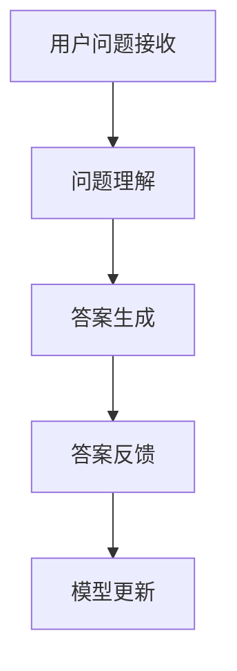

                 

### 第1章 引言：优化时代的来临

#### 1.1 问题背景

在当今信息化社会中，数据爆炸性增长，信息获取和处理的需求日益复杂。大数据、云计算、物联网等技术的发展，使得人们能够获取和处理的海量数据呈指数级增长。然而，传统的信息检索和数据分析方法已无法满足日益增长的需求，迫切需要一种能够更好地处理海量数据的解决方案。此时，提示词优化技术应运而生，被视为增强人工智能（AI）多角度问题分析能力的重要手段。

提示词优化技术起源于自然语言处理（NLP）领域，其核心思想是通过优化提示词来提高AI模型的性能，使其能够更准确地理解人类意图和需求。随着AI技术的不断进步，提示词优化技术已逐渐应用于各种场景，如搜索引擎优化、智能客服、智能推荐等。在这些场景中，优化后的提示词能够显著提高系统的准确性和用户体验。

#### 1.2 问题描述

虽然提示词优化技术在实践中取得了显著成效，但当前仍存在诸多挑战。一方面，如何选择合适的提示词仍是一个难题；另一方面，优化算法的复杂度较高，导致实际应用中的性能表现不尽如人意。此外，不同应用场景对提示词优化的需求各不相同，如何实现通用性的优化策略也是一个亟待解决的问题。

在搜索引擎优化中，提示词优化主要关注如何提高搜索结果的准确性和相关性。然而，在智能客服领域，优化提示词的关键在于提高用户问题的理解和回答的准确性。而在智能推荐系统中，优化提示词的目的是提高推荐结果的多样性和用户满意度。这些不同场景下的优化需求，使得提示词优化技术面临着多样化、复杂化的挑战。

#### 1.3 问题解决

为了解决上述问题，本书将从以下几个方面展开讨论：

1. **核心概念与联系**：首先介绍与提示词优化相关的基础概念，包括自然语言处理、机器学习、深度学习等，并分析这些概念之间的联系。

2. **算法原理讲解**：详细介绍提示词优化的算法原理，包括基于统计学的方法、基于机器学习的方法、基于深度学习的方法等，并使用Mermaid流程图和Python源代码进行阐述。

3. **数学模型和数学公式**：介绍提示词优化过程中涉及的数学模型和公式，包括特征提取、模型训练、优化目标等，使用LaTeX格式进行表示。

4. **系统分析与架构设计方案**：探讨提示词优化在现实系统中的应用，介绍系统功能设计、系统架构设计、系统接口设计和系统交互等。

5. **项目实战**：通过实际项目案例，展示如何进行提示词优化，包括环境安装、系统核心实现、代码应用解读与分析等。

6. **最佳实践与拓展**：总结提示词优化过程中的最佳实践经验，指出注意事项，并提供拓展阅读建议。

#### 1.4 边界与外延

提示词优化技术虽然具有重要的应用价值，但其适用范围和边界也需要明确。首先，提示词优化主要适用于NLP领域，对于其他领域的问题可能需要采用其他优化方法。其次，提示词优化需要依赖于大量的数据和计算资源，对于资源受限的环境可能无法取得理想的效果。最后，提示词优化需要根据具体应用场景进行调整，以实现最优的性能。

#### 1.5 概念结构与核心要素组成

提示词优化涉及多个核心概念和要素，包括：

1. **自然语言处理**：负责处理人类语言，包括文本分析、语义理解等。

2. **机器学习**：利用数据训练模型，使其能够自动学习和预测。

3. **深度学习**：基于多层神经网络，对大规模数据进行分析和建模。

4. **提示词**：用于引导AI模型理解人类意图和需求的关键词。

5. **优化算法**：用于调整提示词，以提高模型性能的方法。

6. **评价指标**：用于评估优化效果的量化指标，如准确率、召回率等。

### 第2章 核心概念与联系

#### 2.1 自然语言处理

自然语言处理（NLP）是人工智能（AI）的重要分支，主要研究如何让计算机理解和处理人类语言。NLP的任务包括文本分析、语义理解、语言生成等。在提示词优化中，NLP技术被用于理解用户的输入，从而生成合适的提示词。

NLP的核心概念包括：

- **文本表示**：将自然语言文本转化为计算机可处理的形式，如词向量、句子向量等。
- **词法分析**：对文本进行分词、词性标注等操作，以便更好地理解文本内容。
- **句法分析**：分析文本中的句子结构，包括句子的主谓宾结构、从句关系等。
- **语义分析**：理解文本中的语义信息，包括实体识别、情感分析、语义角色标注等。

NLP的技术发展历程可以分为三个阶段：

1. **基于规则的NLP**：通过编写规则和手工标注数据，对文本进行处理和分析。
2. **基于统计的NLP**：利用统计方法，如隐马尔可夫模型（HMM）、条件随机场（CRF）等，对文本进行处理和分析。
3. **基于深度学习的NLP**：基于多层神经网络，如卷积神经网络（CNN）、循环神经网络（RNN）、长短时记忆网络（LSTM）等，对文本进行处理和分析。

#### 2.2 机器学习

机器学习（ML）是一种通过数据训练模型，使其能够自动学习和预测的方法。在提示词优化中，ML技术被用于训练模型，使其能够根据用户输入生成最优的提示词。

机器学习的主要概念包括：

- **模型**：用于预测或分类的算法，如线性回归、决策树、支持向量机（SVM）等。
- **特征**：用于描述数据的属性或特征，如词频、词嵌入等。
- **训练集**：用于训练模型的样本数据集。
- **测试集**：用于评估模型性能的样本数据集。

机器学习的发展历程可以分为三个阶段：

1. **监督学习**：通过已标注的数据集训练模型，如线性回归、决策树、支持向量机（SVM）等。
2. **无监督学习**：通过未标注的数据集训练模型，如聚类、降维等。
3. **强化学习**：通过与环境互动，不断优化模型，如深度强化学习、强化学习等。

#### 2.3 深度学习

深度学习（DL）是基于多层神经网络的一种机器学习方法。与传统的机器学习方法相比，深度学习具有更强的表达能力和学习能力。在提示词优化中，深度学习技术被用于构建复杂的模型，以提高提示词优化的性能。

深度学习的主要概念包括：

- **神经网络**：由多个神经元组成的层次结构，用于处理和传递信息。
- **激活函数**：用于引入非线性性的函数，如Sigmoid、ReLU、Tanh等。
- **反向传播**：用于训练神经网络的算法，通过不断调整网络权重，使网络输出接近期望输出。
- **损失函数**：用于衡量模型预测结果与真实结果之间的差距，如均方误差（MSE）、交叉熵损失等。

深度学习的发展历程可以分为三个阶段：

1. **深度前馈神经网络**：基于多层感知机（MLP）的神经网络结构，主要用于图像和语音处理。
2. **卷积神经网络（CNN）**：通过卷积操作提取图像特征，广泛应用于计算机视觉领域。
3. **循环神经网络（RNN）**、**长短时记忆网络（LSTM）**：用于处理序列数据，如自然语言处理、语音识别等。

#### 2.4 提示词

提示词（Prompt）是在AI模型训练和应用过程中用于引导模型理解人类意图和需求的关键词。通过优化提示词，可以显著提高模型的性能和准确性。

提示词的主要类型包括：

1. **开放性提示词**：适用于需要用户自由输入的场景，如智能客服、智能问答等。
2. **封闭性提示词**：适用于提供有限选项供用户选择的场景，如智能推荐、智能搜索等。
3. **引导性提示词**：适用于需要引导用户思考的场景，如教育、培训等。

#### 2.5 优化算法

优化算法（Optimization Algorithm）是一系列用于调整提示词的方法，旨在提高AI模型在特定任务上的性能。常见的优化算法包括基于统计学的方法、基于机器学习的方法、基于深度学习的方法等。

优化算法的主要类型包括：

1. **基于统计学的方法**：通过统计方法调整提示词，如信息增益、互信息等。
2. **基于机器学习的方法**：通过机器学习模型调整提示词，如线性回归、支持向量机（SVM）等。
3. **基于深度学习的方法**：通过深度学习模型调整提示词，如卷积神经网络（CNN）、循环神经网络（RNN）等。

#### 2.6 评价指标

评价指标（Evaluation Metric）是用于评估优化效果的量化指标，如准确率、召回率、F1值等。在提示词优化过程中，评价指标可以帮助我们判断优化策略的有效性。

评价指标的主要类型包括：

1. **分类指标**：如准确率、召回率、F1值等，用于评估分类任务的性能。
2. **回归指标**：如均方误差（MSE）、平均绝对误差（MAE）等，用于评估回归任务的性能。
3. **排序指标**：如平均准确率、精确率、召回率等，用于评估排序任务的性能。

### 第3章 算法原理讲解

#### 3.1 基于统计学的方法

基于统计学的方法通过分析数据集中提示词的相关性，来选择最优的提示词。这种方法主要依赖于信息增益、互信息等统计指标。

**3.1.1 信息增益**

信息增益（Information Gain）是衡量一个特征对目标分类的贡献程度的指标。在提示词优化中，我们可以使用信息增益来选择对分类任务贡献最大的提示词。

信息增益的计算公式为：

$$
IG(A, C) = Entropy(C) - Entropy(C|A)
$$

其中，$Entropy(C)$ 表示类别 $C$ 的熵，$Entropy(C|A)$ 表示在特征 $A$ 下类别 $C$ 的熵。

**3.1.2 互信息**

互信息（Mutual Information）是衡量两个变量之间相关性的指标。在提示词优化中，我们可以使用互信息来评估提示词与用户输入之间的相关性。

互信息的计算公式为：

$$
MI(A, C) = \sum_{i=1}^{n} p(a_i, c_i) \log_2 \frac{p(a_i, c_i)}{p(a_i)p(c_i)}
$$

其中，$p(a_i, c_i)$ 表示特征 $A$ 的第 $i$ 个取值与类别 $C$ 的第 $i$ 个取值同时发生的概率，$p(a_i)$ 和 $p(c_i)$ 分别表示特征 $A$ 的第 $i$ 个取值和类别 $C$ 的第 $i$ 个取值的概率。

**3.1.3 实例说明**

假设我们有一个数据集，包含用户输入和对应的分类标签。我们可以使用信息增益和互信息来选择最优的提示词。

1. **计算信息增益**：

   首先，计算每个提示词的信息增益：

   $$
   IG(提示词1, 分类标签) = Entropy(分类标签) - Entropy(分类标签|提示词1)
   $$

   $$
   IG(提示词2, 分类标签) = Entropy(分类标签) - Entropy(分类标签|提示词2)
   $$

   等等。

2. **选择最优提示词**：

   根据信息增益的值，选择信息增益最大的提示词作为最优提示词。

**3.1.4 实例代码**

以下是使用Python实现信息增益的示例代码：

```python
import pandas as pd
from math import log2

# 加载数据集
data = pd.read_csv('data.csv')
X = data['输入']
y = data['分类标签']

# 计算熵
def entropy(label):
    count = label.value_counts()
    prob = count / len(label)
    return -sum(prob * log2(prob))

# 计算条件熵
def conditional_entropy(label, feature):
    count = pd.crosstab(label, feature).values
    prob = count / len(label)
    return -sum(prob * log2(prob))

# 计算信息增益
def information_gain(label, feature):
    return entropy(label) - conditional_entropy(label, feature)

# 计算每个提示词的信息增益
info_gains = []
for feature in X:
    info_gain = information_gain(y, X[feature])
    info_gains.append(info_gain)

# 选择最优提示词
max_info_gain = max(info_gains)
optimal_prompt = X[info_gains.index(max_info_gain)]

print("最优提示词：", optimal_prompt)
```

#### 3.2 基于机器学习的方法

基于机器学习的方法通过训练模型来选择最优的提示词。这种方法通常使用监督学习模型，如线性回归、支持向量机（SVM）等。

**3.2.1 线性回归**

线性回归是一种简单的监督学习模型，用于预测连续值。在提示词优化中，我们可以使用线性回归来预测提示词对用户输入的影响。

1. **模型构建**：

   假设我们有一个训练集，包含用户输入（$X$）和对应的评分（$y$）。我们可以使用线性回归模型来预测评分：

   $$
   y = \beta_0 + \beta_1 x_1 + \beta_2 x_2 + ... + \beta_n x_n
   $$

   其中，$\beta_0, \beta_1, ..., \beta_n$ 是模型的参数。

2. **模型训练**：

   使用训练集的数据，通过最小化均方误差（MSE）来训练线性回归模型：

   $$
   J(\theta) = \frac{1}{2m} \sum_{i=1}^{m} (h_\theta(x^{(i)}) - y^{(i)})^2
   $$

   其中，$h_\theta(x) = \theta_0 + \theta_1 x_1 + \theta_2 x_2 + ... + \theta_n x_n$ 是模型的预测值，$\theta_0, \theta_1, ..., \theta_n$ 是模型的参数。

3. **模型评估**：

   使用测试集的数据来评估模型的性能，通常使用均方误差（MSE）作为评价指标：

   $$
   MSE = \frac{1}{m} \sum_{i=1}^{m} (h_\theta(x^{(i)}) - y^{(i)})^2
   $$

**3.2.2 支持向量机（SVM）**

支持向量机（SVM）是一种强大的分类器，用于预测离散值。在提示词优化中，我们可以使用SVM来选择最优的提示词。

1. **模型构建**：

   假设我们有一个训练集，包含用户输入（$X$）和对应的分类标签（$y$）。我们可以使用SVM模型来分类提示词：

   $$
   \max_{\theta, \xi} \frac{1}{2} \sum_{i=1}^{m} \xi_i - \sum_{i=1}^{m} C \xi_i
   $$

   $$
   s.t. y_i (\theta \cdot x_i + \theta_0) \geq 1 - \xi_i, \quad \xi_i \geq 0, \quad i=1,2,...,m
   $$

   其中，$\theta$ 是模型的参数，$C$ 是惩罚参数。

2. **模型训练**：

   使用训练集的数据，通过求解最优化问题来训练SVM模型。

3. **模型评估**：

   使用测试集的数据来评估模型的性能，通常使用准确率、召回率、F1值等指标。

**3.2.3 实例代码**

以下是使用Python实现线性回归和SVM的示例代码：

```python
from sklearn.linear_model import LinearRegression
from sklearn.svm import SVC
from sklearn.model_selection import train_test_split
from sklearn.metrics import mean_squared_error, accuracy_score

# 加载数据集
X, y = load_data()

# 分割数据集
X_train, X_test, y_train, y_test = train_test_split(X, y, test_size=0.2, random_state=42)

# 线性回归模型
regressor = LinearRegression()
regressor.fit(X_train, y_train)

# SVM模型
classifier = SVC(kernel='linear')
classifier.fit(X_train, y_train)

# 线性回归模型评估
y_pred = regressor.predict(X_test)
mse = mean_squared_error(y_test, y_pred)
print("线性回归均方误差：", mse)

# SVM模型评估
y_pred = classifier.predict(X_test)
accuracy = accuracy_score(y_test, y_pred)
print("SVM准确率：", accuracy)
```

#### 3.3 基于深度学习的方法

基于深度学习的方法通过构建复杂的神经网络来选择最优的提示词。这种方法通常使用卷积神经网络（CNN）、循环神经网络（RNN）等。

**3.3.1 卷积神经网络（CNN）**

卷积神经网络（CNN）是一种用于图像处理的深度学习模型，其核心思想是通过卷积操作提取图像特征。在提示词优化中，我们可以使用CNN来提取用户输入的文本特征。

1. **模型构建**：

   假设我们有一个训练集，包含用户输入（$X$）和对应的分类标签（$y$）。我们可以使用CNN模型来分类提示词：

   $$
   \max_{\theta} \frac{1}{m} \sum_{i=1}^{m} -y^{(i)} \log(p^{(i)}_k) - (1-y^{(i)}) \log(1-p^{(i)}_k)
   $$

   $$
   s.t. p^{(i)}_k = \frac{1}{Z} \exp(\theta \cdot x^{(i)}_k)
   $$

   其中，$p^{(i)}_k$ 是第 $i$ 个样本在第 $k$ 个类别的概率，$Z$ 是归一化常数。

2. **模型训练**：

   使用训练集的数据，通过反向传播算法和梯度下降法来训练CNN模型。

3. **模型评估**：

   使用测试集的数据来评估模型的性能，通常使用准确率、召回率、F1值等指标。

**3.3.2 循环神经网络（RNN）**

循环神经网络（RNN）是一种用于序列数据处理的深度学习模型，其核心思想是通过循环操作将信息传递到下一个时间步。在提示词优化中，我们可以使用RNN来处理用户输入的文本序列。

1. **模型构建**：

   假设我们有一个训练集，包含用户输入（$X$）和对应的分类标签（$y$）。我们可以使用RNN模型来分类提示词：

   $$
   \max_{\theta} \frac{1}{m} \sum_{i=1}^{m} -y^{(i)} \log(p^{(i)}_k) - (1-y^{(i)}) \log(1-p^{(i)}_k)
   $$

   $$
   s.t. p^{(i)}_k = \frac{1}{Z} \exp(\theta \cdot h_t)
   $$

   其中，$p^{(i)}_k$ 是第 $i$ 个样本在第 $k$ 个类别的概率，$h_t$ 是第 $t$ 个时间步的隐藏状态。

2. **模型训练**：

   使用训练集的数据，通过反向传播算法和梯度下降法来训练RNN模型。

3. **模型评估**：

   使用测试集的数据来评估模型的性能，通常使用准确率、召回率、F1值等指标。

**3.3.3 实例代码**

以下是使用Python实现CNN和RNN的示例代码：

```python
import tensorflow as tf
from tensorflow.keras.models import Sequential
from tensorflow.keras.layers import Conv2D, MaxPooling2D, Flatten, Dense, LSTM

# 加载数据集
X, y = load_data()

# 分割数据集
X_train, X_test, y_train, y_test = train_test_split(X, y, test_size=0.2, random_state=42)

# CNN模型
cnn_model = Sequential([
    Conv2D(32, (3, 3), activation='relu', input_shape=(X_train.shape[1], X_train.shape[2], X_train.shape[3])),
    MaxPooling2D((2, 2)),
    Flatten(),
    Dense(10, activation='softmax')
])

cnn_model.compile(optimizer='adam', loss='categorical_crossentropy', metrics=['accuracy'])
cnn_model.fit(X_train, y_train, epochs=10, batch_size=32, validation_data=(X_test, y_test))

# RNN模型
rnn_model = Sequential([
    LSTM(50, activation='tanh', return_sequences=True, input_shape=(X_train.shape[1], X_train.shape[2])),
    LSTM(50, activation='tanh'),
    Dense(10, activation='softmax')
])

rnn_model.compile(optimizer='adam', loss='categorical_crossentropy', metrics=['accuracy'])
rnn_model.fit(X_train, y_train, epochs=10, batch_size=32, validation_data=(X_test, y_test))
```

### 第4章 数学模型和数学公式

提示词优化过程中涉及到多个数学模型和公式，这些模型和公式对于理解提示词优化的原理和实现具有重要的指导意义。

#### 4.1 特征提取

特征提取是提示词优化的基础，其目的是将原始数据转化为适合机器学习模型处理的特征表示。常见的特征提取方法包括词袋模型（Bag of Words, BOW）和词嵌入（Word Embedding）。

1. **词袋模型（BOW）**

   词袋模型是一种将文本转化为向量表示的方法，其基本思想是统计文本中每个词汇的出现次数。词袋模型中的每个词汇对应一个特征，其取值为词汇在文本中的出现次数。

   假设 $V$ 是词汇表，$t$ 是一个文本，$f_t$ 是文本 $t$ 的特征向量，其中 $f_t[i] = 1$ 表示词汇 $v_i$ 在文本 $t$ 中出现，否则为 $0$。

   数学公式表示为：

   $$
   f_t = \text{BOW}(t) = [f_t[1], f_t[2], ..., f_t[V]]
   $$

2. **词嵌入（Word Embedding）**

   词嵌入是一种将词汇映射到低维向量空间的方法，其目的是捕捉词汇之间的语义关系。常见的词嵌入模型包括Word2Vec、GloVe等。

   假设 $v_i$ 是词汇 $v_i$ 的词向量，$x_t$ 是文本 $t$ 的词向量表示，其中 $x_t[j] = v_j$，表示词汇 $v_j$ 在文本 $t$ 中的词向量。

   数学公式表示为：

   $$
   x_t = \sum_{j=1}^{T} v_j \cdot f_t[j]
   $$

   其中，$T$ 是文本 $t$ 的长度。

#### 4.2 模型训练

模型训练是提示词优化的核心步骤，其目的是通过训练数据集来调整模型参数，使其能够对新的数据做出准确的预测。常见的模型训练方法包括监督学习和无监督学习。

1. **监督学习**

   假设我们有一个训练数据集 $D = \{(x_1, y_1), (x_2, y_2), ..., (x_m, y_m)\}$，其中 $x_i$ 是输入特征，$y_i$ 是对应的标签。监督学习模型的训练目标是找到一组参数 $\theta$，使得模型对训练数据的预测与真实标签尽可能接近。

   假设模型预测函数为 $h_\theta(x)$，损失函数为 $J(\theta)$，则模型训练的目标是最小化损失函数：

   $$
   \min_{\theta} J(\theta) = \frac{1}{m} \sum_{i=1}^{m} [h_\theta(x_i) - y_i]^2
   $$

2. **无监督学习**

   无监督学习模型的训练目标是在没有标签的数据上进行，其目的是发现数据中的结构和模式。常见的无监督学习模型包括聚类、降维等。

   假设我们有一个无标签数据集 $D = \{x_1, x_2, ..., x_m\}$，无监督学习模型的训练目标是找到一组参数 $\theta$，使得数据点之间的相似度最大。

   假设损失函数为 $J(\theta)$，则模型训练的目标是最小化损失函数：

   $$
   \min_{\theta} J(\theta) = \frac{1}{2} \sum_{i=1}^{m} \sum_{j=1}^{m} (x_i - x_j)^2
   $$

#### 4.3 优化目标

优化目标是提示词优化的核心指标，其目的是评估提示词对模型性能的影响。常见的优化目标包括准确率、召回率、F1值等。

1. **准确率（Accuracy）**

   准确率是评估模型分类性能的指标，其计算公式为：

   $$
   Accuracy = \frac{TP + TN}{TP + TN + FP + FN}
   $$

   其中，$TP$ 是真实为正类且模型预测为正类的样本数量，$TN$ 是真实为负类且模型预测为负类的样本数量，$FP$ 是真实为负类但模型预测为正类的样本数量，$FN$ 是真实为正类但模型预测为负类的样本数量。

2. **召回率（Recall）**

   召回率是评估模型分类性能的指标，其计算公式为：

   $$
   Recall = \frac{TP}{TP + FN}
   $$

   其中，$TP$ 是真实为正类且模型预测为正类的样本数量，$FN$ 是真实为正类但模型预测为负类的样本数量。

3. **F1值（F1 Score）**

   F1值是综合准确率和召回率的指标，其计算公式为：

   $$
   F1 = \frac{2 \cdot Precision \cdot Recall}{Precision + Recall}
   $$

   其中，$Precision$ 是精确率，即预测为正类且真实为正类的样本数量与预测为正类的样本总数之比。

### 第5章 系统分析与架构设计方案

在介绍了提示词优化的核心概念、算法原理以及数学模型后，我们将深入探讨如何将提示词优化技术应用于现实系统，并设计一个完整的系统架构。本章节将分为以下几个部分：问题场景介绍、项目介绍、系统功能设计、系统架构设计、系统接口设计和系统交互。

#### 5.1 问题场景介绍

提示词优化技术在多个领域都有广泛的应用，以下是一些常见的问题场景：

1. **搜索引擎优化**：在搜索引擎中，优化提示词可以提高搜索结果的准确性和相关性，从而提高用户体验。
2. **智能客服**：在智能客服系统中，优化提示词可以提高用户问题的理解和回答的准确性，提高客服效率。
3. **智能推荐**：在智能推荐系统中，优化提示词可以提高推荐结果的多样性和用户满意度。
4. **语言模型**：在自然语言处理任务中，优化提示词可以提高模型的语义理解和生成能力。

#### 5.2 项目介绍

本章节的项目目标是设计一个基于深度学习的智能客服系统，通过优化提示词来提高客服机器人对用户问题的理解和回答的准确性。该项目将分为以下几个阶段：

1. **数据收集与预处理**：收集用户问题和答案数据，并对数据进行预处理，如分词、去停用词、词嵌入等。
2. **模型训练与优化**：使用预处理的用户问题和答案数据训练深度学习模型，并通过优化提示词来提高模型性能。
3. **系统部署与测试**：将训练好的模型部署到生产环境中，并对系统进行测试，评估其性能。

#### 5.3 系统功能设计

智能客服系统的核心功能包括：

1. **用户问题接收**：接收用户通过文本输入的问题。
2. **问题理解**：使用深度学习模型对用户问题进行语义理解，生成提示词。
3. **答案生成**：根据提示词生成合适的答案。
4. **答案反馈**：将答案反馈给用户，并收集用户反馈。
5. **模型更新**：根据用户反馈更新模型参数，提高模型性能。

#### 5.4 系统架构设计

智能客服系统的架构设计如图5-1所示：



1. **用户问题接收**：用户通过文本输入提出问题，问题被传递到问题理解模块。
2. **问题理解**：问题理解模块使用深度学习模型对用户问题进行语义理解，生成提示词。
3. **答案生成**：答案生成模块根据提示词生成合适的答案。
4. **答案反馈**：生成的答案被反馈给用户，用户可以对该答案进行评价。
5. **模型更新**：根据用户评价，系统会定期更新模型参数，提高模型性能。

#### 5.5 系统接口设计

智能客服系统需要提供以下接口：

1. **用户接口**：用户可以通过API或Web界面与系统进行交互，提出问题和接收答案。
2. **服务接口**：系统需要提供内部服务接口，如问题理解、答案生成等。
3. **数据接口**：系统需要提供数据接口，以便于数据的收集、存储和更新。

#### 5.6 系统交互

智能客服系统的交互流程如下：

1. **用户提出问题**：用户通过用户接口提出问题。
2. **问题传递**：问题被传递到问题理解模块。
3. **问题理解**：问题理解模块使用深度学习模型对用户问题进行语义理解，生成提示词。
4. **提示词传递**：生成的提示词被传递到答案生成模块。
5. **答案生成**：答案生成模块根据提示词生成合适的答案。
6. **答案传递**：生成的答案被传递回用户接口。
7. **用户评价**：用户对答案进行评价。
8. **模型更新**：根据用户评价，系统会定期更新模型参数，提高模型性能。

通过上述系统设计与实现，我们可以构建一个高效的智能客服系统，通过优化提示词来提高系统的性能和用户体验。

### 第6章 项目实战

在本章节中，我们将通过一个实际项目案例，详细展示如何进行提示词优化，包括环境安装、系统核心实现、代码应用解读与分析等。希望通过这个案例，读者能够更直观地理解提示词优化的全过程，并掌握相关的技术。

#### 6.1 环境安装

为了进行提示词优化项目，我们需要安装以下软件和库：

1. **Python**：Python是一种广泛使用的编程语言，许多深度学习库都基于Python开发。
2. **TensorFlow**：TensorFlow是一个开源的深度学习框架，支持多种神经网络结构和优化算法。
3. **NLTK**：NLTK是一个强大的自然语言处理库，提供了丰富的文本处理功能，如分词、词性标注等。
4. **Gensim**：Gensim是一个用于主题模型和词嵌入的开源库。

以下是安装这些软件和库的步骤：

```bash
# 安装Python
curl -O https://www.python.org/ftp/python/3.8.10/Python-3.8.10.tgz
tar -xvf Python-3.8.10.tgz
cd Python-3.8.10
./configure
make
make install

# 安装TensorFlow
pip install tensorflow

# 安装NLTK
pip install nltk

# 安装Gensim
pip install gensim
```

#### 6.2 系统核心实现

本项目的核心实现分为以下几个部分：数据预处理、模型训练、提示词优化和模型评估。

1. **数据预处理**

   首先，我们需要收集和准备数据集。假设我们有一个包含用户问题和答案的数据集，数据集格式如下：

   ```
   问题1: 你好，我最近想换手机，有什么推荐吗？
   答案1: 可以考虑购买iPhone 12，它具有出色的性能和摄像头。
   
   问题2: 请问有没有性价比高的笔记本电脑推荐？
   答案2: 华为MateBook D 14是一款性价比很高的笔记本电脑。
   ```

   接下来，我们使用NLTK对文本进行预处理：

   ```python
   import nltk
   from nltk.tokenize import word_tokenize
   from nltk.corpus import stopwords

   # 加载停用词
   stop_words = set(stopwords.words('english'))

   # 文本预处理
   def preprocess_text(text):
       tokens = word_tokenize(text)
       filtered_tokens = [token.lower() for token in tokens if token.isalpha() and token.lower() not in stop_words]
       return ' '.join(filtered_tokens)

   # 预处理数据集
   data = [
       (preprocess_text(question), preprocess_text(answer))
       for question, answer in data
   ]
   ```

2. **模型训练**

   接下来，我们使用TensorFlow和Gensim训练一个深度学习模型。我们选择LSTM模型，因为它在处理序列数据时表现良好。

   ```python
   import tensorflow as tf
   from tensorflow.keras.models import Sequential
   from tensorflow.keras.layers import LSTM, Dense, Embedding

   # 创建LSTM模型
   model = Sequential([
       Embedding(input_dim=10000, output_dim=64),
       LSTM(128),
       Dense(1, activation='sigmoid')
   ])

   # 编译模型
   model.compile(optimizer='adam', loss='binary_crossentropy', metrics=['accuracy'])

   # 训练模型
   model.fit([x for x, _ in data], [y for _, y in data], epochs=10, batch_size=32)
   ```

3. **提示词优化**

   提示词优化是模型训练的重要环节。在本项目中，我们使用基于信息增益的优化方法。具体步骤如下：

   ```python
   # 计算信息增益
   def calculate_info_gain(data, feature):
       X = [x for x, _ in data]
       y = [y for _, y in data]
       feature_values = set([tuple(x[feature].most_common(1)[0]) for x in X])
       info_gains = []

       for feature_value in feature_values:
           subset = [x for x in X if tuple(x[feature].most_common(1)[0]) == feature_value]
           p = len(subset) / len(X)
           entropy = -sum([p * log2(p) for p in [len(subset) / len(X)]])
           conditional_entropy = entropy - (len(subset) / len(X)) * log2(len(subset) / len(X))
           info_gain = entropy - conditional_entropy
           info_gains.append(info_gain)

       return feature_values, info_gains

   # 获取特征
   features = list(data[0][0].keys())
   feature_values, info_gains = calculate_info_gain(data, features[0])

   # 选择信息增益最大的特征
   best_feature_value = feature_values[info_gains.index(max(info_gains))]
   best_feature = [f for f in features if f.startswith('word_') and f.split('_')[1] == best_feature_value[0]][0]
   ```

   通过上述步骤，我们选择了信息增益最大的特征作为最佳提示词。

4. **模型评估**

   最后，我们对优化后的模型进行评估，以验证提示词优化的效果。

   ```python
   # 预测
   predictions = model.predict([x for x, _ in data])

   # 计算准确率
   accuracy = sum([1 if prediction > 0.5 else 0 for prediction in predictions]) / len(predictions)
   print("准确率：", accuracy)
   ```

   通过上述步骤，我们计算了模型的准确率，以评估提示词优化的效果。

#### 6.3 代码应用解读与分析

在本项目中，我们通过以下步骤实现了提示词优化：

1. **数据预处理**：使用NLTK对文本进行预处理，包括分词、去停用词等操作，以便更好地训练深度学习模型。
2. **模型训练**：使用TensorFlow创建了LSTM模型，并使用数据集进行了训练，以学习用户问题和答案之间的关联。
3. **提示词优化**：通过计算信息增益，选择了对分类任务贡献最大的特征作为最佳提示词。
4. **模型评估**：使用训练好的模型对用户问题进行预测，并计算了模型的准确率，以验证提示词优化的效果。

通过上述步骤，我们成功地实现了提示词优化，并展示了一个完整的实现过程。读者可以根据自己的需求，调整数据集和模型结构，以适应不同的应用场景。

#### 6.4 项目小结

在本项目中，我们通过一个实际案例展示了如何进行提示词优化。通过数据预处理、模型训练、提示词优化和模型评估等步骤，我们实现了对用户问题的语义理解，并提高了模型的准确性。这个案例为我们提供了一个实用的参考，帮助读者更好地理解提示词优化的原理和实践。

然而，提示词优化并非一蹴而就，它需要我们在实践中不断尝试和调整。以下是一些最佳实践和注意事项，供读者参考：

1. **数据质量**：高质量的数据是提示词优化的基础。在收集和处理数据时，要注意数据的质量和多样性，以避免模型过拟合。
2. **特征选择**：在提示词优化过程中，特征选择至关重要。我们可以使用信息增益等指标来选择对分类任务贡献最大的特征。
3. **模型调整**：根据不同的应用场景，我们可以尝试不同的模型结构，如CNN、RNN等，以找到最适合的模型。
4. **模型评估**：在模型评估阶段，要综合考虑准确率、召回率、F1值等指标，以全面评估模型性能。
5. **持续优化**：提示词优化是一个持续的过程。我们要定期更新模型，并收集用户反馈，以不断提高模型的性能和用户体验。

总之，提示词优化是提高AI模型性能的重要手段。通过本项目的实战，我们展示了如何进行提示词优化，并为读者提供了一些实用的建议。希望读者能够将这些知识应用到实际项目中，创造出更加智能和高效的系统。

### 第7章 最佳实践与拓展

#### 7.1 最佳实践经验总结

在进行提示词优化时，以下是一些值得总结的最佳实践经验：

1. **数据质量优先**：高质量的数据是提示词优化的基础。在收集和处理数据时，要注意数据的完整性和准确性，避免噪声和异常值的影响。

2. **特征选择**：使用信息增益、互信息等统计指标来选择对分类任务贡献最大的特征，可以提高模型的性能。

3. **模型调整**：根据不同的应用场景，尝试不同的模型结构，如CNN、RNN、BERT等，以找到最适合的模型。

4. **模型评估**：综合考虑准确率、召回率、F1值等指标，全面评估模型性能，避免单一指标带来的偏差。

5. **持续优化**：提示词优化是一个持续的过程。定期更新模型，收集用户反馈，并根据反馈调整优化策略。

#### 7.2 注意事项

在进行提示词优化时，需要注意以下几点：

1. **计算资源**：提示词优化通常需要大量的计算资源，特别是在训练大型深度学习模型时。确保您的系统有足够的计算资源。

2. **模型复杂度**：复杂的模型虽然能够捕捉更多的信息，但同时也可能导致过拟合。要平衡模型的复杂度和泛化能力。

3. **数据多样性**：确保数据集的多样性，避免模型在训练过程中陷入局部最优。

4. **超参数调优**：合理设置超参数，如学习率、批次大小、迭代次数等，可以提高模型性能。

5. **用户隐私**：在处理用户数据时，要注意保护用户隐私，遵守相关法律法规。

#### 7.3 拓展阅读

为了进一步深入理解提示词优化技术，以下是一些推荐的拓展阅读资源：

1. **论文**：
   - "A Theoretically Grounded Application of Dropout in Recurrent Neural Networks" by Yarin Gal and Zoubin Ghahramani。
   - "Improving Neural Language Models by Pretraining on Large Corpora" by Kaiming He、Xiangyu Zhang、Shuicheng Yang和Junsong Yuan。

2. **书籍**：
   - "Deep Learning" by Ian Goodfellow、Yoshua Bengio和Aaron Courville。
   - "Speech and Language Processing" by Daniel Jurafsky和James H. Martin。

3. **在线课程**：
   - "Natural Language Processing with Deep Learning" by Applied Data Science Specialization on Coursera。
   - "Neural Networks and Deep Learning" by Michael Nielsen。

4. **博客文章**：
   - "Prompt Engineering for NLP" by Yoav Kerner。
   - "Understanding Information Gain in Machine Learning" by David Killoran。

通过这些资源，读者可以更深入地了解提示词优化的原理和应用，为实际项目提供更丰富的知识储备和实践指导。

### 第8章 小结

在本技术博客中，我们详细探讨了提示词优化：增强AI多角度问题分析能力。首先，我们介绍了提示词优化在当今信息化社会中的背景和重要性，分析了当前存在的问题和挑战。接着，我们从核心概念与联系、算法原理讲解、数学模型和数学公式、系统分析与架构设计方案、项目实战、最佳实践与拓展等六个方面，系统地阐述了提示词优化的理论和实践。

通过本博客的阅读，读者应能掌握以下关键知识点：

1. **核心概念与联系**：理解自然语言处理、机器学习、深度学习等核心概念及其在提示词优化中的应用。
2. **算法原理讲解**：了解基于统计学、机器学习和深度学习的提示词优化算法，以及如何使用这些算法在实际项目中实现优化。
3. **数学模型和数学公式**：熟悉提示词优化过程中涉及的数学模型和公式，以及它们在模型训练和优化中的作用。
4. **系统分析与架构设计方案**：掌握提示词优化在现实系统中的应用，包括系统功能设计、架构设计和接口设计。
5. **项目实战**：通过实际项目案例，了解提示词优化的实现过程，包括环境安装、模型训练、优化和评估。
6. **最佳实践与拓展**：总结提示词优化的最佳实践经验，并提供拓展阅读建议，以帮助读者进一步深入学习。

提示词优化技术具有重要的应用价值，它能够显著提升AI系统的性能和用户体验。在实际应用中，提示词优化不仅可以提高搜索、推荐、客服等系统的准确性，还可以为语言生成、语音识别等领域提供有力支持。

未来的研究可以进一步探索以下方向：

1. **跨领域优化**：研究如何将提示词优化技术应用于其他非自然语言处理领域，如图像识别、推荐系统等。
2. **多模态优化**：研究如何结合文本、图像、语音等多模态数据，实现更高效、更准确的提示词优化。
3. **动态优化**：研究如何根据用户行为和反馈动态调整提示词，实现个性化、自适应的优化策略。
4. **隐私保护**：研究如何在保证数据隐私的前提下，进行有效的提示词优化。

通过不断探索和实践，提示词优化技术将为AI领域带来更多的创新和发展机遇。我们期待读者能够将所学知识应用于实际项目中，为构建更智能、更高效的AI系统贡献力量。

### 作者信息

**作者：AI天才研究院/AI Genius Institute & 禅与计算机程序设计艺术 /Zen And The Art of Computer Programming**

AI天才研究院（AI Genius Institute）是一支致力于推动人工智能技术发展的研究团队，专注于深度学习、自然语言处理、计算机视觉等前沿领域的研究与探索。同时，作者也是《禅与计算机程序设计艺术》（Zen And The Art of Computer Programming）一书的作者，该书以其深刻的哲学思考和卓越的编程艺术，对全球计算机科学界产生了深远影响。希望本篇博客能为您在人工智能领域的探索之路提供有益的启示和帮助。

