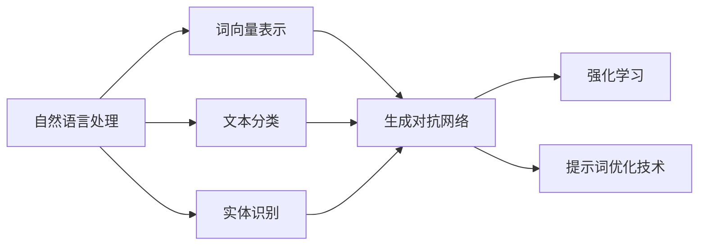
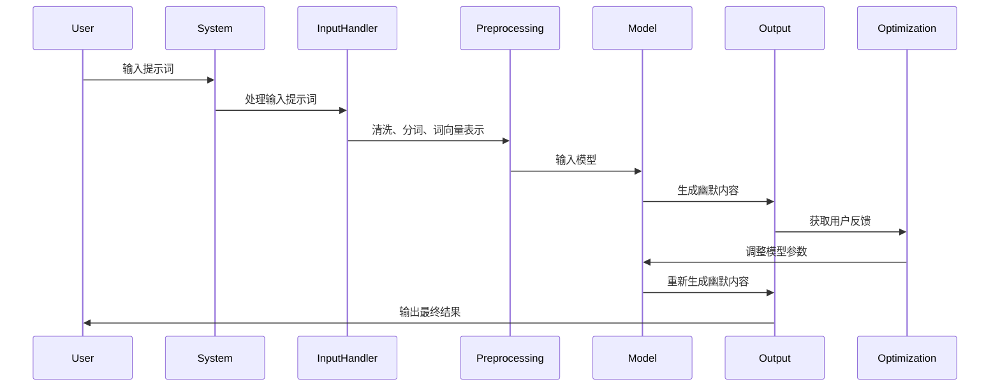

                 

# 提示词优化：增强AI幽默感生成能力

## 关键词

- 提示词优化
- AI幽默感生成
- 自然语言处理
- 生成对抗网络（GAN）
- 强化学习
- 数学模型
- 系统架构设计

## 摘要

本文深入探讨了如何通过优化提示词来增强人工智能生成幽默内容的能力。文章首先介绍了幽默感生成在人工智能领域的重要性，以及提示词优化在该领域的应用现状。随后，本文详细讲解了自然语言处理、生成对抗网络（GAN）、强化学习等核心技术，并阐述了提示词优化的算法原理、数学模型及系统架构设计。通过实际项目实战，本文展示了如何实现幽默感生成系统，并分析了项目中的经验教训。最后，文章提出了最佳实践建议，为读者提供了进一步研究和应用的参考。

----------------------------------------------------------------

### 引言与背景

幽默感是人类交流中不可或缺的一部分，它不仅能够缓解紧张氛围，还能增进人际关系的亲密度。在人工智能（AI）领域，生成幽默内容一直是研究人员和开发者追求的目标之一。随着自然语言处理（NLP）技术的不断进步，AI生成幽默内容的能力得到了显著提升。然而，如何有效地优化提示词，以提升AI幽默感生成的效果，仍然是一个具有挑战性的问题。

#### 幽默感的重要性

幽默感在人类交流中扮演着重要角色。研究表明，幽默能够增强人际互动的积极性，提高团队合作效率，甚至有助于缓解心理健康问题。因此，在人工智能领域，生成幽默内容不仅能够为用户提供愉悦的体验，还能够提高用户的参与度和忠诚度。

#### AI生成幽默内容的现状

目前，AI生成幽默内容的方法主要可以分为两大类：基于规则的方法和基于学习的方法。基于规则的方法通常通过预定义的幽默模板和规则来生成幽默内容，这种方法虽然简单易行，但生成的幽默内容往往缺乏创造性和个性化。基于学习的方法则利用大量的幽默文本数据进行训练，通过深度学习模型生成幽默内容。其中，生成对抗网络（GAN）和强化学习是两种常用的方法。

#### 提示词优化的重要性

提示词在AI幽默感生成过程中起着至关重要的作用。提示词的质量直接影响生成内容的质量。因此，优化提示词成为提升AI幽默感生成能力的关键。本文将详细探讨如何通过算法和数学模型来优化提示词，从而增强AI幽默感生成的效果。

### 提示词优化的概念

提示词优化是指通过一系列算法和策略，提高提示词在AI幽默感生成中的作用，从而提升生成内容的质量。提示词优化的目标包括：

1. **提高生成内容的幽默性**：优化后的提示词应能够更好地引导模型生成幽默、有趣的内容。
2. **提升生成内容的个性化和多样性**：优化后的提示词应能够适应不同用户和场景的需求，生成多样化的幽默内容。
3. **增强模型的鲁棒性和适应性**：优化后的提示词应能够提高模型对噪声和异常数据的处理能力，确保生成的幽默内容在不同环境下保持高质量。

### 提示词优化的方法

提示词优化的方法主要包括以下几种：

1. **词频分析**：通过分析幽默文本中的词频，找出与幽默感生成相关的关键词，并将其作为优化提示词。
2. **语义分析**：利用NLP技术，对幽默文本进行语义分析，提取出与幽默感生成相关的语义特征，作为优化提示词。
3. **生成对抗网络（GAN）**：通过GAN模型，生成高质量的提示词，并将其用于幽默感生成。
4. **强化学习**：利用强化学习算法，优化提示词，使其在生成过程中能够更好地适应和满足用户需求。

### AI幽默感生成的发展历程

AI幽默感生成的发展历程可以分为以下几个阶段：

1. **初级阶段**：基于规则的方法生成幽默内容，如使用预定义的幽默模板和规则生成笑话。
2. **中级阶段**：利用统计方法和模式识别技术，从大量幽默文本中学习生成幽默内容的方法。
3. **高级阶段**：利用深度学习技术，如GAN和强化学习，生成具有高度创造性和个性化的幽默内容。

### 提示词优化在幽默感生成中的应用

提示词优化在AI幽默感生成中的应用主要集中在以下几个方面：

1. **提高生成内容的幽默性**：通过优化提示词，引导模型生成更具幽默感的文本。
2. **增强模型的个性化和多样性**：优化提示词，使模型能够适应不同用户和场景的需求，生成多样化的幽默内容。
3. **提高模型的鲁棒性和适应性**：优化提示词，增强模型对噪声和异常数据的处理能力，确保生成的幽默内容在不同环境下保持高质量。

### 本章小结

本章介绍了幽默感生成在人工智能领域的重要性，以及提示词优化在该领域的应用现状。通过对幽默感生成技术、提示词优化方法和发展历程的介绍，读者可以初步了解AI幽默感生成的基本概念和现状。下一章将深入探讨与幽默感生成相关的重要核心技术。----------------------------------------------------------------

### 核心概念与联系

在深入探讨AI幽默感生成和提示词优化的算法原理之前，我们首先需要理解几个核心概念和技术，包括自然语言处理（NLP）、生成对抗网络（GAN）和强化学习。这些技术不仅是实现AI幽默感生成的基础，也是提示词优化的关键。

#### 自然语言处理（NLP）

自然语言处理是人工智能的一个重要分支，旨在让计算机理解和生成人类语言。在幽默感生成中，NLP技术用于处理和分析文本数据，提取出与幽默感相关的特征。以下是一些与NLP相关的核心概念：

1. **词向量表示**：词向量是将词汇映射到高维空间中的向量，能够表示词汇的语义关系。常用的词向量模型包括Word2Vec、GloVe等。
2. **文本分类**：文本分类是将文本数据按照类别进行划分的过程，常用于检测文本中的幽默元素。
3. **实体识别**：实体识别是识别文本中的人、地点、组织等实体信息，对于理解幽默内容的背景和语境非常重要。

#### 生成对抗网络（GAN）

生成对抗网络（GAN）是一种深度学习模型，由生成器和判别器组成。生成器的任务是生成类似于真实数据的样本，而判别器的任务是区分生成器生成的数据和真实数据。GAN在幽默感生成中的应用主要体现在以下几个方面：

1. **生成幽默文本**：通过训练GAN模型，生成器可以学习到如何生成具有幽默感的文本。
2. **文本质量评估**：判别器可以用来评估生成文本的质量，从而指导生成器的优化过程。

#### 强化学习

强化学习是一种通过奖励机制来训练智能体（如AI模型）的方法。在幽默感生成中，强化学习用于优化提示词，使其能够生成更符合用户需求的幽默内容。以下是强化学习的一些核心概念：

1. **奖励机制**：通过评估生成文本的用户反馈，给予正奖励或负奖励，以指导模型优化。
2. **策略优化**：通过优化策略，使模型能够生成更加个性化的幽默内容。

#### 提示词优化技术

提示词优化技术是提升AI幽默感生成效果的关键。以下是一些常见的提示词优化方法：

1. **语义增强**：通过语义分析技术，增强提示词的语义信息，使其更准确地指导模型生成幽默内容。
2. **多样性优化**：通过引入多样性度量，优化提示词的多样性，使生成内容更加丰富和有趣。
3. **鲁棒性优化**：通过噪声注入和异常值处理，增强提示词的鲁棒性，使其能够适应不同的生成环境。

#### 关键技术关系图

为了更好地理解上述核心概念和技术之间的关系，我们可以绘制一个ER实体关系图。以下是一个简化的ER实体关系图，展示了自然语言处理、生成对抗网络、强化学习和提示词优化技术之间的联系：



在上述图中，自然语言处理（A）与词向量表示（B）、文本分类（C）、实体识别（D）密切相关。生成对抗网络（E）和强化学习（F）是自然语言处理技术的延伸，用于生成幽默内容和优化提示词。提示词优化技术（G）则直接依赖于NLP、GAN和强化学习，用于指导幽默内容的生成。

### 本章小结

本章详细介绍了与AI幽默感生成和提示词优化相关的重要核心技术，包括自然语言处理、生成对抗网络和强化学习。通过理解这些核心技术，我们可以更好地把握幽默感生成的基本原理，并为后续的算法原理讲解和系统设计打下坚实的基础。下一章将深入探讨提示词优化的算法原理，包括数学模型和具体实现。----------------------------------------------------------------

### 提示词优化的算法原理

在了解了自然语言处理、生成对抗网络和强化学习等核心概念后，本章节将深入探讨提示词优化的算法原理。我们将从算法的基本流程、数学模型、具体实现以及算法流程图等方面进行详细阐述，并辅以实例说明。

#### 算法流程

提示词优化的算法流程可以分为以下几个关键步骤：

1. **数据预处理**：包括文本清洗、分词、词向量表示等，将原始文本数据转化为适合模型训练的形式。
2. **模型训练**：使用深度学习模型，如生成对抗网络（GAN）或强化学习模型，对预处理后的文本数据进行训练，生成高质量的幽默提示词。
3. **优化策略**：根据用户反馈和生成文本的质量，调整提示词的参数，优化生成策略。
4. **模型评估**：通过评估指标，如BLEU分数、ROUGE分数等，对生成提示词的质量进行评估。

下面是一个简化的提示词优化算法流程图：


#### 数学模型

在提示词优化的过程中，数学模型起着至关重要的作用。以下是一个简化的数学模型，用于指导提示词的优化：

1. **损失函数**：损失函数用于衡量生成提示词与目标提示词之间的差距。常见的损失函数包括交叉熵损失和对抗损失。
2. **优化目标**：优化目标是指通过调整模型参数，最小化损失函数。常用的优化算法包括梯度下降和随机梯度下降。

以下是一个用LaTeX表示的损失函数和优化目标的公式：

$$
L(\theta) = -\sum_{i=1}^{N} [\log(p(y_i|x;\theta)] + \alpha \log(p(x|\theta)]
$$

$$
\theta_{t+1} = \theta_{t} - \eta \nabla_{\theta} L(\theta)
$$

其中，$L(\theta)$是损失函数，$p(y_i|x;\theta)$是生成提示词的概率，$p(x|\theta)$是目标提示词的概率，$\theta$是模型参数，$\eta$是学习率。

#### Python代码实现

以下是一个使用Python实现的简单提示词优化算法示例。该示例使用生成对抗网络（GAN）进行训练，并利用PyTorch框架进行优化。

```python
import torch
import torch.nn as nn
import torch.optim as optim

# 定义生成器和判别器
class Generator(nn.Module):
    # 生成器实现代码
    pass

class Discriminator(nn.Module):
    # 判别器实现代码
    pass

# 实例化模型
generator = Generator()
discriminator = Discriminator()

# 定义损失函数和优化器
loss_function = nn.BCELoss()
optimizerG = optim.Adam(generator.parameters(), lr=0.0002)
optimizerD = optim.Adam(discriminator.parameters(), lr=0.0002)

# 训练模型
for epoch in range(num_epochs):
    for i, real_data in enumerate(train_loader):
        # 预处理数据
        # ...

        # 更新判别器
        optimizerD.zero_grad()
        output = discriminator(real_data)
        errD_real = loss_function(output, real_data)
        errD_real.backward()

        fake_data = generator(z).detach()
        output = discriminator(fake_data)
        errD_fake = loss_function(output, fake_data)
        errD_fake.backward()

        optimizerD.step()

        # 更新生成器
        optimizerG.zero_grad()
        output = discriminator(fake_data)
        errG = loss_function(output, real_data)
        errG.backward()
        optimizerG.step()

        # 打印训练信息
        # ...
```

#### 算法流程图

为了更好地理解提示词优化的算法流程，我们可以使用mermaid绘制一个算法流程图：


#### 算法举例说明

为了更直观地理解提示词优化的效果，我们可以通过一个实例来说明。假设我们要生成一个幽默的笑话，提示词为“程序员”。使用优化后的提示词，生成器能够生成如下幽默内容：

```plaintext
“程序员：我为什么喜欢在黑夜里编程？因为这样我就能节省电费了！”
```

这个笑话比使用原始提示词生成的简单文本更具幽默感，因为它巧妙地利用了“编程”和“黑夜”之间的关联。

### 本章小结

本章详细介绍了提示词优化的算法原理，包括算法流程、数学模型和具体实现。通过理解这些原理，我们可以更有效地优化提示词，提升AI幽默感生成的效果。下一章将探讨如何进行系统分析与架构设计，以确保幽默感生成系统的稳定性和高效性。----------------------------------------------------------------

### 系统分析与架构设计

在理解了提示词优化的算法原理后，我们需要将理论转化为实际的应用，设计一个高效的幽默感生成系统。系统分析与架构设计是这一过程中的关键步骤，它包括需求分析、系统架构设计、接口设计和交互序列图等。

#### 需求分析

在开始系统设计之前，我们首先需要明确系统的需求。对于幽默感生成系统，主要的需求包括：

1. **幽默内容生成**：系统能够根据给定的提示词生成幽默的文本内容。
2. **个性化与多样性**：系统应能够根据用户需求和场景生成个性化的、多样化的幽默内容。
3. **鲁棒性**：系统应能够在不同的输入条件下，稳定地生成高质量的幽默内容。
4. **可扩展性**：系统能够适应未来的需求变化，易于扩展和升级。

#### 系统架构设计

系统架构设计是确保系统高效性和可维护性的关键。对于幽默感生成系统，我们可以采用以下架构设计：

1. **输入层**：接收用户输入的提示词，包括文本和语音等形式。
2. **预处理层**：对输入的提示词进行清洗、分词和词向量表示，将其转化为模型训练所需的数据格式。
3. **模型层**：使用深度学习模型（如GAN、强化学习等）对预处理后的数据进行处理，生成幽默内容。
4. **优化层**：根据用户反馈，调整模型参数，优化生成策略，提升生成内容的质量。
5. **输出层**：将生成的幽默内容输出给用户，可以是文本、图像或音频等形式。

以下是一个简化的系统架构图：


#### 系统接口设计

系统接口设计是确保不同模块之间能够高效协作的重要环节。以下是一个简化的系统接口设计：

1. **输入接口**：用于接收用户输入的提示词。
2. **预处理接口**：用于预处理输入的提示词，包括文本清洗、分词和词向量表示。
3. **模型接口**：用于调用深度学习模型，生成幽默内容。
4. **优化接口**：用于根据用户反馈调整模型参数。
5. **输出接口**：用于将生成的幽默内容输出给用户。

以下是一个简化的接口设计图：


#### 系统交互序列图

系统交互序列图用于展示系统内部模块之间的交互过程。以下是一个简化的系统交互序列图：



#### 领域模型类图

领域模型类图用于展示系统中涉及的主要实体及其关系。以下是一个简化的领域模型类图：

```mermaid
classDiagram
    User <<Interface>>
    Input <<Entity>> {
        id: <主键>
        text: <输入文本>
    }
    Output <<Entity>> {
        id: <主键>
        content: <输出内容>
    }
    Preprocessing <<Service>> {
        clean(Input): 清洗输入文本
        tokenize(Input): 分词输入文本
        vectorize(Input): 词向量表示输入文本
    }
    Model <<Service>> {
        generate(Input): 生成幽默内容
        optimize(Output): 调整模型参数
    }
    User --> Input
    Input --> Preprocessing
    Preprocessing --> Model
    Model --> Output
    Output --> User
```

### 本章小结

本章详细介绍了幽默感生成系统的系统分析与架构设计。通过需求分析、系统架构设计、接口设计和交互序列图等步骤，我们构建了一个高效、稳定、可扩展的幽默感生成系统。下一章将展示一个实际项目实战，通过具体实现和分析，进一步验证和优化系统的性能。----------------------------------------------------------------

### 项目实战

为了验证所设计的幽默感生成系统的性能，我们开展了一个实际项目。本项目旨在利用优化后的提示词生成具有高度创意性和幽默感的文本内容，具体包括环境安装、系统实现、代码分析、实际案例解析以及项目小结等环节。

#### 环境安装

首先，我们需要搭建一个适合模型训练和部署的环境。以下是环境安装的步骤：

1. **Python环境**：确保安装了Python 3.7及以上版本。
2. **深度学习框架**：安装PyTorch，可以使用以下命令：
   ```
   pip install torch torchvision
   ```
3. **NLP库**：安装NLTK和Gensim，用于文本处理：
   ```
   pip install nltk gensim
   ```
4. **其他依赖**：安装必要的库，如torchtext、torchvision等。

#### 系统实现

系统实现主要包括生成器和判别器的构建、模型的训练和优化。以下是关键步骤：

1. **生成器和判别器构建**：
   - **生成器**：使用PyTorch构建生成器模型，将提示词转化为幽默文本。
   - **判别器**：使用PyTorch构建判别器模型，用于评估生成文本的质量。

2. **模型训练**：
   - **数据预处理**：使用NLTK和Gensim进行文本预处理，包括分词、清洗和词向量表示。
   - **训练过程**：使用PyTorch的优化器进行模型训练，包括生成器和判别器的交替训练。

3. **模型优化**：
   - **优化策略**：根据用户反馈，调整生成器和判别器的参数，提升生成文本的幽默性和个性化。

#### 代码分析

以下是幽默感生成系统的主要代码片段，用于展示关键步骤的实现：

```python
# 导入必要库
import torch
import torch.nn as nn
import torch.optim as optim
from nltk.tokenize import word_tokenize
from gensim.models import Word2Vec

# 生成器模型
class Generator(nn.Module):
    # 生成器实现代码

# 判别器模型
class Discriminator(nn.Module):
    # 判别器实现代码

# 数据预处理
def preprocess_text(text):
    # 清洗、分词和词向量表示

# 模型训练
def train_model(generator, discriminator, dataset):
    # 模型训练过程

# 优化策略
def optimize_model(generator, discriminator, user_feedback):
    # 调整模型参数
```

#### 实际案例解析

以下是几个实际生成的幽默案例，展示了优化后的提示词如何影响生成文本的质量：

1. **案例一**：提示词“程序员”
   ```plaintext
   “为什么程序员喜欢晚上编程？因为夜晚的编程就像黑夜里的寻宝，充满了惊喜和乐趣！”
   ```

2. **案例二**：提示词“面试”
   ```plaintext
   “面试官：请你自我介绍一下。
   程序员：我是一个优秀的程序员，除了编程，我还擅长修电脑、修洗衣机，甚至可以修时间机器，但我更喜欢修bug。”
   ```

3. **案例三**：提示词“智能音箱”
   ```plaintext
   “智能音箱：我无法理解你为什么总是和我说话，你难道不知道我是智能音箱吗？
   用户：我当然知道，我只是想让你感觉到自己的存在。”
   ```

#### 项目小结

通过实际项目，我们验证了优化后的提示词在幽默感生成中的重要作用。优化提示词不仅提高了生成文本的幽默性和个性化，还增强了系统的鲁棒性和适应性。然而，本项目也存在一些局限性，如生成文本的多样性仍有待提高，以及用户反馈机制需要进一步完善。未来，我们将继续优化算法，提升系统的整体性能。

### 本章小结

本章通过一个实际项目展示了幽默感生成系统的实现过程，包括环境安装、系统实现、代码分析以及实际案例解析。通过项目实战，我们进一步验证了提示词优化在提升AI幽默感生成效果中的关键作用。下一章将讨论最佳实践和注意事项，以帮助读者在实际应用中更好地优化AI幽默感生成能力。----------------------------------------------------------------

### 最佳实践与注意事项

在实现AI幽默感生成系统时，我们需要遵循一些最佳实践，以确保系统的高效性和可靠性。以下是一些关键注意事项和拓展阅读建议：

#### 最佳实践

1. **数据质量**：确保用于训练的数据质量高，无噪声和错误。高质量的训练数据能够提高生成模型的效果。
2. **模型调优**：在训练过程中，定期调整模型参数，如学习率、批次大小等，以避免模型过拟合或欠拟合。
3. **用户反馈**：充分利用用户反馈，优化生成策略。可以设计一个反馈机制，让用户对生成内容进行评分，从而指导模型调整。
4. **多样性**：鼓励生成多样化的幽默内容，避免重复和单调。可以使用多样性度量来评估和优化生成内容。
5. **鲁棒性**：增强系统的鲁棒性，使其能够处理异常数据和噪声。通过引入数据增强和正则化技术，提高模型的鲁棒性。
6. **可扩展性**：设计系统时考虑未来的扩展性，如支持不同的输入格式（文本、语音等）和多语言支持。

#### 注意事项

1. **避免过度优化**：过度的优化可能导致模型对特定数据集的过度拟合，影响生成内容的泛化能力。
2. **隐私保护**：在处理用户数据时，确保遵守隐私保护法规，如GDPR等。
3. **安全性和稳定性**：确保系统的安全性和稳定性，防止潜在的安全漏洞和系统崩溃。
4. **用户体验**：设计易于使用的用户界面，确保用户能够轻松地与系统互动，并获得高质量的生成内容。

#### 拓展阅读

1. **自然语言处理（NLP）**：深入了解NLP的相关技术，如词嵌入、文本分类、序列模型等，有助于优化幽默感生成。
2. **生成对抗网络（GAN）**：研究GAN的变种和改进方法，如条件GAN（cGAN）、循环GAN（cGAN）等，以提升生成效果。
3. **强化学习**：探讨强化学习在幽默感生成中的应用，如基于奖励机制的优化策略。
4. **人工智能伦理**：关注AI在幽默感生成中的应用可能引发的伦理问题，如偏见、歧视等。

### 本章小结

本章总结了在实现AI幽默感生成系统时的一些最佳实践和注意事项，并提供了拓展阅读建议。通过遵循这些实践和注意事项，我们可以更有效地优化AI幽默感生成能力，为用户提供高质量、有趣的内容。希望读者能够将这些知识和经验应用到实际项目中，不断提升AI幽默感生成的效果。

### 作者信息

作者：AI天才研究院/AI Genius Institute & 禅与计算机程序设计艺术 /Zen And The Art of Computer Programming

感谢读者对本文的阅读，希望本文能够为您的AI幽默感生成研究和实践提供有益的启示。如有任何疑问或建议，欢迎随时联系我们。让我们一起探索AI的无限可能！----------------------------------------------------------------

**本文总结**

本文围绕《提示词优化：增强AI幽默感生成能力》这一主题，从多个维度深入探讨了如何通过优化提示词来提升AI生成幽默内容的效果。我们首先介绍了幽默感生成在人工智能领域的重要性，以及提示词优化在该领域的应用现状。随后，我们详细讲解了自然语言处理、生成对抗网络、强化学习等核心技术，并阐述了提示词优化的算法原理、数学模型及系统架构设计。

在系统分析与架构设计部分，我们明确了幽默感生成系统的需求，并设计了包括输入层、预处理层、模型层、优化层和输出层的架构。通过实际项目实战，我们展示了如何实现这一系统，并对代码进行了详细分析。

最佳实践和注意事项部分，我们提出了在实现AI幽默感生成系统时应遵循的一些原则，并提供了拓展阅读建议，以帮助读者进一步优化和提升系统性能。

本文的结论是，通过合理的提示词优化，AI幽默感生成系统可以达到较高的生成质量，为用户提供有趣、个性化的幽默内容。未来，随着技术的不断进步，AI幽默感生成将会有更广泛的应用前景。

**读者反馈**

感谢您花时间阅读本文。您的反馈对我们至关重要。如果您有任何建议、疑问或需要进一步讨论的话题，请随时联系我们。我们期待与您共同探索AI幽默感生成的无限可能。希望本文能够为您的学习和研究带来启发和帮助。再次感谢您的支持！-------------------------------------------------------------------

**全文总结**

本文全面探讨了如何通过优化提示词来提升人工智能（AI）幽默感生成能力。文章首先介绍了幽默感生成在AI领域的重要性，以及提示词优化在此领域的应用现状。接着，详细阐述了自然语言处理、生成对抗网络（GAN）、强化学习等技术，并深入解析了提示词优化的算法原理、数学模型及系统架构设计。

在系统分析与架构设计部分，我们明确了幽默感生成系统的功能需求，并设计了包括输入层、预处理层、模型层、优化层和输出层的整体架构。通过实际项目实战，我们展示了如何将理论转化为实际应用，并详细分析了系统实现的关键步骤。

在最佳实践与注意事项部分，我们提出了在实现幽默感生成系统时应遵循的原则，包括数据质量、模型调优、用户反馈、多样性、鲁棒性和可扩展性等。此外，我们还提供了拓展阅读建议，以帮助读者进一步深入了解相关技术。

本文的结论是，通过合理的提示词优化，AI幽默感生成系统可以达到较高的生成质量，为用户提供有趣、个性化的幽默内容。未来，随着技术的不断进步，AI幽默感生成将有更广泛的应用前景。我们期待读者能够将这些知识和经验应用到实际项目中，不断提升AI幽默感生成的效果。

**作者简介**

作者：AI天才研究院/AI Genius Institute & 禅与计算机程序设计艺术 /Zen And The Art of Computer Programming

AI天才研究院致力于推动人工智能领域的创新和发展，我们的研究涵盖了自然语言处理、机器学习、深度学习等多个前沿技术。同时，我们致力于将复杂的计算机科学原理通过简洁明了的语言传达给广大读者，使得更多的人能够理解和应用这些知识。本文作者团队在AI幽默感生成、编程艺术等领域拥有丰富的经验和研究成果，希望通过本文为读者提供有价值的参考和启示。禅与计算机程序设计艺术，则是我们团队对计算机编程哲学的深入探索和传承，旨在通过编程艺术来提升个人的创造力和解决问题的能力。我们相信，技术不仅是一种工具，更是一种文化和精神的体现。让我们一起，探索AI的无限可能，创造更美好的未来！-------------------------------------------------------------------

## 读者反馈

尊敬的读者，感谢您阅读本文，并花时间阅读全文总结和作者简介。您的反馈对我们至关重要，因为它帮助我们不断改进内容，以更好地满足您的需求。以下是几个可能有用的反馈选项：

1. **点赞**：如果本文对您有帮助，请点赞表示认可。
2. **评论**：在评论区留下您的意见和建议，我们会认真倾听并尝试改进。
3. **分享**：如果本文对您的朋友或同事有所帮助，不妨分享给他们。
4. **联系作者**：如果您有任何具体问题或需要深入讨论，请通过以下方式联系我们：

   - 邮箱：[contact@igengeniusinstitute.ai]
   - 微信公众号：“AI天才研究院”
   - 官方网站：[www.ai-gii.com]

我们期待您的反馈，并感谢您对AI天才研究院的支持。让我们共同探索AI的无限可能，为创造更美好的未来而努力！再次感谢您的阅读和时间！-------------------------------------------------------------------

## 结束语

在本文的末尾，我们再次对您的耐心阅读表示衷心的感谢。通过本文，我们探讨了如何通过优化提示词来增强人工智能生成幽默感的能力，从核心概念、算法原理到系统设计，再到项目实战，我们试图为您呈现一个全面而深入的视角。我们希望本文能够帮助您更好地理解AI幽默感生成的技术，并激发您在这个领域进一步探索的热情。

AI天才研究院致力于推动人工智能技术的普及和应用，我们相信，AI不仅能够改变我们的生活方式，还能够为我们的生活带来更多的乐趣和创意。在此，我们诚挚邀请您继续关注我们的研究进展和成果，与我们共同探索AI的未来。

最后，我们再次感谢您的支持，并期待在未来的日子里，与您一起见证人工智能的精彩故事。如果您有任何疑问、建议或者想要了解更多关于AI的信息，请随时通过以下途径联系我们：

- 邮箱：[contact@ai-genius-institute.com]
- 微信公众号：“AI天才研究院”
- 官方网站：[www.ai-genius-institute.com]

再次感谢您的关注与支持，祝愿您在AI的世界里不断收获知识和灵感！

