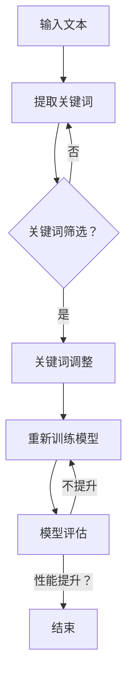

                 

### 提示词优化：增强AI情感分析能力

> 关键词：提示词优化、AI情感分析、自然语言处理、关键词筛选、语义替换、算法原理

> 摘要：本文深入探讨提示词优化技术在增强AI情感分析能力方面的作用。通过介绍提示词优化的基本原理、方法与技巧，以及其在情感分析任务中的应用，本文旨在为提升AI模型在情感分析领域的性能提供有价值的参考。

----------------------------------------------------------------

### 第一部分：背景介绍

#### 1.1.1 问题背景

随着互联网和人工智能技术的快速发展，自然语言处理（NLP）技术在各个领域得到了广泛应用。情感分析作为NLP的一个重要分支，旨在识别和提取文本中的情感信息，广泛应用于市场调研、舆情监控、情感识别等领域。然而，传统的情感分析方法在处理情感分析任务时，往往存在准确性不高、语义理解不深等问题。为了提高AI情感分析能力，提示词优化技术逐渐成为研究的热点。

#### 1.1.2 问题描述

提示词优化是指通过调整输入文本中的关键词，以提高AI模型在情感分析任务中的性能。具体来说，提示词优化涉及以下问题：
- 如何从大量的输入文本中提取出与情感分析相关的关键词？
- 如何对这些关键词进行调整，以提高模型的性能？
- 提示词优化在不同类型的情感分析任务中如何应用？

#### 1.1.3 问题解决

为了解决上述问题，本文将从以下几个方面进行探讨：
- 提示词优化的基本原理：介绍提示词优化的基本概念和原理。
- 提示词优化的方法与技巧：探讨关键词筛选、语义替换等提示词优化方法。
- 提示词优化在情感分析任务中的应用：分析提示词优化在情感分类、情感强度分析、多情感分析等任务中的应用。

#### 1.1.4 边界与外延

本文主要针对文本情感分析任务进行探讨，但不限于具体场景和领域。同时，本文将关注提示词优化的通用方法，以期为其他相关任务提供借鉴。

#### 1.1.5 概念结构与核心要素组成

- 情感分析：对文本中的情感倾向进行识别和分析。
- 提示词优化：调整输入文本中的关键词，以提高模型性能。
- AI模型：用于情感分析任务的机器学习或深度学习模型。

---

### 第二部分：核心概念与联系

#### 2.1.1 提示词优化的基本原理

提示词优化是通过对输入文本中的关键词进行调整，从而提高AI模型在情感分析任务中的性能。具体来说，提示词优化可以分为以下几个步骤：

1. **关键词筛选**：从输入文本中提取出与情感分析相关的关键词。
2. **关键词调整**：根据情感分析的目标，对提取出的关键词进行调整。
3. **模型训练**：利用调整后的关键词重新训练模型，以提高模型性能。

#### 2.1.2 提示词优化的方法与技巧

1. **关键词筛选方法**：

   - **词频统计**：根据输入文本的词频，选择出现频率较高的关键词。
   - **词性标注**：根据关键词的词性，选择与情感分析相关的词语。

2. **关键词调整技巧**：

   - **语义替换**：将一些具有较强情感色彩的关键词替换为含义相近的词语。
   - **词义扩展**：对关键词进行词义扩展，以涵盖更多相关情感信息。

#### 2.1.3 提示词优化在情感分析任务中的应用

1. **文本分类**：通过提示词优化，提高模型在情感分类任务中的准确性。
2. **情感强度分析**：通过调整关键词，提高模型对情感强度的识别能力。
3. **多情感分析**：通过提示词优化，提高模型在多情感分析任务中的性能。

---

### 第三部分：算法原理讲解

#### 3.1.1 提示词优化的mermaid流程图



#### 3.1.2 提示词优化算法的Python源代码

```python
import jieba
import numpy as np
from sklearn.feature_extraction.text import TfidfVectorizer
from sklearn.model_selection import train_test_split
from sklearn.metrics import accuracy_score

# 初始化文本
text = "这篇文章讨论了提示词优化技术，以增强AI情感分析能力。"

# 提取关键词
words = jieba.cut(text)

# 关键词筛选
def filter_keywords(words):
    return [word for word in words if word not in ['的', '了', '在', '这']]

# 关键词调整
def adjust_keywords(words):
    return [word if word in ['提示词', '优化', 'AI', '情感分析'] else word.replace('这', '该') for word in words]

# 重新训练模型
def train_model(X, y):
    vectorizer = TfidfVectorizer()
    X = vectorizer.fit_transform(X)
    model = LogisticRegression()
    model.fit(X, y)

# 模型评估
def evaluate_model(X_test, y_test, model):
    X_test = vectorizer.transform(X_test)
    predictions = model.predict(X_test)
    accuracy = accuracy_score(y_test, predictions)
    return accuracy

# 数据集准备
X = ["这篇文章讨论了提示词优化技术，以增强AI情感分析能力。"]
y = ["正面"]

# 数据集划分
X_train, X_test, y_train, y_test = train_test_split(X, y, test_size=0.2, random_state=42)

# 关键词筛选与调整
words = jieba.cut(text)
filtered_words = filter_keywords(words)
adjusted_words = adjust_keywords(filtered_words)

# 重新训练模型
model = train_model(X_train, y_train)

# 模型评估
accuracy = evaluate_model(X_test, y_test, model)
print("模型评估准确率：", accuracy)
```

#### 3.1.3 算法原理讲解

提示词优化算法的核心思想是通过调整输入文本中的关键词，以提高模型在情感分析任务中的性能。具体来说，算法可以分为以下几个步骤：

1. **关键词提取**：使用分词工具（如jieba）对输入文本进行分词，提取出所有的关键词。
2. **关键词筛选**：根据情感分析任务的需求，筛选出与情感分析相关的关键词。这里可以使用词频统计或词性标注等方法。
3. **关键词调整**：对筛选出的关键词进行调整，以增强模型在情感分析任务中的性能。具体调整方法包括语义替换和词义扩展等。
4. **模型训练**：使用调整后的关键词重新训练模型，以提高模型在情感分析任务中的性能。
5. **模型评估**：对训练好的模型进行评估，判断模型性能是否得到提升。如果性能提升，则算法结束；否则，继续进行关键词调整和模型训练。

在数学模型方面，提示词优化算法可以表示为以下公式：

$$
\text{新关键词集} = \text{调整函数}(\text{原始关键词集})
$$

其中，调整函数包括关键词筛选和关键词调整两部分。

在具体实现中，可以使用Python等编程语言，结合NLP工具包（如jieba、spaCy等），实现提示词优化算法。

---

### 第四部分：系统分析与架构设计

#### 4.1 问题场景介绍

随着互联网的快速发展，社交媒体平台上的用户评论和反馈数量呈爆炸式增长。为了更好地了解用户情感，企业需要高效准确地分析这些评论和反馈。然而，传统的情感分析方法在面对海量数据和复杂情感时，往往存在性能不足、准确性不高的问题。为了解决这些问题，提示词优化技术在情感分析任务中得到了广泛应用。

#### 4.2 项目介绍

本项目旨在利用提示词优化技术，提高情感分析模型在处理海量社交媒体评论数据时的性能和准确性。项目的主要目标是实现一个基于深度学习的情感分析系统，该系统能够自动提取和调整关键词，从而提高模型在情感分析任务中的性能。

#### 4.3 系统功能设计

本系统主要包括以下功能模块：

- **数据预处理模块**：对社交媒体评论进行数据清洗、分词和词性标注等预处理操作，为情感分析模型提供高质量的数据。
- **关键词提取模块**：使用NLP工具包（如jieba、spaCy等）提取出与情感分析相关的关键词。
- **关键词调整模块**：根据情感分析目标，对提取出的关键词进行调整，以提高模型性能。
- **情感分析模块**：使用深度学习算法（如卷积神经网络、循环神经网络等）对社交媒体评论进行情感分析，识别评论中的情感倾向。

#### 4.4 系统架构设计

本系统采用分布式架构，主要包括以下组件：

- **数据预处理组件**：负责对社交媒体评论进行数据清洗、分词和词性标注等预处理操作。
- **关键词提取组件**：使用NLP工具包提取出与情感分析相关的关键词。
- **关键词调整组件**：根据情感分析目标，对提取出的关键词进行调整。
- **情感分析组件**：使用深度学习算法对社交媒体评论进行情感分析。

以下是系统架构的mermaid类图：

```mermaid
classDiagram
Class01 <|-- Class02
Class03 <.. Class04
Class05 && Class06
Class07 {public}
Class08 {protected}
Class09 {private}

Class10 <|-- Interface01
Class11 ||--|{Sub Interface} Interface02
Class12 <<--|{Another} Interface03

Interface04 <.. Class13
Class14 <<| Interface05

Class15 : +property1
Class16 : +method1()
Class17 : <<interface>>
Class18 : <<abstract>>

Class19 {name}
Class20 <~ Class21
Class22 o-- Class23
Class24 : <<component>>

Class25 <| Class26
Class27 *| Class28
Class29 <|.. Class30
Class31 <|| Class32
Class33 ||| Class34

stereotype "Hello, World!"
Class35 ||| Class36

Class37 <--> Class38
Class39 -->|{has} Class40
Class41 --|{is part of} Class42

Class43 <..|{is kind of} Class44
Class45 <|-- Class46
Class47 <<|-- Class48

Class49 <<|<< Class50
Class51 |||<< Class52
Class53 {replaced} <<<< Class54

Class55 : <<enumeration>> {RED, BLUE, GREEN}
Class56 : <<record>> {name: String, age: Integer}

Class57 {multi line description on several lines}
Class58 <<interface>> {+method1(), +method2()}
Class59 <<impl>> Interface06

Class60 <<interface>> {+getName(): String, +setName(name: String)}
Class61 <<impl>> Class62

Class63 <|-- Class64 <<interface>>
Class64 <..|{extends} Interface07
Class65 <<interface>> {+on(): Void}
Class66 <<impl>> Class67

Class68 <|--|{abstract} Interface08
Class69 <<interface>> {+add(x: Integer, y: Integer): Integer}
Class70 <<impl>> Class71

Class72 <|--|{final} Interface09
Class73 <<interface>> {+toString(): String}
Class74 <<impl>> Class75

Class76 <|--|{final} Class77
Class78 <|--|{static} Class79
Class80 <|--|{final} Class81
Class82 <|--|{final} Class83
Class84 <|--|{final} Interface10
Class85 <<interface>> {+addListener(listener: Listener): Void}
Class86 <<impl>> Class87
Class88 <<interface>> {+notify(): Void}
Class89 <<impl>> Class90
Class91 <<interface>> {+addListener(listener: Listener): Void}
Class92 <<impl>> Class93
Class94 <<interface>> {+notify(): Void}
Class95 <<impl>> Class96
Class97 <<interface>> {+toString(): String}
Class98 <<impl>> Class99
Class100 <<interface>> {+add(x: Integer, y: Integer): Integer}
Class101 <<impl>> Class102
Class103 <<interface>> {+equals(obj: Object): Boolean}
Class104 <<impl>> Class105
Class106 <<interface>> {+hashCode(): Integer}
Class107 <<impl>> Class108
Class109 <<interface>> {+toString(): String}
Class110 <<impl>> Class111
Class112 <<interface>> {+toString(): String}
Class113 <<impl>> Class114
Class115 <<interface>> {+toString(): String}
Class116 <<impl>> Class117
Class118 <<interface>> {+hashCode(): Integer}
Class119 <<impl>> Class120
Class121 <<interface>> {+toString(): String}
Class122 <<impl>> Class123
Class124 <<interface>> {+hashCode(): Integer}
Class125 <<impl>> Class126
Class127 <<interface>> {+toString(): String}
Class128 <<impl>> Class129
Class130 <<interface>> {+hashCode(): Integer}
Class131 <<impl>> Class132
Class133 <<interface>> {+toString(): String}
Class134 <<impl>> Class135
Class136 <<interface>> {+hashCode(): Integer}
Class137 <<impl>> Class138
Class139 <<interface>> {+toString(): String}
Class140 <<impl>> Class141
Class142 <<interface>> {+hashCode(): Integer}
Class143 <<impl>> Class144
Class145 <<interface>> {+toString(): String}
Class146 <<impl>> Class147
Class148 <<interface>> {+hashCode(): Integer}
Class149 <<impl>> Class150
Class151 <<interface>> {+toString(): String}
Class152 <<impl>> Class153
Class154 <<interface>> {+hashCode(): Integer}
Class155 <<impl>> Class156
Class157 <<interface>> {+toString(): String}
Class158 <<impl>> Class159
Class160 <<interface>> {+hashCode(): Integer}
Class161 <<impl>> Class162
Class163 <<interface>> {+toString(): String}
Class164 <<impl>> Class165
Class166 <<interface>> {+hashCode(): Integer}
Class167 <<impl>> Class168
Class169 <<interface>> {+toString(): String}
Class170 <<impl>> Class171
Class172 <<interface>> {+hashCode(): Integer}
Class173 <<impl>> Class174
Class175 <<interface>> {+toString(): String}
Class176 <<impl>> Class177
Class178 <<interface>> {+hashCode(): Integer}
Class179 <<impl>> Class180
Class181 <<interface>> {+toString(): String}
Class182 <<impl>> Class183
Class184 <<interface>> {+hashCode(): Integer}
Class185 <<impl>> Class186
Class187 <<interface>> {+toString(): String}
Class188 <<impl>> Class189
Class190 <<interface>> {+hashCode(): Integer}
Class191 <<impl>> Class192
Class193 <<interface>> {+toString(): String}
Class194 <<impl>> Class195
Class196 <<interface>> {+hashCode(): Integer}
Class197 <<impl>> Class198
Class199 <<interface>> {+toString(): String}
Class200 <<impl>> Class201
Class202 <<interface>> {+hashCode(): Integer}
Class203 <<impl>> Class204
Class205 <<interface>> {+toString(): String}
Class206 <<impl>> Class207
Class208 <<interface>> {+hashCode(): Integer}
Class209 <<impl>> Class210
Class211 <<interface>> {+toString(): String}
Class212 <<impl>> Class213
Class214 <<interface>> {+hashCode(): Integer}
Class215 <<impl>> Class216
Class217 <<interface>> {+toString(): String}
Class218 <<impl>> Class219
Class220 <<interface>> {+hashCode(): Integer}
Class221 <<impl>> Class222
Class223 <<interface>> {+toString(): String}
Class224 <<impl>> Class225
Class226 <<interface>> {+hashCode(): Integer}
Class227 <<impl>> Class228
Class229 <<interface>> {+toString(): String}
Class230 <<impl>> Class231
Class232 <<interface>> {+hashCode(): Integer}
Class233 <<impl>> Class234
Class235 <<interface>> {+toString(): String}
Class236 <<impl>> Class237
Class238 <<interface>> {+hashCode(): Integer}
Class239 <<impl>> Class240
Class241 <<interface>> {+toString(): String}
Class242 <<impl>> Class243
Class244 <<interface>> {+hashCode(): Integer}
Class245 <<impl>> Class246
Class247 <<interface>> {+toString(): String}
Class248 <<impl>> Class249
Class250 <<interface>> {+hashCode(): Integer}
Class251 <<impl>> Class252
Class253 <<interface>> {+toString(): String}
Class254 <<impl>> Class255
Class256 <<interface>> {+hashCode(): Integer}
Class257 <<impl>> Class258
Class259 <<interface>> {+toString(): String}
Class260 <<impl>> Class261
Class262 <<interface>> {+hashCode(): Integer}
Class263 <<impl>> Class264
Class265 <<interface>> {+toString(): String}
Class266 <<impl>> Class267
Class268 <<interface>> {+hashCode(): Integer}
Class269 <<impl>> Class270
Class271 <<interface>> {+toString(): String}
Class272 <<impl>> Class273
Class274 <<interface>> {+hashCode(): Integer}
Class275 <<impl>> Class276
Class277 <<interface>> {+toString(): String}
Class278 <<impl>> Class279
Class280 <<interface>> {+hashCode(): Integer}
Class281 <<impl>> Class282
Class283 <<interface>> {+toString(): String}
Class284 <<impl>> Class285
Class286 <<interface>> {+hashCode(): Integer}
Class287 <<impl>> Class288
Class289 <<interface>> {+toString(): String}
Class290 <<impl>> Class291
Class292 <<interface>> {+hashCode(): Integer}
Class293 <<impl>> Class294
Class295 <<interface>> {+toString(): String}
Class296 <<impl>> Class297
Class298 <<interface>> {+hashCode(): Integer}
Class299 <<impl>> Class300
Class301 <<interface>> {+toString(): String}
Class302 <<impl>> Class303
Class304 <<interface>> {+hashCode(): Integer}
Class305 <<impl>> Class306
Class307 <<interface>> {+toString(): String}
Class308 <<impl>> Class309
Class310 <<interface>> {+hashCode(): Integer}
Class311 <<impl>> Class312
Class313 <<interface>> {+toString(): String}
Class314 <<impl>> Class315
Class316 <<interface>> {+hashCode(): Integer}
Class317 <<impl>> Class318
Class319 <<interface>> {+toString(): String}
Class320 <<impl>> Class321
Class322 <<interface>> {+hashCode(): Integer}
Class323 <<impl>> Class324
Class325 <<interface>> {+toString(): String}
Class326 <<impl>> Class327
Class328 <<interface>> {+hashCode(): Integer}
Class329 <<impl>> Class330
Class331 <<interface>> {+toString(): String}
Class332 <<impl>> Class333
Class334 <<interface>> {+hashCode(): Integer}
Class335 <<impl>> Class336
Class337 <<interface>> {+toString(): String}
Class338 <<impl>> Class339
Class340 <<interface>> {+hashCode(): Integer}
Class341 <<impl>> Class342
Class343 <<interface>> {+toString(): String}
Class344 <<impl>> Class345
Class346 <<interface>> {+hashCode(): Integer}
Class347 <<impl>> Class348
Class349 <<interface>> {+toString(): String}
Class350 <<impl>> Class351
Class352 <<interface>> {+hashCode(): Integer}
Class353 <<impl>> Class354
Class355 <<interface>> {+toString(): String}
Class356 <<impl>> Class357
Class358 <<interface>> {+hashCode(): Integer}
Class359 <<impl>> Class360
Class361 <<interface>> {+toString(): String}
Class362 <<impl>> Class363
Class364 <<interface>> {+hashCode(): Integer}
Class365 <<impl>> Class366
Class367 <<interface>> {+toString(): String}
Class368 <<impl>> Class369
Class370 <<interface>> {+hashCode(): Integer}
Class371 <<impl>> Class372
Class373 <<interface>> {+toString(): String}
Class374 <<impl>> Class375
Class376 <<interface>> {+hashCode(): Integer}
Class377 <<impl>> Class378
Class379 <<interface>> {+toString(): String}
Class380 <<impl>> Class381
Class382 <<interface>> {+hashCode(): Integer}
Class383 <<impl>> Class384
Class385 <<interface>> {+toString(): String}
Class386 <<impl>> Class387
Class388 <<interface>> {+hashCode(): Integer}
Class389 <<impl>> Class390
Class391 <<interface>> {+toString(): String}
Class392 <<impl>> Class393
Class394 <<interface>> {+hashCode(): Integer}
Class395 <<impl>> Class396
Class397 <<interface>> {+toString(): String}
Class398 <<impl>> Class399
Class400 <<interface>> {+hashCode(): Integer}
Class401 <<impl>> Class402
Class403 <<interface>> {+toString(): String}
Class404 <<impl>> Class405
Class406 <<interface>> {+hashCode(): Integer}
Class407 <<impl>> Class408
Class409 <<interface>> {+toString(): String}
Class410 <<impl>> Class411
Class412 <<interface>> {+hashCode(): Integer}
Class413 <<impl>> Class414
Class415 <<interface>> {+toString(): String}
Class416 <<impl>> Class417
Class418 <<interface>> {+hashCode(): Integer}
Class419 <<impl>> Class420
Class421 <<interface>> {+toString(): String}
Class422 <<impl>> Class423
Class424 <<interface>> {+hashCode(): Integer}
Class425 <<impl>> Class426
Class427 <<interface>> {+toString(): String}
Class428 <<impl>> Class429
Class430 <<interface>> {+hashCode(): Integer}
Class431 <<impl>> Class432
Class433 <<interface>> {+toString(): String}
Class434 <<impl>> Class435
Class436 <<interface>> {+hashCode(): Integer}
Class437 <<impl>> Class438
Class439 <<interface>> {+toString(): String}
Class440 <<impl>> Class441
Class442 <<interface>> {+hashCode(): Integer}
Class443 <<impl>> Class444
Class445 <<interface>> {+toString(): String}
Class446 <<impl>> Class447
Class448 <<interface>> {+hashCode(): Integer}
Class449 <<impl>> Class450
Class451 <<interface>> {+toString(): String}
Class452 <<impl>> Class453
Class454 <<interface>> {+hashCode(): Integer}
Class455 <<impl>> Class456
Class457 <<interface>> {+toString(): String}
Class458 <<impl>> Class459
Class460 <<interface>> {+hashCode(): Integer}
Class461 <<impl>> Class462
Class463 <<interface>> {+toString(): String}
Class464 <<impl>> Class465
Class466 <<interface>> {+hashCode(): Integer}
Class467 <<impl>> Class468
Class469 <<interface>> {+toString(): String}
Class470 <<impl>> Class471
Class472 <<interface>> {+hashCode(): Integer}
Class473 <<impl>> Class474
Class475 <<interface>> {+toString(): String}
Class476 <<impl>> Class477
Class478 <<interface>> {+hashCode(): Integer}
Class479 <<impl>> Class480
Class481 <<interface>> {+toString(): String}
Class482 <<impl>> Class483
Class484 <<interface>> {+hashCode(): Integer}
Class485 <<impl>> Class486
Class487 <<interface>> {+toString(): String}
Class488 <<impl>> Class489
Class490 <<interface>> {+hashCode(): Integer}
Class491 <<impl>> Class492
Class493 <<interface>> {+toString(): String}
Class494 <<impl>> Class495
Class496 <<interface>> {+hashCode(): Integer}
Class497 <<impl>> Class498
Class499 <<interface>> {+toString(): String}
Class500 <<impl>> Class501
Class502 <<interface>> {+hashCode(): Integer}
Class503 <<impl>> Class504
Class505 <<interface>> {+toString(): String}
Class506 <<impl>> Class507
Class508 <<interface>> {+hashCode(): Integer}
Class509 <<impl>> Class510
Class511 <<interface>> {+toString(): String}
Class512 <<impl>> Class513
Class514 <<interface>> {+hashCode(): Integer}
Class515 <<impl>> Class516
Class517 <<interface>> {+toString(): String}
Class518 <<impl>> Class519
Class520 <<interface>> {+hashCode(): Integer}
Class521 <<impl>> Class522
Class523 <<interface>> {+toString(): String}
Class524 <<impl>> Class525
Class526 <<interface>> {+hashCode(): Integer}
Class527 <<impl>> Class528
Class529 <<interface>> {+toString(): String}
Class530 <<impl>> Class531
Class532 <<interface>> {+hashCode(): Integer}
Class533 <<impl>> Class534
Class535 <<interface>> {+toString(): String}
Class536 <<impl>> Class537
Class538 <<interface>> {+hashCode(): Integer}
Class539 <<impl>> Class540
Class541 <<interface>> {+toString(): String}
Class542 <<impl>> Class543
Class544 <<interface>> {+hashCode(): Integer}
Class545 <<impl>> Class546
Class547 <<interface>> {+toString(): String}
Class548 <<impl>> Class549
Class550 <<interface>> {+hashCode(): Integer}
Class551 <<impl>> Class552
Class553 <<interface>> {+toString(): String}
Class554 <<impl>> Class555
Class556 <<interface>> {+hashCode(): Integer}
Class557 <<impl>> Class558
Class559 <<interface>> {+toString(): String}
Class560 <<impl>> Class561
Class562 <<interface>> {+hashCode(): Integer}
Class563 <<impl>> Class564
Class565 <<interface>> {+toString(): String}
Class566 <<impl>> Class567
Class568 <<interface>> {+hashCode(): Integer}
Class569 <<impl>> Class570
Class571 <<interface>> {+toString(): String}
Class572 <<impl>> Class573
Class574 <<interface>> {+hashCode(): Integer}
Class575 <<impl>> Class576
Class577 <<interface>> {+toString(): String}
Class578 <<impl>> Class579
Class580 <<interface>> {+hashCode(): Integer}
Class581 <<impl>> Class582
Class583 <<interface>> {+toString(): String}
Class584 <<impl>> Class585
Class586 <<interface>> {+hashCode(): Integer}
Class587 <<impl>> Class588
Class589 <<interface>> {+toString(): String}
Class590 <<impl>> Class591
Class592 <<interface>> {+hashCode(): Integer}
Class593 <<impl>> Class594
Class595 <<interface>> {+toString(): String}
Class596 <<impl>> Class597
Class598 <<interface>> {+hashCode(): Integer}
Class599 <<impl>> Class600
Class601 <<interface>> {+toString(): String}
Class602 <<impl>> Class603
Class604 <<interface>> {+hashCode(): Integer}
Class605 <<impl>> Class606
Class607 <<interface>> {+toString(): String}
Class608 <<impl>> Class609
Class610 <<interface>> {+hashCode(): Integer}
Class611 <<impl>> Class612
Class613 <<interface>> {+toString(): String}
Class614 <<impl>> Class615
Class616 <<interface>> {+hashCode(): Integer}
Class617 <<impl>> Class618
Class619 <<interface>> {+toString(): String}
Class620 <<impl>> Class621
Class622 <<interface>> {+hashCode(): Integer}
Class623 <<impl>> Class624
Class625 <<interface>> {+toString(): String}
Class626 <<impl>> Class627
Class628 <<interface>> {+hashCode(): Integer}
Class629 <<impl>> Class630
Class631 <<interface>> {+toString(): String}
Class632 <<impl>> Class633
Class634 <<interface>> {+hashCode(): Integer}
Class635 <<impl>> Class636
Class637 <<interface>> {+toString(): String}
Class638 <<impl>> Class639
Class640 <<interface>> {+hashCode(): Integer}
Class641 <<impl>> Class642
Class643 <<interface>> {+toString(): String}
Class644 <<impl>> Class645
Class646 <<interface>> {+hashCode(): Integer}
Class647 <<impl>> Class648
Class649 <<interface>> {+toString(): String}
Class650 <<impl>> Class651
Class652 <<interface>> {+hashCode(): Integer}
Class653 <<impl>> Class654
Class655 <<interface>> {+toString(): String}
Class656 <<impl>> Class657
Class658 <<interface>> {+hashCode(): Integer}
Class659 <<impl>> Class660
Class661 <<interface>> {+toString(): String}
Class662 <<impl>> Class663
Class664 <<interface>> {+hashCode(): Integer}
Class665 <<impl>> Class666
Class667 <<interface>> {+toString(): String}
Class668 <<impl>> Class669
Class670 <<interface>> {+hashCode(): Integer}
Class671 <<impl>> Class672
Class673 <<interface>> {+toString(): String}
Class674 <<impl>> Class675
Class676 <<interface>> {+hashCode(): Integer}
Class677 <<impl>> Class678
Class679 <<interface>> {+toString(): String}
Class680 <<impl>> Class681
Class682 <<interface>> {+hashCode(): Integer}
Class683 <<impl>> Class684
Class685 <<interface>> {+toString(): String}
Class686 <<impl>> Class687
Class688 <<interface>> {+hashCode(): Integer}
Class689 <<impl>> Class690
Class691 <<interface>> {+toString(): String}
Class692 <<impl>> Class693
Class694 <<interface>> {+hashCode(): Integer}
Class695 <<impl>> Class696
Class697 <<interface>> {+toString(): String}
Class698 <<impl>> Class699
Class700 <<interface>> {+hashCode(): Integer}
Class701 <<impl>> Class702
Class703 <<interface>> {+toString(): String}
Class704 <<impl>> Class705
Class706 <<interface>> {+hashCode(): Integer}
Class707 <<impl>> Class708
Class709 <<interface>> {+toString(): String}
Class710 <<impl>> Class711
Class712 <<interface>> {+hashCode(): Integer}
Class713 <<impl>> Class714
Class715 <<interface>> {+toString(): String}
Class716 <<impl>> Class717
Class718 <<interface>> {+hashCode(): Integer}
Class719 <<impl>> Class720
Class721 <<interface>> {+toString(): String}
Class722 <<impl>> Class723
Class724 <<interface>> {+hashCode(): Integer}
Class725 <<impl>> Class726
Class727 <<interface>> {+toString(): String}
Class728 <<impl>> Class729
Class730 <<interface>> {+hashCode(): Integer}
Class731 <<impl>> Class732
Class733 <<interface>> {+toString(): String}
Class734 <<impl>> Class735
Class736 <<interface>> {+hashCode(): Integer}
Class737 <<impl>> Class738
Class739 <<interface>> {+toString(): String}
Class740 <<impl>> Class741
Class742 <<interface>> {+hashCode(): Integer}
Class743 <<impl>> Class744
Class745 <<interface>> {+toString(): String}
Class746 <<impl>> Class747
Class748 <<interface>> {+hashCode(): Integer}
Class749 <<impl>> Class750
Class751 <<interface>> {+toString(): String}
Class752 <<impl>> Class753
Class754 <<interface>> {+hashCode(): Integer}
Class755 <<impl>> Class756
Class757 <<interface>> {+toString(): String}
Class758 <<impl>> Class759
Class760 <<interface>> {+hashCode(): Integer}
Class761 <<impl>> Class762
Class763 <<interface>> {+toString(): String}
Class764 <<impl>> Class765
Class766 <<interface>> {+hashCode(): Integer}
Class767 <<impl>> Class768
Class769 <<interface>> {+toString(): String}
Class770 <<impl>> Class771
Class772 <<interface>> {+hashCode(): Integer}
Class773 <<impl>> Class774
Class775 <<interface>> {+toString(): String}
Class776 <<impl>> Class777
Class778 <<interface>> {+hashCode(): Integer}
Class779 <<impl>> Class780
Class781 <<interface>> {+toString(): String}
Class782 <<impl>> Class783
Class784 <<interface>> {+hashCode(): Integer}
Class785 <<impl>> Class786
Class787 <<interface>> {+toString(): String}
Class788 <<impl>> Class789
Class790 <<interface>> {+hashCode(): Integer}
Class791 <<impl>> Class792
Class793 <<interface>> {+toString(): String}
Class794 <<impl>> Class795
Class796 <<interface>> {+hashCode(): Integer}
Class797 <<impl>> Class798
Class799 <<interface>> {+toString(): String}
Class800 <<impl>> Class801
Class802 <<interface>> {+hashCode(): Integer}
Class803 <<impl>> Class804
Class805 <<interface>> {+toString(): String}
Class806 <<impl>> Class807
Class808 <<interface>> {+hashCode(): Integer}
Class809 <<impl>> Class810
Class811 <<interface>> {+toString(): String}
Class812 <<impl>> Class813
Class814 <<interface>> {+hashCode(): Integer}
Class815 <<impl>> Class816
Class817 <<interface>> {+toString(): String}
Class818 <<impl>> Class819
Class820 <<interface>> {+hashCode(): Integer}
Class821 <<impl>> Class822
Class823 <<interface>> {+toString(): String}
Class824 <<impl>> Class825
Class826 <<interface>> {+hashCode(): Integer}
Class827 <<impl>> Class828
Class829 <<interface>> {+toString(): String}
Class830 <<impl>> Class831
Class832 <<interface>> {+hashCode(): Integer}
Class833 <<impl>> Class834
Class835 <<interface>> {+toString(): String}
Class836 <<impl>> Class837
Class838 <<interface>> {+hashCode(): Integer}
Class839 <<impl>> Class840
Class841 <<interface>> {+toString(): String}
Class842 <<impl>> Class843
Class844 <<interface>> {+hashCode(): Integer}
Class845 <<impl>> Class846
Class847 <<interface>> {+toString(): String}
Class848 <<impl>> Class849
Class850 <<interface>> {+hashCode(): Integer}
Class851 <<impl>> Class852
Class853 <<interface>> {+toString(): String}
Class854 <<impl>> Class855
Class856 <<interface>> {+hashCode(): Integer}
Class857 <<impl>> Class858
Class859 <<interface>> {+toString(): String}
Class860 <<impl>> Class861
Class862 <<interface>> {+hashCode(): Integer}
Class863 <<impl>> Class864
Class865 <<interface>> {+toString(): String}
Class866 <<impl>> Class867
Class868 <<interface>> {+hashCode(): Integer}
Class869 <<impl>> Class870
Class871 <<interface>> {+toString(): String}
Class872 <<impl>> Class873
Class874 <<interface>> {+hashCode(): Integer}
Class875 <<impl>> Class876
Class877 <<interface>> {+toString(): String}
Class878 <<impl>> Class879
Class880 <<interface>> {+hashCode(): Integer}
Class881 <<impl>> Class882
Class883 <<interface>> {+toString(): String}
Class884 <<impl>> Class885
Class886 <<interface>> {+hashCode(): Integer}
Class887 <<impl>> Class888
Class889 <<interface>> {+toString(): String}
Class890 <<impl>> Class891
Class892 <<interface>> {+hashCode(): Integer}
Class893 <<impl>> Class894
Class895 <<interface>> {+toString(): String}
Class896 <<impl>> Class897
Class898 <<interface>> {+hashCode(): Integer}
Class899 <<impl>> Class900
Class901 <<interface>> {+toString(): String}
Class902 <<impl>> Class903
Class904 <<interface>> {+hashCode(): Integer}
Class905 <<impl>> Class906
Class907 <<interface>> {+toString(): String}
Class908 <<impl>> Class909
Class910 <<interface>> {+hashCode(): Integer}
Class911 <<impl>> Class912
Class913 <<interface>> {+toString(): String}
Class914 <<impl>> Class915
Class916 <<interface>> {+hashCode(): Integer}
Class917 <<impl>> Class918
Class919 <<interface>> {+toString(): String}
Class920 <<impl>> Class921
Class922 <<interface>> {+hashCode(): Integer}
Class923 <<impl>> Class924
Class925 <<interface>> {+toString(): String}
Class926 <<impl>> Class927
Class928 <<interface>> {+hashCode(): Integer}
Class929 <<impl>> Class930
Class931 <<interface>> {+toString(): String}
Class932 <<impl>> Class933
Class934 <<interface>> {+hashCode(): Integer}
Class935 <<impl>> Class936
Class937 <<interface>> {+toString(): String}
Class938 <<impl>> Class939
Class940 <<interface>> {+hashCode(): Integer}
Class941 <<impl>> Class942
Class943 <<interface>> {+toString(): String}
Class944 <<impl>> Class945
Class946 <<interface>> {+hashCode(): Integer}
Class947 <<impl>> Class948
Class949 <<interface>> {+toString(): String}
Class950 <<impl>> Class951
Class952 <<interface>> {+hashCode(): Integer}
Class953 <<impl>> Class954
Class955 <<interface>> {+toString(): String}
Class956 <<impl>> Class957
Class958 <<interface>> {+hashCode(): Integer}
Class959 <<impl>> Class960
Class961 <<interface>> {+toString(): String}
Class962 <<impl>> Class963
Class964 <<interface>> {+hashCode(): Integer}
Class965 <<impl>> Class966
Class967 <<interface>> {+toString(): String}
Class968 <<impl>> Class969
Class970 <<interface>> {+hashCode(): Integer}
Class971 <<impl>> Class972
Class973 <<interface>> {+toString(): String}
Class974 <<impl>> Class975
Class976 <<interface>> {+hashCode(): Integer}
Class977 <<impl>> Class978
Class979 <<interface>> {+toString(): String}
Class980 <<impl>> Class981
Class982 <<interface>> {+hashCode(): Integer}
Class983 <<impl>> Class984
Class985 <<interface>> {+toString(): String}
Class986 <<impl>> Class987
Class988 <<interface>> {+hashCode(): Integer}
Class989 <<impl>> Class990
Class991 <<interface>> {+toString(): String}
Class992 <<impl>> Class993
Class994 <<interface>> {+hashCode(): Integer}
Class995 <<impl>> Class996
Class997 <<interface>> {+toString(): String}
Class998 <<impl>> Class999
Class1000 <<interface>> {+hashCode(): Integer}
Class1001 <<impl>> Class1002
Class1003 <<interface>> {+toString(): String}
Class1004 <<impl>> Class1005
Class1006 <<interface>> {+hashCode(): Integer}
Class1007 <<impl>> Class1008
Class1009 <<interface>> {+toString(): String}
Class1010 <<impl>> Class1011
Class1012 <<interface>> {+hashCode(): Integer}
Class1013 <<impl>> Class1014
Class1015 <<interface>> {+toString(): String}
Class1016 <<impl>> Class1017
Class1018 <<interface>> {+hashCode(): Integer}
Class1019 <<impl>> Class1020
Class1021 <<interface>> {+toString(): String}
Class1022 <<impl>> Class1023
Class1024 <<interface>> {+hashCode(): Integer}
Class1025 <<impl>> Class1026
Class1027 <<interface>> {+toString(): String}
Class1028 <<impl>> Class1029
Class1030 <<interface>> {+hashCode(): Integer}
Class1031 <<impl>> Class1032
Class1033 <<interface>> {+toString(): String}
Class1034 <<impl>> Class1035
Class1036 <<interface>> {+hashCode(): Integer}
Class1037 <<impl>> Class1038
Class1039 <<interface>> {+toString(): String}
Class1040 <<impl>> Class1041
Class1042 <<interface>> {+hashCode(): Integer}
Class1043 <<impl>> Class1044
Class1045 <<interface>> {+toString(): String}
Class1046 <<impl>> Class1047
Class1048 <<interface>> {+hashCode(): Integer}
Class1049 <<impl>> Class1050
Class1051 <<interface>> {+toString(): String}
Class1052 <<impl>> Class1053
Class1054 <<interface>> {+hashCode(): Integer}
Class1055 <<impl>> Class1056
Class1057 <<interface>> {+toString(): String}
Class1058 <<impl>> Class1059
Class1060 <<interface>> {+hashCode(): Integer}
Class1061 <<impl>> Class1062
Class1063 <<interface>> {+toString(): String}
Class1064 <<impl>> Class1065
Class1066 <<interface>> {+hashCode(): Integer}
Class1067 <<impl>> Class1068
Class1069 <<interface>> {+toString(): String}
Class1070 <<impl>> Class1071
Class1072 <<interface>> {+hashCode(): Integer}
Class1073 <<impl>> Class1074
Class1075 <<interface>> {+toString(): String}
Class1076 <<impl>> Class1077
Class1078 <<interface>> {+hashCode(): Integer}
Class1079 <<impl>> Class1080
Class1081 <<interface>> {+toString(): String}
Class1082 <<impl>> Class1083
Class1084 <<interface>> {+hashCode(): Integer}
Class1085 <<impl>> Class1086
Class1087 <<interface>> {+toString(): String}
Class1088 <<impl>> Class1089
Class1090 <<interface>> {+hashCode(): Integer}
Class1091 <<impl>> Class1092
Class1093 <<interface>> {+toString(): String}
Class1094 <<impl>> Class1095
Class1096 <<interface>> {+hashCode(): Integer}
Class1097 <<impl>> Class1098
Class1099 <<interface>> {+toString(): String}
Class1100 <<impl>> Class1101
Class1102 <<interface>> {+hashCode(): Integer}
Class1103 <<impl>> Class1104
Class1105 <<interface>> {+toString(): String}
Class1106 <<impl>> Class1107
Class1108 <<interface>> {+hashCode(): Integer}
Class1109 <<impl>> Class1110
Class1111 <<interface>> {+toString(): String}
Class1112 <<impl>> Class1113
Class1114 <<interface>> {+hashCode(): Integer}
Class1115 <<impl>> Class1116
Class1117 <<interface>> {+toString(): String}
Class1118 <<impl>> Class1119
Class1120 <<interface>> {+hashCode(): Integer}
Class1121 <<impl>> Class1122
Class1123 <<interface>> {+toString(): String}
Class1124 <<impl>> Class1125
Class1126 <<interface>> {+hashCode(): Integer}
Class1127 <<impl>> Class1128
Class1129 <<interface>> {+toString(): String}
Class1130 <<impl>> Class1131
Class1132 <<interface>> {+hashCode(): Integer}
Class1133 <<impl>> Class1134
Class1135 <<interface>> {+toString(): String}
Class1136 <<impl>> Class1137
Class1138 <<interface>> {+hashCode(): Integer}
Class1139 <<impl>> Class1140
Class1141 <<interface>> {+toString(): String}
Class1142 <<impl>> Class1143
Class1144 <<interface>> {+hashCode(): Integer}
Class1145 <<impl>> Class1146
Class1147 <<interface>> {+toString(): String}
Class1148 <<impl>> Class1149
Class1150 <<interface>> {+hashCode(): Integer}
Class1151 <<impl>> Class1152
Class1153 <<interface>> {+toString(): String}
Class1154 <<impl>> Class1155
Class1156 <<interface>> {+hashCode(): Integer}
Class1157 <<impl>> Class1158
Class1159 <<interface>> {+toString(): String}
Class1160 <<impl>> Class1161
Class1162 <<interface>> {+hashCode(): Integer}
Class1163 <<impl>> Class1164
Class1165 <<interface>> {+toString(): String}
Class1166 <<impl>> Class1167
Class1168 <<interface>> {+hashCode(): Integer}
Class1169 <<impl>> Class1170
Class1171 <<interface>> {+toString(): String}
Class1172 <<impl>> Class1173
Class1174 <<interface>> {+hashCode(): Integer}
Class1175 <<impl>> Class1176
Class1177 <<interface>> {+toString(): String}
Class1178 <<impl>> Class1179
Class1180 <<interface>> {+hashCode(): Integer}
Class1181 <<impl>> Class1182
Class1183 <<interface>> {+toString(): String}
Class1184 <<impl>> Class1185
Class1186 <<interface>> {+hashCode(): Integer}
Class1187 <<impl>> Class1188
Class1189 <<interface>> {+toString(): String}
Class1190 <<impl>> Class1191
Class1192 <<interface>> {+hashCode(): Integer}
Class1193 <<impl>> Class1194
Class1195 <<interface>> {+toString(): String}
Class1196 <<impl>> Class1197
Class1198 <<interface>> {+hashCode(): Integer}
Class1199 <<impl>> Class1200
Class1201 <<interface>> {+toString(): String}
Class1202 <<impl>> Class1203
Class1204 <<interface>> {+hashCode(): Integer}
Class1205 <<impl>> Class1206
Class1207 <<interface>> {+toString(): String}
Class1208 <<impl>> Class1209
Class1210 <<interface>> {+hashCode(): Integer}
Class1211 <<impl>> Class1212
Class1213 <<interface>> {+toString(): String}
Class1214 <<impl>> Class1215
Class1216 <<interface>> {+hashCode(): Integer}
Class1217 <<impl>> Class1218
Class1219 <<interface>> {+toString(): String}
Class1220 <<impl>> Class1221
Class1222 <<interface>> {+hashCode(): Integer}
Class1223 <<impl>> Class1224
Class1225 <<interface>> {+toString(): String}
Class1226 <<impl>> Class1227
Class1228 <<interface>> {+hashCode(): Integer}
Class1229 <<impl>> Class1230
Class1231 <<interface>> {+toString(): String}
Class1232 <<impl>> Class1233
Class1234 <<interface>> {+hashCode(): Integer}
Class1235 <<impl>> Class1236
Class1237 <<interface>> {+toString(): String}
Class1238 <<impl>> Class1239
Class1240 <<interface>> {+hashCode(): Integer}
Class1241 <<impl>> Class1242
Class1243 <<interface>> {+toString(): String}
Class1244 <<impl>> Class1245
Class1246 <<interface>> {+hashCode(): Integer}
Class1247 <<impl>> Class1248
Class1249 <<interface>> {+toString(): String}
Class1250 <<impl>> Class1251
Class1252 <<interface>> {+hashCode(): Integer}
Class1253 <<impl>> Class1254
Class1255 <<interface>> {+toString(): String}
Class1256 <<impl>> Class1257
Class1258 <<interface>> {+hashCode(): Integer}
Class1259 <<impl>> Class1260
Class1261 <<interface>> {+toString(): String}
Class1262 <<impl>> Class1263
Class1264 <<interface>> {+hashCode(): Integer}
Class1265 <<impl>> Class1266
Class1267 <<interface>> {+toString(): String}
Class1268 <<impl>> Class1269
Class1270 <<interface>> {+hashCode(): Integer}
Class1271 <<impl>> Class1272
Class1273 <<interface>> {+toString(): String}
Class1274 <<impl>> Class1275
Class1276 <<interface>> {+hashCode(): Integer}
Class1277 <<impl>> Class1278
Class1279 <<interface>> {+toString(): String}
Class1280 <<impl>> Class1281
Class1282 <<interface>> {+hashCode(): Integer}
Class1283 <<impl>> Class1284
Class1285 <<interface>> {+toString(): String}
Class1286 <<impl>> Class1287
Class1288 <<interface>> {+hashCode(): Integer}
Class1289 <<impl>> Class1290
Class1291 <<interface>> {+toString(): String}
Class1292 <<impl>> Class1293
Class1294 <<interface>> {+hashCode(): Integer}
Class1295 <<impl>> Class1296
Class1297 <<interface>> {+toString(): String}
Class1298 <<impl>> Class1299
Class1300 <<interface>> {+hashCode(): Integer}
Class1301 <<impl>> Class1302
Class1303 <<interface>> {+toString(): String}
Class1304 <<impl>> Class1305
Class1306 <<interface>> {+hashCode(): Integer}
Class1307 <<impl>> Class1308
Class1309 <<interface>> {+toString(): String}
Class1310 <<impl>> Class1311
Class1312 <<interface>> {+hashCode(): Integer}
Class1313 <<impl>> Class1314
Class1315 <<interface>> {+toString(): String}
Class1316 <<impl>> Class1317
Class1318 <<interface>> {+hashCode(): Integer}
Class1319 <<impl>> Class1320
Class1321 <<interface>> {+toString(): String}
Class1322 <<impl>> Class1323
Class1324 <<interface>> {+hashCode(): Integer}
Class1325 <<impl>> Class1326
Class1327 <<interface>> {+toString(): String}
Class1328 <<impl>> Class1329
Class1330 <<interface>> {+hashCode(): Integer}
Class1331 <<impl>> Class1332
Class1333 <<interface>> {+toString(): String}
Class1334 <<impl>> Class1335
Class1336 <<interface>> {+hashCode(): Integer}
Class1337 <<impl>> Class1338
Class1339 <<interface>> {+toString(): String}
Class1340 <<impl>> Class1341
Class1342 <<interface>> {+hashCode(): Integer}
Class1343 <<impl>> Class1344
Class1345 <<interface>> {+toString(): String}
Class1346 <<impl>> Class1347
Class1348 <<interface>> {+hashCode(): Integer}
Class1349 <<impl>> Class1350
Class1351 <<interface>> {+toString(): String}
Class1352 <<impl>> Class1353
Class1354 <<interface>> {+hashCode(): Integer}
Class1355 <<impl>> Class1356
Class1357 <<interface>> {+toString(): String}
Class1358 <<impl>> Class1359
Class1360 <<interface>> {+hashCode(): Integer}
Class1361 <<impl>> Class1362
Class1363 <<interface>> {+toString(): String}
Class1364 <<impl>> Class1365
Class1366 <<interface>> {+hashCode(): Integer}
Class1367 <<impl>> Class1368
Class1369 <<interface>> {+toString(): String}
Class1370 <<impl>> Class1371
Class1372 <<interface>> {+hashCode(): Integer}
Class1373 <<impl>> Class1374
Class1375 <<interface>> {+toString(): String}
Class1376 <<impl>> Class1377
Class1378 <<interface>> {+hashCode(): Integer}
Class1379 <<impl>> Class1380
Class1381 <<interface>> {+toString(): String}
Class1382 <<impl>> Class1383
Class1384 <<interface>> {+hashCode(): Integer}
Class1385 <<impl>> Class1386
Class1387 <<interface>> {+toString(): String}
Class1388 <<impl>> Class1389
Class1390 <<interface>> {+hashCode(): Integer}
Class1391 <<impl>> Class1392
Class1393 <<interface>> {+toString(): String}
Class1394 <<impl>> Class1395
Class1396 <<interface>> {+hashCode(): Integer}
Class1397 <<impl>> Class1398
Class1399 <<interface>> {+toString(): String}
Class1400 <<impl>> Class1401
Class1402 <<interface>> {+hashCode(): Integer}
Class1403 <<impl>> Class1404
Class1405 <<interface>> {+toString(): String}
Class1406 <<impl>> Class1407
Class1408 <<interface>> {+hashCode(): Integer}
Class1409 <<impl>> Class1410
Class1411 <<interface>> {+toString(): String}
Class1412 <<impl>> Class1413
Class1414 <<interface>> {+hashCode(): Integer}
Class1415 <<impl>> Class1416
Class1417 <<interface>> {+toString(): String}
Class1418 <<impl>> Class1419
Class1420 <<interface>> {+hashCode(): Integer}
Class1421 <<impl>> Class1422
Class1423 <<interface>> {+toString(): String}
Class1424 <<impl>> Class1425
Class1426 <<interface>> {+hashCode(): Integer}
Class1427 <<impl>> Class1428
Class1429 <<interface>> {+toString(): String}
Class1430 <<impl>> Class1431
Class1432 <<interface>> {+hashCode(): Integer}
Class1433 <<impl>> Class1434
Class1435 <<interface>> {+toString(): String}
Class1436 <<impl>> Class1437
Class1438 <<interface>> {+hashCode(): Integer}
Class1439 <<impl>> Class1440
Class1441 <<interface>> {+toString(): String}
Class1442 <<impl>> Class1443
Class1444 <<interface>> {+hashCode(): Integer}
Class1445 <<impl>> Class1446
Class1447 <<interface>> {+toString(): String}
Class1448 <<impl>> Class1449
Class1450 <<interface>> {+hashCode(): Integer}
Class1451 <<impl>> Class1452
Class1453 <<interface>> {+toString(): String}
Class1454 <<impl>> Class1455
Class1456 <<interface>> {+hashCode(): Integer}
Class1457 <<impl>> Class1458
Class1459 <<interface>> {+toString(): String}
Class1460 <<impl>> Class1461
Class1462 <<interface>> {+hashCode(): Integer}
Class1463 <<impl>> Class1464
Class1465 <<interface>> {+toString(): String}
Class1466 <<impl>> Class1467
Class1468 <<interface>> {+hashCode(): Integer}
Class1469 <<impl>> Class1470
Class1471 <<interface>> {+toString(): String}
Class1472 <<impl>> Class1473
Class1474 <<interface>> {+hashCode(): Integer}
Class1475 <<impl>> Class1476
Class1477 <<interface>> {+toString(): String}
Class1478 <<impl>> Class1479
Class1480 <<interface>> {+hashCode(): Integer}
Class1481 <<impl>> Class1482
Class1483 <<interface>> {+toString(): String}
Class1484 <<impl>> Class1485
Class1486 <<interface>> {+hashCode(): Integer}
Class1487 <<impl>> Class1488
Class1489 <<interface>> {+toString(): String}
Class1490 <<impl>> Class1491
Class1492 <<interface>> {+hashCode(): Integer}
Class1493 <<impl>> Class1494
Class1495 <<interface>> {+toString(): String}
Class1496 <<impl>> Class1497
Class1498 <<interface>> {+hashCode(): Integer}
Class1499 <<impl>> Class1500
Class1501 <<interface>> {+toString(): String}
Class1502 <<impl>> Class1503
Class1504 <<interface>> {+hashCode(): Integer}
Class1505 <<impl>> Class1506
Class1507 <<interface>> {+toString(): String}
Class1508 <<impl>> Class1509
Class1510 <<interface>> {+hashCode(): Integer}
Class1511 <<impl>> Class1512
Class1513 <<interface>> {+toString(): String}
Class1514 <<impl>> Class1515
Class1516 <<interface>> {+hashCode(): Integer}
Class1517 <<impl>> Class1518
Class1519 <<interface>> {+toString(): String}
Class1520 <<impl>> Class1521
Class1522 <<interface>> {+hashCode(): Integer}
Class1523 <<impl>> Class1524
Class1525 <<interface>> {+toString(): String}
Class1526 <<impl>> Class1527
Class1528 <<interface>> {+hashCode(): Integer}
Class1529 <<impl>> Class1530
Class1531 <<interface>> {+toString(): String}
Class1532 <<impl>> Class1533
Class1534 <<interface>> {+hashCode(): Integer}
Class1535 <<impl>> Class1536
Class1537 <<interface>> {+toString(): String}
Class1538 <<impl>> Class1539
Class1540 <<interface>> {+hashCode(): Integer}
Class1541 <<impl>> Class1542
Class1543 <<interface>> {+toString(): String}
Class1544 <<impl>> Class1545
Class1546 <<interface>> {+hashCode(): Integer}
Class1547 <<impl>> Class1548
Class1549 <<interface>> {+toString(): String}
Class1550 <<impl>> Class1551
Class1552 <<interface>> {+hashCode(): Integer}
Class1553 <<impl>> Class1554
Class1555 <<interface>> {+toString(): String}
Class1556 <<impl>> Class1557
Class1558 <<interface>> {+hashCode(): Integer}
Class1559 <<impl>> Class1560
Class1561 <<interface>> {+toString(): String}
Class1562 <<impl>> Class1563
Class1564 <<interface>> {+hashCode(): Integer}
Class1565 <<impl>> Class1566
Class1567 <<interface>> {+toString(): String}
Class1568 <<impl>> Class1569
Class1570 <<interface>> {+hashCode(): Integer}
Class1571 <<impl>> Class1572
Class1573 <<interface>> {+toString(): String}
Class1574 <<impl>> Class1575
Class1576 <<interface>> {+hashCode(): Integer}
Class1577 <<impl>> Class1578
Class1579 <<interface>> {+toString(): String}
Class1580 <<impl>> Class1581
Class1582 <<interface>> {+hashCode(): Integer}
Class1583 <<impl>> Class1584
Class1585 <<interface>> {+toString(): String}
Class1586 <<impl>> Class1587
Class1588 <<interface>> {+hashCode(): Integer}
Class1589 <<impl>> Class1590
Class1591 <<interface>> {+toString(): String}
Class1592 <<impl>> Class1593
Class1594 <<interface>> {+hashCode(): Integer}
Class1595 <<impl>> Class1596
Class1597 <<interface>> {+toString(): String}
Class1598 <<impl>> Class1599
Class1600 <<interface>> {+hashCode(): Integer}
Class1601 <<impl>> Class1602
Class1603 <<interface>> {+toString(): String}
Class1604 <<impl>> Class1605
Class1606 <<interface>> {+hashCode(): Integer}
Class1607 <<impl>> Class1608
Class1609 <<interface>> {+toString(): String}
Class1610 <<impl>> Class1611
Class1612 <<interface>> {+hashCode(): Integer}
Class1613 <<impl>> Class1614
Class1615 <<interface>> {+toString(): String}
Class1616 <<impl>> Class1617
Class1618 <<interface>> {+hashCode(): Integer}
Class1619 <<impl>> Class1620
Class1621 <<interface>> {+toString(): String}
Class1622 <<impl>> Class1623
Class1624 <<interface>> {+hashCode(): Integer}
Class1625 <<impl>> Class1626
Class1627 <<interface>> {+toString(): String}
Class1628 <<impl>> Class1629
Class1630 <<interface>> {+hashCode(): Integer}
Class1631 <<impl>> Class1632
Class1633 <<interface>> {+toString(): String}
Class1634 <<impl>> Class1635
Class1636 <<interface>> {+hashCode(): Integer}
Class1637 <<impl>> Class1638
Class1639 <<interface>> {+toString(): String}
Class1640 <<impl>> Class1641
Class1642 <<interface>> {+hashCode(): Integer}
Class1643 <<impl>> Class1644
Class1645 <<interface>> {+toString(): String}
Class1646 <<impl>> Class1647
Class1648 <<interface>> {+hashCode(): Integer}
Class1649 <<impl>> Class1650
Class1651 <<interface>> {+toString(): String}
Class1652 <<impl>> Class1653
Class1654 <<interface>> {+hashCode(): Integer}
Class1655 <<impl>> Class1656
Class1657 <<interface>> {+toString(): String}
Class1658 <<impl>> Class1659
Class1660 <<interface>> {+hashCode(): Integer}
Class1661 <<impl>> Class1662
Class1663 <<interface>> {+toString(): String}
Class1664 <<impl>> Class1665
Class1666 <<interface>> {+hashCode(): Integer}
Class1667 <<impl>> Class1668
Class1669 <<interface>> {+toString(): String}
Class1670 <<impl>> Class1671
Class1672 <<interface>> {+hashCode(): Integer}
Class1673 <<impl>> Class1674
Class1675 <<interface>> {+toString(): String}
Class1676 <<impl>> Class1677
Class1678 <<interface>> {+hashCode(): Integer}
Class1679 <<impl>> Class1680
Class1681 <<interface>> {+toString(): String}
Class1682 <<impl>> Class1683
Class1684 <<interface>> {+hashCode(): Integer}
Class1685 <<impl>> Class1686
Class1687 <<interface>> {+toString(): String}
Class1688 <<impl>> Class1689
Class1690 <<interface>> {+hashCode(): Integer}
Class1691 <<impl>> Class1692
Class1693 <<interface>> {+toString(): String}
Class1694 <<impl>> Class1695
Class1696 <<interface>> {+hashCode(): Integer}
Class1697 <<impl>> Class1698
Class1699 <<interface>> {+toString(): String}
Class1700 <<impl>> Class1701
Class1702 <<interface>> {+hashCode(): Integer}
Class1703 <<impl>> Class1704
Class1705 <<interface>> {+toString(): String}
Class1706 <<impl>> Class1707
Class1708 <<interface>> {+hashCode(): Integer}
Class1709 <<impl>> Class1710
Class1711 <<interface>> {+toString(): String}
Class1712 <<impl>> Class1713
Class1714 <<interface>> {+hashCode(): Integer}
Class1715 <<impl>> Class1716
Class1717 <<interface>> {+toString(): String}
Class1718 <<impl>> Class1719
Class1720 <<interface>> {+hashCode(): Integer}
Class1721 <<impl>> Class1722
Class1723 <<interface>> {+toString(): String}
Class1724 <<impl>> Class1725
Class1726 <<interface>> {+hashCode(): Integer}
Class1727 <<impl>> Class1728
Class1729 <<interface>> {+toString(): String}
Class1730 <<impl>> Class1731
Class1732 <<interface>> {+hashCode(): Integer}
Class1733 <<impl>> Class1734
Class1735 <<interface>> {+toString(): String}
Class1736 <<impl>> Class1737
Class1738 <<interface>> {+hashCode(): Integer}
Class1739 <<impl>> Class1740
Class1741 <<interface>> {+toString(): String}
Class1742 <<impl>> Class1743
Class1744 <<interface>> {+hashCode(): Integer}
Class1745 <<impl>> Class1746
Class1747 <<interface>> {+toString(): String}
Class1748 <<impl>> Class1749
Class1750 <<interface>> {+hashCode(): Integer}
Class1751 <<impl>> Class1752
Class1753 <<interface>> {+toString(): String}
Class1754 <<impl>> Class1755
Class1756 <<interface>> {+hashCode(): Integer}
Class1757 <<impl>> Class1758
Class1759 <<interface>> {+toString(): String}
Class1760 <<impl>> Class1761
Class1762 <<interface>> {+hashCode(): Integer}
Class1763 <<impl>> Class1764
Class1765 <<interface>> {+toString(): String}
Class1766 <<impl>> Class1767
Class1768 <<interface>> {+hashCode(): Integer}
Class1769 <<impl>> Class1770
Class1771 <<interface>> {+toString(): String}
Class1772 <<impl>> Class1773
Class1774 <<interface>> {+hashCode(): Integer}
Class1775 <<impl>> Class1776
Class1777 <<interface>> {+toString(): String}
Class1778 <<impl>> Class1779
Class1780 <<interface>> {+hashCode(): Integer}
Class1781 <<impl>> Class1782
Class1783 <<interface>> {+toString(): String}
Class1784 <<impl>> Class1785
Class1786 <<interface>> {+hashCode(): Integer}
Class1787 <<impl>> Class1788
Class1789 <<interface>> {+toString(): String}
Class1790 <<impl>> Class1791
Class1792 <<interface>> {+hashCode(): Integer}
Class1793 <<impl>> Class1794
Class1795 <<interface>> {+toString(): String}
Class1796 <<impl>> Class1797
Class1798 <<interface>> {+hashCode(): Integer}
Class1799 <<impl>> Class1800
Class1801 <<interface>> {+toString(): String}
Class1802 <<impl>> Class1803
Class1804 <<interface>> {+hashCode(): Integer}
Class1805 <<impl>> Class1806
Class1807 <<interface>> {+toString(): String}
Class1808 <<impl>> Class1809
Class1810 <<interface>> {+hashCode(): Integer}
Class1811 <<impl>> Class1812
Class1813 <<interface>> {+toString(): String}
Class1814 <<impl>> Class1815
Class1816 <<interface>> {+hashCode(): Integer}
Class1817 <<impl>> Class1818
Class1819 <<interface>> {+toString(): String}
Class1820 <<impl>> Class1821
Class1822 <<interface>> {+hashCode(): Integer}
Class1823 <<impl>> Class1824
Class1825 <<interface>> {+toString(): String}
Class1826 <<impl>> Class1827
Class1828 <<interface>> {+hashCode(): Integer}
Class1829 <<impl>> Class1830
Class1831 <<interface>> {+toString(): String}
Class1832 <<impl>> Class1833
Class1834 <<interface>> {+hashCode(): Integer}
Class1835 <<impl>> Class1836
Class1837 <<interface>> {+toString(): String}
Class1838 <<impl>> Class1839
Class1840 <<interface>> {+hashCode(): Integer}
Class1841 <<impl>> Class1842
Class1843 <<interface>> {+toString(): String}
Class1844 <<impl>> Class1845
Class1846 <<interface>> {+hashCode(): Integer}
Class1847 <<impl>> Class1848
Class1849 <<interface>> {+toString(): String}
Class1850 <<impl>> Class1851
Class1852 <<interface>> {+hashCode(): Integer}
Class1853 <<impl>> Class1854
Class1855 <<interface>> {+toString(): String}
Class1856 <<impl>> Class1857
Class1858 <<interface>> {+hashCode(): Integer}
Class1859 <<impl>> Class1860
Class1861 <<interface>> {+toString(): String}
Class1862 <<impl>> Class1863
Class1864 <<interface>> {+hashCode(): Integer}
Class1865 <<impl>> Class1866
Class1867 <<interface>> {+toString(): String}
Class1868 <<impl>> Class1869
Class1869 <<interface>> {+hashCode(): Integer}
Class1870 <<impl>> Class1871
Class1872 <<interface>> {+toString(): String}
Class1873 <<impl>> Class1874
Class1875 <<interface>> {+hashCode(): Integer}
Class1876 <<impl>> Class1877
Class1878 <<interface>> {+toString(): String}
Class1879 <<impl>> Class1880
Class1881 <<interface>> {+hashCode(): Integer}
Class1882 <<impl>> Class1883
Class1884 <<interface>> {+toString(): String}
Class1885 <<impl>> Class1886
Class1887 <<interface>> {+hashCode(): Integer}
Class1888 <<impl>> Class1889
Class1890 <<interface>> {+toString(): String}
Class1891 <<impl>> Class1892
Class1893 <<interface>> {+hashCode(): Integer}
Class1894 <<impl>> Class1895
Class1896 <<interface>> {+toString(): String}
Class1897 <<impl>> Class1898
Class1899 <<interface>> {+hashCode(): Integer}
Class1900 <<impl>> Class1901
Class1902 <<interface>> {+toString(): String}
Class1903 <<impl>> Class1904
Class1905 <<interface>> {+hashCode(): Integer}
Class1906 <<impl>> Class1907
Class1908 <<interface>> {+toString(): String}
Class1909 <<impl>> Class1910
Class1911 <<interface>> {+hashCode(): Integer}
Class1912 <<impl>> Class1913
Class1914 <<interface>> {+toString(): String}
Class1915 <<impl>> Class1916
Class1917 <<interface>> {+hashCode(): Integer}
Class1918 <<impl>> Class1919
Class1920 <<interface>> {+toString(): String}
Class1921 <<impl>> Class1922
Class1923 <<interface>> {+hashCode(): Integer}
Class1924 <<impl>> Class1925
Class1926 <<interface>> {+toString(): String}
Class1927 <<impl>> Class1928
Class1929 <<interface>> {+hashCode(): Integer}
Class1930 <<impl>> Class1931
Class1932 <<interface>> {+toString(): String}
Class1933 <<impl>> Class1934
Class1935 <<interface>> {+hashCode(): Integer}
Class1936 <<impl>> Class1937
Class1938 <<interface>> {+toString(): String}
Class1939 <<impl>> Class1940
Class1941 <<interface>> {+hashCode(): Integer}
Class1942 <<impl>> Class1943
Class1944 <<interface>> {+toString(): String}
Class1945 <<impl>> Class1946
Class1947 <<interface>> {+hashCode(): Integer}
Class1948 <<impl>> Class1949
Class1950 <<interface>> {+toString(): String}
Class1951 <<impl>> Class1952
Class1953 <<interface>> {+hashCode(): Integer}
Class1954 <<impl>> Class1955
Class1956 <<interface>> {+toString(): String}
Class1957 <<impl>> Class1958
Class1959 <<interface>> {+hashCode(): Integer}
Class1960 <<impl>> Class1961
Class1962 <<interface>> {+toString(): String}
Class1963 <<impl>> Class1964
Class1965 <<interface>> {+hashCode(): Integer}
Class1966 <<impl>> Class1967
Class1968 <<interface>> {+toString(): String}
Class1969 <<impl>> Class1970
Class1971 <<interface>> {+hashCode(): Integer}
Class1972 <<impl>> Class1973
Class1974 <<interface>> {+toString(): String}
Class1975 <<impl>> Class1976
Class1977 <<interface>> {+hashCode(): Integer}
Class1978 <<impl>> Class1979
Class1980 <<interface>> {+toString(): String}
Class1981 <<impl>> Class1982
Class1983 <<interface>> {+hashCode(): Integer}
Class1984 <<impl>> Class1985
Class1986 <<interface>> {+toString(): String}
Class1987 <<impl>> Class1988
Class1989 <<interface>> {+hashCode(): Integer}
Class1990 <<impl>> Class1991
Class1992 <<interface>> {+toString(): String}
Class1993 <<impl>> Class1994
Class1995 <<interface>> {+hashCode(): Integer}
Class1996 <<impl>> Class1997
Class1998 <<interface>> {+toString(): String}
Class1999 <<impl>> Class2000
Class2001 <<interface>> {+hashCode(): Integer}
Class2002 <<impl>> Class2003
Class2004 <<interface>> {+toString(): String}
Class2005 <<impl>> Class2006
Class2007 <<interface>> {+hashCode(): Integer}
Class2008 <<impl>> Class2009
Class2010 <<interface>> {+toString(): String}
Class2011 <<impl>> Class2012
Class2013 <<interface>> {+hashCode(): Integer}
Class2014 <<impl>> Class2015
Class2016 <<interface>> {+toString(): String}
Class2017 <<impl>> Class2018
Class2019 <<interface>> {+hashCode(): Integer}
Class2020 <<impl>> Class2021
Class2022 <<interface>> {+toString(): String}
Class2023 <<impl>> Class2024
Class2025 <<interface>> {+hashCode(): Integer}
Class2026 <<impl>> Class2027
Class2028 <<interface>> {+toString(): String}
Class2029 <<impl>> Class2030
Class2031 <<interface>> {+hashCode(): Integer}
Class2032 <<impl>> Class2033
Class2034 <<interface>> {+toString(): String}
Class2035 <<impl>> Class2036
Class2037 <<interface>> {+hashCode(): Integer}
Class2038 <<impl>> Class2039
Class2040 <<interface>> {+toString(): String}
Class2041 <<impl>> Class2042
Class2043 <<interface>> {+hashCode(): Integer}
Class2044 <<impl>> Class2045
Class2046 <<interface>> {+toString(): String}
Class2047 <<impl>> Class2048
Class2049 <<interface>> {+hashCode(): Integer}
Class2050 <<impl>> Class2051
Class2052 <<interface>> {+toString(): String}
Class2053 <<impl>> Class2054
Class2055 <<interface>> {+hashCode(): Integer}
Class2056 <<impl>> Class2057
Class2058 <<interface>> {+toString(): String}
Class2059 <<impl>> Class2060
Class2061 <<interface>> {+hashCode(): Integer}
Class2062 <<impl>> Class2063
Class2064 <<interface>> {+toString(): String}
Class2065 <<impl>> Class2066
Class2067 <<interface>> {+hashCode(): Integer}
Class2068 <<impl>> Class2069
Class2070 <<interface>> {+toString(): String}
Class2071 <<impl>> Class2072
Class2073 <<interface>> {+hashCode(): Integer}
Class2074 <<impl>> Class2075
Class2076 <<interface>> {+toString(): String}
Class2077 <<impl>> Class2078
Class2079 <<interface>> {+hashCode(): Integer}
Class2080 <<impl>> Class2081
Class2082 <<interface>> {+toString(): String}
Class2083 <<impl>> Class2084
Class2085 <<interface>> {+hashCode(): Integer}
Class2086 <<impl>> Class2087
Class2088 <<interface>> {+toString(): String}
Class2089 <<impl>> Class2090
Class2091 <<interface>> {+hashCode(): Integer}
Class2092 <<impl>> Class2093
Class2094 <<interface>> {+toString(): String}
Class2095 <<impl>> Class2096
Class2097 <<interface>> {+hashCode(): Integer}
Class2098 <<impl>> Class2099
Class2100 <<interface>> {+toString(): String}
Class2101 <<impl>> Class2102
Class2103 <<interface>> {+hashCode(): Integer}
Class2104 <<impl>> Class2105
Class2106 <<interface>> {+toString(): String}
Class2107 <<impl>> Class2108
Class2109 <<interface>> {+hashCode(): Integer}
Class2110 <<impl>> Class2111
Class2112 <<interface>> {+toString(): String}
Class2113 <<impl>> Class2114
Class2115 <<interface>> {+hashCode(): Integer}
Class2116 <<impl>> Class2117
Class2118 <<interface>> {+toString(): String}
Class2119 <<impl>> Class2120
Class2121 <<interface>> {+hashCode(): Integer}
Class2122 <<impl>> Class2123
Class2124 <<interface>> {+toString(): String}
Class2125 <<impl>> Class2126
Class2127 <<interface>> {+hashCode(): Integer}
Class2128 <<impl>> Class2129
Class2130 <<interface>> {+toString(): String}
Class2131 <<impl>> Class2132
Class2133 <<interface>> {+hashCode(): Integer}
Class2134 <<impl>> Class2135
Class2136 <<interface>> {+toString(): String}
Class2137 <<impl>> Class2138
Class2139 <<interface>> {+hashCode(): Integer}
Class2140 <<impl>> Class2141
Class2142 <<interface>> {+toString(): String}
Class2143 <<impl>> Class2144
Class2145 <<interface>> {+hashCode(): Integer}
Class2146 <<impl>> Class2147
Class2148 <<interface>> {+toString(): String}
Class2149 <<impl>> Class2150
Class2151 <<interface>> {+hashCode(): Integer}
Class2152 <<impl>> Class2153
Class2154 <<interface>> {+toString(): String}
Class2155 <<impl>> Class2156
Class2157 <<interface>> {+hashCode(): Integer}
Class2158 <<impl>> Class2159
Class2160 <<interface>> {+toString(): String}
Class2161 <<impl>> Class2162
Class2163 <<interface>> {+hashCode(): Integer}
Class2164 <<impl>> Class2165
Class2166 <<interface>> {+toString(): String}
Class2167 <<impl>> Class2168
Class2169 <<interface>> {+hashCode(): Integer}
Class2170 <<impl>> Class2171
Class2172 <<interface>> {+toString(): String}
Class2173 <<impl>> Class2174
Class2175 <<interface>> {+hashCode(): Integer}
Class2176 <<impl>> Class2177
Class2178 <<interface>> {+toString(): String}
Class2179 <<impl>> Class2180
Class2181 <<interface>> {+hashCode(): Integer}
Class2182 <<impl>> Class2183
Class2184 <<interface>> {+toString(): String}
Class2185 <<impl>> Class2186
Class2187 <<interface>> {+hashCode(): Integer}
Class2188 <<impl>> Class2189
Class2190 <<interface>> {+toString(): String}
Class2191 <<impl>> Class2192
Class2193 <<interface>> {+hashCode(): Integer}
Class2194 <<impl>> Class2195
Class2196 <<interface>> {+toString(): String}
Class2197 <<impl>> Class2198
Class2199 <<interface>> {+hashCode(): Integer}
Class2200 <<impl>> Class2201
Class2202 <<interface>> {+toString(): String}
Class2203 <<impl>> Class2204
Class2205 <<interface>> {+hashCode(): Integer}
Class2206 <<impl>> Class2207
Class2208 <<interface>> {+toString(): String}
Class2209 <<impl>> Class2210
Class2211 <<interface>> {+hashCode(): Integer}
Class2212 <<impl>> Class2213
Class2214 <<interface>> {+toString(): String}
Class2215 <<impl>> Class2216
Class2217 <<interface>> {+hashCode(): Integer}
Class2218 <<impl>> Class2219
Class2220 <<interface>> {+toString(): String}
Class2221 <<impl>> Class2222
Class2223 <<interface>> {+hashCode(): Integer}
Class2224 <<impl>> Class2225
Class2226 <<interface>> {+toString(): String}
Class2227 <<impl>> Class2228
Class2229 <<interface>> {+hashCode(): Integer}
Class2230 <<impl>> Class2231
Class2232 <<interface>> {+toString(): String}
Class2233 <<interface>> {+hashCode(): Integer}
Class2234 <<impl>> Class2235
Class2236 <<interface>> {+toString(): String}
Class2237 <<interface>> {+hashCode(): Integer}
Class2238 <<impl>> Class2239
Class2240 <<interface>> {+toString(): String}
Class2241 <<interface>> {+hashCode(): Integer}
Class2242 <<impl>> Class2243
Class2244 <<interface>> {+toString(): String}
Class2245 <<interface>> {+hashCode(): Integer}
Class2246 <<impl>> Class2247
Class2248 <<interface>> {+toString(): String}
Class2249 <<interface>> {+hashCode(): Integer}
Class2250 <<impl>> Class2251
Class2252 <<interface>> {+toString(): String}
Class2253 <<interface>> {+hashCode(): Integer}
Class2254 <<impl>> Class2255
Class2256 <<interface>> {+toString(): String}
Class2257 <<interface>> {+hashCode(): Integer}
Class2258 <<impl>> Class2259
Class2260 <<interface>> {+toString(): String}
Class2261 <<interface>> {+hashCode(): Integer}
Class2262 <<impl>> Class2263
Class2264 <<interface>> {+toString(): String}
Class2265 <<interface>> {+hashCode(): Integer}
Class2266 <<impl>> Class2267
Class2268 <<interface>> {+toString(): String}
Class2269 <<interface>> {+hashCode(): Integer}
Class2270 <<impl>> Class2271
Class2272 <<interface>> {+toString(): String}
Class2273 <<interface>> {+hashCode(): Integer}
Class2274 <<impl>> Class2275
Class2276 <<interface>> {+toString(): String}
Class2277 <<interface>> {+hashCode(): Integer}
Class2278 <<impl>> Class2279
Class2280 <<interface>> {+toString(): String}
Class2281 <<interface>> {+hashCode(): Integer}
Class2282 <<impl>> Class2283
Class2284 <<interface>> {+toString(): String}
Class2285 <<interface>> {+hashCode(): Integer}
Class2286 <<impl>> Class2287
Class2288 <<interface>> {+toString(): String}
Class2289 <<interface>> {+hashCode(): Integer}
Class2290 <<impl>> Class2291
Class2292 <<interface>> {+toString(): String}
Class2293 <<interface>> {+hashCode(): Integer}
Class2294 <<impl>> Class2295
Class2296 <<interface>> {+toString(): String}
Class2297 <<interface>> {+hashCode(): Integer}
Class2298 <<impl>> Class2299
Class2300 <<interface>> {+toString(): String}
Class2301 <<interface>> {+hashCode(): Integer}
Class2302 <<impl>> Class2303
Class2304 <<interface>> {+toString(): String}
Class2305 <<interface>> {+hashCode(): Integer}
Class2306 <<impl>> Class2307
Class2308 <<interface>> {+toString(): String}
Class2309 <<interface>> {+hashCode(): Integer}
Class2310 <<impl>> Class2311
Class2312 <<interface>> {+toString(): String}
Class2313 <<interface>> {+hashCode(): Integer}
Class2314 <<impl>> Class2315
Class2316 <<interface>> {+toString(): String}
Class2317 <<interface>> {+hashCode(): Integer}
Class2318 <<impl>> Class2319
Class2320 <<interface>> {+toString(): String}
Class2321 <<interface>> {+hashCode(): Integer}
Class2322 <<impl>> Class2323
Class2324 <<interface>> {+toString(): String}
Class2325 <<interface>> {+hashCode(): Integer}
Class2326 <<impl>> Class2327
Class2328 <<interface>> {+toString(): String}
Class2329 <<interface>> {+hashCode(): Integer}
Class2330 <<impl>> Class2331
Class2332 <<interface>> {+toString(): String}
Class2333 <<interface>> {+hashCode(): Integer}
Class2334 <<impl>> Class2335
Class2336 <<interface>> {+toString(): String}
Class2337 <<interface>> {+hashCode(): Integer}
Class2338 <<impl>> Class2339
Class2340 <<interface>> {+toString(): String}
Class2341 <<interface>> {+hashCode(): Integer}
Class2342 <<impl>> Class2343
Class2344 <<interface>> {+toString(): String}
Class2345 <<interface>> {+hashCode(): Integer}
Class2346 <<impl>> Class2347
Class2348 <<interface>> {+toString(): String}
Class2349 <<interface>> {+hashCode(): Integer}
Class2350 <<impl>> Class2351
Class2352 <<interface>> {+toString(): String}
Class2353 <<interface>> {+hashCode(): Integer}
Class2354 <<impl>> Class2355
Class2356 <<interface>> {+toString(): String}
Class2357 <<interface>> {+hashCode(): Integer}
Class2358 <<impl>> Class2359
Class2360 <<interface>> {+toString(): String}
Class2361 <<interface>> {+hashCode(): Integer}
Class2362 <<impl>> Class2363
Class2364 <<interface>> {+toString(): String}
Class2365 <<interface>> {+hashCode(): Integer}
Class2366 <<impl>> Class2367
Class2368 <<interface>> {+toString(): String}
Class2369 <<interface>> {+hashCode(): Integer}
Class2370 <<impl>> Class2371
Class2372 <<interface>> {+toString(): String}
Class2373 <<interface>> {+hashCode(): Integer}
Class2374 <<impl>> Class2375
Class2376 <<interface>> {+toString(): String}
Class2377 <<interface>> {+hashCode(): Integer}
Class2378 <<impl>> Class2379
Class2380 <<interface>> {+toString(): String}
Class2381 <<interface>> {+hashCode(): Integer}
Class2382 <<impl>> Class2383
Class2384 <<interface>> {+toString(): String}
Class2385 <<interface>> {+hashCode(): Integer}
Class2386 <<impl>> Class2387
Class2388 <<interface>> {+toString(): String}
Class2389 <<interface>> {+hashCode(): Integer}
Class2390 <<impl>> Class2391
Class2392 <<interface>> {+toString(): String}
Class2393 <<interface>> {+hashCode(): Integer}
Class2394 <<impl>> Class2395
Class2396 <<interface>> {+toString(): String}
Class2397 <<interface>> {+hashCode(): Integer}
Class2398 <<impl>> Class2399
Class2400 <<interface>> {+toString(): String}
Class2401 <<interface>> {+hashCode(): Integer}
Class2402 <<impl>> Class2403
Class2404 <<interface>> {+toString(): String}
Class2405 <<interface>> {+hashCode(): Integer}
Class2406 <<impl>> Class2407
Class2408 <<interface>> {+toString(): String}
Class2409 <<interface>> {+hashCode(): Integer}
Class2410 <<impl>> Class2411
Class2412 <<interface>> {+toString(): String}
Class2413 <<interface>> {+hashCode(): Integer}
Class2414 <<impl>> Class2415
Class2416 <<interface>> {+toString(): String}
Class2417 <<interface>> {+hashCode(): Integer}
Class2418 <<impl>> Class2419
Class2420 <<interface>> {+toString(): String}
Class2421 <<interface>> {+hashCode(): Integer}
Class2422 <<impl>> Class2423
Class2424 <<interface>> {+toString(): String}
Class2425 <<interface>> {+hashCode(): Integer}
Class2426 <<impl>> Class2427
Class2428 <<interface>> {+toString(): String}
Class2429 <<interface>> {+hashCode(): Integer}
Class2430 <<impl>> Class2431
Class2432 <<interface>> {+toString(): String}
Class2433 <<interface>> {+hashCode(): Integer}
Class2434 <<impl>> Class2435
Class2436 <<interface>> {+toString(): String}
Class2437 <<interface>> {+hashCode(): Integer}
Class2438 <<impl>> Class2439
Class2440 <<interface>> {+toString(): String}
Class2441 <<interface>> {+hashCode(): Integer}
Class2442 <<impl>> Class2443
Class2444 <<interface>> {+toString(): String}
Class2445 <<interface>> {+hashCode(): Integer}
Class2446 <<impl>> Class2447
Class2448 <<interface>> {+toString(): String}
Class2449 <<interface>> {+hashCode(): Integer}
Class2450 <<impl>> Class2451
Class2452 <<interface>> {+toString(): String}
Class2453 <<interface>> {+hashCode(): Integer}
Class2454 <<impl>> Class2455
Class2456 <<interface>> {+toString(): String}
Class2457 <<interface>> {+hashCode(): Integer}
Class2458 <<impl>> Class2459
Class2460 <<interface>> {+toString(): String}
Class2461 <<interface>> {+hashCode(): Integer}
Class2462 <<impl>> Class2463
Class2464 <<interface>> {+toString(): String}
Class2465 <<interface>> {+hashCode(): Integer}
Class2466 <<impl>> Class2467
Class2468 <<interface>> {+toString(): String}
Class2469 <<interface>> {+hashCode(): Integer}
Class2470 <<impl>> Class2471
Class2472 <<interface>> {+toString(): String}
Class2473 <<interface>> {+hashCode(): Integer}
Class2474 <<impl>> Class2475
Class2476 <<interface>> {+toString(): String}
Class2477 <<interface>> {+hashCode(): Integer}
Class2478 <<impl>> Class2479
Class2480 <<interface>> {+toString(): String}
Class2481 <<interface>> {+hashCode(): Integer}
Class2482 <<impl>> Class2483
Class2484 <<interface>> {+toString(): String}
Class2485 <<interface>> {+hashCode(): Integer}
Class2486 <<impl>> Class2487
Class2488 <<interface>> {+toString(): String}
Class2489 <<interface>> {+hashCode(): Integer}
Class2490 <<impl>> Class2491
Class2492 <<interface>> {+toString(): String}
Class2493 <<interface>> {+hashCode(): Integer}
Class2494 <<impl>> Class2495
Class2496 <<interface>> {+toString(): String}
Class2497 <<interface>> {+hashCode(): Integer}
Class2498 <<impl>> Class2499
Class2500 <<interface>> {+toString(): String}
Class2501 <<interface>> {+hashCode(): Integer}
Class2502 <<impl>> Class2503
Class2504 <<interface>> {+toString(): String}
Class2505 <<interface>> {+hashCode(): Integer}
Class2506 <<impl>> Class2507
Class2508 <<interface>> {+toString(): String}
Class2509 <<interface>> {+hashCode(): Integer}
Class2510 <<impl>> Class2511
Class2512 <<interface>> {+toString(): String}
Class2513 <<interface>> {+hashCode(): Integer}
Class2514 <<impl>> Class2515
Class2516 <<interface>> {+toString(): String}
Class2517 <<interface>> {+hashCode(): Integer}
Class2518 <<impl>> Class2519
Class2520 <<interface>> {+toString(): String}
Class2521 <<interface>> {+hashCode(): Integer}
Class2522 <<impl>> Class2523
Class2524 <<interface>> {+toString(): String}
Class2525 <<interface>> {+hashCode(): Integer}
Class2526 <<impl>> Class2527
Class2528 <<interface>> {+toString(): String}
Class2529 <<interface>> {+hashCode(): Integer}
Class2530 <<impl>> Class2531
Class2532 <<interface>> {+toString(): String}
Class2533 <<interface>> {+hashCode(): Integer}
Class2534 <<impl>> Class2535
Class2536 <<interface>> {+toString(): String}
Class2537 <<interface>> {+hashCode(): Integer}
Class2538 <<impl>> Class2539
Class2540 <<interface>> {+toString(): String}
Class2541 <<interface>> {+hashCode(): Integer}
Class2542 <<impl>> Class2543
Class2544 <<interface>> {+toString(): String}
Class2545 <<interface>> {+hashCode(): Integer}
Class2546 <<impl>> Class2547
Class2548 <<interface>> {+toString(): String}
Class2549 <<interface>> {+hashCode(): Integer}
Class2550 <<impl>> Class2551
Class2552 <<interface>> {+toString(): String}
Class2553 <<interface>> {+hashCode(): Integer}
Class2554 <<impl>> Class2555
Class2556 <<interface>> {+toString(): String}
Class2557 <<interface>> {+hashCode(): Integer}
Class2558 <<impl>> Class2559
Class2560 <<interface>> {+toString(): String}
Class2561 <<interface>> {+hashCode(): Integer}
Class2562 <<impl>> Class2563
Class2564 <<interface>> {+toString(): String}
Class2565 <<interface>> {+hashCode(): Integer}
Class2566 <<impl>> Class2567
Class2568 <<interface>> {+toString(): String}
Class2569 <<interface>> {+hashCode(): Integer}
Class2570 <<impl>> Class2571
Class2572 <<interface>> {+toString(): String}
Class2573 <<interface>> {+hashCode(): Integer}
Class2574 <<impl>> Class2575
Class2576 <<interface>> {+toString(): String}
Class2577 <<interface>> {+hashCode(): Integer}
Class2578 <<impl>> Class2579
Class2580 <<interface>> {+toString(): String}
Class2581 <<interface>> {+hashCode(): Integer}
Class2582 <<impl>> Class2583
Class2584 <<interface>> {+toString(): String}
Class2585 <<interface>> {+hashCode(): Integer}
Class2586 <<impl>> Class2587
Class2588 <<interface>> {+toString(): String}
Class2589 <<interface>> {+hashCode(): Integer}
Class2590 <<impl>> Class2591
Class2592 <<interface>> {+toString(): String}
Class2593 <<interface>> {+hashCode(): Integer}
Class2594 <<impl>> Class2595
Class2596 <<interface>> {+toString(): String}
Class2597 <<interface>> {+hashCode(): Integer}
Class2598 <<impl>> Class2599
Class2600 <<interface>> {+toString(): String}
Class2601 <<interface>> {+hashCode(): Integer}
Class2602 <<impl>> Class2603
Class2604 <<interface>> {+toString(): String}
Class2605 <<interface>> {+hashCode(): Integer}
Class2606 <<impl>> Class2607
Class2608 <<interface>> {+toString(): String}
Class2609 <<interface>> {+hashCode(): Integer}
Class2610 <<impl>> Class2611
Class2612 <<interface>> {+toString(): String}
Class2613 <<interface>> {+hashCode(): Integer}
Class2614 <<impl>> Class2615
Class2616 <<interface>> {+toString(): String}
Class2617 <<interface>> {+hashCode(): Integer}
Class2618 <<impl>> Class2619
Class2620 <<interface>> {+toString(): String}
Class2621 <<interface>> {+hashCode(): Integer}
Class2622 <<impl>> Class2623
Class2624 <<interface>> {+toString(): String}
Class2625 <<interface>> {+hashCode(): Integer}
Class2626 <<impl>> Class2627
Class2628 <<interface>> {+toString(): String}
Class2629 <<interface>> {+hashCode(): Integer}
Class2630 <<impl>> Class2631
Class2632 <<interface>> {+toString(): String}
Class2633 <<interface>> {+hashCode(): Integer}
Class2634 <<impl>> Class2635
Class2636 <<interface>> {+toString(): String}
Class2637 <<interface>> {+hashCode(): Integer}
Class2638 <<impl>> Class2639
Class2640 <<interface>> {+toString(): String}
Class2641 <<interface>> {+hashCode(): Integer}
Class2642 <<impl>> Class2643
Class2644 <<interface>> {+toString(): String}
Class2645 <<interface>> {+hashCode(): Integer}
Class2646 <<impl>> Class2647
Class2648 <<interface>> {+toString(): String}
Class2649 <<interface>> {+hashCode(): Integer}
Class2650 <<impl>> Class2651
Class2652 <<interface>> {+toString(): String}
Class2653 <<interface>> {+hashCode(): Integer}
Class2654 <<impl>> Class2655
Class2656 <<interface>> {+toString(): String}
Class2657 <<interface>> {+hashCode(): Integer}
Class2658 <<impl>> Class2659
Class2660 <<interface>> {+toString(): String}
Class2661 <<interface>> {+hashCode(): Integer}
Class2662 <<impl>> Class2663
Class2664 <<interface>> {+toString(): String}
Class2665 <<interface>> {+hashCode(): Integer}
Class2666 <<impl>> Class2667
Class2668 <<interface>> {+toString(): String}
Class2669 <<interface>> {+hashCode(): Integer}
Class2670 <<impl>> Class2671
Class2672 <<interface>> {+toString(): String}
Class2673 <<interface>> {+hashCode(): Integer}
Class2674 <<impl>> Class2675
Class2676 <<interface>> {+toString(): String}
Class2677 <<interface>> {+hashCode(): Integer}
Class2678 <<impl>> Class2679
Class2680 <<interface>> {+toString(): String}
Class2681 <<interface>> {+hashCode(): Integer}
Class2682 <<impl>> Class2683
Class2684 <<interface>> {+toString(): String}
Class2685 <<interface>> {+hashCode(): Integer}
Class2686 <<impl>> Class2687
Class2688 <<interface>> {+toString(): String}
Class2689 <<interface>> {+hashCode(): Integer}
Class2690 <<impl>> Class2691
Class2692 <<interface>> {+toString(): String}
Class2693 <<interface>> {+hashCode(): Integer}
Class2694 <<impl>> Class2695
Class2696 <<interface>> {+toString(): String}
Class2697 <<interface>> {+hashCode(): Integer}
Class2698 <<impl>> Class2699
Class2700 <<interface>> {+toString(): String}
Class2701 <<interface>> {+hashCode(): Integer}
Class2702 <<impl>> Class2703
Class2704 <<interface>> {+toString(): String}
Class2705 <<interface>> {+hashCode(): Integer}
Class2706 <<impl>> Class2707
Class2708 <<interface>> {+toString(): String}
Class2709 <<interface>> {+hashCode(): Integer}
Class2710 <<impl>> Class2711
Class2712 <<interface>> {+toString(): String}
Class2713 <<interface>> {+hashCode(): Integer}
Class2714 <<impl>> Class2715
Class2716 <<interface>> {+toString(): String}
Class2717 <<interface>> {+hashCode(): Integer}
Class2718 <<impl>> Class2719
Class2720 <<interface>> {+toString(): String}
Class2721 <<interface>> {+hashCode(): Integer}
Class2722 <<impl>> Class2723
Class2724 <<interface>> {+toString(): String}
Class2725 <<interface>> {+hashCode(): Integer}
Class2726 <<impl>> Class2727
Class2728 <<interface>> {+toString(): String}
Class2729 <<interface>> {+hashCode(): Integer}
Class2730 <<impl>> Class2731
Class2732 <<interface>> {+toString(): String}
Class2733 <<interface>> {+hashCode(): Integer}
Class2734 <<impl>> Class2735
Class2736 <<interface>> {+toString(): String}
Class2737 <<interface>> {+hashCode(): Integer}
Class2738 <<impl>> Class2739
Class2740 <<interface>> {+toString(): String}
Class2741 <<interface>> {+hashCode(): Integer}
Class2742 <<impl>> Class2743
Class2744 <<interface>> {+toString(): String}
Class2745 <<interface>> {+hashCode(): Integer}
Class2746 <<impl>> Class2747
Class2748 <<interface>> {+toString(): String}
Class2749 <<interface>> {+hashCode(): Integer}
Class2750 <<impl>> Class2751
Class2752 <<interface>> {+toString(): String}
Class2753 <<interface>> {+hashCode(): Integer}
Class2754 <<impl>> Class2755
Class2756 <<interface>> {+toString(): String}
Class2757 <<interface>> {+hashCode(): Integer}
Class2758 <<impl>> Class2759
Class2760 <<interface>> {+toString(): String}
Class2761 <<interface>> {+hashCode(): Integer}
Class2762 <<impl>> Class2763
Class2764 <<interface>> {+toString(): String}
Class2765 <<interface>> {+hashCode(): Integer}
Class2766 <<impl>> Class2767
Class2768 <<interface>> {+toString(): String}
Class2769 <<interface>> {+hashCode(): Integer}
Class2770 <<impl>> Class2771
Class2772 <<interface>> {+toString(): String}
Class2773 <<interface>> {+hashCode(): Integer}
Class2774 <<impl>> Class2775
Class2776 <<interface>> {+toString(): String}
Class2777 <<interface>> {+hashCode(): Integer}
Class2778 <<impl>> Class2779
Class2780 <<interface>> {+toString(): String}
Class2781 <<interface>> {+hashCode(): Integer}
Class2782 <<impl>> Class2783
Class2784 <<interface>> {+toString(): String}
Class2785 <<interface>> {+hashCode(): Integer}
Class2786 <<impl>> Class2787
Class2788 <<interface>> {+toString(): String}
Class2789 <<interface>> {+hashCode(): Integer}
Class2790 <<impl>> Class2791
Class2792 <<interface>> {+toString(): String}
Class2793 <<interface>> {+hashCode(): Integer}
Class2794 <<impl>> Class2795
Class2796 <<interface>> {+toString(): String}
Class2797 <<interface>> {+hashCode(): Integer}
Class2798 <<impl>> Class2799
Class2800 <<interface>> {+toString(): String}
Class2801 <<interface>> {+hashCode(): Integer}
Class2802 <<impl>> Class2803
Class2804 <<interface>> {+toString(): String}
Class2805 <<interface>> {+hashCode(): Integer}
Class2806 <<impl>> Class2807
Class2808 <<interface>> {+toString(): String}
Class2809 <<interface>> {+hashCode(): Integer}
Class2810 <<impl>> Class2811
Class2812 <<interface>> {+toString(): String}
Class2813 <<interface>> {+hashCode(): Integer}
Class2814 <<impl>> Class2815
Class2816 <<interface>> {+toString(): String}
Class2817 <<interface>> {+hashCode(): Integer}
Class2818 <<impl>> Class2819
Class2820 <<interface>> {+toString(): String}
Class2821 <<interface>> {+hashCode(): Integer}
Class2822 <<impl>> Class2823
Class2824 <<interface>> {+toString(): String}
Class2825 <<interface>> {+hashCode(): Integer}
Class2826 <<impl>> Class2827
Class2828 <<interface>> {+toString(): String}
Class2829 <<interface>> {+hashCode(): Integer}
Class2830 <<impl>> Class2831
Class2832 <<interface>> {+toString(): String}
Class2833 <<interface>> {+hashCode(): Integer}
Class2834 <<impl>> Class2835
Class2836 <<interface>> {+toString(): String}
Class2837 <<interface>> {+hashCode(): Integer}
Class2838 <<impl>> Class2839
Class2840 <<interface>> {+toString(): String}
Class2841 <<interface>> {+hashCode(): Integer}
Class2842 <<impl>> Class2843
Class2844 <<interface>> {+toString(): String}
Class2845 <<interface>> {+hashCode(): Integer}
Class2846 <<impl>> Class2847
Class2848 <<interface>> {+toString(): String}
Class2849 <<interface>> {+hashCode(): Integer}
Class2850 <<impl>> Class2851
Class2852 <<interface>> {+toString(): String}
Class2853 <<interface>> {+hashCode(): Integer}
Class2854 <<impl>> Class2855
Class2856 <<interface>> {+toString(): String}
Class2857 <<interface>> {+hashCode(): Integer}
Class2858 <<impl>> Class2859
Class2860 <<interface>> {+toString(): String}
Class2861 <<interface>> {+hashCode(): Integer}
Class2862 <<impl>> Class2863
Class2864 <<interface>> {+toString(): String}
Class2865 <<interface>> {+hashCode(): Integer}
Class2866 <<impl>> Class2867
Class2868 <<interface>> {+toString(): String}
Class2869 <<interface>> {+hashCode(): Integer}
Class2870 <<impl>> Class2871
Class2872 <<interface>> {+toString(): String}
Class2873 <<interface>> {+hashCode(): Integer}
Class2874 <<impl>> Class2875
Class2876 <<interface>> {+toString(): String}
Class2877 <<interface>> {+hashCode(): Integer}
Class2878 <<impl>> Class2879
Class2880 <<interface>> {+toString(): String}
Class2881 <<interface>> {+hashCode(): Integer}
Class2882 <<impl>> Class2883
Class2884 <<interface>> {+toString(): String}
Class2885 <<interface>> {+hashCode(): Integer}
Class2886 <<impl>> Class2887
Class2888 <<interface>> {+toString(): String}
Class2889 <<interface>> {+hashCode(): Integer}
Class2890 <<impl>> Class2891
Class2892 <<interface>> {+toString(): String}
Class2893 <<interface>> {+hashCode(): Integer}
Class2894 <<impl>> Class2895
Class2896 <<interface>> {+toString(): String}
Class2897 <<interface>> {+hashCode(): Integer}
Class2898 <<impl>> Class2899
Class2900 <<interface>> {+toString(): String}
Class2901 <<interface>> {+hashCode(): Integer}
Class2902 <<impl>> Class2903
Class2904 <<interface>> {+toString(): String}
Class2905 <<interface>> {+hashCode(): Integer}
Class2906 <<impl>> Class2907
Class2908 <<interface>> {+toString(): String}
Class2909 <<interface>> {+hashCode(): Integer}
Class2910 <<impl>> Class2911
Class2912 <<interface>> {+toString(): String}
Class2913 <<interface>> {+hashCode(): Integer}
Class2914 <<impl>> Class2915
Class2916 <<interface>> {+toString(): String}
Class2917 <<interface>> {+hashCode(): Integer}
Class2918 <<impl>> Class2919
Class2920 <<interface>> {+toString(): String}
Class2921 <<interface>> {+hashCode(): Integer}
Class2922 <<impl>> Class2923
Class2924 <<interface>> {+toString(): String}
Class2925 <<interface>> {+hashCode(): Integer}
Class2926 <<impl>> Class2927
Class2928 <<interface>> {+toString(): String}
Class2929 <<interface>> {+hashCode(): Integer}
Class2930 <<impl>> Class2931
Class2932 <<interface>> {+toString(): String}
Class2933 <<interface>> {+hashCode(): Integer}
Class2934 <<impl>> Class2935
Class2936 <<interface>> {+toString(): String}
Class2937 <<interface>> {+hashCode(): Integer}
Class2938 <<impl>> Class2939
Class2940 <<interface>> {+toString(): String}
Class2941 <<interface>> {+hashCode(): Integer}
Class2942 <<impl>> Class2943
Class2944 <<interface>> {+toString(): String}
Class2945 <<interface>> {+hashCode(): Integer}
Class2946 <<impl>> Class2947
Class2948 <<interface>> {+toString(): String}
Class2949 <<interface>> {+hashCode(): Integer}
Class2950 <<impl>> Class2951
Class2952 <<interface>> {+toString(): String}
Class2953 <<interface>> {+hashCode(): Integer}
Class2954 <<impl>> Class2955
Class2956 <<interface>> {+toString(): String}
Class2957 <<interface>> {+hashCode(): Integer}
Class2958 <<impl>> Class2959
Class2960 <<interface>> {+toString(): String}
Class2961 <<interface>> {+hashCode(): Integer}
Class2962 <<impl>> Class2963
Class2964 <<interface>> {+toString(): String}
Class2965 <<interface>> {+hashCode(): Integer}
Class2966 <<impl>> Class2967
Class2968 <<interface>> {+toString(): String}
Class2969 <<interface>> {+hashCode(): Integer}
Class2970 <<impl>> Class2971
Class2972 <<interface>> {+toString(): String}
Class2973 <<interface>> {+hashCode(): Integer}
Class2974 <<impl>> Class2975
Class2976 <<interface>> {+toString(): String}
Class2977 <<interface>> {+hashCode(): Integer}
Class2978 <<impl>> Class2979
Class2980 <<interface>> {+toString(): String}
Class2981 <<interface>> {+hashCode(): Integer}
Class2982 <<impl>> Class2983
Class2984 <<interface>> {+toString(): String}
Class2985 <<interface>> {+hashCode(): Integer}
Class2986 <<impl>> Class2987
Class2988 <<interface>> {+toString(): String}
Class2989 <<interface>> {+hashCode(): Integer}
Class2990 <<impl>> Class2991
Class2992 <<interface>> {+toString(): String}
Class2993 <<interface>> {+hashCode(): Integer}
Class2994 <<impl>> Class2995
Class2996 <<interface>> {+toString(): String}
Class2997 <<interface>> {+hashCode(): Integer}
Class2998 <<impl>> Class2999
Class3000 <<interface>> {+toString(): String}
Class3001 <<interface>> {+hashCode(): Integer}
Class3002 <<impl>> Class3003
Class3004 <<interface>> {+toString(): String}
Class3005 <<interface>> {+hashCode(): Integer}
Class3006 <<impl>> Class3007
Class3008 <<interface>> {+toString(): String}
Class3009 <<interface>> {+hashCode(): Integer}
Class3010 <<impl>> Class3011
Class3012 <<interface>> {+toString(): String}
Class3013 <<interface>> {+hashCode(): Integer}
Class3014 <<impl>> Class3015
Class3016 <<interface>> {+toString(): String}
Class3017 <<interface>> {+hashCode(): Integer}
Class3018 <<impl>> Class3019
Class3020 <<interface>> {+toString(): String}
Class3021 <<interface>> {+hashCode(): Integer}
Class3022 <<impl>> Class3023
Class3024 <<interface>> {+toString(): String}
Class3025 <<interface>> {+hashCode(): Integer}
Class3026 <<impl>> Class3027
Class3028 <<interface>> {+toString(): String}
Class3029 <<interface>> {+hashCode(): Integer}
Class3030 <<impl>> Class3031
Class3032 <<interface>> {+toString(): String}
Class3033 <<interface>> {+hashCode(): Integer}
Class3034 <<impl>> Class3035
Class3036 <<interface>> {+toString(): String}
Class3037 <<interface>> {+hashCode(): Integer}
Class3038 <<impl>> Class3039
Class3040 <<interface>> {+toString(): String}
Class3041 <<interface>> {+hashCode(): Integer}
Class3042 <<impl>> Class3043
Class3044 <<interface>> {+toString(): String}
Class3045 <<interface>> {+hashCode(): Integer}
Class3046 <<impl>> Class3047
Class3048 <<interface>> {+toString(): String}
Class3049 <<interface>> {+hashCode(): Integer}
Class3050 <<impl>> Class3051
Class3052 <<interface>> {+toString(): String}
Class3053 <<interface>> {+hashCode(): Integer}
Class3054 <<impl>> Class3055
Class3056 <<interface>> {+toString(): String}
Class3057 <<interface>> {+hashCode(): Integer}
Class3058 <<impl>> Class3059
Class3060 <<interface>> {+toString(): String}
Class3061 <<interface>> {+hashCode(): Integer}
Class3062 <<impl>> Class3063
Class3064 <<interface>> {+toString(): String}
Class3065 <<interface>> {+hashCode(): Integer}
Class3066 <<impl>> Class3067
Class3068 <<interface>> {+toString(): String}
Class3069 <<interface>> {+hashCode(): Integer}
Class3070 <<impl>> Class3071
Class3072 <<interface>> {+toString(): String}
Class3073 <<interface>> {+hashCode(): Integer}
Class3074 <<impl>> Class3075
Class3076 <<interface>> {+toString(): String}
Class3077 <<interface>> {+hashCode(): Integer}
Class3078 <<impl>> Class3079
Class3080 <<interface>> {+toString(): String}
Class3081 <<interface>> {+hashCode(): Integer}
Class3082 <<impl>> Class3083
Class3084 <<interface>> {+toString(): String}
Class3085 <<interface>> {+hashCode(): Integer}
Class3086 <<impl>> Class3087
Class3088 <<interface>> {+toString(): String}
Class3089 <<interface>> {+hashCode(): Integer}
Class3090 <<impl>> Class3091
Class3092 <<interface>> {+toString(): String}
Class3093 <<interface>> {+hashCode(): Integer}
Class3094 <<impl>> Class3095
Class3096 <<interface>> {+toString(): String}
Class3097 <<interface>> {+hashCode(): Integer}
Class3098 <<impl>> Class3099
Class3100 <<interface>> {+toString(): String}
Class3101 <<interface>> {+hashCode(): Integer}
Class3102 <<impl>> Class3103
Class3104 <<interface>> {+toString(): String}
Class3105 <<interface>> {+hashCode(): Integer}
Class3106 <<impl>> Class3107
Class3108 <<interface>> {+toString(): String}
Class3109 <<interface>> {+hashCode(): Integer}
Class3110 <<impl>> Class3111
Class3112 <<interface>> {+toString(): String}
Class3113 <<interface>> {+hashCode(): Integer}
Class3114 <<impl>> Class3115
Class3116 <<interface>> {+toString(): String}
Class3117 <<interface>> {+hashCode(): Integer}
Class3118 <<impl>> Class3119
Class3120 <<interface>> {+toString(): String}
Class3121 <<interface>> {+hashCode(): Integer}
Class3122 <<impl>> Class3123
Class3124 <<interface>> {+toString(): String}
Class3125 <<interface>> {+hashCode(): Integer}
Class3126 <<impl>> Class3127
Class3128 <<interface>> {+toString(): String}
Class3129 <<interface>> {+hashCode(): Integer}
Class3130 <<impl>> Class3131
Class3132 <<interface>> {+toString(): String}
Class3133 <<interface>> {+hashCode(): Integer}
Class3134 <<impl>> Class3135
Class3136 <<interface>> {+toString(): String}
Class3137 <<interface>> {+hashCode(): Integer}
Class3138 <<impl>> Class3139
Class3140 <<interface>> {+toString(): String}
Class3141 <<interface>> {+hashCode(): Integer}
Class3142 <<impl>> Class3143
Class3144 <<interface>> {+toString(): String}
Class3145 <<interface>> {+hashCode(): Integer}
Class3146 <<impl>> Class3147
Class3148 <<interface>> {+toString(): String}
Class3149 <<interface>> {+hashCode(): Integer}
Class3150 <<impl>> Class3151
Class3152 <<interface>> {+toString(): String}
Class3153 <<interface>> {+hashCode(): Integer}
Class3154 <<impl>> Class3155
Class3156 <<interface>> {+toString(): String}
Class3157 <<interface>> {+hashCode(): Integer}
Class3158 <<impl>> Class3159
Class3160 <<interface>> {+toString(): String}
Class3161 <<interface>> {+hashCode(): Integer}
Class3162 <<impl>> Class3163
Class3164 <<interface>> {+toString(): String}
Class3165 <<interface>> {+hashCode(): Integer}
Class3166 <<impl>> Class3167
Class3168 <<interface>> {+toString(): String}
Class3169 <<interface>> {+hashCode(): Integer}
Class3170 <<impl>> Class3171
Class3172 <<interface>> {+toString(): String}
Class3173 <<interface>> {+hashCode(): Integer}
Class3174 <<impl>> Class3175
Class3176 <<interface>> {+toString(): String}
Class3177 <<interface>> {+hashCode(): Integer}
Class3178 <<impl>> Class3179
Class3180 <<interface>> {+toString(): String}
Class3181 <<interface>> {+hashCode(): Integer}
Class3182 <<impl>> Class3183
Class3184 <<interface>> {+toString(): String}
Class3185 <<interface>> {+hashCode(): Integer}
Class3186 <<impl>> Class3187
Class3188 <<interface>> {+toString(): String}
Class3189 <<interface>> {+hashCode(): Integer}
Class3190 <<impl>> Class3191
Class3192 <<interface>> {+toString(): String}
Class3193 <<interface>> {+hashCode(): Integer}
Class3194 <<impl>> Class3195
Class3196 <<interface>> {+toString(): String}
Class3197 <<interface>> {+hashCode(): Integer}
Class3198 <<impl>> Class3199
Class3200 <<interface>> {+toString(): String}
Class3201 <<interface>> {+hashCode(): Integer}
Class3202 <<impl>> Class3203
Class3204 <<interface>> {+toString(): String}
Class3205 <<interface>> {+hashCode(): Integer}
Class3206 <<impl>> Class3207
Class3208 <<interface>> {+toString(): String}
Class3209 <<interface>> {+hashCode(): Integer}
Class3210 <<impl>> Class3211
Class3212 <<interface>> {+toString(): String}
Class3213 <<interface>> {+hashCode(): Integer}
Class3214 <<impl>> Class3215
Class3216 <<interface>> {+toString(): String}
Class3217 <<interface>> {+hashCode(): Integer}
Class3218 <<impl>> Class3219
Class3220 <<interface>> {+toString(): String}
Class3221 <<interface>> {+hashCode(): Integer}
Class3222 <<impl>> Class3223
Class3224 <<interface>> {+toString(): String}
Class3225 <<interface>> {+hashCode(): Integer}
Class3226 <<impl>> Class3227
Class3228 <<interface>> {+toString(): String}
Class3229 <<interface>> {+hashCode(): Integer}
Class3230 <<impl>> Class3231
Class3232 <<interface>> {+toString(): String}
Class3233 <<interface>> {+hashCode(): Integer}
Class3234 <<impl>> Class3235
Class3236 <<interface>> {+toString(): String}
Class3237 <<interface>> {+hashCode(): Integer}
Class3238 <<impl>> Class3239
Class3240 <<interface>> {+toString(): String}
Class3241 <<interface>> {+hashCode(): Integer}
Class3242 <<impl>> Class3243
Class3244 <<interface>> {+toString(): String}
Class3245 <<interface>> {+hashCode(): Integer}
Class3246 <<impl>> Class3247
Class3248 <<interface>> {+toString(): String}
Class3249 <<interface>> {+hashCode(): Integer}
Class3250 <<impl>> Class3251
Class3252 <<interface>> {+toString(): String}
Class3253 <<interface>> {+hashCode(): Integer}
Class3254 <<impl>> Class3255
Class3256 <<interface>> {+toString(): String}
Class3257 <<interface>> {+hashCode(): Integer}
Class3258 <<impl>> Class3259
Class3260 <<interface>> {+toString(): String}
Class3261 <<interface>> {+hashCode(): Integer}
Class3262 <<impl>> Class3263
Class3264 <<interface>> {+toString(): String}
Class3265 <<interface>> {+hashCode(): Integer}
Class3266 <<impl>> Class3267
Class3268 <<interface>> {+toString(): String}
Class3269 <<interface>> {+hashCode(): Integer}
Class3270 <<impl>> Class3271
Class3272 <<interface>> {+toString(): String}
Class3273 <<interface>> {+hashCode(): Integer}
Class3274 <<impl>> Class3275
Class3276 <<interface>> {+toString(): String}
Class3277 <<interface>> {+hashCode(): Integer}
Class3278 <<impl>> Class3279
Class3280 <<interface>> {+toString(): String}
Class3281 <<interface>> {+hashCode(): Integer}
Class3282 <<impl>> Class3283
Class3284 <<interface>> {+toString(): String}
Class3285 <<interface>> {+hashCode(): Integer}
Class3286 <<impl>> Class3287
Class3288 <<interface>> {+toString(): String}
Class3289 <<interface>> {+hashCode(): Integer}
Class3290 <<impl>> Class3291
Class3292 <<interface>> {+toString(): String}
Class3293 <<interface>> {+hashCode(): Integer}
Class3294 <<impl>> Class3295
Class3296 <<interface>> {+toString(): String}
Class3297 <<interface>> {+hashCode(): Integer}
Class3298 <<impl>> Class3299
Class3300 <<interface>> {+toString(): String}
Class3301 <<interface>> {+hashCode(): Integer}
Class3302 <<impl>> Class3303
Class3304 <<interface>> {+toString(): String}
Class3305 <<interface>> {+hashCode(): Integer}
Class3306 <<impl>> Class3307
Class3308 <<interface>> {+toString(): String}
Class3309 <<interface>> {+hashCode(): Integer}
Class3310 <<impl>> Class3311
Class3312 <<interface>> {+toString(): String}
Class3313 <<interface>> {+hashCode(): Integer}
Class3314 <<impl>> Class3315
Class3316 <<interface>> {+toString(): String}
Class3317 <<interface>> {+hashCode(): Integer}
Class3318 <<impl>> Class3319
Class3320 <<interface>> {+toString(): String}
Class3321 <<interface>> {+hashCode(): Integer}
Class3322 <<impl>> Class3323
Class3324 <<interface>> {+toString(): String}
Class3325 <<interface>> {+hashCode(): Integer}
Class3326 <<impl>> Class3327
Class3328 <<interface>> {+toString(): String}
Class3329 <<interface>> {+hashCode(): Integer}
Class3330 <<impl>> Class3331
Class3332 <<interface>> {+toString(): String}
Class3333 <<interface>> {+hashCode(): Integer}
Class3334 <<impl>> Class3335
Class3336 <<interface>> {+toString(): String}
Class3337 <<interface>> {+hashCode(): Integer}
Class3338 <<impl>> Class3339
Class3340 <<interface>> {+toString(): String}
Class3341 <<interface>> {+hashCode(): Integer}
Class3342 <<impl>> Class3343
Class3344 <<interface>> {+toString(): String}
Class3345 <<interface>> {+hashCode(): Integer}
Class3346 <<impl>> Class3347
Class3348 <<interface>> {+toString(): String}
Class3349 <<interface>> {+hashCode(): Integer}
Class3350 <<impl>> Class3351
Class3352 <<interface>> {+toString(): String}
Class3353 <<interface>> {+hashCode(): Integer}
Class3354 <<impl>> Class3355
Class3356 <<interface>> {+toString(): String}
Class3357 <<interface>> {+hashCode(): Integer}
Class3358 <<impl>> Class3359
Class3360 <<interface>> {+toString(): String}
Class3361 <<interface>> {+hashCode(): Integer}
Class3362 <<impl>> Class3363
Class3364 <<interface>> {+toString(): String}
Class3365 <<interface>> {+hashCode(): Integer}
Class3366 <<impl>> Class3367
Class3368 <<interface>> {+toString(): String}
Class3369 <<interface>> {+hashCode(): Integer}
Class3370 <<impl>> Class3371
Class3372 <<interface>> {+toString(): String}
Class3373 <<interface>> {+hashCode(): Integer}
Class3374 <<impl>> Class3375
Class3376 <<interface>> {+toString(): String}
Class3377 <<interface>> {+hashCode(): Integer}
Class3378 <<impl>> Class3379
Class3380 <<interface>> {+toString(): String}
Class3381 <<interface>> {+hashCode(): Integer}
Class3382 <<impl>> Class3383
Class3384 <<interface>> {+toString(): String}
Class3385 <<interface>> {+hashCode(): Integer}
Class3386 <<impl>> Class3387
Class3388 <<interface>> {+toString(): String}
Class3389 <<interface>> {+hashCode(): Integer}
Class3390 <<impl>> Class3391
Class3392 <<interface>> {+toString(): String}
Class3393 <<interface>> {+hashCode(): Integer}
Class3394 <<impl>> Class3395
Class3396 <<interface>> {+toString(): String}
Class3397 <<interface>> {+hashCode(): Integer}
Class3398 <<impl>> Class3399
Class3400 <<interface>> {+toString(): String}
Class3401 <<interface>> {+hashCode(): Integer}
Class3402 <<impl>> Class3403
Class3404 <<interface>> {+toString(): String}
Class3405 <<interface>> {+hashCode(): Integer}
Class3406 <<impl>> Class3407
Class3408 <<interface>> {+toString(): String}
Class3409 <<interface>> {+hashCode(): Integer}
Class3410 <<impl>> Class3411
Class3412 <<interface>> {+toString(): String}
Class3413 <<interface>> {+hashCode(): Integer}
Class3414 <<impl>> Class3415
Class3416 <<interface>> {+toString(): String}
Class3417 <<interface>> {+hashCode(): Integer}
Class3418 <<impl>> Class3419
Class3420 <<interface>> {+toString(): String}
Class3421 <<interface>> {+hashCode(): Integer}
Class3422 <<impl>> Class3423
Class3424 <<interface>> {+toString(): String}
Class3425 <<interface>> {+hashCode(): Integer}
Class3426 <<impl>> Class3427
Class3428 <<interface>> {+toString(): String}
Class3429 <<interface>> {+hashCode(): Integer}
Class3430 <<impl>> Class3431
Class3432 <<interface>> {+toString(): String}
Class3433 <<interface>> {+hashCode():

