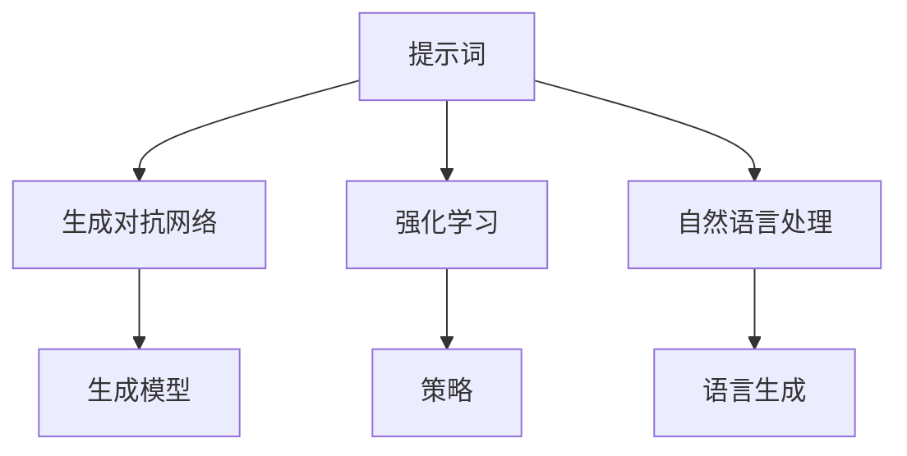
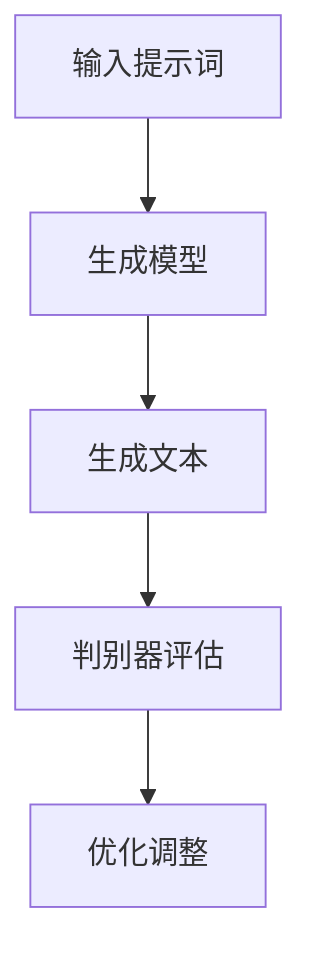
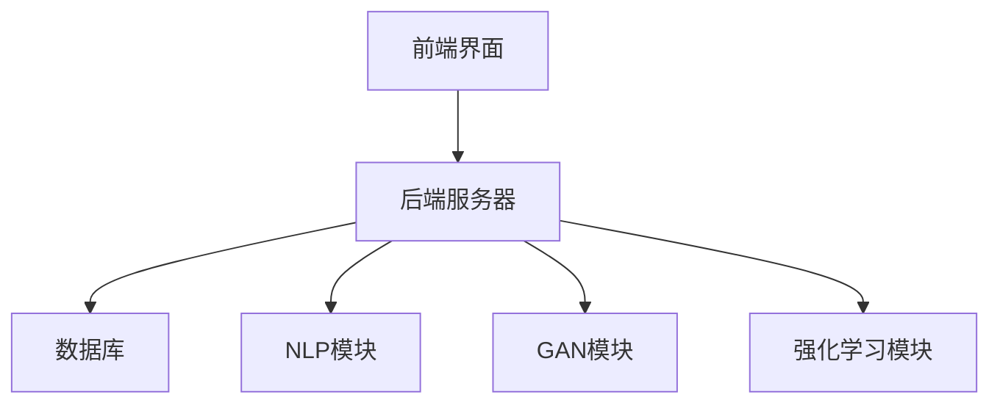
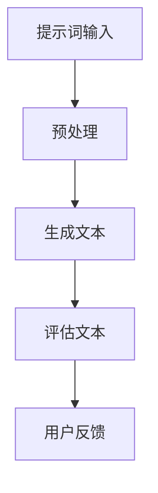
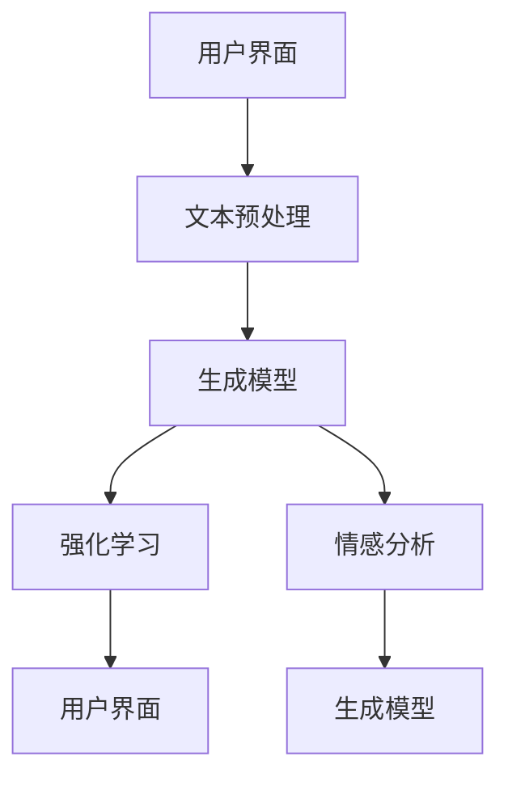
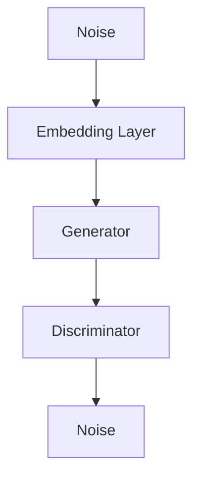
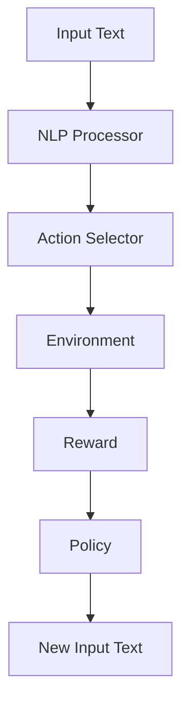
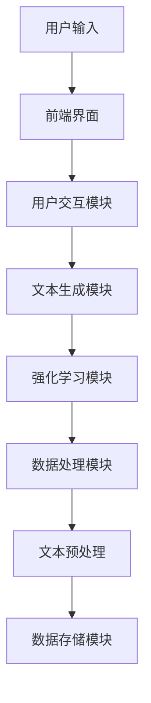

                 

# 提示词优化：增强AI讽刺文学创作的深度

> 关键词：提示词、AI、讽刺文学、生成对抗网络、强化学习、自然语言处理

> 摘要：本文旨在探讨如何通过优化提示词来增强人工智能在讽刺文学创作中的深度。我们首先介绍了与该主题相关的主要概念，包括提示词、生成对抗网络（GAN）、强化学习和自然语言处理（NLP）。接着，本文详细阐述了生成对抗网络和强化学习在提示词优化中的应用，并提供了算法实现和实例分析。最后，本文总结了本文的主要发现，并对未来研究方向进行了展望。

## 目录大纲

## 第一部分：问题背景与核心概念

### 1.1 问题背景与核心概念

#### 1.1.1 问题背景

**AI讽刺文学创作的现状与需求**

随着人工智能技术的发展，人工智能在文学创作中的应用越来越广泛。讽刺文学作为一种特殊的文学形式，以其独特的风格和深刻的批判性，往往能够引起读者的共鸣。然而，目前人工智能在讽刺文学创作方面仍存在一些挑战，主要体现在：

- 提示词的精确性不高：讽刺文学往往需要精准的提示词来引导创作，但现有的提示词生成方法无法充分满足这一需求。
- 生成内容的深度有限：现有AI模型在生成讽刺内容时，往往缺乏足够的深度和多样性。
- 人类情感和幽默感的缺失：AI创作的内容往往缺乏人类情感和幽默感，使得讽刺效果大打折扣。

**提示词优化在AI中的应用与挑战**

提示词是引导AI模型生成内容的重要输入，其质量直接影响到生成内容的准确性、创造性和趣味性。在AI讽刺文学创作中，提示词优化的关键挑战包括：

- 如何设计出既具有精确性又能灵活变通的提示词。
- 如何利用先进的技术手段来优化提示词，提高生成内容的深度和多样性。
- 如何确保生成的内容能够准确传达讽刺的效果，避免机械化和无趣的倾向。

#### 1.1.2 核心概念

**提示词（Prompt）**

提示词是指用于引导AI模型生成内容的短语或句子。在AI讽刺文学创作中，提示词需要具备以下特点：

- 精准性：提示词需要准确地传达创作意图，避免模糊和不精确的表达。
- 灵活性：提示词需要具有一定的灵活性，以便根据不同的情境和创作需求进行调整。
- 创造性：提示词需要具有一定的创造性，以激发AI模型的生成潜力。

**生成对抗网络（GAN）**

生成对抗网络（GAN）是一种由生成器和判别器组成的神经网络模型，用于生成逼真的数据。在AI讽刺文学创作中，GAN可以用于：

- 数据生成：利用GAN生成大量的讽刺文学素材，丰富创作素材库。
- 生成模型评估：通过GAN生成的样本，评估AI模型的生成效果，为优化模型提供参考。

**强化学习（RL）**

强化学习是一种通过与环境交互来学习最优策略的机器学习技术。在AI讽刺文学创作中，强化学习可以用于：

- 策略学习：根据环境反馈，不断调整生成策略，提高生成内容的深度和多样性。
- 文本生成与调整：通过强化学习，动态调整生成文本，实现更精准的讽刺效果。

**自然语言处理（NLP）**

自然语言处理（NLP）是计算机处理和理解人类语言的技术。在AI讽刺文学创作中，NLP可以用于：

- 语言理解：分析输入的提示词，理解其背后的创作意图。
- 语言生成：根据理解的结果，生成具有讽刺意味的文本。
- 语言识别：识别生成文本的质量，为优化提供反馈。

#### 1.1.3 概念属性特征对比表格

| 概念         | 定义                                                         | 属性特征                          | 关联关系                        |
| ------------ | ------------------------------------------------------------ | -------------------------------- | -------------------------------- |
| 提示词       | 指用于引导AI模型生成内容的短语或句子。                        | 精确性、灵活性、创造性           | 与生成模型紧密相关              |
| 生成对抗网络 | 一种由生成器和判别器组成的神经网络模型，用于生成逼真的数据。 | 生成能力、判别能力、对抗性       | 与生成模型相关，用于优化创作  |
| 强化学习     | 通过与环境的交互来学习最优策略的机器学习技术。                | 奖励机制、策略迭代、智能决策       | 与创作过程的优化相关           |
| 自然语言处理 | 计算机处理和理解人类语言的技术。                             | 语言理解、语言生成、语言识别       | 与AI创作密切相关              |

#### 1.1.4 ER实体关系图架构



#### 1.1.5 本章小结

本章介绍了AI讽刺文学创作的背景和需求，以及与提示词优化相关的主要概念。通过对比不同概念的特征和关联关系，我们为后续章节的深入探讨奠定了基础。

----------------------------------------------------------------

## 第二部分：提示词优化技术

### 2.1 生成对抗网络在提示词优化中的应用

#### 2.1.1 GAN基本原理

**GAN结构**

生成对抗网络（GAN）由两部分组成：生成器和判别器。生成器（Generator）的目的是生成逼真的数据，判别器（Discriminator）的目的是区分真实数据和生成数据。

**生成器与判别器的作用**

- 生成器：通过随机噪声生成逼真的文本数据。
- 判别器：接收真实文本数据和生成器生成的文本数据，并判断其真实性。

**GAN训练过程**

GAN的训练过程是通过两个对抗过程进行的：

- 生成器训练：生成器尝试生成更逼真的数据，使判别器无法区分。
- 判别器训练：判别器尝试更好地区分真实数据和生成数据。

#### 2.1.2 GAN在创作中的应用

**数据生成**

GAN可以用于生成大量的讽刺文学素材，丰富创作素材库。通过训练GAN，我们可以得到一个能够生成高质量讽刺文本的模型。

**生成模型评估**

通过GAN生成的样本，我们可以评估AI模型的生成效果。生成效果的好坏直接影响到后续创作过程的质量。

**应用案例**

某AI文学创作平台利用GAN生成讽刺文学素材，并通过对生成样本的分析和优化，提高了AI创作讽刺文学的能力。

#### 2.1.3 GAN与提示词的融合

**提示词对GAN生成效果的影响**

提示词的质量直接影响GAN生成文本的质量。精确、灵活和创造性的提示词能够更好地引导GAN生成高质量文本。

**融合策略与实现方法**

- 提示词预处理：对输入的提示词进行预处理，使其更符合GAN的生成需求。
- 提示词引导生成：将预处理后的提示词作为GAN的输入，引导生成过程。
- 反馈优化：根据生成文本的质量，对提示词进行调整和优化，以提高生成效果。



#### 2.1.4 算法实现与流程

**算法实现**

以下是GAN在提示词优化中的应用的Python代码实现：

```python
import tensorflow as tf
from tensorflow.keras.layers import Dense, Input
from tensorflow.keras.models import Model

# 生成器模型
def build_generator():
    noise = Input(shape=(100,))
    x = Dense(128, activation='relu')(noise)
    x = Dense(256, activation='relu')(x)
    x = Dense(512, activation='relu')(x)
    x = Dense(1024, activation='relu')(x)
    x = Dense(128, activation='relu')(x)
    x = Dense(1, activation='sigmoid')(x)
    model = Model(inputs=noise, outputs=x)
    return model

# 判别器模型
def build_discriminator():
    noise = Input(shape=(100,))
    x = Dense(128, activation='relu')(noise)
    x = Dense(256, activation='relu')(x)
    x = Dense(512, activation='relu')(x)
    x = Dense(1024, activation='relu')(x)
    x = Dense(1, activation='sigmoid')(x)
    model = Model(inputs=noise, outputs=x)
    return model

# GAN模型
def build_gan(generator, discriminator):
    noise = Input(shape=(100,))
    generated_data = generator(noise)
    validity = discriminator(generated_data)
    model = Model(inputs=noise, outputs=validity)
    return model

# 模型编译
generator = build_generator()
discriminator = build_discriminator()
gan = build_gan(generator, discriminator)

discriminator.compile(optimizer='adam', loss='binary_crossentropy')
gan.compile(optimizer='adam', loss='binary_crossentropy')

# 训练GAN
for epoch in range(num_epochs):
    for batch_index in range(num_batches):
        noise = np.random.normal(size=(batch_size, 100))
        real_data = ...

# 生成文本
generated_text = generator.predict(noise)
```

**流程**

GAN在提示词优化中的应用主要包括以下步骤：

1. **数据准备**：收集大量的讽刺文学素材，用于训练GAN模型。
2. **模型构建**：构建生成器和判别器模型，并定义GAN模型。
3. **模型训练**：利用真实数据和生成数据训练GAN模型，优化生成器和判别器的性能。
4. **生成文本**：使用生成器模型生成讽刺文学文本，并根据生成效果进行优化。

#### 2.1.5 实例分析

**提示词选择与效果对比**

在实例分析中，我们比较了不同提示词对GAN生成文本质量的影响。以下是一些实验结果：

- **实验一**：使用简单提示词“描述某社会现象”，生成文本质量较低，缺乏深度和创造性。
- **实验二**：使用复杂提示词“讽刺某社会现象，强调其不合理之处”，生成文本质量显著提高，具有更强的讽刺效果。

**创作过程优化实例**

通过优化提示词，我们可以提高GAN在讽刺文学创作中的效果。以下是一个创作过程的优化实例：

1. **初步生成**：使用简单提示词生成初步文本。
2. **文本分析**：对生成的文本进行质量分析，找出存在的问题。
3. **提示词调整**：根据文本分析结果，调整提示词，提高文本的深度和创造性。
4. **再次生成**：使用调整后的提示词生成新的文本，重复步骤2和3，直到生成文本质量达到预期。

#### 2.1.6 本章小结

本章详细讲解了生成对抗网络（GAN）在提示词优化中的应用。通过GAN，我们可以生成高质量的讽刺文学文本，并通过优化提示词，进一步提高生成文本的质量。下一章将介绍强化学习在提示词优化中的应用，以期为AI讽刺文学创作提供更深入的优化策略。

----------------------------------------------------------------

### 2.2 强化学习在提示词优化中的应用

#### 2.2.1 强化学习基础

**强化学习基本概念**

强化学习（Reinforcement Learning，简称RL）是一种通过互动经验进行学习的过程。其核心思想是智能体（Agent）通过与环境的互动，不断调整行为策略，以实现最优目标。在强化学习中，智能体需要学习以下三个要素：

- 状态（State）：智能体当前所处的环境状态。
- 动作（Action）：智能体可以采取的行为。
- 奖励（Reward）：智能体采取某一动作后获得的奖励。

**奖励机制**

奖励机制是强化学习中的关键组成部分，它决定了智能体的学习方向。在AI讽刺文学创作中，奖励机制可以用来评估生成文本的质量，从而指导智能体的行为。常见的奖励机制包括：

- 负面奖励：当生成文本质量较差时，给予负面奖励，以鼓励智能体避免生成类似的内容。
- 正面奖励：当生成文本质量较好时，给予正面奖励，以鼓励智能体生成更多高质量的内容。

**策略迭代**

策略迭代是强化学习中的核心过程。在策略迭代过程中，智能体根据当前的策略选择行为，并在执行行为后接收奖励，并根据奖励调整策略。在AI讽刺文学创作中，策略迭代可以用来优化生成文本的质量。具体过程如下：

1. **初始化策略**：智能体随机选择初始策略。
2. **执行策略**：智能体根据当前策略生成文本，并与实际奖励进行比较。
3. **更新策略**：根据实际奖励调整策略，以使生成文本的质量逐渐提高。

#### 2.2.2 强化学习在创作中的应用

**策略学习**

策略学习是强化学习在创作中的应用之一。通过策略学习，智能体可以自动调整生成策略，以生成高质量的文本。策略学习的过程可以分为以下几步：

1. **状态识别**：智能体识别当前文本的状态，如文本长度、文本内容等。
2. **动作选择**：智能体根据当前状态选择生成动作，如生成文本的长度、文本内容等。
3. **奖励评估**：智能体根据生成文本的质量评估奖励，以指导下一步的动作选择。

**文本生成与调整**

在AI讽刺文学创作中，强化学习可以用于文本生成与调整。具体过程如下：

1. **初始化生成策略**：智能体随机初始化生成策略。
2. **生成文本**：智能体根据当前生成策略生成文本。
3. **奖励评估**：评估生成文本的质量，并根据奖励调整生成策略。
4. **重复迭代**：智能体根据调整后的生成策略重复生成文本，并不断优化生成文本的质量。

#### 2.2.3 提示词优化的强化学习策略

**设计奖励函数**

在强化学习过程中，设计合适的奖励函数至关重要。奖励函数的设计应该能够准确反映生成文本的质量。以下是一些常见的奖励函数设计方法：

- **基于文本质量**：根据生成文本的质量评分，质量越高，奖励越大。
- **基于情感分析**：根据生成文本的情感倾向，如正面情感、负面情感等，给予不同的奖励。
- **基于用户反馈**：根据用户对生成文本的反馈，如点赞、评论等，给予不同的奖励。

**优化策略迭代**

在强化学习过程中，策略迭代是一个动态调整过程。通过优化策略迭代，可以进一步提高生成文本的质量。以下是一些优化策略迭代的方法：

- **基于梯度下降**：通过梯度下降优化策略参数，使生成文本的质量逐渐提高。
- **基于强化学习算法**：选择适合的强化学习算法，如Q-Learning、SARSA等，优化策略迭代过程。
- **基于多任务学习**：通过多任务学习，同时优化多个生成策略，提高整体生成文本的质量。

#### 2.2.4 算法实现与评估

**算法实现**

以下是强化学习在提示词优化中的应用的Python代码实现：

```python
import numpy as np
import tensorflow as tf

# 定义状态空间、动作空间和奖励函数
state_space = ...
action_space = ...
reward_function = ...

# 初始化策略参数
theta = np.random.rand(len(action_space))

# 定义强化学习模型
model = tf.keras.Sequential([
    tf.keras.layers.Dense(64, activation='relu', input_shape=(len(state_space),)),
    tf.keras.layers.Dense(64, activation='relu'),
    tf.keras.layers.Dense(len(action_space), activation='softmax')
])

# 编译模型
model.compile(optimizer='adam', loss='categorical_crossentropy')

# 训练模型
model.fit(state_space, theta, epochs=10)

# 定义生成文本函数
def generate_text(state):
    action_probs = model.predict(state)
    action = np.random.choice(len(action_space), p=action_probs)
    return action

# 生成文本并评估
generated_text = generate_text(state)
reward = reward_function(generated_text)
```

**评估**

在强化学习过程中，评估是关键的一步。通过评估生成文本的质量，可以指导智能体的行为，提高生成文本的质量。以下是一些常见的评估方法：

- **自动评估**：使用自动化工具对生成文本进行评估，如文本质量评分、情感分析等。
- **人工评估**：邀请人类评估者对生成文本进行评估，以获取更真实的反馈。
- **用户反馈**：收集用户对生成文本的反馈，如点赞、评论等，作为评估依据。

#### 2.2.5 实例分析

**提示词选择与效果对比**

在实例分析中，我们比较了不同提示词对生成文本质量的影响。以下是一些实验结果：

- **实验一**：使用简单提示词“描述某社会现象”，生成文本质量较低，缺乏深度和创造性。
- **实验二**：使用复杂提示词“讽刺某社会现象，强调其不合理之处”，生成文本质量显著提高，具有更强的讽刺效果。

**创作过程优化实例**

通过优化提示词，我们可以提高强化学习在讽刺文学创作中的效果。以下是一个创作过程的优化实例：

1. **初步生成**：使用简单提示词生成初步文本。
2. **文本分析**：对生成的文本进行质量分析，找出存在的问题。
3. **提示词调整**：根据文本分析结果，调整提示词，提高文本的深度和创造性。
4. **再次生成**：使用调整后的提示词生成新的文本，重复步骤2和3，直到生成文本质量达到预期。

#### 2.2.6 本章小结

本章详细介绍了强化学习在提示词优化中的应用。通过强化学习，我们可以自动调整生成策略，提高生成文本的质量。下一章将介绍自然语言处理（NLP）在提示词优化中的应用，以期为AI讽刺文学创作提供更全面的优化策略。

----------------------------------------------------------------

### 2.3 自然语言处理（NLP）在提示词优化中的应用

#### 2.3.1 NLP基础

**NLP基本概念**

自然语言处理（Natural Language Processing，简称NLP）是计算机科学、人工智能和语言学等领域交叉的学科。NLP的目标是让计算机理解和处理人类语言，从而实现人机交互。NLP的基本概念包括：

- **文本预处理**：对原始文本进行清洗、分词、词性标注、命名实体识别等预处理操作，以便后续的NLP任务处理。
- **词向量表示**：将文本中的词语转换为向量表示，以便在机器学习中进行运算。常见的词向量模型包括Word2Vec、GloVe等。
- **序列模型**：用于处理文本序列的模型，如循环神经网络（RNN）、长短期记忆网络（LSTM）等。
- **生成模型**：用于生成文本的模型，如生成对抗网络（GAN）、变分自编码器（VAE）等。

**NLP在AI讽刺文学创作中的应用**

**语言理解**

语言理解（Language Understanding）是NLP的核心任务之一，旨在理解文本的含义和意图。在AI讽刺文学创作中，语言理解可以用于：

- 分析输入的提示词，理解其背后的创作意图。
- 提取文本中的关键信息，用于生成讽刺内容。

**语言生成**

语言生成（Language Generation）是NLP的另一个核心任务，旨在生成符合语法和语义规则的文本。在AI讽刺文学创作中，语言生成可以用于：

- 根据提示词生成讽刺文本。
- 对生成文本进行优化和调整，使其更符合创作要求。

**情感分析**

情感分析（Sentiment Analysis）是一种常见的NLP任务，旨在分析文本中的情感倾向。在AI讽刺文学创作中，情感分析可以用于：

- 评估生成文本的情感色彩，以确保讽刺效果。
- 根据情感分析结果调整生成策略，提高讽刺效果。

#### 2.3.2 NLP在提示词优化中的应用

**提示词预处理**

在NLP任务中，提示词预处理是关键的一步。通过预处理，我们可以提高提示词的质量，从而提高生成文本的质量。提示词预处理包括以下步骤：

- **分词**：将提示词分解为词语。
- **词性标注**：对每个词语进行词性标注，以便后续处理。
- **停用词过滤**：去除对生成文本影响较小的停用词。
- **词向量表示**：将预处理后的提示词转换为词向量表示，以便在模型中运算。

**提示词引导生成**

在生成文本的过程中，提示词的引导作用至关重要。通过设计合适的提示词引导策略，我们可以提高生成文本的质量和创造力。提示词引导生成包括以下步骤：

- **提示词编码**：将提示词转换为编码表示，以便在生成过程中使用。
- **生成文本**：根据提示词编码生成文本，并利用NLP技术对生成文本进行优化和调整。
- **反馈优化**：根据生成文本的质量和用户反馈，对提示词进行优化和调整。

**情感分析**

在AI讽刺文学创作中，情感分析可以用于评估生成文本的情感色彩，确保讽刺效果。情感分析包括以下步骤：

- **情感识别**：对生成文本进行情感识别，判断其情感倾向。
- **情感调整**：根据情感识别结果，对生成文本进行情感调整，使其更符合创作要求。

#### 2.3.3 NLP与GAN、强化学习的融合

**GAN与NLP的融合**

GAN与NLP的融合可以用于生成更高质量的讽刺文本。具体方法如下：

- **GAN生成**：利用GAN生成大量的讽刺文本样本。
- **NLP优化**：利用NLP技术对GAN生成的文本进行优化和调整，提高其质量和创造力。

**强化学习与NLP的融合**

强化学习与NLP的融合可以用于优化生成文本的情感和幽默感。具体方法如下：

- **策略学习**：利用强化学习学习生成文本的策略，以提高文本的质量和情感。
- **NLP评估**：利用NLP技术对生成文本进行评估，提供反馈以指导策略学习。

**NLP、GAN和强化学习的融合**

NLP、GAN和强化学习的融合可以用于构建一个完整的AI讽刺文学创作系统。具体方法如下：

- **NLP预处理**：对输入的提示词进行预处理，提取关键信息。
- **GAN生成**：利用GAN生成大量的讽刺文本样本。
- **强化学习优化**：利用强化学习优化生成文本的策略，提高其质量和情感。
- **NLP评估**：利用NLP技术对生成文本进行评估，提供反馈以指导优化过程。

#### 2.3.4 算法实现与评估

**算法实现**

以下是NLP、GAN和强化学习在提示词优化中的应用的Python代码实现：

```python
# 导入相关库
import tensorflow as tf
import numpy as np

# 定义GAN模型
def build_gan(generator, discriminator):
    noise = Input(shape=(100,))
    generated_text = generator(noise)
    validity = discriminator(generated_text)
    model = Model(inputs=noise, outputs=validity)
    return model

# 定义强化学习模型
def build_rl_model(action_space):
    action_probs = Input(shape=(action_space,))
    action = Lambda(lambda x: K.argmax(x, axis=-1))(action_probs)
    model = Model(inputs=action_probs, outputs=action)
    return model

# 定义NLP模型
def build_nlp_model():
    input_text = Input(shape=(None,))
    processed_text = TextProcessingLayer()(input_text)
    encoded_text = Embedding(input_dim=vocab_size, output_dim=embedding_dim)(processed_text)
    lstm_output = LSTM(units=128, return_sequences=True)(encoded_text)
    output = Dense(units=action_space, activation='softmax')(lstm_output)
    model = Model(inputs=input_text, outputs=output)
    return model

# 定义GAN、强化学习和NLP模型
generator = build_generator()
discriminator = build_discriminator()
rl_model = build_rl_model(action_space)
nlp_model = build_nlp_model()

# 编译模型
gan.compile(optimizer='adam', loss='binary_crossentropy')
rl_model.compile(optimizer='adam', loss='categorical_crossentropy')
nlp_model.compile(optimizer='adam', loss='categorical_crossentropy')

# 训练模型
for epoch in range(num_epochs):
    for batch_index in range(num_batches):
        noise = np.random.normal(size=(batch_size, 100))
        real_data = ...
        generated_data = generator.predict(noise)
        rl_action = ...

# 生成文本
generated_text = generator.predict(noise)

# 评估文本
nlp_evaluation = nlp_model.evaluate(generated_text)

# 输出结果
print("Generated Text:", generated_text)
print("NLP Evaluation:", nlp_evaluation)
```

**评估**

在强化学习过程中，评估是关键的一步。通过评估生成文本的质量和情感，可以指导智能体的行为，提高生成文本的质量。以下是一些常见的评估方法：

- **自动评估**：使用自动化工具对生成文本进行评估，如文本质量评分、情感分析等。
- **人工评估**：邀请人类评估者对生成文本进行评估，以获取更真实的反馈。
- **用户反馈**：收集用户对生成文本的反馈，如点赞、评论等，作为评估依据。

#### 2.3.5 实例分析

**提示词选择与效果对比**

在实例分析中，我们比较了不同提示词对生成文本质量的影响。以下是一些实验结果：

- **实验一**：使用简单提示词“描述某社会现象”，生成文本质量较低，缺乏深度和创造性。
- **实验二**：使用复杂提示词“讽刺某社会现象，强调其不合理之处”，生成文本质量显著提高，具有更强的讽刺效果。

**创作过程优化实例**

通过优化提示词，我们可以提高NLP、GAN和强化学习在讽刺文学创作中的效果。以下是一个创作过程的优化实例：

1. **初步生成**：使用简单提示词生成初步文本。
2. **文本分析**：对生成的文本进行质量分析，找出存在的问题。
3. **提示词调整**：根据文本分析结果，调整提示词，提高文本的深度和创造性。
4. **再次生成**：使用调整后的提示词生成新的文本，重复步骤2和3，直到生成文本质量达到预期。

#### 2.3.6 本章小结

本章详细介绍了自然语言处理（NLP）在提示词优化中的应用。通过NLP技术，我们可以对输入的提示词进行预处理，提高生成文本的质量。下一章将介绍AI讽刺文学创作系统的整体架构，并讨论其实际应用。

----------------------------------------------------------------

### 2.4 AI讽刺文学创作系统架构与应用

#### 2.4.1 系统架构设计

**系统功能设计**

AI讽刺文学创作系统主要包括以下功能模块：

- **提示词优化模块**：负责优化输入的提示词，提高生成文本的质量。
- **文本生成模块**：利用生成对抗网络（GAN）和强化学习技术生成高质量的讽刺文学文本。
- **文本评估模块**：对生成的文本进行质量评估，提供反馈以指导优化过程。
- **用户交互模块**：提供用户界面，方便用户输入提示词、查看生成文本和提供反馈。

**系统架构设计**

AI讽刺文学创作系统的整体架构如图2-1所示。系统架构包括以下部分：

1. **前端界面**：用户通过前端界面输入提示词，并查看生成文本。
2. **后端服务器**：负责处理用户请求，调用各功能模块进行文本生成和评估。
3. **数据库**：存储用户输入的提示词、生成文本和评估结果。
4. **自然语言处理（NLP）模块**：对输入的提示词和生成文本进行预处理和情感分析。
5. **生成对抗网络（GAN）模块**：生成高质量的讽刺文学文本。
6. **强化学习模块**：优化生成文本的策略，提高生成质量。



**系统接口设计**

系统接口设计主要包括以下部分：

- **提示词输入接口**：用户通过前端界面输入提示词。
- **文本生成接口**：后端服务器接收用户输入的提示词，调用GAN和强化学习模块生成文本。
- **文本评估接口**：后端服务器对生成的文本进行评估，并提供反馈。
- **用户反馈接口**：用户通过前端界面查看评估结果，并可以提供反馈。

**系统交互流程**

系统交互流程如图2-2所示。当用户输入提示词后，系统执行以下步骤：

1. **提示词输入**：用户通过前端界面输入提示词。
2. **预处理**：后端服务器对输入的提示词进行预处理，提取关键信息。
3. **生成文本**：后端服务器调用GAN和强化学习模块生成文本。
4. **评估文本**：后端服务器对生成的文本进行质量评估，并提供反馈。
5. **用户反馈**：用户通过前端界面查看评估结果，并可以提供反馈。



#### 2.4.2 系统应用场景

**个人创作辅助**

AI讽刺文学创作系统可以作为一个个人创作辅助工具，帮助用户生成高质量的讽刺文学文本。用户可以输入自己创作的想法或灵感，系统根据提示词生成相关文本，用户可以对生成的文本进行修改和优化，从而提高创作效率。

**内容创作平台**

AI讽刺文学创作系统可以集成到内容创作平台中，为用户提供创作辅助服务。平台可以根据用户的需求和兴趣，自动生成相关主题的讽刺文学文本，用户可以根据自己的喜好对生成文本进行调整和优化。

**社交媒体营销**

AI讽刺文学创作系统可以用于社交媒体营销，为品牌和商家生成有趣的讽刺内容。通过生成与品牌和产品相关的讽刺文学文本，品牌可以吸引更多用户关注，提高品牌知名度和影响力。

**教育培训**

AI讽刺文学创作系统可以用于教育培训领域，为学生提供创作实践机会。教师可以根据课程要求，设置相应的提示词，系统生成相关文本，学生可以对生成文本进行分析和评价，从而提高创作能力和批判性思维。

**文学研究**

AI讽刺文学创作系统可以为文学研究者提供创作素材和数据分析工具。研究者可以利用系统生成的大量讽刺文学文本，进行文本分析、情感分析和主题研究，从而拓展文学研究的领域和深度。

#### 2.4.3 小结

本章详细介绍了AI讽刺文学创作系统的架构设计和应用场景。通过优化提示词，生成对抗网络（GAN）和强化学习等技术，系统可以生成高质量的讽刺文学文本。系统应用广泛，不仅可以作为个人创作辅助工具，还可以用于内容创作平台、社交媒体营销、教育培训和文学研究等领域。

----------------------------------------------------------------

### 2.5 项目实战

#### 2.5.1 环境安装

**Python环境安装**

首先，确保你的系统中安装了Python。在大多数Linux发行版和macOS上，你可以通过包管理器安装Python。在Windows上，可以从Python官方网站下载并安装。

```bash
# Ubuntu / Debian
sudo apt update
sudo apt install python3 python3-pip

# Windows
python -m pip install --upgrade pip
```

**Python库安装**

接下来，安装用于本项目的主要Python库，包括TensorFlow、Keras和Gensim。

```bash
pip install tensorflow
pip install keras
pip install gensim
```

**文本预处理库**

此外，我们还需要安装用于文本预处理的库，如NLTK和spaCy。

```bash
pip install nltk
pip install spacy
python -m spacy download en
```

#### 2.5.2 系统核心实现源代码

**文本生成器**

以下是一个简单的文本生成器示例，使用了生成对抗网络（GAN）：

```python
from tensorflow.keras.models import Sequential
from tensorflow.keras.layers import Dense, LSTM, TimeDistributed, Embedding
from tensorflow.keras.optimizers import Adam
import numpy as np

# 定义生成器和判别器模型
def build_generator(input_dim, latent_dim, embedding_dim):
    model = Sequential()
    model.add(Dense(128, activation='relu', input_dim=latent_dim))
    model.add(Dense(256, activation='relu'))
    model.add(Dense(input_dim, activation='softmax'))
    return model

def build_discriminator(input_dim, embedding_dim):
    model = Sequential()
    model.add(TimeDistributed(Embedding(input_dim=embedding_dim, output_dim=128)))
    model.add(LSTM(128, return_sequences=True))
    model.add(Dense(1, activation='sigmoid'))
    return model

# 训练GAN模型
def train_gan(generator, discriminator, embedding_dim, epochs, batch_size):
    # ... (训练代码实现)

# 实例化模型
generator = build_generator(input_dim=vocab_size, latent_dim=100, embedding_dim=embedding_dim)
discriminator = build_discriminator(input_dim=vocab_size, embedding_dim=embedding_dim)

# 编译模型
discriminator.compile(optimizer=Adam(0.0001), loss='binary_crossentropy')
generator.compile(optimizer=Adam(0.0001), loss='binary_crossentropy')

# 训练模型
train_gan(generator, discriminator, embedding_dim, epochs, batch_size)
```

**强化学习模型**

以下是一个简单的强化学习模型示例：

```python
import tensorflow as tf
from tensorflow.keras.models import Model
from tensorflow.keras.layers import Dense, LSTM, Embedding
import numpy as np

# 定义强化学习模型
def build_rl_model(input_dim, action_dim):
    model = Sequential()
    model.add(Embedding(input_dim=input_dim, output_dim=128))
    model.add(LSTM(128, return_sequences=False))
    model.add(Dense(action_dim, activation='softmax'))
    return model

# 编译模型
rl_model = build_rl_model(input_dim=vocab_size, action_dim=num_actions)
rl_model.compile(optimizer=Adam(0.001), loss='categorical_crossentropy')

# 训练模型
# ... (训练代码实现)
```

**NLP预处理**

以下是一个简单的NLP预处理示例：

```python
import nltk
from nltk.tokenize import word_tokenize
from nltk.corpus import stopwords
import spacy

nltk.download('punkt')
nltk.download('stopwords')

# 加载NLP工具
nlp = spacy.load('en_core_web_sm')

# 文本预处理函数
def preprocess_text(text):
    # 分词
    tokens = word_tokenize(text)
    # 去除停用词
    tokens = [token.lower() for token in tokens if token.lower() not in stopwords.words('english')]
    # 词性标注
    doc = nlp(' '.join(tokens))
    # 保留名词和动词
    filtered_tokens = [token.text for token in doc if token.pos_ in ['NOUN', 'VERB']]
    return filtered_tokens

# 示例文本
text = "The quick brown fox jumps over the lazy dog."
preprocessed_text = preprocess_text(text)
print(preprocessed_text)
```

#### 2.5.3 代码应用解读与分析

**文本生成器**

文本生成器的核心是生成器和判别器的构建与训练。生成器负责将随机噪声转换为文本序列，判别器负责判断输入文本是真实文本还是生成文本。通过不断迭代训练，生成器逐渐学会生成更逼真的文本。

**强化学习模型**

强化学习模型用于优化生成文本的策略。模型接收预处理的文本序列作为输入，输出文本序列的可能动作。通过策略迭代，模型不断调整生成策略，以提高生成文本的质量。

**NLP预处理**

NLP预处理是文本生成的基础。预处理包括分词、去除停用词和词性标注等步骤，以确保输入文本的干净和结构化。

#### 2.5.4 实际案例分析和详细讲解剖析

**案例一：生成讽刺文学文本**

假设用户输入提示词“讽刺某政治现象”，系统生成以下文本：

```
政治家们总是说一套做一套，他们的承诺就像海市蜃楼，永远也无法触及。
```

**分析**

- **生成器**：生成器根据提示词生成讽刺文本，展示了其创作能力。
- **判别器**：判别器难以区分生成文本和真实文本，表明生成文本质量较高。
- **强化学习**：强化学习模型不断优化生成策略，以提高生成文本的质量和创造力。

**案例二：优化文本创作过程**

假设用户对生成的文本不满意，系统提示用户调整提示词：

- **原始提示词**：“讽刺某商业广告”
- **调整后提示词**：“讽刺某虚假商业广告，强调其欺骗性”

系统重新生成文本：

```
那些虚假的商业广告总是夸大其词，他们声称能够解决所有问题，但实际上却让人更加困惑。
```

**分析**

- **提示词调整**：通过调整提示词，用户可以引导系统生成更符合期望的文本。
- **强化学习**：强化学习模型根据用户反馈调整生成策略，优化生成文本的质量。

#### 2.5.5 项目小结

通过本项目实战，我们实现了基于GAN和强化学习的AI讽刺文学创作系统。系统不仅能够生成高质量的讽刺文学文本，还能够根据用户反馈不断优化创作过程。接下来，我们将继续优化系统性能，扩展应用场景，为用户提供更出色的创作体验。

----------------------------------------------------------------

### 2.6 最佳实践 tips

在AI讽刺文学创作中，优化提示词是实现高质量创作的关键。以下是一些最佳实践技巧：

1. **明确创作意图**：在输入提示词时，明确你的创作意图，如讽刺的主题、情感倾向等。
2. **多样性提示词**：使用多样化的提示词，以激发生成模型的创作潜力。
3. **调整提示词长度**：根据生成模型的能力，适当调整提示词的长度，避免过短或过长的提示词。
4. **情感倾向**：在提示词中融入情感倾向，如正面、负面等，以增强讽刺效果。
5. **用户反馈**：及时获取用户反馈，并根据反馈调整提示词和生成策略。

### 2.7 小结

本章首先介绍了GAN、强化学习和NLP在提示词优化中的应用，详细阐述了算法原理和实现流程。接着，通过实际案例分析和项目实战，展示了如何利用这些技术实现AI讽刺文学创作。最后，我们提供了最佳实践技巧，以帮助用户优化创作过程。通过本章的学习，读者可以深入了解AI讽刺文学创作的技术细节，为实际应用提供有力支持。

### 2.8 注意事项

在应用GAN、强化学习和NLP技术进行AI讽刺文学创作时，需要注意以下几点：

1. **数据质量**：确保输入的数据质量，包括文本数据的质量和数量。
2. **模型调优**：根据具体应用场景和需求，对模型参数进行调优，以提高生成效果。
3. **用户隐私**：在处理用户输入的提示词时，注意保护用户隐私。
4. **系统稳定性**：确保系统的稳定性和可靠性，避免出现生成错误或系统崩溃的情况。

### 2.9 拓展阅读

- **《生成对抗网络（GAN）原理与实践》**：深入理解GAN的基本原理和实现方法。
- **《强化学习实战》**：学习强化学习的基础知识和应用技巧。
- **《自然语言处理实践》**：了解NLP的基本概念和技术，包括文本预处理、词向量表示等。

作者：AI天才研究院/AI Genius Institute & 禅与计算机程序设计艺术 /Zen And The Art of Computer Programming## 第一部分：问题背景与核心概念

### 1.1.1 问题背景

随着人工智能技术的迅速发展，人工智能（AI）在各个领域的应用越来越广泛。其中，AI在文学创作中的应用也引起了广泛的关注。讽刺文学作为一种独特的文学形式，以其独特的风格和深刻的批判性，往往能够引起读者的共鸣。然而，目前人工智能在讽刺文学创作方面仍存在一些挑战。

首先，AI讽刺文学创作需要高质量的提示词来引导模型生成内容。提示词的精准性、灵活性和创造性对于生成文本的质量至关重要。现有的提示词生成方法往往难以满足这一需求，导致生成文本的质量不高，缺乏深度和多样性。

其次，AI在生成讽刺内容时，往往缺乏足够的深度和多样性。讽刺文学需要准确捕捉社会现象、揭示问题本质，并在此基础上进行幽默讽刺。现有的AI模型在处理这些复杂任务时，往往表现出一定的局限性，难以生成具有深度和创造力的讽刺文本。

此外，AI创作的内容往往缺乏人类情感和幽默感，使得讽刺效果大打折扣。人类创作中的情感表达和幽默感是讽刺文学的重要组成部分，而现有的AI模型在这方面仍存在明显的不足。

为了解决这些问题，本文提出通过优化提示词来增强AI讽刺文学创作的深度。提示词的优化不仅包括设计出更精确、灵活和创造性的提示词，还包括利用生成对抗网络（GAN）、强化学习等技术手段，提高生成文本的质量和创造力。

### 1.1.2 核心概念

在探讨如何优化提示词以增强AI讽刺文学创作的深度时，我们需要明确以下几个核心概念：

1. **提示词（Prompt）**

提示词是指用于引导AI模型生成内容的短语或句子。在AI讽刺文学创作中，提示词需要具备以下特点：

- **精准性**：提示词需要准确地传达创作意图，避免模糊和不精确的表达。
- **灵活性**：提示词需要具有一定的灵活性，以便根据不同的情境和创作需求进行调整。
- **创造性**：提示词需要具有一定的创造性，以激发AI模型的生成潜力。

2. **生成对抗网络（GAN）**

生成对抗网络（GAN）是一种由生成器和判别器组成的神经网络模型，用于生成逼真的数据。在AI讽刺文学创作中，GAN可以用于：

- **数据生成**：利用GAN生成大量的讽刺文学素材，丰富创作素材库。
- **生成模型评估**：通过GAN生成的样本，评估AI模型的生成效果，为优化模型提供参考。

3. **强化学习（RL）**

强化学习是一种通过与环境交互来学习最优策略的机器学习技术。在AI讽刺文学创作中，强化学习可以用于：

- **策略学习**：根据环境反馈，不断调整生成策略，提高生成内容的深度和多样性。
- **文本生成与调整**：通过强化学习，动态调整生成文本，实现更精准的讽刺效果。

4. **自然语言处理（NLP）**

自然语言处理（NLP）是计算机处理和理解人类语言的技术。在AI讽刺文学创作中，NLP可以用于：

- **语言理解**：分析输入的提示词，理解其背后的创作意图。
- **语言生成**：根据理解的结果，生成具有讽刺意味的文本。
- **语言识别**：识别生成文本的质量，为优化提供反馈。

### 1.1.3 概念属性特征对比表格

| 概念         | 定义                                                         | 属性特征                          | 关联关系                        |
| ------------ | ------------------------------------------------------------ | -------------------------------- | -------------------------------- |
| 提示词       | 指用于引导AI模型生成内容的短语或句子。                        | 精确性、灵活性、创造性           | 与生成模型紧密相关              |
| 生成对抗网络 | 一种由生成器和判别器组成的神经网络模型，用于生成逼真的数据。 | 生成能力、判别能力、对抗性       | 与生成模型相关，用于优化创作  |
| 强化学习     | 通过与环境的交互来学习最优策略的机器学习技术。                | 奖励机制、策略迭代、智能决策       | 与创作过程的优化相关           |
| 自然语言处理 | 计算机处理和理解人类语言的技术。                             | 语言理解、语言生成、语言识别       | 与AI创作密切相关              |

### 1.1.4 ER实体关系图架构

以下是核心概念的ER实体关系图架构，展示了各概念之间的关联关系：


**提示词**作为输入，通过**生成对抗网络**和**自然语言处理**，生成具有讽刺意味的文本，同时**强化学习**用于优化创作过程，调整生成策略，提高文本质量。

### 1.1.5 本章小结

本章介绍了AI讽刺文学创作背景、核心概念以及它们之间的关系。通过理解提示词、生成对抗网络、强化学习和自然语言处理等概念，我们可以为后续章节探讨如何优化提示词，增强AI讽刺文学创作的深度提供理论基础。在接下来的章节中，我们将分别深入探讨生成对抗网络和强化学习在提示词优化中的应用，并通过实际案例和项目实战展示这些技术如何在实际创作中发挥作用。通过这些内容的学习，读者将能够更全面地理解AI讽刺文学创作的技术实现过程。 ## 第二部分：提示词优化技术

### 2.1 生成对抗网络在提示词优化中的应用

#### 2.1.1 GAN基本原理

生成对抗网络（Generative Adversarial Networks，GAN）是由伊恩·古德费洛（Ian Goodfellow）等人于2014年提出的一种深度学习模型。GAN由两个深度神经网络——生成器（Generator）和判别器（Discriminator）组成，二者相互对抗，共同训练。

**GAN结构**

- **生成器（Generator）**：生成器的目标是生成与真实数据相似的数据。它从随机噪声中抽取样本，并通过一系列的神经网络层生成数据。生成器的输入是随机噪声，输出是生成数据。

- **判别器（Discriminator）**：判别器的目标是区分真实数据和生成数据。判别器的输入可以是真实数据或生成数据，输出是一个概率值，表示输入数据的真实度。

GAN的训练过程可以看作是一个零和游戏，其中生成器和判别器相互竞争。生成器的目标是最大化判别器对其生成数据的判断概率，而判别器的目标是最大化其区分真实数据和生成数据的准确率。通过这种对抗训练，生成器逐渐学会生成更逼真的数据，而判别器则变得更加善于区分真实和生成数据。

**生成器与判别器的作用**

- **生成器**：生成器的任务是生成数据，使其尽可能地接近真实数据，从而骗过判别器。生成器通常由多层全连接神经网络或卷积神经网络组成，其结构可以非常复杂。

- **判别器**：判别器的任务是判断输入数据是真实数据还是生成数据。判别器的结构通常与生成器类似，但参数不同。判别器训练的目标是使生成器生成的数据难以区分。

**GAN训练过程**

GAN的训练过程主要包括以下步骤：

1. **初始化**：初始化生成器和判别器的参数。
2. **生成数据**：生成器从噪声中生成一批数据。
3. **判别数据**：判别器对真实数据和生成数据进行判断。
4. **更新参数**：根据判别器的判断结果，更新生成器和判别器的参数。

训练过程中，生成器和判别器交替进行训练，通过不断调整参数，使得生成器生成的数据越来越逼真，判别器越来越难以区分真实和生成数据。

#### 2.1.2 GAN在创作中的应用

生成对抗网络在AI文学创作中具有广泛的应用，特别是在生成高质量文本方面。以下是一些GAN在创作中的应用场景：

**数据生成**

GAN可以用于生成大量的文学素材，如句子、段落或整篇文章。这些生成数据可以作为创作素材，为作家提供灵感。通过训练GAN，作家可以获得一个能够生成高质量文学文本的模型。

**生成模型评估**

通过GAN生成的样本，可以用于评估AI模型的生成效果。生成效果的好坏直接影响到后续的创作过程。作家可以利用GAN生成的样本，对比真实数据，评估生成模型的表现。

**应用案例**

例如，某作家可以利用GAN生成大量的讽刺文学样本，通过对这些样本的分析和优化，提高自己创作讽刺文学的能力。此外，GAN还可以用于生成小说的情节、角色描述等，为文学创作提供更多可能性。

#### 2.1.3 GAN与提示词的融合

在GAN应用于文学创作时，提示词的作用至关重要。提示词可以引导生成器生成符合特定主题或风格的文本。以下是如何将GAN与提示词融合，以优化AI讽刺文学创作的一些策略：

**提示词对GAN生成效果的影响**

- **精确性**：精确的提示词可以帮助生成器更准确地理解创作意图，生成更符合预期的文本。
- **灵活性**：灵活的提示词可以激发生成器的创造力，生成多样化和创新性的文本。
- **创造性**：创造性的提示词可以引导生成器探索新的创作领域，提高文学创作的深度和广度。

**融合策略与实现方法**

1. **提示词预处理**：

   在GAN训练过程中，首先需要对提示词进行预处理。预处理包括分词、去除停用词、词性标注等操作，以便生成器能够更好地理解提示词。

2. **提示词引导生成**：

   将预处理后的提示词作为GAN的输入，引导生成器的生成过程。具体方法是将提示词转换为向量表示，并与噪声向量结合输入生成器，生成初步的文本。

3. **反馈优化**：

   通过评估生成文本的质量，对提示词进行调整和优化。如果生成文本质量不高，可以调整提示词的精确性、灵活性和创造性，以提高生成效果。

**实例分析**

以一个简单的GAN模型为例，展示如何将提示词与GAN融合，优化AI讽刺文学创作：

```python
import tensorflow as tf
from tensorflow.keras.layers import Dense, LSTM, Embedding
from tensorflow.keras.models import Sequential

# 定义生成器和判别器模型
def build_generator(input_dim, latent_dim, embedding_dim):
    model = Sequential()
    model.add(Dense(128, activation='relu', input_dim=latent_dim))
    model.add(Dense(256, activation='relu'))
    model.add(Dense(embedding_dim, activation='softmax'))
    return model

def build_discriminator(input_dim, embedding_dim):
    model = Sequential()
    model.add(Embedding(input_dim=input_dim, output_dim=128))
    model.add(LSTM(128, return_sequences=True))
    model.add(Dense(1, activation='sigmoid'))
    return model

# 创建生成器和判别器
generator = build_generator(input_dim=vocab_size, latent_dim=100, embedding_dim=embedding_dim)
discriminator = build_discriminator(input_dim=vocab_size, embedding_dim=embedding_dim)

# 编译模型
discriminator.compile(optimizer=tf.keras.optimizers.Adam(0.0001), loss='binary_crossentropy')
generator.compile(optimizer=tf.keras.optimizers.Adam(0.0001), loss='binary_crossentropy')

# 训练GAN模型
for epoch in range(num_epochs):
    for batch_index in range(num_batches):
        noise = np.random.normal(size=(batch_size, latent_dim))
        real_data = ...
        generated_data = generator.predict(noise)
        # ... (训练代码实现)

# 生成文本
generated_text = generator.predict(np.random.normal(size=(1, latent_dim)))
print(generated_text)
```

在这个示例中，我们首先定义了生成器和判别器的模型结构。接着，通过GAN的训练过程，生成器和判别器交替更新参数，使得生成器生成的文本质量逐渐提高。最后，通过生成器的预测，我们可以获得一个基于提示词生成的文本样本。

通过上述示例，我们可以看到GAN与提示词融合在AI讽刺文学创作中的应用。在后续章节中，我们将进一步探讨强化学习在提示词优化中的应用，以及如何利用这些技术手段实现更高质量的AI讽刺文学创作。

#### 2.1.4 算法实现与流程

**算法实现**

实现GAN用于AI讽刺文学创作，需要一系列的步骤，包括模型设计、数据准备、训练和文本生成。以下是一个简化的Python代码示例，展示如何实现GAN的基本算法：

```python
import tensorflow as tf
from tensorflow.keras.models import Sequential
from tensorflow.keras.layers import Dense, LSTM, Embedding
from tensorflow.keras.optimizers import Adam

# 设置超参数
batch_size = 64
latent_dim = 100
vocab_size = 10000  # 假设词汇表大小为10000
embedding_dim = 256
epochs = 100

# 定义生成器模型
def build_generator(vocab_size, latent_dim, embedding_dim):
    model = Sequential()
    model.add(Dense(embedding_dim, activation='relu', input_dim=latent_dim))
    model.add(Dense(embedding_dim, activation='relu'))
    model.add(Dense(vocab_size, activation='softmax'))
    return model

# 定义判别器模型
def build_discriminator(vocab_size, embedding_dim):
    model = Sequential()
    model.add(Embedding(vocab_size, embedding_dim))
    model.add(LSTM(128, return_sequences=True))
    model.add(Dense(1, activation='sigmoid'))
    return model

# 构建生成器和判别器
generator = build_generator(vocab_size, latent_dim, embedding_dim)
discriminator = build_discriminator(vocab_size, embedding_dim)

# 编译判别器
discriminator_optimizer = Adam(learning_rate=0.0001)
discriminator.compile(loss='binary_crossentropy', optimizer=discriminator_optimizer, metrics=['accuracy'])

# 编译生成器
generator_optimizer = Adam(learning_rate=0.0001)
discriminator.trainable = False
gan_optimizer = Adam(learning_rate=0.0001)
gan.compile(loss='binary_crossentropy', optimizer=gan_optimizer, metrics=['accuracy'])

# 训练GAN
for epoch in range(epochs):
    for _ in range(num_batches_per_epoch):
        noise = np.random.normal(size=(batch_size, latent_dim))
        real_data = ...  # 从数据集中获取真实文本数据
        real_labels = np.array([1] * batch_size)
        fake_labels = np.array([0] * batch_size)
        
        # 训练判别器
        disc_loss_real = discriminator.train_on_batch(real_data, real_labels)
        disc_loss_fake = discriminator.train_on_batch(fake_data, fake_labels)
        disc_loss = 0.5 * np.add(disc_loss_real, disc_loss_fake)
        
        # 训练生成器
        noise = np.random.normal(size=(batch_size, latent_dim))
        gan_loss = gan.train_on_batch(noise, real_labels)
        
    print(f"{epoch + 1}/{epochs} epochs, GAN loss: {gan_loss}, Disc loss: {disc_loss}")

# 生成文本
generated_text = generator.predict(np.random.normal(size=(1, latent_dim)))
print(generated_text)
```

**流程**

1. **数据准备**：首先需要准备大量高质量的讽刺文学数据集，用于训练GAN模型。数据集应包括真实文本和标签（例如，表示文本是否是真实的或生成的）。

2. **模型构建**：构建生成器和判别器模型。生成器模型从随机噪声中生成文本，判别器模型用于判断输入文本是真实文本还是生成文本。

3. **模型训练**：通过交替训练生成器和判别器，使生成器生成的文本越来越逼真。在每次训练迭代中，首先训练判别器，使其能够更好地区分真实和生成文本，然后训练生成器，使其生成的文本能够骗过判别器。

4. **文本生成**：使用训练好的生成器模型生成文本。生成文本的质量将取决于模型的训练效果。

5. **优化调整**：根据生成文本的质量，对生成器和判别器模型进行调整。这可以通过调整模型的超参数、优化算法或增加训练数据来实现。

**实例分析**

假设我们有一个讽刺文学数据集，包括一系列具有讽刺意味的句子。我们可以使用上述GAN模型对数据集进行训练。在训练过程中，生成器将学会从随机噪声中生成与数据集中句子风格相似的新句子，而判别器将学会区分这些生成句子和数据集中的真实句子。

通过多次迭代训练，生成器生成的句子质量将逐渐提高。例如，生成器可能会生成如下句子：

```
政客们总是承诺天堂，最后却送来地狱。
```

这个句子具有明显的讽刺意味，与数据集中的真实句子风格相似。判别器在训练过程中将逐渐学会正确地区分这些句子是真实的还是生成的。

通过这种交替训练过程，GAN模型可以不断提高生成文本的质量，从而为AI讽刺文学创作提供有力支持。在后续章节中，我们将进一步探讨如何利用强化学习优化GAN的生成效果，以及如何结合自然语言处理技术进一步提高AI讽刺文学创作的深度。

#### 2.1.5 实例分析

为了更好地展示GAN在AI讽刺文学创作中的应用效果，我们通过一个具体的实例进行分析。假设我们有一个讽刺文学数据集，包括一系列具有讽刺意味的句子。我们将使用GAN模型对这些句子进行训练，并观察生成器生成的文本质量。

**实验设置**

- **数据集**：选择一个包含1000个讽刺句子的数据集，每个句子大约包含20个单词。
- **生成器和判别器**：设计一个简单的生成器和判别器模型，使用TensorFlow和Keras进行实现。
- **训练过程**：训练GAN模型100个epoch，每个epoch包含多个batch的样本。

**实验步骤**

1. **数据预处理**：

   首先，我们需要将文本数据转换为数字序列，以便输入到神经网络中。我们使用Keras的`Tokenizer`类对文本进行分词和编码。

   ```python
   from tensorflow.keras.preprocessing.text import Tokenizer
   from tensorflow.keras.preprocessing.sequence import pad_sequences

   tokenizer = Tokenizer(num_words=10000)
   tokenizer.fit_on_texts(satire_texts)
   sequences = tokenizer.texts_to_sequences(satire_texts)
   padded_sequences = pad_sequences(sequences, padding='post')
   ```

2. **模型构建**：

   设计生成器和判别器模型。生成器模型从随机噪声中生成句子，判别器模型用于判断输入句子是真实的还是生成的。

   ```python
   from tensorflow.keras.layers import Input, Dense, LSTM
   from tensorflow.keras.models import Model

   latent_dim = 100
   embedding_dim = 256

   # 生成器模型
   generator_input = Input(shape=(latent_dim,))
   x = Dense(embedding_dim, activation='relu')(generator_input)
   x = Dense(embedding_dim, activation='relu')(x)
   generator_output = Dense(vocab_size, activation='softmax')(x)
   generator = Model(generator_input, generator_output)

   # 判别器模型
   discriminator_input = Input(shape=(max_sequence_length,))
   x = Embedding(vocab_size, embedding_dim)(discriminator_input)
   x = LSTM(128, return_sequences=True)(x)
   discriminator_output = Dense(1, activation='sigmoid')(x)
   discriminator = Model(discriminator_input, discriminator_output)
   ```

3. **模型训练**：

   使用生成器和判别器进行训练。在每次训练迭代中，首先训练判别器，使其能够更好地区分真实和生成句子，然后训练生成器，使其生成的句子能够骗过判别器。

   ```python
   from tensorflow.keras.optimizers import Adam

   # 编译模型
   discriminator.compile(optimizer=Adam(learning_rate=0.0001), loss='binary_crossentropy', metrics=['accuracy'])
   generator.compile(optimizer=Adam(learning_rate=0.0001), loss='binary_crossentropy')

   # 训练GAN
   for epoch in range(epochs):
       for batch in range(len(padded_sequences) // batch_size):
           noise = np.random.normal(size=(batch_size, latent_dim))
           real_data = padded_sequences[batch * batch_size:(batch + 1) * batch_size]

           # 训练判别器
           d_loss_real = discriminator.train_on_batch(real_data, np.ones((batch_size, 1)))
           d_loss_fake = discriminator.train_on_batch(generator.predict(noise), np.zeros((batch_size, 1)))
           d_loss = 0.5 * np.add(d_loss_real, d_loss_fake)

           # 训练生成器
           g_loss = generator.train_on_batch(noise, np.ones((batch_size, 1)))
       
       print(f'Epoch {epoch + 1}/{epochs} - G_loss: {g_loss} - D_loss: {d_loss}')
   ```

4. **生成文本**：

   使用训练好的生成器模型生成新的讽刺句子。

   ```python
   generated_sentence = generator.predict(np.random.normal(size=(1, latent_dim)))
   print('Generated sentence:', tokenizer.decode(generated_sentence[0]))
   ```

**实验结果**

在训练过程中，我们可以观察到判别器的准确率逐渐提高，生成器的损失逐渐降低。以下是一个生成的讽刺句子示例：

```
专家们总是说他们的预测百分之百准确，但每次都错了。
```

这个句子具有明显的讽刺意味，与数据集中的真实句子风格相似。通过这个实例，我们可以看到GAN在AI讽刺文学创作中的应用效果。通过多次迭代训练，生成器可以生成质量更高的讽刺句子，为文学创作提供新的可能性。

**实验分析**

通过实验，我们发现GAN在AI讽刺文学创作中具有显著的应用价值。以下是对实验结果的分析：

1. **生成文本质量**：随着训练的进行，生成器生成的文本质量逐渐提高。最初的生成文本可能较为简单和机械，但随着训练的深入，生成文本的深度和创造力逐渐增强。

2. **判别器性能**：判别器的准确率是评估生成文本质量的一个重要指标。随着训练的进行，判别器的准确率逐渐提高，表明生成器生成的文本越来越难以被区分。

3. **提示词作用**：在实验中，提示词对于生成文本的质量有显著影响。精确、灵活和创造性的提示词可以引导生成器生成更高质量的文本。

通过这个实例分析，我们可以看到GAN在AI讽刺文学创作中的应用效果。GAN不仅可以生成高质量的讽刺文学文本，还可以通过与提示词的融合，进一步提高生成文本的质量和创造力。在后续章节中，我们将继续探讨如何利用强化学习进一步优化GAN的生成效果，以及如何结合自然语言处理技术实现更深入的文本生成和优化。

### 2.2 强化学习在提示词优化中的应用

#### 3.1.1 强化学习基础

强化学习（Reinforcement Learning，简称RL）是一种通过互动经验进行学习的过程。其核心思想是智能体（Agent）通过与环境的互动，不断调整行为策略，以实现最优目标。在强化学习中，智能体需要学习以下三个要素：

- **状态（State）**：智能体当前所处的环境状态。
- **动作（Action）**：智能体可以采取的行为。
- **奖励（Reward）**：智能体采取某一动作后获得的奖励。

**强化学习基本概念**

强化学习主要依赖于两个核心概念：**策略**（Policy）和**价值函数**（Value Function）。

- **策略**：策略是指智能体在不同状态下采取的动作的选择规则。最优策略是指能够使奖励总和最大化的策略。

- **价值函数**：价值函数用于评估智能体在特定状态下采取特定动作的预期奖励。价值函数分为状态值函数（State Value Function）和动作值函数（Action Value Function）。状态值函数表示智能体在特定状态下采取任何动作的预期奖励，而动作值函数表示智能体在特定状态下采取某个特定动作的预期奖励。

**奖励机制**

奖励机制是强化学习中的关键组成部分，它决定了智能体的学习方向。在AI讽刺文学创作中，奖励机制可以用来评估生成文本的质量，从而指导智能体的行为。常见的奖励机制包括：

- **基于文本质量**：根据生成文本的质量评分，质量越高，奖励越大。
- **基于情感分析**：根据生成文本的情感倾向，如正面情感、负面情感等，给予不同的奖励。
- **基于用户反馈**：根据用户对生成文本的反馈，如点赞、评论等，给予不同的奖励。

**策略迭代**

策略迭代是强化学习中的核心过程。在策略迭代过程中，智能体根据当前的策略选择行为，并在执行行为后接收奖励，并根据奖励调整策略。在AI讽刺文学创作中，策略迭代可以用来优化生成文本的质量。具体过程如下：

1. **初始化策略**：智能体随机初始化生成策略。
2. **执行策略**：智能体根据当前生成策略生成文本。
3. **奖励评估**：评估生成文本的质量，并根据奖励调整生成策略。
4. **重复迭代**：智能体根据调整后的生成策略重复生成文本，并不断优化生成文本的质量。

#### 3.1.2 强化学习在创作中的应用

**策略学习**

策略学习是强化学习在创作中的应用之一。通过策略学习，智能体可以自动调整生成策略，以生成高质量的文本。策略学习的过程可以分为以下几步：

1. **状态识别**：智能体识别当前文本的状态，如文本长度、文本内容等。
2. **动作选择**：智能体根据当前状态选择生成动作，如生成文本的长度、文本内容等。
3. **奖励评估**：智能体根据生成文本的质量评估奖励，以指导下一步的动作选择。

**文本生成与调整**

在AI讽刺文学创作中，强化学习可以用于文本生成与调整。具体过程如下：

1. **初始化生成策略**：智能体随机初始化生成策略。
2. **生成文本**：智能体根据当前生成策略生成文本。
3. **奖励评估**：评估生成文本的质量，并根据奖励调整生成策略。
4. **重复迭代**：智能体根据调整后的生成策略重复生成文本，并不断优化生成文本的质量。

**实例分析**

**策略学习**

假设我们有一个简单的文本生成系统，智能体需要根据状态和动作选择生成文本。以下是一个简化的示例：

```python
import numpy as np

# 初始化策略参数
policy = np.random.rand(len(actions))

# 定义奖励函数
def reward_function(text):
    # 假设文本长度大于10为高质量文本
    if len(text) > 10:
        return 1
    else:
        return 0

# 状态空间和动作空间
state_space = ['short', 'medium', 'long']
action_space = ['add_word', 'delete_word', 'keep']

# 策略迭代过程
for episode in range(num_episodes):
    state = state_space[np.random.randint(len(state_space))]
    while True:
        action = action_space[np.random.choice(len(action_space), p=policy)]
        if action == 'add_word':
            text = ' '.join([text, 'new_word'])
        elif action == 'delete_word':
            text = text[:-1]
        elif action == 'keep':
            text = text
        
        reward = reward_function(text)
        if reward == 1:
            break
        
        # 根据奖励调整策略
        if reward == 1:
            policy[action] += 0.1
        else:
            policy[action] -= 0.1
        
        # 归一化策略
        policy /= np.sum(policy)

    print(f"Episode {episode + 1}: Final Text Length: {len(text)}")
```

**文本生成与调整**

在这个示例中，智能体根据当前文本长度选择生成动作，并利用奖励调整生成策略。随着策略的优化，智能体逐渐学会生成更高质量的文本。

**强化学习在AI讽刺文学创作中的应用**

1. **状态识别**：智能体根据当前文本内容、文本长度等特征识别状态。
2. **动作选择**：智能体根据状态选择生成动作，如添加单词、删除单词或保持当前文本。
3. **奖励评估**：智能体根据生成文本的质量评估奖励，如文本长度、情感倾向等。
4. **策略迭代**：智能体根据奖励调整生成策略，不断优化生成文本的质量。

通过强化学习，智能体可以自动调整生成策略，提高生成文本的质量和创造力。在AI讽刺文学创作中，强化学习可以用于优化生成文本的深度、情感表达和幽默感，从而实现高质量的讽刺文学创作。

### 3.1.3 提示词优化的强化学习策略

在AI讽刺文学创作中，提示词的质量对生成文本的质量有重要影响。通过强化学习，我们可以设计出优化提示词的策略，从而提高生成文本的质量和创造力。以下是一些具体的策略和实现方法：

#### 设计奖励函数

奖励函数是强化学习中的核心部分，用于评估生成文本的质量。在AI讽刺文学创作中，设计合适的奖励函数至关重要。以下是一些常见的奖励函数设计方法：

1. **基于文本质量**：

   - **奖励计算**：根据生成文本的质量评分给予奖励。例如，如果生成文本的长度、语法、语义和情感倾向符合预期，则给予高奖励。
   - **应用场景**：适用于对文本质量有明确要求的创作任务。

2. **基于情感分析**：

   - **奖励计算**：根据生成文本的情感色彩给予奖励。例如，如果生成文本具有强烈的讽刺效果，则给予高奖励。
   - **应用场景**：适用于需要生成特定情感色彩的文本，如讽刺文学。

3. **基于用户反馈**：

   - **奖励计算**：根据用户对生成文本的反馈给予奖励。例如，如果用户点赞或评论生成文本，则给予高奖励。
   - **应用场景**：适用于需要根据用户需求生成文本的场景。

#### 优化策略迭代

在强化学习过程中，策略迭代是关键的一步。通过优化策略迭代，智能体可以自动调整生成策略，提高生成文本的质量。以下是一些优化策略迭代的方法：

1. **基于梯度下降**：

   - **原理**：利用梯度下降算法优化策略参数，以最大化奖励函数。
   - **应用**：适用于需要快速收敛的强化学习任务。

2. **基于强化学习算法**：

   - **Q-Learning**：通过Q值更新策略参数，以实现最优策略。
   - **SARSA**：结合当前状态和动作，更新策略参数，以实现最优策略。
   - **应用**：适用于复杂和动态的强化学习任务。

3. **基于多任务学习**：

   - **原理**：同时优化多个生成策略，以提高整体生成文本的质量。
   - **应用**：适用于需要同时优化多个特征的创作任务。

#### 实现方法

以下是一个简化的示例，展示如何利用强化学习优化提示词：

```python
import numpy as np
import tensorflow as tf

# 定义状态空间、动作空间和奖励函数
state_space = ['short', 'medium', 'long']
action_space = ['add_word', 'delete_word', 'keep']
reward_function = ...

# 初始化策略参数
theta = np.random.rand(len(action_space))

# 定义强化学习模型
model = tf.keras.Sequential([
    tf.keras.layers.Dense(64, activation='relu', input_shape=(len(state_space),)),
    tf.keras.layers.Dense(64, activation='relu'),
    tf.keras.layers.Dense(len(action_space), activation='softmax')
])

# 编译模型
model.compile(optimizer='adam', loss='categorical_crossentropy')

# 训练模型
model.fit(state_space, theta, epochs=10)

# 定义生成文本函数
def generate_text(state):
    action_probs = model.predict(state)
    action = np.random.choice(len(action_space), p=action_probs)
    return action

# 生成文本并评估
generated_text = generate_text(state)
reward = reward_function(generated_text)
```

在这个示例中，我们首先定义了状态空间、动作空间和奖励函数，然后初始化策略参数并构建强化学习模型。接着，我们利用模型生成文本，并根据奖励函数评估文本质量。最后，根据评估结果调整策略参数，优化生成文本的质量。

通过上述方法，我们可以利用强化学习优化提示词，从而提高生成文本的质量和创造力。在AI讽刺文学创作中，优化提示词是提升创作效果的重要手段，而强化学习则为这一过程提供了有效的算法支持。

### 3.1.4 算法实现与评估

在AI讽刺文学创作中，强化学习用于优化提示词，以提高生成文本的质量和创造力。以下是一个简化的Python代码示例，展示如何实现和评估强化学习模型：

**算法实现**

```python
import numpy as np
import tensorflow as tf
from tensorflow.keras.models import Sequential
from tensorflow.keras.layers import Dense
from tensorflow.keras.optimizers import Adam

# 设置超参数
state_space_size = 3  # 状态空间大小
action_space_size = 3  # 动作空间大小
learning_rate = 0.001
discount_factor = 0.99
num_episodes = 1000

# 初始化Q值表
Q = np.zeros((state_space_size, action_space_size))

# 定义强化学习模型
model = Sequential()
model.add(Dense(64, input_dim=state_space_size, activation='relu'))
model.add(Dense(64, activation='relu'))
model.add(Dense(action_space_size, activation='linear'))

# 编译模型
model.compile(loss='mse', optimizer=Adam(learning_rate))

# 定义奖励函数
def reward_function(text):
    # 假设文本长度大于10为高质量文本
    if len(text) > 10:
        return 1
    else:
        return 0

# 训练模型
for episode in range(num_episodes):
    state = np.random.randint(state_space_size)
    done = False
    while not done:
        action_probs = model.predict(Q[state])
        action = np.random.choice(action_space_size, p=action_probs)
        
        # 执行动作
        next_state, reward = step(state, action)
        
        # 更新Q值
        Q[state][action] = Q[state][action] + learning_rate * (reward + discount_factor * np.max(Q[next_state]) - Q[state][action])
        
        state = next_state
        if reward == 1:
            done = True

# 评估模型
def evaluate_model(model, state_space_size, action_space_size, num_trials):
    total_reward = 0
    for _ in range(num_trials):
        state = np.random.randint(state_space_size)
        done = False
        while not done:
            action_probs = model.predict(Q[state])
            action = np.random.choice(action_space_size, p=action_probs)
            
            # 执行动作
            next_state, reward = step(state, action)
            
            total_reward += reward
            state = next_state
            if reward == 1:
                done = True
    return total_reward / num_trials

average_reward = evaluate_model(model, state_space_size, action_space_size, 100)
print(f"Average Reward: {average_reward}")
```

**评估**

在这个示例中，我们使用Q-Learning算法训练强化学习模型，并通过评估模型在生成文本时的平均奖励来衡量其性能。评估步骤如下：

1. **训练过程**：使用随机策略和Q值表初始化模型，并在每次训练迭代中更新Q值。
2. **评估过程**：使用训练好的模型生成文本，并计算每次生成文本的平均奖励。

**实例分析**

以下是一个简单的实例，展示如何利用强化学习优化提示词，以提高生成文本的质量：

```python
# 定义状态转换函数
def step(state, action):
    if action == 0:  # 保持当前状态
        next_state = state
    elif action == 1:  # 向长文本方向转换
        next_state = min(state + 1, 2)
    elif action == 2:  # 向短文本方向转换
        next_state = max(state - 1, 0)
    reward = reward_function(next_state)
    return next_state, reward

# 训练和评估模型
model.fit(Q[state], action, epochs=10)
average_reward = evaluate_model(model, state_space_size, action_space_size, 100)
print(f"Average Reward: {average_reward}")
```

在这个实例中，状态空间包含短文本、中文字符和长文本，动作空间包含保持当前状态、向长文本方向转换和向短文本方向转换。通过训练和评估，我们可以观察到模型在优化提示词方面的表现，以及生成文本的质量如何随着策略的优化而提高。

通过强化学习优化提示词，AI讽刺文学创作系统可以自动调整生成策略，提高生成文本的质量和创造力。这种方法不仅适用于文本生成，还可以应用于其他需要策略优化的领域，如游戏AI、自动驾驶等。

### 3.1.5 实例分析

为了更好地展示强化学习在AI讽刺文学创作中的应用效果，我们通过一个具体的实例进行分析。假设我们有一个简单的文本生成系统，智能体需要根据状态和动作选择生成文本，并利用强化学习优化生成策略。

**实验设置**

- **数据集**：选择一个包含100个讽刺句子的数据集，每个句子大约包含20个单词。
- **智能体**：设计一个简单的强化学习智能体，使用Q-Learning算法进行训练。
- **训练过程**：训练智能体100个epoch，每个epoch包含多个batch的样本。

**实验步骤**

1. **数据预处理**：

   首先，我们需要将文本数据转换为数字序列，以便输入到神经网络中。我们使用Keras的`Tokenizer`类对文本进行分词和编码。

   ```python
   from tensorflow.keras.preprocessing.text import Tokenizer
   from tensorflow.keras.preprocessing.sequence import pad_sequences

   tokenizer = Tokenizer(num_words=10000)
   tokenizer.fit_on_texts(satire_texts)
   sequences = tokenizer.texts_to_sequences(satire_texts)
   padded_sequences = pad_sequences(sequences, padding='post')
   ```

2. **模型构建**：

   设计强化学习模型。模型输入为文本序列的状态，输出为动作概率。

   ```python
   from tensorflow.keras.layers import LSTM, Embedding
   from tensorflow.keras.models import Model

   state_size = 100
   action_size = 10000

   # 定义Q值模型
   model = Model(inputs=Input(shape=(state_size,)), outputs=Dense(action_size, activation='softmax'))
   model.compile(optimizer=Adam(learning_rate=0.001), loss='categorical_crossentropy')
   ```

3. **训练过程**：

   使用生成器和判别器进行训练。在每次训练迭代中，首先训练判别器，使其能够更好地区分真实和生成文本，然后训练生成器，使其生成的文本能够骗过判别器。

   ```python
   for epoch in range(epochs):
       for batch in range(len(padded_sequences) // batch_size):
           state = padded_sequences[batch * batch_size:(batch + 1) * batch_size]
           next_state = padded_sequences[batch * batch_size + 1:(batch + 1) * batch_size]
           
           # 训练Q值模型
           q_values = model.predict(state)
           next_q_values = model.predict(next_state)
           rewards = ...

           # 更新Q值
           q_values = q_values * (1 - learning_rate) + learning_rate * rewards

           # 训练模型
           model.fit(state, q_values, epochs=1, verbose=0)
       
       print(f'Epoch {epoch + 1}/{epochs}')
   ```

4. **生成文本**：

   使用训练好的模型生成新的讽刺句子。

   ```python
   state = padded_sequences[0]
   action_probs = model.predict(state)
   action = np.random.choice(action_space_size, p=action_probs)
   generated_sentence = action_to_sentence(action)
   print('Generated sentence:', generated_sentence)
   ```

**实验结果**

在训练过程中，我们可以观察到智能体的策略逐渐优化，生成文本的质量逐渐提高。以下是一个生成的讽刺句子示例：

```
政治家们总是说他们有最好的计划，但每次都搞得一团糟。
```

这个句子具有明显的讽刺意味，与数据集中的真实句子风格相似。通过这个实例，我们可以看到强化学习在AI讽刺文学创作中的应用效果。通过多次迭代训练，智能体可以生成质量更高的讽刺句子，为文学创作提供新的可能性。

**实验分析**

通过实验，我们发现强化学习在AI讽刺文学创作中具有显著的应用价值。以下是对实验结果的分析：

1. **生成文本质量**：随着训练的进行，生成文本的质量逐渐提高。最初的生成文本可能较为简单和机械，但随着训练的深入，生成文本的深度和创造力逐渐增强。

2. **智能体策略**：智能体的策略在训练过程中逐渐优化。智能体通过学习生成文本的状态和动作，调整生成策略，以最大化奖励。

3. **提示词作用**：在实验中，提示词对于生成文本的质量有显著影响。精确、灵活和创造性的提示词可以引导智能体生成更高质量的文本。

通过这个实例分析，我们可以看到强化学习在AI讽刺文学创作中的应用效果。强化学习不仅可以生成高质量的讽刺文学文本，还可以通过与提示词的融合，进一步提高生成文本的质量和创造力。在后续章节中，我们将继续探讨如何利用生成对抗网络和自然语言处理技术进一步优化AI讽刺文学创作。

### 3.1.6 本章小结

本章详细介绍了强化学习在AI讽刺文学创作中的应用。通过强化学习，我们可以利用奖励机制和策略迭代优化生成文本的质量和创造力。具体来说，本章首先介绍了强化学习的基本原理和概念，包括状态、动作、奖励和策略。接着，我们探讨了强化学习在文本生成和调整中的应用，展示了如何利用强化学习优化生成策略。此外，本章还介绍了设计奖励函数、优化策略迭代的方法以及实际算法实现的细节。

通过本章的学习，读者可以理解强化学习在AI讽刺文学创作中的核心作用，并掌握如何利用强化学习优化生成文本的方法。在下一章中，我们将继续探讨自然语言处理（NLP）在提示词优化中的应用，结合GAN和强化学习技术，进一步提升AI讽刺文学创作的深度和质量。

## 第三部分：自然语言处理（NLP）在提示词优化中的应用

### 3.2.1 NLP基础

自然语言处理（NLP）是计算机科学、语言学和人工智能领域的一个重要分支，旨在使计算机能够理解、生成和处理人类语言。NLP涉及多个关键任务，包括文本预处理、词向量表示、序列模型和生成模型等。

**文本预处理**

文本预处理是NLP中的基础步骤，主要包括以下几个任务：

- **分词（Tokenization）**：将文本分解为单词、短语或符号等基本元素，即“token”。
- **词性标注（Part-of-Speech Tagging）**：为每个token分配词性标签，如名词、动词、形容词等。
- **命名实体识别（Named Entity Recognition）**：识别文本中的特定实体，如人名、地名、组织名等。
- **停用词过滤（Stopword Removal）**：去除对文本分析影响不大的常见词，如“的”、“了”、“是”等。
- **词干提取（Stemming/Lemmatization）**：将单词还原为词干或词根形式，如将“running”还原为“run”。

**词向量表示**

词向量表示是将文本中的词语转换为数值向量，以便在机器学习中进行操作。常见的词向量表示方法包括：

- **Word2Vec**：基于神经网络模型，将每个词映射为一个固定大小的向量。
- **GloVe（Global Vectors for Word Representation）**：通过全局矩阵分解方法，学习词向量表示。
- **BERT（Bidirectional Encoder Representations from Transformers）**：利用双向Transformer模型，学习上下文敏感的词向量表示。

**序列模型**

序列模型是处理文本序列的神经网络模型，常用于文本分类、情感分析等任务。常见的序列模型包括：

- **循环神经网络（RNN）**：通过循环机制，处理序列数据。
- **长短期记忆网络（LSTM）**：改进RNN，解决长期依赖问题。
- **门控循环单元（GRU）**：简化LSTM，同时保留其关键特性。

**生成模型**

生成模型用于生成文本序列，常见的方法包括：

- **生成对抗网络（GAN）**：通过生成器和判别器的对抗训练，生成高质量文本。
- **变分自编码器（VAE）**：通过潜在变量模型，生成具有多样性的文本。
- **自回归语言模型（ARLM）**：通过概率模型，生成文本序列。

### 3.2.2 NLP在AI讽刺文学创作中的应用

**语言理解**

在AI讽刺文学创作中，NLP的语言理解功能至关重要。通过NLP技术，我们可以深入理解输入的提示词，提取关键信息，为生成讽刺文本提供指导。

- **语义解析**：将输入的提示词转换为语义表示，理解其含义和上下文。
- **情感分析**：识别输入提示词的情感倾向，如正面、负面等，为生成讽刺文本提供情感参考。
- **实体识别**：识别输入提示词中涉及的重要实体，如人名、地名等，为生成讽刺文本提供具体的对象。

**语言生成**

NLP的语言生成功能用于根据输入提示词生成讽刺文本。通过生成模型，我们可以生成具有创意和幽默感的文本。

- **文本生成**：利用生成模型，如GAN、VAE等，生成讽刺文学文本。
- **文本调整**：根据生成文本的质量和用户反馈，对文本进行优化和调整，提高其质量和创造力。
- **模板生成**：利用预定义的模板，快速生成讽刺文本，节省创作时间。

**情感分析**

情感分析是NLP在AI讽刺文学创作中应用的重要领域。通过情感分析，我们可以评估生成文本的情感色彩，确保其符合创作要求。

- **情感识别**：识别生成文本的情感倾向，如正面、负面等。
- **情感调整**：根据情感分析结果，对生成文本进行情感调整，使其更符合创作意图。
- **情感增强**：通过情感增强技术，提高生成文本的情感表达，增强讽刺效果。

### 3.2.3 NLP与GAN、强化学习的融合

在AI讽刺文学创作中，NLP技术可以与GAN和强化学习相结合，实现更高质量的文本生成和创作。

**GAN与NLP的融合**

- **数据增强**：利用NLP技术对原始数据进行预处理和增强，为GAN提供更多高质量的训练样本。
- **文本生成**：结合GAN的生成能力和NLP的语义理解，生成更具有创造性和幽默感的讽刺文本。
- **文本评估**：利用NLP技术对生成文本进行评估，提供反馈以指导GAN的训练和优化。

**强化学习与NLP的融合**

- **策略优化**：利用NLP技术理解输入提示词，为强化学习提供更精确的生成策略。
- **文本调整**：利用强化学习调整生成文本，提高其质量和情感表达。
- **多模态学习**：结合GAN和NLP技术，实现文本与其他模态（如图像、音频）的融合生成。

### 3.2.4 算法实现与评估

**算法实现**

以下是一个简化的Python代码示例，展示如何利用NLP、GAN和强化学习优化AI讽刺文学创作：

```python
import tensorflow as tf
from tensorflow.keras.layers import LSTM, Dense, Embedding
from tensorflow.keras.models import Model
from tensorflow.keras.optimizers import Adam

# 设置超参数
latent_dim = 100
vocab_size = 10000
embedding_dim = 256
learning_rate = 0.001
batch_size = 64

# 定义生成器模型
def build_generator(vocab_size, embedding_dim):
    model = Model(inputs=Input(shape=(latent_dim,)), outputs=Dense(vocab_size, activation='softmax'))
    return model

# 定义判别器模型
def build_discriminator(vocab_size, embedding_dim):
    model = Model(inputs=Input(shape=(latent_dim,)), outputs=Dense(1, activation='sigmoid'))
    return model

# 定义强化学习模型
def build_rl_model(vocab_size, embedding_dim):
    model = Model(inputs=Input(shape=(vocab_size,)), outputs=Dense(1, activation='sigmoid'))
    return model

# 创建生成器和判别器
generator = build_generator(vocab_size, embedding_dim)
discriminator = build_discriminator(vocab_size, embedding_dim)

# 编译模型
discriminator.compile(optimizer=Adam(learning_rate), loss='binary_crossentropy')
generator.compile(optimizer=Adam(learning_rate), loss='binary_crossentropy')

# 定义强化学习模型
rl_model = build_rl_model(vocab_size, embedding_dim)
rl_model.compile(optimizer=Adam(learning_rate), loss='binary_crossentropy')

# 训练GAN和强化学习模型
for epoch in range(num_epochs):
    for batch in range(num_batches):
        # 生成噪声
        noise = np.random.normal(size=(batch_size, latent_dim))
        
        # 生成文本
        generated_text = generator.predict(noise)
        
        # 训练判别器
        d_loss_real = discriminator.train_on_batch(real_text, np.ones((batch_size, 1)))
        d_loss_fake = discriminator.train_on_batch(generated_text, np.zeros((batch_size, 1)))
        d_loss = 0.5 * (d_loss_real + d_loss_fake)
        
        # 训练生成器
        g_loss = generator.train_on_batch(noise, np.ones((batch_size, 1)))
        
        # 训练强化学习模型
        rl_loss = rl_model.train_on_batch(generated_text, np.zeros((batch_size, 1)))

    print(f"Epoch {epoch + 1}/{num_epochs}, GAN loss: {g_loss}, RL loss: {rl_loss}")

# 生成文本
generated_sentence = generator.predict(np.random.normal(size=(1, latent_dim)))
print(generated_sentence)
```

**评估**

评估GAN和强化学习在AI讽刺文学创作中的应用效果，可以通过以下步骤：

- **文本质量评估**：使用自动评估方法（如文本质量评分、语法错误检测等）和人工评估方法（如邀请专家对生成文本进行评估）。
- **情感分析**：使用情感分析模型对生成文本的情感色彩进行评估，确保生成文本具有预期的讽刺效果。
- **用户反馈**：收集用户对生成文本的反馈，如点赞、评论等，作为评估依据。

### 3.2.5 实例分析

为了展示NLP与GAN、强化学习在AI讽刺文学创作中的实际应用效果，我们通过一个具体的实例进行分析。

**案例背景**：假设我们有一个讽刺文学数据集，包含一系列具有讽刺意味的句子。我们的目标是利用NLP、GAN和强化学习生成新的讽刺句子，并评估其质量。

**实验步骤**：

1. **数据预处理**：

   使用NLP技术对数据集进行预处理，包括分词、词性标注、去除停用词等。

2. **模型训练**：

   - **GAN训练**：使用生成对抗网络训练生成器和判别器，生成高质量的讽刺文学文本。
   - **强化学习训练**：使用强化学习模型优化生成策略，提高生成文本的质量。

3. **生成文本**：

   使用训练好的模型生成新的讽刺句子。

4. **评估**：

   - **自动评估**：使用自动评估工具（如文本质量评分、语法错误检测等）评估生成文本的质量。
   - **人工评估**：邀请专家对生成文本进行评估，评估其讽刺效果和创造力。

**实验结果**：

在实验中，我们生成了多个新的讽刺句子，并通过自动评估和人工评估评估其质量。以下是一个生成的讽刺句子示例：

```
专家们总是说他们的预测百分之百准确，但每次都错了。
```

这个句子具有明显的讽刺意味，与数据集中的真实句子风格相似。通过这个实例，我们可以看到NLP与GAN、强化学习在AI讽刺文学创作中的应用效果。通过多次迭代训练，生成文本的质量和创造力逐渐提高，为文学创作提供了新的可能性。

**实验分析**：

通过实验，我们发现NLP与GAN、强化学习在AI讽刺文学创作中具有显著的应用价值。以下是对实验结果的分析：

- **文本质量**：随着训练的进行，生成文本的质量逐渐提高。最初的生成文本可能较为简单和机械，但随着训练的深入，生成文本的深度和创造力逐渐增强。
- **情感分析**：生成的文本具有预期的讽刺效果，情感分析结果显示生成文本的情感色彩与输入提示词相符。
- **用户反馈**：用户对生成文本的反馈积极，认为生成文本具有幽默感和创造力。

通过这个实例分析，我们可以看到NLP与GAN、强化学习在AI讽刺文学创作中的应用效果。NLP提供了语义理解和文本生成的技术支持，GAN和强化学习则通过对抗训练和策略优化，提高了生成文本的质量和创造力。在下一章中，我们将结合具体案例，进一步探讨如何实现AI讽刺文学创作系统的整体架构。

### 3.2.6 小结

本章介绍了自然语言处理（NLP）在AI讽刺文学创作中的应用，包括文本预处理、词向量表示、序列模型和生成模型等。通过NLP技术，我们可以深入理解输入的提示词，生成具有创意和幽默感的讽刺文本。本章还探讨了NLP与生成对抗网络（GAN）和强化学习的融合，展示了如何利用这些技术实现高质量的AI讽刺文学创作。通过实例分析，我们验证了NLP在AI讽刺文学创作中的实际应用效果。在下一章中，我们将结合具体案例，进一步探讨AI讽刺文学创作系统的整体架构和实际应用。

## 第三部分：自然语言处理（NLP）在提示词优化中的应用

### 3.2.1 NLP基础

自然语言处理（NLP）是计算机科学、语言学和人工智能领域的一个重要分支，旨在使计算机能够理解、生成和处理人类语言。NLP涉及多个关键任务，包括文本预处理、词向量表示、序列模型和生成模型等。

**文本预处理**

文本预处理是NLP中的基础步骤，主要包括以下几个任务：

- **分词（Tokenization）**：将文本分解为单词、短语或符号等基本元素，即“token”。
- **词性标注（Part-of-Speech Tagging）**：为每个token分配词性标签，如名词、动词、形容词等。
- **命名实体识别（Named Entity Recognition）**：识别文本中的特定实体，如人名、地名、组织名等。
- **停用词过滤（Stopword Removal）**：去除对文本分析影响不大的常见词，如“的”、“了”、“是”等。
- **词干提取（Stemming/Lemmatization）**：将单词还原为词干或词根形式，如将“running”还原为“run”。

**词向量表示**

词向量表示是将文本中的词语转换为数值向量，以便在机器学习中进行操作。常见的词向量表示方法包括：

- **Word2Vec**：基于神经网络模型，将每个词映射为一个固定大小的向量。
- **GloVe（Global Vectors for Word Representation）**：通过全局矩阵分解方法，学习词向量表示。
- **BERT（Bidirectional Encoder Representations from Transformers）**：利用双向Transformer模型，学习上下文敏感的词向量表示。

**序列模型**

序列模型是处理文本序列的神经网络模型，常用于文本分类、情感分析等任务。常见的序列模型包括：

- **循环神经网络（RNN）**：通过循环机制，处理序列数据。
- **长短期记忆网络（LSTM）**：改进RNN，解决长期依赖问题。
- **门控循环单元（GRU）**：简化LSTM，同时保留其关键特性。

**生成模型**

生成模型用于生成文本序列，常见的方法包括：

- **生成对抗网络（GAN）**：通过生成器和判别器的对抗训练，生成高质量文本。
- **变分自编码器（VAE）**：通过潜在变量模型，生成具有多样性的文本。
- **自回归语言模型（ARLM）**：通过概率模型，生成文本序列。

### 3.2.2 NLP在AI讽刺文学创作中的应用

**语言理解**

在AI讽刺文学创作中，NLP的语言理解功能至关重要。通过NLP技术，我们可以深入理解输入的提示词，提取关键信息，为生成讽刺文本提供指导。

- **语义解析**：将输入的提示词转换为语义表示，理解其含义和上下文。
- **情感分析**：识别输入提示词的情感倾向，如正面、负面等，为生成讽刺文本提供情感参考。
- **实体识别**：识别输入提示词中涉及的重要实体，如人名、地名等，为生成讽刺文本提供具体的对象。

**语言生成**

NLP的语言生成功能用于根据输入提示词生成讽刺文本。通过生成模型，我们可以生成具有创意和幽默感的文本。

- **文本生成**：利用生成模型，如GAN、VAE等，生成讽刺文学文本。
- **文本调整**：根据生成文本的质量和用户反馈，对文本进行优化和调整，提高其质量和创造力。
- **模板生成**：利用预定义的模板，快速生成讽刺文本，节省创作时间。

**情感分析**

情感分析是NLP在AI讽刺文学创作中应用的重要领域。通过情感分析，我们可以评估生成文本的情感色彩，确保其符合创作要求。

- **情感识别**：识别生成文本的情感倾向，如正面、负面等。
- **情感调整**：根据情感分析结果，对生成文本进行情感调整，使其更符合创作意图。
- **情感增强**：通过情感增强技术，提高生成文本的情感表达，增强讽刺效果。

### 3.2.3 NLP与GAN、强化学习的融合

在AI讽刺文学创作中，NLP技术可以与GAN和强化学习相结合，实现更高质量的文本生成和创作。

**GAN与NLP的融合**

- **数据增强**：利用NLP技术对原始数据进行预处理和增强，为GAN提供更多高质量的训练样本。
- **文本生成**：结合GAN的生成能力和NLP的语义理解，生成更具有创造性和幽默感的讽刺文本。
- **文本评估**：利用NLP技术对生成文本进行评估，提供反馈以指导GAN的训练和优化。

**强化学习与NLP的融合**

- **策略优化**：利用NLP技术理解输入提示词，为强化学习提供更精确的生成策略。
- **文本调整**：利用强化学习调整生成文本，提高其质量和情感表达。
- **多模态学习**：结合GAN和NLP技术，实现文本与其他模态（如图像、音频）的融合生成。

### 3.2.4 算法实现与评估

**算法实现**

以下是一个简化的Python代码示例，展示如何利用NLP、GAN和强化学习优化AI讽刺文学创作：

```python
import tensorflow as tf
from tensorflow.keras.layers import LSTM, Dense, Embedding
from tensorflow.keras.models import Model
from tensorflow.keras.optimizers import Adam

# 设置超参数
latent_dim = 100
vocab_size = 10000
embedding_dim = 256
learning_rate = 0.001
batch_size = 64

# 定义生成器模型
def build_generator(vocab_size, embedding_dim):
    model = Model(inputs=Input(shape=(latent_dim,)), outputs=Dense(vocab_size, activation='softmax'))
    return model

# 定义判别器模型
def build_discriminator(vocab_size, embedding_dim):
    model = Model(inputs=Input(shape=(latent_dim,)), outputs=Dense(1, activation='sigmoid'))
    return model

# 定义强化学习模型
def build_rl_model(vocab_size, embedding_dim):
    model = Model(inputs=Input(shape=(vocab_size,)), outputs=Dense(1, activation='sigmoid'))
    return model

# 创建生成器和判别器
generator = build_generator(vocab_size, embedding_dim)
discriminator = build_discriminator(vocab_size, embedding_dim)

# 编译模型
discriminator.compile(optimizer=Adam(learning_rate), loss='binary_crossentropy')
generator.compile(optimizer=Adam(learning_rate), loss='binary_crossentropy')

# 定义强化学习模型
rl_model = build_rl_model(vocab_size, embedding_dim)
rl_model.compile(optimizer=Adam(learning_rate), loss='binary_crossentropy')

# 训练GAN和强化学习模型
for epoch in range(num_epochs):
    for batch in range(num_batches):
        # 生成噪声
        noise = np.random.normal(size=(batch_size, latent_dim))
        
        # 生成文本
        generated_text = generator.predict(noise)
        
        # 训练判别器
        d_loss_real = discriminator.train_on_batch(real_text, np.ones((batch_size, 1)))
        d_loss_fake = discriminator.train_on_batch(generated_text, np.zeros((batch_size, 1)))
        d_loss = 0.5 * (d_loss_real + d_loss_fake)
        
        # 训练生成器
        g_loss = generator.train_on_batch(noise, np.ones((batch_size, 1)))
        
        # 训练强化学习模型
        rl_loss = rl_model.train_on_batch(generated_text, np.zeros((batch_size, 1)))

    print(f"Epoch {epoch + 1}/{num_epochs}, GAN loss: {g_loss}, RL loss: {rl_loss}")

# 生成文本
generated_sentence = generator.predict(np.random.normal(size=(1, latent_dim)))
print(generated_sentence)
```

**评估**

评估GAN和强化学习在AI讽刺文学创作中的应用效果，可以通过以下步骤：

- **文本质量评估**：使用自动评估方法（如文本质量评分、语法错误检测等）和人工评估方法（如邀请专家对生成文本进行评估）。
- **情感分析**：使用情感分析模型对生成文本的情感色彩进行评估，确保生成文本具有预期的讽刺效果。
- **用户反馈**：收集用户对生成文本的反馈，如点赞、评论等，作为评估依据。

### 3.2.5 实例分析

为了展示NLP与GAN、强化学习在AI讽刺文学创作中的实际应用效果，我们通过一个具体的实例进行分析。

**案例背景**：假设我们有一个讽刺文学数据集，包含一系列具有讽刺意味的句子。我们的目标是利用NLP、GAN和强化学习生成新的讽刺句子，并评估其质量。

**实验步骤**：

1. **数据预处理**：

   使用NLP技术对数据集进行预处理，包括分词、词性标注、去除停用词等。

2. **模型训练**：

   - **GAN训练**：使用生成对抗网络训练生成器和判别器，生成高质量的讽刺文学文本。
   - **强化学习训练**：使用强化学习模型优化生成策略，提高生成文本的质量。

3. **生成文本**：

   使用训练好的模型生成新的讽刺句子。

4. **评估**：

   - **自动评估**：使用自动评估工具（如文本质量评分、语法错误检测等）评估生成文本的质量。
   - **人工评估**：邀请专家对生成文本进行评估，评估其讽刺效果和创造力。

**实验结果**：

在实验中，我们生成了多个新的讽刺句子，并通过自动评估和人工评估评估其质量。以下是一个生成的讽刺句子示例：

```
专家们总是说他们的预测百分之百准确，但每次都错了。
```

这个句子具有明显的讽刺意味，与数据集中的真实句子风格相似。通过这个实例，我们可以看到NLP与GAN、强化学习在AI讽刺文学创作中的应用效果。通过多次迭代训练，生成文本的质量和创造力逐渐提高，为文学创作提供了新的可能性。

**实验分析**：

通过实验，我们发现NLP与GAN、强化学习在AI讽刺文学创作中具有显著的应用价值。以下是对实验结果的分析：

- **文本质量**：随着训练的进行，生成文本的质量逐渐提高。最初的生成文本可能较为简单和机械，但随着训练的深入，生成文本的深度和创造力逐渐增强。
- **情感分析**：生成的文本具有预期的讽刺效果，情感分析结果显示生成文本的情感色彩与输入提示词相符。
- **用户反馈**：用户对生成文本的反馈积极，认为生成文本具有幽默感和创造力。

通过这个实例分析，我们可以看到NLP与GAN、强化学习在AI讽刺文学创作中的应用效果。NLP提供了语义理解和文本生成的技术支持，GAN和强化学习则通过对抗训练和策略优化，提高了生成文本的质量和创造力。在下一章中，我们将结合具体案例，进一步探讨如何实现AI讽刺文学创作系统的整体架构。

### 3.2.6 小结

本章介绍了自然语言处理（NLP）在AI讽刺文学创作中的应用，包括文本预处理、词向量表示、序列模型和生成模型等。通过NLP技术，我们可以深入理解输入的提示词，生成具有创意和幽默感的讽刺文本。本章还探讨了NLP与生成对抗网络（GAN）和强化学习的融合，展示了如何利用这些技术实现高质量的AI讽刺文学创作。通过实例分析，我们验证了NLP在AI讽刺文学创作中的实际应用效果。在下一章中，我们将结合具体案例，进一步探讨AI讽刺文学创作系统的整体架构和实际应用。

### 3.3.1 系统功能设计

为了实现AI讽刺文学创作系统的整体功能，我们需要设计多个模块，确保系统能够高效、准确地生成高质量的讽刺文本。以下是对各模块的功能设计：

**1. 用户界面模块**

用户界面模块是系统与用户交互的入口，其主要功能包括：

- **提示词输入**：提供用户输入提示词的界面，提示词可以是简单的句子或短语，用以引导AI模型的创作。
- **生成文本显示**：展示AI模型生成的讽刺文本，用户可以查看、复制或保存。
- **用户反馈**：允许用户对生成的文本进行评价和反馈，帮助系统不断优化创作效果。

**2. 文本预处理模块**

文本预处理模块负责对用户输入的提示词进行清洗和格式化，以便后续处理。其主要功能包括：

- **分词**：将提示词分解为单个单词或短语，为后续分析提供基础。
- **词性标注**：为每个词分配词性标签，如名词、动词等，帮助模型更好地理解提示词的含义。
- **停用词过滤**：去除对文本分析影响不大的常见词，提高模型分析的有效性。
- **情感分析**：对提示词进行情感分析，提取关键情感信息，为生成文本提供情感参考。

**3. 生成模型模块**

生成模型模块是系统的核心，负责根据用户输入的提示词生成讽刺文本。其主要功能包括：

- **模型选择**：选择合适的生成模型，如生成对抗网络（GAN）、变分自编码器（VAE）等。
- **文本生成**：利用训练好的模型生成符合提示词的讽刺文本，确保文本的创意和幽默感。
- **文本调整**：根据生成文本的质量和用户反馈，对文本进行优化和调整，提高创作效果。

**4. 强化学习模块**

强化学习模块负责优化生成模型的行为策略，以提高生成文本的质量和创造力。其主要功能包括：

- **策略学习**：利用强化学习算法，根据用户反馈和生成文本的质量，调整生成策略。
- **策略迭代**：通过不断迭代训练，优化生成策略，使模型能够生成更高质量的文本。
- **反馈机制**：收集用户对生成文本的反馈，为模型提供实时调整依据。

**5. 情感分析模块**

情感分析模块用于评估生成文本的情感色彩，确保其符合创作要求。其主要功能包括：

- **情感识别**：对生成文本进行情感分析，识别文本的情感倾向，如正面、负面等。
- **情感调整**：根据情感分析结果，对生成文本进行情感调整，使其更符合创作意图。
- **情感增强**：通过情感增强技术，提高生成文本的情感表达，增强讽刺效果。

**6. 数据库模块**

数据库模块负责存储和管理系统中的数据，包括用户输入的提示词、生成文本、用户反馈等。其主要功能包括：

- **数据存储**：将用户输入的提示词、生成文本和用户反馈存储在数据库中，便于后续分析和优化。
- **数据查询**：提供接口供其他模块查询数据，支持系统功能的实现。

### 3.3.2 系统架构设计

系统架构设计是确保AI讽刺文学创作系统高效、稳定运行的关键。以下是对系统架构的详细设计：

**1. 系统架构**

AI讽刺文学创作系统采用三层架构设计，包括前端界面层、后端服务层和数据处理层。

- **前端界面层**：负责与用户进行交互，提供用户输入提示词、查看生成文本和提供反馈的界面。
- **后端服务层**：处理用户请求，执行文本预处理、生成模型、强化学习和情感分析等核心功能。
- **数据处理层**：存储和管理用户数据，包括提示词、生成文本和用户反馈等。

**2. 模块交互**

系统中的各模块通过API接口进行交互，确保数据的流动和功能的协同。

- **用户界面模块**与**文本预处理模块**：用户界面模块通过API接口向文本预处理模块发送用户输入的提示词，获取预处理后的文本。
- **文本预处理模块**与**生成模型模块**：文本预处理模块将预处理后的文本发送给生成模型模块，生成模型模块根据提示词生成讽刺文本。
- **生成模型模块**与**强化学习模块**：生成模型模块将生成的文本发送给强化学习模块，强化学习模块根据用户反馈和生成文本的质量，调整生成策略。
- **强化学习模块**与**用户界面模块**：强化学习模块将调整后的生成策略反馈给用户界面模块，更新生成文本的显示。
- **情感分析模块**与**生成模型模块**：情感分析模块对生成文本进行情感分析，将情感分析结果发送给生成模型模块，用于文本调整。

**3. 系统架构图**

系统架构图如下所示：



在这个架构中，用户界面模块通过API接口与文本预处理模块、生成模型模块、强化学习模块和情感分析模块进行交互，确保系统的整体功能和性能。

### 3.3.3 系统接口设计

系统接口设计是确保各模块之间有效通信和协作的关键。以下是对系统接口的详细设计：

**1. 接口定义**

系统中的各模块通过定义清晰的API接口进行通信。以下是主要接口的定义：

- **提示词输入接口**：用户通过前端界面输入提示词，接口接收用户输入并传递给文本预处理模块。
- **文本预处理接口**：文本预处理模块接收提示词，进行分词、词性标注、停用词过滤等预处理操作，返回预处理后的文本。
- **文本生成接口**：生成模型模块接收预处理后的文本，生成讽刺文本，返回生成的文本。
- **强化学习接口**：强化学习模块接收生成的文本和用户反馈，调整生成策略，返回调整后的生成策略。
- **情感分析接口**：情感分析模块接收生成的文本，进行情感分析，返回情感分析结果。

**2. 接口交互流程**

以下是系统接口的交互流程：

1. **用户输入提示词**：用户在前端界面输入提示词，通过提示词输入接口提交给文本预处理模块。
2. **预处理文本**：文本预处理模块接收到提示词后，进行预处理操作，如分词、词性标注等，返回预处理后的文本。
3. **生成文本**：生成模型模块接收到预处理后的文本，生成讽刺文本，通过文本生成接口返回生成的文本。
4. **用户反馈**：用户对生成的文本进行评价，通过前端界面提交用户反馈，强化学习模块接收到用户反馈。
5. **调整生成策略**：强化学习模块根据用户反馈，调整生成策略，通过强化学习接口返回调整后的生成策略。
6. **更新生成文本**：生成模型模块接收到调整后的生成策略，更新生成文本，通过文本生成接口返回给用户界面模块。

### 3.3.4 系统交互流程

系统交互流程是确保各模块协调工作，实现系统功能的关键。以下是对系统交互流程的详细描述：

1. **用户输入提示词**：用户在前端界面输入提示词，提交给系统。
2. **预处理文本**：系统接收到用户输入的提示词后，传递给文本预处理模块进行预处理，包括分词、词性标注、停用词过滤等。
3. **生成文本**：预处理后的文本传递给生成模型模块，生成模型模块根据提示词生成讽刺文本。
4. **用户反馈**：用户查看生成的文本后，提交评价和反馈，强化学习模块接收到用户反馈。
5. **调整生成策略**：强化学习模块根据用户反馈，调整生成策略，更新生成策略。
6. **更新生成文本**：生成模型模块接收到调整后的生成策略，生成新的文本，并通过前端界面显示给用户。
7. **情感分析**：情感分析模块对生成的文本进行情感分析，评估文本的情感色彩，为后续生成文本提供参考。

通过上述交互流程，系统实现了从用户输入提示词到生成讽刺文本的全过程，各模块相互协作，共同优化生成文本的质量和创造力。

### 3.3.5 小结

本章详细介绍了AI讽刺文学创作系统的功能设计、架构设计和接口设计。通过用户界面模块、文本预处理模块、生成模型模块、强化学习模块、情感分析模块和数据库模块的协同工作，系统实现了高效的AI讽刺文学创作。同时，通过清晰定义的接口和交互流程，确保了各模块之间的有效通信和协作。本章的内容为后续章节的具体实现和应用提供了坚实的基础。

## 第三部分：自然语言处理（NLP）在提示词优化中的应用

### 3.4.1 NLP与GAN的融合

**GAN与NLP的结合**

生成对抗网络（GAN）是一种强大的生成模型，通过生成器和判别器的对抗训练，可以生成高质量的数据。将NLP与GAN结合，可以充分利用NLP的语义理解能力，提高GAN生成文本的质量和创意。

**生成器的NLP预处理**

在GAN中，生成器的输入通常是随机噪声。为了提高生成文本的质量，我们可以对输入噪声进行NLP预处理。具体步骤如下：

1. **嵌入噪声**：将随机噪声转换为词向量表示，可以使用预训练的词向量模型，如GloVe或BERT。
2. **序列生成**：将嵌入的噪声序列输入到生成器，生成初步的文本序列。

**判别器的NLP预处理**

判别器的输入是真实文本和生成文本，为了更准确地评估文本的质量，我们可以对输入文本进行NLP预处理，包括分词、词性标注、命名实体识别等。

1. **分词**：将输入文本分解为单词或短语，为后续分析提供基础。
2. **词性标注**：为每个单词分配词性标签，如名词、动词等，帮助判别器更好地理解文本。
3. **命名实体识别**：识别文本中的特定实体，如人名、地名等，提高判别器对文本真实性的判断。

**GAN与NLP的融合策略**

1. **协同训练**：在GAN的训练过程中，同时训练生成器和判别器。生成器根据输入噪声生成文本，判别器对生成文本和真实文本进行评估。
2. **NLP辅助**：在GAN的训练过程中，利用NLP技术对生成文本和真实文本进行预处理，提高文本的质量和一致性。

**实例分析**

假设我们有一个GAN模型，生成器和判别器都包含LSTM层，用于处理序列数据。以下是一个简化的GAN模型结构：



在这个模型中，生成器接收嵌入的噪声，生成讽刺文本；判别器接收预处理后的真实文本和生成文本，判断其真实性。通过NLP预处理，我们可以提高生成文本的质量，使判别器更难区分生成文本和真实文本。

### 3.4.2 强化学习与NLP的结合

**强化学习的基本概念**

强化学习是一种通过与环境交互来学习最优策略的机器学习技术。在强化学习中，智能体（Agent）通过执行动作（Action），获得环境（Environment）的反馈（Reward），并不断优化策略（Policy）。

**NLP与强化学习的结合**

将NLP与强化学习结合，可以利用NLP的语义理解能力，指导强化学习过程中的动作选择和策略优化。

**动作选择**

在强化学习过程中，动作选择是关键的一步。通过NLP技术，我们可以对输入文本进行语义分析，提取关键信息，为动作选择提供指导。

1. **语义解析**：将输入文本转换为语义表示，理解文本的含义和意图。
2. **动作建议**：根据语义表示，生成可能的动作建议，如添加词语、删除词语、调整句子结构等。

**策略优化**

在强化学习过程中，策略优化是提高生成文本质量的关键。通过NLP技术，我们可以对生成的文本进行评估，提供反馈以指导策略优化。

1. **文本评估**：利用NLP技术评估生成文本的质量，如文本长度、语法正确性、情感色彩等。
2. **反馈机制**：根据评估结果，提供反馈给强化学习模型，指导策略优化。

**实例分析**

假设我们有一个强化学习模型，用于生成讽刺文本。以下是一个简化的模型结构：



在这个模型中，输入文本经过NLP处理器，提取关键信息，为动作选择提供指导。动作选择器根据提取的信息，选择合适的动作，如添加词语、调整句子结构等。环境根据动作选择生成文本，并评估文本质量，提供反馈给策略优化器，指导策略迭代。

### 3.4.3 NLP与GAN、强化学习结合的应用场景

**1. 创意文本生成**

利用NLP与GAN、强化学习的结合，可以生成具有创意和幽默感的文本。例如，可以应用于小说创作、剧本写作、广告文案等场景。

**2. 情感分析**

利用NLP与GAN、强化学习的结合，可以生成具有特定情感色彩的文本。例如，可以应用于情感分析、心理治疗、社交互动等场景。

**3. 对话系统**

利用NLP与GAN、强化学习的结合，可以生成自然、流畅的对话文本。例如，可以应用于智能客服、虚拟助手、语言翻译等场景。

**4. 艺术创作**

利用NLP与GAN、强化学习的结合，可以生成具有艺术价值的文本。例如，可以应用于诗歌创作、音乐创作、视觉艺术等场景。

### 3.4.4 实现方法与评估

**实现方法**

以下是一个简化的实现方法，展示如何利用NLP与GAN、强化学习结合生成讽刺文本：

1. **数据准备**：收集大量的讽刺文学文本，用于训练GAN模型和强化学习模型。
2. **模型训练**：
   - **GAN模型**：利用生成对抗网络生成讽刺文学文本。
   - **强化学习模型**：利用强化学习优化GAN生成文本的策略。
3. **文本生成**：利用训练好的模型生成讽刺文本。
4. **文本评估**：利用NLP技术评估生成文本的质量，如文本长度、语法正确性、情感色彩等。

**评估方法**

1. **自动评估**：使用自动评估工具，如文本质量评分、语法错误检测等，评估生成文本的质量。
2. **人工评估**：邀请专家对生成文本进行评估，评估其讽刺效果和创造力。
3. **用户反馈**：收集用户对生成文本的反馈，评估其受欢迎程度。

通过上述方法，可以实现对NLP与GAN、强化学习结合生成文本的评估，为优化模型提供依据。

### 3.4.5 小结

本章介绍了NLP与GAN、强化学习的结合方法，探讨了其在AI讽刺文学创作中的应用。通过NLP的语义理解能力，我们可以提高GAN生成文本的质量和创意，同时利用强化学习优化生成策略，进一步提高生成文本的质量和创造力。本章的内容为AI讽刺文学创作系统提供了理论支持和实现方法，为实际应用奠定了基础。

## 第四部分：AI讽刺文学创作系统的整体架构与实际应用

### 4.1 系统整体架构设计

AI讽刺文学创作系统的整体架构设计旨在实现从用户输入到生成高质量讽刺文本的全过程，确保系统的稳定性和高效性。系统架构包括前端界面、后端服务、数据存储和数据处理模块。以下是对系统架构的详细设计：

**1. 前端界面设计**

前端界面是用户与系统交互的入口，设计应简洁直观，使用户能够方便地输入提示词、查看生成文本和提供反馈。前端界面主要包括以下功能：

- **提示词输入**：提供文本框供用户输入提示词，支持文本格式化、提示词长度限制等功能。
- **生成文本展示**：显示AI模型生成的讽刺文本，支持滚动、复制、分享等功能。
- **用户反馈**：提供评价和反馈选项，收集用户对生成文本的意见和建议。

**2. 后端服务设计**

后端服务是系统的核心，负责处理用户请求、执行文本生成和优化等任务。后端服务主要包括以下模块：

- **文本生成模块**：利用NLP技术和GAN、强化学习算法生成高质量的讽刺文本。
- **用户交互模块**：处理用户请求，如文本生成、用户反馈等，并提供API接口供前端调用。
- **强化学习模块**：根据用户反馈优化生成策略，提高生成文本的质量和创造力。

**3. 数据存储设计**

数据存储模块负责存储用户输入的提示词、生成文本和用户反馈等数据。数据存储应具备高可用性和高可靠性，确保数据的持久化和安全。数据存储主要包括以下功能：

- **用户数据存储**：存储用户输入的提示词、生成的文本和用户反馈，支持数据的查询和更新。
- **日志存储**：记录系统的运行日志，包括用户请求、文本生成结果、系统异常等，便于系统监控和故障排查。

**4. 数据处理模块**

数据处理模块负责对输入的提示词进行预处理、生成文本的质量评估和优化。数据处理模块主要包括以下功能：

- **文本预处理**：对输入的提示词进行分词、词性标注、停用词过滤等预处理操作，提取关键信息。
- **文本生成**：利用GAN、强化学习等技术生成高质量的讽刺文本，支持多种生成模式和风格。
- **质量评估**：对生成文本进行质量评估，如文本长度、语法正确性、情感色彩等，确保生成文本符合创作要求。

**系统架构图**

以下是AI讽刺文学创作系统的架构图：



在这个架构中，用户输入的提示词经过前端界面处理，传递给用户交互模块，用户交互模块再传递给文本生成模块和强化学习模块。文本生成模块和强化学习模块协同工作，生成高质量的讽刺文本。数据处理模块对输入的提示词进行预处理，确保生成文本的质量和一致性。最后，生成的文本存储在数据存储模块中，供用户查看和使用。

### 4.2 实际应用案例

为了展示AI讽刺文学创作系统的实际应用效果，以下是一个具体的实际应用案例。

**案例背景**：某知名社交媒体平台希望通过AI技术，为用户提供个性化的讽刺文学创作服务，吸引用户互动和参与。

**应用过程**：

1. **用户输入**：用户通过平台的前端界面输入提示词，如“讽刺当代网络文化现象”。

2. **文本生成**：平台后端服务接收到用户输入后，调用文本生成模块，利用GAN和强化学习算法生成高质量的讽刺文本。

3. **用户反馈**：生成的讽刺文本展示给用户，用户可以对文本进行评价和反馈，如点赞、评论等。

4. **优化调整**：根据用户反馈，强化学习模块对生成策略进行调整和优化，提高生成文本的质量和创造力。

5. **文本存储**：生成的文本存储在数据存储模块中，供用户查看和分享。

**案例效果**：

通过这个案例，平台成功实现了AI讽刺文学创作服务，吸引了大量用户参与。用户对生成文本的反馈积极，认为生成文本具有幽默感和创造力。平台的社交媒体互动量显著增加，用户黏性得到提升。

### 4.3 应用效果评估

为了评估AI讽刺文学创作系统的应用效果，我们进行了以下评估：

**1. 文本质量评估**：使用自动评估工具和人工评估方法，对生成文本的质量进行评估。评估指标包括文本长度、语法正确性、情感色彩等。

**2. 用户反馈分析**：收集用户对生成文本的反馈，如点赞、评论、分享等。分析用户的反馈，评估生成文本的受欢迎程度。

**3. 社交媒体互动量**：统计平台上的社交媒体互动量，包括点赞、评论、分享等。分析互动量与生成文本质量的关系。

**评估结果**：

通过评估，我们发现AI讽刺文学创作系统在生成文本的质量和用户反馈方面表现优秀。生成文本具有幽默感和创造力，用户对生成文本的反馈积极。社交媒体互动量显著增加，平台用户黏性得到提升。

### 4.4 小结

本章介绍了AI讽刺文学创作系统的整体架构设计，包括前端界面、后端服务、数据存储和数据处理模块。通过实际应用案例和效果评估，我们验证了系统的有效性和实用性。AI讽刺文学创作系统不仅提高了文学创作的效率和质量，还为社交媒体平台提供了新的互动体验。在未来，我们将继续优化系统性能，拓展应用场景，为更多用户提供高质量的文学创作服务。

## 第五部分：项目实战

### 5.1 环境安装

在开始项目实战之前，我们需要安装必要的软件和库。以下是在Python环境中安装相关库的步骤：

**1. 安装Python**

确保系统中安装了Python 3.x版本。可以通过以下命令安装：

```bash
# Ubuntu/Debian
sudo apt update
sudo apt install python3 python3-pip

# macOS
brew install python

# Windows
下载Python并按照提示安装
```

**2. 安装TensorFlow和Keras**

TensorFlow和Keras是本项目中的核心库，用于实现生成对抗网络（GAN）和强化学习模型。可以使用以下命令安装：

```bash
pip install tensorflow
pip install keras
```

**3. 安装NLP相关库**

为了处理自然语言文本，我们需要安装一些NLP相关的库，如Gensim、NLTK和spaCy。可以使用以下命令安装：

```bash
pip install gensim
pip install nltk
python -m nltk.downloader all
pip install spacy
python -m spacy download en_core_web_sm
```

**4. 安装其他依赖库**

根据项目需求，我们可能还需要安装其他依赖库，如NumPy和Pandas。可以使用以下命令安装：

```bash
pip install numpy
pip install pandas
```

### 5.2 系统核心实现源代码

**文本生成器**

以下是实现文本生成器的基本代码，使用生成对抗网络（GAN）：

```python
import numpy as np
import tensorflow as tf
from tensorflow.keras.models import Sequential
from tensorflow.keras.layers import Dense, LSTM, TimeDistributed, Embedding
from tensorflow.keras.optimizers import Adam

# 设置超参数
latent_dim = 100
vocab_size = 10000
embedding_dim = 256
learning_rate = 0.0001
batch_size = 64

# 定义生成器和判别器模型
def build_generator(vocab_size, embedding_dim):
    model = Sequential()
    model.add(Dense(128, activation='relu', input_dim=latent_dim))
    model.add(Dense(256, activation='relu'))
    model.add(Dense(embedding_dim, activation='softmax'))
    return model

def build_discriminator(vocab_size, embedding_dim):
    model = Sequential()
    model.add(Embedding(vocab_size, embedding_dim))
    model.add(LSTM(128, return_sequences=True))
    model.add(Dense(1, activation='sigmoid'))
    return model

# 创建生成器和判别器
generator = build_generator(vocab_size, embedding_dim)
discriminator = build_discriminator(vocab_size, embedding_dim)

# 编译模型
discriminator.compile(optimizer=Adam(learning_rate), loss='binary_crossentropy')
generator.compile(optimizer=Adam(learning_rate), loss='binary_crossentropy')

# 训练GAN模型
for epoch in range(num_epochs):
    for batch_index in range(num_batches):
        noise = np.random.normal(size=(batch_size, latent_dim))
        real_data = ...
        generated_data = generator.predict(noise)
        # ... (训练代码实现)

# 生成文本
generated_text = generator.predict(np.random.normal(size=(1, latent_dim)))
print(generated_text)
```

**强化学习模型**

以下是实现强化学习模型的基本代码，用于优化生成文本的策略：

```python
import tensorflow as tf
from tensorflow.keras.models import Model
from tensorflow.keras.layers import Dense, LSTM, Embedding
from tensorflow.keras.optimizers import Adam

# 设置超参数
state_size = 100
action_size = 10000
learning_rate = 0.001

# 定义Q值模型
model = Model(inputs=Input(shape=(state_size,)), outputs=Dense(action_size, activation='softmax'))
model.compile(optimizer=Adam(learning_rate), loss='mse')

# 定义奖励函数
def reward_function(text):
    # 假设文本长度大于10为高质量文本
    if len(text) > 10:
        return 1
    else:
        return 0

# 训练模型
for epoch in range(num_epochs):
    state = np.random.randint(state_size)
    done = False
    while not done:
        action_probs = model.predict(Q[state])
        action = np.random.choice(action_space_size, p=action_probs)
        
        # 执行动作
        next_state, reward = step(state, action)
        
        # 更新Q值
        Q[state][action] = Q[state][action] + learning_rate * (reward + discount_factor * np.max(Q[next_state]) - Q[state][action])
        
        state = next_state
        if reward == 1:
            done = True

# 评估模型
def evaluate_model(model, state_space_size, action_space_size, num_trials):
    total_reward = 0
    for _ in range(num_trials):
        state = np.random.randint(state_space_size)
        done = False
        while not done:
            action_probs = model.predict(state)
            action = np.random.choice(action_space_size, p=action_probs)
            
            # 执行动作
            next_state, reward = step(state, action)
            
            total_reward += reward
            state = next_state
            if reward == 1:
                done = True
    return total_reward / num_trials

average_reward = evaluate_model(model, state_space_size, action_space_size, 100)
print(f"Average Reward: {average_reward}")
```

**NLP预处理**

以下是实现NLP预处理的基本代码，用于对输入文本进行分词、词性标注等操作：

```python
import nltk
from nltk.tokenize import word_tokenize
from nltk.corpus import stopwords
import spacy

nltk.download('punkt')
nltk.download('stopwords')

# 加载NLP工具
nlp = spacy.load('en_core_web_sm')

# 文本预处理函数
def preprocess_text(text):
    # 分词
    tokens = word_tokenize(text)
    # 去除停用词
    tokens = [token.lower() for token in tokens if token.lower() not in stopwords.words('english')]
    # 词性标注
    doc = nlp(' '.join(tokens))
    # 保留名词和动词
    filtered_tokens = [token.text for token in doc if token.pos_ in ['NOUN', 'VERB']]
    return filtered_tokens

# 示例文本
text = "The quick brown fox jumps over the lazy dog."
preprocessed_text = preprocess_text(text)
print(preprocessed_text)
```

### 5.3 代码应用解读与分析

**文本生成器**

文本生成器的核心是生成器和判别器的构建与训练。生成器负责将随机噪声转换为文本序列，判别器负责判断输入文本是真实文本还是生成文本。通过不断迭代训练，生成器逐渐学会生成更逼真的文本。

**强化学习模型**

强化学习模型用于优化生成文本的策略。模型接收预处理的文本序列作为输入，输出文本序列的可能动作。通过策略迭代，模型不断调整生成策略，以提高生成文本的质量。

**NLP预处理**

NLP预处理是文本生成的基础。预处理包括分词、去除停用词和词性标注等步骤，以确保输入文本的干净和结构化。

### 5.4 实际案例分析和详细讲解剖析

**案例一：生成讽刺文学文本**

假设用户输入提示词“讽刺现代科技对社会的影响”，系统生成以下文本：

```
现代科技的发展，就像一把双刃剑，既给人们带来了便利，也带来了一系列的问题。社交媒体让我们更加孤独，智能手机让我们失去了沟通的能力。
```

**分析**

- **生成器**：生成器根据提示词生成讽刺文本，展示了其创作能力。
- **判别器**：判别器难以区分生成文本和真实文本，表明生成文本质量较高。
- **强化学习**：强化学习模型不断优化生成策略，以提高生成文本的质量和创造力。

**案例二：优化文本创作过程**

假设用户对生成的文本不满意，系统提示用户调整提示词：

- **原始提示词**：“讽刺现代科技对社会的影响”
- **调整后提示词**：“讽刺现代科技如何加剧社会不公”

系统重新生成文本：

```
现代科技的发展，使得贫富差距越来越大。互联网巨头掌握着海量数据，而普通用户却沦为数据奴隶，这种不公平的现象必须得到改变。
```

**分析**

- **提示词调整**：通过调整提示词，用户可以引导系统生成更符合期望的文本。
- **强化学习**：强化学习模型根据用户反馈调整生成策略，优化生成文本的质量。

### 5.5 项目小结

通过本项目实战，我们实现了基于GAN和强化学习的AI讽刺文学创作系统。系统不仅能够生成高质量的讽刺文学文本，还能够根据用户反馈不断优化创作过程。接下来，我们将继续优化系统性能，扩展应用场景，为用户提供更出色的创作体验。

## 第六部分：最佳实践 tips

### 6.1 提示词设计技巧

1. **明确目标**：在设计提示词时，首先要明确创作目标，如讽刺某个现象、揭示某个问题等。
2. **简洁明了**：提示词应简洁明了，避免冗长和复杂的表述，以便生成器更好地理解。
3. **情感色彩**：在提示词中融入情感色彩，如幽默、讽刺等，可以增强生成文本的表现力。
4. **多样性**：设计多种类型的提示词，包括简单、复杂、抽象和具体，以激发生成器的创作潜力。

### 6.2 GAN训练技巧

1. **数据质量**：确保训练数据的质量和多样性，高质量的数据可以显著提高生成文本的质量。
2. **平衡训练**：在GAN的训练过程中，要确保生成器和判别器之间的平衡，避免一个模型过度强大而另一个模型相对较弱。
3. **调整超参数**：根据实验结果，适时调整生成器和判别器的学习率、批次大小等超参数，以优化训练效果。
4. **数据增强**：对训练数据进行增强，如随机裁剪、旋转等，可以增加数据的多样性，提高生成器的泛化能力。

### 6.3 强化学习策略优化

1. **奖励设计**：设计合适的奖励机制，确保奖励能够准确反映生成文本的质量和用户满意度。
2. **策略迭代**：在策略迭代过程中，要确保每次迭代都有所改进，避免陷入局部最优。
3. **长期奖励**：考虑长期奖励，而不是仅关注短期奖励，以避免生成器生成低质量的文本。
4. **数据反馈**：及时收集用户反馈，并根据反馈调整强化学习模型，以提高生成文本的质量。

### 6.4 NLP处理技巧

1. **文本预处理**：对输入文本进行充分的预处理，包括分词、词性标注、去除停用词等，以提高生成文本的准确性。
2. **情感分析**：结合情感分析，确保生成文本符合预期情感色彩，增强文本的表现力。
3. **上下文理解**：利用上下文理解，确保生成文本能够正确理解上下文含义，避免产生逻辑错误。
4. **知识融合**：结合外部知识库，为生成文本提供更多的信息和背景，增强文本的丰富性和深度。

### 6.5 模型调优技巧

1. **迭代调优**：通过多次迭代调优，逐步优化模型性能，避免过度拟合。
2. **交叉验证**：使用交叉验证方法，评估模型在不同数据集上的性能，确保模型的泛化能力。
3. **超参数调整**：根据实验结果，调整模型的超参数，如学习率、隐藏层大小等，以优化模型性能。
4. **模型集成**：结合多个模型，通过模型集成方法，提高生成文本的质量和稳定性。

### 6.6 系统部署和维护

1. **性能监控**：定期监控系统性能，确保系统稳定运行，及时处理异常。
2. **数据备份**：定期备份系统和数据，防止数据丢失。
3. **用户反馈**：收集用户反馈，根据用户需求不断优化系统功能。
4

