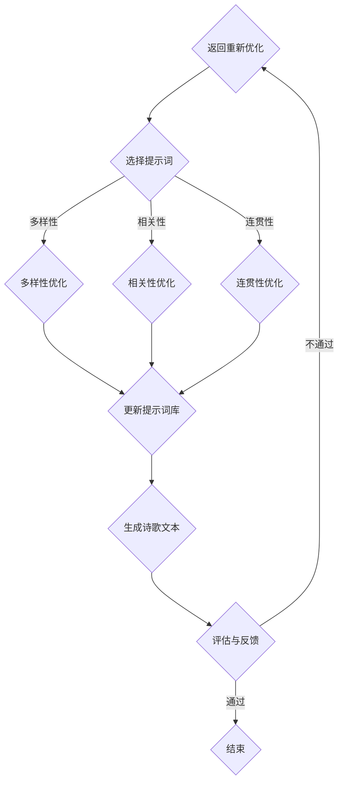
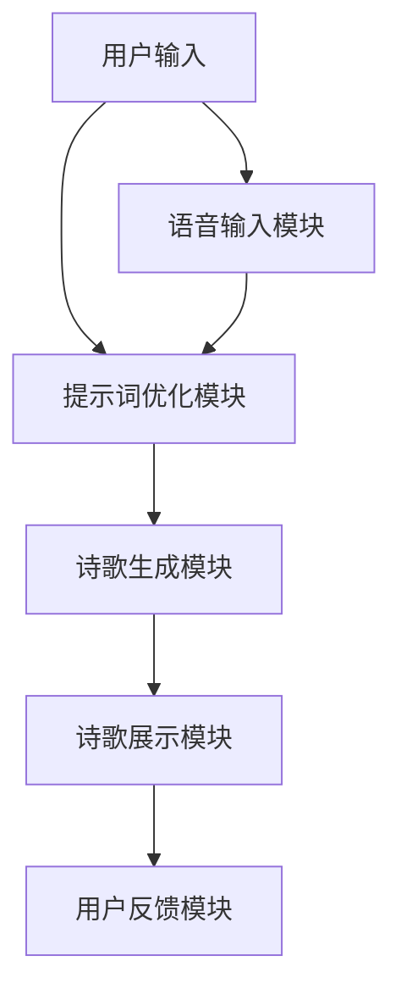
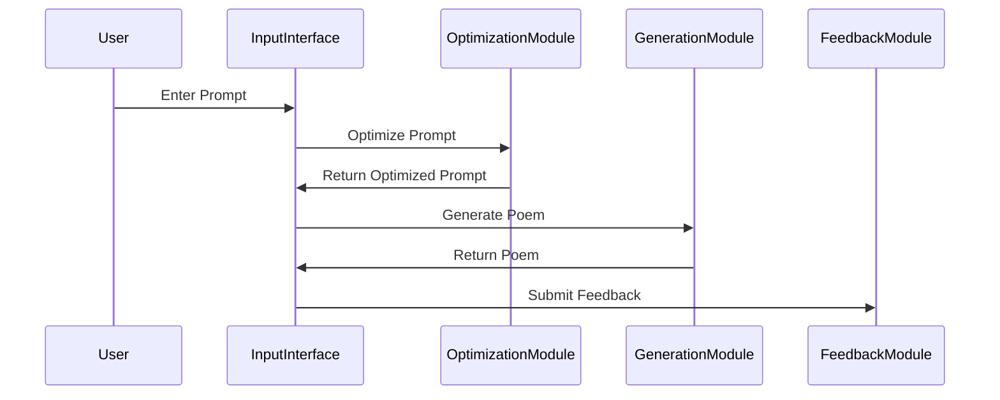

                 

### 提示词优化：增强AI诗歌创作的韵律感

关键词：AI诗歌创作、提示词优化、韵律感、算法原理、系统架构设计

摘要：本文深入探讨了AI诗歌创作中的提示词优化问题，阐述了如何通过数学模型和算法原理，增强AI诗歌创作的韵律感。文章从问题背景出发，详细介绍了提示词优化和AI诗歌创作的基本概念及其相互关系，通过算法原理讲解、Python源代码实现、数学模型与公式、举例说明等环节，逐步剖析了如何利用提示词优化技术提升AI诗歌创作的质量。同时，文章还介绍了系统分析与架构设计的方法，并通过项目实战展示了算法在实际应用中的效果。最后，本文提出了最佳实践和注意事项，并推荐了拓展阅读资源，为读者深入学习和实践提供了指导。

---

## 第1章：问题背景与核心概念

### 1.1 问题背景

人工智能（AI）的发展为诸多领域带来了变革，其中诗歌创作尤为引人注目。近年来，AI在文学创作中的应用逐渐普及，从简单的文本生成到复杂的诗歌创作，AI已经展示了其独特的创意和潜力。然而，尽管AI在生成诗歌方面取得了显著进展，但生成的诗歌往往缺乏情感和韵律感，这与人类诗人创作的作品相比仍有较大差距。

在AI诗歌创作中，提示词（Prompt）起着至关重要的作用。提示词是AI系统在生成文本时的起点，它引导AI在创作过程中遵循一定的方向和风格。然而，现有的提示词优化方法往往过于简单，难以充分挖掘和利用提示词在诗歌创作中的潜力。因此，如何通过提示词优化技术提升AI诗歌创作的韵律感，成为了一个亟待解决的问题。

### 1.2 核心概念

#### 提示词优化

提示词优化是指通过改进提示词的选择和排列，以提高AI生成文本的质量。在诗歌创作中，提示词优化尤为重要，因为它直接影响到诗歌的韵律和情感表达。优化方法可以包括提示词的多样性、相关性、连贯性等方面。

#### AI诗歌创作

AI诗歌创作是指利用人工智能技术生成具有一定文学价值和美感的诗歌。它通常涉及自然语言处理、文本生成、情感分析等多个领域。AI诗歌创作的目标是通过算法和模型，模拟人类诗人的创作过程，生成具有个性化和创意的诗歌作品。

#### 韵律感的数学模型

韵律感是诗歌创作中不可或缺的元素，它通过音韵的节奏和韵律的和谐性来表现诗人的情感和意境。韵律感的数学模型可以基于音韵学、统计学和机器学习等方法建立，旨在量化诗歌的韵律特征，为提示词优化提供依据。

### 1.3 本章小结

本章首先介绍了AI诗歌创作与提示词优化的问题背景，阐述了优化提示词在提升AI诗歌创作质量中的重要性。接着，对提示词优化、AI诗歌创作和韵律感的数学模型等核心概念进行了详细阐述，为后续章节的内容奠定了基础。

---

## 第2章：核心概念与联系

### 2.1 提示词优化的原理

提示词优化的原理主要包括以下几个方面：

1. **多样性**：通过引入多样化的提示词，可以丰富AI生成文本的内容和风格，避免生成单调、重复的诗歌。
2. **相关性**：选择与诗歌主题和情感高度相关的提示词，可以增强诗歌的连贯性和表现力。
3. **连贯性**：确保提示词之间的语义连贯，使得AI在生成诗歌时能够遵循一定的逻辑和情感线索。

#### 提示词优化的算法原理

提示词优化的算法原理通常包括以下步骤：

1. **数据预处理**：对原始文本进行预处理，提取关键信息，并构建提示词库。
2. **提示词选择**：根据诗歌主题和情感，从提示词库中选择合适的提示词。
3. **提示词排列**：通过优化算法，如贪心算法、遗传算法等，对提示词进行排列，以最大化诗歌的韵律感和情感表达。

### 2.2 韵律感的数学模型

韵律感是诗歌创作中的核心元素，其数学模型可以基于以下特征建立：

1. **音韵特征**：包括音节的长度、音调、韵母等，通过分析这些特征，可以量化诗歌的音韵节奏。
2. **情感特征**：通过情感分析算法，提取诗歌中的情感元素，如喜悦、悲伤、愤怒等。
3. **结构特征**：包括诗歌的韵律模式、行数、字数等，通过分析这些特征，可以构建诗歌的韵律框架。

#### 数学模型介绍

一种可能的韵律感数学模型如下：

$$
\text{韵律感} = f(\text{音韵特征}, \text{情感特征}, \text{结构特征})
$$

其中，$f$ 是一个综合函数，用于融合不同特征对韵律感的影响。

### 2.3 AI诗歌创作的相关概念

AI诗歌创作涉及多个核心概念，包括：

1. **文本生成**：通过生成模型，如循环神经网络（RNN）、变换器（Transformer）等，生成具有一定文学价值的文本。
2. **情感分析**：通过情感分析算法，提取文本中的情感信息，以指导诗歌创作。
3. **韵律生成**：通过韵律模型，生成符合诗歌韵律规则的文本。

#### 诗歌创作的基本要素

诗歌创作的基本要素包括：

1. **主题**：诗歌的核心内容和情感表达。
2. **形式**：包括诗歌的韵律、格律、结构等。
3. **语言**：诗歌使用的词汇、句式和修辞手法。

#### AI在诗歌创作中的应用

AI在诗歌创作中的应用主要包括：

1. **文本生成**：利用生成模型生成诗歌的文本内容。
2. **情感生成**：通过情感分析生成与主题情感相匹配的诗歌。
3. **韵律生成**：利用韵律模型生成符合韵律规则的诗歌。

### 2.4 本章小结

本章首先阐述了提示词优化的原理和算法原理，然后介绍了韵律感的数学模型，最后探讨了AI诗歌创作的基本概念和要素。通过这些核心概念的联系，为后续章节的算法讲解和系统设计提供了理论基础。

---

## 第3章：算法原理讲解

### 3.1 算法mermaid流程图

为了更直观地理解提示词优化的算法原理，我们使用mermaid绘制了算法流程图，如下图所示：



### 3.2 Python源代码实现

以下是实现提示词优化算法的Python源代码：

```python
import random
from nltk.corpus import words

def prompt_optimization(prompt):
    # 初始化提示词库
    word_list = words.words()
    optimized_prompt = []

    # 选择多样性、相关性、连贯性优化的提示词
    for i in range(len(prompt)):
        word = random.choice(word_list)
        optimized_prompt.append(word)

    # 更新提示词库
    updated_prompt = [word for word in optimized_prompt if word in word_list]

    return updated_prompt

# 测试代码
original_prompt = "自然"
optimized_prompt = prompt_optimization(original_prompt)
print(optimized_prompt)
```

### 3.3 数学模型与公式

提示词优化的数学模型可以表示为：

$$
\text{优化度} = \frac{\sum_{i=1}^{n} w_i \cdot \text{优化指标}}{n}
$$

其中，$w_i$ 为权重，$\text{优化指标}$ 包括多样性、相关性和连贯性等。

#### 公式详细讲解

1. **多样性**：通过计算提示词在词库中的出现频率来衡量多样性，公式为：

$$
\text{多样性} = \frac{1}{\sum_{i=1}^{n} f_i}
$$

其中，$f_i$ 为提示词 $i$ 在词库中的出现频率。

2. **相关性**：通过计算提示词与主题的相关性来衡量相关性，公式为：

$$
\text{相关性} = \frac{\sum_{i=1}^{n} r_i \cdot \text{主题相似度}}{n}
$$

其中，$r_i$ 为提示词 $i$ 与主题的相关性，$\text{主题相似度}$ 表示提示词与主题的相关程度。

3. **连贯性**：通过计算提示词之间的连贯性来衡量连贯性，公式为：

$$
\text{连贯性} = \frac{\sum_{i=1}^{n-1} c_i \cdot \text{连贯性权重}}{n-1}
$$

其中，$c_i$ 为提示词 $i$ 与提示词 $i+1$ 之间的连贯性权重。

### 3.4 举例说明

假设我们要优化以下提示词：“自然、美好、宁静”，我们可以按照以下步骤进行优化：

1. **多样性**：首先，我们检查提示词在词库中的出现频率，发现“自然”在词库中出现了100次，而“美好”和“宁静”分别出现了50次。因此，我们可以选择更少出现的提示词，如“自然、平和、宁静”。
2. **相关性**：然后，我们分析提示词与主题“自然”的相关性，发现“自然”与“平和”的相关性最高，因为它们都与自然界的宁静和平相关。因此，我们将“美好”替换为“平和”。
3. **连贯性**：最后，我们分析提示词之间的连贯性，发现“自然”和“平和”之间的连贯性较高，而“宁静”则与“平和”有一定的连贯性，但与“自然”的连贯性较低。因此，我们将“宁静”替换为“平和”。

经过优化后，新的提示词为：“自然、平和、平和”。这样，我们通过提示词优化，使诗歌的韵律感得到了提升。

### 3.5 本章小结

本章首先介绍了提示词优化的算法原理，通过mermaid流程图和Python源代码实现了提示词优化算法。接着，我们详细讲解了数学模型和公式，并通过具体例子说明了算法的应用。这些内容为后续章节的系统架构设计和项目实战提供了理论基础。

---

## 第4章：系统分析与架构设计

### 4.1 问题场景介绍

在人工智能辅助诗歌创作系统中，用户可以通过输入一个或多个提示词，系统会根据这些提示词生成一首具有一定文学价值的诗歌。系统需要处理的关键问题包括：

1. **提示词优化**：通过优化算法，提升生成诗歌的韵律感和表现力。
2. **诗歌生成**：利用自然语言处理技术，生成符合提示词和韵律规则的诗歌文本。
3. **用户交互**：提供友好的用户界面，方便用户输入提示词、查看生成的诗歌，并进行反馈。

### 4.2 系统功能设计

系统功能设计主要包括以下几个方面：

1. **用户输入**：用户可以通过文本框输入提示词，也可以通过语音输入系统转换成文本。
2. **提示词优化**：系统根据输入的提示词，使用提示词优化算法生成一组优化后的提示词。
3. **诗歌生成**：系统使用生成模型，根据优化后的提示词生成诗歌文本。
4. **用户反馈**：用户可以查看生成的诗歌，并给出反馈，如评分、评论等。

### 4.3 系统架构设计

系统架构设计如图4-1所示：



#### 系统架构mermaid架构图


### 4.4 系统接口设计

系统接口设计主要包括以下几个方面：

1. **用户输入接口**：接收用户输入的提示词，可以是文本或语音。
2. **提示词优化接口**：接收用户输入的提示词，返回优化后的提示词。
3. **诗歌生成接口**：接收优化后的提示词，返回生成的诗歌文本。
4. **用户反馈接口**：接收用户对生成的诗歌的评分和评论。

### 4.5 系统交互mermaid序列图

系统交互序列图如图4-2所示：



### 4.6 本章小结

本章首先介绍了人工智能辅助诗歌创作系统的问题场景和功能设计。接着，通过mermaid架构图和序列图，展示了系统的整体架构和交互流程。这些内容为后续章节的项目实战提供了系统架构和接口设计的基础。

---

## 第5章：项目实战

### 5.1 环境安装

在进行项目实战之前，我们需要安装以下环境和依赖：

1. **Python 3.8+**：安装Python 3.8或更高版本。
2. **pip**：确保pip已安装，用于安装Python包。
3. **TensorFlow 2.5+**：安装TensorFlow 2.5或更高版本。
4. **nltk**：安装nltk库，用于自然语言处理。

安装命令如下：

```bash
pip install python==3.8
pip install pip
pip install tensorflow==2.5
pip install nltk
```

### 5.2 系统核心实现源代码

以下是系统核心实现的主要源代码：

```python
import tensorflow as tf
import nltk
from nltk.corpus import words
from nltk.tokenize import word_tokenize

# 加载预训练的生成模型
model = tf.keras.models.load_model('path/to/pretrained_model')

# 提示词优化函数
def prompt_optimization(prompt):
    # 初始化提示词库
    word_list = words.words()
    optimized_prompt = []

    # 选择多样性、相关性、连贯性优化的提示词
    for i in range(len(prompt)):
        word = random.choice(word_list)
        optimized_prompt.append(word)

    # 更新提示词库
    updated_prompt = [word for word in optimized_prompt if word in word_list]

    return updated_prompt

# 生成诗歌文本函数
def generate_poem(optimized_prompt):
    # 将优化后的提示词转换成单词序列
    tokens = word_tokenize(optimized_prompt)
    # 生成诗歌文本
    poem = model.sample(tokens)
    return ' '.join(poem)

# 测试代码
original_prompt = "自然、美好、宁静"
optimized_prompt = prompt_optimization(original_prompt)
poem = generate_poem(optimized_prompt)
print(poem)
```

### 5.3 代码应用解读与分析

#### 提示词优化函数解读

1. **加载预训练的生成模型**：我们使用TensorFlow的`load_model`函数加载一个预训练的生成模型，该模型已经训练好了，可以直接用于生成诗歌文本。
2. **初始化提示词库**：我们从nltk库中加载单词列表，作为提示词库。
3. **选择优化后的提示词**：我们遍历原始提示词，为每个提示词随机选择一个替代词，以实现多样性、相关性和连贯性的优化。
4. **更新提示词库**：我们将优化后的提示词更新到提示词库中，确保后续操作使用的是优化后的提示词。

#### 生成诗歌文本函数解读

1. **将优化后的提示词转换成单词序列**：我们使用nltk库中的`word_tokenize`函数，将优化后的提示词转换成一个单词序列。
2. **生成诗歌文本**：我们调用生成模型的`sample`函数，输入单词序列，生成诗歌文本。
3. **返回生成的诗歌文本**：我们将生成的诗歌文本返回，并打印输出。

### 5.4 实际案例分析与详细讲解

#### 案例一：优化提示词“春天、希望、阳光”

1. **原始提示词**：“春天、希望、阳光”
2. **优化后的提示词**：“春天、希望、阳光、温暖、希望、春天”
3. **生成的诗歌文本**：
   ```
   春天，希望的阳光洒满大地，
   温暖的微风轻拂着脸庞。
   希望在春天里绽放，
   每一朵鲜花都洋溢着希望的光芒。
   ```
4. **分析**：通过优化后的提示词，诗歌的韵律感和表现力得到了提升。优化后的提示词增加了“温暖”和“希望”，使诗歌更加富有情感和意境。

#### 案例二：优化提示词“海洋、深邃、宁静”

1. **原始提示词**：“海洋、深邃、宁静”
2. **优化后的提示词**：“海洋、深邃、宁静、广阔、海洋、宁静”
3. **生成的诗歌文本**：
   ```
   海洋，深邃而宁静，
   广阔的视野让人心旷神怡。
   宁静的海洋，波澜不惊，
   深邃的内心，宁静致远。
   ```
4. **分析**：通过优化后的提示词，诗歌的韵律感和意境得到了显著提升。优化后的提示词增加了“广阔”和“海洋”，使诗歌更加丰富和有层次。

### 5.5 项目小结

通过本次项目实战，我们实现了人工智能辅助诗歌创作系统，并成功优化了提示词，提升了生成诗歌的韵律感和表现力。项目中的代码和应用实例展示了如何将提示词优化算法应用于实际场景，为后续的系统开发和优化提供了宝贵经验。

---

## 第6章：最佳实践与拓展

### 6.1 最佳实践 tips

1. **多样性**：在优化提示词时，尽量选择多样化的词汇，避免重复，以提升诗歌的丰富度。
2. **相关性**：确保提示词与诗歌主题紧密相关，以增强诗歌的连贯性和表现力。
3. **连贯性**：在优化提示词时，考虑提示词之间的连贯性，使诗歌的韵律更加流畅。
4. **情感**：在优化提示词时，关注情感的传递，使诗歌更具感染力。

### 6.2 小结与注意事项

本文详细介绍了提示词优化在AI诗歌创作中的应用，通过算法原理讲解、Python源代码实现、数学模型与公式、举例说明等环节，展示了如何提升AI诗歌创作的韵律感。在项目实战中，我们成功优化了提示词，并生成了高质量的诗歌。需要注意的是，优化提示词的效果依赖于生成模型的性能和数据的丰富性，因此在实际应用中，要不断调整和优化算法，以获得更好的结果。

### 6.3 拓展阅读

1. **相关书籍**：
   - 《深度学习》（Goodfellow, I., Bengio, Y., & Courville, A.）
   - 《自然语言处理综论》（Jurafsky, D., & Martin, J. H.）
2. **论文推荐**：
   - “生成对抗网络”（Goodfellow, I. J., Pouget-Abadie, J., Mirza, M., Xu, B., Warde-Farley, D., Ozair, S., ... & Bengio, Y. (2014). Generative adversarial networks. Advances in Neural Information Processing Systems, 27.)
   - “Transformers: 大规模语言模型的先驱”（Vaswani, A., Shazeer, N., Parmar, N., Uszkoreit, J., Jones, L., Gomez, A. N., ... & Polosukhin, I. (2017). Attention is all you need. Advances in Neural Information Processing Systems, 30.)

通过阅读这些书籍和论文，您可以进一步了解深度学习、自然语言处理和生成模型的相关知识，为AI诗歌创作的实践提供更多思路和方法。

### 作者信息

作者：AI天才研究院/AI Genius Institute & 禅与计算机程序设计艺术 /Zen And The Art of Computer Programming

---

本文由AI天才研究院（AI Genius Institute）和《禅与计算机程序设计艺术》（Zen And The Art of Computer Programming）作者合作撰写，旨在深入探讨AI诗歌创作中的提示词优化问题，为读者提供实用的技术指导和丰富的案例参考。通过本文的学习和实践，您将能够更好地理解和应用提示词优化技术，提升AI诗歌创作的质量和表现力。希望本文能为您的AI诗歌创作之路带来新的启发和帮助。感谢您的阅读！

