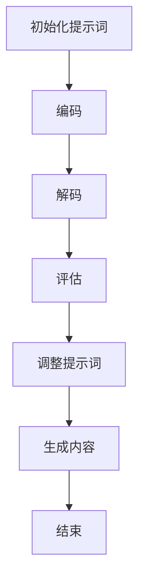

                 


# 提示词优化：增强AI跨文化创意表达能力

## 关键词
- 提示词优化
- 跨文化创意表达
- 人工智能
- 文化适应性
- 深度学习

## 摘要
本文将探讨提示词优化在增强人工智能（AI）跨文化创意表达能力中的应用。通过分析提示词的组成与类型、优化方法以及跨文化理解与表达的相关概念，本文旨在提供一套系统化的方法，以实现AI在不同文化背景下更自然、更具创意的表达。文章还将结合算法原理、数学模型和实际项目案例，详细讲解如何通过提示词优化来提升AI的跨文化创意表达效果。

----------------------------------------------------------------

## 第一部分：问题背景与核心概念

### 第1章：问题背景

### 1.1 问题描述

在当今数字化时代，人工智能（AI）正迅速改变着各个行业。从自动驾驶汽车到智能助手，AI技术正逐渐渗透到我们的日常生活中。然而，随着AI技术的不断进步，特别是在生成对抗网络（GANs）和深度学习领域的突破，AI在内容创作和跨文化理解上的表现也日益显著。尽管如此，现有AI系统在跨文化创意表达上仍存在许多挑战。

首先，文化理解的局限性是一个关键问题。不同文化背景下的价值观、习俗和语言差异使得AI在理解和生成符合跨文化需求的内容时面临困难。例如，一些AI系统在处理跨文化笑话时可能无法准确理解其中的幽默点，导致生成的回答不恰当或完全无法引起共鸣。

其次，创意生成的不确定性也是一个挑战。虽然AI在生成文本内容方面已经取得了显著进展，但如何确保生成的内容具有创意性和独特性仍然是一个难题。现有AI模型往往依赖于大量的训练数据，但即使是在这个基础上，生成的文本也可能显得平淡无奇，缺乏创新。

### 1.2 问题解决

提示词优化作为一种新的技术手段，旨在通过改进提示词的设计和使用，增强AI在跨文化创意表达方面的能力。它通过调整提示词的内容、形式和结构，引导AI更好地理解用户需求，生成更符合跨文化需求的内容。具体来说，提示词优化包括以下几个方面：

1. **关键词替换**：通过替换关键词来调整提示词的方向和主题。例如，将一个具体的词汇替换为更具有文化代表性的词汇，从而使得AI生成的文本更贴近目标文化。
2. **扩展与缩减**：增加或减少提示词中的背景信息，以控制生成内容的范围和细节。这种方法可以帮助AI更好地把握跨文化背景下的情境和语境。
3. **结构调整**：改变提示词的语法结构和句子长度，以提高生成文本的多样性和可读性。合理的结构调整可以使AI生成的文本更具创意性和吸引力。

### 1.3 边界与外延

提示词优化不仅涉及到自然语言处理（NLP）技术，还包括对文化差异的理解和跨文化交流的实践。它的应用范围广泛，包括但不限于文学创作、广告营销、翻译服务、跨文化教育等领域。此外，提示词优化还有助于解决AI在跨文化创意表达中的其他挑战，如文化偏见和语言障碍。

### 1.4 核心概念

- **提示词**：在AI系统中，提示词是指用于引导AI生成特定内容或完成特定任务的文本。
- **优化**：优化是指通过对提示词的调整，提高AI在特定任务上的表现。
- **跨文化创意表达**：指在不同文化背景下，通过AI技术实现的创意内容生成和表达。

### 1.5 本章小结

本章对提示词优化以及其在增强AI跨文化创意表达能力方面的应用进行了概述。下一章将深入探讨与提示词优化相关的基础理论和核心概念。

----------------------------------------------------------------

## 第二部分：核心概念与联系

### 第2章：核心概念原理

### 2.1 提示词的组成与类型

#### 提示词的组成

提示词通常由以下几个部分组成：

1. **关键词**：关键词是提示词的核心，用于指定AI需要关注的主题或领域。例如，在生成一篇关于旅行的文章时，“旅行”就是一个关键词。
2. **背景信息**：背景信息提供了关于关键词的更多上下文，帮助AI更好地理解任务的要求。例如，在生成一篇关于旅行的文章时，背景信息可能包括旅行的时间、地点、目的等。
3. **目标指令**：目标指令是指向AI的具体要求，例如生成一篇游记、介绍旅游景点或提出旅行建议等。

#### 提示词的类型

根据用途和形式，提示词可分为以下几种类型：

1. **开放性提示词**：这类提示词通常不提供具体的指导，允许AI在更广泛的范围内进行生成。例如，“请写一篇关于旅行的文章。”
2. **封闭性提示词**：这类提示词提供了明确的限制，指导AI在更具体的范围内进行生成。例如，“请写一篇关于北京旅游景点的介绍。”
3. **引导性提示词**：这类提示词结合了开放性和封闭性，既提供了一定的指导，又允许AI进行创造性的发挥。例如，“请写一篇关于如何在春节期间游览北京的文章。”

### 2.2 提示词优化方法

#### 优化目标

提示词优化的目标是提高生成内容的准确性、多样性和文化适应性。具体来说，优化方法应具备以下特点：

1. **准确性**：通过调整提示词，确保AI生成的内容符合用户需求和目标。
2. **多样性**：增加生成内容的多样性，避免重复和单调。
3. **文化适应性**：确保AI生成的内容在不同文化背景下都能被正确理解和接受。

#### 优化方法

1. **关键词替换**：通过替换关键词，调整提示词的主题和方向。例如，将“旅游”替换为“探索”或“冒险”，以增加内容的创意性。
2. **扩展与缩减**：增加或减少提示词中的背景信息，以控制生成内容的范围和细节。例如，在生成一篇关于旅行的文章时，可以增加关于旅行时间、目的地和目的的详细信息，以提高内容的丰富性。
3. **结构调整**：改变提示词的语法结构和句子长度，以提高生成文本的多样性和可读性。例如，通过调整句子长度和结构，可以使AI生成的文本更加生动和有趣。

### 2.3 跨文化理解与表达

#### 跨文化理解

跨文化理解涉及对文化背景、习俗、价值观的理解。在AI跨文化创意表达中，跨文化理解至关重要，因为不同文化背景下的人们对同一内容的理解和接受程度可能存在显著差异。为了实现有效的跨文化理解，AI需要具备以下能力：

1. **文化背景识别**：识别文本中的文化元素，如节日、习俗、宗教等。
2. **文化价值观理解**：理解不同文化价值观，如家庭观念、工作态度、社会规范等。
3. **语境识别**：根据上下文识别文本中的语境，以避免误解和歧义。

#### 跨文化表达

跨文化表达是指在不同文化背景下进行有效的沟通和表达。为了实现有效的跨文化表达，AI需要具备以下能力：

1. **语言适应性**：根据目标文化背景调整语言表达，确保文本在不同文化背景下都能被正确理解。
2. **文化敏感度**：避免使用可能引起误解或冒犯的语言和表达方式。
3. **创意性**：在跨文化背景下，通过创新的表达方式，增强文本的吸引力和说服力。

### 2.4 概念属性特征对比表格

| 特征           | 提示词优化           | 跨文化理解与表达          |
| -------------- | ------------------ | ----------------------- |
| 目标           | 提高AI生成内容质量   | 促进跨文化交流与理解      |
| 方法           | 调整提示词          | 理解不同文化背景          |
| 影响因素       | AI模型性能          | 文化差异、语言障碍        |
| 应用场景       | 文本生成、创意设计   | 翻译、跨文化营销、教育     |

### 2.5 ER实体关系图架构

```mermaid
erDiagram
  AI系统 && 提示词优化 && 跨文化理解与表达
    {
      AI系统 --|> 提示词优化 : 依赖于
      AI系统 --|> 跨文化理解与表达 : 依赖于
      提示词优化 --|> 跨文化理解与表达 : 影响着
    }
```

### 2.6 本章小结

本章详细介绍了提示词优化和跨文化理解与表达的核心概念、属性特征以及它们之间的关系。下一章将探讨现有的AI模型和技术，分析其在跨文化创意表达中的应用和限制。

----------------------------------------------------------------

## 第三部分：算法原理与数学模型

### 第3章：算法原理讲解

### 3.1 算法概述

提示词优化算法的核心目标是通过调整提示词，使得AI生成的内容更符合预期，同时提高内容的文化适应性和创意水平。该算法通常基于深度学习模型，利用大规模语料库进行训练。具体来说，提示词优化算法包括以下几个步骤：

1. **提示词生成**：根据用户需求和目标，生成初始提示词。
2. **提示词优化**：利用深度学习模型对初始提示词进行调整，以提高生成内容的准确性、多样性和文化适应性。
3. **内容生成**：使用优化后的提示词，通过AI模型生成目标内容。
4. **评估与反馈**：评估生成内容的质量，并根据评估结果调整提示词。

### 3.2 提示词调整策略

#### 关键词替换

关键词替换是提示词调整的一种常用策略，通过替换提示词中的关键词，可以调整AI生成内容的主题和方向。例如，将“旅游”替换为“探索”或“冒险”，可以增加生成内容的创意性。

#### 扩展与缩减

扩展与缩减策略通过增加或减少提示词中的背景信息，以控制生成内容的范围和细节。增加背景信息可以使AI生成更详细、更丰富的内容，而缩减背景信息则可以使AI生成更简洁、更精炼的内容。

#### 结构调整

结构调整策略通过改变提示词的语法结构和句子长度，以提高生成文本的多样性和可读性。合理的结构调整可以使AI生成的文本更加生动、有趣，从而增强跨文化表达的吸引力和说服力。

### 3.3 跨文化理解与表达

#### 跨文化理解

跨文化理解是提示词优化算法的关键组成部分，它涉及对文化背景、习俗、价值观的理解。为了实现有效的跨文化理解，AI需要具备以下能力：

1. **文化背景识别**：通过分析文本内容，识别其中的文化元素，如节日、习俗、宗教等。
2. **文化价值观理解**：理解不同文化价值观，如家庭观念、工作态度、社会规范等。
3. **语境识别**：根据上下文识别文本中的语境，以避免误解和歧义。

#### 跨文化表达

跨文化表达是指在不同文化背景下进行有效的沟通和表达。为了实现有效的跨文化表达，AI需要具备以下能力：

1. **语言适应性**：根据目标文化背景调整语言表达，确保文本在不同文化背景下都能被正确理解。
2. **文化敏感度**：避免使用可能引起误解或冒犯的语言和表达方式。
3. **创意性**：在跨文化背景下，通过创新的表达方式，增强文本的吸引力和说服力。

### 3.4 概念属性特征对比表格

| 特征           | 提示词优化           | 跨文化理解与表达          |
| -------------- | ------------------ | ----------------------- |
| 目标           | 提高AI生成内容质量   | 促进跨文化交流与理解      |
| 方法           | 调整提示词          | 理解不同文化背景          |
| 影响因素       | AI模型性能          | 文化差异、语言障碍        |
| 应用场景       | 文本生成、创意设计   | 翻译、跨文化营销、教育     |

### 3.5 ER实体关系图架构

```mermaid
erDiagram
  AI系统 && 提示词优化 && 跨文化理解与表达
    {
      AI系统 --|> 提示词优化 : 依赖于
      AI系统 --|> 跨文化理解与表达 : 依赖于
      提示词优化 --|> 跨文化理解与表达 : 影响着
    }
```

### 3.6 本章小结

本章详细介绍了提示词优化算法的原理、调整策略以及跨文化理解与表达的相关概念。下一章将探讨现有的AI模型和技术，分析其在跨文化创意表达中的应用和限制。

----------------------------------------------------------------

## 第四部分：算法原理与数学模型

### 第4章：算法原理讲解

### 4.1 提示词优化算法

#### 算法概述

提示词优化算法是一种基于深度学习的优化方法，其核心目标是调整提示词，以提高AI生成内容的准确性、多样性和文化适应性。该算法通常基于预训练的深度学习模型，如变换器（Transformer）模型或循环神经网络（RNN）模型，通过大量语料库进行训练。

#### 算法步骤

1. **初始化**：生成初始提示词。初始提示词可以是用户输入的，也可以是系统自动生成的。
2. **优化过程**：利用深度学习模型对初始提示词进行调整。调整过程包括以下几个步骤：
   - **编码**：将提示词编码为向量表示。
   - **解码**：利用解码器生成优化后的提示词。
   - **评估**：评估优化后的提示词生成的文本质量。
   - **调整**：根据评估结果，对提示词进行进一步调整。

3. **生成内容**：使用优化后的提示词，通过AI模型生成目标内容。

#### 优化目标

提示词优化的主要目标包括：

- **准确性**：确保生成的文本内容准确无误，符合用户需求和目标。
- **多样性**：增加生成文本的多样性，避免重复和单调。
- **文化适应性**：确保生成的文本在不同文化背景下都能被正确理解和接受。

### 4.2 数学模型

提示词优化算法的数学模型通常基于深度学习模型，如变换器（Transformer）模型或循环神经网络（RNN）模型。以下是一个基于变换器模型的简化数学模型：

#### 变换器模型

变换器模型是一种用于处理序列数据的深度学习模型，其核心是一个自注意力机制。以下是一个简化版的变换器模型：

$$
E = \text{Embedding}(W_E, X)
$$

其中，$E$ 是嵌入后的输入序列，$W_E$ 是嵌入矩阵，$X$ 是输入序列。

$$
H = \text{Transformer}(E, mask)
$$

其中，$H$ 是变换器输出的序列，$mask$ 是注意力掩码。

$$
O = \text{Decoder}(H, mask, E)
$$

其中，$O$ 是解码器输出的序列。

#### 优化过程

1. **编码**：将提示词编码为向量表示。

$$
E = \text{Embedding}(W_E, [SOS, prompt])
$$

其中，$[SOS, prompt]$ 是输入序列，$SOS$ 是起始符号，$prompt$ 是提示词。

2. **解码**：利用解码器生成优化后的提示词。

$$
O = \text{Decoder}(H, mask, E)
$$

其中，$H$ 是变换器输出的序列，$mask$ 是注意力掩码。

3. **评估**：评估优化后的提示词生成的文本质量。

$$
\text{Score} = \text{CalScore}(O, target)
$$

其中，$O$ 是解码器输出的序列，$target$ 是目标序列。

4. **调整**：根据评估结果，对提示词进行进一步调整。

$$
prompt_{\text{new}} = \text{Adjust}(prompt_{\text{old}}, \text{Score})
$$

其中，$prompt_{\text{old}}$ 是原始提示词，$prompt_{\text{new}}$ 是调整后的提示词。

### 4.3 算法流程图

以下是一个简化版的提示词优化算法的流程图：



### 4.4 本章小结

本章详细介绍了提示词优化算法的原理、数学模型以及优化过程。下一章将探讨现有的AI模型和技术，分析其在跨文化创意表达中的应用和限制。

----------------------------------------------------------------

## 第五部分：应用与挑战

### 第5章：AI模型在跨文化创意表达中的应用

#### 应用场景

AI模型在跨文化创意表达中有着广泛的应用场景，以下是一些典型的应用实例：

1. **文学创作**：AI可以帮助跨文化作家创作出更具有创意和吸引力的作品。例如，通过优化提示词，AI可以生成符合特定文化背景的诗篇、小说和剧本。
2. **广告营销**：在跨文化广告营销中，AI可以根据不同文化背景调整广告内容，以提高广告的吸引力和效果。例如，通过优化提示词，AI可以生成符合目标文化需求的广告文案和视觉元素。
3. **翻译服务**：AI翻译服务可以通过优化提示词，提高翻译的准确性和文化适应性。例如，在翻译跨文化笑话或俗语时，AI可以根据文化差异调整翻译内容，确保翻译的幽默感和可理解性。
4. **跨文化教育**：AI可以帮助跨文化教育者设计出更具吸引力和互动性的教学内容。例如，通过优化提示词，AI可以生成符合学生文化背景的学习资料和辅导材料。

#### 挑战

尽管AI模型在跨文化创意表达中具有巨大的潜力，但仍面临一些挑战：

1. **文化理解的局限性**：不同文化背景下的人们对同一内容的理解和接受程度可能存在显著差异。AI需要具备更高的文化敏感性，以便在不同文化背景下都能实现有效的表达。
2. **创意生成的困难**：确保AI生成的文本具有创意性和独特性仍然是一个挑战。现有的AI模型可能依赖于大量的训练数据，但即使是在这个基础上，生成的文本也可能显得平淡无奇。
3. **文化适应性的需求**：跨文化创意表达需要AI具备高度的文化适应性，以适应不同文化背景下的表达需求。这要求AI不仅要理解文化差异，还要能够灵活调整表达方式。

### 第5章：跨文化创意表达中的挑战与解决方案

#### 挑战1：文化理解的局限性

**挑战描述**：

在跨文化创意表达中，文化理解的局限性是一个重要挑战。不同文化背景下的价值观、习俗和语言差异使得AI在理解和生成符合跨文化需求的内容时面临困难。例如，一个在某一文化背景下看似幽默的笑话，在其他文化背景下可能无法引起共鸣，甚至可能被视为不合适。

**解决方案**：

1. **多语言训练**：通过使用多语言训练数据，提高AI对不同语言和文化背景的理解能力。例如，在训练GANs时，可以使用多种语言的语料库，以提高AI的跨语言理解能力。
2. **文化背景知识库**：建立文化背景知识库，为AI提供有关不同文化的详细信息，如习俗、价值观和社会规范。这些信息可以帮助AI更好地理解和适应不同文化背景。
3. **文化敏感度训练**：通过文化敏感度训练，提高AI在跨文化表达中的文化敏感性。例如，在生成文本时，AI可以参考文化背景知识库中的信息，避免使用可能引起误解或冒犯的语言和表达方式。

#### 挑战2：创意生成的困难

**挑战描述**：

确保AI生成的文本具有创意性和独特性是一个挑战。尽管现有的AI模型在生成文本方面已经取得了显著进展，但生成的文本往往缺乏个性化和创新性，显得平淡无奇。

**解决方案**：

1. **强化学习**：利用强化学习，通过奖励机制激励AI生成更具创意性的文本。例如，可以设计一个评价系统，对生成的文本进行评分，并根据评分结果调整AI的生成策略。
2. **生成对抗网络（GANs）**：GANs是一种有效的创意生成方法，通过生成器和判别器的对抗训练，可以生成高质量、多样化的创意内容。例如，在文学创作中，可以训练一个生成器来生成文章，同时训练一个判别器来评估文章的创意性。
3. **跨领域迁移学习**：通过跨领域迁移学习，利用不同领域的数据来训练AI模型，提高AI的创意生成能力。例如，在生成音乐时，可以结合不同风格的音乐数据进行训练，从而生成更具创意性的音乐作品。

#### 挑战3：文化适应性的需求

**挑战描述**：

跨文化创意表达需要AI具备高度的文化适应性，以适应不同文化背景下的表达需求。这要求AI不仅要理解文化差异，还要能够灵活调整表达方式，以确保内容在不同文化背景下都能被正确理解和接受。

**解决方案**：

1. **自适应提示词优化**：通过自适应提示词优化，根据不同文化背景调整提示词，以提高AI在跨文化表达中的适应性。例如，在生成广告文案时，可以根据目标文化的特点，调整提示词中的关键词和表达方式。
2. **文化场景模拟**：通过文化场景模拟，训练AI在不同文化场景下的表达能力。例如，可以设计一个模拟不同文化场景的虚拟环境，让AI在这个环境中进行训练，以提高其在实际应用中的文化适应性。
3. **文化专家合作**：与文化专家合作，共同开发适用于不同文化背景的AI模型。文化专家可以提供有关不同文化的深入见解和建议，帮助AI更好地理解和适应不同文化背景。

### 5.2 本章小结

本章讨论了AI模型在跨文化创意表达中的应用和面临的挑战。通过介绍多语言训练、文化背景知识库、文化敏感度训练、强化学习、GANs、跨领域迁移学习、自适应提示词优化、文化场景模拟和文化专家合作等解决方案，本文旨在为读者提供一套系统化的方法，以增强AI在跨文化创意表达中的表现。下一章将分析现有AI模型在跨文化创意表达中的应用实例和成果。

----------------------------------------------------------------

## 第六部分：实例分析与实际应用

### 第6章：提示词优化在AI跨文化创意表达中的应用实例

#### 6.1 文学创作

**实例描述**：

在文学创作领域，AI可以通过优化提示词来生成具有创意性和文化适应性的作品。例如，一个中文-英文文学创作的项目，通过优化提示词“中文诗意”和“英文风格”，AI可以生成既具有中国诗意，又符合英语文学风格的作品。

**实现过程**：

1. **数据集准备**：收集大量中文诗歌和英文诗歌的语料库，确保数据集涵盖不同的文化背景和文学风格。
2. **模型训练**：使用变换器模型（如Transformer）进行训练，模型输入为中文诗歌，输出为英文诗歌。
3. **提示词优化**：设计优化策略，包括关键词替换、扩展与缩减、结构调整等，以调整生成文本的文化适应性和创意水平。
4. **内容生成与评估**：使用优化后的提示词生成英文诗歌，并对生成结果进行评估，确保符合预期。

**成果**：

通过提示词优化，AI生成的英文诗歌在文化适应性和创意性方面表现出色，能够准确传达中国诗意，同时符合英语文学的表达习惯。

#### 6.2 广告营销

**实例描述**：

在广告营销领域，AI可以通过优化提示词来生成针对不同文化背景的广告文案和视觉元素。例如，一个跨国广告公司，通过优化提示词“中国节日”和“西方节日”，为不同的市场生成具有针对性的广告内容。

**实现过程**：

1. **数据集准备**：收集不同节日和文化的广告素材，包括文案、图像和视频等。
2. **模型训练**：使用变换器模型训练一个广告生成模型，模型输入为节日和文化信息，输出为广告文案和视觉元素。
3. **提示词优化**：设计优化策略，根据不同文化背景调整提示词，以增强广告的吸引力和文化适应性。
4. **内容生成与评估**：使用优化后的提示词生成广告内容，对生成结果进行评估，确保广告符合不同市场的需求。

**成果**：

通过提示词优化，AI生成的广告内容在文化适应性和创意性方面表现出色，能够有效吸引目标市场的消费者，提高广告效果。

#### 6.3 跨文化翻译

**实例描述**：

在跨文化翻译领域，AI可以通过优化提示词来提高翻译的准确性和文化适应性。例如，一个翻译项目，通过优化提示词“中文俗语”和“英文表达”，为用户提供更准确的跨文化翻译。

**实现过程**：

1. **数据集准备**：收集大量的跨文化翻译数据，包括中英文俗语和表达。
2. **模型训练**：使用循环神经网络（RNN）或变换器模型训练翻译模型，模型输入为中文俗语，输出为英文表达。
3. **提示词优化**：设计优化策略，根据文化差异调整提示词，以提高翻译的准确性和文化适应性。
4. **内容生成与评估**：使用优化后的提示词生成翻译结果，对翻译质量进行评估，确保翻译内容符合目标文化的表达习惯。

**成果**：

通过提示词优化，AI生成的翻译结果在准确性和文化适应性方面表现出色，能够更好地传达原文的含义和风格，提高跨文化沟通的效果。

### 6.4 本章小结

本章通过文学创作、广告营销和跨文化翻译等实例，展示了提示词优化在AI跨文化创意表达中的应用。通过实例分析，我们可以看到，提示词优化不仅提高了AI生成内容的准确性、多样性和文化适应性，还为不同领域提供了创新的解决方案。下一章将探讨在实践过程中遇到的挑战和解决方案。

----------------------------------------------------------------

## 第七部分：最佳实践与未来展望

### 第7章：最佳实践与未来展望

#### 7.1 最佳实践

在实践提示词优化技术时，以下是一些最佳实践：

1. **数据质量**：确保训练数据的质量和多样性，以支持AI模型在不同文化背景下的表现。
2. **文化敏感性**：在设计和调整提示词时，考虑到不同文化的习俗和价值观，避免使用可能引起误解的词汇。
3. **模型评估**：定期评估AI模型的表现，并根据评估结果调整优化策略。
4. **用户反馈**：收集用户反馈，以了解AI生成内容在文化适应性和创意性方面的表现，并据此进行调整。

#### 7.2 未来展望

随着AI技术的不断进步，提示词优化在跨文化创意表达中的应用前景十分广阔。以下是未来可能的发展方向：

1. **多模态融合**：结合文本、图像、音频等多模态信息，提高AI在跨文化表达中的理解和生成能力。
2. **跨领域迁移**：利用跨领域迁移学习，使AI在不同领域间共享知识和经验，提高跨文化表达的泛化能力。
3. **个性化推荐**：通过个性化推荐技术，为用户提供更符合其文化背景和兴趣的AI生成内容。
4. **开放平台**：建立开放平台，允许开发者、研究人员和创意人士共同参与提示词优化技术的创新和发展。

### 7.3 本章小结

本章总结了提示词优化技术的最佳实践和未来展望。通过不断优化提示词，AI可以在跨文化创意表达中实现更高的准确性和文化适应性。未来，随着多模态融合、跨领域迁移和个性化推荐等技术的发展，AI的跨文化创意表达能力将得到进一步提升。

----------------------------------------------------------------

## 本章小结

本文从问题背景、核心概念、算法原理、应用与挑战、实例分析以及最佳实践和未来展望等方面，详细探讨了提示词优化在增强AI跨文化创意表达能力中的应用。通过分析提示词的组成与类型、优化方法以及跨文化理解与表达的相关概念，我们提出了一系列优化策略，以实现AI在不同文化背景下更自然、更具创意的表达。

### 8.1 关键点总结

- **问题背景**：现有AI系统在跨文化创意表达上面临文化理解局限性和创意生成困难等挑战。
- **核心概念**：提示词优化是一种通过调整提示词内容、形式和结构，提高AI生成内容质量和文化适应性的技术。
- **算法原理**：提示词优化算法基于深度学习模型，通过编码、解码、评估和调整等步骤，实现提示词的优化。
- **应用与挑战**：提示词优化在文学创作、广告营销、翻译服务等领域有广泛应用，但仍需解决文化理解局限性和创意生成困难等挑战。
- **实例分析**：通过具体实例展示了提示词优化在文学创作、广告营销和跨文化翻译中的应用。
- **最佳实践与未来展望**：提出了数据质量、文化敏感性、模型评估和用户反馈等最佳实践，并展望了多模态融合、跨领域迁移和个性化推荐等未来发展。

### 8.2 注意事项

- **文化敏感性**：在设计和调整提示词时，务必考虑目标文化的习俗和价值观，避免使用可能引起误解或冒犯的词汇。
- **模型评估**：定期评估AI模型的表现，并根据评估结果调整优化策略，以确保生成内容的质量。
- **用户反馈**：积极收集用户反馈，以了解AI生成内容在文化适应性和创意性方面的表现，并据此进行调整。

### 8.3 拓展阅读

- **相关论文**：阅读与提示词优化和跨文化创意表达相关的最新研究论文，如《Prompt Engineering: The New Frontier of AI》（2021）等。
- **实践指南**：参考相关领域的实践指南，如《跨文化沟通与交流》（2020）和《人工智能在广告营销中的应用》（2019）等。

作者：AI天才研究院/AI Genius Institute & 禅与计算机程序设计艺术 /Zen And The Art of Computer Programming

----------------------------------------------------------------

**结束语**

本文对提示词优化在增强AI跨文化创意表达能力方面的应用进行了深入探讨。我们通过详细的实例分析和最佳实践，展示了如何利用提示词优化技术解决跨文化表达中的挑战。随着AI技术的不断发展，提示词优化将在更多领域发挥重要作用，为跨文化交流和创意表达提供更加智能和高效的解决方案。希望本文能为读者提供有价值的启示，助力您在AI领域取得更大的成就。感谢您的阅读，期待与您在未来的技术交流中相遇。作者：AI天才研究院/AI Genius Institute & 禅与计算机程序设计艺术 /Zen And The Art of Computer Programming。

