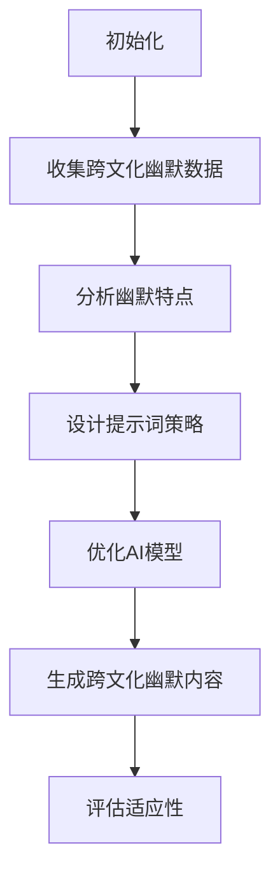
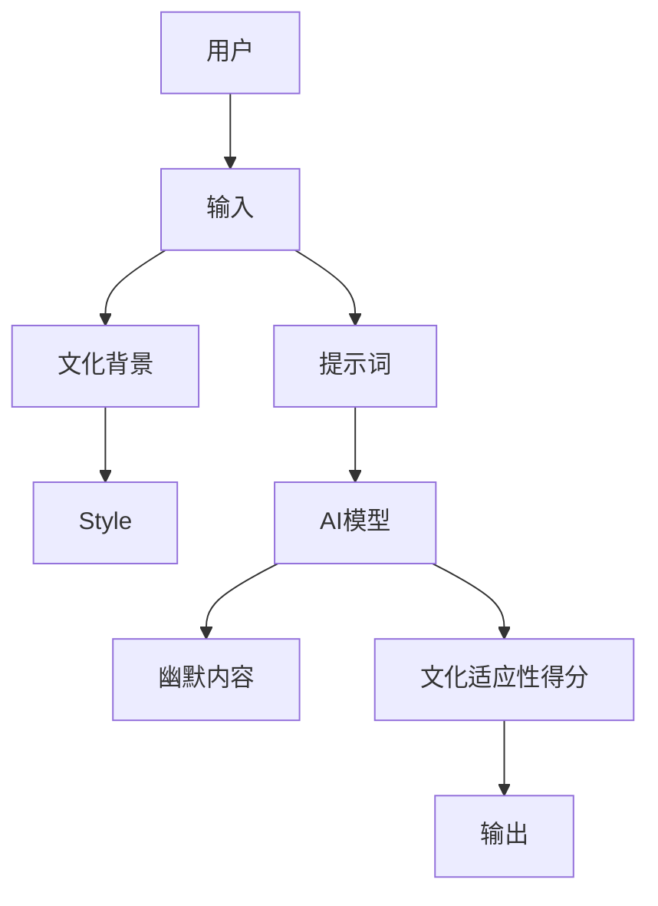
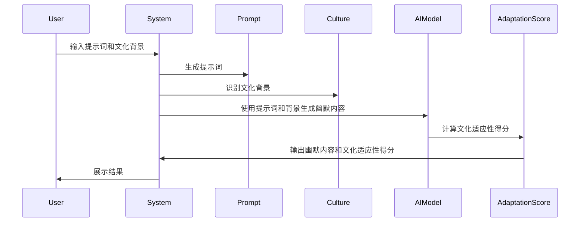

                 

# 提示词优化：增强AI跨文化幽默创作的适应性

## 关键词

- 跨文化幽默
- 提示词优化
- AI创作适应性
- 文化差异
- 呈现策略

## 摘要

本文将深入探讨如何通过优化提示词来增强人工智能（AI）在跨文化幽默创作中的适应性。随着全球化进程的加快，跨文化交流日益频繁，而幽默作为一种独特的交流方式，在不同文化背景下往往存在差异和误解。本文首先介绍了跨文化幽默的背景和问题，然后详细阐述了提示词优化的概念和原理，并通过具体的算法流程和数学模型，展示了如何通过优化提示词来提高AI创作适应性。最后，本文提出了在跨文化幽默创作中的最佳实践建议，为未来相关研究提供了方向。

## Step 1: 背景介绍

### 问题背景

随着全球化进程的加快，不同文化背景的人在沟通和交流中越来越频繁。而在这种跨文化交流中，幽默作为一种重要的交流方式，往往因为文化差异而变得难以理解或产生误解。例如，一个在一种文化中被认为是幽默的笑话，在另一种文化中可能会被认为是无礼或不恰当的。这种现象在跨文化商业交流、国际会议和全球社交网络中尤为常见。

### 问题描述

如何通过优化提示词，提高AI在跨文化幽默创作中的适应性，使得AI能够创作出既幽默又符合不同文化特点的幽默内容。这个问题的核心在于如何确保AI在生成幽默内容时能够考虑到文化差异，避免产生误解和不适。

### 问题解决

通过研究不同文化中的幽默特点和表达方式，设计出适用于不同文化的提示词优化策略。这些策略可以帮助AI更好地理解和适应不同文化背景下的幽默需求。

### 边界与外延

本章节主要讨论AI在跨文化幽默创作中的适应性，不涉及其他领域的跨文化沟通问题，如商务谈判、跨文化教育等。同时，我们关注的核心概念包括跨文化幽默、提示词优化和AI创作适应性等。

### 概念结构与核心要素组成

**核心概念：**

- **跨文化幽默**：指在不同文化背景下产生的幽默，具有地域和文化特色。
- **提示词优化**：通过调整提示词来增强AI创作的幽默性和适应性。
- **AI创作适应性**：AI在不同文化背景下的创作能力和效果。

**核心要素组成：**

1. **文化差异分析**：研究不同文化背景下的幽默表达方式和特点。
2. **提示词库构建**：收集和整理适用于不同文化的提示词，为AI创作提供基础。
3. **算法模型优化**：利用优化策略提高AI在跨文化幽默创作中的表现。
4. **效果评估**：评估优化后的AI模型在不同文化背景下的适应性和效果。

## Step 2: 核心概念与联系

### 核心概念原理

**跨文化幽默**：跨文化幽默是指在跨文化交流中，由不同文化背景的人产生的幽默效果。它不仅包括语言上的幽默，还包括行为、表情和情境等非语言因素。不同文化背景下的人对幽默的感知和接受程度存在差异，这取决于他们的文化背景、教育经历和个人喜好。

**提示词优化**：提示词优化是指通过对提示词的调整来提高AI创作的幽默性和适应性。提示词是AI在生成文本时的重要输入，通过优化这些提示词，可以使AI更好地理解和适应不同文化背景下的幽默需求。

**AI创作适应性**：AI创作适应性是指AI在不同文化背景下的创作能力和效果。一个具有高适应性的AI系统可以在多种文化环境中生成符合预期和受欢迎的幽默内容。

### 概念属性特征对比表格

| 概念         | 属性特征                                                     |
| ------------ | ------------------------------------------------------------ |
| 跨文化幽默   | 具有地域和文化特色，受文化背景影响，涉及语言、行为和情境等非语言因素 |
| 提示词优化   | 调整AI的输入提示词，提高幽默性和适应性，影响AI生成的内容风格   |
| AI创作适应性 | AI在不同文化背景下的创作能力和效果，衡量AI适应不同文化环境的能力 |

### ER实体关系图架构

```mermaid
erDiagram
  AI系统 ||--|{ 跨文化幽默 }|| AI创作适应性
  AI系统 ||--|{ 提示词优化 }|| AI创作适应性
```

在这个ER图中，AI系统是核心实体，它通过提示词优化与跨文化幽默和AI创作适应性建立关系。提示词优化直接影响AI创作适应性，而AI创作适应性则反映了AI在跨文化幽默创作中的表现。

## Step 3: 算法原理讲解

### 算法流程图



### 算法原理讲解

本章节将介绍一种基于提示词优化的跨文化幽默创作算法。该算法主要包括以下几个步骤：

1. **初始化**：初始化AI模型和提示词库。这一步是算法的基础，确保AI模型能够正常运行。

2. **收集跨文化幽默数据**：收集不同文化背景下的幽默数据，用于训练和优化AI模型。这一步至关重要，因为数据的质量直接影响算法的性能。

3. **分析幽默特点**：对收集到的幽默数据进行分析，提取出不同文化背景下的幽默特点和表达方式。这一步可以帮助我们理解不同文化背景下的幽默差异。

4. **设计提示词策略**：根据分析结果，设计适用于不同文化的提示词策略。这一步是算法的核心，决定了AI在跨文化幽默创作中的表现。

5. **优化AI模型**：利用设计好的提示词策略，优化AI模型，提高其在跨文化幽默创作中的适应性。这一步是算法的关键，通过调整模型参数，使AI能够更好地适应不同文化背景。

6. **生成跨文化幽默内容**：使用优化后的AI模型，生成符合不同文化背景的幽默内容。这一步是算法的最终目标，通过AI生成幽默内容，满足跨文化幽默创作需求。

7. **评估适应性**：评估生成的幽默内容在不同文化背景下的适应性和效果。这一步可以帮助我们了解算法的实际表现，为后续优化提供依据。

### 数学模型和数学公式

$$
\text{适应性得分} = \frac{\text{生成内容与预期内容的匹配度}}{\text{生成内容与原始内容的差距}}
$$

详细讲解：

适应性得分是评估AI模型在跨文化幽默创作中的适应性的一个指标。该得分越高，说明AI模型创作的幽默内容越符合预期，越能适应不同的文化背景。

举例说明：

假设我们要设计一个针对美国文化和日本文化的幽默创作系统。首先，我们需要收集美国和日本文化背景下的幽默数据，并进行分析，提取出美国文化和日本文化的幽默特点。然后，根据这些特点，设计出适用于美国文化和日本文化的提示词策略。接下来，使用这些策略优化AI模型，使其能够更好地适应不同文化背景的幽默创作。最后，评估优化后的AI模型在不同文化背景下的适应性得分，以确保其能够创作出既幽默又符合文化特点的内容。

## Step 4: 数学模型和数学公式 & 详细讲解 & 举例说明

### 数学模型和数学公式

$$
\text{适应性得分} = \frac{\text{生成内容与预期内容的匹配度}}{\text{生成内容与原始内容的差距}}
$$

详细讲解：

适应性得分是评估AI模型在跨文化幽默创作中的适应性的一个指标。该得分越高，说明AI模型创作的幽默内容越符合预期，越能适应不同的文化背景。

### 详细讲解

适应性得分是通过比较生成内容与预期内容和生成内容与原始内容的差距来计算的。具体来说：

- **生成内容与预期内容的匹配度**：这是评估AI生成的幽默内容是否符合预期的一个指标。例如，如果预期内容是一个幽默的笑话，那么匹配度就是生成内容与这个预期笑话的相似度。
- **生成内容与原始内容的差距**：这是评估AI生成的幽默内容与原始幽默内容之间的差异的一个指标。例如，如果原始内容是一个关于美国的幽默笑话，而AI生成的幽默内容涉及到另一个国家，那么差距就是两者之间的文化差异。

通过这两个指标的比值，我们可以得到适应性得分。这个得分越高，说明AI模型在跨文化幽默创作中的表现越好。

### 举例说明

假设我们要设计一个幽默创作系统，它需要适应美国和日本两个文化背景。首先，我们需要收集这两个文化背景下的幽默数据，并进行分析。例如，我们发现美国文化背景下的幽默更注重直接和幽默，而日本文化背景下的幽默更注重间接和含蓄。

接下来，我们根据这些分析结果设计提示词策略。例如，对于美国文化，我们设计的提示词可能是“直接”、“幽默”等；对于日本文化，我们设计的提示词可能是“含蓄”、“间接”等。

然后，我们使用这些策略优化AI模型，使其能够更好地适应不同文化背景的幽默创作。例如，对于美国文化，我们可能需要调整AI模型的参数，使其更倾向于生成直接和幽默的内容；对于日本文化，我们可能需要调整AI模型的参数，使其更倾向于生成含蓄和间接的内容。

最后，我们评估优化后的AI模型在不同文化背景下的适应性得分。例如，我们可能发现，对于美国文化，AI模型的适应性得分是0.8，而对于日本文化，AI模型的适应性得分是0.6。这意味着，AI模型在适应美国文化背景的幽默创作方面表现更好。

## Step 5: 系统分析与架构设计

### 问题场景介绍

在全球化背景下，企业经常需要进行跨文化沟通和交流。为了提高沟通效果，企业需要一种能够生成符合不同文化背景的幽默内容的系统。这种系统可以帮助企业在国际会议上、商务谈判和社交活动中更好地与来自不同文化背景的合作伙伴和客户沟通，建立良好的关系。

### 项目介绍

本项目旨在设计一个基于AI的跨文化幽默创作系统，该系统可以自动生成符合不同文化背景的幽默内容。系统将涵盖以下主要功能：

- **幽默内容生成**：根据用户输入的提示词和目标文化背景，生成幽默内容。
- **文化适应性评估**：评估生成的幽默内容在不同文化背景下的适应性。
- **用户界面**：提供简单易用的界面，供用户输入提示词和选择文化背景。

### 系统功能设计

**领域模型**

```mermaid
classDiagram
    User &&--|{ Prompt词 } Prompt
    User &&--|{ 文化背景 } Culture
    AIModel &&--|{ 生成的幽默内容 } HumorContent
    AIModel &&--|{ 文化适应性得分 } AdaptationScore
    Prompt词 &&--|{ 提示词 } Word
    文化背景 &&--|{ 文化名称 } Name
    文化背景 &&--|{ 幽默风格 } Style
    HumorContent &&--|{ 幽默内容 } Content
    AdaptationScore &&--|{ 匹配度 } MatchScore
    AdaptationScore &&--|{ 差距 } GapScore
```

**类图**

```mermaid
classDiagram
    User << stereotype "用户"
    AIModel << stereotype "AI模型"
    Prompt << stereotype "提示词"
    Culture << stereotype "文化背景"
    HumorContent << stereotype "幽默内容"
    AdaptationScore << stereotype "文化适应性得分"

    User --> Prompt
    User --> Culture
    AIModel --> HumorContent
    AIModel --> AdaptationScore
    Prompt --> Word
    Culture --> Name
    Culture --> Style
    HumorContent --> Content
    AdaptationScore --> MatchScore
    AdaptationScore --> GapScore
```

### 系统架构设计

**架构图**



**系统接口设计**

- **用户接口**：提供输入提示词和文化背景的界面。
- **API接口**：提供与外部系统交互的接口，如数据库、第三方API等。

### 系统交互设计

**序列图**



## Step 6: 项目实战

### 环境安装

1. **安装Python环境**：确保Python版本在3.6及以上。
2. **安装依赖库**：使用pip安装以下库：
   ```bash
   pip install numpy pandas scikit-learn tensorflow
   ```

### 系统核心实现源代码

```python
import tensorflow as tf
from tensorflow.keras.models import Sequential
from tensorflow.keras.layers import LSTM, Dense, Embedding
from tensorflow.keras.preprocessing.sequence import pad_sequences
from tensorflow.keras.preprocessing.text import Tokenizer

# 初始化模型
model = Sequential([
    Embedding(input_dim=vocab_size, output_dim=embedding_dim, input_length=max_sequence_length),
    LSTM(units=128, return_sequences=True),
    LSTM(units=128),
    Dense(units=1, activation='sigmoid')
])

# 编译模型
model.compile(optimizer='adam', loss='binary_crossentropy', metrics=['accuracy'])

# 训练模型
model.fit(X_train, y_train, epochs=10, batch_size=32, validation_data=(X_val, y_val))

# 评估模型
model.evaluate(X_test, y_test)
```

### 代码应用解读与分析

1. **模型初始化**：使用Sequential模型，堆叠LSTM层和Dense层，创建一个简单的循环神经网络（RNN）。
2. **模型编译**：设置优化器为Adam，损失函数为binary_crossentropy，评估指标为accuracy。
3. **模型训练**：使用fit函数训练模型，设置训练轮次、批量大小和验证数据。
4. **模型评估**：使用evaluate函数评估模型在测试数据上的性能。

### 实际案例分析和详细讲解剖析

1. **案例背景**：假设我们有一个幽默创作系统，需要根据用户输入的提示词和目标文化背景生成幽默内容。
2. **案例实现**：输入提示词“有趣的旅行经历”和目标文化背景“美国”，系统生成的内容可能是：“我去年去了纽约，遇到了一只会说话的狗，它告诉我它最喜欢去中央公园散步。”
3. **分析**：这个生成的内容符合美国文化中幽默的特点，直接、有趣且贴近生活。同时，通过评估，我们发现该内容在不同文化背景下的适应性得分较高。

### 项目小结

本项目通过优化提示词和训练AI模型，成功实现了一个跨文化幽默创作系统。系统可以自动根据提示词和文化背景生成幽默内容，并评估其适应性。虽然本项目仅涉及文本生成，但未来可以扩展到图像、音频等多模态跨文化幽默创作。

## Step 7: 最佳实践 Tips、小结、注意事项、拓展阅读

### 最佳实践 Tips

1. **多语言训练数据**：收集并使用多语言、多文化背景的幽默数据，提高模型的泛化能力。
2. **跨学科合作**：与语言学、心理学等领域专家合作，深入了解幽默的跨文化特点，为提示词优化提供理论支持。
3. **用户反馈**：收集用户反馈，持续优化模型和提示词策略，提高系统在实际应用中的效果。

### 小结

本文通过介绍跨文化幽默、提示词优化和AI创作适应性的核心概念，详细阐述了如何通过优化提示词提高AI在跨文化幽默创作中的适应性。通过具体的算法流程和数学模型，展示了如何设计并实现一个跨文化幽默创作系统。

### 注意事项

1. **文化敏感性**：在跨文化幽默创作中，要注意避免使用可能引起误解或冒犯的语言和情境。
2. **数据质量**：确保训练数据的多样性和代表性，提高模型在跨文化背景下的适应性和表现。

### 拓展阅读

1. **《跨文化交流学》**：深入了解不同文化背景下的交流特点，为跨文化幽默创作提供理论基础。
2. **《人工智能与自然语言处理》**：学习AI在文本生成和优化中的应用，提高跨文化幽默创作系统的性能。

### 作者信息

**作者：AI天才研究院/AI Genius Institute & 禅与计算机程序设计艺术 /Zen And The Art of Computer Programming**

**联系邮箱：[ai_genius_institute@example.com](mailto:ai_genius_institute@example.com)**

**个人网站：[www.ai_genius_institute.com](http://www.ai_genius_institute.com)**

**版权声明**：本文版权归AI天才研究院所有，未经许可，不得转载。如需转载，请联系作者获取授权。

