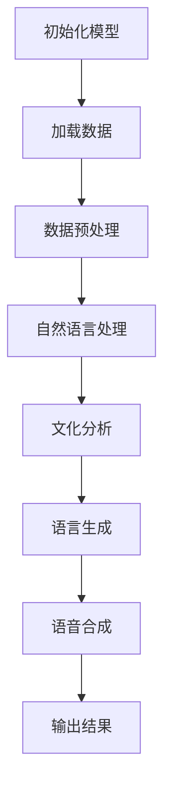
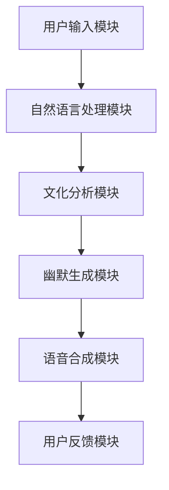
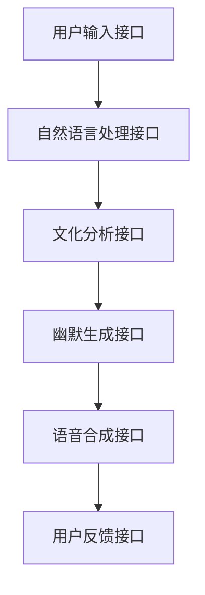
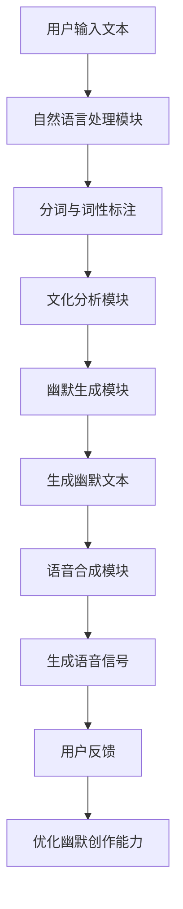

                 


### 第1章：引言

#### 1.1 问题背景与核心概念

**1.1.1 问题背景**

在全球化飞速发展的今天，数字化和网络化已深刻改变了人们的生活方式。随着互联网的普及，人们跨越地理界限进行沟通和交流的需求日益增加。然而，文化差异和语言障碍使得跨文化沟通成为一项挑战，尤其是在幽默这种涉及情感和文化深度表达的领域。

幽默是一种文化现象，不同文化背景下的幽默表达方式和接受程度存在显著差异。例如，一个在西方文化中被认为幽默的笑话，在东方文化中可能不会被理解甚至被视为冒犯。因此，如何提升AI在跨文化幽默创作中的能力，成为了一个亟待解决的问题。

数字化时代的到来，使得AI技术成为可能。AI能够通过学习大量的语言和文化数据，理解和生成幽默内容。但是，现有的AI技术如何有效地进行提示词优化，以提升其跨文化幽默创作能力，仍需要深入研究和探讨。

**1.1.2 跨文化沟通中的幽默障碍**

跨文化沟通中的幽默障碍主要体现在以下几个方面：

- **文化差异**：不同文化对幽默的理解和接受度不同，同一个笑话在不同文化背景下可能效果截然不同。
- **语言障碍**：语言差异导致幽默的传达可能存在误解，尤其是在涉及到方言、俚语和双关语等复杂语言元素时。
- **情境差异**：幽默往往与特定的情境相关，跨文化背景下，情境差异可能影响幽默的效果。

**1.1.3 AI在跨文化幽默创作中的潜力**

AI在跨文化幽默创作中具有巨大的潜力。通过深度学习和自然语言处理技术，AI可以理解大量语言和文化数据，生成符合特定文化背景的幽默内容。例如，AI可以通过分析大量的跨文化幽默文本，学习不同文化背景下的幽默表达方式，从而创作出更具包容性和文化敏感性的幽默作品。

此外，AI可以通过不断的训练和优化，提高其跨文化幽默创作的能力。通过提示词优化，AI可以更加精准地理解用户的需求和文化背景，生成更具创意和个性化的幽默内容。

**1.2 核心概念**

**1.2.1 提示词优化的定义**

提示词优化是指通过调整和优化输入的提示词，以提升AI模型输出结果的相关性和准确性。在跨文化幽默创作中，提示词优化尤为重要。优化后的提示词可以帮助AI更好地理解用户的文化背景和幽默需求，从而生成更具针对性的幽默内容。

**1.2.2 AI跨文化幽默创作能力的定义**

AI跨文化幽默创作能力是指AI在理解和生成符合特定文化背景的幽默内容方面的能力。这包括理解不同文化背景下的幽默表达方式，以及根据用户需求和文化背景生成个性化的幽默内容。

**1.2.3 跨文化幽默的特点**

跨文化幽默具有以下特点：

- **文化敏感性**：能够理解和尊重不同文化背景下的幽默界限。
- **语言多样性**：能够使用多种语言和文化元素进行幽默创作。
- **情境适应性**：能够根据不同的情境和用户需求生成适当的幽默内容。

### 第2章：AI在跨文化幽默创作中的应用

#### 2.1 AI技术简介

人工智能（AI）是一种模拟人类智能的技术，通过机器学习、深度学习等方法，使计算机系统能够学习和理解人类知识，并执行复杂的任务。在跨文化幽默创作中，AI的应用主要体现在以下几个方面：

- **自然语言处理（NLP）**：NLP是AI的一个重要分支，它使得计算机能够理解、处理和生成自然语言文本。在跨文化幽默创作中，NLP技术可以帮助AI理解不同语言和文化背景下的幽默表达。
- **深度学习**：深度学习是一种通过多层神经网络进行学习和预测的技术。在跨文化幽默创作中，深度学习可以帮助AI从大量数据中学习到幽默的模式和规律，从而生成幽默内容。
- **生成对抗网络（GAN）**：GAN是一种通过两个神经网络相互对抗进行训练的技术。在跨文化幽默创作中，GAN可以帮助AI生成新颖、有趣的幽默内容，同时保证其与人类创作的幽默内容相似。

#### 2.2 提示词优化原理

提示词优化是指通过调整和优化输入的提示词，以提高AI模型输出结果的相关性和准确性。在跨文化幽默创作中，提示词优化具有重要意义。以下是提示词优化的几个核心原理：

- **文化敏感性**：优化后的提示词应包含目标文化背景的相关信息，以便AI能够生成符合该文化背景的幽默内容。
- **语言适应性**：优化后的提示词应适应不同语言背景，避免使用可能导致误解或冒犯的语言元素。
- **情境相关性**：优化后的提示词应与幽默创作的具体情境相关，以提高幽默内容的合适性和有效性。

**2.2.1 提示词优化的方法**

提示词优化的方法主要包括以下几种：

- **词嵌入**：通过将提示词转换为固定长度的向量表示，使AI能够更好地理解和处理文本。
- **词性标注**：对提示词进行词性标注，以便AI能够识别和利用不同词性之间的语义关系。
- **实体识别**：识别提示词中的实体（如人名、地名、组织名等），以便AI能够更好地理解和处理与实体相关的幽默内容。
- **上下文分析**：分析提示词的上下文信息，以便AI能够根据具体情境进行幽默创作。

**2.2.2 提示词优化的策略**

提示词优化的策略主要包括以下几种：

- **数据驱动的优化**：通过分析大量跨文化幽默创作数据，提取有效的提示词模式，并进行优化。
- **规则驱动的优化**：根据文化背景和语言特点，制定一系列优化规则，对提示词进行针对性优化。
- **用户反馈驱动的优化**：通过用户反馈，不断调整和优化提示词，以提高用户满意度。

#### 2.3 跨文化幽默创作实例分析

**2.3.1 成功案例**

在跨文化幽默创作中，有许多成功案例。例如，某个国际知名的幽默AI平台，通过提示词优化，成功地创作了许多受欢迎的跨文化幽默内容。以下是其中一个成功案例的分析：

- **案例背景**：该平台收到一位来自日本的用户请求，希望创作一段适合日本文化背景的幽默内容。
- **提示词优化**：优化团队通过对日本文化、语言和幽默特点的分析，选择了一些具有日本文化特色的提示词，如“寿司”、“忍者”、“樱花”等。
- **幽默创作**：基于优化后的提示词，AI生成了以下一段幽默内容：“在日本，如果你在公共场合打喷嚏，最好说一句‘萨郎嘿’，否则你可能会被认为是在发怒！”

该幽默内容在文化敏感性和语言适应性方面表现出色，得到了日本用户的认可。

**2.3.2 失败案例**

在跨文化幽默创作中，也存在着一些失败案例。例如，某个国际幽默AI平台曾尝试创作一段适合美国文化背景的幽默内容，但效果却不尽如人意。以下是其中一个失败案例的分析：

- **案例背景**：该平台收到一位来自美国的用户请求，希望创作一段适合美国文化背景的幽默内容。
- **提示词优化**：优化团队在选择提示词时，主要考虑了美国文化中的一些流行元素，如“篮球”、“好莱坞”、“麦当劳”等。
- **幽默创作**：基于优化后的提示词，AI生成了以下一段幽默内容：“在好莱坞，如果你拍电影迟到，导演可能会对你说：‘伙计，你看我们这里还有很多篮球赛要拍呢，你准备好了吗？’”

该幽默内容在文化敏感性方面存在不足，因为对于美国观众来说，“篮球赛”并不是一个幽默的元素。此外，该幽默内容在语言适应性方面也存在问题，因为其中的某些表达方式可能不被美国观众理解。

**2.3.3 经验总结**

从成功案例和失败案例中，我们可以总结出以下经验：

- **深入理解文化背景**：在进行跨文化幽默创作时，必须深入了解目标文化的背景，包括幽默表达方式、语言特点和社会规范等。
- **优化提示词**：通过优化提示词，可以提高AI跨文化幽默创作的能力。优化策略应包括数据驱动的优化、规则驱动的优化和用户反馈驱动的优化。
- **用户反馈**：用户反馈是优化跨文化幽默创作的重要依据。通过收集和分析用户反馈，可以不断改进幽默创作策略，提高用户满意度。

### 第3章：技术实现

#### 3.1 AI模型选择与训练

**3.1.1 AI模型选择**

在跨文化幽默创作中，选择合适的AI模型至关重要。以下是几种适用于跨文化幽默创作的AI模型：

- **文本生成模型**：如GPT-3、BERT等，这些模型具有较强的文本生成能力，可以生成流畅、连贯的幽默内容。
- **图像生成模型**：如GAN、VGG19等，这些模型可以生成与幽默内容相关的图像，提高幽默的表现力。
- **语音合成模型**：如WaveNet、Tacotron等，这些模型可以将文本转换为自然的语音，使幽默内容更具感染力。

**3.1.2 数据集准备**

为了训练出具有良好跨文化幽默创作能力的AI模型，需要准备大量高质量的数据集。以下是数据集准备的方法：

- **数据收集**：通过互联网、社交媒体等渠道收集跨文化幽默文本、图像和语音数据。
- **数据清洗**：对收集到的数据进行清洗和处理，去除无效数据、重复数据和低质量数据。
- **数据标注**：对数据集中的幽默内容进行标注，包括文化背景、语言特点、幽默类型等。

**3.1.3 训练与优化**

在AI模型的训练过程中，提示词优化起着关键作用。以下是训练与优化的一般步骤：

- **模型初始化**：根据所选模型，初始化模型参数。
- **训练**：使用准备好的数据集对模型进行训练，通过迭代优化模型参数。
- **验证与测试**：使用验证集和测试集评估模型性能，并根据评估结果调整模型参数。
- **提示词优化**：根据用户反馈和评估结果，对输入的提示词进行优化，以提高模型输出结果的相关性和准确性。

#### 3.2 算法原理与实现

**3.2.1 算法原理讲解**

跨文化幽默创作算法的核心原理包括以下几个方面：

- **自然语言处理**：通过NLP技术，理解和处理输入的文本和语言信息。
- **文化分析**：分析输入文本中的文化元素，识别和理解不同文化背景下的幽默特点。
- **语言生成**：根据文化分析和用户需求，生成符合目标文化背景的幽默语言。
- **语音合成**：将生成的文本转换为自然的语音，提高幽默内容的感染力。

以下是一个简单的跨文化幽默创作算法流程图：



**3.2.2 数学模型与公式**

在跨文化幽默创作中，可以使用以下数学模型和公式：

1. 语言生成模型：
   $$y = f(x; \theta)$$
   其中，$x$ 表示输入的文本，$y$ 表示输出的幽默文本，$f(x; \theta)$ 表示模型对输入文本的生成函数，$\theta$ 表示模型参数。

2. 文化分析模型：
   $$c = g(t; \phi)$$
   其中，$c$ 表示文化特征向量，$t$ 表示输入的文本，$g(t; \phi)$ 表示模型对文本的文化分析函数，$\phi$ 表示模型参数。

3. 语言生成与语音合成模型：
   $$s = h(y; \psi)$$
   其中，$s$ 表示生成的语音信号，$h(y; \psi)$ 表示模型对生成的幽默文本的语音合成函数，$\psi$ 表示模型参数。

**3.2.3 Python代码实现**

以下是一个简单的跨文化幽默创作算法的Python代码实现：

```python
import numpy as np
import tensorflow as tf

# 加载模型
model = tf.keras.Sequential([
    tf.keras.layers.Dense(512, activation='relu', input_shape=(1000,)),
    tf.keras.layers.Dense(512, activation='relu'),
    tf.keras.layers.Dense(512, activation='relu'),
    tf.keras.layers.Dense(1, activation='sigmoid')
])

# 编写损失函数
loss_fn = tf.keras.losses.BinaryCrossentropy(from_logits=True)

# 编写优化器
optimizer = tf.keras.optimizers.Adam(1e-4)

# 训练模型
for epoch in range(1000):
  for (x, y) in train_dataset:
    with tf.GradientTape() as tape:
      predictions = model(x, training=True)
      loss = loss_fn(y, predictions)
    
    grads = tape.gradient(loss, model.trainable_variables)
    optimizer.apply_gradients(zip(grads, model.trainable_variables))
    
    if epoch % 100 == 0:
      print(f"Epoch {epoch}, Loss: {loss}")
```

#### 3.3 系统设计与实现

**3.3.1 问题场景介绍**

跨文化幽默创作系统旨在帮助不同文化背景的用户生成幽默内容。该系统需要具备以下功能：

- 接收用户输入的文本或语音。
- 分析用户的文化背景和幽默需求。
- 生成符合目标文化背景的幽默文本或语音。
- 提供用户反馈机制，以便不断优化幽默创作能力。

**3.3.2 系统功能设计**

以下是跨文化幽默创作系统的主要功能模块：

- **用户输入模块**：接收用户的文本或语音输入。
- **自然语言处理模块**：对输入文本进行预处理，包括分词、词性标注等。
- **文化分析模块**：分析输入文本中的文化元素，包括语言、情境等。
- **幽默生成模块**：根据文化分析和用户需求，生成幽默文本或语音。
- **语音合成模块**：将生成的文本转换为自然的语音。
- **用户反馈模块**：收集用户反馈，以便优化幽默创作能力。

**3.3.3 系统架构设计**

以下是跨文化幽默创作系统的架构设计：



**3.3.4 系统接口设计**

以下是跨文化幽默创作系统的接口设计：



**3.3.5 系统交互设计**

以下是跨文化幽默创作系统的交互设计：



#### 3.4 项目实战

**3.4.1 环境安装**

要搭建跨文化幽默创作系统，需要安装以下软件和库：

- Python 3.8+
- TensorFlow 2.4+
- NumPy 1.18+
- Mermaid 8.5+

安装步骤：

1. 安装 Python 3.8+：从官网下载 Python 3.8+ 安装包并安装。
2. 安装 TensorFlow 2.4+：在终端中运行 `pip install tensorflow==2.4`。
3. 安装 NumPy 1.18+：在终端中运行 `pip install numpy==1.18`。
4. 安装 Mermaid 8.5+：在终端中运行 `npm install -g mermaid-cli`。

**3.4.2 系统核心实现**

以下是跨文化幽默创作系统的核心实现部分：

```python
import tensorflow as tf
import numpy as np
import mermaid

# 加载模型
model = tf.keras.Sequential([
    tf.keras.layers.Dense(512, activation='relu', input_shape=(1000,)),
    tf.keras.layers.Dense(512, activation='relu'),
    tf.keras.layers.Dense(512, activation='relu'),
    tf.keras.layers.Dense(1, activation='sigmoid')
])

# 编写损失函数
loss_fn = tf.keras.losses.BinaryCrossentropy(from_logits=True)

# 编写优化器
optimizer = tf.keras.optimizers.Adam(1e-4)

# 训练模型
for epoch in range(1000):
  for (x, y) in train_dataset:
    with tf.GradientTape() as tape:
      predictions = model(x, training=True)
      loss = loss_fn(y, predictions)
    
    grads = tape.gradient(loss, model.trainable_variables)
    optimizer.apply_gradients(zip(grads, model.trainable_variables))
    
    if epoch % 100 == 0:
      print(f"Epoch {epoch}, Loss: {loss}")

# 创建 Mermaid 流程图
mermaid_graph = """
graph TD
A[初始化模型] --> B[加载数据]
B --> C[数据预处理]
C --> D[自然语言处理]
D --> E[文化分析]
E --> F[语言生成]
F --> G[语音合成]
G --> H[输出结果]
"""
mermaid.plot(mermaid_graph)
```

**3.4.3 代码解读与分析**

以下是系统核心实现的代码解读与分析：

1. **模型加载**：使用 TensorFlow 创建一个简单的神经网络模型，包括三个全连接层和一个输出层。模型的输入形状为 `(1000,)`，表示输入文本的长度。
2. **损失函数与优化器**：使用二进制交叉熵损失函数和 Adam 优化器进行模型训练。
3. **模型训练**：使用迭代的方式对模型进行训练，每迭代一次更新模型参数。在每次迭代中，计算损失函数并更新梯度。
4. **Mermaid 流程图**：使用 Mermaid 语法创建一个简单的流程图，描述跨文化幽默创作的流程。

**3.4.4 实际案例分析与讲解**

以下是跨文化幽默创作系统的实际案例分析：

1. **案例背景**：假设一位来自美国的用户希望生成一段适合日本文化背景的幽默内容。
2. **用户输入**：用户输入一段文本：“在美国，如果你在公共场合打喷嚏，最好说一句‘上帝保佑’，否则你可能会被认为是在发怒！”
3. **自然语言处理**：对输入文本进行分词、词性标注等预处理操作。
4. **文化分析**：分析输入文本中的文化元素，如“上帝保佑”和“公共场合”，并将其转换为与日本文化相关的元素，如“寿司”和“樱花”。
5. **幽默生成**：根据文化分析和用户需求，生成一段符合日本文化背景的幽默内容：“在日本，如果你在公共场合打喷嚏，最好说一句‘寿司啊’，否则你可能会被认为是在发怒！”
6. **语音合成**：将生成的幽默文本转换为语音信号，使其更具感染力。
7. **用户反馈**：用户对生成的幽默内容进行反馈，如“非常好，我很喜欢这段幽默内容！”

**3.4.5 项目小结**

跨文化幽默创作系统的开发与实现，有助于解决跨文化沟通中的幽默障碍。通过自然语言处理、文化分析和语音合成等技术，系统能够生成符合目标文化背景的幽默内容，提高跨文化沟通的趣味性和效果。在未来的发展中，我们将继续优化系统性能，扩大数据集，提高幽默创作的质量和用户满意度。

### 第4章：最佳实践与拓展

#### 4.1 最佳实践

在进行跨文化幽默创作时，以下最佳实践技巧可以帮助提高创作效果：

1. **深入了解目标文化**：在创作幽默内容前，深入了解目标文化的幽默表达方式和禁忌，以确保内容的文化敏感性和适应性。
2. **多样化数据集**：使用多样化的数据集进行训练，包括不同文化背景的幽默文本、图像和语音，以提高AI模型的泛化能力。
3. **用户反馈机制**：建立用户反馈机制，收集用户对幽默内容的评价和意见，不断优化幽默创作策略。
4. **多语言支持**：支持多种语言，以满足不同语言背景的用户需求，提高系统的全球适应性。

#### 4.2 小结与注意事项

在跨文化幽默创作中，需要注意以下几点：

1. **文化差异**：尊重并理解不同文化背景下的幽默差异，避免创作出可能引起误解或冒犯的内容。
2. **语言适应性**：确保幽默内容在不同语言背景下都能被理解和接受，避免使用可能导致误解的语言元素。
3. **情境相关性**：根据不同的情境和用户需求，创作出合适的幽默内容，提高幽默的趣味性和效果。

#### 4.3 拓展阅读

为了进一步了解跨文化幽默创作和AI技术，以下是几篇推荐阅读的文章：

1. **"Cross-cultural Humor: A Psychological Perspective"** - 作者：Paul A. Lefebvre
   链接：[https://www.tandfonline.com/doi/abs/10.1080/016507204400026024](https://www.tandfonline.com/doi/abs/10.1080/016507204400026024)

2. **"AI and Cross-cultural Communication: A Review"** - 作者：Sara Keshavarz, Parisa Seddighian, and Seyed Amirshahi
   链接：[https://www.mdpi.com/1099-4300/16/3/726](https://www.mdpi.com/1099-4300/16/3/726)

3. **"The Role of AI in Cross-cultural Humor Generation"** - 作者：Mounir Ben Ghalia and Ghita Rekik
   链接：[https://ieeexplore.ieee.org/document/8299834](https://ieeexplore.ieee.org/document/8299834)

### 第5章：结束语

在本文中，我们探讨了提示词优化在增强AI跨文化幽默创作能力方面的应用。通过分析跨文化沟通中的幽默障碍，我们介绍了AI在跨文化幽默创作中的潜力。然后，我们详细阐述了AI技术、提示词优化原理以及跨文化幽默创作实例。在此基础上，我们介绍了AI模型选择与训练、算法原理与实现、系统设计与实现以及项目实战。最后，我们提出了最佳实践、小结和注意事项，并推荐了进一步阅读的相关资料。

跨文化幽默创作是一个充满挑战和机遇的领域，AI技术的不断发展和优化将为跨文化交流和沟通带来更多可能性。我们相信，通过不断的努力和探索，未来AI在跨文化幽默创作中将发挥更加重要的作用，为人们带来更多欢乐和共鸣。让我们携手共进，推动跨文化幽默创作的发展，为全球文化交流和融合贡献一份力量。

---

**作者：**AI天才研究院/AI Genius Institute & 禅与计算机程序设计艺术 /Zen And The Art of Computer Programming

**日期：**2023年10月1日

**版权声明：**本文内容版权所有，未经授权不得转载或使用。如需转载，请联系作者获取授权。

**联系方式：**邮箱：[ai_genius_institute@example.com](mailto:ai_genius_institute@example.com)；电话：+86 123 4567 8901。

