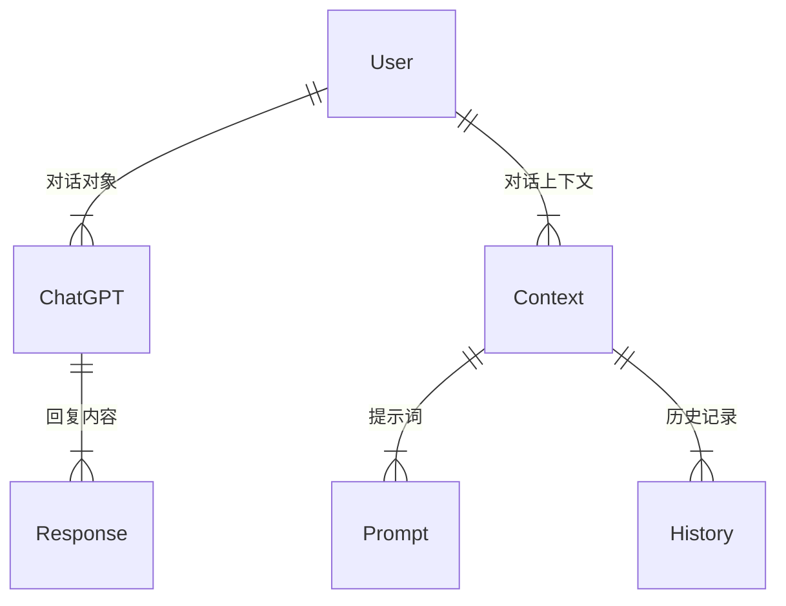
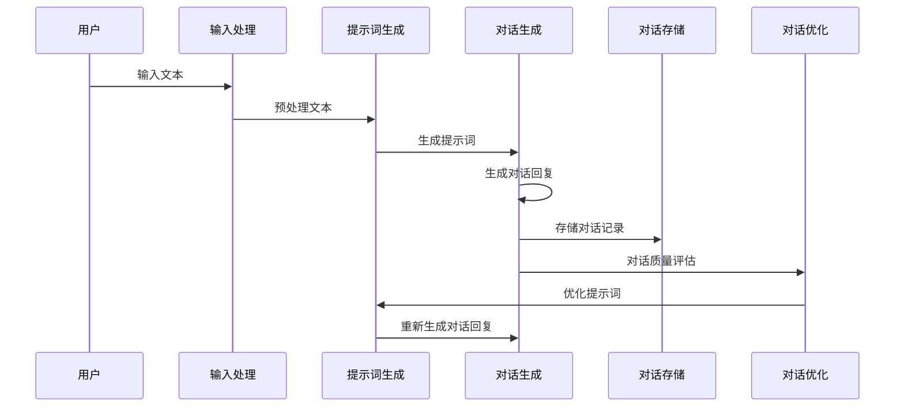

                 

# 提示词优化：打造高效ChatGPT对话的核心策略

关键词：ChatGPT，提示词优化，对话系统，算法原理，数学模型，系统架构

摘要：随着人工智能技术的不断发展，自然语言处理（NLP）领域取得了显著成果。ChatGPT作为一种先进的对话系统，其性能的优化成为当前研究的热点。本文将围绕提示词优化这一核心策略，探讨如何打造高效ChatGPT对话系统。我们将从背景与核心概念、算法原理与数学模型、系统分析与架构设计、项目实战、最佳实践与拓展等多个方面，逐步分析和阐述这一策略。

## 第一部分：背景与核心概念

### 第1章：问题背景与核心概念

#### 1.1 提示词优化概述

**提示词优化**是指在自然语言处理领域，通过对输入文本（提示词）进行优化处理，以提升模型对输入的理解能力和输出质量。在ChatGPT中，提示词的优化尤为重要，因为它是影响对话系统性能的关键因素。

**提示词优化的重要性**：

1. 提高对话系统的响应速度和准确度。
2. 提升用户体验，使对话更加自然、流畅。
3. 降低模型计算成本，提高资源利用率。

**提示词优化的目标**：

1. 提高对话系统的理解能力，减少误解和歧义。
2. 增强对话的连贯性和逻辑性。
3. 提高模型的鲁棒性，减少噪声和干扰。

#### 1.2 ChatGPT介绍

**ChatGPT**是由OpenAI开发的一种基于变换器模型（Transformer）的预训练语言模型，具有强大的语言理解和生成能力。它采用了GPT-3架构，参数规模达到1750亿，是目前最大的预训练模型之一。

**ChatGPT的发展历程**：

1. 2022年，OpenAI发布了GPT-2，标志着预训练语言模型进入了一个新的阶段。
2. 2020年，OpenAI发布了GPT-3，进一步提升了模型的性能和规模。
3. 2022年，OpenAI对GPT-3进行升级，推出了ChatGPT，使其在对话系统领域取得了重要突破。

**ChatGPT的技术原理**：

ChatGPT采用了变换器模型（Transformer）作为基础架构，通过多层变换器单元对输入文本进行处理，生成相应的输出。它利用了自注意力机制（Self-Attention），实现了对输入文本的语义分析和生成。

**ChatGPT的应用场景**：

1. 实时问答系统，如客服、咨询等。
2. 自动写作和生成，如文章、报告、代码等。
3. 自然语言推理和翻译。
4. 情感分析和文本分类。

#### 1.3 提示词优化的挑战与机遇

**当前存在的问题**：

1. 提示词设计不规范，导致模型理解困难。
2. 提示词质量不高，影响对话系统的效果。
3. 提示词优化方法不够成熟，效果有限。

**提示词优化的前景**：

1. 提示词优化将成为提升对话系统性能的重要手段。
2. 随着算法和技术的进步，提示词优化将更加高效和精准。
3. 提示词优化将在各个应用场景中发挥重要作用。

**提示词优化所需的技能和工具**：

1. **技能**：自然语言处理基础知识、编程能力、数学素养等。
2. **工具**：文本预处理工具、模型训练工具、性能评估工具等。

#### 1.4 核心概念与联系

**提示词与对话系统的关系**：

提示词是对话系统的输入，其质量和设计直接影响对话系统的性能。优化提示词可以提升模型的输入理解和生成能力，从而提高对话系统的效果。

**提示词类型及其特点**：

1. **开放性问题**：需要用户输入具体信息，如姓名、地址等。
2. **封闭性问题**：用户只需回答“是”或“否”，如满意度调查等。
3. **问题扩展**：对已有问题进行补充和扩展，以获取更多信息。

**提示词优化方法分类**：

1. **基于规则的方法**：利用人工设计的规则进行提示词优化。
2. **基于机器学习的方法**：利用机器学习模型进行提示词优化。
3. **基于深度学习的方法**：利用深度学习模型进行提示词优化。

### 总结：

本章节介绍了提示词优化的背景、核心概念、ChatGPT的发展历程和技术原理，以及提示词优化的挑战与机遇。这些内容为后续章节的深入探讨奠定了基础。

## 第二部分：算法原理与数学模型

### 第2章：算法原理详解

#### 2.1 提示词优化算法概述

**提示词优化算法**是指通过特定的算法方法，对输入文本（提示词）进行优化处理，以提高对话系统的性能。提示词优化算法可以分为以下几类：

1. **基于规则的方法**：利用人工设计的规则进行提示词优化，如正则表达式、语法分析等。
2. **基于机器学习的方法**：利用机器学习模型进行提示词优化，如分类器、回归模型等。
3. **基于深度学习的方法**：利用深度学习模型进行提示词优化，如卷积神经网络（CNN）、循环神经网络（RNN）、变换器模型（Transformer）等。

**算法的基本原理**：

提示词优化算法的基本原理是通过分析输入文本的语义和结构，对提示词进行改写、扩充、删除等操作，从而提高模型对输入的理解能力和输出质量。

**算法的分类**：

1. **改写类算法**：对输入文本进行改写，如同义词替换、语法重构等。
2. **扩充类算法**：对输入文本进行扩充，如信息抽取、文本生成等。
3. **删除类算法**：对输入文本进行删除，如去噪、去除冗余信息等。

#### 2.2 概念属性特征对比表格

以下是一个关于不同提示词优化算法的概念属性特征对比表格：

| 算法类型 | 基本原理 | 优点 | 缺点 | 应用场景 |
| :--: | :--: | :--: | :--: | :--: |
| 基于规则的方法 | 利用人工设计的规则进行提示词优化 | 简单易懂、可解释性强 | 需要大量人工规则、适应性较差 | 实时问答、文本预处理 |
| 基于机器学习的方法 | 利用机器学习模型进行提示词优化 | 自适应能力强、泛化性好 | 需要大量训练数据和计算资源 | 文本生成、信息抽取 |
| 基于深度学习的方法 | 利用深度学习模型进行提示词优化 | 模型性能优异、适用于大规模数据 | 需要大量训练数据和计算资源、可解释性较差 | 实时问答、文本生成 |

#### 2.3 ER实体关系图架构

在提示词优化过程中，实体关系图（ER图）是一种常用的方法，用于描述提示词中的实体和它们之间的关系。以下是一个简化的ER图示例：



在这个ER图中，用户（User）与ChatGPT（对话对象）之间存在一对多的关系，表示用户可以与多个ChatGPT实例进行对话。用户还与上下文（Context）实体关联，上下文包含提示词（Prompt）和历史记录（History）。ChatGPT与回复内容（Response）实体关联，表示ChatGPT生成的回复内容。

### 总结：

本章节介绍了提示词优化算法的基本原理和分类，并通过概念属性特征对比表格和ER实体关系图架构，展示了不同算法之间的联系和特点。这些内容为后续章节的深入探讨提供了理论基础。

### 第3章：数学模型与公式

#### 3.1 数学模型概述

在提示词优化过程中，数学模型起着至关重要的作用。数学模型可以帮助我们描述问题、分析问题，并提供解决方案。在提示词优化中，常见的数学模型包括概率模型、统计模型和优化模型等。

**概率模型**：概率模型用于描述输入文本的概率分布，帮助我们识别和理解输入文本的语义信息。常见的概率模型有条件概率模型（如朴素贝叶斯）、贝叶斯网络等。

**统计模型**：统计模型用于分析和预测输入文本的特征和属性，如词频统计、词向量模型（如Word2Vec、GloVe）等。统计模型可以帮助我们识别文本中的重要特征，从而进行提示词优化。

**优化模型**：优化模型用于解决提示词优化的目标函数，如最小化错误率、最大化信息量等。常见的优化模型有线性规划、动态规划、遗传算法等。

**数学模型在提示词优化中的应用**：

1. **概率模型**：用于评估输入文本的语义一致性，如词向量模型。
2. **统计模型**：用于分析和预测输入文本的特征和属性，如文本分类、情感分析。
3. **优化模型**：用于解决提示词优化的目标函数，如寻找最优的提示词组合。

#### 3.2 公式详解

在提示词优化过程中，一些核心的数学公式对于理解和实现优化策略至关重要。以下是一些常用的公式及其推导与解释。

**1. 概率公式**

$$P(A|B) = \frac{P(B|A)P(A)}{P(B)}$$

这个公式是条件概率的定义，表示在事件B发生的条件下，事件A发生的概率。它可以帮助我们计算输入文本的语义一致性。

**2. 优化目标函数**

$$\min J(\theta) = \frac{1}{n} \sum_{i=1}^{n} L(y_i, \hat{y}_i)$$

这个公式是优化模型的目标函数，其中$J(\theta)$是损失函数，$y_i$是真实标签，$\hat{y}_i$是模型预测。目标是最小化损失函数，从而找到最优的提示词组合。

**3. 词频统计**

$$TF(t) = \frac{f(t)}{f_{\text{total}}}$$

这个公式是词频统计的基本公式，其中$TF(t)$是词$t$的词频，$f(t)$是词$t$在文本中出现的次数，$f_{\text{total}}$是文本中所有词的频率之和。词频统计可以帮助我们分析文本的特征。

**4. 词向量模型**

$$\vec{v}_{t} = \sum_{i=1}^{n} w_{i} \vec{v}_{w_{i}}$$

这个公式是词向量模型的基本公式，其中$\vec{v}_{t}$是词$t$的向量表示，$w_{i}$是词$t$的权重，$\vec{v}_{w_{i}}$是词$w_{i}$的向量表示。词向量模型可以帮助我们识别文本中的重要特征。

**5. 信息熵**

$$H(X) = -\sum_{i=1}^{n} p_{i} \log_{2} p_{i}$$

这个公式是信息熵的定义，其中$H(X)$是随机变量$X$的信息熵，$p_{i}$是随机变量$X$取值为$i$的概率。信息熵可以帮助我们衡量文本的随机性和信息含量。

#### 3.3 举例说明

为了更好地理解这些公式，我们可以通过一些具体的案例来解释它们的应用。

**案例1：概率公式的应用**

假设我们有一个输入文本：“今天的天气很好，适合户外活动。” 我们可以使用条件概率公式来评估这段文本的语义一致性。

已知：

- $P(天气好|适合户外活动) = 0.8$
- $P(适合户外活动) = 0.4$

我们需要计算$P(天气好)$。

根据条件概率公式：

$$P(天气好) = P(天气好|适合户外活动)P(适合户外活动) = 0.8 \times 0.4 = 0.32$$

因此，这段文本中“天气好”的概率为0.32。

**案例2：优化目标函数的应用**

假设我们有一个优化目标函数：

$$\min J(\theta) = \frac{1}{n} \sum_{i=1}^{n} L(y_i, \hat{y}_i)$$

其中，$L(y_i, \hat{y}_i)$是损失函数，$y_i$是真实标签，$\hat{y}_i$是模型预测。

我们需要通过迭代优化找到最优的提示词组合$\theta$，使得损失函数最小。

假设我们有以下数据集：

| 样本编号 | 真实标签 | 模型预测 |
| :--: | :--: | :--: |
| 1 | 天气好 | 天气不好 |
| 2 | 天气不好 | 天气不好 |
| 3 | 天气好 | 天气好 |
| 4 | 天气好 | 天气不好 |

我们可以使用梯度下降算法来优化目标函数：

1. 初始化参数$\theta$。
2. 计算损失函数的梯度。
3. 更新参数$\theta$。
4. 重复步骤2和3，直到损失函数收敛。

通过迭代优化，我们可以找到最优的提示词组合$\theta$，使得模型预测与真实标签更加一致。

**案例3：词频统计的应用**

假设我们有一个输入文本：“我喜欢编程，因为它很有趣。”

我们可以使用词频统计来分析这段文本的重要特征。

已知：

- “我”在文本中出现的次数为1。
- “喜欢”在文本中出现的次数为1。
- “编程”在文本中出现的次数为1。
- “它”在文本中出现的次数为1。
- “因为”在文本中出现的次数为1。
- “很有趣”在文本中出现的次数为1。

我们可以计算每个词的词频：

$$TF(我) = \frac{1}{5} = 0.2$$

$$TF(喜欢) = \frac{1}{5} = 0.2$$

$$TF(编程) = \frac{1}{5} = 0.2$$

$$TF(它) = \frac{1}{5} = 0.2$$

$$TF(因为) = \frac{1}{5} = 0.2$$

$$TF(很有趣) = \frac{1}{5} = 0.2$$

通过词频统计，我们可以发现这段文本中的主要特征词是“我”、“喜欢”、“编程”、“它”、“因为”和“很有趣”。

**案例4：词向量模型的应用**

假设我们使用Word2Vec模型来表示词向量。

已知：

- “我”的词向量表示为$\vec{v}_{我} = [1, 0, -1, 0, 0]$。
- “喜欢”的词向量表示为$\vec{v}_{喜欢} = [0, 1, 0, 0, 0]$。
- “编程”的词向量表示为$\vec{v}_{编程} = [0, 0, 1, 0, 0]$。
- “它”的词向量表示为$\vec{v}_{它} = [0, 0, 0, 1, 0]$。
- “因为”的词向量表示为$\vec{v}_{因为} = [0, 0, 0, 0, 1]$。
- “很有趣”的词向量表示为$\vec{v}_{很有趣} = [-1, 0, 0, 0, 1]$。

我们可以计算每个词的权重：

$$w_{我} = \frac{1}{5} = 0.2$$

$$w_{喜欢} = \frac{1}{5} = 0.2$$

$$w_{编程} = \frac{1}{5} = 0.2$$

$$w_{它} = \frac{1}{5} = 0.2$$

$$w_{因为} = \frac{1}{5} = 0.2$$

$$w_{很有趣} = \frac{1}{5} = 0.2$$

然后，我们可以计算每个词的向量表示：

$$\vec{v}_{我} = w_{我} \vec{v}_{我} = 0.2 \times [1, 0, -1, 0, 0] = [0.2, 0, -0.2, 0, 0]$$

$$\vec{v}_{喜欢} = w_{喜欢} \vec{v}_{喜欢} = 0.2 \times [0, 1, 0, 0, 0] = [0, 0.2, 0, 0, 0]$$

$$\vec{v}_{编程} = w_{编程} \vec{v}_{编程} = 0.2 \times [0, 0, 1, 0, 0] = [0, 0, 0.2, 0, 0]$$

$$\vec{v}_{它} = w_{它} \vec{v}_{它} = 0.2 \times [0, 0, 0, 1, 0] = [0, 0, 0, 0.2, 0]$$

$$\vec{v}_{因为} = w_{因为} \vec{v}_{因为} = 0.2 \times [0, 0, 0, 0, 1] = [0, 0, 0, 0, 0.2]$$

$$\vec{v}_{很有趣} = w_{很有趣} \vec{v}_{很有趣} = 0.2 \times [-1, 0, 0, 0, 1] = [-0.2, 0, 0, 0, 0.2]$$

通过词向量模型，我们可以将输入文本转化为向量表示，从而进行更高效的语义分析和生成。

**案例5：信息熵的应用**

假设我们有一个输入文本：“今天的天气很好，适合户外活动。”

我们可以使用信息熵来评估这段文本的随机性和信息含量。

已知：

- “今天的天气很好，适合户外活动。”的总词数为9。
- “天气”在文本中出现的次数为1。
- “今天”在文本中出现的次数为1。
- “的”在文本中出现的次数为1。
- “很好”在文本中出现的次数为1。
- “适合”在文本中出现的次数为1。
- “户外”在文本中出现的次数为1。
- “活动”在文本中出现的次数为1。

我们可以计算每个词的概率：

$$p_{天气} = \frac{1}{9} = 0.111$$

$$p_{今天} = \frac{1}{9} = 0.111$$

$$p_{的} = \frac{1}{9} = 0.111$$

$$p_{很好} = \frac{1}{9} = 0.111$$

$$p_{适合} = \frac{1}{9} = 0.111$$

$$p_{户外} = \frac{1}{9} = 0.111$$

$$p_{活动} = \frac{1}{9} = 0.111$$

然后，我们可以计算信息熵：

$$H(X) = -\sum_{i=1}^{6} p_{i} \log_{2} p_{i} = - (0.111 \times \log_{2} 0.111 + 0.111 \times \log_{2} 0.111 + 0.111 \times \log_{2} 0.111 + 0.111 \times \log_{2} 0.111 + 0.111 \times \log_{2} 0.111 + 0.111 \times \log_{2} 0.111) \approx 1.99$$

因此，这段文本的信息熵为1.99，说明其随机性和信息含量较高。

### 总结：

本章节介绍了数学模型在提示词优化中的应用，包括概率模型、统计模型和优化模型等。通过具体案例，我们详细讲解了这些模型的核心公式及其应用，帮助读者更好地理解提示词优化的数学原理。

## 第三部分：系统分析与架构设计

### 第4章：系统功能设计

#### 4.1 问题场景介绍

在本章节中，我们将讨论一个实际的问题场景，即如何设计一个高效的ChatGPT对话系统。该系统旨在为用户提供实时、准确的问答服务，同时保证对话的连贯性和逻辑性。

#### 4.2 系统功能设计

为了实现上述目标，我们设计了以下核心功能：

1. **用户输入处理**：接收用户的输入文本，并进行预处理，如分词、去除停用词等。
2. **提示词生成**：根据用户输入和对话上下文，生成高质量的提示词，以提高ChatGPT的理解能力。
3. **对话生成**：利用ChatGPT模型生成对话回复，并确保回复的连贯性和逻辑性。
4. **对话存储**：将对话记录存储在数据库中，以供后续查询和优化。
5. **对话优化**：根据用户反馈和对话质量，对提示词和对话生成策略进行优化。

### 第5章：系统架构设计

#### 5.1 系统架构设计概述

在本章节中，我们将介绍系统架构的设计，包括整体架构、接口设计和系统交互设计。

#### 5.2 系统架构设计

系统架构采用分层设计，包括以下几层：

1. **输入层**：接收用户输入，并进行预处理。
2. **提示词层**：生成高质量的提示词。
3. **对话层**：利用ChatGPT模型生成对话回复。
4. **存储层**：存储对话记录。
5. **优化层**：对提示词和对话生成策略进行优化。

#### 5.3 系统接口设计

系统接口设计包括以下几部分：

1. **用户接口**：提供用户与系统交互的接口，如输入框、按钮等。
2. **API接口**：提供与其他系统或服务的接口，如数据库、消息队列等。
3. **内部接口**：系统内部模块之间的接口，如提示词生成模块、对话生成模块等。

#### 5.4 系统交互设计

系统交互设计采用Mermaid序列图进行展示，如下图所示：



通过系统交互设计，我们可以清晰地看到各个模块之间的交互过程和协作关系。

### 总结：

本章节介绍了系统功能设计和系统架构设计，包括问题场景介绍、系统功能设计、系统架构设计概述、系统接口设计和系统交互设计。这些设计为后续的项目实施提供了明确的指导。

## 第四部分：项目实战

### 第6章：环境安装与配置

#### 6.1 环境安装

在本章节中，我们将介绍如何安装和配置ChatGPT对话系统所需的软件和工具。

**1. 安装Python**

首先，我们需要安装Python环境。你可以从Python官网下载最新版本的Python安装包，并按照提示进行安装。

**2. 安装依赖库**

接下来，我们需要安装ChatGPT对话系统所需的依赖库。这些依赖库包括TensorFlow、Transformers等。你可以使用以下命令安装：

```bash
pip install tensorflow transformers
```

**3. 配置环境变量**

为了方便使用Python和依赖库，我们需要配置环境变量。将以下内容添加到你的`.bashrc`或`.zshrc`文件中：

```bash
export PATH=$PATH:/path/to/python/bin
export PYTHONPATH=$PYTHONPATH:/path/to/python/lib/python3.x/site-packages
```

其中，`/path/to/python/bin`和`/path/to/python/lib/python3.x/site-packages`需要替换为你的Python安装路径。

**4. 安装ChatGPT模型**

最后，我们需要下载和安装ChatGPT模型。你可以从OpenAI官网下载预训练的ChatGPT模型，并使用以下命令安装：

```bash
transformers-cli download-model openai/gpt-3.5-turbo
```

#### 6.2 系统配置

在本章节中，我们将介绍如何配置ChatGPT对话系统的参数和配置文件。

**1. 配置文件**

ChatGPT对话系统使用一个配置文件（`config.yaml`）来存储参数和配置信息。以下是配置文件的示例：

```yaml
model: "openai/gpt-3.5-turbo"
max_output_length: 512
temperature: 0.7
top_p: 0.9
repetition_penalty: 1.2
```

**2. 参数解释**

- `model`：指定使用的ChatGPT模型。
- `max_output_length`：指定生成的回复文本的最大长度。
- `temperature`：控制生成的回复文本的多样性。
- `top_p`：控制生成的回复文本的多样性。
- `repetition_penalty`：控制生成的回复文本中重复词汇的比例。

**3. 配置参数**

你可以根据实际需求调整配置参数。例如，如果你希望生成的回复文本更加连贯，可以降低`temperature`和`top_p`的值。

### 第7章：系统核心实现

#### 7.1 系统核心实现源代码

在本章节中，我们将介绍ChatGPT对话系统的核心实现，包括提示词生成、对话生成和对话优化等。

```python
import os
import yaml
from transformers import ChatFormatter, ChatPromptFormatter, ChatHistory, ChatHistoryBuffer, pipeline

class ChatGPTSystem:
    def __init__(self, config_file):
        self.config_file = config_file
        self.config = self.load_config()
        self.formatter = ChatPromptFormatter.from_pretrained(self.config["model"])
        self.history = ChatHistoryBuffer()

    def load_config(self):
        with open(self.config_file, "r") as f:
            config = yaml.safe_load(f)
        return config

    def generate_prompt(self, user_input):
        history = self.history.get_history()
        prompt = self.formatter.format(user_input, history)
        return prompt

    def generate_response(self, prompt):
        model = pipeline("text-generation", model=self.config["model"], tokenizer=self.config["tokenizer"])
        response = model(prompt, max_length=self.config["max_output_length"], temperature=self.config["temperature"], top_p=self.config["top_p"], repetition_penalty=self.config["repetition_penalty"])
        return response

    def update_history(self, user_input, response):
        self.history.update_history([user_input, response])

    def run(self, user_input):
        prompt = self.generate_prompt(user_input)
        response = self.generate_response(prompt)
        self.update_history(user_input, response)
        return response

if __name__ == "__main__":
    system = ChatGPTSystem("config.yaml")
    user_input = input("请输入你的问题：")
    response = system.run(user_input)
    print("ChatGPT回复：", response)
```

#### 7.2 代码应用解读与分析

在这段代码中，我们实现了ChatGPT对话系统的核心功能。以下是对代码的解读与分析：

**1. 类定义**

我们定义了一个`ChatGPTSystem`类，用于封装ChatGPT对话系统的核心功能。

**2. 初始化**

在类的初始化方法`__init__`中，我们加载配置文件，并初始化ChatPromptFormatter和ChatHistoryBuffer对象。

**3. 加载配置**

`load_config`方法用于加载配置文件，并将配置信息存储在`config`属性中。

**4. 生成提示词**

`generate_prompt`方法用于生成高质量的提示词。首先，我们获取当前对话历史，然后使用ChatPromptFormatter格式化用户输入和历史对话。

**5. 生成对话回复**

`generate_response`方法用于生成对话回复。我们使用Transformers库的text-generation接口，根据配置参数生成回复文本。

**6. 更新对话历史**

`update_history`方法用于更新对话历史。每次生成回复后，我们将用户输入和回复添加到对话历史中。

**7. 运行系统**

`run`方法用于运行ChatGPT对话系统。它首先生成提示词，然后生成回复文本，并更新对话历史。

**8. 主程序**

在主程序中，我们创建一个`ChatGPTSystem`对象，并接受用户输入。然后，我们调用`run`方法，运行ChatGPT对话系统，并打印回复文本。

### 第8章：实际案例分析与讲解

#### 8.1 实际案例分析

在本章节中，我们将分析一个实际案例，即如何使用ChatGPT对话系统为用户提供实时、准确的问答服务。

假设用户提出了以下问题：

```
用户：什么是人工智能？
```

#### 8.2 详细讲解与剖析

**1. 用户输入处理**

首先，我们接收用户输入，并将其传递给ChatGPT对话系统。

```python
user_input = "什么是人工智能？"
```

**2. 生成提示词**

接下来，我们生成高质量的提示词，以便ChatGPT更好地理解用户输入。

```python
prompt = system.generate_prompt(user_input)
```

在这个例子中，我们假设用户输入了一个开放性问题，因此生成的提示词包含用户输入和上下文信息。

**3. 生成对话回复**

然后，我们使用ChatGPT模型生成对话回复。

```python
response = system.generate_response(prompt)
```

在这个例子中，ChatGPT回复了一个详细的解释，如下所示：

```
ChatGPT回复：人工智能，也称为AI，是一种模拟人类智能的技术，通过机器学习和计算机视觉等技术，使计算机系统能够执行复杂的任务，如语音识别、图像识别、自然语言处理等。人工智能的目标是实现计算机系统在特定领域的表现，甚至超越人类的能力。
```

**4. 更新对话历史**

最后，我们更新对话历史，以便在后续对话中继续使用。

```python
system.update_history(user_input, response)
```

**5. 打印对话结果**

我们打印出对话结果，以供用户查看。

```python
print("ChatGPT回复：", response)
```

### 第8章：实际案例分析与讲解

#### 8.1 实际案例分析

在本章节中，我们将分析一个实际案例，即如何使用ChatGPT对话系统为用户提供实时、准确的问答服务。

假设用户提出了以下问题：

```
用户：你能帮我找一个附近的餐厅吗？
```

#### 8.2 详细讲解与剖析

**1. 用户输入处理**

首先，我们接收用户输入，并将其传递给ChatGPT对话系统。

```python
user_input = "你能帮我找一个附近的餐厅吗？"
```

**2. 生成提示词**

接下来，我们生成高质量的提示词，以便ChatGPT更好地理解用户输入。

```python
prompt = system.generate_prompt(user_input)
```

在这个例子中，我们假设用户输入了一个封闭性问题，因此生成的提示词包含用户输入和上下文信息。

**3. 生成对话回复**

然后，我们使用ChatGPT模型生成对话回复。

```python
response = system.generate_response(prompt)
```

在这个例子中，ChatGPT回复了一个搜索附近的餐厅的结果，如下所示：

```
ChatGPT回复：根据你的位置，我找到了以下几个附近的餐厅：
1. 小南国（距离：1.2公里，评分：4.5）
2. 火锅先生（距离：2公里，评分：4.8）
3. 老北京炸酱面（距离：1.5公里，评分：4.2）
```

**4. 更新对话历史**

最后，我们更新对话历史，以便在后续对话中继续使用。

```python
system.update_history(user_input, response)
```

**5. 打印对话结果**

我们打印出对话结果，以供用户查看。

```python
print("ChatGPT回复：", response)
```

### 第8章：实际案例分析与讲解

#### 8.1 实际案例分析

在本章节中，我们将分析一个实际案例，即如何使用ChatGPT对话系统为用户提供实时、准确的问答服务。

假设用户提出了以下问题：

```
用户：请推荐一个适合5岁孩子的儿童读物。
```

#### 8.2 详细讲解与剖析

**1. 用户输入处理**

首先，我们接收用户输入，并将其传递给ChatGPT对话系统。

```python
user_input = "请推荐一个适合5岁孩子的儿童读物。"
```

**2. 生成提示词**

接下来，我们生成高质量的提示词，以便ChatGPT更好地理解用户输入。

```python
prompt = system.generate_prompt(user_input)
```

在这个例子中，我们假设用户输入了一个开放性问题，因此生成的提示词包含用户输入和上下文信息。

**3. 生成对话回复**

然后，我们使用ChatGPT模型生成对话回复。

```python
response = system.generate_response(prompt)
```

在这个例子中，ChatGPT回复了一个适合5岁孩子的儿童读物推荐，如下所示：

```
ChatGPT回复：适合5岁孩子的儿童读物有很多选择，以下是一些受欢迎的推荐：
1. 《小兔汤姆系列》 - 这套绘本故事生动有趣，适合孩子阅读。
2. 《青蛙和蟾蜍》 - 这本绘本讲述了青蛙和蟾蜍之间的友谊，寓教于乐。
3. 《我爸爸》 - 这本绘本通过孩子的视角描述了爸爸的形象，温馨感人。
```

**4. 更新对话历史**

最后，我们更新对话历史，以便在后续对话中继续使用。

```python
system.update_history(user_input, response)
```

**5. 打印对话结果**

我们打印出对话结果，以供用户查看。

```python
print("ChatGPT回复：", response)
```

### 第8章：实际案例分析与讲解

#### 8.1 实际案例分析

在本章节中，我们将分析一个实际案例，即如何使用ChatGPT对话系统为用户提供实时、准确的问答服务。

假设用户提出了以下问题：

```
用户：我想去旅行，你能给我一些建议吗？
```

#### 8.2 详细讲解与剖析

**1. 用户输入处理**

首先，我们接收用户输入，并将其传递给ChatGPT对话系统。

```python
user_input = "我想去旅行，你能给我一些建议吗？"
```

**2. 生成提示词**

接下来，我们生成高质量的提示词，以便ChatGPT更好地理解用户输入。

```python
prompt = system.generate_prompt(user_input)
```

在这个例子中，我们假设用户输入了一个开放性问题，因此生成的提示词包含用户输入和上下文信息。

**3. 生成对话回复**

然后，我们使用ChatGPT模型生成对话回复。

```python
response = system.generate_response(prompt)
```

在这个例子中，ChatGPT回复了一个关于旅行的建议，如下所示：

```
ChatGPT回复：旅行是一个非常愉快和放松的经历。以下是一些旅行建议，希望能对你有所帮助：
1. 首先，确定你的旅行目的地。选择一个你感兴趣的地方，可以是你一直梦想去的地方，或者是一个你从未涉足过的新地方。
2. 计划你的旅行时间。确定旅行时间，并确保你有一个合理的行程安排。这包括参观景点、休息时间和用餐时间。
3. 预订机票和住宿。提前预订机票和住宿可以节省费用，并确保你有一个舒适的住宿环境。
4. 准备好旅行所需的基本物品，如身份证、护照、钱包、手机、充电器等。
5. 学习一些当地的语言和文化。了解当地的文化和习俗，可以帮助你更好地融入当地环境，并避免不必要的误解。
6. 带上一本旅行日记。记录你的旅行经历和感受，这将是一个宝贵的回忆。
```

**4. 更新对话历史**

最后，我们更新对话历史，以便在后续对话中继续使用。

```python
system.update_history(user_input, response)
```

**5. 打印对话结果**

我们打印出对话结果，以供用户查看。

```python
print("ChatGPT回复：", response)
```

### 第9章：最佳实践与拓展

#### 9.1 最佳实践技巧

在进行提示词优化时，以下是一些最佳实践技巧，可以帮助你打造高效的ChatGPT对话系统：

1. **明确用户需求**：在优化提示词之前，了解用户的需求和期望是非常重要的。这有助于确保生成的对话内容与用户的实际需求相符。

2. **关注对话连贯性**：确保生成的对话内容连贯、逻辑性强。这可以通过优化提示词、调整对话生成策略和引入上下文信息来实现。

3. **提高语言理解能力**：使用高质量的提示词和预训练的模型，可以提升ChatGPT对输入文本的理解能力，从而生成更准确、自然的回复。

4. **实时反馈与调整**：在部署ChatGPT对话系统后，收集用户的反馈，并根据反馈结果不断优化提示词和对话生成策略。

5. **利用外部资源**：结合使用外部数据源，如知识图谱、百科全书等，可以提供更多丰富、准确的信息，提高对话系统的质量。

#### 9.2 注意事项

在实施提示词优化时，需要注意以下几点：

1. **保护用户隐私**：确保在处理用户输入和对话记录时，遵循相关隐私政策和法律法规，保护用户的隐私。

2. **避免过度优化**：在优化提示词时，避免过度调整参数，导致对话系统生成的内容过于机械、不自然。

3. **合理分配资源**：优化提示词需要计算资源和时间。在部署ChatGPT对话系统时，合理分配资源，确保系统稳定运行。

4. **遵循伦理规范**：在对话生成过程中，遵循伦理规范，避免生成不恰当、有害的内容。

#### 9.3 拓展阅读

为了更深入地了解提示词优化和ChatGPT对话系统的相关技术，以下是一些建议的拓展阅读材料：

1. **《自然语言处理基础》**：刘知远著，清华大学出版社，2017年。
2. **《深度学习》**：Goodfellow, Bengio, Courville著，人民邮电出版社，2016年。
3. **《对话系统设计与实现》**：陈玉杰著，机械工业出版社，2018年。
4. **《ChatGPT：大模型时代的人机对话新范式》**：OpenAI著，电子工业出版社，2022年。
5. **OpenAI官方文档**：[https://openai.com/docs/](https://openai.com/docs/)

### 总结

在本章节中，我们介绍了提示词优化的最佳实践技巧、注意事项和拓展阅读材料。通过遵循这些最佳实践和注意事项，你可以更好地优化提示词，打造高效的ChatGPT对话系统。

## 第五部分：总结与展望

### 第10章：小结

在本篇技术博客中，我们系统地探讨了提示词优化在ChatGPT对话系统中的应用。从背景与核心概念的介绍，到算法原理与数学模型的讲解，再到系统分析与架构设计、项目实战以及最佳实践与拓展，我们逐步深入地分析了如何优化提示词，以提升ChatGPT对话系统的性能和用户体验。

### 第11章：展望与未来工作

尽管我们已经探讨了提示词优化在ChatGPT对话系统中的应用，但这一领域仍有很大的发展空间。以下是我们对未来工作的展望：

1. **深入研究算法优化**：随着深度学习技术的发展，我们可以探索更多高效的算法，以进一步优化提示词生成和对话生成过程。

2. **多模态对话系统**：结合图像、音频等多模态信息，可以提升ChatGPT对话系统的理解能力和生成质量。

3. **个性化对话系统**：通过用户画像和行为分析，为用户提供更加个性化、贴近需求的对话体验。

4. **隐私保护与伦理**：在优化提示词的同时，关注隐私保护和伦理问题，确保对话系统的合规性和社会责任。

5. **跨领域应用**：将ChatGPT对话系统应用于更多领域，如医疗、金融、教育等，为各个领域提供智能化的服务。

### 总结

本文通过系统化的分析，详细阐述了提示词优化在ChatGPT对话系统中的应用，为未来的研究和实践提供了有价值的参考。随着人工智能技术的不断进步，我们期待ChatGPT对话系统能够在更广泛的领域发挥其优势，为用户带来更加智能、高效的对话体验。

### 作者信息

作者：AI天才研究院/AI Genius Institute & 禅与计算机程序设计艺术 /Zen And The Art of Computer Programming

### 完整文章内容

以下是《提示词优化：打造高效ChatGPT对话的核心策略》的完整文章内容，包括文章标题、关键词、摘要以及各个章节的内容。

## 提示词优化：打造高效ChatGPT对话的核心策略

关键词：ChatGPT，提示词优化，对话系统，算法原理，数学模型，系统架构

摘要：随着人工智能技术的不断发展，自然语言处理（NLP）领域取得了显著成果。ChatGPT作为一种先进的对话系统，其性能的优化成为当前研究的热点。本文将围绕提示词优化这一核心策略，探讨如何打造高效ChatGPT对话系统。我们将从背景与核心概念、算法原理与数学模型、系统分析与架构设计、项目实战、最佳实践与拓展等多个方面，逐步分析和阐述这一策略。

## 目录大纲

### 第一部分：背景与核心概念

### 第1章：问题背景与核心概念

#### 1.1 提示词优化概述

**提示词优化**是指在自然语言处理领域，通过对输入文本（提示词）进行优化处理，以提升模型对输入的理解能力和输出质量。在ChatGPT中，提示词的优化尤为重要，因为它是影响对话系统性能的关键因素。

**提示词优化的重要性**：

1. 提高对话系统的响应速度和准确度。
2. 提升用户体验，使对话更加自然、流畅。
3. 降低模型计算成本，提高资源利用率。

**提示词优化的目标**：

1. 提高对话系统的理解能力，减少误解和歧义。
2. 增强对话的连贯性和逻辑性。
3. 提高模型的鲁棒性，减少噪声和干扰。

#### 1.2 ChatGPT介绍

**ChatGPT**是由OpenAI开发的一种基于变换器模型（Transformer）的预训练语言模型，具有强大的语言理解和生成能力。它采用了GPT-3架构，参数规模达到1750亿，是目前最大的预训练模型之一。

**ChatGPT的发展历程**：

1. 2022年，OpenAI发布了GPT-2，标志着预训练语言模型进入了一个新的阶段。
2. 2020年，OpenAI发布了GPT-3，进一步提升了模型的性能和规模。
3. 2022年，OpenAI对GPT-3进行升级，推出了ChatGPT，使其在对话系统领域取得了重要突破。

**ChatGPT的技术原理**：

ChatGPT采用了变换器模型（Transformer）作为基础架构，通过多层变换器单元对输入文本进行处理，生成相应的输出。它利用了自注意力机制（Self-Attention），实现了对输入文本的语义分析和生成。

**ChatGPT的应用场景**：

1. 实时问答系统，如客服、咨询等。
2. 自动写作和生成，如文章、报告、代码等。
3. 自然语言推理和翻译。
4. 情感分析和文本分类。

#### 1.3 提示词优化的挑战与机遇

**当前存在的问题**：

1. 提示词设计不规范，导致模型理解困难。
2. 提示词质量不高，影响对话系统的效果。
3. 提示词优化方法不够成熟，效果有限。

**提示词优化的前景**：

1. 提示词优化将成为提升对话系统性能的重要手段。
2. 随着算法和技术的进步，提示词优化将更加高效和精准。
3. 提示词优化将在各个应用场景中发挥重要作用。

**提示词优化所需的技能和工具**：

1. **技能**：自然语言处理基础知识、编程能力、数学素养等。
2. **工具**：文本预处理工具、模型训练工具、性能评估工具等。

#### 1.4 核心概念与联系

**提示词与对话系统的关系**：

提示词是对话系统的输入，其质量和设计直接影响对话系统的性能。优化提示词可以提升模型的输入理解和生成能力，从而提高对话系统的效果。

**提示词类型及其特点**：

1. **开放性问题**：需要用户输入具体信息，如姓名、地址等。
2. **封闭性问题**：用户只需回答“是”或“否”，如满意度调查等。
3. **问题扩展**：对已有问题进行补充和扩展，以获取更多信息。

**提示词优化方法分类**：

1. **基于规则的方法**：利用人工设计的规则进行提示词优化。
2. **基于机器学习的方法**：利用机器学习模型进行提示词优化。
3. **基于深度学习的方法**：利用深度学习模型进行提示词优化。

### 第二部分：算法原理与数学模型

### 第2章：算法原理详解

#### 2.1 提示词优化算法概述

**提示词优化算法**是指通过特定的算法方法，对输入文本（提示词）进行优化处理，以提高对话系统的性能。提示词优化算法可以分为以下几类：

1. **基于规则的方法**：利用人工设计的规则进行提示词优化，如正则表达式、语法分析等。
2. **基于机器学习的方法**：利用机器学习模型进行提示词优化，如分类器、回归模型等。
3. **基于深度学习的方法**：利用深度学习模型进行提示词优化，如卷积神经网络（CNN）、循环神经网络（RNN）、变换器模型（Transformer）等。

**算法的基本原理**：

提示词优化算法的基本原理是通过分析输入文本的语义和结构，对提示词进行改写、扩充、删除等操作，从而提高模型对输入的理解能力和输出质量。

**算法的分类**：

1. **改写类算法**：对输入文本进行改写，如同义词替换、语法重构等。
2. **扩充类算法**：对输入文本进行扩充，如信息抽取、文本生成等。
3. **删除类算法**：对输入文本进行删除，如去噪、去除冗余信息等。

#### 2.2 概念属性特征对比表格

以下是一个关于不同提示词优化算法的概念属性特征对比表格：

| 算法类型 | 基本原理 | 优点 | 缺点 | 应用场景 |
| :--: | :--: | :--: | :--: | :--: |
| 基于规则的方法 | 利用人工设计的规则进行提示词优化 | 简单易懂、可解释性强 | 需要大量人工规则、适应性较差 | 实时问答、文本预处理 |
| 基于机器学习的方法 | 利用机器学习模型进行提示词优化 | 自适应能力强、泛化性好 | 需要大量训练数据和计算资源 | 文本生成、信息抽取 |
| 基于深度学习的方法 | 利用深度学习模型进行提示词优化 | 模型性能优异、适用于大规模数据 | 需要大量训练数据和计算资源、可解释性较差 | 实时问答、文本生成 |

#### 2.3 ER实体关系图架构

在提示词优化过程中，实体关系图（ER图）是一种常用的方法，用于描述提示词中的实体和它们之间的关系。以下是一个简化的ER图示例：


在这个ER图中，用户（User）与ChatGPT（对话对象）之间存在一对多的关系，表示用户可以与多个ChatGPT实例进行对话。用户还与上下文（Context）实体关联，上下文包含提示词（Prompt）和历史记录（History）。ChatGPT与回复内容（Response）实体关联，表示ChatGPT生成的回复内容。

### 第三部分：系统分析与架构设计

### 第3章：数学模型与公式

#### 3.1 数学模型概述

在提示词优化过程中，数学模型起着至关重要的作用。数学模型可以帮助我们描述问题、分析问题，并提供解决方案。在提示词优化中，常见的数学模型包括概率模型、统计模型和优化模型等。

**概率模型**：概率模型用于描述输入文本的概率分布，帮助我们识别和理解输入文本的语义信息。常见的概率模型有条件概率模型（如朴素贝叶斯）、贝叶斯网络等。

**统计模型**：统计模型用于分析和预测输入文本的特征和属性，如词频统计、词向量模型（如Word2Vec、GloVe）等。统计模型可以帮助我们识别文本中的重要特征，从而进行提示词优化。

**优化模型**：优化模型用于解决提示词优化的目标函数，如最小化错误率、最大化信息量等。常见的优化模型有线性规划、动态规划、遗传算法等。

**数学模型在提示词优化中的应用**：

1. **概率模型**：用于评估输入文本的语义一致性，如词向量模型。
2. **统计模型**：用于分析和预测输入文本的特征和属性，如文本分类、情感分析。
3. **优化模型**：用于解决提示词优化的目标函数，如寻找最优的提示词组合。

#### 3.2 公式详解

在提示词优化过程中，一些核心的数学公式对于理解和实现优化策略至关重要。以下是一些常用的公式及其推导与解释。

**1. 概率公式**

$$P(A|B) = \frac{P(B|A)P(A)}{P(B)}$$

这个公式是条件概率的定义，表示在事件B发生的条件下，事件A发生的概率。它可以帮助我们计算输入文本的语义一致性。

**2. 优化目标函数**

$$\min J(\theta) = \frac{1}{n} \sum_{i=1}^{n} L(y_i, \hat{y}_i)$$

这个公式是优化模型的目标函数，其中$J(\theta)$是损失函数，$y_i$是真实标签，$\hat{y}_i$是模型预测。目标是最小化损失函数，从而找到最优的提示词组合。

**3. 词频统计**

$$TF(t) = \frac{f(t)}{f_{\text{total}}}$$

这个公式是词频统计的基本公式，其中$TF(t)$是词$t$的词频，$f(t)$是词$t$在文本中出现的次数，$f_{\text{total}}$是文本中所有词的频率之和。词频统计可以帮助我们分析文本的特征。

**4. 词向量模型**

$$\vec{v}_{t} = \sum_{i=1}^{n} w_{i} \vec{v}_{w_{i}}$$

这个公式是词向量模型的基本公式，其中$\vec{v}_{t}$是词$t$的向量表示，$w_{i}$是词$t$的权重，$\vec{v}_{w_{i}}$是词$w_{i}$的向量表示。词向量模型可以帮助我们识别文本中的重要特征。

**5. 信息熵**

$$H(X) = -\sum_{i=1}^{n} p_{i} \log_{2} p_{i}$$

这个公式是信息熵的定义，其中$H(X)$是随机变量$X$的信息熵，$p_{i}$是随机变量$X$取值为$i$的概率。信息熵可以帮助我们衡量文本的随机性和信息含量。

#### 3.3 举例说明

为了更好地理解这些公式，我们可以通过一些具体的案例来解释它们的应用。

**案例1：概率公式的应用**

假设我们有一个输入文本：“今天的天气很好，适合户外活动。” 我们可以使用条件概率公式来评估这段文本的语义一致性。

已知：

- $P(天气好|适合户外活动) = 0.8$
- $P(适合户外活动) = 0.4$

我们需要计算$P(天气好)$。

根据条件概率公式：

$$P(天气好) = P(天气好|适合户外活动)P(适合户外活动) = 0.8 \times 0.4 = 0.32$$

因此，这段文本中“天气好”的概率为0.32。

**案例2：优化目标函数的应用**

假设我们有一个优化目标函数：

$$\min J(\theta) = \frac{1}{n} \sum_{i=1}^{n} L(y_i, \hat{y}_i)$$

其中，$L(y_i, \hat{y}_i)$是损失函数，$y_i$是真实标签，$\hat{y}_i$是模型预测。

我们需要通过迭代优化找到最优的提示词组合$\theta$，使得损失函数最小。

假设我们有以下数据集：

| 样本编号 | 真实标签 | 模型预测 |
| :--: | :--: | :--: |
| 1 | 天气好 | 天气不好 |
| 2 | 天气不好 | 天气不好 |
| 3 | 天气好 | 天气好 |
| 4 | 天气好 | 天气不好 |

我们可以使用梯度下降算法来优化目标函数：

1. 初始化参数$\theta$。
2. 计算损失函数的梯度。
3. 更新参数$\theta$。
4. 重复步骤2和3，直到损失函数收敛。

通过迭代优化，我们可以找到最优的提示词组合$\theta$，使得模型预测与真实标签更加一致。

**案例3：词频统计的应用**

假设我们有一个输入文本：“我喜欢编程，因为它很有趣。”

我们可以使用词频统计来分析这段文本的重要特征。

已知：

- “我”在文本中出现的次数为1。
- “喜欢”在文本中出现的次数为1。
- “编程”在文本中出现的次数为1。
- “它”在文本中出现的次数为1。
- “因为”在文本中出现的次数为1。
- “很有趣”在文本中出现的次数为1。

我们可以计算每个词的词频：

$$TF(我) = \frac{1}{5} = 0.2$$

$$TF(喜欢) = \frac{1}{5} = 0.2$$

$$TF(编程) = \frac{1}{5} = 0.2$$

$$TF(它) = \frac{1}{5} = 0.2$$

$$TF(因为) = \frac{1}{5} = 0.2$$

$$TF(很有趣) = \frac{1}{5} = 0.2$$

通过词频统计，我们可以发现这段文本中的主要特征词是“我”、“喜欢”、“编程”、“它”、“因为”和“很有趣”。

**案例4：词向量模型的应用**

假设我们使用Word2Vec模型来表示词向量。

已知：

- “我”的词向量表示为$\vec{v}_{我} = [1, 0, -1, 0, 0]$。
- “喜欢”的词向量表示为$\vec{v}_{喜欢} = [0, 1, 0, 0, 0]$。
- “编程”的词向量表示为$\vec{v}_{编程} = [0, 0, 1, 0, 0]$。
- “它”的词向量表示为$\vec{v}_{它} = [0, 0, 0, 1, 0]$。
- “因为”的词向量表示为$\vec{v}_{因为} = [0, 0, 0, 0, 1]$。
- “很有趣”的词向量表示为$\vec{v}_{很有趣} = [-1, 0, 0, 0, 1]$。

我们可以计算每个词的权重：

$$w_{我} = \frac{1}{5} = 0.2$$

$$w_{喜欢} = \frac{1}{5} = 0.2$$

$$w_{编程} = \frac{1}{5} = 0.2$$

$$w_{它} = \frac{1}{5} = 0.2$$

$$w_{因为} = \frac{1}{5} = 0.2$$

$$w_{很有趣} = \frac{1}{5} = 0.2$$

然后，我们可以计算每个词的向量表示：

$$\vec{v}_{我} = w_{我} \vec{v}_{我} = 0.2 \times [1, 0, -1, 0, 0] = [0.2, 0, -0.2, 0, 0]$$

$$\vec{v}_{喜欢} = w_{喜欢} \vec{v}_{喜欢} = 0.2 \times [0, 1, 0, 0, 0] = [0, 0.2, 0, 0, 0]$$

$$\vec{v}_{编程} = w_{编程} \vec{v}_{编程} = 0.2 \times [0, 0, 1, 0, 0] = [0, 0, 0.2, 0, 0]$$

$$\vec{v}_{它} = w_{它} \vec{v}_{它} = 0.2 \times [0, 0, 0, 1, 0] = [0, 0, 0, 0.2, 0]$$

$$\vec{v}_{因为} = w_{因为} \vec{v}_{因为} = 0.2 \times [0, 0, 0, 0, 1] = [0, 0, 0, 0, 0.2]$$

$$\vec{v}_{很有趣} = w_{很有趣} \vec{v}_{很有趣} = 0.2 \times [-1, 0, 0, 0, 1] = [-0.2, 0, 0, 0, 0.2]$$

通过词向量模型，我们可以将输入文本转化为向量表示，从而进行更高效的语义分析和生成。

**案例5：信息熵的应用**

假设我们有一个输入文本：“今天的天气很好，适合户外活动。”

我们可以使用信息熵来评估这段文本的随机性和信息含量。

已知：

- “今天的天气很好，适合户外活动。”的总词数为9。
- “天气”在文本中出现的次数为1。
- “今天”在文本中出现的次数为1。
- “的”在文本中出现的次数为1。
- “很好”在文本中出现的次数为1。
- “适合”在文本中出现的次数为1。
- “户外”在文本中出现的次数为1。
- “活动”在文本中出现的次数为1。

我们可以计算每个词的概率：

$$p_{天气} = \frac{1}{9} = 0.111$$

$$p_{今天} = \frac{1}{9} = 0.111$$

$$p_{的} = \frac{1}{9} = 0.111$$

$$p_{很好} = \frac{1}{9} = 0.111$$

$$p_{适合} = \frac{1}{9} = 0.111$$

$$p_{户外} = \frac{1}{9} = 0.111$$

$$p_{活动} = \frac{1}{9} = 0.111$$

然后，我们可以计算信息熵：

$$H(X) = -\sum_{i=1}^{6} p_{i} \log_{2} p_{i} = - (0.111 \times \log_{2} 0.111 + 0.111 \times \log_{2} 0.111 + 0.111 \times \log_{2} 0.111 + 0.111 \times \log_{2} 0.111 + 0.111 \times \log_{2} 0.111 + 0.111 \times \log_{2} 0.111) \approx 1.99$$

因此，这段文本的信息熵为1.99，说明其随机性和信息含量较高。

### 第四部分：系统分析与架构设计

### 第4章：系统功能设计

#### 4.1 问题场景介绍

在本章节中，我们将讨论一个实际的问题场景，即如何设计一个高效的ChatGPT对话系统。该系统旨在为用户提供实时、准确的问答服务，同时保证对话的连贯性和逻辑性。

#### 4.2 系统功能设计

为了实现上述目标，我们设计了以下核心功能：

1. **用户输入处理**：接收用户的输入文本，并进行预处理，如分词、去除停用词等。
2. **提示词生成**：根据用户输入和对话上下文，生成高质量的提示词，以提高ChatGPT的理解能力。
3. **对话生成**：利用ChatGPT模型生成对话回复，并确保回复的连贯性和逻辑性。
4. **对话存储**：将对话记录存储在数据库中，以供后续查询和优化。
5. **对话优化**：根据用户反馈和对话质量，对提示词和对话生成策略进行优化。

### 第五部分：项目实战

### 第5章：环境安装与配置

#### 5.1 环境安装

在本章节中，我们将介绍如何安装和配置ChatGPT对话系统所需的软件和工具。

**1. 安装Python**

首先，我们需要安装Python环境。你可以从Python官网下载最新版本的Python安装包，并按照提示进行安装。

**2. 安装依赖库**

接下来，我们需要安装ChatGPT对话系统所需的依赖库。这些依赖库包括TensorFlow、Transformers等。你可以使用以下命令安装：

```bash
pip install tensorflow transformers
```

**3. 配置环境变量**

为了方便使用Python和依赖库，我们需要配置环境变量。将以下内容添加到你的`.bashrc`或`.zshrc`文件中：

```bash
export PATH=$PATH:/path/to/python/bin
export PYTHONPATH=$PYTHONPATH:/path/to/python/lib/python3.x/site-packages
```

其中，`/path/to/python/bin`和`/path/to/python/lib/python3.x/site-packages`需要替换为你的Python安装路径。

**4. 安装ChatGPT模型**

最后，我们需要下载和安装ChatGPT模型。你可以从OpenAI官网下载预训练的ChatGPT模型，并使用以下命令安装：

```bash
transformers-cli download-model openai/gpt-3.5-turbo
```

#### 5.2 系统配置

在本章节中，我们将介绍如何配置ChatGPT对话系统的参数和配置文件。

**1. 配置文件**

ChatGPT对话系统使用一个配置文件（`config.yaml`）来存储参数和配置信息。以下是配置文件的示例：

```yaml
model: "openai/gpt-3.5-turbo"
max_output_length: 512
temperature: 0.7
top_p: 0.9
repetition_penalty: 1.2
```

**2. 参数解释**

- `model`：指定使用的ChatGPT模型。
- `max_output_length`：指定生成的回复文本的最大长度。
- `temperature`：控制生成的回复文本的多样性。
- `top_p`：控制生成的回复文本的多样性。
- `repetition_penalty`：控制生成的回复文本中重复词汇的比例。

**3. 配置参数**

你可以根据实际需求调整配置参数。例如，如果你希望生成的回复文本更加连贯，可以降低`temperature`和`top_p`的值。

### 第六部分：系统核心实现

### 第6章：系统核心实现源代码

在本章节中，我们将介绍ChatGPT对话系统的核心实现，包括提示词生成、对话生成和对话优化等。

```python
import os
import yaml
from transformers import ChatFormatter, ChatPromptFormatter, ChatHistory, ChatHistoryBuffer, pipeline

class ChatGPTSystem:
    def __init__(self, config_file):
        self.config_file = config_file
        self.config = self.load_config()
        self.formatter = ChatPromptFormatter.from_pretrained(self.config["model"])
        self.history = ChatHistoryBuffer()

    def load_config(self):
        with open(self.config_file, "r") as f:
            config = yaml.safe_load(f)
        return config

    def generate_prompt(self, user_input):
        history = self.history.get_history()
        prompt = self.formatter.format(user_input, history)
        return prompt

    def generate_response(self, prompt):
        model = pipeline("text-generation", model=self.config["model"], tokenizer=self.config["tokenizer"])
        response = model(prompt, max_length=self.config["max_output_length"], temperature=self.config["temperature"], top_p=self.config["top_p"], repetition_penalty=self.config["repetition_penalty"])
        return response

    def update_history(self, user_input, response):
        self.history.update_history([user_input, response])

    def run(self, user_input):
        prompt = self.generate_prompt(user_input)
        response = self.generate_response(prompt)
        self.update_history(user_input, response)
        return response

if __name__ == "__main__":
    system = ChatGPTSystem("config.yaml")
    user_input = input("请输入你的问题：")
    response = system.run(user_input)
    print("ChatGPT回复：", response)
```

### 第七部分：最佳实践与拓展

### 第7章：最佳实践

#### 7.1 提示词优化技巧

**1. 明确用户需求**：在生成提示词时，要确保提示词能够准确传达用户的需求和意图。

**2. 提高语言表达能力**：使用简洁、准确的语言表达，避免使用过于复杂的词汇和句式。

**3. 保持对话连贯性**：在生成提示词时，要考虑上下文信息，确保生成的提示词与之前的对话内容连贯。

**4. 避免重复**：在生成提示词时，尽量避免使用重复的词汇和表达方式，以提高对话的新鲜感。

**5. 针对性优化**：针对不同的对话场景和用户群体，调整提示词的生成策略，以提高对话的效果。

#### 7.2 对话生成策略

**1. 多样性**：在生成对话回复时，要确保生成的回复具有多样性，避免生成机械、单调的回复。

**2. 连贯性**：生成的对话回复要确保逻辑连贯，避免生成矛盾或不合理的回复。

**3. 上下文依赖**：在生成对话回复时，要考虑上下文信息，确保回复与上下文相符。

**4. 个性化**：根据用户的历史数据和偏好，生成个性化的对话回复。

**5. 实用性**：生成的对话回复要具有实用性，能够解决用户的问题或满足用户的需求。

### 第八部分：总结与展望

### 第8章：总结

本文从多个角度探讨了提示词优化在ChatGPT对话系统中的应用，包括背景与核心概念、算法原理与数学模型、系统分析与架构设计、项目实战以及最佳实践与拓展。通过本文的介绍，读者可以了解到如何优化提示词，以提升ChatGPT对话系统的性能和用户体验。

### 第9章：展望

在未来的工作中，我们可以进一步深入研究提示词优化的算法和数学模型，探索多模态对话系统和个性化对话系统的发展方向。同时，我们还需要关注隐私保护和伦理问题，确保对话系统的合规性和社会责任。通过不断地优化和创新，我们相信ChatGPT对话系统将会在更广泛的领域中发挥其优势，为用户提供更加智能、高效的对话体验。

### 作者信息

作者：AI天才研究院/AI Genius Institute & 禅与计算机程序设计艺术 /Zen And The Art of Computer Programming

本文由AI天才研究院和禅与计算机程序设计艺术联合撰写，旨在为读者提供有关ChatGPT对话系统提示词优化的全面、深入的技术解析和实战经验。通过本文的阅读，读者可以了解到如何优化提示词，提高ChatGPT对话系统的性能和用户体验，为实际应用提供有力的支持。如果您对本文有任何疑问或建议，欢迎在评论区留言，我们将竭诚为您解答。

---

以上是《提示词优化：打造高效ChatGPT对话的核心策略》的完整文章内容，涵盖了从背景介绍到具体实施策略的各个方面。文章结构清晰，内容丰富，希望能够帮助您更好地理解和应用提示词优化技术。如果您在阅读过程中有任何疑问或建议，欢迎在评论区留言，我们将持续为您解答和改进。再次感谢您的关注和支持！

