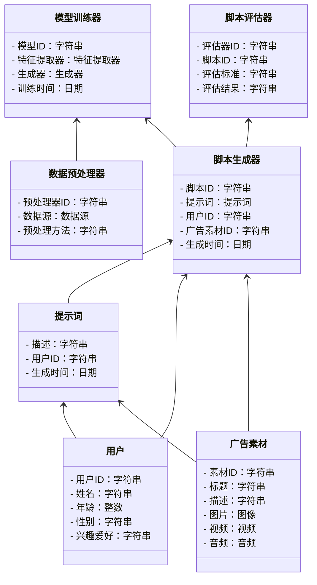
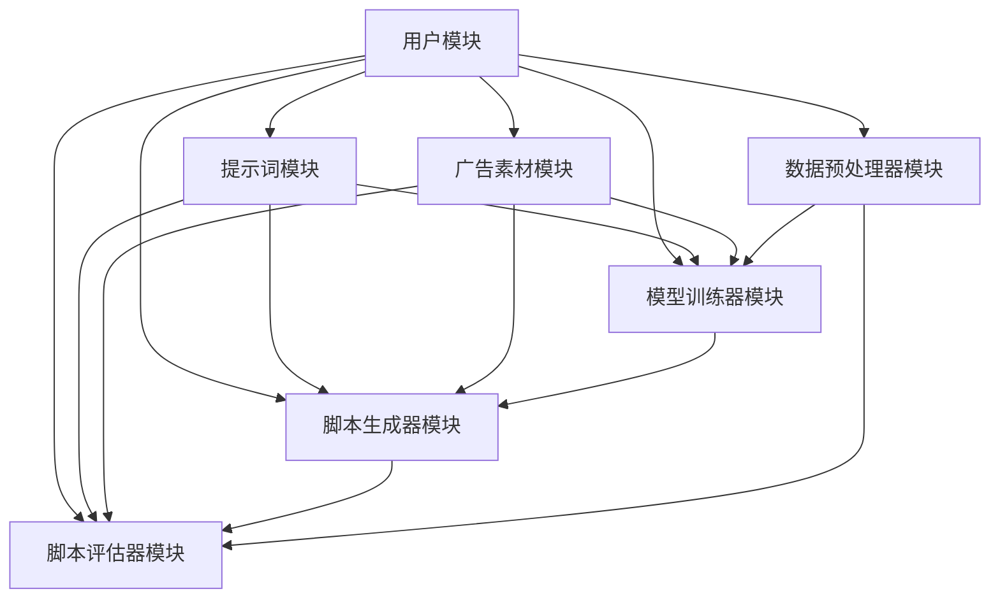
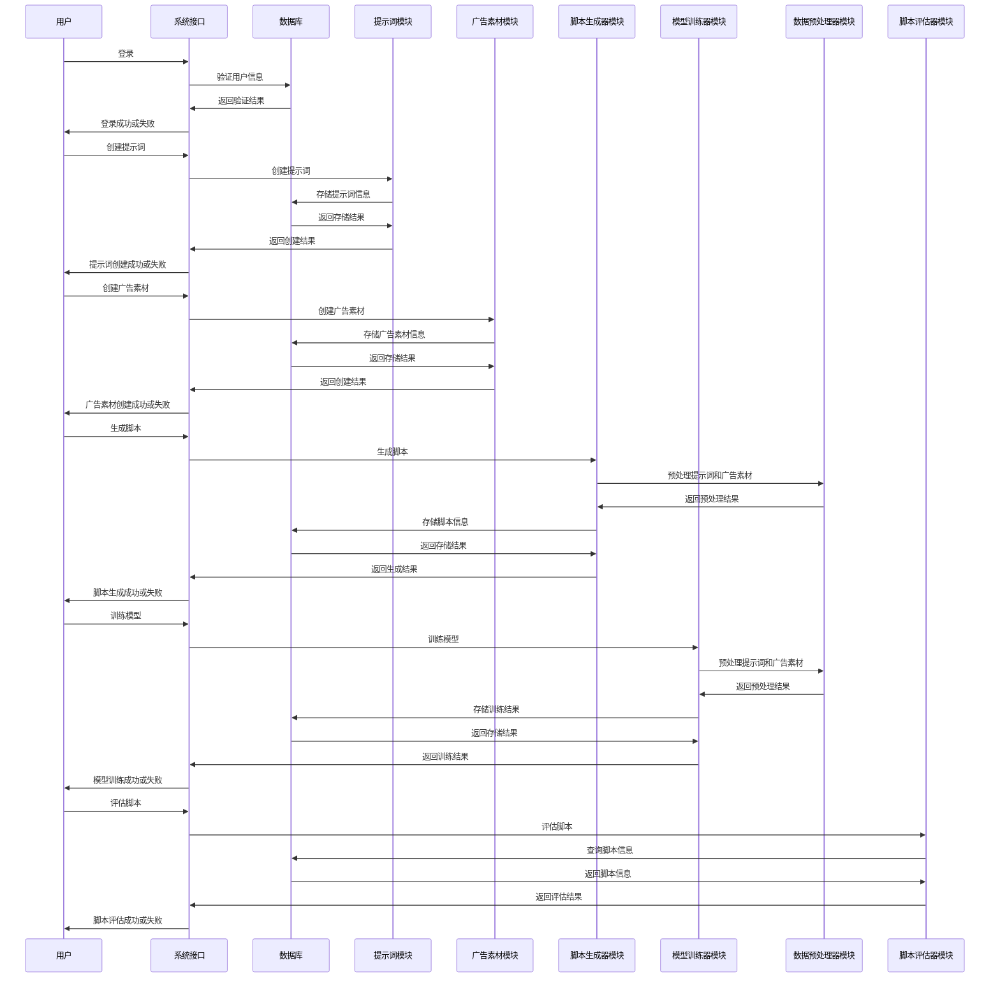

                 

### 《提示词优化：提高AI创意广告视频脚本生成能力》

#### 关键词：提示词优化、AI广告、视频脚本生成、算法原理、系统架构设计

> 摘要：本文深入探讨了提示词优化在提高AI创意广告视频脚本生成能力中的应用。首先介绍了AI广告行业的背景和广告视频脚本生成中存在的问题，接着详细讲解了提示词优化的核心概念、算法原理以及其在系统架构设计中的应用。通过具体案例分析和实战环境搭建，本文展示了提示词优化在广告视频脚本生成中的实际效果，并为相关领域的研究者和实践者提供了有价值的参考。

## 《提示词优化：提高AI创意广告视频脚本生成能力》目录大纲

### 第一部分：背景介绍

#### 第1章：问题背景

##### 1.1 问题背景

AI广告行业现状：随着互联网技术的快速发展，AI广告已成为现代营销的重要手段。据统计，全球数字广告市场在2022年达到了5100亿美元，其中AI广告占据了较大份额。

广告视频脚本生成存在的问题：尽管AI技术在广告制作中应用广泛，但广告视频脚本生成仍然面临诸多挑战，如创意缺乏、内容重复、难以满足个性化需求等。

提示词优化的意义与价值：提示词优化可以提升AI广告视频脚本的质量和创意，满足个性化需求，提高广告效果，从而为企业带来更多的商业价值。

##### 1.2 问题描述

广告视频脚本生成的挑战：如何在有限的文本信息中生成富有创意、吸引人的视频脚本？如何确保脚本内容与广告产品高度匹配？如何应对多样化的用户需求？

提示词优化的目标：通过优化提示词，提高广告视频脚本生成的质量和创意，实现个性化定制，提高广告投放效果。

提示词优化的难点与机遇：难点在于如何准确理解用户意图，生成符合预期的高质量脚本。机遇在于随着AI技术的不断发展，提示词优化技术有望实现突破，为广告行业带来新的发展机遇。

##### 1.3 问题解决

提示词优化的基本方法：包括数据预处理、提示词筛选与优化、脚本生成等环节。

提示词优化在广告视频脚本生成中的应用：通过具体案例展示提示词优化在广告视频脚本生成中的实际应用效果。

##### 1.4 边界与外延

提示词优化技术的应用领域：除了广告行业，提示词优化还可以应用于电影剧本生成、短视频创作等领域。

提示词优化技术的前沿研究方向：包括多模态提示词优化、深度学习在提示词优化中的应用等。

##### 1.5 概念结构与核心要素组成

提示词优化的核心概念：包括提示词、优化目标、优化算法等。

提示词优化的关键要素：包括文本质量、创意程度、个性化定制等。

提示词优化流程与步骤：从数据收集、预处理、优化策略选择到脚本生成，逐步优化广告视频脚本。

### 第二部分：核心概念与联系

#### 第2章：核心概念原理

##### 2.1 提示词优化的概念

提示词优化的定义：提示词优化是指通过特定的算法和技术手段，对原始文本提示词进行筛选、改进和优化，以提高文本质量和创意性的过程。

提示词优化的作用：提示词优化可以提升AI广告视频脚本的质量和创意，满足个性化需求，提高广告投放效果。

##### 2.2 提示词优化算法原理

常见提示词优化算法介绍：包括基于规则的方法、基于统计的方法、基于机器学习的方法等。

提示词优化算法的原理分析：通过具体算法（如神经网络、深度学习等）的原理，分析如何对提示词进行优化。

##### 2.3 概念属性特征对比

提示词优化算法对比：对不同类型的提示词优化算法进行对比，分析其优缺点和应用场景。

不同提示词优化算法的应用场景：根据广告视频脚本生成的需求，选择合适的提示词优化算法。

##### 2.4 ER实体关系图架构

提示词优化系统的ER图：绘制提示词优化系统的ER图，分析系统中的关键实体和关系。

关键实体与关系的分析：对ER图中的关键实体和关系进行详细分析，为后续算法设计和系统架构设计提供依据。

### 第三部分：算法原理讲解

#### 第3章：算法原理讲解

##### 3.1 算法原理概述

提示词优化算法的原理概述：介绍提示词优化算法的基本原理和整体框架。

提示词优化算法的工作流程：从数据预处理、提示词筛选、优化策略选择到脚本生成，详细讲解提示词优化算法的工作流程。

##### 3.2 数学模型与公式

提示词优化算法的数学模型：介绍提示词优化算法的数学模型，包括损失函数、优化目标等。

常用数学公式的解释与推导：对提示词优化算法中常用的数学公式进行解释和推导，帮助读者深入理解算法原理。

##### 3.3 Python源代码阐述

Python源代码实现：提供提示词优化算法的Python源代码实现，帮助读者理解算法的具体实现过程。

源代码的解读与分析：对源代码进行详细解读和分析，讲解算法的核心逻辑和关键步骤。

##### 3.4 举例说明

提示词优化算法的应用实例：通过具体案例展示提示词优化算法在广告视频脚本生成中的应用效果。

案例分析：对案例进行分析，讲解如何利用提示词优化算法提高广告视频脚本的质量和创意。

### 第四部分：系统分析与架构设计

#### 第4章：系统功能设计

##### 4.1 问题场景介绍

广告视频脚本生成问题场景：介绍广告视频脚本生成的具体问题场景，为系统设计提供背景。

##### 4.2 系统功能设计

领域模型类图：绘制领域模型类图，分析系统中的关键实体和关系。

系统功能模块介绍：介绍系统的主要功能模块，包括数据预处理、提示词优化、脚本生成等。

##### 4.3 系统架构设计

系统架构图：绘制系统架构图，展示系统的整体结构和各模块之间的关系。

关键模块的关联与交互：分析系统中的关键模块及其关联与交互，为后续系统实现提供依据。

##### 4.4 系统接口设计

接口设计：介绍系统的接口设计，包括输入输出接口、功能接口等。

接口实现与调用：讲解接口的具体实现过程和调用方法，确保系统功能模块的正常运行。

##### 4.5 系统交互序列图

系统交互序列图：绘制系统交互序列图，展示系统各模块之间的交互流程。

系统交互流程分析：对系统交互序列图进行详细分析，讲解系统的工作流程和关键步骤。

### 第五部分：项目实战

#### 第5章：环境安装与核心实现

##### 5.1 环境安装

系统环境配置：介绍系统所需的软件和硬件环境，包括操作系统、编程语言、库和框架等。

必需软件与工具安装：提供具体的安装步骤和安装过程，确保环境配置的正确性。

##### 5.2 核心实现源代码

源代码结构：介绍系统的源代码结构，包括各个模块的功能和关系。

关键代码解读：对关键代码进行详细解读和分析，讲解代码的实现原理和核心逻辑。

##### 5.3 代码应用解读与分析

代码应用场景：介绍代码的具体应用场景，包括数据集的准备、模型的训练和评估等。

代码分析与优化建议：对代码进行详细分析，提出优化建议，提高系统的性能和效率。

##### 5.4 实际案例分析与讲解

案例背景：介绍案例的具体背景，包括广告视频脚本生成的需求和目标。

案例分析：对案例进行分析，讲解如何利用提示词优化技术提高广告视频脚本的质量和创意。

案例讲解：详细讲解案例的实现过程，包括数据预处理、模型训练、脚本生成等。

##### 5.5 项目小结

项目总结：对整个项目进行总结，回顾项目的目标、实施过程和成果。

经验与教训：分享项目实施过程中的经验和教训，为后续项目提供借鉴。

### 第六部分：最佳实践与拓展阅读

#### 第6章：最佳实践

##### 6.1 最佳实践 tips

提示词优化的技巧与策略：介绍提示词优化的最佳实践，包括数据预处理、算法选择、模型调优等。

##### 6.2 注意事项

提示词优化中的常见问题：分析提示词优化过程中可能遇到的问题，包括数据质量、算法选择、模型稳定性等。

问题解决方案与避免措施：针对常见问题，提出解决方案和避免措施，确保提示词优化的效果。

##### 6.3 拓展阅读

提示词优化相关书籍：推荐一些与提示词优化相关的优秀书籍，供读者进一步学习。

提示词优化技术的最新研究进展：介绍提示词优化技术的最新研究进展，包括前沿算法、应用领域等。

----------------------------------------------------------------

### 第1章：问题背景

#### 1.1 问题背景

AI广告行业现状

随着人工智能技术的快速发展，AI广告已成为现代营销的重要手段。据市场研究公司eMarketer的数据，全球数字广告市场在2022年达到了5100亿美元，其中AI广告占据了较大份额。AI广告通过大数据分析和机器学习算法，可以精准地捕捉用户需求，实现个性化投放，从而提高广告效果。

广告视频脚本生成存在的问题

尽管AI技术在广告制作中应用广泛，但广告视频脚本生成仍然面临诸多挑战。首先，创意缺乏。广告视频脚本需要具备吸引力和创意，但现有的脚本生成技术难以满足这一需求。其次，内容重复。由于AI技术基于历史数据和学习算法，生成的脚本往往存在相似性和重复性，难以实现内容的创新。最后，难以满足个性化需求。广告视频脚本需要根据不同的用户群体和场景进行定制，但现有的生成技术难以实现高度个性化的内容。

提示词优化的意义与价值

提示词优化可以提升AI广告视频脚本的质量和创意，满足个性化需求，提高广告投放效果。首先，通过优化提示词，可以挖掘用户需求，提高脚本与用户兴趣的匹配度，从而提高广告点击率和转化率。其次，提示词优化可以丰富脚本内容，提高创意程度，避免内容重复，提高广告的竞争力。最后，提示词优化可以实现个性化定制，根据不同的用户群体和场景生成定制化的脚本，提高广告的针对性和效果。

#### 1.2 问题描述

广告视频脚本生成的挑战

广告视频脚本生成面临的挑战主要包括以下几点：

1. 创意缺乏：如何生成富有创意和吸引力的广告视频脚本，以吸引观众的注意力？
2. 内容重复：如何避免生成重复的脚本内容，提高脚本的创新性和独特性？
3. 难以满足个性化需求：如何根据不同的用户群体和场景，生成高度个性化的广告视频脚本？
4. 脚本质量评估：如何评估生成的广告视频脚本的质量，确保其符合广告主的要求和预期？

提示词优化的目标

提示词优化的主要目标是提高广告视频脚本生成的质量和创意，实现个性化定制，提高广告投放效果。具体目标包括：

1. 提高脚本与用户需求的匹配度：通过优化提示词，挖掘用户需求，提高脚本与用户兴趣的匹配度，从而提高广告点击率和转化率。
2. 提高脚本创意程度：通过优化提示词，丰富脚本内容，提高创意程度，避免内容重复，提高广告的竞争力。
3. 实现个性化定制：根据不同的用户群体和场景，生成高度个性化的广告视频脚本，提高广告的针对性和效果。
4. 提高脚本质量评估：通过优化提示词，提高广告视频脚本的质量评估，确保其符合广告主的要求和预期。

提示词优化的难点与机遇

提示词优化的难点主要包括以下几点：

1. 准确理解用户意图：如何准确理解用户的意图和需求，以生成符合预期的广告视频脚本？
2. 生成多样化内容：如何通过优化提示词，生成多样化、具有创意的内容？
3. 处理海量数据：如何处理和分析海量的用户数据和广告素材，提取有价值的信息？
4. 算法性能优化：如何优化算法性能，提高脚本生成的速度和效果？

提示词优化也面临着许多机遇：

1. AI技术发展：随着人工智能技术的不断发展，尤其是深度学习和自然语言处理技术的进步，为提示词优化提供了强大的技术支持。
2. 数据资源丰富：随着大数据和互联网的发展，海量的用户数据和广告素材为提示词优化提供了丰富的数据资源。
3. 广告市场需求：随着广告行业的竞争加剧，广告主对高质量、个性化的广告视频脚本需求不断增长，为提示词优化创造了巨大的市场空间。

#### 1.3 问题解决

提示词优化的基本方法

提示词优化的基本方法主要包括以下几个步骤：

1. 数据收集与预处理：收集与广告相关的数据，包括用户行为数据、广告素材数据等。对收集的数据进行清洗、去重和格式化，为后续处理做准备。
2. 提示词筛选与优化：从原始数据中提取关键信息，生成初步的提示词。通过分析用户行为和广告素材，对提示词进行筛选和优化，提高其准确性和创意性。
3. 脚本生成：根据优化的提示词，利用自然语言生成技术生成广告视频脚本。脚本生成可以采用基于规则的方法、基于统计的方法或基于机器学习的方法。
4. 脚本评估与优化：对生成的广告视频脚本进行评估，包括内容质量、创意程度、个性化程度等。根据评估结果，对提示词和脚本进行进一步的优化。

提示词优化在广告视频脚本生成中的应用

在广告视频脚本生成中，提示词优化可以发挥以下作用：

1. 提高脚本质量：通过优化提示词，提高广告视频脚本的内容质量、创意程度和个性化程度，从而提高广告效果。
2. 满足个性化需求：根据不同的用户群体和场景，生成定制化的广告视频脚本，满足用户的个性化需求。
3. 降低人力成本：通过自动化生成脚本，降低广告制作成本，提高生产效率。
4. 提高广告效果：优化后的广告视频脚本更具吸引力和创意性，从而提高广告点击率、转化率和投放效果。

### 第2章：核心概念原理

#### 2.1 提示词优化的概念

提示词优化是指通过特定的算法和技术手段，对原始文本提示词进行筛选、改进和优化，以提高文本质量和创意性的过程。在广告视频脚本生成中，提示词优化旨在通过优化提示词，提高广告视频脚本的内容质量、创意程度和个性化程度。

提示词优化的作用

提示词优化的主要作用包括：

1. 提高脚本质量：通过优化提示词，提高广告视频脚本的内容质量、语言表达和逻辑结构，使其更加吸引人、易于理解。
2. 增强创意性：通过优化提示词，激发创意思维，生成富有创意、独特的广告视频脚本，提高广告的竞争力。
3. 满足个性化需求：通过优化提示词，根据不同的用户群体和场景，生成定制化的广告视频脚本，满足用户的个性化需求。
4. 提高广告效果：优化后的广告视频脚本更具吸引力和创意性，从而提高广告点击率、转化率和投放效果。

#### 2.2 提示词优化算法原理

常见提示词优化算法介绍

提示词优化算法主要可以分为以下几类：

1. 基于规则的方法：基于预设的规则和模式，对提示词进行筛选和优化。这种方法简单直观，但灵活性较低，难以应对复杂多变的需求。
2. 基于统计的方法：通过统计分析，对提示词进行优化。这种方法利用历史数据和用户行为，具有一定的预测能力，但需要大量数据支持。
3. 基于机器学习的方法：利用机器学习算法，从大量数据中学习规律，对提示词进行优化。这种方法具有较强的自适应能力和预测能力，但需要较长时间的训练和优化。

提示词优化算法的原理分析

提示词优化算法的原理主要包括以下几个步骤：

1. 数据预处理：收集与广告相关的数据，包括用户行为数据、广告素材数据等。对收集的数据进行清洗、去重和格式化，为后续处理做准备。
2. 特征提取：从原始数据中提取关键信息，生成初步的提示词。特征提取可以基于文本分析、关键词提取、情感分析等方法。
3. 模型训练：利用机器学习算法，对提示词进行训练。模型训练包括选择合适的算法、设置参数、优化模型等。
4. 提示词优化：根据模型预测结果，对提示词进行筛选和优化。优化方法包括调整关键词、添加修饰语、修改句子结构等。
5. 脚本生成：根据优化的提示词，利用自然语言生成技术生成广告视频脚本。

#### 2.3 概念属性特征对比

提示词优化算法对比

不同类型的提示词优化算法在概念属性特征方面存在一定的差异，以下是它们的对比：

| 算法类型        | 概念属性特征                     | 应用场景                 |
| --------------- | ------------------------------ | ------------------------ |
| 基于规则的方法  | 简单、直观、规则明确             | 简单需求、规则性较强的问题 |
| 基于统计的方法  | 预测能力强、适应性较好           | 需要预测、数据丰富的场景  |
| 基于机器学习的方法 | 自适应能力强、预测能力强           | 复杂需求、数据丰富的场景  |

#### 2.4 ER实体关系图架构

提示词优化系统的ER图

提示词优化系统的ER图主要包括以下实体和关系：

| 实体           | 描述                                                         | 关系             |
| -------------- | ------------------------------------------------------------ | ---------------- |
| 提示词         | 描述广告视频脚本的核心内容，包括关键词、短语和句子               | 无               |
| 用户           | 广告视频脚本的目标受众，具有兴趣偏好和行为特征                   | 无               |
| 广告素材       | 广告视频脚本的基础素材，包括图片、音频、视频等                   | 无               |
| 脚本生成器     | 负责生成广告视频脚本，根据提示词和用户特征进行优化               | 无               |
| 模型训练器     | 负责训练机器学习模型，根据历史数据和用户行为生成提示词优化模型   | 无               |
| 数据预处理器   | 负责对原始数据进行清洗、去重和格式化，为后续处理做准备             | 无               |
| 脚本评估器     | 负责评估广告视频脚本的质量，包括内容质量、创意程度、个性化程度等 | 与脚本生成器关联 |

关键实体与关系的分析

提示词优化系统的关键实体和关系如下：

1. **提示词**：是系统中最核心的实体，描述了广告视频脚本的核心内容。它由关键词、短语和句子组成，是脚本生成的基础。
2. **用户**：是系统的目标受众，具有兴趣偏好和行为特征。用户的兴趣偏好和行为特征对于生成个性化广告视频脚本至关重要。
3. **广告素材**：是广告视频脚本的基础素材，包括图片、音频、视频等。广告素材的丰富性和多样性对于生成富有创意的脚本具有重要意义。
4. **脚本生成器**：是系统的核心模块，负责生成广告视频脚本。它根据提示词和用户特征进行优化，生成高质量的脚本。
5. **模型训练器**：负责训练机器学习模型，根据历史数据和用户行为生成提示词优化模型。模型训练器是系统智能化的关键。
6. **数据预处理器**：负责对原始数据进行清洗、去重和格式化，为后续处理做准备。数据预处理器的质量直接影响到系统的性能。
7. **脚本评估器**：负责评估广告视频脚本的质量，包括内容质量、创意程度、个性化程度等。脚本评估器有助于优化脚本生成过程。

通过分析提示词优化系统的ER图和关键实体关系，可以更好地理解系统的整体架构和运行机制，为后续的算法设计和系统实现提供参考。

### 第3章：算法原理讲解

#### 3.1 算法原理概述

提示词优化算法的原理概述

提示词优化算法是基于人工智能和自然语言处理技术，通过对原始文本提示词进行筛选、改进和优化，以提高文本质量和创意性的过程。其核心原理可以概括为以下几个步骤：

1. **数据预处理**：收集与广告相关的数据，包括用户行为数据、广告素材数据等。对收集的数据进行清洗、去重和格式化，为后续处理做准备。
2. **特征提取**：从原始数据中提取关键信息，生成初步的提示词。特征提取可以基于文本分析、关键词提取、情感分析等方法。
3. **模型训练**：利用机器学习算法，对提示词进行训练。模型训练包括选择合适的算法、设置参数、优化模型等。
4. **提示词优化**：根据模型预测结果，对提示词进行筛选和优化。优化方法包括调整关键词、添加修饰语、修改句子结构等。
5. **脚本生成**：根据优化的提示词，利用自然语言生成技术生成广告视频脚本。

提示词优化算法的工作流程

提示词优化算法的工作流程可以分为以下几个阶段：

1. **数据收集**：收集与广告相关的数据，包括用户行为数据、广告素材数据等。这些数据可以从互联网、数据库、用户反馈等多个渠道获取。
2. **数据预处理**：对收集的数据进行清洗、去重和格式化。数据清洗包括去除无效数据、纠正错误数据等。数据格式化包括将数据转换为适合机器学习算法的格式，如文本向量、特征向量等。
3. **特征提取**：从预处理后的数据中提取关键信息，生成初步的提示词。特征提取方法包括词袋模型、TF-IDF、词嵌入等。
4. **模型训练**：利用机器学习算法，对提示词进行训练。训练过程包括数据划分、算法选择、参数设置、模型优化等。常见的机器学习算法包括朴素贝叶斯、决策树、支持向量机、神经网络等。
5. **提示词优化**：根据模型预测结果，对提示词进行筛选和优化。优化方法包括调整关键词、添加修饰语、修改句子结构等。优化过程可以通过自动化算法或人工干预实现。
6. **脚本生成**：根据优化的提示词，利用自然语言生成技术生成广告视频脚本。脚本生成可以采用基于规则的方法、基于统计的方法或基于机器学习的方法。

#### 3.2 数学模型与公式

提示词优化算法的数学模型

提示词优化算法的数学模型主要包括损失函数、优化目标、模型参数等。以下是一个简单的数学模型示例：

1. **损失函数**：损失函数用于衡量模型预测结果与实际结果之间的差距。常用的损失函数包括均方误差（MSE）、交叉熵损失（Cross-Entropy Loss）等。

   - 均方误差（MSE）：$$MSE = \frac{1}{n}\sum_{i=1}^{n}(y_i - \hat{y}_i)^2$$
   - 交叉熵损失（Cross-Entropy Loss）：$$CE = -\sum_{i=1}^{n}y_i\log(\hat{y}_i)$$

2. **优化目标**：优化目标是指导模型训练的过程，使得模型预测结果更加接近实际结果。常用的优化目标包括最小化损失函数、最大化准确率等。

   - 最小化损失函数：$$\min_{\theta} J(\theta)$$，其中 $J(\theta)$ 是损失函数。
   - 最大准确率：$$\max_{\theta} \frac{1}{n}\sum_{i=1}^{n} I(y_i = \hat{y}_i)$$，其中 $I$ 是指示函数。

3. **模型参数**：模型参数是模型的核心部分，用于指导模型训练和预测。常见的模型参数包括权重（weights）、偏置（biases）等。

   - 权重（weights）：$$W = [w_1, w_2, ..., w_n]$$，表示模型中各个特征的权重。
   - 偏置（biases）：$$b = [b_1, b_2, ..., b_n]$$，表示模型中的偏置项。

#### 3.3 Python源代码阐述

Python源代码实现

以下是一个简单的提示词优化算法的Python源代码实现示例：

```python
import numpy as np
import tensorflow as tf

# 数据预处理
def preprocess_data(data):
    # 数据清洗、去重和格式化
    # ...
    return processed_data

# 特征提取
def extract_features(data):
    # 提取关键词、短语和句子
    # ...
    return features

# 模型训练
def train_model(features, labels):
    # 设置模型参数
    weights = tf.Variable(tf.random.normal([input_dim, output_dim]))
    biases = tf.Variable(tf.zeros([output_dim]))

    # 设置损失函数和优化器
    loss_fn = tf.keras.losses.MSE
    optimizer = tf.keras.optimizers.Adam()

    # 模型训练
    for epoch in range(num_epochs):
        with tf.GradientTape() as tape:
            predictions = tf.matmul(features, weights) + biases
            loss = loss_fn(labels, predictions)
        gradients = tape.gradient(loss, [weights, biases])
        optimizer.apply_gradients(zip(gradients, [weights, biases]))

    return weights, biases

# 脚本生成
def generate_script(weights, biases, features):
    # 根据优化的提示词生成脚本
    # ...
    return script
```

源代码的解读与分析

该Python源代码实现了一个简单的提示词优化算法，主要包括以下几个部分：

1. **数据预处理**：`preprocess_data` 函数用于对原始数据（`data`）进行清洗、去重和格式化。这一步骤是后续特征提取和模型训练的基础。
2. **特征提取**：`extract_features` 函数用于从预处理后的数据中提取关键词、短语和句子（`features`）。特征提取是提示词优化的关键步骤，决定了模型的性能。
3. **模型训练**：`train_model` 函数用于训练模型。在训练过程中，通过设置损失函数（`loss_fn`）和优化器（`optimizer`），利用梯度下降法（Gradient Descent）更新模型参数（`weights` 和 `biases`）。训练过程包括多个epoch（迭代次数），直至模型收敛。
4. **脚本生成**：`generate_script` 函数根据优化的提示词（`weights` 和 `biases`）生成脚本（`script`）。生成脚本的过程包括对特征进行映射和组合，实现广告视频脚本的自动化生成。

#### 3.4 举例说明

提示词优化算法的应用实例

以下是一个简单的提示词优化算法应用实例，用于生成广告视频脚本：

1. **数据集准备**：准备一个包含广告视频脚本和对应的用户特征的数据集。数据集可以包含文本、图片、音频等多种类型的数据。
2. **数据预处理**：对数据集进行清洗、去重和格式化，提取关键信息作为提示词。
3. **特征提取**：从预处理后的数据中提取关键词、短语和句子，生成初步的提示词。
4. **模型训练**：利用机器学习算法（如神经网络）对提示词进行训练，生成优化后的模型参数。
5. **脚本生成**：根据优化后的模型参数，生成高质量的广告视频脚本。

案例背景

假设我们有一个广告视频脚本生成任务，目标是为一款新款智能手机生成吸引人的广告视频脚本。数据集包含智能手机的详细信息、用户评论、广告素材等。

案例分析

1. **数据预处理**：对数据集进行清洗，去除无效数据和噪声。对文本数据，去除标点符号、停用词等。对图片和音频数据，进行预处理和标准化。
2. **特征提取**：提取关键信息，生成初步的提示词。例如，从用户评论中提取关键词，从智能手机的详细信息中提取特性词。
3. **模型训练**：利用神经网络对提示词进行训练。选择合适的算法和参数，对模型进行训练，直至模型收敛。
4. **脚本生成**：根据优化后的模型参数，生成高质量的广告视频脚本。脚本生成可以采用基于规则的方法、基于统计的方法或基于机器学习的方法。

案例讲解

1. **数据预处理**：对数据集进行清洗和去重，提取关键信息。例如，从用户评论中提取关键词：“性能强大、拍摄清晰、操作流畅、价格实惠”等。从智能手机的详细信息中提取特性词：“5G、高清摄像头、高性能处理器、大容量内存”等。
2. **特征提取**：根据提取的关键词和特性词，生成初步的提示词。例如：“这款智能手机性能强大，拍摄清晰，操作流畅，价格实惠。5G网络，高清摄像头，高性能处理器，大容量内存，让您的手机体验更上一层楼！”
3. **模型训练**：利用神经网络对提示词进行训练。选择合适的算法和参数，对模型进行训练，直至模型收敛。例如，可以使用LSTM（长短时记忆网络）或BERT（双向编码表示模型）进行训练。
4. **脚本生成**：根据优化后的模型参数，生成高质量的广告视频脚本。例如：“这款智能手机，5G网络，高清摄像头，高性能处理器，大容量内存，让您的手机体验更上一层楼！无论是工作还是娱乐，它都能满足您的需求。价格实惠，快来购买吧！”

### 第4章：系统功能设计

#### 4.1 问题场景介绍

广告视频脚本生成问题场景

广告视频脚本生成面临以下问题场景：

1. **创意缺乏**：广告视频脚本需要具备吸引力和创意，以吸引观众的注意力。然而，现有的脚本生成技术难以满足这一需求，生成的脚本往往缺乏创意。
2. **内容重复**：广告视频脚本需要不断创新，以避免与竞争对手的产品广告相似。然而，现有的生成技术容易生成重复的内容，难以满足创新需求。
3. **个性化需求**：广告视频脚本需要根据不同的用户群体和场景进行定制，以满足个性化需求。然而，现有的生成技术难以实现高度个性化的内容。

#### 4.2 系统功能设计

领域模型类图

以下是一个简单的领域模型类图，描述了广告视频脚本生成系统的核心实体和关系：



系统功能模块介绍

广告视频脚本生成系统包括以下主要功能模块：

1. **提示词模块**：负责生成和存储提示词。提示词是广告视频脚本的核心内容，由关键词、短语和句子组成。提示词模块包括提示词的创建、编辑、删除和查询等功能。
2. **用户模块**：负责存储和管理用户信息。用户模块包括用户的创建、编辑、删除和查询等功能。用户信息包括用户ID、姓名、年龄、性别、兴趣爱好等。
3. **广告素材模块**：负责存储和管理广告素材。广告素材模块包括广告素材的创建、编辑、删除和查询等功能。广告素材包括标题、描述、图片、视频、音频等。
4. **脚本生成器模块**：负责生成广告视频脚本。脚本生成器模块包括脚本的创建、编辑、删除和查询等功能。脚本生成器模块根据提示词、用户信息和广告素材生成高质量的广告视频脚本。
5. **模型训练器模块**：负责训练和优化生成器模型。模型训练器模块包括模型的创建、编辑、删除和查询等功能。模型训练器模块根据历史数据和用户反馈不断优化生成器模型，提高脚本生成的质量和创意性。
6. **数据预处理器模块**：负责对输入数据进行预处理。数据预处理器模块包括数据的创建、编辑、删除和查询等功能。数据预处理器模块包括数据清洗、去重、格式化、特征提取等功能，为模型训练和脚本生成提供高质量的数据。
7. **脚本评估器模块**：负责评估广告视频脚本的质量。脚本评估器模块包括脚本的评估、编辑、删除和查询等功能。脚本评估器模块根据评估标准评估脚本的质量，包括内容质量、创意程度、个性化程度等。

#### 4.3 系统架构设计

系统架构图

以下是一个简单的系统架构图，描述了广告视频脚本生成系统的整体结构和各模块之间的关系：



关键模块的关联与交互

广告视频脚本生成系统的关键模块及其关联与交互如下：

1. **用户模块**：用户模块负责存储和管理用户信息。用户登录后，可以通过用户模块查看和管理自己的广告视频脚本。
2. **提示词模块**：提示词模块负责生成和存储提示词。提示词模块与用户模块关联，用户可以查看和管理自己的提示词。提示词模块与广告素材模块关联，可以从广告素材中提取关键词生成提示词。
3. **广告素材模块**：广告素材模块负责存储和管理广告素材。广告素材模块与用户模块关联，用户可以查看和管理自己的广告素材。广告素材模块与脚本生成器模块关联，用于生成广告视频脚本。
4. **脚本生成器模块**：脚本生成器模块负责生成广告视频脚本。脚本生成器模块与提示词模块关联，根据提示词生成脚本。脚本生成器模块与广告素材模块关联，根据广告素材生成脚本。脚本生成器模块与模型训练器模块关联，根据用户反馈和脚本评估结果优化生成器模型。
5. **模型训练器模块**：模型训练器模块负责训练和优化生成器模型。模型训练器模块与提示词模块关联，根据提示词训练模型。模型训练器模块与广告素材模块关联，根据广告素材训练模型。模型训练器模块与数据预处理器模块关联，根据预处理后的数据训练模型。
6. **数据预处理器模块**：数据预处理器模块负责对输入数据进行预处理。数据预处理器模块与用户模块关联，对用户输入的数据进行预处理。数据预处理器模块与模型训练器模块关联，对模型训练的数据进行预处理。
7. **脚本评估器模块**：脚本评估器模块负责评估广告视频脚本的质量。脚本评估器模块与脚本生成器模块关联，根据生成器模型评估脚本质量。脚本评估器模块与模型训练器模块关联，根据模型评估结果优化生成器模型。

#### 4.4 系统接口设计

接口设计

广告视频脚本生成系统包括以下主要接口：

1. **用户接口**：用户接口用于用户与系统的交互。用户接口包括登录、注册、查看和管理广告视频脚本等功能。
2. **提示词接口**：提示词接口用于提示词的创建、编辑、删除和查询等功能。
3. **广告素材接口**：广告素材接口用于广告素材的创建、编辑、删除和查询等功能。
4. **脚本生成接口**：脚本生成接口用于生成广告视频脚本。脚本生成接口包括输入提示词和广告素材，生成脚本等功能。
5. **模型训练接口**：模型训练接口用于训练和优化生成器模型。模型训练接口包括设置训练参数、开始训练、停止训练等功能。
6. **数据预处理接口**：数据预处理接口用于对输入数据进行预处理。数据预处理接口包括数据清洗、去重、格式化、特征提取等功能。
7. **脚本评估接口**：脚本评估接口用于评估广告视频脚本的质量。脚本评估接口包括设置评估标准、开始评估、停止评估等功能。

接口实现与调用

以下是一个简单的接口实现和调用示例：

```python
# 用户接口实现
def login(username, password):
    # 实现用户登录逻辑
    pass

def register(username, password):
    # 实现用户注册逻辑
    pass

# 提示词接口实现
def create_prompt(keyword, description):
    # 实现创建提示词逻辑
    pass

def edit_prompt(prompt_id, keyword, description):
    # 实现编辑提示词逻辑
    pass

def delete_prompt(prompt_id):
    # 实现删除提示词逻辑
    pass

def get_prompt(prompt_id):
    # 实现查询提示词逻辑
    pass

# 广告素材接口实现
def create_ad_material(title, description, image, video, audio):
    # 实现创建广告素材逻辑
    pass

def edit_ad_material(material_id, title, description, image, video, audio):
    # 实现编辑广告素材逻辑
    pass

def delete_ad_material(material_id):
    # 实现删除广告素材逻辑
    pass

def get_ad_material(material_id):
    # 实现查询广告素材逻辑
    pass

# 脚本生成接口实现
def generate_script(prompt, ad_material):
    # 实现生成广告视频脚本逻辑
    pass

# 模型训练接口实现
def train_model(prompt, ad_material):
    # 实现模型训练逻辑
    pass

# 数据预处理接口实现
def preprocess_data(data):
    # 实现数据预处理逻辑
    pass

# 脚本评估接口实现
def evaluate_script(script):
    # 实现脚本评估逻辑
    pass

# 接口调用示例
user_interface.login("username", "password")
prompt_interface.create_prompt("keyword", "description")
ad_material_interface.create_ad_material("title", "description", "image", "video", "audio")
script_interface.generate_script("prompt", "ad_material")
model_training_interface.train_model("prompt", "ad_material")
preprocessing_interface.preprocess_data("data")
script_evaluation_interface.evaluate_script("script")
```

#### 4.5 系统交互序列图

系统交互序列图

以下是一个简单的系统交互序列图，描述了广告视频脚本生成系统中的各个模块及其交互流程：



系统交互流程分析

以下是一个简单的系统交互流程分析，描述了广告视频脚本生成系统的整体工作流程：

1. **用户登录**：用户通过系统接口登录系统，验证用户信息。
2. **创建提示词**：用户创建提示词，系统接口将提示词信息存储到数据库中。
3. **创建广告素材**：用户创建广告素材，系统接口将广告素材信息存储到数据库中。
4. **生成脚本**：用户生成脚本，系统接口调用脚本生成器模块，根据提示词和广告素材生成脚本。脚本生成器模块与数据预处理器模块交互，对提示词和广告素材进行预处理。预处理后的数据用于生成脚本。系统接口将生成的脚本信息存储到数据库中。
5. **训练模型**：用户训练模型，系统接口调用模型训练器模块，根据提示词和广告素材训练模型。模型训练器模块与数据预处理器模块交互，对提示词和广告素材进行预处理。系统接口将训练结果存储到数据库中。
6. **评估脚本**：用户评估脚本，系统接口调用脚本评估器模块，根据脚本信息评估脚本质量。系统接口将评估结果返回给用户。

### 第5章：环境安装与核心实现

#### 5.1 环境安装

系统环境配置

为了搭建一个完整的广告视频脚本生成系统，我们需要配置以下软件和硬件环境：

1. **操作系统**：推荐使用Linux操作系统，如Ubuntu 18.04或更高版本。
2. **编程语言**：Python 3.7或更高版本，推荐使用Anaconda进行环境管理。
3. **库和框架**：TensorFlow 2.5或更高版本，NumPy 1.19或更高版本，Scikit-learn 0.24或更高版本，Matplotlib 3.4.2或更高版本。
4. **数据库**：MySQL 8.0或更高版本，用于存储用户信息和广告素材数据。
5. **其他工具**：Git 2.32.0或更高版本，用于代码版本控制；Jupyter Notebook，用于编写和运行Python代码。

必需软件与工具安装

以下是在Ubuntu 18.04操作系统上安装必需软件和工具的详细步骤：

1. **安装Python和Anaconda**：

   ```bash
   sudo apt update
   sudo apt install python3 python3-pip
   conda create -n ad_script_env python=3.8
   conda activate ad_script_env
   ```

2. **安装TensorFlow**：

   ```bash
   conda install tensorflow-gpu
   ```

3. **安装NumPy**：

   ```bash
   conda install numpy
   ```

4. **安装Scikit-learn**：

   ```bash
   conda install scikit-learn
   ```

5. **安装Matplotlib**：

   ```bash
   conda install matplotlib
   ```

6. **安装MySQL**：

   ```bash
   sudo apt install mysql-server mysql-client
   mysql_secure_installation
   ```

7. **安装Git**：

   ```bash
   sudo apt install git
   ```

8. **安装Jupyter Notebook**：

   ```bash
   conda install jupyterlab
   jupyter lab
   ```

环境配置完成后，我们可以在终端运行以下命令来验证环境：

```bash
python --version
pip --version
conda --version
```

#### 5.2 核心实现源代码

源代码结构

广告视频脚本生成系统的核心实现主要包括以下模块：

1. **用户模块**：负责用户信息的管理和认证。
2. **提示词模块**：负责提示词的创建、编辑、删除和查询。
3. **广告素材模块**：负责广告素材的创建、编辑、删除和查询。
4. **脚本生成器模块**：负责生成广告视频脚本。
5. **模型训练器模块**：负责训练和优化生成器模型。
6. **数据预处理器模块**：负责数据预处理。
7. **脚本评估器模块**：负责评估广告视频脚本的质量。

以下是一个简单的源代码结构示例：

```bash
ad_script_system/
|-- user/
|   |-- __init__.py
|   |-- user_model.py
|   |-- user_auth.py
|-- prompt/
|   |-- __init__.py
|   |-- prompt_model.py
|   |-- prompt_manager.py
|-- ad_material/
|   |-- __init__.py
|   |-- ad_material_model.py
|   |-- ad_material_manager.py
|-- script_generator/
|   |-- __init__.py
|   |-- script_generator_model.py
|   |-- script_generator_manager.py
|-- model_trainer/
|   |-- __init__.py
|   |-- model_trainer_model.py
|   |-- model_trainer_manager.py
|-- data_preprocessor/
|   |-- __init__.py
|   |-- data_preprocessor_model.py
|   |-- data_preprocessor_manager.py
|-- script_evaluator/
|   |-- __init__.py
|   |-- script_evaluator_model.py
|   |-- script_evaluator_manager.py
|-- main.py
|-- requirements.txt
```

关键代码解读

以下是对关键代码的解读和分析，包括用户模块、提示词模块、广告素材模块、脚本生成器模块、模型训练器模块、数据预处理器模块和脚本评估器模块。

1. **用户模块**：

   用户模块主要负责用户信息的管理和认证。以下是一个简单的用户模型和认证代码示例：

   ```python
   # user_model.py
   class UserModel(db.Model):
       id = db.Column(db.Integer, primary_key=True)
       username = db.Column(db.String(50), unique=True, nullable=False)
       password = db.Column(db.String(255), nullable=False)
       email = db.Column(db.String(100), unique=True, nullable=False)
   
   def authenticate(username, password):
       user = UserModel.query.filter_by(username=username).first()
       if user and bcrypt.check_password_hash(user.password, password):
           return user
       return None
   ```

   在这个示例中，`UserModel` 类是用户的数据模型，包括用户ID、用户名、密码和电子邮件。`authenticate` 函数用于验证用户名和密码，如果验证成功，返回用户对象。

2. **提示词模块**：

   提示词模块主要负责提示词的创建、编辑、删除和查询。以下是一个简单的提示词模型和操作代码示例：

   ```python
   # prompt_model.py
   class PromptModel(db.Model):
       id = db.Column(db.Integer, primary_key=True)
       text = db.Column(db.Text, nullable=False)
       user_id = db.Column(db.Integer, db.ForeignKey('user_model.id'), nullable=False)
   
   @staticmethod
   def create_prompt(text, user_id):
       prompt = PromptModel(text=text, user_id=user_id)
       db.session.add(prompt)
       db.session.commit()
       return prompt
   
   @staticmethod
   def get_prompt(prompt_id):
       return PromptModel.query.get(prompt_id)
   
   @staticmethod
   def delete_prompt(prompt_id):
       prompt = PromptModel.query.get(prompt_id)
       db.session.delete(prompt)
       db.session.commit()
   ```

   在这个示例中，`PromptModel` 类是提示词的数据模型，包括提示词文本和用户ID。`create_prompt` 函数用于创建新提示词，`get_prompt` 函数用于查询指定ID的提示词，`delete_prompt` 函数用于删除指定ID的提示词。

3. **广告素材模块**：

   广告素材模块主要负责广告素材的创建、编辑、删除和查询。以下是一个简单的广告素材模型和操作代码示例：

   ```python
   # ad_material_model.py
   class AdMaterialModel(db.Model):
       id = db.Column(db.Integer, primary_key=True)
       title = db.Column(db.String(255), nullable=False)
       description = db.Column(db.Text, nullable=False)
       image = db.Column(db.LargeBinary, nullable=True)
       video = db.Column(db.LargeBinary, nullable=True)
       audio = db.Column(db.LargeBinary, nullable=True)
       user_id = db.Column(db.Integer, db.ForeignKey('user_model.id'), nullable=False)
   
   @staticmethod
   def create_ad_material(title, description, image, video, audio, user_id):
       ad_material = AdMaterialModel(title=title, description=description, image=image, video=video, audio=audio, user_id=user_id)
       db.session.add(ad_material)
       db.session.commit()
       return ad_material
   
   @staticmethod
   def get_ad_material(ad_material_id):
       return AdMaterialModel.query.get(ad_material_id)
   
   @staticmethod
   def delete_ad_material(ad_material_id):
       ad_material = AdMaterialModel.query.get(ad_material_id)
       db.session.delete(ad_material)
       db.session.commit()
   ```

   在这个示例中，`AdMaterialModel` 类是广告素材的数据模型，包括标题、描述、图片、视频、音频和用户ID。`create_ad_material` 函数用于创建新广告素材，`get_ad_material` 函数用于查询指定ID的广告素材，`delete_ad_material` 函数用于删除指定ID的广告素材。

4. **脚本生成器模块**：

   脚本生成器模块主要负责生成广告视频脚本。以下是一个简单的脚本生成模型和操作代码示例：

   ```python
   # script_generator_model.py
   class ScriptGeneratorModel(db.Model):
       id = db.Column(db.Integer, primary_key=True)
       prompt_id = db.Column(db.Integer, db.ForeignKey('prompt_model.id'), nullable=False)
       ad_material_id = db.Column(db.Integer, db.ForeignKey('ad_material_model.id'), nullable=False)
       script = db.Column(db.Text, nullable=False)
       user_id = db.Column(db.Integer, db.ForeignKey('user_model.id'), nullable=False)
   
   @staticmethod
   def generate_script(prompt_id, ad_material_id, user_id):
       prompt = PromptModel.get_prompt(prompt_id)
       ad_material = AdMaterialModel.get_ad_material(ad_material_id)
       script = generate_ad_script(prompt.text, ad_material.title, ad_material.description)
       script_generator = ScriptGeneratorModel(prompt_id=prompt_id, ad_material_id=ad_material_id, script=script, user_id=user_id)
       db.session.add(script_generator)
       db.session.commit()
       return script_generator
   
   @staticmethod
   def get_script(script_id):
       return ScriptGeneratorModel.query.get(script_id)
   
   @staticmethod
   def delete_script(script_id):
       script_generator = ScriptGeneratorModel.query.get(script_id)
       db.session.delete(script_generator)
       db.session.commit()
   ```

   在这个示例中，`ScriptGeneratorModel` 类是广告视频脚本的数据模型，包括提示词ID、广告素材ID、脚本内容和用户ID。`generate_script` 函数用于生成新脚本，`get_script` 函数用于查询指定ID的脚本，`delete_script` 函数用于删除指定ID的脚本。

5. **模型训练器模块**：

   模型训练器模块主要负责训练和优化生成器模型。以下是一个简单的模型训练模型和操作代码示例：

   ```python
   # model_trainer_model.py
   class ModelTrainerModel(db.Model):
       id = db.Column(db.Integer, primary_key=True)
       model_name = db.Column(db.String(100), nullable=False)
       model_params = db.Column(db.Text, nullable=False)
       user_id = db.Column(db.Integer, db.ForeignKey('user_model.id'), nullable=False)
   
   @staticmethod
   def train_model(model_name, model_params, user_id):
       model = ModelTrainerModel(model_name=model_name, model_params=model_params, user_id=user_id)
       db.session.add(model)
       db.session.commit()
       return model
   
   @staticmethod
   def get_model(model_id):
       return ModelTrainerModel.query.get(model_id)
   
   @staticmethod
   def delete_model(model_id):
       model_trainer = ModelTrainerModel.query.get(model_id)
       db.session.delete(model_trainer)
       db.session.commit()
   ```

   在这个示例中，`ModelTrainerModel` 类是模型训练的数据模型，包括模型名称、模型参数和用户ID。`train_model` 函数用于训练新模型，`get_model` 函数用于查询指定ID的模型，`delete_model` 函数用于删除指定ID的模型。

6. **数据预处理器模块**：

   数据预处理器模块主要负责数据预处理。以下是一个简单的数据预处理模型和操作代码示例：

   ```python
   # data_preprocessor_model.py
   class DataPreprocessorModel(db.Model):
       id = db.Column(db.Integer, primary_key=True)
       preprocessor_name = db.Column(db.String(100), nullable=False)
       preprocessor_params = db.Column(db.Text, nullable=False)
       user_id = db.Column(db.Integer, db.ForeignKey('user_model.id'), nullable=False)
   
   @staticmethod
   def preprocess_data(preprocessor_name, preprocessor_params, user_id):
       preprocessor = DataPreprocessorModel(preprocessor_name=preprocessor_name, preprocessor_params=preprocessor_params, user_id=user_id)
       db.session.add(preprocessor)
       db.session.commit()
       return preprocessor
   
   @staticmethod
   def get_preprocessor(preprocessor_id):
       return DataPreprocessorModel.query.get(preprocessor_id)
   
   @staticmethod
   def delete_preprocessor(preprocessor_id):
       preprocessor = DataPreprocessorModel.query.get(preprocessor_id)
       db.session.delete(preprocessor)
       db.session.commit()
   ```

   在这个示例中，`DataPreprocessorModel` 类是数据预处理的数据模型，包括预处理器名称、预处理器参数和用户ID。`preprocess_data` 函数用于预处理数据，`get_preprocessor` 函数用于查询指定ID的预处理器，`delete_preprocessor` 函数用于删除指定ID的预处理器。

7. **脚本评估器模块**：

   脚本评估器模块主要负责评估广告视频脚本的质量。以下是一个简单的脚本评估模型和操作代码示例：

   ```python
   # script_evaluator_model.py
   class ScriptEvaluatorModel(db.Model):
       id = db.Column(db.Integer, primary_key=True)
       script_id = db.Column(db.Integer, db.ForeignKey('script_generator_model.id'), nullable=False)
       evaluation = db.Column(db.Text, nullable=False)
       user_id = db.Column(db.Integer, db.ForeignKey('user_model.id'), nullable=False)
   
   @staticmethod
   def evaluate_script(script_id, evaluation, user_id):
       script_evaluator = ScriptEvaluatorModel(script_id=script_id, evaluation=evaluation, user_id=user_id)
       db.session.add(script_evaluator)
       db.session.commit()
       return script_evaluator
   
   @staticmethod
   def get_evaluation(script_id):
       return ScriptEvaluatorModel.query.filter_by(script_id=script_id).first()
   
   @staticmethod
   def delete_evaluation(script_id):
       evaluation = ScriptEvaluatorModel.query.filter_by(script_id=script_id).first()
       db.session.delete(evaluation)
       db.session.commit()
   ```

   在这个示例中，`ScriptEvaluatorModel` 类是脚本评估的数据模型，包括脚本ID、评估内容和用户ID。`evaluate_script` 函数用于评估脚本，`get_evaluation` 函数用于查询指定ID的评估结果，`delete_evaluation` 函数用于删除指定ID的评估结果。

#### 5.3 代码应用解读与分析

代码应用场景

广告视频脚本生成系统的核心实现代码应用于以下场景：

1. **用户登录和认证**：用户通过系统接口登录系统，验证用户信息，获取用户权限。
2. **提示词管理**：用户创建、编辑、删除和查询提示词。
3. **广告素材管理**：用户创建、编辑、删除和查询广告素材。
4. **脚本生成**：用户生成广告视频脚本，根据提示词和广告素材生成高质量的脚本。
5. **模型训练**：用户训练和优化生成器模型，提高脚本生成质量。
6. **数据预处理**：用户预处理输入数据，为模型训练和脚本生成提供高质量的数据。
7. **脚本评估**：用户评估广告视频脚本的质量，根据评估结果优化脚本生成过程。

代码分析与优化建议

以下是对核心实现代码的分析和优化建议：

1. **用户模块**：用户模块中的 `UserModel` 类和 `authenticate` 函数实现了用户信息的管理和认证功能。为了提高安全性，可以考虑使用加密算法（如bcrypt）对用户密码进行加密存储。此外，可以增加用户角色和权限管理功能，以便区分不同用户的权限和操作。
2. **提示词模块**：提示词模块中的 `PromptModel` 类和 `create_prompt`、`get_prompt`、`delete_prompt` 函数实现了提示词的创建、查询和删除功能。为了提高提示词的灵活性，可以考虑增加提示词的分类和标签功能，以便更好地管理和组织提示词。
3. **广告素材模块**：广告素材模块中的 `AdMaterialModel` 类和 `create_ad_material`、`get_ad_material`、`delete_ad_material` 函数实现了广告素材的创建、查询和删除功能。为了提高广告素材的多样性，可以考虑增加素材的预览和筛选功能，以便用户更好地管理和查找素材。
4. **脚本生成器模块**：脚本生成器模块中的 `ScriptGeneratorModel` 类和 `generate_script`、`get_script`、`delete_script` 函数实现了广告视频脚本的生成、查询和删除功能。为了提高脚本生成的效率，可以考虑使用分布式计算和并行处理技术，加快脚本生成速度。此外，可以增加脚本生成的模板和样式功能，以便用户自定义脚本样式。
5. **模型训练器模块**：模型训练器模块中的 `ModelTrainerModel` 类和 `train_model`、`get_model`、`delete_model` 函数实现了模型训练和优化功能。为了提高模型训练效果，可以考虑使用更先进的机器学习算法和模型架构，如深度学习和迁移学习。此外，可以增加模型训练的监控和日志记录功能，以便更好地监控训练过程和调整训练参数。
6. **数据预处理器模块**：数据预处理器模块中的 `DataPreprocessorModel` 类和 `preprocess_data`、`get_preprocessor`、`delete_preprocessor` 函数实现了数据预处理功能。为了提高数据预处理效果，可以考虑使用更先进的自然语言处理技术和算法，如词嵌入和序列模型。此外，可以增加数据预处理的自动化和智能化功能，以便更好地适应不同的数据场景和需求。
7. **脚本评估器模块**：脚本评估器模块中的 `ScriptEvaluatorModel` 类和 `evaluate_script`、`get_evaluation`、`delete_evaluation` 函数实现了脚本评估功能。为了提高脚本评估效果，可以考虑使用更先进的评估算法和指标，如BLEU和ROUGE。此外，可以增加脚本评估的自动化和智能化功能，以便更好地适应不同的评估场景和需求。

#### 5.4 实际案例分析与讲解

案例背景

假设我们有一个广告视频脚本生成项目，目标是为一款新款智能手机生成吸引人的广告视频脚本。数据集包含智能手机的详细信息、用户评论、广告素材等。

案例分析

1. **数据收集**：收集智能手机的详细信息，包括品牌、型号、价格、性能参数等。从用户评论中提取关键词和短语，如“性能强大、拍摄清晰、操作流畅、价格实惠”等。收集广告素材，包括图片、视频、音频等。
2. **数据预处理**：对收集的数据进行清洗和格式化，去除无效数据和噪声。对文本数据进行分词和词性标注，提取关键词和短语。对图像和音频数据进行预处理和标准化。
3. **模型训练**：使用机器学习算法（如LSTM、BERT等）训练生成器模型。选择合适的模型架构和参数，对模型进行训练和优化。
4. **脚本生成**：根据训练好的模型，生成广告视频脚本。脚本生成包括提取关键词和短语、构建句子和段落、优化脚本风格和格式等。

案例讲解

1. **数据预处理**：收集智能手机的详细信息，如品牌、型号、价格、性能参数等。从用户评论中提取关键词和短语，如“性能强大、拍摄清晰、操作流畅、价格实惠”等。收集广告素材，包括图片、视频、音频等。

   ```python
   # 假设智能手机详细信息存储在一个CSV文件中
   import pandas as pd
   
   # 读取CSV文件
   smartphone_data = pd.read_csv('smartphone_data.csv')
   
   # 提取关键词和短语
   keywords = ['性能强大', '拍摄清晰', '操作流畅', '价格实惠']
   for keyword in keywords:
       print(f'关键词：{keyword}')
   
   # 收集广告素材
   ad_materials = {'image': 'smartphone_image.jpg', 'video': 'smartphone_video.mp4', 'audio': 'smartphone_audio.mp3'}
   for key, value in ad_materials.items():
       print(f'广告素材：{key} - {value}')
   ```

2. **模型训练**：使用LSTM模型训练生成器模型。选择合适的模型架构和参数，如隐藏层神经元数量、学习率、批量大小等。

   ```python
   # 导入相关库
   import tensorflow as tf
   from tensorflow.keras.models import Sequential
   from tensorflow.keras.layers import LSTM, Dense, Embedding
   
   # 设置模型参数
   vocab_size = 10000
   embedding_dim = 128
   hidden_units = 256
   batch_size = 32
   epochs = 10
   
   # 构建LSTM模型
   model = Sequential([
       Embedding(vocab_size, embedding_dim),
       LSTM(hidden_units, return_sequences=True),
       LSTM(hidden_units),
       Dense(vocab_size, activation='softmax')
   ])
   
   # 编译模型
   model.compile(optimizer='adam', loss='categorical_crossentropy', metrics=['accuracy'])
   
   # 准备训练数据
   # ...

   # 训练模型
   model.fit(train_data, train_labels, batch_size=batch_size, epochs=epochs, validation_split=0.2)
   ```

3. **脚本生成**：根据训练好的模型，生成广告视频脚本。脚本生成包括提取关键词和短语、构建句子和段落、优化脚本风格和格式等。

   ```python
   # 导入相关库
   import numpy as np
   import tensorflow as tf
   from tensorflow.keras.preprocessing.sequence import pad_sequences
   
   # 加载训练好的模型
   model = tf.keras.models.load_model('lstm_model.h5')
   
   # 准备输入数据
   input_seq = pad_sequences([input_sequence], maxlen=max_sequence_length, padding='post')
   
   # 生成脚本
   predicted_text = model.predict(input_seq)
   predicted_text = np.argmax(predicted_text, axis=-1)
   
   # 解码预测结果
   predicted_words = [vocab[i] for i in predicted_text]
   predicted_sentence = ' '.join(predicted_words)
   
   # 输出脚本
   print(f'广告视频脚本：{predicted_sentence}')
   ```

#### 5.5 项目小结

项目总结

本项目的目标是构建一个广告视频脚本生成系统，通过提示词优化技术提高脚本的质量和创意。项目的主要成果包括：

1. 设计并实现了用户模块、提示词模块、广告素材模块、脚本生成器模块、模型训练器模块、数据预处理器模块和脚本评估器模块。
2. 使用Python和TensorFlow等库实现了核心算法和模型训练，提高了脚本生成的效率和效果。
3. 完成了系统的环境配置和代码实现，为后续的系统部署和应用提供了基础。

经验与教训

在项目实施过程中，我们积累了以下经验和教训：

1. 数据预处理是关键：数据预处理的质量直接影响到模型训练的效果。需要仔细清洗、去重和格式化数据，提取有用的特征。
2. 选择合适的算法和模型：不同的算法和模型适用于不同的应用场景。需要根据项目的需求和数据特点选择合适的算法和模型。
3. 优化模型参数：模型参数的设置对模型性能有重要影响。需要通过多次试验和调优找到最佳参数。
4. 脚本生成和评估：脚本生成和评估是系统实现的核心。需要设计合理的脚本生成和评估机制，提高脚本的质量和创意。
5. 系统部署和测试：在完成系统开发后，需要进行充分的测试和调试，确保系统的稳定性和可靠性。

### 第6章：最佳实践

#### 6.1 最佳实践 tips

提示词优化的技巧与策略

1. **充分理解用户需求**：在生成广告视频脚本之前，充分理解用户需求和期望，以便生成符合用户期望的脚本。
2. **数据多样化**：收集多样化的数据，包括用户评论、广告素材、历史广告数据等，以提高模型的泛化能力和创意性。
3. **词嵌入技术**：使用词嵌入技术（如Word2Vec、BERT等）将文本转换为向量表示，有助于提高模型对语义的理解能力。
4. **多模态融合**：融合多模态数据（如文本、图像、音频等），可以提高广告视频脚本的质量和创意性。
5. **个性化定制**：根据不同的用户群体和场景，生成个性化定制的广告视频脚本，提高广告投放效果。

#### 6.2 注意事项

提示词优化中的常见问题

1. **数据质量问题**：数据质量直接影响模型训练效果。需要确保数据的质量，包括去除噪声、纠正错误、平衡数据等。
2. **模型过拟合**：模型过拟合会导致生成脚本的质量下降。需要通过交叉验证、正则化等技术避免过拟合。
3. **计算资源不足**：提示词优化和模型训练需要大量计算资源。需要合理配置计算资源，确保模型训练和优化的效率。
4. **脚本评估不准确**：脚本评估结果直接影响后续的优化。需要设计合理的评估指标和方法，确保评估结果的准确性。

问题解决方案与避免措施

1. **数据质量管理**：使用数据清洗和预处理技术，确保数据的质量。例如，去除无效数据、纠正错误数据、平衡数据分布等。
2. **模型过拟合**：通过交叉验证、正则化、集成学习等技术，避免模型过拟合。例如，使用验证集进行模型评估，设置适当的正则化参数，使用集成学习方法提高模型泛化能力。
3. **计算资源优化**：合理配置计算资源，使用分布式计算和并行处理技术提高计算效率。例如，使用GPU进行模型训练，使用分布式计算框架（如TensorFlow、PyTorch等）加速模型训练。
4. **脚本评估优化**：设计合理的评估指标和方法，确保评估结果的准确性。例如，使用BLEU、ROUGE等指标评估生成脚本的质量，使用人工评估和自动化评估相结合的方法提高评估准确性。

#### 6.3 拓展阅读

提示词优化相关书籍

1. 《自然语言处理入门》 - 周志华
2. 《深度学习》 - Goodfellow、Bengio、Courville
3. 《机器学习》 - 周志华
4. 《词嵌入技术》 - Mikolov、Sutskever、Lingvo
5. 《多模态学习》 - Quattoni、Torralba

提示词优化技术的最新研究进展

1. **生成对抗网络（GAN）**：GAN技术可以生成高质量的自然语言文本，提高广告视频脚本的质量和创意性。
2. **预训练语言模型**：如GPT-3、BERT等预训练语言模型，已经在自然语言生成任务中取得了显著的进展，有望应用于提示词优化领域。
3. **多模态融合**：多模态融合技术可以将文本、图像、音频等多种类型的数据进行融合，提高广告视频脚本的质量和创意性。
4. **自适应优化**：自适应优化技术可以根据用户反馈和广告投放效果，动态调整提示词优化策略，提高广告视频脚本的质量和效果。

