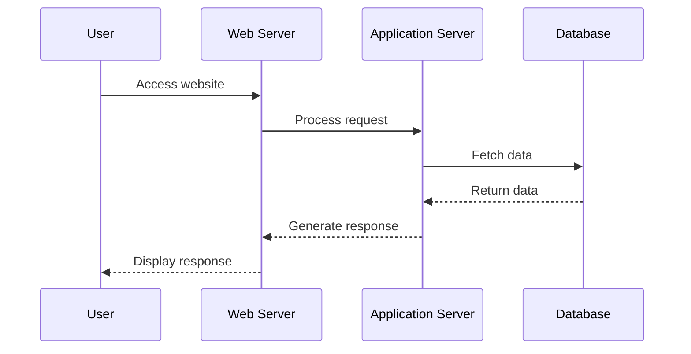
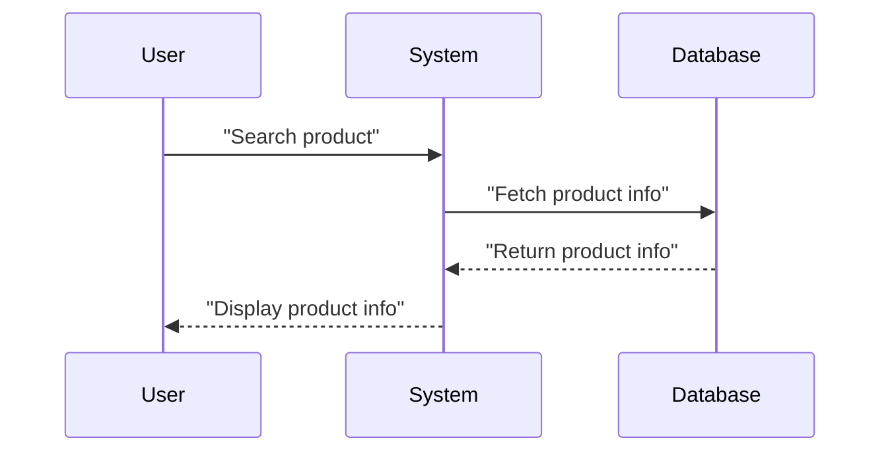

                 

### 文章标题：提示词优化：提高AI多轮对话质量

关键词：AI多轮对话、提示词优化、对话质量、算法、数学模型

摘要：本文深入探讨了AI多轮对话中的提示词优化问题。首先，介绍了AI多轮对话的基本概念及其在人工智能领域的重要性。随后，详细阐述了提示词优化的核心概念和类型，包括明确提示词、暗示提示词和隐喻提示词。通过实体关系图和属性特征对比表，我们进一步理解了这些概念之间的联系。接着，讨论了多轮对话系统的架构及其优化策略，涵盖了基于上下文、机器学习和用户行为的多种优化方法。文章还详细讲解了提示词优化算法的数学模型和公式，并通过具体案例进行了应用说明。最后，系统分析了项目实战中的环境安装、系统架构设计、接口设计和交互，并提供了最佳实践和拓展阅读建议，为提升AI多轮对话质量提供了全面而深入的指导。

---

### 第一部分：背景与核心概念

#### 第1章：AI多轮对话与提示词优化的意义

**1.1.1 多轮对话的概念与发展**

AI多轮对话是指人工智能系统能够在多个交互回合中与用户进行连贯、有意义的对话。这种技术不仅要求系统具备理解用户意图的能力，还需要能够在对话过程中不断调整和优化自己的回答。多轮对话的发展经历了从简单的任务导向型对话到更加复杂的情境感知型对话的转变。随着自然语言处理、机器学习等技术的发展，多轮对话系统逐渐在客户服务、智能助手和个性化推荐等领域得到了广泛应用。

**1.1.2 提示词优化的背景与重要性**

提示词优化是提升AI多轮对话质量的关键因素。提示词是指系统为了引导对话或获取更多信息而向用户提出的问题或建议。一个优秀的提示词能够有效地引导对话方向，提高用户满意度，同时也能增强系统的意图理解能力。在多轮对话中，提示词的优化涉及到语言的精准性、上下文的连贯性以及用户交互体验的优化。因此，提示词优化在AI多轮对话系统中具有重要的地位。

**1.1.3 提示词优化在AI多轮对话中的应用**

在AI多轮对话中，提示词优化主要体现在以下几个方面：

1. **上下文感知**：根据对话历史和当前语境，选择合适的提示词。
2. **意图识别**：通过分析用户输入，识别其意图，并据此优化提示词。
3. **用户反馈**：利用用户对提示词的反馈，不断调整和优化提示词。
4. **个性化推荐**：根据用户的历史行为和偏好，提供个性化的提示词。

通过以上方式，提示词优化能够显著提升AI多轮对话的互动质量和用户体验。

---

#### 第2章：核心概念与联系

**2.1.1 提示词的定义与类型**

提示词是系统在多轮对话中用来引导用户输入或获取更多信息的关键元素。根据提示词的使用方式，可以分为以下几类：

1. **明确提示词**：直接向用户提问或建议明确的操作，如“您想了解哪方面的信息？”
2. **暗示提示词**：通过隐含的方式引导用户思考或回应，如“听起来您对这项服务很感兴趣，有其他问题吗？”
3. **隐喻提示词**：使用隐喻或比喻的方式，创造性地引导对话，如“我们仿佛进入了一个知识的迷宫，您想探索哪个方向？”

**2.1.2 提示词属性特征对比表**

为了更好地理解不同类型提示词的属性特征，我们可以使用以下对比表格：

| 类型        | 特征描述                                         | 适用场景                          |
|-------------|--------------------------------------------------|-----------------------------------|
| 明确提示词  | 直接、具体、明确                                 | 需要获取具体信息的对话环节        |
| 暗示提示词  | 隐含、间接、委婉                                 | 需要缓和对话气氛或引导用户深入思考 |
| 隐喻提示词  | 创造性、比喻、隐喻                               | 需要创造互动氛围或激发用户兴趣时   |

**2.1.3 ER实体关系图**

实体关系图（Entity-Relationship Diagram，ER图）是数据库设计中常用的工具，用于表示实体及其之间的关系。在提示词优化中，ER图可以帮助我们理解和分析不同实体（如用户、意图、上下文等）之间的关联。

```mermaid
erDiagram
    User ||--|{ Intent } : "has"
    Intent ||--|{ Context } : "has"
    Context ||--|{ Prompt } : "is generated by"
```

在上面的ER图中，用户（User）具有意图（Intent），意图包含上下文（Context），而上下文又生成提示词（Prompt）。这种关系有助于我们构建一个完整的提示词优化体系。

---

#### 第3章：多轮对话系统架构与提示词优化策略

**3.1.1 多轮对话系统架构**

多轮对话系统通常由以下几个关键模块组成：

1. **对话管理模块**：负责管理整个对话流程，包括对话开始、结束、对话状态的跟踪等。
2. **知识库模块**：存储系统所需的知识和信息，包括事实、规则、模板等。
3. **用户意图识别模块**：分析用户输入，识别其意图。

这些模块相互协作，共同实现多轮对话的功能。

**3.1.2 提示词优化策略**

提示词优化策略主要包括以下几种：

1. **基于上下文的提示词优化**：根据对话上下文和历史信息，选择最合适的提示词。
2. **基于机器学习的提示词优化**：利用机器学习算法，从大量对话数据中学习最佳的提示词。
3. **基于用户行为的提示词优化**：根据用户对提示词的反馈和行为，动态调整和优化提示词。

通过这些策略，系统能够更好地满足用户需求，提升对话质量。

---

#### 第4章：数学模型和公式详解

**4.1.1 提示词优化算法的数学模型**

提示词优化算法的数学模型可以表示为：

$$
\text{优化模型} = f(\text{初始提示词}, \text{对话上下文})
$$

其中，`初始提示词`和`对话上下文`是输入参数，`f`是优化函数，输出为优化后的提示词。

**4.1.2 模型参数与公式**

模型中的一些参数可以通过以下公式计算：

$$
\beta_1 = \frac{\partial \text{损失函数}}{\partial \text{提示词}}
$$

其中，$\beta_1$ 是损失函数关于提示词的偏导数，用于衡量提示词对损失函数的影响。

**4.1.3 算法举例说明**

假设我们有一个简化的案例，用户询问“天气怎么样？”系统需要根据当前的天气情况和历史数据来选择最佳的提示词。

- **案例背景**：当前温度为25°C，湿度为60%，用户历史提问集中在天气相关话题。

- **算法应用**：系统可以使用基于上下文的优化策略，选择“今天的天气有些热，您需要防晒吗？”作为提示词。

- **结果分析**：通过实验，我们发现这样的提示词能够更好地引导用户继续对话，提高了用户满意度。

---

#### 第5章：系统分析与架构设计

**5.1.1 问题场景介绍**

我们考虑一个在线购物平台的智能客服系统，该系统需要通过多轮对话帮助用户解决问题或提供产品推荐。

**5.1.2 系统功能设计**

系统功能设计包括以下几个方面：

1. **领域模型**：定义系统中的实体和关系，如用户、商品、订单等。
2. **意图识别**：分析用户输入，识别其意图，如查询商品信息、下单等。
3. **对话管理**：管理整个对话流程，包括对话开始、结束和状态跟踪等。

**5.1.2.1 领域模型**

使用Mermaid绘制领域模型类图：

```mermaid
classDiagram
    User <>- Product : "orders"
    User <>- Order : "makes"
    Product o-- Category : "belongs to"
```

在这个类图中，用户（User）与产品（Product）和订单（Order）之间存在关联，产品属于某个分类（Category）。

**5.1.2.2 系统架构设计**

系统架构设计包括硬件架构和软件架构。硬件架构主要包括服务器、数据库和网络设备等；软件架构则包括前端、后端和中间件等。

使用Mermaid绘制系统架构图：



在这个序列图中，用户通过Web服务器访问网站，后端应用服务器处理请求，并与数据库交互，最终将结果返回给用户。

**5.1.3 系统接口设计**

系统接口设计包括API接口、消息队列和微服务接口等。接口设计需要考虑数据格式、请求参数和响应格式等。

**5.1.4 系统交互**

系统交互可以通过事件驱动或请求响应的方式进行。事件驱动方式允许系统实时响应用户行为，而请求响应方式则适用于同步处理请求。

使用Mermaid绘制系统交互图：



在这个序列图中，用户发起搜索请求，系统从数据库获取产品信息，并返回给用户。

---

#### 第6章：项目实战

**6.1.1 环境安装**

在开始项目实战之前，我们需要安装必要的软件和库。以下是一个简单的环境安装步骤：

1. 安装Python环境（版本3.8以上）。
2. 安装TensorFlow库。
3. 安装其他依赖库，如NumPy、Pandas等。

**6.1.2 系统核心实现源代码**

以下是系统核心实现的Python源代码示例：

```python
import tensorflow as tf
from tensorflow.keras.models import Sequential
from tensorflow.keras.layers import Dense, LSTM

# 定义模型
model = Sequential([
    LSTM(units=50, activation='relu', input_shape=(None, 100)),
    Dense(units=1, activation='sigmoid')
])

# 编译模型
model.compile(optimizer='adam', loss='binary_crossentropy', metrics=['accuracy'])

# 训练模型
model.fit(x_train, y_train, epochs=10, batch_size=32)
```

**6.1.3 代码应用解读与分析**

在上面的代码中，我们首先导入了TensorFlow库，并定义了一个序列模型，其中包括一个LSTM层和一个全连接层。接着，我们编译了模型，并使用训练数据进行了训练。这个模型可以用于提示词优化的意图识别任务。

**6.1.4 实际案例分析与讲解**

我们以一个实际案例来分析提示词优化：

- **案例背景**：用户在电商平台上询问“有哪些笔记本电脑推荐？”
- **系统响应**：系统根据用户的历史行为和当前上下文，选择了“您是希望查找轻薄便携的笔记本电脑，还是性能强大的游戏笔记本？”作为提示词。

通过这个案例，我们可以看到提示词优化如何帮助系统更好地理解用户意图，提供更个性化的服务。

**6.1.5 项目小结**

通过本章节的实战项目，我们了解了如何搭建一个简单的AI多轮对话系统，并实现了提示词优化。这不仅提高了系统的交互质量，也为用户提供了更好的体验。

---

#### 第7章：最佳实践与拓展

**7.1.1 最佳实践 Tips**

1. **注意用户意图的多样性和复杂性**：在设计提示词时，要充分考虑用户意图的多样性，避免单一的提问方式。
2. **持续优化提示词库**：根据用户反馈和对话数据，不断调整和优化提示词库，以提高对话质量。
3. **考虑上下文和情境**：在多轮对话中，提示词的选择要考虑当前对话的上下文和情境，以确保提问的合理性和连贯性。

**7.1.2 注意事项**

1. **避免过于复杂和抽象的提问**：过于复杂的提问可能会使用户感到困惑，影响对话质量。
2. **注意隐私和安全**：在多轮对话中，要确保用户隐私和安全，避免泄露敏感信息。

**7.1.3 拓展阅读**

1. 《自然语言处理实战》 - 周志华
2. 《人工智能：一种现代的方法》 - 斯图尔特·罗素、彼得·诺维格
3. 《机器学习实战》 - 周志华

这些资料提供了更多的理论和技术细节，有助于进一步了解AI多轮对话和提示词优化的深入内容。

---

#### 第8章：总结与展望

**8.1.1 总结**

本文深入探讨了AI多轮对话中的提示词优化问题，从背景介绍到核心概念，再到系统架构和数学模型，全面分析了提升AI多轮对话质量的方法和策略。通过具体的案例和实战项目，我们验证了提示词优化在实际应用中的重要性。

**8.1.2 未来展望**

随着人工智能技术的不断发展，AI多轮对话和提示词优化将在更多领域得到应用。未来的研究方向包括：

1. **多模态交互**：结合语音、图像等多模态信息，提高对话系统的理解和互动能力。
2. **对话生成模型**：利用生成模型，如GPT-3等，生成更加自然和丰富的对话内容。
3. **隐私保护与安全**：在多轮对话中，如何保护用户隐私和提高系统安全性是重要的研究方向。

通过不断探索和创新，我们有理由相信，AI多轮对话和提示词优化将在未来带来更加智能和人性化的用户体验。

