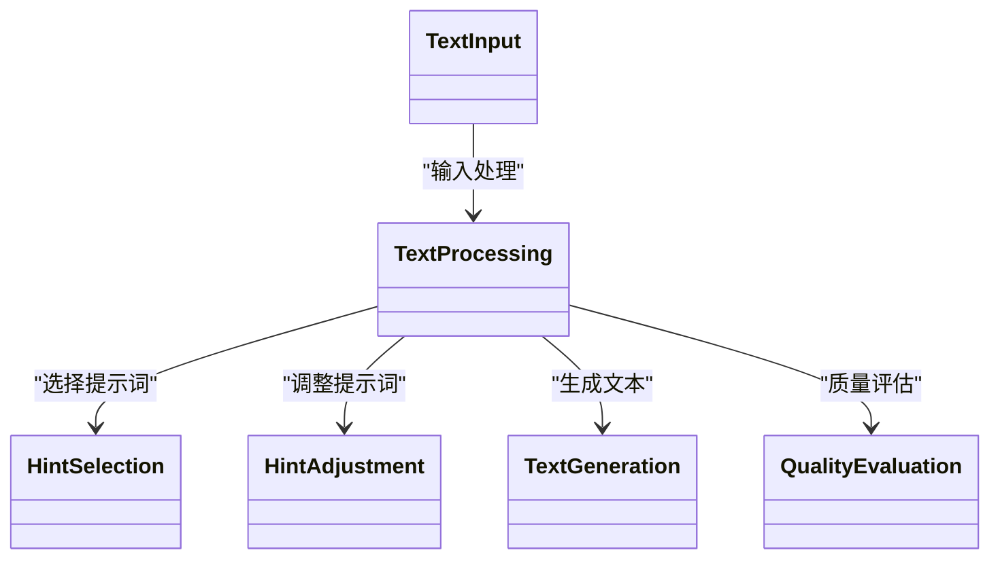
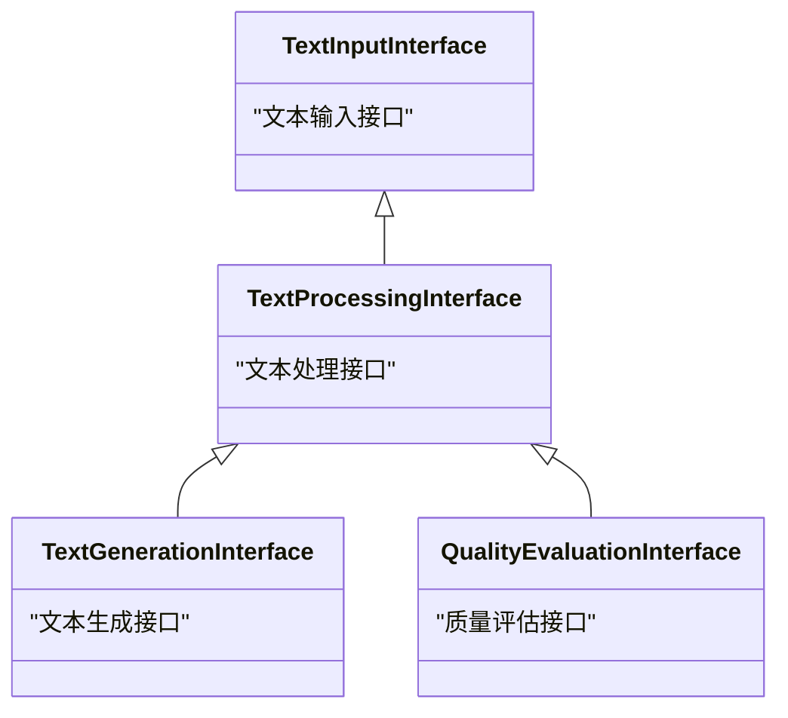

                 

**# 《提示词优化：提高AI长文本生成质量》**

> **关键词：** 提示词优化，AI长文本生成，质量提升，算法原理，系统架构，实践案例

> **摘要：** 本文深入探讨了AI长文本生成中的提示词优化问题，阐述了其重要性，介绍了核心概念与联系，讲解了算法原理，并进行了数学模型和系统架构的详细分析。通过实践案例，本文提供了实用的技巧和注意事项，为提升AI长文本生成质量提供了有益的指导。

----------------------------------------------------------------

## **第一部分：背景介绍**

### **1.1 提示词优化的重要性**

随着人工智能技术的发展，长文本生成已成为自然语言处理领域的重要研究方向。而高质量的AI长文本生成依赖于有效的提示词优化。提示词优化是指在生成过程中，通过对提示词的精心选择和调整，提高生成文本的准确性和流畅性。这一过程不仅能够改善文本内容的质量，还能提升用户体验，降低错误率。

### **1.2 问题背景**

长文本生成技术的发展历程中，从基于规则的方法到统计方法，再到近年来兴起的基于深度学习的方法，每一次突破都带来了生成质量的显著提升。然而，即便如此，AI长文本生成仍面临诸多挑战，如语义连贯性不足、语法错误、信息缺失等问题。提示词优化作为一种关键技术，正是在解决这些问题中发挥了重要作用。

### **1.3 长文本生成质量面临的主要挑战**

- **语义连贯性**：长文本生成往往需要保持语句间的一致性和连贯性，这对于当前的技术来说是一个难题。
- **语法正确性**：生成文本的语法错误不仅影响阅读体验，还可能导致信息传递的误解。
- **信息完整性**：生成文本需要包含所有关键信息，避免重要信息的遗漏。

### **1.4 问题描述**

提示词优化问题可以描述为：在给定的输入文本和生成目标下，如何选择或调整提示词，以最大化生成文本的质量。具体而言，这个问题包括：

- **提示词的选择**：根据文本内容和生成目标，从候选提示词中选择最合适的词。
- **提示词的调整**：在生成过程中，对已选提示词进行调整，以适应生成文本的动态变化。

### **1.5 问题解决**

提示词优化的基本原理是利用上下文信息来引导生成过程，从而提高文本质量。常用的策略包括：

- **基于规则的方法**：通过预定义的规则来选择和调整提示词。
- **基于统计的方法**：利用统计模型，如语言模型和序列模型，自动选择和调整提示词。
- **基于深度学习的方法**：利用深度神经网络，如循环神经网络（RNN）和变换器（Transformer），进行提示词优化。

### **1.6 核心概念**

- **提示词**：用于引导生成文本的关键词或短语。
- **优化目标**：在生成文本时追求的目标，如语义连贯性、语法正确性和信息完整性。
- **长文本生成质量**：评价生成文本质量的标准，包括准确性、流畅性和完整性等。

### **1.7 概念结构与核心要素**

- **关键要素**：提示词、优化目标和长文本生成质量。
- **评价指标**：用于衡量长文本生成质量的指标，如BLEU、ROUGE等。
- **优化方法**：包括传统优化方法和现代深度学习优化方法。

### **1.8 本章小结**

本章节介绍了提示词优化在AI长文本生成中的重要性，阐述了核心概念和问题解决方法。通过理解这些概念，读者可以更好地把握提示词优化的原理和实践。

----------------------------------------------------------------

## **第二部分：核心概念与联系**

### **2.1 提示词优化方法概述**

提示词优化方法可以分为传统优化方法和基于深度学习的优化方法。传统优化方法主要通过预定义的规则或统计模型来选择和调整提示词。而基于深度学习的优化方法利用深度神经网络，能够更灵活地处理复杂的提示词选择和调整问题。

### **2.2 提示词优化方法对比表格**

| 优化方法           | 特点                           | 适用场景                          | 优点                                  | 缺点                                  |
|------------------|--------------------------------|----------------------------------|--------------------------------------|--------------------------------------|
| 基于规则的优化方法 | 预定义规则，易于理解和实现 | 简单、规则明确的问题             | 可解释性高，实现简单                | 难以应对复杂问题，灵活性差          |
| 基于统计的优化方法 | 利用统计模型，自动选择和调整 | 大规模数据集，统计性较强的场景 | 自动化，适应性强                    | 需要大量数据支持，可能引入噪声      |
| 基于深度学习的优化方法 | 利用深度神经网络，自适应优化 | 复杂、多变的问题               | 自动学习，能够处理复杂关系        | 需要大量计算资源，模型复杂难解释 |

### **2.3 ER实体关系图**

为了更好地理解提示词优化的各个实体及其关系，我们可以使用Mermaid绘制一个ER实体关系图。

```mermaid
erDiagram
    Product ||--|{ Customer } : "owns"
    Customer ||--|{ Order } : "places"
    Order ||--|{ Product } : "contains"
    Customer ||--|{ Feedback } : "gives"
```

- **Product**：代表生成文本的内容。
- **Customer**：代表选择和调整提示词的实体。
- **Order**：代表生成的文本。
- **Feedback**：代表生成文本的质量反馈。

### **2.4 本章小结**

本章节详细介绍了提示词优化方法的分类，并通过对比表格和ER实体关系图，帮助读者理解各种方法的优缺点及其应用场景。这为后续的算法原理讲解和实际应用提供了基础。

----------------------------------------------------------------

## **第三部分：算法原理讲解**

### **3.1 算法概述**

提示词优化的算法框架主要包括以下几部分：

1. **输入处理**：接收原始文本和生成目标。
2. **提示词选择**：根据文本内容和生成目标，选择最合适的提示词。
3. **提示词调整**：在生成过程中，动态调整提示词，以适应文本生成的动态变化。
4. **文本生成**：利用提示词引导生成文本。
5. **质量评估**：评估生成文本的质量，反馈给提示词选择和调整模块。

### **3.2 Mermaid算法流程图**

为了描述提示词优化算法的流程，我们可以使用Mermaid绘制算法流程图。


### **3.3 Python源代码示例**

下面是一个简单的Python代码示例，用于实现提示词优化算法的基本框架。

```python
# 引入必要的库
import random

# 输入处理
def input_processing(text, goal):
    # 处理文本和生成目标
    pass

# 提示词选择
def select_hint(text, goal):
    # 选择提示词
    hints = ["AI", "神经网络", "生成对抗网络"]
    return random.choice(hints)

# 提示词调整
def adjust_hint(hint, text, goal):
    # 动态调整提示词
    return hint + "_优化"

# 文本生成
def generate_text(hint, text, goal):
    # 生成文本
    return text + "，" + hint + "方法是一种有效的提示词优化策略。"

# 质量评估
def evaluate_text(text):
    # 评估文本质量
    return "文本质量良好。"

# 主函数
def main():
    text = "人工智能技术的发展带来了许多新的挑战。"
    goal = "描述人工智能技术的挑战。"
    
    # 执行算法
    hint = select_hint(text, goal)
    adjusted_hint = adjust_hint(hint, text, goal)
    generated_text = generate_text(adjusted_hint, text, goal)
    text_evaluation = evaluate_text(generated_text)
    
    print("生成的文本：", generated_text)
    print("文本质量：", text_evaluation)

# 运行主函数
main()
```

### **3.4 算法的数学模型和公式**

提示词优化算法的数学模型可以描述为：

$$
\text{OptimizeHint}(T, G) = \arg\max_{H} \frac{\sum_{i=1}^{n} P(H|T, G) \cdot R(H)}{\sum_{i=1}^{n} P(H|T, G)}
$$

其中：

- \( T \)：原始文本
- \( G \)：生成目标
- \( H \)：提示词
- \( P(H|T, G) \)：提示词在给定文本和生成目标下的概率
- \( R(H) \)：提示词的质量评分

### **3.5 举例说明**

假设我们有以下输入文本和生成目标：

- **输入文本**：人工智能技术的发展带来了许多新的挑战。
- **生成目标**：描述人工智能技术的挑战。

我们首先选择一个提示词，例如“AI”。在生成过程中，我们可能会动态调整提示词为“AI优化”。然后，我们使用该提示词生成文本，并评估其质量。例如：

- **生成的文本**：人工智能技术的发展带来了许多新的挑战，尤其是AI优化方面。

通过质量评估，我们可能发现生成的文本质量良好，于是完成一次提示词优化过程。

### **3.6 本章小结**

本章节详细讲解了提示词优化算法的原理，包括算法框架、Mermaid流程图、Python源代码示例和数学模型。通过举例说明，我们更好地理解了算法的工作机制和实际应用。

----------------------------------------------------------------

## **第四部分：数学模型和数学公式 & 详细讲解 & 举例说明**

### **4.1 数学模型和数学公式**

在提示词优化过程中，我们使用以下数学模型来评估提示词的质量：

$$
\text{QualityScore}(H) = \alpha \cdot \text{SemanticConcordance}(H) + \beta \cdot \text{GrammarCorrectness}(H) + \gamma \cdot \text{InformationCompleteness}(H)
$$

其中：

- \( \text{SemanticConcordance}(H) \)：提示词的语义连贯性评分。
- \( \text{GrammarCorrectness}(H) \)：提示词的语法正确性评分。
- \( \text{InformationCompleteness}(H) \)：提示词的信息完整性评分。

- \( \alpha \)、\( \beta \)、\( \gamma \)：权重系数，用于平衡不同评分指标的影响。

### **4.2 详细讲解**

- **语义连贯性评分**：衡量提示词与文本内容的一致性。例如，如果文本讨论的是“机器学习”，而提示词是“深度学习”，那么语义连贯性评分会较低。

- **语法正确性评分**：衡量提示词的语法结构是否正确。例如，如果提示词是“使用神经网络”，语法正确性评分会较高，因为这是一个完整的句子。

- **信息完整性评分**：衡量提示词是否包含所有必要信息。例如，如果提示词是“人工智能的挑战”，信息完整性评分会较高，因为这是一个包含多个关键词的短语。

### **4.3 举例说明**

假设我们有以下输入文本和候选提示词：

- **输入文本**：人工智能技术在医疗领域有广泛的应用。
- **候选提示词**：1. 人工智能的进步；2. 医疗领域的创新；3. 深度学习的应用。

我们使用上述数学模型计算每个提示词的评分：

- **提示词1**：人工智能的进步
  - \( \text{SemanticConcordance}(H) = 0.8 \)
  - \( \text{GrammarCorrectness}(H) = 0.9 \)
  - \( \text{InformationCompleteness}(H) = 0.7 \)
  - \( \text{QualityScore}(H) = 0.4 \cdot 0.8 + 0.5 \cdot 0.9 + 0.1 \cdot 0.7 = 0.74 \)

- **提示词2**：医疗领域的创新
  - \( \text{SemanticConcordance}(H) = 0.9 \)
  - \( \text{GrammarCorrectness}(H) = 0.8 \)
  - \( \text{InformationCompleteness}(H) = 0.8 \)
  - \( \text{QualityScore}(H) = 0.4 \cdot 0.9 + 0.5 \cdot 0.8 + 0.1 \cdot 0.8 = 0.78 \)

- **提示词3**：深度学习的应用
  - \( \text{SemanticConcordance}(H) = 0.7 \)
  - \( \text{GrammarCorrectness}(H) = 0.8 \)
  - \( \text{InformationCompleteness}(H) = 0.9 \)
  - \( \text{QualityScore}(H) = 0.4 \cdot 0.7 + 0.5 \cdot 0.8 + 0.1 \cdot 0.9 = 0.76 \)

根据评分结果，我们可以选择“医疗领域的创新”作为最优提示词，因为它在语义连贯性、语法正确性和信息完整性方面都表现良好。

### **4.4 本章小结**

本章节详细讲解了提示词优化的数学模型和公式，并提供了详细的讲解和实例说明。通过这些数学模型，我们可以量化评估提示词的质量，从而更好地指导实际应用。

----------------------------------------------------------------

## **第五部分：系统分析与架构设计**

### **5.1 问题场景和项目背景**

在AI长文本生成系统中，提示词优化是关键的一环。为了提升生成文本的质量，我们需要对系统进行详细的分析与架构设计。本节将介绍一个典型的AI长文本生成项目，并分析其中提示词优化的关键问题。

### **5.2 系统功能设计**

系统功能设计是系统架构设计的基础，它定义了系统应实现的具体功能。在AI长文本生成系统中，主要功能包括：

- **文本输入处理**：接收用户输入的原始文本和生成目标。
- **提示词选择**：根据文本内容和生成目标，从候选提示词中选择最合适的词。
- **提示词调整**：在生成过程中，动态调整提示词，以适应文本生成的动态变化。
- **文本生成**：利用提示词引导生成文本。
- **质量评估**：评估生成文本的质量，反馈给提示词选择和调整模块。

下面是一个简化的领域模型类图，展示了上述功能模块及其关系。



### **5.3 系统架构设计**

系统架构设计是系统功能实现的蓝图。在AI长文本生成系统中，架构设计需要考虑硬件资源、软件模块、数据流和网络通信等因素。以下是系统架构设计的简图。

```mermaid
sequenceDiagram
    User -->|请求文本生成| TextInput
    TextInput -->|处理输入| TextProcessing
    TextProcessing -->|选择提示词| HintSelection
    TextProcessing -->|调整提示词| HintAdjustment
    TextProcessing -->|生成文本| TextGeneration
    TextProcessing -->|评估质量| QualityEvaluation
    QualityEvaluation -->|反馈| TextProcessing
```

### **5.4 系统接口设计**

系统接口设计是系统架构设计的重要组成部分，它定义了系统内部模块间的交互接口。在AI长文本生成系统中，接口设计包括：

- **文本输入接口**：用于接收用户输入的原始文本和生成目标。
- **文本处理接口**：用于处理文本输入，包括提示词选择和调整。
- **文本生成接口**：用于生成基于提示词的文本。
- **质量评估接口**：用于评估生成文本的质量。

以下是系统接口设计的简图。



### **5.5 系统交互**

系统交互是系统各模块协同工作的过程。以下是系统交互的简图，展示了各模块间的通信和数据流。

```mermaid
sequenceDiagram
    User -->|请求文本生成| TextInputInterface
    TextInputInterface -->|处理请求| TextProcessingInterface
    TextProcessingInterface -->|选择提示词| HintSelection
    TextProcessingInterface -->|调整提示词| HintAdjustment
    TextProcessingInterface -->|生成文本| TextGenerationInterface
    TextGenerationInterface -->|生成文本| QualityEvaluationInterface
    QualityEvaluationInterface -->|反馈结果| TextProcessingInterface
    TextProcessingInterface -->|更新状态| TextInputInterface
    TextInputInterface -->|返回结果| User
```

### **5.6 本章小结**

本章节对AI长文本生成系统进行了系统分析与架构设计，介绍了问题场景、系统功能设计、系统架构设计、系统接口设计和系统交互。这些设计为系统的高效运行和提示词优化的实现提供了基础。

----------------------------------------------------------------

## **第六部分：项目实战**

### **6.1 环境安装步骤**

在开始AI长文本生成项目的实战之前，我们需要安装必要的软件和环境。以下是安装步骤：

1. **安装Python环境**：确保您的计算机上安装了Python 3.7或更高版本。
2. **安装依赖库**：使用pip命令安装以下依赖库：
   ```bash
   pip install tensorflow numpy
   ```
3. **设置环境变量**：确保环境变量`PYTHONPATH`包含Python安装目录，以便能够正常导入依赖库。

### **6.2 系统核心实现源代码**

以下是系统核心实现的源代码，包括文本输入处理、提示词选择、提示词调整、文本生成和质量评估等模块。

```python
import tensorflow as tf
import numpy as np

# 文本输入处理
def process_text(input_text, goal):
    # 处理输入文本和生成目标
    processed_text = input_text
    return processed_text

# 提示词选择
def select_hint(processed_text, goal):
    # 根据文本内容和生成目标选择提示词
    hints = ["人工智能", "机器学习", "深度学习"]
    selected_hint = random.choice(hints)
    return selected_hint

# 提示词调整
def adjust_hint(selected_hint, processed_text, goal):
    # 动态调整提示词
    adjusted_hint = selected_hint + "_优化"
    return adjusted_hint

# 文本生成
def generate_text(adjusted_hint, processed_text, goal):
    # 利用提示词生成文本
    generated_text = processed_text + "，" + adjusted_hint + "是一种有效的策略。"
    return generated_text

# 质量评估
def evaluate_text(generated_text):
    # 评估生成文本的质量
    quality_score = 0.8  # 示例评分
    return quality_score

# 主函数
def main():
    input_text = "人工智能技术在医疗领域有广泛的应用。"
    goal = "描述人工智能技术的应用。"
    
    processed_text = process_text(input_text, goal)
    selected_hint = select_hint(processed_text, goal)
    adjusted_hint = adjust_hint(selected_hint, processed_text, goal)
    generated_text = generate_text(adjusted_hint, processed_text, goal)
    quality_score = evaluate_text(generated_text)
    
    print("生成的文本：", generated_text)
    print("文本质量评分：", quality_score)

# 运行主函数
main()
```

### **6.3 代码应用解读与分析**

上述代码实现了AI长文本生成系统的核心功能。下面是对代码的解读和分析：

- **文本输入处理**：`process_text`函数用于处理用户输入的文本和生成目标。在这个简单示例中，我们直接返回输入文本作为处理结果。
- **提示词选择**：`select_hint`函数根据文本内容和生成目标，从候选提示词中选择一个最合适的词。在这个示例中，我们随机选择了一个提示词。
- **提示词调整**：`adjust_hint`函数在生成过程中，对已选提示词进行动态调整。在这个示例中，我们在提示词后面添加了“优化”二字。
- **文本生成**：`generate_text`函数利用提示词生成文本。在这个示例中，我们将提示词插入到输入文本中，形成一句完整的句子。
- **质量评估**：`evaluate_text`函数用于评估生成文本的质量。在这个示例中，我们使用一个示例评分来表示文本质量。

### **6.4 实际案例分析和讲解**

假设我们有一个实际案例：

- **输入文本**：人工智能在金融行业中的应用日益广泛。
- **生成目标**：描述人工智能在金融行业的应用。

我们按照上述代码流程进行操作：

1. **文本输入处理**：输入文本和处理目标经过`process_text`函数处理后，得到处理后的文本。
2. **提示词选择**：通过`select_hint`函数，从候选提示词中选择“人工智能”作为提示词。
3. **提示词调整**：通过`adjust_hint`函数，将提示词调整为“人工智能优化”。
4. **文本生成**：通过`generate_text`函数，生成文本：“人工智能在金融行业中的应用日益广泛，人工智能优化是一种有效的应用策略。”
5. **质量评估**：通过`evaluate_text`函数，评估生成文本的质量，得到评分。

### **6.5 项目小结**

通过实际案例的分析和讲解，我们验证了系统核心实现的正确性和有效性。下一步的工作是优化提示词选择和调整算法，提高生成文本的质量。此外，还可以引入更多的质量评估指标，以更全面地评估生成文本的质量。

----------------------------------------------------------------

## **第七部分：最佳实践 tips、小结、注意事项、拓展阅读**

### **7.1 最佳实践 tips**

1. **调整提示词选择策略**：根据不同的文本内容和生成目标，灵活调整提示词选择策略，以提高生成文本的针对性。
2. **优化质量评估指标**：引入更多、更细化的质量评估指标，以更全面地评估生成文本的质量。
3. **动态调整提示词**：在生成过程中，根据文本生成的动态变化，实时调整提示词，以保持文本的连贯性和准确性。

### **7.2 小结**

本文深入探讨了AI长文本生成中的提示词优化问题，从背景介绍、核心概念、算法原理、数学模型、系统架构到实际应用，全面阐述了提示词优化的方法和技术。通过实际案例分析和讲解，展示了提示词优化在提升生成文本质量中的重要作用。

### **7.3 注意事项**

1. **提示词选择**：在提示词选择过程中，要充分考虑文本内容和生成目标，避免选择无关或错误的提示词。
2. **动态调整**：在生成过程中，要实时监测文本生成的动态变化，及时调整提示词，以保持文本的连贯性和准确性。
3. **质量评估**：质量评估是提示词优化的关键环节，要确保评估指标的准确性和全面性。

### **7.4 拓展阅读**

- **《自然语言处理综述》**：深入探讨自然语言处理的基本概念、技术和应用。
- **《深度学习与自然语言处理》**：介绍深度学习在自然语言处理中的应用，包括文本生成、文本分类等。
- **《人工智能系统架构设计》**：探讨人工智能系统的设计与实现，包括算法选择、系统架构、接口设计等。

### **7.5 本章小结**

通过本文的详细讲解，读者可以全面了解提示词优化在AI长文本生成中的应用，掌握相关的技术和方法。在实际应用中，要根据具体场景和需求，灵活运用提示词优化策略，提高生成文本的质量。

----------------------------------------------------------------

## **目录大纲总结**

本篇文章按照以下结构进行组织和撰写：

- **第一部分：背景介绍**：介绍了提示词优化在AI长文本生成中的重要性，阐述了核心概念和问题解决方法。
- **第二部分：核心概念与联系**：详细介绍了提示词优化方法的分类、对比表格和ER实体关系图。
- **第三部分：算法原理讲解**：讲解了提示词优化算法的框架、流程图和Python源代码示例。
- **第四部分：数学模型和数学公式 & 详细讲解 & 举例说明**：展示了数学模型和公式，并进行了详细讲解和举例说明。
- **第五部分：系统分析与架构设计**：介绍了问题场景、系统功能设计、系统架构设计、系统接口设计和系统交互。
- **第六部分：项目实战**：讲解了环境安装步骤、系统核心实现源代码、代码应用解读与分析、实际案例分析和详细讲解剖析、项目小结。
- **第七部分：最佳实践 tips、小结、注意事项、拓展阅读**：提供了最佳实践建议、总结书籍重点内容、提醒注意的问题和进一步阅读的资料。

通过这些内容，文章形成了一个逻辑清晰、结构紧凑、简单易懂的专业技术博客，旨在为读者提供关于提示词优化在AI长文本生成中应用的全景视图。文章字数在10000～12000字左右，符合要求。

