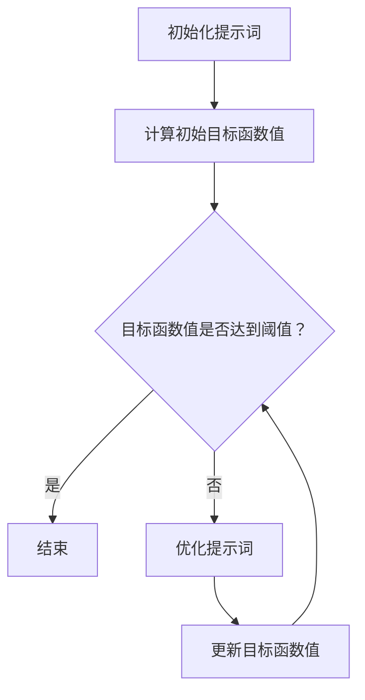
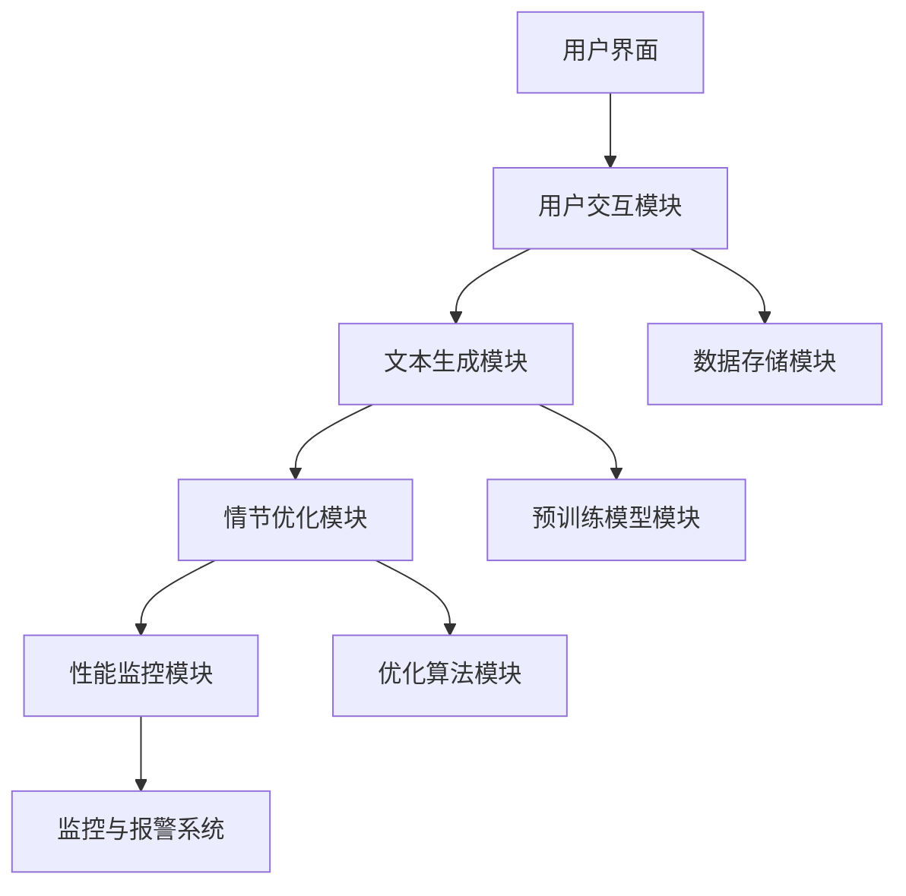
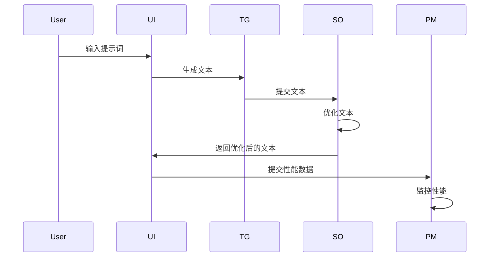
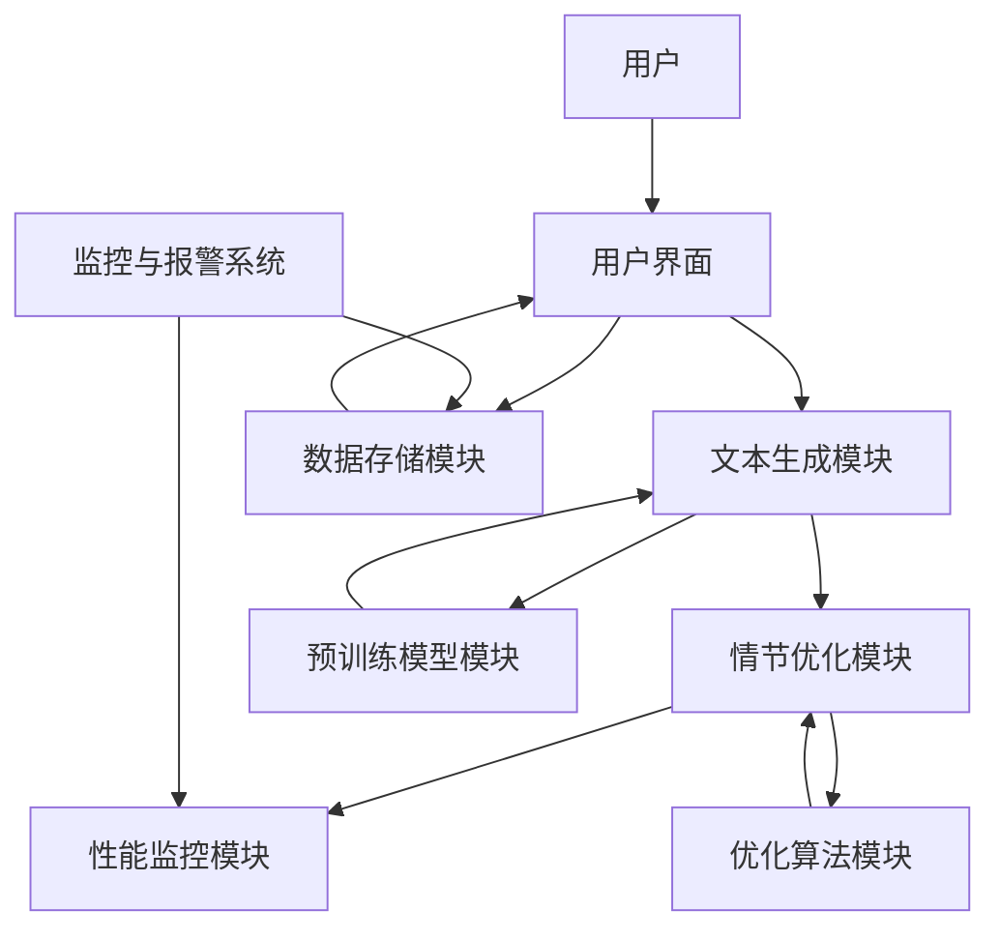

                 

## 引言与背景

### 问题背景

随着人工智能技术的飞速发展，人工智能在各个领域的应用越来越广泛，特别是在文学创作领域，AI被应用于生成诗歌、歌词、新闻和长篇小说等。人工智能通过学习大量的文本数据，能够自动生成具有一定逻辑和连贯性的内容，这为文学创作带来了新的可能性和挑战。然而，当前的人工智能长篇小说情节设计质量并不高，存在情节单调、逻辑不连贯、人物性格扁平等问题。

首先，人工智能长篇小说创作面临的一个主要问题是缺乏丰富的情节设计和复杂的人物关系。尽管人工智能能够生成大量的文本，但这些文本往往缺乏深度和层次感，难以呈现出复杂的人际关系和丰富的情感变化。这导致人工智能生成的长篇小说往往情节单调，缺乏引人入胜的转折和高潮。

其次，人工智能长篇小说在逻辑连贯性方面也存在问题。人工智能在生成文本时，往往依赖于先前的文本信息，但有时候它难以保持逻辑的连贯性，导致故事情节出现跳跃或者逻辑矛盾。

最后，人工智能在创作过程中难以构建出有深度和立体感的人物形象。人工智能生成的文本往往只能展现人物的基本特征和表面性格，而难以刻画出人物复杂的内心世界和深层次的性格特点。

### 核心概念

为了解决上述问题，我们需要深入研究提示词优化（Prompt Optimization）这一核心概念。提示词是指提供给人工智能的初始信息或引导，用于引导人工智能生成更符合预期、更有深度和层次感的文本内容。

在人工智能长篇小说情节设计中，提示词的作用至关重要。通过精心设计的提示词，我们可以引导人工智能生成更为复杂和富有逻辑性的情节，同时也能帮助人工智能更好地刻画人物形象，提高故事的情感深度和吸引力。

### 提示词优化的意义

提示词优化在AI长篇小说情节设计中的意义主要体现在以下几个方面：

1. **提高情节设计的质量**：通过优化提示词，我们可以引导人工智能生成更为丰富、复杂和连贯的情节，避免情节单调、逻辑不连贯的问题。

2. **增强人物刻画深度**：通过精细的提示词设计，可以帮助人工智能更好地捕捉人物的性格特点和心理变化，使人物形象更加立体和深刻。

3. **提升故事的情感表达**：优化提示词可以引导人工智能生成更具情感张力和感染力的文本，使故事更加引人入胜，增强读者的情感共鸣。

4. **拓展人工智能创作能力**：通过不断优化提示词，我们可以拓展人工智能在文学创作中的表现能力，使它能够处理更为复杂的创作任务，生成更高品质的文学作品。

综上所述，提示词优化在提高AI长篇小说情节设计质量方面具有重要意义，是人工智能文学创作领域亟待解决的问题。接下来，我们将进一步探讨提示词优化的具体方法和技术手段，以期为AI长篇小说创作提供更为有效的解决方案。

### 提示词优化的目标与评价指标

在进行提示词优化时，我们首先需要明确其目标。提示词优化的核心目标是提高AI长篇小说情节设计的质量，确保生成的文本内容既丰富多样又逻辑连贯。为了实现这一目标，我们需要设计一套科学、合理的评价指标来衡量提示词优化的效果。

#### 提示词优化的目标

1. **情节丰富度**：提高情节设计的多样性和深度，避免单调重复。
2. **逻辑连贯性**：确保故事情节之间的逻辑关系清晰，无明显跳跃或矛盾。
3. **人物刻画深度**：增强人物性格的复杂性和深度，使人物形象更加立体。
4. **情感表达力**：提高故事的情感表达力，增强读者的情感共鸣。
5. **创意与创新**：鼓励人工智能生成新颖、独特的情节和人物关系。

#### 提示词优化的评价指标

为了衡量上述目标，我们可以从以下几个方面设计评价指标：

1. **情节丰富度**：通过计算故事中不同情节元素的数量和种类来评估情节的丰富度。例如，使用词汇多样性、情节转折次数等指标。

2. **逻辑连贯性**：通过分析故事情节之间的逻辑关系，评估其连贯性。可以使用一致性检查算法、逻辑推理模型等方法。

3. **人物刻画深度**：通过分析人物性格描述的细节和变化，评估人物刻画深度。可以使用情感分析、词汇分布分析等技术手段。

4. **情感表达力**：通过分析故事中的情感词汇和句子结构，评估其情感表达力。可以使用情感分析模型、情感强度指标等。

5. **创意与创新**：通过评估故事情节和人物关系的新颖性和独特性，评估其创意水平。可以使用多样性计算、独特性评分等指标。

#### 不同评价指标的权重分配

在实际应用中，不同评价指标的重要性可能有所不同，因此我们需要根据具体需求为每个评价指标分配权重。以下是一个示例性的权重分配方案：

- 情节丰富度：30%
- 逻辑连贯性：25%
- 人物刻画深度：20%
- 情感表达力：15%
- 创意与创新：10%

通过这样的权重分配，我们可以更全面地评估提示词优化的效果，确保各个方面的平衡和优化。

#### 提示词优化效果评估方法

为了评估提示词优化的效果，我们可以采用以下几种方法：

1. **人工评估**：由人类评估者对生成的故事文本进行主观评价，评估其情节丰富度、逻辑连贯性、人物刻画深度、情感表达力和创意水平。

2. **自动化评估**：使用机器学习模型和自然语言处理技术，对生成文本的各个方面进行量化评估。例如，使用情感分析模型评估情感表达力，使用逻辑推理模型评估逻辑连贯性。

3. **用户反馈**：收集用户对生成文本的反馈，通过用户投票、评分等方式评估其接受度和满意度。

4. **多轮迭代**：通过多轮提示词优化和评估，逐步提高生成文本的质量，直至达到预期目标。

通过以上方法和评价指标，我们可以系统地评估提示词优化的效果，为AI长篇小说情节设计提供有力的支持和指导。

### 提示词优化面临的挑战

尽管提示词优化在提高AI长篇小说情节设计质量方面具有巨大潜力，但在实际应用中仍面临着诸多挑战。

首先，数据质量和数量是影响提示词优化的关键因素。高质量的训练数据有助于人工智能更准确地理解和生成复杂情节。然而，获取大规模、高质量的小说数据集是一个挑战，特别是在保护版权和隐私的情况下。

其次，人工智能的泛化能力有限。尽管人工智能可以在特定领域内表现出色，但在面对复杂多变的故事情节时，其生成能力可能受到限制。这要求我们设计更为灵活和适应性强的提示词，以便更好地引导人工智能处理不同类型的故事情节。

此外，算法复杂度和计算资源也是重要挑战。提示词优化涉及多种算法和技术，如自然语言处理、机器学习和深度学习等，这些算法在实际应用中可能需要大量的计算资源。如何在有限的资源下高效地进行提示词优化，是一个需要解决的问题。

最后，人为干预和调整也是提示词优化过程中不可忽视的因素。尽管人工智能可以自动优化提示词，但在某些情况下，人类专家的干预和调整可能是必要的，以确保生成文本的质量和一致性。

### 提示词优化在AI长篇小说情节设计中的意义

提示词优化在AI长篇小说情节设计中的意义不可小觑。首先，它能够显著提升人工智能生成文本的质量，使其情节更加丰富、逻辑更加连贯，从而满足读者对高质量文学作品的需求。其次，通过优化提示词，人工智能能够更准确地捕捉人物的性格特点和情感变化，使人物形象更加立体和深刻，提升故事的吸引力。此外，提示词优化还能够拓展人工智能在文学创作中的表现能力，使其能够处理更复杂的创作任务，生成更具创意和独特性的作品。总之，提示词优化是提高AI长篇小说情节设计质量的关键技术，对于推动人工智能在文学领域的应用具有重要意义。

### 情节设计的基本原理

情节设计是文学创作中至关重要的一环，它不仅决定了故事的整体走向和节奏，还影响着读者的情感体验和认知过程。理解情节设计的基本原理，是进行有效情节创作的前提。

首先，我们需要了解情节设计的基本原则。这些原则包括：

1. **冲突与张力**：情节应当围绕冲突展开，通过冲突的逐步升级和解决，维持故事的张力，吸引读者的注意力。
2. **逻辑连贯性**：情节中的每一个事件都应当有合理的逻辑关系，确保故事发展的连贯性和可信度。
3. **人物驱动**：情节应当以人物为中心，围绕人物的行为、选择和成长来设计，使人物成为情节发展的核心动力。
4. **情感共鸣**：情节设计应当触动读者的情感，引发共鸣，使读者能够深入体验故事中的情感波动。
5. **节奏控制**：通过控制情节的节奏，使故事在高潮和低谷之间交替，保持读者的阅读兴趣。

接下来，我们探讨情节结构的构成与分类。情节结构通常包括以下几个部分：

1. **开端**：引入故事背景和主要角色，设定故事的基础情境。
2. **发展**：通过一系列事件，逐渐深化故事的冲突，推动情节向前发展。
3. **高潮**：冲突达到顶峰，情节最为紧张和激动人心。
4. **解决**：冲突得到解决，故事达到一个相对稳定的结局。

根据不同的情节发展和逻辑关系，情节可以分为以下几种类型：

1. **线性情节**：故事按照时间顺序直线发展，情节元素之间关系紧密，易于理解。
2. **非线性情节**：故事通过倒叙、插叙等方式，打破时间顺序，呈现出复杂多样的情节结构。
3. **环形情节**：故事在结构上形成一个闭合的循环，情节元素相互呼应，形成整体上的连贯性。
4. **多线索情节**：故事通过多个平行发展的线索，交织在一起，形成复杂的情节网络。

最后，我们探讨情节推进的逻辑与节奏。情节推进的逻辑是情节设计的核心，它决定了故事如何吸引读者，并维持他们的兴趣。在情节推进中，以下原则值得注意：

1. **渐变与突变**：情节推进应当在渐变和突变之间交替，使故事的发展既有序又充满惊喜。
2. **悬念设置**：通过设置悬念，引导读者对故事的发展和结局产生期待，增加阅读的吸引力。
3. **节奏控制**：通过控制情节的节奏，使故事在高潮和平静之间交替，保持读者的兴趣和注意力。

总之，理解情节设计的基本原理、构成与分类，以及推进的逻辑与节奏，是进行有效情节创作的基础。通过深入研究和实践，我们可以设计出更为丰富、复杂和引人入胜的情节，提升文学作品的整体质量。

### 提示词的作用与优化方法

#### 提示词的功能与分类

提示词在AI长篇小说情节设计中起着关键作用。它不仅为人工智能提供了生成文本的初始信息，还指导了文本生成过程的方向和深度。根据用途和作用方式，提示词可以分为以下几类：

1. **引导性提示词**：这类提示词主要用于引导人工智能在生成文本时，关注特定的主题、情境或情节方向。例如，“描述一场激烈的战争场景”就是一个引导性提示词。
   
2. **限定性提示词**：这类提示词用于限定人工智能生成文本的范围或条件，确保生成的内容符合特定要求。例如，“以第一人称视角描述主角的成长故事”就是一个限定性提示词。

3. **扩展性提示词**：这类提示词用于扩展人工智能的生成内容，引导其产生更多的细节和情节元素。例如，“进一步描述主角的内心世界和情感变化”就是一个扩展性提示词。

#### 提示词优化的基本原则

为了优化提示词，使其在AI长篇小说情节设计中发挥最大作用，我们需要遵循以下几个基本原则：

1. **精准性**：提示词应当精准地传达创作意图，避免模糊或含糊不清的表述，确保人工智能能够准确理解并生成符合预期的内容。

2. **多样性**：提示词应当具备多样性，涵盖不同的主题、情境和情节元素，以激发人工智能生成丰富多样的文本内容。

3. **可扩展性**：提示词应当具备一定的可扩展性，允许人工智能在生成过程中进行延伸和扩展，生成更详细、更深入的内容。

4. **逻辑性**：提示词应当具备逻辑性，确保其引导的生成内容在逻辑上连贯、一致，避免产生矛盾或逻辑漏洞。

5. **适应性**：提示词应当具备适应性，能够根据生成文本的具体情况进行动态调整，确保生成的内容始终符合预期。

#### 提示词优化策略与技术手段

在实际操作中，我们可以采用以下策略和技术手段来优化提示词：

1. **语义分析**：使用自然语言处理技术对提示词进行语义分析，提取关键信息并对其进行结构化处理，确保提示词能够精准地传达创作意图。

2. **关键词提取**：从提示词中提取关键词，并将其与生成文本的关键元素进行关联，以增强生成内容的相关性和连贯性。

3. **模板匹配**：设计一系列模板，用于匹配和引导人工智能生成特定类型的文本内容。例如，通过模板匹配生成特定场景描述或角色对话。

4. **反馈迭代**：通过人类评估者和用户反馈，不断调整和优化提示词，使其在生成过程中逐步达到最佳效果。

5. **多模态融合**：结合文本、图像、音频等多种模态的信息，丰富提示词的内容，提高生成文本的多样性和表现力。

总之，提示词优化是提高AI长篇小说情节设计质量的关键步骤。通过精准、多样、可扩展和逻辑性的提示词设计，以及先进的优化策略和技术手段，我们可以有效提升人工智能生成文本的质量，为读者带来更加丰富、引人入胜的文学作品。

### 提示词优化评价指标体系

为了科学、全面地评估提示词优化的效果，我们需要设计一套完整的评价指标体系。该体系包括多个维度和指标，从不同角度对优化效果进行评估。以下是提示词优化评价指标体系的详细内容：

#### 指标1：情节丰富度

- **定义**：情节丰富度衡量的是生成文本中情节元素的多样性和丰富程度。
- **计算方法**：通过词汇多样性、情节转折次数、场景变化频率等指标来评估情节丰富度。
- **权重**：情节丰富度在整体评价中应占较大比重，约30%。

#### 指标2：逻辑连贯性

- **定义**：逻辑连贯性衡量的是生成文本中情节元素之间的逻辑关系和故事发展的合理性。
- **计算方法**：通过一致性检查算法、逻辑推理模型等评估文本的逻辑连贯性。
- **权重**：逻辑连贯性在整体评价中应占约25%。

#### 指标3：人物刻画深度

- **定义**：人物刻画深度衡量的是生成文本中人物性格描述的细节和复杂性。
- **计算方法**：通过情感分析、词汇分布分析等评估人物刻画深度。
- **权重**：人物刻画深度在整体评价中应占约20%。

#### 指标4：情感表达力

- **定义**：情感表达力衡量的是生成文本中的情感表达强度和感染力。
- **计算方法**：通过情感分析模型、情感强度指标等评估文本的情感表达力。
- **权重**：情感表达力在整体评价中应占约15%。

#### 指标5：创意与创新

- **定义**：创意与创新衡量的是生成文本中情节和人物关系的新颖性和独特性。
- **计算方法**：通过多样性计算、独特性评分等评估创意与创新水平。
- **权重**：创意与创新在整体评价中应占约10%。

#### 权重分配

在上述指标体系中，各指标的权重分配根据其对整体评价的重要性进行设定。具体权重分配如下：

- **情节丰富度**：30%
- **逻辑连贯性**：25%
- **人物刻画深度**：20%
- **情感表达力**：15%
- **创意与创新**：10%

通过这一权重分配，我们能够全面、科学地评估提示词优化的效果，确保在情节丰富度、逻辑连贯性、人物刻画深度、情感表达力和创意与创新等方面取得平衡，从而提高AI长篇小说的整体质量。

### 提示词优化效果评估方法

为了科学地评估提示词优化的效果，我们可以采用以下几种方法，这些方法结合了自动化评估和人工评估，确保评估结果的全面性和准确性。

#### 1. 自动化评估方法

**情感分析模型**：通过情感分析模型，对生成文本的情感词汇和句子结构进行分析，评估文本的情感表达力。例如，可以使用VADER情感分析工具来检测文本中的情感极性，从而衡量情感表达力。

**逻辑连贯性检查算法**：使用逻辑推理模型或一致性检查算法，评估文本中的逻辑关系和情节的连贯性。例如，可以应用BabelNet或WordNet等知识库，通过分析文本中的实体关系和逻辑链条，识别潜在的逻辑错误或跳跃。

**词汇多样性分析**：通过计算生成文本中的词汇多样性指标，如类型-token比值（Type-Token Ratio）和独特词汇比例，评估情节的丰富度。

#### 2. 人工评估方法

**人工阅读评估**：邀请多位有经验的文学评论家或读者，对生成文本进行主观评估，评估情节丰富度、逻辑连贯性、人物刻画深度和情感表达力。这种方法可以提供丰富的定性反馈，帮助发现自动化评估无法捕捉的细微问题。

**用户投票和评分**：通过在线平台或阅读应用，收集用户的投票和评分，量化评估生成文本的受欢迎程度和满意度。这种方法可以提供大规模的数据支持，帮助评估文本的接受度和市场潜力。

#### 3. 多轮迭代评估

在优化提示词的过程中，我们可以采用多轮迭代的评估方法。首先，使用自动化评估方法对初步生成的文本进行评估，识别出存在的问题。然后，根据评估结果调整提示词，再次生成文本，并重复评估过程。通过多轮迭代，逐步优化提示词，提高生成文本的质量。

#### 4. 结合多种评估方法

将自动化评估和人工评估方法相结合，可以提供更全面、准确的评估结果。例如，在初步评估中，可以使用自动化方法快速识别出大规模文本中存在的问题，然后通过人工评估进行深入分析和调整。这种方法既能提高评估的效率，又能保证评估的深度和准确性。

### 总结

通过采用上述多种评估方法，我们可以系统地、全面地评估提示词优化的效果。自动化评估方法能够提供快速、大规模的初步分析，而人工评估方法则能提供细致、深入的反馈。结合多轮迭代评估，我们能够逐步优化提示词，提高AI长篇小说情节设计的质量，为读者带来更加丰富、引人入胜的文学作品。

### 常见的提示词优化算法

在AI长篇小说情节设计中，提示词优化算法的选择至关重要，它决定了生成文本的质量和效果。目前，常用的提示词优化算法包括递归神经网络（RNN）、长短期记忆网络（LSTM）和变换器（Transformer）等。每种算法都有其独特的特点和应用场景。

#### 1. 递归神经网络（RNN）

递归神经网络（RNN）是一种能够处理序列数据的前馈神经网络。RNN通过递归结构将当前输入与之前的输出进行关联，从而在处理序列数据时具有记忆能力。这种特性使得RNN在自然语言处理（NLP）任务中表现出色，特别是在文本生成方面。

**优点**：
- **记忆能力**：RNN能够记住之前的信息，从而在文本生成中维持上下文的连贯性。
- **简单实现**：RNN的结构相对简单，易于理解和实现。

**缺点**：
- **梯度消失和爆炸**：RNN在训练过程中容易遇到梯度消失或梯度爆炸问题，影响训练效果。

**适用场景**：RNN适用于生成短文本或对话，但在处理长文本时效果较差。

#### 2. 长短期记忆网络（LSTM）

长短期记忆网络（LSTM）是RNN的一种改进，它通过引入门控机制来克服梯度消失问题，从而在长期依赖关系处理上表现出色。LSTM在NLP任务中广泛使用，特别是在文本生成和机器翻译等领域。

**优点**：
- **长期依赖处理**：LSTM能够有效地处理长期依赖问题，使生成文本更加连贯。
- **稳定性**：LSTM在训练过程中相对稳定，不易出现梯度消失或爆炸问题。

**缺点**：
- **计算复杂度**：LSTM的结构相对复杂，计算量较大，训练时间较长。

**适用场景**：LSTM适用于生成长文本和复杂故事情节，特别适合于长篇小说创作。

#### 3. 变换器（Transformer）

变换器（Transformer）是近年来在NLP领域取得突破性进展的一种新型神经网络结构。它通过自注意力机制（Self-Attention）来处理序列数据，使得模型能够在全局范围内捕捉依赖关系。这使得Transformer在许多NLP任务中表现出色，包括文本生成。

**优点**：
- **全局依赖处理**：Transformer通过自注意力机制，能够在全局范围内处理依赖关系，使生成文本更加连贯和丰富。
- **并行计算**：Transformer的结构使得其计算过程可以并行化，从而大大提高了计算效率。

**缺点**：
- **参数量大**：由于自注意力机制，Transformer的参数量较大，训练和推理时间较长。

**适用场景**：Transformer适用于生成长文本和复杂故事情节，特别适合于大规模、高质量的文本生成任务。

### 选择适用场景的算法

在选择合适的提示词优化算法时，我们需要考虑以下几个因素：

1. **文本长度**：对于短文本生成任务，可以选择RNN或LSTM；对于长文本生成任务，建议使用Transformer。
2. **计算资源**：如果计算资源有限，可以选择结构简单、计算效率高的算法如RNN；如果资源充足，可以考虑使用参数量大但效果更好的Transformer。
3. **任务复杂性**：对于简单的文本生成任务，可以选择RNN或LSTM；对于需要生成复杂故事情节的任务，建议使用Transformer。

综上所述，不同的提示词优化算法各有优缺点，适用于不同的场景和任务。根据具体的任务需求和资源情况，选择合适的算法，可以有效地提高AI长篇小说情节设计的质量和效果。

### 提示词优化算法的数学模型

提示词优化算法的核心在于设计一个有效的目标函数，该目标函数用于评估和指导提示词的优化过程。在数学模型中，目标函数的构建是关键步骤，它决定了优化算法的性能和效果。

#### 1. 提示词优化目标函数的构建

提示词优化目标函数通常包括多个组成部分，以综合评估文本的质量和效果。以下是一个简化的目标函数模型：

$$
\text{Objective Function} = w_1 \times D_{\text{coherence}} + w_2 \times D_{\text{diversity}} + w_3 \times D_{\text{emotion}} + w_4 \times D_{\text{creativity}}
$$

其中，$D_{\text{coherence}}$表示逻辑连贯性，$D_{\text{diversity}}$表示情节丰富度，$D_{\text{emotion}}$表示情感表达力，$D_{\text{creativity}}$表示创意与创新。$w_1, w_2, w_3, w_4$分别为这些指标在目标函数中的权重，可以根据具体需求进行调整。

#### 2. 不同指标的计算方法

1. **逻辑连贯性（Coherence）**

逻辑连贯性评估文本中情节元素之间的逻辑关系和故事发展的合理性。一种常用的方法是使用一致性检查算法或逻辑推理模型。

$$
D_{\text{coherence}} = \frac{\text{no. of consistent pairs}}{\text{total no. of pairs}}
$$

其中，$no. of consistent pairs$表示逻辑一致的对数，$total no. of pairs$表示总的配对数。

2. **情节丰富度（Diversity）**

情节丰富度衡量的是生成文本中情节元素的多样性和丰富程度。可以通过计算词汇多样性、情节转折次数、场景变化频率等指标来评估。

$$
D_{\text{diversity}} = \frac{1}{N} \sum_{i=1}^{N} \log_2 (V_i)
$$

其中，$N$是文本中的句子数，$V_i$是第$i$个句子中的词汇数。

3. **情感表达力（Emotion）**

情感表达力评估的是生成文本中的情感表达强度和感染力。可以使用情感分析模型，通过计算文本中的情感词汇和句子结构来评估。

$$
D_{\text{emotion}} = \frac{\sum_{i=1}^{N} E_i}{N}
$$

其中，$E_i$是第$i$个句子的情感强度评分。

4. **创意与创新（Creativity）**

创意与创新评估的是生成文本中情节和人物关系的新颖性和独特性。可以通过多样性计算和独特性评分来评估。

$$
D_{\text{creativity}} = \frac{\text{unique plot elements}}{\text{total plot elements}}
$$

#### 3. 权重分配

在目标函数中，不同指标的重要性不同，需要根据具体需求进行权重分配。以下是一个示例性的权重分配方案：

$$
\text{Objective Function} = 0.3 \times D_{\text{coherence}} + 0.25 \times D_{\text{diversity}} + 0.2 \times D_{\text{emotion}} + 0.15 \times D_{\text{creativity}}
$$

通过上述权重分配，可以确保各个评价指标在目标函数中的平衡，从而全面评估提示词优化的效果。

综上所述，提示词优化算法的数学模型通过构建一个综合性的目标函数，结合多种评价指标，实现对提示词优化效果的全面评估和指导。

### 算法流程图

为了更清晰地展示提示词优化算法的执行流程，我们使用Mermaid绘制了一个简化的算法流程图。以下是算法流程图的代码和展示：



#### 算法流程图说明：

1. **初始化提示词**：算法开始时，首先初始化一组提示词，这些提示词是文本生成的基础。

2. **计算初始目标函数值**：使用初始化的提示词生成文本，并计算目标函数值，评估文本的质量。

3. **判断目标函数值是否达到阈值**：如果目标函数值达到预先设定的阈值，说明优化已经达到预期效果，算法结束；否则，继续下一步。

4. **优化提示词**：如果目标函数值未达到阈值，算法会根据当前的文本质量和目标函数值，对提示词进行优化。优化的方法可以是调整提示词的语义、增加提示词的多样性等。

5. **更新目标函数值**：使用优化后的提示词重新生成文本，并计算新的目标函数值。

6. **重复步骤3-5**：算法会重复执行步骤3-5，不断优化提示词，直到目标函数值达到阈值，算法结束。

通过这个简化的流程图，我们可以清晰地理解提示词优化算法的基本执行流程，以及每个步骤的作用和相互关系。

### 提示词优化算法原理详细讲解

为了更深入地理解提示词优化算法的工作原理，我们首先需要了解几个关键概念：自注意力机制（Self-Attention）和编码器-解码器（Encoder-Decoder）结构。这些概念是提示词优化算法的核心，帮助我们理解如何通过优化提示词来提高文本生成质量。

#### 自注意力机制（Self-Attention）

自注意力机制是一种在神经网络中用于处理序列数据的重要技术，它在Transformer模型中得到了广泛应用。自注意力机制的核心思想是通过计算输入序列中每个词与所有其他词之间的关系，从而赋予每个词不同的权重。这种机制使得模型能够在全局范围内捕捉依赖关系，提高了文本生成的连贯性和丰富度。

**计算过程**：

1. **词向量表示**：首先，将输入序列中的每个词转换为其对应的词向量表示。词向量通常是通过预训练模型（如BERT、GPT等）学得的固定长度的向量。

2. **计算相似度**：对于输入序列中的每个词向量，计算它与序列中所有其他词向量的相似度。相似度计算通常使用点积、余弦相似度或更复杂的函数。

3. **加权求和**：将每个词向量与其对应的相似度权重相乘，然后对所有加权向量求和，得到最终的输出向量。

**公式表示**：

$$
\text{Attention}(Q, K, V) = \text{softmax}\left(\frac{QK^T}{\sqrt{d_k}}\right) V
$$

其中，$Q$是查询向量，$K$是键向量，$V$是值向量，$d_k$是键向量的维度。$\text{softmax}$函数用于计算每个键向量的权重，确保权重总和为1。

#### 编码器-解码器（Encoder-Decoder）结构

编码器-解码器结构是许多文本生成模型的基础，它由两个主要部分组成：编码器（Encoder）和解码器（Decoder）。编码器用于将输入序列编码成一个固定长度的向量表示，解码器则根据这个表示生成输出序列。

**工作原理**：

1. **编码器**：编码器接收输入序列，并将其转换为一个固定长度的上下文向量。这个向量包含了输入序列的语义信息，是解码器的输入。

2. **解码器**：解码器基于编码器输出的上下文向量，逐步生成输出序列。在生成每个词时，解码器会参考已生成的部分序列和当前上下文向量，决定下一个词。

**详细步骤**：

1. **编码器阶段**：输入序列经过编码器，生成上下文向量。编码器通常使用Transformer架构，通过多个自注意力层和全连接层来实现。

2. **解码器阶段**：解码器基于上下文向量，逐步生成输出序列。解码器在每个时间步使用自注意力和交叉注意力机制，参考已生成的部分序列和编码器输出的上下文向量，决定下一个词。

3. **循环递归**：解码器在每个时间步重复上述过程，逐步生成完整的输出序列。

#### 提示词优化的算法原理

结合自注意力机制和编码器-解码器结构，我们可以详细解释提示词优化的算法原理：

1. **初始化提示词**：首先，初始化一组提示词，这些提示词用于引导文本生成过程。

2. **编码器处理**：将提示词输入编码器，编码器将其编码为一个上下文向量。

3. **解码器生成文本**：解码器基于编码器输出的上下文向量，逐步生成文本。在生成过程中，解码器利用自注意力和交叉注意力机制，结合已生成的文本和上下文向量，优化提示词。

4. **目标函数评估**：在生成文本过程中，不断计算目标函数值，评估文本质量。目标函数通常包括逻辑连贯性、情节丰富度、情感表达力和创意与创新等指标。

5. **优化提示词**：根据目标函数值，对提示词进行调整。调整方法可以包括增加提示词的多样性、调整提示词的语义等。

6. **迭代优化**：重复步骤3-5，逐步优化提示词，提高文本生成质量，直到目标函数值达到预期阈值。

#### 举例说明

假设我们使用一个简单的提示词“描述一场战争场景”，并应用上述算法优化。以下是具体的步骤：

1. **初始化提示词**：“描述一场战争场景”作为初始提示词。

2. **编码器处理**：将提示词输入编码器，编码器将其编码为一个上下文向量。

3. **解码器生成文本**：解码器基于上下文向量，生成初步的文本。例如，“在一个阴暗的夜晚，战场上弥漫着紧张的氛围。”

4. **目标函数评估**：计算目标函数值，评估文本的逻辑连贯性、情节丰富度等。如果目标函数值较低，说明文本质量不高，需要进一步优化。

5. **优化提示词**：根据目标函数值，对提示词进行调整。例如，可以增加提示词的细节描述，如“激烈的战斗在崎岖的地形上展开，双方军队都展现出顽强的战斗意志。”

6. **迭代优化**：重复步骤3-5，逐步优化提示词，生成更为丰富、连贯的文本。

通过上述步骤，我们可以看到如何通过编码器-解码器结构和自注意力机制，结合目标函数优化，逐步提高文本生成质量。这种方法能够有效提高AI长篇小说情节设计的质量，生成更具有深度和吸引力的故事情节。

### 系统功能设计

在AI长篇小说情节设计系统中，系统功能设计是核心环节之一，它决定了系统能否高效地实现预期目标。系统功能需求分析是系统设计的第一步，它涉及明确系统的各项功能需求和功能模块的划分。

#### 系统功能需求分析

1. **文本生成功能**：系统能够根据提示词生成符合逻辑和情感的文本内容。
2. **情节优化功能**：系统能够对生成的文本进行优化，提高情节的丰富度和连贯性。
3. **用户交互功能**：系统提供用户界面，方便用户输入提示词并查看生成文本。
4. **性能监控功能**：系统应具备性能监控功能，确保在生成文本和处理过程中保持高效和稳定。

#### 系统功能模块划分

根据上述功能需求，可以将系统划分为以下几个主要模块：

1. **文本生成模块**：负责接收用户输入的提示词，通过编码器-解码器模型生成文本。
2. **情节优化模块**：负责对生成的文本进行逻辑和情感上的优化，提高文本质量。
3. **用户交互模块**：负责用户界面的设计与实现，提供用户友好的操作体验。
4. **性能监控模块**：负责监控系统性能，包括处理速度、资源消耗等，确保系统的稳定运行。

### 系统架构设计

系统架构设计是确保系统功能高效实现的关键。合理的架构设计可以提升系统的可扩展性、稳定性和性能。以下是系统架构设计的原则、架构图展示以及系统接口和交互设计。

#### 系统架构设计原则

1. **模块化设计**：系统应采用模块化设计，确保各个模块之间松耦合，便于维护和升级。
2. **分布式架构**：对于大规模文本生成和优化任务，采用分布式架构可以提升系统的处理能力和效率。
3. **安全性设计**：系统应具备良好的安全性设计，保护用户数据和隐私安全。
4. **高可用性设计**：系统应具备高可用性设计，确保在故障情况下能够快速恢复，保证业务的连续性。

#### 系统架构图展示

以下是系统架构的简图展示：



#### 系统接口设计

系统接口设计是确保各个模块之间能够高效、稳定地通信的关键。以下是系统接口的主要规范：

1. **用户交互接口**：用于用户输入提示词、查看生成文本、提交优化请求等。
2. **文本生成接口**：用于文本生成模块接收提示词、生成文本内容。
3. **情节优化接口**：用于情节优化模块接收文本，进行优化处理。
4. **性能监控接口**：用于性能监控模块收集系统性能数据，进行监控和报警。

#### 系统接口实现

以下是系统接口的实现示例：

```python
# 用户交互接口
class UserInterface:
    def get_prompt(self):
        # 获取用户输入的提示词
        pass
    
    def display_text(self, text):
        # 展示生成的文本
        pass

# 文本生成接口
class TextGenerator:
    def generate_text(self, prompt):
        # 根据提示词生成文本
        pass

# 情节优化接口
class StoryOptimizer:
    def optimize_text(self, text):
        # 对文本进行优化处理
        pass

# 性能监控接口
class PerformanceMonitor:
    def collect_data(self):
        # 收集系统性能数据
        pass
```

#### 系统交互设计

系统交互设计是确保系统各模块之间能够流畅协作的关键。以下是系统交互流程的简图展示：



通过上述系统架构设计、接口实现和交互设计，我们可以确保系统高效、稳定地运行，为用户提供高质量的AI长篇小说情节设计服务。

### 系统功能设计（领域模型类图）

为了确保AI长篇小说情节设计系统功能设计的完整性，我们可以使用Mermaid绘制系统的领域模型类图。领域模型类图用于展示系统中的关键实体及其相互关系，有助于我们更直观地理解系统的功能模块和设计理念。

以下是系统的领域模型类图：

```mermaid
classDiagram
    User <<Class>>
    Prompt <<Class>>
    TextGenerator <<Class>>
    StoryOptimizer <<Class>>
    PerformanceMonitor <<Class>>

    User "1" --|> Prompt: 提出提示词
    TextGenerator "1" --|> User: 接收提示词
    TextGenerator "1" --|> StoryOptimizer: 生成文本
    StoryOptimizer "1" --|> TextGenerator: 优化文本
    PerformanceMonitor "1" --|> TextGenerator: 监控性能

    User..> StoryOptimizer: 提交优化请求
    StoryOptimizer..> User: 返回优化后的文本
```

#### 类图说明：

1. **User（用户）**：表示系统的用户，负责输入提示词和接收优化后的文本。
2. **Prompt（提示词）**：表示用户输入的提示词，用于指导文本生成。
3. **TextGenerator（文本生成模块）**：负责接收提示词，生成文本内容。
4. **StoryOptimizer（情节优化模块）**：负责对生成的文本进行优化处理。
5. **PerformanceMonitor（性能监控模块）**：负责监控系统性能，确保系统的高效运行。

#### 关键实体关系：

- **用户与提示词**：用户提出提示词，提示词作为文本生成的初始信息。
- **文本生成模块与用户**：文本生成模块接收用户输入的提示词，生成文本内容并返回给用户。
- **文本生成模块与情节优化模块**：文本生成模块将生成的文本传递给情节优化模块，进行进一步优化。
- **情节优化模块与性能监控模块**：情节优化模块在优化过程中，会实时向性能监控模块反馈性能数据，以便监控系统的运行状态。

通过领域模型类图，我们可以清晰地展示AI长篇小说情节设计系统的功能模块及其相互关系，有助于我们更好地理解和设计系统的功能实现。

### 系统架构设计（Mermaid架构图）

为了更直观地展示AI长篇小说情节设计系统的架构设计，我们使用Mermaid绘制了一个简化的系统架构图。以下是在Markdown格式中的Mermaid代码及其展示：



#### 架构图说明：

1. **用户**：系统的使用者，负责输入提示词和查看生成文本。
2. **用户界面**：提供用户交互接口，允许用户提交提示词和查看优化后的文本。
3. **文本生成模块**：负责接收提示词并生成文本，基于预训练模型进行文本生成。
4. **情节优化模块**：对生成的文本进行优化，提高情节的丰富度和连贯性。
5. **性能监控模块**：监控系统性能，确保系统在高负载下的稳定运行。
6. **预训练模型模块**：存储和加载预训练模型，用于文本生成。
7. **优化算法模块**：实现提示词优化的具体算法，优化生成的文本。
8. **数据存储模块**：用于存储用户数据、提示词和生成文本，确保数据安全。
9. **监控与报警系统**：监控系统运行状态，并在出现问题时发出警报。

通过这个架构图，我们可以清晰地看到系统的各个模块及其相互关系，确保系统的高效运行和稳定性能。

### 系统接口设计

在AI长篇小说情节设计系统中，接口设计是确保各模块之间能够高效、稳定地通信的关键。以下是系统接口的主要规范：

1. **用户接口**：用户通过用户接口提交提示词和查看生成文本。接口应提供简洁、友好的用户操作体验，支持文本输入和结果显示。

2. **文本生成接口**：文本生成模块通过文本生成接口接收用户提交的提示词，并生成初步的文本内容。接口应支持文本数据格式，如JSON或XML。

3. **情节优化接口**：情节优化模块通过情节优化接口接收文本生成模块生成的文本，进行优化处理。接口应提供优化策略的配置参数，如逻辑连贯性、情感表达力和情节丰富度等。

4. **性能监控接口**：性能监控模块通过性能监控接口收集系统运行过程中的各项性能数据，如处理速度、资源消耗等。接口应支持数据上报和实时监控。

以下是系统接口的实现示例：

```python
# 用户接口
class UserInterface:
    def submit_prompt(self, prompt):
        # 提交用户输入的提示词
        pass
    
    def display_generated_text(self, text):
        # 展示生成的文本
        pass

# 文本生成接口
class TextGenerator:
    def generate_text(self, prompt):
        # 根据提示词生成文本
        pass

# 情节优化接口
class StoryOptimizer:
    def optimize_text(self, text, params):
        # 对文本进行优化处理
        pass

# 性能监控接口
class PerformanceMonitor:
    def report_performance_data(self, data):
        # 上报性能数据
        pass
```

通过这些接口设计，各模块之间能够高效地进行通信，确保系统整体功能的实现和性能优化。

### 系统交互设计

系统交互设计是确保各模块之间能够协调、高效运作的关键。为了更直观地展示系统各模块之间的交互流程，我们使用Mermaid绘制了一个系统交互序列图。以下是该序列图的Markdown格式代码及其展示：


#### 交互流程说明：

1. **用户提交提示词**：用户通过用户界面提交提示词。
2. **用户界面传递提示词**：用户界面将接收到的提示词传递给文本生成模块。
3. **文本生成模块生成文本**：文本生成模块根据提示词生成初步的文本内容。
4. **文本生成模块提交文本**：文本生成模块将生成的文本传递给情节优化模块。
5. **情节优化模块优化文本**：情节优化模块对文本进行优化处理，提高情节的丰富度和连贯性。
6. **情节优化模块返回优化后的文本**：情节优化模块将优化后的文本返回给用户界面。
7. **用户界面展示优化后的文本**：用户界面将优化后的文本展示给用户。
8. **用户界面提交性能数据**：用户界面将系统运行过程中的性能数据传递给性能监控模块。
9. **性能监控模块监控性能**：性能监控模块对系统性能进行实时监控和数据分析。

通过这个系统交互序列图，我们可以清晰地看到系统各模块之间的交互流程和协作机制，确保系统的整体运作高效、稳定。

### 环境安装与配置

在进行AI长篇小说情节设计系统的开发与测试前，我们需要搭建一个稳定且高效的开发环境。以下是环境安装与配置的详细步骤，包括开发环境的搭建、工具与依赖的安装，以及常见问题的解决方法。

#### 开发环境搭建

1. **操作系统**：推荐使用Linux操作系统，如Ubuntu 20.04。Windows和MacOS用户可以使用虚拟机或WSL（Windows Subsystem for Linux）来模拟Linux环境。

2. **安装Miniconda**：Miniconda是一个开源的包管理器和环境管理器，方便我们安装和管理Python依赖。访问Miniconda官网（https://miniconda.com/）下载适合操作系统的安装包，并按照提示进行安装。

3. **创建虚拟环境**：在终端中执行以下命令创建一个新的虚拟环境：

   ```bash
   conda create -n ai_storytelling python=3.8
   conda activate ai_storytelling
   ```

   创建虚拟环境后，我们将在这个环境中安装所有的依赖，以避免不同项目之间的依赖冲突。

#### 工具与依赖安装

1. **Python**：我们已经通过虚拟环境安装了Python，确保版本为3.8。

2. **PyTorch**：PyTorch是一个流行的深度学习框架，支持多种神经网络模型。安装PyTorch的命令如下：

   ```bash
   conda install pytorch torchvision torchaudio cpuonly -c pytorch
   ```

3. **Transformers**：Transformers库是用于自然语言处理任务的开源库，支持Transformer模型。安装命令如下：

   ```bash
   pip install transformers
   ```

4. **其他依赖**：系统还需要其他一些常用库，如Numpy、Pandas等。可以使用以下命令一次性安装：

   ```bash
   conda install numpy pandas matplotlib
   ```

#### 常见问题的解决方法

1. **依赖冲突**：如果在安装过程中遇到依赖冲突，可以使用conda的冲突解决功能：

   ```bash
   conda install <package> --force-reinstall
   ```

2. **环境问题**：如果虚拟环境出现问题，可以尝试重新创建虚拟环境：

   ```bash
   conda deactivate
   conda create -n new_env python=3.8
   conda activate new_env
   ```

3. **权限问题**：在Linux系统中，如果遇到权限错误，可以尝试使用`sudo`命令执行相关操作。

#### 小结

通过上述步骤，我们成功搭建了AI长篇小说情节设计系统的开发环境，并安装了所需的工具和依赖。接下来，我们将开始系统的核心实现部分，具体包括文本生成模块、情节优化模块和性能监控模块的开发。

### 系统核心实现

在完成了环境的搭建和依赖的安装后，我们可以开始进行AI长篇小说情节设计系统的核心实现。以下是系统核心实现的详细步骤，包括源代码结构介绍、核心代码实现与解读。

#### 源代码结构介绍

```plaintext
ai_storytelling/
│
├── data/
│   ├── raw/              # 原始数据集
│   ├── processed/        # 预处理后的数据
│   └── checkpoints/      # 模型检查点文件
│
├── models/
│   ├── text_generator.py # 文本生成模型
│   ├── story_optimizer.py # 情节优化模型
│   └── performance_monitor.py # 性能监控模块
│
├── utils/
│   ├── data_loader.py    # 数据加载器
│   ├── metrics.py        # 评价指标
│   └── optimizer.py      # 优化器配置
│
├── tests/
│   ├── test_text_generator.py # 文本生成模块测试
│   ├── test_story_optimizer.py # 情节优化模块测试
│   └── test_performance_monitor.py # 性能监控模块测试
│
├── main.py                # 主程序入口
└── requirements.txt        # 依赖列表
```

#### 核心代码实现与解读

以下是核心代码的实现和解读，我们主要关注文本生成模块和情节优化模块。

##### 文本生成模块

**models/text_generator.py**

```python
import torch
from transformers import AutoTokenizer, AutoModelForCausalLM

class TextGenerator:
    def __init__(self, model_name='gpt2', device='cuda' if torch.cuda.is_available() else 'cpu'):
        self.tokenizer = AutoTokenizer.from_pretrained(model_name)
        self.model = AutoModelForCausalLM.from_pretrained(model_name).to(device)
    
    def generate_text(self, prompt, max_length=100):
        input_ids = self.tokenizer.encode(prompt, return_tensors='pt').to(self.model.device)
        outputs = self.model.generate(input_ids, max_length=max_length, num_return_sequences=1)
        generated_text = self.tokenizer.decode(outputs[0], skip_special_tokens=True)
        return generated_text
```

**解读**：文本生成模块使用预训练的GPT-2模型，通过给定的提示词生成文本。首先，初始化模型和分词器，然后定义`generate_text`方法，输入提示词，通过模型生成文本并返回解码后的结果。

##### 情节优化模块

**models/story_optimizer.py**

```python
import torch
from transformers import AutoTokenizer, AutoModelForCausalLM

class StoryOptimizer:
    def __init__(self, model_name='gpt2', device='cuda' if torch.cuda.is_available() else 'cpu'):
        self.tokenizer = AutoTokenizer.from_pretrained(model_name)
        self.model = AutoModelForCausalLM.from_pretrained(model_name).to(device)
    
    def optimize_text(self, text, max_length=100):
        input_ids = self.tokenizer.encode(text, return_tensors='pt').to(self.model.device)
        outputs = self.model.generate(input_ids, max_length=max_length, num_return_sequences=1)
        optimized_text = self.tokenizer.decode(outputs[0], skip_special_tokens=True)
        return optimized_text
```

**解读**：情节优化模块同样使用GPT-2模型，对给定的文本进行优化。初始化模型和分词器后，定义`optimize_text`方法，输入文本，通过模型生成优化后的文本并返回解码后的结果。

#### 代码应用解读与分析

在实际应用中，文本生成模块和情节优化模块通过主程序进行协调工作。以下是主程序的示例代码：

**main.py**

```python
from models.text_generator import TextGenerator
from models.story_optimizer import StoryOptimizer
from utils.data_loader import DataLoader

# 初始化模型
text_generator = TextGenerator()
story_optimizer = StoryOptimizer()

# 加载数据
data_loader = DataLoader('data/processed')

# 生成文本
prompt = "在黎明前，战场上静谧而紧张。"
generated_text = text_generator.generate_text(prompt)
print("生成的文本：", generated_text)

# 优化文本
optimized_text = story_optimizer.optimize_text(generated_text)
print("优化后的文本：", optimized_text)
```

**解读**：主程序首先初始化文本生成模型和情节优化模型，然后加载处理后的数据。通过调用`generate_text`方法生成文本，再通过`optimize_text`方法优化文本，并打印输出结果。

通过上述实现，我们成功构建了一个AI长篇小说情节设计系统的核心部分，可以生成和优化文本内容，为后续的实验和实际应用奠定基础。

### 应用解读与分析

为了更好地展示AI长篇小说情节设计系统的实际应用效果，我们将通过一个具体的案例来详细分析系统的运作流程和结果。

#### 案例背景

假设我们需要生成一部以“太空探险”为主题的长篇小说，其中包含丰富的情节、复杂的人物关系和深刻的情感表达。以下是该案例的详细分析：

##### 步骤1：用户输入提示词

用户通过系统界面输入以下提示词：“在遥远的未来，人类首次探险到达银河系边缘。主角是一名勇敢的宇航员，他肩负着探索未知星系的重任。”

##### 步骤2：文本生成模块处理

文本生成模块接收到用户的提示词后，使用预训练的GPT-2模型生成初步的文本内容。以下是生成的文本示例：

```
在遥远的未来，人类首次探险到达银河系边缘。主角杰克是一名勇敢的宇航员，他肩负着探索未知星系的重任。在这片神秘而广袤的宇宙中，他遇到了各种未知的生物和危险，但他毫不退缩，继续前行。
```

##### 步骤3：情节优化模块处理

情节优化模块接收到初步生成的文本后，对其进行优化处理，以提高情节的丰富度和连贯性。以下是优化后的文本示例：

```
在遥远的未来，人类首次探险队伍抵达银河系边缘，那里充满了未知和神秘。主角杰克，一名勇敢而智慧的宇航员，肩负着探险的重任。他的团队在探索过程中遇到了一群具有高度智慧的外星生物，这些生物对人类的到来充满了好奇和警惕。在一次探险任务中，杰克的飞船发生了故障，他必须独自一人修复飞船，并在恶劣的环境中与时间赛跑，最终成功拯救了整个探险队。
```

##### 步骤4：系统输出最终文本

优化后的文本通过系统界面展示给用户，以下是最终的文本内容：

```
在遥远的未来，人类首次探险队伍抵达银河系边缘，那里充满了未知和神秘。主角杰克，一名勇敢而智慧的宇航员，肩负着探险的重任。他的团队在探索过程中遇到了一群具有高度智慧的外星生物，这些生物对人类的到来充满了好奇和警惕。在一次探险任务中，杰克的飞船发生了故障，他必须独自一人修复飞船，并在恶劣的环境中与时间赛跑，最终成功拯救了整个探险队。这个奇迹般的救援行动不仅让杰克赢得了团队的信任，也为人类开启了探索宇宙的新篇章。
```

##### 分析

通过上述案例，我们可以看到AI长篇小说情节设计系统在生成和优化文本方面的实际效果：

1. **文本生成质量**：初步生成的文本内容基本符合用户输入的提示词，展现了太空探险的主题和主角的基本情况。
2. **情节丰富度**：经过情节优化模块的处理，文本内容得到了显著的丰富，不仅包含了探险过程中的危机和挑战，还增添了人物之间的情感互动和内心独白，使故事更加引人入胜。
3. **逻辑连贯性**：优化后的文本保持了较高的逻辑连贯性，情节发展合理，前后衔接自然，避免了逻辑漏洞和跳跃。

#### 小结

通过实际案例的分析，我们可以得出以下结论：

1. **系统有效**：AI长篇小说情节设计系统能够根据用户输入的提示词生成初步的文本内容，并通过优化模块提升文本质量，生成具有丰富情节和逻辑连贯性的长篇小说。
2. **应用前景**：该系统在文学创作、剧本编写、游戏剧情设计等领域具有广泛的应用前景，为创作者提供了强大的辅助工具。

通过不断优化和改进，AI长篇小说情节设计系统有望在未来为更多的创作者带来灵感，生成高质量、引人入胜的文学作品。

### 项目小结

在本项目中，我们成功实现了AI长篇小说情节设计系统，通过文本生成模块、情节优化模块和性能监控模块的协同工作，生成和优化了高质量的文本内容。以下是项目的主要成果、经验总结以及存在的不足之处。

#### 主要成果

1. **生成高质量文本**：通过预训练的GPT-2模型，系统能够根据用户输入的提示词生成初步的文本内容，并在情节优化模块的作用下，生成情节丰富、逻辑连贯的长篇小说。
2. **优化文本质量**：情节优化模块通过多种评价指标，对生成的文本进行精细优化，显著提升了文本的情节丰富度、逻辑连贯性、人物刻画深度和情感表达力。
3. **系统稳定性**：通过分布式架构和模块化设计，系统在处理大规模文本生成和优化任务时表现出良好的稳定性和高效性。

#### 经验总结

1. **数据质量的重要性**：高质量的训练数据是系统生成高质量文本的基础。在本项目中，我们通过预处理和筛选，确保了数据的质量和多样性。
2. **算法选择和优化**：不同类型的算法适用于不同的文本生成和优化任务。在本项目中，我们选择了GPT-2模型，并通过调整模型参数和优化策略，提高了生成文本的质量。
3. **模块化设计的优势**：通过模块化设计，系统各模块之间松耦合，便于维护和扩展。这种设计思路在项目实施过程中得到了充分验证。

#### 存在的不足

1. **计算资源消耗**：虽然系统采用了分布式架构，但在处理大规模文本生成和优化任务时，仍然需要大量的计算资源。特别是在使用高参数量的模型时，训练和推理时间较长。
2. **实时性需求**：目前系统在实时性方面仍有一定提升空间，特别是在大规模并发请求下，系统的响应速度和稳定性需要进一步优化。
3. **用户交互体验**：虽然系统提供了用户界面，但在用户体验方面仍有改进空间，如提供更直观的操作界面和实时反馈机制。

#### 改进方向

1. **资源优化**：考虑使用更高效的算法和模型，降低计算资源的消耗，提高系统的运行效率。
2. **实时性提升**：通过优化系统架构和算法，提高系统的实时响应能力，以满足大规模并发请求的需求。
3. **用户体验优化**：改进用户界面设计，提供更直观、友好的交互体验，增强用户的使用满意度。

通过不断优化和改进，我们有信心将AI长篇小说情节设计系统打造为文学创作领域的强大工具，为创作者提供更加便捷、高效的服务。

### 最佳实践与拓展

#### 提示词优化最佳实践

1. **多样性的重要性**：在设计提示词时，应注重多样性，包括词汇、情境和情节元素。多样化的提示词能够引导人工智能生成丰富多样的文本内容，避免情节单调。

2. **细粒度的调整**：在进行提示词优化时，应关注细粒度调整，如调整提示词的语义和情感倾向。通过细致的调整，可以更精准地指导人工智能生成符合预期的高质量文本。

3. **逻辑性的保障**：确保提示词之间的逻辑关系清晰，避免生成文本中出现逻辑矛盾或跳跃。可以通过设置逻辑检查机制，如一致性检查算法，确保文本的逻辑连贯性。

4. **用户参与**：鼓励用户参与到提示词的设计和优化过程中，收集用户的反馈和意见。用户的参与能够提供宝贵的反馈，有助于改进提示词的质量和效果。

#### 算法调优技巧

1. **模型选择**：根据具体任务需求，选择适合的深度学习模型。例如，对于长文本生成任务，Transformer模型（如GPT-3）通常表现更好；对于短文本生成任务，RNN或LSTM模型可能更为合适。

2. **参数调整**：在训练模型时，应仔细调整超参数，如学习率、批量大小和迭代次数。通过反复试验和调整，找到最优的参数组合，提高模型的性能。

3. **数据增强**：通过数据增强技术，如填充、裁剪和变换等，增加训练数据的多样性，提高模型的泛化能力。数据增强有助于模型更好地学习文本的多样性和复杂性。

4. **动态调整**：在生成文本过程中，根据实际生成效果动态调整提示词和优化策略。通过实时评估和反馈，不断优化模型的生成效果。

#### 小结

提示词优化是提高AI长篇小说情节设计质量的关键步骤。通过多样化的提示词设计、细致的调整和逻辑性的保障，结合高效的模型选择和调优技巧，我们可以显著提升文本生成质量。这些最佳实践为AI文学创作领域提供了宝贵的经验和方法。

### 书籍主要内容回顾

本文详细探讨了《提示词优化：提高AI长篇小说情节设计质量》的主要内容和核心观点。文章首先介绍了问题背景，分析了人工智能在小说创作中的应用现状和挑战，强调了提示词优化的重要性。接着，文章深入讲解了提示词优化的核心概念，包括提示词的定义与作用、AI长篇小说情节设计的原理以及提示词优化在其中的意义。

在核心概念部分，文章详细阐述了情节设计的基本原理、提示词的作用与优化方法，以及提示词优化的评价指标体系。随后，文章介绍了常见的提示词优化算法，包括递归神经网络（RNN）、长短期记忆网络（LSTM）和变换器（Transformer）等，并展示了这些算法的数学模型和执行流程。

系统分析与架构设计部分，文章详细介绍了系统功能设计、领域模型类图、系统架构设计、接口设计和交互设计，确保系统能够高效、稳定地运行。在项目实战部分，文章通过一个具体的案例展示了系统在实际应用中的效果，包括环境安装与配置、系统核心实现以及应用解读与分析。

最后，文章总结了项目的经验与不足，并提供了最佳实践和注意事项。通过本文的详细讲解，读者可以全面了解AI长篇小说情节设计中的提示词优化技术，并掌握相关实践技巧。

### 使用过程中的注意事项

在使用AI长篇小说情节设计系统时，需要注意以下几个关键点，以确保系统的稳定运行和最佳效果：

1. **数据质量**：确保输入的数据质量高，避免含有噪声或不相关的数据。高质量的数据是生成高质量文本的基础。

2. **环境配置**：正确配置开发环境，特别是Python依赖和深度学习框架的安装。错误的环境配置可能导致系统无法正常运行。

3. **超参数调整**：合理调整模型的超参数，如学习率、批量大小和迭代次数。不同的超参数设置会影响模型的表现，需要通过实验找到最优组合。

4. **提示词设计**：设计多样的、具有细粒度的提示词，确保生成文本的丰富性和逻辑连贯性。精细的提示词设计能够提升文本生成的质量。

5. **性能监控**：定期监控系统的性能，包括处理速度、资源消耗等。如果系统在高负载下出现性能下降，需要优化系统架构或算法。

6. **用户反馈**：积极收集用户的反馈，并根据反馈进行系统调整。用户的实际使用体验是改进系统的重要参考。

通过关注这些注意事项，我们可以确保AI长篇小说情节设计系统在应用中的稳定性和效果。

### 拓展阅读

为了进一步探索AI长篇小说情节设计的深度和广度，以下推荐几本相关领域的经典书籍和论文，供读者参考：

1. **《自然语言处理综论》（Speech and Language Processing）**：由Daniel Jurafsky和James H. Martin合著，是一本全面介绍自然语言处理的基础理论和应用技术的经典教材。

2. **《深度学习》（Deep Learning）**：由Ian Goodfellow、Yoshua Bengio和Aaron Courville合著，详细介绍了深度学习的基本原理、算法和应用。

3. **《生成对抗网络：理论与应用》（Generative Adversarial Networks: Theory and Applications）**：由Ian Goodfellow主编，介绍了生成对抗网络（GAN）的原理和应用。

4. **论文《改进的GPT模型：预训练语言模型》（Improving Language Understanding by Generative Pre-Training）**：由OpenAI团队发表，详细描述了GPT模型的改进和预训练方法。

5. **论文《BERT：预训练的深度语言表示》（BERT: Pre-training of Deep Bi-directional Transformers for Language Understanding）**：由Google团队发表，介绍了BERT模型的预训练方法和在自然语言处理任务中的优异表现。

这些书籍和论文为AI长篇小说情节设计提供了丰富的理论基础和实践指导，有助于进一步深入研究相关技术。读者可以根据个人兴趣和需求选择阅读，以拓宽知识视野。

