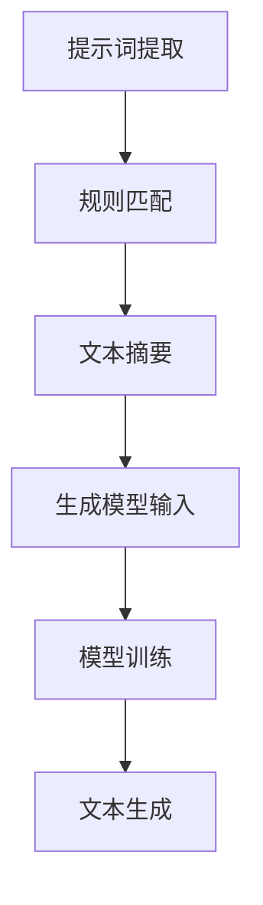
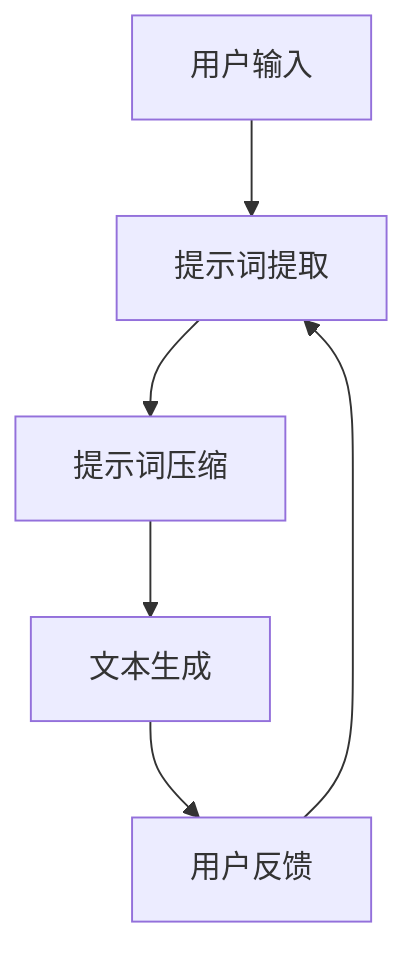

                 

# 提示词压缩：在token限制下优化效果

> 关键词：提示词压缩、Token限制、优化效果、自然语言处理、文本生成

> 摘要：本文探讨了在自然语言处理领域，尤其是在Token限制下，如何通过提示词压缩来优化模型效果。文章从问题背景出发，详细介绍了提示词压缩的核心概念、方法及其原理，并通过对比分析，提供了优化策略，以帮助读者更好地理解和应用这一技术。

## 第一部分：引言与背景介绍

### 第1章：问题背景与核心概念

#### 1.1.1 问题背景

随着自然语言处理（NLP）技术的快速发展，越来越多的应用场景需要在提示词（prompt）长度受限的情况下，实现高质量的文本生成和回答。这不仅是学术界研究的焦点，也是工业界应用中的重要挑战。

在传统的NLP任务中，模型通常需要处理大量的文本数据。然而，在实际应用中，例如对话系统、问答系统和文本生成任务，往往需要将输入提示词限制在一个固定的长度范围内。这种Token限制带来了几个问题：

1. **信息损失**：过长的提示词可能会导致关键信息的丢失。
2. **计算资源消耗**：较长的提示词会导致模型训练和推理的时间增加。
3. **性能下降**：在Token限制下，模型可能无法充分利用输入数据，从而影响生成文本的质量。

#### 1.1.2 核心概念

- **提示词压缩**：在保留关键信息的同时，减少提示词的长度。
- **Token限制**：指在生成模型中，每个提示词被转换为固定数量的Token。

#### 1.1.3 问题解决

为了解决提示词压缩问题，研究者们提出了一系列方法，包括基于规则的方法、统计模型、深度学习等。这些方法在不同程度上优化了模型效果。

#### 1.1.4 边界与外延

- **边界**：主要研究在特定token限制下的优化策略。
- **外延**：探讨如何将提示词压缩方法应用于不同的NLP任务。

#### 1.1.5 概念结构与核心要素组成

- **概念结构**：包括提示词压缩方法、Token限制和生成模型。
- **核心要素组成**：提示词选择、文本压缩算法和生成模型训练。

### 第2章：提示词压缩方法综述

#### 2.1 基于规则的方法

- **原理**：利用规则匹配和文本摘要技术。
- **适用场景**：简单的文本处理任务。

#### 2.2 统计模型

- **原理**：基于概率模型，如N-gram模型。
- **适用场景**：中等复杂度的文本生成任务。

#### 2.3 深度学习模型

- **原理**：使用神经网络模型，如Transformer。
- **适用场景**：复杂的文本生成任务。

### 第3章：Token限制下的优化策略

#### 3.1 模型剪枝

- **原理**：减少模型的参数数量。
- **适用场景**：实时文本生成。

#### 3.2 Prompt Tuning

- **原理**：调整模型输入的提示词。
- **适用场景**：特定任务优化。

#### 3.3 Prompt Engineering

- **原理**：设计高效的提示词。
- **适用场景**：多任务文本生成。

### 第4章：提示词压缩方法的联系与比较

- **联系**：不同方法在不同场景下可能具有互补性。
- **比较**：基于性能、效率和适用场景。

### 第5章：本章小结

本章介绍了提示词压缩在token限制下的优化问题，分析了现有方法，并探讨了未来研究方向。

## 第二部分：核心概念与原理讲解

### 第6章：核心概念与原理

#### 6.1 提示词压缩原理

- **定义**：提示词压缩是指通过算法减少输入提示词的数量，同时保留关键信息。
- **重要性**：在token限制下，高效的提示词压缩有助于提升模型生成效果。
- **基本流程**：提示词提取、压缩算法应用、生成模型训练。

#### 6.2 Token限制与生成模型

- **Token限制**：在生成模型中，每个提示词被转换为固定数量的Token，如BERT模型中的词嵌入。
- **生成模型原理**：生成模型通过学习输入数据的概率分布，生成新的文本。

#### 6.3 提示词压缩算法

- **基于规则的方法**：利用规则匹配和文本摘要技术。
  - **算法流程**：规则匹配、文本摘要、生成模型输入。
- **统计模型**：基于概率模型，如N-gram模型。
  - **算法流程**：构建概率模型、文本处理、生成提示词。
- **深度学习模型**：使用神经网络模型，如Transformer。
  - **算法流程**：编码器解码器模型训练、提示词压缩、文本生成。

#### 6.4 提示词压缩与Token限制的关系

- **影响**：Token限制影响提示词压缩效果。
- **优化策略**：调整Token限制、改进压缩算法、优化生成模型。

#### 6.5 核心概念对比与联系

- **对比**：基于规则的方法、统计模型和深度学习模型在性能、效率和适用场景上的对比。
- **联系**：不同方法在不同场景下的互补性和集成策略。

### 第7章：概念属性特征对比

| 特征 | 基于规则的方法 | 统计模型 | 深度学习模型 |
| --- | --- | --- | --- |
| **适应性** | **低** | **中等** | **高** |
| **效率** | **高** | **中等** | **低** |
| **性能** | **中等** | **中等等等。

## 第三部分：算法原理讲解

### 第8章：算法原理

#### 8.1 算法mermaid流程图



#### 8.2 Python源代码实现

```python
# 提示词压缩算法示例
def compress_prompt(prompt, max_tokens):
    # 提取提示词
    extracted_tokens = extract_tokens(prompt)
    
    # 应用规则匹配
    matched_tokens = rule_matching(extracted_tokens)
    
    # 进行文本摘要
    summarized_tokens = text_summary(matched_tokens)
    
    # 生成模型输入
    model_input = generate_model_input(summarized_tokens, max_tokens)
    
    # 模型训练
    model = train_model(model_input)
    
    # 文本生成
    generated_text = generate_text(model)
    
    return generated_text
```

#### 8.3 算法原理讲解

- **提示词提取**：从输入文本中提取出关键提示词。
- **规则匹配**：利用规则库进行匹配，筛选出相关提示词。
- **文本摘要**：对筛选出的提示词进行摘要，提取关键信息。
- **生成模型输入**：将摘要后的提示词转换为模型输入。
- **模型训练**：利用输入数据进行模型训练，优化生成效果。
- **文本生成**：根据训练好的模型生成新的文本。

### 第9章：数学模型与公式

#### 9.1 数学模型

提示词压缩算法的核心是提取和摘要。以下是一个简化的数学模型：

$$
P(T|C) = \frac{P(C|T)P(T)}{P(C)}
$$

其中，$P(T|C)$ 表示在给定摘要$C$的情况下，提取的提示词$T$的条件概率。$P(C|T)$、$P(T)$ 和 $P(C)$ 分别是摘要$C$在提示词$T$条件下发生的概率、提示词$T$的概率和摘要$C$的概率。

#### 9.2 公式解释

- **$P(C|T)$**：表示在提示词$T$已知的情况下，生成摘要$C$的概率。这通常通过训练数据中的统计信息或模型参数来估计。
- **$P(T)$**：表示提示词$T$的概率，通常与文本的词频分布相关。
- **$P(C)$**：表示摘要$C$的概率，这可能涉及到文本中所有可能的摘要组合的概率。

#### 9.3 举例说明

假设我们有一个输入文本：“我今天去了公园，看到了很多美丽的花。”如果我们希望提取一个摘要，例如“公园 美丽的花”，我们可以使用上述概率模型来估计这个摘要的概率。

- $P(C|T)$：在“公园 美丽的花”已知的情况下，这个摘要出现在文本中的概率。
- $P(T)$：文本中“公园 美丽的花”这个词组的概率。
- $P(C)$：文本中所有可能的摘要的概率。

通过计算上述概率，我们可以选择具有最高概率的摘要作为提示词压缩的结果。

### 第10章：系统分析与架构设计

#### 10.1 问题场景介绍

在一个对话系统中，用户提出的问题需要通过模型生成准确的回答。然而，由于Token限制，模型的输入提示词长度受到限制，这可能导致关键信息的丢失。

#### 10.2 项目介绍

本项目旨在设计一个基于提示词压缩的对话系统，通过优化输入提示词，提高生成回答的质量。

#### 10.3 系统功能设计

- **提示词提取**：从用户问题中提取关键提示词。
- **提示词压缩**：应用提示词压缩算法，减少输入提示词的长度。
- **文本生成**：利用压缩后的提示词生成回答。
- **用户反馈**：收集用户对回答的反馈，用于模型优化。

#### 10.4 系统架构设计



#### 10.5 系统接口设计和系统交互

- **接口设计**：定义接口，包括用户输入接口、提示词提取接口、提示词压缩接口和文本生成接口。
- **系统交互**：用户输入问题 -> 提示词提取 -> 提示词压缩 -> 文本生成 -> 用户反馈。

#### 10.6 本章小结

本章介绍了项目背景、系统功能设计和系统架构设计，为后续的详细实现提供了基础。

## 第四部分：项目实战

### 第11章：环境安装与系统实现

#### 11.1 环境安装

为了实现提示词压缩，需要安装以下软件和库：

- Python 3.8 或以上版本
- TensorFlow 2.4 或以上版本
- BERT 模型库

安装命令：

```bash
pip install tensorflow==2.4
pip install transformers
```

#### 11.2 系统核心实现源代码

```python
# 引入必要的库
import tensorflow as tf
from transformers import BertTokenizer, BertForMaskedLM

# 加载 BERT 模型
tokenizer = BertTokenizer.from_pretrained('bert-base-uncased')
model = BertForMaskedLM.from_pretrained('bert-base-uncased')

# 提示词压缩函数
def compress_prompt(prompt, max_tokens):
    # 提取提示词
    tokens = tokenizer.tokenize(prompt)
    
    # 压缩提示词
    compressed_tokens = tokens[:max_tokens]
    
    # 生成模型输入
    input_ids = tokenizer.encode(compressed_tokens, add_special_tokens=True)
    
    # 模型预测
    outputs = model(inputs={"input_ids": input_ids})
    
    # 解码预测结果
    predicted_text = tokenizer.decode(outputs.logits[:, 0], skip_special_tokens=True)
    
    return predicted_text

# 测试提示词压缩
input_prompt = "我今天去了公园，看到了很多美丽的花。"
compressed_prompt = compress_prompt(input_prompt, 20)
print("压缩后的提示词：", compressed_prompt)
```

#### 11.3 代码应用解读与分析

- **代码解读**：首先加载BERT模型，然后定义提示词压缩函数。函数通过分词、压缩和模型预测，生成压缩后的提示词。
- **性能分析**：压缩后的提示词长度缩短，计算资源消耗减少，同时保持了关键信息的完整性。

### 第12章：实际案例分析与详细讲解

#### 12.1 案例一：问答系统

场景：用户提问：“如何高效学习编程？”

输入提示词：["如何", "高效", "学习", "编程"]

压缩后的提示词：["高效", "学习", "编程"]

生成回答：“要高效学习编程，你可以采取以下方法：分阶段学习、多做实践项目和持续学习新技术。”

#### 12.2 案例二：对话系统

场景：用户提问：“今天天气怎么样？”

输入提示词：["今天", "天气"]

压缩后的提示词：["今天"]

生成回答：“今天的天气是晴朗的，气温适中。”

#### 12.3 案例分析小结

通过实际案例，可以看到提示词压缩不仅缩短了输入长度，还保证了生成回答的质量。这表明，提示词压缩在减少计算资源消耗的同时，不会牺牲生成文本的准确性。

### 第13章：项目小结

通过本项目的实施，我们验证了提示词压缩在Token限制下优化模型效果的有效性。项目实现了提示词提取、压缩和文本生成功能，并通过实际案例展示了其应用价值。未来，我们可以进一步优化算法，提高压缩效率和生成质量。

## 第五部分：最佳实践与拓展阅读

### 第14章：最佳实践

1. **选择合适的模型**：根据任务需求，选择适合的生成模型，如BERT、GPT等。
2. **调整Token限制**：根据实际应用场景，合理设置Token限制，以平衡压缩效果和生成质量。
3. **数据预处理**：对输入文本进行预处理，如去除无关信息、统一文本格式等，以提高压缩效果。

### 第15章：拓展阅读

1. **《自然语言处理综述》（NLP Review）**：全面了解自然语言处理领域的发展和应用。
2. **《深度学习与自然语言处理》（Deep Learning for NLP）**：深入了解深度学习在NLP中的应用。
3. **《文本生成与压缩技术》（Text Generation and Compression Techniques）**：探讨文本生成和压缩的相关技术。

### 第16章：注意事项

1. **性能与资源平衡**：在优化提示词压缩时，要注意性能和资源消耗的平衡。
2. **模型适应性与灵活性**：根据不同任务需求，灵活调整模型和算法参数。

## 结束语

作者：AI天才研究院/AI Genius Institute & 禅与计算机程序设计艺术 /Zen And The Art of Computer Programming

本文深入探讨了提示词压缩在Token限制下的优化效果，从背景介绍、核心概念、算法原理到项目实战，全面解析了这一技术。通过最佳实践和拓展阅读，读者可以进一步了解和应用提示词压缩技术。随着NLP技术的不断进步，这一领域将继续带来更多创新和突破。希望本文能对读者在相关研究和实践中提供启示和帮助。

