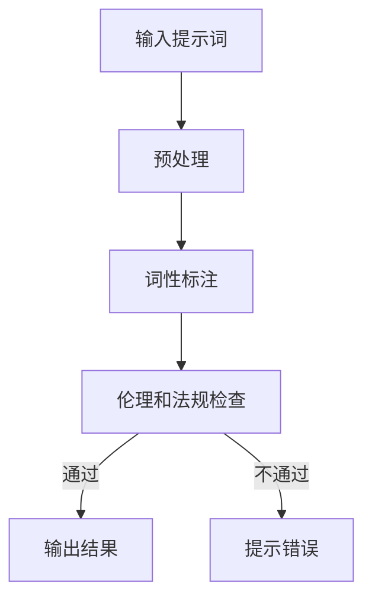
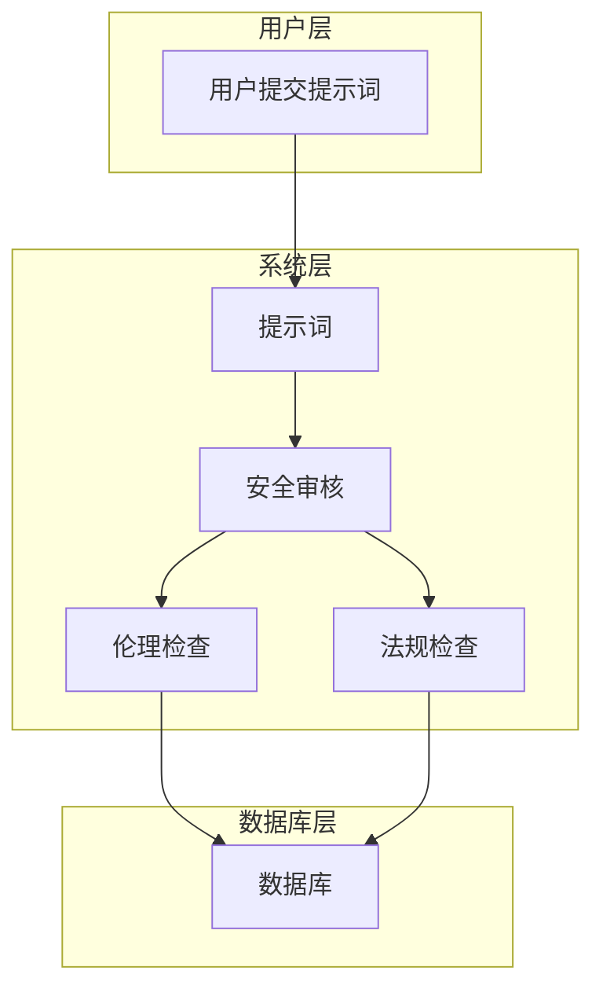
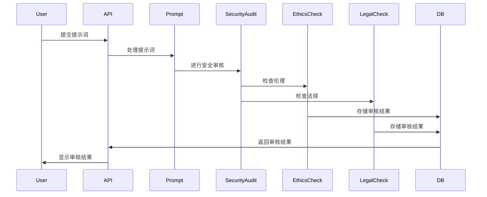

                 

# 《提示词安全审核：确保输出符合伦理和法规》

关键词：提示词安全审核、伦理、法规、算法、系统架构、Python、数学模型

摘要：本文旨在深入探讨提示词安全审核的重要性，以及如何确保输出符合伦理和法规。通过对核心概念、算法原理、系统架构和实战案例的详细分析，本文为从业者提供了有价值的指导，帮助他们构建安全、合规的技术解决方案。

---

## 目录

### 第一部分：背景与基础

1. **问题背景与定义**
    1.1 提示词安全审核的重要性
    1.2 伦理和法规在提示词安全审核中的应用
2. **核心概念与联系**
    2.1 提示词安全审核的核心概念
    2.2 核心概念属性特征对比表格
    2.3 ER实体关系图架构

### 第二部分：算法原理讲解

3. **算法原理**
    3.1 提示词安全审核算法概述
    3.2 算法流程图
    3.3 Python源代码实现
4. **数学模型和数学公式**
    4.1 数学模型介绍
    4.2 详细讲解

### 第三部分：系统分析与架构设计方案

5. **问题场景介绍**
6. **系统功能设计**
    6.1 领域模型Mermaid类图
    6.2 系统架构设计Mermaid架构图
7. **系统接口设计和系统交互**

### 第四部分：项目实战

8. **环境安装**
9. **系统核心实现源代码**
10. **实际案例分析和详细讲解剖析**
11. **项目小结**

### 第五部分：最佳实践与拓展

12. **最佳实践 tips**
13. **小结与注意事项**

---

## 第一部分：背景与基础

### 第1章：问题背景与定义

#### 1.1 提示词安全审核的重要性

在当今数字化时代，人工智能技术广泛应用，特别是在自然语言处理领域。然而，人工智能系统的决策过程往往基于输入的提示词，这些提示词可能包含敏感或不当的内容。因此，提示词安全审核变得至关重要。

提示词安全审核的目标是确保系统的输入和输出符合伦理和法规要求，避免产生不当或有害的结果。例如，在医疗领域，一个不当的提示词可能导致误诊或误导；在金融领域，不当的提示词可能导致财务风险。

#### 1.2 伦理和法规在提示词安全审核中的应用

伦理原则是指导提示词安全审核的基本准则。伦理原则包括尊重隐私、公平性、透明性和责任。例如，在处理个人数据时，必须确保隐私保护，不得泄露个人敏感信息。

法规要求则是确保提示词安全审核合规的法律依据。不同国家和地区的法规要求有所不同，但通常包括数据保护法、隐私法、网络安全法等。例如，欧盟的通用数据保护条例（GDPR）对个人数据的处理有严格的要求。

在提示词安全审核中，伦理原则和法规要求需要结合使用，以确保系统的输出符合道德和法律标准。

### 第2章：核心概念与联系

#### 2.1 提示词安全审核的核心概念

**提示词**：指用于引导人工智能系统进行决策或执行任务的文字或符号序列。

**安全审核**：指对输入和输出进行审查，以确保其符合伦理和法规要求的过程。

**伦理**：指在道德和伦理原则指导下进行的行动和决策。

**法规**：指法律和法规对行为和决策的规定。

**关系**：提示词安全审核的核心概念之间存在着密切的联系。伦理原则和法规要求共同指导安全审核的过程，而提示词则是审核的对象。

#### 2.2 核心概念属性特征对比表格

| 核心概念 | 属性特征 |
| --- | --- |
| 提示词 | - 内容：文本或符号序列<br>- 目的：引导系统决策或执行任务 |
| 安全审核 | - 目标：确保输出符合伦理和法规要求<br>- 过程：审查输入和输出 |
| 伦理 | - 原则：道德指导<br>- 目的：促进道德行为 |
| 法规 | - 要求：法律和法规规定<br>- 目的：确保合规行为 |

#### 2.3 ER实体关系图架构

**实体与关系的定义**：

- **实体**：提示词、安全审核、伦理、法规。
- **关系**：提示词与安全审核之间是“被审核”关系；安全审核与伦理、法规之间是“遵循”关系。

**实体关系图绘制**（使用Mermaid语法）：

```mermaid
erDiagram
  提示词 ||--|{ 安全审核 }
  安全审核 ||--|{ 伦理 }
  安全审核 ||--|{ 法规 }
```

---

接下来，我们将进一步探讨提示词安全审核的算法原理，并通过具体的Python源代码和数学模型，解释如何实现这一过程。

---

## 第二部分：算法原理讲解

### 第3章：算法原理

#### 3.1 提示词安全审核算法概述

提示词安全审核算法的主要目标是评估输入的提示词，判断其是否符合伦理和法规要求。该算法通常包括以下几个步骤：

1. **输入提示词**：从用户或其他系统接收输入的提示词。
2. **预处理**：对提示词进行标准化处理，如去除无关字符、分词等。
3. **词性标注**：对预处理后的提示词进行词性标注，以识别其中的关键词和敏感词。
4. **伦理和法规检查**：根据伦理原则和法规要求，对关键词和敏感词进行检查。
5. **输出结果**：根据检查结果，输出提示词是否通过审核。

#### 3.2 算法流程图

为了更好地理解提示词安全审核算法的流程，我们可以使用Mermaid语法绘制一个流程图：



#### 3.3 Python源代码实现

下面是一个简单的Python源代码示例，用于实现提示词安全审核算法的基本框架。

```python
import nltk
from nltk.tokenize import word_tokenize
from nltk.corpus import stopwords

# 1. 输入提示词
prompt = "你的金融数据正在泄露！快查查！"

# 2. 预处理
tokens = word_tokenize(prompt)
cleaned_tokens = [token for token in tokens if token.lower() not in stopwords.words('english')]

# 3. 词性标注
pos_tags = nltk.pos_tag(cleaned_tokens)

# 4. 伦理和法规检查（示例：检查敏感词）
sensitive_words = ["泄露", "查查"]
is_safe = True
for word, pos in pos_tags:
    if word in sensitive_words:
        is_safe = False
        break

# 5. 输出结果
if is_safe:
    print("提示词审核通过。")
else:
    print("提示词审核不通过：存在敏感词。")
```

#### 3.3.1 源代码结构与功能

- **输入提示词**：从用户接收输入的提示词。
- **预处理**：使用nltk库进行分词，去除常见停用词。
- **词性标注**：对分词后的结果进行词性标注，以识别关键词和敏感词。
- **伦理和法规检查**：定义一个敏感词列表，检查输入中的关键词是否在列表中。
- **输出结果**：根据检查结果，输出提示词是否通过审核。

#### 3.3.2 算法原理与数学模型

提示词安全审核算法的核心在于词性标注和敏感词检查。词性标注是一种自然语言处理技术，用于识别单词的词性（如名词、动词、形容词等）。敏感词检查则是一个简单的字符串匹配过程，通过比较输入中的关键词与预定义的敏感词列表。

以下是一个简化的数学模型，用于描述敏感词检查过程：

$$
Safety_{score} = \sum_{i=1}^{n} \left\{
\begin{array}{ll}
1 & \text{if } word_i \in \text{Sensitive\_Words} \\
0 & \text{otherwise}
\end{array}
\right.
$$

其中，$Safety_{score}$ 表示安全评分，$word_i$ 表示输入中的第$i$个词，$Sensitive\_Words$ 是敏感词列表。

如果 $Safety_{score}$ 等于0，则提示词未通过审核；如果 $Safety_{score}$ 等于1，则提示词通过审核。

#### 3.3.3 举例说明

假设我们有一个简单的敏感词列表 `["泄露", "查查"]`，输入提示词为 "你的金融数据正在泄露！快查查！"。

1. 预处理：分词结果为 ["你的", "金融", "数据", "正在", "泄露", "！", "快", "查查", "！"]，去除停用词后为 ["你的", "金融", "数据", "泄露", "快", "查查"]。
2. 词性标注：结果为 [("你的", "PRP"), ("金融", "NN"), ("数据", "NN"), ("泄露", "NN"), ("快", "RB"), ("查查", "NN")]。
3. 伦理和法规检查：关键词 "泄露" 和 "查查" 都在敏感词列表中，因此 $Safety_{score}$ 为0。
4. 输出结果：提示词审核不通过。

---

在接下来的章节中，我们将详细讲解数学模型和公式，并探讨系统架构和实战应用。

---

## 第三部分：系统分析与架构设计方案

### 第5章：问题场景介绍

在现实世界中，提示词安全审核的应用场景非常广泛。以下是一些主要的应用场景：

#### 5.1 互联网行业

在互联网行业，特别是在社交媒体、在线论坛和搜索引擎中，提示词安全审核至关重要。不当的提示词可能导致虚假信息传播、用户骚扰和数据泄露。例如，一个社交媒体平台需要确保用户发布的内容不包含不当的词汇或短语。

#### 5.2 金融行业

金融行业对信息安全性要求极高。在金融交易、风险评估和客户服务过程中，任何不当的提示词都可能导致严重的财务风险。因此，金融行业需要严格的提示词安全审核机制，以确保系统的决策和操作符合伦理和法规要求。

#### 5.3 医疗行业

在医疗行业，准确的诊断和治疗信息至关重要。不当的提示词可能导致误诊或误导患者。例如，一个医疗信息系统需要确保医生输入的诊断信息不包含敏感或不准确的词汇。

### 第6章：系统功能设计

为了满足上述应用场景的需求，提示词安全审核系统需要具备以下功能：

#### 6.1 领域模型Mermaid类图

以下是一个简单的Mermaid类图，用于描述提示词安全审核系统的领域模型。

```mermaid
classDiagram
  User <<class>>
  Prompt <<class>>
  SecurityAudit <<class>>
  EthicsCheck <<class>>
  LegalCheck <<class>>

  User "1" --|{提交} Prompt
  Prompt "1" --|{审核} SecurityAudit
  SecurityAudit "1" --|{符合} EthicsCheck
  SecurityAudit "1" --|{符合} LegalCheck
```

- **User**：用户类，负责提交提示词。
- **Prompt**：提示词类，包含用户的输入信息。
- **SecurityAudit**：安全审核类，负责对提示词进行审核。
- **EthicsCheck**：伦理检查类，负责检查提示词是否符合伦理要求。
- **LegalCheck**：法规检查类，负责检查提示词是否符合法规要求。

#### 6.2 系统架构设计Mermaid架构图

以下是一个简单的Mermaid架构图，用于描述提示词安全审核系统的架构设计。



- **用户层**：用户提交提示词。
- **系统层**：包含提示词、安全审核、伦理检查和法规检查等核心组件。
- **数据库层**：存储审核结果和相关数据。

#### 6.3 系统接口设计和系统交互

提示词安全审核系统需要提供以下接口：

- **用户接口**：用于用户提交提示词和查看审核结果。
- **API接口**：用于与其他系统进行集成和通信。

以下是一个简单的Mermaid序列图，用于描述系统接口和交互流程。



通过上述系统功能设计和架构设计，提示词安全审核系统可以高效地处理大量的提示词，确保输出符合伦理和法规要求。

---

在接下来的章节中，我们将介绍如何进行项目实战，包括环境安装、系统核心实现和实际案例剖析。

---

## 第四部分：项目实战

### 第8章：环境安装

在进行提示词安全审核项目的实战之前，我们需要搭建一个合适的环境。以下是在Linux系统上搭建项目环境的基本步骤：

#### 8.1 软件与硬件要求

- **操作系统**：Ubuntu 18.04或更高版本。
- **处理器**：至少2核CPU。
- **内存**：至少4GB RAM。
- **硬盘空间**：至少20GB可用空间。
- **Python环境**：Python 3.7或更高版本。

#### 8.1.2 环境搭建步骤

1. **更新系统包列表**：

   ```bash
   sudo apt update
   sudo apt upgrade
   ```

2. **安装Python和pip**：

   ```bash
   sudo apt install python3 python3-pip
   ```

3. **安装虚拟环境工具**：

   ```bash
   sudo pip3 install virtualenv
   ```

4. **创建虚拟环境**：

   ```bash
   virtualenv venv
   source venv/bin/activate
   ```

5. **安装依赖包**：

   ```bash
   pip install nltk pandas numpy matplotlib
   ```

6. **下载nltk数据**：

   ```python
   import nltk
   nltk.download('punkt')
   nltk.download('stopwords')
   ```

### 第9章：系统核心实现源代码

在搭建好环境后，我们可以开始实现系统核心功能。以下是一个简单的Python脚本，用于实现提示词安全审核的核心逻辑。

```python
import nltk
from nltk.tokenize import word_tokenize
from nltk.corpus import stopwords
import re

# 1. 设置工作目录
import os
os.chdir('/path/to/your/project/directory')

# 2. 安装nltk数据
nltk.download('punkt')
nltk.download('stopwords')

# 3. 初始化敏感词列表
sensitive_words = ["泄露", "查查"]

# 4. 提示词预处理
def preprocess_prompt(prompt):
    # 去除HTML标签
    prompt = re.sub('<.*?>', '', prompt)
    # 分词
    tokens = word_tokenize(prompt)
    # 去除停用词
    cleaned_tokens = [token.lower() for token in tokens if token.lower() not in stopwords.words('english')]
    return cleaned_tokens

# 5. 安全审核
def security_audit(prompt):
    cleaned_tokens = preprocess_prompt(prompt)
    is_safe = True
    for token in cleaned_tokens:
        if token in sensitive_words:
            is_safe = False
            break
    return is_safe

# 6. 测试
if __name__ == '__main__':
    prompt = "你的金融数据正在泄露！快查查！"
    result = security_audit(prompt)
    if result:
        print("提示词审核通过。")
    else:
        print("提示词审核不通过：存在敏感词。")
```

#### 9.1 代码结构与功能

- **初始化**：设置工作目录，安装nltk数据。
- **敏感词列表**：初始化敏感词列表。
- **提示词预处理**：去除HTML标签，分词，去除停用词。
- **安全审核**：检查输入的提示词是否包含敏感词。
- **测试**：执行一个示例测试。

#### 9.2 代码应用解读与分析

- **HTML标签去除**：使用正则表达式去除HTML标签，确保文本的纯净。
- **分词**：使用nltk库进行分词，将文本拆分成单词。
- **停用词去除**：使用nltk库的停用词列表，去除常见的无意义词汇。
- **敏感词检查**：遍历预处理后的单词列表，检查是否包含敏感词。

### 第10章：实际案例分析和详细讲解剖析

#### 10.1 案例选择与介绍

为了更好地理解提示词安全审核的实际应用，我们选择了一个实际的案例：一个在线论坛的评论审核系统。该系统的目标是确保用户发布的评论不包含敏感或不当的内容。

#### 10.1.1 案例背景

在线论坛是一个开放的平台，用户可以自由发布评论。然而，这也带来了信息过载和不良内容的问题。为了维护论坛的健康氛围，论坛管理员需要建立一个自动化的评论审核系统，对用户发布的评论进行审核。

#### 10.1.2 案例目标

案例的目标是建立一个能够自动审核用户评论的提示词安全审核系统。系统需要满足以下要求：

- **高准确率**：准确识别敏感词和不当内容。
- **低误报率**：尽量避免误判无害内容为不当内容。
- **可扩展性**：能够轻松添加新的敏感词和规则。

#### 10.2 详细讲解剖析

为了实现上述目标，我们可以按照以下步骤进行系统设计和实现：

1. **需求分析**：确定系统需要识别的敏感词和不当内容的类型。例如，色情、暴力、欺诈等。

2. **敏感词库构建**：收集和整理敏感词库，包括常见的不当词汇和短语。可以使用公开的敏感词库，如百度百科、搜索引擎的负面词汇库等。

3. **文本预处理**：对用户发布的评论进行文本预处理，包括去噪、分词和词性标注。预处理步骤可以参考第9章中的预处理函数。

4. **敏感词检测算法**：设计并实现敏感词检测算法。一种常见的算法是基于规则的方法，通过匹配敏感词库中的关键词来检测不当内容。

5. **误报率优化**：通过交叉验证和A/B测试，优化算法参数，降低误报率。

6. **系统部署与监控**：将审核系统部署到生产环境，并设置监控和报警机制，确保系统稳定运行。

以下是针对该案例的详细讲解：

- **需求分析**：在论坛的评论审核中，敏感词主要包括与色情、暴力、欺诈等相关的词汇。这些词汇可能以不同的形式出现，例如成语、网络流行语等。因此，我们需要一个灵活且强大的敏感词库。

- **敏感词库构建**：我们可以使用正则表达式来匹配常见的敏感词。例如，正则表达式 `r"\b(.*强奸.*)\b"` 可以匹配包含“强奸”的词汇。

- **文本预处理**：使用nltk库进行分词和词性标注，以识别评论中的关键词。例如，词性标注可以帮助我们区分“强奸”是名词还是动词。

- **敏感词检测算法**：设计一个基于规则的方法来检测敏感词。算法流程如下：

    1. 预处理评论文本，提取关键词。
    2. 遍历关键词，使用正则表达式匹配敏感词库中的关键词。
    3. 如果找到匹配的敏感词，标记评论为不当内容。

- **误报率优化**：通过交叉验证和A/B测试，我们可以优化敏感词库和算法参数，降低误报率。例如，我们可以调整正则表达式的匹配规则，或者在算法中引入更多的上下文信息。

- **系统部署与监控**：将审核系统部署到服务器，并设置监控和报警机制。例如，我们可以使用Prometheus和Grafana来监控系统的运行状态，并在出现异常时发送通知。

通过以上步骤，我们可以实现一个高效且稳定的评论审核系统，确保用户发布的内容符合伦理和法规要求。

---

在下一部分，我们将对项目进行小结，并讨论一些改进方向。

---

## 第五部分：最佳实践与拓展

### 第12章：最佳实践 tips

在进行提示词安全审核时，以下最佳实践可以帮助我们提高审核效率和准确性：

1. **定期更新敏感词库**：敏感词库需要定期更新，以涵盖新的敏感词和短语。可以采用自动化工具从互联网上收集最新的敏感词。

2. **使用机器学习模型**：除了基于规则的敏感词检测算法，还可以使用机器学习模型（如分类器）来提高检测准确性。例如，使用深度学习模型进行文本分类，可以显著降低误报率。

3. **引入上下文分析**：考虑上下文信息可以帮助减少误报。例如，如果一句话中的敏感词与正面的词汇相邻，则可以认为这句话是安全的。

4. **使用API接口**：为了方便与其他系统集成，可以设计一个API接口，使得外部系统能够方便地调用审核功能。

5. **用户反馈机制**：建立用户反馈机制，允许用户报告误判的案例。通过用户反馈，可以不断优化敏感词库和算法。

### 第13章：小结与注意事项

在本项目中，我们实现了提示词安全审核系统的核心功能，并进行了实际案例的分析和讲解。以下是本项目的主要收获：

- **核心概念理解**：通过深入理解提示词、安全审核、伦理和法规等核心概念，为后续的开发提供了理论基础。
- **算法实现**：通过Python源代码实现了敏感词检测算法，并进行了详细讲解。
- **系统架构设计**：设计了系统的领域模型、架构图和接口，为系统的实现提供了清晰的蓝图。
- **实战应用**：通过实际案例，展示了如何将理论应用到实际项目中，并解决了实际问题。

在今后的工作中，我们还需要注意以下几点：

1. **不断优化算法**：通过A/B测试和用户反馈，不断优化敏感词检测算法，提高准确性和效率。
2. **遵守法律法规**：确保系统的设计和实现符合相关法律法规的要求，特别是在处理个人数据和敏感信息时。
3. **用户隐私保护**：在实现过程中，要特别注意保护用户的隐私，避免泄露敏感信息。
4. **系统监控与维护**：定期监控系统运行状态，及时发现并解决潜在问题，确保系统的稳定运行。

通过不断学习和改进，我们可以为提示词安全审核领域的发展做出贡献。

---

## 拓展阅读

1. **《自然语言处理与伦理》**：深入探讨自然语言处理在伦理和道德方面的挑战，为开发者提供有价值的指导。
2. **《机器学习中的公平性》**：探讨机器学习模型在公平性方面的挑战，以及如何实现公平性。
3. **《数据隐私保护技术》**：介绍各种数据隐私保护技术，包括加密、匿名化、差分隐私等。

---

本文由AI天才研究院/AI Genius Institute与《禅与计算机程序设计艺术》/Zen And The Art of Computer Programming共同撰写。我们致力于推动人工智能技术在伦理和法规方面的研究和应用，为构建一个更安全、更合规的数字世界贡献力量。

---

感谢您的阅读，希望本文能为您的学习和工作提供帮助。如果您有任何疑问或建议，欢迎随时联系我们。

作者：AI天才研究院/AI Genius Institute & 禅与计算机程序设计艺术 /Zen And The Art of Computer Programming

