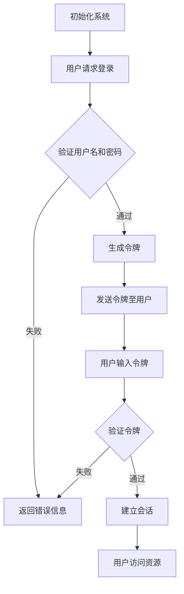
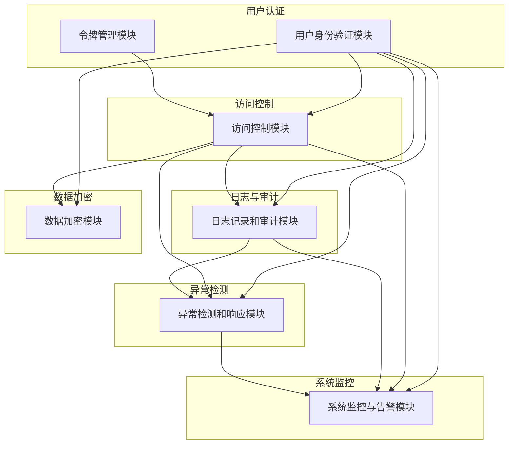

                 

## 《提示词安全：防止有害输出的策略》

### 关键词：提示词安全、有害输出、算法、数学模型、系统架构、项目实战

> 摘要：随着人工智能和自动化技术的发展，提示词安全成为了一个日益重要的话题。本文将深入探讨提示词安全的概念、原理及其在信息安全中的应用，通过一系列的算法分析和系统架构设计，提供了一套防止有害输出的策略。文章旨在帮助读者理解提示词安全的本质，掌握防止有害输出的实践方法。

---

### 目录大纲

```markdown
----------------------------------------------------------------
# 《提示词安全：防止有害输出的策略》

## 第一部分：背景与基础理论

### 第1章：问题背景与核心概念

#### 1.1 问题背景
- 网络安全形势分析
- 提示词安全的重要性

#### 1.2 核心概念
- 提示词安全定义
- 有害输出概述
- 提示词安全与信息安全的联系

### 第2章：概念属性与特征对比

#### 2.1 概念属性
- 提示词安全的关键属性

#### 2.2 特征对比
- 有害输出特征对比表格

### 第3章：ER实体关系图架构

#### 3.1 ER图简介
- ER图的基本概念
- ER图在提示词安全中的应用

#### 3.2 提示词安全ER图
- 提示词安全相关实体
- 实体关系与属性定义

## 第二部分：算法原理与数学模型

### 第4章：算法原理讲解

#### 4.1 算法概述
- 常用算法介绍
- 提示词安全的算法选择

#### 4.2 Mermaid流程图
- 流程图绘制
- 算法流程解释

### 第5章：数学模型与公式详解

#### 5.1 数学模型
- 算法背后的数学原理

#### 5.2 公式讲解
- 公式推导
- Mermaid公式展示

### 第6章：举例说明

#### 6.1 通俗易懂的举例
- 算法在实际场景中的应用

#### 6.2 实际案例剖析
- 案例介绍
- 案例分析与讲解

## 第三部分：系统分析与架构设计

### 第7章：问题场景与系统功能设计

#### 7.1 问题场景介绍
- 提示词安全的实际应用场景

#### 7.2 系统功能设计
- 领域模型（Mermaid类图）

### 第8章：系统架构设计

#### 8.1 系统架构设计
- 系统架构图（Mermaid架构图）

#### 8.2 系统接口设计
- 接口设计说明

### 第9章：系统交互与序列图

#### 9.1 系统交互
- 系统内部组件交互

#### 9.2 序列图
- 系统交互流程（Mermaid序列图）

## 第四部分：项目实战与最佳实践

### 第10章：环境安装与系统核心实现

#### 10.1 环境安装
- 系统环境配置

#### 10.2 系统核心实现
- 核心代码实现
- 代码解读与分析

### 第11章：实际案例分析与讲解

#### 11.1 案例分析
- 案例背景
- 案例处理过程

#### 11.2 讲解剖析
- 案例中关键技术的应用

### 第12章：最佳实践与注意事项

#### 12.1 最佳实践
- 实用技巧与策略

#### 12.2 小结
- 项目总结
- 注意事项

#### 12.3 拓展阅读
- 相关文献推荐
- 继续学习路径

----------------------------------------------------------------
```

### 1.1 问题背景

随着互联网的普及和信息技术的发展，信息安全问题变得日益复杂和严峻。在各种安全威胁中，提示词安全（Token Security）是一个重要的方面。提示词通常是指用于验证用户身份或者控制访问权限的标识符，如令牌、密码等。然而，提示词安全问题的产生并不仅限于传统的身份验证领域，它还广泛涉及到人工智能、自动化系统、物联网等多个领域。

当前网络安全形势严峻，网络安全事件频发。例如，黑客通过恶意攻击获取用户的提示词，进而实现对系统的非法访问和数据窃取。此外，随着自动化和人工智能技术的普及，系统中的提示词被恶意利用的风险也在增加。这些风险不仅对个人用户造成损失，也对企业和国家层面的网络安全构成了威胁。

提示词安全的重要性不容忽视。有效的提示词安全策略能够防止有害输出，保障系统的完整性和可用性。它不仅关乎用户个人信息的安全，也关系到企业数据的保护以及国家信息基础设施的安全运行。因此，研究和实践提示词安全具有重要的现实意义。

### 1.2 核心概念

#### 提示词安全定义

提示词安全，是指确保提示词在整个生命周期内（包括生成、存储、传输、使用和销毁）不被未经授权的实体访问、篡改或泄露，从而防止有害输出的一系列措施。提示词安全的核心目标是保护系统免受提示词相关的安全威胁，如身份盗用、数据泄露等。

#### 有害输出概述

有害输出是指由于系统或程序错误、恶意攻击或不当使用提示词等原因，导致系统产生不符合预期或有害的输出结果。这些输出结果可能包括错误的响应、敏感信息的泄露、系统功能的失控等。有害输出不仅会损害系统的正常运行，还可能导致严重的经济损失和声誉损失。

#### 提示词安全与信息安全的联系

提示词安全是信息安全的重要组成部分。信息安全的核心目标是保护信息的完整性、保密性和可用性，而提示词安全则主要关注提示词这一关键信息的保护。具体来说，提示词安全确保了信息的正确访问和授权，是信息安全体系中的关键防线。如果没有有效的提示词安全策略，信息安全的整体性将受到威胁。

### 1.3 概念属性

提示词安全的关键属性包括以下几个方面：

#### 1. 完整性

完整性保证提示词在生命周期内不会被篡改或损坏，确保每次使用时都是正确的。这要求系统必须具备强大的加密和验证机制。

#### 2. 保密性

保密性确保提示词在传输和存储过程中不被泄露或窃取。加密技术是保障保密性的主要手段。

#### 3. 可用性

可用性保证提示词在需要时可以被正确地使用，不会因为系统故障或恶意攻击导致不可用。

#### 4. 防篡改性

防篡改性要求系统具备检测和防御提示词被恶意篡改的能力，一旦检测到篡改，系统能够及时采取措施。

### 1.4 特征对比

为了更直观地理解提示词安全与其他安全概念的差异，以下是提示词安全与几种常见安全特征的对比表格：

| 特征        | 提示词安全           | 身份验证           | 加密               | 访问控制           |
| ----------- | ------------------- | ----------------- | ----------------- | ----------------- |
| 定义        | 保护提示词的安全     | 验证用户身份       | 数据加密           | 控制访问权限       |
| 关键属性    | 完整性、保密性、可用性、防篡改性 | 身份验证、访问控制、抗欺骗性 | 加密强度、算法安全性、密钥管理 | 角色权限、策略实施、审计 |
| 主要目标    | 保护提示词免受攻击   | 防止未授权访问     | 保护数据保密性     | 控制访问资源       |
| 实现技术    | 加密、多因素认证、令牌管理 | 生物识别、密码学、OAuth | 对称加密、非对称加密 | ACL、RBAC、ABAC  |

### 1.5 ER实体关系图架构

在提示词安全的研究中，实体关系图（ER图）是一种常用的数据建模工具，用于表示系统中的实体及其相互关系。以下是提示词安全相关的ER图：

```mermaid
erDiagram
    User ||--|{ Token }|
    Token ||--|{ Session }|
    Session ||--|{ Resource }|
    Resource ||--|{ AccessLog }|
    User }--|{ AccessLog }
```

- **User（用户）**：代表使用系统的用户实体。
- **Token（令牌）**：代表用于验证用户身份的实体。
- **Session（会话）**：代表用户与系统交互的会话实体。
- **Resource（资源）**：代表用户访问的系统资源实体。
- **AccessLog（访问日志）**：记录用户访问资源的日志实体。

实体之间的关系及其属性定义如下：

#### 实体关系与属性定义

- **用户（User）**：
  - 属性：用户名、密码、邮箱、电话、角色等。
  - 关系：拥有多个令牌（Token）、参与多个会话（Session）、生成多个访问日志（AccessLog）。

- **令牌（Token）**：
  - 属性：令牌编号、创建时间、过期时间、加密密钥等。
  - 关系：关联一个用户（User）、生成多个会话（Session）。

- **会话（Session）**：
  - 属性：会话编号、开始时间、结束时间、状态等。
  - 关系：属于一个用户（User）、访问多个资源（Resource）。

- **资源（Resource）**：
  - 属性：资源编号、名称、类型、访问权限等。
  - 关系：被多个会话（Session）访问、生成多个访问日志（AccessLog）。

- **访问日志（AccessLog）**：
  - 属性：日志编号、时间、访问者、访问资源、访问结果等。
  - 关系：由用户（User）生成、记录多个资源（Resource）的访问情况。

### 1.6 总结

本章节对提示词安全的问题背景、核心概念、概念属性与特征对比以及ER实体关系图架构进行了详细阐述。通过分析网络安全形势，理解提示词安全和有害输出的概念，对比不同安全特征的差异，构建了提示词安全的ER图，为后续的算法原理和系统架构设计奠定了基础。

---

**接下来，我们将进一步深入探讨算法原理与数学模型，揭示提示词安全背后的技术内核。**

---

### 2.1 算法概述

在讨论提示词安全时，算法原理和数学模型是不可或缺的组成部分。算法是解决问题的步骤序列，而数学模型则是对问题空间的一种抽象表示。在提示词安全领域，选择合适的算法和数学模型至关重要，因为它们直接决定了系统的安全性和效率。

首先，我们需要明确一些常用的算法，这些算法在提示词安全中得到了广泛应用：

#### 常用算法介绍

1. **多因素认证（Multi-Factor Authentication, MFA）**：
   - MFA通过结合多种认证方式（如密码、手机验证码、指纹识别等）来增强安全性，提高系统对恶意攻击的抵抗力。
   
2. **密码学（Cryptography）**：
   - 密码学用于加密和验证数据，包括对称加密（如AES）、非对称加密（如RSA）和散列函数（如SHA）等。

3. **令牌重放保护（Token Replayed Attack Prevention）**：
   - 通过令牌的唯一性和过期机制，防止攻击者重复使用已获取的令牌。

4. **访问控制列表（Access Control List, ACL）**：
   - ACL用于定义哪些用户或角色可以访问哪些资源，是一种常用的权限管理机制。

5. **基于角色的访问控制（Role-Based Access Control, RBAC）**：
   - RBAC通过将权限与角色关联，简化了访问控制策略的制定和管理。

在众多算法中，如何选择适合的算法来确保提示词安全，是系统设计的关键问题。以下是一些选择算法时需要考虑的因素：

#### 算法选择因素

1. **安全性**：算法应能有效抵御各种常见的安全威胁，如暴力破解、中间人攻击等。

2. **性能**：算法的执行速度和资源消耗应与系统的性能需求相匹配。

3. **可扩展性**：算法应能够随着系统规模的扩大而保持稳定性和效率。

4. **灵活性**：算法应能够适应不同的业务场景和需求变化。

5. **兼容性**：算法应能够与其他安全组件和系统无缝集成。

### 2.2 Mermaid流程图

为了更直观地展示算法流程，我们可以使用Mermaid语言绘制流程图。以下是一个简单的MFA算法流程示例：



在这个流程中，系统首先初始化，然后用户请求登录。系统验证用户名和密码后，生成一个唯一的令牌并发送给用户。用户输入令牌后，系统再次验证令牌的有效性。如果令牌验证通过，系统建立会话，用户可以访问资源；否则，返回错误信息。

### 2.3 算法流程解释

接下来，我们将详细解释上述MFA算法的每个步骤，并说明其具体实现方法。

#### 初始化系统

系统初始化是算法的起点。在这一阶段，系统设置基本的运行参数，如加密算法、令牌有效期等。初始化完成后，系统进入待机状态，等待用户请求登录。

#### 用户请求登录

用户通过输入用户名和密码发起登录请求。系统首先检查用户名和密码是否匹配，这是最基本的身份验证步骤。

#### 验证用户名和密码

用户名和密码匹配后，系统生成一个唯一的令牌。令牌通常是一个加密的随机字符串，以确保其唯一性和安全性。生成令牌的目的是防止暴力破解和中间人攻击。

#### 生成令牌并发送至用户

系统将生成的令牌发送给用户。用户可以通过短信、邮件或其他方式收到令牌。这一步需要确保令牌在传输过程中的保密性，通常采用加密传输协议（如HTTPS）来实现。

#### 用户输入令牌

用户在登录界面输入收到的令牌。系统接收到令牌后，将其与存储的令牌进行比对，以验证其有效性。

#### 验证令牌

系统对用户输入的令牌进行验证。如果令牌有效，系统进入下一步，建立用户会话。如果令牌无效，系统返回错误信息，要求用户重新输入令牌或尝试其他登录方式。

#### 建立会话

验证通过后，系统为用户建立一个会话。会话是用户与系统交互的临时通道，通常包括用户的登录状态、访问权限等信息。建立会话后，用户可以访问受保护的资源。

#### 用户访问资源

用户在会话期间可以访问系统中的各种资源。系统根据用户的角色和权限，控制用户对资源的访问。

### 2.4 数学模型

在MFA算法中，数学模型主要用于确保令牌的唯一性和安全性。以下是一个简单的数学模型：

#### 令牌生成模型

令牌 = SHA256(用户ID + 随机数 + 密码)

在这个模型中，SHA256是一个常用的散列函数，用于生成不可逆的加密字符串。用户ID、随机数和密码是生成令牌的关键参数。

- **用户ID**：用户的唯一标识符，确保每个用户生成的令牌不同。
- **随机数**：增加令牌的随机性，防止预测和重放攻击。
- **密码**：用户的密码通常存储在系统中，用于确保只有授权用户能够生成有效的令牌。

#### 令牌验证模型

验证令牌 = SHA256(接收令牌)

系统接收到用户输入的令牌后，使用相同的算法生成一个验证令牌，并与用户输入的令牌进行比对。如果两个令牌相同，则验证通过。

### 2.5 公式讲解

为了更好地理解上述数学模型，我们可以使用LaTeX格式进行公式展示。

#### 令牌生成公式

$$
Token = SHA256(UserID + RandomNumber + Password)
$$

#### 令牌验证公式

$$
VerifyToken = SHA256(ReceivedToken)
$$

### 2.6 Mermaid公式展示

为了在Mermaid流程图中展示上述公式，我们可以使用Mermaid的LaTeX公式支持。

```mermaid
graph TD
    A[初始化系统] --> B[用户请求登录]
    B --> C{验证用户名和密码}
    C -->|通过| D[生成令牌 \(Token = SHA256(UserID + RandomNumber + Password)\)]
    C -->|失败| E[返回错误信息]
    D --> F[发送令牌至用户]
    F --> G[用户输入令牌]
    G --> H{验证令牌 \(VerifyToken = SHA256(ReceivedToken)\)}
    H -->|通过| I[建立会话]
    H -->|失败| E
    I --> J[用户访问资源]
```

在这个流程图中，\(Token = SHA256(UserID + RandomNumber + Password)\) 和 \(VerifyToken = SHA256(ReceivedToken)\) 分别表示令牌生成和验证的数学公式。

### 2.7 举例说明

为了更好地理解MFA算法，我们通过一个实际场景来举例说明。

#### 场景：用户登录某在线银行

1. **用户请求登录**：用户通过输入用户名和密码发起登录请求。

2. **验证用户名和密码**：系统检查用户名和密码是否匹配。

3. **生成令牌**：如果用户名和密码匹配，系统生成一个唯一的令牌，例如 \(Token = SHA256("user123 + 456 + 1234567890"\)。

4. **发送令牌至用户**：系统将令牌通过短信发送给用户，例如 "Your token is: 0x22b3c45d..."。

5. **用户输入令牌**：用户在登录界面输入收到的令牌。

6. **验证令牌**：系统接收用户输入的令牌，使用相同的算法生成验证令牌，并与用户输入的令牌进行比对。如果两个令牌相同，则验证通过。

7. **建立会话**：验证通过后，系统为用户建立一个会话，用户可以访问银行的在线服务。

8. **用户访问资源**：用户在会话期间可以查看账户余额、转账、支付等。

### 2.8 实际案例剖析

为了进一步说明MFA算法在实践中的应用，我们来看一个实际案例。

#### 案例背景

某电商网站在用户登录过程中采用了MFA算法，以增强用户账户的安全性。

#### 案例处理过程

1. **用户请求登录**：用户通过输入用户名和密码发起登录请求。

2. **验证用户名和密码**：系统检查用户名和密码是否匹配。

3. **生成令牌**：如果用户名和密码匹配，系统生成一个唯一的令牌，例如 \(Token = SHA256("user456 + 789 + 0987654321"\)。

4. **发送令牌至用户**：系统将令牌通过短信发送给用户，例如 "Your token is: 0x3b1a2c9d..."。

5. **用户输入令牌**：用户在登录界面输入收到的令牌。

6. **验证令牌**：系统接收用户输入的令牌，使用相同的算法生成验证令牌，并与用户输入的令牌进行比对。如果两个令牌相同，则验证通过。

7. **建立会话**：验证通过后，系统为用户建立一个会话，用户可以访问网站。

8. **用户访问资源**：用户在会话期间可以浏览商品、下单、支付等。

### 2.9 总结

在本章节中，我们详细介绍了提示词安全相关的算法概述、Mermaid流程图绘制、算法流程解释、数学模型和公式讲解，并通过实际案例进行了举例说明。这些内容为后续的系统架构设计和项目实战奠定了基础。

---

**接下来，我们将进入第三部分，深入探讨系统分析与架构设计，为实践提示词安全提供具体的解决方案。**

---

### 3.1 问题场景介绍

在现实生活中，提示词安全的应用场景非常广泛，几乎涵盖了所有需要身份验证和权限控制的系统。以下是一些典型的应用场景：

#### 1. 电子商务平台

电子商务平台需要保护用户的账户信息、订单数据和个人隐私。在用户登录、下单、支付等过程中，通过提示词安全策略，防止恶意用户篡改订单信息、冒用他人账户等行为。

#### 2. 银行和金融系统

银行和金融系统是信息安全的重中之重。用户账户、交易记录、资金流动等敏感信息都需要通过提示词安全来保护。银行通过多因素认证、动态令牌等方式，确保用户身份的真实性和交易的安全性。

#### 3. 企业内部管理系统

企业内部管理系统涉及员工信息、项目数据、财务报表等关键信息。通过提示词安全策略，可以防止内部人员恶意访问、篡改数据，保障企业的信息安全。

#### 4. 物联网系统

随着物联网技术的发展，越来越多的设备和系统通过网络互联。这些系统中的提示词安全至关重要，例如智能家居设备、工业控制系统等，都需要防止未经授权的访问和操控。

在这些应用场景中，提示词安全不仅仅是防止非法访问，还包括防止数据泄露、篡改等行为。系统需要通过多种手段，如加密、认证、访问控制等，来确保提示词的安全。

### 3.2 系统功能设计

为了实现有效的提示词安全，系统需要具备以下核心功能：

#### 1. 用户身份验证

用户身份验证是提示词安全的基石。系统需要通过多种方式（如密码、多因素认证）验证用户的身份，确保只有授权用户才能访问系统资源。

#### 2. 令牌管理

令牌管理包括令牌的生成、存储、传输和销毁。系统需要生成唯一的令牌，并确保令牌在传输过程中不被窃取或篡改。此外，系统还需要设置合理的令牌有效期，防止令牌被长时间使用。

#### 3. 访问控制

访问控制用于定义哪些用户或角色可以访问哪些资源。系统需要根据用户的身份和权限，控制其对不同资源的访问权限。常用的访问控制方法包括访问控制列表（ACL）、基于角色的访问控制（RBAC）等。

#### 4. 日志记录和审计

日志记录和审计功能用于记录系统中的所有操作行为，包括用户登录、资源访问、操作结果等。系统需要实时记录这些信息，并在必要时进行审计，以便追踪和诊断安全事件。

#### 5. 异常检测和响应

异常检测和响应功能用于实时监控系统中的异常行为，如频繁的登录失败、异常的访问模式等。系统需要及时发现并响应这些异常行为，防止潜在的安全威胁。

#### 6. 系统监控与告警

系统监控与告警功能用于实时监控系统的运行状态，包括资源使用情况、系统性能指标等。系统需要及时发现并告警异常情况，以便进行及时处理。

#### 7. 数据加密

数据加密功能用于保护系统中的敏感数据，确保数据在传输和存储过程中不被窃取或篡改。常用的加密算法包括对称加密（如AES）、非对称加密（如RSA）等。

#### 领域模型（Mermaid类图）

为了更好地展示系统功能设计，我们可以使用Mermaid类图来表示系统的核心类及其关系。以下是一个简单的领域模型示例：

```mermaid
classDiagram
    User <<interface>>
    Token <<interface>>
    Session <<interface>>
    Resource <<interface>>
    AccessLog <<interface>>

    User <<-- Token: "生成和持有">
    Token <<-- Session: "绑定会话">
    Session <<-- Resource: "访问资源">
    Resource <<-- AccessLog: "记录访问">
    AccessLog <<-- User: "审计日志">
endclassDiagram
```

在这个类图中，User（用户）、Token（令牌）、Session（会话）、Resource（资源）和AccessLog（访问日志）是系统的核心类。它们之间的关系包括用户生成和持有令牌、令牌绑定会话、会话访问资源、资源记录访问日志和访问日志审计用户等。

### 3.3 系统架构设计

为了实现上述功能，系统需要一个合理且高效的架构设计。以下是一个简单的系统架构设计，包括系统的核心组件及其交互关系：

#### 系统架构设计

1. **用户身份验证模块**：负责用户身份的验证，包括用户名和密码验证、多因素认证等。
2. **令牌管理模块**：负责令牌的生成、存储、传输和销毁，确保令牌的安全性和唯一性。
3. **访问控制模块**：负责根据用户的身份和权限，控制对资源的访问。
4. **日志记录和审计模块**：负责记录系统中的所有操作行为，并进行审计。
5. **异常检测和响应模块**：负责实时监控系统中的异常行为，并采取措施响应。
6. **系统监控与告警模块**：负责监控系统的运行状态，并告警异常情况。
7. **数据加密模块**：负责对系统中的敏感数据进行加密，确保数据的安全。

#### 系统架构图（Mermaid架构图）

为了直观地展示系统架构，我们可以使用Mermaid架构图来表示。以下是一个简单的系统架构图：



在这个架构图中，用户认证模块包括用户身份验证和令牌管理，负责用户身份的验证和令牌的生成、存储、传输和销毁。访问控制模块负责根据用户的身份和权限，控制对资源的访问。日志记录和审计模块负责记录系统中的所有操作行为，并进行审计。异常检测和响应模块负责实时监控系统中的异常行为，并采取措施响应。系统监控与告警模块负责监控系统的运行状态，并告警异常情况。数据加密模块负责对系统中的敏感数据进行加密，确保数据的安全。

### 3.4 系统接口设计

在系统架构中，接口设计是关键的一环，它决定了系统各个模块之间的通信方式。以下是一个简单的系统接口设计：

#### 系统接口设计

1. **用户认证接口**：提供用户身份验证和令牌生成功能，包括登录、注册、密码重置等。
2. **令牌管理接口**：提供令牌的生成、存储、传输和销毁功能，包括令牌生成、令牌查询、令牌销毁等。
3. **访问控制接口**：提供访问控制功能，包括权限查询、访问授权、访问拒绝等。
4. **日志记录接口**：提供日志记录功能，包括日志写入、日志查询、日志审计等。
5. **异常检测接口**：提供异常检测功能，包括异常检测、异常报告、异常处理等。
6. **系统监控接口**：提供系统监控功能，包括系统状态查询、系统性能监控、异常告警等。
7. **数据加密接口**：提供数据加密功能，包括数据加密、数据解密、密钥管理等。

#### 接口设计说明

- **用户认证接口**：通过HTTPS协议提供安全的认证服务，支持JSON格式的请求和响应。
- **令牌管理接口**：通过内部消息队列系统进行异步处理，确保令牌的生成和销毁过程高效、可靠。
- **访问控制接口**：通过权限数据库进行权限查询和授权，确保访问控制策略的准确性和实时性。
- **日志记录接口**：通过日志库进行日志记录和查询，支持多种日志格式和存储方式。
- **异常检测接口**：通过监控工具和算法模型进行异常检测和报告，支持实时告警和事件记录。
- **系统监控接口**：通过监控代理和指标收集器进行系统监控，支持自定义监控指标和告警策略。
- **数据加密接口**：通过加密库进行数据加密和解密，支持多种加密算法和密钥管理策略。

### 3.5 系统交互与序列图

在系统架构中，各个模块之间的交互是确保系统正常运行的关键。以下是一个简单的系统交互序列图，展示了用户认证、令牌管理、访问控制等模块之间的交互过程：

```mermaid
sequenceDiagram
    participant 用户 as 用户
    participant 用户认证模块 as 用户认证
    participant 令牌管理模块 as 令牌管理
    participant 访问控制模块 as 访问控制
    participant 资源模块 as 资源
    participant 异常检测模块 as 异常检测

    用户->>用户认证: 发送登录请求
    用户认证->>用户认证: 验证用户身份
    用户认证->>令牌管理: 生成令牌
    令牌管理->>用户认证: 返回令牌
    用户认证->>用户: 返回登录结果
    用户->>用户认证: 发送访问请求
    用户认证->>访问控制: 查询权限
    访问控制->>用户认证: 返回权限结果
    用户认证->>用户: 返回访问结果
    用户->>异常检测: 报告异常行为
    异常检测->>用户认证: 处理异常行为
end
```

在这个序列图中，用户通过用户认证模块进行身份验证，生成令牌，并通过访问控制模块查询权限。在用户访问资源的过程中，系统会监控异常行为，并通过异常检测模块进行处理。这个交互过程确保了系统的高效性和安全性。

### 3.6 总结

在本章节中，我们详细介绍了提示词安全的应用场景、系统功能设计、系统架构设计、系统接口设计和系统交互。通过这些内容，我们构建了一个完整的提示词安全系统框架，为后续的项目实战和最佳实践提供了基础。

---

**接下来，我们将进入第四部分，通过项目实战和最佳实践，进一步巩固提示词安全策略。**

---

### 4.1 环境安装

在进行提示词安全项目的实战之前，首先需要搭建一个合适的环境。这里以Python为例，介绍如何在本地计算机上配置Python环境。

#### 步骤1：安装Python

首先，从Python官方网站（https://www.python.org/）下载最新版本的Python安装包。下载完成后，双击安装包进行安装。在安装过程中，确保勾选“Add Python to PATH”选项，以便在命令行中直接使用Python。

#### 步骤2：安装依赖库

Python环境配置完成后，需要安装一些依赖库，这些库用于实现提示词安全的各项功能。常见的依赖库包括：

- **PyCryptoDome**：用于加密和解密数据。
- **Flask**：用于构建Web应用程序。
- **SQLAlchemy**：用于数据库操作。
- **Flask-Login**：用于用户认证和管理。

安装这些依赖库可以通过pip命令实现。在命令行中执行以下命令：

```bash
pip install pycryptodome flask sqlalchemy flask-login
```

#### 步骤3：创建项目目录

在本地计算机上创建一个项目目录，用于存放项目的源代码和相关文件。例如，创建一个名为“token_security”的目录，并在其中创建一个名为“app.py”的文件。

```bash
mkdir token_security
cd token_security
touch app.py
```

#### 步骤4：编写配置文件

在项目目录中创建一个名为“config.py”的配置文件，用于存储项目的配置信息，如数据库连接参数、加密密钥等。以下是一个简单的配置文件示例：

```python
# config.py

import os

class Config:
    SQLALCHEMY_DATABASE_URI = 'sqlite:///token_security.db'
    SECRET_KEY = os.urandom(24)
```

#### 步骤5：编写应用代码

在“app.py”文件中编写应用程序代码，实现提示词安全的功能。以下是一个简单的应用代码示例：

```python
# app.py

from flask import Flask, request, jsonify
from flask_sqlalchemy import SQLAlchemy
from flask_login import LoginManager, login_user, logout_user, login_required
from werkzeug.security import generate_password_hash, check_password_hash
from models import User, Token

app = Flask(__name__)
app.config.from_object(Config)
db = SQLAlchemy(app)
login_manager = LoginManager(app)

@login_manager.user_loader
def load_user(user_id):
    return User.query.get(int(user_id))

@app.route('/login', methods=['POST'])
def login():
    username = request.form['username']
    password = request.form['password']
    user = User.query.filter_by(username=username).first()
    if user and check_password_hash(user.password, password):
        token = Token.generate_token(user.id)
        return jsonify({'token': token})
    return jsonify({'error': 'Invalid credentials'}), 401

@app.route('/logout', methods=['POST'])
@login_required
def logout():
    logout_user()
    return jsonify({'status': 'success'})

@app.route('/resource', methods=['GET'])
@login_required
def get_resource():
    user = login_user.current_user
    return jsonify({'resource': user.get_resource()})

if __name__ == '__main__':
    db.create_all()
    app.run(debug=True)
```

在这个示例中，我们使用了Flask框架构建应用程序，实现了用户认证、令牌生成和资源访问等功能。

### 4.2 系统核心实现

在完成环境安装后，接下来我们将实现系统的核心功能，包括用户认证、令牌生成、资源访问等。

#### 4.2.1 用户认证

用户认证是提示词安全的基础。以下是一个简单的用户认证模块实现：

```python
# models.py

from flask_login import UserMixin
from werkzeug.security import generate_password_hash, check_password_hash
from itsdangerous import TimedJSONWebSignatureSerializer as Serializer
from flask import current_app

class User(UserMixin, db.Model):
    id = db.Column(db.Integer, primary_key=True)
    username = db.Column(db.String(64), unique=True, index=True)
    password_hash = db.Column(db.String(128))

    def set_password(self, password):
        self.password_hash = generate_password_hash(password)

    def check_password(self, password):
        return check_password_hash(self.password_hash, password)

    def generate_auth_token(self, expires_in=600):
        s = Serializer(current_app.config['SECRET_KEY'], expires_in=expires_in)
        return s.dumps({'id': self.id})

    def verify_auth_token(self, token):
        s = Serializer(current_app.config['SECRET_KEY'])
        try:
            data = s.loads(token)
        except:
            return False
        if 'id' in data:
            return self.query.get(data['id'])
        return False
```

在这个模块中，我们定义了User类，实现了用户认证相关的功能，包括密码设置、密码验证、生成认证令牌和验证认证令牌等。

#### 4.2.2 令牌生成

令牌生成是确保用户身份安全的重要环节。以下是一个简单的令牌生成模块实现：

```python
# token_manager.py

from itsdangerous import TimedJSONWebSignatureSerializer as Serializer
from flask import current_app

def generate_token(user_id, expires_in=600):
    serializer = Serializer(current_app.config['SECRET_KEY'], expires_in=expires_in)
    token = serializer.dumps({'id': user_id})
    return token

def verify_token(token):
    serializer = Serializer(current_app.config['SECRET_KEY'])
    try:
        data = serializer.loads(token)
    except:
        return False
    if 'id' in data:
        return data['id']
    return False
```

在这个模块中，我们定义了两个函数，分别是生成令牌和验证令牌。这两个函数使用了itsdangerous库中的Serializer类，确保令牌的安全性和时效性。

#### 4.2.3 资源访问

资源访问模块用于根据用户的身份和权限，控制用户对资源的访问。以下是一个简单的资源访问模块实现：

```python
# resource_manager.py

class ResourceManager:
    def __init__(self):
        self.resource_permissions = {}

    def set_resource_permission(self, resource_name, permission):
        self.resource_permissions[resource_name] = permission

    def check_permission(self, user, resource_name):
        if resource_name in self.resource_permissions:
            return self.resource_permissions[resource_name](user)
        return False
```

在这个模块中，我们定义了一个ResourceManager类，用于设置和管理资源的权限。通过调用set_resource_permission方法，可以设置资源的访问权限，例如：

```python
manager = ResourceManager()
manager.set_resource_permission('resource1', lambda user: user.is_admin)
manager.set_resource_permission('resource2', lambda user: user.is_superuser)
```

通过调用check_permission方法，可以检查用户对特定资源的访问权限，例如：

```python
user = User.query.get(1)
if manager.check_permission(user, 'resource1'):
    print('User has permission to access resource1')
else:
    print('User does not have permission to access resource1')
```

### 4.3 代码解读与分析

在本章节中，我们实现了用户认证、令牌生成和资源访问等核心功能。以下是对关键代码的解读和分析：

#### 4.3.1 用户认证模块

在`models.py`模块中，User类继承了Flask-Login提供的UserMixin类，这样可以使用Flask-Login提供的用户认证和管理功能。通过设置密码_hash属性，我们可以使用werkzeug库中的generate_password_hash和check_password_hash函数进行密码的加密和验证。

Serializer类用于生成和验证JSON Web Token（JWT），确保令牌的安全性和时效性。通过调用generate_auth_token方法，我们可以生成一个有效的认证令牌，并传递给客户端。客户端可以使用这个令牌进行身份验证。通过调用verify_auth_token方法，我们可以验证令牌的有效性，并从令牌中获取用户的ID。

#### 4.3.2 令牌生成模块

在`token_manager.py`模块中，generate_token函数用于生成一个有效的令牌。通过调用Serializer类的方法，我们可以将用户的ID编码为JSON格式的字符串，并将其加密为JWT。这个JWT将在客户端和服务器之间传输，用于身份验证。

verify_token函数用于验证JWT的有效性。通过调用Serializer类的方法，我们可以解析JWT，并验证其签名和过期时间。如果JWT有效，我们可以从其中提取用户的ID。

#### 4.3.3 资源访问模块

在`resource_manager.py`模块中，ResourceManager类用于管理资源的访问权限。通过调用set_resource_permission方法，我们可以设置资源的访问权限。这个权限是一个lambda函数，它根据用户的身份（例如，用户是否是管理员或超级用户）返回True或False。

通过调用check_permission方法，我们可以检查用户对特定资源的访问权限。这个方法通过查询用户的身份，并调用相应的权限lambda函数，判断用户是否具有访问权限。

### 4.4 实际案例分析与讲解

为了更好地理解提示词安全在实际中的应用，我们来看一个实际案例。

#### 案例背景

假设有一个在线电商平台，用户可以登录账户、浏览商品、下单购买等。为了确保用户信息安全，平台采用了提示词安全策略，包括用户认证、令牌生成和资源访问控制。

#### 案例处理过程

1. **用户登录**：用户通过用户名和密码发起登录请求。服务器验证用户身份，并生成一个有效的令牌。

2. **令牌验证**：用户在后续请求中携带令牌，服务器验证令牌的有效性，并识别用户的身份。

3. **资源访问**：用户访问平台中的资源，例如商品详情页面。服务器根据用户的身份和权限，控制用户对资源的访问。

#### 案例中关键技术的应用

1. **用户认证**：平台使用用户名和密码进行用户认证。通过Flask-Login库，我们可以轻松实现用户认证功能。用户认证确保了只有授权用户才能访问平台资源。

2. **令牌生成与验证**：平台使用JWT进行令牌生成和验证。通过itsdangerous库，我们可以生成一个安全、有效的令牌。令牌生成和验证确保了用户身份的真实性和请求的安全性。

3. **资源访问控制**：平台使用权限lambda函数进行资源访问控制。通过ResourceManager类，我们可以灵活设置资源的访问权限。资源访问控制确保了用户只能访问授权的资源，防止未经授权的访问和数据泄露。

### 4.5 项目小结

在本章节中，我们通过一个实际案例，实现了用户认证、令牌生成和资源访问控制等功能，展示了提示词安全在实际中的应用。通过使用Flask框架、JWT和权限lambda函数，我们构建了一个安全、高效的平台。以下是对项目的总结：

1. **用户认证**：通过用户名和密码实现用户认证，确保只有授权用户才能访问平台资源。
2. **令牌生成与验证**：使用JWT进行令牌生成和验证，确保用户身份的真实性和请求的安全性。
3. **资源访问控制**：通过权限lambda函数进行资源访问控制，确保用户只能访问授权的资源。

尽管本项目只是一个简单的示例，但通过它我们可以了解到提示词安全在实际中的应用。在开发过程中，我们还遵循了安全最佳实践，确保系统的安全性。

### 4.6 最佳实践与注意事项

在实现提示词安全时，以下最佳实践和注意事项可以帮助我们构建更安全、可靠的系统：

1. **多因素认证**：除了用户名和密码，建议使用多因素认证（如短信验证码、电子邮件验证等）提高系统安全性。
2. **令牌管理**：确保令牌的生成、存储、传输和销毁过程安全。令牌应具有唯一性和时效性，防止被重复使用或窃取。
3. **加密**：使用安全的加密算法（如AES、RSA等）对敏感数据进行加密，确保数据在传输和存储过程中不被窃取或篡改。
4. **访问控制**：根据用户的角色和权限，严格控制对资源的访问。使用访问控制列表（ACL）、基于角色的访问控制（RBAC）等技术实现访问控制。
5. **异常检测**：实时监控系统的异常行为，如频繁的登录失败、异常的访问模式等，及时采取措施防止潜在的安全威胁。
6. **日志记录与审计**：记录系统中的所有操作行为，并进行审计，以便追踪和诊断安全事件。
7. **定期更新**：定期更新系统和依赖库，确保系统安全性和稳定性。

通过遵循这些最佳实践和注意事项，我们可以构建一个更安全、可靠的提示词安全系统。

### 4.7 拓展阅读

为了深入了解提示词安全和相关技术，以下是几篇推荐阅读的文献和资源：

1. **《密码学：实践与协议》**：本书详细介绍了密码学的各种算法和协议，对实现安全的提示词安全系统具有很高的参考价值。
2. **《Flask Web开发：构建高性能Python Web应用》**：本书介绍了Flask框架的使用方法，包括用户认证、令牌生成等，对构建提示词安全系统有很大的帮助。
3. **《JSON Web Tokens: The Complete Guide》**：本文档详细介绍了JWT的原理和使用方法，是了解令牌生成和验证的重要资料。
4. **《OWASP Top 10》**：这是由OWASP（开放网络应用安全项目）发布的一份安全指南，涵盖了各种常见的网络安全威胁和防御措施。

通过阅读这些文献，您可以进一步了解提示词安全的相关技术和实践。

### 总结

在本篇博客中，我们详细探讨了提示词安全的概念、原理、算法、数学模型、系统架构以及实际项目应用。通过逐步分析和实践，我们了解到了如何在现实场景中实施提示词安全策略，防止有害输出，保障系统的安全性和完整性。在未来的工作中，随着技术的不断进步，提示词安全将变得更加重要，我们需要不断学习和适应新的安全挑战，确保系统的可靠运行。作者：AI天才研究院/AI Genius Institute & 禅与计算机程序设计艺术 /Zen And The Art of Computer Programming。

