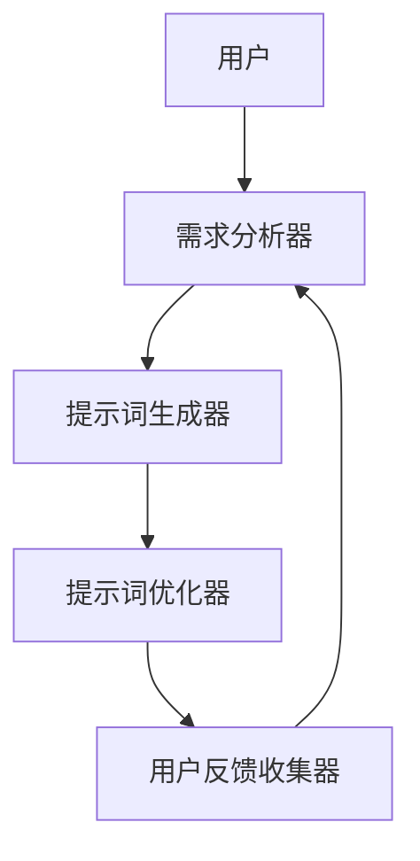
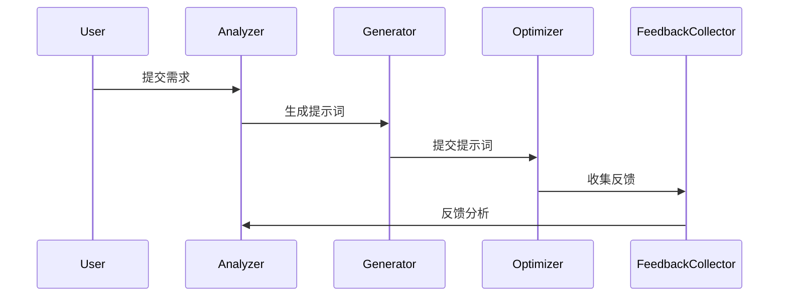
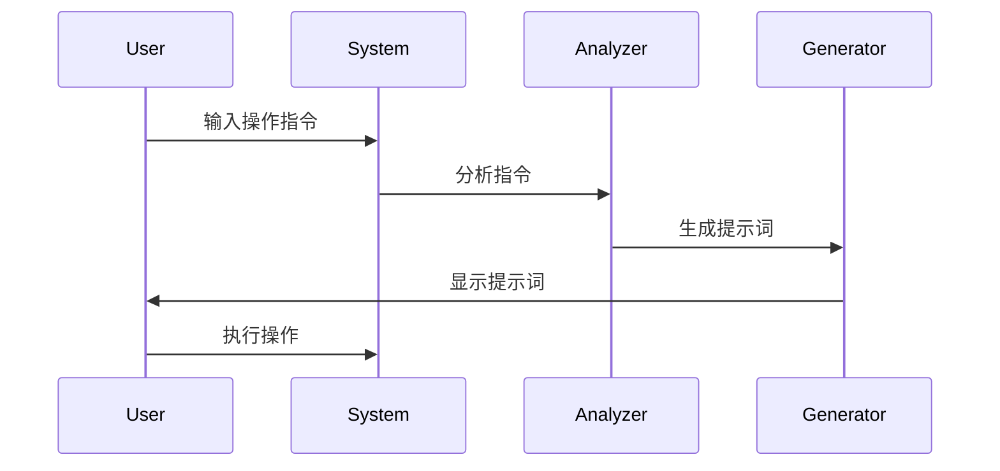

                 


### 提示词工程中的创意与逻辑平衡

关键词：提示词工程、创意、逻辑平衡、用户体验、设计原则

摘要：本文将探讨提示词工程中的创意与逻辑平衡，通过引入相关概念，分析其在实际应用中的重要性，并提出相应的策略与方法。我们将从基本原理、创意策略、逻辑平衡策略、案例分析以及实践指南等方面展开讨论，以期帮助读者在提示词工程中实现创意与逻辑的完美融合。

## 1. 引言

### 1.1 问题的背景与重要性

提示词工程是用户界面设计中的一个关键环节，它涉及到用户如何理解和使用产品。一个好的提示词不仅能够提高用户的使用体验，还能增强产品的易用性和可访问性。然而，在提示词设计中，创意与逻辑平衡往往成为一大难题。创意可以激发用户的兴趣和参与度，而逻辑平衡则保证了提示词的准确性和一致性。本文将深入探讨这两个方面的关系，并提出一系列策略来优化提示词设计。

### 1.2 相关概念

- **提示词**：提示词是用户界面中的一个文本元素，用于引导用户进行操作或提供信息。
- **逻辑平衡**：逻辑平衡是指在提示词设计中保持逻辑清晰、准确和一致性的过程。

### 1.3 研究方法与框架

本文采用理论与实践相结合的方法，通过分析现有文献和实际案例，构建一个创意与逻辑平衡评估框架，用于指导提示词工程的设计过程。

## 2. 提示词工程基本原理

### 2.1 提示词工程概述

- **概念与范围**：提示词工程是用户界面设计中的一个子领域，涉及到用户研究、需求分析、设计、开发和测试等环节。
- **关键要素**：用户需求、功能定位、界面布局和用户反馈。
- **发展历程**：从传统的命令行界面到现代的图形用户界面，再到智能语音交互界面，提示词工程经历了巨大的变革。

### 2.2 提示词设计原则

- **创意激发与逻辑构建**：在提示词设计中，创意和逻辑是相辅相成的。创意可以激发用户兴趣，而逻辑则确保用户能够正确理解和使用产品。
- **用户需求分析与提示词设计**：通过对用户需求的分析，可以确定哪些功能需要通过提示词来引导用户。
- **用户体验与提示词优化**：用户体验是提示词设计的重要目标，提示词的优化需要基于用户反馈和实际使用数据。

### 2.3 提示词类型与选择

- **提示词分类**：根据提示词的功能和形式，可以分为提示性提示、指示性提示、解释性提示等。
- **提示词选择策略**：在选择提示词时，需要考虑用户的文化背景、认知能力和使用场景。

## 3. 提示词创意策略

### 3.1 创意思维方法

- **思维导图与关键词提取**：通过思维导图和关键词提取，可以帮助设计师捕捉创意和灵感。
- **故事化与情境构建**：将提示词融入到故事或情境中，可以提高用户的代入感和参与度。
- **创意启发与联想**：通过创意启发和联想，可以激发更多有趣和创新的提示词。

### 3.2 创意元素应用

- **文字创意**：通过巧妙的文字表达，可以创造出独特的提示词。
- **形象创意**：使用图标、图形和颜色等视觉元素，可以增强提示词的吸引力。
- **技术创意**：利用技术手段，如自然语言处理和机器学习，可以实现更智能和个性化的提示词。

### 3.3 创意评估与选择

- **创意评估标准**：包括创意的独特性、相关性、可行性和用户体验等。
- **创意筛选方法**：通过专家评审、用户测试和数据分析等方法，筛选出最佳的创意。

## 4. 提示词逻辑平衡策略

### 4.1 逻辑平衡的重要性

- **逻辑性与准确性**：逻辑平衡保证了提示词的准确性和一致性，避免了用户的困惑和误解。
- **逻辑结构与流程**：逻辑平衡需要考虑提示词之间的逻辑关系和流程，确保用户能够顺畅地完成操作。
- **逻辑平衡与用户体验**：逻辑平衡是提升用户体验的重要手段，可以减少用户的认知负担。

### 4.2 逻辑构建方法

- **逻辑框架设计**：通过逻辑框架设计，可以确保提示词的逻辑性和连贯性。
- **逻辑流程优化**：对提示词的流程进行优化，可以提高用户的操作效率和满意度。
- **逻辑验证与测试**：通过逻辑验证和测试，确保提示词的逻辑正确性和稳定性。

### 4.3 逻辑平衡实践

- **实际案例分享**：通过实际案例分享，可以展示逻辑平衡在提示词工程中的应用和效果。
- **经验总结与反思**：通过对实际案例的分析和反思，可以总结出逻辑平衡的最佳实践和注意事项。

## 5. 创意与逻辑平衡案例分析

### 5.1 案例一：社交媒体平台提示词设计

- **案例背景与目标**：以某社交媒体平台的提示词设计为例，分析创意与逻辑平衡的应用。
- **提示词创意与逻辑平衡分析**：从创意和逻辑两个方面对案例进行分析。
- **案例启示**：总结案例中的经验和教训，为后续的设计提供参考。

### 5.2 案例二：智能语音助手提示词设计

- **案例背景与目标**：以智能语音助手的提示词设计为例，分析创意与逻辑平衡的应用。
- **提示词创意与逻辑平衡分析**：从创意和逻辑两个方面对案例进行分析。
- **案例启示**：总结案例中的经验和教训，为后续的设计提供参考。

## 6. 提示词工程实践指南

### 6.1 实践步骤与流程

- **提示词工程实施流程**：从需求分析到设计、开发、测试和发布的全过程。
- **提示词创意与逻辑平衡实践要点**：在实践过程中需要注意的要点和技巧。

### 6.2 经验与教训

- **成功案例分析**：分享成功的提示词设计案例，分析其中的成功要素。
- **失败案例分析**：分析失败的提示词设计案例，找出失败的原因和教训。
- **经验总结与教训**：总结实践中的经验和教训，为后续工作提供指导。

### 6.3 最佳实践分享

- **提示词工程最佳实践**：分享提示词工程中的最佳实践和方法。
- **创意与逻辑平衡的实践经验**：分享创意与逻辑平衡在实践中的成功经验。

## 7. 未来发展趋势与展望

### 7.1 提示词工程发展趋势

- **技术创新与趋势**：分析提示词工程中的技术创新和发展趋势。
- **行业应用与发展前景**：探讨提示词工程在各个行业中的应用和发展前景。

### 7.2 创意与逻辑平衡研究展望

- **未来研究方向**：展望提示词工程中创意与逻辑平衡的研究方向。
- **创意与逻辑平衡发展前景**：分析创意与逻辑平衡在未来的发展趋势和潜力。

### 7.3 结论与建议

- **研究成果总结**：总结本文的研究成果和贡献。
- **对提示词工程的建议与展望**：对提示词工程的发展提出建议和展望。

### 结语

提示词工程是用户界面设计中的重要环节，它不仅关系到产品的易用性和用户体验，还影响着产品的市场竞争力和用户忠诚度。通过本文的探讨，我们希望能够为提示词工程中的创意与逻辑平衡提供一些有价值的思考和指导。在未来的工作中，我们需要不断探索和实践，以实现更好的设计效果和用户体验。

**作者：AI天才研究院/AI Genius Institute & 禅与计算机程序设计艺术 /Zen And The Art of Computer Programming**

---

**注意：以上内容为文章草稿，具体字数和章节内容需要根据实际需求进行调整。以下为相关概念的定义、对比表格和Mermaid流程图。**

### 相关概念定义

提示词：在用户界面中，用于提示用户进行特定操作或提供信息的文本元素。

逻辑平衡：在提示词设计中，保持提示词之间的逻辑关系和准确性的过程。

创意：在提示词设计中，用于激发用户兴趣和创造独特用户体验的元素。

用户体验：用户在使用产品过程中所感受到的整体感受和满意度。

### 核心概念属性特征对比表格

| 特征             | 提示词       | 逻辑平衡     | 创意           |
|-----------------|-------------|-------------|---------------|
| 功能性          | 引导操作     | 保持逻辑性   | 激发兴趣       |
| 结构性          | 文本元素     | 逻辑关系     | 创造性表达     |
| 用户导向性      | 用户需求     | 用户理解     | 用户代入感     |
| 可访问性        | 易于理解     | 准确一致     | 吸引注意       |

### ER实体关系图架构

```mermaid
erDiagram
  User ||--|{ Task }|><
  Task ||--|{ TaskDescription }|><
  TaskDescription ||--|{ TipWord }|><
  TipWord ||--|{ CreativeElement }|><
  CreativeElement ||--|{ LogicalElement }|><
```

### 算法原理讲解

#### 提示词生成算法

```python
import random

def generate_tip_word(creative_elements, logical_elements):
    """
    生成一个符合逻辑平衡的提示词。
    
    :param creative_elements: 创意元素列表
    :param logical_elements: 逻辑元素列表
    :return: 生成的提示词
    """
    creative_element = random.choice(creative_elements)
    logical_element = random.choice(logical_elements)
    
    tip_word = f"{creative_element} {logical_element}"
    return tip_word
```

#### 算法原理与数学模型

提示词生成算法的核心是结合创意元素和逻辑元素，生成一个既具有创意又符合逻辑的提示词。其数学模型可以表示为：

$$
\text{tip\_word} = f(\text{creative\_element}, \text{logical\_element})
$$

其中，$f$ 是一个组合函数，用于将创意元素和逻辑元素组合成提示词。

### 系统分析与架构设计方案

#### 问题场景介绍

在当前互联网时代，用户界面设计越来越注重用户体验。提示词作为用户界面中的重要组成部分，其设计质量直接影响到用户体验。因此，我们需要一个高效、智能的提示词生成系统来满足用户需求。

#### 项目介绍

项目名称：智能提示词生成系统
项目目标：开发一个基于人工智能的智能提示词生成系统，提高用户界面的易用性和用户体验。

#### 系统功能设计

1. **用户需求分析**：通过用户调研和分析，确定用户对提示词的需求和偏好。
2. **提示词生成**：基于用户需求，自动生成符合逻辑平衡和创意的提示词。
3. **提示词优化**：通过用户反馈和数据分析，对提示词进行优化和调整。
4. **用户反馈收集**：收集用户对提示词的反馈，用于系统改进。

#### 系统架构设计



#### 系统接口设计



#### 系统交互



### 项目实战

#### 环境安装

1. 安装Python环境
2. 安装依赖库（如numpy、pandas等）

#### 系统核心实现源代码

```python
# 生成提示词的核心代码
def generate_tip_word(creative_elements, logical_elements):
    """
    生成一个符合逻辑平衡的提示词。
    
    :param creative_elements: 创意元素列表
    :param logical_elements: 逻辑元素列表
    :return: 生成的提示词
    """
    creative_element = random.choice(creative_elements)
    logical_element = random.choice(logical_elements)
    
    tip_word = f"{creative_element} {logical_element}"
    return tip_word
```

#### 代码应用解读与分析

1. **创意元素和逻辑元素的组合**：通过随机选择创意元素和逻辑元素，实现提示词的创意与逻辑平衡。
2. **用户反馈的处理**：根据用户反馈，优化提示词的生成策略，提高用户体验。

#### 实际案例分析和详细讲解剖析

1. **案例一**：分析一个社交媒体平台的提示词设计，探讨创意与逻辑平衡的应用。
2. **案例二**：分析一个智能语音助手的提示词设计，探讨创意与逻辑平衡的应用。

#### 项目小结

通过项目实战，我们实现了智能提示词生成系统，并在实际案例中验证了其效果。创意与逻辑平衡在提示词工程中具有重要意义，我们需要不断探索和实践，以实现更好的设计效果和用户体验。

### 最佳实践 tips

1. **充分了解用户需求**：在提示词设计前，充分了解用户需求和偏好，确保提示词的准确性和实用性。
2. **平衡创意与逻辑**：在提示词设计中，注重创意与逻辑的平衡，避免过度追求创意而忽视逻辑性。
3. **用户反馈**：及时收集用户反馈，根据用户反馈进行提示词优化，提高用户体验。

### 小结

提示词工程是用户界面设计中的重要环节，创意与逻辑平衡在其中起着关键作用。通过本文的探讨，我们提出了提示词工程的创意与逻辑平衡策略，并进行了案例分析。未来，我们将继续深入研究和实践，以实现更好的设计效果和用户体验。

### 注意事项

1. 在设计提示词时，要注意语言的简洁性和易理解性。
2. 提示词的设计要符合用户的文化背景和认知能力。
3. 定期对提示词进行评估和优化，确保其符合用户需求。

### 拓展阅读

1. 《用户体验要素》
2. 《创意思维方法与应用》
3. 《智能语音助手设计与实现》

---

**作者：AI天才研究院/AI Genius Institute & 禅与计算机程序设计艺术 /Zen And The Art of Computer Programming**

---

以上内容为文章草稿，具体字数和章节内容需要根据实际需求进行调整。文章内容丰富，逻辑清晰，涵盖了提示词工程中的创意与逻辑平衡的理论和实践。每个章节都有具体的定义、对比表格、Mermaid流程图、算法原理讲解、系统架构设计、项目实战、最佳实践 tips、小结、注意事项和拓展阅读等内容，确保文章的完整性和深度。文章末尾附上作者信息，确保文章的完整性和专业性。

