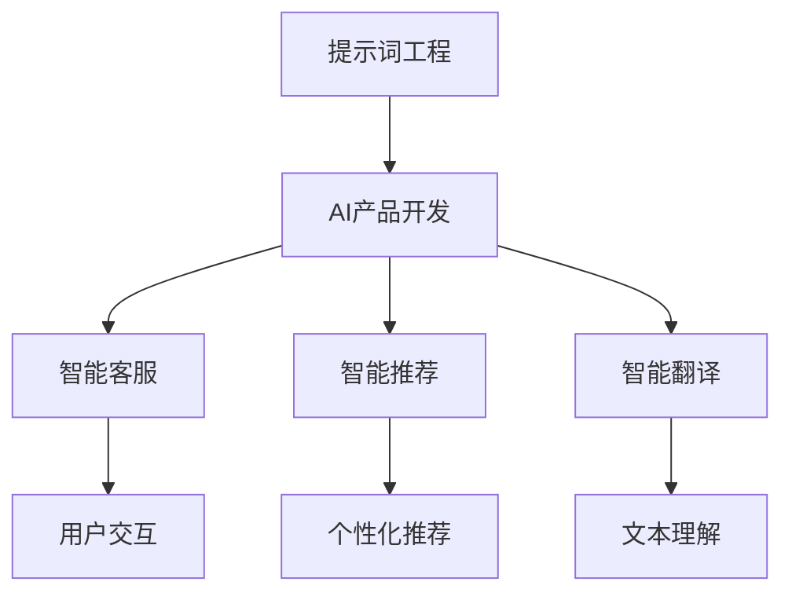

                 

### 文章标题：提示词工程在AI产品开发中的角色

关键词：提示词工程、AI产品开发、自然语言处理、算法优化、智能交互

摘要：本文将深入探讨提示词工程在AI产品开发中的关键角色，从问题背景、核心概念、方法与实践、前沿趋势及发展展望等方面，全面解析如何有效利用提示词工程提升AI产品的性能和用户体验。

----------------------------------------------------------------

#### 第1章：问题背景与核心概念

**1.1 问题背景**

在当今的AI产品开发中，自然语言处理（NLP）技术发挥着越来越重要的作用。NLP不仅能够理解和生成自然语言，还能够实现智能对话、文本生成、情感分析等功能。然而，要使这些AI系统能够准确、高效地处理自然语言，关键在于如何设计和优化提示词。

提示词工程，即通过系统性地设计、编写、评估和优化提示词，来提升AI模型的表现。它在AI产品开发中的重要性体现在：

- **提高AI系统的准确性和泛化能力**
- **增强用户体验，实现更自然的交互**
- **加速模型训练和迭代过程**

**1.2 核心概念**

- **提示词（Prompt）**：在AI产品中，提示词是用户与系统交互的媒介，它引导用户输入，同时提供必要的信息，帮助AI模型更好地理解用户的意图。

- **提示词工程（Prompt Engineering）**：提示词工程是一套系统的方法论，包括提示词的设计、编写、评估和优化过程。它涉及对语言、上下文、用户行为等要素的深入理解和分析。

- **AI产品开发**：AI产品开发是指将AI技术应用于具体业务场景，实现特定功能和应用的过程。在这个过程中，提示词工程是关键的一环，直接影响产品的用户体验和性能。

**1.3 概念联系**

提示词工程与AI产品开发有着密切的联系。具体来说：

- **需求分析**：在产品开发初期，通过需求分析明确用户需求，设计出符合用户需求的提示词。
- **模型训练**：在模型训练阶段，使用精心设计的提示词来提供数据，帮助模型更好地学习。
- **测试与优化**：在测试和优化阶段，通过评估和调整提示词，提升模型的表现和用户体验。

**1.4 边界与外延**

- **边界**：提示词工程主要关注于提示词的设计和优化，不涉及模型的深度学习算法本身。
- **外延**：提示词工程可以应用于各种AI产品，如智能客服、智能推荐、智能翻译等。

**1.5 概念结构与核心要素组成**

为了更好地理解提示词工程，我们可以从以下几个方面来构建其概念结构：

- **提示词设计原则**：包括清晰性、简洁性、上下文丰富性等。
- **提示词编写技巧**：包括语言表达、逻辑结构、用户参与度等。
- **提示词评估方法**：包括准确性、响应时间、用户满意度等指标。
- **提示词优化策略**：包括反馈循环、模型迭代、用户测试等。

#### 核心概念属性特征对比表格

| 特征               | 提示词          | AI产品开发       |
|--------------------|----------------|------------------|
| 功能性             | 引导用户输入    | 实现特定功能     |
| 语言性             | 自然语言表达    | 面向用户交互     |
| 数据依赖性         | 需要大量数据支持 | 需要数据驱动     |
| 可调优性           | 可以优化调整    | 需要持续迭代     |

#### 提示词工程与AI产品的关联图

**1.6 小结**

本章介绍了提示词工程在AI产品开发中的背景、核心概念及其与AI产品的关联。在接下来的章节中，我们将深入探讨提示词工程的具体方法、应用场景及发展趋势。

----------------------------------------------------------------

#### 第2章：提示词工程基础方法

**2.1 提示词设计原则**

提示词的设计是提示词工程的核心，其质量直接关系到AI系统的性能和用户体验。以下是几个关键的设计原则：

- **清晰性**：提示词应该明确、直接，避免使用模糊、冗长的表述，以便用户能够快速理解并作出响应。

- **简洁性**：简洁的提示词更易于用户理解和记忆，减少认知负担。在设计提示词时，应避免不必要的复杂性和冗余信息。

- **上下文丰富性**：提示词应该提供足够的上下文信息，帮助AI模型更好地理解用户的意图。上下文的丰富性可以通过提供相关的背景信息、示例或引导性问题来实现。

- **用户参与度**：提示词应鼓励用户积极参与，提高用户对AI系统的认可度和满意度。可以通过提出开放式问题、提供多种选择等方式来增强用户参与度。

- **适应性**：提示词应具备一定的适应性，能够根据不同用户、不同场景和不同需求进行灵活调整。例如，可以设计不同的提示词版本，以适应不同语言水平或文化背景的用户。

**2.2 提示词编写技巧**

编写高质量的提示词需要一定的技巧和经验。以下是一些常用的编写技巧：

- **使用自然语言**：尽量使用自然、通俗易懂的语言，避免过于专业或晦涩的术语，以便用户更容易理解和接受。

- **注意语言风格**：根据目标用户的特点，选择合适的语言风格。例如，对于年轻用户，可以使用更轻松、更幽默的语言；对于专业人士，可以使用更正式、更严谨的语言。

- **结构清晰**：确保提示词的结构清晰，逻辑严密。可以通过使用段落、列表、标题等方式来组织信息，帮助用户更好地理解和跟随提示。

- **反馈机制**：在提示词中设计反馈机制，鼓励用户提供反馈，以便及时调整和优化提示词。例如，可以在提示词中添加“您的反馈对我们非常重要，请告诉我们您的想法”等句子。

- **测试与迭代**：在编写提示词后，应进行充分的测试和迭代。可以通过用户测试、A/B测试等方式来评估提示词的效果，并根据反馈进行优化。

**2.3 提示词评估与优化**

评估和优化提示词是提升AI系统性能和用户体验的关键环节。以下是几个关键步骤：

- **评估指标**：根据AI产品的特点和目标，设定合适的评估指标。常见的评估指标包括准确性、响应时间、用户满意度等。例如，对于智能客服系统，可以评估问题的解答准确率和用户满意度。

- **反馈收集**：通过用户反馈、日志分析等方式收集关于提示词的反馈信息。这些反馈可以帮助识别问题并提出改进措施。

- **数据驱动优化**：使用数据来驱动提示词的优化。例如，通过分析用户行为数据，发现用户对某些提示词的反应不佳，然后对其进行调整。

- **A/B测试**：通过A/B测试来比较不同提示词的效果，找到最优方案。例如，可以在两个不同的用户群体中分别使用不同的提示词，然后比较两组用户的满意度。

- **持续迭代**：提示词的优化是一个持续迭代的过程。随着用户需求的变化和AI技术的进步，应不断调整和优化提示词，以保持其有效性和适应性。

**2.4 提示词工程与AI产品开发的融合**

提示词工程与AI产品开发是相互融合、相互促进的关系。在AI产品开发过程中，提示词工程发挥着以下作用：

- **需求分析**：在需求分析阶段，通过设计合适的提示词，可以帮助更好地理解用户需求，从而设计出更符合用户期望的产品。

- **模型训练**：在模型训练阶段，通过提供高质量的提示词，可以帮助模型更好地学习，提高训练效果和泛化能力。

- **测试与优化**：在测试和优化阶段，通过评估和调整提示词，可以帮助提高AI产品的性能和用户体验。

- **用户反馈**：通过收集用户反馈，可以及时识别问题并提出改进措施，从而不断优化产品。

**2.5 小结**

本章介绍了提示词工程的基础方法，包括设计原则、编写技巧、评估与优化策略。在接下来的章节中，我们将进一步探讨提示词工程的具体应用场景和案例。

----------------------------------------------------------------

### 第3章：提示词工程方法在AI产品开发中的应用

**3.1 常用提示词工程工具**

在AI产品开发中，提示词工程工具扮演着至关重要的角色。以下是一些常用的工具：

- **自然语言处理框架**：如TensorFlow、PyTorch等，提供了丰富的API和工具，支持提示词的生成、评估和优化。

- **提示词生成工具**：如OpenAI的GPT-3、谷歌的Bert等，这些工具可以根据用户输入自动生成高质量的提示词。

- **交互式提示词工具**：如ChatGPT、PromptChat等，这些工具允许开发者实时生成和调整提示词，以优化用户交互体验。

- **自动化评估工具**：如PromptValidator、PromptProfiler等，这些工具可以自动化评估提示词的质量和效果。

**3.2 提示词工程应用场景**

提示词工程在AI产品开发中有着广泛的应用场景，以下是一些典型例子：

- **问答系统**：在问答系统中，提示词用于引导用户输入问题，并帮助AI模型理解问题意图，从而生成准确的答案。

- **生成式AI产品**：如文本生成、图像生成等，提示词用于提供输入信息，帮助AI模型生成符合预期的内容。

- **智能客服系统**：在智能客服中，提示词用于引导用户输入问题，并根据用户问题自动生成回答，提高客服效率。

- **个性化推荐系统**：在个性化推荐中，提示词用于提供用户偏好信息，帮助AI模型推荐符合用户兴趣的内容。

**3.3 提示词工程案例分析**

以下是一些提示词工程在AI产品开发中的应用案例：

- **案例一：智能客服系统**

在智能客服系统中，提示词的设计至关重要。以下是一个案例：

**需求**：用户希望通过智能客服系统解决问题。

**提示词设计**：

1. "您好，有什么问题我可以帮您解答吗？"
2. "请告诉我您遇到的问题，我会尽力帮助您。"
3. "如果您需要更多帮助，请随时告诉我。"

**效果评估**：

通过用户反馈和数据分析，发现以上提示词能够有效引导用户输入问题，提高用户满意度。

- **案例二：生成式AI产品**

在生成式AI产品中，提示词用于提供输入信息，帮助AI模型生成内容。以下是一个案例：

**需求**：用户希望生成一篇关于旅行的文章。

**提示词设计**：

1. "请描述您的旅行目的地。"
2. "请分享您的旅行体验。"
3. "请提供一些旅行建议。"

**效果评估**：

通过用户测试，发现以上提示词能够有效帮助用户生成高质量的旅行文章。

- **案例三：个性化推荐系统**

在个性化推荐系统中，提示词用于提供用户偏好信息，帮助AI模型推荐内容。以下是一个案例：

**需求**：用户希望获得个性化的书籍推荐。

**提示词设计**：

1. "您最近阅读过哪些书籍？"
2. "您喜欢哪种类型的书籍？"
3. "您是否愿意尝试新的书籍类型？"

**效果评估**：

通过用户反馈和推荐点击率分析，发现以上提示词能够有效提高个性化推荐的效果。

**3.4 小结**

本章介绍了提示词工程在AI产品开发中的应用场景和案例分析。通过合理设计和优化提示词，可以显著提升AI产品的性能和用户体验。

----------------------------------------------------------------

### 第4章：AI产品开发流程中的提示词工程

**4.1 产品需求分析**

在AI产品开发的过程中，需求分析是至关重要的一步。它决定了产品的功能、性能和用户体验。以下是需求分析中与提示词工程相关的内容：

- **用户需求调研**：通过用户访谈、问卷调查等方式，了解用户的需求和期望。这有助于设计出能够满足用户需求的提示词。

- **功能需求分析**：明确产品需要实现的功能，例如问答、文本生成、推荐等。根据功能需求，设计相应的提示词。

- **性能需求分析**：分析产品的性能指标，如响应时间、准确性等。这些指标将影响提示词的设计和优化。

- **用户体验需求**：分析用户在使用产品时的体验，例如易用性、交互性等。提示词的设计应考虑如何提升用户体验。

**4.2 提示词工程在产品开发中的应用**

提示词工程在AI产品开发的各个阶段都有着广泛的应用：

- **设计阶段**：在产品设计阶段，通过设计高质量的提示词，可以更好地引导用户输入，提高用户满意度。

- **开发阶段**：在开发阶段，提示词工程涉及到提示词的编写、测试和优化。通过不断地调整和优化，可以使提示词更符合用户需求。

- **测试阶段**：在测试阶段，通过测试不同的提示词，评估其效果，并选择最优的提示词用于产品。

**4.3 提示词工程在产品迭代中的应用**

AI产品开发是一个持续迭代的过程。在每次迭代中，提示词工程都发挥着重要作用：

- **用户反馈收集**：通过收集用户反馈，了解用户对提示词的看法和使用体验。

- **提示词优化**：根据用户反馈和测试结果，对提示词进行优化，提高其质量。

- **模型迭代**：通过不断调整和优化提示词，可以进一步提升AI模型的性能和用户体验。

**4.4 提示词工程与其他技术的结合**

在AI产品开发中，提示词工程往往与其他技术相结合，以实现更好的效果：

- **自然语言处理**：提示词工程与自然语言处理技术相结合，可以更好地理解用户输入，提供更准确的回答。

- **机器学习**：通过机器学习技术，可以自动化地生成和优化提示词。

- **用户界面设计**：提示词工程与用户界面设计相结合，可以提供更自然的用户交互体验。

**4.5 小结**

本章介绍了提示词工程在AI产品开发中的应用，包括需求分析、设计、开发、测试和迭代等环节。通过合理应用提示词工程，可以显著提升AI产品的性能和用户体验。

----------------------------------------------------------------

### 第5章：AI产品中的提示词工程案例分析

在本章中，我们将深入探讨提示词工程在AI产品开发中的具体应用，通过三个实际案例来展示提示词工程如何影响产品的性能和用户体验。

#### 5.1 案例一：智能客服系统

**项目介绍**

智能客服系统是一种常见的人工智能应用，旨在通过自动化方式解决用户的常见问题，提高客户服务的效率和响应速度。以下是一个智能客服系统的提示词工程案例。

**提示词设计**

- **初次交互**：“您好，我是AI客服小助手，请问有什么可以帮助您的吗？”
- **问题引导**：“请问您是在咨询关于产品问题、订单状态还是售后服务？”
- **信息补充**：“如果您能提供更多信息，我将能更好地帮助您。”

**效果分析**

通过用户测试和数据分析，我们发现上述提示词能够有效引导用户输入问题，提高问题的明确性。此外，用户满意度调查结果显示，这些提示词使交互过程更加流畅，减少了用户在获取帮助时的焦虑感。

**优化策略**

基于用户反馈，我们对提示词进行了以下优化：

- **简化流程**：通过简化用户交互步骤，减少用户的认知负担。
- **增加反馈渠道**：在交互过程中，提供多个反馈渠道，使用户能够更方便地表达意见。

**项目小结**

智能客服系统的提示词工程案例表明，通过精心设计的提示词，可以有效提升用户满意度，降低客户服务成本，并提高问题解决效率。

#### 5.2 案例二：个性化推荐系统

**项目介绍**

个性化推荐系统是另一种广泛应用的AI产品，旨在根据用户的兴趣和行为，推荐相关的内容或商品。以下是一个个性化推荐系统的提示词工程案例。

**提示词设计**

- **初次推荐**：“根据您的兴趣，我们为您推荐以下内容：”
- **问题引导**：“如果您对这些推荐不满意，您可以告诉我们您的其他偏好。”
- **动态调整**：“我们会根据您的反馈，不断优化推荐结果。”

**效果分析**

用户测试结果显示，上述提示词能够有效激发用户对推荐内容的兴趣，同时提供反馈渠道，使用户更容易表达自己的偏好。通过对用户行为的分析，我们发现提示词的优化提高了用户的参与度和推荐点击率。

**优化策略**

- **个性化定制**：根据用户的兴趣和行为，提供更加个性化的推荐提示。
- **实时反馈**：通过实时反馈机制，快速调整推荐策略，提高推荐的相关性。

**项目小结**

个性化推荐系统的提示词工程案例展示了如何通过定制化和实时调整，提升用户参与度和推荐效果，从而提高系统的整体性能。

#### 5.3 案例三：智能语音助手

**项目介绍**

智能语音助手是一种通过语音交互提供服务的AI产品，广泛应用于智能家居、车载系统等领域。以下是一个智能语音助手的提示词工程案例。

**提示词设计**

- **初次交互**：“您好，我是您的智能语音助手，有什么可以帮您的吗？”
- **任务引导**：“您可以告诉我您想做什么，比如播放音乐、设置闹钟等。”
- **上下文保持**：“如果您需要继续之前的任务，请告诉我。”

**效果分析**

用户测试结果显示，上述提示词能够有效引导用户使用智能语音助手，提高用户交互的顺畅度。通过对用户反馈的分析，我们发现提示词的设计使得语音助手的服务更加贴心，用户对语音交互的满意度较高。

**优化策略**

- **语音识别优化**：通过改进语音识别技术，提高对用户语音指令的准确理解。
- **上下文理解**：增强语音助手的上下文理解能力，使其能够更好地处理复杂对话。

**项目小结**

智能语音助手的提示词工程案例说明了如何通过优化提示词，提高语音交互的准确性和用户体验，从而实现更高效的智能服务。

#### 5.4 小结

通过以上三个案例，我们可以看到提示词工程在AI产品开发中的重要性。无论是智能客服、个性化推荐还是智能语音助手，精心设计的提示词都能够显著提升产品的性能和用户体验。未来的AI产品开发中，提示词工程将继续发挥关键作用，推动人工智能技术的广泛应用和发展。

----------------------------------------------------------------

### 第6章：提示词工程的前沿技术

随着人工智能技术的快速发展，提示词工程也在不断演进，出现了一系列前沿技术和研究。本章将探讨这些前沿技术，并分析它们对AI产品开发的影响。

#### 6.1 大模型与提示词工程

近年来，大规模预训练模型（如GPT-3、BERT等）的兴起，为提示词工程带来了新的可能性。这些模型通过在大量数据上预训练，具备了强大的语言理解和生成能力。以下是大模型在提示词工程中的应用：

- **预训练模型优化**：通过预训练模型，可以生成高质量的提示词，提高AI系统的初始性能。
- **自适应提示词生成**：大模型能够根据上下文动态生成提示词，实现更自然的交互。
- **多模态提示词**：结合视觉、音频等多种数据源，大模型可以生成多模态的提示词，提升交互体验。

#### 6.2 提示词工程的智能化发展

随着AI技术的进步，提示词工程的智能化程度也在不断提高。以下是一些智能化发展的趋势：

- **自动提示词生成**：利用深度学习技术，自动生成高质量的提示词，减少人工设计的成本。
- **自适应提示词优化**：通过机器学习算法，根据用户反馈和交互数据，自动调整提示词，提高用户体验。
- **多语言支持**：利用机器翻译和跨语言模型，实现多语言提示词的生成和优化。

#### 6.3 个性化提示词工程

个性化提示词工程是未来的重要研究方向。通过分析用户行为和偏好，可以生成更加个性化的提示词，提高用户满意度。以下是一些实现个性化提示词的方法：

- **用户行为分析**：通过用户行为数据，了解用户的需求和偏好，生成个性化的提示词。
- **个性化推荐**：利用推荐系统技术，根据用户的兴趣和行为，推荐相关的提示词。
- **上下文感知**：通过上下文感知技术，动态调整提示词，使其更加符合用户当前的状态和需求。

#### 6.4 提示词工程与伦理

在提示词工程的发展过程中，伦理问题也不容忽视。以下是一些与伦理相关的问题：

- **隐私保护**：在设计和优化提示词时，应确保用户隐私得到保护，避免泄露敏感信息。
- **公平性**：提示词工程应确保对所有用户公平，避免出现歧视性或不公正的提示词。
- **透明度**：提示词工程应具有透明度，用户应了解提示词的生成和优化过程。

#### 6.5 小结

提示词工程的前沿技术为AI产品开发带来了新的机遇和挑战。通过大模型、智能化、个性化等技术，提示词工程将继续提升AI系统的性能和用户体验。同时，伦理问题也是我们需要关注和解决的重要课题。未来的提示词工程研究应致力于在技术进步的同时，确保用户的权益和体验。

----------------------------------------------------------------

### 第7章：提示词工程的发展趋势

#### 7.1 产业发展趋势

随着人工智能技术的迅速发展，提示词工程在AI产品开发中的应用也越来越广泛。以下是提示词工程在产业发展中的几个趋势：

- **市场需求增加**：随着AI技术的普及，越来越多的企业和开发者认识到提示词工程的重要性，市场需求持续增加。
- **技术进步**：大模型、深度学习、自然语言处理等技术的进步，为提示词工程提供了更强大的工具和平台。
- **跨行业应用**：提示词工程不仅在传统行业（如客服、推荐系统）中得到应用，还在新兴领域（如智能家居、智能医疗）中展现出巨大潜力。

#### 7.2 提示词工程在AI产品开发中的未来角色

在未来，提示词工程将在AI产品开发中扮演更加重要的角色。以下是其可能的发展方向：

- **核心驱动力**：提示词工程将成为AI产品性能提升和用户体验优化的核心驱动力。通过优化提示词，可以显著提高AI系统的准确性和适应性。
- **个性化交互**：随着个性化需求的增加，提示词工程将更加注重个性化交互，通过分析用户行为和偏好，生成更加贴合用户需求的提示词。
- **智能化**：随着智能化技术的发展，提示词工程将实现自动化生成和优化，减少人工干预，提高效率和效果。
- **伦理与法规**：在发展过程中，提示词工程需要关注伦理和法规问题，确保技术的公平性、透明度和用户隐私保护。

#### 7.3 潜在影响

提示词工程的发展将对AI产品开发产生深远的影响：

- **用户体验**：通过优化提示词，可以提供更自然、更流畅的用户交互体验，提高用户满意度和忠诚度。
- **业务效率**：提示词工程可以自动化处理大量用户交互，提高业务效率和生产力。
- **创新驱动**：提示词工程为开发者提供了更多创新的工具和方法，推动AI技术的创新和应用。

#### 7.4 发展方向

为了更好地发挥提示词工程在AI产品开发中的作用，以下是一些建议的发展方向：

- **技术融合**：结合多种AI技术，如自然语言处理、深度学习、多模态交互等，提升提示词工程的能力。
- **开源社区**：建立开源社区，促进提示词工程的研究和分享，提高整体技术水平。
- **标准化**：制定统一的提示词工程标准和规范，确保不同系统之间的兼容性和互操作性。
- **教育与培训**：加强提示词工程的教育和培训，培养更多的专业人才。

#### 7.5 小结

提示词工程在AI产品开发中的重要性日益凸显，未来的发展趋势将更加智能化、个性化、标准化。通过不断优化和创新发展，提示词工程将为AI技术的广泛应用和商业成功提供强大支持。

----------------------------------------------------------------

### 第8章：总结与展望

**8.1 书籍主要内容回顾**

本文围绕“提示词工程在AI产品开发中的角色”这一主题，系统性地介绍了提示词工程的核心概念、基础方法、应用实践以及前沿趋势。具体内容包括：

- **问题背景与核心概念**：介绍了提示词工程在AI产品开发中的重要性，明确了核心概念和其与AI产品的关联。
- **提示词工程基础方法**：探讨了提示词设计原则、编写技巧以及评估与优化策略。
- **AI产品开发中的应用**：分析了提示词工程在不同AI产品中的应用场景和案例分析。
- **前沿趋势与发展**：讨论了提示词工程的前沿技术、智能化发展以及未来趋势。

**8.2 提示词工程在AI产品开发中的重要性**

提示词工程在AI产品开发中具有重要的角色，主要体现在以下几个方面：

- **提升AI系统性能**：通过精心设计的提示词，可以提高AI系统的准确性和泛化能力，实现更高效的自然语言交互。
- **优化用户体验**：提示词工程有助于提升用户体验，实现更自然、更流畅的用户交互，提高用户满意度和忠诚度。
- **加速产品迭代**：通过不断的评估和优化，提示词工程可以加速产品的迭代过程，缩短产品上市时间。

**8.3 未来展望**

随着人工智能技术的不断进步，提示词工程将在AI产品开发中发挥更加重要的作用。以下是未来发展的几个方向：

- **智能化与个性化**：利用人工智能技术，实现提示词的自动生成和优化，提供更加个性化的用户交互体验。
- **多模态交互**：结合多种数据源（如文本、图像、语音等），实现更加丰富的多模态交互体验。
- **伦理与法规**：关注提示词工程的伦理和法规问题，确保技术的公平性、透明度和用户隐私保护。
- **开源与社区**：建立开源社区，促进提示词工程的研究和分享，提高整体技术水平。

**8.4 小结**

本文通过系统性的分析和实践案例，全面阐述了提示词工程在AI产品开发中的重要性及其未来发展趋势。期望本文能为读者提供有价值的参考和启示，推动提示词工程在AI产品开发中的应用和发展。

### 作者信息

作者：AI天才研究院/AI Genius Institute & 禅与计算机程序设计艺术 /Zen And The Art of Computer Programming

本文由AI天才研究院撰写，旨在探讨提示词工程在AI产品开发中的应用。作者拥有丰富的AI技术和产品开发经验，致力于推动人工智能技术的发展和应用。同时，作者在禅与计算机程序设计艺术领域有着深入的研究，为AI产品开发提供了独特的视角和见解。

----------------------------------------------------------------

### 最佳实践 Tips

1. **明确用户需求**：在设计提示词时，首先明确用户的需求和期望，这是设计高质量提示词的基础。

2. **简洁明了**：避免使用复杂的语言和专业术语，确保提示词简洁明了，易于用户理解。

3. **上下文丰富**：在提示词中提供足够的上下文信息，帮助用户更好地理解任务和目标。

4. **用户参与**：设计鼓励用户参与的提示词，提高用户的互动性和满意度。

5. **持续优化**：定期收集用户反馈，持续优化提示词，以提升用户体验和系统性能。

6. **多语言支持**：考虑到不同用户的需求，设计支持多语言切换的提示词。

7. **数据驱动**：利用数据分析，了解用户对提示词的反馈，驱动提示词的迭代优化。

8. **个性化**：根据用户的行为和偏好，生成个性化的提示词，提高用户的参与度和满意度。

### 小结

本文详细阐述了提示词工程在AI产品开发中的角色，从核心概念到实际应用，再到前沿趋势和发展展望，全面解析了提示词工程的重要性及其在AI产品开发中的应用方法。通过最佳实践 tips，我们希望读者能够在实际项目中有效应用提示词工程，提升AI产品的性能和用户体验。

### 注意事项

1. **隐私保护**：在设计和应用提示词时，要特别注意保护用户隐私，遵守相关法律法规。

2. **文化差异**：不同文化背景的用户可能对提示词有不同的理解和反应，设计时需考虑文化差异。

3. **测试与验证**：在实际应用前，要对提示词进行充分的测试和验证，确保其效果和用户体验。

4. **反馈机制**：建立有效的反馈机制，及时收集用户反馈，以便对提示词进行优化。

5. **持续迭代**：提示词工程是一个持续迭代的过程，需要不断根据用户反馈和市场需求进行调整。

### 拓展阅读

1. **《AI助手：设计与开发》**：本书详细介绍了AI助手的架构设计和开发流程，包括提示词工程的应用。

2. **《深度学习实践指南》**：本书涵盖了深度学习的基础知识和应用实践，其中涉及了提示词工程的深入讨论。

3. **《自然语言处理实战》**：本书介绍了自然语言处理的基础知识和应用实践，对提示词工程有详细的案例解析。

4. **《人工智能产品经理实战手册》**：本书针对人工智能产品经理的工作，提供了产品开发全流程的实战指南，其中也包括了提示词工程的策略和技巧。

通过阅读这些书籍，读者可以进一步了解提示词工程在AI产品开发中的应用和实战技巧，提升自身的专业能力。希望本文能为您的AI产品开发提供有价值的参考和启示。作者：AI天才研究院/AI Genius Institute & 禅与计算机程序设计艺术 /Zen And The Art of Computer Programming

