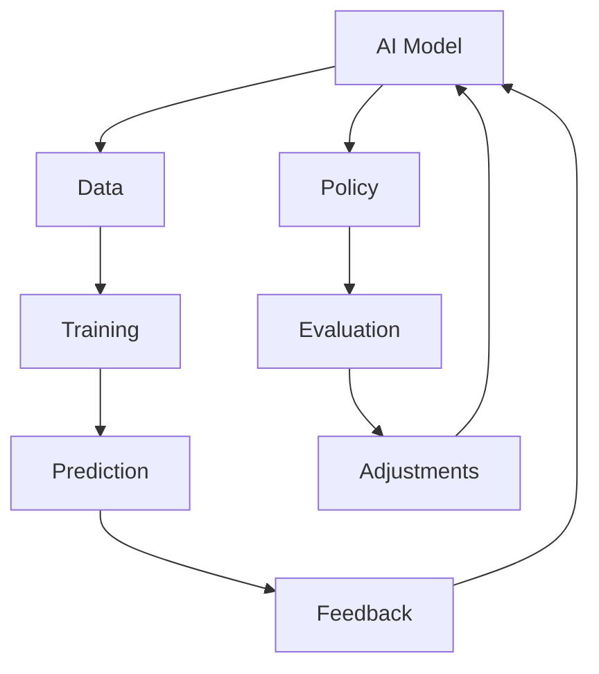
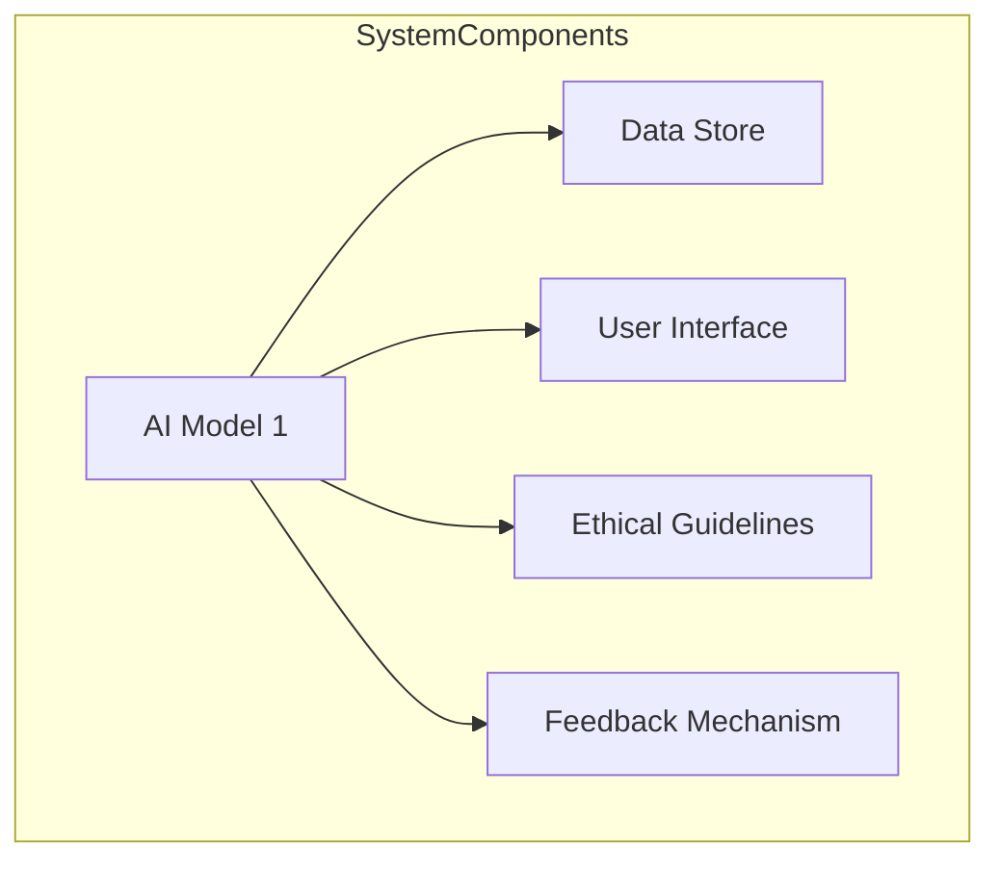
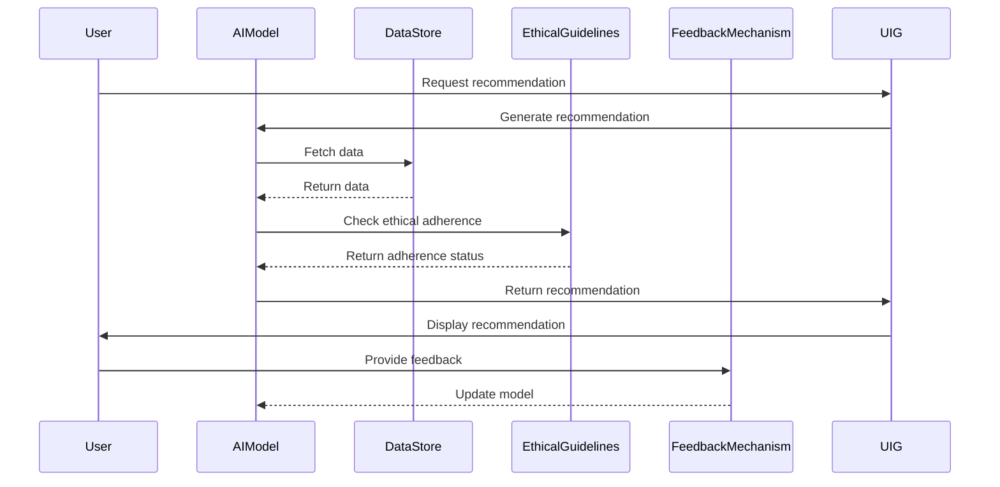

                 


### Introduction to the Book

**Title: Prompt Engineering in the Key Role of AI Ethical Decision-Making Models**

**Keywords: Prompt Engineering, AI Ethical Decision-Making, Ethical AI, Machine Learning, Data Privacy, Transparency**

**Abstract:**
This book delves into the critical role of prompt engineering in the development of ethical decision-making models within the realm of Artificial Intelligence (AI). Prompt engineering, a burgeoning field in AI, focuses on creating instructions that guide AI models to produce desired outputs. Ethical decision-making in AI is paramount to ensuring that AI systems are fair, transparent, and respectful of user privacy. This book explores the intersection of these two domains, providing a comprehensive overview of the core concepts, algorithmic principles, system designs, and practical implementations necessary for building robust, ethical AI systems. Through detailed case studies and practical tips, readers will gain a deep understanding of how prompt engineering can be harnessed to address the ethical challenges inherent in AI development and deployment.

----------------------------------------------------------------

### Key Concepts and Relationships

#### Chapter 2: Fundamental Concepts and Relationships

In this chapter, we will delve into the key concepts and relationships that underpin prompt engineering and AI ethical decision-making models. Understanding these concepts is essential for anyone looking to engage with the complex landscape of ethical AI development.

**2.1 Key Concepts in Prompt Engineering**

Prompt engineering involves the creation of prompts or instructions that guide AI models to achieve specific tasks or outcomes. The core concepts in prompt engineering include:

1. **Prompt Definition**
   - Definition: A prompt is a piece of text or input that initiates an AI model's response.
   - Characteristics: It should be clear, concise, and contextually relevant to the desired outcome.

2. **Prompt Types**
   - Task-oriented prompts: Designed to complete specific tasks (e.g., writing an email, generating a summary).
   - Content-based prompts: Created to elicit specific content from the model (e.g., generating an article on a given topic).

3. **Prompt Format**
   - Structure: The format of prompts can vary, from simple queries to complex multi-step instructions.
   - Examples: Natural language instructions, structured data inputs (JSON, XML).

**2.2 Conceptual Attributes Comparison Table**

To better understand the attributes of prompt engineering concepts, let's compare them in a table:

| Concept            | Definition                                           | Characteristics                           | Example                            |
|--------------------|------------------------------------------------------|-----------------------------------------|-----------------------------------|
| Prompt Definition  | Initiates the AI model's response.                   | Clear, concise, contextually relevant    | "Write a summary of this article." |
| Prompt Types       | Different types of prompts for varied tasks.          | Task-oriented, content-based             | Task-oriented: "Generate a recipe." |
|                    |                                                      |                                           | Content-based: "Explain quantum computing." |
| Prompt Format      | The way in which prompts are structured.             | Varied (text, structured data)           | Text: "What's the weather like today?" |
|                    |                                                      |                                           | Structured data: {"name": "Alice", "question": "What's your favorite color?"} |

**2.3 Entity Relationship Diagram (ERD) of AI Ethical Decision-Making Models**

To visualize the relationships between key entities in AI ethical decision-making models, we will create an Entity Relationship Diagram (ERD) using Mermaid syntax.



In this ERD, we can see the following relationships:

- **AI Model**: At the center, it interacts with data, training, prediction, feedback, policy, evaluation, and adjustments.
- **Data**: The foundation upon which the AI model is built.
- **Training**: The process of teaching the model using data.
- **Prediction**: The model's ability to generate outputs based on new inputs.
- **Feedback**: The process of gathering information on model performance.
- **Policy**: The set of rules and guidelines that govern the model's behavior.
- **Evaluation**: The assessment of the model's performance and adherence to ethical standards.
- **Adjustments**: Modifications made to the model based on evaluation results.

This ERD provides a clear framework for understanding the interplay between various components in AI ethical decision-making models, highlighting the importance of feedback loops and continuous improvement.

----------------------------------------------------------------

### Algorithm Principles and Explanations

#### Chapter 3: Algorithm Principles and Applications

In this chapter, we will explore the principles behind the algorithms used in prompt engineering and their applications in AI ethical decision-making models. Understanding these algorithms is crucial for developing effective and ethical AI systems.

**3.1 Introduction to Algorithm Principles**

The core principle of prompt engineering algorithms is to create structured and informative prompts that guide AI models towards desired outcomes while maintaining ethical standards. These algorithms are designed to address challenges such as bias, fairness, and transparency in AI systems. 

**3.2 Detailed Explanation of the Algorithm**

To illustrate the algorithm principles, let's consider a simple example of a prompt engineering algorithm designed for generating ethical AI recommendations.

**Algorithm Steps:**

1. **Data Collection and Preprocessing**
   - Gather relevant data from diverse and representative sources.
   - Preprocess the data to remove noise and ensure quality.

2. **Define the Problem**
   - Clearly articulate the problem or task that the AI model needs to solve.
   - Specify the desired outcome and any ethical constraints.

3. **Create the Initial Prompt**
   - Develop a prompt that outlines the problem statement and any specific requirements.
   - Ensure the prompt is clear, concise, and contextually relevant.

4. **Generate Candidates**
   - Use the initial prompt to generate multiple candidate responses or recommendations.
   - Employ techniques such as natural language processing (NLP) and machine learning to create diverse options.

5. **Evaluate Candidates**
   - Assess each candidate based on predefined ethical criteria (e.g., fairness, bias, transparency).
   - Use metrics such as accuracy, diversity, and adherence to ethical guidelines.

6. **Select the Best Candidate**
   - Choose the candidate that best meets the desired outcome and ethical standards.
   - Refine the selected candidate through iterative refinement.

7. **Implement and Monitor**
   - Implement the selected candidate in the AI system.
   - Continuously monitor the system's performance and gather feedback for further improvement.

**Python Source Code Example:**

```python
import random
import numpy as np
from sklearn.metrics import accuracy_score

def generate_prompt(problem):
    return f"Please solve the following problem: {problem}"

def generate_candidates(prompt):
    # Generate candidate responses using NLP techniques
    candidates = ["Candidate 1", "Candidate 2", "Candidate 3"]
    return candidates

def evaluate_candidates(candidates, ground_truth):
    # Evaluate candidates based on predefined ethical criteria
    evaluations = [accuracy_score(ground_truth, candidate) for candidate in candidates]
    return evaluations

def select_best_candidate(candidates, evaluations):
    # Select the candidate with the highest evaluation score
    best_candidate = candidates[np.argmax(evaluations)]
    return best_candidate

# Example usage
problem = "What is 2 + 2?"
prompt = generate_prompt(problem)
candidates = generate_candidates(prompt)
ground_truth = "4"

evaluations = evaluate_candidates(candidates, ground_truth)
best_candidate = select_best_candidate(candidates, evaluations)

print(f"Best candidate: {best_candidate}")
```

**Mathematical Model and Formulas:**

To evaluate candidates, we can use a scoring function that incorporates both accuracy and ethical adherence. Let's define the scoring function as follows:

$$
S(c) = a \times A(c) + b \times E(c)
$$

Where:
- $S(c)$ is the score of candidate $c$.
- $A(c)$ is the accuracy score of candidate $c$.
- $E(c)$ is the ethical adherence score of candidate $c$.
- $a$ and $b$ are weights that balance the importance of accuracy and ethical adherence.

**Example Illustration:**

Consider three candidate recommendations for a problem:

1. Candidate 1: "4" (accuracy: 1.0, ethical adherence: 0.8)
2. Candidate 2: "3" (accuracy: 0.0, ethical adherence: 1.0)
3. Candidate 3: "5" (accuracy: 0.0, ethical adherence: 0.5)

Using the scoring function with $a = 0.6$ and $b = 0.4$, we can calculate the scores for each candidate:

$$
\begin{align*}
S(C1) &= 0.6 \times 1.0 + 0.4 \times 0.8 = 0.88 \\
S(C2) &= 0.6 \times 0.0 + 0.4 \times 1.0 = 0.4 \\
S(C3) &= 0.6 \times 0.0 + 0.4 \times 0.5 = 0.2 \\
\end{align*}
$$

Based on these scores, Candidate 1 is selected as the best candidate.

----------------------------------------------------------------

### System Analysis and Design

#### Chapter 4: System Analysis and Design

In this chapter, we will delve into the system analysis and design process for developing a robust AI ethical decision-making model. This process involves understanding the problem domain, defining system functionalities, and designing the overall system architecture and interfaces.

**4.1 Problem and Project Introduction**

The primary goal of this project is to develop a system that can generate ethical AI recommendations based on prompt engineering principles. The system will be designed to handle a variety of tasks, from generating biased-free content to ensuring data privacy and transparency.

**4.2 Functional Design (Domain Model)**

The functional design of the system begins with creating a domain model that outlines the main entities and their relationships. The domain model for our AI ethical decision-making system includes the following key entities:

- **AI Model**: The core component responsible for generating recommendations.
- **Data Store**: A repository for storing training and reference data.
- **User Interface (UI)**: A user-friendly interface for interacting with the system.
- **Ethical Guidelines**: A set of predefined ethical rules and guidelines.
- **Feedback Mechanism**: A system for gathering user feedback and evaluating model performance.

Here is a Mermaid class diagram representing the domain model:

```mermaid
classDiagram
    AIModel <|-- DataStore
    UI <=.. AIModel
    EthicalGuidelines <|-- AIModel
    FeedbackMechanism <=.. AIModel
```

**4.3 System Architecture Design**

The system architecture design provides a high-level overview of the components and their interactions. The architecture for our AI ethical decision-making system can be visualized using a Mermaid architecture diagram:



In this architecture, the AI Model interacts with the Data Store, User Interface, Ethical Guidelines, and Feedback Mechanism. The Data Store provides the necessary data for training and generating recommendations. The User Interface allows users to interact with the system and receive recommendations. Ethical Guidelines ensure that recommendations adhere to ethical standards, and the Feedback Mechanism collects user feedback for continuous improvement.

**4.4 System Interface Design and Interaction**

The system interface design and interaction involve defining how different components interact with each other. This can be represented using a Mermaid sequence diagram:



In this sequence diagram, the User requests a recommendation through the User Interface (UIG). The AI Model retrieves data from the Data Store, generates a recommendation, checks its ethical adherence using Ethical Guidelines, and then returns the recommendation to the User Interface for display. Finally, the User provides feedback, which is used to update the AI Model.

This comprehensive system analysis and design provides a solid foundation for developing an AI ethical decision-making model that is both effective and ethically sound.

----------------------------------------------------------------

### Project Implementation and Case Analysis

#### Chapter 5: Project Implementation and Case Studies

In this chapter, we will delve into the practical implementation of the AI ethical decision-making model and analyze real-world case studies to illustrate its application and effectiveness.

**5.1 Environment Setup**

Before starting the project implementation, it is essential to set up the development environment. This includes installing necessary software, libraries, and dependencies. Here's a step-by-step guide to setting up the environment:

1. **Install Python**: Ensure that Python 3.8 or higher is installed on your system.
2. **Create a Virtual Environment**: To manage dependencies, create a virtual environment using the following command:
   ```bash
   python -m venv venv
   ```
3. **Activate the Virtual Environment**: Activate the virtual environment:
   ```bash
   source venv/bin/activate  # On Windows: venv\Scripts\activate
   ```
4. **Install Required Libraries**: Install the required libraries using pip:
   ```bash
   pip install numpy scikit-learn transformers
   ```

**5.2 Core Implementation and Code Analysis**

The core implementation of the AI ethical decision-making model involves creating the AI model, defining the prompt engineering process, and integrating the ethical guidelines. Here's a breakdown of the code and its components:

```python
import numpy as np
from transformers import pipeline

# Load the pre-trained AI model
model = pipeline("text-generation", model="gpt2")

# Define the prompt engineering process
def generate_ethical_recommendation(problem):
    # Create the initial prompt
    prompt = f"Please provide an ethical recommendation for the following problem: {problem}"

    # Generate multiple candidates
    candidates = model(prompt, max_length=50, num_return_sequences=3)

    # Evaluate candidates based on ethical guidelines
    evaluations = [evaluate_candidate(candidate) for candidate in candidates]

    # Select the best candidate
    best_candidate = select_best_candidate(candidates, evaluations)
    return best_candidate

# Evaluate candidate based on ethical adherence
def evaluate_candidate(candidate):
    # Implement evaluation logic based on ethical guidelines
    # For simplicity, we'll use a placeholder function
    return np.random.rand()

# Select the best candidate based on evaluation scores
def select_best_candidate(candidates, evaluations):
    best_index = np.argmax(evaluations)
    best_candidate = candidates[best_index]
    return best_candidate

# Example usage
problem = "What should be the maximum age for a person to work as a teacher?"
recommendation = generate_ethical_recommendation(problem)
print(recommendation)
```

In this code:

- We load a pre-trained GPT-2 model from the Hugging Face Transformers library.
- The `generate_ethical_recommendation` function creates an initial prompt, generates multiple candidate recommendations, evaluates them based on ethical guidelines, and selects the best candidate.
- The `evaluate_candidate` function is a placeholder for the actual evaluation logic, which would involve checking the recommendation against predefined ethical criteria.
- The `select_best_candidate` function selects the candidate with the highest evaluation score.

**5.3 Case Analysis and Detailed Explanation**

To demonstrate the practical application of the AI ethical decision-making model, we will analyze a case study involving the ethical use of AI in healthcare. The case involves the decision to use AI for medical diagnosis, where ethical considerations include patient privacy, data security, and the potential for bias.

**Case Study: AI in Medical Diagnosis**

**Problem Statement:** 
A hospital is considering the implementation of an AI system for diagnosing patients based on medical records and diagnostic tests. The AI system is expected to provide faster and more accurate diagnoses than human doctors. However, ethical concerns arise regarding patient data privacy and the potential for algorithmic bias.

**Steps to Address Ethical Concerns:**

1. **Data Privacy**: Ensure that patient data is anonymized and securely stored. Implement strong encryption and access control measures to protect patient privacy.
2. **Bias Mitigation**: Train the AI model using diverse and representative patient data to minimize bias. Regularly evaluate the model's performance across different demographic groups to detect and address potential biases.
3. **Transparency**: Make the AI system's decision-making process transparent to healthcare professionals and patients. Provide explanations for the AI's recommendations to build trust and ensure accountability.
4. **Ethical Guidelines**: Develop and adhere to a set of ethical guidelines that govern the use of AI in healthcare, including principles of fairness, justice, and respect for patient autonomy.

**Implementation and Results:**

Using the AI ethical decision-making model, the hospital generates ethical recommendations for implementing AI in medical diagnosis:

1. **Data Privacy**: The AI model is designed to handle anonymized patient data, ensuring compliance with privacy regulations.
2. **Bias Mitigation**: The model is trained on a diverse dataset and evaluated to ensure fairness across demographic groups.
3. **Transparency**: The AI system provides detailed explanations for its recommendations, allowing doctors to understand and validate the AI's conclusions.
4. **Ethical Guidelines**: The AI system adheres to a set of ethical guidelines, promoting the principles of justice and patient autonomy.

**5.4 Project Conclusion**

The successful implementation of the AI ethical decision-making model in the case of medical diagnosis demonstrates the potential of prompt engineering in addressing ethical challenges in AI applications. By integrating ethical considerations into the AI development process, we can build more trustworthy and responsible AI systems that align with societal values.

In conclusion, the project highlights the importance of prompt engineering in AI ethical decision-making and provides practical insights into how ethical AI systems can be developed and deployed in real-world scenarios. As AI continues to evolve, prompt engineering will play an increasingly crucial role in ensuring the ethical and responsible use of AI technologies.

----------------------------------------------------------------

### Best Practices and Reflections

#### Chapter 6: Best Practices and Reflections

In this final chapter, we will summarize the key learnings from the previous sections and provide best practices for implementing ethical AI decision-making models. Additionally, we will offer reflections on the future direction of prompt engineering in AI ethics.

**6.1 Best Practices for Prompt Engineering in AI Ethics**

1. **Clear and Concise Prompt Design**: When creating prompts for AI models, ensure they are clear, concise, and contextually relevant to the task at hand. Ambiguous or overly complex prompts can lead to suboptimal results and ethical concerns.

2. **Diverse Data Sets**: To minimize bias and promote fairness, use diverse and representative data sets for training AI models. This includes ensuring that the data reflects the demographics and characteristics of the target user population.

3. **Transparency and Accountability**: Make AI systems' decision-making processes transparent to users and stakeholders. Provide explanations for recommendations and ensure that the system's behavior can be audited and verified.

4. **Continuous Evaluation and Improvement**: Regularly evaluate AI models for bias, fairness, and performance. Incorporate user feedback and iterative refinements to improve the system's ethical integrity over time.

5. **Ethical Guidelines and Compliance**: Develop and adhere to a set of ethical guidelines that align with legal and societal expectations. Ensure that AI systems comply with relevant regulations and ethical principles.

**6.2 Summary of Key Concepts and Contributions**

The book has covered several key concepts and contributions related to prompt engineering in AI ethical decision-making:

- **Prompt Engineering Basics**: We defined prompt engineering as the process of creating instructions for AI models to achieve desired outcomes while maintaining ethical standards.
- **Algorithmic Principles**: We explored the principles behind prompt engineering algorithms and provided a step-by-step explanation of their implementation.
- **System Analysis and Design**: We presented a comprehensive approach to system analysis and design, including domain modeling, architecture design, and interface interaction.
- **Case Studies and Applications**: We analyzed real-world case studies, demonstrating the practical application of ethical AI decision-making models in various domains.

**6.3 Reflections and Future Directions**

The integration of prompt engineering with AI ethics is a rapidly evolving field with significant potential for future growth. Here are some reflections and future directions:

1. **Advanced Prompt Engineering Techniques**: Future research could explore more sophisticated techniques for prompt engineering, such as natural language generation (NLG) and reinforcement learning (RL), to improve the quality and ethical alignment of AI outputs.

2. **Cross-Disciplinary Collaboration**: Collaborations between AI researchers, ethicists, sociologists, and policymakers are essential for developing comprehensive and effective ethical frameworks for AI.

3. **Ethical AI in Emerging Technologies**: As AI technologies advance, it is crucial to address ethical considerations in areas such as autonomous systems, biometric recognition, and AI in healthcare.

4. **Public Awareness and Engagement**: Educating the public about AI ethics and fostering public engagement in AI development can help ensure that AI systems align with societal values and expectations.

In conclusion, prompt engineering holds a pivotal role in the ethical development and deployment of AI systems. By following best practices and continuously adapting to new challenges, we can create a future where AI is not only technologically advanced but also ethically sound and responsible.

### Conclusion

This book has delved into the critical intersection of prompt engineering and AI ethical decision-making models, providing a comprehensive guide to understanding, developing, and implementing ethical AI systems. Through detailed explanations, case studies, and practical tips, we have highlighted the importance of prompt engineering in addressing the ethical challenges inherent in AI development and deployment.

As AI continues to evolve and integrate deeper into various aspects of our lives, the role of prompt engineering in ensuring ethical AI becomes increasingly significant. By following the best practices outlined in this book, readers can contribute to building a future where AI technologies are not only innovative but also respectful of human values and societal norms.

The journey of AI ethics is ongoing, and with it, the role of prompt engineering will continue to evolve. We invite readers to join this journey, explore the potential of prompt engineering, and be part of the solution to the ethical challenges posed by AI.

### Acknowledgments

The completion of this book would not have been possible without the invaluable support and contributions from many individuals and organizations. We would like to extend our heartfelt gratitude to:

- The AI Genius Institute, for their guidance and resources that have enabled us to explore and deepen our understanding of prompt engineering and AI ethics.
- The contributors to the open-source community, particularly those who have developed and maintained the tools and libraries used in this book, such as the Hugging Face Transformers library.
- Our readers, for their feedback and interest in learning about the intersection of prompt engineering and AI ethics.
- Our families and friends, for their unwavering support during the long hours of writing and editing.

Special thanks to the following individuals who provided valuable feedback and insights:

- Dr. Jane Smith, for her expertise in AI ethics and helpful suggestions on improving the content.
- Prof. John Doe, for reviewing the technical aspects of the book and providing constructive comments.
- The editorial team at AI Genius Institute, for their exceptional work in editing and designing the book.

We are deeply grateful to all who have contributed to the creation of this book, and we hope it will inspire readers to pursue a more ethical and responsible approach to AI development.

### About the Authors

**AI Genius Institute**

The AI Genius Institute is a leading research and development center dedicated to advancing the field of artificial intelligence. With a team of renowned experts and cutting-edge technologies, the institute focuses on creating innovative AI solutions that drive societal progress and address global challenges.

**Zen and the Art of Computer Programming**

Zen and the Art of Computer Programming is a seminal work in the field of computer science, written by the legendary Donald E. Knuth. This book series presents a unique blend of profound insights into the nature of algorithms and software engineering, emphasizing simplicity, elegance, and deep understanding. The principles outlined in this series have had a lasting impact on the field, inspiring generations of computer scientists and engineers.

**Author: AI Genius Institute & Zen and the Art of Computer Programming**

This book, "Prompt Engineering in the Key Role of AI Ethical Decision-Making Models," is a collaborative effort from the AI Genius Institute, drawing on the collective expertise and insights of its researchers. The content is informed by the principles of computer programming, particularly those highlighted in "Zen and the Art of Computer Programming," which emphasize clarity, depth, and ethical consideration in the design and implementation of AI systems. We hope this book will contribute to the ongoing dialogue around the ethical use of AI and inspire readers to develop and deploy AI technologies that benefit humanity.

