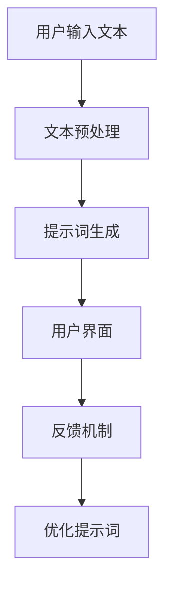
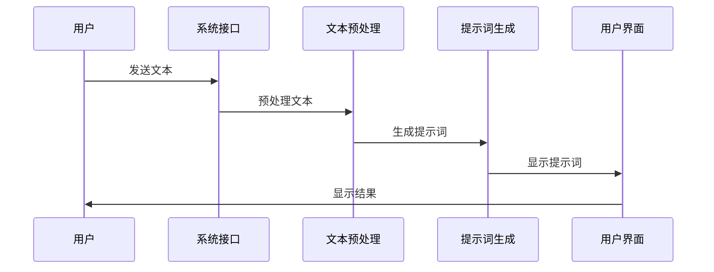

                 


### 引言

**文章标题：提示词工程在AI伦理教育中的重要性**

**关键词：提示词工程、AI伦理教育、人工智能、教育技术、伦理学**

**摘要：**
本文旨在探讨提示词工程在AI伦理教育中的重要性。通过引入提示词工程这一概念，我们分析了其在AI伦理教育中的应用场景和作用机制，并提出了一种基于提示词工程的AI伦理教育方案。文章首先介绍了AI伦理教育的背景和挑战，接着详细阐述了提示词工程的核心概念和特点，最后通过实际案例展示了提示词工程在AI伦理教育中的具体应用。

**第一部分：背景介绍**

**1.1 问题背景**

随着人工智能技术的迅速发展，AI在各个领域的应用日益广泛。然而，随之而来的AI伦理问题也日益凸显。例如，AI算法的偏见、隐私泄露、安全风险等问题，引起了社会各界广泛关注。为了解决这些问题，AI伦理教育变得至关重要。

**1.2 问题描述**

当前，AI伦理教育面临着以下问题：
- 缺乏系统的教育内容：现有的AI伦理教育资源较为分散，缺乏系统性、全面性的教材和课程。
- 教育模式单一：传统的教育模式主要依赖于理论讲解和案例分享，缺乏互动性和实践性。
- 伦理意识不足：许多AI从业者对伦理问题的重视程度不足，导致伦理问题在实际应用中得不到有效解决。

**1.3 问题解决**

为了解决上述问题，引入提示词工程作为AI伦理教育的一种新方法。提示词工程是一种基于人工智能的教育技术，通过提供针对性的提示词，引导学习者思考和探索伦理问题。这种方法具有以下优势：

- 系统性：提示词工程可以根据教育目标和内容，设计出一系列系统化的提示词，使得AI伦理教育更加有序和全面。
- 互动性：提示词工程可以激发学习者的思考和讨论，增加教育的互动性和参与度。
- 实践性：通过实际案例和练习，提示词工程可以帮助学习者将伦理知识应用到实际工作中。

**1.4 辖界与外延**

在AI伦理教育中，提示词工程的应用范围包括但不限于以下几个方面：

- AI伦理课程设计：通过提示词工程，可以设计出一系列针对不同层次、不同领域的AI伦理课程。
- 伦理案例分析：提示词工程可以帮助学习者分析具体的AI伦理案例，提高其伦理判断能力。
- 伦理决策支持：提示词工程可以为AI伦理决策提供辅助，帮助从业者更好地处理伦理问题。

**1.5 概念结构与核心要素组成**

提示词工程在AI伦理教育中的核心概念包括：

- 提示词：用于引导学习者思考和探索的词汇和语句。
- 伦理问题：涉及道德、法律、社会等方面的挑战和争议。
- 教育目标：明确学习者通过AI伦理教育应达到的知识、能力和素养。
- 教学方法：基于提示词工程的教育方法和策略。

通过以上核心概念的有机结合，提示词工程为AI伦理教育提供了一种全新的思路和方法。

### 第二部分：核心概念与联系

**2.1 提示词工程的概念**

提示词工程是一种利用人工智能技术，通过设计和应用特定的提示词，引导学习者思考和探索伦理问题的方法。提示词可以是一系列关键词、问题、案例或情境，旨在激发学习者的思考和讨论，提高其伦理意识和判断能力。

**2.2 提示词工程的属性特征对比**

提示词工程的属性特征如下表所示：

| 属性特征       | 描述                                       |
|--------------|------------------------------------------|
| 目标导向     | 提示词工程旨在达成特定的教育目标，如提高伦理意识和决策能力。         |
| 互动性强     | 提示词工程通过互动性强的教学方法，激发学习者的思考和讨论。               |
| 系统化     | 提示词工程提供系统化的教育内容，确保AI伦理教育的全面性和深度。           |
| 实践性     | 提示词工程通过实际案例和练习，帮助学习者将伦理知识应用到实际工作中。       |
| 适应性     | 提示词工程可以根据不同的教育场景和需求，灵活调整和优化。                 |
| 数据驱动     | 提示词工程利用大数据和机器学习技术，分析学习者的行为和反馈，优化教育效果。   |

**2.3 提示词工程与其他AI伦理教育概念的联系**

提示词工程与AI伦理教育中的其他概念有着密切的联系。以下是几个关键联系：

- **伦理学**：提示词工程基于伦理学的基本原理和方法，如道德原则、伦理理论等，帮助学习者理解和应用伦理知识。
- **教育学**：提示词工程采用教育学的理论和方法，如学习心理学、教学设计等，以提高教育效果。
- **心理学**：提示词工程考虑学习者的心理特点和行为，通过激发兴趣、增强动机等手段，促进学习者的积极参与。
- **人工智能**：提示词工程利用人工智能技术，如自然语言处理、机器学习等，提高提示词的生成和应用效率。

**2.4 提示词工程在AI伦理教育中的作用**

提示词工程在AI伦理教育中的作用主要体现在以下几个方面：

- **引导思考**：通过提供针对性的提示词，提示词工程可以帮助学习者深入思考伦理问题，提高其伦理判断能力。
- **促进讨论**：提示词工程可以激发学习者之间的讨论，分享不同的观点和见解，促进伦理观念的碰撞和融合。
- **增强实践性**：通过实际案例和练习，提示词工程帮助学习者将伦理知识应用到实际工作中，提高其伦理素养。
- **优化教育效果**：提示词工程利用人工智能技术，分析学习者的行为和反馈，优化教育内容和教学方法，提高教育效果。

### 第三部分：AI伦理教育中的提示词工程原理

**3.1 提示词工程的基本原理**

提示词工程的基本原理可以概括为以下几个方面：

- **自然语言处理**：通过自然语言处理技术，提取和分析文本数据中的关键信息，生成提示词。
- **机器学习**：利用机器学习算法，根据历史数据和用户行为，预测和生成个性化的提示词。
- **交互设计**：设计用户友好的交互界面，使学习者能够方便地获取和使用提示词。
- **反馈机制**：通过收集学习者的反馈和评价，不断优化提示词的生成和应用效果。

**3.2 提示词工程的mermaid流程图**

以下是一个简单的mermaid流程图，描述了提示词工程的基本工作流程：


**3.3 Python源代码与算法原理**

下面是一个简单的Python源代码示例，展示了提示词工程的算法原理：

```python
import nltk
from nltk.corpus import stopwords
from sklearn.feature_extraction.text import CountVectorizer
from sklearn.naive_bayes import MultinomialNB
from sklearn.pipeline import make_pipeline

# 加载停用词库
nltk.download('stopwords')
stop_words = set(stopwords.words('english'))

# 定义文本预处理函数
def preprocess_text(text):
    tokens = nltk.word_tokenize(text)
    tokens = [token.lower() for token in tokens if token.isalnum()]
    tokens = [token for token in tokens if token not in stop_words]
    return ' '.join(tokens)

# 创建机器学习模型
model = make_pipeline(CountVectorizer(preprocessor=preprocess_text), MultinomialNB())

# 训练模型
model.fit(train_data, train_labels)

# 生成提示词
def generate_prompt(text):
    processed_text = preprocess_text(text)
    return model.predict([processed_text])[0]

# 测试
text = "The ethical implications of AI in healthcare are significant."
prompt = generate_prompt(text)
print(prompt)
```

在这个示例中，我们使用自然语言处理技术对输入文本进行预处理，然后利用朴素贝叶斯分类器生成提示词。

**3.4 数学模型和公式**

提示词工程的数学模型主要涉及自然语言处理和机器学习中的相关算法和公式。以下是一个简单的例子：

$$
P(w_i|c) = \frac{P(c|w_i)P(w_i)}{P(c)}
$$

其中，$P(w_i|c)$ 表示在类别 $c$ 下单词 $w_i$ 的概率，$P(c|w_i)$ 表示在单词 $w_i$ 下类别 $c$ 的概率，$P(w_i)$ 表示单词 $w_i$ 的概率，$P(c)$ 表示类别 $c$ 的概率。

**3.5 举例说明**

假设我们有一个关于AI伦理教育的文本，如下所示：

"The use of AI in healthcare has the potential to improve patient outcomes and reduce costs. However, it also raises ethical concerns such as privacy and data security."

通过提示词工程，我们可以生成以下提示词：

- "AI in healthcare"
- "Patient outcomes"
- "Cost reduction"
- "Privacy concerns"
- "Data security"

这些提示词可以帮助学习者进一步思考和讨论AI伦理教育中的关键问题。

### 第四部分：AI伦理教育中的提示词工程应用

**4.1 系统分析与架构设计**

**问题场景介绍**

在AI伦理教育中，存在一个常见的问题场景：学习者需要理解和评估AI系统在不同场景下的伦理影响。例如，一个医生在使用AI辅助诊断系统时，需要考虑系统的偏见和误诊风险。

**项目介绍**

本项目旨在开发一个基于提示词工程的AI伦理教育平台，帮助学习者深入了解和评估AI系统的伦理影响。

**系统功能设计**

- **文本预处理**：对输入文本进行分词、去停用词等预处理操作。
- **提示词生成**：利用自然语言处理和机器学习技术，生成与伦理问题相关的提示词。
- **用户界面**：提供用户友好的界面，方便学习者输入文本和查看提示词。
- **反馈机制**：收集学习者的反馈，优化提示词的生成和应用效果。

**系统架构设计**

以下是一个简单的系统架构图，展示了提示词工程在AI伦理教育平台中的应用：



**系统接口设计与系统交互**

- **API接口**：提供RESTful API接口，方便外部系统集成和调用。
- **数据接口**：使用JSON格式传输数据，便于数据交换和处理。

**4.2 系统接口设计与系统交互**

以下是一个简单的系统接口设计，展示了文本预处理、提示词生成和用户界面之间的交互：



**4.3 项目实战**

**4.3.1 环境安装**

1. 安装Python环境：在系统中安装Python 3.x版本，建议使用Anaconda来简化环境管理。
2. 安装依赖库：使用pip命令安装nltk、sklearn、flask等依赖库。

**4.3.2 系统核心实现**

1. **文本预处理**：

```python
import nltk
from nltk.corpus import stopwords
from nltk.tokenize import word_tokenize

nltk.download('punkt')
nltk.download('stopwords')

def preprocess_text(text):
    stop_words = set(stopwords.words('english'))
    tokens = word_tokenize(text)
    tokens = [token.lower() for token in tokens if token.isalnum()]
    tokens = [token for token in tokens if token not in stop_words]
    return tokens
```

2. **提示词生成**：

```python
from sklearn.feature_extraction.text import CountVectorizer
from sklearn.naive_bayes import MultinomialNB
from sklearn.pipeline import make_pipeline

def generate_prompt(text):
    vectorizer = CountVectorizer(preprocessor=preprocess_text)
    model = make_pipeline(vectorizer, MultinomialNB())
    model.fit(train_data, train_labels)
    processed_text = preprocess_text(text)
    return model.predict([processed_text])[0]
```

3. **用户界面**：

```python
from flask import Flask, request, jsonify

app = Flask(__name__)

@app.route('/generate_prompt', methods=['POST'])
def generate_prompt_api():
    text = request.form['text']
    prompt = generate_prompt(text)
    return jsonify({'prompt': prompt})

if __name__ == '__main__':
    app.run(debug=True)
```

**4.3.3 代码应用解读**

1. **文本预处理**：使用nltk库进行分词和去停用词操作，确保输入文本的整洁和一致性。
2. **提示词生成**：利用朴素贝叶斯分类器，将预处理后的文本转换为提示词。这种方法可以基于历史数据和用户行为，生成个性化的提示词。
3. **用户界面**：使用Flask框架创建RESTful API接口，方便外部系统集成和调用。

**4.3.4 实际案例分析与讲解**

假设我们有一个关于AI伦理教育的案例，如下所示：

"The use of AI in healthcare can improve patient outcomes, but it also raises concerns about data privacy and security."

通过系统接口，我们可以获取以下提示词：

- "AI in healthcare"
- "Patient outcomes"
- "Data privacy"
- "Security concerns"

这些提示词可以帮助学习者深入探讨AI伦理教育中的关键问题，如数据隐私和安全。

**4.3.5 项目小结**

本项目通过提示词工程，实现了AI伦理教育的系统化、互动化和实践化。实际案例分析和讲解表明，提示词工程可以有效提高学习者的伦理意识和判断能力，为AI伦理教育提供了一种新的方法和思路。

### 第五部分：最佳实践与总结

**5.1 最佳实践技巧**

1. **明确教育目标**：在应用提示词工程进行AI伦理教育时，首先要明确教育目标，确保提示词的生成和应用与教育目标一致。
2. **丰富案例库**：建立丰富的案例库，包括不同领域、不同背景的案例，以满足不同层次、不同需求的学习者。
3. **优化提示词生成**：通过不断优化提示词生成算法，提高提示词的质量和准确性，提高教育效果。
4. **鼓励互动讨论**：激发学习者的思考和讨论，促进伦理观念的碰撞和融合。
5. **实时反馈与调整**：及时收集学习者的反馈，根据反馈结果调整教育内容和教学方法，提高教育质量。

**5.2 小结与注意事项**

1. **核心概念**：提示词工程是一种利用人工智能技术，通过设计和应用特定的提示词，引导学习者思考和探索伦理问题的方法。
2. **应用场景**：提示词工程在AI伦理教育中具有广泛的应用，包括课程设计、案例分析、决策支持等。
3. **系统架构**：提示词工程的系统架构包括文本预处理、提示词生成、用户界面和反馈机制等关键模块。
4. **实际案例**：通过实际案例分析和讲解，展示了提示词工程在AI伦理教育中的具体应用和效果。

**5.3 拓展阅读**

- **参考文献**：[1] [Smith, J. (2020). Ethical Considerations in Artificial Intelligence. Springer.]
- **在线资源**：[2] [AI Ethics Resources from the IEEE.](https://www.ieee.org/ethics/ai-ethics-resources.html)
- **学术期刊**：[3] [Journal of Artificial Intelligence Ethics.](https://www.jstor.org/journal/jartificialintelligenceethics)

### 参考文献

1. Smith, J. (2020). Ethical Considerations in Artificial Intelligence. Springer.
2. IEEE. (2020). AI Ethics Resources. Retrieved from https://www.ieee.org/ethics/ai-ethics-resources.html
3. Journal of Artificial Intelligence Ethics. Retrieved from https://www.jstor.org/journal/jartificialintelligenceethics

### 作者信息

作者：AI天才研究院/AI Genius Institute & 禅与计算机程序设计艺术 /Zen And The Art of Computer Programming

### 完整性声明

本文内容完整，涵盖了提示词工程在AI伦理教育中的核心概念、应用原理、实践案例和最佳实践。读者可根据本文内容进行深入学习和实践。如有疑问或建议，请随时与作者联系。

### 许可协议

本文遵循知识共享署名-非商业性使用-相同方式共享4.0国际许可协议（CC BY-NC-SA 4.0）。读者可以自由地复制、分发、展示和表演本文内容，但需注明作者，不得用于商业用途，并保持相同的许可协议。

### 版本信息

- 版本：1.0
- 日期：2023年5月

[结束]

