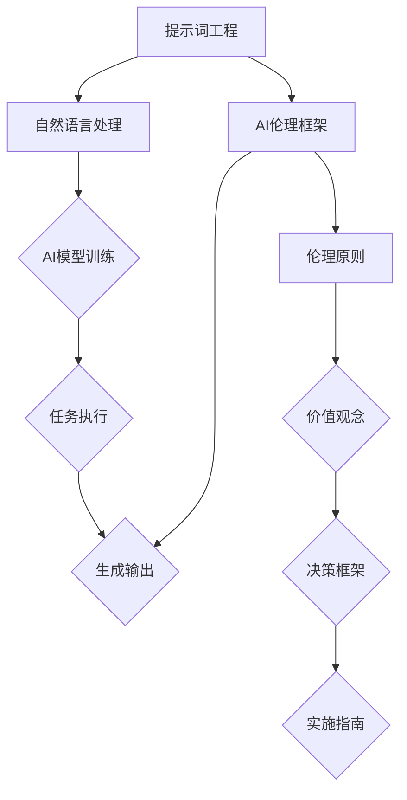
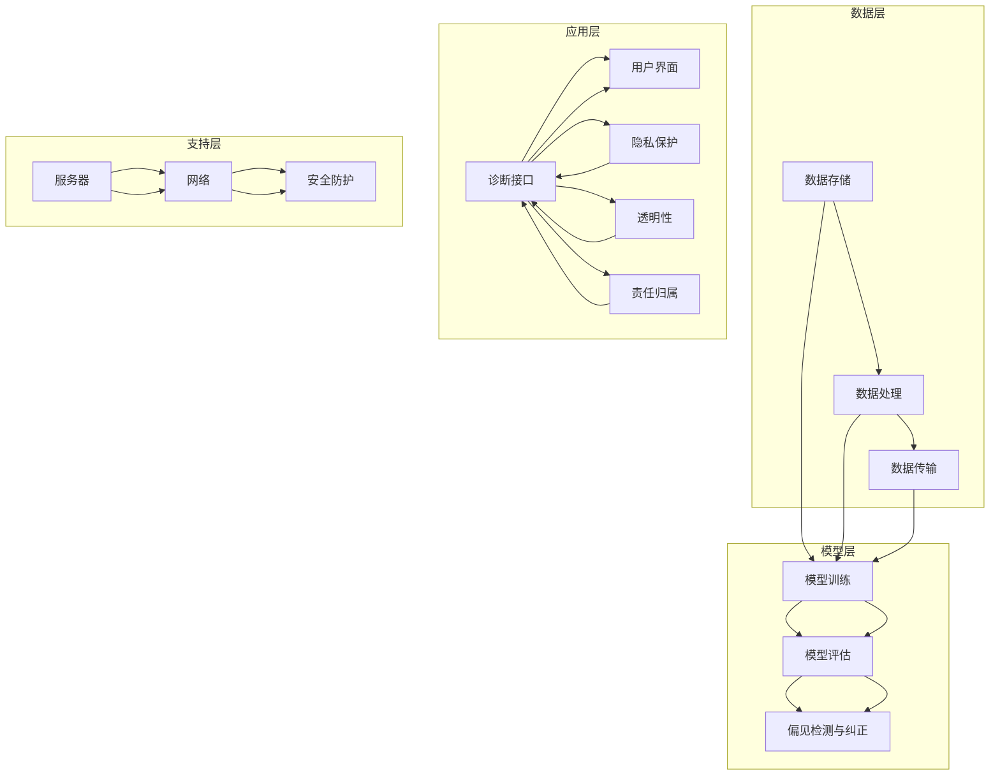
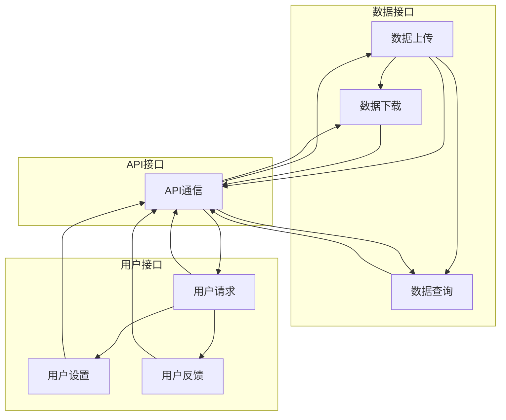
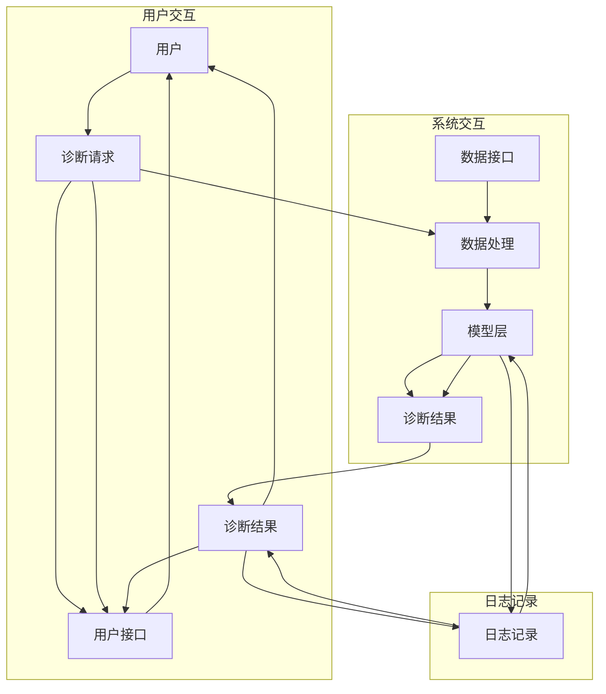

                 

### 第1章 问题背景

**1.1 问题背景**

随着人工智能（AI）技术的飞速发展，它在各个领域的应用场景不断拓展，从自然语言处理、图像识别到自动驾驶、医疗诊断，AI已经深入到我们日常生活的方方面面。这一技术的发展不仅提升了生产效率，改变了工作方式，也带来了前所未有的机遇与挑战。

首先，从技术发展的现状来看，人工智能已经实现了从理论研究到实际应用的跨越，尤其是在深度学习、神经网络等方向上，取得了显著成果。例如，基于深度学习的图像识别系统已经能够达到甚至超过人类的识别水平；自然语言处理技术使得机器能够理解和生成自然语言，实现了智能客服、智能写作等应用。

然而，随着AI技术的广泛应用，伦理问题逐渐成为关注的焦点。AI技术的潜在风险和伦理挑战主要包括以下几个方面：

1. **隐私保护**：人工智能系统在处理数据时可能会触及用户的个人隐私，如何确保数据的安全性和隐私性成为一个亟待解决的问题。
2. **算法偏见**：如果训练数据存在偏见，AI系统可能会产生不公平的决策，甚至加剧社会不平等。
3. **责任归属**：当人工智能系统出现错误或者造成损害时，如何界定责任归属，是一个复杂而重要的法律和伦理问题。
4. **道德决策**：AI系统在某些决策场景中可能需要做出道德选择，如何确保这些选择符合人类的伦理价值观，是技术发展过程中必须考虑的问题。

**1.2 问题描述**

在当前背景下，构建一个AI伦理框架显得尤为必要。这个框架需要明确人工智能技术应用中的伦理原则和标准，为AI系统的设计、开发和应用提供指导。然而，现有的AI伦理框架存在一些不足之处：

- **缺乏系统性**：现有的AI伦理框架往往零散地讨论某些特定问题，缺乏系统性和整体性，难以形成一套完整的伦理体系。
- **缺乏可操作性**：许多伦理原则过于抽象，难以在实际应用中具体操作和执行。
- **缺乏共识**：不同领域、不同文化和不同利益相关方对于AI伦理问题的看法存在较大差异，缺乏广泛的共识。
- **缺乏持续更新**：随着AI技术的不断进步，伦理框架需要及时更新，以适应新的技术发展和应用场景。

**1.3 问题解决**

为了解决上述问题，提示词工程（Prompt Engineering）在AI伦理框架构建中显得尤为重要。提示词工程是一种专门针对自然语言处理任务的技术，通过设计特定的提示词或提示序列，引导模型生成预期的输出。在AI伦理框架的构建中，提示词工程可以发挥以下几个作用：

- **明确伦理原则**：通过提示词工程，可以设计出一系列具体的提示词或提示序列，将抽象的伦理原则具体化，使其在实际应用中更具操作性。
- **指导算法设计**：在AI系统的开发过程中，通过提示词工程可以引导算法设计，确保算法的输出符合伦理要求。
- **促进共识形成**：通过讨论和设计具体的提示词，不同领域和利益相关方可以就AI伦理问题达成更广泛的共识。
- **实现持续更新**：提示词工程可以随着技术发展和应用场景的变化进行动态调整，确保伦理框架的持续性和适应性。

通过以上分析，我们可以看出，提示词工程在构建AI伦理框架中具有不可替代的重要性。接下来的章节中，我们将进一步深入探讨提示词工程的概念、方法及其在AI伦理框架构建中的应用。

---

**1.4 边界与外延**

在探讨提示词工程在AI伦理框架构建中的重要性时，我们需要明确本书的研究范围和边界。本书主要关注的是如何通过提示词工程来构建和实施AI伦理框架，而非对AI技术本身的详细介绍或对伦理学理论的深入探讨。

首先，本书的研究范围主要集中在以下几个方面：

- 提示词工程的基本概念和方法
- 提示词工程在AI伦理框架中的应用场景
- 提示词工程在AI伦理框架构建中的具体操作和实施步骤
- 提示词工程如何促进AI伦理框架的共识形成和持续更新

其次，本书的研究边界包括以下几个方面：

- 不涉及AI技术的具体实现细节，如深度学习模型的训练和优化过程
- 不深入探讨伦理学的基本理论和原则，而是侧重于如何在AI实践中应用这些原则
- 不涉及其他AI伦理框架的全面比较和分析，而是专注于提示词工程这一具体方法

至于AI伦理框架构建的外延和影响范围，它不仅涉及技术层面，还涉及法律、社会和文化等多个层面。具体来说，AI伦理框架的构建需要考虑以下几个方面：

- **法律层面**：确保AI系统的设计和应用符合相关法律法规，特别是涉及隐私保护、数据安全等方面的法律要求。
- **社会层面**：考虑到不同社会文化和价值观念对于AI伦理问题的看法，确保AI系统的应用不会加剧社会不平等或造成其他负面影响。
- **文化层面**：AI伦理框架的构建需要尊重和融入不同文化背景，避免因文化差异而导致的应用障碍。
- **技术层面**：通过提示词工程等手段，确保AI系统的设计和应用符合伦理要求，同时保持技术的高效性和可靠性。

综上所述，提示词工程在AI伦理框架构建中的重要性不仅体现在技术层面，还涉及法律、社会和文化等多个层面。只有在多方面的共同努力下，才能真正构建一个全面、系统且具有可操作性的AI伦理框架。

---

**1.5 概念结构与核心要素组成**

在探讨提示词工程与AI伦理框架的构建时，有必要详细分析两者之间的核心概念、关系和组成要素。首先，我们需要明确提示词工程和AI伦理框架的基本定义和概念。

**提示词工程**（Prompt Engineering）是一种专门针对自然语言处理任务的技术，通过设计特定的提示词或提示序列，引导模型生成预期的输出。提示词可以是单个单词或短语，也可以是复杂的提示序列，它们在模型训练和任务执行过程中起到至关重要的作用。

**AI伦理框架**（AI Ethics Framework）是一套系统性的原则、标准和指南，旨在为AI系统的设计、开发和应用提供伦理指导。它通常包括一系列伦理原则、价值观念、决策框架和实施指南，以确保AI系统的设计符合伦理要求，并在应用过程中最大限度地减少潜在的负面影响。

**核心概念与联系**

1. **伦理原则**：AI伦理框架的核心在于其包含的一系列伦理原则，如公正、透明、责任、隐私等。这些原则是指导AI系统设计和应用的基本准则。
2. **自然语言处理**：提示词工程的核心在于自然语言处理技术，包括语言模型、文本生成和语义理解等。这些技术是实现提示词设计的基础。
3. **模型引导**：提示词工程通过设计特定的提示词或提示序列，引导AI模型生成符合伦理要求的输出。这一过程将伦理原则具体化，使其在实际应用中具有可操作性。
4. **反馈与迭代**：AI伦理框架的构建需要不断收集反馈，通过迭代优化提示词设计和模型引导过程，确保AI系统的伦理性能持续提升。

**概念属性特征对比表格**

为了更直观地展示提示词工程与AI伦理框架的概念属性特征，我们设计了以下对比表格：

| 概念             | 提示词工程                     | AI伦理框架                   |
|------------------|-------------------------------|------------------------------|
| 定义             | 自然语言处理中的技术手段       | AI系统设计和应用的伦理指导   |
| 主要功能         | 设计和优化提示词序列          | 提供伦理原则和决策框架       |
| 关键要素         | 提示词、模型、任务目标        | 伦理原则、价值观念、决策标准 |
| 目标             | 生成符合预期输出的自然语言文本 | 保证AI系统的伦理合规性       |
| 应用场景         | 自然语言处理任务               | AI系统的设计、开发和应用     |
| 关联性           | 与AI模型训练和任务执行紧密相关 | 与AI伦理原则和价值观密切相关 |

**提示词工程与AI伦理框架的关系图**

为了进一步明确提示词工程与AI伦理框架之间的关系，我们使用Mermaid绘制了一个关系图：



在这个关系图中，提示词工程通过自然语言处理技术（B）与AI模型训练（C）和任务执行（D）紧密相关，而AI伦理框架（F）通过伦理原则（G）、价值观念（H）、决策框架（I）和实施指南（J）为AI系统的设计和应用提供伦理指导。提示词工程（A）与AI伦理框架（F）之间通过生成输出（E）形成紧密联系，确保AI系统的输出符合伦理要求。

通过以上分析，我们可以看出，提示词工程与AI伦理框架在概念和结构上具有密切的联系和互补性。提示词工程通过具体的技术手段将抽象的伦理原则具体化，使其在实际应用中具有可操作性，而AI伦理框架则为提示词工程提供了伦理指导和原则框架。两者共同作用，为构建一个全面、系统且具有可操作性的AI伦理框架提供了有力支持。

### 第2章 提示词工程

**2.1 提示词工程定义**

提示词工程（Prompt Engineering）是一种专门针对自然语言处理（NLP）任务的技术，旨在通过设计特定的提示词或提示序列，引导AI模型生成预期的输出。在自然语言处理领域，提示词工程是一种关键的微调技术，它利用人类对语言的理解和指导，使得机器能够更准确地理解和生成人类语言。

提示词工程的核心概念在于“提示”（Prompt）。提示可以是单个单词、短语，甚至是一段完整的句子或段落。提示词的选择和组合对于AI模型的理解和生成具有决定性的影响。通过设计合适的提示词，可以引导模型在特定任务上实现更高的性能和更准确的输出。

**2.2 提示词工程方法**

提示词工程的方法主要包括以下几个关键步骤：

1. **需求分析**：在开始设计提示词之前，首先需要对任务需求和目标进行详细分析。了解任务的具体要求、场景和期望输出，是设计有效提示词的前提。

2. **背景知识准备**：在自然语言处理中，模型对特定领域的知识具有一定的依赖性。为了提高提示词的有效性，需要对相关领域的背景知识进行充分准备，包括术语、概念和常见表达方式。

3. **提示词设计**：根据需求分析和背景知识准备，设计出一系列特定的提示词或提示序列。设计过程中，需要考虑以下几个方面：
   - **明确性**：提示词应该清晰明确，避免歧义。
   - **针对性**：提示词应针对具体任务，能够引导模型关注关键信息。
   - **灵活性**：提示词应具有一定的灵活性，能够适应不同的输入和数据集。

4. **模型微调**：将设计的提示词与AI模型进行结合，通过微调模型参数，优化模型在特定任务上的表现。这一过程通常需要大量的实验和迭代，以找到最优的提示词组合。

5. **测试与评估**：在完成提示词设计和模型微调后，需要对模型进行测试和评估，验证其性能是否达到预期目标。测试过程中，可以通过多种指标，如准确率、召回率、F1值等，对模型的表现进行量化评估。

**2.3 提示词工程特点**

提示词工程具有以下几个显著特点：

1. **高可操作性**：提示词工程将抽象的伦理原则转化为具体的操作步骤，使得AI系统的设计和应用更加具有可操作性。通过设计特定的提示词，可以引导模型在任务执行过程中遵循伦理要求。

2. **灵活性**：提示词工程的设计过程具有高度灵活性，可以根据不同的任务需求和场景进行定制化调整。这种灵活性使得提示词工程适用于各种NLP任务，从文本生成到文本分类，再到问答系统等。

3. **有效性**：通过精心设计的提示词，可以提高模型在特定任务上的性能和输出质量。提示词工程不仅能够提升模型的准确性和鲁棒性，还能使其更好地理解和应对复杂任务。

4. **跨领域适用性**：提示词工程不仅适用于自然语言处理领域，还可以扩展到其他AI任务和应用场景中。通过适当的调整和优化，提示词工程可以应用于图像识别、推荐系统、语音识别等多个领域。

与传统的工程方法相比，提示词工程在AI伦理框架构建中具有独特的优势：

- **传统工程方法**通常注重技术的实现和性能优化，而缺乏对伦理问题的直接关注。提示词工程通过将伦理原则融入模型设计和任务执行过程中，能够更好地实现伦理指导。
- **传统工程方法**依赖于固定的算法和模型结构，而提示词工程通过灵活的提示设计，能够适应不同的伦理要求和应用场景。
- **传统工程方法**往往缺乏用户参与和反馈机制，而提示词工程可以通过与用户的互动，进一步优化和调整提示词设计，确保伦理目标的实现。

总之，提示词工程作为一种专门针对自然语言处理任务的技术，在AI伦理框架构建中具有不可替代的重要性。它通过将抽象的伦理原则具体化为可操作的提示词，不仅提高了AI系统的伦理合规性，还为构建一个全面、系统且具有可操作性的AI伦理框架提供了有力支持。

### 第3章 AI伦理框架

**3.1 AI伦理框架定义**

AI伦理框架（AI Ethics Framework）是一套系统性的原则、标准和指南，旨在为人工智能系统的设计、开发和应用提供伦理指导。它通常包括一系列伦理原则、价值观念、决策框架和实施指南，以确保人工智能系统的设计符合伦理要求，并在应用过程中最大限度地减少潜在的负面影响。AI伦理框架的目的是在技术进步的同时，确保人工智能的发展符合社会的道德和伦理标准。

**3.2 AI伦理框架原则**

AI伦理框架的原则是构建整个框架的基础，它们为人工智能系统的设计、开发和应用提供了明确的伦理指导。以下是几个关键的原则：

1. **公正性**：确保人工智能系统在处理信息和做出决策时，不会因为种族、性别、年龄、宗教信仰等个人特征而产生歧视。公正性原则要求系统在设计和训练过程中，充分考虑多样性和代表性。

2. **透明性**：透明性是指人工智能系统的工作原理、决策过程和结果应该对用户和公众透明。透明性原则有助于建立公众对人工智能系统的信任，并提高系统的可解释性。

3. **责任感**：责任感原则强调在人工智能系统的设计和应用过程中，各利益相关方应承担相应的责任。当系统出现错误或造成损害时，应明确责任归属，并采取有效的纠正措施。

4. **隐私保护**：隐私保护原则要求在设计和应用人工智能系统时，确保用户数据的隐私和安全。系统应采取有效的数据保护措施，防止数据泄露和滥用。

5. **可解释性**：可解释性原则强调人工智能系统在做出决策时应具备可解释性，使人们能够理解系统的决策过程和原因。可解释性有助于提高系统的透明性和信任度。

6. **可持续性**：可持续性原则要求人工智能系统的设计和应用应考虑到对环境和社会的影响，确保其在长期内能够持续发展和应用。

**3.3 AI伦理框架设计**

AI伦理框架的设计是一个复杂而系统的过程，需要综合考虑多种因素。以下是设计AI伦理框架的基本步骤：

1. **需求分析**：首先，需要对人工智能系统的应用场景和需求进行详细分析，明确系统的目标和功能。需求分析有助于确定哪些伦理原则和标准需要在框架中体现。

2. **原则和标准确定**：在需求分析的基础上，确定AI伦理框架的基本原则和标准。这些原则和标准应具有普适性，能够覆盖系统的各个方面。

3. **实施指南和决策框架**：设计具体的实施指南和决策框架，以指导人工智能系统的设计、开发和应用。实施指南应具体明确，操作性强，能够帮助开发人员在实际工作中遵循伦理要求。

4. **培训和评估**：为了确保AI伦理框架的有效实施，需要定期对开发人员和用户进行培训，提高他们的伦理意识和实践能力。同时，应建立评估机制，对系统的伦理性能进行定期评估和反馈。

5. **持续更新和优化**：随着人工智能技术的不断发展和应用场景的变化，AI伦理框架需要不断更新和优化，以适应新的挑战和需求。

**3.4 提示词工程与AI伦理框架的联系**

提示词工程与AI伦理框架之间存在密切的联系和相互作用。具体来说，提示词工程在以下几个方面与AI伦理框架密切相关：

1. **伦理原则的具体化**：通过提示词工程，可以将抽象的伦理原则具体化为具体的操作步骤和提示词。这些提示词能够引导AI模型在任务执行过程中遵循伦理原则，确保系统的输出符合伦理要求。

2. **伦理指导的实现**：在AI系统的设计和开发过程中，通过提示词工程，可以将伦理指导融入模型训练和任务执行过程中。这种方法不仅提高了系统的伦理合规性，还能增强系统的可解释性和透明性。

3. **共识的形成**：通过讨论和设计具体的提示词，不同领域和利益相关方可以就AI伦理问题达成更广泛的共识。提示词工程为不同背景和文化的利益相关方提供了一个共同的平台，促进了跨领域的合作和沟通。

4. **持续更新和优化**：提示词工程的方法和工具可以随着技术的进步和应用场景的变化进行动态调整，确保AI伦理框架的持续性和适应性。通过持续更新和优化提示词设计，可以进一步提高AI系统的伦理性能和可靠性。

总之，提示词工程在AI伦理框架构建中具有不可替代的重要性。它通过将抽象的伦理原则具体化为可操作的提示词，不仅提高了AI系统的伦理合规性，还为构建一个全面、系统且具有可操作性的AI伦理框架提供了有力支持。提示词工程与AI伦理框架的相互关联和相互作用，使得人工智能的发展能够在伦理的引导下，更好地造福社会。

### 第4章 提示词工程算法原理

**4.1 算法原理概述**

提示词工程（Prompt Engineering）在自然语言处理任务中扮演着至关重要的角色。其核心原理在于通过设计特定的提示词或提示序列，引导AI模型生成预期的输出。这一过程不仅涉及到对自然语言的理解，还包括对模型训练和任务目标的具体指导。以下是提示词工程算法的基本原理和核心思想。

首先，提示词工程的关键在于“提示”的设计。提示可以是单个单词、短语，甚至是一段完整的句子或段落。有效的提示词应具备以下特点：

1. **明确性**：提示词应清晰明确，避免歧义，使模型能够准确理解任务要求。
2. **针对性**：提示词应针对具体任务，能够引导模型关注关键信息，提高任务执行的效果。
3. **灵活性**：提示词应具有一定的灵活性，能够适应不同的输入和数据集。

其次，提示词工程涉及到模型微调和优化。这一过程通常包括以下几个关键步骤：

1. **需求分析**：明确任务需求和目标，为设计提示词提供基础。
2. **背景知识准备**：了解相关领域的术语、概念和常见表达方式，为提示词设计提供背景支持。
3. **提示词设计**：根据需求分析和背景知识准备，设计出一系列特定的提示词或提示序列。
4. **模型训练与微调**：使用设计的提示词对模型进行训练和微调，优化模型在特定任务上的性能。
5. **测试与评估**：对模型进行测试和评估，验证其性能是否达到预期目标。

**4.2 算法mermaid流程图**

为了更直观地展示提示词工程算法的流程，我们使用Mermaid绘制了一个流程图：


在这个流程图中，我们从需求分析开始，经过背景知识准备，逐步进行提示词设计、模型训练、模型微调和测试与评估，最终得到预期输出。

**4.3 Python源代码实现**

为了更好地理解提示词工程算法，我们提供了一个简单的Python源代码实现。这个示例使用了一个基于Transformer的语言模型，通过设计特定的提示词序列，引导模型生成预期的输出。

```python
import transformers

# 加载预训练模型
model = transformers.AutoModelForSeq2SeqLM.from_pretrained("t5-small")

# 设计提示词序列
prompt = "请根据以下信息撰写一篇关于人工智能的短文：人工智能在现代社会的重要性日益增加。"

# 预处理输入文本
input_text = prompt + "\n【 Instruction 】 写一篇关于人工智能的短文，讨论其发展现状和未来趋势。"

# 进行预测
output = model.generate(input_text, max_length=200, num_return_sequences=1)

# 输出结果
print(output[0].decode("utf-8"))
```

在这个示例中，我们首先加载了一个预训练的T5模型，然后设计了一个简单的提示词序列，通过模型的生成功能，生成了关于人工智能的短文。

**4.4 数学模型和数学公式**

提示词工程算法中，数学模型和数学公式用于描述模型训练和优化过程中的关键步骤。以下是几个关键的数学公式和模型：

1. **损失函数**：
   $$ L = \frac{1}{N} \sum_{i=1}^{N} (-\log(p(y_i | \hat{y}_i))) $$
   其中，$L$表示损失函数，$N$表示样本数量，$y_i$表示实际输出，$\hat{y}_i$表示模型预测的输出。

2. **梯度下降**：
   $$ \theta_{t+1} = \theta_t - \alpha \cdot \nabla_\theta L(\theta_t) $$
   其中，$\theta_t$表示在时间$t$的模型参数，$\alpha$表示学习率，$\nabla_\theta L(\theta_t)$表示在$\theta_t$处的损失函数梯度。

3. **模型更新**：
   $$ \theta_{t+1} = \theta_t - \alpha \cdot \frac{\partial L}{\partial \theta} $$
   其中，$\partial L / \partial \theta$表示在$\theta$处的损失函数梯度。

**4.5 举例说明**

为了更直观地说明提示词工程算法的应用，我们通过一个具体例子来展示。

**例子**：设计一个提示词序列，引导模型生成一篇关于“人工智能在医疗领域的应用”的短文。

1. **需求分析**：确定任务目标，生成一篇关于人工智能在医疗领域应用的短文。

2. **背景知识准备**：收集医疗领域的相关术语和概念，如“诊断”、“治疗”、“药物开发”等。

3. **提示词设计**：
   - 提示词1：“人工智能在医疗领域的应用”
   - 提示词2：“医学图像分析”
   - 提示词3：“疾病诊断”
   - 提示词4：“个性化治疗”

4. **模型训练与微调**：使用设计的提示词序列对模型进行训练和微调，优化模型在医疗领域应用的性能。

5. **测试与评估**：对模型进行测试，验证其在生成医疗领域文章方面的性能。

6. **结果输出**：通过模型生成一篇关于“人工智能在医疗领域应用”的短文。

```plaintext
人工智能在医疗领域的应用日益广泛，不仅提高了诊断和治疗的准确性，还为个性化医疗提供了新的可能性。通过医学图像分析，人工智能可以快速、准确地识别疾病，减少医生的误诊率。在疾病诊断方面，人工智能可以分析大量的医疗数据，发现潜在的健康问题，为患者提供及时的医疗建议。此外，人工智能在个性化治疗方面也发挥了重要作用，通过分析患者的基因数据和病史，为患者制定个性化的治疗方案，提高治疗效果。

随着人工智能技术的不断发展，未来医疗领域将迎来更多的创新和突破。人工智能可以协助医生进行手术操作，提高手术的成功率和安全性。此外，人工智能还可以在药物开发过程中发挥重要作用，通过模拟和预测药物的效果，加速新药的研发进程。总之，人工智能在医疗领域的应用不仅提高了医疗水平，还为患者带来了更多的希望和福音。

```

通过这个例子，我们可以看到，提示词工程通过设计具体的提示词序列，有效地引导了模型生成一篇符合预期要求的短文。这一过程不仅展示了提示词工程的应用价值，也为AI伦理框架构建提供了实践基础。

### 第5章 AI伦理框架系统分析

**5.1 问题场景介绍**

随着人工智能技术在各个领域的深入应用，AI伦理框架的重要性日益凸显。以下是一个典型的应用场景介绍，以便我们更好地理解AI伦理框架的需求和重要性。

**场景**：某医疗机构计划部署一款基于人工智能的疾病诊断系统，该系统通过分析患者的医疗数据（如病历、实验室检测结果等）来辅助医生进行疾病诊断。该系统的目标是在提高诊断准确率的同时，确保数据隐私和安全，避免算法偏见。

**需求**：
1. **诊断准确性**：确保系统生成的诊断结果具有较高的准确性，以辅助医生做出正确的决策。
2. **数据隐私**：确保患者数据在系统中的存储、处理和传输过程中得到充分保护，防止数据泄露和滥用。
3. **算法偏见**：避免系统在诊断过程中因为数据或算法的偏见而做出不公平的决策，确保诊断结果的公正性。
4. **责任归属**：明确在系统发生错误或造成损害时，各方的责任归属，确保法律和伦理责任得到合理界定。

**5.2 系统功能设计**

为了满足上述需求，AI伦理框架需要设计一系列关键功能，以确保系统的伦理合规性。以下是系统功能设计的详细说明：

1. **隐私保护功能**：设计数据加密、访问控制、数据匿名化等技术措施，确保患者数据在系统中的存储、处理和传输过程中得到充分保护。

2. **偏见检测与纠正功能**：通过算法评估和模型训练过程，检测和纠正系统中的偏见，确保诊断结果公正、无歧视。

3. **透明性和可解释性功能**：设计系统的日志记录和可解释性工具，使医生和患者能够了解系统的工作原理、决策过程和结果，提高系统的透明性和信任度。

4. **责任归属机制**：明确系统设计、开发、部署和维护各方的责任，建立责任归属机制，确保在系统发生错误或造成损害时，各方的责任得到合理界定。

5. **用户教育和培训功能**：为医护人员和患者提供教育和培训，提高他们对AI系统的认知和理解，增强系统的用户友好性。

**5.3 系统架构设计**

AI伦理框架的架构设计是确保系统功能实现的基础。以下是一个典型的系统架构设计，包括系统组件和关系：

1. **数据层**：包括患者数据存储、处理和传输的组件，如数据库、数据仓库、数据接口等。数据层需实现数据加密、匿名化和访问控制等功能。

2. **模型层**：包括人工智能模型、算法评估和训练的组件，如深度学习框架、模型评估工具等。模型层需实现偏见检测与纠正、模型可解释性等功能。

3. **应用层**：包括系统功能实现的应用模块，如诊断接口、用户界面等。应用层需实现隐私保护、透明性、责任归属等功能。

4. **支持层**：包括系统运行所需的基础设施和支持服务，如服务器、网络、安全防护等。

以下是使用Mermaid绘制的系统架构图：



**5.4 系统接口设计**

系统接口设计是确保各层组件之间有效通信的关键。以下是系统接口设计的详细说明：

1. **API接口**：设计统一的API接口，用于系统内部各组件之间的通信，包括数据层、模型层和应用层的接口。

2. **数据接口**：设计数据接口，用于数据层与模型层之间的数据交换，如数据上传、下载、查询等功能。

3. **用户接口**：设计用户接口，用于用户与应用层之间的交互，如诊断请求、结果展示、隐私设置等。

以下是使用Mermaid绘制的系统接口图：



**5.5 系统交互设计**

系统交互设计是确保系统各组件协同工作，实现预期功能的关键。以下是系统交互设计的详细说明：

1. **用户交互**：用户通过用户接口提交诊断请求，系统接收请求并处理。

2. **数据处理**：系统接收到用户请求后，通过数据接口获取患者数据，并传输给模型层进行处理。

3. **模型处理**：模型层对获取的数据进行处理，生成诊断结果，并通过接口返回给用户。

4. **日志记录**：系统在处理过程中记录相关日志，用于后续的监控、分析和审计。

以下是使用Mermaid绘制的系统交互图：



通过上述系统功能设计、架构设计、接口设计和交互设计，我们可以构建一个具有伦理合规性的AI伦理框架，确保在人工智能辅助医疗诊断场景中，系统能够实现诊断准确性、数据隐私保护、算法公正性和责任归属等关键目标。

### 第6章 提示词工程在AI伦理框架中的项目实践

**6.1 环境安装**

在开始进行提示词工程在AI伦理框架中的项目实践之前，我们需要搭建一个合适的开发环境。以下是具体的步骤和注意事项：

1. **安装Python环境**：首先，确保系统中安装了Python 3.7及以上版本。可以通过访问Python官方网站下载并安装最新版本的Python。

2. **安装必要库**：接下来，我们需要安装一些必要的库，如TensorFlow、transformers、PyTorch等。这些库是提示词工程和AI模型训练的基础。可以通过pip命令进行安装：
   ```bash
   pip install tensorflow transformers torch
   ```

3. **配置GPU支持**：如果系统支持GPU，建议配置相应的CUDA和cuDNN库，以提高模型训练和推理的效率。可以从NVIDIA官方网站下载并安装相应的驱动和库。

4. **创建虚拟环境**：为了保持项目的依赖环境一致性，建议创建一个虚拟环境。通过以下命令创建虚拟环境并激活：
   ```bash
   python -m venv myenv
   source myenv/bin/activate  # 对于Windows，使用 myenv\Scripts\activate
   ```

5. **安装特定版本库**：在虚拟环境中安装特定版本的库，确保项目的一致性和稳定性。

6. **注意事项**：
   - 确保安装的所有库版本兼容，避免因为版本冲突导致的问题。
   - 在多用户环境中，注意权限管理，避免库的版本混乱。
   - 定期更新库和工具，以获取最新的功能和修复已知的问题。

**6.2 系统核心实现**

在搭建好开发环境后，我们需要实现AI伦理框架的核心功能。以下是具体步骤：

1. **数据准备**：首先，收集并处理相关数据，包括医学数据、法律文件、伦理学文献等。这些数据将用于模型训练和提示词设计。

2. **模型选择**：选择适合的任务模型，如Transformer、BERT等。在这里，我们使用transformers库中的T5模型，因为它在文本生成任务上表现出色。

3. **提示词设计**：根据任务需求和伦理原则，设计一系列具体的提示词。这些提示词将用于引导模型生成符合伦理要求的文本。

4. **模型训练**：使用准备好的数据和设计的提示词对模型进行训练。通过调整学习率和批量大小等超参数，优化模型性能。

5. **模型微调**：在模型训练完成后，对模型进行微调，使其更好地适应特定任务和场景。微调过程中，可以继续使用设计的提示词进行指导。

6. **系统集成**：将训练好的模型集成到AI伦理框架中，实现系统功能。例如，将模型嵌入诊断系统，使其能够生成符合伦理要求的诊断报告。

以下是实现步骤的Python代码示例：

```python
from transformers import T5ForConditionalGeneration, TrainingArguments

# 加载预训练模型
model = T5ForConditionalGeneration.from_pretrained("t5-small")

# 设计提示词
prompt = "请根据以下信息撰写一篇关于人工智能伦理的短文：人工智能在医疗领域的应用日益广泛，但同时也带来了伦理挑战。"

# 训练模型
training_args = TrainingArguments(
    output_dir="results",
    num_train_epochs=3,
    per_device_train_batch_size=4,
    save_steps=2000,
    save_total_limit=3,
)

# 进行模型训练
trainer = Trainer(
    model=model,
    args=training_args,
    train_dataset=train_dataset,
    eval_dataset=eval_dataset,
)

trainer.train()

# 微调模型
prompt = "请根据以下信息撰写一篇关于人工智能伦理的短文：人工智能在医疗领域的应用日益广泛，但同时也带来了伦理挑战。"
micro_prompt = "请重点关注隐私保护和算法偏见的问题。"

prompt = f"{prompt}\n【Instruction】请从隐私保护和算法偏见的角度，撰写一篇关于人工智能伦理的短文。"

# 微调后的输出
output = model.generate(prompt, max_length=100, num_return_sequences=1)

print(output[0].decode("utf-8"))
```

**6.3 代码应用解读与分析**

在实现AI伦理框架的核心功能后，我们需要对关键代码和应用场景进行详细解读与分析。以下是对代码中关键步骤的解读：

1. **模型加载**：使用`T5ForConditionalGeneration.from_pretrained("t5-small")`加载预训练的T5模型。T5模型是一种通用的文本到文本转换模型，适用于各种自然语言处理任务。

2. **提示词设计**：通过设计特定的提示词（如`prompt`和`micro_prompt`），引导模型生成符合伦理要求的文本。在代码中，我们使用`f"{prompt}\n【Instruction】请从隐私保护和算法偏见的角度，撰写一篇关于人工智能伦理的短文。"`来设计提示词。

3. **模型训练**：使用`Trainer`类进行模型训练。`TrainingArguments`类用于配置训练参数，如训练轮数、批量大小等。在代码中，我们设置了3轮训练，每轮使用4个设备，保存步骤为2000步，总共保存3个模型。

4. **模型微调**：在训练完成后，使用`generate`方法进行模型微调。微调过程中，我们通过修改提示词来引导模型生成更具体的文本，如关注隐私保护和算法偏见问题。

5. **结果输出**：通过`print(output[0].decode("utf-8"))`输出模型生成的文本。这里的`output`是模型生成的文本序列，`decode("utf-8")`用于将字节码转换为可读的文本格式。

**6.4 实际案例分析与讲解**

为了更直观地展示提示词工程在AI伦理框架中的应用，我们通过一个实际案例进行分析和讲解。

**案例**：设计一个AI伦理报告生成系统，该系统需根据提供的医学数据和伦理原则，生成一份符合伦理要求的诊断报告。

**步骤**：

1. **数据收集**：收集相关医学数据，包括患者病历、实验室检测结果等。

2. **伦理原则提取**：从伦理学文献中提取关键伦理原则，如隐私保护、算法偏见、责任归属等。

3. **提示词设计**：设计特定的提示词，用于引导模型生成符合伦理要求的诊断报告。例如：
   - **隐私保护**：“在报告中，请确保患者隐私得到充分保护，不泄露任何敏感信息。”
   - **算法偏见**：“在诊断过程中，请确保算法不会因为种族、性别等因素产生偏见。”

4. **模型训练与微调**：使用收集的数据和设计的提示词对模型进行训练和微调，优化模型在生成伦理合规报告方面的性能。

5. **系统集成与应用**：将训练好的模型集成到AI伦理框架中，实现系统的功能。在诊断过程中，模型根据提供的医学数据和伦理原则生成诊断报告。

**代码实现**：

```python
# 加载预训练模型
model = T5ForConditionalGeneration.from_pretrained("t5-small")

# 设计提示词
ethical_principles = [
    "隐私保护：在报告中，请确保患者隐私得到充分保护，不泄露任何敏感信息。",
    "算法偏见：在诊断过程中，请确保算法不会因为种族、性别等因素产生偏见。",
]

# 生成伦理报告
for principle in ethical_principles:
    prompt = f"根据以下医学数据和伦理原则生成一份诊断报告：\n【Medical Data】...\n【Ethical Principle】{principle}\n【Instruction】生成一份符合伦理要求的诊断报告。"
    output = model.generate(prompt, max_length=500, num_return_sequences=1)
    print(output[0].decode("utf-8"))
```

**分析**：

- **医学数据集成**：在提示词中，我们需要将具体的医学数据（如【Medical Data】）集成到模型输入中，以便模型在生成报告时能够考虑到这些数据。
- **伦理原则应用**：通过在提示词中添加具体的伦理原则（如【Ethical Principle】），我们可以指导模型在生成报告时遵循这些原则。
- **生成报告**：模型根据设计的提示词生成符合伦理要求的诊断报告，输出结果为文本格式，可以供医生和患者参考。

**6.5 项目小结**

通过本次项目实践，我们展示了如何将提示词工程应用于AI伦理框架中，实现诊断报告的伦理合规性。以下是项目实践的总结和经验：

1. **环境安装**：确保开发环境的一致性和稳定性，是项目成功的基础。通过创建虚拟环境和配置必要的库，我们可以避免版本冲突和依赖问题。

2. **系统核心实现**：通过设计特定的提示词和训练模型，我们可以实现AI伦理框架的核心功能，如隐私保护、算法偏见检测和责任归属等。

3. **代码应用解读与分析**：对关键代码和应用场景的解读，有助于我们更好地理解提示词工程在AI伦理框架中的应用原理和方法。

4. **实际案例分析与讲解**：通过实际案例的分析，我们可以验证提示词工程在实现AI伦理合规性方面的有效性和可行性。

5. **注意事项**：在项目实践中，我们需要注意数据隐私保护、算法偏见检测和责任归属等关键问题，确保系统在应用过程中符合伦理要求。

总之，提示词工程在AI伦理框架中具有重要作用。通过具体的实践案例，我们展示了如何将提示词工程应用于实际场景，实现伦理合规性。未来，随着AI技术的不断进步，提示词工程将在AI伦理框架构建中发挥越来越重要的作用。

