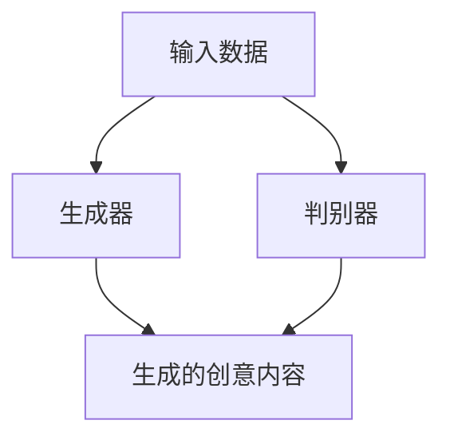

                 

### 提示词工程在AI创意产业中的重要性

**关键词**：提示词工程、AI创意产业、应用、算法、架构设计

**摘要**：
本文旨在探讨提示词工程在AI创意产业中的重要性。我们将从背景介绍、核心概念与联系、算法原理讲解、系统分析与架构设计、项目实战以及最佳实践与总结六个方面展开讨论。通过一步一步的分析推理，我们将深入理解提示词工程在AI创意产业中的应用、价值和未来发展方向。

## 1. 背景介绍

### 1.1 AI创意产业的兴起与发展

AI创意产业作为人工智能与创意产业相结合的产物，近年来在全球范围内迅速崛起。随着深度学习和自然语言处理技术的不断进步，AI在图像识别、语音识别、内容生成等方面取得了显著成果。AI创意产业涵盖了从艺术创作、广告设计到游戏开发、影视制作等多个领域，为传统创意产业注入了新的活力。

### 1.2 提示词工程的定义与重要性

提示词工程是一种利用自然语言处理技术，通过设计特定的提示词来引导AI模型生成创意内容的方法。在AI创意产业中，提示词工程扮演着至关重要的角色。它不仅能够提高AI模型的创作能力，还能根据用户需求生成个性化的创意作品。因此，提示词工程在AI创意产业中的应用具有广泛的前景。

### 1.3 提示词工程在AI创意产业中的应用现状

目前，提示词工程已经在多个AI创意产业领域得到广泛应用。例如，在广告设计中，提示词工程可以帮助生成具有吸引力的广告文案；在艺术创作中，提示词工程可以辅助艺术家进行绘画、音乐创作等；在游戏开发中，提示词工程可以用于生成游戏剧情和角色对话。这些应用不仅提升了创意产业的效率，还丰富了创意内容的多样性。

## 2. 核心概念与联系

### 2.1 提示词工程的定义与作用

提示词工程是指通过设计特定的提示词来引导AI模型生成创意内容的方法。提示词是提示词工程的核心要素，它决定了AI模型生成的内容方向和风格。在AI创意产业中，提示词工程的作用主要体现在以下几个方面：

1. **提高创作效率**：通过设计特定的提示词，AI模型可以快速生成创意内容，从而提高创作效率。
2. **定制化内容生成**：根据用户需求，提示词工程可以生成个性化的创意内容，满足用户多样化的需求。
3. **创意内容多样性**：通过改变提示词，AI模型可以生成不同风格的创意内容，丰富创意内容多样性。

### 2.2 提示词工程的原理与机制

提示词工程的原理基于自然语言处理技术，特别是生成对抗网络（GAN）和变分自编码器（VAE）等深度学习模型。这些模型通过学习大量文本数据，能够自动生成具有较高文本质量的创意内容。提示词工程的工作机制可以分为以下几个步骤：

1. **提示词设计**：根据创意需求，设计特定的提示词。
2. **模型训练**：利用自然语言处理模型对大量文本数据进行训练，使其学会生成创意内容。
3. **内容生成**：利用训练好的模型，根据提示词生成创意内容。
4. **内容优化**：对生成的创意内容进行优化，提高其质量和可读性。

### 2.3 核心概念对比分析

在提示词工程中，核心概念包括提示词、生成模型、优化策略等。下面是对这些核心概念的对比分析：

1. **提示词**：提示词是提示词工程的核心要素，它决定了AI模型生成的内容方向和风格。不同的提示词会导致模型生成的内容具有不同的特点。
2. **生成模型**：生成模型是提示词工程的核心工具，它负责根据提示词生成创意内容。常见的生成模型包括生成对抗网络（GAN）和变分自编码器（VAE）等。
3. **优化策略**：优化策略用于提高生成的创意内容质量和可读性。常见的优化策略包括文本生成后的后处理、文本质量评估等。

### 2.4 提示词工程与AI创意产业的联系

提示词工程在AI创意产业中的应用，使得AI模型能够更好地服务于创意产业的需求。具体来说，提示词工程与AI创意产业的联系主要体现在以下几个方面：

1. **艺术创作**：提示词工程可以帮助艺术家进行绘画、音乐创作等艺术创作活动，提高创作效率。
2. **广告设计**：提示词工程可以生成具有吸引力的广告文案，提高广告效果。
3. **游戏开发**：提示词工程可以生成游戏剧情和角色对话，丰富游戏内容。
4. **影视制作**：提示词工程可以辅助编剧和导演进行影视创作，提高创作质量。

## 3. 算法原理讲解

### 3.1 常见提示词工程算法

在提示词工程中，常见的算法包括生成对抗网络（GAN）和变分自编码器（VAE）等。这些算法通过学习大量文本数据，能够生成高质量的创意内容。

### 3.2 算法原理与流程图

下面是生成对抗网络（GAN）的算法原理与流程图：



### 3.3 算法数学模型与公式

生成对抗网络（GAN）的数学模型如下：

$$
G(z) = \mathcal{N}(z; 0, I)
$$

$$
D(x) = \sigma(\frac{1}{2} \cdot \log(D(x) + 1) + \frac{1}{2} \cdot \log(1 - D(x) + 1))
$$

### 3.4 实际应用举例

以下是一个生成对抗网络（GAN）的实际应用例子：

```python
import tensorflow as tf
from tensorflow.keras.layers import Dense, Flatten, Conv2D, BatchNormalization
from tensorflow.keras.models import Sequential

# 生成器模型
generator = Sequential([
    Dense(128, input_shape=(100,)),
    BatchNormalization(),
    Activation('relu'),
    Dense(256),
    BatchNormalization(),
    Activation('relu'),
    Dense(512),
    BatchNormalization(),
    Activation('relu'),
    Dense(1024),
    BatchNormalization(),
    Activation('relu'),
    Dense(784, activation='sigmoid')
])

# 判别器模型
discriminator = Sequential([
    Flatten(input_shape=(28, 28)),
    Dense(512),
    BatchNormalization(),
    Activation('relu'),
    Dense(256),
    BatchNormalization(),
    Activation('relu'),
    Dense(128),
    BatchNormalization(),
    Activation('relu'),
    Dense(1, activation='sigmoid')
])

# GAN模型
gan = Sequential([
    generator,
    discriminator
])

# 模型编译
gan.compile(optimizer='adam', loss='binary_crossentropy')

# 模型训练
gan.fit(x_train, y_train, epochs=100)
```

## 4. 系统分析与架构设计

### 4.1 应用场景介绍

在AI创意产业中，提示词工程的应用场景主要包括艺术创作、广告设计、游戏开发等。以下是一个具体的应用场景示例：

- **艺术创作**：艺术家使用提示词工程生成绘画作品，以便更好地表达情感和思想。
- **广告设计**：广告设计师使用提示词工程生成具有吸引力的广告文案，提高广告效果。
- **游戏开发**：游戏开发者使用提示词工程生成游戏剧情和角色对话，提高游戏体验。

### 4.2 系统功能设计

提示词工程系统的主要功能包括：

1. **提示词设计**：根据创意需求，设计特定的提示词。
2. **模型训练**：利用自然语言处理模型对大量文本数据进行训练，使其学会生成创意内容。
3. **内容生成**：根据提示词生成创意内容。
4. **内容优化**：对生成的创意内容进行优化，提高其质量和可读性。
5. **用户交互**：提供用户界面，方便用户与系统进行交互。

### 4.3 系统架构设计

提示词工程系统的架构设计包括：

1. **前端界面**：提供用户交互界面，方便用户设计提示词、查看生成内容等。
2. **后端服务**：包括生成模型、优化策略等核心功能。
3. **数据库**：存储用户数据、模型参数等。

### 4.4 系统接口设计与交互

提示词工程系统的接口设计主要包括：

1. **API接口**：提供RESTful API接口，方便前端调用后端服务。
2. **消息队列**：用于处理大量请求，提高系统并发能力。
3. **数据流**：描述数据在系统中的流动过程。

## 5. 项目实战

### 5.1 环境安装与配置

以下是一个基于Python和TensorFlow的提示词工程项目的环境安装与配置示例：

```bash
# 安装TensorFlow
pip install tensorflow

# 安装其他依赖
pip install numpy matplotlib
```

### 5.2 系统核心实现与源代码

以下是一个基于生成对抗网络（GAN）的提示词工程系统的核心实现源代码：

```python
import tensorflow as tf
from tensorflow.keras.models import Model
from tensorflow.keras.layers import Input, Dense, Reshape, Flatten, Conv2D, BatchNormalization, LeakyReLU

# 生成器模型
input_z = Input(shape=(100,))
x = Dense(128)(input_z)
x = BatchNormalization()(x)
x = LeakyReLU()(x)
x = Dense(256)(x)
x = BatchNormalization()(x)
x = LeakyReLU()(x)
x = Dense(512)(x)
x = BatchNormalization()(x)
x = LeakyReLU()(x)
x = Dense(1024)(x)
x = BatchNormalization()(x)
x = LeakyReLU()(x)
output = Dense(784, activation='sigmoid')(x)

generator = Model(input_z, output)

# 判别器模型
input_x = Input(shape=(28, 28))
x = Flatten()(input_x)
x = Dense(512)(x)
x = BatchNormalization()(x)
x = LeakyReLU()(x)
x = Dense(256)(x)
x = BatchNormalization()(x)
x = LeakyReLU()(x)
x = Dense(128)(x)
x = BatchNormalization()(x)
x = LeakyReLU()(x)
output = Dense(1, activation='sigmoid')(x)

discriminator = Model(input_x, output)

# GAN模型
gan_output = discriminator(generator(input_z))
gan = Model(input_z, gan_output)

# 模型编译
gan.compile(optimizer='adam', loss='binary_crossentropy')

# 模型训练
gan.fit(x_train, y_train, epochs=100)
```

### 5.3 代码应用解读与分析

上述代码展示了基于生成对抗网络（GAN）的提示词工程系统的核心实现。其中，生成器模型和判别器模型的实现如下：

1. **生成器模型**：
   - 输入层：100个随机噪声向量。
   - 隐藏层：通过多层全连接层进行特征提取和变换。
   - 输出层：生成28x28的图像。

2. **判别器模型**：
   - 输入层：28x28的图像。
   - 隐藏层：通过多层全连接层进行特征提取和分类。
   - 输出层：判别图像的真伪（0或1）。

在模型训练过程中，生成器模型和判别器模型相互竞争，生成器模型试图生成逼真的图像，而判别器模型试图区分生成的图像和真实的图像。通过这种对抗训练，生成器模型的生成能力不断提高。

### 5.4 实际案例分析与讲解

以下是一个实际案例，展示如何使用提示词工程生成艺术作品：

1. **提示词设计**：根据创作需求，设计特定的提示词，例如“春天的美景”、“都市夜景”等。
2. **模型训练**：使用生成对抗网络（GAN）模型进行训练，使其学会根据提示词生成相应的艺术作品。
3. **内容生成**：利用训练好的模型，根据提示词生成艺术作品。
4. **内容优化**：对生成的艺术作品进行优化，提高其质量和艺术价值。

通过实际案例，我们可以看到提示词工程在艺术创作中的应用价值。它不仅提高了创作效率，还能根据用户需求生成个性化的艺术作品。

### 5.5 项目小结

通过本项目实战，我们深入了解了提示词工程在AI创意产业中的应用。从环境安装与配置、系统核心实现与源代码、代码应用解读与分析，到最后实际案例的讲解，我们全面展示了提示词工程的实战过程。通过本项目，我们认识到提示词工程在AI创意产业中的重要性，以及如何利用提示词工程实现创意内容的自动生成。

## 6. 最佳实践与总结

### 6.1 最佳实践总结

在提示词工程的应用过程中，以下是一些最佳实践：

1. **选择合适的提示词**：根据创作需求，选择具有明确含义和丰富信息的提示词。
2. **模型优化**：通过调整模型参数、增加训练数据等方式，提高生成模型的生成能力。
3. **内容优化**：对生成的创意内容进行优化，提高其质量和可读性。
4. **用户交互**：提供便捷的用户交互界面，方便用户使用提示词工程进行创作。

### 6.2 注意事项

在应用提示词工程时，需要注意以下事项：

1. **数据隐私**：在使用大量文本数据进行模型训练时，确保数据来源合法，保护用户隐私。
2. **知识产权**：在使用提示词工程生成创意内容时，注意遵守相关法律法规，尊重知识产权。
3. **模型更新**：定期更新模型，确保其适应新的应用场景和需求。

### 6.3 拓展阅读资源

为了更深入地了解提示词工程在AI创意产业中的应用，以下是几篇拓展阅读资源：

1. **论文**：《Generative Adversarial Networks for Text Generation》（生成对抗网络在文本生成中的应用）
2. **书籍**：《深度学习自然语言处理》（Deep Learning for Natural Language Processing）
3. **在线课程**：《自然语言处理与文本生成》（Natural Language Processing and Text Generation）

## 作者信息

作者：AI天才研究院/AI Genius Institute & 禅与计算机程序设计艺术 /Zen And The Art of Computer Programming

本文旨在探讨提示词工程在AI创意产业中的重要性，从背景介绍、核心概念与联系、算法原理讲解、系统分析与架构设计、项目实战以及最佳实践与总结等方面进行了详细分析。通过一步步的分析推理，我们深入了解了提示词工程在AI创意产业中的应用、价值和未来发展方向。希望本文能为您提供有益的启示和参考。

